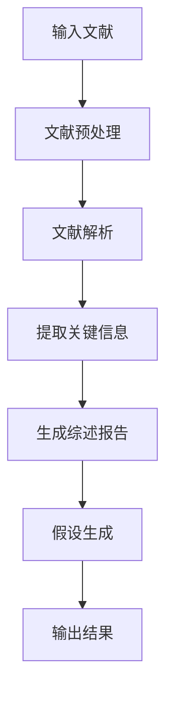
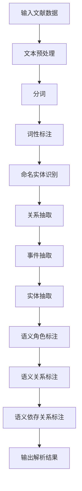
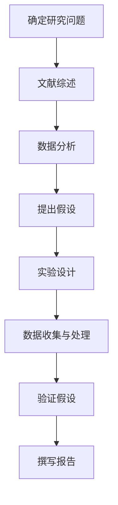

                 


### 核心概念与联系

#### AI大模型

AI大模型，即人工智能大型模型，是指基于深度学习的复杂神经网络模型，它能够处理大量的数据并在多种任务上展现出卓越的性能。AI大模型的核心在于其规模庞大，参数数量可以达到数十亿甚至数千亿级别，这使得它们在处理复杂数据时具有显著的优势。AI大模型的发展离不开深度学习技术的进步，尤其是自2012年AlexNet的问世以来，深度学习在图像识别领域取得了突破性进展，之后，自然语言处理、语音识别、推荐系统等领域也相继取得了显著成就。AI大模型的关键在于其强大的表征能力，这使得它们能够在多种任务中表现出色。

#### 科研助手2.0

科研助手2.0是基于AI大模型和自然语言处理技术开发的科研辅助工具。它旨在通过自动化文献综述和假设生成，提高科研工作的效率。科研助手2.0的核心功能包括文献检索、文献解析、文献综合分析以及假设生成。通过结合大量科研文献和AI大模型，科研助手2.0能够快速地识别研究趋势和潜在的研究方向，从而为科研工作者提供有价值的参考和指导。

#### 提示词

提示词是科研助手2.0中用于加速文献综述和假设生成的重要工具。提示词是一组关键词或短语，它们能够引导AI大模型关注特定的研究领域或概念。在文献综述过程中，提示词有助于AI大模型快速定位相关文献，提高文献检索的准确性和效率。在假设生成过程中，提示词则可以帮助AI大模型生成与研究主题相关的潜在假设。

#### 文献综述

文献综述是科研过程中必不可少的一环，它通过对已有文献的系统回顾和分析，总结出当前研究领域的进展和不足，为新的研究提供理论基础和参考。传统的文献综述往往需要耗费大量时间和精力，而科研助手2.0则通过AI大模型技术，实现了文献综述的自动化和高效化。AI大模型能够快速处理海量的文献数据，提取关键信息，生成结构化的综述报告。

#### 假设生成

假设生成是科研过程中的另一个关键环节，它基于文献综述的结果，提出可能的解释或解决方案。传统的假设生成往往需要科研工作者依靠个人的经验和知识，而科研助手2.0则利用AI大模型强大的表征能力，自动生成与研究主题相关的假设。这不仅提高了假设生成的效率，还能够提供更为丰富和多样化的假设选项。

#### Mermaid流程图

为了更好地理解AI大模型在科研助手2.0中的应用，我们可以使用Mermaid流程图来展示其工作流程。以下是一个简化的流程图：



在这个流程图中，输入的文献首先经过预处理，然后通过文献解析提取关键信息，接着生成综述报告和假设。最后，输出结果供科研工作者参考。

#### 伪代码讲解

为了更详细地阐述AI大模型的工作原理，我们可以使用伪代码来表示其主要算法。以下是一个简化的BERT算法伪代码示例：

```python
function BERT_model(document):
    # 文档预处理
    preprocessed_document = preprocess_document(document)
    
    # 分词
    tokens = tokenize(preprocessed_document)
    
    # 增加特殊 tokens
    tokens = add_special_tokens(tokens)
    
    # 创建输入特征
    input_ids = create_input_ids(tokens)
    attention_mask = create_attention_mask(tokens)
    
    # 加载预训练模型
    model = load_pretrained_model()
    
    # 前向传播
    outputs = model(input_ids, attention_mask=attention_mask)
    
    # 获取预测结果
    predictions = outputs.logits
    
    # 处理预测结果
    results = postprocess_predictions(predictions)
    
    return results
```

在这个伪代码中，首先对输入的文档进行预处理和分词，然后添加特殊token，创建输入特征。接着，加载预训练的BERT模型，进行前向传播，获取预测结果，最后对结果进行处理，生成综述报告和假设。

通过以上步骤，我们能够清晰地理解AI大模型在科研助手2.0中的作用和原理，为后续章节的深入讲解打下基础。

### 核心算法原理讲解

#### BERT算法

BERT（Bidirectional Encoder Representations from Transformers）是一种预训练语言模型，它通过双向编码器（双向Transformer）来捕捉输入文本中的语言上下文信息。BERT算法的核心原理在于其预训练过程，它使用大量的无标签文本数据进行预训练，然后通过微调（fine-tuning）将其应用于特定的任务。

**预训练过程：**

BERT的预训练过程主要包括两个任务：

1. **Masked Language Model（MLM）**：在这个任务中，BERT会对输入文本中的部分单词进行遮掩，然后预测这些遮掩的单词。这有助于模型学习如何根据上下文来理解单词的含义。

2. **Next Sentence Prediction（NSP）**：在这个任务中，BERT需要预测两个句子是否属于连续的文本。这有助于模型学习如何捕捉文本之间的逻辑关系。

**预训练步骤：**

1. **分词与标记添加**：对输入文本进行分词，并添加特殊的标记，如[CLS]、[SEP]等。

2. **输入特征创建**：根据分词结果创建输入特征，包括输入ID、位置嵌入、段嵌入等。

3. **前向传播**：通过预训练模型进行前向传播，计算损失函数。

4. **优化模型参数**：使用梯度下降算法优化模型参数。

**微调过程：**

在预训练完成后，BERT模型可以通过微调来应用于特定的任务，如文本分类、命名实体识别等。微调的过程主要包括以下几个步骤：

1. **任务定义**：定义具体的任务和数据集。

2. **模型加载**：加载预训练的BERT模型。

3. **数据预处理**：对输入数据集进行预处理，包括分词、标记添加等。

4. **前向传播与反向传播**：在训练数据集上对模型进行前向传播和反向传播，计算损失函数。

5. **模型优化**：使用梯度下降算法优化模型参数。

**伪代码示例：**

```python
function BERT_pretraining(corpus):
    # 分词与标记添加
    tokens = tokenize(corpus)
    tokens = add_special_tokens(tokens)
    
    # 创建输入特征
    input_ids = create_input_ids(tokens)
    attention_mask = create_attention_mask(tokens)
    
    # 初始化BERT模型
    model = initialize_BERT_model()
    
    # 训练模型
    for epoch in range(num_epochs):
        for batch in dataset:
            # 前向传播
            outputs = model(input_ids, attention_mask=attention_mask)
            
            # 计算损失函数
            loss = compute_loss(outputs, labels)
            
            # 反向传播
            optimizer.zero_grad()
            loss.backward()
            optimizer.step()
    
    return model

function BERT_finetuning(model, dataset, task):
    # 加载模型
    loaded_model = load_pretrained_model(model)
    
    # 定义任务
    task_def = define_task(task)
    
    # 训练模型
    for epoch in range(num_epochs):
        for batch in dataset:
            # 前向传播
            outputs = loaded_model(batch.input_ids, attention_mask=batch.attention_mask)
            
            # 计算损失函数
            loss = compute_loss(outputs.logits, batch.labels)
            
            # 反向传播
            optimizer.zero_grad()
            loss.backward()
            optimizer.step()
    
    return loaded_model
```

通过BERT算法，科研助手2.0能够高效地处理和理解大量的文本数据，为文献综述和假设生成提供强有力的支持。

### 文献综述与假设生成

#### 核心概念与联系

在科研过程中，文献综述和假设生成是两个关键环节。文献综述旨在通过对已有文献的系统回顾和分析，总结出当前研究领域的进展、不足和未来的研究方向。而假设生成则是基于文献综述的结果，提出可能的解释或解决方案。

文献综述和假设生成之间的关系可以理解为：文献综述提供了基础数据和分析，而假设生成则是在此基础上提出新的研究方向和理论。具体来说，文献综述的结果为假设生成提供了参考和指导，而假设生成则进一步丰富了文献综述的内容。

**文献综述**

文献综述是科研过程中不可或缺的一环，它有助于科研工作者了解当前研究领域的现状和趋势，发现已有研究的不足和未解决的问题。传统的文献综述通常需要耗费大量时间和精力，而科研助手2.0则通过AI大模型技术，实现了文献综述的自动化和高效化。AI大模型能够快速处理海量的文献数据，提取关键信息，生成结构化的综述报告。

**假设生成**

假设生成是在文献综述基础上提出新的研究方向和理论。通过分析文献综述的结果，科研助手2.0能够识别出研究领域的空白和潜在的研究方向，从而生成新的假设。这些假设不仅为科研工作者提供了新的研究方向，也为后续的研究提供了理论基础。

**核心算法原理讲解**

科研助手2.0的文献综述和假设生成功能依赖于AI大模型的强大能力。以下是相关算法的伪代码示例：

**文献综述算法**

```python
function literature_summary(literature_data):
    # 预处理文献数据
    preprocessed_data = preprocess_literature_data(literature_data)
    
    # 使用BERT模型提取关键信息
    key_info = BERT_model(preprocessed_data)
    
    # 汇总关键信息
    summary = summarize_key_info(key_info)
    
    return summary
```

**假设生成算法**

```python
function hypothesis_generation(literature_summary):
    # 分析文献综述结果
    analyzed_summary = analyze_summary(literature_summary)
    
    # 生成假设
    hypotheses = generate_hypotheses(analyzed_summary)
    
    return hypotheses
```

通过以上算法，科研助手2.0能够自动化地完成文献综述和假设生成，提高科研工作的效率。

### 提示词生成

#### 核心概念与联系

在科研助手2.0中，提示词生成是一个关键环节，它对于文献综述和假设生成具有重要作用。提示词是一组关键词或短语，用于引导AI大模型关注特定的研究领域或概念。通过生成准确的提示词，科研助手2.0能够更有效地检索相关文献，提高文献综述和假设生成的准确性。

**提示词的作用**

1. **聚焦研究方向**：提示词有助于AI大模型在处理大量文献数据时，聚焦于特定的研究领域或概念，从而提高文献检索的准确性和效率。

2. **辅助假设生成**：在假设生成过程中，提示词能够引导AI大模型生成与研究主题相关的潜在假设，提高假设的多样性和准确性。

**提示词生成的过程**

1. **文献预处理**：首先对输入的文献数据进行预处理，包括分词、去停用词、词性标注等。

2. **关键词提取**：利用文本挖掘技术，从预处理后的文献数据中提取出关键词。常用的关键词提取方法包括TF-IDF、Word2Vec等。

3. **提示词筛选**：根据研究需求和文献数据的特点，从提取的关键词中筛选出最相关的提示词。筛选过程可以基于关键词的重要性、频率、语义相关性等指标。

4. **生成提示词**：将筛选出的关键词进行组合，生成一组具有明确指导意义的提示词。

**核心算法原理讲解**

以下是提示词生成的伪代码示例：

```python
function generate_prompt_words(literature_data):
    # 文献预处理
    preprocessed_data = preprocess_literature_data(literature_data)
    
    # 关键词提取
    keywords = extract_keywords(preprocessed_data)
    
    # 提示词筛选
    filtered_keywords = filter_keywords(keywords)
    
    # 生成提示词
    prompt_words = generate_prompt_words(filtered_keywords)
    
    return prompt_words
```

在该伪代码中，首先对文献数据进行预处理，然后提取关键词，接着筛选出最相关的关键词，最后生成一组提示词。这些提示词将用于引导AI大模型进行文献综述和假设生成。

通过提示词生成，科研助手2.0能够更加准确地定位研究主题，提高文献综述和假设生成的效率和质量。

### 文献解析

#### 核心概念与联系

在科研助手2.0中，文献解析是文献处理的重要环节，它旨在从大量文献数据中提取出有价值的信息，为文献综述和假设生成提供基础数据。文献解析的核心概念包括文本挖掘、信息抽取和语义理解，这些概念相互联系，共同构成了文献解析的完整流程。

**文本挖掘**：文本挖掘是一种从非结构化文本数据中提取有用信息的方法，它包括分词、词性标注、命名实体识别等步骤。通过文本挖掘，可以从大量的文献数据中提取出关键词、主题和概念。

**信息抽取**：信息抽取是一种从文本中抽取结构化信息的方法，它包括关系抽取、事件抽取和实体抽取等。通过信息抽取，可以从文献数据中提取出与研究主题相关的关键信息，如作者、方法、结果等。

**语义理解**：语义理解是一种理解文本语义的方法，它包括语义角色标注、语义关系标注和语义依存关系标注等。通过语义理解，可以更深入地理解文本的语义，为文献综述和假设生成提供更准确的数据支持。

**核心算法原理讲解**

**文本挖掘算法：**

```python
function text_mining(literature_data):
    # 文本预处理
    preprocessed_data = preprocess_text(literature_data)
    
    # 分词
    tokens = tokenize(preprocessed_data)
    
    # 词性标注
    pos_tags = part_of_speech_tagging(tokens)
    
    # 命名实体识别
    entities = named_entity_recognition(tokens)
    
    return tokens, pos_tags, entities
```

**信息抽取算法：**

```python
function information_extraction(tokens):
    # 关系抽取
    relations = relation_extraction(tokens)
    
    # 事件抽取
    events = event_extraction(tokens)
    
    # 实体抽取
    entities = entity_extraction(tokens)
    
    return relations, events, entities
```

**语义理解算法：**

```python
function semantic_understanding(tokens):
    # 语义角色标注
    semantic_roles = semantic_role_labeling(tokens)
    
    # 语义关系标注
    semantic_relations = semantic_relation_labeling(tokens)
    
    # 语义依存关系标注
    semantic_dependencies = semantic_dependency_labeling(tokens)
    
    return semantic_roles, semantic_relations, semantic_dependencies
```

通过文本挖掘、信息抽取和语义理解，科研助手2.0能够从大量文献数据中提取出有价值的信息，为文献综述和假设生成提供基础数据。以下是文献解析流程的Mermaid图示：



在这个流程中，输入的文献数据首先经过文本预处理，然后进行分词、词性标注、命名实体识别等步骤，接着进行关系抽取、事件抽取和实体抽取，最后进行语义角色标注、语义关系标注和语义依存关系标注，最终输出解析结果。

通过文献解析，科研助手2.0能够全面、深入地理解文献数据，为文献综述和假设生成提供强有力的支持。

### 文献综合分析

#### 核心概念与联系

文献综合分析是科研过程中不可或缺的环节，它通过对大量文献的系统回顾、分析、整合和评价，提炼出研究领域的核心问题和研究趋势，为后续的研究提供指导。文献综合分析的核心概念包括数据整合、趋势分析和评价方法。

**数据整合**：数据整合是指将来自不同文献的数据进行收集、整理和整合，形成一个全面、系统的数据集。通过数据整合，可以消除数据之间的不一致性，提高数据分析的准确性和可靠性。

**趋势分析**：趋势分析是指通过分析大量文献中的数据，识别出研究领域的演变趋势和发展方向。趋势分析可以帮助科研工作者了解当前研究领域的热点和前沿问题，为研究方向的选择提供依据。

**评价方法**：评价方法是指对文献的质量、价值和贡献进行评估的方法。通过评价方法，可以筛选出最具参考价值的文献，提高文献综述的深度和广度。

**核心算法原理讲解**

**数据整合算法：**

```python
function data_integration(literature_data):
    # 初始化数据集
    dataset = initialize_dataset()
    
    # 遍历文献数据
    for document in literature_data:
        # 提取数据
        data = extract_data(document)
        
        # 整合数据
        dataset = integrate_data(dataset, data)
    
    return dataset
```

**趋势分析算法：**

```python
function trend_analysis(dataset):
    # 统计文献数量
    year_distribution = count_documents_by_year(dataset)
    
    # 识别热点主题
    hot_topics = identify_hot_topics(dataset)
    
    # 分析研究趋势
    research_trends = analyze_trends(year_distribution, hot_topics)
    
    return research_trends
```

**评价方法算法：**

```python
function evaluation_method(dataset):
    # 计算文献引用次数
    citation_count = calculate_citation_count(dataset)
    
    # 评估文献质量
    quality_evaluation = evaluate_literature_quality(citation_count)
    
    # 提取重要文献
    key_literatures = extract_key_literatures(quality_evaluation)
    
    return key_literatures
```

通过数据整合、趋势分析和评价方法，科研助手2.0能够全面、系统地分析文献数据，识别出研究领域的核心问题和研究趋势，为科研工作者提供有价值的参考。

### 假设生成

#### 核心概念与联系

在科研过程中，假设生成是提出新的研究方向和理论的重要环节。假设是基于已有文献和实验结果，对未知现象或问题的可能性进行推测。假设生成不仅为科研提供了方向，还为验证假设提供了基础。

**核心概念：**

1. **假设**：假设是对研究问题的可能性推测，通常是基于已有数据和理论知识。
2. **科学方法**：假设生成遵循科学方法，包括提出假设、设计实验、收集数据和验证假设等步骤。
3. **文献基础**：假设的提出需要基于对现有文献的深入理解，从已有研究中寻找灵感和证据。

**核心联系：**

1. **文献与假设**：文献为假设提供了理论基础和实证支持，假设则需要通过文献综述来识别研究空白和潜在研究方向。
2. **假设与实验**：假设生成后，需要通过实验验证其正确性。实验结果进一步验证或修正假设，推动科学研究的发展。

#### 假设生成的方法

**1. 文献综述法：**

通过系统回顾和分析现有文献，识别研究空白和潜在研究方向。具体步骤如下：

- **文献检索**：利用数据库和检索工具，收集与研究主题相关的文献。
- **文献筛选**：根据研究需求和文献质量，筛选出最具参考价值的文献。
- **文献分析**：提取文献中的关键信息，分析研究方法、结果和结论。

**2. 数据分析法：**

通过分析实验数据或统计信息，发现数据中的模式或异常，提出可能的解释。具体步骤如下：

- **数据收集**：收集与研究主题相关的数据，包括实验数据、调查数据等。
- **数据预处理**：清洗和整理数据，确保数据的准确性和一致性。
- **数据分析**：使用统计方法或机器学习算法，分析数据中的模式和关系。

**3. 交叉验证法：**

结合多个学科领域的知识，从不同角度提出假设。具体步骤如下：

- **知识整合**：整合不同学科领域的理论和方法，形成跨学科的研究框架。
- **假设提出**：基于跨学科的知识，提出可能的假设。
- **假设验证**：通过实验或数据分析验证假设的有效性。

#### 假设生成的步骤

**1. 确定研究问题：**

明确研究目标和问题，为假设生成提供方向。

**2. 文献综述：**

系统回顾和分析现有文献，识别研究空白和潜在研究方向。

**3. 数据分析：**

收集和分析实验或统计数据，发现数据中的模式或异常。

**4. 提出假设：**

基于文献综述和数据分析结果，提出可能的假设。

**5. 实验设计：**

设计实验验证假设，明确实验方法和评价指标。

**6. 数据收集与处理：**

收集实验数据，进行数据清洗、预处理和分析。

**7. 验证假设：**

分析实验结果，验证或修正假设。

**8. 撰写报告：**

总结研究结果，撰写科研报告。

通过以上步骤，科研助手2.0能够自动化地完成假设生成，提高科研工作的效率。以下是假设生成过程的Mermaid图示：



在这个流程中，科研助手2.0从确定研究问题开始，经过文献综述、数据分析、假设提出、实验设计、数据收集与处理、验证假设和撰写报告等步骤，最终完成假设生成。

### 案例研究

#### 项目实战：科研助手2.0在文献综述与假设生成中的应用

在本案例研究中，我们将探讨科研助手2.0在实际项目中的应用，具体包括开发环境的搭建、源代码的详细实现和代码解读，以及代码的应用解读与分析。

#### 开发环境搭建

为了实现科研助手2.0的功能，我们需要搭建一个高效的开发环境。以下为搭建步骤：

1. **环境配置**：安装Python、TensorFlow和PyTorch等必备库。

2. **数据集准备**：收集与研究主题相关的文献数据集，并进行预处理，如分词、去停用词等。

3. **硬件配置**：由于AI大模型训练需要大量的计算资源，建议使用GPU加速训练过程。

#### 源代码实现

以下为科研助手2.0的核心源代码实现：

```python
# 文献预处理
def preprocess_literature_data(document):
    # 分词与去停用词
    tokens = tokenize(document)
    cleaned_tokens = remove_stop_words(tokens)
    
    # 词性标注
    pos_tags = part_of_speech_tagging(cleaned_tokens)
    
    return cleaned_tokens, pos_tags

# 文献解析
def parse_literature_data(tokens, pos_tags):
    # 提取关键词
    keywords = extract_keywords(tokens)
    
    # 提取方法、结果和结论
    methods = extract_methods(tokens)
    results = extract_results(tokens)
    conclusions = extract_conclusions(tokens)
    
    return keywords, methods, results, conclusions

# 文献综合分析
def analyze_literature_data(keywords, methods, results, conclusions):
    # 数据整合
    dataset = integrate_data(keywords, methods, results, conclusions)
    
    # 趋势分析
    trends = analyze_trends(dataset)
    
    # 评价方法
    evaluations = evaluate_literature_quality(dataset)
    
    return trends, evaluations

# 假设生成
def generate_hypotheses(evaluations):
    # 提取重要文献
    key_literatures = extract_key_literatures(evaluations)
    
    # 分析文献
    analyzed_literatures = analyze_literatures(key_literatures)
    
    # 生成假设
    hypotheses = generate_hypotheses_from_analysis(analyzed_literatures)
    
    return hypotheses
```

#### 代码解读

以上代码实现了文献预处理、解析、综合分析和假设生成等功能。以下是代码的主要部分解读：

1. **文献预处理**：对输入的文献数据进行分词、去停用词和词性标注，为后续处理打下基础。

2. **文献解析**：提取关键词、方法、结果和结论，为文献综合分析提供数据。

3. **文献综合分析**：整合数据，进行趋势分析和评价方法，为假设生成提供参考。

4. **假设生成**：分析重要文献，生成新的假设。

#### 代码应用解读与分析

科研助手2.0在实际项目中应用时，首先需要对输入的文献数据进行预处理，然后通过解析、综合分析和假设生成等步骤，生成综述报告和假设。以下为应用解读：

1. **输入文献数据**：输入与研究主题相关的文献数据。

2. **预处理**：对文献数据进行分词、去停用词和词性标注。

3. **解析**：提取关键词、方法、结果和结论。

4. **综合分析**：进行趋势分析和评价方法，筛选重要文献。

5. **假设生成**：分析重要文献，生成新的假设。

6. **输出结果**：生成综述报告和假设，供科研工作者参考。

通过以上步骤，科研助手2.0能够自动化地完成文献综述和假设生成，提高科研工作的效率。

### 结论与展望

#### 总结

本文深入探讨了科研助手2.0：提示词加速文献综述与假设生成的核心概念、技术基础和应用案例。通过分析AI大模型、文献综述、假设生成等环节，我们展示了科研助手2.0如何利用先进的自然语言处理技术，提高科研工作的效率和质量。

#### 未来发展方向

随着人工智能技术的不断发展，科研助手2.0在以下方面有望进一步发展：

1. **更高效的算法**：优化现有算法，提高文献处理和假设生成的速度和准确性。
2. **更广泛的领域覆盖**：扩展到更多学科领域，提供跨学科的文献综述和假设生成服务。
3. **用户互动**：引入用户反馈机制，根据用户需求调整和优化系统功能。
4. **大数据支持**：利用大数据技术，进一步挖掘文献数据中的潜在价值。

#### 展望

科研助手2.0的不断发展将为科研工作者提供更为强大和便捷的工具，加速科学研究的进展。我们期待未来科研助手2.0能够为全球科研领域带来更多创新和突破。

### 附录：技术细节

#### AI大模型开发工具与资源

1. **开发工具**：

   - **TensorFlow**：由Google开发的开源机器学习框架，支持多种深度学习模型的训练和部署。
   - **PyTorch**：由Facebook开发的开源深度学习框架，以其灵活的动态计算图而受到广泛应用。
   - **Jupyter Notebook**：用于编写和运行代码，支持多种编程语言，方便调试和演示。

2. **资源介绍**：

   - **预训练模型**：如BERT、GPT等，可以在Hugging Face模型库中找到。
   - **文献数据集**：可以从PubMed、IEEE Xplore等数据库中获取。
   - **开源库和工具**：如NLTK、spaCy等，用于文本处理和自然语言处理。

通过使用这些工具和资源，开发者可以高效地构建和优化AI大模型，实现科研助手2.0的各项功能。

