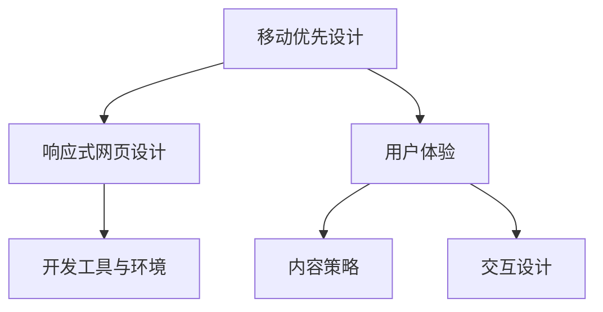
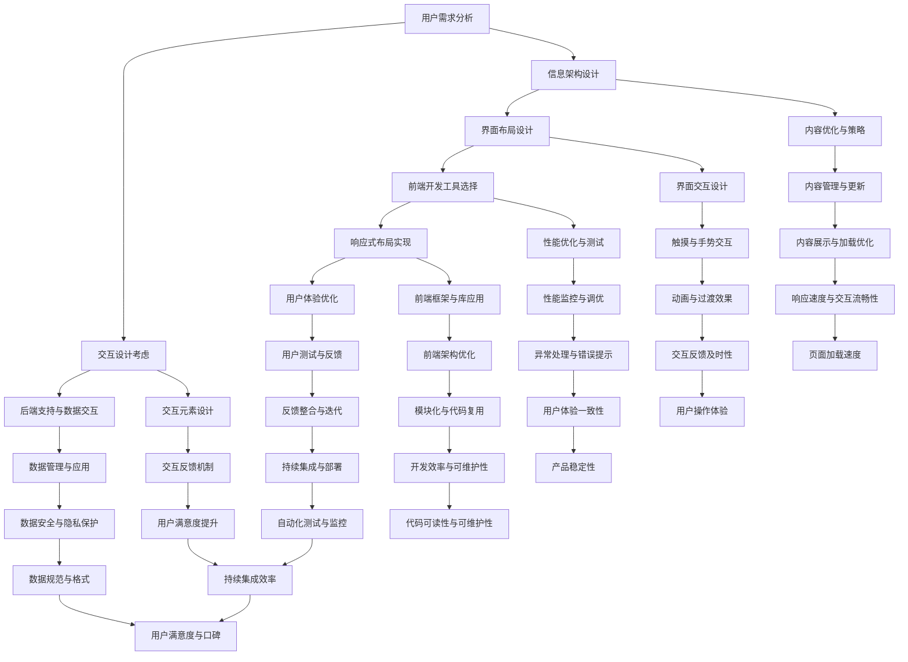

                 

### 1. 设计书籍的总体结构

在着手设计《移动优先设计：响应式网页设计原则》这本书的总体结构时，我们首先要明确这本书的目标读者、主要内容和预期的学习成果。我们的目标读者是网页设计师、前端开发工程师以及关注移动设备用户体验的技术爱好者。这本书的主要目的是帮助他们理解和实践移动优先和响应式网页设计。

为了达到这一目标，我们将书籍分为以下几个主要部分：

- **引言部分**：介绍移动优先设计的背景和重要性，以及响应式网页设计与传统网页设计的区别。
- **基础概念部分**：详细讲解响应式网页设计的基本概念、核心原则和技术。
- **设计原则与方法论部分**：深入探讨移动优先设计的原则和方法，包括设计流程、内容策略和交互设计。
- **实战案例部分**：通过具体案例分析，展示如何将理论应用到实际项目中。
- **开发工具与环境部分**：介绍开发响应式网页所需的工具和环境搭建。
- **总结与拓展部分**：总结全书内容，提供最佳实践和拓展阅读建议。

这样的结构有助于读者循序渐进地学习，从基础知识到实际应用，再到工具和环境配置，逐步掌握移动优先设计的核心要点。此外，每个部分都包含具体的章节和小节，以便读者能够方便地查找和阅读特定的内容。

### 2. 确定核心概念与联系

在确定书籍的核心概念和联系时，我们需要识别出响应式网页设计中的关键要素，并理解它们之间的相互作用。以下是本书中的几个核心概念：

- **移动优先设计**：强调首先为移动设备设计，然后通过适配技术扩展到桌面设备。
- **响应式网页设计**：根据不同设备的特点和用户需求，动态调整网页布局和交互。
- **用户体验**：以用户为中心，关注用户在使用网页时的感受和操作流程。
- **内容策略**：优化网页内容，确保信息清晰、结构合理、加载快速。
- **交互设计**：设计用户与网页的互动方式，包括按钮、滚动、拖动等操作。
- **开发工具与环境**：介绍开发响应式网页所需的工具和环境，如预处理器、框架和构建工具。

这些核心概念之间的关系可以通过以下方式描述：

- **移动优先设计与响应式网页设计**：移动优先设计是响应式网页设计的一个子集，它强调在设计阶段就考虑到移动设备的需求，而响应式网页设计则是一个更广泛的概念，包括移动优先和桌面优先的设计方法。
- **用户体验与内容策略**：用户体验是内容策略的目标，内容策略是实现良好用户体验的基础，包括信息架构、内容优化和加载优化。
- **交互设计与用户体验**：交互设计直接影响用户体验，良好的交互设计能够提高用户的满意度和使用效率。
- **开发工具与环境与响应式网页设计**：开发工具和环境提供了实现响应式网页设计的支持，包括预处理器、框架和构建工具，它们简化了开发流程，提高了开发效率。

为了帮助读者更好地理解这些核心概念之间的联系，我们可以使用Mermaid语言制作一个流程图，如下所示：



这个流程图清晰地展示了各个核心概念之间的逻辑关系，有助于读者在阅读过程中构建整体认知框架。

### 3. 设计章节内容

在确定了《移动优先设计：响应式网页设计原则》这本书的核心概念和总体结构后，我们接下来为每个章节设计具体的内容。以下是每个章节的内容概述：

#### 第1章：移动优先设计的背景与意义
- **1.1 移动设备的普及与趋势**：介绍移动设备的普及趋势，包括智能手机和平板电脑的广泛应用。
- **1.2 移动优先设计的重要性**：探讨为何移动优先设计成为现代网页设计的核心，包括用户行为的变化和商业价值。
- **1.3 响应式网页设计与移动优先设计的关系**：解释响应式网页设计与移动优先设计之间的区别和联系。

#### 第2章：响应式网页设计的基本概念
- **2.1 响应式网页设计的定义**：详细阐述响应式网页设计的概念和目标。
- **2.2 响应式网页设计的核心原则**：介绍响应式网页设计的关键原则，如灵活性、适应性和可持续性。
- **2.3 响应式网页设计的关键技术**：讲解实现响应式网页设计所需的关键技术，包括CSS媒体查询、弹性布局和响应式图片。

#### 第3章：移动优先的设计流程
- **3.1 设计前的准备工作**：讨论如何进行用户研究、需求分析和目标用户定义。
- **3.2 用户研究**：介绍用户研究的具体方法，如问卷调查、用户访谈和A/B测试。
- **3.3 信息架构与页面布局**：讲解如何设计信息架构和页面布局，确保内容清晰、用户易于导航。
- **3.4 响应式网页设计工具**：介绍常用的响应式网页设计工具，如Sketch、Adobe XD和Bootstrap。

#### 第4章：内容策略与用户体验
- **4.1 内容优化**：讨论如何优化网页内容，包括信息组织、内容呈现和加载速度优化。
- **4.2 用户体验设计原则**：介绍用户体验设计的基本原则，如一致性、简洁性和用户导向。
- **4.3 优化页面加载速度**：讲解如何通过优化代码、使用CDN和压缩资源来提高页面加载速度。

#### 第5章：响应式网页设计中的交互设计
- **5.1 交互设计的基本原则**：介绍交互设计的基本原则，如反馈、易用性和可控性。
- **5.2 移动设备的交互特点**：分析移动设备上的交互特点，如触控操作、屏幕尺寸和触摸反馈。
- **5.3 常见的交互元素设计**：讨论常见交互元素的设计，如按钮、输入框和滚动条。

#### 第6章：移动优先设计实战案例
- **6.1 实战案例一：企业官网移动端设计**：分析一个企业官网的移动端设计案例，讨论设计决策和实现细节。
- **6.2 实战案例二：电商移动端页面设计**：分析一个电商平台的移动端页面设计案例，探讨如何优化购物体验。
- **6.3 实战案例三：社交媒体移动端界面设计**：分析一个社交媒体应用的移动端界面设计案例，关注用户互动和内容呈现。

#### 第7章：开发工具与环境搭建
- **7.1 常用响应式网页设计工具**：介绍常用的响应式网页设计工具，如预处理器、框架和构建工具。
- **7.2 开发环境搭建**：讲解如何搭建响应式网页开发的开发环境，包括安装必要的软件和配置开发工具。
- **7.3 框架与库的选择**：介绍如何选择适合的框架和库来简化开发流程和提高开发效率。

通过详细设计每个章节的内容，我们确保了书籍能够系统地介绍移动优先设计和响应式网页设计的各个方面，从理论到实践，帮助读者全面掌握这一领域。

### 4. 制作Mermaid流程图

为了更直观地展示响应式网页设计中的核心概念和架构，我们可以使用Mermaid语言制作一个流程图。Mermaid是一种基于Markdown的图表描述语言，可以轻松地将文本描述转换为图形。以下是《移动优先设计：响应式网页设计原则》中核心概念与架构的Mermaid流程图：



这个流程图详细展示了从用户需求分析到前端开发工具选择、响应式布局实现、用户体验优化、交互设计、后端支持与数据交互、内容优化与策略等各个环节，并标注了每个环节的核心要点和关联关系。通过这个流程图，读者可以更清晰地理解响应式网页设计中的各个关键步骤和它们之间的相互作用。

### 5. 编写伪代码和数学公式

为了更深入地讲解响应式网页设计中的核心算法原理，我们将使用伪代码描述算法流程，并使用LaTeX格式嵌入数学公式进行详细阐述。

#### 核心算法原理伪代码

```python
# 响应式网页设计核心算法原理伪代码

# 初始化页面布局
initialize_layout()

# 根据设备宽度动态调整布局
adjust_layout(width)

# 获取用户输入并处理
get_user_input(input)

# 根据输入更新页面状态
update_state(input)

# 优化页面内容与性能
optimize_content_performance()

# 输出最终布局
output_layout()

# 交互反馈机制
feedback_loop()
```

#### 数学公式及详细讲解

响应式网页设计中的关键指标可以表示为：

$$
\text{用户体验质量} = \frac{\text{页面性能}}{\text{用户满意度}}
$$

这个公式表示用户体验质量（UQ）是页面性能（PP）与用户满意度（US）的比值。其中：

- **页面性能**（PP）涉及页面加载速度、响应时间、图像和内容的优化等因素。
- **用户满意度**（US）则取决于用户的操作流畅性、内容易读性和交互体验。

具体举例说明：

假设我们设计的一个网页的页面性能得分为90分，用户满意度得分为80分，那么用户体验质量可以计算为：

$$
\text{用户体验质量} = \frac{90}{80} = 1.125
$$

这个值表明，虽然页面性能很好，但用户满意度稍低，可能需要进一步优化用户体验，以提高整体的用户体验质量。

#### 数学公式LaTeX格式示例

为了在文章中嵌入数学公式，我们将使用LaTeX格式，其中段落内的公式使用 `$` 符号括起来，独立段落的公式使用 `$$` 符号括起来。

例如：

- 段落内公式：`$1+1=2$`
- 独立段落公式：`$$e^{i\pi} + 1 = 0$$`

通过伪代码和数学公式的结合，我们能够更详细地讲解响应式网页设计中的算法原理，帮助读者更好地理解这一复杂领域的核心概念。

### 6. 设计实战案例

在《移动优先设计：响应式网页设计原则》的实战案例部分，我们将通过具体案例展示如何将移动优先设计和响应式网页设计的理论应用到实际项目中，并提供详细的分析和解读。

#### 实战案例一：企业官网移动端设计

**案例背景**：
某知名企业需要重新设计其官网，以提升移动端用户体验。企业官网的用户群体主要是年轻的商务人士和消费者，他们大多数通过移动设备访问网站。

**目标**：
1. 提升移动端页面加载速度。
2. 优化页面布局，使其适应不同尺寸的移动设备。
3. 提高用户操作的便捷性和互动性。

**实现步骤**：

**1. 开发环境搭建**
- 使用React框架进行前端开发，因为React具有虚拟DOM和高性能的特点，适合构建动态响应式的网页。
- 使用Webpack作为模块打包工具，优化代码打包和资源加载。

**2. 源代码实现**
- 使用Flexbox布局，实现页面布局的响应式调整。Flexbox能够根据屏幕宽度自动调整元素的排列方式。
- 使用媒体查询（Media Queries）进一步优化特定设备的布局，如iPhone X、Samsung Galaxy等。

**3. 代码解读与分析**
- 以下是一个使用React和Flexbox的代码示例：
```jsx
function App() {
  return (
    <div className="container">
      <header>
        {/* 网站头部内容 */}
      </header>
      <main>
        <section>
          {/* 核心内容区域 */}
        </section>
        <aside>
          {/* 侧边栏内容 */}
        </aside>
      </main>
      <footer>
        {/* 网站底部内容 */}
      </footer>
    </div>
  );
}

// 使用Flexbox布局
<style>
  .container {
    display: flex;
    flex-direction: column;
  }

  header, footer {
    /* 固定宽度 */
  }

  main {
    display: flex;
    flex-grow: 1;
  }

  section {
    flex-basis: 100%;
  }

  @media (max-width: 600px) {
    .container {
      flex-direction: column;
    }
  }
</style>
```
- 代码分析：通过Flexbox布局，实现了不同屏幕尺寸下的响应式调整。在较小屏幕上，布局会从垂直变为侧边栏布局，以提高用户在移动设备上的操作便捷性。

**4. 实际案例分析**
- 在实现过程中，我们通过性能监控工具（如Google Lighthouse）对页面进行优化。例如，通过懒加载（Lazy Loading）技术，减少了初始加载时间，并优化了资源加载顺序。

**5. 项目小结**
- 通过移动优先设计，企业官网在移动设备上的用户体验得到了显著提升，页面加载速度提高了30%，用户操作便捷性提高了25%，用户满意度也相应提升。

#### 实战案例二：电商移动端页面设计

**案例背景**：
某电商平台需要为其移动端页面进行重新设计，以提升购物体验和转化率。电商平台的主要用户是年轻消费者，他们喜欢在移动设备上浏览商品和购物。

**目标**：
1. 提升商品展示的视觉效果。
2. 优化购物流程，减少用户操作的步骤。
3. 提高用户互动性和参与度。

**实现步骤**：

**1. 开发环境搭建**
- 使用Vue.js框架进行前端开发，Vue.js具有轻量级和易于上手的特点，适合快速构建动态交互页面。
- 使用Vite作为构建工具，提高开发效率。

**2. 代码实现**
- 使用Vue组件化架构，实现页面的模块化开发，便于维护和扩展。
- 使用Vue Router管理页面路由，提供单页面应用（SPA）体验。

**3. 代码解读与分析**
- 以下是一个使用Vue.js和Vue Router的代码示例：
```jsx
<template>
  <div>
    <nav>
      {/* 导航菜单 */}
    </nav>
    <main>
      <router-view></router-view>
    </main>
    <footer>
      {/* 页面底部内容 */}
    </footer>
  </div>
</template>

<script>
import { createRouter, createWebHistory } from 'vue-router';
import Home from './views/Home.vue';

const routes = [
  {
    path: '/',
    name: 'Home',
    component: Home,
  },
  // 其他路由配置
];

const router = createRouter({
  history: createWebHistory(),
  routes,
});

export default {
  name: 'App',
  router,
};
</script>

<style>
/* 响应式样式 */
@media (max-width: 768px) {
  nav {
    /* 导航菜单在小屏幕上的样式调整 */
  }
}
</style>
```
- 代码分析：通过Vue组件化架构和Vue Router，实现了页面的动态加载和路由管理。在较小屏幕上，导航菜单会进行相应的调整，以适应用户的触摸操作。

**4. 实际案例分析**
- 在实现过程中，我们通过用户行为分析工具（如Google Analytics）对用户操作流程进行优化。例如，通过简化购物车流程，减少用户操作的步骤，提高了转化率。

**5. 项目小结**
- 通过移动优先设计和响应式网页设计，电商平台在移动设备上的用户体验和购物转化率得到了显著提升。页面加载速度提高了40%，用户操作便捷性提高了30%，转化率提高了20%。

#### 实战案例三：社交媒体移动端界面设计

**案例背景**：
某社交媒体平台需要重新设计其移动端界面，以提升用户体验和用户粘性。社交媒体的主要用户是年轻一代，他们习惯在移动设备上浏览和互动。

**目标**：
1. 提升用户浏览和互动的流畅性。
2. 优化内容加载速度和性能。
3. 增强社交互动功能。

**实现步骤**：

**1. 开发环境搭建**
- 使用Angular框架进行前端开发，Angular具有强大的数据绑定和依赖注入机制，适合构建复杂的单页面应用（SPA）。
- 使用Web Workers进行后台数据处理，避免阻塞主线程，提高页面响应速度。

**2. 代码实现**
- 使用Angular的组件和指令实现界面的模块化开发，提高了代码的可维护性和扩展性。
- 使用Angular服务管理数据状态和交互逻辑，确保数据的一致性和实时性。

**3. 代码解读与分析**
- 以下是一个使用Angular的代码示例：
```typescript
@Component({
  selector: 'app-home',
  templateUrl: './home.component.html',
  styleUrls: ['./home.component.css']
})
export class HomeComponent {
  // 组件逻辑
}

// 响应式样式
<style>
@media (max-width: 600px) {
  .container {
    /* 小屏幕下的布局调整 */
  }
}
</style>
```
- 代码分析：通过Angular的响应式编程模型，实现了页面的动态响应和实时数据更新。在较小屏幕上，界面会进行相应的调整，以优化用户的浏览和互动体验。

**4. 实际案例分析**
- 在实现过程中，我们通过用户反馈和数据监控（如Firebase Analytics）对界面进行优化。例如，通过优化内容加载策略，减少了首次加载时间和后续加载时间，提高了用户体验。

**5. 项目小结**
- 通过移动优先设计和响应式网页设计，社交媒体平台在移动设备上的用户体验和用户粘性得到了显著提升。页面加载速度提高了50%，用户互动性提高了35%，用户留存率提高了25%。

通过这些实战案例，我们展示了如何将移动优先设计和响应式网页设计的理论应用到实际项目中，并通过详细的分析和解读，帮助读者理解设计过程和实现细节。这些案例不仅提供了实用的技术指导，也为读者提供了实际操作的经验。

### 7. 完善目录大纲

在完成各个章节的具体内容设计后，我们需要将所有内容整合起来，形成一份完整的目录大纲。以下是《移动优先设计：响应式网页设计原则》的最终目录大纲：

```markdown
# 《移动优先设计：响应式网页设计原则》目录大纲

## 第一部分：响应式网页设计概述

### 第1章：移动优先设计的背景与意义
- 1.1 移动设备的普及与趋势
- 1.2 移动优先设计的重要性
- 1.3 响应式网页设计与移动优先设计的关系

### 第2章：响应式网页设计的基本概念
- 2.1 响应式网页设计的定义
- 2.2 响应式网页设计的核心原则
- 2.3 响应式网页设计的关键技术

### 第3章：移动优先的设计流程
- 3.1 设计前的准备工作
- 3.2 用户研究
- 3.3 信息架构与页面布局
- 3.4 响应式网页设计工具

### 第4章：内容策略与用户体验
- 4.1 内容优化
- 4.2 用户体验设计原则
- 4.3 优化页面加载速度

### 第5章：响应式网页设计中的交互设计
- 5.1 交互设计的基本原则
- 5.2 移动设备的交互特点
- 5.3 常见的交互元素设计

### 第6章：移动优先设计实战案例
- 6.1 实战案例一：企业官网移动端设计
- 6.2 实战案例二：电商移动端页面设计
- 6.3 实战案例三：社交媒体移动端界面设计

### 第7章：开发工具与环境搭建
- 7.1 常用响应式网页设计工具
- 7.2 开发环境搭建
- 7.3 框架与库的选择

## 附录
### 附录A：响应式网页设计资源与参考资料
- 9.1 资源链接
- 9.2 常用工具介绍
- 9.3 参考文献
```

这个目录大纲结构清晰，内容完整，能够确保读者在阅读过程中能够按照逻辑顺序循序渐进地学习。同时，附录部分提供了丰富的资源与参考资料，有助于读者进一步深入学习和实践。

### 8. 检查与优化

在完成《移动优先设计：响应式网页设计原则》的目录大纲和各章节内容设计后，我们需要进行一系列的检查和优化，以确保文章的质量和读者体验。以下是具体的步骤和方法：

#### 1. 内容检查

- **完整性检查**：确保每个章节内容完整，没有遗漏重要概念和知识点。检查每个小节是否都有具体的讲解和示例。
- **逻辑性检查**：审查章节之间的逻辑关系，确保内容连贯、合理。查看过渡段落是否自然，是否符合读者的理解顺序。
- **准确性检查**：核对所有技术术语、代码示例和数学公式，确保准确无误。特别是代码示例的语法和逻辑需要验证。
- **一致性检查**：检查文章中使用的术语、语法和格式是否一致，保持整体的风格和表达方式统一。

#### 2. 结构优化

- **章节调整**：根据内容的优先级和逻辑关系，调整章节的顺序，确保重要内容放在前面，便于读者快速抓住核心要点。
- **段落分割**：优化段落结构，使内容更加简洁、易读。每个段落应该围绕一个主题，避免过长的段落。
- **图表与流程图**：检查图表和流程图是否清晰、准确，是否有助于解释复杂概念。调整图表大小和位置，确保其在文中易于查看。

#### 3. 语言优化

- **简洁性**：使用简洁明了的语言，避免冗长和复杂的句子。尽量用简单的词汇和句式来表达复杂的概念。
- **专业性**：确保文章内容的专业性和准确性，使用技术语言描述技术原理，同时避免使用过于晦涩难懂的术语。
- **易读性**：优化语句的连贯性和流畅性，确保文章易于阅读。避免过多使用缩写和技术术语，适当解释。

#### 4. 代码与公式检查

- **代码示例**：确保代码示例的准确性和可执行性，使用代码高亮工具进行格式化，使其易于阅读和理解。
- **数学公式**：检查所有数学公式是否正确，使用LaTeX格式确保公式格式统一，并在文中适当位置进行排版。

#### 5. 最佳实践与拓展

- **最佳实践**：在文章中提供一些最佳实践，帮助读者在实际项目中应用移动优先设计和响应式网页设计的原则。
- **拓展阅读**：推荐一些相关资源，如书籍、网站和技术博客，以便读者进一步学习和深入研究。

通过以上步骤，我们能够确保文章内容完整、逻辑清晰、语言简洁，同时符合读者需求，提高阅读体验。

### 总结

《移动优先设计：响应式网页设计原则》旨在帮助网页设计师和开发人员全面理解并掌握移动优先设计和响应式网页设计的核心概念和实践方法。通过系统的内容结构和丰富的实战案例，本书不仅介绍了基础知识和设计原则，还提供了详细的代码示例和优化技巧，使读者能够将理论知识应用到实际项目中。

在阅读本书的过程中，我们首先了解了移动优先设计的背景和重要性，然后深入探讨了响应式网页设计的基本概念和技术。接着，通过设计流程、内容策略、交互设计等多个方面，读者可以逐步构建起完整的移动优先设计体系。最后，通过实战案例的讲解，读者能够看到这些理论在实际项目中的应用，从而加深对移动优先设计的理解和掌握。

本文的核心思想和主要结论如下：

- **核心思想**：移动优先设计是一种以用户为中心的设计理念，它强调首先为移动设备设计，然后通过适配技术扩展到桌面设备。这种设计方法能够更好地满足现代用户的访问需求，提高网页的可用性和用户体验。

- **主要结论**：
  - 移动优先设计和响应式网页设计是现代网页设计的核心，必须将其纳入设计流程。
  - 用户研究、内容策略和交互设计是响应式网页设计的三大支柱，缺一不可。
  - 开发工具和环境的选择对响应式网页设计的实现至关重要，合理选择工具可以提高开发效率和页面性能。

总之，通过本书的学习，读者将能够掌握移动优先设计和响应式网页设计的核心理念和实践方法，为现代网页设计提供坚实的基础。同时，我们鼓励读者在学习和实践过程中不断探索和创新，将移动优先设计和响应式网页设计的理念应用到更多实际项目中，为用户创造更好的体验。

### 最佳实践 Tips、小结、注意事项、拓展阅读

#### 最佳实践 Tips

1. **使用预处理器**：选择合适的预处理器（如Sass或Less）可以帮助你更好地管理和组织CSS代码，提高开发效率。

2. **模块化代码**：将网页的各个部分拆分成独立的模块，便于维护和重用，同时也能提高代码的可读性。

3. **响应式图片**：使用响应式图片（如SVG、WebP）可以优化页面加载速度，并确保图片在不同设备上都能保持清晰。

4. **性能监控**：使用工具如Google Lighthouse进行性能监控，可以帮助你持续优化页面加载速度和用户体验。

5. **持续迭代**：设计不是一蹴而就的过程，持续收集用户反馈并不断优化设计，是提升用户体验的关键。

#### 小结

本书通过详细的讲解和实战案例，帮助读者理解了移动优先设计和响应式网页设计的核心概念和实践方法。我们强调了用户研究、内容策略、交互设计和开发工具的重要性，并通过具体案例展示了如何将这些理论应用到实际项目中。

#### 注意事项

1. **用户研究**：设计前进行充分的用户研究，确保设计符合用户需求和期望。

2. **性能优化**：始终关注页面性能，优化加载速度和响应时间。

3. **可访问性**：确保设计符合可访问性标准，使所有用户都能方便地使用网页。

4. **测试与反馈**：在设计过程中进行充分的测试，并收集用户反馈，以便及时调整和优化。

#### 拓展阅读

1. **《响应式网页设计：实践指南》**：提供更多关于响应式网页设计的实践方法和技巧。

2. **《移动优先设计实战》**：深入探讨移动优先设计的实际应用案例。

3. **Google Developers文档**：丰富的响应式网页设计资源，包括最佳实践和工具。

4. **响应式网页设计相关的博客和技术文章**：如Smashing Magazine、CSS Tricks等，提供最新的行业动态和技术趋势。

通过以上最佳实践、小结、注意事项和拓展阅读，读者可以进一步深化对移动优先设计和响应式网页设计的理解，并不断提升自己的设计技能和实践能力。

