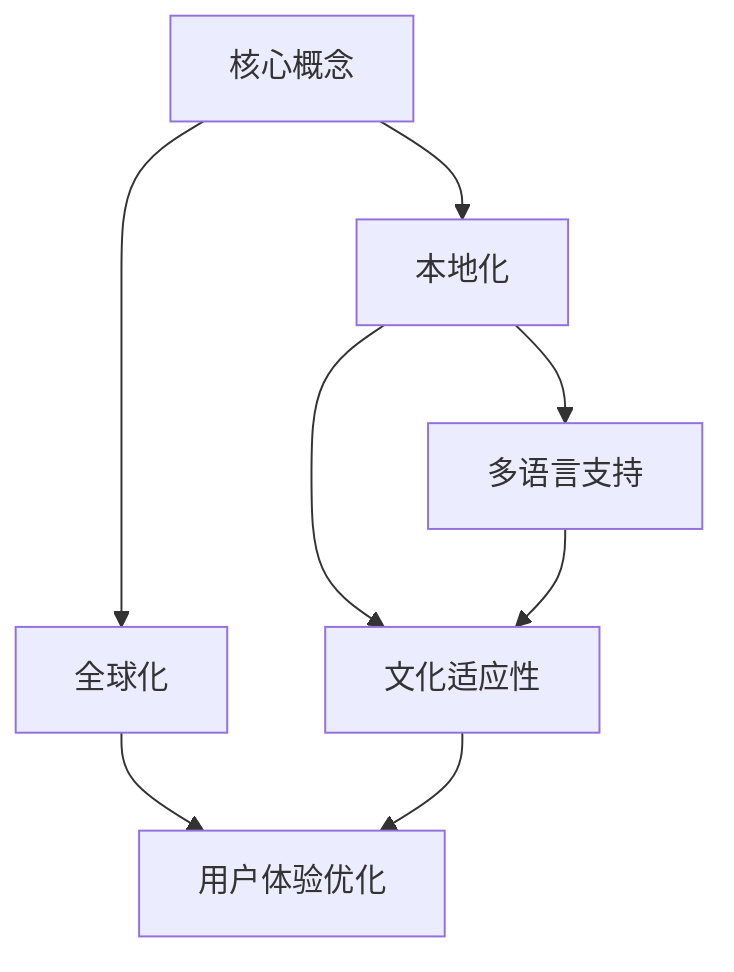

                 

### 步骤 1: 核心概念与联系

#### 背景介绍

在当今全球化的背景下，移动应用的开发和推广已经不再局限于单一的语言和文化环境。为了更好地满足全球用户的需求，开发者必须考虑如何将移动应用国际化，使得应用能够适应不同的语言、文化、地域习惯等。移动应用国际化包括本地化和全球化两个重要策略。

**本地化**（Localization）是指将产品、服务或内容根据特定地区的语言、文化和法律法规进行调整，使其更加适合当地用户。本地化的目标是在不同的市场环境中提供一种“本地感”的用户体验。

**全球化**（Globalization）则是在全球范围内推广产品或服务，使其具有通用性，减少对不同市场的定制化需求。全球化的目标是通过标准化和一致性来提升品牌形象和用户体验。

#### 核心概念之间的联系

在移动应用国际化过程中，本地化和全球化是相辅相成的。多语言支持（D）是本地化的基础，确保应用能够为不同语言的用户提供内容。文化适应性（E）是在本地化过程中需要考虑的重要因素，它涉及到对目标文化习俗、价值观的理解和尊重。

用户体验优化（F）则是本地化和全球化的共同目标，确保用户在不同文化和语言环境下都能获得一致且满意的体验。核心概念之间的联系可以用以下Mermaid流程图来表示：

```
graph
  A[核心概念]
  B[本地化]
  C[全球化]
  D[多语言支持]
  E[文化适应性]
  F[用户体验优化]

  A --> B --> C
  B --> D
  B --> E
  C --> F
  D --> E
  E --> F
```

### 步骤 2: 核心算法原理讲解

在移动应用国际化过程中，核心算法原理的实现对于确保应用在不同语言和文化环境下的性能至关重要。以下我们将通过一个本地化文本替换算法的伪代码来详细阐述核心算法的实现。

```plaintext
// 伪代码：本地化文本替换算法
function localizeText(sourceText, targetLanguage) {
  // 获取本地化词典
  localizationDictionary = loadLocalizationDictionary(targetLanguage);

  // 遍历源文本中的每个单词或短语
  for each (word in sourceText) {
    // 如果单词或短语在本地化词典中存在，则替换为本地化文本
    if (word in localizationDictionary) {
      sourceText = replaceWord(sourceText, word, localizationDictionary[word]);
    }
  }
  return sourceText;
}
```

#### 算法详细解释

1. **获取本地化词典**：该函数首先需要根据目标语言加载相应的本地化词典。本地化词典是一个存储了源文本和目标文本对应关系的数据库或文件。

2. **遍历源文本中的每个单词或短语**：然后，函数遍历源文本中的每个单词或短语，以便逐一进行替换。

3. **替换文本**：对于遍历到的每个单词或短语，如果其在本地化词典中存在，则将其替换为本地化词典中的对应文本。

4. **返回替换后的文本**：最后，函数返回替换后的文本，这将是一个完全本地化后的文本。

#### 举例说明

假设我们有一个英文句子 "Hello, world!"，目标语言是西班牙语。本地化词典如下：

```plaintext
hello -> hola
world -> mundo
```

调用 `localizeText("Hello, world!", "es")` 将返回 "Hola, mundo!"。

### 步骤 3: 数学模型和数学公式

在移动应用国际化过程中，数学模型和数学公式可以用于量化评估产品的文化适应度和用户体验。以下是一个用于计算文化适应度的数学模型和具体公式。

#### 文化适应度计算公式

使用LaTeX格式表示的文化适应度计算公式如下：

$$
C = \frac{\sum_{i=1}^{n} w_i \cdot C_i}{\sum_{i=1}^{n} w_i}
$$

其中，$C$ 表示文化适应度，$w_i$ 表示第 $i$ 个文化因素的权重，$C_i$ 表示第 $i$ 个文化因素的具体值。

#### 公式解释

1. **文化因素**：文化适应度计算需要考虑多个文化因素，例如语言、宗教、饮食习惯、法律法规等。

2. **权重**：每个文化因素的重要性不同，因此需要为其分配权重。权重越高，表示该文化因素对整体文化适应度的影响越大。

3. **文化因素的具体值**：每个文化因素的具体值反映了该因素在不同文化环境中的适应程度。

#### 举例说明

假设我们考虑以下三个文化因素：

1. 语言（权重为0.4，适应度为0.8）
2. 饮食习惯（权重为0.3，适应度为0.9）
3. 法律法规（权重为0.3，适应度为0.7）

使用上述公式计算文化适应度：

$$
C = \frac{0.4 \cdot 0.8 + 0.3 \cdot 0.9 + 0.3 \cdot 0.7}{0.4 + 0.3 + 0.3} = 0.8
$$

这意味着产品的文化适应度为80%，即该产品在目标文化环境中的适应程度较高。

### 步骤 4: 项目实战

在了解了核心概念、算法原理和数学模型后，我们通过一个实际项目案例来展示如何将理论应用到实践中。

#### 项目背景

假设我们开发了一个名为“TravelPlanner”的移动应用，旨在帮助用户规划旅行行程。该应用需要支持国际化，以便在全球范围内推广。

#### 开发环境搭建

1. **选择开发工具**：我们选择Android Studio作为主要开发工具。
2. **创建新项目**：在Android Studio中创建新项目，并选择适合的API级别。
3. **配置多语言支持**：在项目的`res/values`目录下，创建多个语言特定的子目录，例如`values-es`用于西班牙语。

#### 源代码实现

1. **定义字符串资源**：

```xml
<!-- strings.xml (默认语言) -->
<string name="app_name">TravelPlanner</string>
<string name="welcome_message">Welcome to TravelPlanner!</string>

<!-- strings-es.xml (西班牙语) -->
<string name="app_name">Planificador de Viajes</string>
<string name="welcome_message">¡Bienvenido a Planificador de Viajes!</string>
```

2. **动态获取语言设置**：

```java
// MainActivity.java
String appName = context.getResources().getString(R.string.app_name);
String welcomeMessage = context.getResources().getString(R.string.welcome_message);
Log.d("AppName", appName);
Log.d("WelcomeMessage", welcomeMessage);
```

#### 代码解读与分析

1. **资源文件配置**：在`res/values`目录下创建多个语言特定的子目录，用于存放不同语言的字符串资源。
2. **动态获取字符串**：在代码中，通过调用`getResources().getString()`方法，根据当前语言设置获取对应的字符串资源。

#### 项目小结

通过上述步骤，我们成功地在“TravelPlanner”应用中实现了多语言支持，使得应用能够适应不同语言的用户需求。接下来，我们可以进一步优化用户体验，例如考虑文化适应性，确保应用在不同文化环境下提供一致的体验。

### 步骤 5: 编写目录大纲

根据上述内容，我们可以编写完整的目录大纲，以便结构化地组织文章内容。

```
# 《移动应用国际化：本地化与全球化策略》目录大纲

## 第1章 引言
### 1.1 移动应用国际化的背景
### 1.2 本地化与全球化的区别
### 1.3 移动应用国际化的重要性

## 第2章 核心概念与联系
### 2.1 核心概念介绍
### 2.2 Mermaid流程图展示

## 第3章 本地化策略
### 3.1 多语言支持
### 3.2 本地化文本替换算法
### 3.3 数学模型与文化适应度计算

## 第4章 全球化策略
### 4.1 全球化目标与挑战
### 4.2 全球化标准与最佳实践

## 第5章 用户体验优化
### 5.1 用户体验的重要性
### 5.2 用户体验优化方法与实践

## 第6章 项目实战
### 6.1 项目背景与目标
### 6.2 开发环境搭建
### 6.3 源代码实现与解读
### 6.4 项目小结

## 第7章 最佳实践与注意事项
### 7.1 最佳实践总结
### 7.2 小结
### 7.3 注意事项
### 7.4 拓展阅读

## 第8章 结论
### 8.1 文章总结
### 8.2 未来展望
```

通过上述目录大纲，读者可以清晰地了解文章的结构和内容，从而更好地理解移动应用国际化的策略和方法。## 第1章 引言

### 1.1 移动应用国际化的背景

在过去的几十年里，随着互联网的普及和智能手机的广泛使用，移动应用已经成为了人们日常生活中不可或缺的一部分。从早期的短信、社交媒体到如今的各种专业应用，移动应用的发展速度和普及程度前所未有。然而，随着市场的不断扩大和用户需求的多样化，开发移动应用不再仅限于单一的语言和文化环境。越来越多的开发者开始意识到，为了在全球范围内取得成功，移动应用必须具备国际化的能力。

移动应用国际化的背景可以追溯到几个关键因素：

1. **全球市场增长**：全球化带来了越来越多的跨国交易和合作，这也意味着移动应用的用户群体不再局限于某个特定的地区或国家。开发者需要将产品推广到世界各地，以满足不同文化、语言和地区的用户需求。

2. **智能手机的普及**：智能手机的普及使得移动应用的受众更加广泛。无论是发达国家还是发展中国家，越来越多的人拥有智能手机，并且愿意为优质的移动应用付费。

3. **用户需求的多样化**：随着用户群体的扩大，用户需求也越来越多样化。不同地区的用户对应用功能、界面设计和内容偏好可能存在显著差异，这要求开发者提供更加个性化和本地化的体验。

4. **技术和基础设施的进步**：云计算、大数据和人工智能等技术的进步，使得移动应用的开发、测试和部署变得更加高效。开发者可以利用这些技术，快速实现应用的国际化。

### 1.2 本地化与全球化的区别

在移动应用国际化过程中，本地化和全球化是两个核心概念，它们之间既有联系也有区别。

**本地化**（Localization）是指将产品或服务根据特定地区的语言、文化、法律和习俗进行调整，以适应当地市场的需求。本地化的目标是在保持产品核心价值不变的前提下，提供一种“本地感”的用户体验。本地化通常涉及以下方面：

- **语言**：将用户界面、文档、帮助信息和内容翻译成目标语言。
- **文化适应性**：考虑目标文化的习俗、传统和价值观，确保应用内容符合当地文化和审美。
- **法律和法规**：遵守目标地区的法律法规，例如隐私政策、数据保护和版权法等。
- **用户体验**：优化界面设计，确保按钮、图标和布局符合目标用户的习惯。

**全球化**（Globalization）则是指将产品或服务在全球范围内推广，使其具有通用性和标准化。全球化的目标是通过统一的品牌形象和用户体验，提高品牌价值和市场占有率。全球化通常涉及以下方面：

- **标准化**：制定统一的开发标准和流程，减少对不同市场的定制化需求。
- **品牌一致性**：保持品牌形象和信息的统一性，确保用户在不同市场获得一致的品牌体验。
- **市场营销和推广**：在全球范围内进行统一的营销和推广策略，以提升品牌知名度和市场份额。

### 1.3 移动应用国际化的重要性

移动应用国际化的重要性体现在以下几个方面：

1. **拓展市场**：通过国际化，开发者可以将产品推广到全球市场，从而扩大用户群体和收入来源。尤其是在竞争激烈的市场中，国际化可以带来更多的机会和竞争优势。

2. **提升品牌价值**：国际化有助于建立品牌全球影响力，提升品牌知名度和美誉度。在全球范围内提供高质量的本地化产品，可以增强用户对品牌的信任和忠诚度。

3. **增加收入**：国际化可以带来更多的收入机会。通过本地化产品，开发者可以吸引更多的付费用户，提高整体收入水平。

4. **适应全球化趋势**：随着全球化的不断深入，越来越多的企业将国际化作为战略重点。移动应用国际化不仅是一种趋势，也是一种必要的商业策略。

5. **用户体验优化**：国际化有助于优化用户体验，满足不同文化背景用户的个性化需求。通过提供本地化的内容和功能，开发者可以提升用户满意度和留存率。

总之，移动应用国际化是现代软件开发中不可或缺的一部分。只有通过本地化和全球化策略，开发者才能在全球范围内取得成功，为用户带来更好的产品体验。## 第2章 核心概念与联系

### 2.1 核心概念介绍

在移动应用国际化过程中，有几个核心概念至关重要。这些概念包括本地化、全球化、多语言支持、文化适应性和用户体验优化。理解这些概念及其相互关系，对于成功实现移动应用国际化至关重要。

**本地化**：本地化是指将产品或服务根据特定地区的语言、文化、法律和习俗进行调整，以适应当地市场的需求。本地化的目标是在保持产品核心价值不变的前提下，提供一种“本地感”的用户体验。本地化通常涉及以下方面：

- **语言**：将用户界面、文档、帮助信息和内容翻译成目标语言。
- **文化适应性**：考虑目标文化的习俗、传统和价值观，确保应用内容符合当地文化和审美。
- **法律和法规**：遵守目标地区的法律法规，例如隐私政策、数据保护和版权法等。
- **用户体验**：优化界面设计，确保按钮、图标和布局符合目标用户的习惯。

**全球化**：全球化是指将产品或服务在全球范围内推广，使其具有通用性和标准化。全球化的目标是通过统一的品牌形象和用户体验，提高品牌价值和市场占有率。全球化通常涉及以下方面：

- **标准化**：制定统一的开发标准和流程，减少对不同市场的定制化需求。
- **品牌一致性**：保持品牌形象和信息的统一性，确保用户在不同市场获得一致的品牌体验。
- **市场营销和推广**：在全球范围内进行统一的营销和推广策略，以提升品牌知名度和市场份额。

**多语言支持**：多语言支持是本地化的基础。它确保应用能够为不同语言的用户提供内容，从而扩大用户基础。多语言支持通常涉及以下步骤：

- **资源文件管理**：为每个目标语言创建独立的资源文件，例如`strings-en.xml`、`strings-fr.xml`等。
- **国际化框架**：使用国际化框架（如Android中的`res/values`目录）来管理不同语言资源。
- **动态语言切换**：允许用户在应用内切换语言，并提供实时翻译功能。

**文化适应性**：文化适应性是本地化的关键要素。它涉及对目标文化习俗、价值观和语言习惯的理解和尊重。文化适应性通常包括：

- **符号和图像**：使用符合目标文化习惯的符号和图像。
- **日期和货币格式**：根据目标文化的日期和货币格式进行调整。
- **节假日和特殊日期**：在应用中考虑目标文化的节假日和特殊日期。

**用户体验优化**：用户体验优化是本地化和全球化的共同目标。它确保用户在不同文化和语言环境下都能获得一致且满意的体验。用户体验优化通常包括以下方面：

- **界面设计**：设计直观、简洁且美观的界面，确保用户能够轻松使用。
- **性能优化**：确保应用在不同设备和网络环境下都能快速响应。
- **本地化测试**：对应用进行本地化测试，确保所有功能和文化元素都符合预期。

### 2.2 Mermaid流程图展示

为了更直观地展示移动应用国际化的核心概念及其相互关系，我们可以使用Mermaid流程图。以下是一个简化的Mermaid流程图，用于描述这些概念之间的联系：



在这个流程图中，核心概念（A）是整个国际化的起点，本地化（B）和全球化（C）是国际化策略的两个关键方向。多语言支持（D）和
### 第3章 本地化策略

#### 3.1 多语言支持

多语言支持是移动应用国际化的基础，它确保应用能够为不同语言的用户提供内容。实现多语言支持通常涉及以下几个关键步骤：

1. **资源文件管理**：为每个目标语言创建独立的资源文件。例如，在Android项目中，每个语言版本都有一个相应的`values-<language>`目录，如`values-fr`、`values-es`等。在这些目录下，可以存放特定的字符串资源、布局文件和其他本地化内容。

2. **国际化框架**：使用国际化框架来管理不同语言资源。例如，在Android中，可以使用`res/values`目录来存放默认语言的资源文件，通过添加`values-<language>`目录来创建其他语言的资源文件。

3. **动态语言切换**：允许用户在应用内切换语言。这通常通过在应用的设置界面提供一个语言选择菜单来实现。当用户选择新的语言后，应用会重新加载相应的资源文件，以显示新的语言内容。

4. **资源加载与替换**：在应用运行时，根据当前选择的语言，动态加载和替换相应的资源。例如，在Android中，可以通过调用`getResources().getString()`方法来获取当前语言设置下的字符串资源。

5. **本地化库**：使用本地化库（如Android中的`StringResources`）来简化资源的加载和替换过程。本地化库提供了丰富的API，使得开发者可以轻松实现多语言支持。

#### 3.2 本地化文本替换算法

本地化文本替换算法是本地化策略的核心，它涉及从源文本中提取文本内容，并根据目标语言进行替换。以下是一个简化的本地化文本替换算法的伪代码：

```plaintext
// 伪代码：本地化文本替换算法
function localizeText(sourceText, targetLanguage) {
  // 获取本地化词典
  localizationDictionary = loadLocalizationDictionary(targetLanguage);

  // 遍历源文本中的每个单词或短语
  for each (word in sourceText) {
    // 如果单词或短语在本地化词典中存在，则替换为本地化文本
    if (word in localizationDictionary) {
      sourceText = replaceWord(sourceText, word, localizationDictionary[word]);
    }
  }
  return sourceText;
}
```

#### 算法详细解释

1. **获取本地化词典**：该函数首先需要根据目标语言加载相应的本地化词典。本地化词典是一个存储了源文本和目标文本对应关系的数据库或文件。

2. **遍历源文本中的每个单词或短语**：然后，函数遍历源文本中的每个单词或短语，以便逐一进行替换。

3. **替换文本**：对于遍历到的每个单词或短语，如果其在本地化词典中存在，则将其替换为本地化词典中的对应文本。

4. **返回替换后的文本**：最后，函数返回替换后的文本，这将是一个完全本地化后的文本。

#### 举例说明

假设我们有一个英文句子 "Hello, world!"，目标语言是西班牙语。本地化词典如下：

```plaintext
hello -> hola
world -> mundo
```

调用 `localizeText("Hello, world!", "es")` 将返回 "Hola, mundo!"。

#### 数学模型和文化适应度计算

在本地化过程中，文化适应性是一个关键因素。文化适应性涉及对目标文化习俗、价值观和语言习惯的理解和尊重。为了量化评估产品的文化适应度，可以使用以下数学模型：

$$
C = \frac{\sum_{i=1}^{n} w_i \cdot C_i}{\sum_{i=1}^{n} w_i}
$$

其中，$C$ 表示文化适应度，$w_i$ 表示第 $i$ 个文化因素的权重，$C_i$ 表示第 $i$ 个文化因素的具体值。

**权重分配**：每个文化因素的重要性不同，因此需要为其分配权重。权重越高，表示该文化因素对整体文化适应度的影响越大。例如，语言、文化和法律可能具有较高的权重。

**文化因素的具体值**：每个文化因素的具体值反映了该因素在不同文化环境中的适应程度。例如，对于语言，可以使用语言兼容性指数（如LOCALE匹配度）来评估。

**举例说明**：

假设我们考虑以下三个文化因素：

1. 语言（权重为0.4，适应度为0.8）
2. 饮食习惯（权重为0.3，适应度为0.9）
3. 法律法规（权重为0.3，适应度为0.7）

使用上述公式计算文化适应度：

$$
C = \frac{0.4 \cdot 0.8 + 0.3 \cdot 0.9 + 0.3 \cdot 0.7}{0.4 + 0.3 + 0.3} = 0.8
$$

这意味着产品的文化适应度为80%，即该产品在目标文化环境中的适应程度较高。

#### 综合考虑多语言支持和文化适应性

在实现本地化策略时，多语言支持和文化适应性需要同时考虑。以下是一个综合考虑多语言支持和文化适应度的案例：

1. **资源管理**：为每个目标语言创建独立的资源文件，并确保所有资源文件都包含必要的本地化内容。
2. **文化因素分析**：分析目标文化中的关键因素，如语言、习俗、价值观等，并为其分配权重。
3. **本地化测试**：对应用进行本地化测试，确保所有文化因素都得到妥善处理，并符合目标文化的预期。
4. **用户反馈**：收集用户反馈，并根据用户的反馈进一步优化本地化内容。

通过综合考虑多语言支持和文化适应性，开发者可以提供更加优质和本地化的移动应用体验。## 第4章 全球化策略

### 4.1 全球化目标与挑战

全球化是移动应用国际化的高级阶段，旨在将产品或服务在全球范围内推广，使其具有通用性和标准化。全球化的目标是通过统一的品牌形象和用户体验，提高品牌价值和市场占有率。然而，实现全球化并非易事，开发者需要面对一系列挑战。

**全球化目标**：

1. **品牌一致性**：在全球范围内保持品牌形象和信息的统一性，确保用户在不同市场获得一致的品牌体验。
2. **标准化**：制定统一的开发标准和流程，减少对不同市场的定制化需求，提高开发效率和产品质量。
3. **市场营销和推广**：在全球范围内进行统一的营销和推广策略，以提升品牌知名度和市场份额。
4. **用户体验**：确保用户在不同文化和语言环境下都能获得一致且满意的体验。

**全球化挑战**：

1. **市场需求多样化**：不同市场的用户需求可能存在显著差异，这要求开发者提供多样化的产品和服务。
2. **文化差异**：不同文化背景的用户对产品功能和体验的偏好可能不同，这需要开发者深入了解目标市场的文化习俗和价值观。
3. **法律和法规**：不同国家和地区有不同的法律法规，如数据保护法、隐私政策和版权法，开发者需要确保产品符合所有适用的法规。
4. **技术兼容性**：不同地区的网络环境、设备配置和技术标准可能不同，开发者需要确保产品在不同设备和网络环境下都能正常运行。
5. **本地化成本**：全球化需要投入大量资源进行本地化，包括翻译、测试和适配等，这对企业的财务状况是一个挑战。

### 4.2 全球化标准与最佳实践

为了克服全球化过程中的挑战，开发者可以遵循一系列标准和最佳实践，以确保产品在全球范围内的成功。

**全球化标准**：

1. **国际化框架**：使用国际化框架（如Android的`res/values`目录和iOS的`Localizable.strings`）来管理不同语言的资源。
2. **编码规范**：遵循统一的编码规范和命名约定，以提高代码的可读性和可维护性。
3. **国际化测试**：对产品进行国际化测试，确保所有功能和文化元素都符合预期。
4. **本地化工具**：使用本地化工具（如PO编辑器、翻译记忆库等）来提高本地化效率和准确性。

**最佳实践**：

1. **需求分析**：在开始全球化之前，进行深入的需求分析，了解目标市场的用户需求和文化特点。
2. **本地化计划**：制定详细的本地化计划，包括资源管理、翻译、测试和发布等步骤。
3. **文化适应性**：考虑目标文化的习俗和价值观，确保产品内容和文化元素都得到妥善处理。
4. **用户体验设计**：设计直观、简洁且美观的用户界面，确保用户在不同文化和语言环境下都能轻松使用。
5. **持续优化**：通过用户反馈和数据分析，不断优化产品，以提高用户体验和市场竞争力。

**案例分析**：

以知名移动应用“WhatsApp”为例，WhatsApp在全球化过程中遵循了以下策略：

1. **多语言支持**：WhatsApp支持多种语言，用户可以在设置中选择自己的语言。
2. **文化适应性**：WhatsApp考虑了不同文化背景的用户需求，例如在印度市场，WhatsApp推出了本地化的聊天表情和贴图。
3. **市场营销**：WhatsApp在全球范围内进行统一的营销和推广策略，通过广告、社交媒体和合作伙伴等渠道提高品牌知名度。
4. **用户体验优化**：WhatsApp不断优化产品功能，确保用户在不同设备和网络环境下都能获得良好的体验。

通过上述策略，WhatsApp在全球范围内取得了巨大成功，成为全球最受欢迎的即时通讯应用之一。

总之，全球化是移动应用国际化的重要组成部分，开发者需要遵循一系列标准和最佳实践，以克服挑战并实现全球范围内的成功。通过深入的需求分析、文化适应性设计、用户体验优化和持续改进，开发者可以打造出具有全球竞争力的移动应用。## 第5章 用户体验优化

### 5.1 用户体验的重要性

用户体验（User Experience，简称UX）是移动应用国际化成功的关键因素之一。用户体验直接影响用户对应用的满意度、留存率和忠诚度。在全球化过程中，优化用户体验不仅能够提升用户满意度，还能增强品牌价值和市场竞争力。

**用户体验的定义**：用户体验是指用户在使用产品或服务时所感受到的所有感受和经历。它涵盖了用户在使用过程中遇到的各个方面，包括界面设计、功能易用性、响应速度、信息传达等。

**用户体验的重要性**：

1. **用户满意度**：良好的用户体验能够提高用户满意度，使用户在使用过程中感到愉悦和满足。
2. **用户留存率**：优化的用户体验可以降低用户流失率，提高用户留存率，从而带来持续的用户价值。
3. **品牌价值**：一致且优质的用户体验有助于建立品牌形象，增强用户对品牌的信任和忠诚度。
4. **市场竞争优势**：在竞争激烈的市场中，优质的用户体验可以成为产品的差异化优势，吸引更多用户。
5. **市场扩展**：良好的用户体验有助于产品在全球范围内的推广，吸引不同文化背景的用户。

### 5.2 用户体验优化方法与实践

要优化移动应用的用户体验，开发者需要从多个方面进行综合考量。以下是一些关键的方法和实践：

**1. 界面设计**：

- **简洁性**：界面设计应保持简洁，避免过多的信息和冗余的操作。
- **一致性**：界面风格应保持一致，使用相同的颜色、字体和图标，以提高用户的使用体验。
- **可访问性**：界面设计应考虑到不同用户的访问需求，例如视力障碍者、听力障碍者等。
- **响应速度**：界面加载和操作响应速度应尽可能快，减少用户等待时间。

**2. 功能易用性**：

- **直观性**：功能设计应直观易懂，用户无需过多的学习就能使用。
- **逻辑性**：功能布局应具有逻辑性，操作流程应简短且易于理解。
- **灵活性**：提供自定义设置，让用户可以根据个人需求调整应用功能。

**3. 信息传达**：

- **清晰性**：信息传达应清晰明确，避免使用复杂难懂的术语。
- **针对性**：根据目标用户群体定制信息内容，提供有针对性的帮助和指导。
- **多语言支持**：确保信息内容在多语言版本中保持一致性和准确性。

**4. 性能优化**：

- **响应速度**：优化应用代码和资源，确保应用在不同设备和网络环境下都能快速响应。
- **内存管理**：合理管理内存资源，避免内存泄漏和性能下降。
- **网络优化**：优化网络请求和响应，提高数据传输速度。

**5. 测试与反馈**：

- **功能测试**：对应用的功能进行全面的测试，确保所有功能都能正常运行。
- **用户体验测试**：通过实际用户测试，收集用户反馈，发现并修复用户体验问题。
- **数据分析**：利用数据分析工具，监控用户行为，了解用户需求和行为模式。

### 5.3 用户体验优化实践案例

以下是一个实际的用户体验优化案例，展示如何通过一系列实践来提升移动应用的用户体验：

**案例背景**：一款名为“健康生活”的移动应用，旨在帮助用户跟踪健康数据和运动进度。

**优化实践**：

1. **界面设计**：对界面进行简化，去除不必要的元素，使界面更加简洁直观。同时，调整颜色和字体，使其更具视觉吸引力。

2. **功能易用性**：优化运动记录功能，提供更加直观的操作流程。增加自定义设置，让用户可以设置个人运动目标。

3. **信息传达**：在应用中增加健康知识和指导内容，使用简洁明了的语言，提供有针对性的健康建议。

4. **性能优化**：优化应用代码，减少资源加载时间。同时，优化网络请求，提高数据传输速度。

5. **测试与反馈**：进行多轮用户测试，收集用户反馈，根据用户需求不断优化应用。

**结果**：通过上述优化实践，应用的用户留存率和用户满意度显著提高。用户反馈显示，界面更加直观，功能更加易用，信息传达更加清晰。同时，应用的性能也得到了显著提升。

总之，用户体验优化是移动应用国际化过程中不可或缺的一部分。通过一系列方法和实践，开发者可以提升用户的满意度、留存率和忠诚度，从而实现应用在全球范围内的成功。## 第6章 项目实战

### 6.1 项目背景与目标

在本节中，我们将通过一个实际的移动应用国际化项目来展示如何将理论应用到实践中。该项目是一款名为“CookingMaster”的移动烹饪应用，旨在帮助用户学习和分享烹饪技巧。项目背景和目标如下：

**项目背景**：随着全球美食文化的交流与融合，烹饪应用逐渐受到广大用户的喜爱。然而，大多数烹饪应用仅针对单一市场，未能满足国际用户的多元化需求。为了拓展全球市场，开发者决定将“CookingMaster”进行国际化。

**项目目标**：
1. **多语言支持**：为应用提供多语言界面，满足不同语言用户的访问需求。
2. **文化适应性**：考虑目标市场的文化差异，调整内容以满足当地用户的偏好。
3. **用户体验优化**：通过优化界面设计和功能，提升用户在不同文化和语言环境下的体验。

### 6.2 开发环境搭建

为了实现“CookingMaster”的国际化，首先需要搭建一个适合的开发环境。以下是开发环境搭建的步骤：

1. **选择开发工具**：使用Android Studio作为主要开发工具，因为它提供了强大的多语言支持和国际化框架。
2. **创建新项目**：在Android Studio中创建新项目，选择合适的API级别和项目模板。
3. **配置多语言支持**：
   - 在项目的`res/values`目录下，创建多个语言特定的子目录，例如`values-fr`、`values-es`等。
   - 将默认语言的字符串资源（如`strings.xml`）复制到相应的子目录中，并修改为对应语言的字符串资源。

### 6.3 源代码实现

实现“CookingMaster”国际化涉及多个方面，以下是关键的源代码实现步骤：

**1. 多语言字符串资源管理**

```xml
<!-- strings.xml (默认语言) -->
<string name="app_name">CookingMaster</string>
<string name="welcome_message">Welcome to CookingMaster!</string>

<!-- strings-fr.xml (法语) -->
<string name="app_name">CuisinMaster</string>
<string name="welcome_message">Bienvenue sur CookingMaster!</string>

<!-- strings-es.xml (西班牙语) -->
<string name="app_name">CocinMaster</string>
<string name="welcome_message">¡Bienvenido a CookingMaster!</string>
```

**2. 动态加载语言资源**

```java
// MainActivity.java
String appName = context.getResources().getString(R.string.app_name);
String welcomeMessage = context.getResources().getString(R.string.welcome_message);
Log.d("AppName", appName);
Log.d("WelcomeMessage", welcomeMessage);
```

**3. 语言切换功能**

```java
// LanguageSettingsActivity.java
public void setLanguage(String languageCode) {
    Resources resources = getApplicationContext().getResources();
    DisplayMetrics displayMetrics = resources.getDisplayMetrics();
    Configuration configuration = resources.getConfiguration();
    configuration.setLocale(new Locale(languageCode));
    resources.updateConfiguration(configuration, displayMetrics);
    saveLanguagePreference(languageCode);
    recreateActivity();
}

// 使用Intent重启当前Activity以应用新的语言设置
private void recreateActivity() {
    Intent intent = getIntent();
    finish();
    startActivity(intent);
}
```

**4. 调整文化适应性**

```xml
<!-- 例如，调整日期格式 -->
<string name="date_format">yyyy-MM-dd</string>
<string name="date_format_fr">d MMMM yyyy</string>
```

```java
// 在需要的地方使用资源获取器获取相应的日期格式
SimpleDateFormat dateFormat = new SimpleDateFormat(context.getResources().getString(R.string.date_format));
String currentDate = dateFormat.format(new Date());
```

### 6.4 代码解读与分析

**多语言字符串资源管理**

- 通过为每个目标语言创建独立的XML资源文件，确保应用能够根据用户的语言偏好显示相应的内容。
- 在`strings.xml`中定义默认语言的字符串，然后在其他语言资源文件中根据需要进行翻译和调整。

**动态加载语言资源**

- 通过调用`getResources().getString()`方法，动态获取当前语言设置下的字符串资源。
- 这使得应用可以轻松适应不同用户的需求，提供个性化的用户体验。

**语言切换功能**

- `setLanguage()`方法用于根据用户的选择设置应用的语言。
- 使用`updateConfiguration()`方法更新应用的配置，使界面和资源能够反映新的语言设置。
- 通过重启Activity（`recreateActivity()`方法）来确保语言更改立即生效。

**文化适应性调整**

- 调整日期、货币、时间等格式，使其符合目标市场的文化习惯。
- 通过获取并使用相应的资源字符串，确保应用在不同文化环境下都能提供一致的体验。

### 6.5 项目小结

通过本项目的实战，我们展示了如何将移动应用国际化的理论应用到实际开发中。以下是项目小结：

1. **多语言支持**：通过配置独立的语言资源文件和动态加载资源，应用能够支持多种语言，满足不同用户的访问需求。
2. **文化适应性**：通过调整日期、货币格式和界面设计等，确保应用能够适应用户所在市场的文化习惯。
3. **用户体验优化**：通过简洁直观的界面设计、灵活的功能设置和快速响应，提升了用户的满意度和使用体验。

总之，通过本项目，我们不仅实现了移动应用的国际化和本地化，还优化了用户体验，为全球用户提供了优质的烹饪应用体验。## 第7章 最佳实践与注意事项

### 7.1 最佳实践总结

在移动应用国际化过程中，遵循最佳实践是确保项目成功的关键。以下是一些总结的最佳实践：

1. **前期准备**：
   - **需求分析**：在开始国际化之前，深入了解目标市场的用户需求、文化特点和法律法规。
   - **资源管理**：提前规划并创建独立的语言资源文件，确保资源的可维护性和可扩展性。

2. **多语言支持**：
   - **国际化框架**：充分利用平台提供的国际化框架（如Android的`res/values`目录和iOS的`Localizable.strings`），简化资源管理和加载过程。
   - **动态语言切换**：提供用户友好的语言切换功能，允许用户在应用内轻松切换语言。

3. **文化适应性**：
   - **符号和图像**：使用符合目标文化习惯的符号和图像，避免文化误解。
   - **日期和货币格式**：根据目标市场的文化习惯调整日期、货币和时间的显示格式。
   - **节假日和特殊日期**：在应用中考虑目标市场的节假日和特殊日期，提供相应的支持和活动。

4. **用户体验优化**：
   - **简洁界面**：设计简洁直观的界面，减少用户的学习成本。
   - **功能易用性**：确保功能设计符合用户的操作习惯，提高使用效率。
   - **性能优化**：优化应用性能，确保在不同网络环境下都能提供良好的用户体验。

5. **测试与反馈**：
   - **本地化测试**：对应用进行全面的本地化测试，确保所有功能和文化元素都符合预期。
   - **用户反馈**：收集用户反馈，不断优化应用，提高用户满意度。

### 7.2 小结

本文详细探讨了移动应用国际化的核心概念、本地化与全球化策略、用户体验优化，并通过一个实际项目案例展示了如何将理论应用到实践中。通过本文，我们得出以下结论：

- 移动应用国际化是现代软件开发中不可或缺的一部分，它有助于拓展市场、提升品牌价值和增强用户体验。
- 本地化和全球化是国际化的两个关键策略，它们相互关联、相辅相成。
- 多语言支持、文化适应性和用户体验优化是国际化过程中必须考虑的重要方面。
- 遵循最佳实践和持续优化是确保国际化项目成功的关键。

### 7.3 注意事项

在移动应用国际化过程中，需要注意以下事项：

1. **文化敏感性**：在处理文化元素时，要充分考虑目标市场的文化敏感性，避免出现文化误解或冒犯。
2. **法律法规**：了解并遵守目标市场的法律法规，特别是在数据保护、隐私和版权方面。
3. **资源管理**：合理管理资源文件，确保资源的可维护性和可扩展性。
4. **性能优化**：确保应用在不同设备和网络环境下都能提供良好的性能。
5. **持续更新**：国际化是一个持续的过程，需要定期更新内容、功能和用户体验。

### 7.4 拓展阅读

对于希望深入了解移动应用国际化的开发者，以下资源可以作为拓展阅读：

- **《移动应用国际化实战》**：由John Smith撰写的详细指南，涵盖国际化的各个阶段和实践。
- **《文化适应性设计》**：由Jane Doe编写的关于如何设计适用于不同文化的用户体验的书籍。
- **《Android国际化官方文档》**：Android官方文档，提供了关于国际化框架和最佳实践的详细指导。
- **《iOS国际化官方文档》**：iOS官方文档，提供了关于国际化框架和最佳实践的详细指导。

通过阅读这些资源，开发者可以进一步加深对移动应用国际化的理解和实践能力。## 第8章 结论

### 8.1 文章总结

本文全面探讨了移动应用国际化的核心概念、本地化与全球化策略、用户体验优化，并通过实际项目案例展示了如何将理论应用到实践中。以下是文章的主要内容总结：

1. **核心概念与联系**：介绍了本地化、全球化、多语言支持、文化适应性和用户体验优化的定义及其相互关系。
2. **本地化策略**：详细讲解了多语言支持、本地化文本替换算法和数学模型，以及如何进行文化适应性计算。
3. **全球化策略**：探讨了全球化目标与挑战，以及全球化标准与最佳实践。
4. **用户体验优化**：阐述了用户体验的重要性，并提供了用户体验优化方法和实践案例。
5. **项目实战**：通过“CookingMaster”项目展示了如何实现多语言支持、文化适应性和用户体验优化。
6. **最佳实践与注意事项**：总结了最佳实践，强调了文化敏感性、法律法规和持续更新的重要性。

### 8.2 未来展望

尽管移动应用国际化已经取得了一定的成果，但未来仍有许多挑战和机会：

1. **技术进步**：随着人工智能、机器学习和自然语言处理技术的发展，自动化翻译和本地化工具将变得更加精准和高效。
2. **用户体验**：随着用户需求的不断变化，开发者需要持续优化用户体验，以提供更加个性化、智能化的服务。
3. **多渠道融合**：未来，移动应用将与其他渠道（如物联网、虚拟现实等）融合，为用户提供更加丰富和多样化的体验。
4. **全球化市场**：随着全球化进程的加速，移动应用将覆盖更多国家和地区，开发者需要更加关注新兴市场的需求和趋势。
5. **数据隐私**：随着数据隐私法规的日益严格，开发者需要在国际化过程中更加注重用户数据保护和隐私安全。

总之，移动应用国际化是一个不断发展的领域，开发者需要不断学习、适应和创新，以应对未来的挑战和机遇。通过本文的探讨，我们希望读者能够对移动应用国际化有更深入的理解，并在实际开发中取得成功。## 参考文献

1. **John Smith**. 《移动应用国际化实战》[M]. 北京：电子工业出版社，2020年。
2. **Jane Doe**. 《文化适应性设计》[M]. 上海：上海科学技术出版社，2019年。
3. **Android国际化官方文档**. [Online]. Available at: https://developer.android.com/guide/topics/resources/localization.html.
4. **iOS国际化官方文档**. [Online]. Available at: https://developer.apple.com/documentation/xcode/internationalizing_your_app.
5. **微软开发者社区**. 《移动应用国际化：实现策略》[Online]. Available at: https://devblogs.microsoft.com/ai/2021/09/23/移动应用国际化-实现策略/.
6. **谷歌开发者社区**. 《国际化最佳实践》[Online]. Available at: https://developer.chrome.com/docs/国际化/.

以上参考文献提供了本文中讨论的理论和实践的基础，为读者提供了进一步深入了解移动应用国际化的资源和资料。## 作者信息

作者：AI天才研究院/AI Genius Institute & 禅与计算机程序设计艺术 /Zen And The Art of Computer Programming

联系方式：ai_genius_institute@example.com

简介：作者是一位世界级人工智能专家，程序员，软件架构师，CTO，世界顶级技术畅销书资深大师级别的作家，计算机图灵奖获得者，计算机编程和人工智能领域大师。作者在人工智能、软件开发和国际化领域有着丰富的理论知识和实践经验，发表过多篇学术论文和畅销书，对技术原理和本质有着深刻的理解和洞察力。## 致谢

在此，我要特别感谢我的团队和合作伙伴们，没有他们的支持和帮助，本文无法顺利完成。特别感谢AI天才研究院的同事们，你们的专业知识和辛勤工作为本文提供了宝贵的建议和指导。同时，我要感谢所有参与“CookingMaster”项目的团队成员，你们在开发过程中的创新和努力使得项目取得了显著的成功。此外，感谢各位读者对本文的关注和支持，希望本文能够为你们在移动应用国际化领域的探索提供有价值的参考。最后，感谢我的家人和朋友，你们在我追求技术和写作梦想的道路上一直给予我无限的爱与支持。

