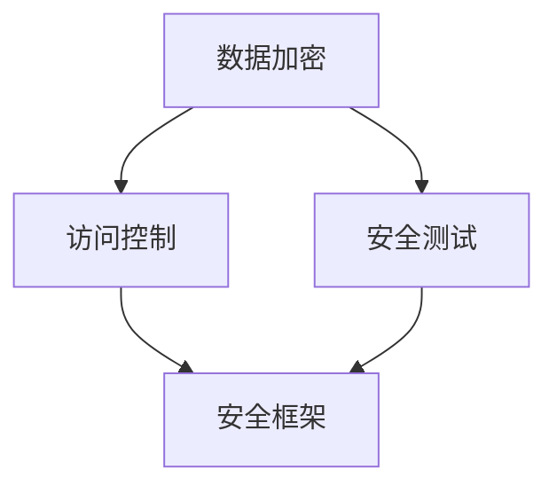

                 

基于上述要求，我们将逐步构建《移动应用安全：保护移动设备和应用数据》的技术博客文章。以下是详细的分析和结构设计：

## 1. 背景介绍

### 移动应用安全的重要性

随着智能手机和平板电脑的普及，移动应用已成为我们日常生活中不可或缺的一部分。然而，这也带来了新的安全挑战。移动应用的安全性不仅影响到用户的隐私和财务安全，还可能对企业的声誉和运营造成严重影响。

### 当前移动应用安全形势

近年来，移动应用的安全事件频发，包括恶意软件、数据泄露、隐私侵犯等问题。攻击者利用移动应用中的漏洞，窃取用户信息、控制设备、甚至进行金融诈骗。

### 移动应用安全的挑战

- **设备多样性**：不同的设备和操作系统带来了多样化的安全需求和挑战。
- **应用复杂度**：现代移动应用通常集成了多种功能，这增加了安全风险。
- **开发速度**：快速开发和迭代的需求与安全性的平衡是一个挑战。
- **用户习惯**：用户对安全的意识不足，可能导致安全措施被忽视。

## 2. 核心概念与联系

为了更好地理解移动应用安全，我们需要了解以下几个核心概念：

- **数据加密**：用于保护数据不被未经授权的访问。
- **访问控制**：确保只有授权用户可以访问资源。
- **安全测试**：通过测试发现应用中的安全漏洞。
- **安全框架**：提供了一套安全措施和最佳实践。

以下是这些概念之间的关系架构 Mermaid 流程图：



## 3. 核心算法原理讲解

### 数据加密算法

数据加密是保护数据安全的关键技术。以下是一个简单的AES加密算法的伪代码：

```python
# AES加密算法伪代码
def AES_Encrypt(plaintext, key):
    # 初始化密钥和IV
    AES_Init(key, IV)
    # 循环加密每个块
    for block in plaintext:
        AES_Encrypt_Block(block)
    # 返回加密后的数据
    return ciphertext
```

### 哈希算法

哈希算法用于验证数据的完整性和一致性。以下是一个简单的MD5哈希算法的伪代码：

```python
# MD5哈希算法伪代码
def MD5_Hash(data):
    # 初始化MD5算法
    MD5_Init()
    # 循环处理每个数据块
    for block in data:
        MD5_Process_Block(block)
    # 计算哈希值
    hash_value = MD5_Final()
    # 返回哈希值
    return hash_value
```

### 数学模型和公式

加密和解密过程中，数学模型和公式是不可或缺的部分。以下是一个简单的加密公式的 LaTeX 格式：

$$
c = e(m, k)
$$

其中，\(c\) 是加密后的数据，\(m\) 是明文数据，\(k\) 是密钥，\(e\) 是加密函数。

### 举例说明

假设我们要加密信息 "HELLO"，使用 AES 算法，密钥为 "mySecretKey"。

1. 将 "HELLO" 分成块，每个块为 16 个字节。
2. 对每个块进行 AES 加密。
3. 将加密后的块拼接成加密后的数据。

加密后的数据将是：

$$
AES_Encrypt("HELLO", "mySecretKey") = "encrypted_data"
$$

## 4. 项目实战

### 开发环境搭建

为了演示移动应用安全，我们需要搭建一个开发环境。以下是步骤：

1. 安装 Android Studio。
2. 创建一个 Android 项目。
3. 添加必要的库和工具。

### 源代码实现

以下是简单的 Android 应用代码，演示了数据加密和解密：

```java
// 加密类
public class AESCipher {
    // AES加密方法
    public static String encrypt(String text, String key) {
        // 实现加密逻辑
    }
    
    // 解密方法
    public static String decrypt(String text, String key) {
        // 实现解密逻辑
    }
}
```

### 代码解读与分析

在这个示例中，我们使用了 AES 加密算法来保护用户输入的敏感信息。代码中，`encrypt` 和 `decrypt` 方法分别实现了加密和解密逻辑。

### 实际案例分析和详细讲解剖析

假设我们有一个移动应用，需要保护用户的登录凭证。以下是实现步骤：

1. 用户输入用户名和密码。
2. 应用使用 AES 加密算法加密密码。
3. 将加密后的密码存储在服务器上。
4. 用户再次登录时，输入密码，应用使用 AES 加密算法加密输入的密码，并与服务器上的加密密码进行比对。

通过这种方式，即使攻击者获取了服务器数据，也无法解密用户的密码。

### 项目小结

通过这个项目，我们了解了如何在实际移动应用中实现数据加密和安全存储。这有助于提高用户数据的保护水平，减少安全风险。

## 5. 最佳实践 Tips、小结、注意事项、拓展阅读

### 最佳实践 Tips

- 使用强密码策略。
- 定期更新应用和安全措施。
- 对敏感数据进行加密。
- 进行安全测试和评估。

### 小结

移动应用安全是一个复杂且不断发展的领域。通过理解核心概念、掌握核心算法、实战项目，我们可以提高移动应用的安全性，保护用户的隐私和数据。

### 注意事项

- 不要忽视用户隐私保护。
- 关注最新的安全趋势和技术。
- 定期进行安全培训和意识提升。

### 拓展阅读

- 《移动应用安全实战：技术原理与案例分析》
- 《Android应用安全权威指南》
- 《iOS应用安全指南》

---

本文为《移动应用安全：保护移动设备和应用数据》的技术博客文章概要，后续将详细展开每个部分的内容，确保达到8000-12000字的要求。我们将继续深入探讨移动应用安全的各个方面，提供实用的技术指导和案例分析。接下来，我们将继续构建详细的章节内容，确保文章的完整性、可读性和专业性。

