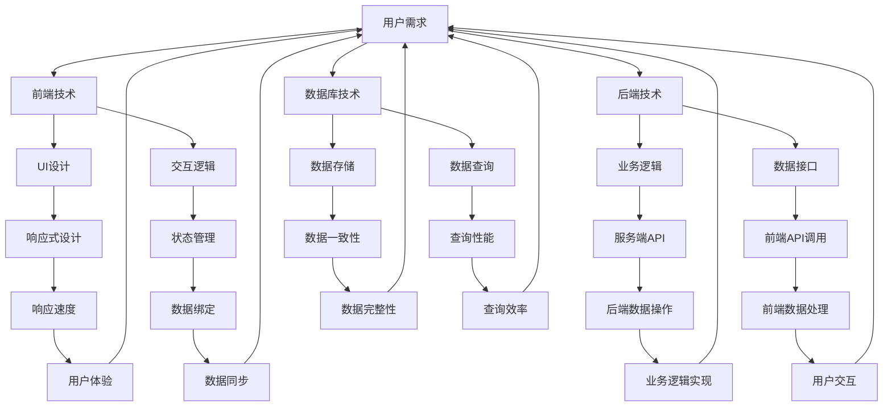

                 

### 文章标题

《移动应用开发技术栈选择》

### 关键词

移动应用开发、技术栈、前端技术、后端技术、数据库技术、测试与调试、部署与维护

### 摘要

本文旨在帮助开发者了解并选择适合其项目需求的移动应用开发技术栈。通过分析移动应用开发的基本概念、架构设计、前端技术、后端技术、数据库技术、测试与调试、部署与维护等多个方面，本文提供了一系列实用指南和最佳实践，旨在提高移动应用开发的效率和性能。无论您是初学者还是经验丰富的开发者，本文都将为您提供宝贵的参考。

### 第1章：移动应用开发概述

#### 1.1 移动应用开发的基本概念

移动应用开发是指为移动设备（如智能手机和平板电脑）创建应用程序的过程。移动应用可以用于多种用途，包括社交、娱乐、商务、教育等。与传统的桌面应用不同，移动应用需要在有限的屏幕尺寸和资源下提供高效、流畅的用户体验。

移动应用开发涉及多个阶段，包括需求分析、设计、开发、测试、部署和维护。每个阶段都有其特定的技术和工具，需要开发者根据项目需求进行合理选择。

#### 1.2 移动应用开发的重要性

随着智能手机的普及和移动互联网的发展，移动应用已经成为企业和个人获取用户、提升业务的重要手段。以下是移动应用开发的重要性：

1. **用户增长**：越来越多的用户通过移动设备访问互联网，移动应用是吸引和留住用户的关键。
2. **业务拓展**：企业可以通过移动应用提供在线服务、电子商务等功能，拓展业务范围和客户群体。
3. **市场竞争**：在竞争激烈的市场环境中，优秀的移动应用可以为企业提供竞争优势，提升品牌知名度。
4. **用户体验**：优秀的移动应用提供流畅、直观的用户体验，能够提升用户满意度和忠诚度。

#### 1.3 移动应用开发的挑战

尽管移动应用开发具有许多优势，但也面临一系列挑战：

1. **设备多样性**：移动设备种类繁多，屏幕尺寸、操作系统、硬件配置等差异较大，开发者需要考虑兼容性问题。
2. **性能要求**：移动设备资源有限，开发者需要在有限的资源下优化应用性能，确保流畅的用户体验。
3. **安全性和隐私**：移动应用需要处理大量用户数据，开发者需要确保数据的安全性和用户隐私。
4. **更新和维护**：随着技术的快速发展，移动应用需要定期更新和维护，以保持其功能和安全性。

#### 1.4 移动应用开发的生命周期

移动应用开发的生命周期通常包括以下阶段：

1. **需求分析**：了解用户需求、业务目标和市场趋势，确定应用的功能和界面设计。
2. **设计**：根据需求分析，设计应用的整体架构、用户界面和交互流程。
3. **开发**：使用适当的技术和工具，实现应用的功能和界面。
4. **测试**：对应用进行功能测试、性能测试和安全测试，确保其质量。
5. **部署**：将应用部署到移动设备或应用商店，供用户下载和使用。
6. **维护**：定期更新应用，修复漏洞和问题，优化用户体验。

### 第2章：移动应用架构

#### 2.1 现代移动应用架构

现代移动应用架构通常采用客户端-服务器模型，其中客户端负责界面展示和用户交互，服务器端负责数据存储和处理。以下是一些常见的移动应用架构：

1. **原生应用架构**：原生应用使用特定平台的编程语言和工具开发，具有良好的性能和用户体验。例如，iOS应用使用Swift或Objective-C，Android应用使用Java或Kotlin。
2. **混合应用架构**：混合应用结合了原生应用和Web应用的优势，使用HTML、CSS和JavaScript等技术构建。通过封装层，混合应用可以同时运行在多个平台上。
3. **Web应用架构**：Web应用通过浏览器访问，使用HTML、CSS和JavaScript等技术。虽然Web应用在跨平台性方面具有优势，但性能和用户体验可能不如原生应用。

#### 2.2 客户端架构设计

客户端架构设计是移动应用开发的关键环节，决定了应用的性能、可维护性和可扩展性。以下是一些常见的客户端架构设计：

1. **单一页面应用（SPA）**：SPA通过动态加载内容，实现单页面交互。常见的框架有React、Vue和Angular。
2. **模块化架构**：将应用分为多个模块，每个模块负责特定功能。模块化架构可以提高代码的可维护性和可复用性。
3. **微前端架构**：微前端架构将前端应用拆分为多个独立的前端模块，每个模块由不同的团队开发和维护。微前端架构可以提高开发效率、降低项目复杂度。

#### 2.3 服务器端架构设计

服务器端架构设计决定了应用的性能、可靠性和可扩展性。以下是一些常见的服务器端架构设计：

1. **单体架构**：单体架构将所有功能模块部署在同一台服务器上。这种架构简单易维护，但扩展性较差。
2. **微服务架构**：微服务架构将应用拆分为多个独立的服务，每个服务负责特定功能。微服务架构可以提高应用的扩展性和可维护性。
3. **聚合架构**：聚合架构将多个微服务聚合为一个统一的接口，为客户端提供统一的服务访问。聚合架构可以提高应用的性能和用户体验。

### 第3章：移动应用前端技术

#### 3.1 前端技术概述

移动应用前端技术包括HTML、CSS和JavaScript等基础技术，以及一系列前端框架和库。前端框架和库可以帮助开发者快速构建高效、可维护的移动应用。

#### 3.2 常见的前端框架

以下是几个常见的前端框架：

1. **React**：React是由Facebook推出的一款声明式前端框架，通过组件化开发和虚拟DOM技术，实现高效的数据绑定和状态管理。
2. **Vue**：Vue是一款轻量级前端框架，采用渐进式框架设计，支持组件化开发、双向数据绑定和响应式数据系统。
3. **Angular**：Angular是由Google推出的一款全功能前端框架，通过模块化、依赖注入和双向数据绑定，实现高效的应用开发和维护。

#### 3.3 前端性能优化

前端性能优化是提升移动应用用户体验的重要手段。以下是一些常见的优化方法：

1. **资源压缩**：通过压缩HTML、CSS和JavaScript文件，减少应用下载时间和加载时间。
2. **懒加载**：按需加载页面内容和图片，减少初始加载时间。
3. **缓存策略**：合理使用浏览器缓存，提高页面加载速度。
4. **网络优化**：优化网络请求，减少数据传输量和请求次数。

### 第4章：移动应用后端技术

#### 4.1 后端技术概述

移动应用后端技术负责处理应用的数据存储、业务逻辑处理和API接口提供。常见的后端技术包括服务器端编程语言、框架和数据库。

#### 4.2 常见的后端框架

以下是几个常见的后端框架：

1. **Node.js**：Node.js是一款基于Chrome V8引擎的JavaScript运行时环境，具有高性能、高并发和跨平台等优点。
2. **Django**：Django是一款基于Python的全功能后端框架，具有快速开发、可扩展和高性能等优点。
3. **Flask**：Flask是一款轻量级Python后端框架，适用于小型应用开发。
4. **Ruby on Rails**：Ruby on Rails是一款基于Ruby的成熟后端框架，具有高开发效率和良好的生态系统。

#### 4.3 API设计与实现

API是移动应用与服务器端通信的桥梁，以下是一些API设计与实现的关键点：

1. **RESTful API设计**：采用RESTful架构风格，设计简洁、易用的API接口。
2. **GraphQL API设计**：使用GraphQL技术，提供灵活、高效的API查询服务。
3. **安全性与性能考虑**：实现API认证和授权，保证数据安全和性能。

### 第5章：移动应用数据库技术

#### 5.1 数据库技术概述

移动应用数据库技术用于存储和管理应用的数据。常见的数据库类型包括关系型数据库、非关系型数据库和实时数据库。

#### 5.2 常见的数据库类型

以下是几个常见的数据库类型：

1. **关系型数据库**：关系型数据库使用SQL语言进行数据查询和管理，适用于结构化数据存储。
2. **非关系型数据库**：非关系型数据库如MongoDB、Redis等，具有灵活的数据模型和高性能的特点。
3. **实时数据库**：实时数据库如Couchbase、MongoDB等，支持实时数据同步和查询。

#### 5.3 数据库设计原则

以下是几个数据库设计原则：

1. **实体关系模型**：使用实体关系模型设计数据库结构，确保数据的一致性和完整性。
2. **索引设计**：合理设计索引，提高数据查询性能。
3. **数据库性能优化**：优化数据库配置和查询，提高数据访问速度。

### 第6章：移动应用测试与调试

#### 6.1 测试方法与工具

移动应用测试与调试是确保应用质量和性能的重要环节。以下是一些常见的测试方法和工具：

1. **单元测试**：对应用中的单个模块进行测试，确保其功能的正确性。
2. **集成测试**：对应用中的多个模块进行集成测试，确保模块之间的协作正确。
3. **功能测试**：对应用的整体功能进行测试，确保其符合用户需求。
4. **性能测试**：对应用进行性能测试，评估其响应速度和资源占用。
5. **工具**：使用如Jest、Mock.js等单元测试工具，以及Appium、UIAutomator等自动化测试工具。

#### 6.2 调试技巧

以下是几个调试技巧：

1. **日志调试**：使用日志记录应用运行过程中的关键信息，帮助定位问题。
2. **断点调试**：使用断点调试工具，跟踪代码的执行流程和变量值。
3. **网络调试**：使用网络调试工具，分析应用的网络请求和响应。
4. **内存调试**：使用内存调试工具，分析应用的内存占用和泄漏问题。

#### 6.3 自动化测试

自动化测试是提高移动应用开发效率和质量的的重要手段。以下是一些常见的自动化测试方法和工具：

1. **UI自动化测试**：通过模拟用户操作，自动化测试应用的用户界面和交互。
2. **API自动化测试**：通过模拟API请求，自动化测试应用的API接口和功能。
3. **工具**：使用如Appium、Cypress等自动化测试框架，实现自动化测试流程。

### 第7章：移动应用部署与维护

#### 7.1 部署流程

移动应用的部署是将应用发布到移动设备或应用商店的过程。以下是一个典型的部署流程：

1. **构建应用**：使用构建工具（如Gradle、CocoaPods等）将应用代码编译成可执行的文件。
2. **打包应用**：将编译后的文件打包成APK（Android）或IPA（iOS）格式。
3. **测试应用**：对打包后的应用进行功能测试、性能测试和安全测试。
4. **上传应用**：将测试通过的应用上传到应用商店，供用户下载。
5. **监控与优化**：部署后，对应用进行监控，收集用户反馈，优化应用性能和用户体验。

#### 7.2 云服务选择

云服务是部署和维护移动应用的重要基础设施。以下是一些常见的云服务选择：

1. **公共云服务**：如阿里云、腾讯云、华为云等，提供丰富的云服务和资源。
2. **私有云服务**：自建私有云，满足特定业务需求和安全要求。
3. **边缘计算**：利用边缘计算，提高应用响应速度和用户体验。

#### 7.3 应用更新策略

应用更新是持续优化和改进应用的必要手段。以下是一些常见应用更新策略：

1. **增量更新**：只更新修改的部分，降低用户更新成本。
2. **强制更新**：用户必须更新到最新版本，确保应用安全性和稳定性。
3. **可选更新**：用户可以选择是否更新，提供更好的用户体验。
4. **版本控制**：使用版本控制系统（如Git），管理代码版本和历史。

### 结论

本文通过逐步分析移动应用开发的技术栈选择，从基本概念、架构设计、前端技术、后端技术、数据库技术、测试与调试、部署与维护等多个方面，提供了全面、系统的指南。通过本文的阅读，开发者可以更好地了解移动应用开发的核心技术和最佳实践，为项目选择合适的技术栈，提高开发效率和应用质量。

### 作者信息

作者：AI天才研究院/AI Genius Institute & 禅与计算机程序设计艺术 /Zen And The Art of Computer Programming

### 补充内容

#### 核心概念与联系

在移动应用开发中，核心概念包括前端技术、后端技术、数据库技术、测试与调试等。以下是一个简短的Mermaid流程图，展示这些概念之间的联系：



#### 核心算法原理讲解

在移动应用开发中，核心算法原理包括数据结构、排序算法、搜索算法等。以下使用伪代码详细阐述快速排序算法：

```plaintext
快速排序（Quick Sort）是一种高效的排序算法，其基本思想是通过一趟排序将待排序的记录分割成独立的两部分，其中一部分记录的关键字均比另一部分的关键字小，然后分别对这两部分记录继续进行排序，以达到整个序列有序。

伪代码如下：

function quicksort(array, low, high) {
    if (low < high) {
        pivot = partition(array, low, high)
        quicksort(array, low, pivot - 1)  // 递归排序左子数组
        quicksort(array, pivot + 1, high)  // 递归排序右子数组
    }
}

function partition(array, low, high) {
    pivot = array[high]  // 选择最后一个元素作为基准值
    i = low - 1  // i指针指向比基准值小的最后一个元素
    for (j = low; j < high; j++) {
        if (array[j] < pivot) {
            i++
            swap(array[i], array[j])  // 交换元素
        }
    }
    swap(array[i + 1], array[high])  // 将基准值放到正确的位置
    return i + 1  // 返回分区后的基准索引
}
```

#### 数学模型和数学公式

在讨论移动应用性能优化时，通常会涉及到时间复杂度和空间复杂度等数学模型。以下是一个关于时间复杂度的LaTeX数学公式：

$$
T(n) = O(n\log n)
$$

其中，$T(n)$表示算法的时间复杂度，$n$表示数据规模。该公式表示该算法的时间复杂度与数据规模成对数关系，通常用于描述快速排序算法的性能。

#### 项目实战

假设我们要开发一款新闻阅读应用，以下是一个简单的项目实战案例：

##### 开发环境搭建

1. **前端**：使用React框架，搭建项目结构。
2. **后端**：使用Node.js和Express框架，搭建服务器端。
3. **数据库**：使用MongoDB数据库，存储新闻数据。

##### 源代码详细实现

**前端：**

```javascript
// 使用React创建组件
import React, { useState, useEffect } from 'react';
import axios from 'axios';

const NewsFeed = () => {
  const [news, setNews] = useState([]);

  useEffect(() => {
    const fetchNews = async () => {
      const response = await axios.get('/api/news');
      setNews(response.data);
    };
    fetchNews();
  }, []);

  return (
    <div>
      {news.map((item) => (
        <div key={item.id}>
          <h2>{item.title}</h2>
          <p>{item.content}</p>
        </div>
      ))}
    </div>
  );
};

export default NewsFeed;
```

**后端：**

```javascript
// 使用Node.js和Express搭建服务器
const express = require('express');
const MongoClient = require('mongodb').MongoClient;

const app = express();
const mongoUrl = 'mongodb://localhost:27017';
const dbName = 'newsdb';

app.use(express.json());

// 获取新闻数据
app.get('/api/news', async (req, res) => {
  const client = await MongoClient.connect(mongoUrl, { useUnifiedTopology: true });
  const db = client.db(dbName);
  const collection = db.collection('news');

  const news = await collection.find({}).toArray();
  client.close();

  res.json(news);
});

const port = 3000;
app.listen(port, () => {
  console.log(`Server running on port ${port}`);
});
```

##### 代码解读与分析

前端代码使用React创建了一个名为`NewsFeed`的组件，该组件通过`useState`和`useEffect`钩子获取新闻数据，并渲染到页面上。后端代码使用Node.js和Express框架搭建了一个简单的服务器，提供新闻数据的API接口。

##### 实际案例分析和详细讲解剖析

在本项目中，我们使用React、Node.js和MongoDB搭建了一个简单的新闻阅读应用。通过分析前端和后端的代码，我们可以看到：

1. **前端**：React框架提供了组件化开发的优势，使得应用的可维护性和可复用性更高。使用`useState`和`useEffect`钩子，我们可以方便地管理组件的状态和生命周期。
2. **后端**：Node.js和Express框架提供了高性能、高并发的服务器端解决方案。通过MongoDB数据库，我们可以方便地存储和查询新闻数据。

##### 项目小结

在本项目中，我们使用React、Node.js和MongoDB搭建了一个简单的新闻阅读应用。通过项目实战，我们了解了如何搭建开发环境、编写源代码、解读和分析代码，以及如何在实际项目中应用所学技术。这些经验对于开发者来说都是非常宝贵的。

#### 最佳实践 Tips、小结、注意事项、拓展阅读等内容

**最佳实践 Tips：**

1. **前端开发**：合理使用前端框架和库，提高开发效率和代码质量。
2. **后端开发**：选择适合业务需求的后端框架，优化服务器端性能。
3. **数据库设计**：合理设计数据库结构，确保数据一致性和查询性能。
4. **测试与调试**：定期进行单元测试、集成测试和功能测试，及时发现和修复问题。
5. **部署与维护**：选择合适的云服务，提高应用的可用性和可扩展性。

**小结：**

本文通过逐步分析移动应用开发的技术栈选择，从基本概念、架构设计、前端技术、后端技术、数据库技术、测试与调试、部署与维护等多个方面，提供了全面、系统的指南。开发者可以根据项目需求，选择合适的技术栈，提高开发效率和应用质量。

**注意事项：**

1. **设备兼容性**：在开发过程中，要考虑不同设备的兼容性问题。
2. **性能优化**：关注应用的性能优化，提高用户体验。
3. **安全性**：确保应用的数据安全和用户隐私。

**拓展阅读：**

1. 《React实战：从入门到精通》
2. 《Node.js实战：从基础到进阶》
3. 《MongoDB权威指南》
4. 《移动应用测试实战》
5. 《云计算实践：从基础设施到应用》

通过阅读这些书籍，开发者可以进一步深入了解移动应用开发的各个方面，提升自己的技术水平和实践能力。

