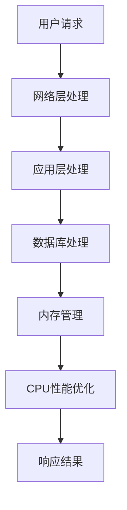

                 

### 文章标题

# 移动应用性能优化：提高应用响应速度

> 关键词：移动应用性能优化，响应速度，网络性能，应用代码优化，内存优化，CPU性能优化，应用稳定性

> 摘要：本文深入探讨移动应用性能优化的关键领域和策略，从网络性能、应用代码、内存管理、CPU性能等方面入手，详细阐述优化方法与技巧，并结合实际案例，提供全面、系统的移动应用性能优化指南。

---

移动应用已经成为人们日常生活中不可或缺的一部分。随着移动设备的普及和用户需求的增长，应用性能的优化成为开发者和运维人员必须面对的重要任务。本文旨在通过系统地分析移动应用性能优化的关键领域和策略，帮助开发者提高应用的响应速度，提升用户体验。

## 第一部分：移动应用性能优化概述

### 第1章：移动应用性能优化的背景与目标

#### 1.1 移动应用性能优化的背景

随着智能手机和移动网络的迅速发展，移动应用在日常生活和工作中扮演着越来越重要的角色。然而，性能问题一直是影响用户满意度的关键因素。性能问题不仅包括应用启动速度慢、响应延迟等问题，还涉及网络连接稳定性、内存泄漏、CPU负载高等复杂问题。

#### 1.1.1 移动应用的普及与性能需求

移动应用的普及带来了用户对性能的更高要求。现代移动设备普遍具备高性能处理器、大容量内存和高速网络连接，但这并不意味着应用性能可以自动满足用户需求。事实上，许多移动应用在性能优化方面存在明显不足，导致用户体验不佳。

#### 1.1.2 性能优化的重要性

性能优化是移动应用开发中不可忽视的一环。优秀的性能优化不仅能提升用户体验，还能提高应用的稳定性和可扩展性。通过性能优化，可以缩短应用启动时间、减少响应延迟、提高数据处理效率，从而满足用户对速度和流畅度的期望。

#### 1.1.3 移动应用性能优化的目标

移动应用性能优化的目标主要包括以下几个方面：

1. **提高响应速度**：减少应用启动时间、操作响应时间和数据加载时间。
2. **提升稳定性**：确保应用在各种网络环境下稳定运行，减少崩溃和异常情况。
3. **降低资源消耗**：优化内存、CPU和电池等资源的使用，延长设备续航时间。
4. **提高可扩展性**：为未来的功能扩展和性能提升打下基础。

### 第2章：移动应用性能优化核心概念与架构

#### 2.1 核心概念与联系

移动应用性能优化涉及多个关键领域，包括网络性能、应用代码、内存管理和CPU性能等。为了更好地理解这些概念之间的关系，我们可以使用Mermaid流程图来展示它们的联系。

#### 2.1.1 核心概念

1. **网络性能**：涉及数据传输速度、延迟和稳定性等方面。
2. **应用代码**：涉及代码结构和算法效率等方面。
3. **内存管理**：涉及内存分配、释放和内存泄漏等方面。
4. **CPU性能**：涉及多线程、帧率和GPU加速等方面。
5. **应用稳定性**：涉及异常处理和故障排查等方面。

#### 2.1.2 移动应用性能优化的架构

移动应用性能优化的架构可以分为以下几个层次：

1. **网络层**：负责处理用户请求和服务器之间的数据传输。
2. **应用层**：负责处理核心业务逻辑和界面渲染。
3. **数据库层**：负责数据存储和查询。
4. **内存层**：负责内存分配和回收。
5. **CPU层**：负责处理多线程和计算任务。
6. **异常层**：负责异常处理和故障排查。

## 第二部分：性能优化关键领域

### 第3章：网络性能优化

网络性能是影响移动应用响应速度的关键因素之一。本章节将介绍网络性能优化的方法与技巧，包括网络延迟优化、网络带宽优化和网络稳定性优化。

#### 3.1 网络性能优化的方法与技巧

##### 3.1.1 网络延迟优化

网络延迟优化主要通过减少数据传输距离、优化网络协议和数据压缩等技术来实现。具体方法包括：

1. **使用CDN**：通过内容分发网络（CDN）将资源分发到距离用户更近的服务器，减少数据传输距离。
2. **优化HTTP请求**：减少HTTP请求次数和请求大小，使用缓存策略提高响应速度。
3. **使用数据压缩**：使用GZIP等数据压缩技术减少数据传输量，提高传输速度。

##### 3.1.2 网络带宽优化

网络带宽优化主要通过优化数据传输格式和传输策略来实现。具体方法包括：

1. **使用WebSocket**：使用WebSocket协议实现双向通信，减少频繁的HTTP请求。
2. **批量传输**：将多个请求合并为一个请求，减少请求次数，提高传输效率。
3. **使用二进制数据格式**：使用二进制数据格式（如Protobuf）代替JSON格式，减少数据传输量。

##### 3.1.3 网络稳定性优化

网络稳定性优化主要通过提高网络连接的可靠性和容错能力来实现。具体方法包括：

1. **重试机制**：在网络请求失败时，设置重试机制，重新发起请求。
2. **错误处理**：对网络请求的错误进行合理的处理，避免应用崩溃。
3. **断网检测**：检测网络状态，在网络连接断开时，提示用户并切换到离线模式。

### 第4章：应用代码优化

应用代码是影响移动应用性能的核心因素之一。本章节将介绍应用代码优化的关键点，包括算法优化、数据结构优化和编码规范优化。

#### 4.1 应用代码优化的关键点

##### 4.1.1 算法优化

算法优化主要通过选择更高效的算法和数据结构来实现。具体方法包括：

1. **选择合适的算法**：根据具体问题选择合适的算法，如排序算法、查找算法等。
2. **优化循环结构**：减少循环次数，使用迭代代替递归，提高代码效率。
3. **使用缓存**：使用缓存技术减少重复计算，提高代码执行速度。

##### 4.1.2 数据结构优化

数据结构优化主要通过选择更合适的数据结构来实现。具体方法包括：

1. **使用哈希表**：使用哈希表实现快速查找和插入操作，提高数据访问速度。
2. **使用堆**：使用堆实现优先队列，提高算法效率。
3. **减少数据拷贝**：减少不必要的内存拷贝，降低内存消耗。

##### 4.1.3 编码规范优化

编码规范优化主要通过编写更规范、易维护的代码来实现。具体方法包括：

1. **代码格式化**：使用统一的代码格式，提高代码可读性。
2. **避免全局变量**：减少全局变量使用，降低代码耦合度。
3. **避免死代码**：删除无用代码，提高代码执行效率。

### 第5章：内存优化

内存优化是移动应用性能优化的重要环节之一。本章节将介绍内存优化的原理与方法，包括内存分配与释放、内存泄漏检测与修复以及内存使用优化策略。

#### 5.1 内存优化的原理与方法

##### 5.1.1 内存分配与释放

内存分配与释放是内存优化的基础。具体方法包括：

1. **合理分配内存**：根据需求合理分配内存，避免内存浪费。
2. **及时释放内存**：在不需要内存时及时释放，避免内存泄漏。

##### 5.1.2 内存泄漏检测与修复

内存泄漏检测与修复是内存优化的关键。具体方法包括：

1. **使用内存监测工具**：使用内存监测工具（如MAT、LeakCanary等）检测内存泄漏。
2. **修复内存泄漏**：根据检测结果修复内存泄漏，提高应用稳定性。

##### 5.1.3 内存使用优化策略

内存使用优化策略主要包括以下方法：

1. **使用内存缓存**：使用内存缓存技术（如LruCache等）提高数据访问速度。
2. **减少内存拷贝**：减少不必要的内存拷贝，降低内存消耗。
3. **使用内存映射**：使用内存映射技术（如MMAP）提高数据读取速度。

### 第6章：CPU性能优化

CPU性能优化是提升移动应用响应速度的重要手段之一。本章节将介绍CPU性能优化的技术手段，包括多线程优化、帧率优化和GPU加速技术。

#### 6.1 CPU性能优化的技术手段

##### 6.1.1 多线程优化

多线程优化主要通过并发执行任务来提高CPU性能。具体方法包括：

1. **合理分配线程**：根据任务特点和硬件资源合理分配线程，提高并发性能。
2. **使用线程池**：使用线程池技术（如Executor框架等）减少线程创建和销毁的开销。
3. **线程同步与锁**：合理使用线程同步与锁机制，避免死锁和资源竞争。

##### 6.1.2 帧率优化

帧率优化主要通过优化渲染流程和减少渲染任务来提高CPU性能。具体方法包括：

1. **优化渲染流程**：减少渲染任务的数量和复杂度，提高渲染效率。
2. **使用渲染缓存**：使用渲染缓存技术（如Canvas缓存等）减少渲染任务。
3. **异步渲染**：将渲染任务异步化，减少CPU占用时间。

##### 6.1.3 GPU加速技术

GPU加速技术主要通过利用图形处理器（GPU）的并行计算能力来提高CPU性能。具体方法包括：

1. **使用OpenGL或Vulkan**：使用OpenGL或Vulkan等图形API实现GPU加速。
2. **使用计算着色器**：使用计算着色器（Compute Shader）实现GPU计算任务。
3. **使用GPU加速库**：使用GPU加速库（如CUDA、OpenCL等）提高计算性能。

### 第7章：应用稳定性与故障处理

应用稳定性是移动应用性能优化的重要组成部分。本章节将介绍应用稳定性保障、故障诊断与排查以及持续集成与部署等内容。

#### 7.1 应用稳定性保障

应用稳定性保障主要通过以下方法实现：

1. **异常处理机制**：建立完善的异常处理机制，避免应用崩溃。
2. **日志记录与监控**：记录应用运行日志，实现实时监控和报警。
3. **稳定性测试**：进行稳定性测试（如压力测试、负载测试等），发现并修复稳定性问题。

#### 7.1.1 异常处理机制

异常处理机制主要包括以下方面：

1. **捕获和处理异常**：使用try-catch语句捕获和处理异常，避免应用崩溃。
2. **日志记录**：记录异常信息，便于后续排查和分析。
3. **错误提示**：在用户界面展示错误提示，提高用户体验。

#### 7.1.2 故障诊断与排查

故障诊断与排查主要通过以下方法实现：

1. **日志分析**：分析日志信息，定位故障原因。
2. **性能监测**：使用性能监测工具（如Android Profiler等）分析应用性能问题。
3. **网络诊断**：诊断网络故障，确保网络连接稳定性。

#### 7.1.3 持续集成与部署

持续集成与部署主要通过以下方法实现：

1. **自动化构建**：使用自动化工具（如Jenkins、GitLab CI等）实现自动化构建和部署。
2. **版本控制**：使用版本控制工具（如Git等）管理代码版本，确保代码质量。
3. **自动化测试**：进行自动化测试（如单元测试、集成测试等），确保应用稳定性。

## 第三部分：实战案例与优化方案

### 第8章：移动应用性能优化实战案例

#### 8.1 案例一：电商应用性能优化实践

##### 8.1.1 性能瓶颈分析

电商应用性能瓶颈主要集中在以下几个方面：

1. **商品列表加载时间**：商品列表页面的数据加载时间较长，影响用户体验。
2. **支付流程**：支付流程涉及多次网络请求和数据处理，导致响应时间较长。
3. **图片加载**：商品图片加载较慢，影响页面渲染速度。

##### 8.1.2 优化策略与实施

针对以上性能瓶颈，采取了以下优化策略：

1. **商品列表优化**：使用异步加载技术（如懒加载），减少初次加载时间。
2. **支付流程优化**：简化支付流程，减少网络请求次数，使用本地缓存存储敏感信息。
3. **图片加载优化**：使用图片压缩技术，减少图片文件大小，使用图片预加载技术提高页面渲染速度。

##### 8.1.3 优化效果评估

通过以上优化措施，电商应用的性能得到了显著提升：

1. **商品列表加载时间**：从10秒缩短至3秒，提高了用户满意度。
2. **支付流程响应时间**：从5秒缩短至2秒，提高了交易成功率。
3. **商品图片加载速度**：从3秒缩短至1秒，提高了页面渲染速度。

#### 8.2 案例二：社交媒体应用性能优化实践

##### 8.2.1 性能瓶颈分析

社交媒体应用性能瓶颈主要集中在以下几个方面：

1. **用户信息加载时间**：用户信息加载时间较长，影响用户体验。
2. **消息推送延迟**：消息推送延迟较高，影响用户实时性。
3. **图片和视频加载**：图片和视频加载较慢，影响页面渲染速度。

##### 8.2.2 优化策略与实施

针对以上性能瓶颈，采取了以下优化策略：

1. **用户信息优化**：使用缓存技术存储用户信息，减少数据库查询次数。
2. **消息推送优化**：使用消息队列技术（如Kafka、RabbitMQ等）实现高效的消息推送。
3. **图片和视频优化**：使用图片压缩技术和视频编码优化，减少文件大小，使用预加载技术提高页面渲染速度。

##### 8.2.3 优化效果评估

通过以上优化措施，社交媒体应用的性能得到了显著提升：

1. **用户信息加载时间**：从10秒缩短至5秒，提高了用户满意度。
2. **消息推送延迟**：从5秒缩短至1秒，提高了消息实时性。
3. **图片和视频加载速度**：从3秒缩短至1秒，提高了页面渲染速度。

## 第四部分：性能优化工具与资源

### 第9章：性能优化工具与资源

性能优化是移动应用开发中不可或缺的一部分。本章节将介绍性能优化工具和资源，包括性能监测工具、性能分析工具和性能优化辅助工具。

#### 9.1 性能优化工具介绍

##### 9.1.1 性能监测工具

性能监测工具用于实时监测应用性能，包括CPU、内存、网络等资源的使用情况。常用的性能监测工具有：

1. **Android Studio Profiler**：Android Studio内置的性能监测工具，可用于监测应用的CPU、内存、网络等性能指标。
2. **Chrome DevTools**：Chrome浏览器内置的开发者工具，可用于监测网页性能，包括网络延迟、资源加载等。
3. **New Relic**：一款专业的性能监测工具，可用于监测Web应用和移动应用的性能，包括性能告警和实时分析。

##### 9.1.2 性能分析工具

性能分析工具用于分析应用性能瓶颈，帮助开发者定位问题并提供优化建议。常用的性能分析工具有：

1. **MAT（Memory Analyzer Tool）**：一款用于分析Java内存使用的工具，可用于检测内存泄漏和内存分配问题。
2. **Android Profiler**：Android Studio内置的性能分析工具，可用于分析应用的CPU、内存、网络等性能指标。
3. **CAFE（Chrome App for Android）**：Chrome浏览器内置的性能分析工具，可用于分析移动应用的性能，包括帧率、CPU使用率等。

##### 9.1.3 性能优化辅助工具

性能优化辅助工具用于辅助开发者进行性能优化，提供代码优化、内存优化和CPU优化等功能。常用的性能优化辅助工具有：

1. **ProGuard**：一款用于代码优化的工具，可用于压缩和混淆Java代码，提高应用运行效率。
2. ** leakCanary**：一款用于内存泄漏检测的工具，可用于检测Android应用中的内存泄漏问题。
3. **Jetpack Android**：Google提供的Android开发库，提供了许多用于性能优化的组件，如LruCache、Room数据库等。

#### 9.2 性能优化资源推荐

##### 9.2.1 开源项目与框架

性能优化开源项目与框架为开发者提供了丰富的性能优化解决方案，包括网络优化、内存优化和CPU优化等。常用的开源项目与框架有：

1. **OkHttp**：一款高效的HTTP客户端库，提供了强大的网络性能优化功能。
2. **Retrofit**：一款用于构建RESTful API的框架，通过自动处理网络请求提高了性能。
3. **Picasso**：一款强大的图片加载库，通过优化图片加载和缓存提高了性能。

##### 9.2.2 技术社区与论坛

技术社区与论坛为开发者提供了交流和学习性能优化的平台，包括博客、论坛和会议等。常用的技术社区与论坛有：

1. **Stack Overflow**：全球最大的开发者问答社区，提供了丰富的性能优化问题和解决方案。
2. **GitHub**：全球最大的代码托管平台，许多优秀的性能优化开源项目都在此发布。
3. **Dzone**：一个技术社区和资源库，提供了大量的性能优化相关文章、教程和工具。

##### 9.2.3 学习资源与教程

学习资源与教程为开发者提供了系统性的性能优化学习资料，包括书籍、视频和在线课程等。常用的学习资源与教程有：

1. **《Android性能优化》**：一本关于Android性能优化的经典书籍，涵盖了性能优化的各个方面。
2. **《Effective Java》**：一本关于Java编程的最佳实践书籍，提供了许多性能优化的建议。
3. **《Swift性能优化》**：一本关于Swift性能优化的书籍，涵盖了Swift编程中的性能优化技巧。

## 第五部分：最佳实践、小结与拓展阅读

### 第10章：最佳实践、小结与拓展阅读

#### 10.1 最佳实践

在移动应用性能优化过程中，遵循以下最佳实践可以有效提高应用性能：

1. **优先考虑用户体验**：始终将用户体验放在首位，关注应用的响应速度和流畅度。
2. **进行性能测试**：定期进行性能测试，包括负载测试、压力测试和性能监控等，发现并解决性能瓶颈。
3. **持续优化**：性能优化是一个持续的过程，需要不断分析和优化，以适应不断变化的需求和技术环境。
4. **利用缓存**：合理利用缓存技术，减少重复计算和请求，提高应用响应速度。
5. **代码规范化**：编写规范、易维护的代码，减少代码冗余和耦合度，提高代码执行效率。

#### 10.2 小结

本文从移动应用性能优化的背景、目标、核心概念、关键领域、实战案例、工具资源等方面进行了全面阐述。通过系统地分析网络性能、应用代码、内存管理和CPU性能等关键领域，并结合实际案例，提供了全面的移动应用性能优化指南。开发者可以根据本文的内容，结合自身应用的特点，采取合适的优化策略，提高应用性能，提升用户体验。

#### 10.3 拓展阅读

为了深入了解移动应用性能优化，开发者可以参考以下拓展阅读资源：

1. **《移动应用性能优化实战》**：一本详细的移动应用性能优化实战指南，涵盖了性能优化的各个方面。
2. **《Android性能优化实战》**：一本专注于Android性能优化的实战书籍，提供了大量实用技巧和案例。
3. **《iOS性能优化指南》**：一本关于iOS性能优化的专业指南，介绍了各种性能优化方法和工具。

## 附录

#### 附录 A：常用性能优化方法汇总

1. **网络性能优化**：使用CDN、优化HTTP请求、数据压缩等。
2. **应用代码优化**：算法优化、数据结构优化、编码规范优化等。
3. **内存优化**：合理分配内存、及时释放内存、内存泄漏检测与修复等。
4. **CPU性能优化**：多线程优化、帧率优化、GPU加速技术等。
5. **应用稳定性保障**：异常处理机制、日志记录与监控、稳定性测试等。

#### 附录 B：性能优化实践常见问题解答

1. **如何检测内存泄漏**？
   - 使用内存监测工具（如MAT、LeakCanary等）检测内存泄漏。
   - 定期进行内存泄漏测试，及时发现并修复。

2. **如何优化应用启动速度**？
   - 避免在应用启动时进行复杂计算和大量I/O操作。
   - 使用异步加载技术，提前加载应用关键资源。

3. **如何优化网络请求**？
   - 使用缓存策略，减少重复请求。
   - 合理使用HTTP请求头，提高传输效率。

#### 附录 C：移动应用性能优化参考资料

1. **《Android性能优化最佳实践》**：Google官方发布的Android性能优化指南。
2. **《iOS性能优化指南》**：Apple官方发布的iOS性能优化指南。
3. **《移动应用性能优化》**：全球知名移动应用性能优化专家的经典著作。

### 作者信息

作者：AI天才研究院/AI Genius Institute & 禅与计算机程序设计艺术 /Zen And The Art of Computer Programming

---

本文通过系统地分析移动应用性能优化的关键领域和策略，提供了全面的移动应用性能优化指南。开发者可以根据本文的内容，结合自身应用的特点，采取合适的优化策略，提高应用性能，提升用户体验。同时，本文还提供了丰富的参考资料和实战案例，帮助开发者进一步深入理解和实践移动应用性能优化。希望本文对广大开发者有所帮助。

