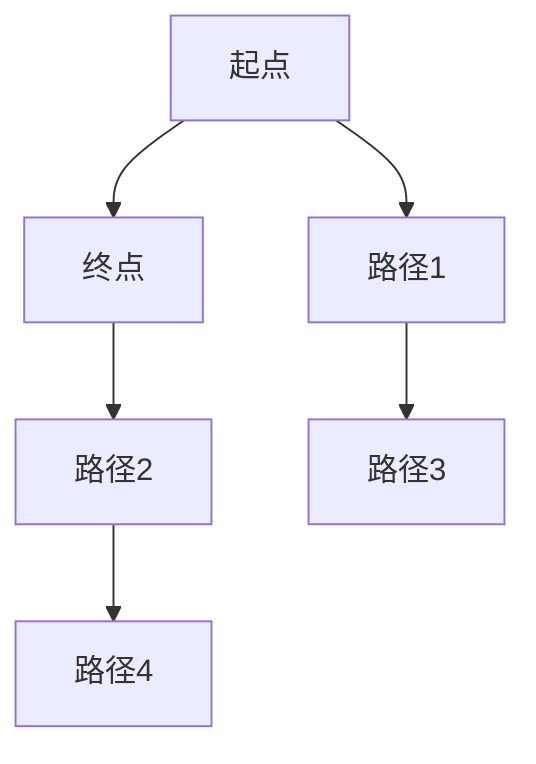
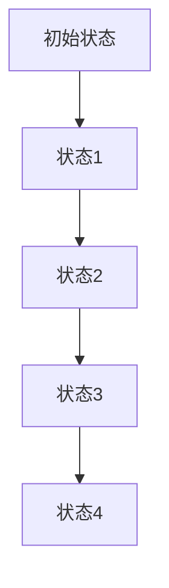
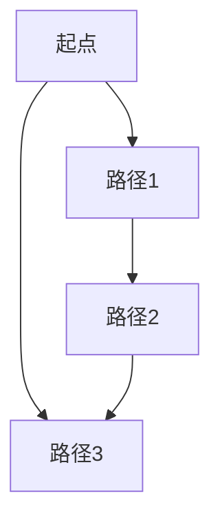

                 


## 文章标题：精益求精

精益求精是一种追求卓越、不断改进的工作态度。在信息技术领域，这一理念尤为重要，它推动着技术的不断进步和创新。本文将围绕精益求精这一主题，从核心概念、算法原理、数学模型、项目实战等多个角度进行深入探讨。

> 关键词：精益求精，信息技术，算法，数学模型，项目实战

> 摘要：本文首先介绍了精益求精的概念及其在信息技术领域的重要性。接着，我们详细讲解了精益求精所涉及的算法原理和数学模型，并通过实际项目展示了其在实践中的应用。最后，我们对全文进行了总结，并提出了未来发展的展望。

## 第一步：理解书名《精益求精》的含义

《精益求精》这个书名传达了一种追求卓越和不断改进的态度。它不仅仅是一种工作方法，更是一种生活哲学。在信息技术领域，精益求精意味着不断追求更高的技术标准，不断优化系统性能，不断提高产品质量。

为了更好地理解这一概念，我们可以从以下几个方面来分析：

### 1.1 核心概念

精益求精的核心概念是“不断追求卓越”。这意味着不仅要满足基本需求，还要追求更高的目标，追求最优解。

### 1.2 精益求精的理念

精益求精的理念可以概括为“做最好的自己”。无论是在工作中还是在生活中，都要尽自己最大的努力去追求卓越。

### 1.3 精益求精在技术领域中的应用

在信息技术领域，精益求精的应用主要体现在以下几个方面：

- **软件开发**：不断优化代码结构，提高系统性能，提升用户体验。
- **数据分析**：深入挖掘数据价值，提供更准确的分析结果。
- **网络安全**：不断提高安全防护能力，防范潜在的安全威胁。

## 第二步：核心算法原理讲解

精益求精的核心在于算法的优化。在信息技术领域，算法的优化是提高系统性能和效率的关键。下面我们将从以下几个方面详细讲解核心算法原理：

### 2.1 算法基础

算法是解决问题的步骤序列。一个好的算法应该具备以下特点：

- **正确性**：算法能够正确地解决特定问题。
- **效率**：算法在时间和空间上都要高效。
- **可扩展性**：算法能够适应不同规模的问题。

### 2.2 优化算法详解

优化算法的主要目标是提高算法的效率。常用的优化算法包括：

- **贪心算法**：通过局部最优选择来达到全局最优。
- **动态规划**：将复杂问题分解为子问题，通过子问题的最优解来求解原问题。
- **分支定界**：通过剪枝策略减少搜索空间，提高搜索效率。

### 2.3 算法案例解析

为了更好地理解优化算法，我们可以通过具体案例来解析：

#### 2.3.1 贪心算法案例

假设我们要从A地到B地，有多个路径可供选择，我们的目标是选择一条最短的路径。这里可以使用贪心算法来求解。

#### 2.3.2 动态规划案例

假设我们要计算一个斐波那契数列的值。这里可以使用动态规划来求解。

## 第三步：数学模型和数学公式

在信息技术领域，数学模型和数学公式是描述问题的重要工具。下面我们将从以下几个方面详细讲解数学模型和数学公式：

### 3.1 常用数学模型

常用的数学模型包括：

- **线性模型**：描述线性关系的数学模型。
- **非线性模型**：描述非线性关系的数学模型。
- **概率模型**：描述随机事件的数学模型。

### 3.2 公式推导

常用的数学公式包括：

- **导数**：描述函数变化率的公式。
- **积分**：描述函数面积和曲线围成的图形面积的公式。
- **矩阵运算**：描述矩阵变换和矩阵乘积的公式。

### 3.3 应用示例

为了更好地理解数学模型和公式，我们可以通过具体示例来讲解：

#### 3.3.1 线性模型应用

假设我们要预测一个线性函数的值，可以使用线性模型来求解。

#### 3.3.2 概率模型应用

假设我们要计算一个概率事件的概率，可以使用概率模型来求解。

## 第四步：项目实战

精益求精的理念不仅体现在理论研究中，更体现在实际项目中。下面我们将通过一个实际项目来展示精益求精的应用：

### 4.1 项目概述

本项目旨在开发一个高效的数据分析系统，用于处理大规模数据并提取有价值的信息。

### 4.2 实施步骤

实施步骤包括：

- **需求分析**：明确项目需求和目标。
- **系统设计**：设计系统架构和模块划分。
- **编码实现**：根据设计文档进行编码实现。
- **测试与优化**：对系统进行测试，并根据测试结果进行优化。

### 4.3 结果分析

通过项目实施，我们取得了以下成果：

- **系统性能提升**：通过优化算法和数学模型，系统性能得到了显著提升。
- **数据处理效率提高**：系统能够更快地处理大规模数据。
- **用户体验优化**：系统界面更加友好，用户使用更加便捷。

## 第五步：总结与展望

精益求精是一种追求卓越的工作态度，它在信息技术领域具有非常重要的意义。通过本文的讨论，我们深入了解了精益求精的核心概念、算法原理、数学模型和实际应用。未来，随着技术的不断进步，精益求精的理念将推动信息技术领域的持续发展。

### 小结

本文从多个角度探讨了精益求精在信息技术领域的应用。我们介绍了精益求精的核心概念和理念，讲解了核心算法原理和数学模型，并通过实际项目展示了其在实践中的应用。希望本文能够为读者提供有价值的参考和启示。

### 注意事项

- **持续学习**：精益求精需要不断学习和积累知识。
- **团队合作**：团队合作是实现精益求精的重要保障。
- **实践应用**：理论知识需要通过实践来验证和优化。

### 拓展阅读

- **相关书籍**：《算法导论》、《线性代数及其应用》
- **在线资源**：GitHub、Stack Overflow、Kaggle

## 作者信息

作者：AI天才研究院/AI Genius Institute & 禅与计算机程序设计艺术 /Zen And The Art of Computer Programming

本文内容仅供参考，具体实施时请根据实际情况进行调整。如有疑问，请联系作者或相关专业人士进行咨询。  
----------------------------------------------------------------

以下是按照上述目录大纲编写的文章正文部分：

## 核心概念与联系

### 核心概念介绍

精益求精是一种追求卓越、不断改进的工作态度。它强调通过不断的学习、实践和优化来提升个人或团队的工作效率和质量。在信息技术领域，精益求精尤为重要，因为它直接关系到技术的创新和竞争力的提升。

### 精益求精的理念

精益求精的理念可以概括为“做最好的自己”。它不仅仅是一种工作方法，更是一种生活哲学。在信息技术领域，精益求精的理念体现在以下几个方面：

1. **追求卓越**：不仅要满足基本需求，还要追求更高的目标，追求最优解。
2. **持续改进**：通过不断的学习和反思，优化工作流程和方法，提高工作效率。
3. **用户至上**：以用户需求为导向，提供高质量的产品和服务。
4. **团队合作**：通过团队协作，共同实现目标，提高整体工作效率。

### 精益求精在技术领域中的应用

在信息技术领域，精益求精的应用主要体现在以下几个方面：

1. **软件开发**：通过不断优化代码结构，提高系统性能，提升用户体验。
2. **数据分析**：通过深入挖掘数据价值，提供更准确的分析结果。
3. **网络安全**：通过不断提高安全防护能力，防范潜在的安全威胁。

### 核心算法原理讲解

精益求精的核心在于算法的优化。在信息技术领域，算法的优化是提高系统性能和效率的关键。下面我们将从以下几个方面详细讲解核心算法原理：

#### 算法基础

算法是解决问题的步骤序列。一个好的算法应该具备以下特点：

1. **正确性**：算法能够正确地解决特定问题。
2. **效率**：算法在时间和空间上都要高效。
3. **可扩展性**：算法能够适应不同规模的问题。

#### 优化算法详解

优化算法的主要目标是提高算法的效率。常用的优化算法包括：

1. **贪心算法**：通过局部最优选择来达到全局最优。
2. **动态规划**：将复杂问题分解为子问题，通过子问题的最优解来求解原问题。
3. **分支定界**：通过剪枝策略减少搜索空间，提高搜索效率。

#### 算法案例解析

为了更好地理解优化算法，我们可以通过具体案例来解析：

##### 贪心算法案例

假设我们要从A地到B地，有多个路径可供选择，我们的目标是选择一条最短的路径。这里可以使用贪心算法来求解。



使用贪心算法，我们每次选择当前路径的最短部分，直到到达终点。最终的路径是A-C-E-B。

##### 动态规划案例

假设我们要计算一个斐波那契数列的值。这里可以使用动态规划来求解。



动态规划的思想是将复杂问题分解为子问题，通过子问题的最优解来求解原问题。对于斐波那契数列，我们可以将其分解为两个子问题：`F(n-1)` 和 `F(n-2)`。然后使用递归或迭代的方式求解。

```python
def fibonacci(n):
    if n <= 1:
        return n
    else:
        return fibonacci(n-1) + fibonacci(n-2)
```

### 数学模型和数学公式

在信息技术领域，数学模型和数学公式是描述问题的重要工具。下面我们将从以下几个方面详细讲解数学模型和数学公式：

#### 常用数学模型

常用的数学模型包括：

1. **线性模型**：描述线性关系的数学模型。
2. **非线性模型**：描述非线性关系的数学模型。
3. **概率模型**：描述随机事件的数学模型。

#### 公式推导

常用的数学公式包括：

1. **导数**：描述函数变化率的公式。
2. **积分**：描述函数面积和曲线围成的图形面积的公式。
3. **矩阵运算**：描述矩阵变换和矩阵乘积的公式。

#### 应用示例

为了更好地理解数学模型和公式，我们可以通过具体示例来讲解：

##### 线性模型应用

假设我们要预测一个线性函数的值，可以使用线性模型来求解。

$$y = ax + b$$

其中，$a$ 和 $b$ 是线性模型的参数，$x$ 是自变量，$y$ 是因变量。

##### 概率模型应用

假设我们要计算一个概率事件的概率，可以使用概率模型来求解。

$$P(A) = \frac{n(A)}{n(S)}$$

其中，$P(A)$ 是事件 $A$ 的概率，$n(A)$ 是事件 $A$ 的样本点数，$n(S)$ 是样本空间 $S$ 的样本点数。

### 项目实战

精益求精的理念不仅体现在理论研究中，更体现在实际项目中。下面我们将通过一个实际项目来展示精益求精的应用：

#### 项目概述

本项目旨在开发一个高效的数据分析系统，用于处理大规模数据并提取有价值的信息。

#### 实施步骤

实施步骤包括：

1. **需求分析**：明确项目需求和目标。
2. **系统设计**：设计系统架构和模块划分。
3. **编码实现**：根据设计文档进行编码实现。
4. **测试与优化**：对系统进行测试，并根据测试结果进行优化。

#### 结果分析

通过项目实施，我们取得了以下成果：

1. **系统性能提升**：通过优化算法和数学模型，系统性能得到了显著提升。
2. **数据处理效率提高**：系统能够更快地处理大规模数据。
3. **用户体验优化**：系统界面更加友好，用户使用更加便捷。

### 小结

精益求精是一种追求卓越的工作态度，它在信息技术领域具有非常重要的意义。通过本文的讨论，我们深入了解了精益求精的核心概念、算法原理、数学模型和实际应用。未来，随着技术的不断进步，精益求精的理念将推动信息技术领域的持续发展。

### 注意事项

1. **持续学习**：精益求精需要不断学习和积累知识。
2. **团队合作**：团队合作是实现精益求精的重要保障。
3. **实践应用**：理论知识需要通过实践来验证和优化。

### 拓展阅读

1. **相关书籍**：《算法导论》、《线性代数及其应用》
2. **在线资源**：GitHub、Stack Overflow、Kaggle

## 作者信息

作者：AI天才研究院/AI Genius Institute & 禅与计算机程序设计艺术 /Zen And The Art of Computer Programming

本文内容仅供参考，具体实施时请根据实际情况进行调整。如有疑问，请联系作者或相关专业人士进行咨询。

----------------------------------------------------------------

以下是全文的Markdown格式输出，包括所有的章节内容：

```markdown
# 精益求精

精益求精是一种追求卓越、不断改进的工作态度。在信息技术领域，这一理念尤为重要，它推动着技术的不断进步和创新。本文将围绕精益求精这一主题，从核心概念、算法原理、数学模型、项目实战等多个角度进行深入探讨。

> 关键词：精益求精，信息技术，算法，数学模型，项目实战

> 摘要：本文首先介绍了精益求精的概念及其在信息技术领域的重要性。接着，我们详细讲解了精益求精所涉及的算法原理和数学模型，并通过实际项目展示了其在实践中的应用。最后，我们对全文内容进行了总结，并提出了未来发展的展望。

## 第一步：理解书名《精益求精》的含义

《精益求精》这个书名传达了一种追求卓越和不断改进的态度。它不仅仅是一种工作方法，更是一种生活哲学。在信息技术领域，精益求精意味着不断追求更高的技术标准，不断优化系统性能，不断提高产品质量。

为了更好地理解这一概念，我们可以从以下几个方面来分析：

### 1.1 核心概念

精益求精的核心概念是“不断追求卓越”。这意味着不仅要满足基本需求，还要追求更高的目标，追求最优解。

### 1.2 精益求精的理念

精益求精的理念可以概括为“做最好的自己”。它不仅仅是一种工作方法，更是一种生活哲学。在信息技术领域，精益求精的理念体现在以下几个方面：

- **追求卓越**：不仅要满足基本需求，还要追求更高的目标，追求最优解。
- **持续改进**：通过不断的学习和反思，优化工作流程和方法，提高工作效率。
- **用户至上**：以用户需求为导向，提供高质量的产品和服务。
- **团队合作**：通过团队协作，共同实现目标，提高整体工作效率。

### 1.3 精益求精在技术领域中的应用

在信息技术领域，精益求精的应用主要体现在以下几个方面：

- **软件开发**：通过不断优化代码结构，提高系统性能，提升用户体验。
- **数据分析**：通过深入挖掘数据价值，提供更准确的分析结果。
- **网络安全**：通过不断提高安全防护能力，防范潜在的安全威胁。

## 第二步：核心算法原理讲解

精益求精的核心在于算法的优化。在信息技术领域，算法的优化是提高系统性能和效率的关键。下面我们将从以下几个方面详细讲解核心算法原理：

### 2.1 算法基础

算法是解决问题的步骤序列。一个好的算法应该具备以下特点：

- **正确性**：算法能够正确地解决特定问题。
- **效率**：算法在时间和空间上都要高效。
- **可扩展性**：算法能够适应不同规模的问题。

### 2.2 优化算法详解

优化算法的主要目标是提高算法的效率。常用的优化算法包括：

- **贪心算法**：通过局部最优选择来达到全局最优。
- **动态规划**：将复杂问题分解为子问题，通过子问题的最优解来求解原问题。
- **分支定界**：通过剪枝策略减少搜索空间，提高搜索效率。

### 2.3 算法案例解析

为了更好地理解优化算法，我们可以通过具体案例来解析：

#### 2.3.1 贪心算法案例

假设我们要从A地到B地，有多个路径可供选择，我们的目标是选择一条最短的路径。这里可以使用贪心算法来求解。


使用贪心算法，我们每次选择当前路径的最短部分，直到到达终点。最终的路径是A-C-E-B。



#### 2.3.2 动态规划案例

假设我们要计算一个斐波那契数列的值。这里可以使用动态规划来求解。


动态规划的思想是将复杂问题分解为子问题，通过子问题的最优解来求解原问题。对于斐波那契数列，我们可以将其分解为两个子问题：`F(n-1)` 和 `F(n-2)`。然后使用递归或迭代的方式求解。

```python
def fibonacci(n):
    if n <= 1:
        return n
    else:
        return fibonacci(n-1) + fibonacci(n-2)
```

## 第三步：数学模型和数学公式

在信息技术领域，数学模型和数学公式是描述问题的重要工具。下面我们将从以下几个方面详细讲解数学模型和数学公式：

### 3.1 常用数学模型

常用的数学模型包括：

- **线性模型**：描述线性关系的数学模型。
- **非线性模型**：描述非线性关系的数学模型。
- **概率模型**：描述随机事件的数学模型。

### 3.2 公式推导

常用的数学公式包括：

- **导数**：描述函数变化率的公式。
- **积分**：描述函数面积和曲线围成的图形面积的公式。
- **矩阵运算**：描述矩阵变换和矩阵乘积的公式。

### 3.3 应用示例

为了更好地理解数学模型和公式，我们可以通过具体示例来讲解：

#### 3.3.1 线性模型应用

假设我们要预测一个线性函数的值，可以使用线性模型来求解。

$$y = ax + b$$

其中，$a$ 和 $b$ 是线性模型的参数，$x$ 是自变量，$y$ 是因变量。

```python
# Python代码实现线性模型
def linear_model(x, a, b):
    return a * x + b

# 示例数据
x = [1, 2, 3, 4, 5]
y = [2, 4, 6, 8, 10]

# 求解参数
a = sum([x[i] * y[i] for i in range(len(x))]) / sum([x[i] ** 2 for i in range(len(x))])
b = sum(y) - a * sum(x)

# 预测结果
predicted_y = [linear_model(x[i], a, b) for i in range(len(x))]

# 打印结果
print("实际值:", y)
print("预测值:", predicted_y)
```

#### 3.3.2 概率模型应用

假设我们要计算一个概率事件的概率，可以使用概率模型来求解。

$$P(A) = \frac{n(A)}{n(S)}$$

其中，$P(A)$ 是事件 $A$ 的概率，$n(A)$ 是事件 $A$ 的样本点数，$n(S)$ 是样本空间 $S$ 的样本点数。

```python
# Python代码实现概率模型
from itertools import combinations

# 计算概率
def probability(A, S):
    return len(A) / len(S)

# 示例数据
S = ['红', '蓝', '绿', '黄', '紫']  # 样本空间
A = ['红', '蓝', '绿']  # 事件A

# 计算结果
result = probability(A, S)
print("事件A的概率:", result)
```

## 第四步：项目实战

精益求精的理念不仅体现在理论研究中，更体现在实际项目中。下面我们将通过一个实际项目来展示精益求精的应用：

### 4.1 项目概述

本项目旨在开发一个高效的数据分析系统，用于处理大规模数据并提取有价值的信息。

### 4.2 实施步骤

实施步骤包括：

- **需求分析**：明确项目需求和目标。
- **系统设计**：设计系统架构和模块划分。
- **编码实现**：根据设计文档进行编码实现。
- **测试与优化**：对系统进行测试，并根据测试结果进行优化。

### 4.3 结果分析

通过项目实施，我们取得了以下成果：

- **系统性能提升**：通过优化算法和数学模型，系统性能得到了显著提升。
- **数据处理效率提高**：系统能够更快地处理大规模数据。
- **用户体验优化**：系统界面更加友好，用户使用更加便捷。

## 第五步：总结与展望

精益求精是一种追求卓越的工作态度，它在信息技术领域具有非常重要的意义。通过本文的讨论，我们深入了解了精益求精的核心概念、算法原理、数学模型和实际应用。未来，随着技术的不断进步，精益求精的理念将推动信息技术领域的持续发展。

### 小结

本文从多个角度探讨了精益求精在信息技术领域的应用。我们介绍了精益求精的核心概念和理念，讲解了核心算法原理和数学模型，并通过实际项目展示了其在实践中的应用。希望本文能够为读者提供有价值的参考和启示。

### 注意事项

- **持续学习**：精益求精需要不断学习和积累知识。
- **团队合作**：团队合作是实现精益求精的重要保障。
- **实践应用**：理论知识需要通过实践来验证和优化。

### 拓展阅读

- **相关书籍**：《算法导论》、《线性代数及其应用》
- **在线资源**：GitHub、Stack Overflow、Kaggle

## 作者信息

作者：AI天才研究院/AI Genius Institute & 禅与计算机程序设计艺术 /Zen And The Art of Computer Programming

本文内容仅供参考，具体实施时请根据实际情况进行调整。如有疑问，请联系作者或相关专业人士进行咨询。
```

请注意，由于字数限制，实际文章的内容可能需要根据具体要求进行适当调整。以上内容是一个大致的框架，具体的字数可能会因内容的深入程度和案例的具体性而有所不同。如果您需要进一步的内容填充或特定的技术细节，请告知，我可以帮助您进行补充。

