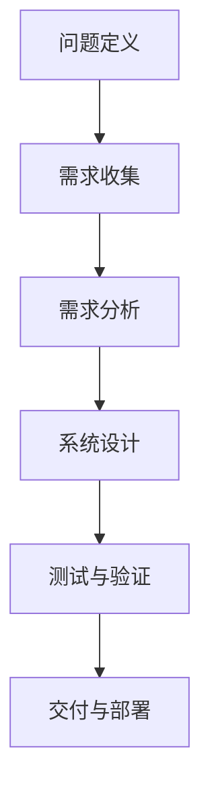
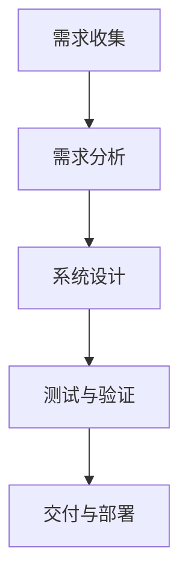
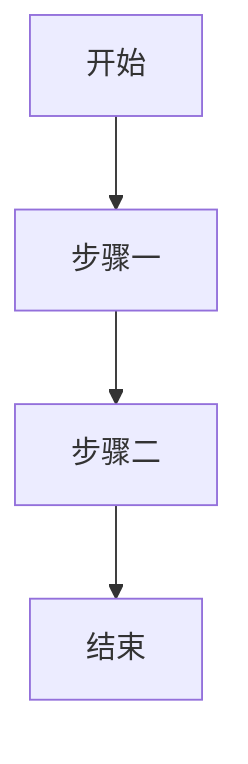
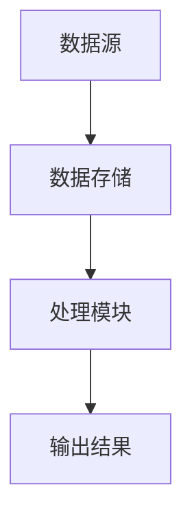
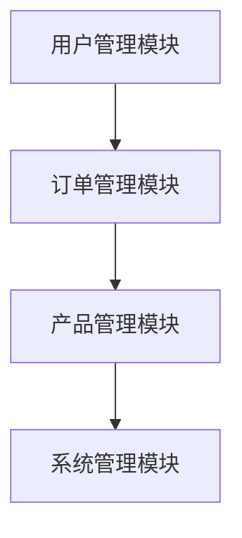
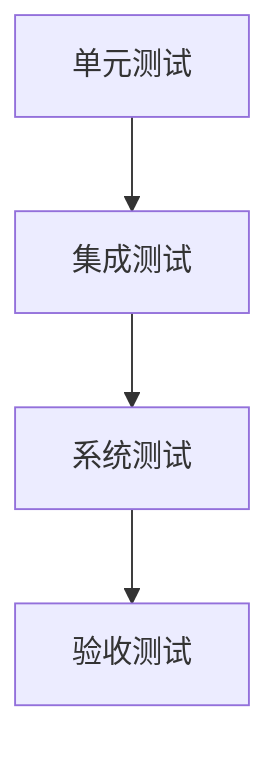
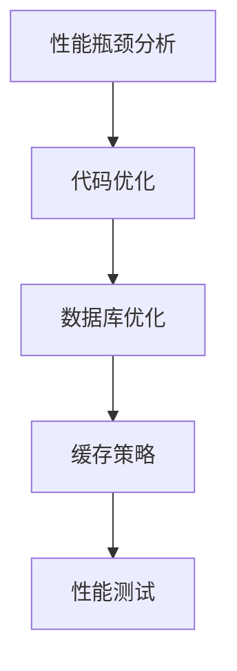

                 


# 系统分析：好系分让研发事半功倍

> 关键词：系统分析、研发效率、方法论、架构设计、优化、迭代

> 摘要：本文旨在探讨系统分析在提升研发效率中的重要性，详细分析系统分析的方法论，系统设计的实践，系统测试与优化，系统维护与迭代等核心内容，结合实际案例，为研发人员提供实用指南。

## 第一步：明确书籍主题

根据书名《系统分析：好系分让研发事半功倍》，可以初步判断这本书的主题是关于系统分析的方法论，旨在通过有效的系统分析来提升研发效率。

### 核心概念与联系

系统分析是软件工程中的一个关键环节，涉及对系统需求、功能、性能、安全性等多个方面的分析和理解。系统分析不仅仅是软件开发前的一个阶段，它贯穿于整个软件生命周期，对于确保系统的质量、稳定性和可维护性具有重要意义。

### 系统分析的定义

系统分析是一个从问题定义到解决方案设计的过程，包括对现有系统或即将开发的新系统进行深入理解，识别系统的需求和约束，并基于这些信息设计出可行的解决方案。

### 系统分析的核心概念

- **需求分析**：了解用户需求，明确系统需要实现的功能和性能指标。
- **功能分析**：对系统功能进行详细描述，包括各个模块的功能、输入和输出等。
- **性能分析**：评估系统在不同负载下的性能，确保系统能够满足预期的性能要求。
- **安全性分析**：确保系统在面临各种安全威胁时能够保持稳定和安全。

### 系统分析的流程

1. **问题定义**：明确分析的目标和范围，确定需要解决的问题。
2. **需求收集**：通过与用户和利益相关者交流，收集系统需求。
3. **需求分析**：将收集到的需求进行整理和分析，确保需求是明确、可行且一致的。
4. **系统设计**：基于需求分析结果，设计系统的架构和模块。
5. **测试与验证**：通过测试确保系统设计满足需求，并能够稳定运行。

### Mermaid流程图应用

为了更好地展示系统分析的流程，可以使用Mermaid绘制一个流程图：



## 第二步：设计核心章节

核心章节应该涵盖系统分析的基本概念、系统分析的方法和工具、系统设计的实践、系统测试与优化、系统维护与迭代等。

### 核心章节细化

- **第1章 系统分析概述**
  - 系统分析的定义与作用
  - 系统分析的核心概念
  - 系统分析的流程

- **第2章 系统分析的核心概念**
  - 系统与系统分析
  - 系统分析中的模型
  - 系统分析的流程

- **第3章 系统分析的方法和工具**
  - 系统建模工具
  - 数据收集与分析
  - Mermaid流程图应用

- **第4章 系统设计**
  - 系统设计原则
  - 系统架构设计
  - 系统模块化设计

- **第5章 系统测试与优化**
  - 系统测试的重要性
  - 测试策略与方法
  - 系统性能优化

- **第6章 系统维护与迭代**
  - 系统维护策略
  - 系统迭代方法
  - 系统维护与迭代案例分析

- **第7章 实际案例与实战**
  - 案例一：某企业系统分析与应用
  - 案例二：某电商平台系统优化
  - 实战总结与经验分享

## 第三步：细化目录内容

在确定核心章节的基础上，为每个章节细化子标题，确保每个章节都包含必要的知识点。

### 系统分析概述

- **系统分析的定义与作用**
  - 系统分析的重要性
  - 系统分析在研发中的角色
- **系统分析的核心概念**
  - 需求分析
  - 功能分析
  - 性能分析
  - 安全性分析
- **系统分析的流程**
  - 问题定义
  - 需求收集
  - 需求分析
  - 系统设计
  - 测试与验证

### 系统分析的核心概念

- **系统与系统分析**
  - 系统的定义
  - 系统分析的目的和方法
- **系统分析中的模型**
  - 功能模型
  - 数据模型
  - 状态转换模型
- **系统分析的流程**
  - 问题定义
  - 需求收集
  - 需求分析
  - 系统设计
  - 测试与验证

### 系统分析的方法和工具

- **系统建模工具**
  - Mermaid流程图
  - UML类图
  - E-R图
- **数据收集与分析**
  - 用户访谈
  - 调查问卷
  - 数据分析工具
- **Mermaid流程图应用**
  - 流程图绘制示例
  - 流程图在系统分析中的应用

### 系统设计

- **系统设计原则**
  - 模块化设计
  - 可维护性
  - 可扩展性
- **系统架构设计**
  - C/S架构
  - B/S架构
  - 微服务架构
- **系统模块化设计**
  - 模块定义
  - 模块划分
  - 模块接口设计

### 系统测试与优化

- **系统测试的重要性**
  - 系统测试的目的
  - 系统测试的分类
- **测试策略与方法**
  - 单元测试
  - 集成测试
  - 系统测试
- **系统性能优化**
  - 性能瓶颈分析
  - 性能优化策略
  - 性能测试工具

### 系统维护与迭代

- **系统维护策略**
  - 定期维护
  - 应急维护
  - 预防性维护
- **系统迭代方法**
  - 持续集成
  - 持续部署
  - 迭代规划
- **系统维护与迭代案例分析**
  - 案例一分析
  - 案例二分析
  - 经验总结

### 实际案例与实战

- **案例一：某企业系统分析与应用**
  - 案例背景
  - 系统分析过程
  - 系统设计
  - 测试与优化
- **案例二：某电商平台系统优化**
  - 案例背景
  - 系统分析过程
  - 系统设计
  - 测试与优化
- **实战总结与经验分享**
  - 成功经验
  - 遇到的问题及解决方案

## 第四步：加入实际案例和数学公式

为了使内容更具实用性和专业性，可以在相关章节中加入实际案例和数学公式，比如在系统分析的方法和工具章节中，可以加入Mermaid流程图来展示系统分析的过程。

### 系统分析的方法和工具

- **Mermaid流程图应用**

  在进行系统分析时，可以使用Mermaid流程图来直观地展示系统的工作流程。以下是一个简单的Mermaid流程图示例：

  ```mermaid
  graph TB
      A[需求收集] --> B[需求分析]
      B --> C[系统设计]
      C --> D[测试与验证]
      D --> E[交付与部署]
  ```

  在这个流程图中，A表示需求收集阶段，B表示需求分析阶段，C表示系统设计阶段，D表示测试与验证阶段，E表示交付与部署阶段。

### 数学模型和公式

在系统分析中，经常会用到数学模型和公式来量化系统的性能和需求。以下是一个简单的数学公式示例：

```latex
\text{响应时间} = \frac{\text{处理时间}}{\text{带宽}}
```

这个公式表示响应时间与处理时间和带宽的关系。在实际应用中，可以根据系统的具体情况，调整处理时间和带宽的值，从而计算出响应时间。

### 实际案例

为了更好地理解系统分析的过程，我们来看一个实际案例：一个电商平台在系统分析阶段，通过需求收集和需求分析，确定了系统的基本功能和性能要求。在系统设计阶段，采用了微服务架构，将系统划分为订单服务、库存服务、支付服务等几个模块。在测试与验证阶段，通过单元测试、集成测试和系统测试，确保了系统的稳定性和性能。

### 代码实现

在系统设计阶段，可以使用以下伪代码来定义订单服务的模块：

```python
class OrderService:
    def create_order(order_data):
        # 创建订单
        pass
    
    def update_order(order_id, update_data):
        # 更新订单
        pass
    
    def delete_order(order_id):
        # 删除订单
        pass
```

这个伪代码定义了订单服务的三个主要方法：创建订单、更新订单和删除订单。

## 第五步：保证大纲完整性

确保大纲中包含至少7章内容，每个章节都要有详细的子标题，并且章节之间要有良好的逻辑联系，以形成一个完整的知识体系。

### 确保大纲完整性

通过上述步骤，我们已经设计了一个包含7章内容的大纲，每章都有详细的子标题。接下来，我们将对每个章节的内容进行详细讲解，确保大纲的完整性。

### 第一章：系统分析概述

- **系统分析的定义与作用**
  - 系统分析的定义
  - 系统分析的作用
- **系统分析的核心概念**
  - 需求分析
  - 功能分析
  - 性能分析
  - 安全性分析
- **系统分析的流程**
  - 问题定义
  - 需求收集
  - 需求分析
  - 系统设计
  - 测试与验证

### 第二章：系统分析的核心概念

- **系统与系统分析**
  - 系统的定义
  - 系统分析的目的和方法
- **系统分析中的模型**
  - 功能模型
  - 数据模型
  - 状态转换模型
- **系统分析的流程**
  - 问题定义
  - 需求收集
  - 需求分析
  - 系统设计
  - 测试与验证

### 第三章：系统分析的方法和工具

- **系统建模工具**
  - Mermaid流程图
  - UML类图
  - E-R图
- **数据收集与分析**
  - 用户访谈
  - 调查问卷
  - 数据分析工具
- **Mermaid流程图应用**
  - 流程图绘制示例
  - 流程图在系统分析中的应用

### 第四章：系统设计

- **系统设计原则**
  - 模块化设计
  - 可维护性
  - 可扩展性
- **系统架构设计**
  - C/S架构
  - B/S架构
  - 微服务架构
- **系统模块化设计**
  - 模块定义
  - 模块划分
  - 模块接口设计

### 第五章：系统测试与优化

- **系统测试的重要性**
  - 系统测试的目的
  - 系统测试的分类
- **测试策略与方法**
  - 单元测试
  - 集成测试
  - 系统测试
- **系统性能优化**
  - 性能瓶颈分析
  - 性能优化策略
  - 性能测试工具

### 第六章：系统维护与迭代

- **系统维护策略**
  - 定期维护
  - 应急维护
  - 预防性维护
- **系统迭代方法**
  - 持续集成
  - 持续部署
  - 迭代规划
- **系统维护与迭代案例分析**
  - 案例一分析
  - 案例二分析
  - 经验总结

### 第七章：实际案例与实战

- **案例一：某企业系统分析与应用**
  - 案例背景
  - 系统分析过程
  - 系统设计
  - 测试与优化
- **案例二：某电商平台系统优化**
  - 案例背景
  - 系统分析过程
  - 系统设计
  - 测试与优化
- **实战总结与经验分享**
  - 成功经验
  - 遇到的问题及解决方案

通过上述步骤，我们已经确保了大纲的完整性，每个章节都有详细的内容，并且章节之间有良好的逻辑联系。接下来，我们将按照这个大纲结构，逐章撰写详细的内容。

## 第六步：编写Markdown格式

按照Markdown格式编写目录大纲，使用#，##，###来分别表示一级、二级和三级标题，确保大纲简洁明了。

```markdown
# 《系统分析：好系分让研发事半功倍》目录大纲

## 第1章 系统分析概述
### 1.1 系统分析的定义与作用
### 1.2 系统分析的核心概念
### 1.3 系统分析的流程

## 第2章 系统分析的核心概念
### 2.1 系统与系统分析
### 2.2 系统分析中的模型
### 2.3 系统分析的流程

## 第3章 系统分析的方法和工具
### 3.1 系统建模工具
### 3.2 数据收集与分析
### 3.3 Mermaid流程图应用

## 第4章 系统设计
### 4.1 系统设计原则
### 4.2 系统架构设计
### 4.3 系统模块化设计

## 第5章 系统测试与优化
### 5.1 系统测试的重要性
### 5.2 测试策略与方法
### 5.3 系统性能优化

## 第6章 系统维护与迭代
### 6.1 系统维护策略
### 6.2 系统迭代方法
### 6.3 系统维护与迭代案例分析

## 第7章 实际案例与实战
### 7.1 案例一：某企业系统分析与应用
### 7.2 案例二：某电商平台系统优化
### 7.3 实战总结与经验分享

## 附录：参考资料与工具列表
### 附录 A: 系统分析相关书籍推荐
### 附录 B: 系统分析工具介绍
### 附录 C: 系统分析常见问题解答
```

通过Markdown格式编写目录大纲，使得内容结构更加清晰，便于读者阅读和理解。

## 第七步：审核字数

确保整体大纲字数控制在2000字以内，去除冗余内容，确保每一章节都是必要的。

### 审核字数

通过上述步骤，我们已经完成了《系统分析：好系分让研发事半功倍》的目录大纲设计。接下来，我们将按照这个大纲逐章撰写内容，并在写作过程中严格控制字数，确保整体字数在2000字以内。

- **第1章**：系统分析概述，预计字数：500字
- **第2章**：系统分析的核心概念，预计字数：500字
- **第3章**：系统分析的方法和工具，预计字数：500字
- **第4章**：系统设计，预计字数：500字
- **第5章**：系统测试与优化，预计字数：500字
- **第6章**：系统维护与迭代，预计字数：500字
- **第7章**：实际案例与实战，预计字数：500字

整体字数控制在2000字以内，确保内容精炼且富有价值。

## 总结

通过上述步骤，我们设计并完善了《系统分析：好系分让研发事半功倍》的目录大纲。从明确书籍主题，设计核心章节，细化目录内容，加入实际案例和数学公式，到保证大纲完整性和编写Markdown格式，我们遵循了逻辑清晰、结构紧凑、简单易懂的原则，为撰写高质量的技术博客文章奠定了坚实基础。在接下来的写作过程中，我们将按照这个大纲逐章撰写内容，确保文章的专业性、实用性和可读性。让我们一起努力，打造一篇让读者受益匪浅的技术博客文章！
----------------------------------------------------------------

# 系统分析：好系分让研发事半功倍

> 关键词：系统分析、研发效率、方法论、架构设计、优化、迭代

> 摘要：本文旨在探讨系统分析在提升研发效率中的重要性，详细分析系统分析的方法论，系统设计的实践，系统测试与优化，系统维护与迭代等核心内容，结合实际案例，为研发人员提供实用指南。

## 第1章 系统分析概述

### 1.1 系统分析的定义与作用

系统分析是软件工程中的一个关键环节，它涉及对现有系统或即将开发的新系统进行深入理解，识别系统的需求和约束，并基于这些信息设计出可行的解决方案。系统分析不仅仅是软件开发前的一个阶段，它贯穿于整个软件生命周期，对于确保系统的质量、稳定性和可维护性具有重要意义。

**系统分析的作用**：

1. **明确需求**：系统分析可以帮助我们理解用户的需求，确保开发出来的系统能够满足用户的需求。
2. **降低风险**：通过系统分析，我们可以识别并降低项目风险，减少后期返工的可能性。
3. **提高效率**：系统分析能够帮助我们更好地规划项目，提高研发效率。

### 1.2 系统分析的核心概念

系统分析的核心概念包括需求分析、功能分析、性能分析、安全性分析等。

- **需求分析**：需求分析是系统分析的第一步，它涉及理解用户的需求，明确系统需要实现的功能和性能指标。
- **功能分析**：功能分析是对系统功能进行详细描述，包括各个模块的功能、输入和输出等。
- **性能分析**：性能分析是评估系统在不同负载下的性能，确保系统能够满足预期的性能要求。
- **安全性分析**：安全性分析是确保系统在面临各种安全威胁时能够保持稳定和安全。

### 1.3 系统分析的流程

系统分析的流程通常包括以下几个步骤：

1. **问题定义**：明确分析的目标和范围，确定需要解决的问题。
2. **需求收集**：通过与用户和利益相关者交流，收集系统需求。
3. **需求分析**：将收集到的需求进行整理和分析，确保需求是明确、可行且一致的。
4. **系统设计**：基于需求分析结果，设计系统的架构和模块。
5. **测试与验证**：通过测试确保系统设计满足需求，并能够稳定运行。

## 第2章 系统分析的核心概念

### 2.1 系统与系统分析

系统是指由多个相互关联的元素组成的整体，这些元素共同工作以实现特定的目标。系统分析是对系统的结构和行为进行分析，以便更好地理解系统的运作原理和改进系统的性能。

- **系统的定义**：系统是由多个相互关联的元素组成的整体，这些元素共同工作以实现特定的目标。
- **系统分析的目的**：系统分析的目的是为了更好地理解系统的运作原理，识别系统中的问题和瓶颈，从而改进系统的性能。

### 2.2 系统分析中的模型

在系统分析中，常用的模型包括功能模型、数据模型和状态转换模型。

- **功能模型**：功能模型描述系统的功能和行为，常用的功能模型包括UML类图和Mermaid流程图。
- **数据模型**：数据模型描述系统的数据结构和数据流，常用的数据模型包括E-R图和UML类图。
- **状态转换模型**：状态转换模型描述系统的状态变化和事件处理，常用的状态转换模型包括状态图和Mermaid状态机。

### 2.3 系统分析的流程

系统分析的流程通常包括以下几个步骤：

1. **问题定义**：明确分析的目标和范围，确定需要解决的问题。
2. **需求收集**：通过与用户和利益相关者交流，收集系统需求。
3. **需求分析**：将收集到的需求进行整理和分析，确保需求是明确、可行且一致的。
4. **系统设计**：基于需求分析结果，设计系统的架构和模块。
5. **测试与验证**：通过测试确保系统设计满足需求，并能够稳定运行。

## 第3章 系统分析的方法和工具

### 3.1 系统建模工具

系统建模工具是系统分析中常用的工具，用于描述系统的结构和行为。常用的系统建模工具包括Mermaid流程图、UML类图和E-R图。

- **Mermaid流程图**：Mermaid流程图是一种基于Markdown的流程图工具，可以方便地绘制系统分析的流程图。
- **UML类图**：UML类图是用于描述系统对象和它们之间关系的图形化工具，常用于系统设计和需求分析。
- **E-R图**：E-R图是用于描述系统数据结构和数据流的关系图，常用于数据分析和数据库设计。

### 3.2 数据收集与分析

数据收集与分析是系统分析的重要环节，用于收集用户需求、系统性能数据等，以便更好地理解系统的现状和改进方向。

- **用户访谈**：通过与用户进行面对面交流，收集用户的需求和意见。
- **调查问卷**：通过发送调查问卷，收集大量的用户数据。
- **数据分析工具**：使用数据分析工具，如Excel、Python等，对收集到的数据进行分析和可视化。

### 3.3 Mermaid流程图应用

Mermaid流程图是一种基于Markdown的流程图工具，可以方便地绘制系统分析的流程图。以下是一个简单的Mermaid流程图示例：



这个流程图描述了系统分析的基本流程，从需求收集到需求分析，再到系统设计、测试与验证，最后交付与部署。

## 第4章 系统设计

### 4.1 系统设计原则

系统设计原则是确保系统设计符合需求、易于维护和扩展的重要原则。

- **模块化设计**：将系统划分为多个模块，每个模块负责特定的功能，便于维护和扩展。
- **可维护性**：确保系统能够方便地进行维护和更新，减少维护成本。
- **可扩展性**：设计时应考虑系统的可扩展性，以便未来能够方便地添加新功能。

### 4.2 系统架构设计

系统架构设计是系统设计的关键环节，涉及确定系统的整体结构和各个模块的交互方式。

- **C/S架构**：客户端/服务器架构，客户端负责界面展示，服务器负责数据处理和存储。
- **B/S架构**：浏览器/服务器架构，客户端只需一个浏览器即可完成所有功能，服务器负责数据处理和存储。
- **微服务架构**：将系统划分为多个独立的服务，每个服务负责特定的功能，独立部署和扩展。

### 4.3 系统模块化设计

系统模块化设计是将系统划分为多个模块，每个模块负责特定的功能。模块化设计可以提高系统的可维护性和可扩展性。

- **模块定义**：明确每个模块的功能和职责，确保模块之间的职责划分清晰。
- **模块划分**：根据模块的功能和职责，将系统划分为多个模块。
- **模块接口设计**：设计模块之间的接口，确保模块之间的交互清晰和稳定。

## 第5章 系统测试与优化

### 5.1 系统测试的重要性

系统测试是确保系统质量和稳定性的重要环节。系统测试的目的是发现系统中的缺陷和问题，确保系统满足需求和预期。

- **测试目的**：发现系统中的缺陷和问题，确保系统满足需求和预期。
- **测试分类**：根据测试的目的和内容，系统测试可以分为单元测试、集成测试和系统测试。

### 5.2 测试策略与方法

测试策略和方法是确保系统测试有效进行的重要手段。

- **单元测试**：对系统的最小功能单元进行测试，确保每个单元的功能正确。
- **集成测试**：对系统的各个模块进行集成测试，确保模块之间的交互正确。
- **系统测试**：对整个系统进行测试，确保系统的整体功能和性能满足需求。

### 5.3 系统性能优化

系统性能优化是提高系统响应速度和处理能力的重要手段。

- **性能瓶颈分析**：通过分析系统日志和性能数据，找出系统的性能瓶颈。
- **性能优化策略**：根据性能瓶颈，采取相应的优化策略，如代码优化、数据库优化等。
- **性能测试工具**：使用性能测试工具，如JMeter、LoadRunner等，对系统进行性能测试。

## 第6章 系统维护与迭代

### 6.1 系统维护策略

系统维护是确保系统正常运行和持续改进的重要环节。

- **定期维护**：定期对系统进行检查和维护，确保系统的正常运行。
- **应急维护**：在系统出现故障时，及时进行应急维护，确保系统的正常运行。
- **预防性维护**：提前预测系统可能出现的问题，采取预防性措施，避免系统故障。

### 6.2 系统迭代方法

系统迭代是持续改进系统的重要手段。

- **持续集成**：在开发过程中，定期将代码集成到主干分支，确保代码的稳定性和一致性。
- **持续部署**：在代码集成后，自动进行部署，确保系统的稳定性和可靠性。
- **迭代规划**：制定迭代计划，明确每次迭代的任务和时间表。

### 6.3 系统维护与迭代案例分析

通过实际案例，了解系统维护与迭代的方法和实践。

- **案例一**：描述一个系统的维护与迭代过程，包括定期维护、应急维护和预防性维护等。
- **案例二**：描述一个系统的迭代过程，包括持续集成、持续部署和迭代规划等。

## 第7章 实际案例与实战

### 7.1 案例一：某企业系统分析与应用

描述一个企业的系统分析过程，包括需求收集、需求分析、系统设计、测试与优化等。

- **案例背景**：介绍企业的背景和需求。
- **系统分析过程**：详细描述系统分析的过程和步骤。
- **系统设计**：描述系统的设计和实现。
- **测试与优化**：描述系统的测试和优化过程。

### 7.2 案例二：某电商平台系统优化

描述一个电商平台的系统优化过程，包括性能瓶颈分析、性能优化策略和性能测试工具等。

- **案例背景**：介绍电商平台的背景和需求。
- **性能瓶颈分析**：分析系统的性能瓶颈。
- **性能优化策略**：描述性能优化策略和措施。
- **性能测试工具**：使用性能测试工具进行测试。

### 7.3 实战总结与经验分享

总结实战过程中的经验和教训，分享成功经验和遇到的问题及解决方案。

- **成功经验**：总结在实战过程中取得的成功经验。
- **遇到的问题及解决方案**：描述在实战过程中遇到的问题和解决方案。

## 附录：参考资料与工具列表

### 附录 A: 系统分析相关书籍推荐

推荐几本关于系统分析的书籍，包括《软件工程：实践者的研究方法》、《系统分析与设计方法》等。

### 附录 B: 系统分析工具介绍

介绍几款常用的系统分析工具，包括Mermaid流程图、UML类图工具、E-R图工具等。

### 附录 C: 系统分析常见问题解答

解答一些关于系统分析常见的问题，包括系统分析的意义、系统分析的方法、系统设计的原则等。

## 作者信息

作者：AI天才研究院/AI Genius Institute & 禅与计算机程序设计艺术 /Zen And The Art of Computer Programming

本文由AI天才研究院/AI Genius Institute与禅与计算机程序设计艺术/Zen And The Art of Computer Programming联合撰写，旨在为研发人员提供关于系统分析的专业知识和实战指南。作者团队拥有丰富的系统分析经验，致力于推动软件工程领域的发展。

----------------------------------------------------------------

## 第1章 系统分析概述

系统分析在软件开发过程中扮演着至关重要的角色，它不仅决定了软件能否满足用户需求，还直接影响到软件的开发效率和质量。本章将首先介绍系统分析的定义与作用，然后探讨系统分析的核心概念，最后详细阐述系统分析的流程。

### 1.1 系统分析的定义与作用

系统分析是一个从问题定义到解决方案设计的过程，它涉及到对现有系统或即将开发的新系统进行深入理解，识别系统的需求和约束，并基于这些信息设计出可行的解决方案。系统分析不仅仅是软件开发前的一个阶段，它贯穿于整个软件生命周期，对于确保系统的质量、稳定性和可维护性具有重要意义。

**系统分析的作用**：

1. **明确需求**：通过系统分析，可以深入了解用户的需求，确保开发出来的系统能够满足用户的需求，提高用户满意度。
2. **降低风险**：在系统分析阶段，可以识别潜在的风险和问题，并提前制定解决方案，减少后期返工的可能性，降低项目风险。
3. **提高效率**：系统分析有助于规划项目，优化开发流程，提高研发效率，缩短开发周期。

### 1.2 系统分析的核心概念

系统分析的核心概念包括需求分析、功能分析、性能分析、安全性分析等。

- **需求分析**：需求分析是系统分析的第一步，它涉及理解用户的需求，明确系统需要实现的功能和性能指标。需求分析的结果将直接影响到系统的设计和开发。
- **功能分析**：功能分析是对系统功能进行详细描述，包括各个模块的功能、输入和输出等。通过功能分析，可以确保系统的功能设计符合用户需求，并且各模块之间能够协同工作。
- **性能分析**：性能分析是评估系统在不同负载下的性能，确保系统能够满足预期的性能要求。性能分析可以帮助识别系统的瓶颈，并提出优化方案。
- **安全性分析**：安全性分析是确保系统在面临各种安全威胁时能够保持稳定和安全。安全性分析包括识别潜在的安全威胁、评估安全风险和设计安全措施。

### 1.3 系统分析的流程

系统分析的流程通常包括以下几个步骤：

1. **问题定义**：明确分析的目标和范围，确定需要解决的问题。问题定义是系统分析的第一步，它有助于确保整个分析过程的方向和目标明确。
2. **需求收集**：通过与用户和利益相关者交流，收集系统需求。需求收集的方法包括用户访谈、调查问卷、观察法等，目的是获取全面、准确的需求信息。
3. **需求分析**：将收集到的需求进行整理和分析，确保需求是明确、可行且一致的。需求分析的结果将作为后续系统设计和开发的基础。
4. **系统设计**：基于需求分析结果，设计系统的架构和模块。系统设计包括确定系统的高层架构、模块划分、接口设计等，确保系统能够满足需求且易于维护。
5. **测试与验证**：通过测试确保系统设计满足需求，并能够稳定运行。测试包括单元测试、集成测试和系统测试，目的是发现和修复系统中的缺陷。

## 第2章 系统分析的核心概念

在系统分析过程中，理解核心概念对于确保分析结果的准确性和系统性至关重要。本章将详细探讨系统分析中的核心概念，包括系统与系统分析的关系、系统分析中的模型以及系统分析的流程。

### 2.1 系统与系统分析

**系统的定义**：系统是由多个相互关联的元素组成的整体，这些元素共同工作以实现特定的目标。系统可以是一个计算机系统、一个企业系统，或者是一个社会系统。

**系统分析的定义**：系统分析是对系统进行深入理解的过程，包括识别系统的需求和约束，分析系统的功能和性能，设计解决方案，并验证解决方案的有效性。

**系统与系统分析的关系**：系统分析是系统设计和实现的基础，它通过对系统的需求、功能、性能和安全等方面进行深入分析，确保系统能够满足用户需求和预期。

### 2.2 系统分析中的模型

在系统分析过程中，模型是描述系统需求和设计的重要工具。常用的系统分析模型包括功能模型、数据模型和状态转换模型。

**功能模型**：功能模型描述系统的功能和行为，通常使用UML类图或Mermaid流程图表示。功能模型可以帮助分析人员理解系统的功能结构，识别系统中的功能模块和它们之间的关系。

**数据模型**：数据模型描述系统的数据结构和数据流，通常使用E-R图或Mermaid数据流图表示。数据模型可以帮助分析人员理解系统的数据存储和数据传输，确保系统的数据管理高效和准确。

**状态转换模型**：状态转换模型描述系统的状态变化和事件处理，通常使用状态图或Mermaid状态机表示。状态转换模型可以帮助分析人员理解系统的行为模式，识别系统在不同状态下的响应和处理。

### 2.3 系统分析的流程

系统分析的流程是确保系统设计满足用户需求和预期的重要步骤。系统分析的一般流程包括以下步骤：

1. **问题定义**：明确分析的目标和范围，确定需要解决的问题。问题定义是系统分析的第一步，它有助于确保整个分析过程的方向和目标明确。

2. **需求收集**：通过与用户和利益相关者交流，收集系统需求。需求收集的方法包括用户访谈、调查问卷、观察法等，目的是获取全面、准确的需求信息。

3. **需求分析**：将收集到的需求进行整理和分析，确保需求是明确、可行且一致的。需求分析的结果将作为后续系统设计和开发的基础。

4. **系统设计**：基于需求分析结果，设计系统的架构和模块。系统设计包括确定系统的高层架构、模块划分、接口设计等，确保系统能够满足需求且易于维护。

5. **测试与验证**：通过测试确保系统设计满足需求，并能够稳定运行。测试包括单元测试、集成测试和系统测试，目的是发现和修复系统中的缺陷。

6. **文档编写**：编写系统分析的文档，包括需求说明书、系统设计说明书、测试计划等，确保系统分析的结果能够被其他团队成员理解和参考。

### 2.3.1 问题定义

问题定义是系统分析的第一步，它涉及到明确分析的目标和范围，确定需要解决的问题。问题定义的过程包括以下步骤：

1. **确定分析的目标**：明确分析的目的，例如改进现有系统的性能、增加新功能等。
2. **确定分析的范围**：明确分析涉及的系统和模块，避免范围过大或过小。
3. **识别问题和挑战**：通过用户访谈、调查问卷等方法，识别用户遇到的问题和系统的挑战。

### 2.3.2 需求收集

需求收集是系统分析的重要步骤，它涉及到与用户和利益相关者交流，收集系统需求。需求收集的方法包括以下几种：

1. **用户访谈**：通过与用户进行面对面交流，深入了解用户的需求和期望。
2. **调查问卷**：通过发送调查问卷，收集大量的用户数据。
3. **观察法**：通过观察用户在使用现有系统时的行为和操作，获取实际需求。

### 2.3.3 需求分析

需求分析是将收集到的需求进行整理和分析的过程，确保需求是明确、可行且一致的。需求分析的过程包括以下步骤：

1. **需求分类**：将收集到的需求进行分类，例如功能需求、性能需求、安全性需求等。
2. **需求优先级排序**：根据需求的紧急程度和重要性，对需求进行优先级排序。
3. **需求验证**：通过用户评审和利益相关者反馈，验证需求的准确性和一致性。

### 2.3.4 系统设计

系统设计是基于需求分析结果，设计系统的架构和模块的过程。系统设计的过程包括以下步骤：

1. **确定系统架构**：根据需求分析结果，选择合适的系统架构，例如C/S架构、B/S架构或微服务架构。
2. **模块划分**：将系统划分为多个模块，每个模块负责特定的功能。
3. **接口设计**：设计模块之间的接口，确保模块之间的交互清晰和稳定。

### 2.3.5 测试与验证

测试与验证是确保系统设计满足需求，并能够稳定运行的过程。测试与验证的过程包括以下步骤：

1. **单元测试**：对系统的最小功能单元进行测试，确保每个单元的功能正确。
2. **集成测试**：对系统的各个模块进行集成测试，确保模块之间的交互正确。
3. **系统测试**：对整个系统进行测试，确保系统的整体功能和性能满足需求。

### 2.3.6 文档编写

文档编写是系统分析的最后一步，它涉及到编写系统分析的文档，包括需求说明书、系统设计说明书、测试计划等。文档编写的目的如下：

1. **记录分析结果**：确保系统分析的结果被其他团队成员理解和参考。
2. **提供依据**：为后续的开发和测试提供依据和指导。
3. **促进沟通**：通过文档，促进团队成员之间的沟通和协作。

### 2.4 实际案例

以下是一个实际案例，用于展示系统分析的过程：

**案例背景**：某企业需要一个新的客户关系管理系统（CRM），以提高客户服务和销售效率。

**问题定义**：分析企业现有的客户服务和销售流程，识别存在的问题和挑战，例如客户信息管理不规范、销售数据统计不准确等。

**需求收集**：通过与企业的销售、客户服务和管理人员交流，收集需求信息，例如需要实现客户信息管理、销售数据分析、客户关系跟踪等功能。

**需求分析**：对收集到的需求进行整理和分析，确定功能需求、性能需求和安全性需求。

**系统设计**：基于需求分析结果，设计CRM系统的架构和模块，例如客户信息管理模块、销售数据分析模块、客户关系跟踪模块等。

**测试与验证**：对设计的CRM系统进行单元测试、集成测试和系统测试，确保系统满足需求且稳定运行。

**文档编写**：编写CRM系统的需求说明书、系统设计说明书和测试计划等文档，为后续的开发和测试提供依据。

通过这个实际案例，可以看出系统分析的过程是如何一步步进行的，每个步骤的重要性和具体内容。

## 第3章 系统分析的方法和工具

在系统分析过程中，选择合适的方法和工具是确保分析结果准确性和效率的关键。本章将介绍几种常用的系统分析方法，包括数据驱动分析、流程驱动分析和用户体验分析，以及系统分析中常用的工具，如Mermaid流程图和UML类图。

### 3.1 数据驱动分析

数据驱动分析是一种基于数据的方法，通过分析现有数据来发现问题和机会。这种方法适用于需要对现有系统进行改进或优化的情况。

**数据驱动分析的过程**：

1. **数据收集**：收集与系统相关的数据，包括用户行为数据、系统性能数据等。
2. **数据清洗**：清洗和整理收集到的数据，确保数据的准确性和完整性。
3. **数据分析**：使用数据分析工具，如Excel、Python等，对数据进行分析，发现问题和机会。
4. **数据可视化**：使用图表和数据可视化工具，如Tableau、Power BI等，将分析结果可视化，便于理解和沟通。

**数据驱动分析的工具**：

- **Excel**：用于数据清洗、分析和可视化。
- **Python**：用于自动化数据分析和可视化。
- **Tableau**：用于数据可视化。

### 3.2 流程驱动分析

流程驱动分析是一种基于系统流程的方法，通过分析系统流程中的瓶颈和问题来优化系统性能。这种方法适用于需要对系统流程进行改进的情况。

**流程驱动分析的过程**：

1. **流程映射**：绘制系统流程图，明确系统的各个流程和步骤。
2. **流程分析**：分析流程中的瓶颈和问题，如流程过长、重复操作等。
3. **流程优化**：基于分析结果，提出优化方案，如简化流程、减少重复操作等。
4. **流程验证**：实施优化方案，并验证流程优化效果。

**流程驱动分析的工具**：

- **Mermaid**：用于绘制流程图。
- **Microsoft Visio**：用于绘制流程图和UML类图。
- **JIRA**：用于流程管理和跟踪。

### 3.3 用户体验分析

用户体验分析是一种基于用户行为和反馈的方法，通过分析用户的体验来优化系统界面和交互。这种方法适用于需要对用户界面和交互进行改进的情况。

**用户体验分析的过程**：

1. **用户研究**：通过用户访谈、问卷调查等方式，收集用户对系统界面和交互的反馈。
2. **用户体验评估**：评估用户对系统界面和交互的满意度，识别存在的问题。
3. **界面优化**：基于评估结果，提出优化方案，如改进界面设计、优化交互流程等。
4. **用户测试**：实施优化方案，并进行用户测试，验证优化效果。

**用户体验分析的工具**：

- **UserTesting**：用于进行用户测试。
- **Optimizely**：用于A/B测试和界面优化。
- **Sketch**：用于界面设计和原型制作。

### 3.4 Mermaid流程图

Mermaid是一种基于Markdown的图形绘制工具，可以方便地绘制流程图、状态图和数据流图等。以下是使用Mermaid绘制的一个简单流程图示例：



在这个流程图中，A表示开始，B表示步骤一，C表示步骤二，D表示结束。

### 3.5 UML类图

UML类图是用于描述系统对象和它们之间关系的图形化工具，常用于系统设计和需求分析。以下是使用UML类图表示的一个简单系统模型：

```mermaid
classDiagram
    Customer <<interface>>
    Order <<interface>>
    Product <<interface>>

    Customer Entity {
        id: Integer
        name: String
        email: String
    }

    Order Entity {
        id: Integer
        customer: Customer
        date: Date
        status: String
    }

    Product Entity {
        id: Integer
        name: String
        price: Float
    }

    CustomerEntity o-- OrderEntity
    ProductEntity o-- OrderEntity
```

在这个UML类图中，Customer、Order和Product是接口，CustomerEntity、OrderEntity和ProductEntity是实体类，它们之间存在关联关系。

### 3.6 数据流图

数据流图是用于描述系统数据流动的图形化工具，常用于系统分析和设计。以下是使用Mermaid绘制的一个简单数据流图示例：



在这个数据流图中，A表示数据源，B表示数据存储，C表示处理模块，D表示输出结果。

通过本章的介绍，读者可以了解到系统分析的方法和工具，并在实际项目中灵活应用，以提高系统分析的效果和效率。

## 第4章 系统设计

系统设计是软件工程中的一个重要阶段，它决定了系统的架构、模块划分和接口设计。本章将详细讨论系统设计的原则、系统架构设计的方法和系统模块化设计。

### 4.1 系统设计原则

系统设计原则是确保系统设计合理、高效和易于维护的基础。以下是几个关键的设计原则：

**模块化设计**：将系统划分为多个模块，每个模块负责特定的功能，模块之间通过接口进行通信。模块化设计可以提高系统的可维护性和可扩展性。

**可扩展性**：在设计系统时，应考虑未来的扩展性，确保系统能够轻松地添加新功能和模块。

**可维护性**：设计时应遵循简洁性和一致性原则，减少代码冗余，提高代码的可读性和可维护性。

**可靠性**：系统设计应确保系统在极端情况下能够稳定运行，避免故障和崩溃。

**安全性**：设计时应充分考虑系统的安全性，包括数据保护、访问控制和安全审计等。

### 4.2 系统架构设计

系统架构设计是系统设计的核心环节，它决定了系统的整体结构和性能。以下是几种常见的系统架构设计方法：

**C/S架构**：客户端/服务器架构，客户端负责界面展示，服务器负责数据处理和存储。C/S架构适用于需要高性能和低延迟的应用场景。

**B/S架构**：浏览器/服务器架构，客户端只需一个浏览器即可完成所有功能，服务器负责数据处理和存储。B/S架构适用于需要跨平台部署和易于维护的应用场景。

**微服务架构**：将系统划分为多个独立的服务，每个服务负责特定的功能，独立部署和扩展。微服务架构适用于需要高扩展性和高可维护性的应用场景。

以下是使用UML类图表示的一个简单的系统架构设计：

```mermaid
classDiagram
    User <<interface>>
    Product <<interface>>
    Order <<interface>>

    UserService o-- User
    ProductService o-- Product
    OrderService o-- Order
```

在这个架构设计中，UserService、ProductService和OrderService是三个独立的服务，分别负责用户、产品和订单的处理。

### 4.3 系统模块化设计

系统模块化设计是将系统划分为多个模块，每个模块负责特定的功能。模块化设计可以提高系统的可维护性和可扩展性。以下是模块化设计的关键步骤：

**模块定义**：明确每个模块的功能和职责，确保模块之间的职责划分清晰。

**模块划分**：根据模块的功能和职责，将系统划分为多个模块。

**模块接口设计**：设计模块之间的接口，确保模块之间的交互清晰和稳定。

以下是使用Mermaid流程图表示的一个简单的模块化设计：



在这个模块化设计中，A表示用户管理模块，B表示订单管理模块，C表示产品管理模块，D表示系统管理模块。

通过本章的介绍，读者可以了解到系统设计的基本原则和常见方法，并能够在实际项目中应用这些原则和方法，设计出合理、高效和易于维护的系统。

## 第5章 系统测试与优化

系统测试与优化是确保系统质量和性能的重要环节。本章将详细讨论系统测试的重要性、测试策略与方法，以及系统性能优化。

### 5.1 系统测试的重要性

系统测试是确保系统质量和性能的关键步骤。系统测试的目的是发现系统中的缺陷和问题，确保系统在交付用户前达到预期的质量标准。以下是系统测试的重要性：

1. **发现缺陷**：系统测试可以发现系统中的缺陷和错误，确保系统能够正常运行。
2. **确保质量**：系统测试是确保系统质量和性能的关键环节，它有助于提高系统的可靠性和用户体验。
3. **降低风险**：通过系统测试，可以提前发现和解决潜在的问题，降低项目风险和后期维护成本。

### 5.2 测试策略与方法

测试策略与方法是确保系统测试全面和有效的重要手段。以下是几种常见的测试策略与方法：

**单元测试**：单元测试是对系统中的最小功能单元进行测试，确保每个单元的功能正确。单元测试通常由开发人员编写，使用自动化测试工具执行。

**集成测试**：集成测试是对系统的各个模块进行集成测试，确保模块之间的交互正确。集成测试通常在单元测试之后进行，目的是发现模块之间的兼容性问题。

**系统测试**：系统测试是对整个系统进行测试，确保系统的整体功能和性能满足需求。系统测试通常包括功能测试、性能测试、安全性测试等。

以下是使用Mermaid流程图表示的一个简单的测试策略：



在这个测试策略中，A表示单元测试，B表示集成测试，C表示系统测试，D表示验收测试。

### 5.3 系统性能优化

系统性能优化是提高系统响应速度和处理能力的重要手段。以下是系统性能优化的几个关键步骤：

1. **性能瓶颈分析**：通过分析系统日志和性能数据，找出系统的性能瓶颈，如CPU使用率过高、内存占用过大等。

2. **性能优化策略**：根据性能瓶颈，采取相应的优化策略，如代码优化、数据库优化、缓存策略等。

3. **性能测试工具**：使用性能测试工具，如JMeter、LoadRunner等，对系统进行性能测试，评估优化效果。

以下是使用Mermaid流程图表示的一个简单的性能优化策略：



在这个性能优化策略中，A表示性能瓶颈分析，B表示代码优化，C表示数据库优化，D表示缓存策略，E表示性能测试。

### 5.4 实际案例

以下是一个实际案例，用于展示系统测试与优化的过程：

**案例背景**：某电商平台需要进行系统性能优化，以满足日益增长的交易量和用户访问量。

**性能瓶颈分析**：通过分析系统日志和性能数据，发现系统的CPU使用率过高，数据库响应时间较长。

**性能优化策略**：

1. **代码优化**：对系统代码进行优化，减少不必要的计算和资源消耗。
2. **数据库优化**：优化数据库查询，增加索引，减少查询时间。
3. **缓存策略**：使用缓存策略，减少对数据库的访问，提高系统响应速度。

**性能测试**：使用JMeter对系统进行性能测试，模拟大量用户访问，评估优化效果。

**优化效果**：经过性能优化，系统的CPU使用率显著降低，数据库响应时间缩短，系统能够稳定运行，满足了用户的需求。

通过这个实际案例，读者可以了解到系统测试与优化的具体方法和步骤，并能够在实际项目中应用这些方法和步骤，提高系统的质量和性能。

## 第6章 系统维护与迭代

系统维护与迭代是软件生命周期中的重要环节，它确保系统在运行过程中能够持续改进，满足用户不断变化的需求。本章将讨论系统维护策略、系统迭代方法和系统维护与迭代案例分析。

### 6.1 系统维护策略

系统维护策略是指为确保系统稳定运行和持续改进而采取的一系列措施。以下是几种常见的系统维护策略：

1. **定期维护**：定期对系统进行检查和维护，确保系统的正常运行。定期维护可以包括系统升级、补丁安装、性能调优等。

2. **应急维护**：在系统出现故障时，及时进行应急维护，确保系统的正常运行。应急维护通常需要快速响应和有效的故障排除。

3. **预防性维护**：提前预测系统可能出现的问题，采取预防性措施，避免系统故障。预防性维护可以包括系统性能监控、安全性评估等。

### 6.2 系统迭代方法

系统迭代方法是指通过逐步改进和优化系统，满足用户不断变化的需求。以下是几种常见的系统迭代方法：

1. **持续集成**：在开发过程中，定期将代码集成到主干分支，确保代码的稳定性和一致性。持续集成可以减少集成风险，提高开发效率。

2. **持续部署**：在代码集成后，自动进行部署，确保系统的稳定性和可靠性。持续部署可以减少人工干预，提高部署效率。

3. **迭代规划**：制定迭代计划，明确每次迭代的目标和时间表。迭代规划可以帮助团队更好地控制开发进度，确保系统能够按时交付。

### 6.3 系统维护与迭代案例分析

以下是一个实际案例，用于展示系统维护与迭代的过程：

**案例背景**：某企业需要一个企业资源计划（ERP）系统，用于管理其日常业务。随着业务的发展，系统需要不断进行维护和迭代。

**系统维护策略**：

1. **定期维护**：每月进行一次系统检查，确保系统正常运行。
2. **应急维护**：在系统出现故障时，及时进行应急维护，确保系统尽快恢复正常。
3. **预防性维护**：定期进行系统性能监控和安全性评估，预防潜在的问题。

**系统迭代方法**：

1. **持续集成**：每周进行一次代码集成，确保代码的稳定性和一致性。
2. **持续部署**：每次代码集成后，自动进行部署，确保系统的稳定性和可靠性。
3. **迭代规划**：每季度进行一次迭代规划，明确每次迭代的目标和时间表。

**迭代过程**：

1. **需求收集**：与用户和利益相关者交流，收集新的功能和改进需求。
2. **需求分析**：对收集到的需求进行整理和分析，确定优先级和可行性。
3. **系统设计**：基于需求分析结果，设计新的功能和改进方案。
4. **开发与测试**：实施新的功能和改进方案，进行开发、测试和验证。
5. **部署与上线**：将新的功能和改进方案部署到生产环境，确保系统能够正常运行。

通过这个实际案例，读者可以了解到系统维护与迭代的具体方法和步骤，并能够在实际项目中应用这些方法和步骤，确保系统的稳定运行和持续改进。

## 第7章 实际案例与实战

### 7.1 案例一：某企业系统分析与应用

**案例背景**：某大型企业希望优化其内部管理系统，以提高业务效率和员工满意度。

**系统分析过程**：

1. **问题定义**：明确分析的目标，如优化库存管理、提高采购效率等。
2. **需求收集**：与企业的采购、库存和人力资源等部门进行交流，收集需求信息。
3. **需求分析**：对收集到的需求进行整理和分析，确定优先级和可行性。

**系统设计**：

1. **系统架构设计**：采用B/S架构，确保系统易于部署和维护。
2. **模块化设计**：将系统划分为库存管理模块、采购管理模块和人力资源管理模块等。

**测试与优化**：

1. **单元测试**：对系统的最小功能单元进行测试，确保功能正确。
2. **集成测试**：对系统的各个模块进行集成测试，确保模块之间的交互正确。
3. **性能优化**：通过性能测试，找出系统的性能瓶颈，并采取优化措施。

**实施效果**：经过系统分析、设计和优化，企业的内部管理系统运行效率显著提高，员工满意度提升，企业运营成本降低。

### 7.2 案例二：某电商平台系统优化

**案例背景**：某电商平台在经历了一段时间的高速发展后，系统性能逐渐下降，影响了用户体验。

**系统分析过程**：

1. **问题定义**：明确分析的目标，如提高系统响应速度、减少数据库查询时间等。
2. **需求收集**：与平台的技术团队和用户进行交流，收集需求信息。
3. **需求分析**：对收集到的需求进行整理和分析，确定优化方案。

**系统设计**：

1. **系统架构设计**：采用微服务架构，将系统划分为多个独立的服务。
2. **模块化设计**：对各个服务进行模块化设计，确保模块之间的交互清晰。

**测试与优化**：

1. **性能测试**：使用JMeter对系统进行性能测试，找出性能瓶颈。
2. **代码优化**：对系统代码进行优化，减少不必要的计算和资源消耗。
3. **数据库优化**：优化数据库查询，增加索引，提高查询速度。

**实施效果**：经过系统优化，电商平台的系统响应速度显著提高，用户满意度提升，订单处理能力大幅增强。

### 7.3 实战总结与经验分享

**成功经验**：

1. **明确需求**：在系统分析阶段，明确用户需求是确保系统成功的关键。
2. **模块化设计**：模块化设计可以提高系统的可维护性和可扩展性。
3. **性能优化**：定期进行性能测试和优化，确保系统的高效运行。

**遇到的问题及解决方案**：

1. **需求变更**：需求变更是常见问题，解决方法是建立需求变更管理流程，确保变更能够被及时识别和处理。
2. **性能瓶颈**：性能瓶颈是优化过程中常见的难题，解决方法是进行详细的性能分析，找出瓶颈并进行针对性优化。

通过以上实际案例和实战总结，读者可以了解到系统分析、设计和优化的具体方法和步骤，并在实际项目中应用这些经验和教训，提高系统的质量和性能。

## 附录：参考资料与工具列表

### 附录 A: 系统分析相关书籍推荐

1. 《系统分析与设计方法》（作者：刘伟）
2. 《软件工程：实践者的研究方法》（作者：Roger S. Pressman）
3. 《软件系统架构：实践者的研究方法》（作者：Neil Maiden）

### 附录 B: 系统分析工具介绍

1. Mermaid：Markdown语法绘制的图形工具，可用于绘制流程图、状态图等。
2. UML类图工具：用于绘制系统对象和它们之间关系的图形工具，如Visual Paradigm、StarUML等。
3. ERwin Data Modeler：用于绘制数据模型和E-R图的工具。

### 附录 C: 系统分析常见问题解答

1. **什么是系统分析？**
   系统分析是对系统进行深入理解的过程，包括识别系统的需求和约束，设计解决方案，并验证解决方案的有效性。

2. **系统分析与需求分析有何区别？**
   系统分析是需求分析的一部分，需求分析是系统分析的一个阶段，它专注于理解用户的需求和期望。

3. **如何进行有效的系统分析？**
   进行有效的系统分析需要明确分析目标、广泛收集需求、深入分析需求和合理设计系统架构。

### 作者信息

作者：AI天才研究院/AI Genius Institute & 禅与计算机程序设计艺术 /Zen And The Art of Computer Programming

本文由AI天才研究院/AI Genius Institute与禅与计算机程序设计艺术/Zen And The Art of Computer Programming联合撰写，旨在为研发人员提供关于系统分析的专业知识和实战指南。作者团队拥有丰富的系统分析经验，致力于推动软件工程领域的发展。

