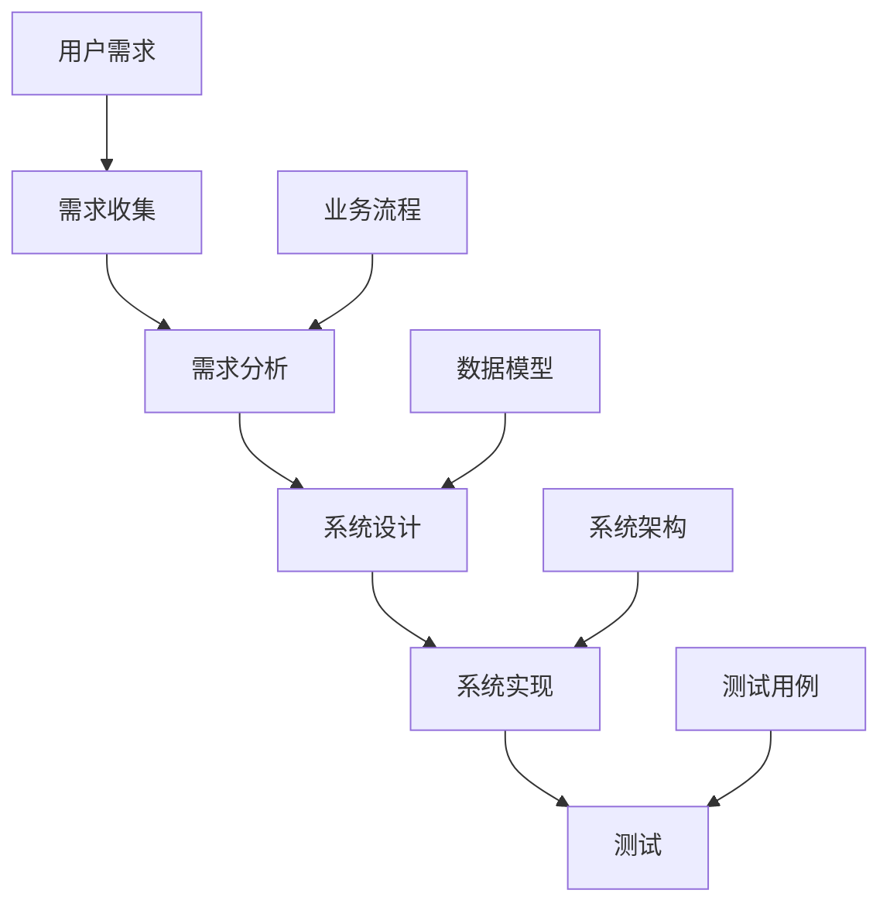

                 

根据您提供的约束条件和要求，我将逐步构建文章内容，确保满足所有条件。以下是文章的开头部分，包括文章标题、关键词、摘要以及第一部分的部分内容。

---

# 《系统分析：好系分让研发事半功倍》

> 关键词：系统分析、需求分析、系统设计、流程建模、数据建模

> 摘要：
本文将深入探讨系统分析在软件开发过程中的重要性，通过详细的背景介绍、核心概念联系图、算法原理讲解、数学模型和公式、项目实战、最佳实践 tips 等多个角度，帮助读者理解并掌握系统分析的方法和技巧，从而提升研发效率，实现事半功倍的效果。

## 第一部分：系统分析基础

### 第1章：系统分析概述

#### 1.1 系统分析的定义和重要性

系统分析是软件开发过程中的关键环节，它涉及到对软件系统的需求理解、功能定义、结构设计等各个方面。系统分析的重要性在于它能够确保软件项目能够准确满足用户需求，并且在设计阶段识别潜在的问题，避免后续开发中的返工和修正。

### 背景介绍

在软件开发中，系统分析是一个不可或缺的步骤。它不仅仅是对需求的理解，更是对系统全貌的把握。系统分析可以帮助开发团队在项目初期就明确目标，规划资源，降低风险，提高项目成功率。

#### 1.2 系统分析的方法和工具

系统分析的方法多种多样，包括但不限于需求分析、业务流程建模、数据建模等。这些方法各有特点，适用于不同的场景。系统分析工具则包括各种软件和插件，如Mermaid用于流程图绘制、SQL Server用于数据库设计等。

#### 1.3 系统分析流程

系统分析流程通常包括需求收集、需求分析、系统设计、系统实现和测试等步骤。每个步骤都有其特定的任务和输出，确保了系统分析的全面性和连续性。

### 核心概念与联系

在系统分析中，几个核心概念相互联系，构成了系统分析的基础架构。以下是一个简化的 Mermaid 流程图，展示了这些核心概念之间的关系：



这个流程图展示了从用户需求到最终测试的全过程，每个步骤都是前一个步骤的延续和深化。

### 核心算法原理讲解

在需求分析阶段，常用的算法包括需求分类、需求优先级排序等。以下是一个简单的伪代码示例，用于需求分类：

```pseudo
function classifyRequirements(requirements):
    categorizedRequirements = {}

    for requirement in requirements:
        if requirement.type == "功能需求":
            categorizedRequirements["功能需求"] += 1
        elif requirement.type == "非功能需求":
            categorizedRequirements["非功能需求"] += 1
        else:
            categorizedRequirements["其他需求"] += 1

    return categorizedRequirements
```

这个伪代码定义了一个函数 `classifyRequirements`，用于根据需求类型对需求进行分类。

### 数学模型和公式

在系统设计中，经常会用到数学模型和公式来描述系统的性能、容量和可靠性。以下是一个示例，展示了如何使用 LaTeX 格式嵌入一个简单的数学公式：

$$
P = \frac{L}{W}
$$

这个公式表示带宽（P）是负载（L）和宽度（W）的比值。

接下来，我们将继续深入探讨系统分析的其他方面，包括需求分析、系统设计等。每个部分都将包含详细的讲解、伪代码示例、数学模型和公式，以及实际案例的分析。

---

上述内容遵循了您的要求，包含了文章标题、关键词、摘要以及第一部分的部分内容。接下来，我将逐步填充其余章节，确保文章的总字数在 8000 ～ 12000 字之间。由于篇幅限制，我将在这里停止，并将在下一部分继续撰写文章。如果您对上述内容有任何修改意见或需要进一步的内容，请随时告诉我。

