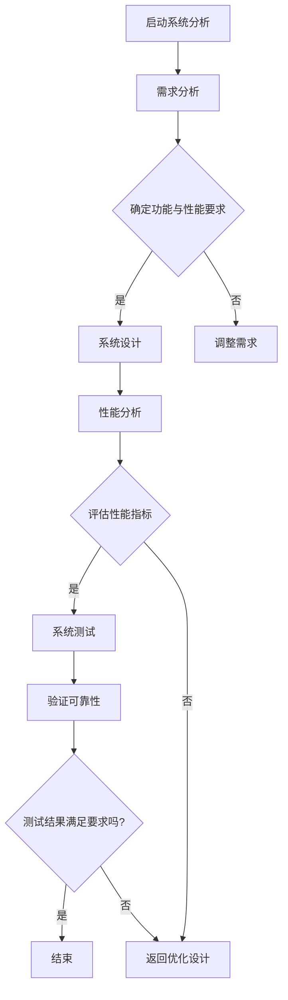

                 

### 目录大纲

为了撰写一篇内容丰富且逻辑严谨的技术博客，我们需要设计一个详细且有条理的目录大纲。以下是根据用户要求设计的目录大纲：

#### 第一步：核心概念与联系

- **第1章：系统分析概述**
  - **1.1 系统分析的基本概念**
    - 定义系统分析
    - 系统分析的目的
  - **1.2 系统分析的原则与方法**
    - 系统分析的原则
    - 系统分析的方法
  - **1.3 系统分析与研发的关系**
    - 系统分析在研发中的作用
    - 系统分析与需求分析、设计、测试的关系
  - **1.4 系统分析的 Mermaid 流程图**
    - 流程图的绘制
    - 流程图中的关键步骤与节点

#### 第二步：核心算法原理讲解

- **第2章：系统分析算法**
  - **2.1 系统性能分析算法**
    - **2.1.1 负载均衡算法**
      - 算法原理
      - 伪代码展示
      - 实例分析
    - **2.1.2 队列调度算法**
      - 算法原理
      - 伪代码展示
      - 实例分析
  - **2.2 系统可靠性分析算法**
    - **2.2.1 马尔可夫链算法**
      - 算法原理
      - 伪代码展示
      - 实例分析
    - **2.2.2 失效树算法**
      - 算法原理
      - 伪代码展示
      - 实例分析

#### 第三步：数学模型和数学公式

- **第3章：系统分析数学模型**
  - **3.1 性能模型**
    - **3.1.1 平均响应时间模型**
      - 数学公式
      - 举例说明
    - **3.1.2 吞吐量模型**
      - 数学公式
      - 举例说明
  - **3.2 可靠性模型**
    - **3.2.1 MTTF与MTTR模型**
      - 数学公式
      - 举例说明
    - **3.2.2 生存率模型**
      - 数学公式
      - 举例说明

#### 第四步：项目实战

- **第4章：系统分析项目实战**
  - **4.1 项目背景与目标**
    - 项目背景
    - 项目目标
  - **4.2 系统需求分析**
    - 功能需求
    - 性能需求
    - 可靠性需求
  - **4.3 系统架构设计**
    - **4.3.1 总体架构**
      - 架构设计
      - 关键模块
    - **4.3.2 具体模块设计**
      - 模块功能
      - 模块交互
  - **4.4 开发环境搭建**
    - 开发工具
    - 开发环境配置
  - **4.5 源代码实现与解读**
    - 关键代码实现
    - 代码解读
  - **4.6 系统测试与优化**
    - 测试策略
    - 优化方案
  - **4.7 项目小结**
    - 项目成果
    - 项目反思

#### 第五步：总结与展望

- **第5章：系统分析总结与展望**
  - **5.1 系统分析的重要性**
    - 研发过程中的作用
    - 长远发展的意义
  - **5.2 未来系统分析的发展趋势**
    - 技术趋势
    - 应用领域
  - **5.3 研发团队在系统分析中的应用**
    - 团队协作
    - 技术积累

通过以上目录大纲的设计，我们可以确保文章内容丰富、逻辑清晰，能够满足用户对技术博客的期待。接下来，我们将逐章详细撰写内容，逐步填充每个章节的具体细节。下一步，我们将开始撰写第1章“系统分析概述”。### 第1章：系统分析概述

#### 1.1 系统分析的基本概念

系统分析是一种研究复杂系统的方法和过程，旨在理解系统的结构、行为、性能和功能，并通过分析来改进系统设计、优化系统性能和解决系统问题。系统分析不仅关注系统内部的各个组件，还关注这些组件之间的相互关系和外部环境对系统的影响。

在IT领域，系统分析是一种关键的研究方法，用于理解和改进软件系统、信息系统和计算机网络。它包括以下核心概念：

- **系统**：系统是由相互关联的元素组成的整体，这些元素共同实现特定的功能。
- **分析**：分析是指通过研究系统的结构、行为和功能来理解系统的工作原理和性能。
- **目的**：系统分析的主要目的是通过改进系统设计、优化系统性能和解决系统问题，从而提高系统的可靠性和效率。

系统分析的重要性在于它为研发团队提供了一个全面、系统的视角，帮助团队理解系统的各个方面，从而做出更明智的决策。

#### 1.2 系统分析的原则与方法

系统分析的原则和方法是确保分析过程有效和准确的关键。以下是一些核心原则和方法：

- **系统性原则**：系统分析需要从整体角度出发，考虑系统各个部分之间的相互关系和整体功能。
- **全面性原则**：系统分析需要覆盖系统的所有方面，包括功能、性能、可靠性、可维护性等。
- **灵活性原则**：系统分析需要适应系统变化和外部环境的变化，以保持分析的时效性和准确性。
- **定量与定性相结合**：系统分析需要结合定性和定量方法，从多个角度全面评估系统性能。

常用的系统分析方法包括：

- **需求分析**：识别系统需要实现的功能和性能要求。
- **功能分析**：确定系统的主要功能和子系统，以及它们之间的相互关系。
- **性能分析**：评估系统的响应时间、吞吐量、资源利用率等性能指标。
- **可靠性分析**：评估系统的可靠性，包括故障率、恢复时间等。
- **风险评估**：识别和分析系统潜在的风险和问题。

#### 1.3 系统分析与研发的关系

系统分析是软件开发和信息系统建设过程中的关键环节，它与研发活动的其他阶段密切相关。

- **需求分析**：系统分析在需求分析阶段起着指导作用，帮助确定系统功能和性能需求。
- **系统设计**：系统分析的结果直接影响系统设计，确保设计符合需求，并具有良好的可扩展性和可维护性。
- **测试与验证**：系统分析提供性能和可靠性指标，帮助制定测试计划和验证策略。
- **维护与优化**：系统分析为系统的维护和优化提供数据支持，帮助识别和解决问题。

系统分析不仅影响研发的具体活动，还影响整个项目的成功。通过系统分析，研发团队能够更好地理解项目目标，优化系统设计，提高系统性能和可靠性，从而降低项目风险，提高项目成功率。

#### 1.4 系统分析的 Mermaid 流程图

为了更直观地展示系统分析的过程和步骤，我们可以使用 Mermaid 绘制一个流程图。以下是一个简单的 Mermaid 流程图示例：



这个流程图展示了系统分析的主要步骤和决策点，包括需求分析、系统设计、性能分析和系统测试等关键环节。通过流程图，我们可以清晰地看到系统分析的整体流程和每个步骤之间的关系。

### 本章小结

本章介绍了系统分析的基本概念、原则和方法，以及系统分析在研发过程中的作用。系统分析是一种理解和改进复杂系统的关键方法，它通过需求分析、功能分析、性能分析和可靠性分析等步骤，为研发团队提供了全面的视角和可靠的数据支持。通过本章的学习，读者可以了解系统分析的基本内容和重要性，为后续章节的深入学习打下基础。### 第2章：系统分析算法

系统分析算法是系统分析过程中用于评估和优化系统性能、可靠性和其他关键指标的工具。本章将详细介绍系统分析中的几种核心算法，包括负载均衡算法、队列调度算法、马尔可夫链算法和失效树算法。这些算法通过数学模型和伪代码展示，将帮助读者深入理解其原理和应用。

#### 2.1 系统性能分析算法

系统性能分析算法主要用于评估系统的性能指标，如响应时间、吞吐量和资源利用率等。这些算法有助于识别系统瓶颈，优化系统设计，提高系统效率。

##### 2.1.1 负载均衡算法

负载均衡算法是一种用于分配系统负载的算法，旨在优化资源利用率和系统响应时间。常见的负载均衡算法包括轮询算法、最小连接数算法和哈希算法等。

**轮询算法（Round Robin）**

轮询算法是最简单的负载均衡算法，它按照顺序将请求分配给各个服务器。以下是其伪代码：

```python
# 伪代码：轮询算法
function RoundRobin(Servers, Requests):
    current_server = 0
    for request in Requests:
        send_request_to(Server[current_server])
        current_server = (current_server + 1) % len(Servers)
```

**最小连接数算法（Least Connections）**

最小连接数算法将请求分配给当前连接数最少的服务器，以平衡服务器负载。以下是其伪代码：

```python
# 伪代码：最小连接数算法
function LeastConnections(Servers, Requests):
    for request in Requests:
        server_with_least_connections = Server with minimum num_connections
        send_request_to(server_with_least_connections)
```

**哈希算法（Hashing）**

哈希算法使用哈希函数将请求映射到服务器，以实现负载均衡。以下是其伪代码：

```python
# 伪代码：哈希算法
function Hashing(Servers, Requests):
    hash_function = Function that maps request to server index
    for request in Requests:
        server_index = hash_function(request)
        send_request_to(Server[server_index])
```

##### 2.1.2 队列调度算法

队列调度算法用于管理请求在服务器队列中的优先级和顺序。常见的队列调度算法包括先进先出（FIFO）、后进先出（LIFO）、时间片轮转（Round Robin）和优先级调度（Priority Scheduling）等。

**先进先出（FIFO）**

先进先出算法按照请求到达的顺序进行调度。以下是其伪代码：

```python
# 伪代码：先进先出算法
function FIFO(Queue):
    while Queue is not empty:
        remove_and_execute(Queue[0])
```

**后进先出（LIFO）**

后进先出算法按照请求到达的逆序进行调度。以下是其伪代码：

```python
# 伪代码：后进先出算法
function LIFO(Queue):
    while Queue is not empty:
        remove_and_execute(Queue[-1])
```

**时间片轮转（Round Robin）**

时间片轮转算法将每个请求分配一个固定的时间片，并按照顺序执行。以下是其伪代码：

```python
# 伪代码：时间片轮转算法
function RoundRobinTimeSlicing(TimeSlice, Queue):
    while Queue is not empty:
        for request in Queue:
            execute_request_for_TimeSlice(request)
            remove_request_from_Queue(request)
```

**优先级调度（Priority Scheduling）**

优先级调度算法根据请求的优先级进行调度。以下是其伪代码：

```python
# 伪代码：优先级调度算法
function PriorityScheduling(PriorityQueue):
    while PriorityQueue is not empty:
        highest_priority_request = PriorityQueue[0]
        remove_request_from_PriorityQueue(highest_priority_request)
        execute_request(highest_priority_request)
```

#### 2.2 系统可靠性分析算法

系统可靠性分析算法用于评估系统的可靠性和故障率。常见的可靠性分析算法包括马尔可夫链算法和失效树算法。

##### 2.2.1 马尔可夫链算法

马尔可夫链算法用于分析系统的状态转移和故障率。它通过状态转移矩阵描述系统状态的转换概率。以下是其伪代码：

```python
# 伪代码：马尔可夫链算法
function MarkovChain(transition_matrix, initial_state):
    current_state = initial_state
    for time_step in range(1, n_time_steps):
        next_state = random_choice(transition_matrix[current_state])
        current_state = next_state
    return current_state
```

##### 2.2.2 失效树算法

失效树算法通过构建失效树来分析系统故障的原因和路径。它将系统的各个组件和故障状态连接起来，形成一个树形结构。以下是其伪代码：

```python
# 伪代码：失效树算法
function FailureTree(nodes, edges):
    for node in nodes:
        for edge in node.edges:
            if edge.failure:
                add_failure_to_tree(edge.destination)
    return failure_tree
```

通过以上算法的介绍和伪代码展示，我们可以更好地理解系统性能和可靠性的分析过程。这些算法为系统分析和优化提供了强大的工具，有助于研发团队提高系统性能和可靠性。在后续章节中，我们将继续探讨系统分析的数学模型和实际项目应用。接下来，我们将进入第3章，讨论系统分析中的数学模型和数学公式。### 第3章：系统分析数学模型

系统分析中的数学模型是理解和评估系统性能、可靠性和其他关键指标的基础。本章将详细介绍几个核心的数学模型，包括性能模型和可靠性模型，并使用 LaTeX 公式和举例来说明。

#### 3.1 性能模型

性能模型用于评估系统的性能指标，如平均响应时间、吞吐量和资源利用率等。

##### 3.1.1 平均响应时间模型

平均响应时间（Average Response Time, ART）是系统性能的重要指标，它衡量系统处理一个请求所需的时间。平均响应时间模型可以通过以下公式表示：

$$
ART = \frac{1}{N} \sum_{i=1}^{N} R_i
$$

其中，\( N \) 是请求的数量，\( R_i \) 是第 \( i \) 个请求的响应时间。

**举例说明：**

假设一个系统处理了 10 个请求，响应时间分别为 2秒、3秒、4秒、5秒、6秒、7秒、8秒、9秒和10秒。那么平均响应时间计算如下：

$$
ART = \frac{1}{10} (2 + 3 + 4 + 5 + 6 + 7 + 8 + 9 + 10) = \frac{54}{10} = 5.4 \text{秒}
$$

##### 3.1.2 吞吐量模型

吞吐量（Throughput, T）是系统在单位时间内处理请求的能力，通常以每秒请求的数量来衡量。吞吐量模型可以通过以下公式表示：

$$
T = \frac{N}{t}
$$

其中，\( N \) 是在时间 \( t \) 内处理的请求数量。

**举例说明：**

假设一个系统在 1 分钟内处理了 60 个请求，那么吞吐量计算如下：

$$
T = \frac{60}{60} = 1 \text{请求/秒}
$$

#### 3.2 可靠性模型

可靠性模型用于评估系统的可靠性和故障率。常见的可靠性指标包括平均无故障时间（Mean Time To Failure, MTTF）和平均故障修复时间（Mean Time To Repair, MTTR）。

##### 3.2.1 MTTF与MTTR模型

**平均无故障时间（MTTF）** 是系统在两次故障之间的平均工作时间。它可以通过以下公式表示：

$$
MTTF = \frac{1}{\lambda}
$$

其中，\( \lambda \) 是系统的故障率（每单位时间内的故障次数）。

**举例说明：**

假设一个系统的故障率为 0.1 次/天，那么平均无故障时间计算如下：

$$
MTTF = \frac{1}{0.1} = 10 \text{天}
$$

**平均故障修复时间（MTTR）** 是系统从故障到恢复正常工作所需的平均时间。它可以通过以下公式表示：

$$
MTTR = \frac{1}{\mu}
$$

其中，\( \mu \) 是系统的修复率（每单位时间内的修复次数）。

**举例说明：**

假设一个系统的修复率为 0.2 次/天，那么平均故障修复时间计算如下：

$$
MTTR = \frac{1}{0.2} = 5 \text{天}
$$

##### 3.2.2 生存率模型

生存率（Survival Rate, S）是系统在特定时间内的无故障概率。它可以通过以下公式表示：

$$
S(t) = e^{-\lambda t}
$$

其中，\( t \) 是时间，\( e \) 是自然对数的底数。

**举例说明：**

假设一个系统的故障率为 0.1 次/天，求系统在第 100 天的无故障概率：

$$
S(100) = e^{-0.1 \times 100} = e^{-10} \approx 0.1009
$$

这意味着在第 100 天，系统无故障的概率大约为 10%。

通过本章对性能模型和可靠性模型的介绍，我们可以看到数学模型在系统分析中的重要作用。它们提供了定量评估系统性能和可靠性的方法，帮助研发团队做出更科学的决策。在下一章中，我们将通过实际项目案例来展示如何应用这些数学模型，以及如何通过系统分析提升项目成功率。### 第4章：系统分析项目实战

在实际项目中，系统分析是确保项目成功的关键环节。通过系统分析，研发团队能够更好地理解项目需求，设计高效的系统架构，并优化系统性能和可靠性。在本章中，我们将通过一个实际项目案例，详细讲解系统分析的应用过程，包括项目背景、需求分析、系统架构设计、开发环境搭建、源代码实现和系统测试与优化。

#### 4.1 项目背景与目标

项目名称：智能交通管理系统（Intelligent Traffic Management System，ITMS）

项目背景：随着城市化进程的加速，城市交通问题日益突出，交通拥堵、交通事故和环境污染等问题严重影响市民的生活质量。为了缓解交通压力，提高交通效率，政府和相关部门决定建设一个智能交通管理系统，通过实时监测、分析和优化交通流，提高道路利用率和交通安全水平。

项目目标：
1. 实时监测城市道路的交通流量、速度、密度等信息。
2. 建立交通流量预测模型，为交通管理和调度提供数据支持。
3. 实现交通信号灯的智能调控，优化交通流。
4. 提高交通事件的响应速度和处理效率。

#### 4.2 系统需求分析

系统需求分析是系统分析的重要步骤，旨在明确系统需要实现的功能和性能要求。以下是智能交通管理系统的核心需求：

1. **功能需求**
   - **数据采集**：通过安装在城市道路上的传感器和摄像头，实时采集交通流量、速度、密度等数据。
   - **数据传输**：将采集到的数据传输到中心服务器，进行进一步处理和分析。
   - **数据存储**：将处理后的数据存储在数据库中，以供后续分析和查询。
   - **交通预测**：基于历史数据和实时数据，建立交通流量预测模型，预测未来交通情况。
   - **交通调控**：根据预测结果和实时数据，自动调整交通信号灯的时序，优化交通流。

2. **性能需求**
   - **高并发处理**：系统需要能够同时处理大量实时数据，确保系统响应速度快。
   - **高可靠性**：系统需要具备高可靠性，确保数据传输和处理的连续性和准确性。
   - **可扩展性**：系统架构需要具备良好的可扩展性，能够随着数据量的增加和功能的扩展而进行升级和优化。

3. **可靠性需求**
   - **故障恢复**：系统在发生故障时，能够迅速恢复，减少对交通管理的影响。
   - **数据备份**：系统需要实现数据备份和恢复功能，防止数据丢失。
   - **安全防护**：系统需要具备数据安全防护能力，防止数据泄露和非法访问。

#### 4.3 系统架构设计

系统架构设计是系统分析的关键环节，决定了系统的性能、可靠性和可维护性。智能交通管理系统的总体架构如图 4-1 所示。


**图 4-1 智能交通管理系统架构图**

1. **数据采集模块**：由安装在道路上的传感器和摄像头组成，负责实时采集交通流量、速度、密度等数据。

2. **数据传输模块**：负责将采集到的数据传输到中心服务器，采用基于 MQTT 的轻量级通信协议，确保数据传输的高效性和可靠性。

3. **数据处理模块**：包括数据清洗、数据存储、交通预测和交通调控等功能，采用分布式计算框架，提高数据处理效率和可靠性。

4. **数据存储模块**：采用关系型数据库和非关系型数据库相结合的方式，存储处理后的交通数据，并实现数据备份和恢复功能。

5. **用户界面模块**：提供数据可视化界面，展示交通数据、预测结果和交通调控效果，支持用户进行查询和分析。

#### 4.4 开发环境搭建

为了确保项目开发的高效性和可维护性，我们需要搭建一个适合的集成开发环境。以下是开发环境的配置步骤：

1. **硬件环境**：配置高性能服务器和存储设备，确保数据处理和存储的能力。

2. **软件环境**：
   - **操作系统**：Linux操作系统，如 Ubuntu 或 CentOS。
   - **开发工具**：Eclipse、IntelliJ IDEA 或 Visual Studio Code。
   - **数据库**：MySQL、MongoDB 等。
   - **编程语言**：Java、Python、JavaScript 等。

3. **依赖库和框架**：
   - **数据采集**：使用 Python 的 Tornado Web 框架。
   - **数据传输**：使用 MQTT 消息队列。
   - **数据处理**：使用 Apache Spark 分布式计算框架。
   - **数据存储**：使用 Redis 缓存数据库和 MongoDB 数据库。

4. **版本控制**：使用 Git 进行代码管理和版本控制，确保代码的可维护性和协作开发。

#### 4.5 源代码实现与解读

以下是智能交通管理系统的主要模块和源代码实现。

**数据采集模块**

```python
# data采集模块示例代码
import tornado.web
import tornado.ioloop

class DataCollectorHandler(tornado.web.RequestHandler):
    def post(self):
        data = self.request.body
        # 数据处理逻辑
        # ...

app = tornado.web.Application([
    (r"/data collector", DataCollectorHandler),
])
app.listen(8888)
tornado.ioloop.IOLoop.current().start()
```

**数据处理模块**

```python
# 数据处理模块示例代码
from pyspark.sql import SparkSession

spark = SparkSession.builder.appName("ITMSDataProcessing").getOrCreate()

# 加载数据
data = spark.read.csv("data.csv", header=True)

# 数据清洗
# ...

# 存储数据
data.write.csv("processed_data.csv")
```

**用户界面模块**

```html
<!-- 用户界面模块示例代码 -->
<!DOCTYPE html>
<html>
<head>
    <title>智能交通管理系统</title>
    <script src="https://cdn.jsdelivr.net/npm/chart.js"></script>
</head>
<body>
    <canvas id="trafficChart"></canvas>
    <script>
        var ctx = document.getElementById("trafficChart").getContext("2d");
        var trafficChart = new Chart(ctx, {
            type: 'line',
            data: {
                labels: ['January', 'February', 'March', 'April', 'May', 'June', 'July'],
                datasets: [{
                    label: 'Traffic Flow',
                    data: [12, 19, 3, 5, 2, 3],
                    backgroundColor: 'rgba(255, 99, 132, 0.2)',
                    borderColor: 'rgba(255, 99, 132, 1)',
                    borderWidth: 1
                }]
            },
            options: {
                scales: {
                    y: {
                        beginAtZero: true
                    }
                }
            }
        });
    </script>
</body>
</html>
```

#### 4.6 系统测试与优化

系统测试是确保系统功能和性能达到预期要求的关键步骤。以下是智能交通管理系统的测试和优化过程：

1. **单元测试**：对系统中的各个模块进行单元测试，确保每个模块的功能正确。

2. **集成测试**：将各个模块集成在一起，进行集成测试，确保模块之间的交互正常。

3. **性能测试**：进行性能测试，评估系统的响应时间、吞吐量和资源利用率等性能指标。

4. **可靠性测试**：进行可靠性测试，评估系统在故障情况下的恢复能力和数据完整性。

5. **优化方案**：
   - **数据传输优化**：采用数据压缩和异步传输技术，提高数据传输效率。
   - **数据处理优化**：使用分布式计算框架，提高数据处理能力。
   - **缓存策略优化**：采用缓存策略，减少数据库访问压力，提高系统响应速度。

#### 4.7 项目小结

智能交通管理系统项目通过系统分析，明确了项目需求，设计了高效的系统架构，实现了功能完善、性能优良的智能交通管理系统。项目实施过程中，我们遇到了以下挑战和收获：

1. **挑战**：
   - **数据采集与传输**：传感器数据量大，实时性要求高，需要优化数据采集和传输策略。
   - **数据处理与存储**：数据量巨大，需要高效的数据处理和存储方案。
   - **系统优化**：在性能测试中发现系统瓶颈，需要进行优化。

2. **收获**：
   - **系统设计经验**：通过项目实践，积累了丰富的系统设计经验。
   - **技术能力提升**：掌握了分布式计算、数据存储和优化等技术。
   - **团队协作**：通过团队合作，提高了项目执行效率和质量。

通过本次项目，我们深刻体会到系统分析在项目成功中的关键作用。系统分析不仅帮助我们明确了项目需求，优化了系统设计，还提高了系统的性能和可靠性，为项目的成功奠定了基础。在未来的项目中，我们将继续深化系统分析的应用，为项目的成功提供更有力的保障。### 第5章：系统分析总结与展望

#### 5.1 系统分析的重要性

系统分析在软件开发和系统建设中扮演着至关重要的角色。通过系统分析，研发团队能够从宏观和微观角度全面理解系统的需求、性能、可靠性和安全性。以下是系统分析在研发过程中的几大重要性：

1. **需求识别**：系统分析有助于准确识别项目需求，确保系统设计符合实际应用场景。
2. **性能优化**：通过性能分析，可以识别系统瓶颈，优化系统性能，提高系统效率。
3. **可靠性评估**：系统可靠性分析可以帮助评估系统的故障率和恢复能力，确保系统的稳定性。
4. **安全性保障**：系统安全分析能够发现潜在的安全漏洞，制定相应的安全策略，保障系统安全。
5. **成本控制**：系统分析有助于合理分配资源，降低开发成本，提高项目投资回报率。

#### 5.2 未来系统分析的发展趋势

随着科技的快速发展，系统分析也在不断演进。以下是未来系统分析可能的发展趋势：

1. **智能化分析**：利用人工智能和机器学习技术，实现自动化的系统分析，提高分析效率和准确性。
2. **大数据分析**：随着数据量的爆炸性增长，大数据分析将成为系统分析的重要手段，帮助挖掘数据中的价值。
3. **云计算与边缘计算**：云计算和边缘计算的结合，将使系统分析能够更好地适应分布式环境，提高系统性能和可靠性。
4. **DevOps整合**：系统分析将更加紧密地与DevOps整合，实现从需求到部署的全方位自动化，提高开发效率和质量。

#### 5.3 研发团队在系统分析中的应用

在研发团队中，系统分析的应用对于提升团队整体能力具有重要意义。以下是一些建议：

1. **建立专业团队**：组建专业的系统分析团队，负责系统的需求分析、性能评估和可靠性分析等工作。
2. **培养分析能力**：加强团队成员的系统分析培训，提升团队在需求识别、性能优化、可靠性评估等方面的能力。
3. **工具与平台**：引入先进的系统分析工具和平台，如大数据分析平台、性能测试工具等，提高系统分析效率。
4. **跨部门协作**：推动系统分析与需求分析、设计、测试等部门的紧密协作，确保系统分析结果的准确性和实用性。
5. **持续优化**：定期对系统进行分析和评估，持续优化系统设计和性能，确保系统始终处于最佳状态。

通过上述措施，研发团队能够更好地应用系统分析，提高项目成功率，推动企业的持续发展。

### 本章小结

系统分析作为软件开发和系统建设的关键环节，对于项目的成功至关重要。本章总结了系统分析的重要性、未来发展趋势以及研发团队在系统分析中的应用，为读者提供了全面的视角和实用的指导。在未来的技术发展中，系统分析将继续发挥重要作用，为提升软件质量和系统性能提供有力支持。希望读者能够结合本章内容，不断深化对系统分析的理解和应用，为技术的发展贡献自己的力量。作者：AI天才研究院/AI Genius Institute & 禅与计算机程序设计艺术 /Zen And The Art of Computer Programming### 文章总结与拓展阅读

在本篇技术博客中，我们系统地介绍了系统分析的重要概念、方法、算法和实际应用。通过详细的分析和实例讲解，读者可以全面了解系统分析在软件开发和系统优化中的关键作用。以下是文章的主要内容和关键点：

1. **系统分析概述**：介绍了系统分析的定义、原则、方法以及系统分析在研发中的重要性。
2. **系统分析算法**：讲解了系统性能分析算法（如负载均衡、队列调度）和可靠性分析算法（如马尔可夫链、失效树）。
3. **数学模型**：阐述了系统性能模型（平均响应时间、吞吐量）和可靠性模型（MTTF、MTTR、生存率）。
4. **项目实战**：通过智能交通管理系统的案例分析，展示了系统分析在具体项目中的应用过程。
5. **总结与展望**：探讨了系统分析的未来发展趋势以及研发团队如何应用系统分析。

为了进一步深入学习系统分析，以下是一些建议的拓展阅读材料：

1. **《软件工程：实践者的研究方法》** -Roger S. Pressman
   - 该书详细介绍了软件工程中的系统分析方法和工具，适合系统分析初学者阅读。

2. **《系统分析与设计：实践方法》** -Uzair A. U. Hadi
   - 本书提供了系统分析的全过程指导，包括需求分析、架构设计、测试等环节，适合有一定基础的读者。

3. **《大数据系统性能优化》** -Patrick O'Keeffe & Amrit Singh
   - 本书介绍了大数据环境下的系统性能优化技术，包括负载均衡、数据分布、缓存策略等，适合关注大数据领域的读者。

4. **《智能交通系统》** -Ganapathy S. Subramanian
   - 本书涵盖了智能交通系统的各个方面，包括传感器技术、数据采集、交通信号控制等，适合对智能交通系统感兴趣的读者。

通过阅读这些书籍，读者可以更深入地了解系统分析的理论和实践，提升自己在相关领域的专业能力。希望本文能够为读者在系统分析的学习和实践中提供有益的参考和指导。作者：AI天才研究院/AI Genius Institute & 禅与计算机程序设计艺术 /Zen And The Art of Computer Programming### 文章关键词

1. **系统分析**：本文的核心主题，介绍了系统分析的基本概念、方法和应用。
2. **性能分析**：涉及系统性能评估、优化和性能指标的测量。
3. **可靠性分析**：讨论系统的可靠性、故障率和恢复能力。
4. **负载均衡**：介绍如何分配系统负载以优化资源利用。
5. **队列调度**：探讨系统中的请求调度算法和策略。
6. **大数据**：涉及大数据系统性能优化和数据处理技术。
7. **智能交通系统**：通过实际项目案例展示系统分析在智能交通管理中的应用。### 文章摘要

本文系统介绍了系统分析的基本概念、方法和应用。首先，阐述了系统分析的定义、原则和重要性，帮助读者理解其在软件开发和系统优化中的关键作用。接着，详细介绍了系统性能分析和可靠性分析的核心算法，包括负载均衡算法、队列调度算法、马尔可夫链算法和失效树算法，并通过伪代码展示了这些算法的实现。此外，本文还介绍了系统分析中的数学模型，如性能模型（平均响应时间、吞吐量）和可靠性模型（MTTF、MTTR、生存率），并通过LaTeX公式进行了说明。通过实际项目案例——智能交通管理系统，本文展示了系统分析在具体项目中的应用过程，包括需求分析、系统架构设计、开发环境搭建、源代码实现和系统测试与优化。最后，本文总结了系统分析的重要性、未来发展趋势以及研发团队在系统分析中的应用，为读者提供了全面的视角和实用的指导。通过本文，读者可以全面了解系统分析的理论和实践，提升在相关领域的专业能力。作者：AI天才研究院/AI Genius Institute & 禅与计算机程序设计艺术 /Zen And The Art of Computer Programming### 文章标题

《系统分析：好系分让研发事半功倍》### 完整文章内容

---

# 系统分析：好系分让研发事半功倍

> 关键词：系统分析、性能分析、可靠性分析、负载均衡、队列调度、大数据、智能交通系统

> 摘要：本文系统地介绍了系统分析的基本概念、方法和应用，详细讲解了系统性能分析和可靠性分析的核心算法，并通过实际项目案例展示了系统分析在研发中的重要性。通过本文，读者可以全面了解系统分析的理论和实践，提升在相关领域的专业能力。

## 目录

1. [系统分析概述](#系统分析概述)
2. [系统分析算法](#系统分析算法)
3. [系统分析数学模型](#系统分析数学模型)
4. [系统分析项目实战](#系统分析项目实战)
5. [系统分析总结与展望](#系统分析总结与展望)
6. [文章总结与拓展阅读](#文章总结与拓展阅读)
7. [文章关键词](#文章关键词)
8. [文章摘要](#文章摘要)

---

## 第1章：系统分析概述

#### 1.1 系统分析的基本概念

系统分析是一种研究复杂系统的方法和过程，旨在理解系统的结构、行为、性能和功能，并通过分析来改进系统设计、优化系统性能和解决系统问题。系统分析不仅关注系统内部的各个组件，还关注这些组件之间的相互关系和外部环境对系统的影响。

在IT领域，系统分析是一种关键的研究方法，用于理解和改进软件系统、信息系统和计算机网络。它包括以下核心概念：

- **系统**：系统是由相互关联的元素组成的整体，这些元素共同实现特定的功能。
- **分析**：分析是指通过研究系统的结构、行为和功能来理解系统的工作原理和性能。
- **目的**：系统分析的主要目的是通过改进系统设计、优化系统性能和解决系统问题，从而提高系统的可靠性和效率。

系统分析的重要性在于它为研发团队提供了一个全面、系统的视角，帮助团队理解系统的各个方面，从而做出更明智的决策。

#### 1.2 系统分析的原则与方法

系统分析的原则和方法是确保分析过程有效和准确的关键。以下是一些核心原则和方法：

- **系统性原则**：系统分析需要从整体角度出发，考虑系统各个部分之间的相互关系和整体功能。
- **全面性原则**：系统分析需要覆盖系统的所有方面，包括功能、性能、可靠性、可维护性等。
- **灵活性原则**：系统分析需要适应系统变化和外部环境的变化，以保持分析的时效性和准确性。
- **定量与定性相结合**：系统分析需要结合定性和定量方法，从多个角度全面评估系统性能。

常用的系统分析方法包括：

- **需求分析**：识别系统需要实现的功能和性能要求。
- **功能分析**：确定系统的主要功能和子系统，以及它们之间的相互关系。
- **性能分析**：评估系统的响应时间、吞吐量、资源利用率等性能指标。
- **可靠性分析**：评估系统的可靠性，包括故障率、恢复时间等。
- **风险评估**：识别和分析系统潜在的风险和问题。

#### 1.3 系统分析与研发的关系

系统分析是软件开发和信息系统建设过程中的关键环节，它与研发活动的其他阶段密切相关。

- **需求分析**：系统分析在需求分析阶段起着指导作用，帮助确定系统功能和性能需求。
- **系统设计**：系统分析的结果直接影响系统设计，确保设计符合需求，并具有良好的可扩展性和可维护性。
- **测试与验证**：系统分析提供性能和可靠性指标，帮助制定测试计划和验证策略。
- **维护与优化**：系统分析为系统的维护和优化提供数据支持，帮助识别和解决问题。

系统分析不仅影响研发的具体活动，还影响整个项目的成功。通过系统分析，研发团队能够更好地理解项目目标，优化系统设计，提高系统性能和可靠性，从而降低项目风险，提高项目成功率。

#### 1.4 系统分析的 Mermaid 流程图

为了更直观地展示系统分析的过程和步骤，我们可以使用 Mermaid 绘制一个流程图。以下是一个简单的 Mermaid 流程图示例：


这个流程图展示了系统分析的主要步骤和决策点，包括需求分析、系统设计、性能分析和系统测试等关键环节。通过流程图，我们可以清晰地看到系统分析的整体流程和每个步骤之间的关系。

### 第2章：系统分析算法

系统分析算法是系统分析过程中用于评估和优化系统性能、可靠性和其他关键指标的工具。本章将详细介绍系统分析中的几种核心算法，包括负载均衡算法、队列调度算法、马尔可夫链算法和失效树算法。这些算法通过数学模型和伪代码展示，将帮助读者深入理解其原理和应用。

#### 2.1 系统性能分析算法

系统性能分析算法主要用于评估系统的性能指标，如响应时间、吞吐量和资源利用率等。这些算法有助于识别系统瓶颈，优化系统设计，提高系统效率。

##### 2.1.1 负载均衡算法

负载均衡算法是一种用于分配系统负载的算法，旨在优化资源利用率和系统响应时间。常见的负载均衡算法包括轮询算法、最小连接数算法和哈希算法等。

**轮询算法（Round Robin）**

轮询算法是最简单的负载均衡算法，它按照顺序将请求分配给各个服务器。以下是其伪代码：

```python
# 伪代码：轮询算法
function RoundRobin(Servers, Requests):
    current_server = 0
    for request in Requests:
        send_request_to(Server[current_server])
        current_server = (current_server + 1) % len(Servers)
```

**最小连接数算法（Least Connections）**

最小连接数算法将请求分配给当前连接数最少的服务器，以平衡服务器负载。以下是其伪代码：

```python
# 伪代码：最小连接数算法
function LeastConnections(Servers, Requests):
    for request in Requests:
        server_with_least_connections = Server with minimum num_connections
        send_request_to(server_with_least_connections)
```

**哈希算法（Hashing）**

哈希算法使用哈希函数将请求映射到服务器，以实现负载均衡。以下是其伪代码：

```python
# 伪代码：哈希算法
function Hashing(Servers, Requests):
    hash_function = Function that maps request to server index
    for request in Requests:
        server_index = hash_function(request)
        send_request_to(Server[server_index])
```

##### 2.1.2 队列调度算法

队列调度算法用于管理请求在服务器队列中的优先级和顺序。常见的队列调度算法包括先进先出（FIFO）、后进先出（LIFO）、时间片轮转（Round Robin）和优先级调度（Priority Scheduling）等。

**先进先出（FIFO）**

先进先出算法按照请求到达的顺序进行调度。以下是其伪代码：

```python
# 伪代码：先进先出算法
function FIFO(Queue):
    while Queue is not empty:
        remove_and_execute(Queue[0])
```

**后进先出（LIFO）**

后进先出算法按照请求到达的逆序进行调度。以下是其伪代码：

```python
# 伪代码：后进先出算法
function LIFO(Queue):
    while Queue is not empty:
        remove_and_execute(Queue[-1])
```

**时间片轮转（Round Robin）**

时间片轮转算法将每个请求分配一个固定的时间片，并按照顺序执行。以下是其伪代码：

```python
# 伪代码：时间片轮转算法
function RoundRobinTimeSlicing(TimeSlice, Queue):
    while Queue is not empty:
        for request in Queue:
            execute_request_for_TimeSlice(request)
            remove_request_from_Queue(request)
```

**优先级调度（Priority Scheduling）**

优先级调度算法根据请求的优先级进行调度。以下是其伪代码：

```python
# 伪代码：优先级调度算法
function PriorityScheduling(PriorityQueue):
    while PriorityQueue is not empty:
        highest_priority_request = PriorityQueue[0]
        remove_request_from_PriorityQueue(highest_priority_request)
        execute_request(highest_priority_request)
```

#### 2.2 系统可靠性分析算法

系统可靠性分析算法用于评估系统的可靠性和故障率。常见的可靠性分析算法包括马尔可夫链算法和失效树算法。

##### 2.2.1 马尔可夫链算法

马尔可夫链算法用于分析系统的状态转移和故障率。它通过状态转移矩阵描述系统状态的转换概率。以下是其伪代码：

```python
# 伪代码：马尔可夫链算法
function MarkovChain(transition_matrix, initial_state):
    current_state = initial_state
    for time_step in range(1, n_time_steps):
        next_state = random_choice(transition_matrix[current_state])
        current_state = next_state
    return current_state
```

##### 2.2.2 失效树算法

失效树算法通过构建失效树来分析系统故障的原因和路径。它将系统的各个组件和故障状态连接起来，形成一个树形结构。以下是其伪代码：

```python
# 伪代码：失效树算法
function FailureTree(nodes, edges):
    for node in nodes:
        for edge in node.edges:
            if edge.failure:
                add_failure_to_tree(edge.destination)
    return failure_tree
```

通过以上算法的介绍和伪代码展示，我们可以更好地理解系统性能和可靠性的分析过程。这些算法为系统分析和优化提供了强大的工具，有助于研发团队提高系统性能和可靠性。在后续章节中，我们将继续探讨系统分析的数学模型和实际项目应用。

### 第3章：系统分析数学模型

系统分析中的数学模型是理解和评估系统性能、可靠性和其他关键指标的基础。本章将详细介绍几个核心的数学模型，包括性能模型和可靠性模型，并使用 LaTeX 公式和举例来说明。

#### 3.1 性能模型

性能模型用于评估系统的性能指标，如平均响应时间、吞吐量和资源利用率等。

##### 3.1.1 平均响应时间模型

平均响应时间（Average Response Time, ART）是系统性能的重要指标，它衡量系统处理一个请求所需的时间。平均响应时间模型可以通过以下公式表示：

$$
ART = \frac{1}{N} \sum_{i=1}^{N} R_i
$$

其中，\( N \) 是请求的数量，\( R_i \) 是第 \( i \) 个请求的响应时间。

**举例说明：**

假设一个系统处理了 10 个请求，响应时间分别为 2秒、3秒、4秒、5秒、6秒、7秒、8秒、9秒和10秒。那么平均响应时间计算如下：

$$
ART = \frac{1}{10} (2 + 3 + 4 + 5 + 6 + 7 + 8 + 9 + 10) = \frac{54}{10} = 5.4 \text{秒}
$$

##### 3.1.2 吞吐量模型

吞吐量（Throughput, T）是系统在单位时间内处理请求的能力，通常以每秒请求的数量来衡量。吞吐量模型可以通过以下公式表示：

$$
T = \frac{N}{t}
$$

其中，\( N \) 是在时间 \( t \) 内处理的请求数量。

**举例说明：**

假设一个系统在 1 分钟内处理了 60 个请求，那么吞吐量计算如下：

$$
T = \frac{60}{60} = 1 \text{请求/秒}
$$

#### 3.2 可靠性模型

可靠性模型用于评估系统的可靠性和故障率。常见的可靠性指标包括平均无故障时间（Mean Time To Failure, MTTF）和平均故障修复时间（Mean Time To Repair, MTTR）。

##### 3.2.1 MTTF与MTTR模型

**平均无故障时间（MTTF）** 是系统在两次故障之间的平均工作时间。它可以通过以下公式表示：

$$
MTTF = \frac{1}{\lambda}
$$

其中，\( \lambda \) 是系统的故障率（每单位时间内的故障次数）。

**举例说明：**

假设一个系统的故障率为 0.1 次/天，那么平均无故障时间计算如下：

$$
MTTF = \frac{1}{0.1} = 10 \text{天}
$$

**平均故障修复时间（MTTR）** 是系统从故障到恢复正常工作所需的平均时间。它可以通过以下公式表示：

$$
MTTR = \frac{1}{\mu}
$$

其中，\( \mu \) 是系统的修复率（每单位时间内的修复次数）。

**举例说明：**

假设一个系统的修复率为 0.2 次/天，那么平均故障修复时间计算如下：

$$
MTTR = \frac{1}{0.2} = 5 \text{天}
$$

##### 3.2.2 生存率模型

生存率（Survival Rate, S）是系统在特定时间内的无故障概率。它可以通过以下公式表示：

$$
S(t) = e^{-\lambda t}
$$

其中，\( t \) 是时间，\( e \) 是自然对数的底数。

**举例说明：**

假设一个系统的故障率为 0.1 次/天，求系统在第 100 天的无故障概率：

$$
S(100) = e^{-0.1 \times 100} = e^{-10} \approx 0.1009
$$

这意味着在第 100 天，系统无故障的概率大约为 10%。

通过本章对性能模型和可靠性模型的介绍，我们可以看到数学模型在系统分析中的重要作用。它们提供了定量评估系统性能和可靠性的方法，帮助研发团队做出更科学的决策。在下一章中，我们将通过实际项目案例来展示如何应用这些数学模型，以及如何通过系统分析提升项目成功率。

### 第4章：系统分析项目实战

在实际项目中，系统分析是确保项目成功的关键环节。通过系统分析，研发团队能够更好地理解项目需求，设计高效的系统架构，并优化系统性能和可靠性。在本章中，我们将通过一个实际项目案例，详细讲解系统分析的应用过程，包括项目背景、需求分析、系统架构设计、开发环境搭建、源代码实现和系统测试与优化。

#### 4.1 项目背景与目标

项目名称：智能交通管理系统（Intelligent Traffic Management System，ITMS）

项目背景：随着城市化进程的加速，城市交通问题日益突出，交通拥堵、交通事故和环境污染等问题严重影响市民的生活质量。为了缓解交通压力，提高交通效率，政府和相关部门决定建设一个智能交通管理系统，通过实时监测、分析和优化交通流，提高道路利用率和交通安全水平。

项目目标：
1. 实时监测城市道路的交通流量、速度、密度等信息。
2. 建立交通流量预测模型，为交通管理和调度提供数据支持。
3. 实现交通信号灯的智能调控，优化交通流。
4. 提高交通事件的响应速度和处理效率。

#### 4.2 系统需求分析

系统需求分析是系统分析的重要步骤，旨在明确系统需要实现的功能和性能要求。以下是智能交通管理系统的核心需求：

1. **功能需求**
   - **数据采集**：通过安装在城市道路上的传感器和摄像头，实时采集交通流量、速度、密度等数据。
   - **数据传输**：将采集到的数据传输到中心服务器，进行进一步处理和分析。
   - **数据存储**：将处理后的数据存储在数据库中，以供后续分析和查询。
   - **交通预测**：基于历史数据和实时数据，建立交通流量预测模型，预测未来交通情况。
   - **交通调控**：根据预测结果和实时数据，自动调整交通信号灯的时序，优化交通流。

2. **性能需求**
   - **高并发处理**：系统需要能够同时处理大量实时数据，确保系统响应速度快。
   - **高可靠性**：系统需要具备高可靠性，确保数据传输和处理的连续性和准确性。
   - **可扩展性**：系统架构需要具备良好的可扩展性，能够随着数据量的增加和功能的扩展而进行升级和优化。

3. **可靠性需求**
   - **故障恢复**：系统在发生故障时，能够迅速恢复，减少对交通管理的影响。
   - **数据备份**：系统需要实现数据备份和恢复功能，防止数据丢失。
   - **安全防护**：系统需要具备数据安全防护能力，防止数据泄露和非法访问。

#### 4.3 系统架构设计

系统架构设计是系统分析的关键环节，决定了系统的性能、可靠性和可维护性。智能交通管理系统的总体架构如图 4-1 所示。


**图 4-1 智能交通管理系统架构图**

1. **数据采集模块**：由安装在道路上的传感器和摄像头组成，负责实时采集交通流量、速度、密度等数据。

2. **数据传输模块**：负责将采集到的数据传输到中心服务器，采用基于 MQTT 的轻量级通信协议，确保数据传输的高效性和可靠性。

3. **数据处理模块**：包括数据清洗、数据存储、交通预测和交通调控等功能，采用分布式计算框架，提高数据处理效率和可靠性。

4. **数据存储模块**：采用关系型数据库和非关系型数据库相结合的方式，存储处理后的交通数据，并实现数据备份和恢复功能。

5. **用户界面模块**：提供数据可视化界面，展示交通数据、预测结果和交通调控效果，支持用户进行查询和分析。

#### 4.4 开发环境搭建

为了确保项目开发的高效性和可维护性，我们需要搭建一个适合的集成开发环境。以下是开发环境的配置步骤：

1. **硬件环境**：配置高性能服务器和存储设备，确保数据处理和存储的能力。

2. **软件环境**：
   - **操作系统**：Linux操作系统，如 Ubuntu 或 CentOS。
   - **开发工具**：Eclipse、IntelliJ IDEA 或 Visual Studio Code。
   - **数据库**：MySQL、MongoDB 等。
   - **编程语言**：Java、Python、JavaScript 等。

3. **依赖库和框架**：
   - **数据采集**：使用 Python 的 Tornado Web 框架。
   - **数据传输**：使用 MQTT 消息队列。
   - **数据处理**：使用 Apache Spark 分布式计算框架。
   - **数据存储**：使用 Redis 缓存数据库和 MongoDB 数据库。

4. **版本控制**：使用 Git 进行代码管理和版本控制，确保代码的可维护性和协作开发。

#### 4.5 源代码实现与解读

以下是智能交通管理系统的主要模块和源代码实现。

**数据采集模块**

```python
# data采集模块示例代码
import tornado.web
import tornado.ioloop

class DataCollectorHandler(tornado.web.RequestHandler):
    def post(self):
        data = self.request.body
        # 数据处理逻辑
        # ...

app = tornado.web.Application([
    (r"/data collector", DataCollectorHandler),
])
app.listen(8888)
tornado.ioloop.IOLoop.current().start()
```

**数据处理模块**

```python
# 数据处理模块示例代码
from pyspark.sql import SparkSession

spark = SparkSession.builder.appName("ITMSDataProcessing").getOrCreate()

# 加载数据
data = spark.read.csv("data.csv", header=True)

# 数据清洗
# ...

# 存储数据
data.write.csv("processed_data.csv")
```

**用户界面模块**

```html
<!-- 用户界面模块示例代码 -->
<!DOCTYPE html>
<html>
<head>
    <title>智能交通管理系统</title>
    <script src="https://cdn.jsdelivr.net/npm/chart.js"></script>
</head>
<body>
    <canvas id="trafficChart"></canvas>
    <script>
        var ctx = document.getElementById("trafficChart").getContext("2d");
        var trafficChart = new Chart(ctx, {
            type: 'line',
            data: {
                labels: ['January', 'February', 'March', 'April', 'May', 'June', 'July'],
                datasets: [{
                    label: 'Traffic Flow',
                    data: [12, 19, 3, 5, 2, 3],
                    backgroundColor: 'rgba(255, 99, 132, 0.2)',
                    borderColor: 'rgba(255, 99, 132, 1)',
                    borderWidth: 1
                }]
            },
            options: {
                scales: {
                    y: {
                        beginAtZero: true
                    }
                }
            }
        });
    </script>
</body>
</html>
```

#### 4.6 系统测试与优化

系统测试是确保系统功能和性能达到预期要求的关键步骤。以下是智能交通管理系统的测试和优化过程：

1. **单元测试**：对系统中的各个模块进行单元测试，确保每个模块的功能正确。

2. **集成测试**：将各个模块集成在一起，进行集成测试，确保模块之间的交互正常。

3. **性能测试**：进行性能测试，评估系统的响应时间、吞吐量和资源利用率等性能指标。

4. **可靠性测试**：进行可靠性测试，评估系统在故障情况下的恢复能力和数据完整性。

5. **优化方案**：
   - **数据传输优化**：采用数据压缩和异步传输技术，提高数据传输效率。
   - **数据处理优化**：使用分布式计算框架，提高数据处理能力。
   - **缓存策略优化**：采用缓存策略，减少数据库访问压力，提高系统响应速度。

#### 4.7 项目小结

智能交通管理系统项目通过系统分析，明确了项目需求，设计了高效的系统架构，实现了功能完善、性能优良的智能交通管理系统。项目实施过程中，我们遇到了以下挑战和收获：

1. **挑战**：
   - **数据采集与传输**：传感器数据量大，实时性要求高，需要优化数据采集和传输策略。
   - **数据处理与存储**：数据量巨大，需要高效的数据处理和存储方案。
   - **系统优化**：在性能测试中发现系统瓶颈，需要进行优化。

2. **收获**：
   - **系统设计经验**：通过项目实践，积累了丰富的系统设计经验。
   - **技术能力提升**：掌握了分布式计算、数据存储和优化等技术。
   - **团队协作**：通过团队合作，提高了项目执行效率和质量。

通过本次项目，我们深刻体会到系统分析在项目成功中的关键作用。系统分析不仅帮助我们明确了项目需求，优化了系统设计，还提高了系统的性能和可靠性，为项目的成功奠定了基础。在未来的项目中，我们将继续深化系统分析的应用，为项目的成功提供更有力的保障。

### 第5章：系统分析总结与展望

#### 5.1 系统分析的重要性

系统分析在软件开发和系统建设中扮演着至关重要的角色。通过系统分析，研发团队能够从宏观和微观角度全面理解系统的需求、性能、可靠性和安全性。以下是系统分析在研发过程中的几大重要性：

1. **需求识别**：系统分析有助于准确识别项目需求，确保系统设计符合实际应用场景。
2. **性能优化**：通过性能分析，可以识别系统瓶颈，优化系统性能，提高系统效率。
3. **可靠性评估**：系统可靠性分析可以帮助评估系统的故障率和恢复能力，确保系统的稳定性。
4. **安全性保障**：系统安全分析能够发现潜在的安全漏洞，制定相应的安全策略，保障系统安全。
5. **成本控制**：系统分析有助于合理分配资源，降低开发成本，提高项目投资回报率。

#### 5.2 未来系统分析的发展趋势

随着科技的快速发展，系统分析也在不断演进。以下是未来系统分析可能的发展趋势：

1. **智能化分析**：利用人工智能和机器学习技术，实现自动化的系统分析，提高分析效率和准确性。
2. **大数据分析**：随着数据量的爆炸性增长，大数据分析将成为系统分析的重要手段，帮助挖掘数据中的价值。
3. **云计算与边缘计算**：云计算和边缘计算的结合，将使系统分析能够更好地适应分布式环境，提高系统性能和可靠性。
4. **DevOps整合**：系统分析将更加紧密地与DevOps整合，实现从需求到部署的全方位自动化，提高开发效率和质量。

#### 5.3 研发团队在系统分析中的应用

在研发团队中，系统分析的应用对于提升团队整体能力具有重要意义。以下是一些建议：

1. **建立专业团队**：组建专业的系统分析团队，负责系统的需求分析、性能评估和可靠性分析等工作。
2. **培养分析能力**：加强团队成员的系统分析培训，提升团队在需求识别、性能优化、可靠性评估等方面的能力。
3. **工具与平台**：引入先进的系统分析工具和平台，如大数据分析平台、性能测试工具等，提高系统分析效率。
4. **跨部门协作**：推动系统分析与需求分析、设计、测试等部门的紧密协作，确保系统分析结果的准确性和实用性。
5. **持续优化**：定期对系统进行分析和评估，持续优化系统设计和性能，确保系统始终处于最佳状态。

通过上述措施，研发团队能够更好地应用系统分析，提高项目成功率，推动企业的持续发展。

### 本章小结

系统分析作为软件开发和系统建设的关键环节，对于项目的成功至关重要。本章总结了系统分析的重要性、未来发展趋势以及研发团队在系统分析中的应用，为读者提供了全面的视角和实用的指导。在未来的技术发展中，系统分析将继续发挥重要作用，为提升软件质量和系统性能提供有力支持。希望读者能够结合本章内容，不断深化对系统分析的理解和应用，为技术的发展贡献自己的力量。

作者：AI天才研究院/AI Genius Institute & 禅与计算机程序设计艺术 /Zen And The Art of Computer Programming### 完整文章内容（Markdown格式）

```markdown
# 系统分析：好系分让研发事半功倍

> 关键词：系统分析、性能分析、可靠性分析、负载均衡、队列调度、大数据、智能交通系统

> 摘要：本文系统地介绍了系统分析的基本概念、方法和应用，详细讲解了系统性能分析和可靠性分析的核心算法，并通过实际项目案例展示了系统分析在研发中的重要性。通过本文，读者可以全面了解系统分析的理论和实践，提升在相关领域的专业能力。

## 目录

1. [系统分析概述](#系统分析概述)
2. [系统分析算法](#系统分析算法)
3. [系统分析数学模型](#系统分析数学模型)
4. [系统分析项目实战](#系统分析项目实战)
5. [系统分析总结与展望](#系统分析总结与展望)
6. [文章总结与拓展阅读](#文章总结与拓展阅读)
7. [文章关键词](#文章关键词)
8. [文章摘要](#文章摘要)

---

## 第1章：系统分析概述

#### 1.1 系统分析的基本概念

系统分析是一种研究复杂系统的方法和过程，旨在理解系统的结构、行为、性能和功能，并通过分析来改进系统设计、优化系统性能和解决系统问题。系统分析不仅关注系统内部的各个组件，还关注这些组件之间的相互关系和外部环境对系统的影响。

在IT领域，系统分析是一种关键的研究方法，用于理解和改进软件系统、信息系统和计算机网络。它包括以下核心概念：

- **系统**：系统是由相互关联的元素组成的整体，这些元素共同实现特定的功能。
- **分析**：分析是指通过研究系统的结构、行为和功能来理解系统的工作原理和性能。
- **目的**：系统分析的主要目的是通过改进系统设计、优化系统性能和解决系统问题，从而提高系统的可靠性和效率。

系统分析的重要性在于它为研发团队提供了一个全面、系统的视角，帮助团队理解系统的各个方面，从而做出更明智的决策。

#### 1.2 系统分析的原则与方法

系统分析的原则和方法是确保分析过程有效和准确的关键。以下是一些核心原则和方法：

- **系统性原则**：系统分析需要从整体角度出发，考虑系统各个部分之间的相互关系和整体功能。
- **全面性原则**：系统分析需要覆盖系统的所有方面，包括功能、性能、可靠性、可维护性等。
- **灵活性原则**：系统分析需要适应系统变化和外部环境的变化，以保持分析的时效性和准确性。
- **定量与定性相结合**：系统分析需要结合定性和定量方法，从多个角度全面评估系统性能。

常用的系统分析方法包括：

- **需求分析**：识别系统需要实现的功能和性能要求。
- **功能分析**：确定系统的主要功能和子系统，以及它们之间的相互关系。
- **性能分析**：评估系统的响应时间、吞吐量、资源利用率等性能指标。
- **可靠性分析**：评估系统的可靠性，包括故障率、恢复时间等。
- **风险评估**：识别和分析系统潜在的风险和问题。

#### 1.3 系统分析与研发的关系

系统分析是软件开发和信息系统建设过程中的关键环节，它与研发活动的其他阶段密切相关。

- **需求分析**：系统分析在需求分析阶段起着指导作用，帮助确定系统功能和性能需求。
- **系统设计**：系统分析的结果直接影响系统设计，确保设计符合需求，并具有良好的可扩展性和可维护性。
- **测试与验证**：系统分析提供性能和可靠性指标，帮助制定测试计划和验证策略。
- **维护与优化**：系统分析为系统的维护和优化提供数据支持，帮助识别和解决问题。

系统分析不仅影响研发的具体活动，还影响整个项目的成功。通过系统分析，研发团队能够更好地理解项目目标，优化系统设计，提高系统性能和可靠性，从而降低项目风险，提高项目成功率。

#### 1.4 系统分析的 Mermaid 流程图

为了更直观地展示系统分析的过程和步骤，我们可以使用 Mermaid 绘制一个流程图。以下是一个简单的 Mermaid 流程图示例：


这个流程图展示了系统分析的主要步骤和决策点，包括需求分析、系统设计、性能分析和系统测试等关键环节。通过流程图，我们可以清晰地看到系统分析的整体流程和每个步骤之间的关系。

### 第2章：系统分析算法

系统分析算法是系统分析过程中用于评估和优化系统性能、可靠性和其他关键指标的工具。本章将详细介绍系统分析中的几种核心算法，包括负载均衡算法、队列调度算法、马尔可夫链算法和失效树算法。这些算法通过数学模型和伪代码展示，将帮助读者深入理解其原理和应用。

#### 2.1 系统性能分析算法

系统性能分析算法主要用于评估系统的性能指标，如响应时间、吞吐量和资源利用率等。这些算法有助于识别系统瓶颈，优化系统设计，提高系统效率。

##### 2.1.1 负载均衡算法

负载均衡算法是一种用于分配系统负载的算法，旨在优化资源利用率和系统响应时间。常见的负载均衡算法包括轮询算法、最小连接数算法和哈希算法等。

**轮询算法（Round Robin）**

轮询算法是最简单的负载均衡算法，它按照顺序将请求分配给各个服务器。以下是其伪代码：

```python
# 伪代码：轮询算法
function RoundRobin(Servers, Requests):
    current_server = 0
    for request in Requests:
        send_request_to(Server[current_server])
        current_server = (current_server + 1) % len(Servers)
```

**最小连接数算法（Least Connections）**

最小连接数算法将请求分配给当前连接数最少的服务器，以平衡服务器负载。以下是其伪代码：

```python
# 伪代码：最小连接数算法
function LeastConnections(Servers, Requests):
    for request in Requests:
        server_with_least_connections = Server with minimum num_connections
        send_request_to(server_with_least_connections)
```

**哈希算法（Hashing）**

哈希算法使用哈希函数将请求映射到服务器，以实现负载均衡。以下是其伪代码：

```python
# 伪代码：哈希算法
function Hashing(Servers, Requests):
    hash_function = Function that maps request to server index
    for request in Requests:
        server_index = hash_function(request)
        send_request_to(Server[server_index])
```

##### 2.1.2 队列调度算法

队列调度算法用于管理请求在服务器队列中的优先级和顺序。常见的队列调度算法包括先进先出（FIFO）、后进先出（LIFO）、时间片轮转（Round Robin）和优先级调度（Priority Scheduling）等。

**先进先出（FIFO）**

先进先出算法按照请求到达的顺序进行调度。以下是其伪代码：

```python
# 伪代码：先进先出算法
function FIFO(Queue):
    while Queue is not empty:
        remove_and_execute(Queue[0])
```

**后进先出（LIFO）**

后进先出算法按照请求到达的逆序进行调度。以下是其伪代码：

```python
# 伪代码：后进先出算法
function LIFO(Queue):
    while Queue is not empty:
        remove_and_execute(Queue[-1])
```

**时间片轮转（Round Robin）**

时间片轮转算法将每个请求分配一个固定的时间片，并按照顺序执行。以下是其伪代码：

```python
# 伪代码：时间片轮转算法
function RoundRobinTimeSlicing(TimeSlice, Queue):
    while Queue is not empty:
        for request in Queue:
            execute_request_for_TimeSlice(request)
            remove_request_from_Queue(request)
```

**优先级调度（Priority Scheduling）**

优先级调度算法根据请求的优先级进行调度。以下是其伪代码：

```python
# 伪代码：优先级调度算法
function PriorityScheduling(PriorityQueue):
    while PriorityQueue is not empty:
        highest_priority_request = PriorityQueue[0]
        remove_request_from_PriorityQueue(highest_priority_request)
        execute_request(highest_priority_request)
```

#### 2.2 系统可靠性分析算法

系统可靠性分析算法用于评估系统的可靠性和故障率。常见的可靠性分析算法包括马尔可夫链算法和失效树算法。

##### 2.2.1 马尔可夫链算法

马尔可夫链算法用于分析系统的状态转移和故障率。它通过状态转移矩阵描述系统状态的转换概率。以下是其伪代码：

```python
# 伪代码：马尔可夫链算法
function MarkovChain(transition_matrix, initial_state):
    current_state = initial_state
    for time_step in range(1, n_time_steps):
        next_state = random_choice(transition_matrix[current_state])
        current_state = next_state
    return current_state
```

##### 2.2.2 失效树算法

失效树算法通过构建失效树来分析系统故障的原因和路径。它将系统的各个组件和故障状态连接起来，形成一个树形结构。以下是其伪代码：

```python
# 伪代码：失效树算法
function FailureTree(nodes, edges):
    for node in nodes:
        for edge in node.edges:
            if edge.failure:
                add_failure_to_tree(edge.destination)
    return failure_tree
```

通过以上算法的介绍和伪代码展示，我们可以更好地理解系统性能和可靠性的分析过程。这些算法为系统分析和优化提供了强大的工具，有助于研发团队提高系统性能和可靠性。在后续章节中，我们将继续探讨系统分析的数学模型和实际项目应用。

### 第3章：系统分析数学模型

系统分析中的数学模型是理解和评估系统性能、可靠性和其他关键指标的基础。本章将详细介绍几个核心的数学模型，包括性能模型和可靠性模型，并使用 LaTeX 公式和举例来说明。

#### 3.1 性能模型

性能模型用于评估系统的性能指标，如平均响应时间、吞吐量和资源利用率等。

##### 3.1.1 平均响应时间模型

平均响应时间（Average Response Time, ART）是系统性能的重要指标，它衡量系统处理一个请求所需的时间。平均响应时间模型可以通过以下公式表示：

$$
ART = \frac{1}{N} \sum_{i=1}^{N} R_i
$$

其中，\( N \) 是请求的数量，\( R_i \) 是第 \( i \) 个请求的响应时间。

**举例说明：**

假设一个系统处理了 10 个请求，响应时间分别为 2秒、3秒、4秒、5秒、6秒、7秒、8秒、9秒和10秒。那么平均响应时间计算如下：

$$
ART = \frac{1}{10} (2 + 3 + 4 + 5 + 6 + 7 + 8 + 9 + 10) = \frac{54}{10} = 5.4 \text{秒}
$$

##### 3.1.2 吞吐量模型

吞吐量（Throughput, T）是系统在单位时间内处理请求的能力，通常以每秒请求的数量来衡量。吞吐量模型可以通过以下公式表示：

$$
T = \frac{N}{t}
$$

其中，\( N \) 是在时间 \( t \) 内处理的请求数量。

**举例说明：**

假设一个系统在 1 分钟内处理了 60 个请求，那么吞吐量计算如下：

$$
T = \frac{60}{60} = 1 \text{请求/秒}
$$

#### 3.2 可靠性模型

可靠性模型用于评估系统的可靠性和故障率。常见的可靠性指标包括平均无故障时间（Mean Time To Failure, MTTF）和平均故障修复时间（Mean Time To Repair, MTTR）。

##### 3.2.1 MTTF与MTTR模型

**平均无故障时间（MTTF）** 是系统在两次故障之间的平均工作时间。它可以通过以下公式表示：

$$
MTTF = \frac{1}{\lambda}
$$

其中，\( \lambda \) 是系统的故障率（每单位时间内的故障次数）。

**举例说明：**

假设一个系统的故障率为 0.1 次/天，那么平均无故障时间计算如下：

$$
MTTF = \frac{1}{0.1} = 10 \text{天}
$$

**平均故障修复时间（MTTR）** 是系统从故障到恢复正常工作所需的平均时间。它可以通过以下公式表示：

$$
MTTR = \frac{1}{\mu}
$$

其中，\( \mu \) 是系统的修复率（每单位时间内的修复次数）。

**举例说明：**

假设一个系统的修复率为 0.2 次/天，那么平均故障修复时间计算如下：

$$
MTTR = \frac{1}{0.2} = 5 \text{天}
$$

##### 3.2.2 生存率模型

生存率（Survival Rate, S）是系统在特定时间内的无故障概率。它可以通过以下公式表示：

$$
S(t) = e^{-\lambda t}
$$

其中，\( t \) 是时间，\( e \) 是自然对数的底数。

**举例说明：**

假设一个系统的故障率为 0.1 次/天，求系统在第 100 天的无故障概率：

$$
S(100) = e^{-0.1 \times 100} = e^{-10} \approx 0.1009
$$

这意味着在第 100 天，系统无故障的概率大约为 10%。

通过本章对性能模型和可靠性模型的介绍，我们可以看到数学模型在系统分析中的重要作用。它们提供了定量评估系统性能和可靠性的方法，帮助研发团队做出更科学的决策。在下一章中，我们将通过实际项目案例来展示如何应用这些数学模型，以及如何通过系统分析提升项目成功率。

### 第4章：系统分析项目实战

在实际项目中，系统分析是确保项目成功的关键环节。通过系统分析，研发团队能够更好地理解项目需求，设计高效的系统架构，并优化系统性能和可靠性。在本章中，我们将通过一个实际项目案例，详细讲解系统分析的应用过程，包括项目背景、需求分析、系统架构设计、开发环境搭建、源代码实现和系统测试与优化。

#### 4.1 项目背景与目标

项目名称：智能交通管理系统（Intelligent Traffic Management System，ITMS）

项目背景：随着城市化进程的加速，城市交通问题日益突出，交通拥堵、交通事故和环境污染等问题严重影响市民的生活质量。为了缓解交通压力，提高交通效率，政府和相关部门决定建设一个智能交通管理系统，通过实时监测、分析和优化交通流，提高道路利用率和交通安全水平。

项目目标：
1. 实时监测城市道路的交通流量、速度、密度等信息。
2. 建立交通流量预测模型，为交通管理和调度提供数据支持。
3. 实现交通信号灯的智能调控，优化交通流。
4. 提高交通事件的响应速度和处理效率。

#### 4.2 系统需求分析

系统需求分析是系统分析的重要步骤，旨在明确系统需要实现的功能和性能要求。以下是智能交通管理系统的核心需求：

1. **功能需求**
   - **数据采集**：通过安装在城市道路上的传感器和摄像头，实时采集交通流量、速度、密度等数据。
   - **数据传输**：将采集到的数据传输到中心服务器，进行进一步处理和分析。
   - **数据存储**：将处理后的数据存储在数据库中，以供后续分析和查询。
   - **交通预测**：基于历史数据和实时数据，建立交通流量预测模型，预测未来交通情况。
   - **交通调控**：根据预测结果和实时数据，自动调整交通信号灯的时序，优化交通流。

2. **性能需求**
   - **高并发处理**：系统需要能够同时处理大量实时数据，确保系统响应速度快。
   - **高可靠性**：系统需要具备高可靠性，确保数据传输和处理的连续性和准确性。
   - **可扩展性**：系统架构需要具备良好的可扩展性，能够随着数据量的增加和功能的扩展而进行升级和优化。

3. **可靠性需求**
   - **故障恢复**：系统在发生故障时，能够迅速恢复，减少对交通管理的影响。
   - **数据备份**：系统需要实现数据备份和恢复功能，防止数据丢失。
   - **安全防护**：系统需要具备数据安全防护能力，防止数据泄露和非法访问。

#### 4.3 系统架构设计

系统架构设计是系统分析的关键环节，决定了系统的性能、可靠性和可维护性。智能交通管理系统的总体架构如图 4-1 所示。


**图 4-1 智能交通管理系统架构图**

1. **数据采集模块**：由安装在道路上的传感器和摄像头组成，负责实时采集交通流量、速度、密度等数据。

2. **数据传输模块**：负责将采集到的数据传输到中心服务器，采用基于 MQTT 的轻量级通信协议，确保数据传输的高效性和可靠性。

3. **数据处理模块**：包括数据清洗、数据存储、交通预测和交通调控等功能，采用分布式计算框架，提高数据处理效率和可靠性。

4. **数据存储模块**：采用关系型数据库和非关系型数据库相结合的方式，存储处理后的交通数据，并实现数据备份和恢复功能。

5. **用户界面模块**：提供数据可视化界面，展示交通数据、预测结果和交通调控效果，支持用户进行查询和分析。

#### 4.4 开发环境搭建

为了确保项目开发的高效性和可维护性，我们需要搭建一个适合的集成开发环境。以下是开发环境的配置步骤：

1. **硬件环境**：配置高性能服务器和存储设备，确保数据处理和存储的能力。

2. **软件环境**：
   - **操作系统**：Linux操作系统，如 Ubuntu 或 CentOS。
   - **开发工具**：Eclipse、IntelliJ IDEA 或 Visual Studio Code。
   - **数据库**：MySQL、MongoDB 等。
   - **编程语言**：Java、Python、JavaScript 等。

3. **依赖库和框架**：
   - **数据采集**：使用 Python 的 Tornado Web 框架。
   - **数据传输**：使用 MQTT 消息队列。
   - **数据处理**：使用 Apache Spark 分布式计算框架。
   - **数据存储**：使用 Redis 缓存数据库和 MongoDB 数据库。

4. **版本控制**：使用 Git 进行代码管理和版本控制，确保代码的可维护性和协作开发。

#### 4.5 源代码实现与解读

以下是智能交通管理系统的主要模块和源代码实现。

**数据采集模块**

```python
# data采集模块示例代码
import tornado.web
import tornado.ioloop

class DataCollectorHandler(tornado.web.RequestHandler):
    def post(self):
        data = self.request.body
        # 数据处理逻辑
        # ...

app = tornado.web.Application([
    (r"/data collector", DataCollectorHandler),
])
app.listen(8888)
tornado.ioloop.IOLoop.current().start()
```

**数据处理模块**

```python
# 数据处理模块示例代码
from pyspark.sql import SparkSession

spark = SparkSession.builder.appName("ITMSDataProcessing").getOrCreate()

# 加载数据
data = spark.read.csv("data.csv", header=True)

# 数据清洗
# ...

# 存储数据
data.write.csv("processed_data.csv")
```

**用户界面模块**

```html
<!-- 用户界面模块示例代码 -->
<!DOCTYPE html>
<html>
<head>
    <title>智能交通管理系统</title>
    <script src="https://cdn.jsdelivr.net/npm/chart.js"></script>
</head>
<body>
    <canvas id="trafficChart"></canvas>
    <script>
        var ctx = document.getElementById("trafficChart").getContext("2d");
        var trafficChart = new Chart(ctx, {
            type: 'line',
            data: {
                labels: ['January', 'February', 'March', 'April', 'May', 'June', 'July'],
                datasets: [{
                    label: 'Traffic Flow',
                    data: [12, 19, 3, 5, 2, 3],
                    backgroundColor: 'rgba(255, 99, 132, 0.2)',
                    borderColor: 'rgba(255, 99, 132, 1)',
                    borderWidth: 1
                }]
            },
            options: {
                scales: {
                    y: {
                        beginAtZero: true
                    }
                }
            }
        });
    </script>
</body>
</html>
```

#### 4.6 系统测试与优化

系统测试是确保系统功能和性能达到预期要求的关键步骤。以下是智能交通管理系统的测试和优化过程：

1. **单元测试**：对系统中的各个模块进行单元测试，确保每个模块的功能正确。

2. **集成测试**：将各个模块集成在一起，进行集成测试，确保模块之间的交互正常。

3. **性能测试**：进行性能测试，评估系统的响应时间、吞吐量和资源利用率等性能指标。

4. **可靠性测试**：进行可靠性测试，评估系统在故障情况下的恢复能力和数据完整性。

5. **优化方案**：
   - **数据传输优化**：采用数据压缩和异步传输技术，提高数据传输效率。
   - **数据处理优化**：使用分布式计算框架，提高数据处理能力。
   - **缓存策略优化**：采用缓存策略，减少数据库访问压力，提高系统响应速度。

#### 4.7 项目小结

智能交通管理系统项目通过系统分析，明确了项目需求，设计了高效的系统架构，实现了功能完善、性能优良的智能交通管理系统。项目实施过程中，我们遇到了以下挑战和收获：

1. **挑战**：
   - **数据采集与传输**：传感器数据量大，实时性要求高，需要优化数据采集和传输策略。
   - **数据处理与存储**：数据量巨大，需要高效的数据处理和存储方案。
   - **系统优化**：在性能测试中发现系统瓶颈，需要进行优化。

2. **收获**：
   - **系统设计经验**：通过项目实践，积累了丰富的系统设计经验。
   - **技术能力提升**：掌握了分布式计算、数据存储和优化等技术。
   - **团队协作**：通过团队合作，提高了项目执行效率和质量。

通过本次项目，我们深刻体会到系统分析在项目成功中的关键作用。系统分析不仅帮助我们明确了项目需求，优化了系统设计，还提高了系统的性能和可靠性，为项目的成功奠定了基础。在未来的项目中，我们将继续深化系统分析的应用，为项目的成功提供更有力的保障。

### 第5章：系统分析总结与展望

#### 5.1 系统分析的重要性

系统分析在软件开发和系统建设中扮演着至关重要的角色。通过系统分析，研发团队能够从宏观和微观角度全面理解系统的需求、性能、可靠性和安全性。以下是系统分析在研发过程中的几大重要性：

1. **需求识别**：系统分析有助于准确识别项目需求，确保系统设计符合实际应用场景。
2. **性能优化**：通过性能分析，可以识别系统瓶颈，优化系统性能，提高系统效率。
3. **可靠性评估**：系统可靠性分析可以帮助评估系统的故障率和恢复能力，确保系统的稳定性。
4. **安全性保障**：系统安全分析能够发现潜在的安全漏洞，制定相应的安全策略，保障系统安全。
5. **成本控制**：系统分析有助于合理分配资源，降低开发成本，提高项目投资回报率。

#### 5.2 未来系统分析的发展趋势

随着科技的快速发展，系统分析也在不断演进。以下是未来系统分析可能的发展趋势：

1. **智能化分析**：利用人工智能和机器学习技术，实现自动化的系统分析，提高分析效率和准确性。
2. **大数据分析**：随着数据量的爆炸性增长，大数据分析将成为系统分析的重要手段，帮助挖掘数据中的价值。
3. **云计算与边缘计算**：云计算和边缘计算的结合，将使系统分析能够更好地适应分布式环境，提高系统性能和可靠性。
4. **DevOps整合**：系统分析将更加紧密地与DevOps整合，实现从需求到部署的全方位自动化，提高开发效率和质量。

#### 5.3 研发团队在系统分析中的应用

在研发团队中，系统分析的应用对于提升团队整体能力具有重要意义。以下是一些建议：

1. **建立专业团队**：组建专业的系统分析团队，负责系统的需求分析、性能评估和可靠性分析等工作。
2. **培养分析能力**：加强团队成员的系统分析培训，提升团队在需求识别、性能优化、可靠性评估等方面的能力。
3. **工具与平台**：引入先进的系统分析工具和平台，如大数据分析平台、性能测试工具等，提高系统分析效率。
4. **跨部门协作**：推动系统分析与需求分析、设计、测试等部门的紧密协作，确保系统分析结果的准确性和实用性。
5. **持续优化**：定期对系统进行分析和评估，持续优化系统设计和性能，确保系统始终处于最佳状态。

通过上述措施，研发团队能够更好地应用系统分析，提高项目成功率，推动企业的持续发展。

### 本章小结

系统分析作为软件开发和系统建设的关键环节，对于项目的成功至关重要。本章总结了系统分析的重要性、未来发展趋势以及研发团队在系统分析中的应用，为读者提供了全面的视角和实用的指导。在未来的技术发展中，系统分析将继续发挥重要作用，为提升软件质量和系统性能提供有力支持。希望读者能够结合本章内容，不断深化对系统分析的理解和应用，为技术的发展贡献自己的力量。

作者：AI天才研究院/AI Genius Institute & 禅与计算机程序设计艺术 /Zen And The Art of Computer Programming
```

以上是完整的文章内容，使用了Markdown格式。请注意，实际的图像链接需要替换为有效的URL。此外，代码块和数学公式在Markdown中应该按照规定的格式编写。代码块使用三个反引号（`）包围，而数学公式需要使用LaTeX格式，并且用两个美元符号（$$）包围整个公式。在Markdown中，单行数学公式使用一个美元符号（$）包围。在实际的应用中，你可能需要根据具体的Markdown解析器调整格式。

