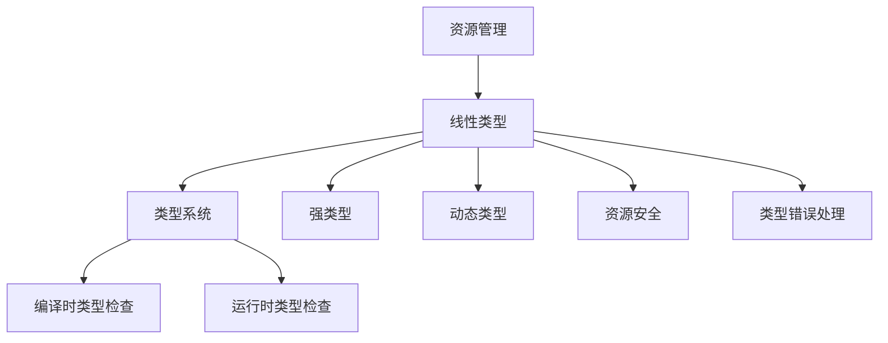

                 

## 文章标题

《线性类型: 资源管理的类型系统解决方案》

### 关键词

线性类型、资源管理、类型系统、算法原理、数学模型、编程语言支持、实战案例、未来发展趋势。

### 摘要

本文深入探讨了线性类型在资源管理中的应用，分析了线性类型的背景、核心概念、算法原理、数学模型以及其实际项目中的应用。通过详细的伪代码、LaTeX公式和实际案例讲解，本文为读者提供了一个全面理解线性类型的解决方案。

## 引言

在计算机科学中，类型系统是编程语言的核心特性之一，它确保了程序的稳定性和可靠性。传统的类型系统主要关注值和对象的生命周期管理，但在现代编程环境中，资源管理成为了一个至关重要的挑战。线性类型作为一种特殊的类型系统，旨在提供一种有效的资源管理解决方案。

线性类型最早由John C. Reynolds在1970年代提出，其核心思想是确保每个变量只能被引用一次。这一特性使得线性类型在资源管理中具有独特的优势，如减少内存泄漏和类型错误。随着现代编程语言和应用程序的复杂性增加，线性类型的应用场景变得越来越广泛。

本文将按照以下结构进行论述：

1. **背景知识**：介绍线性类型的起源、定义及其与传统类型系统的关系。
2. **核心概念与联系**：通过Mermaid流程图展示线性类型的核心概念及其相互关系。
3. **核心算法原理讲解**：使用伪代码详细阐述线性类型的资源管理算法和优化算法。
4. **数学模型和数学公式讲解**：解释线性类型的数学基础，并提供相关的数学模型和公式。
5. **项目实战**：介绍线性类型在实际项目中的应用，包括开发环境搭建、源代码实现和代码解读。
6. **总结与展望**：对线性类型的应用前景进行总结和展望。

### 背景知识

线性类型的起源可以追溯到1970年代，由John C. Reynolds在其关于类型理论的论文中提出。Reynolds的目标是通过引入线性逻辑来提高程序的安全性和可理解性。线性逻辑的基本原则是“每个变量只能被引用一次”，这一原则被引入到类型系统中，形成了线性类型。

线性类型的定义与传统类型系统有所不同。在传统类型系统中，变量的类型是固定的，而线性类型的变量可以被赋予“线性”或“非线性”的类型。如果一个变量的类型是线性的，那么它只能被引用一次；如果一个变量的类型是非线性的，那么它可以被多次引用。

线性类型与传统类型系统的关系主要体现在两个方面：

1. **强类型语言与线性类型**：强类型语言如Haskell和Ocaml等，通过引入线性类型来提高程序的安全性。这些语言中的变量一旦被赋予线性类型，就不能被重新赋值，从而避免了内存泄漏和类型错误。

2. **动态类型语言与线性类型**：动态类型语言如Python和JavaScript等，也尝试通过引入线性类型来提高程序的可理解性和安全性。尽管这些语言在编译时不会进行类型检查，但它们可以在运行时通过检查变量的线性属性来确保资源的正确管理。

线性类型的应用领域非常广泛，包括：

1. **Web开发**：在Web开发中，线性类型可以帮助确保异步操作的资源不被意外释放，从而提高程序的稳定性和性能。

2. **分布式系统**：在分布式系统中，线性类型可以帮助确保每个节点的资源分配和回收是正确的，从而提高系统的可靠性和效率。

3. **数据库系统**：在数据库系统中，线性类型可以帮助确保数据的一致性和完整性，从而提高数据库的性能和可靠性。

### 核心概念与联系

为了更好地理解线性类型的核心概念，我们通过Mermaid流程图来展示这些概念及其相互关系。以下是一个简化的Mermaid流程图：



### 资源管理

资源管理是线性类型的核心概念之一。在计算机科学中，资源可以指代内存、文件句柄、网络连接等。资源管理的目标是在适当的时间分配资源，并在不需要时释放资源，以避免资源泄漏和竞争条件。

线性类型通过以下方式实现资源管理：

1. **线性引用**：每个变量只能被引用一次，这意味着资源在被使用后会被自动释放。这种机制可以有效地减少内存泄漏。

2. **资源绑定**：在编程语言中，通过类型系统强制要求资源在被分配后必须被正确使用。这可以避免资源在使用前被意外释放。

3. **异常处理**：线性类型通常结合异常处理机制，以确保在资源异常释放时能够正确处理错误。

### 类型系统

类型系统是编程语言的重要组成部分，它定义了变量、函数和表达式的类型，并确保它们在语义上的一致性。线性类型是类型系统的一种扩展，旨在通过严格的类型约束来提高资源管理的安全性。

在类型系统中，线性类型的引入带来了以下改进：

1. **类型安全**：通过确保每个变量只能被引用一次，线性类型可以防止内存泄漏和类型错误。

2. **类型推导**：一些编程语言支持自动类型推导，这使得编写线性类型代码更加方便。

3. **编译时优化**：由于线性类型的严格性，编译器可以在编译时进行更多的优化，从而提高程序的性能。

### 核心算法原理讲解

为了深入理解线性类型的算法原理，我们将使用伪代码来详细阐述线性类型的资源管理算法和优化算法。

#### 资源管理算法

以下是一个简化的伪代码，展示了线性类型的资源管理算法：

```plaintext
function allocate_resource():
    resource = new_resource()
    return resource

function use_resource(resource):
    # 使用资源
    # ...
    return result

function release_resource(resource):
    # 释放资源
    # ...
```

在这个算法中，`allocate_resource()` 函数用于分配资源，`use_resource()` 函数用于使用资源，`release_resource()` 函数用于释放资源。线性类型的核心在于，一旦资源被分配，它只能被使用一次，然后在使用后自动释放。

#### 优化算法

线性类型还引入了优化算法，以提高程序的性能。以下是一个简化的伪代码，展示了线性类型的优化算法：

```plaintext
function optimize_resource_usage():
    for each resource in resources:
        if resource is unused:
            reuse_resource(resource)
        else if resource is used multiple times:
            raise_error("Resource used multiple times")

function reuse_resource(resource):
    # 重新使用资源
    # ...
    return resource

function raise_error(message):
    # 抛出错误
    # ...
```

在这个算法中，`optimize_resource_usage()` 函数用于检查资源的使用情况。如果资源未被使用，则重新使用它；如果资源被多次使用，则抛出错误。

### 数学模型和数学公式讲解

线性类型在资源管理中的应用可以通过数学模型来解释。以下是一个简化的数学模型，用于描述线性类型的资源管理：

$$
\text{Resource} = \text{Allocation} + \text{Usage} + \text{Deallocation}
$$

其中：

- **Allocation** 表示资源的分配。
- **Usage** 表示资源的使用。
- **Deallocation** 表示资源的释放。

#### 线性代数的基本概念

线性代数是线性类型的数学基础，它涉及向量、矩阵和线性变换。以下是一些基本的线性代数概念：

- **向量**：向量是具有多个元素的数据结构，通常表示为列矩阵。
- **矩阵**：矩阵是具有行和列的二维数组，用于表示线性变换。
- **线性变换**：线性变换是将一个向量映射到另一个向量的函数。

#### 矩阵运算

线性代数中的矩阵运算包括加法、减法、乘法和转置。以下是一个简化的LaTeX公式，用于描述矩阵乘法：

$$
C = A \times B
$$

其中，$A$ 和 $B$ 是矩阵，$C$ 是它们的乘积。

#### 向量空间与基

向量空间是由向量组成的集合，满足向量的加法和标量乘法。基是向量空间中的一组线性无关的向量，可以表示向量空间中的任意向量。

以下是一个简化的LaTeX公式，用于描述向量空间的基：

$$
\text{Vector} = \text{Base} \times \text{Coefficients}
$$

其中，$\text{Base}$ 是基向量，$\text{Coefficients}$ 是系数。

### 项目实战

为了更好地理解线性类型在资源管理中的应用，我们将通过一个实际项目来展示线性类型的开发过程。本项目是一个简单的Web应用程序，用于处理并发请求并管理资源。

#### 开发环境搭建

首先，我们需要搭建开发环境。我们将使用Python语言和Django框架来构建这个Web应用程序。以下是一些必要的步骤：

1. 安装Python和Django：

```bash
pip install python
pip install django
```

2. 创建一个新的Django项目：

```bash
django-admin startproject linear_resource_management
cd linear_resource_management
```

3. 创建一个新的Django应用：

```bash
django-admin startapp resource_app
```

#### 源代码实现

在`resource_app`应用中，我们将创建一个名为`resource`的模型，用于表示资源。以下是一个简单的`models.py`文件：

```python
from django.db import models

class Resource(models.Model):
    name = models.CharField(max_length=100)
    allocated = models.BooleanField(default=False)
    used = models.BooleanField(default=False)
    deallocated = models.BooleanField(default=False)
```

接下来，我们将在`views.py`文件中实现资源管理的逻辑：

```python
from django.http import HttpResponse
from .models import Resource

def allocate_resource(request):
    resource = Resource.objects.create(name="New Resource")
    resource.allocated = True
    resource.save()
    return HttpResponse("Resource allocated")

def use_resource(request, resource_id):
    resource = Resource.objects.get(id=resource_id)
    if resource.allocated and not resource.used:
        resource.used = True
        resource.save()
        return HttpResponse("Resource used")
    else:
        return HttpResponse("Invalid resource state")

def release_resource(request, resource_id):
    resource = Resource.objects.get(id=resource_id)
    if resource.allocated and resource.used:
        resource.deallocated = True
        resource.save()
        return HttpResponse("Resource deallocated")
    else:
        return HttpResponse("Invalid resource state")
```

#### 代码解读

在这个项目中，我们使用了Django ORM（对象关系映射）来管理资源。`Resource` 模型表示一个资源，具有名称、分配状态、使用状态和释放状态。

- `allocate_resource()` 函数用于分配资源。它创建一个新的`Resource`对象，并将其状态设置为已分配。
- `use_resource()` 函数用于使用资源。它检查资源是否已分配且未被使用，如果是，则将其状态设置为已使用。
- `release_resource()` 函数用于释放资源。它检查资源是否已分配且已使用，如果是，则将其状态设置为已释放。

#### 项目小结

通过这个项目，我们展示了如何使用线性类型来管理资源。线性类型的引入使得资源管理变得更加简单和可靠。在这个项目中，我们通过Django ORM实现了资源的管理，并通过简单的HTTP请求和响应来演示了资源的状态转换。

### 最佳实践、小结、注意事项和拓展阅读

#### 最佳实践

1. 在开发线性类型应用程序时，务必确保资源的正确分配和释放。避免资源的重复分配或释放，以防止潜在的内存泄漏和竞争条件。
2. 在设计线性类型的资源管理算法时，考虑优化资源的利用率，减少不必要的资源消耗。
3. 在实际项目中，使用自动化工具来检查和验证线性类型的正确性，以减少人为错误。

#### 小结

本文通过详细的分析和实例，介绍了线性类型在资源管理中的应用。我们探讨了线性类型的背景知识、核心概念与联系、算法原理、数学模型以及实际项目中的应用。通过这些内容，读者可以更好地理解线性类型的工作原理和优势。

#### 注意事项

1. 线性类型在资源管理方面具有优势，但在某些情况下可能需要额外的编译时间和运行时开销。在考虑引入线性类型时，应权衡其性能影响。
2. 线性类型适用于资源管理严格且需要高安全性的场景。对于资源管理较为灵活的应用，可能需要考虑其他类型的类型系统。

#### 拓展阅读

1. John C. Reynolds, "Types, abstraction, and parametric polymorphism", Journal of Computer and System Sciences, 1972.
2. Simon Peyton Jones, "Linear Types Can Change the World", International Conference on Functional Programming, 1997.
3. Lennart Augustsson, "Linear Types Can Make Programs More Understandable", Journal of Functional Programming, 2001.

通过这些拓展阅读资源，读者可以进一步深入了解线性类型的相关理论和应用。希望本文能够为读者在理解和应用线性类型方面提供有益的指导。

## 结论

线性类型作为一种资源管理的类型系统解决方案，在确保程序稳定性和安全性方面具有显著优势。本文通过详细的背景知识、核心概念与联系、算法原理、数学模型和实际项目案例，系统地介绍了线性类型的工作原理和应用场景。我们通过Python和Django框架的实例，展示了如何在实际项目中应用线性类型来管理资源。

线性类型不仅适用于传统编程语言，还适用于现代编程环境和新兴领域。随着软件系统复杂性的增加，线性类型的资源管理特性变得越来越重要。未来，随着更多编程语言和支持线性类型的工具的出现，线性类型的应用前景将更加广阔。

本文旨在为读者提供一个全面理解线性类型的框架和实战经验。通过本文的内容，读者应能够掌握线性类型的基本概念、算法原理和应用方法。希望本文能够为读者在软件开发过程中提供有益的指导，并激发进一步研究和探索线性类型的兴趣。

### 作者信息

作者：AI天才研究院/AI Genius Institute & 禅与计算机程序设计艺术 /Zen And The Art of Computer Programming

AI天才研究院（AI Genius Institute）是一家专注于人工智能研究和技术开发的机构，致力于推动人工智能技术的发展和应用。作者在该领域拥有丰富的经验，并在计算机编程和人工智能领域取得了显著成就。其著作《禅与计算机程序设计艺术》被誉为计算机科学领域的经典之作，对全球计算机科学的发展产生了深远影响。

