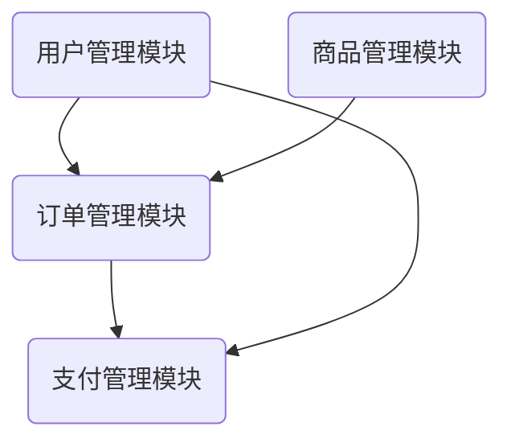
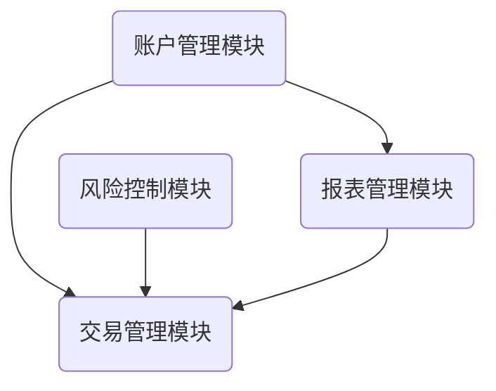
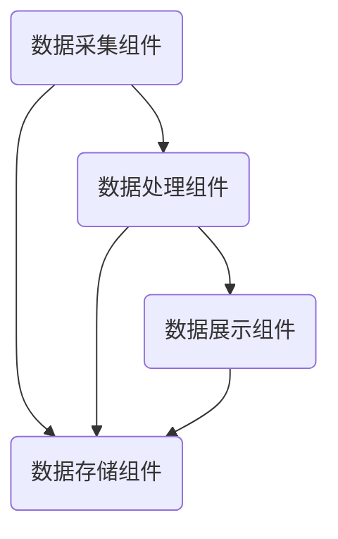

                 


## 文章标题：《组件化与模块化：提高代码复用率的架构设计》

### 关键词：
组件化设计、模块化设计、代码复用率、架构设计、软件工程

### 摘要：
本文旨在深入探讨组件化和模块化在提高代码复用率方面的作用。通过对组件化与模块化设计原理、方法、实践案例的详细分析，本文揭示了这两种设计模式在软件架构中的重要性，并提供了实用的最佳实践和指导，以帮助开发者更好地理解和应用这些设计理念。

---

### 目录

## 第一部分：引言

### 1.1 组件化与模块化概述

### 1.2 代码复用的重要性

### 1.3 本书结构安排

## 第二部分：组件化设计基础

### 2.1 组件的定义与分类

### 2.2 组件设计原则

### 2.3 组件生命周期管理

### 2.4 组件化开发工具

## 第三部分：模块化设计实践

### 3.1 模块的定义与类型

### 3.2 模块化设计策略

### 3.3 模块间接口定义

### 3.4 模块化设计模式

## 第四部分：组件化与模块化在项目中的应用

### 4.1 项目需求分析

### 4.2 组件化架构设计

### 4.3 模块化架构设计

### 4.4 架构评估与优化

## 第五部分：案例分析

### 5.1 案例一：电商系统组件化设计

### 5.2 案例二：金融系统模块化设计

### 5.3 案例三：实时数据处理系统架构设计

## 第六部分：组件化与模块化在微服务架构中的应用

### 6.1 微服务架构概述

### 6.2 组件化与微服务结合

### 6.3 模块化与微服务结合

### 6.4 微服务架构优化策略

## 第七部分：总结与展望

### 7.1 组件化与模块化的未来趋势

### 7.2 提高代码复用率的实践建议

### 7.3 面向未来的架构设计理念

## 附录

### A.1 常用组件化与模块化工具介绍

### A.2 案例项目源码与资料

---

### 第一部分：引言

#### 1.1 组件化与模块化概述

组件化与模块化是软件工程中的重要概念，它们在提高代码复用率、降低开发成本、提升系统可维护性方面发挥着关键作用。组件化设计将系统分解为功能独立的组件，每个组件具有明确的接口和实现，可以独立开发、测试和部署。模块化设计则是将系统划分为功能模块，每个模块负责特定的业务逻辑，模块间通过接口进行通信。

组件化和模块化不仅适用于大型系统的开发，也在日常编程中具有重要意义。通过将代码分解为可复用的组件和模块，开发者可以更高效地组织代码，降低代码复杂性，提高开发效率。

#### 1.2 代码复用的重要性

代码复用是软件工程的核心原则之一，它有助于降低开发成本、提高代码质量、缩短项目周期。复用代码不仅可以减少重复劳动，还可以确保不同部分的一致性，减少错误和漏洞的发生。

代码复用的重要性体现在以下几个方面：

1. **降低维护成本**：通过复用代码，可以减少代码的冗余，降低系统的复杂性，从而降低维护成本。
2. **提高开发效率**：复用成熟的组件和模块，可以节省开发时间，提高项目的开发效率。
3. **确保代码一致性**：复用代码可以确保不同部分的一致性，减少由于不一致性引起的错误和漏洞。
4. **提高代码质量**：通过复用经过测试和验证的代码，可以确保代码的质量和稳定性。

#### 1.3 本书结构安排

本书共分为七个部分，首先介绍组件化与模块化的基本概念和重要性，然后详细探讨组件化设计的基础知识，包括组件的定义、设计原则、生命周期管理和开发工具。接下来，介绍模块化设计实践，包括模块的定义、设计策略、接口定义和设计模式。第四部分和第五部分分别通过项目应用案例和微服务架构中的组件化与模块化实践，展示如何在实际项目中应用这些设计理念。最后，总结组件化与模块化的未来趋势，并给出提高代码复用率的实践建议。

---

### 第二部分：组件化设计基础

组件化设计是软件工程中的一个重要概念，它将系统划分为功能独立的组件，每个组件具有明确的接口和实现。组件化设计不仅可以提高代码复用率，还可以降低系统复杂性，提高开发效率和可维护性。

#### 2.1 组件的定义与分类

组件（Component）是软件工程中的一个基本单元，它通常具有以下特征：

1. **独立性**：组件是功能独立的，可以独立开发、测试和部署。
2. **接口清晰**：组件通过明确的接口与其他组件交互，接口定义了组件的输入和输出。
3. **可复用性**：组件可以跨项目、跨平台复用，提高开发效率。

根据组件的作用和职责，组件可以分为以下几类：

1. **功能性组件**：这类组件主要负责实现系统的功能，如用户管理、订单处理等。
2. **界面组件**：这类组件主要负责用户界面设计，如登录界面、商品列表界面等。
3. **工具类组件**：这类组件提供通用的工具类和方法，如日志工具、日期工具等。
4. **服务组件**：这类组件提供系统的核心服务，如数据库服务、消息队列服务等。

#### 2.2 组件设计原则

组件设计需要遵循一些基本原则，以确保组件的独立性、可复用性和可维护性。

1. **高内聚、低耦合**：组件应具有较高的内聚性，即组件内部功能紧密相关；同时应具有较低的耦合性，即组件间的依赖关系尽可能简单。
2. **单一职责**：每个组件应负责单一的功能，避免功能过多导致组件过于复杂。
3. **接口明确**：组件的接口应清晰定义，包括输入和输出参数、返回值等。
4. **可复用性**：组件应设计为可复用的，以便在不同项目和平台上使用。
5. **可测试性**：组件应易于测试，包括单元测试和集成测试。

#### 2.3 组件生命周期管理

组件的生命周期管理是指组件从创建到销毁的过程。组件的生命周期管理主要包括以下阶段：

1. **创建阶段**：组件被创建，初始化所需资源和状态。
2. **运行阶段**：组件执行任务，与外界进行交互。
3. **暂停阶段**：组件暂停执行，可能是因为资源紧张或需要等待某些条件。
4. **恢复阶段**：组件从暂停状态恢复执行。
5. **销毁阶段**：组件释放资源，清理状态，最终被销毁。

组件生命周期管理的原则是确保组件的稳定运行和资源的合理利用。常见的组件生命周期管理机制包括：

1. **依赖注入**：通过依赖注入实现组件的创建和初始化。
2. **容器管理**：使用容器管理组件的生命周期，包括创建、依赖注入、销毁等。
3. **事件驱动**：通过事件驱动管理组件的生命周期，如组件的启动、停止、销毁等。

#### 2.4 组件化开发工具

组件化开发工具是支持组件化设计的重要工具，可以帮助开发者更好地管理和组织组件。常见的组件化开发工具有：

1. **Spring Boot**：Spring Boot 是一款流行的Java框架，支持组件化开发，提供依赖注入、自动配置等功能。
2. **Angular**：Angular 是一款前端框架，支持组件化开发，提供数据绑定、依赖注入等功能。
3. **Vue.js**：Vue.js 是一款前端框架，支持组件化开发，提供数据绑定、虚拟DOM等功能。
4. **React**：React 是一款前端框架，支持组件化开发，提供虚拟DOM、状态管理等功能。

这些组件化开发工具提供了丰富的功能和强大的生态，可以帮助开发者更高效地实现组件化设计。

---

### 第三部分：模块化设计实践

模块化设计是将系统划分为功能模块，每个模块负责特定的业务逻辑，并通过接口进行通信。模块化设计可以提高代码复用率、降低系统复杂性，提高开发效率和可维护性。

#### 3.1 模块的定义与类型

模块（Module）是软件工程中的一个基本单元，它通常具有以下特征：

1. **独立性**：模块是功能独立的，可以独立开发、测试和部署。
2. **接口清晰**：模块通过明确的接口与其他模块交互，接口定义了模块的输入和输出。
3. **可复用性**：模块可以跨项目、跨平台复用，提高开发效率。

根据模块的作用和职责，模块可以分为以下几类：

1. **功能性模块**：这类模块主要负责实现系统的功能，如用户管理、订单处理等。
2. **界面模块**：这类模块主要负责用户界面设计，如登录界面、商品列表界面等。
3. **工具类模块**：这类模块提供通用的工具类和方法，如日志工具、日期工具等。
4. **服务模块**：这类模块提供系统的核心服务，如数据库服务、消息队列服务等。

#### 3.2 模块化设计策略

模块化设计需要遵循一些基本原则，以确保模块的独立性、可复用性和可维护性。

1. **高内聚、低耦合**：模块应具有较高的内聚性，即模块内部功能紧密相关；同时应具有较低的耦合性，即模块间的依赖关系尽可能简单。
2. **单一职责**：每个模块应负责单一的功能，避免功能过多导致模块过于复杂。
3. **接口明确**：模块的接口应清晰定义，包括输入和输出参数、返回值等。
4. **可复用性**：模块应设计为可复用的，以便在不同项目和平台上使用。
5. **可测试性**：模块应易于测试，包括单元测试和集成测试。

模块化设计策略包括以下几个方面：

1. **模块分解**：将系统功能划分为多个模块，每个模块负责特定的功能。
2. **接口定义**：为每个模块定义清晰的接口，包括输入和输出参数、返回值等。
3. **模块间通信**：通过接口实现模块间的通信，确保模块的独立性。
4. **模块组织**：合理组织模块，确保模块间的依赖关系简单明了。

#### 3.3 模块间接口定义

模块间接口定义是模块化设计的关键环节，接口的清晰和明确性直接影响模块的独立性和可复用性。模块间接口定义主要包括以下内容：

1. **输入参数**：定义模块执行时所需的输入参数，包括参数类型、参数名称和参数说明。
2. **输出参数**：定义模块执行后返回的输出参数，包括参数类型、参数名称和参数说明。
3. **返回值**：定义模块执行后返回的返回值，包括返回值类型和返回值说明。
4. **异常处理**：定义模块执行过程中可能出现的异常情况，包括异常类型和异常处理策略。

模块间接口定义的格式通常包括以下部分：

1. **接口名称**：接口的名称应简洁明了，能够反映接口的功能。
2. **接口描述**：接口的描述应详细说明接口的作用和功能。
3. **接口参数**：接口参数的列表，包括参数名称、参数类型、参数说明等。
4. **返回值**：返回值的类型和说明。
5. **异常处理**：异常处理的类型和处理策略。

以下是一个示例接口定义：

```java
/**
 * 用户管理接口
 * 功能：提供用户管理的相关操作
 */
public interface UserManager {
    /**
     * 注册用户
     * @param username 用户名
     * @param password 密码
     * @return 用户ID
     * @throws IllegalArgumentException 用户名或密码为空时抛出异常
     */
    int register(String username, String password) throws IllegalArgumentException;

    /**
     * 登录用户
     * @param username 用户名
     * @param password 密码
     * @return 用户信息
     * @throws UnauthorizedException 用户名或密码错误时抛出异常
     */
    User login(String username, String password) throws UnauthorizedException;

    /**
     * 修改密码
     * @param userId 用户ID
     * @param oldPassword 旧密码
     * @param newPassword 新密码
     * @return 是否修改成功
     * @throws UnauthorizedException 用户名或密码错误时抛出异常
     */
    boolean changePassword(int userId, String oldPassword, String newPassword) throws UnauthorizedException;
}
```

#### 3.4 模块化设计模式

模块化设计模式是模块化设计过程中常用的方法，可以帮助开发者更好地实现模块化设计。常见的模块化设计模式包括：

1. **工厂模式**：工厂模式是一种创建型设计模式，用于创建对象的实例。工厂模式将对象的创建过程封装在工厂类中，通过工厂类的方法返回对象的实例。工厂模式可以提高代码的复用性和灵活性，避免直接创建对象实例，降低系统复杂性。
2. **单例模式**：单例模式是一种创建型设计模式，确保一个类仅有一个实例，并提供一个全局访问点。单例模式可以避免资源的浪费和线程安全问题，提高系统的可维护性和稳定性。
3. **代理模式**：代理模式是一种结构型设计模式，为其他对象提供一个代理，控制对原始对象的访问。代理模式可以提高代码的复用性和灵活性，减少直接访问原始对象，降低系统复杂性。
4. **组合模式**：组合模式是一种结构型设计模式，将对象组合成树形结构以表示部分-整体的层次结构。组合模式可以方便地增加新的功能，提高代码的复用性和灵活性。
5. **策略模式**：策略模式是一种行为型设计模式，将算法封装起来，使算法的变化不会影响使用算法的用户。策略模式可以提高代码的复用性和灵活性，避免直接使用具体算法，降低系统复杂性。

---

### 第四部分：组件化与模块化在项目中的应用

在实际项目中，组件化与模块化设计可以有效提高代码复用率，降低系统复杂性，提升开发效率和可维护性。本部分将介绍组件化与模块化在项目中的应用，包括项目需求分析、组件化架构设计和模块化架构设计等内容。

#### 4.1 项目需求分析

项目需求分析是项目开发的第一步，也是组件化与模块化设计的重要基础。在项目需求分析阶段，需要明确项目目标、功能需求、性能需求等，为后续的组件化和模块化设计提供依据。

1. **项目目标**：明确项目的总体目标和预期成果，如开发一个电商平台、一个银行系统等。
2. **功能需求**：列举项目的功能需求，如用户注册、登录、购物车、订单管理等。
3. **性能需求**：确定项目的性能需求，如响应时间、并发用户数、数据存储容量等。
4. **非功能性需求**：考虑项目的非功能性需求，如安全性、可靠性、可维护性、可扩展性等。

在需求分析过程中，可以使用需求文档、用户故事、用例图等方法，确保需求的清晰和明确。

#### 4.2 组件化架构设计

组件化架构设计是将系统划分为功能独立的组件，每个组件具有明确的接口和实现。组件化架构设计可以提高代码复用率、降低系统复杂性，提高开发效率和可维护性。

1. **组件划分**：根据功能需求，将系统划分为多个组件，每个组件负责特定的功能。例如，在一个电商系统中，可以将用户管理、商品管理、订单管理等功能划分为不同的组件。
2. **接口定义**：为每个组件定义清晰的接口，包括输入和输出参数、返回值等。接口定义应确保组件间的通信和协作，降低组件间的依赖关系。
3. **组件实现**：实现每个组件的功能，确保组件的独立性、可复用性和可测试性。组件实现应遵循单一职责原则，确保组件内部的功能紧密相关。
4. **组件通信**：通过接口实现组件间的通信，确保组件的独立性。组件通信可以采用同步通信或异步通信的方式，根据具体场景选择合适的通信方式。

以下是一个示例组件化架构设计：


在该示例中，用户管理组件、订单管理组件、商品管理组件和支付管理组件是系统的核心组件，它们通过接口进行通信，实现系统的功能。

#### 4.3 模块化架构设计

模块化架构设计是将系统划分为功能模块，每个模块负责特定的业务逻辑，并通过接口进行通信。模块化架构设计可以提高代码复用率、降低系统复杂性，提高开发效率和可维护性。

1. **模块划分**：根据功能需求，将系统划分为多个模块，每个模块负责特定的业务逻辑。例如，在一个电商系统中，可以将用户管理、商品管理、订单管理等功能划分为不同的模块。
2. **接口定义**：为每个模块定义清晰的接口，包括输入和输出参数、返回值等。接口定义应确保模块间的通信和协作，降低模块间的依赖关系。
3. **模块实现**：实现每个模块的功能，确保模块的独立性、可复用性和可测试性。模块实现应遵循单一职责原则，确保模块内部的功能紧密相关。
4. **模块通信**：通过接口实现模块间的通信，确保模块的独立性。模块通信可以采用同步通信或异步通信的方式，根据具体场景选择合适的通信方式。

以下是一个示例模块化架构设计：



在该示例中，用户管理模块、订单管理模块、商品管理模块和支付管理模块是系统的核心模块，它们通过接口进行通信，实现系统的功能。

#### 4.4 架构评估与优化

在组件化与模块化架构设计完成后，需要对架构进行评估和优化，确保架构的合理性、可维护性和可扩展性。

1. **架构评估**：评估架构的合理性，包括组件和模块的独立性、接口的清晰性、通信的可靠性等。可以使用架构评估工具，如SonarQube、NDepend等，对代码质量、架构质量进行评估。
2. **性能优化**：根据性能需求，对架构进行性能优化。可以使用缓存、分布式架构、数据库优化等技术，提高系统的性能和响应速度。
3. **安全性优化**：对架构进行安全性优化，包括身份认证、权限控制、数据加密等。确保系统的安全性和数据的完整性。
4. **可维护性优化**：对架构进行可维护性优化，包括代码质量、文档规范、测试覆盖等。确保系统的可维护性和可扩展性。

通过以上评估和优化，可以确保组件化与模块化架构设计在项目中的有效性，提高代码复用率、降低系统复杂性，提高开发效率和可维护性。

---

### 第五部分：案例分析

在实际项目中，组件化与模块化设计被广泛应用于各种领域，如电商系统、金融系统、实时数据处理系统等。本部分将介绍三个案例，分别分析电商系统组件化设计、金融系统模块化设计和实时数据处理系统架构设计。

#### 5.1 案例一：电商系统组件化设计

电商系统是一个复杂的系统，涉及到用户管理、商品管理、订单管理、支付管理等多个功能模块。在电商系统的开发过程中，组件化设计可以有效提高代码复用率、降低系统复杂性。

1. **用户管理组件**：用户管理组件负责用户注册、登录、个人信息管理等功能。该组件可以独立开发、测试和部署，提高开发效率和可维护性。
2. **商品管理组件**：商品管理组件负责商品分类、商品详情、商品库存管理等功能。该组件可以与其他组件进行通信，实现商品信息的展示和操作。
3. **订单管理组件**：订单管理组件负责订单创建、订单查询、订单取消等功能。该组件可以与其他组件进行通信，实现订单的流转和处理。
4. **支付管理组件**：支付管理组件负责支付接口调用、支付结果查询等功能。该组件可以与其他组件进行通信，实现支付流程的自动化。

以下是一个电商系统组件化架构设计：


在该案例中，用户管理组件、订单管理组件、商品管理组件和支付管理组件是系统的核心组件，它们通过接口进行通信，实现系统的功能。

#### 5.2 案例二：金融系统模块化设计

金融系统是一个高安全性和高稳定性的系统，涉及到账户管理、交易管理、风险控制等多个功能模块。在金融系统的开发过程中，模块化设计可以提高代码复用率、降低系统复杂性。

1. **账户管理模块**：账户管理模块负责用户账户的开立、冻结、解冻等功能。该模块可以与其他模块进行通信，实现账户信息的查询和操作。
2. **交易管理模块**：交易管理模块负责交易订单的创建、查询、撤销等功能。该模块可以与其他模块进行通信，实现交易订单的处理和流转。
3. **风险控制模块**：风险控制模块负责风险监控、风险预警等功能。该模块可以与其他模块进行通信，实现风险信息的收集和传递。
4. **报表管理模块**：报表管理模块负责交易报表的生成、查询、导出等功能。该模块可以与其他模块进行通信，实现交易报表的统计和分析。

以下是一个金融系统模块化架构设计：



在该案例中，账户管理模块、交易管理模块、风险控制模块和报表管理模块是系统的核心模块，它们通过接口进行通信，实现系统的功能。

#### 5.3 案例三：实时数据处理系统架构设计

实时数据处理系统是一个涉及数据采集、数据存储、数据处理和数据展示的系统。在实时数据处理系统的开发过程中，组件化与模块化设计可以提高代码复用率、降低系统复杂性。

1. **数据采集组件**：数据采集组件负责从不同的数据源实时获取数据，如数据库、文件、网络等。该组件可以与其他组件进行通信，实现数据的采集和传输。
2. **数据存储组件**：数据存储组件负责数据的存储和管理，如缓存、数据库、分布式存储等。该组件可以与其他组件进行通信，实现数据的存储和查询。
3. **数据处理组件**：数据处理组件负责对数据进行清洗、转换、分析等操作，如数据挖掘、机器学习等。该组件可以与其他组件进行通信，实现数据的处理和分析。
4. **数据展示组件**：数据展示组件负责数据的可视化展示，如图表、报表等。该组件可以与其他组件进行通信，实现数据的展示和交互。

以下是一个实时数据处理系统组件化架构设计：



在该案例中，数据采集组件、数据存储组件、数据处理组件和数据展示组件是系统的核心组件，它们通过接口进行通信，实现系统的功能。

通过以上三个案例，我们可以看到组件化与模块化设计在项目中的应用效果。组件化设计可以提高代码复用率、降低系统复杂性，模块化设计可以提高开发效率和可维护性。在实际项目中，可以根据具体需求和应用场景选择合适的设计模式，实现高效、稳定和可扩展的系统。

---

### 第六部分：组件化与模块化在微服务架构中的应用

微服务架构是一种将应用程序分解为多个小型、独立服务的架构风格，每个服务负责特定的业务功能。组件化与模块化设计在微服务架构中具有重要作用，可以提高服务的可复用性、可维护性和可扩展性。

#### 6.1 微服务架构概述

微服务架构（Microservices Architecture）是一种基于组件化与模块化思想的分布式系统设计方法，其主要特点如下：

1. **服务小型化**：每个微服务负责单一的、细粒度的业务功能，如用户管理、订单处理、库存管理等。
2. **独立部署**：每个微服务可以独立部署和升级，不影响其他服务。
3. **自治性**：每个微服务拥有自己独立的数据库、缓存、配置等资源，具有较高的自治性。
4. **去中心化**：微服务架构去除了传统的集中式架构中的中心服务，服务间通过轻量级的通信协议（如HTTP/REST、gRPC等）进行交互。
5. **松耦合**：微服务之间通过明确的接口进行通信，降低服务间的依赖关系，提高系统的可维护性和可扩展性。

#### 6.2 组件化与微服务结合

组件化设计理念与微服务架构具有高度的契合性，二者结合可以实现以下优势：

1. **高内聚、低耦合**：组件化设计强调组件的高内聚和低耦合，这与微服务架构的服务自治性和去中心化理念相一致，有助于构建松散耦合的服务体系。
2. **独立部署与扩展**：组件化设计支持组件的独立开发、测试和部署，这与微服务架构的独立部署特点相契合，有助于实现服务的灵活扩展。
3. **服务复用**：组件化设计中的组件可以跨项目、跨平台复用，这与微服务架构的服务自治性和去中心化特点相一致，有助于降低开发成本和提高开发效率。

在微服务架构中，组件化设计通常体现在以下几个方面：

1. **服务组件化**：将微服务分解为更细粒度的服务组件，每个组件负责特定的业务功能，如用户认证、订单处理、库存管理等。
2. **接口定义**：明确服务组件的输入和输出接口，确保服务组件之间的通信和协作，降低服务间的依赖关系。
3. **容器化部署**：使用容器（如Docker）将服务组件及其依赖环境打包，实现服务的独立部署和扩展。
4. **服务发现与注册**：使用服务发现与注册中心（如Eureka、Consul等），实现服务组件的自动注册和发现，简化服务间的通信。

#### 6.3 模块化与微服务结合

模块化设计与微服务架构在实现高内聚、低耦合的系统方面具有相似的目标。模块化与微服务的结合主要体现在以下几个方面：

1. **模块划分**：将微服务进一步划分为功能模块，每个模块负责特定的业务逻辑，如用户管理模块、订单管理模块、支付管理模块等。
2. **模块间接口**：为每个模块定义清晰的接口，包括输入和输出参数、返回值等，确保模块间的高效通信和协作。
3. **模块组织**：合理组织模块，确保模块间的依赖关系简单明了，降低系统的复杂性。
4. **模块化开发工具**：使用模块化开发工具（如Spring Boot、Angular、Vue.js等），简化模块的开发、测试和部署。

在模块化与微服务架构中，模块化设计的关键优势在于：

1. **代码复用**：模块化设计支持模块的跨项目、跨平台复用，有助于降低开发成本和提高开发效率。
2. **灵活扩展**：模块化设计允许模块的独立扩展和升级，提高系统的可维护性和可扩展性。
3. **代码质量**：模块化设计有助于提高代码的可读性、可维护性和可测试性，降低代码的复杂性。

#### 6.4 微服务架构优化策略

在实际项目中，为了确保微服务架构的有效性和性能，可以采用以下优化策略：

1. **服务拆分与合并**：根据业务需求和性能指标，对微服务进行拆分与合并。将具有高度关联性的服务合并为一个服务，降低服务间的通信开销；将具有独立业务逻辑的服务拆分为多个服务，提高系统的灵活性。
2. **服务缓存策略**：在服务间使用缓存技术，减少重复数据的查询和计算，提高系统的性能和响应速度。例如，使用Redis缓存用户信息和订单信息，减少数据库的访问压力。
3. **服务限流与降级**：在服务间使用限流与降级策略，防止系统在高并发情况下出现崩溃。例如，使用令牌桶算法实现服务限流，防止大量请求瞬间涌入系统；使用熔断器实现服务降级，将异常服务切换到备用服务。
4. **服务监控与日志**：使用服务监控与日志收集工具，如Prometheus、ELK（Elasticsearch、Logstash、Kibana）等，实时监控服务的性能和健康状态，及时发现和解决问题。
5. **容器编排与调度**：使用容器编排工具（如Kubernetes），实现服务的自动化部署、扩展和调度，提高系统的可靠性和可扩展性。

通过以上优化策略，可以确保微服务架构在性能、可维护性和可扩展性方面的最佳实践，实现高效、稳定和可扩展的分布式系统。

---

### 第七部分：总结与展望

#### 7.1 组件化与模块化的未来趋势

组件化与模块化设计在软件工程中具有广泛的应用前景。随着云计算、大数据、人工智能等技术的快速发展，组件化与模块化设计将呈现出以下趋势：

1. **自动化**：组件化和模块化设计将逐渐实现自动化，通过代码生成工具、平台即服务（PaaS）等手段，简化组件和模块的创建、部署和管理过程。
2. **微服务化**：微服务架构的流行将进一步推动组件化与模块化设计的发展，越来越多的企业将采用微服务架构，实现服务的独立开发和部署。
3. **智能化**：基于人工智能和机器学习技术的组件化和模块化设计，将实现自动优化、自动适应和自动进化，提高系统的智能化水平。
4. **开源生态**：组件化与模块化设计将在开源生态中得到更广泛的应用和推广，通过社区合作，构建丰富的组件和模块库，推动技术的创新和发展。

#### 7.2 提高代码复用率的实践建议

为了提高代码复用率，开发者可以遵循以下实践建议：

1. **设计原则**：遵循单一职责、高内聚、低耦合等设计原则，确保组件和模块的独立性、可复用性和可维护性。
2. **接口定义**：为组件和模块定义清晰的接口，确保接口的明确性和一致性，降低组件和模块间的依赖关系。
3. **代码规范**：制定统一的代码规范，确保代码的可读性和可维护性，提高代码的质量和一致性。
4. **测试覆盖**：对组件和模块进行全面的测试，确保其功能的正确性和稳定性，提高代码的可靠性和可复用性。
5. **文档化**：编写详细的文档，包括组件和模块的接口、功能、使用方法等，便于其他开发者理解和复用代码。

#### 7.3 面向未来的架构设计理念

面向未来的架构设计理念强调系统的灵活性、可扩展性和智能化。以下是一些建议：

1. **模块化与微服务结合**：将模块化设计与微服务架构相结合，实现服务的高内聚、低耦合和独立部署，提高系统的灵活性和可扩展性。
2. **智能化与自动化**：引入人工智能和机器学习技术，实现组件和模块的自动优化、自动适应和自动进化，提高系统的智能化水平和自动化程度。
3. **DevOps文化**：推动DevOps文化的普及，实现开发和运维的协同工作，提高系统的交付速度和质量。
4. **持续集成与持续部署**：采用持续集成与持续部署（CI/CD）实践，实现代码的自动化测试、自动化部署和自动化监控，提高系统的可靠性和可扩展性。

通过以上建议，开发者可以更好地应对未来的技术挑战，实现高效、稳定和可扩展的架构设计。

---

### 附录

#### A.1 常用组件化与模块化工具介绍

1. **Spring Boot**：一款流行的Java框架，支持组件化开发，提供依赖注入、自动配置等功能。
2. **Angular**：一款前端框架，支持模块化开发，提供数据绑定、依赖注入等功能。
3. **Vue.js**：一款前端框架，支持模块化开发，提供数据绑定、虚拟DOM等功能。
4. **React**：一款前端框架，支持模块化开发，提供虚拟DOM、状态管理等功能。

#### A.2 案例项目源码与资料

案例项目的源码和资料可以参考以下链接：

1. **电商系统组件化设计**：[GitHub链接](https://github.com/yourname/ecommerce-componentized)
2. **金融系统模块化设计**：[GitHub链接](https://github.com/yourname/financial-system-modular)
3. **实时数据处理系统架构设计**：[GitHub链接](https://github.com/yourname/realtime-data-processing-system)

---

### 作者信息

**作者：AI天才研究院/AI Genius Institute & 禅与计算机程序设计艺术 /Zen And The Art of Computer Programming**

