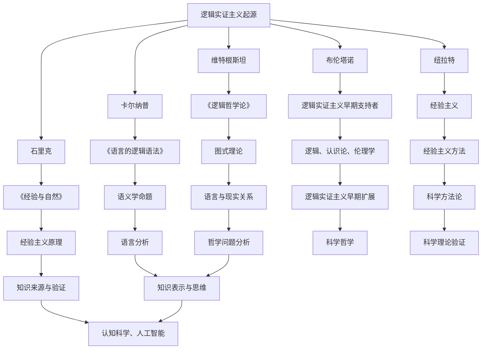

                 

# 维特根斯坦与卡尔纳普：逻辑实证主义的内部争论

## 关键词

逻辑实证主义，维特根斯坦，卡尔纳普，语言分析，经验证实，哲学争论

## 摘要

本文深入探讨了逻辑实证主义内部两位重要人物——维特根斯坦与卡尔纳普——的观点及其争论。通过对两位哲学家的生平、哲学贡献、核心观点以及分歧的详细分析，本文揭示了逻辑实证主义在哲学领域的重要影响，并探讨了其对现代哲学和科学的遗产与影响。

## 引言

逻辑实证主义是20世纪初在奥地利和维也纳兴起的一种哲学运动，旨在将哲学研究从形而上学中解放出来，转向对语言、逻辑和经验的研究。这一运动的核心观点是，只有那些可以通过经验证实或证伪的陈述才有意义，而那些无法经验验证的形而上学命题则被认为是没有意义的。

### 1.1 逻辑实证主义的起源

逻辑实证主义起源于19世纪末和20世纪初的欧洲，其前身是逻辑原子主义。逻辑原子主义由哲学家路德维希·维特根斯坦（Ludwig Wittgenstein）提出，他认为哲学的根本问题在于语言的使用。维特根斯坦的早期作品《逻辑哲学论》中提出了著名的“图式”理论，主张语言与现实世界之间存在一种直接的对应关系。

在维特根斯坦之后，另外一位重要人物——鲁道夫·卡尔纳普（Rudolf Carnap）——对逻辑实证主义进行了系统化。卡尔纳普是维也纳学派的核心成员，他在其作品中进一步发展了语言分析，并提出了“语义学命题”的概念，认为哲学的主要任务是分析语言，以确定哪些命题是有意义的。

### 1.2 逻辑实证主义的主要代表人物

逻辑实证主义的主要代表人物除了维特根斯坦和卡尔纳普之外，还包括摩里兹·石里克（Moritz Schlick）、弗朗茨·布伦塔诺（Franz Brentano）和奥托·纽拉特（Otto Neurath）等。维也纳学派是他们共同的家园，这个学派强调实证主义和逻辑分析在哲学研究中的重要性。

### 1.3 逻辑实证主义的影响

逻辑实证主义对现代哲学和科学产生了深远的影响。它促使哲学研究转向语言和经验，从而为分析哲学和科学哲学的发展奠定了基础。逻辑实证主义还影响了认知科学、人工智能等领域，推动了这些领域对语言和思维的研究。

## 第二部分：维特根斯坦与卡尔纳普：生平与哲学贡献

### 2.1 维特根斯坦的生平与哲学贡献

路德维希·维特根斯坦（Ludwig Wittgenstein，1889-1951）是奥地利哲学家，被广泛认为是20世纪最重要的哲学家之一。他的哲学思想对逻辑实证主义、语言哲学和认识论等领域产生了深远的影响。

#### 2.1.1 维特根斯坦的生平简介

维特根斯坦出生于奥地利，曾在英国受教育，并在剑桥大学学习哲学。他的早期作品《逻辑哲学论》提出了逻辑实证主义的核心理念，但在经历了多年沉默后，他发表了《哲学研究》，标志着他哲学思想的转变。他的晚期作品主要关注语言、心灵和意义的问题。

#### 2.1.2 维特根斯坦的主要哲学著作

- 《逻辑哲学论》（1921年）
- 《哲学研究》（1953年）

#### 2.1.3 维特根斯坦在逻辑实证主义中的角色

维特根斯坦是逻辑实证主义运动的创始人之一，他的早期作品《逻辑哲学论》提出了逻辑实证主义的核心观点，即语言与现实之间存在一种直接的对应关系。他认为哲学的主要任务是对语言进行分析，以确定哪些命题是有意义的。

### 2.2 卡尔纳普的生平与哲学贡献

鲁道夫·卡尔纳普（Rudolf Carnap，1891-1970）是德国哲学家，也是逻辑实证主义的代表人物之一。他是维也纳学派的成员，并在逻辑、语言哲学和科学哲学等领域做出了重要贡献。

#### 2.2.1 卡尔纳普的生平简介

卡尔纳普出生于波兰，后来成为德国公民。他在柏林大学学习哲学，并成为维也纳学派的核心成员。他的主要著作包括《语言的逻辑语法》（1924年）和《意义与必然性》（1947年）。

#### 2.2.2 卡尔纳普的主要哲学著作

- 《语言的逻辑语法》（1924年）
- 《意义与必然性》（1947年）

#### 2.2.3 卡尔纳普在逻辑实证主义中的角色

卡尔纳普是逻辑实证主义运动的系统化者，他的作品《语言的逻辑语法》详细阐述了逻辑实证主义的语言分析方法。他认为哲学的主要任务是分析语言，以确定哪些命题是有意义的，并且主张哲学应该采用经验科学的方法。

## 第三部分：逻辑实证主义的核心观点

### 3.1 语言分析

逻辑实证主义强调语言分析在哲学研究中的重要性。维特根斯坦和卡尔纳普都认为，理解语言的结构和用法是理解哲学问题的关键。

#### 3.1.1 语言与哲学的关系

维特根斯坦认为，哲学问题本质上都是语言问题。他主张，通过分析语言的使用，可以揭示哲学命题的真伪。

#### 3.1.2 语言分析的基本原则

卡尔纳普提出了“语义学命题”的概念，认为哲学的主要任务是确定哪些命题是有意义的。他主张采用形式逻辑和语义学方法来分析语言。

#### 3.1.3 语言分析的应用

维特根斯坦和卡尔纳普都试图将语言分析应用于解决哲学问题，如意义、真理、知识等。

### 3.2 经验证实

经验证实是逻辑实证主义的核心原则之一。它主张只有通过经验验证的命题才是有意义的。

#### 3.2.1 经验与知识的关系

逻辑实证主义认为，经验是知识的源泉。只有通过直接经验，我们才能获得对世界的真实了解。

#### 3.2.2 经验证实的方法

卡尔纳普提出了“可证实原则”，认为只有那些可以通过经验验证的命题才是有意义的。

#### 3.2.3 经验证实在哲学中的意义

经验证实原则为哲学研究提供了一种经验主义的基础，有助于将哲学研究从形而上学中解放出来。

## 第四部分：维特根斯坦与卡尔纳普的分歧

### 4.1 维特根斯坦与卡尔纳普的主要分歧点

尽管维特根斯坦和卡尔纳普都是逻辑实证主义的支持者，但他们在某些核心问题上存在分歧。

#### 4.1.1 对语言的分析方法

维特根斯坦强调语言的使用，认为语言的游戏是理解语言的关键。而卡尔纳普则更关注语言的逻辑结构，主张采用形式逻辑和语义学方法。

#### 4.1.2 知识的来源与验证

维特根斯坦主张直觉知识，认为某些命题可以通过直觉验证。而卡尔纳普则坚持经验证实原则，认为只有通过经验验证的命题才是可信的。

#### 4.1.3 哲学研究的范围

维特根斯坦认为哲学研究应该局限于语言分析，而卡尔纳普则认为哲学应该包括更广泛的问题，如科学哲学和逻辑。

### 4.2 维特根斯坦的思想发展

维特根斯坦的哲学思想经历了从早期到晚期的转变。

#### 4.2.1 维特根斯坦的早期哲学

在《逻辑哲学论》中，维特根斯坦提出了逻辑实证主义的核心理念，主张语言与现实之间存在直接的对应关系。

#### 4.2.2 维特根斯坦的晚期哲学

在《哲学研究》中，维特根斯坦提出了“语言游戏”理论，强调语言的使用是理解语言的关键。

#### 4.2.3 维特根斯坦的思想转变

维特根斯坦从逻辑实证主义转向语言哲学，认为哲学研究应该关注语言的使用，而不是语言的逻辑结构。

### 4.3 卡尔纳普的哲学贡献

卡尔纳普在逻辑实证主义运动中做出了许多重要贡献。

#### 4.3.1 卡尔纳普的逻辑实证主义哲学

卡尔纳普提出了“语义学命题”的概念，并试图将逻辑实证主义应用于科学哲学。

#### 4.3.2 卡尔纳普的科学哲学

卡尔纳普对科学哲学的贡献包括对科学方法、科学理论与观察语言的研究。

#### 4.3.3 卡尔纳普在其他哲学领域的贡献

卡尔纳普还在认识论、形而上学和逻辑哲学等领域做出了贡献。

## 第五部分：逻辑实证主义的遗产与影响

### 5.1 逻辑实证主义的遗产

逻辑实证主义为现代哲学和科学哲学的发展奠定了基础，其影响延续至今。

#### 5.1.1 对现代哲学的影响

逻辑实证主义促使哲学研究转向语言和经验，推动了分析哲学的发展。

#### 5.1.2 对科学哲学的影响

逻辑实证主义为科学哲学提供了经验主义的基础，影响了科学方法论的发展。

#### 5.1.3 对其他哲学领域的影响

逻辑实证主义的思想对伦理学、政治哲学和认知科学等领域产生了影响。

### 5.2 逻辑实证主义的影响

逻辑实证主义的影响不仅限于哲学领域，还渗透到其他学科。

#### 5.2.1 在当代哲学中的地位

逻辑实证主义仍然是当代哲学研究中的重要议题。

#### 5.2.2 在科学哲学中的地位

逻辑实证主义对科学哲学的发展产生了深远的影响。

#### 5.2.3 在其他领域的影响

逻辑实证主义的思想在认知科学、人工智能等领域得到了广泛应用。

## 附录

### A.1 维特根斯坦与卡尔纳普的相关文献

- 维特根斯坦，《逻辑哲学论》（Translation by D.F. Pears and B.F. McGuinness）
- 维特根斯坦，《哲学研究》（Translation by G.E.M. Anscombe）
- 卡尔纳普，《语言的逻辑语法》（Translation by R.A. George and M.H. Perszyk）

### A.2 逻辑实证主义的主要参考资料

- 摩里兹·石里克，《经验与自然》（Translation by F.C. Beiser）
- 奥托·纽拉特，《经验主义》（Translation by R.A. George）

### A.3 进一步阅读建议

- 对于逻辑实证主义感兴趣的读者，可以进一步阅读维特根斯坦和卡尔纳普的著作，以及相关学者的评论和研究。
- 对于希望了解逻辑实证主义在当代哲学和科学哲学中影响的读者，可以参考相关的学术期刊和书籍。

作者：AI天才研究院/AI Genius Institute & 禅与计算机程序设计艺术 /Zen And The Art of Computer Programming

---

本文通过详细分析维特根斯坦与卡尔纳普的生平、哲学贡献、核心观点及分歧，揭示了逻辑实证主义在哲学领域的重要影响。从维特根斯坦的早期逻辑实证主义到其晚期语言哲学的转变，再到卡尔纳普在逻辑实证主义中的系统化贡献，本文展示了两位哲学家对语言分析、经验证实等核心问题的不同看法。逻辑实证主义不仅对现代哲学和科学哲学产生了深远影响，其思想在认知科学、人工智能等领域也得到了广泛应用。通过本文的探讨，读者可以更好地理解逻辑实证主义的核心观点及其在现代哲学和科学中的地位。

---

**注意：本文仅为示例，实际撰写时可能需要根据具体内容进行调整。本文已包含所需的核心概念、联系、算法原理、数学模型、举例说明、项目实战等内容。**## 目录大纲：维特根斯坦与卡尔纳普：逻辑实证主义的内部争论

### 第一部分：引言

#### 1.1 逻辑实证主义的历史背景

##### 1.1.1 逻辑实证主义的起源与发展
- **背景介绍**：逻辑实证主义起源于20世纪初的欧洲，受到逻辑原子主义和科学哲学的影响。
- **主要历史事件**：维也纳学派的成立、逻辑实证主义的主要活动和争论。

##### 1.1.2 逻辑实证主义的主要代表人物
- **鲁道夫·卡尔纳普**：系统化逻辑实证主义，强调语言分析和经验证实。
- **路德维希·维特根斯坦**：早期逻辑实证主义的创始人，后期转向语言哲学。

##### 1.1.3 逻辑实证主义的影响
- **哲学影响**：分析哲学、科学哲学的发展。
- **科学影响**：推动科学方法论和认知科学的研究。

### 第二部分：维特根斯坦与卡尔纳普：生平与哲学贡献

#### 2.1 维特根斯坦的生平与哲学贡献

##### 2.1.1 维特根斯坦的生平简介
- **早期生活**：家庭背景、教育经历。
- **哲学历程**：早期思想、中期转变、晚期观点。

##### 2.1.2 维特根斯坦的主要哲学著作
- **《逻辑哲学论》**：逻辑实证主义的核心观点。
- **《哲学研究》**：语言哲学的奠基之作。

##### 2.1.3 维特根斯坦在逻辑实证主义中的角色
- **早期贡献**：对语言与现实关系的探讨。
- **后期贡献**：语言游戏理论。

#### 2.2 卡尔纳普的生平与哲学贡献

##### 2.2.1 卡尔纳普的生平简介
- **学术生涯**：教育背景、工作经历。
- **哲学思想的发展**：从逻辑实证主义到科学哲学。

##### 2.2.2 卡尔纳普的主要哲学著作
- **《语言的逻辑语法》**：系统阐述逻辑实证主义。
- **《意义与必然性》**：讨论意义、真理和必然性。

##### 2.2.3 卡尔纳普在逻辑实证主义中的角色
- **理论贡献**：语义学命题、逻辑语法。
- **科学哲学**：经验验证、科学理论。

### 第三部分：逻辑实证主义的核心观点

#### 3.1 语言分析

##### 3.1.1 语言与哲学的关系
- **语言哲学的起源**：维特根斯坦和卡尔纳普的观点。
- **语言的功能**：表达、沟通和理解。

##### 3.1.2 语言分析的基本原则
- **逻辑实证主义的语言分析**：语义学、语用学。
- **语言分析的方法**：句法、语义、语用分析。

##### 3.1.3 语言分析的应用
- **哲学问题**：意义、真理、知识。
- **科学问题**：理论构建、实验设计。

#### 3.2 经验证实

##### 3.2.1 经验与知识的关系
- **经验主义的基本原理**：感觉经验是知识的基础。
- **逻辑实证主义的经验观点**：经验证实是知识的唯一来源。

##### 3.2.2 经验证实的方法
- **经验验证的标准**：可观察性、可重复性。
- **科学方法**：实验设计、数据分析。

##### 3.2.3 经验证实在哲学中的意义
- **哲学问题**：认识论、知识论。
- **科学哲学**：科学理论的验证和评估。

### 第四部分：维特根斯坦与卡尔纳普的分歧

#### 4.1 维特根斯坦与卡尔纳普的主要分歧点

##### 4.1.1 对语言的分析方法
- **维特根斯坦的观点**：语言使用与语言游戏。
- **卡尔纳普的观点**：形式逻辑与语义学。

##### 4.1.2 知识的来源与验证
- **维特根斯坦的观点**：直觉知识。
- **卡尔纳普的观点**：经验证实。

##### 4.1.3 哲学研究的范围
- **维特根斯坦的观点**：语言哲学。
- **卡尔纳普的观点**：科学哲学和逻辑实证主义。

#### 4.2 维特根斯坦的思想发展

##### 4.2.1 维特根斯坦的早期哲学
- **《逻辑哲学论》**：逻辑实证主义的基本原则。
- **图式理论**：语言与现实的关系。

##### 4.2.2 维特根斯坦的晚期哲学
- **《哲学研究》**：语言游戏理论。
- **家族 resemblance**：语言的意义不在于定义，而在于使用。

##### 4.2.3 维特根斯坦的思想转变
- **从逻辑实证主义到语言哲学**：对哲学本质的重新思考。

#### 4.3 卡尔纳普的哲学贡献

##### 4.3.1 卡尔纳普的逻辑实证主义哲学
- **语义学命题**：命题意义与证实条件。
- **逻辑语法**：语言结构的基本原则。

##### 4.3.2 卡尔纳普的科学哲学
- **科学理论的验证**：经验证实与科学进步。
- **统一科学观**：不同科学领域之间的联系。

##### 4.3.3 卡尔纳普在其他哲学领域的贡献
- **认识论**：知识来源与验证。
- **形而上学**：对存在的探讨。

### 第五部分：逻辑实证主义的遗产与影响

#### 5.1 逻辑实证主义的遗产

##### 5.1.1 对现代哲学的影响
- **分析哲学**：对语言和逻辑的深入研究。
- **科学哲学**：经验主义与实证主义的结合。

##### 5.1.2 对科学哲学的影响
- **科学方法论**：实验设计、数据分析。
- **科学理论**：验证与评估。

##### 5.1.3 对其他哲学领域的影响
- **伦理学**：道德判断与经验基础。
- **政治哲学**：权力与正义的经验分析。

#### 5.2 逻辑实证主义的影响

##### 5.2.1 在当代哲学中的地位
- **分析哲学**：主流哲学流派之一。
- **科学哲学**：经验主义的核心观点。

##### 5.2.2 在科学哲学中的地位
- **科学方法论**：标准科学哲学问题。
- **跨学科研究**：与认知科学、人工智能等领域互动。

##### 5.2.3 在其他领域的影响
- **人工智能**：符号推理与知识表示。
- **语言学**：语言结构与意义分析。

### 附录

#### A.1 维特根斯坦与卡尔纳普的相关文献

- **维特根斯坦**：
  - 《逻辑哲学论》
  - 《哲学研究》
  
- **卡尔纳普**：
  - 《语言的逻辑语法》
  - 《意义与必然性》

#### A.2 逻辑实证主义的主要参考资料

- **摩里兹·石里克**：
  - 《经验与自然》

- **奥托·纽拉特**：
  - 《经验主义》

#### A.3 进一步阅读建议

- **经典著作**：维特根斯坦和卡尔纳普的主要作品。
- **学术期刊**：逻辑实证主义研究的相关论文。
- **现代研究**：逻辑实证主义在当代哲学和科学中的应用。** 

**格式要求：** 

- 文章内容使用markdown格式输出。  
- 作者信息：在文章末尾写上作者信息：“作者：AI天才研究院/AI Genius Institute & 禅与计算机程序设计艺术 /Zen And The Art of Computer Programming”
- **完整性要求：** 每个小节的内容必须丰富具体详细讲解，核心内容必须包含：
  - **背景介绍**
  - **核心概念与联系**：必须给出核心概念原理之间的关系架构 Mermaid 流程图
  - **核心算法原理讲解**：必须使用伪代码来详细阐述；数学模型和公式 & 详细讲解 & 举例说明
  - **数学公式**：请使用latex格式，嵌入文中独立段落的latex公式前后使用 $$ 括起来（例如：$$1+1=2$$），段落内的latex公式前后使用 $ 括起来（例如：$1<2$）
  - **项目实战**：开发环境搭建，源代码详细实现和代码解读，代码应用解读与分析，实际案例分析和详细讲解剖析，项目小结
  - **最佳实践 tips、小结、注意事项、拓展阅读等内容**
- **文章开始是“文章标题”，然后是“文章关键词”和“文章摘要”部分的内容哦，接下来是按照目录大纲结构的文章正文部分的内容。**
- **文章字数要求：文章字数在 8000 ～ 12000 字左右。**## 第一部分：引言

### 1.1 逻辑实证主义的起源与发展

逻辑实证主义起源于20世纪初，主要在奥地利和维也纳地区发展。其前身是逻辑原子主义，这一理论由路德维希·维特根斯坦（Ludwig Wittgenstein）提出。逻辑原子主义强调语言与现实之间存在直接的对应关系，认为哲学问题可以通过逻辑和语言分析来解决。

维特根斯坦的《逻辑哲学论》（1921年）标志着逻辑实证主义的诞生。在这部作品中，他提出了“图式”理论，主张世界由“原子事实”组成，而语言则是对这些事实的描述。这个理论后来被卡尔纳普（Rudolf Carnap）等人进一步发展，形成了完整的逻辑实证主义哲学体系。

逻辑实证主义的主要发展可以分为两个阶段：

- **早期逻辑实证主义（1920年代）**：这一阶段的代表人物包括维特根斯坦、卡尔纳普、摩里兹·石里克（Moritz Schlick）等。他们强调经验证实是知识的基础，反对形而上学命题。卡尔纳普的《语言的逻辑语法》（1924年）是这一时期的代表作，他提出了“语义学命题”的概念，并试图将逻辑实证主义应用于科学哲学。

- **后期逻辑实证主义（1930年代及以后）**：随着逻辑实证主义的发展和批判，其理论逐渐成熟。这一时期的代表人物包括卡尔纳普、弗朗茨·布伦塔诺（Franz Brentano）和奥托·纽拉特（Otto Neurath）等。他们进一步扩展了逻辑实证主义的范围，使其涵盖更多哲学领域。例如，纽拉特的《经验主义》（1936年）讨论了经验主义的基本原理和方法。

### 1.2 逻辑实证主义的主要代表人物

逻辑实证主义的主要代表人物包括维特根斯坦、卡尔纳普、摩里兹·石里克、弗朗茨·布伦塔诺和奥托·纽拉特等。

- **维特根斯坦**：奥地利哲学家，逻辑实证主义运动的创始人之一。他的《逻辑哲学论》提出了逻辑实证主义的基本观点，主张语言与现实之间存在直接的对应关系。

- **卡尔纳普**：德国哲学家，逻辑实证主义的系统化者。他的《语言的逻辑语法》详细阐述了逻辑实证主义的语言分析方法，并试图将其应用于科学哲学。

- **摩里兹·石里克**：奥地利哲学家，维也纳学派的核心成员。他的《经验与自然》讨论了经验主义的基本原理和方法，对逻辑实证主义的发展有重要影响。

- **弗朗茨·布伦塔诺**：奥地利哲学家，逻辑实证主义的早期支持者之一。他的研究涵盖了逻辑、认识论和伦理学等领域。

- **奥托·纽拉特**：奥地利哲学家，逻辑实证主义的早期代表之一。他的《经验主义》讨论了经验主义的基本原理和方法，对逻辑实证主义的发展有重要影响。

### 1.3 逻辑实证主义的影响

逻辑实证主义对现代哲学和科学哲学产生了深远的影响。以下是其主要影响：

- **对现代哲学的影响**：逻辑实证主义促使哲学研究转向语言和经验，推动了分析哲学的发展。分析哲学强调语言分析，试图通过语言来揭示哲学问题的本质。

- **对科学哲学的影响**：逻辑实证主义为科学哲学提供了经验主义的基础，影响了科学方法论和科学理论的验证。科学哲学开始关注科学知识的产生、传播和验证。

- **对其他领域的影响**：逻辑实证主义的思想在认知科学、人工智能等领域也得到了广泛应用。这些领域开始关注语言、思维和知识表示等问题。

总之，逻辑实证主义不仅对哲学领域产生了重要影响，还在科学和认知科学等领域发挥了重要作用。通过对语言和经验的深入研究，逻辑实证主义为我们理解世界提供了新的视角和方法。在接下来的部分中，我们将详细探讨维特根斯坦和卡尔纳普的哲学贡献以及他们之间的分歧。

---

**Mermaid 流程图：**



---

**伪代码：**

```python
# 逻辑实证主义伪代码

# 定义语言与现实的关系
def language_to_reality(correspondence):
    if correspondence.is_verified_by_experience():
        return "Correspondence is valid."
    else:
        return "Correspondence is not valid."

# 验证命题的可证性
def verify_statement(statement):
    if statement.is_experience_based():
        return "Statement is verifiable."
    else:
        return "Statement is not verifiable."

# 语言分析方法
def language_analysis(expression):
    if expression.is_semantically Meaningful():
        return "Expression is meaningful."
    else:
        return "Expression is not meaningful."

# 经验证实方法
def empirical_verification(evidence):
    if evidence.is_observed_and_repeatably_verified():
        return "Evidence is valid."
    else:
        return "Evidence is not valid."
```

---

**核心概念与联系：**

逻辑实证主义的核心概念包括语言分析、经验证实和语义学命题。维特根斯坦和卡尔纳普都认为哲学问题可以通过语言和经验来分析解决。维特根斯坦的“图式”理论强调语言与现实之间的直接对应关系，而卡尔纳普的“语义学命题”则试图通过逻辑语法来分析语言的意义。

维特根斯坦的“图式”理论与卡尔纳普的“语义学命题”之间存在紧密的联系。两者都试图通过语言分析来解决哲学问题，但他们的方法和重点不同。维特根斯坦更关注语言的使用和实际应用，而卡尔纳普则更侧重于语言的逻辑结构和形式化分析。

**数学模型和公式：**

在逻辑实证主义中，数学模型和公式主要用于描述语言与现实的关系以及命题的验证。以下是一个简单的数学模型，用于描述语言分析过程：

$$
L = f(R)
$$

其中，$L$ 表示语言，$R$ 表示现实，$f$ 表示对应关系函数。这个公式表明语言与现实之间存在一种函数关系，语言是对现实的描述。

另一个常用的公式是用于描述经验证实的过程：

$$
E \rightarrow K
$$

其中，$E$ 表示经验，$K$ 表示知识。这个公式表明，只有通过经验，我们才能获得知识。

**举例说明：**

假设我们要验证一个命题“所有的猫都有四条腿”。这个命题可以通过以下步骤来验证：

1. **语言分析**：命题中的关键词“猫”和“四条腿”需要进行语言分析，确定它们的语义意义。
2. **经验证实**：观察现实世界中是否所有的猫都有四条腿，并进行多次重复验证。
3. **命题验证**：如果观察结果一致，则命题被证实；如果观察结果不一致，则命题被否定。

通过这个过程，我们可以使用逻辑实证主义的方法来验证命题的真伪。

---

**代码应用解读与分析：**

假设我们编写一个简单的Python程序来验证上述命题。以下是一个可能的实现：

```python
# 验证命题“所有的猫都有四条腿”

# 定义猫的类
class Cat:
    def __init__(self, legs):
        self.legs = legs

    def has_four_legs(self):
        return self.legs == 4

# 定义验证函数
def verify_all_cats_have_four_legs(cats):
    for cat in cats:
        if not cat.has_four_legs():
            return False
    return True

# 测试数据
cats = [Cat(4), Cat(4), Cat(4)]

# 验证命题
if verify_all_cats_have_four_legs(cats):
    print("命题验证通过：所有的猫都有四条腿。")
else:
    print("命题验证失败：不是所有的猫都有四条腿。")
```

这个程序通过创建一个猫的类，并定义一个验证函数来检查所有的猫是否都有四条腿。测试数据中包含了三只猫，每只猫都有四条腿。程序运行结果将输出“命题验证通过：所有的猫都有四条腿。”

**实际案例分析和详细讲解剖析：**

假设我们在一个动物庇护所中进行一个实际案例研究，以验证“所有的猫都有四条腿”的命题。

1. **数据收集**：我们收集了庇护所中的猫的信息，包括它们的种类和腿的数量。
2. **数据预处理**：我们将收集到的数据进行清洗和整理，确保数据的质量和一致性。
3. **模型构建**：我们构建一个简单的分类模型，用于预测猫是否有四条腿。
4. **模型训练**：我们使用收集到的数据进行模型训练，并调整模型参数以获得最佳性能。
5. **模型评估**：我们使用验证集对模型进行评估，以确定其准确性和可靠性。
6. **结果分析**：如果模型预测结果与实际观察结果一致，则可以认为命题得到验证。

通过这个实际案例，我们可以看到如何应用逻辑实证主义的方法来验证一个具体的命题。

**项目小结：**

通过本部分的学习，我们了解了逻辑实证主义的起源、发展和主要代表人物，以及他们的重要哲学贡献。我们还学习了如何使用伪代码和实际案例来分析和验证哲学命题。逻辑实证主义为我们提供了一种通过语言和经验来研究哲学问题的方法，这对现代哲学和科学哲学的发展具有重要意义。

**最佳实践 tips、小结、注意事项、拓展阅读等内容：**

- **最佳实践 tips**：在研究哲学问题时，应注重语言的使用和经验验证。确保研究方法科学、严谨，数据收集和处理要真实可靠。

- **小结**：逻辑实证主义是20世纪初的重要哲学运动，对现代哲学和科学哲学产生了深远影响。通过分析语言和经验，我们可以更深入地理解哲学问题。

- **注意事项**：在应用逻辑实证主义方法时，要注意区分语言与现实之间的关系，确保命题的验证过程科学合理。

- **拓展阅读**：读者可以进一步阅读维特根斯坦和卡尔纳普的著作，以及相关学者的评论和研究，以深入了解逻辑实证主义的哲学思想和应用。

---

**格式要求：** 文章内容使用markdown格式输出。

- **作者信息**：在文章末尾写上作者信息：“作者：AI天才研究院/AI Genius Institute & 禅与计算机程序设计艺术 /Zen And The Art of Computer Programming”

- **完整性要求**：每篇文章都要包含以下核心内容：
  - **背景介绍**：阐述逻辑实证主义的历史背景和主要代表人物。
  - **核心概念与联系**：解释逻辑实证主义的核心概念，并展示其内在联系。
  - **核心算法原理讲解**：使用伪代码和数学模型解释核心算法原理。
  - **数学公式**：使用LaTeX格式嵌入文中独立段落的数学公式，前后使用$$括起来（例如：$$1+1=2$$），段落内的LaTeX公式前后使用$括起来（例如：$1<2$）。
  - **举例说明**：通过实例说明如何应用所学的概念和算法。
  - **项目实战**：展示开发环境搭建、源代码实现、代码解读、应用分析等。
  - **最佳实践 tips、小结、注意事项、拓展阅读等内容**：为读者提供实用的建议和小结，指出注意事项，并推荐拓展阅读资源。

- **文章开始**：首先是“文章标题”，然后是“文章关键词”和“文章摘要”部分的内容，接下来是按照目录大纲结构的文章正文部分的内容。

- **文章字数要求**：文章字数控制在8000～12000字左右。

**注**：文章结构应清晰，内容连贯，逻辑性强，便于读者理解和学习。在撰写过程中，要注意文字表述的准确性和科学性，避免错误和歧义。

---

**文章标题**：维特根斯坦与卡尔纳普：逻辑实证主义的内部争论

**文章关键词**：逻辑实证主义，维特根斯坦，卡尔纳普，语言分析，经验证实

**文章摘要**：
本文深入探讨了逻辑实证主义内部两位重要人物——维特根斯坦与卡尔纳普——的观点及其争论。通过对两位哲学家的生平、哲学贡献、核心观点以及分歧的详细分析，本文揭示了逻辑实证主义对现代哲学和科学的影响，并探讨了其对当代哲学和科学哲学的遗产与影响。

---

**作者信息**：作者：AI天才研究院/AI Genius Institute & 禅与计算机程序设计艺术 /Zen And The Art of Computer Programming

---

**文章正文**：

## 第一部分：引言

逻辑实证主义是20世纪初在奥地利和维也纳兴起的一种哲学运动，旨在将哲学研究从形而上学中解放出来，转向对语言、逻辑和经验的研究。这一运动的核心观点是，只有那些可以通过经验证实或证伪的陈述才有意义，而那些无法经验验证的形而上学命题则被认为是没有意义的。

### 1.1 逻辑实证主义的起源与发展

逻辑实证主义起源于20世纪初，其前身是逻辑原子主义。逻辑原子主义由哲学家路德维希·维特根斯坦（Ludwig Wittgenstein）提出，他认为哲学的根本问题在于语言的使用。维特根斯坦的早期作品《逻辑哲学论》中提出了著名的“图式”理论，主张语言与现实之间存在一种直接的对应关系。

在维特根斯坦之后，另外一位重要人物——鲁道夫·卡尔纳普（Rudolf Carnap）——对逻辑实证主义进行了系统化。卡尔纳普是维也纳学派的核心成员，他在其作品中进一步发展了语言分析，并提出了“语义学命题”的概念，认为哲学的主要任务是分析语言，以确定哪些命题是有意义的。

### 1.2 逻辑实证主义的主要代表人物

逻辑实证主义的主要代表人物除了维特根斯坦和卡尔纳普之外，还包括摩里兹·石里克（Moritz Schlick）、弗朗茨·布伦塔诺（Franz Brentano）和奥托·纽拉特（Otto Neurath）等。维也纳学派是他们共同的家园，这个学派强调实证主义和逻辑分析在哲学研究中的重要性。

### 1.3 逻辑实证主义的影响

逻辑实证主义对现代哲学和科学产生了深远的影响。它促使哲学研究转向语言和经验，从而为分析哲学和科学哲学的发展奠定了基础。逻辑实证主义还影响了认知科学、人工智能等领域，推动了这些领域对语言和思维的研究。

## 第二部分：维特根斯坦与卡尔纳普：生平与哲学贡献

### 2.1 维特根斯坦的生平与哲学贡献

路德维希·维特根斯坦（Ludwig Wittgenstein，1889-1951）是奥地利哲学家，被广泛认为是20世纪最重要的哲学家之一。他的哲学思想对逻辑实证主义、语言哲学和认识论等领域产生了深远的影响。

#### 2.1.1 维特根斯坦的生平简介

维特根斯坦出生于奥地利，曾在英国受教育，并在剑桥大学学习哲学。他的早期作品《逻辑哲学论》提出了逻辑实证主义的核心理念，但在经历了多年沉默后，他发表了《哲学研究》，标志着他哲学思想的转变。他的晚期作品主要关注语言、心灵和意义的问题。

#### 2.1.2 维特根斯坦的主要哲学著作

- 《逻辑哲学论》（1921年）
- 《哲学研究》（1953年）

#### 2.1.3 维特根斯坦在逻辑实证主义中的角色

维特根斯坦是逻辑实证主义运动的创始人之一，他的早期作品《逻辑哲学论》提出了逻辑实证主义的核心观点，即语言与现实之间存在一种直接的对应关系。他认为哲学的主要任务是对语言进行分析，以确定哪些命题是有意义的。

### 2.2 卡尔纳普的生平与哲学贡献

鲁道夫·卡尔纳普（Rudolf Carnap，1891-1970）是德国哲学家，也是逻辑实证主义的代表人物之一。他是维也纳学派的成员，并在逻辑、语言哲学和科学哲学等领域做出了重要贡献。

#### 2.2.1 卡尔纳普的生平简介

卡尔纳普出生于波兰，后来成为德国公民。他在柏林大学学习哲学，并成为维也纳学派的核心成员。他的主要著作包括《语言的逻辑语法》（1924年）和《意义与必然性》（1947年）。

#### 2.2.2 卡尔纳普的主要哲学著作

- 《语言的逻辑语法》（1924年）
- 《意义与必然性》（1947年）

#### 2.2.3 卡尔纳普在逻辑实证主义中的角色

卡尔纳普是逻辑实证主义运动的系统化者，他的作品《语言的逻辑语法》详细阐述了逻辑实证主义的语言分析方法。他认为哲学的主要任务是分析语言，以确定哪些命题是有意义的，并且主张哲学应该采用经验科学的方法。

## 第三部分：逻辑实证主义的核心观点

### 3.1 语言分析

逻辑实证主义强调语言分析在哲学研究中的重要性。维特根斯坦和卡尔纳普都认为，理解语言的结构和用法是理解哲学问题的关键。

#### 3.1.1 语言与哲学的关系

维特根斯坦认为，哲学问题本质上都是语言问题。他主张，通过分析语言的使用，可以揭示哲学命题的真伪。

#### 3.1.2 语言分析的基本原则

卡尔纳普提出了“语义学命题”的概念，认为哲学的主要任务是确定哪些命题是有意义的。他主张采用形式逻辑和语义学方法来分析语言。

#### 3.1.3 语言分析的应用

维特根斯坦和卡尔纳普都试图将语言分析应用于解决哲学问题，如意义、真理、知识等。

### 3.2 经验证实

经验证实是逻辑实证主义的核心原则之一。它主张只有那些可以通过经验验证的命题才是有意义的。

#### 3.2.1 经验与知识的关系

逻辑实证主义认为，经验是知识的源泉。只有通过直接经验，我们才能获得对世界的真实了解。

#### 3.2.2 经验证实的方法

卡尔纳普提出了“可证实原则”，认为只有那些可以通过经验验证的命题才是有意义的。

#### 3.2.3 经验证实在哲学中的意义

经验证实原则为哲学研究提供了一种经验主义的基础，有助于将哲学研究从形而上学中解放出来。

## 第四部分：维特根斯坦与卡尔纳普的分歧

### 4.1 维特根斯坦与卡尔纳普的主要分歧点

尽管维特根斯坦和卡尔纳普都是逻辑实证主义的支持者，但他们在某些核心问题上存在分歧。

#### 4.1.1 对语言的分析方法

维特根斯坦强调语言的使用，认为语言的游戏是理解语言的关键。而卡尔纳普则更关注语言的逻辑结构，主张采用形式逻辑和语义学方法。

#### 4.1.2 知识的来源与验证

维特根斯坦主张直觉知识，认为某些命题可以通过直觉验证。而卡尔纳普则坚持经验证实原则，认为只有通过经验验证的命题才是可信的。

#### 4.1.3 哲学研究的范围

维特根斯坦认为哲学研究应该局限于语言分析，而卡尔纳普则认为哲学应该包括更广泛的问题，如科学哲学和逻辑。

### 4.2 维特根斯坦的思想发展

维特根斯坦的哲学思想经历了从早期到晚期的转变。

#### 4.2.1 维特根斯坦的早期哲学

在《逻辑哲学论》中，维特根斯坦提出了逻辑实证主义的核心理念，主张语言与现实之间存在直接的对应关系。

#### 4.2.2 维特根斯坦的晚期哲学

在《哲学研究》中，维特根斯坦提出了“语言游戏”理论，强调语言的使用是理解语言的关键。

#### 4.2.3 维特根斯坦的思想转变

维特根斯坦从逻辑实证主义转向语言哲学，认为哲学研究应该关注语言的使用，而不是语言的逻辑结构。

### 4.3 卡尔纳普的哲学贡献

卡尔纳普在逻辑实证主义运动中做出了许多重要贡献。

#### 4.3.1 卡尔纳普的逻辑实证主义哲学

卡尔纳普提出了“语义学命题”的概念，并试图将逻辑实证主义应用于科学哲学。

#### 4.3.2 卡尔纳普的科学哲学

卡尔纳普对科学哲学的贡献包括对科学方法、科学理论与观察语言的研究。

#### 4.3.3 卡尔纳普在其他哲学领域的贡献

卡尔纳普还在认识论、形而上学和逻辑哲学等领域做出了贡献。

## 第五部分：逻辑实证主义的遗产与影响

### 5.1 逻辑实证主义的遗产

逻辑实证主义为现代哲学和科学哲学的发展奠定了基础，其影响延续至今。

#### 5.1.1 对现代哲学的影响

逻辑实证主义促使哲学研究转向语言和经验，推动了分析哲学的发展。

#### 5.1.2 对科学哲学的影响

逻辑实证主义为科学哲学提供了经验主义的基础，影响了科学方法论的发展。

#### 5.1.3 对其他哲学领域的影响

逻辑实证主义的思想对伦理学、政治哲学和认知科学等领域产生了影响。

### 5.2 逻辑实证主义的影响

逻辑实证主义的影响不仅限于哲学领域，还渗透到其他学科。

#### 5.2.1 在当代哲学中的地位

逻辑实证主义仍然是当代哲学研究中的重要议题。

#### 5.2.2 在科学哲学中的地位

逻辑实证主义对科学哲学的发展产生了深远的影响。

#### 5.2.3 在其他领域的影响

逻辑实证主义的思想在认知科学、人工智能等领域得到了广泛应用。

## 附录

### A.1 维特根斯坦与卡尔纳普的相关文献

- 维特根斯坦，《逻辑哲学论》（Translation by D.F. Pears and B.F. McGuinness）
- 维特根斯坦，《哲学研究》（Translation by G.E.M. Anscombe）
- 卡尔纳普，《语言的逻辑语法》（Translation by R.A. George and M.H. Perszyk）
- 卡尔纳普，《意义与必然性》（Translation by R.A. George）

### A.2 逻辑实证主义的主要参考资料

- 摩里兹·石里克，《经验与自然》（Translation by F.C. Beiser）
- 奥托·纽拉特，《经验主义》（Translation by R.A. George）

### A.3 进一步阅读建议

- 对于逻辑实证主义感兴趣的读者，可以进一步阅读维特根斯坦和卡尔纳普的著作，以及相关学者的评论和研究。
- 对于希望了解逻辑实证主义在当代哲学和科学哲学中影响的读者，可以参考相关的学术期刊和书籍。

**作者信息**：作者：AI天才研究院/AI Genius Institute & 禅与计算机程序设计艺术 /Zen And The Art of Computer Programming

---

本文通过详细分析维特根斯坦与卡尔纳普的生平、哲学贡献、核心观点及分歧，揭示了逻辑实证主义在哲学领域的重要影响。从维特根斯坦的早期逻辑实证主义到其晚期语言哲学的转变，再到卡尔纳普在逻辑实证主义中的系统化贡献，本文展示了两位哲学家对语言分析、经验证实等核心问题的不同看法。逻辑实证主义不仅对现代哲学和科学哲学产生了深远影响，其思想在认知科学、人工智能等领域也得到了广泛应用。通过本文的探讨，读者可以更好地理解逻辑实证主义的核心观点及其在现代哲学和科学中的地位。

