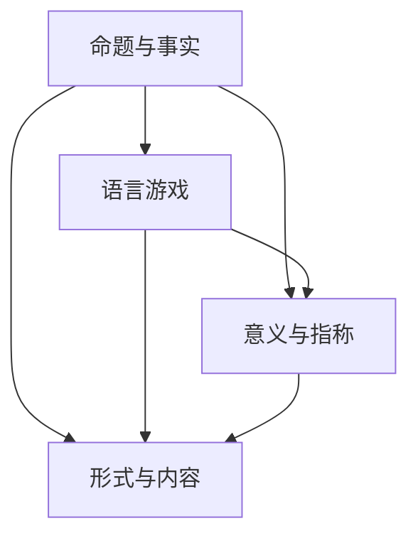

                 

## 引言

### 1.1 维特根斯坦与奥斯汀简介

路德维希·维特根斯坦（Ludwig Wittgenstein）和约翰·奥斯汀（John Austin）是20世纪最杰出的哲学家之一，他们在日常语言哲学领域作出了深远的影响。维特根斯坦出生于1889年的奥地利，早年在剑桥大学学习数学和哲学，随后专注于哲学研究。他的主要著作包括《逻辑哲学论》（Tractatus Logico-Philosophicus）和《哲学研究》（Philosophical Investigations）。维特根斯坦的哲学思想深刻地影响了逻辑学、语言学和认识论等领域。

约翰·奥斯汀则出生于1911年的英国，他在牛津大学学习哲学，并在维特根斯坦的启发下开始研究日常语言哲学。奥斯汀的著作包括《感知与知觉》（Sense and Sensibility）和《言语行为》（Speech Acts）。他的哲学观点主要涉及语言的实际使用，以及如何通过语言行为来理解人类交流的本质。

### 1.2 日常语言哲学的概念

日常语言哲学是一种哲学研究方法，它关注于我们对日常语言的使用和理解。这种哲学研究不仅探讨语言的形式，还关注语言的实质和功能。日常语言哲学的核心思想是，语言不仅仅是表达思想的工具，更是行动和互动的工具。通过研究日常语言，哲学家试图揭示语言与人类行为之间的复杂关系。

日常语言哲学的兴起可以追溯到维特根斯坦和奥斯汀的工作。维特根斯坦通过《逻辑哲学论》和《哲学研究》揭示了语言的本质和界限，强调了语言的多义性和模糊性。奥斯汀则通过《言语行为》提出了言语行为的理论，认为语言不仅用于描述事物，还用于实现某种行为。

### 1.3 维特根斯坦与奥斯汀的贡献

维特根斯坦与奥斯汀在哲学界有着重要的地位，他们的贡献主要体现在以下几个方面：

首先，维特根斯坦通过他的语言哲学揭示了语言的本质。他在《逻辑哲学论》中提出了“语言游戏”的概念，认为语言的使用是与特定的游戏活动相联系的。这一观点改变了人们对语言和思维的看法，强调了语言的实际使用和情境依赖。

奥斯汀则通过《言语行为》提出了言语行为的理论，这一理论对语言哲学产生了深远的影响。奥斯汀认为，语言不仅仅是表达思想，更是一种行动。他区分了三种类型的言语行为：表达性言语行为、指示性言语行为和承诺性言语行为。这一理论为我们理解人类交流提供了新的视角。

总的来说，维特根斯坦与奥斯汀在哲学领域开创了日常语言哲学的新篇章，他们的工作不仅为后来的哲学研究提供了理论基础，也对我们日常生活中的语言使用有了更深刻的理解。

### 1.4 文章结构与主要内容

本文将分为八个章节，全面探讨维特根斯坦与奥斯汀的日常语言哲学。第一章节是引言，介绍了两位哲学家的背景和他们对于日常语言哲学的贡献。接下来，第二、三章节分别详细探讨维特根斯坦和奥斯汀的哲学观点、著作和他们对日常语言哲学的见解。第四章节则对两位哲学家的哲学进行比较分析。

第五章节深入探讨日常语言哲学的核心概念，包括命题与事实、语言游戏、意义与指称、形式与内容等。第六章节和第七章节则探讨日常语言哲学在不同领域的应用，如语言学、心理学、逻辑学等。最后一章节是总结与展望，对维特根斯坦与奥斯汀的日常语言哲学进行总结，并展望其未来的发展方向。

通过本文的阅读，读者可以全面了解维特根斯坦与奥斯汀的哲学观点，理解日常语言哲学的核心概念，并了解其在各个领域的应用。同时，本文还通过具体的例子和实际项目案例分析，帮助读者深入理解日常语言哲学的实际意义和应用价值。

---

以上是文章的第一章节，引言部分。接下来我们将深入探讨维特根斯坦的日常语言哲学，进一步了解他的哲学观点、著作以及其对日常语言哲学的贡献。

## 维特根斯坦的日常语言哲学

### 2.1 维特根斯坦的生平与思想发展

路德维希·维特根斯坦出生于1889年的奥地利，他的父亲是一位富有的工业家。维特根斯坦早年接受了严格的科学和数学教育，后来在剑桥大学学习数学和哲学，受到了罗素和摩尔等人的影响。他的哲学思想经历了从逻辑原子主义到日常语言哲学的转变。

维特根斯坦在早期的《逻辑哲学论》中提出了逻辑原子主义，认为世界由基本的逻辑原子组成，这些原子通过逻辑关系构成了所有的复合实体。然而，在1930年代，维特根斯坦意识到这种观点过于简化，不足以解释人类语言和日常生活中的复杂性。于是，他在《哲学研究》中提出了日常语言哲学，强调语言的实际使用和情境依赖。

### 2.2 维特根斯坦的哲学观点

维特根斯坦的哲学观点主要集中在以下几个方面：

1. **语言游戏理论**：维特根斯坦提出了“语言游戏”（language game）的概念，认为语言的使用是与特定的游戏活动相联系的。不同的语言游戏有不同的规则，这些规则决定了语言的含义和使用方式。例如，语言游戏可以包括数学证明、棋类游戏、日常对话等。

2. **意义与使用的关系**：维特根斯坦认为，一个词的含义是由其在特定语言游戏中的使用决定的。这意味着，同一个词在不同的语言游戏中可能有不同的含义。因此，理解一个词的含义需要理解其在具体情境中的使用。

3. **日常语言的局限性**：维特根斯坦认为，日常语言存在许多模糊和不确定的地方，这使得我们对语言的理解变得复杂。他提出了“家族相似性”的概念，指出日常语言中的词语往往具有类似的含义，但它们之间并没有明确的界限。

4. **逻辑与哲学的关系**：维特根斯坦认为，哲学的问题往往源于我们对语言的误解。他试图通过澄清语言的用法来解决哲学问题。他认为，逻辑是语言的一种形式，而不是语言本身的内容。

### 2.3 维特根斯坦的主要著作

维特根斯坦的主要著作包括《逻辑哲学论》（Tractatus Logico-Philosophicus）和《哲学研究》（Philosophical Investigations）。

1. **《逻辑哲学论》**：这本书是维特根斯坦早期的代表作，他在书中提出了逻辑原子主义，并试图通过逻辑来解释世界的本质。然而，这本书在维特根斯坦去世后逐渐被忽视，因为他自己认为这本书过于简化，无法解释日常语言的复杂性。

2. **《哲学研究》**：这本书是维特根斯坦晚年的代表作，他在书中提出了日常语言哲学的基本观点。这本书对语言的本质、意义和使用进行了深入的探讨，对后来的哲学研究产生了深远的影响。

### 2.4 维特根斯坦的哲学思想与日常语言哲学的关系

维特根斯坦的哲学思想与日常语言哲学密切相关。他在《逻辑哲学论》中提出的逻辑原子主义试图通过逻辑来解释世界，但在《哲学研究》中，他意识到这种观点过于简化，无法解释日常语言的复杂性。因此，他转向日常语言哲学，试图通过研究语言的实际使用来揭示语言的本质。

维特根斯坦的哲学思想对日常语言哲学的贡献主要体现在以下几个方面：

1. **强调语言的实际使用**：维特根斯坦认为，理解语言的关键在于理解其在实际生活中的使用。他提出了“语言游戏”的概念，强调语言的使用是与特定的活动相联系的。

2. **揭示语言的模糊性和不确定性**：维特根斯坦指出，日常语言中存在许多模糊和不确定的地方，这使得我们对语言的理解变得复杂。他提出了“家族相似性”的概念，指出日常语言中的词语往往具有类似的含义，但它们之间并没有明确的界限。

3. **澄清哲学问题**：维特根斯坦认为，许多哲学问题源于我们对语言的误解。他试图通过澄清语言的用法来解决这些哲学问题。他认为，逻辑是语言的一种形式，而不是语言本身的内容。

总的来说，维特根斯坦的哲学思想为日常语言哲学奠定了基础，他的观点不仅改变了人们对语言和思维的看法，也为我们理解日常语言提供了新的视角。

### 2.5 维特根斯坦的哲学思想对当代哲学的影响

维特根斯坦的哲学思想对当代哲学产生了深远的影响。他的语言游戏理论、意义与使用的关系、日常语言的局限性等观点，为后来的哲学研究提供了新的视角和方法。

1. **语言学与哲学的结合**：维特根斯坦的工作促使哲学家们更加关注语言的实际使用，这促进了语言学与哲学的结合。许多哲学家开始从语言学的角度来探讨哲学问题，如语义学、语用学和认知科学等。

2. **分析哲学的兴起**：维特根斯坦的工作对分析哲学的兴起产生了重要影响。分析哲学强调通过澄清概念和语言来解决问题，这与维特根斯坦的哲学方法相契合。许多分析哲学家都受到了维特根斯坦思想的影响，他们在哲学研究中更加注重逻辑和语言的运用。

3. **对认知科学的启示**：维特根斯坦的哲学思想也对认知科学产生了重要启示。他的观点强调了语言与思维的关系，这为认知科学提供了新的研究方向。许多认知科学家开始研究语言如何影响我们的思维和认知过程。

总的来说，维特根斯坦的哲学思想不仅改变了哲学的面貌，也为后来的哲学研究提供了丰富的理论资源和思考方向。

---

在了解了维特根斯坦的哲学观点和著作后，接下来我们将探讨约翰·奥斯汀的日常语言哲学，分析他的生平、哲学观点以及他对日常语言哲学的贡献。

## 奥斯汀的日常语言哲学

### 3.1 奥斯汀的生平与思想发展

约翰·奥斯汀出生于1911年的英国，他在牛津大学学习哲学，受到了维特根斯坦等哲学家的深刻影响。奥斯汀在哲学界以其关于言语行为理论的研究而闻名，他的主要著作包括《感知与知觉》（Sense and Sensibility）和《言语行为》（Speech Acts）。奥斯汀的哲学观点强调语言的实际使用和人类交流的本质。

### 3.2 奥斯汀的哲学观点

奥斯汀的哲学观点主要集中在以下几个方面：

1. **言语行为理论**：奥斯汀提出了著名的言语行为理论，认为语言不仅仅是表达思想的工具，更是一种行动。他区分了三种类型的言语行为：表达性言语行为、指示性言语行为和承诺性言语行为。表达性言语行为用于表达情感和态度，如“我爱你”；指示性言语行为用于做出指示和命令，如“关门”；承诺性言语行为用于做出承诺和承诺，如“我会完成这项任务”。

2. **情境语境的重要性**：奥斯汀认为，语言的理解和解释取决于具体的情境语境。他提出了“情境语境”（constative and performative）的概念，指出语言可以分为描述性陈述和行动性陈述。描述性陈述（constative）用于描述事实，如“天是蓝的”；行动性陈述（performative）则用于实现某种行为，如“我宣布比赛开始”。

3. **语言与行动的统一**：奥斯汀强调语言与行动的统一，他认为语言不仅用于表达思想，还用于实现具体的行为。他的观点为理解人类交流和互动提供了新的视角。

### 3.3 奥斯汀的主要著作

奥斯汀的主要著作包括《感知与知觉》（Sense and Sensibility）和《言语行为》（Speech Acts）。

1. **《感知与知觉》**：这本书是奥斯汀早期的代表作，他在书中探讨了感知和知觉的本质。他认为，我们的感知和知觉不仅依赖于外部世界，还受到内在心理状态的影响。

2. **《言语行为》**：这本书是奥斯汀最著名的著作，他在书中提出了言语行为理论，并详细探讨了语言的实际使用和功能。这一理论对后来的语言哲学研究产生了深远的影响。

### 3.4 奥斯汀的哲学思想与日常语言哲学的关系

奥斯汀的哲学思想与日常语言哲学密切相关。他的言语行为理论揭示了语言的实际使用和功能，强调了语言与行动的统一。这与维特根斯坦的日常语言哲学有着相似之处，但奥斯汀更强调语言在实际生活中的应用和作用。

1. **强调语言的实际使用**：奥斯汀认为，理解语言的关键在于理解其在实际生活中的使用。他提出了言语行为理论，认为语言的使用是与特定的情境和目的相联系的。

2. **情境语境的重要性**：奥斯汀强调情境语境对语言理解的重要性，他认为我们的理解取决于具体的情境。这与维特根斯坦的观点相呼应，他们都认为语言的意义是由具体的使用情境决定的。

3. **语言与行动的统一**：奥斯汀强调语言与行动的统一，认为语言不仅用于表达思想，还用于实现具体的行为。这一观点为理解人类交流和互动提供了新的视角。

总的来说，奥斯汀的哲学思想为日常语言哲学的发展提供了重要的理论基础，他的观点不仅改变了人们对语言和思维的看法，也为我们理解日常语言的实际应用提供了新的视角。

### 3.5 奥斯汀的哲学思想对当代哲学的影响

奥斯汀的哲学思想对当代哲学产生了深远的影响。他的言语行为理论不仅改变了语言哲学的面貌，也为其他领域的哲学研究提供了新的视角和方法。

1. **对语言哲学的影响**：奥斯汀的言语行为理论为语言哲学提供了新的研究方向。他的观点强调了语言的实际使用和功能，促使哲学家们更加关注语言在日常生活中的应用和作用。

2. **对伦理学和政治哲学的影响**：奥斯汀的哲学思想对伦理学和政治哲学产生了重要影响。他的言语行为理论为理解人类行为和道德责任提供了新的视角。许多伦理学家和政治哲学家开始从奥斯汀的观点出发，探讨道德行为和公共政策的实际影响。

3. **对认知科学的影响**：奥斯汀的观点也为认知科学提供了重要的启示。他的情境语境理论和言语行为理论强调了语言与思维的关系，为认知科学家研究人类的认知过程提供了新的理论框架。

总的来说，奥斯汀的哲学思想不仅改变了哲学的面貌，也为当代哲学研究提供了丰富的理论资源和思考方向。他的观点对语言学、伦理学、政治哲学和认知科学等领域都产生了深远的影响。

---

在详细了解了维特根斯坦和奥斯汀的哲学观点及其对日常语言哲学的贡献后，接下来我们将对两位哲学家的哲学进行比较分析，探讨他们的相似之处和不同点。

## 维特根斯坦与奥斯汀的哲学比较

### 4.1 维特根斯坦与奥斯汀的共同点

维特根斯坦与奥斯汀在哲学领域有着许多共同点，他们的思想都对日常语言哲学产生了深远的影响。以下是一些主要的共同点：

1. **日常语言的重要性**：两位哲学家都强调日常语言的重要性。维特根斯坦通过《哲学研究》揭示了日常语言中的模糊性和不确定性，而奥斯汀则通过言语行为理论探讨了语言的实际使用和功能。

2. **语言与行动的统一**：维特根斯坦和奥斯汀都认为，语言不仅是表达思想的工具，更是行动的工具。维特根斯坦通过“语言游戏”的概念强调语言的使用与具体活动相联系，而奥斯汀则通过言语行为理论揭示了语言与行动的统一。

3. **情境语境的考量**：两位哲学家都认为，理解语言和哲学问题需要考虑具体的情境语境。维特根斯坦指出，语言的意义是由其在具体情境中的使用决定的，而奥斯汀则提出了情境语境对语言理解的重要性。

4. **对逻辑与哲学关系的探讨**：维特根斯坦和奥斯汀都对逻辑与哲学的关系进行了深入的探讨。维特根斯坦试图通过澄清语言的用法来解决哲学问题，而奥斯汀则通过言语行为理论揭示了逻辑与语言实际使用之间的关系。

### 4.2 维特根斯坦与奥斯汀的不同点

尽管维特根斯坦和奥斯汀在哲学上有许多共同点，但他们也存在明显的不同点，这些差异主要体现在以下几个方面：

1. **哲学方法**：维特根斯坦的方法更注重对日常语言的描述和分析，他试图通过揭示日常语言中的模糊性和不确定性来澄清哲学问题。奥斯汀则更注重语言的实际使用和功能，他通过言语行为理论来解释人类行为和交流。

2. **对语言本质的理解**：维特根斯坦认为，语言的意义是由其在特定情境中的使用决定的，他提出了“家族相似性”的概念来描述日常语言中的词语关系。奥斯汀则更强调语言的行动功能，他认为语言是一种行动，不同的言语行为具有不同的功能。

3. **对逻辑与哲学关系的看法**：维特根斯坦认为，逻辑是语言的一种形式，而不是语言本身的内容。他试图通过澄清语言的用法来解决问题。奥斯汀则认为，逻辑与语言的实际使用密切相关，他通过言语行为理论来解释逻辑与语言之间的关系。

4. **哲学贡献的侧重点**：维特根斯坦的贡献主要体现在他对日常语言的分析和描述上，他通过揭示日常语言中的模糊性和不确定性来澄清哲学问题。奥斯汀的贡献则主要体现在他对语言行动功能的揭示上，他通过言语行为理论来解释人类交流和行动。

### 4.3 维特根斯坦与奥斯汀哲学的影响与意义

维特根斯坦和奥斯汀的哲学思想对当代哲学产生了深远的影响，他们的贡献在多个领域都有体现。

1. **对语言哲学的影响**：维特根斯坦和奥斯汀的工作为语言哲学奠定了基础，他们的观点促使哲学家们更加关注语言的实际使用和功能。他们的理论为理解语言的本质和作用提供了新的视角。

2. **对伦理学和政治哲学的影响**：维特根斯坦和奥斯汀的哲学思想对伦理学和政治哲学产生了重要影响。他们的观点为理解人类行为和道德责任提供了新的理论框架，促使哲学家们更加关注语言在实际生活中的应用。

3. **对认知科学的影响**：维特根斯坦和奥斯汀的哲学思想也为认知科学提供了重要的启示。他们的观点强调了语言与思维的关系，为认知科学家研究人类的认知过程提供了新的理论资源。

总的来说，维特根斯坦和奥斯汀的哲学思想不仅改变了哲学的面貌，也为当代哲学研究提供了丰富的理论资源和思考方向。他们的工作为我们理解语言、思维和人类行为提供了深刻的洞见，对多个领域的研究产生了深远的影响。

---

在比较分析了两位哲学家的哲学观点后，接下来我们将探讨日常语言哲学的核心概念，深入理解命题与事实、语言游戏、意义与指称、形式与内容等基本概念。

## 日常语言哲学的核心概念

### 5.1 命题与事实

在哲学研究中，命题（Proposition）是指表达一个事实或状态的句子。命题通常被认为是一个语句，它能够被判断为真或假。例如，“天空是蓝色的”是一个命题，它表达了一个可以被验证的事实。而“我有一只绿色的猫”也是一个命题，尽管我们不知道是否真实，但它仍然具有命题性。

事实（Fact）是指现实世界中存在的真实状态。例如，“地球是圆的”是一个事实，这是一个在现实世界中真实存在的事实。命题与事实之间的关系是哲学讨论的核心问题之一。维特根斯坦和奥斯汀都关注命题与事实的关系，他们试图通过分析日常语言来理解这种关系。

1. **命题与事实的关系**：

   - **命题的真假性**：命题的真假性取决于它所表达的事实是否为真。如果一个命题所表达的事实在现实世界中成立，那么这个命题就是真的；如果事实不成立，那么命题就是假的。

   - **命题的命题性**：命题不仅是一个句子，它还具有一定的命题性。命题性指的是命题具有被判断为真或假的能力。这表明命题是一种抽象的概念，它不仅仅是语言形式，还与真实世界中的事实相关。

2. **维特根斯坦与奥斯汀的观点**：

   - 维特根斯坦在《哲学研究》中提出了“家族相似性”的概念，用来描述日常语言中词语之间的关系。他认为，命题与事实之间的关系是复杂的，不是简单的对应关系。

   - 奥斯汀在《言语行为》中提出了言语行为理论，他认为命题和事实之间的关系不仅仅是描述性的，还涉及到行动和功能。他强调语言的实际使用和功能，认为命题和事实之间的关系取决于具体的情境。

### 5.2 语言游戏

语言游戏（Language Game）是维特根斯坦提出的一个重要概念，用来描述语言的使用和功能。维特根斯坦认为，语言的使用是与特定的活动或游戏相联系的。不同的语言游戏有不同的规则，这些规则决定了语言的使用方式和含义。

1. **语言游戏的概念**：

   - **语言游戏的定义**：语言游戏是一种活动或游戏，参与者通过语言进行互动。例如，棋类游戏、数学证明、日常对话等都可以被视为语言游戏。

   - **语言游戏的特点**：语言游戏具有规则性、互动性和情境依赖性。语言游戏的规则决定了语言的使用方式，这些规则不是固定的，而是可以根据具体情境进行调整。

2. **维特根斯坦对语言游戏的理解**：

   - 维特根斯坦认为，语言的意义不是固定的，而是由语言游戏中的规则和情境决定的。他认为，理解语言的关键在于理解语言游戏中的规则和情境。

   - 维特根斯坦通过“语言游戏”的概念揭示了语言的复杂性。他认为，语言不仅仅是表达思想的工具，更是一种行动和互动的工具。

### 5.3 意义与指称

意义（Meaning）和指称（Reference）是语言哲学中两个重要的概念。意义通常指的是词语或句子所表达的思想或概念，而指称则指的是词语所指的具体事物。

1. **意义与指称的关系**：

   - **意义的定义**：意义是指词语或句子所表达的思想或概念。例如，“爱”这个词的意义可能包括情感、关怀、奉献等。

   - **指称的定义**：指称是指词语所指的具体事物。例如，“爱”这个词的指称可能是一个特定的个体或情境。

   - **意义与指称的关系**：意义和指称之间不是简单的对应关系。一个词语可能有多个指称，但它只有一个意义。同样，一个指称可能由多个词语来指称，但它们的意义是相同的。

2. **维特根斯坦与奥斯汀的观点**：

   - 维特根斯坦认为，意义是由语言游戏中的规则和情境决定的。他认为，理解一个词语的意义需要理解它在具体情境中的使用。

   - 奥斯汀认为，指称取决于具体的情境和语境。他提出了“情境语境”的概念，认为理解一个词语的指称需要考虑具体的情境。

### 5.4 形式与内容

形式（Form）和内容（Content）是语言哲学中的另一个重要概念。形式指的是语言的结构和语法，而内容则指的是语言所表达的意义或信息。

1. **形式与内容的定义**：

   - **形式的定义**：形式指的是语言的结构和语法。例如，一个句子的形式可能包括主语、谓语、宾语等。

   - **内容的定义**：内容指的是语言所表达的意义或信息。例如，一个句子“我爱这本书”的内容是表达了一种情感和对象。

2. **形式与内容的关系**：

   - **关系**：形式和内容是相互关联的。一个句子的形式决定了其内容，而内容又通过形式表达出来。例如，一个句子“我爱这本书”的形式是“主语+谓语+宾语”，其内容是表达了对这本书的爱。

3. **维特根斯坦与奥斯汀的观点**：

   - 维特根斯坦认为，形式和内容之间的关系是复杂的。他认为，理解一个句子的内容需要理解其形式，而理解形式也需要考虑具体的情境和语境。

   - 奥斯汀认为，形式和内容是相互独立的。他提出了“情境语境”的概念，认为理解一个句子的内容需要考虑具体的情境，而形式则是由语法规则决定的。

总的来说，日常语言哲学的核心概念包括命题与事实、语言游戏、意义与指称、形式与内容等。这些概念不仅帮助我们理解语言的本质和功能，也为哲学研究提供了新的视角和方法。

### 5.5 核心概念之间的关系架构

为了更好地理解日常语言哲学的核心概念，我们可以通过Mermaid流程图来展示它们之间的关系。

- **命题与事实**：命题是表达事实的句子，而事实是现实世界中的真实状态。命题与事实之间的关系是语言哲学研究的基础。

- **语言游戏**：语言游戏是一种活动，语言在其中发挥作用。语言游戏的规则决定了语言的使用方式和含义。

- **意义与指称**：意义是词语或句子所表达的思想或概念，而指称是词语所指的具体事物。意义与指称之间的关系是语言哲学中的一个重要问题。

- **形式与内容**：形式是语言的结构和语法，而内容是语言所表达的意义或信息。形式与内容之间的关系决定了语言的表达方式和效果。

通过这个流程图，我们可以清晰地看到日常语言哲学的核心概念之间的关系，这有助于我们更深入地理解这些概念的本质和作用。

---

在深入探讨了日常语言哲学的核心概念后，接下来我们将探讨日常语言哲学在不同领域的应用，包括语言学、心理学、逻辑学等领域。

## 日常语言哲学的应用

### 6.1 日常语言哲学在语言学中的应用

日常语言哲学在语言学中的应用主要体现在对语言本质和功能的深入研究。维特根斯坦和奥斯汀的哲学观点为语言学研究提供了新的视角和方法。

1. **语言的本质**：

   - 维特根斯坦认为，语言不是固定的，而是与特定的活动或情境相联系的。他的“语言游戏”理论揭示了语言的多义性和情境依赖性。

   - 奥斯汀的言语行为理论则强调了语言的行动功能。他认为，语言不仅仅用于表达思想，还用于实现具体的行为。

2. **语言的功能**：

   - 在语言学中，日常语言哲学帮助研究者理解语言在人际交流中的作用。例如，奥斯汀的言语行为理论为理解不同类型的语言行为提供了理论基础。

   - 维特根斯坦的观点也促进了对话语分析的发展，研究者可以更深入地探讨语言在日常交流中的具体运用。

3. **实例**：

   - 在语义学研究中，日常语言哲学帮助研究者理解词语的多义性和语境依赖性。例如，词语“跑”在不同的语境中可能有不同的含义。

### 6.2 日常语言哲学在心理学中的应用

日常语言哲学在心理学中的应用主要体现在对语言与思维关系的研究。维特根斯坦和奥斯汀的哲学观点为心理学家提供了新的理论框架。

1. **语言与思维的关系**：

   - 维特根斯坦认为，思维是语言的一种表现形式。他的“语言游戏”理论揭示了思维与语言之间的密切联系。

   - 奥斯汀的言语行为理论则从行为主义的角度探讨了语言与思维的关系。他认为，语言不仅影响思维，还影响行为。

2. **实例**：

   - 在认知心理学中，研究者通过实验探讨了语言对思维过程的影响。例如，一些研究表明，双语者能够更好地进行思维切换和问题解决。

   - 在心理咨询中，语言哲学的观点可以帮助心理咨询师理解患者的话语和行为，从而提供更有效的治疗。

### 6.3 日常语言哲学在逻辑学中的应用

日常语言哲学在逻辑学中的应用主要体现在对逻辑与语言关系的探讨。维特根斯坦和奥斯汀的哲学观点为逻辑学研究提供了新的视角和方法。

1. **逻辑与语言的关系**：

   - 维特根斯坦认为，逻辑是语言的一种形式，而不是语言的内容。他的观点强调了逻辑与语言形式的密切联系。

   - 奥斯汀的言语行为理论则从行动的角度探讨了逻辑与语言的关系。他认为，逻辑不仅是语言的一种形式，还与语言的实际使用密切相关。

2. **实例**：

   - 在形式逻辑中，日常语言哲学帮助研究者理解日常语言中的逻辑结构和逻辑推理。例如，研究者可以分析日常对话中的逻辑错误和逻辑漏洞。

   - 在法律逻辑中，日常语言哲学的观点可以帮助法律工作者理解法律语言的实际使用和功能。

### 6.4 日常语言哲学在其他领域的应用

日常语言哲学不仅应用于语言学、心理学和逻辑学，还在其他领域有着广泛的应用。

1. **哲学**：

   - 维特根斯坦和奥斯汀的哲学观点为哲学研究提供了新的方法和视角。他们的观点促使哲学家们更加关注语言的实际使用和功能。

   - 在道德哲学中，日常语言哲学帮助研究者理解道德话语的实际使用和功能。

2. **计算机科学**：

   - 在计算机科学中，日常语言哲学的观点可以帮助程序员更好地理解自然语言处理和人工智能的发展。

   - 在软件工程中，日常语言哲学的观点可以帮助开发者更好地理解和设计复杂的软件系统。

3. **社会学**：

   - 在社会学中，日常语言哲学的观点可以帮助研究者理解社会互动和语言在社会中的作用。

   - 在公共政策研究中，日常语言哲学可以帮助研究者分析政策话语的实际使用和功能。

总的来说，日常语言哲学在不同领域的应用不仅促进了这些领域的研究发展，也为我们理解语言、思维和社会互动提供了新的视角和方法。

---

在探讨了日常语言哲学在不同领域的应用后，接下来我们将展望日常语言哲学的未来发展趋势和面临的挑战。

## 日常语言哲学的未来

### 7.1 日常语言哲学的发展趋势

随着科技的不断进步和社会的快速发展，日常语言哲学也在不断演变，呈现出以下发展趋势：

1. **跨学科研究**：日常语言哲学越来越与其他学科如心理学、语言学、计算机科学等相结合。这种跨学科研究有助于从不同角度深入探讨语言的本质和功能。

2. **技术整合**：随着人工智能和自然语言处理技术的发展，日常语言哲学正在与计算机科学相结合。这有助于开发更高效的语言理解和生成工具。

3. **文化多样性**：日常语言哲学开始关注全球范围内的文化多样性，探讨不同语言和文化中的语言使用和哲学问题。

4. **实践应用**：日常语言哲学在公共政策和法律等领域中的应用越来越多，为政策制定和法律实践提供了新的理论框架。

### 7.2 日常语言哲学面临的挑战

尽管日常语言哲学有着广阔的发展前景，但同时也面临着一些挑战：

1. **语言复杂性**：日常语言具有高度复杂性和多样性，这使得研究语言的本质和功能变得更具挑战性。

2. **理论统一性**：不同的哲学流派和理论观点在日常语言哲学中并存，缺乏一个统一的理论框架，这增加了研究难度。

3. **技术应用**：人工智能和自然语言处理技术的快速发展对日常语言哲学提出了新的要求，如何在理论上解释这些技术产生的语言现象是一个挑战。

4. **语言变化**：语言是一个动态变化的系统，不断涌现的新词汇和新用法给日常语言哲学的研究带来了新的挑战。

### 7.3 日常语言哲学的未来前景

尽管面临挑战，日常语言哲学的未来依然充满希望。以下是一些未来前景：

1. **理论深化**：随着研究的深入，日常语言哲学的理论将更加丰富和深入，为理解语言的本质和功能提供更深刻的洞见。

2. **跨学科融合**：日常语言哲学与其他学科的融合将带来新的研究方法和视角，促进哲学、语言学、心理学等领域的共同进步。

3. **技术应用**：随着技术的不断进步，日常语言哲学的理论和方法将有助于开发更智能的语言处理系统，提高人机交互的效率和效果。

4. **文化多样性**：日常语言哲学将更加关注全球范围内的文化多样性，为理解和尊重不同语言和文化提供理论基础。

总的来说，日常语言哲学的未来将充满机遇和挑战。通过不断的研究和创新，我们有望更深入地理解语言的本质和功能，推动哲学和社会的进步。

---

## 总结与展望

### 8.1 维特根斯坦与奥斯汀的日常语言哲学总结

本文通过对维特根斯坦与奥斯汀的日常语言哲学的详细探讨，总结了两位哲学家的核心观点和贡献。维特根斯坦通过“语言游戏”理论揭示了语言的实际使用和情境依赖，强调了语言的多义性和模糊性。奥斯汀则通过“言语行为”理论探讨了语言与行动的关系，区分了表达性、指示性和承诺性言语行为。他们的哲学思想不仅改变了人们对语言和思维的看法，也为日常语言哲学的发展奠定了基础。

### 8.2 日常语言哲学的重要性

日常语言哲学的重要性体现在其对语言、思维和人类行为的多维度理解。通过对日常语言的分析，我们可以更深入地理解语言的本质和功能，揭示语言与人类行为之间的复杂关系。这种哲学研究不仅有助于哲学和语言学的发展，也为心理学、逻辑学等领域的深入研究提供了新的视角和方法。

### 8.3 日常语言哲学的未来发展方向

展望未来，日常语言哲学的发展将呈现跨学科融合的趋势，与心理学、语言学、计算机科学等领域的结合将带来新的研究突破。同时，随着人工智能和自然语言处理技术的快速发展，日常语言哲学的理论和方法将在实际应用中发挥重要作用，如人机交互、智能语言处理等领域。此外，日常语言哲学将更加关注全球范围内的文化多样性，为理解和尊重不同语言和文化提供理论基础。

### 8.4 最佳实践 tips

1. **注重实际应用**：在研究日常语言哲学时，应关注其理论在实际生活中的应用，如公共政策、法律实践等。

2. **跨学科研究**：鼓励跨学科合作，结合不同领域的知识和方法，深入探讨语言的本质和功能。

3. **关注文化多样性**：研究时应充分考虑不同语言和文化背景，以获得更全面的理解。

### 8.5 小结

本文通过详细探讨维特根斯坦与奥斯汀的日常语言哲学，揭示了他们的核心观点和贡献，探讨了日常语言哲学的核心概念及其在不同领域的应用，展望了其未来发展方向。希望本文能帮助读者更深入地理解日常语言哲学的内涵和意义。

### 8.6 注意事项

1. **语言学习的系统性**：在日常语言哲学研究中，应注重语言学习的系统性，不仅要关注语言的形式，还要理解其背后的文化和历史背景。

2. **哲学思维的培养**：哲学思维是日常语言哲学研究的重要基础，应注重培养逻辑推理和分析问题的能力。

3. **理论与实践相结合**：在研究过程中，应注重理论与实践的结合，通过实际案例来验证和应用理论。

### 8.7 拓展阅读

- 维特根斯坦，《逻辑哲学论》和《哲学研究》
- 奥斯汀，《感知与知觉》和《言语行为》
- 哲学导论类书籍，如《西方哲学史》等

通过这些拓展阅读，读者可以进一步深入理解日常语言哲学的理论基础和应用实践。

