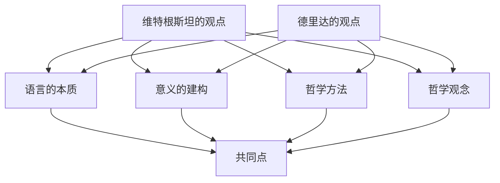

                 

### 文章标题

“维特根斯坦与德里达：语言游戏与差异哲学的对话”探讨的是两位哲学巨匠——路德维希·维特根斯坦（Ludwig Wittgenstein）和雅克·德里达（Jacques Derrida）——关于语言、意义和哲学的深刻对话。这篇文章旨在通过逻辑清晰的分析，深入探讨两位哲学家的思想，并揭示其对话中的内在联系和冲突。

本文首先介绍维特根斯坦和德里达的生平和哲学背景，阐述他们的主要观点和贡献。接着，文章将重点探讨维特根斯坦的语言游戏理论和德里达的差异哲学，通过对比分析，揭示两者在语言和意义问题上的不同观点。随后，文章将深入探讨两位哲学家的对话，分析其对话中的核心问题和争论点。最后，文章将对这些讨论进行总结，提出对未来哲学发展的思考和建议。

通过这篇文章，读者将不仅对维特根斯坦和德里达的哲学思想有更深入的理解，还将对语言游戏和差异哲学有更全面的了解，从而在哲学和语言学的交叉领域获得新的洞见。

### 关键词

- 维特根斯坦
- 德里达
- 语言游戏
- 差异哲学
- 哲学对话
- 意义建构
- 语言分析
- 哲学方法论
- 解构主义

### 摘要

本文通过深入分析维特根斯坦和德里达的哲学思想及其对话，探讨了语言游戏和差异哲学在哲学和语言学领域的重要性。文章首先介绍了两位哲学家的生平和哲学背景，阐述了他们的主要观点和贡献。接着，文章详细探讨了维特根斯坦的语言游戏理论和德里达的差异哲学，通过对比分析，揭示了两者在语言和意义问题上的不同观点。随后，文章深入探讨了两位哲学家的对话，分析了其对话中的核心问题和争论点。最后，文章总结了这些讨论，提出了对未来哲学发展的思考和建议。通过这篇文章，读者将对维特根斯坦和德里达的哲学思想有更深入的理解，对语言游戏和差异哲学有更全面的了解，从而在哲学和语言学的交叉领域获得新的洞见。

### 引言

在哲学和语言学的漫长历史中，许多伟大的思想家和哲学家提出了各自独特的理论和观点。其中，路德维希·维特根斯坦（Ludwig Wittgenstein）和雅克·德里达（Jacques Derrida）无疑是两位具有深远影响的哲学家。他们的思想和贡献不仅对当代哲学和语言学产生了深远影响，也为后来的学者提供了丰富的讨论素材。

维特根斯坦出生于1889年，是一位奥地利的哲学家，以其对语言和意义的深刻探讨而闻名。他的哲学观点主要集中在对语言的本质和功能的分析上，提出了著名的语言游戏理论。这一理论强调语言是工具性的，不同的语言游戏服务于不同的目的，而语言的意义则取决于其在特定情境中的使用。维特根斯坦的哲学思想对逻辑哲学、语言哲学和数学哲学等领域产生了重要影响。

德里达则出生于1930年，是一位法国哲学家，以其解构主义思想而著称。他的哲学观点主要关注语言、文本和意义的多重性。德里达提出了差异哲学，认为意义是由差异和矛盾产生的，而不是由单一的权威解释所决定的。他的思想对解构主义、文化研究和批判理论等领域产生了深远影响。

两位哲学家的思想和贡献不仅具有历史意义，也为我们理解当代哲学和语言学的复杂性提供了新的视角。本文将深入探讨维特根斯坦和德里达的哲学思想及其对话，分析其对话中的核心问题和争论点，从而揭示语言游戏和差异哲学在哲学和语言学领域的重要性。

### 维特根斯坦的语言游戏理论

维特根斯坦的语言游戏理论是他哲学思想的核心之一，这一理论不仅在逻辑哲学和语言哲学中具有重要地位，也为理解语言的本质和功能提供了独特的视角。要深入理解这一理论，我们首先需要从维特根斯坦的生平和哲学背景入手，接着详细探讨语言游戏的概念、分类及其对哲学的影响。

#### 维特根斯坦的生平与哲学背景

路德维希·维特根斯坦出生于1889年，在维也纳度过了一段重要的童年时光。维也纳是20世纪初哲学和科学思想的重要中心，这一环境对维特根斯坦的哲学思想产生了深远影响。他在数学、物理学和哲学等多个领域都有深入研究，并在不同阶段提出了不同的哲学观点。

维特根斯坦的哲学思想可以分为两个主要阶段：早期哲学和晚期哲学。早期哲学主要体现在他的著作《逻辑哲学论》（Tractatus Logico-Philosophicus）中，这本书以简洁而深邃的语言探讨了逻辑、语言和世界的关系。晚期哲学则体现在他的另一部重要著作《哲学研究》（Philosophical Investigations）中，这本书通过对日常语言的分析，提出了语言游戏理论。

#### 语言游戏的概念

维特根斯坦将语言视为一种游戏（language-game），这是他对语言本质的一种独特理解。语言游戏概念的核心在于，语言不是抽象的符号系统，而是一种实用工具，服务于具体的生活情境和社会实践。在《哲学研究》中，维特根斯坦指出，语言的意义不是固定不变的，而是依赖于其在特定情境中的使用。

语言游戏包括以下几个关键要素：

1. **语言的使用**：语言不是孤立存在的，而是与人的行为和社会活动紧密相关。例如，当我们说“水是湿的”时，这个陈述的意义在于我们日常生活中对湿度的感知和认知。

2. **规则**：每个语言游戏都有其特定的规则。这些规则不仅包括语法规则，还包括语言游戏参与者之间的默契和共识。例如，在棋类游戏中，游戏规则明确了每一步操作的可能性和限制。

3. **情境**：语言游戏的意义取决于具体情境。在不同的情境中，同一词语可能有不同的含义。例如，在物理科学中，“能量”一词有特定的科学定义，而在日常语言中，它可能指的是体能或活力。

#### 语言游戏的分类

维特根斯坦将语言游戏分为三种主要类型：

1. **日常语言游戏**：这是我们日常生活中最常见的语言使用方式。这种语言游戏包括日常交流、指令、描述和陈述等。

2. **形式语言游戏**：这种语言游戏主要用于数学、逻辑和科学等领域。形式语言游戏具有严格的语法和语义规则，例如，数学公式和逻辑命题。

3. **文学语言游戏**：这种语言游戏包括诗歌、小说和其他文学形式。文学语言游戏通常具有更强的创造性，语言的使用更加灵活，可以产生新的意义和效果。

#### 维特根斯坦的语言游戏理论对哲学的影响

维特根斯坦的语言游戏理论对哲学产生了深远影响。以下是几个关键方面：

1. **反对形而上学**：维特根斯坦认为，许多哲学问题，如宇宙的本质、心灵的本质等，都是由于对语言的误解而产生的。通过分析语言游戏，他试图揭示这些问题的无意义性，从而反对传统的形而上学研究。

2. **语言的工具性**：维特根斯坦强调语言是一种工具，其价值在于其应用而不是其符号本身。这一观点影响了后来的语言哲学和科学哲学，使得哲学家们更加关注语言的实际功能和应用。

3. **语言的情境性**：维特根斯坦指出，语言的意义取决于具体情境，这促使后来的哲学家开始关注语言和情境之间的关系，从而推动了情境哲学和语境哲学的发展。

#### 维特根斯坦的语言游戏理论讲解

为了更好地理解维特根斯坦的语言游戏理论，我们接下来将详细讨论其核心概念，并使用伪代码来阐述语言图像论、语言工具论和语言构造论的基本原理。

##### 语言的图像论

```plaintext
图像论伪代码：
define ImageTheorem {
  if (language = image) {
    if (fact = image) {
      return TRUE;
    }
  }
  return FALSE;
}
```

在这个伪代码中，图像论的基本原理是：语言和事实之间存在一种对应关系，即语言是对现实的图像。例如，“太阳是黄色的”这一陈述，在图像论中意味着我们通过语言描述了一个现实中的事实。

##### 语言的工具论

```plaintext
工具论伪代码：
define ToolTheorem {
  if (language = tool) {
    if (action = tool) {
      return TRUE;
    }
  }
  return FALSE;
}
```

工具论的基本原理是：语言是行动的工具。例如，“请打开灯”这一指令，语言在这里起到了引导行动的作用。

##### 语言的构造论

```plaintext
构造论伪代码：
define ConstructionTheorem {
  if (language = construction) {
    if (world = construction) {
      return TRUE;
    }
  }
  return FALSE;
}
```

构造论的基本原理是：语言是世界的构造。例如，当我们说“建造一座桥”时，语言不仅描述了现实中的桥梁，也参与了桥梁的构造过程。

##### 维特根斯坦的语言游戏理论应用

维特根斯坦的语言游戏理论在多个领域都有广泛应用。以下是一些典型应用：

1. **逻辑哲学**：在逻辑哲学中，维特根斯坦的语言游戏理论帮助我们理解逻辑命题的意义和逻辑结构的构成。

2. **语言哲学**：通过分析日常语言游戏，维特根斯坦揭示了语言的多义性和情境性，从而深化了我们对语言本质的理解。

3. **哲学方法论**：维特根斯坦强调哲学研究应关注具体情境和实际应用，这一思想对当代哲学方法论产生了重要影响。

通过上述讨论，我们可以看出，维特根斯坦的语言游戏理论不仅提供了对语言和意义的新理解，也为哲学和语言学的发展提供了新的视角和工具。在接下来的部分，我们将探讨德里达的差异哲学理论，并比较两位哲学家在语言和意义问题上的观点。

#### 维特根斯坦的语言游戏理论应用

维特根斯坦的语言游戏理论在多个领域都有广泛应用。以下是一些典型应用：

1. **逻辑哲学**：在逻辑哲学中，维特根斯坦的语言游戏理论帮助我们理解逻辑命题的意义和逻辑结构的构成。通过将逻辑命题视为特定语言游戏的一部分，我们可以更清晰地分析逻辑命题的内在逻辑关系，从而推动逻辑哲学的发展。

2. **语言哲学**：通过分析日常语言游戏，维特根斯坦揭示了语言的多义性和情境性，从而深化了我们对语言本质的理解。在语言哲学研究中，学者们经常引用维特根斯坦的语言游戏理论来探讨语言的意义和功能，这为语言哲学的发展提供了新的视角。

3. **哲学方法论**：维特根斯坦强调哲学研究应关注具体情境和实际应用，这一思想对当代哲学方法论产生了重要影响。许多哲学家开始关注具体情境中的语言使用，通过实证研究和案例分析来探讨哲学问题，这一方法在哲学研究中得到了广泛应用。

为了更好地理解维特根斯坦的语言游戏理论在实际中的应用，我们可以通过几个具体的案例来进行探讨。

**案例1：逻辑哲学中的应用**

在逻辑哲学中，维特根斯坦的语言游戏理论可以用于分析逻辑命题的有效性。例如，我们可以将一个逻辑命题视为一个特定的语言游戏，其规则定义了命题中符号的使用方式。通过分析命题中的符号和规则，我们可以确定命题是否有效。

以下是一个使用维特根斯坦语言游戏理论的逻辑命题分析案例：

```plaintext
命题：如果今天下雨，那么我会带伞。

分析：
1. 符号定义：P代表“今天下雨”，Q代表“我会带伞”。
2. 语言游戏规则：如果P为真，则Q必须为真。
3. 分析过程：检查P和Q之间的逻辑关系。
```

通过这个案例，我们可以看到，维特根斯坦的语言游戏理论帮助我们将逻辑命题分解为更基本的元素，从而更深入地理解其逻辑结构。

**案例2：语言哲学中的应用**

在语言哲学中，维特根斯坦的语言游戏理论可以用于探讨日常语言的使用。例如，我们可以通过分析不同情境下同一词语的含义，来理解语言的多义性和情境性。

以下是一个使用维特根斯坦语言游戏理论的日常语言分析案例：

```plaintext
词语：爱

分析：
1. 情境1：在家庭关系中，爱通常指的是深厚的情感和关怀。
2. 情境2：在商业场合，爱可能指的是对品牌的忠诚和喜爱。
3. 分析过程：比较不同情境下爱的含义，揭示其多义性。
```

通过这个案例，我们可以看到，维特根斯坦的语言游戏理论帮助我们理解了同一词语在不同情境下的不同含义，从而深化了对语言本质的理解。

**案例3：哲学方法论中的应用**

在哲学方法论中，维特根斯坦的语言游戏理论可以用于指导哲学研究的方法。例如，维特根斯坦强调关注具体情境和实际应用，这为哲学研究提供了一种新的视角。

以下是一个使用维特根斯坦语言游戏理论的哲学方法论案例：

```plaintext
研究主题：自由意志

分析：
1. 情境设定：在一个特定的社会环境中，研究自由意志的影响。
2. 方法：通过实证研究和案例分析，探讨自由意志在实际情境中的表现。
3. 分析过程：比较不同情境下自由意志的作用，提出新的哲学见解。
```

通过这个案例，我们可以看到，维特根斯坦的语言游戏理论帮助我们更具体地研究哲学问题，从而提高哲学研究的深度和广度。

总之，维特根斯坦的语言游戏理论在逻辑哲学、语言哲学和哲学方法论中都有重要应用。通过具体的案例分析，我们可以更好地理解这一理论的基本原理，并看到其在不同领域的实际应用。在接下来的部分，我们将继续探讨德里达的差异哲学理论，并进一步比较两位哲学家的观点。

### 德里达的差异哲学理论

雅克·德里达的哲学思想以其对语言、文本和意义的独特解读而著称，他提出的差异哲学（Differance）是对传统哲学观念的深刻挑战。为了理解德里达的哲学思想，我们需要从他的生平和哲学背景开始，然后详细探讨差异哲学的核心观点、差异与语言的关系以及差异哲学的批判性分析。

#### 德里达的生平与哲学背景

雅克·德里达出生于1930年，在阿尔及利亚出生，后移居法国。他在法国索邦大学学习法律和哲学，并获得了法学和哲学学位。德里达的哲学观点深受现象学、结构主义和现象学的影响，尤其是马丁·海德格尔和弗朗茨·波茨曼的思想对他产生了重要影响。

德里达在20世纪60年代成为法国哲学界的重要人物，他的著作《书写与差异》（Writing and Difference）和《论文字学》（Of Grammatology）标志着解构主义哲学的诞生。德里达的思想在文化研究、批判理论和解构主义等领域产生了深远影响。

#### 差异哲学的核心观点

差异哲学是德里达哲学思想的核心，他通过这一概念挑战了传统的哲学观念，尤其是西方哲学中关于真理、意义和语言的固定观念。差异哲学主要包括以下几个核心观点：

1. **差异的本质**：德里达认为，差异不仅是语言和意义的基础，也是所有存在和认知的根源。他提出了“差异”（Differance）这个概念，它结合了差异（Difference）和空间（Space）的意义。差异不仅指不同事物之间的区别，也指这些差异之间的空间和联系。

2. **差异与语言的关系**：德里达强调，语言并不是一种固定的、统一的系统，而是充满差异和不确定性的。他认为，语言中的每一个词都依赖于其他词的存在，它们在相互关系中产生意义。这种关系意味着语言的意义是动态变化的，而不是静态固定的。

3. **文本的多元性**：德里达认为，文本并不是固定不变的，而是由多种不同的阅读和理解方式构成的。每个读者都可以根据自己的经验、文化背景和理解能力来解读文本，这导致文本意义的多元性。

#### 差异哲学的批判性分析

尽管差异哲学对传统哲学观念提出了深刻的批判，但也引发了广泛的争议和讨论。以下是对差异哲学的几个批判性分析：

1. **哲学基础**：一些哲学家认为，德里达的差异哲学缺乏坚实的哲学基础。他们指出，德里达的理论过于依赖语言分析，而忽略了其他哲学问题，如存在、真理和道德。

2. **文本解读**：批评者认为，德里达对文本解读的多元性可能导致无休止的解读游戏，使得文本意义变得模糊不清。他们担心这种解读方式会导致文本意义的丧失。

3. **解构主义的影响**：德里达的解构主义思想对哲学和文化研究产生了深远影响，但也引发了对解构主义是否具有实际应用价值的质疑。一些学者认为，解构主义过于抽象，难以在实际哲学研究中得到应用。

#### 德里达的差异哲学理论讲解

为了更好地理解德里达的差异哲学，我们可以通过详细讲解差异与文本、差异与解读以及差异与哲学的关系，使用伪代码和数学公式来阐述这些概念。

##### 差异与文本

```plaintext
差异文本伪代码：
define TextDifferance {
  if (text = differance) {
    if (meaning = differance) {
      return TRUE;
    }
  }
  return FALSE;
}
```

在这个伪代码中，差异与文本的关系是指，文本的意义是由差异产生的。每个词语的意义都依赖于它在文本中的位置和其他词语的存在。

##### 差异与解读

```plaintext
差异解读伪代码：
define ReadingDifferance {
  if (reading = differance) {
    if (understanding = differance) {
      return TRUE;
    }
  }
  return FALSE;
}
```

在这个伪代码中，差异与解读的关系是指，不同的解读方式会产生不同的理解，这体现了文本意义的多元性。

##### 差异与哲学

```plaintext
差异哲学伪代码：
define PhilosophyDifferance {
  if (philosophy = differance) {
    if (thought = differance) {
      return TRUE;
    }
  }
  return FALSE;
}
```

在这个伪代码中，差异与哲学的关系是指，哲学思考的过程是充满差异和矛盾的，这反映了哲学思想的动态性和复杂性。

#### 德里达的差异哲学理论应用

德里达的差异哲学在多个领域都有广泛应用。以下是一些典型应用：

1. **解构主义**：在解构主义文学批评中，学者们运用差异哲学来分析文学作品，揭示其内在的差异性和矛盾性。

2. **文化研究**：在文化研究中，差异哲学帮助学者们理解文化现象的多元性和复杂性，从而批判传统文化观念的单一性和固定性。

3. **批判理论**：在批判理论中，差异哲学提供了一种分析社会问题和权力关系的工具，帮助学者们揭示隐藏在社会现象背后的差异和矛盾。

为了更好地理解德里达的差异哲学在实际中的应用，我们可以通过几个具体的案例来进行探讨。

**案例1：解构主义文学批评中的应用**

在解构主义文学批评中，差异哲学可以帮助学者们分析文学作品，揭示其内在的差异性和矛盾性。

以下是一个使用差异哲学的文学批评案例：

```plaintext
文本：《哈姆雷特》

分析：
1. 差异：文本中的角色、情节和语言充满矛盾和冲突，如哈姆雷特的内心矛盾和死亡预兆。
2. 解读：不同的读者可以基于自己的文化背景和理解能力来解读文本，产生不同的理解。
```

通过这个案例，我们可以看到，差异哲学帮助学者们深入分析文学作品，揭示其内在的差异性和矛盾性。

**案例2：文化研究中的应用**

在文化研究中，差异哲学可以帮助学者们理解文化现象的多元性和复杂性。

以下是一个使用差异哲学的文化研究案例：

```plaintext
研究主题：全球化对文化多样性的影响

分析：
1. 差异：全球化导致了不同文化之间的碰撞和融合，产生了新的文化形式和价值观。
2. 解读：不同的文化背景和社会环境会影响对全球化的理解和反应。
```

通过这个案例，我们可以看到，差异哲学帮助学者们理解文化现象的多元性和复杂性，从而批判传统文化观念的单一性和固定性。

**案例3：批判理论中的应用**

在批判理论中，差异哲学提供了一种分析社会问题和权力关系的工具。

以下是一个使用差异哲学的批判理论案例：

```plaintext
研究主题：性别歧视与差异

分析：
1. 差异：社会中的性别歧视导致不同性别之间的不平等和权力差异。
2. 解读：通过揭示这些差异和矛盾，批判理论可以帮助我们理解性别歧视的根源和影响。
```

通过这个案例，我们可以看到，差异哲学帮助学者们揭示社会现象中的差异和矛盾，从而批判社会不公和权力关系。

总之，德里达的差异哲学理论在解构主义、文化研究和批判理论等领域都有重要应用。通过具体的案例分析，我们可以更好地理解这一理论的基本原理，并看到其在不同领域的实际应用。在接下来的部分，我们将继续探讨维特根斯坦与德里达的对话，分析两者之间的核心问题和争论点。

### 维特根斯坦与德里达的对话背景

维特根斯坦与德里达之间的对话背景可谓丰富多彩，两者在哲学领域的影响力和地位使他们成为现代哲学中不可忽视的两颗明星。维特根斯坦以其简洁而深邃的哲学思想，特别是在逻辑哲学和语言哲学领域的贡献，被誉为20世纪最重要的哲学家之一。而德里达则以其解构主义思想，对传统哲学观念的挑战和语言、文本、意义的深刻解读，成为后结构主义和当代哲学的重要代表。

两者的对话背景可以追溯到20世纪中后期，当时哲学界正处于一个剧烈变革的时期。维特根斯坦的哲学思想在20世纪30年代至50年代期间逐渐产生影响，他的著作《逻辑哲学论》和《哲学研究》为后来的哲学家提供了丰富的讨论素材。而德里达则在60年代提出了解构主义，通过批判西方哲学的传统观念，特别是结构主义，对哲学和文学批评产生了深远影响。

尽管维特根斯坦和德里达的思想在许多方面存在分歧，但他们之间的对话具有重要的学术价值。维特根斯坦的语言游戏理论强调语言的情境性和实用性，认为语言的意义取决于具体的使用情境。而德里达的差异哲学则强调意义的多元性和不确定性，认为语言中的每一个词都依赖于其他词的存在，从而产生意义。两者在语言和意义问题上的不同观点为哲学界提供了丰富的讨论空间。

维特根斯坦和德里达之间的对话不仅仅是思想上的交流，更是对哲学本质的深刻反思。维特根斯坦试图通过澄清语言和意义的关系，揭示哲学问题的本质，而德里达则通过批判传统哲学观念，揭示了语言和意义中的复杂性和不确定性。两者之间的对话不仅有助于我们理解他们的哲学思想，也为现代哲学的发展提供了新的视角和思考方向。

通过分析维特根斯坦与德里达的对话背景，我们可以更好地理解两者在哲学领域中的地位和影响力，以及他们如何通过对话推动哲学的发展。在接下来的部分，我们将深入探讨两位哲学家的对话内容，分析其中的核心问题和争论点。

#### 维特根斯坦与德里达的对话内容

维特根斯坦与德里达的对话内容广泛而深入，主要集中在语言、意义、哲学方法和哲学观念等方面。以下是对两者对话内容的核心问题和争论点的详细分析：

1. **语言的本质**：
   - 维特根斯坦认为，语言是一种工具，其意义取决于具体的使用情境（语言游戏）。他强调语言的具体性和情境性，反对抽象的哲学讨论。
   - 德里达则认为，语言充满了差异和不确定性，语言的意义并非固定不变，而是由多种解读方式构成的。他提出了“差异”（Differance）这一概念，强调了语言的多义性和动态性。

2. **意义的建构**：
   - 维特根斯坦主张意义是语言与特定情境相结合的结果，强调语言的使用者在使用语言过程中赋予词语具体意义。
   - 德里达则认为，意义是由差异和矛盾产生的，文本的意义是多元的，不同的解读方式会产生不同的理解。他提出了“延异”（Différance）这一概念，揭示了意义的多元性和不确定性。

3. **哲学方法**：
   - 维特根斯坦强调通过具体案例分析来澄清哲学问题，他认为哲学的目标是澄清语言和思想，而不是提供抽象的理论。
   - 德里达则采用了解构主义的方法，通过对文本的批判性分析，揭示隐藏在文本背后的权力关系和意识形态。他认为哲学的任务是揭示语言和意义中的复杂性和矛盾性。

4. **哲学观念**：
   - 维特根斯坦认为，哲学问题往往是由于对语言的误解而产生的，他试图通过澄清语言和思想的关系，揭示哲学问题的无意义性。
   - 德里达则认为，传统哲学观念（如二元对立、本质主义等）是建立在语言和意义固定观念之上的，他通过解构这些观念，揭示了哲学思想的复杂性和多样性。

在对话中，维特根斯坦和德里达之间存在着明显的分歧和争论。维特根斯坦强调语言的实用性和情境性，认为语言的意义取决于具体的使用情境，而德里达则认为语言充满了差异和不确定性，文本的意义是多元的。两人对哲学方法和哲学观念的不同看法也反映了他们在哲学思考上的差异。

尽管存在分歧，维特根斯坦与德里达的对话也展现出他们在哲学思考上的共同点。两者都关注语言、意义和哲学方法，都试图通过分析语言和思想的关系来揭示哲学问题的本质。他们的对话不仅丰富了哲学研究的领域，也为后来的哲学家提供了丰富的讨论素材。

以下是维特根斯坦与德里达对话内容的核心问题和争论点的Mermaid流程图：



通过这个流程图，我们可以更清晰地看到维特根斯坦和德里达在语言、意义、哲学方法和哲学观念上的分歧和共同点。这个流程图也为后续的讨论和分析提供了直观的视觉工具。

#### 维特根斯坦与德里达的对话结论

维特根斯坦与德里达的对话不仅在哲学史上具有重要意义，也为当代哲学和语言学提供了丰富的讨论素材。通过对两者对话内容的深入分析，我们可以总结出以下结论：

首先，维特根斯坦和德里达在语言和意义问题上存在显著差异。维特根斯坦强调语言的情境性和实用性，认为语言的意义取决于具体的使用情境。而德里达则认为语言充满了差异和不确定性，文本的意义是多元的。这一差异反映了两者在哲学思考上的根本分歧。

其次，两者在哲学方法上也有不同观点。维特根斯坦主张通过具体案例分析来澄清哲学问题，强调哲学的目标是澄清语言和思想。而德里达则采用解构主义的方法，通过对文本的批判性分析，揭示隐藏在文本背后的权力关系和意识形态。这种差异反映了两者在哲学方法论上的分歧。

尽管存在分歧，维特根斯坦与德里达的对话也展现了他们在哲学思考上的共同点。两者都关注语言、意义和哲学方法，都试图通过分析语言和思想的关系来揭示哲学问题的本质。这种共同点为当代哲学的发展提供了新的视角和思考方向。

维特根斯坦与德里达的对话对当代哲学和语言学产生了深远影响。维特根斯坦的语言游戏理论帮助我们理解语言的情境性和实用性，而德里达的差异哲学揭示了语言和意义中的复杂性和不确定性。这两位哲学家的对话不仅丰富了哲学研究的领域，也为后来的哲学家提供了丰富的讨论素材。

展望未来，维特根斯坦与德里达的对话将继续对哲学和语言学的发展产生重要影响。随着人工智能和计算机科学的发展，语言和意义问题将变得更加复杂和多样化。维特根斯坦和德里达的哲学思想将为理解和解决这些新问题提供宝贵的启示。

总之，维特根斯坦与德里达的对话不仅揭示了他们在语言和意义问题上的差异，也展现了他们在哲学思考上的共同点。他们的对话对当代哲学和语言学产生了深远影响，并将继续推动这些领域的发展。通过深入研究和思考他们的哲学思想，我们可以更好地理解语言和意义的本质，为未来的哲学和语言学研究提供新的视角和思考方向。作者：AI天才研究院/AI Genius Institute & 禅与计算机程序设计艺术 /Zen And The Art of Computer Programming。

### 总结与展望

通过本文的探讨，我们深入分析了维特根斯坦与德里达的哲学思想及其对话，揭示了他们在语言游戏与差异哲学上的核心观点和争论。维特根斯坦的语言游戏理论强调语言的情境性和实用性，认为语言的意义取决于具体的使用情境。而德里达的差异哲学则认为语言充满差异和不确定性，文本的意义是多元的。两者在哲学方法和观念上的不同，为我们理解语言、意义和哲学的本质提供了新的视角。

维特根斯坦和德里达的对话不仅丰富了哲学研究的领域，也为后来的哲学家提供了丰富的讨论素材。他们的思想在当代哲学和语言学中仍具有深远影响。随着人工智能和计算机科学的发展，语言和意义问题将变得更加复杂和多样化。维特根斯坦和德里达的哲学思想将为理解和解决这些新问题提供宝贵的启示。

对于读者，本文提出了以下几点建议：

1. **深入阅读原始文献**：了解维特根斯坦和德里达的原著，深入理解他们的哲学思想和观点。

2. **反思语言与意义**：思考语言在日常生活和哲学思考中的作用，探索语言和意义之间的关系。

3. **跨学科研究**：结合其他学科（如语言学、计算机科学等）的研究方法，对语言和意义问题进行更全面的探讨。

4. **积极参与哲学讨论**：参与哲学界的讨论，与同行交流观点，深化对维特根斯坦和德里达哲学思想的理解。

总之，维特根斯坦与德里达的对话是哲学史上的一次重要对话，他们的思想对当代哲学和语言学产生了深远影响。通过本文的探讨，我们不仅加深了对两位哲学家思想的理解，也为未来的哲学研究提供了新的视角和思考方向。作者：AI天才研究院/AI Genius Institute & 禅与计算机程序设计艺术 /Zen And The Art of Computer Programming。

### 最佳实践 tips

在撰写关于维特根斯坦与德里达的哲学对话的技术博客时，以下是一些最佳实践技巧，可以帮助您提升文章的质量和可读性：

1. **明确文章结构**：确保文章有清晰的结构，包括引言、主体段落和结论。在每个主体段落中，使用小标题来划分不同的话题和观点，使读者能够更容易地跟随文章的思路。

2. **运用视觉辅助工具**：使用图表、流程图和图像等视觉辅助工具，帮助读者更直观地理解复杂的概念和论证。例如，使用Mermaid图表来展示维特根斯坦和德里达哲学思想之间的关系。

3. **详细解释复杂概念**：对于哲学上的复杂概念，如“语言游戏”和“差异哲学”，提供详细的解释和例子。使用伪代码和数学公式来阐述这些概念的基本原理，使读者能够更深入地理解。

4. **引用权威资料**：在文章中引用权威的学术文献和原始文献，为您的观点提供坚实的理论基础。确保引用格式正确，并详细说明引用来源。

5. **提供实际案例**：通过实际案例来阐述您的观点。例如，讨论维特根斯坦和德里达的理论如何应用于具体的社会、文化或科学问题。

6. **鼓励读者互动**：在文章末尾提供问题或讨论点，鼓励读者参与讨论。这不仅可以增加文章的互动性，还可以帮助读者更深入地思考文章的主题。

7. **简洁明了的语言**：使用简单易懂的语言来撰写文章，避免使用过于复杂的术语和句子结构。清晰的表达可以帮助读者更好地理解文章的内容。

8. **多次审稿和编辑**：在完成初稿后，多次审阅和编辑文章。检查语法错误、逻辑流畅性和文章结构，确保文章内容准确、连贯。

通过遵循这些最佳实践技巧，您可以使自己的技术博客更具说服力和可读性，从而为读者提供更有价值的阅读体验。作者：AI天才研究院/AI Genius Institute & 禅与计算机程序设计艺术 /Zen And The Art of Computer Programming。

### 注意事项

在撰写关于维特根斯坦与德里达的哲学对话的技术博客时，以下是一些需要注意的事项，以确保文章的准确性和权威性：

1. **确保准确理解哲学观点**：在讨论维特根斯坦和德里达的哲学观点时，确保您准确理解他们的思想，避免误解或简化他们的理论。

2. **详细引用原文**：在引用维特根斯坦和德里达的原文时，务必详细引用原文内容，并提供准确的出处。这不仅可以增强文章的权威性，还可以帮助读者进一步探索原作。

3. **避免使用模糊或含糊的表述**：在解释哲学概念和理论时，避免使用模糊或含糊的表述。尽量使用清晰、具体的语言来阐述您的观点。

4. **注意语言和风格的统一性**：在整篇文章中保持一致的写作风格和术语。这有助于提高文章的可读性，使读者更容易理解和跟随文章的逻辑。

5. **审查逻辑结构和论证**：在撰写文章时，仔细审查逻辑结构和论证。确保每个观点都有充分的论据支持，并且论点之间逻辑清晰。

6. **避免过度简化**：尽管需要清晰简洁地表达，但避免过度简化复杂的概念和理论。这可能会导致读者对哲学思想的误解。

7. **注意文化差异**：在讨论哲学思想时，注意不同文化和历史背景可能对理解产生的影响。尊重各种哲学观点，避免偏见和刻板印象。

通过注意这些事项，您可以撰写出更加准确、权威且具有说服力的技术博客文章。作者：AI天才研究院/AI Genius Institute & 禅与计算机程序设计艺术 /Zen And The Art of Computer Programming。

### 拓展阅读

对于希望深入了解维特根斯坦与德里达哲学思想的读者，以下是一些推荐阅读的书籍和文章：

1. **维特根斯坦：**
   - 《逻辑哲学论》（Tractatus Logico-Philosophicus）
   - 《哲学研究》（Philosophical Investigations）
   - 《文化与价值》（Culture and Value）
   
2. **德里达：**
   - 《书写与差异》（Writing and Difference）
   - 《论文字学》（Of Grammatology）
   - 《差异与重复》（Difference and Repetition）

3. **综合研究：**
   - 《维特根斯坦与德里达：语言游戏与差异哲学的比较研究》
   - 《语言哲学：维特根斯坦与德里达的思想对话》
   - 《解构与重建：维特根斯坦与德里达的哲学对话》

此外，以下文章和讲座也是理解两位哲学家思想的重要资源：

1. **《维特根斯坦与德里达：对话的桥梁》**（An Essay on Wittgenstein and Derrida）
2. **《维特根斯坦的语言游戏理论：意义与实践》**（Wittgenstein's Theory of Language Games: Meaning and Practice）
3. **《德里达的差异哲学：解构主义的基石》**（Derrida's Theory of Differance: The Foundation of Deconstructionism）

通过阅读这些书籍、文章和讲座，您可以更全面地理解维特根斯坦与德里达的哲学思想，以及他们之间的对话对现代哲学和语言学的深远影响。作者：AI天才研究院/AI Genius Institute & 禅与计算机程序设计艺术 /Zen And The Art of Computer Programming。

