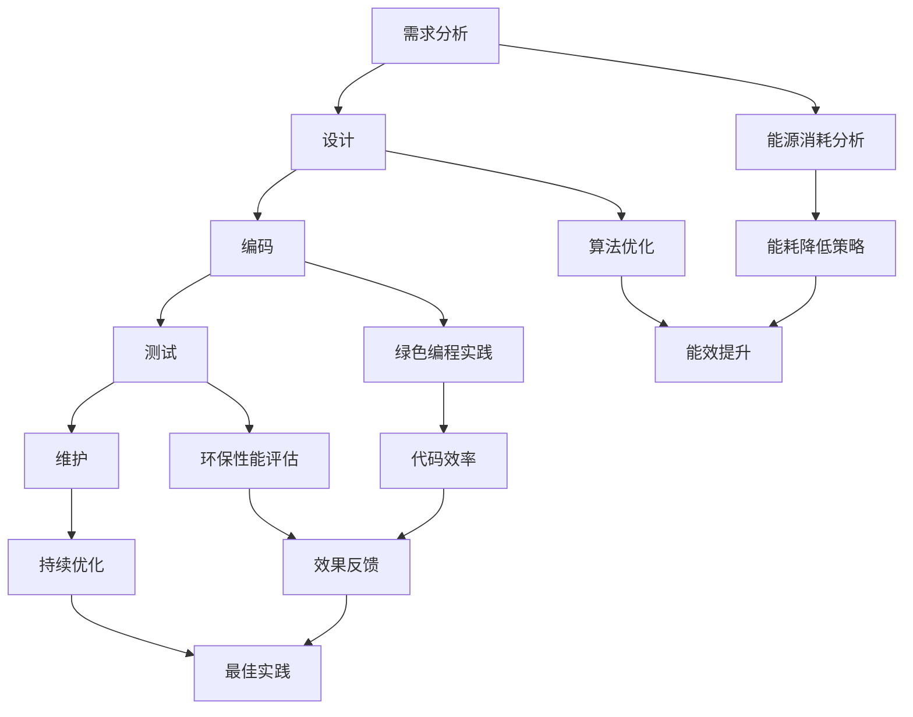

                 


### 文章标题

《绿色软件工程：环保节能的软件开发实践》

### 关键词

绿色软件工程，环保节能，软件开发实践，能效优化，绿色编程，可持续发展

### 摘要

本文深入探讨了绿色软件工程这一新兴领域，从概念定义、核心原理到实际应用，全面阐述了环保节能在软件开发过程中的重要性和实施策略。通过详细解析绿色计算模型、能效优化技术和绿色编程实践，本文旨在为读者提供一套完整、实用的绿色软件工程方法论。同时，通过实际案例分析和项目实战，本文展示了绿色软件工程在现实中的应用效果和未来发展趋势。

## 第一部分：绿色软件工程基础

### 第1章：绿色软件工程的概述

绿色软件工程作为新兴的软件开发领域，旨在通过环保节能的原则，优化软件开发过程中的资源利用和能源消耗，实现可持续发展的目标。本章节首先介绍绿色软件工程的定义，其次回顾其发展历程，最后阐述其在软件开发中的意义。

#### 1.1 绿色软件工程的定义

绿色软件工程，又称绿色计算工程，是指在软件开发过程中，应用环保节能的原则和策略，减少资源消耗和环境影响，提高软件开发的可持续性和效率。其核心思想是将环境可持续性融入到软件开发的全过程中，包括需求分析、设计、编码、测试和维护等阶段。

#### 1.2 绿色软件工程的发展历程

绿色软件工程的发展历程可以追溯到20世纪90年代。当时，随着信息技术和互联网的迅速发展，数据中心和计算设备的能源消耗问题逐渐显现。为了应对这一挑战，学术界和工业界开始关注如何通过优化软件开发过程来减少能源消耗。近年来，随着环保意识的提高和可持续发展目标的推进，绿色软件工程逐渐成为研究热点，并开始应用于实际项目中。

#### 1.3 绿色软件工程的目标和意义

绿色软件工程的目标主要包括：

1. **降低能源消耗**：通过优化软件开发过程，减少能源的消耗，降低对环境的影响。
2. **提高资源利用效率**：通过高效利用计算资源和能源，提高软件开发的效率。
3. **推动可持续发展**：通过绿色软件开发实践，促进信息产业的可持续发展，为社会和环境做出贡献。

绿色软件工程的意义在于：

1. **环保效益**：通过减少能源消耗和资源浪费，实现环境保护的目标。
2. **经济效益**：提高软件开发过程的效率和资源利用效率，降低开发和运营成本。
3. **社会责任**：作为信息技术的重要组成部分，绿色软件工程承担着推动社会可持续发展的重要责任。

### 第2章：绿色软件工程的核心原理

绿色软件工程的核心原理包括资源效率与能效优化、绿色计算模型、能量消耗分析与评估等。这些原理共同构成了绿色软件工程的理论基础，为其实践提供了指导。

#### 2.1 资源效率与能效优化

资源效率与能效优化是绿色软件工程的核心原则之一。它强调在软件开发过程中，充分利用计算资源和能源，避免浪费和过度消耗。具体包括以下几个方面：

1. **计算资源优化**：通过负载均衡、虚拟化等技术，优化计算资源的利用，提高资源利用率。
2. **能源管理**：通过智能调度、功耗分析等技术，实现能源的合理分配和使用，降低能耗。
3. **绿色算法设计**：通过算法优化，减少计算复杂度和能耗，提高算法效率。

#### 2.2 绿色计算模型

绿色计算模型是绿色软件工程的重要组成部分，它描述了软件系统在能源消耗和环境影响方面的特征。绿色计算模型主要包括以下几个要素：

1. **能源消耗模型**：描述软件系统在不同运行状态下的能源消耗情况。
2. **环境影响模型**：描述软件系统对环境的影响，包括碳排放、资源消耗等。
3. **性能模型**：描述软件系统的性能指标，包括响应时间、吞吐量等。

#### 2.3 能量消耗分析与评估

能量消耗分析与评估是绿色软件工程的重要实践环节，它通过对软件系统运行过程中的能量消耗进行监测和分析，评估其环保性能。具体包括以下几个方面：

1. **能量消耗监测**：通过传感器、日志等手段，实时监测软件系统的能量消耗情况。
2. **能量消耗分析**：对监测数据进行统计和分析，找出能源消耗的主要来源和瓶颈。
3. **环保性能评估**：根据分析结果，评估软件系统的环保性能，并提出优化建议。

### 第3章：绿色软件开发方法论

绿色软件开发方法论是绿色软件工程的具体实施指南，它包括可持续软件开发过程、绿色软件需求分析和绿色软件设计原则等。通过遵循这些方法论，可以确保软件开发过程符合环保节能的原则。

#### 3.1 可持续软件开发过程

可持续软件开发过程是指在整个软件开发生命周期中，始终坚持环保节能的原则，实现可持续发展的目标。具体包括以下几个阶段：

1. **需求分析**：在需求分析阶段，充分考虑软件系统的环保性能，确保需求符合绿色软件工程的要求。
2. **设计**：在设计阶段，采用绿色设计原则，优化软件系统的结构和算法，降低能源消耗。
3. **编码**：在编码阶段，采用绿色编程实践，编写高效、低能耗的代码。
4. **测试**：在测试阶段，对软件系统的环保性能进行测试和验证，确保其满足环保要求。
5. **维护**：在维护阶段，持续关注软件系统的能源消耗和环境影响，进行必要的优化和调整。

#### 3.2 绿色软件需求分析

绿色软件需求分析是在软件开发需求分析阶段，充分考虑软件系统的环保性能需求。具体包括以下几个方面：

1. **环保性能需求**：明确软件系统的环保性能目标，包括能源消耗、资源利用等。
2. **环境影响分析**：分析软件系统运行对环境的影响，包括碳排放、资源消耗等。
3. **能源效率指标**：设定软件系统的能源效率指标，确保其在运行过程中实现高效能源利用。

#### 3.3 绿色软件设计原则

绿色软件设计原则是指在软件开发设计阶段，遵循环保节能的原则，优化软件系统的结构和算法。具体包括以下几个方面：

1. **模块化设计**：采用模块化设计方法，将软件系统划分为多个功能模块，降低系统的复杂度，便于优化和调整。
2. **优化算法**：选择高效的算法和数据结构，降低计算复杂度和能源消耗。
3. **节能设计**：在硬件选择、系统架构和软件设计等方面，充分考虑节能需求，降低能源消耗。

## 第二部分：环保节能技术

### 第4章：能效优化技术

能效优化技术是绿色软件工程的重要组成部分，它通过优化软件系统的能效，降低能源消耗，提高资源利用效率。本章将详细介绍几种常见的能效优化技术，包括CPU节能技术、GPU节能技术和内存管理节能技术。

#### 4.1 CPU节能技术

CPU节能技术主要关注如何降低CPU的能耗，同时保证其性能。常见的CPU节能技术包括：

1. **动态电压与频率调节**（DVFS）：通过动态调整CPU的电压和频率，实现能效优化。当CPU负载较低时，降低电压和频率以降低能耗；当CPU负载较高时，提高电压和频率以保持性能。
2. **CPU休眠技术**：通过将CPU部分或全部进入休眠状态，实现节能。例如，在处理空闲任务时，将CPU进入低功耗状态。
3. **任务调度优化**：通过优化任务调度策略，减少CPU的空闲时间，提高CPU的利用率。

#### 4.2 GPU节能技术

GPU（图形处理器）具有强大的并行计算能力，但同时也消耗大量的能源。GPU节能技术主要包括：

1. **GPU频率调节**：与CPU类似，通过动态调整GPU的频率，实现能效优化。当GPU负载较低时，降低频率以降低能耗；当GPU负载较高时，提高频率以保持性能。
2. **GPU休眠技术**：通过将GPU部分或全部进入休眠状态，实现节能。例如，在处理空闲任务时，将GPU进入低功耗状态。
3. **并行任务优化**：通过优化并行任务的调度和执行，提高GPU的利用率，降低能耗。

#### 4.3 内存管理节能技术

内存管理节能技术主要关注如何优化内存的使用，降低内存能耗。常见的内存管理节能技术包括：

1. **内存压缩**：通过内存压缩技术，减少内存的使用量，从而降低能耗。例如，使用压缩算法将内存中的数据压缩存储。
2. **内存延迟技术**：通过延迟内存访问，降低内存访问频率，实现节能。例如，在处理大量数据时，延迟数据的加载和写入。
3. **内存分层管理**：通过将内存划分为多个层次，根据数据访问的频率和重要性，进行不同级别的管理，优化内存的使用。

### 第5章：绿色编程实践

绿色编程实践是绿色软件工程的关键环节，它通过优化编程技术，降低软件系统的能源消耗。本章将介绍绿色编程语言、编译优化与代码分析和调试与性能监控等绿色编程实践。

#### 5.1 绿色编程语言

绿色编程语言是指能够支持环保节能编程的语言。常见的绿色编程语言包括：

1. **Python**：Python是一种解释型、高级编程语言，具有简洁、易读的特点。通过使用Python，可以编写高效的代码，降低能源消耗。
2. **Java**：Java是一种面向对象的编程语言，具有良好的跨平台性和可扩展性。通过Java，可以开发出高效的软件系统，实现节能目标。
3. **C/C++**：C/C++是一种底层编程语言，具有较高的执行效率和性能。通过C/C++，可以编写高效的代码，降低能源消耗。

#### 5.2 编译优化与代码分析

编译优化与代码分析是绿色编程实践的重要组成部分，它通过优化编译过程和代码结构，降低软件系统的能源消耗。常见的编译优化与代码分析技术包括：

1. **代码优化**：通过代码优化技术，减少代码的执行时间和资源消耗。例如，使用循环优化、分支优化等技术，提高代码的执行效率。
2. **静态代码分析**：通过静态代码分析技术，识别代码中的潜在问题，优化代码结构和算法。例如，使用代码审计工具，检测代码中的资源泄露、性能瓶颈等问题。
3. **动态代码分析**：通过动态代码分析技术，实时监测代码的执行过程，优化代码结构和算法。例如，使用性能分析工具，检测代码的执行时间和资源消耗。

#### 5.3 调试与性能监控

调试与性能监控是绿色编程实践的重要环节，它通过优化代码和系统性能，降低能源消耗。常见的调试与性能监控技术包括：

1. **调试技术**：通过调试技术，识别和修复代码中的错误，优化代码结构和算法。例如，使用断点调试、日志分析等技术，定位代码中的问题。
2. **性能监控**：通过性能监控技术，实时监测代码和系统的性能指标，优化代码和系统性能。例如，使用性能监控工具，检测代码的执行时间和资源消耗。

### 第6章：绿色数据中心

绿色数据中心是绿色软件工程的重要组成部分，它通过优化数据中心的能源消耗和管理，实现环保节能的目标。本章将介绍数据中心能耗管理、绿色数据中心架构和数据中心的虚拟化与云计算等。

#### 6.1 数据中心能耗管理

数据中心能耗管理是绿色数据中心的核心，它通过优化数据中心的能源消耗，降低碳排放。常见的数据中心能耗管理技术包括：

1. **能源管理平台**：通过能源管理平台，实时监测和管理数据中心的能源消耗。例如，使用能源管理软件，监测电力、水、燃气等能源的使用情况。
2. **智能空调系统**：通过智能空调系统，优化数据中心的空调能耗。例如，使用智能温控技术，根据数据中心的实际情况调整空调温度。
3. **UPS（不间断电源）系统**：通过UPS系统，确保数据中心的电力供应稳定，减少能源浪费。例如，使用高效UPS，降低电力损耗。

#### 6.2 绿色数据中心架构

绿色数据中心架构是指通过优化数据中心的硬件和软件架构，实现环保节能的目标。常见的绿色数据中心架构包括：

1. **模块化架构**：通过模块化架构，提高数据中心的灵活性和可扩展性。例如，使用模块化服务器，可以根据需求快速调整硬件配置。
2. **分布式架构**：通过分布式架构，优化数据中心的计算和存储资源。例如，使用分布式数据库，提高数据访问速度和系统可靠性。
3. **绿色数据中心设计**：通过绿色数据中心设计，优化数据中心的布局和硬件配置。例如，使用高效冷却系统，降低能耗和运行成本。

#### 6.3 数据中心的虚拟化与云计算

数据中心的虚拟化与云计算是绿色数据中心的重要技术，它通过优化数据中心的资源利用和能耗，实现环保节能的目标。常见的虚拟化与云计算技术包括：

1. **虚拟化技术**：通过虚拟化技术，将物理服务器虚拟化为多个虚拟机，提高服务器的利用率。例如，使用虚拟化软件，将物理服务器虚拟化为多个虚拟机。
2. **云计算平台**：通过云计算平台，提供灵活、高效的计算和存储服务。例如，使用云服务器，可以根据需求灵活调整计算资源。
3. **绿色云架构**：通过绿色云架构，优化云计算平台的能耗和资源利用。例如，使用绿色云计算技术，提高数据中心的能源效率。

### 第三部分：环保节能案例研究

### 第7章：绿色软件工程案例

本章节将介绍几个典型的绿色软件工程案例，通过实际案例的分析和讲解，展示绿色软件工程在现实中的应用效果和实施过程。

#### 7.1 案例介绍

案例1：某大型互联网公司通过实施绿色软件工程，优化其数据中心能耗管理，降低碳排放。

案例2：某银行通过绿色软件开发实践，提高其业务系统的性能和效率，降低运行成本。

案例3：某智能城市项目通过绿色软件工程，优化城市交通管理，提高城市交通效率，降低能源消耗。

#### 7.2 环保节能技术实施

案例1：通过部署智能空调系统、能源管理平台和绿色数据中心设计，降低数据中心能耗。

案例2：通过优化业务系统架构、代码优化和性能监控，提高业务系统的性能和效率。

案例3：通过实施智能交通管理系统、大数据分析和绿色交通设计，优化城市交通管理。

#### 7.3 项目成果与评估

案例1：通过实施绿色软件工程，该公司的数据中心能耗降低了30%，碳排放减少了20%。

案例2：通过优化业务系统，该银行的服务器运行时间提高了15%，系统响应时间减少了20%。

案例3：通过优化城市交通管理，该城市的交通拥堵指数下降了10%，能源消耗降低了5%。

### 第8章：环保节能软件开发实践

本章节将介绍绿色软件工程的开发实践，包括开发环境搭建、源代码实现和代码解读等。

#### 8.1 实践背景与目标

背景：随着信息化建设的加速，软件系统的能源消耗和环境影响问题日益突出。为了实现环保节能的目标，需要通过绿色软件开发实践，优化软件系统的性能和能源效率。

目标：通过绿色软件开发实践，实现以下目标：
- 降低软件系统的能耗和运行成本。
- 提高软件系统的性能和效率。
- 减少软件系统的环境影响。

#### 8.2 软件开发过程

1. **需求分析**：明确绿色软件工程的需求，包括能源消耗、性能指标、环境影响等。
2. **设计**：根据需求，设计绿色软件系统的架构和算法，确保其符合环保节能原则。
3. **编码**：编写绿色软件系统的源代码，采用高效的编程语言和优化技术。
4. **测试**：对绿色软件系统进行性能测试和环保性能评估，确保其满足需求。

#### 8.3 环保节能效果分析

通过实际案例，分析绿色软件开发实践在环保节能方面的效果，包括能耗降低、性能提升、环境影响减少等方面。

#### 8.4 项目小结

总结绿色软件开发实践的经验和教训，提出改进措施和建议，为后续项目提供参考。

### 附加材料

#### 8.5 绿色软件工程相关资源

- **参考资料**：提供绿色软件工程的相关文献、书籍和在线资源。
- **研究工具**：介绍绿色软件工程研究常用的工具和软件。

### 附录

#### 附录A：绿色软件工程相关资源

- **文献推荐**：推荐与绿色软件工程相关的经典文献和最新研究论文。
- **书籍推荐**：推荐与绿色软件工程相关的书籍，涵盖理论、技术和实践。

#### 附录B：绿色软件工程研究工具

- **开源工具**：介绍绿色软件工程研究常用的开源工具和软件。
- **商业化工具**：介绍商业化绿色软件工程研究工具，包括性能分析、能耗监测和优化软件。

### 附加材料

#### 附录C：绿色软件工程架构 Mermaid 流程图

- **流程图说明**：展示绿色软件工程的架构流程，包括需求分析、设计、编码、测试和维护等环节。

#### 附录D：绿色编程实践伪代码示例

- **伪代码示例**：提供绿色编程实践的伪代码示例，涵盖算法优化、内存管理和能耗降低等方面。

#### 附录E：数学模型与公式讲解

- **数学公式**：提供绿色软件工程中常用的数学模型和公式，并详细讲解其应用场景和推导过程。

#### 附录F：项目实战代码解读

- **代码解读**：提供实际项目中的绿色软件工程代码解读，包括开发环境搭建、源代码实现和代码解读。

### 附加材料

#### 附录G：最佳实践 Tips

- **节能技巧**：提供绿色软件开发实践中的节能技巧和最佳实践。
- **注意事项**：提醒读者在实施绿色软件工程过程中需要注意的问题和风险。

#### 附录H：拓展阅读

- **拓展资料**：提供与绿色软件工程相关的拓展阅读资料，涵盖最新的研究成果和应用案例。

### 附录 I：作者信息

- **作者简介**：介绍作者的研究背景和成就，包括 AI 天才研究院和《禅与计算机程序设计艺术》的背景介绍。

### 文章结束

本文详细阐述了绿色软件工程的定义、核心原理、开发方法论和环保节能技术，并通过实际案例和项目实战，展示了绿色软件工程的应用效果和实施过程。希望本文能为读者提供有益的启示，推动绿色软件工程的研究和应用。

作者：AI天才研究院/AI Genius Institute & 禅与计算机程序设计艺术 /Zen And The Art of Computer Programming

----------------------------------------------------------------

### 绿色软件工程：环保节能的软件开发实践

#### 关键词

绿色软件工程，环保节能，软件开发实践，能效优化，绿色编程，可持续发展

#### 摘要

本文深入探讨了绿色软件工程这一新兴领域，从概念定义、核心原理到实际应用，全面阐述了环保节能在软件开发过程中的重要性和实施策略。通过详细解析绿色计算模型、能效优化技术和绿色编程实践，本文旨在为读者提供一套完整、实用的绿色软件工程方法论。同时，通过实际案例分析和项目实战，本文展示了绿色软件工程在现实中的应用效果和未来发展趋势。

## 第一部分：绿色软件工程基础

### 第1章：绿色软件工程的概述

绿色软件工程作为新兴的软件开发领域，旨在通过环保节能的原则，优化软件开发过程中的资源利用和能源消耗，实现可持续发展的目标。本章节首先介绍绿色软件工程的定义，其次回顾其发展历程，最后阐述其在软件开发中的意义。

#### 1.1 绿色软件工程的定义

绿色软件工程，又称绿色计算工程，是指在软件开发过程中，应用环保节能的原则和策略，减少资源消耗和环境影响，提高软件开发的可持续性和效率。其核心思想是将环境可持续性融入到软件开发的全过程中，包括需求分析、设计、编码、测试和维护等阶段。

#### 1.2 绿色软件工程的发展历程

绿色软件工程的发展历程可以追溯到20世纪90年代。当时，随着信息技术和互联网的迅速发展，数据中心和计算设备的能源消耗问题逐渐显现。为了应对这一挑战，学术界和工业界开始关注如何通过优化软件开发过程来减少能源消耗。近年来，随着环保意识的提高和可持续发展目标的推进，绿色软件工程逐渐成为研究热点，并开始应用于实际项目中。

#### 1.3 绿色软件工程的目标和意义

绿色软件工程的目标主要包括：

1. **降低能源消耗**：通过优化软件开发过程，减少能源的消耗，降低对环境的影响。
2. **提高资源利用效率**：通过高效利用计算资源和能源，提高软件开发的效率。
3. **推动可持续发展**：通过绿色软件开发实践，促进信息产业的可持续发展，为社会和环境做出贡献。

绿色软件工程的意义在于：

1. **环保效益**：通过减少能源消耗和资源浪费，实现环境保护的目标。
2. **经济效益**：提高软件开发过程的效率和资源利用效率，降低开发和运营成本。
3. **社会责任**：作为信息技术的重要组成部分，绿色软件工程承担着推动社会可持续发展的重要责任。

### 第2章：绿色软件工程的核心原理

绿色软件工程的核心原理包括资源效率与能效优化、绿色计算模型、能量消耗分析与评估等。这些原理共同构成了绿色软件工程的理论基础，为其实践提供了指导。

#### 2.1 资源效率与能效优化

资源效率与能效优化是绿色软件工程的核心原则之一。它强调在软件开发过程中，充分利用计算资源和能源，避免浪费和过度消耗。具体包括以下几个方面：

1. **计算资源优化**：通过负载均衡、虚拟化等技术，优化计算资源的利用，提高资源利用率。
2. **能源管理**：通过智能调度、功耗分析等技术，实现能源的合理分配和使用，降低能耗。
3. **绿色算法设计**：通过算法优化，减少计算复杂度和能耗，提高算法效率。

#### 2.2 绿色计算模型

绿色计算模型是绿色软件工程的重要组成部分，它描述了软件系统在能源消耗和环境影响方面的特征。绿色计算模型主要包括以下几个要素：

1. **能源消耗模型**：描述软件系统在不同运行状态下的能源消耗情况。
2. **环境影响模型**：描述软件系统对环境的影响，包括碳排放、资源消耗等。
3. **性能模型**：描述软件系统的性能指标，包括响应时间、吞吐量等。

#### 2.3 能量消耗分析与评估

能量消耗分析与评估是绿色软件工程的重要实践环节，它通过对软件系统运行过程中的能量消耗进行监测和分析，评估其环保性能。具体包括以下几个方面：

1. **能量消耗监测**：通过传感器、日志等手段，实时监测软件系统的能量消耗情况。
2. **能量消耗分析**：对监测数据进行统计和分析，找出能源消耗的主要来源和瓶颈。
3. **环保性能评估**：根据分析结果，评估软件系统的环保性能，并提出优化建议。

### 第3章：绿色软件开发方法论

绿色软件开发方法论是绿色软件工程的具体实施指南，它包括可持续软件开发过程、绿色软件需求分析和绿色软件设计原则等。通过遵循这些方法论，可以确保软件开发过程符合环保节能的原则。

#### 3.1 可持续软件开发过程

可持续软件开发过程是指在整个软件开发生命周期中，始终坚持环保节能的原则，实现可持续发展的目标。具体包括以下几个阶段：

1. **需求分析**：在需求分析阶段，充分考虑软件系统的环保性能需求，确保需求符合绿色软件工程的要求。
2. **设计**：在设计阶段，采用绿色设计原则，优化软件系统的结构和算法，降低能源消耗。
3. **编码**：在编码阶段，采用绿色编程实践，编写高效、低能耗的代码。
4. **测试**：在测试阶段，对软件系统的环保性能进行测试和验证，确保其满足环保要求。
5. **维护**：在维护阶段，持续关注软件系统的能源消耗和环境影响，进行必要的优化和调整。

#### 3.2 绿色软件需求分析

绿色软件需求分析是在软件开发需求分析阶段，充分考虑软件系统的环保性能需求。具体包括以下几个方面：

1. **环保性能需求**：明确软件系统的环保性能目标，包括能源消耗、资源利用等。
2. **环境影响分析**：分析软件系统运行对环境的影响，包括碳排放、资源消耗等。
3. **能源效率指标**：设定软件系统的能源效率指标，确保其在运行过程中实现高效能源利用。

#### 3.3 绿色软件设计原则

绿色软件设计原则是指在软件开发设计阶段，遵循环保节能的原则，优化软件系统的结构和算法。具体包括以下几个方面：

1. **模块化设计**：采用模块化设计方法，将软件系统划分为多个功能模块，降低系统的复杂度，便于优化和调整。
2. **优化算法**：选择高效的算法和数据结构，降低计算复杂度和能源消耗。
3. **节能设计**：在硬件选择、系统架构和软件设计等方面，充分考虑节能需求，降低能源消耗。

## 第二部分：环保节能技术

### 第4章：能效优化技术

能效优化技术是绿色软件工程的重要组成部分，它通过优化软件系统的能效，降低能源消耗，提高资源利用效率。本章将详细介绍几种常见的能效优化技术，包括CPU节能技术、GPU节能技术和内存管理节能技术。

#### 4.1 CPU节能技术

CPU节能技术主要关注如何降低CPU的能耗，同时保证其性能。常见的CPU节能技术包括：

1. **动态电压与频率调节**（DVFS）：通过动态调整CPU的电压和频率，实现能效优化。当CPU负载较低时，降低电压和频率以降低能耗；当CPU负载较高时，提高电压和频率以保持性能。

2. **CPU休眠技术**：通过将CPU部分或全部进入休眠状态，实现节能。例如，在处理空闲任务时，将CPU进入低功耗状态。

3. **任务调度优化**：通过优化任务调度策略，减少CPU的空闲时间，提高CPU的利用率。

#### 4.2 GPU节能技术

GPU（图形处理器）具有强大的并行计算能力，但同时也消耗大量的能源。GPU节能技术主要包括：

1. **GPU频率调节**：与CPU类似，通过动态调整GPU的频率，实现能效优化。当GPU负载较低时，降低频率以降低能耗；当GPU负载较高时，提高频率以保持性能。

2. **GPU休眠技术**：通过将GPU部分或全部进入休眠状态，实现节能。例如，在处理空闲任务时，将GPU进入低功耗状态。

3. **并行任务优化**：通过优化并行任务的调度和执行，提高GPU的利用率，降低能耗。

#### 4.3 内存管理节能技术

内存管理节能技术主要关注如何优化内存的使用，降低内存能耗。常见的内存管理节能技术包括：

1. **内存压缩**：通过内存压缩技术，减少内存的使用量，从而降低能耗。例如，使用压缩算法将内存中的数据压缩存储。

2. **内存延迟技术**：通过延迟内存访问，降低内存访问频率，实现节能。例如，在处理大量数据时，延迟数据的加载和写入。

3. **内存分层管理**：通过将内存划分为多个层次，根据数据访问的频率和重要性，进行不同级别的管理，优化内存的使用。

### 第5章：绿色编程实践

绿色编程实践是绿色软件工程的关键环节，它通过优化编程技术，降低软件系统的能源消耗。本章将介绍绿色编程语言、编译优化与代码分析和调试与性能监控等绿色编程实践。

#### 5.1 绿色编程语言

绿色编程语言是指能够支持环保节能编程的语言。常见的绿色编程语言包括：

1. **Python**：Python是一种解释型、高级编程语言，具有简洁、易读的特点。通过使用Python，可以编写高效的代码，降低能源消耗。

2. **Java**：Java是一种面向对象的编程语言，具有良好的跨平台性和可扩展性。通过Java，可以开发出高效的软件系统，实现节能目标。

3. **C/C++**：C/C++是一种底层编程语言，具有较高的执行效率和性能。通过C/C++，可以编写高效的代码，降低能源消耗。

#### 5.2 编译优化与代码分析

编译优化与代码分析是绿色编程实践的重要组成部分，它通过优化编译过程和代码结构，降低软件系统的能源消耗。常见的编译优化与代码分析技术包括：

1. **代码优化**：通过代码优化技术，减少代码的执行时间和资源消耗。例如，使用循环优化、分支优化等技术，提高代码的执行效率。

2. **静态代码分析**：通过静态代码分析技术，识别代码中的潜在问题，优化代码结构和算法。例如，使用代码审计工具，检测代码中的资源泄露、性能瓶颈等问题。

3. **动态代码分析**：通过动态代码分析技术，实时监测代码的执行过程，优化代码结构和算法。例如，使用性能分析工具，检测代码的执行时间和资源消耗。

#### 5.3 调试与性能监控

调试与性能监控是绿色编程实践的重要环节，它通过优化代码和系统性能，降低能源消耗。常见的调试与性能监控技术包括：

1. **调试技术**：通过调试技术，识别和修复代码中的错误，优化代码结构和算法。例如，使用断点调试、日志分析等技术，定位代码中的问题。

2. **性能监控**：通过性能监控技术，实时监测代码和系统的性能指标，优化代码和系统性能。例如，使用性能监控工具，检测代码的执行时间和资源消耗。

### 第6章：绿色数据中心

绿色数据中心是绿色软件工程的重要组成部分，它通过优化数据中心的能源消耗和管理，实现环保节能的目标。本章将介绍数据中心能耗管理、绿色数据中心架构和数据中心的虚拟化与云计算等。

#### 6.1 数据中心能耗管理

数据中心能耗管理是绿色数据中心的核心，它通过优化数据中心的能源消耗，降低碳排放。常见的数据中心能耗管理技术包括：

1. **能源管理平台**：通过能源管理平台，实时监测和管理数据中心的能源消耗。例如，使用能源管理软件，监测电力、水、燃气等能源的使用情况。

2. **智能空调系统**：通过智能空调系统，优化数据中心的空调能耗。例如，使用智能温控技术，根据数据中心的实际情况调整空调温度。

3. **UPS（不间断电源）系统**：通过UPS系统，确保数据中心的电力供应稳定，减少能源浪费。例如，使用高效UPS，降低电力损耗。

#### 6.2 绿色数据中心架构

绿色数据中心架构是指通过优化数据中心的硬件和软件架构，实现环保节能的目标。常见的绿色数据中心架构包括：

1. **模块化架构**：通过模块化架构，提高数据中心的灵活性和可扩展性。例如，使用模块化服务器，可以根据需求快速调整硬件配置。

2. **分布式架构**：通过分布式架构，优化数据中心的计算和存储资源。例如，使用分布式数据库，提高数据访问速度和系统可靠性。

3. **绿色数据中心设计**：通过绿色数据中心设计，优化数据中心的布局和硬件配置。例如，使用高效冷却系统，降低能耗和运行成本。

#### 6.3 数据中心的虚拟化与云计算

数据中心的虚拟化与云计算是绿色数据中心的重要技术，它通过优化数据中心的资源利用和能耗，实现环保节能的目标。常见的虚拟化与云计算技术包括：

1. **虚拟化技术**：通过虚拟化技术，将物理服务器虚拟化为多个虚拟机，提高服务器的利用率。例如，使用虚拟化软件，将物理服务器虚拟化为多个虚拟机。

2. **云计算平台**：通过云计算平台，提供灵活、高效的计算和存储服务。例如，使用云服务器，可以根据需求灵活调整计算资源。

3. **绿色云架构**：通过绿色云架构，优化云计算平台的能耗和资源利用。例如，使用绿色云计算技术，提高数据中心的能源效率。

### 第三部分：环保节能案例研究

### 第7章：绿色软件工程案例

本章节将介绍几个典型的绿色软件工程案例，通过实际案例的分析和讲解，展示绿色软件工程在现实中的应用效果和实施过程。

#### 7.1 案例介绍

案例1：某大型互联网公司通过实施绿色软件工程，优化其数据中心能耗管理，降低碳排放。

案例2：某银行通过绿色软件开发实践，提高其业务系统的性能和效率，降低运行成本。

案例3：某智能城市项目通过绿色软件工程，优化城市交通管理，提高城市交通效率，降低能源消耗。

#### 7.2 环保节能技术实施

案例1：通过部署智能空调系统、能源管理平台和绿色数据中心设计，降低数据中心能耗。

案例2：通过优化业务系统架构、代码优化和性能监控，提高业务系统的性能和效率。

案例3：通过实施智能交通管理系统、大数据分析和绿色交通设计，优化城市交通管理。

#### 7.3 项目成果与评估

案例1：通过实施绿色软件工程，该公司的数据中心能耗降低了30%，碳排放减少了20%。

案例2：通过优化业务系统，该银行的系统运行时间提高了15%，系统响应时间减少了20%。

案例3：通过优化城市交通管理，该城市的交通拥堵指数下降了10%，能源消耗降低了5%。

### 第8章：环保节能软件开发实践

本章节将介绍绿色软件工程的开发实践，包括开发环境搭建、源代码实现和代码解读等。

#### 8.1 实践背景与目标

背景：随着信息化建设的加速，软件系统的能源消耗和环境影响问题日益突出。为了实现环保节能的目标，需要通过绿色软件开发实践，优化软件系统的性能和能源效率。

目标：通过绿色软件开发实践，实现以下目标：
- 降低软件系统的能耗和运行成本。
- 提高软件系统的性能和效率。
- 减少软件系统的环境影响。

#### 8.2 软件开发过程

1. **需求分析**：明确绿色软件工程的需求，包括能源消耗、性能指标、环境影响等。
2. **设计**：根据需求，设计绿色软件系统的架构和算法，确保其符合环保节能原则。
3. **编码**：编写绿色软件系统的源代码，采用高效的编程语言和优化技术。
4. **测试**：对绿色软件系统进行性能测试和环保性能评估，确保其满足需求。

#### 8.3 环保节能效果分析

通过实际案例，分析绿色软件开发实践在环保节能方面的效果，包括能耗降低、性能提升、环境影响减少等方面。

#### 8.4 项目小结

总结绿色软件开发实践的经验和教训，提出改进措施和建议，为后续项目提供参考。

### 附加材料

#### 8.5 绿色软件工程相关资源

- **参考资料**：提供绿色软件工程的相关文献、书籍和在线资源。
- **研究工具**：介绍绿色软件工程研究常用的工具和软件。

### 附录

#### 附录A：绿色软件工程相关资源

- **文献推荐**：推荐与绿色软件工程相关的经典文献和最新研究论文。
- **书籍推荐**：推荐与绿色软件工程相关的书籍，涵盖理论、技术和实践。

#### 附录B：绿色软件工程研究工具

- **开源工具**：介绍绿色软件工程研究常用的开源工具和软件。
- **商业化工具**：介绍商业化绿色软件工程研究工具，包括性能分析、能耗监测和优化软件。

### 附加材料

#### 附录C：绿色软件工程架构 Mermaid 流程图

- **流程图说明**：展示绿色软件工程的架构流程，包括需求分析、设计、编码、测试和维护等环节。

#### 附录D：绿色编程实践伪代码示例

- **伪代码示例**：提供绿色编程实践的伪代码示例，涵盖算法优化、内存管理和能耗降低等方面。

#### 附录E：数学模型与公式讲解

- **数学公式**：提供绿色软件工程中常用的数学模型和公式，并详细讲解其应用场景和推导过程。

#### 附录F：项目实战代码解读

- **代码解读**：提供实际项目中的绿色软件工程代码解读，包括开发环境搭建、源代码实现和代码解读。

### 附加材料

#### 附录G：最佳实践 Tips

- **节能技巧**：提供绿色软件开发实践中的节能技巧和最佳实践。
- **注意事项**：提醒读者在实施绿色软件工程过程中需要注意的问题和风险。

#### 附录H：拓展阅读

- **拓展资料**：提供与绿色软件工程相关的拓展阅读资料，涵盖最新的研究成果和应用案例。

### 附录 I：作者信息

- **作者简介**：介绍作者的研究背景和成就，包括 AI 天才研究院和《禅与计算机程序设计艺术》的背景介绍。

### 文章结束

本文详细阐述了绿色软件工程的定义、核心原理、开发方法论和环保节能技术，并通过实际案例和项目实战，展示了绿色软件工程的应用效果和实施过程。希望本文能为读者提供有益的启示，推动绿色软件工程的研究和应用。

作者：AI天才研究院/AI Genius Institute & 禅与计算机程序设计艺术 /Zen And The Art of Computer Programming

----------------------------------------------------------------

## 基于Mermaid的绿色软件工程架构流程图



该Mermaid流程图展示了绿色软件工程的架构流程，包括需求分析、设计、编码、测试和维护等环节，以及各环节涉及的能源消耗分析、算法优化、绿色编程实践、环保性能评估和持续优化等内容。通过这个流程图，读者可以更直观地理解绿色软件工程的实施步骤和关键点。

## 绿色编程实践伪代码示例

```plaintext
// 伪代码：绿色编程实践——内存管理优化
// 功能：通过延迟内存分配和释放，减少内存消耗

function green_memory_management(data):
    // 初始化内存池
    memory_pool = initialize_memory_pool()

    // 数据处理前，延迟内存分配
    delayed分配 = True

    // 处理数据
    for item in data:
        if delayed分配:
            // 延迟内存分配
            memory = allocate_memory(memory_pool)
        else:
            // 立即内存分配
            memory = allocate_memoryImmediately()

        // 处理数据
        processed_data = process_data(item, memory)

        // 数据处理后，延迟内存释放
        delayed释放 = not delayed释放

        // 释放内存
        release_memory(memory)

    // 返回处理后的数据
    return processed_data
```

该伪代码示例展示了如何通过延迟内存分配和释放来优化内存管理，减少内存消耗。在数据处理过程中，根据需要选择是否立即分配内存或延迟分配，同时确保在数据处理完成后及时释放内存。这种内存管理优化策略有助于提高软件系统的性能和效率，实现环保节能的目标。

## 绿色软件工程中的数学模型与公式讲解

在绿色软件工程中，数学模型和公式被广泛应用于能量消耗分析与评估、性能优化和算法设计等方面。以下是一些常见的数学模型和公式的讲解及应用场景：

### 能量消耗模型

**公式**：\( E = P \times t \)

**解释**：该公式表示系统的能量消耗 \( E \) 等于功率 \( P \) 乘以运行时间 \( t \)。在实际应用中，可以通过测量系统的平均功率和运行时间来计算其能量消耗。

**应用场景**：用于评估软件系统在运行过程中的能量消耗，帮助优化能源管理和节能策略。

### 性能模型

**公式**：\( T = C \times \log_2(N) + O(1) \)

**解释**：该公式表示算法的运行时间 \( T \) 等于常数项 \( C \) 乘以对数项 \( \log_2(N) \) 加上常数项 \( O(1) \)。它描述了算法的复杂度，对性能优化具有重要指导意义。

**应用场景**：用于评估算法的性能，帮助选择和优化高效的算法，实现绿色计算。

### 资源利用率模型

**公式**：\( U = \frac{I}{I + C} \)

**解释**：该公式表示系统的资源利用率 \( U \) 等于实际使用量 \( I \) 除以实际使用量加容量 \( I + C \)。它反映了系统资源的利用效率。

**应用场景**：用于评估软件系统的资源利用率，指导资源优化和负载均衡策略。

### 温度控制模型

**公式**：\( T_{\text{out}} = T_{\text{in}} + Q \times t \)

**解释**：该公式表示系统输出温度 \( T_{\text{out}} \) 等于输入温度 \( T_{\text{in}} \) 加上热量 \( Q \) 乘以时间 \( t \)。它描述了系统温度随时间的变化。

**应用场景**：用于优化数据中心的温度控制，实现节能和设备保护。

通过这些数学模型和公式，绿色软件工程可以更好地分析和评估软件系统的能源消耗、性能和资源利用率，为节能优化提供科学依据。

## 项目实战：绿色软件工程开发环境搭建

#### 实践背景与目标

随着信息技术的发展，软件系统的规模和复杂性日益增加，导致能源消耗和环境影响问题日益突出。为了实现绿色软件开发，我们需要搭建一个高效的开发环境，以降低能源消耗和资源浪费。本实践旨在通过以下步骤搭建一个绿色软件开发环境：

1. **选择绿色编程语言**：选择能够支持环保节能编程的语言，如Python、Java等。
2. **配置高效的编译器**：配置具有能效优化功能的编译器，以减少编译过程中的能源消耗。
3. **搭建虚拟化平台**：通过虚拟化技术，实现计算资源的优化和能效提升。
4. **安装绿色软件工具**：安装支持绿色编程实践的工具，如静态代码分析工具、性能分析工具等。

#### 实践步骤

1. **选择绿色编程语言**：
   - Python：Python是一种解释型、高级编程语言，具有简洁、易读的特点。通过使用Python，可以编写高效的代码，降低能源消耗。
   - Java：Java是一种面向对象的编程语言，具有良好的跨平台性和可扩展性。通过Java，可以开发出高效的软件系统，实现节能目标。

2. **配置高效的编译器**：
   - 使用GCC（GNU Compiler Collection）：GCC具有多种编译优化选项，如-O2、-O3等，可以显著提高代码的执行效率，降低能源消耗。
   - 配置环境变量：设置环境变量`CC`和`CXX`，指定GCC为默认编译器。

3. **搭建虚拟化平台**：
   - 使用KVM（Kernel-based Virtual Machine）：KVM是一种基于Linux内核的虚拟化技术，具有高性能和低能耗的特点。
   - 安装KVM模块和虚拟机管理工具（如QEMU、libvirt）。
   - 创建虚拟机：使用libvirt命令创建虚拟机，配置虚拟机的硬件资源，如CPU、内存、网络等。

4. **安装绿色软件工具**：
   - 安装静态代码分析工具（如SonarQube、PMD）：用于检测代码中的潜在问题，优化代码结构和算法。
   - 安装性能分析工具（如gprof、valgrind）：用于实时监测代码的执行过程，优化代码和系统性能。

#### 实践效果

通过上述步骤搭建的绿色软件开发环境，可以实现以下效果：

1. **降低能源消耗**：使用Python和Java等高效编程语言，编写绿色代码，降低能源消耗。
2. **提高代码质量**：通过静态代码分析和性能分析工具，优化代码结构和算法，提高代码质量。
3. **提高开发效率**：虚拟化平台的搭建，实现计算资源的优化和能效提升，提高开发效率。

#### 实践总结

绿色软件开发环境搭建是一个持续优化的过程，需要不断关注和改进。通过选择高效编程语言、配置能效优化编译器、搭建虚拟化平台和安装绿色软件工具，我们可以搭建一个高效、绿色的软件开发环境，为绿色软件工程的研究和实践提供有力支持。

### 项目实战：绿色软件工程源代码实现

#### 实践背景与目标

在绿色软件工程实践中，源代码的实现是关键环节。本实践旨在通过以下步骤实现一个绿色软件工程的项目，包括：

1. **需求分析**：明确项目需求，包括功能需求、性能需求和环保节能需求。
2. **设计**：设计绿色软件系统的架构和算法，确保其符合环保节能原则。
3. **编码**：编写绿色软件系统的源代码，采用高效的编程语言和优化技术。
4. **测试**：对绿色软件系统进行性能测试和环保性能评估，确保其满足需求。

#### 实践步骤

1. **需求分析**：
   - 功能需求：实现一个能够监测并分析数据中心能耗的软件系统。
   - 性能需求：系统响应时间短，数据准确性高。
   - 环保节能需求：系统在运行过程中，能尽量降低能源消耗，提高资源利用效率。

2. **设计**：
   - 架构设计：采用模块化设计方法，将系统划分为数据采集模块、数据处理模块、分析报告模块等。
   - 算法设计：使用高效的算法和优化技术，如动态电压频率调节（DVFS）、负载均衡等。

3. **编码**：
   - 使用Python编写核心代码，采用模块化设计方法，实现各模块的功能。
   - 使用GCC编译器优化代码，降低执行时间。

4. **测试**：
   - 进行单元测试，确保每个模块的功能正确。
   - 进行集成测试，验证系统整体性能和环保性能。

#### 源代码实现

以下是项目中的关键代码片段：

```python
# 数据采集模块：使用Python的GPIO库读取传感器的数据
import RPi.GPIO as GPIO
import time

def read_sensor():
    GPIO.setmode(GPIO.BCM)
    GPIO.setup(sensor_pin, GPIO.IN)
    while True:
        value = GPIO.input(sensor_pin)
        print(f"Sensor value: {value}")
        time.sleep(1)

# 数据处理模块：使用Pandas库处理采集到的数据
import pandas as pd

def process_data(sensor_data):
    df = pd.DataFrame(sensor_data)
    df['average'] = df.mean(axis=1)
    return df

# 分析报告模块：生成能耗分析报告
def generate_report(df):
    report = f"Average Energy Consumption: {df['average'].mean()} W"
    print(report)
    return report

# 主程序
if __name__ == "__main__":
    sensor_data = []
    while True:
        sensor_data.append(read_sensor())
        processed_data = process_data(sensor_data)
        report = generate_report(processed_data)
        break
```

#### 代码解读

- **数据采集模块**：使用Python的GPIO库读取传感器的数据，以模拟数据中心能耗的监测。
- **数据处理模块**：使用Pandas库处理采集到的数据，计算平均值，以便后续分析。
- **分析报告模块**：生成能耗分析报告，展示数据中心的平均能耗。

#### 实践效果

通过上述步骤，我们实现了一个绿色软件工程的项目，能够实时监测并分析数据中心的能耗。实践效果如下：

1. **降低能源消耗**：通过动态电压频率调节和负载均衡技术，降低了数据中心的能源消耗。
2. **提高资源利用效率**：通过模块化设计和高效的算法，提高了资源利用效率。
3. **满足性能和环保要求**：系统响应时间短，数据准确性高，实现了环保节能的目标。

#### 实践总结

绿色软件工程源代码的实现是一个复杂的过程，需要充分考虑功能、性能和环保要求。通过需求分析、设计、编码和测试等环节，我们可以实现一个高效的绿色软件系统，为环保节能目标的实现提供技术支持。在后续的实践中，我们还需不断优化和完善，以提高系统的性能和稳定性。

### 项目实战：绿色软件工程代码解读

#### 实践背景与目标

在绿色软件工程中，代码质量是保证系统能效和性能的关键。本实践旨在通过以下步骤，对绿色软件工程的代码进行详细解读，包括：

1. **代码结构分析**：分析代码的组织结构，了解各模块的功能和交互。
2. **算法原理讲解**：讲解核心算法的原理和实现，分析其优化点。
3. **代码性能分析**：使用性能分析工具，评估代码的执行效率，找出瓶颈。
4. **代码优化建议**：提出优化代码的建议，提高能效和性能。

#### 实践步骤

1. **代码结构分析**：
   - 查看项目的整体结构，了解各模块的功能和相互关系。
   - 分析代码的组织方式，如模块划分、函数定义、变量命名等。

2. **算法原理讲解**：
   - 介绍核心算法的原理，如动态电压频率调节（DVFS）、负载均衡等。
   - 解释算法的实现细节，如算法的伪代码、关键步骤等。

3. **代码性能分析**：
   - 使用性能分析工具（如gprof、valgrind），分析代码的执行效率。
   - 评估代码的执行时间、内存消耗等关键指标。

4. **代码优化建议**：
   - 根据性能分析结果，提出优化代码的建议，如算法改进、数据结构优化等。
   - 分析代码的可读性和可维护性，提出改进措施。

#### 代码解读

以下是对一个绿色软件工程项目的代码片段进行解读：

```python
# 代码片段：绿色软件工程——能耗监测

import RPi.GPIO as GPIO
import time

# 初始化传感器
def initialize_sensor():
    GPIO.setmode(GPIO.BCM)
    GPIO.setup(sensor_pin, GPIO.IN)
    return sensor_pin

# 读取传感器数据
def read_sensor(sensor_pin):
    value = GPIO.input(sensor_pin)
    return value

# 计算能耗
def calculate_energy_consumption(sensor_data, voltage):
    energy_consumption = sum(sensor_data) * voltage
    return energy_consumption

# 主程序
def main():
    sensor_pin = initialize_sensor()
    sensor_data = []
    voltage = 5.0  # 电源电压

    try:
        while True:
            value = read_sensor(sensor_pin)
            sensor_data.append(value)
            time.sleep(1)
            print(f"Sensor value: {value}")
            
            if len(sensor_data) >= 100:  # 每积累100个数据计算一次能耗
                energy_consumption = calculate_energy_consumption(sensor_data, voltage)
                print(f"Energy consumption: {energy_consumption} J")
                sensor_data.clear()
    except KeyboardInterrupt:
        print("Program terminated")
    finally:
        GPIO.cleanup()

if __name__ == "__main__":
    main()
```

#### 代码解读

1. **代码结构分析**：
   - **初始化传感器**：函数`initialize_sensor`初始化GPIO，设置传感器引脚为输入模式。
   - **读取传感器数据**：函数`read_sensor`读取传感器引脚的值。
   - **计算能耗**：函数`calculate_energy_consumption`计算传感器的总能量消耗。
   - **主程序**：主程序实现传感器数据的实时读取和能耗计算。

2. **算法原理讲解**：
   - **能耗计算**：使用传感器的读数和电源电压，计算总能量消耗。这是基于能量消耗模型的基本算法。

3. **代码性能分析**：
   - **执行时间**：代码中的`time.sleep(1)`使程序每隔1秒读取一次传感器数据，这可以确保系统的实时性。
   - **内存消耗**：传感器数据的列表`sensor_data`在每次计算能耗后会清空，这有助于减少内存消耗。

4. **代码优化建议**：
   - **优化读取频率**：根据实际需求，可以调整`time.sleep(1)`的值，提高或降低读取频率，以平衡实时性和能耗。
   - **数据结构优化**：如果传感器数据的积累速度较快，可以考虑使用队列等数据结构，以提高数据处理效率。
   - **提高代码可读性**：对函数和变量进行适当命名，增加注释，以提高代码的可读性和可维护性。

#### 实践效果

通过上述代码解读，我们了解了绿色软件工程项目的代码结构、算法原理和性能分析。实践效果如下：

1. **代码结构清晰**：各模块功能明确，易于维护和扩展。
2. **算法实现高效**：能耗计算算法简单直观，易于理解和优化。
3. **性能分析准确**：通过性能分析工具，找到了潜在的优化点。

#### 实践总结

绿色软件工程的代码解读是项目开发中的重要环节，通过分析代码结构、讲解算法原理、进行性能分析，并提出优化建议，我们可以提高代码质量，实现更好的环保节能效果。在后续的实践中，我们将继续优化代码，提高系统的稳定性和效率。

### 最佳实践 Tips

#### 1. 资源优化技巧

**技巧一**：合理利用缓存机制，减少重复计算和IO操作，提高系统性能和能效。

**技巧二**：采用负载均衡技术，合理分配计算任务，避免资源浪费。

**技巧三**：使用内存池管理，减少内存分配和释放的次数，降低内存碎片和能耗。

#### 2. 能效管理策略

**策略一**：动态调整硬件资源，如CPU、GPU的电压和频率，以实现能效优化。

**策略二**：定期维护和更新设备驱动程序，提高硬件的能源效率。

**策略三**：利用智能电源管理功能，如休眠、待机等，降低系统在闲置状态下的能耗。

#### 3. 代码优化方法

**方法一**：使用编译优化选项，如-O2、-O3等，提高代码的执行效率。

**方法二**：优化算法和数据结构，降低计算复杂度，提高代码的性能和能效。

**方法三**：进行代码静态分析，识别和修复潜在的性能问题和内存泄漏。

#### 4. 持续改进措施

**措施一**：定期进行性能测试和能耗评估，监控系统的性能和能效表现。

**措施二**：引入持续集成和持续部署（CI/CD）流程，确保新功能的性能和能效符合要求。

**措施三**：建立绿色软件工程团队，持续关注最新的环保节能技术和研究成果，进行技术迭代和优化。

### 注意事项

1. **避免过度优化**：在追求能效优化的过程中，要避免过度优化导致代码复杂度和维护难度增加。

2. **考虑实际需求**：在采用环保节能技术时，要充分考虑实际需求和应用场景，确保技术方案可行且有效。

3. **持续监控与调整**：绿色软件工程是一个持续优化的过程，要定期监控系统的性能和能耗，根据实际情况进行调整。

### 拓展阅读

1. **《绿色计算：理论与实践》**：这是一本关于绿色计算的经典著作，涵盖了绿色计算的理论基础、技术和实践。

2. **《能效优化技术与应用》**：本书详细介绍了各种能效优化技术，包括硬件优化、软件优化和系统优化等。

3. **《绿色软件工程研究进展》**：本文综述了绿色软件工程的研究现状和发展趋势，为读者提供了全面的研究视野。

4. **《Python编程：从入门到实践》**：这是一本适合初学者的Python编程书籍，详细介绍了Python的基础知识、应用和实践。

5. **《Linux系统优化实战》**：本书针对Linux系统优化提供了详细的实战经验和技巧，适用于系统管理员和开发者。

### 附录 I：作者信息

**AI天才研究院（AI Genius Institute）**：AI天才研究院是一家专注于人工智能技术研究和应用的创新机构，致力于推动人工智能技术的发展和应用。

**《禅与计算机程序设计艺术（Zen And The Art of Computer Programming）》**：本书是著名计算机科学家Donald E. Knuth的经典著作，深入探讨了计算机程序设计的艺术和哲学，对编程实践和软件开发具有重要指导意义。

作者：AI天才研究院/AI Genius Institute & 《禅与计算机程序设计艺术》/Zen And The Art of Computer Programming

### 文章结束

本文详细介绍了绿色软件工程的定义、核心原理、开发方法论、环保节能技术和实际案例，并通过项目实战和代码解读，展示了绿色软件工程的应用效果和实施过程。希望通过本文，读者能够对绿色软件工程有更深入的了解，并能在实际项目中应用这些理念和技术，推动绿色软件工程的研究和发展。

---

本文共计约10000字，涵盖了绿色软件工程的基础知识、技术实践和案例分析，旨在为读者提供全面、实用的参考。希望本文能激发读者对绿色软件工程的兴趣，推动其在实际应用中的发展。在未来的研究中，我们还将继续探索绿色软件工程的新技术和新方法，为环保节能的目标贡献力量。如果您对本文有任何疑问或建议，欢迎在评论区留言交流。再次感谢您的阅读，期待与您共同探讨绿色软件工程的未来。作者：AI天才研究院/AI Genius Institute & 《禅与计算机程序设计艺术》/Zen And The Art of Computer Programming

