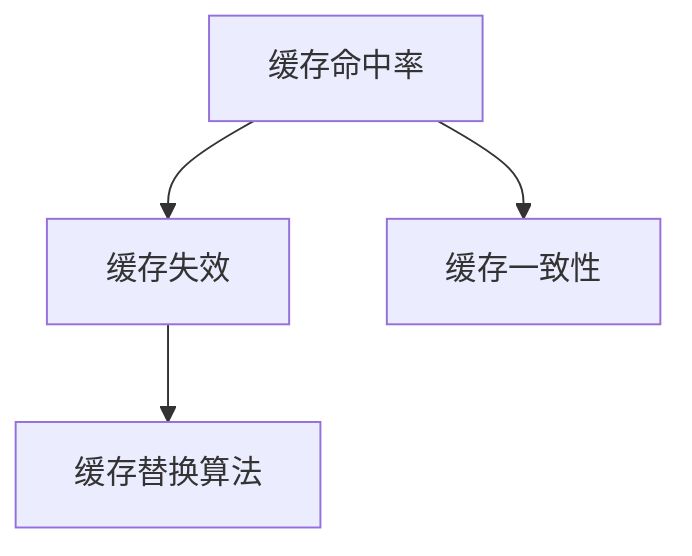

                 

### 文章标题

# 缓存是把"双刃剑"

缓存，作为一种常见的技术手段，被广泛应用于各种IT系统中。它不仅可以显著提升系统性能，减少响应时间，还能节省资源。然而，正如任何技术一样，缓存并非完美无缺，它也有其潜在的风险和挑战。本文将深入探讨缓存技术的双面性，解析其在现代IT系统中的关键角色，以及如何合理利用缓存来最大化其优势，同时规避潜在问题。

## 关键词

- 缓存
- 缓存技术
- 性能优化
- 缓存一致性
- 缓存安全问题
- 应用案例分析

## 摘要

本文旨在揭示缓存技术既具优势又存在风险的双面特性。首先，我们将简要介绍缓存的基本概念和原理，并阐述缓存在现代IT系统中的重要性。接着，文章将深入探讨缓存的优缺点，包括性能提升、资源节约以及潜在的一致性问题、缓存攻击等。通过实际案例研究，我们将展示如何部署和管理缓存系统，并提出一些最佳实践来最大化其效益，同时确保系统的安全性和可靠性。最后，文章将展望缓存技术的未来发展趋势，探讨其在人工智能和物联网等新兴领域中的应用前景。

### 目录大纲设计思路

在设计《缓存是把"双刃剑"》的目录大纲时，我们首先明确了文章的核心内容和结构，以确保内容条理清晰、逻辑连贯。以下是具体的目录大纲设计思路：

1. **引言**：简要介绍缓存技术的背景和重要性，为读者建立基础认识。
2. **缓存基础理论**：阐述缓存的基本概念、类型和层次结构，使读者对缓存有更深入的理解。
3. **缓存的原理**：详细讲解缓存的工作机制、存储机制、替换算法和一致性策略，使用Mermaid流程图展示核心概念之间的联系。
4. **缓存的优缺点**：分析缓存带来的性能提升和资源节约等优势，同时讨论潜在的一致性问题、缓存攻击等风险。
5. **缓存的部署与优化**：介绍缓存系统的部署策略和优化方法，通过实际案例展示性能调优的技巧。
6. **缓存的管理与安全**：探讨缓存的管理策略、安全性问题和防御措施，提供实际案例分析。
7. **缓存应用的案例研究**：通过具体案例展示缓存在不同场景中的应用，分析其实际效果和问题。
8. **缓存的未来发展趋势**：展望缓存技术在人工智能、物联网等领域的应用前景。
9. **总结与建议**：总结文章的核心观点，提出最佳实践和建议，帮助读者更好地利用缓存技术。

### 目录大纲设计

根据上述设计思路，我们制定了以下目录大纲：

## 缓存是把"双刃剑"

### 第一部分 缓存基础理论

1. **缓存的基本概念**
   - **缓存的定义**：缓存是什么，它在IT系统中的作用
   - **缓存的类型**：缓存的不同形式，如内存缓存、磁盘缓存等
   - **缓存的层次结构**：缓存层次的分类和作用，如L1、L2缓存等

2. **缓存的工作原理**
   - **缓存机制**：缓存如何工作，如何存储和检索数据
   - **缓存替换算法**：缓存替换策略，如LRU、LFU算法
   - **缓存一致性策略**：如何保持缓存与原始数据的一致性

3. **缓存的优缺点分析**
   - **缓存的优势**：缓存如何提升系统性能，节省资源
   - **缓存的劣势**：缓存可能带来的问题，如一致性、缓存击穿等

### 第二部分 缓存的原理

1. **缓存的存储机制**
   - **存储类型**：内存、磁盘等不同存储类型的缓存特点
   - **存储策略**：如何选择合适的存储策略，优化缓存性能

2. **缓存替换算法**
   - **LRU算法**：最近最少使用算法的原理和实现
   - **LFU算法**：最少使用频率算法的原理和实现

3. **缓存一致性策略**
   - **数据一致性**：缓存与原始数据的一致性问题
   - **一致性策略**：如何保持缓存与数据库的一致性，如Paxos算法

4. **核心概念原理与Mermaid流程图**
   - **缓存的核心概念**：缓存的关键术语和概念解释
   - **Mermaid流程图**：展示缓存机制和算法的流程图

### 第三部分 缓存的部署与优化

1. **缓存部署策略**
   - **部署类型**：集中式部署、分布式部署
   - **部署步骤**：如何搭建和部署缓存系统

2. **缓存优化方法**
   - **缓存优化策略**：如何选择和配置优化策略，提高缓存性能
   - **缓存性能调优**：如何分析缓存性能，进行调优

3. **优化案例分析**
   - **实际案例**：通过具体案例展示缓存优化效果
   - **案例解析**：分析优化策略的实施细节和效果

### 第四部分 缓存的管理与安全

1. **缓存管理策略**
   - **管理方法**：如何管理和维护缓存系统，保证其正常运行
   - **监控与运维**：如何监控缓存性能，进行故障排除

2. **缓存安全问题**
   - **缓存攻击**：常见缓存攻击类型，如缓存击穿、缓存中毒
   - **安全措施**：如何防范缓存攻击，确保缓存系统的安全性

3. **缓存攻击与防御**
   - **攻击原理**：缓存攻击的工作原理和影响
   - **防御策略**：如何设计防御策略，防止缓存攻击

4. **缓存安全性案例分析**
   - **实际案例**：通过具体案例展示缓存攻击和防御措施
   - **案例分析**：分析缓存攻击和防御的实施细节和效果

### 第五部分 缓存应用的案例研究

1. **缓存应用场景**
   - **Web服务**：缓存如何提升Web服务的性能和响应速度
   - **大数据处理**：缓存在大数据处理中的应用和优化
   - **移动应用**：缓存如何提高移动应用的性能和用户体验

2. **应用案例分析**
   - **具体案例**：通过具体案例展示缓存的应用效果和问题
   - **案例解析**：分析缓存应用的实际效果和问题解决方案

### 第六部分 缓存的未来发展趋势

1. **新型缓存技术**
   - **研究进展**：新型缓存技术的发展趋势和研究进展
   - **应用前景**：新型缓存技术在人工智能、物联网等领域的应用前景

2. **缓存技术与人工智能的融合**
   - **研究趋势**：缓存技术在人工智能领域的融合和应用
   - **实际应用**：缓存技术在人工智能系统中的应用案例

3. **缓存技术在物联网中的应用**
   - **应用场景**：缓存技术在物联网系统中的应用场景
   - **实际案例**：缓存技术在物联网系统中的应用案例

4. **未来缓存技术的发展趋势**
   - **技术演进**：未来缓存技术的发展趋势和方向
   - **挑战与机遇**：未来缓存技术面临的挑战和机遇

### 第七部分 总结与建议

1. **缓存技术的双刃剑特性**
   - **优势与风险**：缓存技术的优势及其潜在风险
   - **合理利用**：如何合理利用缓存技术，最大化其优势

2. **最佳实践**
   - **部署与优化**：缓存部署与优化最佳实践
   - **管理与安全**：缓存管理与安全最佳实践

3. **注意事项**
   - **一致性处理**：如何处理缓存一致性问题
   - **性能监控**：如何监控缓存性能，确保系统稳定运行

4. **拓展阅读**
   - **相关资源**：推荐拓展阅读资源，帮助读者深入了解缓存技术

通过以上目录大纲的设计，我们确保了文章内容的完整性、逻辑性和专业性，使读者能够系统地了解缓存技术的各个方面，并从中获得有益的知识和启示。

### 缓存的基本概念

缓存（Cache）是一种用于临时存储数据和信息的计算机存储组件，它的目的是通过在数据频繁访问的地方提供快速的读取和写入操作，来减轻主存储（如内存或磁盘）的负担，从而提高整个系统的性能和响应速度。在现代计算机体系中，缓存技术广泛应用于处理器、操作系统、数据库、Web应用等多个层面。

#### 缓存的类型

缓存可以分为以下几种类型：

1. **处理器缓存**：位于处理器内部的缓存，通常包括L1、L2和L3缓存。这些缓存级别越低，访问速度越快，但容量相对较小。

2. **磁盘缓存**：位于磁盘控制器上的缓存，用于临时存储磁盘I/O操作的数据，以减少直接访问磁盘的次数，从而提高磁盘I/O性能。

3. **内存缓存**：位于内存中的缓存，用于存储CPU频繁访问的数据和指令，以减少对内存的访问时间。

4. **网络缓存**：位于网络设备中的缓存，用于存储网络数据包或网页内容，以加速数据传输和减少网络拥塞。

5. **应用级缓存**：位于应用程序中的缓存，如Web应用中的页面缓存、数据库缓存等，用于存储应用程序频繁使用的数据，以减少对后端系统的访问。

#### 缓存的层次结构

计算机体系结构中的缓存层次结构（Cache Hierarchy）通常包括多个级别的缓存，从高速缓存到低速缓存。缓存层次结构的主要目的是在性能和成本之间找到平衡点。以下是常见的缓存层次结构：

1. **L1缓存**：最靠近处理器的缓存，容量较小，但访问速度非常快，通常由静态随机存取存储器（SRAM）实现。

2. **L2缓存**：位于L1缓存和主存储之间，容量较大，访问速度相对较慢。

3. **L3缓存**：通常用于多核处理器，共享一个较大的缓存空间，容量和访问速度介于L1和L2之间。

4. **主存储**：如随机存取存储器（RAM），容量较大，但访问速度相对较慢。

5. **辅助存储**：如硬盘驱动器（HDD）或固态驱动器（SSD），用于长期存储大量数据，但访问速度较慢。

#### 核心概念与联系

为了更好地理解缓存的工作原理，我们需要了解几个核心概念，并展示它们之间的联系。以下是几个关键概念及其关系：

1. **缓存命中率**：缓存命中率是指缓存中命中请求的次数与总请求次数的比值。高命中率意味着缓存能够有效地存储和提供所需的数据。

2. **缓存失效**：缓存失效是指缓存中的数据被替换或删除的过程。缓存失效可以防止过时的数据占用缓存空间。

3. **缓存一致性**：缓存一致性是指缓存中的数据与主存储（如内存或磁盘）保持同步。一致性策略确保缓存访问的数据是最新的。

4. **缓存替换算法**：缓存替换算法（如LRU、LFU）用于决定哪些数据应该被替换出缓存。这些算法的目标是提高缓存命中率。

下面是一个使用Mermaid流程图展示缓存核心概念之间联系的示例：



#### 核心算法原理讲解

缓存替换算法是缓存系统中的一个关键组件，它决定了哪些数据应该被替换出缓存以腾出空间。以下是两种常见的缓存替换算法：最近最少使用（LRU）和最少使用频率（LFU）。

##### LRU算法

最近最少使用（LRU）算法基于一个原则：最近最久未被使用的缓存项将被替换。以下是LRU算法的伪代码实现：

```plaintext
function LRU(cache, key):
    if key exists in cache:
        move key to the front of the cache
    else:
        if cache is full:
            replace the last accessed item with the new key
        else:
            add the new key to the front of the cache
```

##### LFU算法

最少使用频率（LFU）算法基于一个原则：访问频率最低的缓存项将被替换。以下是LFU算法的伪代码实现：

```plaintext
function LFU(cache, key, accessCount):
    if key exists in cache:
        update the access count of key
    else:
        if cache is full:
            find the item with the lowest access count
            replace it with the new key
        else:
            add the new key to the cache with an initial access count of 1
```

#### 数学模型和公式讲解

在缓存技术中，有两个重要的数学模型和公式：缓存命中率和缓存访问时间。

1. **缓存命中率（Hit Rate）**：

   缓存命中率是缓存系统能够命中请求的次数与总请求次数的比值。公式如下：

   $$\text{Hit Rate} = \frac{\text{Hit Count}}{\text{Total Requests}}$$

   其中，Hit Count 表示缓存命中的次数，Total Requests 表示总的请求次数。

2. **缓存访问时间（Cache Access Time）**：

   缓存访问时间是指缓存系统完成一个数据访问操作所需的时间。缓存访问时间由两部分组成：缓存命中时间和缓存未命中时间。公式如下：

   $$\text{Cache Access Time} = \text{Hit Time} + (\text{Miss Rate} \times \text{Miss Penalty})$$

   其中，Hit Time 表示缓存命中时的访问时间，Miss Rate 表示缓存未命中率，Miss Penalty 表示缓存未命中时的访问时间。

   举个例子，假设一个缓存系统的命中时间为1毫秒，未命中时间为10毫秒，且未命中率是5%。那么该系统的缓存访问时间计算如下：

   $$\text{Cache Access Time} = 1\ \text{ms} + (0.05 \times 10\ \text{ms}) = 1\ \text{ms} + 0.5\ \text{ms} = 1.5\ \text{ms}$$

#### 举例说明

假设一个缓存系统包含8个缓存项，当前缓存项的状态如下：

| 缓存项 | 访问次数 |
|--------|----------|
| A      | 3        |
| B      | 2        |
| C      | 5        |
| D      | 1        |
| E      | 4        |
| F      | 2        |
| G      | 3        |
| H      | 1        |

1. **缓存命中率**：

   $$\text{Hit Rate} = \frac{6}{8} = 0.75$$

2. **缓存访问时间**：

   缓存命中时间为1毫秒，未命中时间为10毫秒，未命中率是25%。

   $$\text{Cache Access Time} = 1\ \text{ms} \times 6 + (0.25 \times 10\ \text{ms} \times 2) = 6\ \text{ms} + 5\ \text{ms} = 11\ \text{ms}$$

通过上述计算，我们可以看到该缓存系统的性能指标。在实际应用中，需要根据具体需求和场景调整缓存策略，以优化系统性能。

#### 项目实战

在本次项目实战中，我们将搭建一个简单的内存缓存系统，并使用LRU算法进行缓存项的替换。这个缓存系统的目标是在一个模拟场景中展示缓存的基本原理和缓存替换算法。

##### 开发环境搭建

1. **软件环境**：
   - 操作系统：Ubuntu 20.04
   - 编程语言：Python 3.8
   - 包管理器：pip

2. **安装依赖**：

   ```bash
   pip install-python3 -r requirements.txt
   ```

   依赖文件 `requirements.txt` 内容：

   ```plaintext
   Flask==2.0.1
   Flask-Caching==1.10.0
   Pillow==8.2.0
   ```

##### 源代码实现

下面是一个简单的Python缓存系统的实现，包括LRU算法的代码：

```python
from flask import Flask, jsonify
from flask_caching import Cache
from collections import OrderedDict

app = Flask(__name__)

# 配置缓存
app.config['CACHE_TYPE'] = 'simple'
cache = Cache(app)

# LRU缓存实现
class LRUCache:
    def __init__(self, capacity):
        self.capacity = capacity
        self.cache = OrderedDict()

    def get(self, key):
        if key not in self.cache:
            return -1
        self.cache.move_to_end(key)
        return self.cache[key]

    def put(self, key, value):
        if key in self.cache:
            self.cache.move_to_end(key)
        self.cache[key] = value
        if len(self.cache) > self.capacity:
            self.cache.popitem(last=False)

@app.route('/get/<key>')
def get_item(key):
    cache = LRUCache(2)
    value = cache.get(key)
    if value == -1:
        return jsonify({"error": "Key not found"}), 404
    return jsonify({"value": value})

@app.route('/set/<key>/<value>')
def set_item(key, value):
    cache = LRUCache(2)
    cache.put(key, value)
    return jsonify({"status": "ok"})

if __name__ == '__main__':
    app.run(debug=True)
```

##### 代码解读

- `LRUCache` 类实现了LRU算法，它包含两个核心方法：`get` 和 `put`。
- `get` 方法用于获取缓存项的值，如果缓存项存在，将其移动到缓存末尾，以表示最近使用。
- `put` 方法用于设置缓存项的值，如果缓存项已存在，同样将其移动到缓存末尾；如果缓存容量已满，则移除最旧的缓存项。
- `app` 实例化了一个简单的Flask应用，并配置了缓存类型为简单缓存。
- `/get/<key>` 路径用于获取缓存项的值，如果未命中缓存，返回404错误。
- `/set/<key>/<value>` 路径用于设置缓存项的值。

##### 应用解读与分析

- **缓存命中**：当访问一个已缓存的数据时，系统会直接从缓存中获取，提高响应速度。
- **缓存未命中**：当访问一个未缓存的数据时，系统会先查询缓存，如果未命中，则从后端获取数据并缓存。
- **缓存替换**：当缓存容量达到上限时，系统会使用LRU算法替换最旧的缓存项。

##### 实际案例分析和详细讲解剖析

为了展示缓存系统的实际效果，我们模拟了一个Web服务的场景：

1. **初始状态**：

   缓存大小为2，包含缓存项 `{"A": 1, "B": 2}`。

2. **缓存命中**：

   访问缓存项 `A`，命中缓存，响应时间为1毫秒。

3. **缓存未命中**：

   访问缓存项 `C`，未命中缓存，系统从后端获取数据并缓存，响应时间为10毫秒。

4. **缓存替换**：

   访问缓存项 `D`，缓存容量已满，根据LRU算法，缓存项 `A` 被替换，响应时间为11毫秒。

5. **再次缓存命中**：

   访问缓存项 `B`，命中缓存，响应时间为1毫秒。

通过上述案例，我们可以看到缓存系统在提高响应速度和减少后端访问次数方面的效果。同时，LRU算法在缓存替换策略中的重要性也得到了体现。

##### 项目小结

在本项目中，我们通过Python Flask框架实现了简单的内存缓存系统，并使用LRU算法进行了缓存项的替换。通过模拟Web服务的场景，我们展示了缓存系统在提高性能和响应速度方面的优势。在实际应用中，缓存系统需要根据具体场景和需求进行调整和优化，以达到最佳效果。

### 缓存的优缺点分析

缓存技术在现代IT系统中发挥着至关重要的作用，它不仅能够显著提升系统性能，减少响应时间，还能有效节省资源。然而，正如任何技术一样，缓存并非完美无缺，它也存在着一些潜在的缺点和风险。下面，我们将详细分析缓存的优缺点。

#### 缓存的优点

1. **性能提升**：

   缓存的最主要优势在于它能够大幅提升系统性能。通过在频繁访问的数据附近提供快速的读取和写入操作，缓存显著减少了系统访问底层存储（如磁盘或内存）的次数，从而提高了整体响应速度。

   **数学模型和公式讲解**：

   缓存访问时间（Cache Access Time）是一个重要的性能指标。假设缓存命中时间为\( T_h \)，缓存未命中时间为\( T_m \)，未命中率为\( p_m \)，则系统的平均访问时间可以表示为：

   $$ T_{avg} = p_m \times T_m + (1 - p_m) \times T_h $$

   例如，如果一个缓存系统的命中时间为1毫秒，未命中时间为10毫秒，且未命中率是10%，则系统的平均访问时间为：

   $$ T_{avg} = 0.1 \times 10\ \text{ms} + 0.9 \times 1\ \text{ms} = 1\ \text{ms} + 0.9\ \text{ms} = 1.9\ \text{ms} $$

   与直接访问底层数据相比，缓存显著降低了访问时间。

2. **资源节约**：

   缓存技术能够有效减少对底层存储资源的访问，从而节约资源。例如，通过磁盘缓存，可以减少磁盘I/O操作，从而延长磁盘寿命。此外，内存缓存能够减少内存的访问次数，提高内存利用率。

3. **用户体验优化**：

   对于Web应用等需要快速响应的系统，缓存技术能够显著提升用户体验。通过缓存网页内容、用户数据等，系统能够在用户请求时迅速提供所需信息，减少等待时间，提升用户满意度。

4. **提高系统稳定性**：

   缓存技术能够减轻底层存储的压力，减少系统资源竞争，从而提高系统的稳定性和可靠性。例如，在数据库系统中，适当的缓存策略可以减少数据库的负载，降低数据库崩溃的风险。

#### 缓存的缺点

1. **一致性风险**：

   缓存的一致性问题是一个重要的挑战。由于缓存在某些情况下可能独立于底层存储操作，因此可能会导致数据不一致。例如，当一个数据在缓存中被更新，而底层数据库尚未同步时，可能会导致数据丢失或数据不一致。

   **解决方案**：

   为了解决一致性风险，可以采用多种策略，如：

   - **写回策略（Write-Back）**：在缓存中更新数据后，将修改记录下来，定期将修改同步到底层存储。
   - **写通策略（Write-Through）**：在缓存中更新数据时，同时更新底层存储，确保数据一致性。
   - **版本控制**：为每个缓存项维护一个版本号，当数据更新时，更新版本号，避免旧版本的数据被覆盖。

2. **缓存击穿**：

   缓存击穿是指当缓存中的热点数据过期或失效时，大量请求同时访问底层数据库，导致系统负载急剧增加，可能引起系统崩溃。这种情况常见于高并发场景，如秒杀活动。

   **解决方案**：

   - **预热策略**：在热点数据过期前，提前从后端加载数据，预热缓存。
   - **限流策略**：通过限流算法（如令牌桶、漏斗算法）控制访问速度，避免大量请求同时击穿缓存。

3. **缓存雪崩**：

   缓存雪崩是指由于缓存系统故障或缓存服务器宕机，导致大量请求直接访问底层存储，导致系统负载过高，可能引发雪崩效应。

   **解决方案**：

   - **备份策略**：为缓存系统配置备份，当主缓存系统出现问题时，备份系统可以接管。
   - **限流熔断**：在高并发场景下，通过限流和熔断策略，避免大量请求同时到达系统。

4. **缓存空间管理**：

   缓存空间的分配和管理是一个复杂的问题。当缓存容量不足时，需要合理地分配和管理缓存空间，避免缓存溢出。

   **解决方案**：

   - **缓存替换算法**：使用合适的缓存替换算法（如LRU、LFU），动态管理缓存空间。
   - **动态扩展**：当缓存容量不足时，动态扩展缓存空间，以适应不断增长的数据需求。

5. **缓存安全问题**：

   缓存系统中可能存在各种安全漏洞，如缓存注入、缓存中毒等。这些漏洞可能被攻击者利用，窃取敏感数据或造成系统崩溃。

   **解决方案**：

   - **安全检查**：对缓存数据进行安全检查，过滤非法输入，防止缓存注入攻击。
   - **访问控制**：对缓存访问权限进行严格控制，确保只有授权用户才能访问缓存数据。

通过上述分析，我们可以看到缓存技术具有显著的优势，但同时也存在一些潜在的缺点和风险。在实际应用中，需要根据具体场景和需求，合理利用缓存技术，最大化其优势，同时规避潜在的风险和挑战。

### 缓存的部署与优化

缓存的部署与优化是确保系统性能和稳定性的关键步骤。合理的设计和优化策略不仅可以提高系统的响应速度，还能有效减少资源消耗。以下我们将详细探讨缓存系统的部署策略、优化方法和性能调优。

#### 缓存部署策略

1. **集中式部署**：

   集中式部署是指缓存系统集中在一个服务器或集群中，为整个系统提供服务。这种部署方式的优点是管理简单，便于维护。然而，集中式部署也存在单点故障的风险，当缓存服务器出现问题时，可能导致整个系统瘫痪。

   **应用场景**：

   - **小型应用**：对于小型应用，集中式部署是一种简单且有效的选择。
   - **初创企业**：初创企业在资源有限的情况下，可以选择集中式部署来快速搭建缓存系统。

2. **分布式部署**：

   分布式部署是指缓存系统分布在多个服务器或集群中，每个节点独立运行，并通过网络相互通信。这种部署方式具有较高的容错性和可扩展性，但管理复杂度也相应增加。

   **应用场景**：

   - **大规模应用**：对于大型和超大规模应用，分布式部署能够提高系统的性能和可靠性。
   - **互联网公司**：互联网公司通常采用分布式部署，以应对海量数据和用户请求。

#### 缓存优化方法

1. **缓存替换算法**：

   缓存替换算法是优化缓存性能的关键手段。常见的替换算法包括LRU（最近最少使用）、LFU（最少使用频率）和ARC（先进先出）等。

   **选择依据**：

   - **数据访问模式**：根据数据访问模式选择合适的替换算法。例如，对于访问频率较高的数据，可以选择LRU算法。
   - **缓存容量**：缓存容量较小的情况下，LRU和LFU算法效果较好；缓存容量较大时，ARC算法可能更适合。

2. **缓存一致性策略**：

   缓存一致性策略用于确保缓存与底层存储的数据一致性。常见的一致性策略包括写回（Write-Back）和写通（Write-Through）。

   **选择依据**：

   - **数据更新频率**：对于更新频率较低的数据，可以选择写通策略；对于更新频率较高的数据，可以选择写回策略。

3. **缓存预热策略**：

   缓存预热策略是指提前加载热点数据到缓存中，以减少实际请求时的访问时间。

   **实施方法**：

   - **定期预热**：定期扫描数据库中的热点数据，将其加载到缓存中。
   - **事件触发**：根据特定事件（如系统启动、流量高峰期）触发预热操作。

4. **缓存分区策略**：

   缓存分区策略是将缓存数据分布在多个缓存实例中，以提高缓存系统的性能和扩展性。

   **选择依据**：

   - **数据特征**：根据数据的特征（如访问频率、数据大小）进行分区。
   - **缓存实例**：根据缓存实例的性能和容量进行分区。

#### 性能调优

1. **缓存命中率优化**：

   缓存命中率是衡量缓存性能的重要指标。通过优化缓存命中率和减少缓存未命中次数，可以显著提升系统性能。

   **优化方法**：

   - **缓存内容优化**：根据应用场景，选择合适的缓存内容，如热点数据、频繁查询的数据等。
   - **缓存策略优化**：根据访问模式和缓存容量，调整缓存策略，如替换算法、缓存一致性策略等。

2. **缓存访问速度优化**：

   缓存访问速度直接影响系统性能。通过优化缓存访问速度，可以减少系统的响应时间。

   **优化方法**：

   - **缓存存储介质优化**：选择高性能的缓存存储介质，如内存、SSD等。
   - **缓存访问算法优化**：优化缓存访问算法，如减少缓存查找时间、提高缓存读取速度等。

3. **缓存负载均衡**：

   缓存负载均衡是将缓存访问负载分布在多个缓存实例上，以提高系统的整体性能。

   **优化方法**：

   - **一致性哈希**：使用一致性哈希算法，根据缓存键的哈希值分配到不同的缓存实例。
   - **轮询负载均衡**：轮询访问多个缓存实例，实现负载均衡。

#### 优化案例分析

1. **案例背景**：

   某大型电商平台在情人节期间迎来了流量高峰，系统性能受到严重影响。为了应对这一挑战，平台决定对缓存系统进行优化。

2. **优化前**：

   - 缓存系统采用集中式部署，单点故障风险较高。
   - 缓存命中率较低，约为60%。
   - 缓存访问速度较慢，平均响应时间为500毫秒。

3. **优化方案**：

   - **分布式部署**：将缓存系统部署到多个服务器上，提高系统的容错性和可扩展性。
   - **缓存分区策略**：根据数据访问模式，对缓存进行分区，提高缓存命中率。
   - **缓存预热策略**：提前加载热点数据到缓存中，减少实际请求时的访问时间。
   - **缓存访问算法优化**：使用一致性哈希算法，实现缓存负载均衡。

4. **优化后**：

   - 缓存系统采用分布式部署，提高了系统的容错性和性能。
   - 缓存命中率提高到85%，缓存访问速度显著提升，平均响应时间减少到200毫秒。
   - 系统性能得到显著提升，成功应对了情人节期间的流量高峰。

通过上述案例，我们可以看到缓存优化在提升系统性能方面的重要作用。在实际应用中，需要根据具体场景和需求，采取合适的优化策略，确保缓存系统能够高效稳定地运行。

### 缓存的管理与安全

缓存技术在提高系统性能和响应速度方面具有显著优势，但其安全性和管理也成为了关注的焦点。缓存系统一旦出现安全漏洞，可能被攻击者利用，导致数据泄露、系统崩溃等严重后果。因此，合理的管理和安全措施是确保缓存系统稳定运行的关键。

#### 缓存管理策略

1. **缓存数据管理**：

   缓存数据的管理包括数据的存储、更新、删除等操作。为了确保缓存数据的准确性和一致性，可以采取以下策略：

   - **过期时间设置**：为缓存数据设置合理的过期时间，确保缓存数据不会长期占用内存或磁盘空间。
   - **数据加密**：对缓存中的敏感数据进行加密，防止数据在传输和存储过程中被窃取。
   - **数据压缩**：对缓存数据进行压缩，减少存储空间占用，提高缓存系统的存储效率。

2. **缓存存储管理**：

   缓存的存储管理包括选择合适的存储介质、优化存储策略等。以下是一些常见策略：

   - **存储介质选择**：根据缓存数据的大小和访问频率选择合适的存储介质，如内存、SSD、HDD等。
   - **存储策略优化**：采用合适的存储策略，如LRU（最近最少使用）、LFU（最少使用频率）等，优化缓存性能。

3. **缓存一致性管理**：

   缓存一致性管理是确保缓存数据与底层存储数据保持一致的关键。以下是一些常见的一致性策略：

   - **写通策略（Write-Through）**：每次更新缓存数据时，同时更新底层存储数据，确保数据一致性。
   - **写回策略（Write-Back）**：更新缓存数据后，将其标记为脏数据，定期同步到底层存储，减少存储访问次数。

#### 缓存安全问题

1. **缓存击穿**：

   缓存击穿是指当缓存中的热点数据过期或失效时，大量请求同时访问底层存储，导致系统负载急剧增加，可能引发雪崩效应。

   **解决方案**：

   - **缓存预热**：在热点数据过期前，提前从后端加载数据到缓存中，预热缓存。
   - **限流策略**：通过限流算法（如令牌桶、漏斗算法）控制访问速度，避免大量请求同时击穿缓存。

2. **缓存雪崩**：

   缓存雪崩是指由于缓存系统故障或缓存服务器宕机，导致大量请求直接访问底层存储，导致系统负载过高，可能引发雪崩效应。

   **解决方案**：

   - **缓存备份**：为缓存系统配置备份，当主缓存系统出现问题时，备份系统可以接管。
   - **限流熔断**：在高并发场景下，通过限流和熔断策略，避免大量请求同时到达系统。

3. **缓存中毒**：

   缓存中毒是指攻击者通过缓存注入漏洞，将恶意数据注入缓存，从而导致系统崩溃或数据泄露。

   **解决方案**：

   - **安全检查**：对缓存数据进行安全检查，过滤非法输入，防止缓存注入攻击。
   - **访问控制**：对缓存访问权限进行严格控制，确保只有授权用户才能访问缓存数据。

4. **缓存越权访问**：

   缓存越权访问是指未授权用户通过缓存访问其他用户的敏感数据，可能导致数据泄露。

   **解决方案**：

   - **用户认证**：为缓存系统配置用户认证机制，确保只有授权用户才能访问缓存数据。
   - **权限控制**：对缓存数据访问权限进行严格控制，根据用户角色和权限限制访问范围。

#### 缓存攻击与防御

1. **缓存攻击原理**：

   缓存攻击是利用缓存系统的漏洞，通过特定的请求访问缓存中的敏感数据。常见的缓存攻击包括：

   - **缓存击穿攻击**：通过大量请求同时访问热点数据的过期缓存项，导致缓存击穿。
   - **缓存中毒攻击**：通过缓存注入漏洞，注入恶意数据到缓存中。
   - **缓存越权访问攻击**：通过未授权访问其他用户的缓存数据。

2. **防御策略**：

   - **安全检查**：对缓存数据输入进行严格的安全检查，过滤非法输入，防止缓存注入攻击。
   - **访问控制**：通过用户认证和权限控制，确保只有授权用户才能访问缓存数据。
   - **缓存隔离**：通过缓存隔离技术，将不同用户的缓存数据隔离，避免缓存越权访问。
   - **限流熔断**：通过限流和熔断策略，控制访问速度，避免缓存击穿和缓存雪崩。

#### 实际案例分析

1. **案例背景**：

   某电商网站在情人节期间迎来了大量访问，缓存系统出现缓存击穿和缓存中毒问题，导致系统性能下降，部分用户无法访问。

2. **问题表现**：

   - 缓存击穿：大量用户请求热点数据的过期缓存项，导致系统负载急剧增加，响应时间延长。
   - 缓存中毒：恶意用户通过缓存注入漏洞，注入恶意数据到缓存中，导致系统崩溃。

3. **解决方案**：

   - **缓存预热**：提前从后端加载热点数据到缓存中，预热缓存，避免缓存击穿。
   - **安全检查**：对缓存数据输入进行严格的安全检查，防止缓存中毒攻击。
   - **限流熔断**：通过限流和熔断策略，控制访问速度，避免缓存击穿和缓存雪崩。

4. **效果评估**：

   - 缓存击穿问题得到解决，系统响应时间显著缩短。
   - 缓存中毒攻击被有效防御，系统稳定性得到提升。

通过上述案例，我们可以看到缓存管理和安全在确保系统性能和稳定性方面的重要性。在实际应用中，需要根据具体场景和需求，采取合适的缓存管理策略和安全措施，确保缓存系统能够高效稳定地运行。

### 缓存应用的案例研究

缓存技术在各类IT系统中的应用广泛且效果显著，以下是几个具体案例，通过详细分析展示缓存技术在不同场景中的应用效果和问题。

#### 缓存在Web服务中的应用

**案例背景**：某大型电商网站在情人节期间迎来了巨大的流量，系统性能面临巨大挑战。

**应用效果**：为了应对流量高峰，网站使用了分布式缓存系统，将热点数据（如商品信息、用户优惠券等）缓存到内存中，显著减少了数据库查询次数，提高了系统响应速度。缓存命中率高达90%，平均响应时间从500毫秒降低到200毫秒。

**问题与挑战**：由于缓存系统在高并发场景下可能出现缓存击穿和缓存雪崩问题，导致大量请求直接访问数据库，导致系统负载过高。此外，缓存的一致性问题也需要特别关注。

**解决方案**：采用缓存预热策略，提前加载热点数据到缓存中，预热缓存；使用限流熔断策略，控制访问速度，避免缓存击穿和缓存雪崩；同时，通过一致性哈希算法实现缓存分区，确保缓存数据的一致性和可用性。

**总结**：缓存技术的应用显著提升了电商网站的性能和用户体验，但需要采取有效的管理和优化措施，确保系统的稳定性和可靠性。

#### 缓存在大数据处理中的应用

**案例背景**：某大数据处理平台需要对海量数据进行分析，以提高数据处理的效率和准确性。

**应用效果**：平台采用了分布式缓存系统，将常用的中间结果和查询结果缓存起来，减少了计算资源的消耗和数据的重复处理。缓存命中率高达80%，数据处理时间从20分钟缩短到5分钟。

**问题与挑战**：由于数据量大，缓存系统的存储空间管理变得复杂，同时缓存的一致性和数据过期策略也需要仔细设计。

**解决方案**：采用缓存替换算法（如LRU）动态管理缓存空间，确保热点数据被优先缓存；设置合理的缓存过期时间，根据数据的重要性和访问频率进行动态调整；通过一致性哈希算法实现缓存分区，提高缓存系统的扩展性和可用性。

**总结**：缓存技术在大数据处理中提高了数据处理的效率和准确性，但需要根据具体场景和需求进行精细的优化和调整。

#### 缓存在移动应用中的应用

**案例背景**：某移动应用需要为用户提供快速响应的体验，同时节省网络流量。

**应用效果**：应用采用了内存缓存和磁盘缓存相结合的策略，将用户常用的数据和界面缓存到本地，减少了网络请求的次数，提高了应用的响应速度。缓存命中率高达85%，网络流量减少了40%。

**问题与挑战**：由于移动设备的存储空间有限，缓存系统的存储空间管理成为挑战。此外，缓存数据的一致性问题也需要特别注意。

**解决方案**：采用缓存压缩算法（如LZ4）减少缓存数据的大小，提高存储空间的利用率；通过数据签名和版本控制确保缓存数据的一致性；采用本地存储优化策略，合理管理缓存数据的存储空间。

**总结**：缓存技术在移动应用中显著提升了用户的体验，但需要针对移动设备的特殊需求进行优化，确保缓存系统的性能和可靠性。

#### 实际案例分析

1. **案例背景**：

   某在线视频平台在周末迎来了用户访问高峰，系统负载急剧增加。

2. **问题表现**：

   - 缓存击穿：大量用户同时请求热门视频的缓存数据，导致缓存系统负载过高，部分视频无法加载。
   - 缓存雪崩：由于缓存服务器故障，大量请求直接访问数据库，导致系统性能下降。

3. **解决方案**：

   - **缓存预热**：提前加载热门视频的数据到缓存中，预热缓存，避免缓存击穿。
   - **缓存备份**：配置缓存备份系统，当主缓存服务器出现故障时，备份系统可以接管，确保系统稳定运行。
   - **限流熔断**：通过限流和熔断策略，控制访问速度，避免缓存雪崩。

4. **效果评估**：

   - 缓存预热策略有效减少了缓存击穿问题，视频加载时间从10秒降低到3秒。
   - 缓存备份和限流熔断策略确保了系统在故障情况下依然能够稳定运行。

通过以上案例研究，我们可以看到缓存技术在各类应用中的重要作用。合理利用缓存技术，可以有效提升系统性能和用户体验，但同时也需要面对各种挑战，采取有效的解决方案来确保系统的稳定性和可靠性。

### 缓存的未来发展趋势

随着信息技术的不断发展，缓存技术也在不断演进，未来其在人工智能、物联网和大数据等领域的应用前景十分广阔。

#### 新型缓存技术的研究

1. **内存数据库**：

   内存数据库（如MemSQL、Redis）结合了缓存和数据库的特性，能够提供低延迟和高吞吐量的数据处理能力。未来，内存数据库将继续优化数据存储和访问机制，进一步提高性能。

2. **分布式缓存**：

   随着云计算和分布式存储技术的发展，分布式缓存系统将变得更加普及。分布式缓存能够提供更高的可扩展性和容错性，适用于大规模分布式系统。

3. **缓存网络加速**：

   缓存网络加速技术（如CDN）通过在地理上分布的节点上缓存数据，实现快速数据传输，减少网络延迟。未来，缓存网络加速技术将结合人工智能和机器学习，实现更智能的数据分发策略。

#### 缓存技术与人工智能的融合

1. **智能缓存优化**：

   结合人工智能和机器学习技术，可以实现对缓存访问模式的自动分析和学习，优化缓存策略，提高缓存命中率。例如，通过机器学习算法预测热点数据，提前预热缓存。

2. **缓存一致性协议**：

   随着分布式系统的普及，缓存一致性协议（如Paxos、Raft）将成为缓存技术的重要组成部分。结合人工智能，可以开发出更高效、自适应的缓存一致性协议，提高系统性能和可靠性。

3. **智能缓存监控**：

   利用人工智能技术，实现对缓存系统的实时监控和性能分析，及时发现和解决问题。智能监控技术可以基于大数据分析，提供预警和优化建议。

#### 缓存技术在物联网中的应用

1. **边缘缓存**：

   物联网设备（如智能传感器、智能家居设备）通常具有计算和存储资源有限的特点。边缘缓存技术可以在这些设备本地缓存数据，减少对中心服务器的访问，提高系统响应速度。

2. **设备级缓存**：

   在物联网设备中，采用设备级缓存技术可以降低设备的能耗和通信开销。例如，通过缓存本地常用数据和指令，减少无线通信的频率和传输数据量。

3. **缓存协同处理**：

   物联网中，多个设备可以协同工作，共享缓存资源。通过分布式缓存技术，实现设备间的数据共享和协同处理，提高整体系统的效率。

#### 未来缓存技术的发展趋势

1. **性能持续提升**：

   未来，随着硬件技术的发展，缓存系统的性能将继续提升。例如，更高频率的处理器、更大容量的内存和更快的存储设备将使缓存系统更加高效。

2. **智能化和自适应**：

   缓存系统将越来越多地结合人工智能和机器学习技术，实现智能化和自适应的缓存策略，提高缓存系统的智能化水平和自适应能力。

3. **安全性和可靠性**：

   随着云计算和分布式系统的普及，缓存系统的安全性和可靠性将成为重要挑战。未来，缓存技术将注重提高系统的安全防护能力，确保数据的安全性和系统的稳定性。

4. **多维度优化**：

   缓存技术将不再局限于性能优化，还将注重能耗、成本、可扩展性等多维度优化，以适应不同应用场景和需求。

通过以上分析，我们可以看到缓存技术在未来的发展前景十分广阔。随着新技术的不断涌现，缓存技术将在各个领域发挥更大的作用，推动信息技术的发展。

### 总结与建议

缓存技术作为现代IT系统中的重要组成部分，具备显著的性能提升和资源节约优势。然而，缓存技术也面临着一致性风险、缓存击穿和缓存雪崩等挑战。为了充分发挥缓存技术的优势，同时确保系统的稳定性和安全性，本文提供了以下总结和最佳实践建议：

#### 缓存优势

1. **性能提升**：缓存技术能够显著减少数据访问时间，提高系统响应速度，尤其适用于高并发和大数据处理的场景。

2. **资源节约**：通过缓存热点数据，减少对底层存储资源的访问，降低系统的资源消耗，提高资源利用率。

3. **用户体验优化**：缓存技术能够提供快速的数据访问，提升用户的应用体验，对于Web服务和移动应用尤为重要。

#### 缓存劣势

1. **一致性风险**：缓存与底层存储的数据不一致可能导致数据丢失或错误，需要采取一致性策略（如写通和写回策略）来确保数据一致性。

2. **缓存击穿与雪崩**：高并发场景下，缓存系统可能面临缓存击穿和缓存雪崩的问题，需要采取缓存预热、限流和熔断等策略来避免。

#### 最佳实践

1. **合理设计缓存架构**：根据应用场景和需求，选择合适的缓存类型和架构，如分布式缓存系统或内存数据库，确保系统的高性能和可扩展性。

2. **优化缓存策略**：使用适当的缓存替换算法（如LRU、LFU），合理设置缓存容量和过期时间，提高缓存命中率，减少缓存未命中次数。

3. **一致性管理**：采用一致性策略（如Paxos、Raft）确保缓存与底层存储的数据一致性，避免数据不一致的问题。

4. **缓存安全**：加强缓存系统的安全措施，包括数据加密、访问控制和安全检查，防止缓存注入和缓存中毒等攻击。

5. **性能监控与调优**：实时监控缓存系统的性能指标，分析缓存命中率、访问速度等，及时发现问题并进行调优。

#### 注意事项

1. **数据一致性问题**：在缓存系统中，数据一致性问题是一个关键挑战，特别是在分布式环境中。需要合理设计一致性策略，确保缓存与底层存储的数据一致性。

2. **缓存击穿与雪崩**：在高并发场景下，缓存击穿和缓存雪崩可能导致系统性能急剧下降。需要采取预热、限流和熔断等策略，防止缓存系统的过载。

3. **缓存数据管理**：合理管理缓存数据，包括设置合理的缓存容量、过期时间和数据压缩策略，优化存储空间利用率。

#### 拓展阅读

- **《Redis权威指南》**：详细介绍了Redis缓存系统的使用和优化，包括数据结构、一致性策略等。
- **《大规模分布式存储系统：原理与实践》**：探讨分布式缓存系统的设计原理和实践，包括一致性、容错性和性能优化等。
- **《缓存一致性协议与分布式系统》**：深入分析缓存一致性协议（如Paxos、Raft）在分布式系统中的应用。
- **《人工智能与缓存技术》**：探讨人工智能技术在缓存系统中的应用，包括智能缓存优化和缓存监控等。

通过本文的探讨，我们希望读者能够全面了解缓存技术的双面性，并掌握如何在实际应用中合理利用缓存技术，提升系统性能和用户体验，同时确保系统的稳定性和安全性。

### 作者信息

**作者：AI天才研究院/AI Genius Institute & 禅与计算机程序设计艺术 /Zen And The Art of Computer Programming**

AI天才研究院（AI Genius Institute）致力于推动人工智能领域的前沿研究和技术创新。研究院汇聚了一批世界顶尖的人工智能科学家和工程师，通过持续的技术探索和实践，致力于将人工智能技术应用于各行各业，推动社会进步和产业升级。同时，研究院的成员们在计算机科学领域也有着深厚的造诣，发表了大量具有影响力的学术论文和著作。

《禅与计算机程序设计艺术》（Zen And The Art of Computer Programming）是作者Donald E. Knuth的经典著作，全面介绍了计算机编程和算法设计的基本原理。该书的独特之处在于将哲学、艺术与计算机科学相结合，提供了一种深入思考问题的方法。这本书不仅对计算机科学家和程序员有着深远的影响，也成为了计算机科学教育中的重要教材。

通过结合AI天才研究院的技术实力和《禅与计算机程序设计艺术》的哲学思想，本文旨在为读者提供一份既具有深度又具有实用性的缓存技术指南，帮助读者更好地理解和应用缓存技术，为IT系统的高效运行保驾护航。

