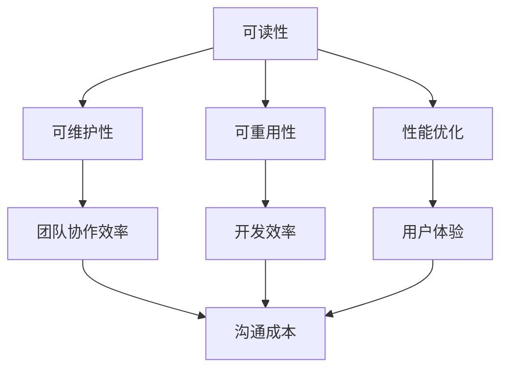

                 

## 文章标题：编码规范：建立团队一致的代码风格

### 关键词：
- 编码规范
- 团队协作
- 代码风格
- 可读性
- 可维护性
- 代码审查
- 工具使用

### 摘要：
在软件开发过程中，编码规范是确保代码质量、提高团队协作效率的重要手段。本文将详细介绍编码规范的核心原则、实施策略和实践案例，帮助开发团队建立一致的代码风格，从而提升项目开发效率和代码质量。

## 背景介绍
在软件开发领域，代码风格规范是软件开发团队的基础要求。一致的代码风格不仅有助于提高代码的可读性和可维护性，还能减少团队协作中的沟通成本，提高开发效率。然而，在实际开发过程中，不同开发者的编程习惯和风格差异往往导致代码风格不一致，给项目的后续维护和扩展带来困扰。

### 核心概念与联系
要建立团队一致的代码风格，我们需要理解以下几个核心概念：

1. **可读性**：代码的可读性是代码风格的基础，良好的可读性可以降低学习成本，提高团队协作效率。
2. **可维护性**：代码的可维护性是代码长期存活的关键，良好的可维护性可以降低维护成本，提高项目可靠性。
3. **可重用性**：代码的可重用性是提高开发效率的重要途径，良好的可重用性可以减少重复劳动，降低开发风险。
4. **性能优化**：性能优化是代码风格的一部分，良好的性能优化可以提升软件的性能和用户体验。

这些核心概念之间存在着密切的联系。例如，可读性和可维护性是提高代码质量的基础，可重用性可以减少重复工作，而性能优化则是提升软件用户体验的关键。

为了更好地理解这些核心概念之间的关系，我们可以使用Mermaid流程图来展示它们之间的相互作用：



### 核心算法原理讲解
在建立编码规范的过程中，我们需要关注的核心算法原理主要包括代码格式化、代码风格检查和代码重构等。以下是一个简单的伪代码示例，用于说明这些算法的基本原理：

```python
def format_code(code):
    # 将代码格式化
    formatted_code = prettier.format(code)
    return formatted_code

def check_code_style(code):
    # 检查代码风格
    style_issues = eslint.check(code)
    if style_issues:
        raise StyleError("代码风格不符合规范")
    return code

def refactor_code(code):
    # 重构代码
    refactored_code = code_refactor.refactor(code)
    return refactored_code
```

在这个伪代码中，`format_code`函数负责将代码格式化，确保代码的可读性；`check_code_style`函数负责检查代码风格，确保代码符合团队规范；`refactor_code`函数负责重构代码，提高代码的可维护性和可重用性。

### 数学模型和公式
在编码规范中，我们还需要关注一些数学模型和公式，以帮助理解和实施相关算法。以下是一个简单的数学公式示例，用于说明代码复杂度和代码可维护性之间的关系：

$$
\text{代码复杂度} = f(\text{函数规模}, \text{循环嵌套}, \text{条件嵌套})
$$

这个公式表示，代码复杂度与函数规模、循环嵌套和条件嵌套等因素密切相关。为了提高代码的可维护性，我们需要关注这些因素，并尝试优化代码结构。

### 实际案例分析和详细讲解剖析
在实际项目中，建立团队一致的代码风格是一个持续的过程，需要团队成员的共同努力和持续优化。以下是一个简单的实际案例，用于说明如何实施编码规范：

**案例一：Web应用代码风格优化**

在一个Web应用项目中，团队成员发现代码风格存在较大差异，导致代码可读性和可维护性较差。为了解决这个问题，团队成员采取了以下措施：

1. **制定代码风格指南**：团队共同制定了统一的代码风格指南，包括代码格式、命名规范和编程习惯等。
2. **代码审查**：在提交代码前，团队成员会进行代码审查，确保代码符合规范。
3. **使用代码风格检查工具**：团队引入了代码风格检查工具，如ESLint和Prettier，自动检查和格式化代码。
4. **持续培训与推广**：团队定期进行代码风格培训，提高团队成员对编码规范的认识和理解。

通过这些措施，团队的代码风格逐渐趋于一致，项目开发效率显著提高，代码质量得到了保障。

### 项目实战
在实际项目中，建立团队一致的代码风格需要进行以下几个步骤：

1. **确定团队编码规范**：团队根据项目特点和开发需求，制定统一的编码规范，包括代码格式、命名规范和编程习惯等。
2. **代码审查**：在提交代码前，进行代码审查，确保代码符合规范。代码审查可以采用手动审查或自动化审查工具相结合的方式。
3. **使用代码格式化工具**：使用代码格式化工具，如Prettier和ESLint，自动格式化和检查代码风格。
4. **持续培训与推广**：定期进行代码风格培训，提高团队成员对编码规范的认识和理解。
5. **跟踪和改进**：定期跟踪代码风格问题，对出现的问题进行改进和优化。

### 最佳实践 tips
在建立团队一致的代码风格时，以下是一些最佳实践 tips：

1. **逐步推进**：代码风格规范的实施需要逐步推进，避免一次性引入过多的规范，导致团队成员难以适应。
2. **关注细节**：在制定编码规范时，要关注细节，确保规范能够真正解决问题。
3. **定期审查**：定期进行代码审查，确保代码质量持续提高。
4. **鼓励反馈**：鼓励团队成员提出对编码规范的反馈和建议，不断完善规范。
5. **使用工具**：充分利用代码风格检查和格式化工具，提高开发效率。

### 小结
建立团队一致的代码风格是软件开发中的重要环节，它有助于提高代码质量、降低沟通成本、提高开发效率。通过制定编码规范、进行代码审查、使用代码格式化工具和持续培训，开发团队可以逐步建立一致的代码风格，从而实现高效的软件开发。

### 注意事项
在实施编码规范时，需要注意以下几点：

1. **尊重个体差异**：虽然编码规范是为了统一团队风格，但也要尊重团队成员的个性和编程习惯，避免过度强制。
2. **灵活应对变化**：随着项目需求和团队情况的变化，编码规范也需要进行相应的调整。
3. **保持沟通**：团队成员之间要保持良好的沟通，确保对编码规范的理解一致。

### 拓展阅读
对于希望深入了解编码规范的读者，以下书籍和资源可以提供更多帮助：

1. 《Effective Java》——作者：Joshua Bloch
2. 《Clean Code》——作者：Robert C. Martin
3. 《代码大全》——作者：Steve McConnell
4. 《ESLint Handbook》——作者：Nate Young
5. 《Prettier Handbook》——作者：Prettier Team

通过阅读这些书籍和资源，您可以获得更多关于编码规范的知识和实践经验。

## 作者信息
- 作者：AI天才研究院/AI Genius Institute & 禅与计算机程序设计艺术 /Zen And The Art of Computer Programming
- 本文旨在探讨编码规范在软件开发中的重要性，提供建立团队一致代码风格的方法和策略。希望通过本文，能够帮助开发团队提高代码质量，提升项目开发效率。

