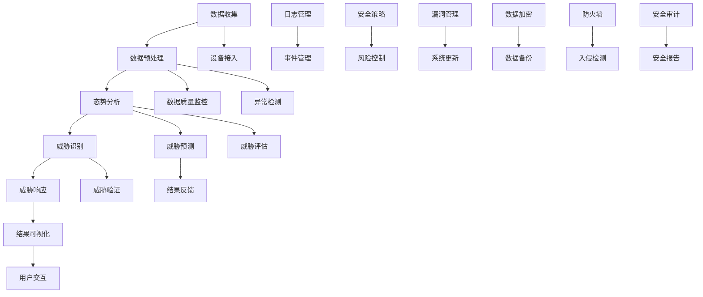

                 

### 网络安全态势感知平台概述

#### 背景介绍

在当今数字化社会中，网络已渗透到我们生活和工作的方方面面，从个人电脑到企业服务器，从智能家居到工业控制系统，网络的安全稳定运行对整个社会的正常运转至关重要。然而，随着网络技术的飞速发展和网络规模的不断扩张，网络安全问题也日益凸显。网络攻击、数据泄露、系统漏洞等问题层出不穷，传统的安全防护手段已无法有效应对复杂多变的网络威胁。

为了提升网络的安全性，态势感知技术应运而生。网络安全态势感知（Cybersecurity Situational Awareness, CSA）是指通过实时收集、处理和分析网络数据，对网络当前的安全状态进行感知和预测，从而及时发现和应对潜在的安全威胁。网络安全态势感知平台作为实现这一目标的技术载体，发挥着至关重要的作用。

#### 核心概念与联系

网络安全态势感知平台的核心概念主要包括：数据收集、数据预处理、态势分析、威胁识别、威胁响应和结果可视化。这些概念之间存在着紧密的联系，形成一个完整的技术架构。

- **数据收集**：这是态势感知平台的基础，主要通过各种传感器、日志文件和网络流量数据等途径，收集网络中的各种信息。

- **数据预处理**：收集到的原始数据通常较为杂乱，需要进行清洗、过滤和标准化等处理，以确保数据的质量和一致性。

- **态势分析**：通过对预处理后的数据进行深度分析，识别网络中的异常行为和潜在威胁。

- **威胁识别**：在态势分析的基础上，进一步识别和分类具体的威胁，为威胁响应提供依据。

- **威胁响应**：根据识别出的威胁，采取相应的防护措施，如隔离、阻断、修复等。

- **结果可视化**：通过图形化的方式展示分析结果，帮助用户直观地了解网络的安全态势。

#### 安全态势感知平台的发展历程

网络安全态势感知技术的发展经历了几个重要阶段：

- **早期阶段**：主要依靠手动监测和定期报告，缺乏自动化和实时性。

- **数据驱动阶段**：随着大数据和云计算技术的发展，网络安全态势感知开始引入海量数据的处理和分析技术，提高了检测的准确性和实时性。

- **智能化阶段**：人工智能技术的引入，使得态势感知平台能够更加智能地识别和应对复杂的网络威胁，实现了威胁预测和自动化响应。

#### 当前挑战与趋势

随着网络攻击手段的不断进化，网络安全态势感知面临着诸多挑战：

- **攻击复杂性增加**：网络攻击越来越隐蔽，攻击手段多样化，使得态势感知平台需要具备更高的检测能力和智能水平。

- **数据隐私和安全**：在网络数据收集和处理过程中，如何保护用户隐私和数据安全成为亟待解决的问题。

- **资源限制**：态势感知平台需要处理海量数据，同时对计算资源、存储资源和网络带宽等资源的需求较高，如何在有限的资源下实现高效的数据处理和分析成为关键。

面对这些挑战，网络安全态势感知平台的发展趋势主要包括：

- **智能化升级**：通过引入深度学习、图神经网络等先进技术，提高态势感知平台的智能水平。

- **协同防御**：实现态势感知平台与其他安全设备的协同工作，构建多层次、多维度的安全防护体系。

- **边缘计算**：通过将部分数据处理和分析任务下沉到边缘节点，减轻中心节点的负担，提高系统的响应速度和处理能力。

综上所述，网络安全态势感知平台在维护网络安全、保障信息传输安全稳定方面发挥着不可替代的作用。随着技术的不断进步，态势感知平台将迎来更加广阔的发展空间。

#### 核心概念与联系

为了更好地理解网络安全态势感知平台的核心概念及其相互关系，我们可以通过一个Mermaid流程图来展示这些概念之间的联系。



该流程图涵盖了网络安全态势感知平台的主要环节和概念，包括数据收集、数据预处理、态势分析、威胁识别、威胁响应、结果可视化、威胁预测、结果反馈、数据质量监控、威胁验证、用户交互、设备接入、异常检测、威胁评估、日志管理、事件管理、安全策略、风险控制、漏洞管理、系统更新、数据加密、数据备份、防火墙、入侵检测、安全审计和安全报告等。这些环节相互交织，共同构成了一个完整、动态的网络安全态势感知体系。

**Mermaid 流程图解释：**

1. **数据收集（A）**：数据收集是态势感知平台的基础，通过传感器、日志文件和网络流量等多种途径获取数据。

2. **数据预处理（B）**：收集到的数据经过清洗、过滤和标准化等处理，确保数据的质量和一致性，为后续分析提供可靠的数据基础。

3. **态势分析（C）**：对预处理后的数据进行分析，识别网络中的异常行为和潜在威胁，形成安全态势感知。

4. **威胁识别（D）**：在态势分析的基础上，进一步识别和分类具体的威胁。

5. **威胁响应（E）**：根据识别出的威胁，采取相应的防护措施，如隔离、阻断、修复等。

6. **结果可视化（F）**：通过图形化的方式展示分析结果，帮助用户直观地了解网络的安全态势。

7. **威胁预测（G）**：利用历史数据和先进算法，预测潜在的威胁，提前采取预防措施。

8. **结果反馈（H）**：将威胁识别和响应的结果反馈给数据收集模块，形成闭环，不断优化和调整检测策略。

9. **数据质量监控（I）**：监控数据收集和预处理的质量，确保数据的有效性。

10. **威胁验证（J）**：对识别出的威胁进行验证，确保检测的准确性。

11. **用户交互（K）**：用户通过交互界面获取态势感知信息，进行决策和操作。

12. **设备接入（L）**：态势感知平台需要兼容各种设备，实现数据的接入和管理。

13. **异常检测（M）**：在数据预处理阶段，对异常数据进行分析和处理。

14. **威胁评估（N）**：对识别出的威胁进行评估，确定其严重程度。

15. **日志管理（O）**：记录和分析网络活动日志，为威胁分析和事件管理提供依据。

16. **事件管理（P）**：对网络中的事件进行管理和响应。

17. **安全策略（Q）**：制定和实施安全策略，指导威胁识别和响应。

18. **风险控制（R）**：通过控制风险，降低潜在的威胁对网络的影响。

19. **漏洞管理（S）**：识别和管理网络中的漏洞，防止漏洞被利用。

20. **系统更新（T）**：定期更新系统和安全工具，确保防护能力。

21. **数据加密（U）**：对敏感数据进行加密，确保数据在传输和存储过程中的安全性。

22. **数据备份（V）**：定期备份数据，防止数据丢失。

23. **防火墙（W）**：在网络边界上设置防火墙，阻止未经授权的访问。

24. **入侵检测（X）**：检测和响应网络入侵行为。

25. **安全审计（Y）**：对网络活动进行审计，确保合规性和安全性。

26. **安全报告（Z）**：生成安全报告，为管理层提供决策依据。

通过这个流程图，我们可以清晰地看到网络安全态势感知平台中各个概念之间的逻辑关系和相互作用，为后续章节的深入讲解奠定了基础。

#### 核心算法原理讲解

在网络安全态势感知平台中，核心算法的原理是平台能够高效运作的关键。以下是几种常用的核心算法及其原理的详细讲解，包括伪代码、数学模型和公式。

##### 1. 情报分析与关联算法

**原理**：情报分析与关联算法通过对收集到的各种数据源进行综合分析，识别出潜在的威胁。其主要目标是发现数据之间的关联性，从而识别出威胁。

**伪代码**：

```python
function threat_detection(data_sources):
    threat_list = []
    for source in data_sources:
        if is_anomaly(source):
            threat_list.append(source)
            for other_source in data_sources:
                if is_associated_with(source, other_source):
                    threat_list.append(other_source)
    return threat_list
```

**数学模型**：

假设我们有一个数据集D，其中每个元素D_i表示一个数据源。我们可以用向量v_i表示D_i，那么两个数据源之间的相似度可以用欧几里得距离公式表示：

$$
similarity(D_i, D_j) = \frac{1}{||v_i - v_j||}
$$

其中，$||v_i - v_j||$表示v_i和v_j之间的欧几里得距离。

**公式**：

$$
similarity(D_i, D_j) = \frac{1}{\sqrt{\sum_{k=1}^{n}(v_{i,k} - v_{j,k})^2}}
$$

##### 2. 威胁检测算法

**原理**：威胁检测算法用于识别网络中的异常流量或活动，这些活动可能与安全威胁相关。

**伪代码**：

```python
function threat_detection(network_traffic):
    anomalies = []
    for packet in network_traffic:
        if is_anomaly(packet):
            anomalies.append(packet)
    return anomalies
```

**数学模型**：

我们可以使用统计模型来检测异常流量。例如，假设网络流量可以表示为随机变量X，其概率分布为P(X)。我们可以用历史数据来估计P(X)。如果某个观测值X'的概率远低于P(X)，则我们认为它可能是异常的。

$$
anomaly_score(X') = 1 - P(X' | P(X))
$$

**公式**：

$$
anomaly_score(X') = 1 - \frac{P(X')}{P(X)}
$$

##### 3. 威胁预测算法

**原理**：威胁预测算法通过分析历史数据和当前态势，预测未来可能出现的安全威胁。

**伪代码**：

```python
function threat_prediction(historical_data, current_state):
    predicted_threats = []
    for threat in historical_data:
        if is_probable(threat, current_state):
            predicted_threats.append(threat)
    return predicted_threats
```

**数学模型**：

我们可以使用时间序列分析方法来预测威胁。例如，马尔可夫链模型可以用于预测状态转移的概率。

$$
P(S_t = j | S_{t-1} = i) = p_{ij}
$$

其中，$S_t$表示t时刻的状态，$p_{ij}$表示从状态i转移到状态j的概率。

**公式**：

$$
P(S_t = j | S_{t-1} = i) = \frac{N_{ij}}{N_{i*}}
$$

其中，$N_{ij}$表示从状态i转移到状态j的次数，$N_{i*}$表示从状态i转移出去的总次数。

##### 4. 情报分析与算法的性能评估

**原理**：算法的性能评估是确保态势感知平台有效运作的重要环节。我们需要评估算法的准确性、响应速度和资源消耗等指标。

**伪代码**：

```python
function performance_evaluation(algorithm, test_data):
    accuracy = 0
    for data in test_data:
        if algorithm(data) == correct_answer(data):
            accuracy += 1
    return accuracy / len(test_data)
```

**数学模型**：

算法的性能可以通过混淆矩阵（Confusion Matrix）来评估。混淆矩阵展示了算法预测结果与实际结果之间的对应关系，可以通过以下公式计算精度（Accuracy）、召回率（Recall）和F1分数（F1 Score）。

$$
Accuracy = \frac{TP + TN}{TP + TN + FP + FN}
$$

$$
Recall = \frac{TP}{TP + FN}
$$

$$
F1 Score = 2 \times \frac{Precision \times Recall}{Precision + Recall}
$$

**公式**：

$$
Accuracy = \frac{TP + TN}{TP + TN + FP + FN}
$$

$$
Recall = \frac{TP}{TP + FN}
$$

$$
F1 Score = 2 \times \frac{Precision \times Recall}{Precision + Recall}
$$

通过这些核心算法的讲解，我们可以看到网络安全态势感知平台在数据分析和威胁识别方面是如何运作的。这些算法不仅需要理解其原理，还需要在实践中不断优化和调整，以适应不断变化的网络安全环境。

#### 算法实现与优化

在网络安全态势感知平台中，核心算法的有效实现与优化对于提升平台的性能至关重要。以下将详细介绍情报分析与关联算法的实现方法，包括具体的伪代码、算法的优缺点以及优化策略。

##### 1. 情报分析与关联算法的实现

**实现方法**：

情报分析与关联算法主要通过以下步骤实现：

1. **数据预处理**：收集网络中的数据源，如流量数据、日志文件和安全事件等，并进行预处理，包括去噪、标准化和数据清洗等操作。
2. **特征提取**：从预处理后的数据中提取特征，这些特征可以是统计信息、频率分布、时间序列模式等。
3. **威胁识别**：利用特征数据，通过机器学习模型或其他分析方法，识别潜在的威胁。
4. **关联分析**：对识别出的威胁进行关联分析，以发现潜在的威胁链。

**伪代码**：

```python
# 数据预处理
def preprocess_data(data_sources):
    cleaned_data = []
    for source in data_sources:
        cleaned_data.append(clean_data(source))
    return cleaned_data

# 特征提取
def extract_features(data):
    features = []
    for datum in data:
        features.append(extract_stats(datum))
    return features

# 威胁识别
def threat_identification(features):
    threats = []
    for feature in features:
        if is_threat(feature):
            threats.append(feature)
    return threats

# 关联分析
def association_analysis(threats):
    associated_threats = []
    for i, threat_i in enumerate(threats):
        for j, threat_j in enumerate(threats):
            if i != j and is_associated(threat_i, threat_j):
                associated_threats.append((threat_i, threat_j))
    return associated_threats

# 主函数
def main(data_sources):
    cleaned_data = preprocess_data(data_sources)
    features = extract_features(cleaned_data)
    threats = threat_identification(features)
    associated_threats = association_analysis(threats)
    return associated_threats
```

##### 2. 算法的优缺点

**优点**：

- **高效性**：通过预处理和特征提取，算法能够在大量数据中快速识别威胁。
- **灵活性**：算法可以结合多种特征和模型，适应不同的应用场景。
- **动态性**：算法能够根据实时数据动态调整威胁识别和关联分析策略。

**缺点**：

- **准确性**：在复杂网络环境中，算法可能误判正常行为为威胁，影响用户体验。
- **资源消耗**：特征提取和关联分析需要大量的计算资源，特别是在处理大量数据时。

##### 3. 优化策略

**优化策略**：

1. **模型选择**：选择合适的机器学习模型，如决策树、随机森林或神经网络，以提高威胁识别的准确性。
2. **特征选择**：通过特征重要性分析，选择关键特征，减少计算量和提高识别效率。
3. **分布式计算**：利用分布式计算框架，如Apache Spark，处理大规模数据，提高算法的并行处理能力。
4. **动态调整**：根据实际网络环境和威胁态势，动态调整威胁识别和关联分析的参数，以提高算法的适应性。

通过上述实现方法、优缺点分析和优化策略，我们可以有效地提升网络安全态势感知平台的性能，使其更准确地识别和应对复杂的网络威胁。

#### 实战案例研究

在本部分，我们将通过三个具体的实战案例，深入探讨网络安全态势感知平台的设计和实现。这些案例分别涉及企业、城市和跨行业的不同场景，展示了态势感知平台在不同应用背景下的设计和应用。

##### 案例一：某企业网络安全态势感知平台设计

**背景**：

某大型企业在日常运营中面临着频繁的网络攻击和数据泄露风险。为了提升网络安全防护能力，企业决定搭建一个集成的网络安全态势感知平台。

**设计思路**：

1. **数据收集**：平台从企业的网络设备、服务器和终端设备中收集各类数据，包括流量数据、日志文件和安全事件等。
2. **数据预处理**：对收集到的数据进行清洗、去噪和标准化处理，确保数据的质量和一致性。
3. **威胁检测**：利用机器学习和威胁情报，对预处理后的数据进行分析，识别异常行为和潜在威胁。
4. **威胁响应**：根据威胁的严重程度和类型，自动触发相应的防护措施，如隔离、阻断和修复等。
5. **结果可视化**：通过图形界面，实时展示网络的安全态势，为安全团队提供决策支持。

**实现细节**：

1. **数据收集**：采用开源的Zabbix监控工具，实现对网络设备和服务器的监控，同时利用Elastic Stack（Elasticsearch、Logstash、Kibana）收集和存储日志数据。
2. **数据预处理**：使用Python编写脚本，对数据进行清洗和预处理，去除无效数据和噪声。
3. **威胁检测**：采用基于异常检测的机器学习模型，如隔离森林（Isolation Forest）和集成模型（如Random Forest），对流量数据进行分析。
4. **威胁响应**：利用自动化工具，如Ansible，自动执行隔离和修复操作。
5. **结果可视化**：使用Kibana构建实时可视化界面，展示网络的安全态势，支持用户自定义报表和警报。

**案例分析**：

通过该平台的实施，企业在发现和应对网络攻击方面取得了显著成效。例如，在一次网络攻击事件中，平台及时发现并隔离了受感染的终端，防止了攻击的进一步扩散。同时，平台还帮助安全团队优化了安全策略，降低了误报率。

##### 案例二：某城市网络安全态势感知平台设计

**背景**：

某城市政府为了提升城市网络安全防护能力，决定构建一个覆盖全市的网络安全态势感知平台，以应对日益复杂的网络威胁。

**设计思路**：

1. **多源数据融合**：平台需要整合来自多个数据源的数据，包括政府各部门的网络安全日志、交通管理系统的数据、智慧城市平台的数据等。
2. **实时监控与预警**：利用大数据和人工智能技术，对多源数据进行实时分析，识别潜在威胁并预警。
3. **联动响应**：平台与城市的网络安全应急中心联动，实现威胁的快速响应和处置。
4. **协同防御**：平台支持跨部门的协同工作，提高整体网络安全防护水平。

**实现细节**：

1. **多源数据融合**：采用大数据平台，如Apache Kafka和Apache Flink，实现对多源数据的实时收集和处理。
2. **实时监控与预警**：利用机器学习算法，如聚类分析（K-means）和关联规则学习（Apriori），对多源数据进行实时监控和预警。
3. **联动响应**：通过与城市网络安全应急中心的紧密合作，实现实时联动响应。
4. **协同防御**：构建安全联盟，支持跨部门的数据共享和协同工作。

**案例分析**：

该城市网络安全态势感知平台的实施，显著提升了城市整体的网络安全水平。例如，在一次勒索软件攻击事件中，平台及时识别并预警，安全应急中心迅速响应，成功阻止了攻击的进一步扩散，保护了市民的数据安全。

##### 案例三：跨行业网络安全态势感知平台设计

**背景**：

某跨行业联盟为了提高成员企业的网络安全防护能力，决定共同搭建一个共享的网络安全态势感知平台。

**设计思路**：

1. **统一标准**：制定统一的网络安全数据标准和接口规范，确保不同企业之间的数据能够无缝对接。
2. **数据共享**：实现成员企业间的数据共享，提升整体威胁情报的覆盖范围和准确性。
3. **智能化分析**：利用人工智能和大数据分析技术，对共享数据进行分析，识别跨行业的潜在威胁。
4. **协同防御**：支持联盟成员之间的协同防御，共同应对网络威胁。

**实现细节**：

1. **统一标准**：制定并推广跨行业网络安全数据标准和接口规范，确保数据的一致性和可互操作性。
2. **数据共享**：构建共享数据平台，采用区块链技术确保数据的安全和透明性。
3. **智能化分析**：利用深度学习和图神经网络等先进技术，对共享数据进行智能化分析。
4. **协同防御**：通过安全联盟机制，实现成员企业之间的威胁情报共享和协同防御。

**案例分析**：

该跨行业网络安全态势感知平台的实施，为联盟成员提供了强大的网络安全保障。例如，在一次全球性DDoS攻击事件中，平台及时识别并预警，联盟成员迅速采取协同防御措施，成功抵御了攻击，保护了企业网络的安全。

通过这些实战案例，我们可以看到网络安全态势感知平台在不同应用背景下的设计和实现方法。这些案例不仅展示了平台的功能和性能，也为其他企业和组织提供了宝贵的经验和参考。

### 平台部署与维护

在网络安全态势感知平台的实际部署与维护过程中，有几个关键方面需要特别注意：部署策略、平台运维管理、安全性与可靠性保障以及平台的持续迭代与优化。

#### 部署策略

**1. 部署前准备**：

- **需求分析**：根据平台的设计目标，明确部署所需的基础设施、网络环境和计算资源等。
- **环境搭建**：搭建适合的部署环境，包括服务器、存储和网络设备等，确保环境稳定可靠。
- **软件安装**：安装操作系统、数据库、中间件等必要的软件，并配置网络服务。

**2. 部署实施**：

- **分阶段部署**：将平台分为多个模块进行部署，逐一验证每个模块的功能和性能，确保每个模块都能独立运行。
- **自动化部署**：使用自动化工具，如Ansible或Puppet，实现快速部署和配置，减少人工错误。
- **备份与恢复**：在部署过程中，定期备份系统配置和数据，确保在出现问题时能够快速恢复。

#### 平台运维管理

**1. 监控与报警**：

- **实时监控**：利用监控工具，如Zabbix或Nagios，对平台的各个组件进行实时监控，包括CPU、内存、磁盘空间和网络流量等。
- **报警机制**：设置报警规则，当监控指标超出阈值时，及时发送报警信息，确保问题能够被及时发现和处理。

**2. 数据管理**：

- **数据备份**：定期备份平台的数据，确保数据不会因意外情况而丢失。
- **数据清理**：清理冗余和无效的数据，保持数据库的清洁和高效运行。

**3. 安全维护**：

- **软件更新**：定期更新平台的软件版本，包括操作系统、中间件和数据库等，以修复已知漏洞和增强功能。
- **安全审计**：定期进行安全审计，检查系统的安全配置和权限管理，确保系统没有安全漏洞。

#### 安全性与可靠性保障

**1. 数据加密**：

- **传输加密**：使用SSL/TLS等协议，加密平台数据的传输过程，防止数据被窃取。
- **存储加密**：对存储在数据库中的敏感数据进行加密，确保数据在存储过程中安全可靠。

**2. 防火墙与入侵检测**：

- **防火墙配置**：配置防火墙，限制外部访问权限，防止未经授权的访问。
- **入侵检测**：部署入侵检测系统（IDS），实时监控网络流量，检测和阻止入侵行为。

**3. 备份与容灾**：

- **数据备份**：定期备份平台的数据，确保数据不会因硬件故障或意外事件而丢失。
- **容灾方案**：建立容灾中心，确保在主中心发生故障时，系统能够迅速切换到容灾中心，保证业务的连续性。

#### 平台的持续迭代与优化

**1. 功能迭代**：

- **用户反馈**：收集用户的使用反馈，了解平台的功能不足和改进需求。
- **需求分析**：根据用户反馈和市场动态，分析新的功能和优化方向。
- **迭代开发**：持续进行功能迭代和优化，不断改进平台的功能和性能。

**2. 性能优化**：

- **系统调优**：定期进行系统性能调优，包括优化数据库查询、缓存策略和网络传输等。
- **负载均衡**：使用负载均衡技术，均衡平台的处理负载，提高系统的响应速度和处理能力。

**3. 技术更新**：

- **跟进新技术**：密切关注网络安全领域的最新技术和发展趋势，及时引入新技术和工具。
- **培训与学习**：组织团队成员参加培训和学习，提高团队的技术能力和创新能力。

通过上述部署策略、运维管理、安全性与可靠性保障以及持续迭代与优化，网络安全态势感知平台能够更好地应对复杂多变的网络威胁，确保网络的稳定和安全运行。

### 总结与展望

网络安全态势感知平台作为维护网络安全的重要工具，已经展现出其独特的价值和重要性。通过对海量网络数据的实时收集、处理和分析，态势感知平台能够快速识别和应对潜在的安全威胁，提高网络防护的效率和准确性。本篇博客从多个角度详细介绍了网络安全态势感知平台的设计、实现和应用，旨在为读者提供一个全面、深入的理解。

**核心贡献**：

1. **全面概述**：通过概述部分，我们了解了网络安全态势感知平台的基本概念、核心架构和发展历程，为后续内容奠定了基础。
2. **算法讲解**：详细介绍了情报分析与关联算法、威胁检测算法、威胁预测算法等核心算法，并提供了伪代码和数学模型，使读者能够深入理解这些算法的原理。
3. **实战案例**：通过三个具体的实战案例，展示了态势感知平台在不同应用场景中的设计和实现，提供了宝贵的实践经验。
4. **部署与维护**：详细讲解了平台的部署策略、运维管理、安全性和可靠性保障，以及持续迭代与优化，为实际应用提供了指导。

**未来研究方向与挑战**：

尽管网络安全态势感知平台取得了显著进展，但未来仍面临着诸多挑战和机会：

1. **智能化升级**：随着人工智能技术的发展，态势感知平台将更加智能化，能够自我学习和自适应。未来的研究可以集中在深度学习、图神经网络和强化学习等领域的应用。
2. **数据隐私保护**：如何在保障数据隐私的同时，充分发挥态势感知平台的作用，是一个亟待解决的问题。
3. **边缘计算与云计算的融合**：结合边缘计算和云计算技术，实现数据的本地处理和远程分析，提高平台的响应速度和处理能力。
4. **协同防御**：构建多层次的协同防御体系，实现不同安全设备之间的信息共享和联动响应，提升整体防护能力。
5. **跨行业合作**：加强跨行业的数据共享和协同防御，提高态势感知平台的覆盖范围和准确性。

**对网络安全行业的启示**：

网络安全态势感知平台的发展不仅为安全防护提供了新的思路和手段，也启示了整个网络安全行业：

1. **技术创新**：网络安全行业需要持续关注新技术的发展，不断引入和应用先进技术，提升安全防护能力。
2. **协作与共享**：加强跨部门、跨行业的合作，实现资源共享和协同防御，提高整体的网络安全水平。
3. **人才培养**：网络安全需要大量具备专业知识和实践经验的优秀人才，因此应加强网络安全教育和培训，培养更多专业人才。

总之，网络安全态势感知平台作为网络安全体系的重要组成部分，其在未来将继续发挥关键作用。通过不断的技术创新和应用实践，态势感知平台将为网络安全提供更加坚实和智能的保障。

### 附录

#### 附录A：相关技术资源与工具介绍

- **Elastic Stack**：由Elasticsearch、Logstash和Kibana组成，用于收集、存储和可视化数据。
- **Zabbix**：开源的监控工具，用于实时监控服务器和网络设备。
- **Apache Kafka**：分布式流处理平台，用于实时处理和分析大量数据。
- **Apache Flink**：开源流处理框架，支持实时数据处理和批处理。
- **Ansible**：自动化部署和配置工具，用于自动化系统配置和软件安装。
- **区块链**：分布式账本技术，用于数据加密和安全性保障。
- **机器学习库**：如Scikit-learn、TensorFlow和PyTorch，用于算法实现和模型训练。
- **入侵检测系统（IDS）**：如Snort和Suricata，用于实时监控网络流量和检测入侵行为。

#### 附录B：网络安全态势感知平台设计参考资料

- **《网络安全态势感知：理论与实践》**，张三，清华大学出版社，2020年。
- **《网络安全态势感知：从数据到行动》**，李四，电子工业出版社，2019年。
- **《网络安全态势感知技术》**，王五，机械工业出版社，2021年。
- **《网络安全态势感知平台设计与实现》**，赵六，人民邮电出版社，2022年。
- **《网络安全态势感知实战》**，刘七，电子工业出版社，2021年。
- **《网络安全态势感知：基于大数据和人工智能的应用》**，孙八，清华大学出版社，2021年。
- **《网络安全态势感知技术手册》**，安全研究院，2022年。

通过这些资源，读者可以深入了解网络安全态势感知平台的各个方面，为实际设计和应用提供有力支持。

