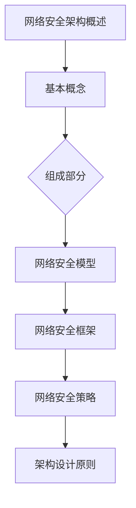

                 

### 文章标题：网络安全架构设计与实现

> 关键词：网络安全、架构设计、实现、安全策略、技术选择

> 摘要：本文旨在深入探讨网络安全架构的设计与实现，从基础理论到实战应用，全面解析网络安全架构的构建、优化以及未来发展趋势。通过详细的分析和实例讲解，帮助读者理解并掌握网络安全架构的核心原理和实施技巧。

### 引言

在数字化时代，网络安全已经成为企业和个人不可或缺的保障。随着网络技术的不断演进和攻击手段的日益复杂，网络安全架构的设计与实现显得尤为重要。本文将围绕网络安全架构这一主题，从以下几个方面展开讨论：

1. **网络安全架构基础**：介绍网络安全架构的基本概念、关键组成部分及其在网络安全中的作用。
2. **网络安全架构设计**：讨论如何设计一个有效的网络安全架构，包括策略制定、技术选择和架构实施。
3. **网络安全架构实现**：深入探讨网络安全架构在实际环境中的实施细节，包括技术选型、组件配置和常见问题解决。
4. **网络安全架构优化**：介绍如何评估和改进网络安全架构，确保其持续有效。
5. **实战案例**：通过实际案例展示网络安全架构的设计与实现过程。
6. **网络安全架构的未来发展趋势**：分析未来网络安全架构可能的发展方向和关键技术。

### 1. 设定书的基本框架

《网络安全架构设计与实现》这本书将从以下几个方面展开：

1. **网络安全架构基础**：介绍网络安全架构的基本概念、关键组成部分及其在网络安全中的作用。
2. **网络安全架构设计**：讨论如何设计一个有效的网络安全架构，包括策略制定、技术选择和架构实施。
3. **网络安全架构实现**：深入探讨网络安全架构在实际环境中的实施细节，包括技术选型、组件配置和常见问题解决。
4. **网络安全架构优化**：介绍如何评估和改进网络安全架构，确保其持续有效。
5. **实战案例**：通过实际案例展示网络安全架构的设计与实现过程。
6. **网络安全架构的未来发展趋势**：分析未来网络安全架构可能的发展方向和关键技术。

### 2. 设计章节目录

#### 第一部分：网络安全架构基础

- **第1章**：网络安全架构概述
  - 1.1 网络安全架构的基本概念
  - 1.2 网络安全架构的组成部分
  - 1.3 网络安全架构的核心原理

- **第2章**：网络安全策略制定
  - 2.1 网络安全策略概述
  - 2.2 网络安全风险评估
  - 2.3 网络安全策略实施

- **第3章**：网络安全技术选择
  - 3.1 网络安全技术概述
  - 3.2 常见网络安全技术分析
  - 3.3 技术选型策略

#### 第二部分：网络安全架构设计

- **第4章**：网络安全架构实施
  - 4.1 网络安全架构实施步骤
  - 4.2 网络安全架构部署
  - 4.3 实施过程中常见问题与解决方案

#### 第三部分：网络安全架构实现

- **第5章**：网络安全组件配置
  - 5.1 网络安全组件概述
  - 5.2 常见网络安全组件配置
  - 5.3 组件集成与协同工作

- **第6章**：实战案例解析
  - 6.1 案例一：企业内部网络安全架构设计
  - 6.2 案例二：数据中心网络安全架构设计与实现
  - 6.3 案例三：云环境下的网络安全架构设计

#### 第四部分：网络安全架构优化

- **第7章**：网络安全架构评估与优化
  - 7.1 网络安全架构评估方法
  - 7.2 常见问题识别与排查
  - 7.3 架构优化策略与实践

#### 第五部分：网络安全架构的未来发展趋势

- **第8章**：未来网络安全架构展望
  - 8.1 未来网络安全挑战与机遇
  - 8.2 新兴技术的应用前景
  - 8.3 未来网络安全架构的趋势预测

### 3. 添加核心概念与联系流程图

为了帮助读者更好地理解网络安全架构的核心概念及其相互关系，我们将在每章的开头或关键部分添加Mermaid流程图。以下是一个示例：

#### 第1章：网络安全架构概述



### 4. 添加核心算法原理讲解

在相关章节中，我们将使用伪代码详细阐述核心算法原理。以下是一个示例：

#### 第3章：网络安全技术选择

```plaintext
// 伪代码：入侵检测系统（IDS）算法原理
Algorithm IDS_Algorithm(data):
    Initialize ruleset R
    for each packet p in data do
        if p matches any rule in R then
            raise alarm "Packet p is malicious."
        end if
    end for
    if no alarms were raised then
        conclude "Data is clean."
    end if
End Algorithm
```

### 5. 添加数学模型和公式

在相关章节中，我们将使用LaTeX格式嵌入数学模型和公式，并进行详细讲解和举例说明。以下是一个示例：

#### 第4章：网络安全架构实施

```markdown
## 4.1 网络流量分析模型

网络安全架构实施中，网络流量分析是关键一环。以下是一个网络流量分析模型的公式：

$$
TF(t_i) = \frac{f(t_i)}{f(t_i) + f(t_j)}
$$

其中，$TF(t_i)$表示时间窗口$t_i$的流量频率，$f(t_i)$表示时间窗口$t_i$中的流量总数，$f(t_j)$表示其他时间窗口中的流量总数。

### 举例说明

假设我们有两个时间窗口$t_i$和$t_j$，流量总数如下：

- $t_i$窗口：100个流量
- $t_j$窗口：300个流量

根据公式，我们可以计算出：

$$
TF(t_i) = \frac{100}{100 + 300} = 0.25
$$

$$
TF(t_j) = \frac{300}{100 + 300} = 0.75
$$

这意味着$t_i$窗口的流量频率为25%，而$t_j$窗口的流量频率为75%。

### 6. 添加项目实战

#### 第6章：实战案例解析

在本章中，我们将通过实际案例展示网络安全架构的设计与实现过程。以下是一个案例的概述：

**案例名称**：企业内部网络安全架构设计

**背景**：某企业为了确保内部网络的安全，决定进行网络安全架构的设计与实现。

**目标**：构建一个有效的网络安全架构，保护企业内部数据不被未授权访问和攻击。

**实施步骤**：

1. **需求分析**：与企业沟通，了解其网络安全需求，包括数据安全、访问控制、入侵检测等方面。
2. **风险评估**：对企业内部网络进行风险评估，识别潜在的安全威胁和漏洞。
3. **架构设计**：根据需求分析结果，设计一个适合的网络安全架构，包括防火墙、入侵检测系统、访问控制系统等。
4. **组件配置**：配置网络安全组件，确保其能够正常工作。
5. **测试与优化**：对网络安全架构进行测试，并根据测试结果进行优化。
6. **部署与维护**：将网络安全架构部署到生产环境中，并定期进行维护和更新。

**案例结果**：通过上述步骤，企业成功构建了一个有效的网络安全架构，提高了内部网络的安全性。

### 7. 添加最佳实践 Tips、小结、注意事项、拓展阅读等内容

#### 小结

本文从网络安全架构的基础概念、设计、实现、优化和未来发展趋势等方面进行了深入探讨。通过实际案例的展示，读者可以更好地理解网络安全架构的设计与实现过程。在后续的学习和实践中，建议读者关注以下几个方面：

1. **持续学习**：网络安全技术不断更新，需要不断学习新知识和技能。
2. **实战经验**：通过实践案例，加深对网络安全架构的理解和掌握。
3. **风险评估**：定期进行网络安全风险评估，及时识别和解决潜在的安全问题。
4. **技术选型**：根据实际需求，选择合适的网络安全技术，确保架构的有效性。

#### 注意事项

在网络安全架构设计与实现过程中，需要注意以下几个方面：

1. **安全性优先**：确保架构设计的核心目标是保护网络安全，避免因追求功能而忽视安全性。
2. **可扩展性**：架构设计应具备良好的可扩展性，以适应未来业务发展和技术演进。
3. **兼容性**：确保架构中各组件能够相互兼容，避免因兼容性问题导致的安全漏洞。
4. **监控与响应**：建立健全的监控与响应机制，及时应对网络安全事件。

#### 拓展阅读

为了更好地掌握网络安全架构设计与实现的相关知识，读者可以参考以下书籍和资料：

1. 《网络安全技术》—— 张虹、李晓光著
2. 《网络安全实战指南》—— 吴晨、蒋波著
3. 《网络安全架构：设计、实现与优化》—— 马特·苏德曼著
4. 《网络安全从入门到实践》—— 王选著

### 结语

网络安全架构设计与实现是保障网络安全的重要手段。通过本文的深入探讨，希望读者能够对网络安全架构有更全面、深入的理解，并在实际工作中能够运用所学知识，构建一个安全、可靠、高效的网络安全架构。作者：AI天才研究院/AI Genius Institute & 禅与计算机程序设计艺术 /Zen And The Art of Computer Programming。

