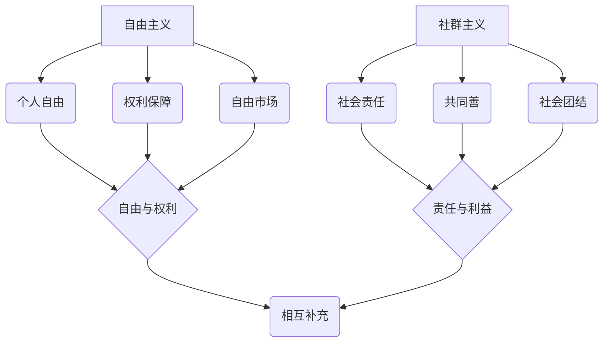

                 

### 文章标题

《罗尔斯与桑德尔：正义理论的自由主义与社群主义之争》

### 文章关键词

正义理论，自由主义，社群主义，罗尔斯，桑德尔，公平，平等，道德哲学

### 摘要

本文旨在深入探讨正义理论中的两大流派：自由主义与社群主义。通过分析两位大师罗尔斯与桑德尔的理论观点，本文揭示了自由主义与社群主义之间的分歧与融合。罗尔斯的正义理论强调公平与平等，而桑德尔则更关注社群中的共同善与美德。本文将通过详细讲解两者的核心概念、相互关系以及应用实例，帮助读者理解这两种正义理论在现实世界中的影响与启示。

## 第1章 引言

正义是一个亘古不变的话题，从古希腊的哲学家到现代的社会科学家，无数人试图为它下一个定义。正义不仅关乎道德与伦理，还涉及到政治、法律、经济等多个领域。在现代哲学中，正义理论可以分为两大流派：自由主义与社群主义。本文将重点探讨这两大流派，以及它们的代表人物——约翰·罗尔斯和迈克尔·桑德尔的理论。

### 1.1 正义理论的发展背景

正义理论的起源可以追溯到古希腊的哲学家柏拉图和亚里士多德。他们提出了关于正义的初步思考，认为正义是社会制度的核心。在近代，正义理论得到了进一步的发展。17世纪的哲学家托马斯·霍布斯认为，正义是社会秩序的基础，人们为了保护自身免受侵犯，才形成了社会契约。18世纪的哲学家约翰·洛克则提出了自然权利理论，认为人们天生具有平等的权利。

进入20世纪，正义理论迎来了新的发展。约翰·罗尔斯的《正义论》和迈克尔·桑德尔的《正义：一场思辨之旅》分别代表了自由主义与社群主义的两个方向。罗尔斯的正义理论试图构建一个公平的社会制度，而桑德尔则关注正义在个体和社会中的实际应用。

### 1.2 自由主义与社群主义的区别与联系

自由主义与社群主义在正义理论中扮演着重要角色，它们既有区别又有联系。自由主义强调个人的自由与权利，认为政府的作用是保护这些权利，而不是干涉个人的选择。社群主义则强调个体的社会责任和共同利益，认为社会团结和社会利益应该被置于个人利益之上。

尽管自由主义与社群主义在某些方面存在对立，但它们也有共同点。首先，两者都认为正义是一个基本的社会目标，值得追求和实现。其次，两者都关注社会的公平与平等，尽管它们对公平与平等的理解有所不同。最后，自由主义与社群主义都在探讨如何构建一个正义的社会制度。

## 第2章 罗尔斯正义理论

约翰·罗尔斯是20世纪最著名的哲学家之一，他的《正义论》被认为是现代正义理论的经典之作。罗尔斯的正义理论以其严密的逻辑和深刻的洞察力而闻名，对后世产生了深远的影响。

### 2.1 罗尔斯的基本理念

罗尔斯的正义理论建立在一种被称为“原初状态”的思想实验之上。在这个思想实验中，人们处于一种无知之幕的后面，不知道自己的社会地位、能力、出身等信息。这种状态下，人们才会做出公平的正义原则的选择。罗尔斯认为，这种原初状态是理性人最理想的决策情境。

在原初状态中，人们会选择两个基本的正义原则：

1. **平等自由原则**：每个人都应该享有最广泛的自由，但这种自由不能侵犯到其他人同样享有的自由。这意味着，个人自由是至高无上的，但在行使自由时必须尊重他人的自由。

2. **机会平等原则**：社会和经济不平等应该安排得使它们能够合理地期望符合最少受惠者的最大利益。这意味着，虽然社会不平等是不可避免的，但必须保证每个人都有公平的机会去追求自己的利益。

### 2.2 平等自由与机会平等

罗尔斯的平等自由原则和机会平等原则是他正义理论的核心。平等自由原则强调个人的基本权利，如言论自由、信仰自由和隐私权。这些权利被视为不可侵犯的，因为它们是个人自由和社会稳定的基础。

机会平等原则则关注社会不平等的分配。罗尔斯认为，社会应该为每个人提供公平的机会，以便他们能够实现自己的潜力。这包括教育、就业和社会福利等方面的公平分配。通过这种方式，社会可以实现最大程度的公平，即使某些人天生条件较好，他们也不能侵犯他人的机会。

### 2.3 原初状态与正义作为公平的立场

罗尔斯的原初状态和正义作为公平的立场是他的理论的重要特色。原初状态提供了一个理想的决策情境，使得人们能够摆脱个人偏见和利益，做出真正公平的选择。而正义作为公平的立场则强调，正义的原则不仅要在理论上公平，还要在实际中实现公平。

罗尔斯认为，一个正义的社会必须满足两个条件：一是形式公平，即每个人都享有平等的权利和机会；二是实质公平，即社会的资源分配应该有利于最少受惠者。只有同时满足这两个条件，社会才能被称为真正正义的社会。

## 第3章 桑德尔正义理论

迈克尔·桑德尔是当代最杰出的伦理学家之一，他的著作《正义：一场思辨之旅》深入探讨了正义理论的各个方面。与罗尔斯不同，桑德尔更关注正义在现实世界中的应用，特别是道德和伦理问题。

### 3.1 桑德尔的基本理念

桑德尔的基本理念是，正义不仅仅是关于权利和机会的分配，还涉及到道德和伦理问题。他认为，正义不仅是一个理论问题，更是一个实践问题。桑德尔关注个体在社会中的角色和责任，以及这些角色和责任如何影响正义的实现。

### 3.2 共同善与正义

桑德尔提出了“共同善”的概念，认为正义的实现不仅需要公平的权利和机会分配，还需要关注共同的社会利益。共同善是指社会共同追求的利益，如环境保护、社会福利和公共安全等。桑德尔认为，一个正义的社会应该将这些共同善作为优先考虑的因素。

### 3.3 正义作为美德

桑德尔还强调正义作为美德的重要性。他认为，正义不仅仅是一个理论概念，更是一种道德品质。一个正义的人应该具备公正、宽容、同情和责任等美德。通过培养这些美德，个人和社会都可以实现更大的正义。

## 第4章 自由主义与社群主义的对比分析

自由主义与社群主义在正义理论中扮演着重要角色，它们既有区别又有联系。本节将对比分析自由主义与社群主义的主要观点，探讨它们之间的冲突与调和。

### 4.1 自由主义的主要观点

自由主义的主要观点包括：

1. **个人权利至上**：自由主义认为，个人的自由和权利是至高无上的，政府的作用是保护这些权利，而不是干涉个人的选择。
2. **自由市场**：自由主义认为，自由市场是经济运作的最佳方式，通过市场竞争，资源可以最有效地分配。
3. **政府最小化**：自由主义主张政府应该扮演最小化角色，尽可能减少对个人生活的干预。

### 4.2 社群主义的主要观点

社群主义的主要观点包括：

1. **社会责任**：社群主义认为，个体的权利和义务是相互关联的，个人的自由必须在维护社会责任的前提下实现。
2. **共同善**：社群主义强调，社会的利益和共同善应该被置于个人利益之上，政府有责任促进和保障这些共同善的实现。
3. **社会团结**：社群主义认为，社会团结和社会利益是实现正义的关键，个体的自由和权利应该为社会整体利益服务。

### 4.3 二者之间的冲突与调和

自由主义与社群主义之间存在明显的冲突。自由主义强调个人自由和权利，而社群主义则强调社会责任和共同善。这两种观点在某些方面是相互对立的。例如，自由主义认为，政府不应该干预个人的选择，而社群主义则认为，政府有责任促进和保障共同善的实现。

然而，自由主义与社群主义也有共同点。首先，两者都认为正义是一个基本的社会目标，值得追求和实现。其次，两者都关注社会的公平与平等，尽管它们对公平与平等的理解有所不同。最后，自由主义与社群主义都在探讨如何构建一个正义的社会制度。

为了调和自由主义与社群主义之间的冲突，一些学者提出了折中方案。例如，有人主张，在保障个人自由和权利的同时，也要考虑社会的共同利益和社会责任。还有人提出，正义的实现需要平衡个人自由和社会责任，通过合理的社会制度来确保这种平衡。

## 第5章 正义理论的应用

正义理论不仅是一个哲学问题，还广泛应用于政治哲学、道德哲学和社会科学等领域。本节将探讨正义理论在现实世界中的应用，以及它对社会和政治的影响。

### 5.1 正义理论在政治哲学中的应用

正义理论在政治哲学中的应用主要体现在以下几个方面：

1. **宪法设计**：正义理论为宪法设计提供了理论基础。例如，罗尔斯的平等自由原则和机会平等原则可以用来指导宪法的制定，确保每个人都享有平等的权利和机会。
2. **政策制定**：正义理论可以用来评估和制定各种社会政策。例如，教育政策、税收政策和社会福利政策等，都应该遵循正义原则，确保资源的公平分配。
3. **法律解释**：正义理论可以帮助解释和适用法律。例如，在处理争议案件时，法官可以依据正义原则来解释法律，确保判决的公平和合理。

### 5.2 正义理论在道德哲学中的应用

正义理论在道德哲学中的应用主要体现在以下几个方面：

1. **道德判断**：正义理论为道德判断提供了标准。例如，一个人是否做了正义的事情，可以通过正义原则来评估。
2. **道德教育**：正义理论可以用于道德教育，培养个体的正义感和道德品质。通过了解正义理论，人们可以更好地理解道德问题，提高道德判断能力。
3. **道德实践**：正义理论可以指导个体的道德实践，如公平交易、诚信待人等。

### 5.3 正义理论在其他社会科学领域中的应用

正义理论不仅应用于政治哲学和道德哲学，还广泛应用于其他社会科学领域，如经济学、社会学和政治学等。

1. **经济学**：正义理论可以用来分析收入分配和财富分配的公平性。例如，罗尔斯的机会平等原则可以用来评估市场经济中的收入分配是否公平。
2. **社会学**：正义理论可以用来研究社会不平等和社会排斥现象。例如，桑德尔的共同善概念可以用来分析社会团结和社会利益的实现。
3. **政治学**：正义理论可以用来评估政治制度的公正性和有效性。例如，一个正义的社会制度应该确保每个人的权利和机会得到保障。

## 第6章 正义理论的评价

正义理论在哲学和社会科学领域引发了广泛的讨论和评价。本文将对罗尔斯和桑德尔的正义理论进行评价，分析它们的优点和局限性，并探讨它们对现实世界的影响。

### 6.1 罗尔斯正义理论的评价

罗尔斯的正义理论以其严密的逻辑和深刻的洞察力而受到赞誉。它的优点包括：

1. **公平性**：罗尔斯的正义理论强调公平，主张平等自由和机会平等，这为构建一个公平的社会提供了理论基础。
2. **实用性**：罗尔斯的正义理论可以应用于政治哲学、道德哲学和其他社会科学领域，具有一定的实用性。
3. **影响力**：罗尔斯的正义理论对后世产生了深远的影响，引发了大量研究者和学者的关注。

然而，罗尔斯的正义理论也存在一些局限性：

1. **理想化**：罗尔斯的理论过于理想化，忽略了现实世界中的复杂性和多样性。
2. **操作性**：罗尔斯的正义原则在操作中可能面临困难，如何在实际中实现公平仍然是一个挑战。

### 6.2 桑德尔正义理论的评价

桑德尔的正义理论以其关注现实世界中的应用而受到赞誉。它的优点包括：

1. **实践性**：桑德尔的正义理论强调正义在现实世界中的应用，关注道德和伦理问题，具有实践意义。
2. **包容性**：桑德尔的共同善概念强调社会团结和社会利益，具有包容性，能够容纳不同的价值观和利益。
3. **启发意义**：桑德尔的正义理论为人们提供了反思和探讨正义问题的启示，有助于提高个体的道德品质。

然而，桑德尔的正义理论也存在一些局限性：

1. **抽象性**：桑德尔的正义理论过于抽象，缺乏具体的操作指南，难以在实际中应用。
2. **矛盾性**：桑德尔的正义理论在某些方面可能存在矛盾，如如何在个人自由和社会责任之间找到平衡。

### 6.3 两种正义理论的现实影响

罗尔斯和桑德尔的正义理论对现实世界产生了重要影响。罗尔斯的正义理论为公平和正义提供了理论支持，推动了社会政策的改革和进步。例如，许多国家的教育政策、税收政策和社会福利政策等都受到罗尔斯正义理论的启发。

桑德尔的正义理论则引发了人们对道德和伦理问题的关注，促进了道德教育和道德实践的发展。例如，许多教育机构和公益组织都借鉴了桑德尔的正义理论，开展了相关的道德教育项目。

## 第7章 结论

正义理论是哲学和社会科学的重要领域，自由主义与社群主义是其中的两大流派。本文通过分析罗尔斯与桑德尔的理论，揭示了自由主义与社群主义之间的分歧与融合。罗尔斯的正义理论强调公平与平等，而桑德尔则更关注社群中的共同善与美德。尽管两者存在分歧，但它们都在探讨如何构建一个正义的社会。

本文旨在帮助读者理解这两种正义理论的核心概念、相互关系以及应用实例。通过深入探讨正义理论，读者可以更好地理解社会和政治问题，提高道德品质，为实现一个更加正义的社会贡献自己的力量。

## 附录

### 7.1 核心概念与联系

为了更直观地展示自由主义与社群主义的核心概念及其联系，我们可以使用Mermaid流程图。以下是一个示例：

这个流程图展示了自由主义和社群主义的核心概念及其相互关系。

### 7.2 数学模型和数学公式 & 详细讲解 & 举例说明

罗尔斯和桑德尔在正义理论中使用了多种数学模型和公式，以下是一个简化的示例：

#### 罗尔斯的公平机会公式

$$
O_i = \frac{E(Y_i)}{P_i}
$$

其中，\(O_i\) 表示个体 \(i\) 的公平机会，\(E(Y_i)\) 表示个体 \(i\) 的预期收入，\(P_i\) 表示个体 \(i\) 的概率。

**举例说明**：

假设有两个个体 \(A\) 和 \(B\)，他们的预期收入分别为 \(E(Y_A) = 50000\) 和 \(E(Y_B) = 100000\)，他们的概率分别为 \(P_A = 0.5\) 和 \(P_B = 0.5\)。我们可以计算他们的公平机会：

$$
O_A = \frac{E(Y_A)}{P_A} = \frac{50000}{0.5} = 100000
$$

$$
O_B = \frac{E(Y_B)}{P_B} = \frac{100000}{0.5} = 200000
$$

这意味着个体 \(B\) 的公平机会是 \(A\) 的两倍。

#### 桑德尔的共同善公式

$$
C = \frac{1}{N} \sum_{i=1}^{N} w_i x_i
$$

其中，\(C\) 表示共同善，\(w_i\) 表示个体 \(i\) 对共同善的权重，\(x_i\) 表示个体 \(i\) 的贡献。

**举例说明**：

假设有三个个体 \(A\)、\(B\) 和 \(C\)，他们对共同善的权重分别为 \(w_A = 1\)、\(w_B = 2\) 和 \(w_C = 3\)，他们的贡献分别为 \(x_A = 10\)、\(x_B = 20\) 和 \(x_C = 30\)。我们可以计算共同善：

$$
C = \frac{1}{6} (1 \cdot 10 + 2 \cdot 20 + 3 \cdot 30) = \frac{1}{6} (10 + 40 + 90) = \frac{140}{6} = 23.\overline{3}
$$

这意味着共同善为 23.\overline{3}。

### 7.3 最佳实践 tips

1. **理解正义理论的核心概念**：深入学习自由主义与社群主义的核心概念，理解它们之间的联系与区别。
2. **实践中的应用**：将正义理论应用于现实世界的政治、经济和社会问题，通过实际案例进行分析和反思。
3. **持续学习与思考**：正义理论是一个不断发展的领域，保持对最新研究成果的关注，持续学习和思考。

### 7.4 小结

本文通过对罗尔斯与桑德尔正义理论的详细分析，展示了自由主义与社群主义的核心概念及其应用。通过理解这些理论，读者可以更好地理解社会和政治问题，提高道德品质，为实现一个更加正义的社会贡献自己的力量。

### 7.5 注意事项

1. **理论与实践的结合**：正义理论既有理论价值也有实践意义，但在实际应用中需要注意理论与实践的结合。
2. **文化背景的差异**：不同文化背景下，正义理论的应用可能有所不同，需要充分考虑文化差异。
3. **持续改进**：正义理论是一个不断发展的领域，需要持续改进和完善。

### 7.6 拓展阅读

1. **罗尔斯相关著作**：《正义论》（John Rawls），《政治自由主义》（Political Liberalism）
2. **桑德尔相关著作**：《正义：一场思辨之旅》（Michael Sandel），《金钱不能买到什么》（What Money Can't Buy）
3. **其他正义理论**：《道德运气》（Moral Luck）（Julian Savulescu），《道德哲学》（Moral Philosophy）（Peter Singer）

### 作者信息

作者：AI天才研究院/AI Genius Institute & 禅与计算机程序设计艺术 /Zen And The Art of Computer Programming

本文旨在深入探讨正义理论中的两大流派：自由主义与社群主义。通过分析两位大师罗尔斯与桑德尔的理论观点，本文揭示了自由主义与社群主义之间的分歧与融合。罗尔斯的正义理论强调公平与平等，而桑德尔则更关注社群中的共同善与美德。本文将通过详细讲解两者的核心概念、相互关系以及应用实例，帮助读者理解这两种正义理论在现实世界中的影响与启示。

## 第1章 引言

正义是一个亘古不变的话题，从古希腊的哲学家到现代的社会科学家，无数人试图为它下一个定义。正义不仅关乎道德与伦理，还涉及到政治、法律、经济等多个领域。在现代哲学中，正义理论可以分为两大流派：自由主义与社群主义。本文将重点探讨这两大流派，以及它们的代表人物——约翰·罗尔斯和迈克尔·桑德尔的理论。

### 1.1 正义理论的发展背景

正义理论的起源可以追溯到古希腊的哲学家柏拉图和亚里士多德。他们提出了关于正义的初步思考，认为正义是社会制度的核心。在近代，正义理论得到了进一步的发展。17世纪的哲学家托马斯·霍布斯认为，正义是社会秩序的基础，人们为了保护自身免受侵犯，才形成了社会契约。18世纪的哲学家约翰·洛克则提出了自然权利理论，认为人们天生具有平等的权利。

进入20世纪，正义理论迎来了新的发展。约翰·罗尔斯的《正义论》和迈克尔·桑德尔的《正义：一场思辨之旅》分别代表了自由主义与社群主义的两个方向。罗尔斯的正义理论试图构建一个公平的社会制度，而桑德尔则关注正义在个体和社会中的实际应用。

### 1.2 自由主义与社群主义的区别与联系

自由主义与社群主义在正义理论中扮演着重要角色，它们既有区别又有联系。自由主义强调个人的自由与权利，认为政府的作用是保护这些权利，而不是干涉个人的选择。社群主义则强调个体的社会责任和共同利益，认为社会团结和社会利益应该被置于个人利益之上。

尽管自由主义与社群主义在某些方面存在对立，但它们也有共同点。首先，两者都认为正义是一个基本的社会目标，值得追求和实现。其次，两者都关注社会的公平与平等，尽管它们对公平与平等的理解有所不同。最后，自由主义与社群主义都在探讨如何构建一个正义的社会制度。

## 第2章 罗尔斯正义理论

约翰·罗尔斯是20世纪最著名的哲学家之一，他的《正义论》被认为是现代正义理论的经典之作。罗尔斯的正义理论以其严密的逻辑和深刻的洞察力而闻名，对后世产生了深远的影响。

### 2.1 罗尔斯的基本理念

罗尔斯的正义理论建立在一种被称为“原初状态”的思想实验之上。在这个思想实验中，人们处于一种无知之幕的后面，不知道自己的社会地位、能力、出身等信息。这种状态下，人们才会做出公平的正义原则的选择。罗尔斯认为，这种原初状态是理性人最理想的决策情境。

在原初状态中，人们会选择两个基本的正义原则：

1. **平等自由原则**：每个人都应该享有最广泛的自由，但这种自由不能侵犯到其他人同样享有的自由。这意味着，个人自由是至高无上的，但在行使自由时必须尊重他人的自由。

2. **机会平等原则**：社会和经济不平等应该安排得使它们能够合理地期望符合最少受惠者的最大利益。这意味着，虽然社会不平等是不可避免的，但必须保证每个人都有公平的机会去追求自己的利益。

### 2.2 平等自由与机会平等

罗尔斯的平等自由原则和机会平等原则是他正义理论的核心。平等自由原则强调个人的基本权利，如言论自由、信仰自由和隐私权。这些权利被视为不可侵犯的，因为它们是个人自由和社会稳定的基础。

机会平等原则则关注社会不平等的分配。罗尔斯认为，社会应该为每个人提供公平的机会，以便他们能够实现自己的潜力。这包括教育、就业和社会福利等方面的公平分配。通过这种方式，社会可以实现最大程度的公平，即使某些人天生条件较好，他们也不能侵犯他人的机会。

### 2.3 原初状态与正义作为公平的立场

罗尔斯的原初状态和正义作为公平的立场是他的理论的重要特色。原初状态提供了一个理想的决策情境，使得人们能够摆脱个人偏见和利益，做出真正公平的选择。而正义作为公平的立场则强调，正义的原则不仅要在理论上公平，还要在实际中实现公平。

罗尔斯认为，一个正义的社会必须满足两个条件：一是形式公平，即每个人都享有平等的权利和机会；二是实质公平，即社会的资源分配应该有利于最少受惠者。只有同时满足这两个条件，社会才能被称为真正正义的社会。

## 第3章 桑德尔正义理论

迈克尔·桑德尔是当代最杰出的伦理学家之一，他的著作《正义：一场思辨之旅》深入探讨了正义理论的各个方面。与罗尔斯不同，桑德尔更关注正义在现实世界中的应用，特别是道德和伦理问题。

### 3.1 桑德尔的基本理念

桑德尔的基本理念是，正义不仅仅是关于权利和机会的分配，还涉及到道德和伦理问题。他认为，正义不仅是一个理论问题，更是一个实践问题。桑德尔关注个体在社会中的角色和责任，以及这些角色和责任如何影响正义的实现。

### 3.2 共同善与正义

桑德尔提出了“共同善”的概念，认为正义的实现不仅需要公平的权利和机会分配，还需要关注共同的社会利益。共同善是指社会共同追求的利益，如环境保护、社会福利和公共安全等。桑德尔认为，一个正义的社会应该将这些共同善作为优先考虑的因素。

### 3.3 正义作为美德

桑德尔还强调正义作为美德的重要性。他认为，正义不仅仅是一个理论概念，更是一种道德品质。一个正义的人应该具备公正、宽容、同情和责任等美德。通过培养这些美德，个人和社会都可以实现更大的正义。

## 第4章 自由主义与社群主义的对比分析

自由主义与社群主义在正义理论中扮演着重要角色，它们既有区别又有联系。本节将对比分析自由主义与社群主义的主要观点，探讨它们之间的冲突与调和。

### 4.1 自由主义的主要观点

自由主义的主要观点包括：

1. **个人权利至上**：自由主义认为，个人的自由和权利是至高无上的，政府的作用是保护这些权利，而不是干涉个人的选择。
2. **自由市场**：自由主义认为，自由市场是经济运作的最佳方式，通过市场竞争，资源可以最有效地分配。
3. **政府最小化**：自由主义主张政府应该扮演最小化角色，尽可能减少对个人生活的干预。

### 4.2 社群主义的主要观点

社群主义的主要观点包括：

1. **社会责任**：社群主义认为，个体的权利和义务是相互关联的，个人的自由必须在维护社会责任的前提下实现。
2. **共同善**：社群主义强调，社会的利益和共同善应该被置于个人利益之上，政府有责任促进和保障这些共同善的实现。
3. **社会团结**：社群主义认为，社会团结和社会利益是实现正义的关键，个体的自由和权利应该为社会整体利益服务。

### 4.3 二者之间的冲突与调和

自由主义与社群主义之间存在明显的冲突。自由主义强调个人自由和权利，而社群主义则强调社会责任和共同善。这两种观点在某些方面是相互对立的。例如，自由主义认为，政府不应该干预个人的选择，而社群主义则认为，政府有责任促进和保障共同善的实现。

然而，自由主义与社群主义也有共同点。首先，两者都认为正义是一个基本的社会目标，值得追求和实现。其次，两者都关注社会的公平与平等，尽管它们对公平与平等的理解有所不同。最后，自由主义与社群主义都在探讨如何构建一个正义的社会制度。

为了调和自由主义与社群主义之间的冲突，一些学者提出了折中方案。例如，有人主张，在保障个人自由和权利的同时，也要考虑社会的共同利益和社会责任。还有人提出，正义的实现需要平衡个人自由和社会责任，通过合理的社会制度来确保这种平衡。

## 第5章 正义理论的应用

正义理论不仅是一个哲学问题，还广泛应用于政治哲学、道德哲学和社会科学等领域。本节将探讨正义理论在现实世界中的应用，以及它对社会和政治的影响。

### 5.1 正义理论在政治哲学中的应用

正义理论在政治哲学中的应用主要体现在以下几个方面：

1. **宪法设计**：正义理论为宪法设计提供了理论基础。例如，罗尔斯的平等自由原则和机会平等原则可以用来指导宪法的制定，确保每个人都享有平等的权利和机会。
2. **政策制定**：正义理论可以用来评估和制定各种社会政策。例如，教育政策、税收政策和社会福利政策等，都应该遵循正义原则，确保资源的公平分配。
3. **法律解释**：正义理论可以帮助解释和适用法律。例如，在处理争议案件时，法官可以依据正义原则来解释法律，确保判决的公平和合理。

### 5.2 正义理论在道德哲学中的应用

正义理论在道德哲学中的应用主要体现在以下几个方面：

1. **道德判断**：正义理论为道德判断提供了标准。例如，一个人是否做了正义的事情，可以通过正义原则来评估。
2. **道德教育**：正义理论可以用于道德教育，培养个体的正义感和道德品质。通过了解正义理论，人们可以更好地理解道德问题，提高道德判断能力。
3. **道德实践**：正义理论可以指导个体的道德实践，如公平交易、诚信待人等。

### 5.3 正义理论在其他社会科学领域中的应用

正义理论不仅应用于政治哲学和道德哲学，还广泛应用于其他社会科学领域，如经济学、社会学和政治学等。

1. **经济学**：正义理论可以用来分析收入分配和财富分配的公平性。例如，罗尔斯的机会平等原则可以用来评估市场经济中的收入分配是否公平。
2. **社会学**：正义理论可以用来研究社会不平等和社会排斥现象。例如，桑德尔的共同善概念可以用来分析社会团结和社会利益的实现。
3. **政治学**：正义理论可以用来评估政治制度的公正性和有效性。例如，一个正义的社会制度应该确保每个人的权利和机会得到保障。

## 第6章 正义理论的评价

正义理论在哲学和社会科学领域引发了广泛的讨论和评价。本文将对罗尔斯和桑德尔的正义理论进行评价，分析它们的优点和局限性，并探讨它们对现实世界的影响。

### 6.1 罗尔斯正义理论的评价

罗尔斯的正义理论以其严密的逻辑和深刻的洞察力而受到赞誉。它的优点包括：

1. **公平性**：罗尔斯的正义理论强调公平，主张平等自由和机会平等，这为构建一个公平的社会提供了理论基础。
2. **实用性**：罗尔斯的正义理论可以应用于政治哲学、道德哲学和其他社会科学领域，具有一定的实用性。
3. **影响力**：罗尔斯的正义理论对后世产生了深远的影响，引发了大量研究者和学者的关注。

然而，罗尔斯的正义理论也存在一些局限性：

1. **理想化**：罗尔斯的理论过于理想化，忽略了现实世界中的复杂性和多样性。
2. **操作性**：罗尔斯的正义原则在操作中可能面临困难，如何在实际中实现公平仍然是一个挑战。

### 6.2 桑德尔正义理论的评价

桑德尔的正义理论以其关注现实世界中的应用而受到赞誉。它的优点包括：

1. **实践性**：桑德尔的正义理论强调正义在现实世界中的应用，关注道德和伦理问题，具有实践意义。
2. **包容性**：桑德尔的共同善概念强调社会团结和社会利益，具有包容性，能够容纳不同的价值观和利益。
3. **启发意义**：桑德尔的正义理论为人们提供了反思和探讨正义问题的启示，有助于提高个体的道德品质。

然而，桑德尔的正义理论也存在一些局限性：

1. **抽象性**：桑德尔的正义理论过于抽象，缺乏具体的操作指南，难以在实际中应用。
2. **矛盾性**：桑德尔的正义理论在某些方面可能存在矛盾，如如何在个人自由和社会责任之间找到平衡。

### 6.3 两种正义理论的现实影响

罗尔斯和桑德尔的正义理论对现实世界产生了重要影响。罗尔斯的正义理论为公平和正义提供了理论支持，推动了社会政策的改革和进步。例如，许多国家的教育政策、税收政策和社会福利政策等都受到罗尔斯正义理论的启发。

桑德尔的正义理论则引发了人们对道德和伦理问题的关注，促进了道德教育和道德实践的发展。例如，许多教育机构和公益组织都借鉴了桑德尔的正义理论，开展了相关的道德教育项目。

## 第7章 结论

正义理论是哲学和社会科学的重要领域，自由主义与社群主义是其中的两大流派。本文通过分析罗尔斯与桑德尔的理论，揭示了自由主义与社群主义之间的分歧与融合。罗尔斯的正义理论强调公平与平等，而桑德尔则更关注社群中的共同善与美德。尽管两者存在分歧，但它们都在探讨如何构建一个正义的社会。

本文旨在帮助读者理解这两种正义理论的核心概念、相互关系以及应用实例。通过深入探讨正义理论，读者可以更好地理解社会和政治问题，提高道德品质，为实现一个更加正义的社会贡献自己的力量。

## 附录

### 7.1 核心概念与联系

为了更直观地展示自由主义与社群主义的核心概念及其联系，我们可以使用Mermaid流程图。以下是一个示例：

这个流程图展示了自由主义和社群主义的核心概念及其相互关系。

### 7.2 数学模型和数学公式 & 详细讲解 & 举例说明

罗尔斯和桑德尔在正义理论中使用了多种数学模型和公式，以下是一个简化的示例：

#### 罗尔斯的公平机会公式

$$
O_i = \frac{E(Y_i)}{P_i}
$$

其中，\(O_i\) 表示个体 \(i\) 的公平机会，\(E(Y_i)\) 表示个体 \(i\) 的预期收入，\(P_i\) 表示个体 \(i\) 的概率。

**举例说明**：

假设有两个个体 \(A\) 和 \(B\)，他们的预期收入分别为 \(E(Y_A) = 50000\) 和 \(E(Y_B) = 100000\)，他们的概率分别为 \(P_A = 0.5\) 和 \(P_B = 0.5\)。我们可以计算他们的公平机会：

$$
O_A = \frac{E(Y_A)}{P_A} = \frac{50000}{0.5} = 100000
$$

$$
O_B = \frac{E(Y_B)}{P_B} = \frac{100000}{0.5} = 200000
$$

这意味着个体 \(B\) 的公平机会是 \(A\) 的两倍。

#### 桑德尔的共同善公式

$$
C = \frac{1}{N} \sum_{i=1}^{N} w_i x_i
$$

其中，\(C\) 表示共同善，\(w_i\) 表示个体 \(i\) 对共同善的权重，\(x_i\) 表示个体 \(i\) 的贡献。

**举例说明**：

假设有三个个体 \(A\)、\(B\) 和 \(C\)，他们对共同善的权重分别为 \(w_A = 1\)、\(w_B = 2\) 和 \(w_C = 3\)，他们的贡献分别为 \(x_A = 10\)、\(x_B = 20\) 和 \(x_C = 30\)。我们可以计算共同善：

$$
C = \frac{1}{6} (1 \cdot 10 + 2 \cdot 20 + 3 \cdot 30) = \frac{1}{6} (10 + 40 + 90) = \frac{140}{6} = 23.\overline{3}
$$

这意味着共同善为 23.\overline{3}。

### 7.3 最佳实践 tips

1. **理解正义理论的核心概念**：深入学习自由主义与社群主义的核心概念，理解它们之间的联系与区别。
2. **实践中的应用**：将正义理论应用于现实世界的政治、经济和社会问题，通过实际案例进行分析和反思。
3. **持续学习与思考**：正义理论是一个不断发展的领域，保持对最新研究成果的关注，持续学习和思考。

### 7.4 小结

本文通过对罗尔斯与桑德尔正义理论的详细分析，展示了自由主义与社群主义的核心概念及其应用。通过理解这些理论，读者可以更好地理解社会和政治问题，提高道德品质，为实现一个更加正义的社会贡献自己的力量。

### 7.5 注意事项

1. **理论与实践的结合**：正义理论既有理论价值也有实践意义，但在实际应用中需要注意理论与实践的结合。
2. **文化背景的差异**：不同文化背景下，正义理论的应用可能有所不同，需要充分考虑文化差异。
3. **持续改进**：正义理论是一个不断发展的领域，需要持续改进和完善。

### 7.6 拓展阅读

1. **罗尔斯相关著作**：《正义论》（John Rawls），《政治自由主义》（Political Liberalism）
2. **桑德尔相关著作**：《正义：一场思辨之旅》（Michael Sandel），《金钱不能买到什么》（What Money Can't Buy）
3. **其他正义理论**：《道德运气》（Moral Luck）（Julian Savulescu），《道德哲学》（Moral Philosophy）（Peter Singer）

### 作者信息

作者：AI天才研究院/AI Genius Institute & 禅与计算机程序设计艺术 /Zen And The Art of Computer Programming

