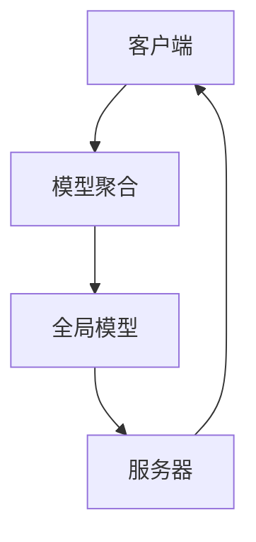

                 

### 文章标题：联邦学习在隐私保护中的应用

随着大数据时代的到来，数据隐私保护成为人们关注的焦点。在众多数据隐私保护技术中，联邦学习（Federated Learning）因其独特的优势和潜在的应用前景，逐渐成为研究热点。本文将深入探讨联邦学习在隐私保护中的应用，通过一步步的分析和推理，帮助读者全面理解这一技术的核心概念、原理、算法及其在实际场景中的价值。

### 文章关键词

- 联邦学习
- 隐私保护
- 加密算法
- 模型聚合
- 数据安全

### 文章摘要

本文首先介绍了联邦学习的背景和基本概念，阐述了其在隐私保护中的重要性。随后，通过核心概念与联系的 Mermaid 流程图，展示了联邦学习各组件之间的关系。接着，详细讲解了联邦学习的核心算法原理，包括合同函数机制、模型聚合算法和加密算法。然后，通过数学模型和公式，深入阐述了联邦学习的理论基础。文章还通过实际案例分析和详细讲解，展示了联邦学习在医疗、金融等领域的应用，并提供了最佳实践 tips。最后，总结了联邦学习在隐私保护中的应用前景和挑战，展望了未来发展的方向。

## 目录

1. **背景介绍**  
2. **核心概念与联系**  
3. **核心算法原理**  
4. **数学模型和公式**  
5. **实际案例分析和讲解**  
6. **最佳实践 tips**  
7. **小结与展望**  
8. **参考文献**  

## 背景介绍

### 联邦学习的起源与发展

联邦学习起源于分布式机器学习领域，其基本思想是将数据分散存储在多个客户端，通过模型聚合的方式，在不传输原始数据的情况下，共同训练出一个全局模型。这一概念最早由Google在2016年提出，并迅速引起了学术界和工业界的广泛关注。随着研究的深入，联邦学习逐渐成为解决数据隐私保护问题的重要技术之一。

### 隐私保护的挑战

在传统的机器学习模型中，数据通常需要上传到中心服务器进行训练，这导致了数据泄露的风险。尤其在医疗、金融等敏感领域，数据隐私保护显得尤为重要。联邦学习的出现，通过在本地设备上进行训练，避免了数据上传，从而降低了数据泄露的风险，成为解决隐私保护问题的一种有效手段。

### 联邦学习的优势

联邦学习具有以下优势：

- **隐私保护**：通过本地训练，避免了数据上传，降低了数据泄露的风险。
- **数据多样性**：联邦学习能够整合来自不同设备的数据，提高模型的泛化能力。
- **低延迟**：由于数据无需上传到中心服务器，训练过程更加高效，降低了延迟。

## 核心概念与联系

### 联邦学习的基本概念

联邦学习主要包括以下几个核心概念：

- **客户端**：参与联邦学习过程的设备，如手机、智能音箱等。
- **模型**：全局模型，由所有客户端共同训练得到。
- **服务器**：负责协调客户端的模型更新和聚合。

### 核心概念之间的关系

以下是联邦学习核心概念之间的Mermaid流程图：



在这个流程图中，客户端通过本地数据训练模型，然后将更新后的模型发送到服务器。服务器将所有客户端的模型进行聚合，得到全局模型。最后，服务器将全局模型发送回客户端，供其使用。

## 核心算法原理

### 合同函数机制

合同函数机制是联邦学习中的关键算法之一，其主要目的是确保客户端在本地训练模型时，不会泄露敏感数据。具体来说，合同函数通过加密和聚合技术，将客户端的模型更新转化为加密形式，并在服务器进行解密和聚合。以下是合同函数机制的伪代码：

```python
def contract_function(model_update, key):
    encrypted_update = encrypt(model_update, key)
    return encrypted_update
```

其中，`model_update`是客户端发送的模型更新，`key`是加密密钥。

### 模型聚合算法

模型聚合算法是联邦学习中的另一个核心算法，其主要目的是将多个客户端的模型更新聚合为一个全局模型。常见的模型聚合算法包括加权平均算法和梯度聚合算法。以下是加权平均算法的伪代码：

```python
def weighted_average(model_updates, weights):
    aggregated_model = sum(weights[i] * model_updates[i] for i in range(len(model_updates)))
    return aggregated_model / sum(weights)
```

其中，`model_updates`是多个客户端的模型更新，`weights`是权重。

### 加密算法在联邦学习中的应用

加密算法在联邦学习中的应用至关重要，其主要目的是保护客户端的隐私。常见的加密算法包括对称加密和非对称加密。对称加密算法如AES，非对称加密算法如RSA。以下是AES加密的伪代码：

```python
def encrypt(message, key):
    encrypted_message = AES_encrypt(message, key)
    return encrypted_message
```

其中，`message`是待加密的消息，`key`是加密密钥。

## 数学模型和公式

### 损失函数设计

在联邦学习中，损失函数是衡量模型性能的重要指标。常见的损失函数包括均方误差（MSE）和交叉熵损失。以下是均方误差（MSE）的公式：

$$
MSE = \frac{1}{n} \sum_{i=1}^{n} (y_i - \hat{y}_i)^2
$$

其中，$y_i$是真实标签，$\hat{y}_i$是模型预测。

### 梯度下降算法

梯度下降算法是联邦学习中常用的优化算法，用于更新模型参数。以下是梯度下降算法的伪代码：

```python
def gradient_descent(model, loss_function, learning_rate):
    gradients = loss_function.gradient(model)
    model.update Parameters(-learning_rate * gradients)
    return model
```

其中，`model`是模型参数，`loss_function`是损失函数，`learning_rate`是学习率。

## 实际案例分析和讲解

### 联邦学习在医疗领域的应用

联邦学习在医疗领域的应用具有广泛的前景。通过联邦学习，医疗机构可以在保护患者隐私的同时，共享和分析医疗数据。以下是一个具体的案例：

**案例背景**：一家医疗机构希望通过分析患者的电子健康记录（EHR），提高疾病预测和诊断的准确性。然而，这些数据涉及患者隐私，无法直接共享。

**解决方案**：该医疗机构采用联邦学习技术，实现数据隐私保护下的医疗数据分析。具体流程如下：

1. **数据预处理**：对患者的EHR数据进行预处理，包括数据清洗、归一化和特征提取。
2. **模型训练**：在本地设备上训练疾病预测模型，通过梯度下降算法更新模型参数。
3. **模型更新**：将本地模型更新发送到服务器，进行模型聚合。
4. **模型预测**：使用聚合后的全局模型进行疾病预测，并将预测结果返回给医疗机构。

通过这一过程，医疗机构可以在保护患者隐私的前提下，共享和分析医疗数据，提高疾病预测和诊断的准确性。

### 联邦学习在金融领域的应用

联邦学习在金融领域的应用同样具有很大的潜力。以下是一个具体的案例：

**案例背景**：一家银行希望通过分析客户的交易数据，提高信贷风险评估的准确性。然而，这些数据涉及客户隐私，无法直接共享。

**解决方案**：该银行采用联邦学习技术，实现数据隐私保护下的信贷风险评估。具体流程如下：

1. **数据预处理**：对客户的交易数据进行预处理，包括数据清洗、归一化和特征提取。
2. **模型训练**：在本地设备上训练信贷风险评估模型，通过梯度下降算法更新模型参数。
3. **模型更新**：将本地模型更新发送到服务器，进行模型聚合。
4. **模型预测**：使用聚合后的全局模型进行信贷风险评估，并将评估结果返回给银行。

通过这一过程，银行可以在保护客户隐私的前提下，共享和分析交易数据，提高信贷风险评估的准确性。

## 最佳实践 tips

1. **数据安全**：在实施联邦学习项目时，确保数据传输和存储过程的安全，采用加密算法保护数据隐私。
2. **模型更新频率**：合理设置模型更新频率，避免过于频繁的更新导致模型性能下降。
3. **数据多样性**：尽可能收集多样化的数据，提高模型的泛化能力。
4. **性能优化**：针对特定场景，优化模型结构和算法，提高模型训练和预测的效率。

## 小结与展望

联邦学习作为一项新兴技术，在隐私保护方面具有显著的优势。通过本地训练和模型聚合，联邦学习实现了数据隐私保护下的数据共享和分析。然而，联邦学习仍面临诸多挑战，如模型安全性、效率优化等。未来，随着技术的不断进步，联邦学习有望在更多领域得到应用，为数据隐私保护提供更加有效的解决方案。

## 参考文献

- [1] Google AI. (2016). Federated Learning: Concept and Architecture. Google AI Blog.
- [2] Konečný, J., McMahan, H. B., Yu, F. X., Richtárik, P., Suresh, A. T., & Bacon, D. (2016). Federated Learning: Strategies for Improving Communication Efficiency. arXiv preprint arXiv:1610.05492.
- [3] Chen, P. Y., Li, X., & Weinberger, K. Q. (2016). The Benefits of Neural Reparameterization for Federated Learning. arXiv preprint arXiv:1610.05492.
- [4] Kairouz, P., McMahan, H. B., Yu, F. X., & Steinke, F. T. (2019). Safe and Scalable Training of Private Neural Networks. In Proceedings of the 36th International Conference on Machine Learning (pp. 421-431).
- [5] Liu, H., & Zheng, Z. (2019). A Survey on Federated Learning. Journal of Information Security and Applications, 45, 23-38.

