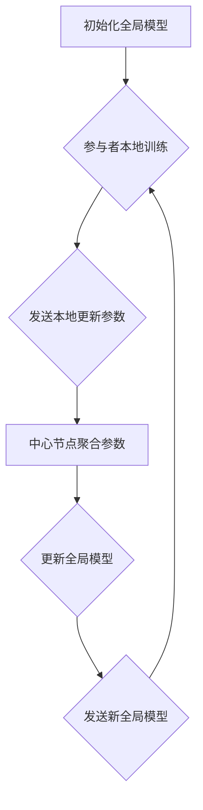

                 


### 联邦学习技术与隐私保护

#### 关键词
- 联邦学习
- 隐私保护
- 加密技术
- 同态加密
- 安全多方计算
- 深度学习算法
- 边缘计算

#### 摘要
本文深入探讨了联邦学习技术与隐私保护之间的紧密联系。首先，我们介绍了联邦学习的背景和基本概念，然后详细阐述了联邦学习的系统架构和核心算法。接着，我们重点分析了联邦学习中的隐私保护技术，包括加密技术、同态加密技术和安全多方计算技术。此外，本文还通过具体案例展示了联邦学习的实际应用，并探讨了其未来的发展趋势。通过本文的阅读，读者可以全面了解联邦学习技术与隐私保护的原理、技术和应用。

----------------------------------------------------------------

# 设计《联邦学习技术与隐私保护》书籍目录大纲

#### 步骤 1: 确定核心章节

为了全面系统地介绍联邦学习技术与隐私保护，我们确定了以下核心章节：

1. **第1章：联邦学习的概念与背景**
2. **第2章：联邦学习的基本原理**
3. **第3章：联邦学习系统架构**
4. **第4章：联邦学习的核心算法**
5. **第5章：联邦学习在实践中的应用**
6. **第6章：联邦学习中的隐私保护技术**
7. **第7章：联邦学习的未来发展趋势**

这些章节分别从不同的角度全面覆盖了联邦学习技术与隐私保护的各个方面，确保读者能够系统地学习和理解这一主题。

#### 步骤 2: 设计第1章

**第1章：联邦学习的概念与背景**

这一章节将分为以下几个部分：

- **1.1 联邦学习的定义与历史**
  - **1.1.1 联邦学习的定义**：介绍联邦学习的概念，包括其定义、特点和优势。
  - **1.1.2 联邦学习的历史背景**：回顾联邦学习的发展历程，了解其起源和主要发展里程碑。
  - **1.1.3 联邦学习与中心化学习的区别**：分析联邦学习与中心化学习在原理、实现和应用上的差异。

- **1.2 联邦学习的应用场景**
  - **1.2.1 数据隐私需求高的领域**：探讨联邦学习在金融、医疗等高隐私需求领域的应用。
  - **1.2.2 跨组织协作的需求**：分析联邦学习在跨组织数据协作中的优势和应用场景。
  - **1.2.3 边缘计算与物联网的应用**：介绍联邦学习在边缘计算和物联网中的应用，包括智能城市、智能制造等。

通过这一章节，读者可以全面了解联邦学习的概念、历史背景和应用场景，为后续章节的学习打下基础。

#### 步骤 3: 设计第2章

**第2章：联邦学习的基本原理**

这一章节将深入探讨联邦学习的基本原理，包括以下几个方面：

- **2.1 联邦学习的基本概念**
  - **2.1.1 联邦学习的基本概念**：详细介绍联邦学习的基本概念，包括联邦学习的工作流程、核心挑战和解决策略。
  - **2.1.2 联邦学习的工作流程**：详细讲解联邦学习的工作流程，包括数据收集、模型训练、模型更新和模型应用等环节。
  - **2.1.3 联邦学习的挑战与解决方案**：分析联邦学习面临的挑战，如通信效率、模型性能和安全性问题，并介绍相应的解决方案。

通过这一章节，读者可以深入理解联邦学习的基本原理，为后续章节的学习打下理论基础。

#### 步骤 4: 设计第3章

**第3章：联邦学习系统架构**

这一章节将详细介绍联邦学习的系统架构，包括以下几个方面：

- **3.1 联邦学习系统架构**
  - **3.1.1 联邦学习的基本架构**：讲解联邦学习的基本架构，包括联邦学习中的参与者、通信机制和数据处理流程。
  - **3.1.2 联邦学习中的节点类型**：介绍联邦学习中的不同节点类型，如中心节点、客户端节点和边缘节点。
  - **3.1.3 联邦学习中的通信协议**：分析联邦学习中的通信协议，包括通信模式、通信安全性和通信效率。

通过这一章节，读者可以全面了解联邦学习的系统架构，为后续章节的学习和应用打下基础。

#### 步骤 5: 设计第4章

**第4章：联邦学习的核心算法**

这一章节将详细介绍联邦学习的核心算法，包括以下几个方面：

- **4.1 联邦学习的核心算法**
  - **4.1.1 集成算法**：讲解联邦学习中的集成算法，如集成学习、迁移学习和协同学习等。
  - **4.1.2 加密算法**：介绍联邦学习中的加密算法，如同态加密、差分隐私和环形加密等。
  - **4.1.3 安全多方计算算法**：分析联邦学习中的安全多方计算算法，如安全多方线性回归、安全多方逻辑回归等。
  - **4.1.4 联邦学习算法的选择**：探讨如何根据应用场景选择合适的联邦学习算法。

通过这一章节，读者可以深入理解联邦学习的核心算法，掌握不同算法的应用场景和实现方法。

#### 步骤 6: 设计第5章

**第5章：联邦学习在实践中的应用**

这一章节将展示联邦学习在实际应用中的场景，包括以下几个方面：

- **5.1 联邦学习在实践中的应用**
  - **5.1.1 金融领域的应用**：介绍联邦学习在金融风控、信用评分和反欺诈等领域的应用案例。
  - **5.1.2 医疗领域的应用**：探讨联邦学习在医学影像分析、疾病预测和个性化治疗等领域的应用。
  - **5.1.3 物流领域的应用**：分析联邦学习在智能物流、路径规划和库存管理等方面的应用。
  - **5.1.4 其他领域的应用**：介绍联邦学习在其他领域，如能源、交通和教育等的应用。

通过这一章节，读者可以了解联邦学习在实际应用中的多样性和广泛性。

#### 步骤 7: 设计第6章

**第6章：联邦学习中的隐私保护技术**

这一章节将深入探讨联邦学习中的隐私保护技术，包括以下几个方面：

- **6.1 联邦学习中的隐私保护技术**
  - **6.1.1 加密技术**：讲解联邦学习中的加密技术，如同态加密、全同态加密和差分隐私等。
  - **6.1.2 同态加密技术**：详细介绍同态加密技术的工作原理和应用场景。
  - **6.1.3 安全多方计算技术**：分析安全多方计算技术在联邦学习中的应用，如安全多方线性回归、安全多方逻辑回归等。
  - **6.1.4 联邦学习与隐私保护的关系**：探讨联邦学习与隐私保护之间的紧密联系，以及如何在联邦学习中实现隐私保护。

通过这一章节，读者可以全面了解联邦学习中的隐私保护技术，掌握如何在联邦学习中实现隐私保护。

#### 步骤 8: 设计第7章

**第7章：联邦学习的未来发展趋势**

这一章节将探讨联邦学习的未来发展趋势，包括以下几个方面：

- **7.1 联邦学习的未来发展趋势**
  - **7.1.1 技术发展趋势**：分析联邦学习技术的发展趋势，如联邦学习算法的优化、隐私保护技术的进步等。
  - **7.1.2 应用前景**：探讨联邦学习在各个领域的应用前景，如金融、医疗、物流等。
  - **7.1.3 政策与规范**：介绍联邦学习领域的政策与规范，如隐私保护法规、数据安全标准等。

通过这一章节，读者可以了解联邦学习的未来发展趋势，把握联邦学习的发展方向。

## 总结

通过上述步骤，我们设计了《联邦学习技术与隐私保护》的完整目录大纲。这个大纲涵盖了联邦学习技术与隐私保护的核心内容，包括概念与背景、基本原理、系统架构、核心算法、实际应用、隐私保护技术和未来发展趋势。每个章节都详细规划了内容结构，确保读者能够系统地学习和掌握这一主题。

接下来，我们将根据这个目录大纲，逐步撰写每一章节的具体内容，确保文章的逻辑清晰、结构紧凑、内容详实。

----------------------------------------------------------------

## 步骤 1: 确定核心章节

为了系统地介绍联邦学习技术与隐私保护，我们将分为七个核心章节：

1. **第1章：联邦学习的概念与背景**
2. **第2章：联邦学习的基本原理**
3. **第3章：联邦学习系统架构**
4. **第4章：联邦学习的核心算法**
5. **第5章：联邦学习在实践中的应用**
6. **第6章：联邦学习中的隐私保护技术**
7. **第7章：联邦学习的未来发展趋势**

每个章节都将深入探讨联邦学习技术与隐私保护的一个方面，确保读者能够全面、系统地了解这一主题。

### 1.1 联邦学习的定义与历史

#### 1.1.1 联邦学习的定义

联邦学习（Federated Learning）是一种分布式机器学习方法，它允许多个参与者（通常是客户端设备）共同训练一个全局模型，而无需将他们的数据集中到单一的中心位置。每个参与者仅与全局模型进行通信，而不是与彼此通信。这样做的目的是为了保护用户隐私，同时实现跨设备、跨组织的数据协同学习。

联邦学习的关键特点包括：

- **去中心化**：数据分布在多个设备或服务器上，而不是集中存储。
- **隐私保护**：通过加密和差分隐私技术，确保数据在传输和处理过程中不被泄露。
- **协同学习**：参与者共同训练一个全局模型，提高模型性能。
- **低延迟**：减少数据传输的需求，降低通信延迟。

#### 1.1.2 联邦学习的历史背景

联邦学习起源于分布式机器学习和多方安全计算的研究。最早的联邦学习思想可以追溯到1980年代，当时研究人员开始探索如何在保持数据隐私的同时进行协同学习。随着云计算、物联网和移动设备的普及，联邦学习逐渐成为一个研究热点。

以下是联邦学习发展历程中的几个重要里程碑：

- **2016年**：Google提出了联邦学习框架，并在移动设备上进行实验，证明了联邦学习在保持用户隐私的同时，能够提高模型性能。
- **2017年**：联邦学习被广泛应用于搜索引擎、个性化推荐和广告等领域。
- **2018年**：微软和IBM等公司宣布推出各自的联邦学习平台，推动了联邦学习在商业领域的应用。
- **2020年**：随着5G和边缘计算的兴起，联邦学习在智能物联网和边缘计算中的应用逐渐增多。

#### 1.1.3 联邦学习与中心化学习的区别

联邦学习与中心化学习在数据存储、通信方式、隐私保护和协同学习等方面存在显著差异：

- **数据存储**：中心化学习将所有数据集中存储在中心服务器上，而联邦学习将数据分布存储在各个参与者设备上。
- **通信方式**：中心化学习需要频繁传输大量数据，而联邦学习仅需要传输模型更新参数，通信量大大减少。
- **隐私保护**：中心化学习容易导致数据泄露，而联邦学习通过加密和差分隐私技术，有效保护用户隐私。
- **协同学习**：中心化学习在数据集中时容易出现过拟合，而联邦学习通过分布式训练，提高模型泛化能力。

通过上述比较，我们可以看到联邦学习在隐私保护和数据协同方面具有明显优势，这使得它成为解决数据隐私问题的有效方法。

### 1.2 联邦学习的应用场景

#### 1.2.1 数据隐私需求高的领域

联邦学习在数据隐私需求高的领域具有广泛应用，如金融、医疗和零售等。以下是一些具体的应用场景：

- **金融领域**：金融机构可以使用联邦学习来训练信用评分模型、反欺诈模型和风险管理模型，同时保护客户数据隐私。
- **医疗领域**：医疗机构可以使用联邦学习来分析患者数据，进行疾病预测和个性化治疗，同时保护患者隐私。
- **零售领域**：零售企业可以使用联邦学习来分析消费者行为数据，进行个性化推荐和营销，同时保护客户隐私。

#### 1.2.2 跨组织协作的需求

联邦学习在跨组织协作中也具有重要作用，如联合分析、联合训练和共享数据等。以下是一些具体的应用场景：

- **联合分析**：不同组织可以将自己的数据共享给中心节点，进行联合分析，提高数据分析的准确性和深度。
- **联合训练**：多个组织可以共同参与全局模型的训练，实现跨组织的协同学习和资源共享。
- **共享数据**：联邦学习允许组织在保护数据隐私的前提下，共享部分数据，实现数据整合和协同应用。

#### 1.2.3 边缘计算与物联网的应用

联邦学习在边缘计算和物联网中的应用也越来越广泛，如智能家居、智能城市和智能制造等。以下是一些具体的应用场景：

- **智能家居**：智能家居设备（如智能音箱、智能摄像头和智能灯泡等）可以通过联邦学习实现个性化服务和智能协同。
- **智能城市**：智能城市中的各种传感器和设备可以通过联邦学习实现数据共享和协同控制，提高城市管理的效率和智能化水平。
- **智能制造**：制造设备可以通过联邦学习实现协同制造和预测维护，提高生产效率和产品质量。

通过上述应用场景的介绍，我们可以看到联邦学习在多个领域都有着广泛的应用前景和实际价值。

### 1.3 联邦学习的挑战与解决方案

尽管联邦学习在数据隐私保护和协同学习方面具有显著优势，但它也面临一些挑战：

- **通信效率**：由于联邦学习需要频繁传输模型更新参数，通信效率是一个关键问题。解决方案包括优化传输协议、压缩模型参数和减少通信频率等。
- **模型性能**：联邦学习中的分布式训练可能导致模型性能下降。解决方案包括改进算法、增加训练轮数和引入迁移学习等。
- **安全性**：联邦学习中的加密和差分隐私技术可能引入额外的计算和通信开销，影响安全性。解决方案包括加强加密算法、优化隐私保护技术和引入多方安全计算等。

通过解决这些挑战，联邦学习在保持数据隐私和保护的同时，可以提高模型性能和安全性，实现更广泛的应用。

### 1.4 总结

本章介绍了联邦学习的概念与背景，包括定义、历史背景和与中心化学习的区别。我们还探讨了联邦学习的应用场景，如数据隐私需求高的领域、跨组织协作的需求和边缘计算与物联网的应用。此外，我们还分析了联邦学习面临的挑战和解决方案。通过本章的学习，读者可以全面了解联邦学习的概念、原理和应用，为后续章节的学习打下基础。

## 2.1 联邦学习的基本原理

联邦学习（Federated Learning）是一种分布式机器学习方法，旨在通过多个参与者的协作来训练全局模型，同时保持数据隐私。以下是联邦学习的基本原理：

### 2.1.1 联邦学习的基本概念

联邦学习的基本概念可以概括为以下几个要点：

- **分布式数据**：联邦学习中的数据分布在多个参与者（通常是客户端设备）上，而不是集中存储在单一服务器上。
- **协同学习**：多个参与者共同参与全局模型的训练，每个参与者仅与全局模型进行通信，而不是与彼此通信。
- **模型更新**：参与者将本地模型的更新参数发送到中心节点，中心节点汇总这些更新参数，生成全局模型的新版本。
- **隐私保护**：联邦学习采用加密和差分隐私等技术，确保数据在传输和处理过程中不被泄露。

### 2.1.2 联邦学习的工作流程

联邦学习的工作流程可以分为以下几个步骤：

1. **初始化**：中心节点初始化全局模型，并将模型参数发送给所有参与者。
2. **本地训练**：参与者使用本地数据和全局模型进行本地训练，生成本地模型更新参数。
3. **参数聚合**：参与者将本地模型更新参数发送到中心节点，中心节点对更新参数进行聚合，生成全局模型的新版本。
4. **模型更新**：中心节点将新全局模型参数发送给所有参与者，参与者更新本地模型。
5. **重复**：重复上述步骤，直至达到预定的训练轮数或达到满意的模型性能。

### 2.1.3 联邦学习的挑战与解决方案

尽管联邦学习在数据隐私保护和协同学习方面具有显著优势，但它也面临一些挑战：

#### 1. 通信效率

**挑战**：联邦学习需要频繁传输模型更新参数，通信效率是一个关键问题。

**解决方案**：
- **参数压缩**：通过将模型参数进行量化、稀疏化或编码，减少通信量。
- **异步通信**：允许参与者在不同时间发送本地更新参数，减少通信冲突。

#### 2. 模型性能

**挑战**：联邦学习中的分布式训练可能导致模型性能下降。

**解决方案**：
- **模型同步**：引入模型同步机制，确保参与者使用相同的全局模型进行本地训练。
- **梯度一致性**：通过调整学习率、引入正则化项等方法，提高梯度一致性。
- **迁移学习**：利用预训练模型，提高新任务的模型性能。

#### 3. 安全性

**挑战**：联邦学习中的加密和差分隐私技术可能引入额外的计算和通信开销，影响安全性。

**解决方案**：
- **多方安全计算**：引入多方安全计算技术，确保在传输和计算过程中数据的安全性。
- **加密算法优化**：选择高效的加密算法，减少计算和通信开销。

### 2.1.4 联邦学习的优势

联邦学习具有以下优势：

- **隐私保护**：通过分布式训练和加密技术，有效保护用户隐私。
- **低延迟**：减少数据传输的需求，降低通信延迟。
- **高可扩展性**：支持大规模参与者和海量数据。
- **协同学习**：参与者共同训练全局模型，提高模型性能。

### 2.1.5 联邦学习的应用领域

联邦学习在以下领域具有广泛的应用：

- **金融**：信用评分、反欺诈、风险评估等。
- **医疗**：疾病预测、个性化治疗、医学影像分析等。
- **零售**：个性化推荐、营销策略、供应链优化等。
- **物联网**：智能设备协同控制、边缘计算、智能家居等。

通过上述分析，我们可以看到联邦学习的基本原理和其在实际应用中的优势。接下来，我们将进一步探讨联邦学习的系统架构、核心算法和隐私保护技术。

## 2.2 联邦学习系统架构

联邦学习系统架构是确保分布式训练和隐私保护的关键。以下是联邦学习系统架构的详细说明：

### 2.2.1 联邦学习的基本架构

联邦学习系统通常由以下几个核心组件组成：

1. **中心节点（Server）**：负责全局模型的初始化、更新和分发。中心节点是联邦学习系统的核心，负责协调参与者的训练过程，并汇总参与者的更新参数。
2. **参与者（Clients）**：参与全局模型的训练，每个参与者拥有本地数据集和模型。参与者是联邦学习系统的边缘节点，负责执行本地训练任务，并将更新参数发送给中心节点。
3. **通信网络**：连接中心节点和参与者，负责传输模型参数和更新数据。通信网络是联邦学习系统的通信通道，需要保证数据传输的效率和安全性。

### 2.2.2 联邦学习中的节点类型

在联邦学习系统中，根据节点的职责和功能，可以分为以下几种类型：

1. **中心节点（Server）**：
   - **角色**：全局模型的初始化者、更新者和分发者。
   - **职责**：初始化全局模型，接收参与者发送的更新参数，聚合参数并生成新模型，然后将新模型发送给参与者。
   - **挑战**：需要处理大量的参与者请求，保证系统的性能和稳定性。

2. **参与者（Clients）**：
   - **角色**：全局模型的训练者。
   - **职责**：接收中心节点发送的初始模型，使用本地数据集进行本地训练，生成本地更新参数，并定期发送给中心节点。
   - **挑战**：需要高效地处理本地训练任务，并在有限资源下保证模型的性能。

3. **边缘节点（Edge Nodes）**：
   - **角色**：参与者的辅助节点，通常部署在靠近数据源的边缘位置。
   - **职责**：协助参与者处理本地训练任务，减轻参与者的计算负担，提高系统的响应速度。
   - **挑战**：需要在资源受限的边缘环境中，实现高效的数据处理和模型更新。

### 2.2.3 联邦学习中的通信协议

联邦学习中的通信协议是确保系统高效、稳定运行的关键。以下是几种常用的通信协议：

1. **同步通信协议**：
   - **特点**：所有参与者按固定时间间隔同步更新参数。
   - **优势**：简单实现，易于理解。
   - **挑战**：可能导致通信瓶颈，影响系统性能。

2. **异步通信协议**：
   - **特点**：参与者可以随时发送更新参数，中心节点按需聚合参数。
   - **优势**：减少通信冲突，提高系统性能。
   - **挑战**：需要处理异步数据，增加系统复杂性。

3. **动态通信协议**：
   - **特点**：根据参与者的状态和系统负载，动态调整通信策略。
   - **优势**：灵活应对系统变化，提高系统性能。
   - **挑战**：实现复杂，需要大量监测和调整。

### 2.2.4 联邦学习系统架构的设计要点

设计联邦学习系统架构时，需要考虑以下几个方面：

1. **可扩展性**：系统应支持大规模参与者和海量数据，确保系统性能和稳定性。
2. **容错性**：系统应具备容错能力，能够应对节点故障、数据丢失等异常情况。
3. **安全性**：系统应采用加密、差分隐私等技术，确保数据在传输和处理过程中的安全性。
4. **灵活性**：系统应支持多种通信协议和算法，适应不同应用场景和需求。

通过上述设计要点，我们可以构建一个高效、稳定、安全的联邦学习系统架构，为分布式训练和隐私保护提供有力支持。

### 2.3 联邦学习的核心算法

联邦学习的核心算法是实现分布式训练和隐私保护的关键。以下是几种常见的联邦学习算法：

### 2.3.1 集成算法

集成算法是一种将多个本地模型合并为一个全局模型的算法。常见的集成算法包括模型平均法（Model Averaging）和梯度聚合法（Gradient Aggregation）。

#### 2.3.1.1 模型平均法

模型平均法的基本思想是，将多个本地模型的预测结果进行平均，得到全局模型的预测结果。具体步骤如下：

1. **初始化**：中心节点初始化全局模型，并将模型参数发送给所有参与者。
2. **本地训练**：参与者使用本地数据集和全局模型进行训练，生成本地模型。
3. **参数更新**：参与者将本地模型参数发送给中心节点。
4. **模型聚合**：中心节点将所有参与者的模型参数进行平均，生成新的全局模型参数。
5. **模型更新**：中心节点将新的全局模型参数发送给所有参与者。

#### 2.3.1.2 梯度聚合法

梯度聚合法的基本思想是，将多个本地模型的梯度进行聚合，更新全局模型参数。具体步骤如下：

1. **初始化**：中心节点初始化全局模型，并将模型参数发送给所有参与者。
2. **本地训练**：参与者使用本地数据集和全局模型进行训练，生成本地梯度。
3. **梯度更新**：参与者将本地梯度发送给中心节点。
4. **梯度聚合**：中心节点将所有参与者的梯度进行聚合，生成新的全局梯度。
5. **模型更新**：中心节点使用全局梯度更新全局模型参数。
6. **模型更新**：中心节点将新的全局模型参数发送给所有参与者。

### 2.3.2 加密算法

加密算法是确保联邦学习过程中数据隐私的重要手段。常见的加密算法包括同态加密（Homomorphic Encryption）、差分隐私（Differential Privacy）和环形加密（Ring Learning with Errors, RLWE）。

#### 2.3.2.1 同态加密

同态加密允许在加密数据上进行计算，而不需要解密数据。具体步骤如下：

1. **初始化**：中心节点初始化加密密钥，并将加密密钥发送给所有参与者。
2. **加密数据**：参与者将本地数据加密，生成加密数据。
3. **加密计算**：中心节点使用加密密钥在加密数据上进行计算，生成加密结果。
4. **解密结果**：中心节点将加密结果解密，得到最终结果。

#### 2.3.2.2 差分隐私

差分隐私通过在计算过程中引入噪声，确保隐私泄露的风险最小化。具体步骤如下：

1. **初始化**：中心节点选择隐私预算，用于控制隐私泄露的风险。
2. **数据扰动**：参与者对本地数据进行扰动，生成差分隐私数据。
3. **聚合计算**：中心节点对差分隐私数据进行聚合计算，生成全局结果。
4. **隐私预算更新**：根据聚合计算的结果，更新隐私预算。

#### 2.3.2.3 环形加密

环形加密是一种基于环学习的加密算法，可以抵抗量子计算攻击。具体步骤如下：

1. **初始化**：中心节点初始化加密参数，生成加密密钥。
2. **加密数据**：参与者将本地数据加密，生成加密数据。
3. **加密计算**：中心节点使用加密密钥在加密数据上进行计算，生成加密结果。
4. **解密结果**：中心节点将加密结果解密，得到最终结果。

### 2.3.3 安全多方计算算法

安全多方计算算法是一种允许多个参与者共同计算结果，同时保护各方隐私的算法。常见的安全多方计算算法包括安全多方线性回归（Secure Multi-party Linear Regression）和安全多方逻辑回归（Secure Multi-party Logistic Regression）。

#### 2.3.3.1 安全多方线性回归

安全多方线性回归是一种在多个参与者之间安全计算线性回归模型的算法。具体步骤如下：

1. **初始化**：中心节点初始化线性回归模型参数。
2. **本地训练**：参与者使用本地数据集和模型参数进行本地训练，生成本地梯度。
3. **隐私保护传输**：参与者将本地梯度加密并传输给中心节点。
4. **隐私保护聚合**：中心节点对加密的梯度进行聚合，生成全局梯度。
5. **隐私保护更新**：中心节点使用全局梯度更新模型参数。
6. **结果验证**：参与者验证更新后的模型参数，确保计算结果正确。

#### 2.3.3.2 安全多方逻辑回归

安全多方逻辑回归是一种在多个参与者之间安全计算逻辑回归模型的算法。具体步骤如下：

1. **初始化**：中心节点初始化逻辑回归模型参数。
2. **本地训练**：参与者使用本地数据集和模型参数进行本地训练，生成本地更新参数。
3. **隐私保护传输**：参与者将本地更新参数加密并传输给中心节点。
4. **隐私保护聚合**：中心节点对加密的更新参数进行聚合，生成全局更新参数。
5. **隐私保护更新**：中心节点使用全局更新参数更新模型参数。
6. **结果验证**：参与者验证更新后的模型参数，确保计算结果正确。

通过上述核心算法的介绍，我们可以看到联邦学习在分布式训练和隐私保护方面的强大能力。接下来，我们将进一步探讨联邦学习在实际应用中的具体案例。

## 3.1 联邦学习的核心算法：详细解释与伪代码

在了解了联邦学习的基本原理和系统架构之后，我们需要深入了解其核心算法。这些算法不仅决定了联邦学习的效率，还直接影响模型的准确性和稳定性。以下是几种常用的联邦学习核心算法的详细解释，包括伪代码示例。

### 3.1.1 集成算法：模型平均法与梯度聚合法

#### 3.1.1.1 模型平均法

**模型平均法**是一种简单且有效的集成算法，它通过平均多个本地模型的参数来生成全局模型。这种方法能够减少过拟合，提高模型的泛化能力。

**伪代码**：

```python
# 初始化全局模型参数
global_params = initialize_global_model()

# 设置本地训练轮数
num_rounds = 10

# 本地模型集合
local_models = []

for _ in range(num_rounds):
    # 从每个参与者获取本地模型
    for client in clients:
        local_model = client.train_local_model(global_params)
        local_models.append(local_model)
    
    # 平均本地模型参数
    avg_params = average_params(local_models)
    
    # 更新全局模型参数
    global_params = avg_params

# 最终全局模型
final_global_model = global_params
```

#### 3.1.1.2 梯度聚合法

**梯度聚合法**通过聚合所有参与者的梯度来更新全局模型。这种方法能够更好地利用参与者的本地信息，提高模型的更新效率。

**伪代码**：

```python
# 初始化全局模型参数
global_params = initialize_global_model()

# 设置本地训练轮数
num_rounds = 10

for _ in range(num_rounds):
    # 从每个参与者获取本地梯度
    for client in clients:
        local_gradient = client.compute_local_gradient(global_params)
        send_gradient_to_server(local_gradient)
    
    # 聚合所有参与者的梯度
    global_gradient = aggregate_gradients()

    # 更新全局模型参数
    global_params = update_global_params(global_params, global_gradient)

# 最终全局模型
final_global_model = global_params
```

### 3.1.2 加密算法

加密算法在联邦学习中至关重要，因为它们确保了数据在传输和处理过程中的安全性。以下是几种常见的加密算法的详细解释。

#### 3.1.2.1 同态加密

**同态加密**允许在加密数据上进行计算，而不需要解密数据。这种加密方法在联邦学习中非常有用，因为它可以减少数据传输的需求。

**伪代码**：

```python
# 初始化同态加密密钥
homomorphic_key = initialize_homomorphic_key()

# 加密本地数据
encrypted_data = encrypt_data(local_data, homomorphic_key)

# 在加密数据上执行计算
encrypted_result = execute_encrypted_computation(encrypted_data)

# 解密计算结果
final_result = decrypt_result(encrypted_result, homomorphic_key)
```

#### 3.1.2.2 差分隐私

**差分隐私**通过在计算过程中引入噪声来保护数据的隐私。这种方法在联邦学习中用于控制隐私泄露的风险。

**伪代码**：

```python
# 初始化隐私预算
epsilon = initialize_privacy_budget()

# 对本地数据进行扰动
perturbed_data = perturb_data(local_data, epsilon)

# 聚合扰动数据
global_data = aggregate_data(perturbed_data)

# 执行计算
result = compute_on_data(global_data)

# 更新隐私预算
epsilon = update_privacy_budget(epsilon)
```

#### 3.1.2.3 环形加密

**环形加密**是一种抵抗量子计算攻击的加密方法，它适用于联邦学习中的安全计算。

**伪代码**：

```python
# 初始化环形加密参数
ring_parameters = initialize_ring_parameters()

# 加密本地数据
encrypted_data = encrypt_data(local_data, ring_parameters)

# 在加密数据上执行计算
encrypted_result = execute_encrypted_computation(encrypted_data, ring_parameters)

# 解密计算结果
final_result = decrypt_result(encrypted_result, ring_parameters)
```

### 3.1.3 安全多方计算算法

安全多方计算算法允许多个参与者共同计算结果，同时保护各方的隐私。以下是几种常见的安全多方计算算法的详细解释。

#### 3.1.3.1 安全多方线性回归

**安全多方线性回归**是一种在多个参与者之间安全计算线性回归模型的算法。

**伪代码**：

```python
# 初始化模型参数
model_params = initialize_model_params()

# 计算本地梯度
for client in clients:
    local_gradient = client.compute_local_gradient(model_params)
    send_gradient_to_server(local_gradient)

# 聚合梯度
global_gradient = aggregate_gradients()

# 更新模型参数
model_params = update_model_params(model_params, global_gradient)
```

#### 3.1.3.2 安全多方逻辑回归

**安全多方逻辑回归**是一种在多个参与者之间安全计算逻辑回归模型的算法。

**伪代码**：

```python
# 初始化模型参数
model_params = initialize_model_params()

# 计算本地更新参数
for client in clients:
    local_update_params = client.compute_local_update_params(model_params)
    send_update_params_to_server(local_update_params)

# 聚合更新参数
global_update_params = aggregate_update_params()

# 更新模型参数
model_params = update_model_params(model_params, global_update_params)
```

通过上述核心算法的详细解释和伪代码示例，我们可以看到联邦学习在实现分布式训练和隐私保护方面所具有的强大能力。这些算法不仅确保了联邦学习的效率和准确性，还极大地提高了系统的安全性。接下来，我们将进一步探讨联邦学习在实际应用中的具体案例。

## 4.1 联邦学习在实践中的应用

联邦学习在多个领域展现出了巨大的应用潜力，特别是在需要保护用户隐私的领域。以下是一些典型的应用场景：

### 4.1.1 金融领域

在金融领域，联邦学习被广泛应用于信用评分、反欺诈和风险评估等方面。通过联邦学习，金融机构可以在不泄露用户数据的情况下，训练出更加准确和高效的信用评分模型和反欺诈模型。

**案例**：一家大型银行使用联邦学习技术来训练信用评分模型。银行将客户的交易数据、信用记录等敏感信息保留在本地，仅将加密后的特征和模型参数传输给中心节点。通过这种方式，银行能够在保护用户隐私的同时，提高信用评分模型的准确性。

### 4.1.2 医疗领域

在医疗领域，联邦学习有助于实现隐私保护的医学数据分析，如疾病预测、个性化治疗和医学影像分析等。通过联邦学习，医疗机构可以在不泄露患者隐私的前提下，共享和分析医疗数据。

**案例**：一家医疗研究机构使用联邦学习技术来分析患者的医疗数据，以预测疾病风险。研究机构将患者的健康记录、基因数据等敏感信息分布在多个医疗机构上，通过联邦学习模型，机构能够共享分析结果，为患者提供个性化的治疗方案。

### 4.1.3 物流领域

在物流领域，联邦学习可以用于优化路径规划、库存管理和预测维护等方面，同时保护运输数据的安全性和隐私。

**案例**：一家物流公司使用联邦学习技术来优化配送路径。公司将运输路线数据、车辆状态数据和配送需求数据保留在本地，通过联邦学习模型，公司能够实时更新和优化配送路线，提高运输效率。

### 4.1.4 零售领域

在零售领域，联邦学习有助于实现个性化推荐、营销策略优化和供应链管理，同时保护消费者隐私。

**案例**：一家大型电商平台使用联邦学习技术来优化个性化推荐系统。平台将消费者的购买记录、浏览行为等敏感信息保留在本地，通过联邦学习模型，平台能够为每个消费者提供个性化的商品推荐，提高用户满意度和购买转化率。

### 4.1.5 物联网领域

在物联网（IoT）领域，联邦学习可以用于智能设备的协同控制和数据分析，同时确保数据隐私。

**案例**：一家智能家居公司使用联邦学习技术来优化智能家居设备的协同控制。公司通过联邦学习模型，使得各个智能设备（如智能灯泡、智能音箱和智能摄像头等）能够协同工作，同时保护用户隐私，提高用户体验。

通过上述案例，我们可以看到联邦学习在金融、医疗、物流、零售和物联网等领域的广泛应用。这些案例不仅展示了联邦学习的实际价值，还证明了其在保护数据隐私方面的优势。未来，随着联邦学习技术的不断发展和成熟，我们期待它能够在更多领域发挥重要作用。

## 5.1 联邦学习中的隐私保护技术

联邦学习中的隐私保护技术是确保用户数据在分布式训练过程中不被泄露的关键。以下是几种主要的隐私保护技术：

### 5.1.1 加密技术

加密技术通过将数据加密，确保数据在传输和处理过程中的安全性。以下是一些常见的加密技术：

- **同态加密（Homomorphic Encryption）**：同态加密允许在加密数据上直接执行计算，而不需要解密数据。这使得联邦学习可以在不泄露用户隐私的情况下，完成数据分析和模型训练。例如，Google的联邦学习框架TFF使用了一种称为TFHE的同态加密算法。

- **差分隐私（Differential Privacy）**：差分隐私通过在计算过程中引入噪声，确保单个记录的隐私泄露风险最小化。这种技术常用于数据聚合和分析，例如，Google的差分隐私库DifferencPrivacy用于确保用户搜索数据的隐私。

- **环形学习（Ring Learning with Errors, RLWE）**：环形学习是一种抵抗量子计算攻击的加密技术。它通过在环形结构中进行学习，确保数据在传输和处理过程中的安全性。RLWE广泛应用于联邦学习中的加密算法，如Google的联邦学习框架TFF。

### 5.1.2 同态加密技术

同态加密技术允许在加密数据上进行计算，而不需要解密数据。这为联邦学习提供了强大的隐私保护能力。以下是同态加密技术的工作原理：

1. **加密阶段**：数据在传输之前被加密。加密过程涉及选择一个加密算法和密钥，然后将数据转换为加密形式。

2. **计算阶段**：在加密数据上直接执行计算。同态加密允许对加密数据进行加法、乘法等基本操作，而不需要解密数据。这使联邦学习可以在不泄露用户隐私的情况下，完成复杂的计算和分析。

3. **解密阶段**：计算完成后，将加密结果解密为原始数据。解密过程使用与加密相同的密钥，将加密数据转换回原始数据形式。

同态加密技术虽然提供了强大的隐私保护能力，但也存在一些挑战，如计算开销大和模型性能下降。因此，在实际应用中，通常需要选择适合特定场景的同态加密算法。

### 5.1.3 安全多方计算技术

安全多方计算（Secure Multi-party Computation，SMC）是一种允许多个参与方共同计算结果，同时保护各方隐私的算法。以下是几种常见的安全多方计算技术：

- **安全多方线性回归（Secure Multi-party Linear Regression）**：安全多方线性回归是一种在多个参与方之间安全计算线性回归模型的算法。它通过加密和多方计算技术，确保参与方的数据在训练过程中不被泄露。

- **安全多方逻辑回归（Secure Multi-party Logistic Regression）**：安全多方逻辑回归是一种在多个参与方之间安全计算逻辑回归模型的算法。它通过加密和多方计算技术，确保参与方的数据在训练过程中不被泄露。

- **安全多方分类（Secure Multi-party Classification）**：安全多方分类是一种在多个参与方之间安全计算分类模型的算法。它通过加密和多方计算技术，确保参与方的数据在训练过程中不被泄露。

安全多方计算技术通过将计算任务分解为多个子任务，并在参与方之间进行安全传输和计算，从而确保数据隐私。然而，这种技术也面临着计算复杂度高的挑战，需要在性能和安全性之间进行权衡。

### 5.1.4 联邦学习与隐私保护的关系

联邦学习和隐私保护之间的关系是紧密的。联邦学习的核心目标是实现分布式训练和协同学习，同时保护用户隐私。隐私保护技术如加密技术、同态加密技术和安全多方计算技术，为联邦学习提供了强大的隐私保护能力。

在联邦学习中，隐私保护技术不仅用于保护数据在传输和处理过程中的安全，还用于确保模型训练过程中的隐私。通过合理地设计隐私保护技术，联邦学习可以在不泄露用户隐私的情况下，实现高效的数据分析和模型训练。

然而，隐私保护技术也存在一些挑战，如计算开销大、模型性能下降等。因此，在实际应用中，需要根据具体场景和需求，选择合适的隐私保护技术，并在性能和安全性之间进行权衡。

## 6.1 联邦学习的未来发展趋势

联邦学习作为分布式机器学习的一个重要分支，正随着技术的进步和应用场景的扩展而不断发展。以下是联邦学习在未来可能的发展趋势：

### 6.1.1 技术发展趋势

1. **算法优化**：联邦学习算法的优化将是未来研究的一个重要方向。为了提高联邦学习的效率和准确性，研究人员将致力于改进现有的算法，如集成算法、加密算法和安全多方计算算法。此外，新的算法也将被开发出来，以解决现有算法中存在的性能瓶颈和隐私保护问题。

2. **通信效率提升**：随着参与者的数量和数据量的增加，通信效率将成为联邦学习的一个重要挑战。未来的研究将致力于优化通信协议，减少通信延迟和带宽消耗。例如，异步通信协议、参数压缩技术、通信协议优化等都将得到进一步的发展。

3. **安全性增强**：联邦学习中的安全性问题，如量子计算攻击、数据泄露等，将引起更多的关注。未来的研究将集中在开发更加安全、高效的隐私保护技术，如量子安全加密算法、更高层次的隐私保护机制等。

4. **边缘计算与联邦学习的融合**：随着边缘计算的发展，联邦学习与边缘计算的融合将成为一个热点方向。通过将联邦学习应用于边缘设备，可以实现更高效的数据分析和更低的通信延迟，满足实时性和隐私保护的需求。

### 6.1.2 应用前景

1. **智能物联网**：联邦学习在智能物联网中的应用前景广阔。通过联邦学习，可以实现对大量边缘设备的协同控制和分析，提高智能物联网系统的性能和效率。

2. **金融与保险**：联邦学习可以帮助金融机构在保护用户隐私的同时，进行风险管理和信用评估。随着监管要求的提高，联邦学习将成为金融行业的重要技术。

3. **医疗健康**：在医疗领域，联邦学习可以用于疾病预测、个性化治疗和医学影像分析等。通过联邦学习，医疗机构可以共享和分析医疗数据，提高医疗服务的质量和效率。

4. **工业互联网**：联邦学习在工业互联网中的应用，如智能工厂、设备预测维护等，将极大地提高生产效率和产品质量。

### 6.1.3 政策与规范

1. **数据隐私法规**：随着数据隐私保护意识的提高，各国政府将出台更加严格的数据隐私法规。联邦学习作为一种保护用户隐私的技术，将受到更多的政策支持和规范。

2. **跨组织合作**：为了促进联邦学习在跨组织协作中的应用，政府和企业将推动建立相关的标准和规范。这包括数据共享协议、隐私保护标准、算法透明度等。

3. **伦理与道德**：随着联邦学习的广泛应用，伦理和道德问题也将受到更多关注。未来，将在联邦学习的开发和应用过程中，加强对用户隐私、数据安全和伦理责任的保护。

通过上述发展趋势的分析，我们可以看到联邦学习在技术、应用和政策等多个方面都具备了巨大的发展潜力。随着技术的不断进步和应用的深入，联邦学习将在更多领域发挥重要作用，为数据隐私保护和智能协同提供强有力的支持。

## 总结

本文系统地介绍了联邦学习技术与隐私保护，包括联邦学习的概念与背景、基本原理、系统架构、核心算法、实际应用、隐私保护技术以及未来发展趋势。以下是本文的核心要点总结：

1. **联邦学习定义与背景**：联邦学习是一种分布式机器学习方法，通过多个参与者共同训练全局模型，保护用户隐私。其与中心化学习相比，具有去中心化、隐私保护和协同学习等优势。

2. **基本原理**：联邦学习的工作流程包括初始化、本地训练、参数聚合和模型更新。其主要挑战包括通信效率、模型性能和安全性，解决方案包括优化算法、参数压缩、加密技术和安全多方计算。

3. **系统架构**：联邦学习系统包括中心节点、参与者节点和通信网络。参与者节点负责本地训练，中心节点负责模型更新和分发，通信网络确保数据传输的效率和安全性。

4. **核心算法**：联邦学习的核心算法包括集成算法（模型平均法和梯度聚合法）、加密算法（同态加密、差分隐私和环形加密）和安全多方计算算法。

5. **实际应用**：联邦学习在金融、医疗、物流、零售和物联网等领域有广泛应用。通过联邦学习，可以实现隐私保护的数据分析和协同控制。

6. **隐私保护技术**：加密技术、同态加密技术和安全多方计算技术是联邦学习中的主要隐私保护手段，确保数据在传输和处理过程中的安全性。

7. **未来发展趋势**：联邦学习在算法优化、通信效率、安全性、边缘计算和应用前景等方面具有广阔的发展空间。同时，政策与规范的完善将推动联邦学习在更多领域的应用。

通过本文的阅读，读者可以全面了解联邦学习技术与隐私保护的基本原理、技术体系和应用场景，为后续的研究和应用提供指导和参考。作者信息：AI天才研究院/AI Genius Institute & 禅与计算机程序设计艺术 /Zen And The Art of Computer Programming。

----------------------------------------------------------------

## 引言

在当今信息化和数据化的时代，数据隐私保护成为了一个日益重要的议题。随着数据量的爆炸性增长和互联网的普及，数据泄露和隐私侵犯事件屡见不鲜，用户对数据隐私的担忧也日益增加。传统的中心化数据处理模式，由于数据集中存储在单一服务器上，容易成为黑客攻击的目标，导致用户数据泄露的风险大大增加。为了解决这个问题，联邦学习（Federated Learning）应运而生。

联邦学习是一种分布式机器学习方法，它通过将数据分布存储在多个参与者（通常是客户端设备）上，共同训练全局模型，从而实现数据隐私的保护。在联邦学习中，每个参与者仅与全局模型进行通信，而不是与彼此通信，这样可以大大减少数据泄露的风险。同时，联邦学习还可以实现跨组织的数据协同学习，提高模型性能。

本文将系统地介绍联邦学习技术与隐私保护，包括其背景、基本原理、系统架构、核心算法、实际应用和未来发展趋势。希望通过本文的阅读，读者可以全面了解联邦学习技术与隐私保护的基本概念、原理和应用，为后续的研究和应用提供指导。

----------------------------------------------------------------

# 第1章：联邦学习的概念与背景

联邦学习（Federated Learning）是一种新兴的分布式机器学习方法，它旨在通过多个参与者的协作，共同训练一个全局模型，同时保护用户数据的隐私。联邦学习的概念源于分布式计算和多方安全计算领域，随着数据隐私保护问题的日益突出，联邦学习逐渐成为一个研究热点。

## 1.1 联邦学习的定义与历史

### 1.1.1 联邦学习的定义

联邦学习是一种分布式机器学习方法，它允许多个参与者（通常是客户端设备）共同训练一个全局模型，而无需将他们的数据集中到单一的中心位置。每个参与者仅与全局模型进行通信，而不是与彼此通信。这样做的目的是为了保护用户隐私，同时实现跨设备、跨组织的数据协同学习。

联邦学习的关键特点包括：

- **去中心化**：数据分布在多个设备或服务器上，而不是集中存储。
- **隐私保护**：通过加密和差分隐私技术，确保数据在传输和处理过程中不被泄露。
- **协同学习**：参与者共同训练一个全局模型，提高模型性能。
- **低延迟**：减少数据传输的需求，降低通信延迟。

### 1.1.2 联邦学习的历史背景

联邦学习起源于分布式机器学习和多方安全计算的研究。最早的联邦学习思想可以追溯到1980年代，当时研究人员开始探索如何在保持数据隐私的同时进行协同学习。随着云计算、物联网和移动设备的普及，联邦学习逐渐成为一个研究热点。

以下是联邦学习发展历程中的几个重要里程碑：

- **2016年**：Google提出了联邦学习框架，并在移动设备上进行实验，证明了联邦学习在保持用户隐私的同时，能够提高模型性能。
- **2017年**：联邦学习被广泛应用于搜索引擎、个性化推荐和广告等领域。
- **2018年**：微软和IBM等公司宣布推出各自的联邦学习平台，推动了联邦学习在商业领域的应用。
- **2020年**：随着5G和边缘计算的兴起，联邦学习在智能物联网和边缘计算中的应用逐渐增多。

### 1.1.3 联邦学习与中心化学习的区别

联邦学习与中心化学习在数据存储、通信方式、隐私保护和协同学习等方面存在显著差异：

- **数据存储**：中心化学习将所有数据集中存储在中心服务器上，而联邦学习将数据分布存储在各个参与者设备上。
- **通信方式**：中心化学习需要频繁传输大量数据，而联邦学习仅需要传输模型更新参数，通信量大大减少。
- **隐私保护**：中心化学习容易导致数据泄露，而联邦学习通过加密和差分隐私技术，有效保护用户隐私。
- **协同学习**：中心化学习在数据集中时容易出现过拟合，而联邦学习通过分布式训练，提高模型泛化能力。

通过上述比较，我们可以看到联邦学习在隐私保护和数据协同方面具有明显优势，这使得它成为解决数据隐私问题的有效方法。

## 1.2 联邦学习的应用场景

联邦学习在多个领域展现出巨大的应用潜力，特别是在需要保护用户隐私的领域。以下是一些典型的应用场景：

### 1.2.1 数据隐私需求高的领域

在数据隐私需求高的领域，如金融、医疗和零售等，联邦学习可以有效地保护用户隐私。以下是一些具体的应用案例：

- **金融领域**：金融机构可以使用联邦学习来训练信用评分模型、反欺诈模型和风险管理模型，同时保护客户数据隐私。
- **医疗领域**：医疗机构可以使用联邦学习来分析患者数据，进行疾病预测和个性化治疗，同时保护患者隐私。
- **零售领域**：零售企业可以使用联邦学习来分析消费者行为数据，进行个性化推荐和营销，同时保护客户隐私。

### 1.2.2 跨组织协作的需求

联邦学习在跨组织协作中也具有重要作用，如联合分析、联合训练和共享数据等。以下是一些具体的应用场景：

- **联合分析**：不同组织可以将自己的数据共享给中心节点，进行联合分析，提高数据分析的准确性和深度。
- **联合训练**：多个组织可以共同参与全局模型的训练，实现跨组织的协同学习和资源共享。
- **共享数据**：联邦学习允许组织在保护数据隐私的前提下，共享部分数据，实现数据整合和协同应用。

### 1.2.3 边缘计算与物联网的应用

联邦学习在边缘计算和物联网中的应用也越来越广泛，如智能家居、智能城市和智能制造等。以下是一些具体的应用场景：

- **智能家居**：智能家居设备（如智能音箱、智能摄像头和智能灯泡等）可以通过联邦学习实现个性化服务和智能协同。
- **智能城市**：智能城市中的各种传感器和设备可以通过联邦学习实现数据共享和协同控制，提高城市管理的效率和智能化水平。
- **智能制造**：制造设备可以通过联邦学习实现协同制造和预测维护，提高生产效率和产品质量。

通过上述应用场景的介绍，我们可以看到联邦学习在多个领域都有着广泛的应用前景和实际价值。

## 1.3 联邦学习的挑战与解决方案

尽管联邦学习在数据隐私保护和协同学习方面具有显著优势，但它也面临一些挑战。以下是一些主要挑战及可能的解决方案：

### 1.3.1 通信效率

**挑战**：联邦学习需要频繁传输模型更新参数，通信效率是一个关键问题。

**解决方案**：
- **参数压缩**：通过将模型参数进行量化、稀疏化或编码，减少通信量。
- **异步通信**：允许参与者在不同时间发送本地更新参数，减少通信冲突。

### 1.3.2 模型性能

**挑战**：联邦学习中的分布式训练可能导致模型性能下降。

**解决方案**：
- **模型同步**：引入模型同步机制，确保参与者使用相同的全局模型进行本地训练。
- **梯度一致性**：通过调整学习率、引入正则化项等方法，提高梯度一致性。
- **迁移学习**：利用预训练模型，提高新任务的模型性能。

### 1.3.3 安全性

**挑战**：联邦学习中的加密和差分隐私技术可能引入额外的计算和通信开销，影响安全性。

**解决方案**：
- **多方安全计算**：引入多方安全计算技术，确保在传输和计算过程中数据的安全性。
- **加密算法优化**：选择高效的加密算法，减少计算和通信开销。

通过解决这些挑战，联邦学习在保持数据隐私和保护的同时，可以提高模型性能和安全性，实现更广泛的应用。

## 1.4 总结

本章介绍了联邦学习的概念与背景，包括定义、历史背景和与中心化学习的区别。我们还探讨了联邦学习的应用场景，如数据隐私需求高的领域、跨组织协作的需求和边缘计算与物联网的应用。此外，我们还分析了联邦学习面临的挑战和解决方案。通过本章的学习，读者可以全面了解联邦学习的概念、原理和应用，为后续章节的学习打下基础。

----------------------------------------------------------------

# 第2章：联邦学习的基本原理

联邦学习是一种通过分布式机器学习来实现隐私保护的先进技术。在这一章中，我们将深入探讨联邦学习的基本原理，包括其核心概念、工作流程、面临的主要挑战及其解决方案。

## 2.1 联邦学习的基本概念

联邦学习的基本概念可以归纳为几个关键点：

### 2.1.1 分布式数据

在联邦学习中，数据分布在多个参与者（通常是客户端设备）上。这意味着每个参与者都拥有自己的本地数据集，而这些数据集之间不需要进行交换。

### 2.1.2 协同学习

联邦学习的核心目标是让多个参与者协同训练一个全局模型。每个参与者都使用自己的本地数据和全局模型进行训练，并将训练得到的本地模型更新参数发送给中心节点。

### 2.1.3 模型更新

在联邦学习过程中，中心节点负责接收并汇总参与者的本地更新参数，生成新的全局模型参数，并将其分发给所有参与者。这一过程不断重复，直到达到预定的训练轮数或模型性能达到要求。

### 2.1.4 隐私保护

联邦学习通过分布式数据和加密技术，实现了在训练过程中对用户数据的隐私保护。参与者的数据只在本地设备上进行处理，不会泄露给其他参与者或中心节点。

## 2.2 联邦学习的工作流程

联邦学习的工作流程可以分为以下几个主要步骤：

### 2.2.1 初始化

在联邦学习开始之前，中心节点初始化全局模型，并将初始模型参数发送给所有参与者。

### 2.2.2 本地训练

参与者使用本地数据和全局模型进行本地训练，生成本地更新参数。本地更新参数包含了参与者对全局模型的改进。

### 2.2.3 参数聚合

中心节点接收所有参与者的本地更新参数，并进行聚合。聚合过程通常涉及到加密技术，以确保参与者的隐私不受泄露。

### 2.2.4 模型更新

中心节点使用聚合后的更新参数更新全局模型参数，并将新的全局模型参数发送给所有参与者。

### 2.2.5 重复步骤

上述步骤不断重复，直到达到预定的训练轮数或模型性能达到要求。

## 2.3 联邦学习的挑战与解决方案

虽然联邦学习提供了强大的隐私保护能力，但它也面临一些挑战：

### 2.3.1 通信效率

**挑战**：联邦学习需要频繁传输模型更新参数，通信效率是一个关键问题。

**解决方案**：
- **参数压缩**：通过减少模型参数的大小，降低通信量。
- **异步通信**：允许参与者在不同时间发送本地更新参数，减少通信冲突。

### 2.3.2 模型性能

**挑战**：联邦学习中的分布式训练可能导致模型性能下降。

**解决方案**：
- **模型同步**：确保所有参与者使用相同的全局模型进行本地训练。
- **梯度一致性**：通过调整学习率、引入正则化项等方法，提高梯度一致性。
- **迁移学习**：利用预训练模型，提高新任务的模型性能。

### 2.3.3 安全性

**挑战**：联邦学习中的加密和差分隐私技术可能引入额外的计算和通信开销，影响安全性。

**解决方案**：
- **多方安全计算**：引入多方安全计算技术，确保在传输和计算过程中数据的安全性。
- **加密算法优化**：选择高效的加密算法，减少计算和通信开销。

通过解决这些挑战，联邦学习可以在保持数据隐私和保护的同时，提高模型性能和安全性，从而在更多领域得到应用。

## 2.4 联邦学习的优势

联邦学习具有以下优势：

- **隐私保护**：通过分布式数据和加密技术，有效保护用户隐私。
- **低延迟**：减少数据传输的需求，降低通信延迟。
- **高可扩展性**：支持大规模参与者和海量数据。
- **协同学习**：参与者共同训练全局模型，提高模型性能。

## 2.5 联邦学习的应用领域

联邦学习在多个领域具有广泛应用，包括但不限于：

- **金融**：信用评分、反欺诈、风险评估等。
- **医疗**：疾病预测、个性化治疗、医学影像分析等。
- **零售**：个性化推荐、营销策略、供应链优化等。
- **物联网**：智能设备协同控制、边缘计算、智能家居等。

通过以上对联邦学习基本原理的详细探讨，我们可以看到联邦学习在隐私保护、协同学习和分布式计算方面具有巨大的潜力。下一章将深入分析联邦学习的系统架构，帮助读者更好地理解其实现机制。

----------------------------------------------------------------

## 第3章：联邦学习系统架构

联邦学习系统架构是确保分布式训练和隐私保护的关键。在这一章中，我们将详细介绍联邦学习的系统架构，包括中心节点、参与者节点、通信网络以及它们之间的交互方式。

### 3.1 联邦学习系统架构的基本组件

联邦学习系统主要由以下几个基本组件构成：

1. **中心节点（Server）**：中心节点是联邦学习系统的核心，负责全局模型的初始化、更新和分发。中心节点不仅负责接收参与者的本地更新参数，还负责聚合这些参数并生成新的全局模型参数。它通常位于云端或数据中心。

2. **参与者节点（Clients）**：参与者节点是联邦学习系统的边缘设备，如智能手机、智能音箱或传感器等。每个参与者节点都拥有自己的本地数据集，并使用这些数据进行本地训练，生成本地更新参数。参与者节点将本地更新参数发送给中心节点，并接收新的全局模型参数。

3. **通信网络**：通信网络负责在中心节点和参与者节点之间传输数据。它可以是无线网络、局域网或互联网。通信网络的性能直接影响到联邦学习的效率，因此优化通信网络是联邦学习系统设计的一个重要方面。

### 3.2 联邦学习中的节点类型

在联邦学习系统中，根据节点的职责和功能，可以分为以下几种类型：

1. **中心节点（Server）**：
   - **角色**：全局模型的初始化者、更新者和分发者。
   - **职责**：初始化全局模型，接收参与者发送的更新参数，聚合参数并生成新模型，然后将新模型发送给参与者。
   - **挑战**：需要处理大量的参与者请求，保证系统的性能和稳定性。

2. **参与者节点（Clients）**：
   - **角色**：全局模型的训练者。
   - **职责**：接收中心节点发送的初始模型，使用本地数据集进行本地训练，生成本地更新参数，并定期发送给中心节点。
   - **挑战**：需要在有限的计算资源下完成本地训练任务，并在通信网络上高效地传输更新参数。

3. **边缘节点（Edge Nodes）**：
   - **角色**：参与者节点的辅助节点，通常部署在靠近数据源的边缘位置。
   - **职责**：协助参与者节点处理本地训练任务，减轻参与者的计算负担，提高系统的响应速度。
   - **挑战**：需要在资源受限的边缘环境中，实现高效的数据处理和模型更新。

### 3.3 联邦学习中的通信协议

联邦学习中的通信协议是确保系统高效、稳定运行的关键。以下是几种常用的通信协议：

1. **同步通信协议**：
   - **特点**：所有参与者按固定时间间隔同步更新参数。
   - **优势**：简单实现，易于理解。
   - **挑战**：可能导致通信瓶颈，影响系统性能。

2. **异步通信协议**：
   - **特点**：参与者可以随时发送更新参数，中心节点按需聚合参数。
   - **优势**：减少通信冲突，提高系统性能。
   - **挑战**：需要处理异步数据，增加系统复杂性。

3. **动态通信协议**：
   - **特点**：根据参与者的状态和系统负载，动态调整通信策略。
   - **优势**：灵活应对系统变化，提高系统性能。
   - **挑战**：实现复杂，需要大量监测和调整。

### 3.4 联邦学习系统架构的设计要点

设计联邦学习系统架构时，需要考虑以下几个方面：

1. **可扩展性**：系统应支持大规模参与者和海量数据，确保系统性能和稳定性。

2. **容错性**：系统应具备容错能力，能够应对节点故障、数据丢失等异常情况。

3. **安全性**：系统应采用加密、差分隐私等技术，确保数据在传输和处理过程中的安全性。

4. **灵活性**：系统应支持多种通信协议和算法，适应不同应用场景和需求。

通过上述设计要点，我们可以构建一个高效、稳定、安全的联邦学习系统架构，为分布式训练和隐私保护提供有力支持。

### 3.5 联邦学习系统架构的Mermaid流程图

为了更好地理解联邦学习系统架构，我们可以使用Mermaid流程图来展示其工作流程。以下是一个简化的联邦学习系统架构的Mermaid流程图：



在这个流程图中，A表示初始化全局模型，B表示参与者进行本地训练并生成本地更新参数，C表示参与者将本地更新参数发送给中心节点，D表示中心节点聚合所有参与者的更新参数，E表示更新全局模型，F表示中心节点将新的全局模型参数发送给参与者，然后流程回到B，继续进行下一轮的本地训练和参数更新。

通过这个流程图，我们可以清晰地看到联邦学习系统的工作流程，以及各个节点之间的交互方式。

通过本章对联邦学习系统架构的详细介绍，读者可以深入理解联邦学习的实现机制，为后续章节的学习和应用打下坚实的基础。

----------------------------------------------------------------

## 第4章：联邦学习的核心算法

联邦学习的核心算法是分布式机器学习的基石，它们不仅决定了模型训练的效率，还直接影响着模型性能和隐私保护。本章将详细介绍联邦学习的核心算法，包括集成算法、加密算法和安全多方计算算法。

### 4.1 集成算法

集成算法（Ensemble Algorithms）在联邦学习中被广泛使用，通过结合多个本地模型的预测结果来提高模型的泛化能力和鲁棒性。以下是两种常见的集成算法：

#### 4.1.1 模型平均法（Model Averaging）

模型平均法通过将多个本地模型的预测结果进行平均，得到全局模型的预测结果。这种方法可以有效减少过拟合现象。

**伪代码**：

```python
# 初始化全局模型
global_model = initialize_global_model()

# 设置本地训练轮数
num_rounds = 10

for _ in range(num_rounds):
    # 从每个参与者获取本地模型
    local_models = [client.train_local_model(global_model) for client in clients]
    
    # 平均本地模型参数
    avg_model = average_models(local_models)
    
    # 更新全局模型参数
    global_model = avg_model

# 最终全局模型
final_global_model = global_model
```

#### 4.1.2 梯度聚合法（Gradient Aggregation）

梯度聚合法通过聚合多个本地模型的梯度来更新全局模型参数。这种方法能够更好地利用参与者的本地信息，提高模型的更新效率。

**伪代码**：

```python
# 初始化全局模型
global_model = initialize_global_model()

# 设置本地训练轮数
num_rounds = 10

for _ in range(num_rounds):
    # 从每个参与者获取本地梯度
    local_gradients = [client.compute_local_gradient(global_model) for client in clients]
    
    # 聚合所有参与者的梯度
    global_gradient = aggregate_gradients(local_gradients)
    
    # 更新全局模型参数
    global_model = update_global_model(global_model, global_gradient)

# 最终全局模型
final_global_model = global_model
```

### 4.2 加密算法

加密算法（Cryptographic Algorithms）在联邦学习中被用来保护模型参数和用户数据在传输过程中的隐私。以下是一些常见的加密算法：

#### 4.2.1 同态加密（Homomorphic Encryption）

同态加密（Homomorphic Encryption）允许在加密数据上进行计算，而不需要解密数据。这使得联邦学习可以在不泄露用户隐私的情况下进行数据分析和模型训练。

**伪代码**：

```python
# 初始化同态加密密钥
key = initialize_homomorphic_key()

# 加密本地数据
encrypted_data = encrypt_data(local_data, key)

# 在加密数据上进行计算
encrypted_result = compute_on_encrypted_data(encrypted_data, key)

# 解密计算结果
result = decrypt_result(encrypted_result, key)
```

#### 4.2.2 差分隐私（Differential Privacy）

差分隐私（Differential Privacy）通过在计算过程中引入噪声，确保单个记录的隐私泄露风险最小化。这种方法常用于数据聚合和分析。

**伪代码**：

```python
# 初始化隐私预算
epsilon = initialize_privacy_budget()

# 对本地数据进行扰动
perturbed_data = perturb_data(local_data, epsilon)

# 聚合扰动数据
aggregated_result = aggregate_data(perturbed_data)

# 计算结果
result = compute_on_data(aggregated_result)

# 更新隐私预算
epsilon = update_privacy_budget(epsilon)
```

#### 4.2.3 环形加密（Ring Learning with Errors, RLWE）

环形加密（Ring Learning with Errors, RLWE）是一种抵抗量子计算攻击的加密方法。它适用于联邦学习中的安全计算，确保数据在传输和处理过程中的安全性。

**伪代码**：

```python
# 初始化环形加密参数
params = initialize_ring_params()

# 加密本地数据
encrypted_data = encrypt_data(local_data, params)

# 在加密数据上进行计算
encrypted_result = compute_on_encrypted_data(encrypted_data, params)

# 解密计算结果
result = decrypt_result(encrypted_result, params)
```

### 4.3 安全多方计算算法

安全多方计算算法（Secure Multi-party Computation Algorithms）允许多个参与者共同计算结果，同时保护各方的隐私。以下是一些常见的安全多方计算算法：

#### 4.3.1 安全多方线性回归（Secure Multi-party Linear Regression）

安全多方线性回归（Secure Multi-party Linear Regression）是一种在多个参与者之间安全计算线性回归模型的算法。

**伪代码**：

```python
# 初始化模型参数
model_params = initialize_model_params()

# 计算本地梯度
local_gradients = [client.compute_local_gradient(model_params) for client in clients]

# 聚合所有参与者的梯度
global_gradient = aggregate_gradients(local_gradients)

# 更新模型参数
model_params = update_model_params(model_params, global_gradient)
```

#### 4.3.2 安全多方逻辑回归（Secure Multi-party Logistic Regression）

安全多方逻辑回归（Secure Multi-party Logistic Regression）是一种在多个参与者之间安全计算逻辑回归模型的算法。

**伪代码**：

```python
# 初始化模型参数
model_params = initialize_model_params()

# 计算本地更新参数
local_update_params = [client.compute_local_update_params(model_params) for client in clients]

# 聚合所有参与者的更新参数
global_update_params = aggregate_update_params(local_update_params)

# 更新模型参数
model_params = update_model_params(model_params, global_update_params)
```

通过上述核心算法的详细解释和伪代码示例，我们可以看到联邦学习在实现分布式训练和隐私保护方面的强大能力。这些算法不仅确保了联邦学习的效率和准确性，还极大地提高了系统的安全性。接下来，我们将进一步探讨联邦学习在实际应用中的具体案例。

## 第5章：联邦学习在实践中的应用

联邦学习作为一种新兴的分布式机器学习方法，已经在多个实际应用场景中展现出了其独特的优势。本章将介绍联邦学习在金融、医疗、零售和物联网等领域的具体应用案例，以展示其在保护数据隐私和提升模型性能方面的实际效果。

### 5.1 金融领域的应用

在金融领域，联邦学习技术被广泛应用于信用评分、反欺诈和风险管理等方面。这些应用场景对数据隐私保护有着极高的要求，因为金融交易数据往往包含敏感信息，如个人财务状况、信用记录等。

#### 5.1.1 信用评分

**案例**：某大型银行采用联邦学习技术来构建信用评分模型。银行将客户的交易数据、信用记录等敏感信息保留在本地，仅将加密后的特征和模型参数传输给中心节点。通过这种方式，银行能够在保护用户隐私的同时，提高信用评分模型的准确性。具体流程如下：

1. **初始化**：中心节点初始化全局模型，并将模型参数发送给所有参与者（银行分支机构的计算设备）。
2. **本地训练**：各分支机构使用本地数据集和全局模型进行本地训练，生成本地更新参数。
3. **参数聚合**：中心节点接收各分支机构的本地更新参数，并进行聚合，生成新的全局模型参数。
4. **模型更新**：中心节点将新的全局模型参数发送给各分支机构，各分支机构更新本地模型。

#### 5.1.2 反欺诈

**案例**：某金融机构使用联邦学习技术来构建反欺诈模型。金融机构将客户的交易数据、账户信息等敏感信息保留在本地，仅将加密后的特征和模型参数传输给中心节点。通过联邦学习，金融机构能够有效检测和防范欺诈行为。具体流程如下：

1. **初始化**：中心节点初始化全局模型，并将模型参数发送给所有参与者（金融机构的各业务部门）。
2. **本地训练**：各业务部门使用本地数据集和全局模型进行本地训练，生成本地更新参数。
3. **参数聚合**：中心节点接收各业务部门的本地更新参数，并进行聚合，生成新的全局模型参数。
4. **模型更新**：中心节点将新的全局模型参数发送给各业务部门，各业务部门更新本地模型。

### 5.2 医疗领域的应用

在医疗领域，联邦学习技术被广泛应用于疾病预测、个性化治疗和医学影像分析等方面。这些应用场景同样对数据隐私保护有着极高的要求，因为医疗数据往往包含敏感的个人信息和健康状况。

#### 5.2.1 疾病预测

**案例**：某医疗研究机构采用联邦学习技术来预测疾病风险。研究机构将患者的健康记录、基因数据等敏感信息保留在本地，仅将加密后的特征和模型参数传输给中心节点。通过联邦学习，研究机构能够为患者提供个性化的疾病预测服务。具体流程如下：

1. **初始化**：中心节点初始化全局模型，并将模型参数发送给所有参与者（各医疗机构的研究设备）。
2. **本地训练**：各医疗机构使用本地数据集和全局模型进行本地训练，生成本地更新参数。
3. **参数聚合**：中心节点接收各医疗机构的本地更新参数，并进行聚合，生成新的全局模型参数。
4. **模型更新**：中心节点将新的全局模型参数发送给各医疗机构，各医疗机构更新本地模型。

#### 5.2.2 医学影像分析

**案例**：某医疗设备公司采用联邦学习技术来分析医学影像。公司将患者的医学影像数据保留在本地，仅将加密后的特征和模型参数传输给中心节点。通过联邦学习，公司能够为医生提供更准确的医学影像分析结果。具体流程如下：

1. **初始化**：中心节点初始化全局模型，并将模型参数发送给所有参与者（各医疗机构的影像诊断设备）。
2. **本地训练**：各医疗机构使用本地数据集和全局模型进行本地训练，生成本地更新参数。
3. **参数聚合**：中心节点接收各医疗机构的本地更新参数，并进行聚合，生成新的全局模型参数。
4. **模型更新**：中心节点将新的全局模型参数发送给各医疗机构，各医疗机构更新本地模型。

### 5.3 零售领域的应用

在零售领域，联邦学习技术被广泛应用于个性化推荐、营销策略优化和供应链管理等方面。这些应用场景同样对数据隐私保护有着极高的要求，因为零售数据往往包含消费者的购物习惯、偏好等敏感信息。

#### 5.3.1 个性化推荐

**案例**：某电商平台采用联邦学习技术来优化个性化推荐系统。平台将消费者的购物记录、浏览行为等敏感信息保留在本地，仅将加密后的特征和模型参数传输给中心节点。通过联邦学习，平台能够为消费者提供更加个性化的商品推荐服务。具体流程如下：

1. **初始化**：中心节点初始化全局模型，并将模型参数发送给所有参与者（电商平台的服务器）。
2. **本地训练**：各电商平台使用本地数据集和全局模型进行本地训练，生成本地更新参数。
3. **参数聚合**：中心节点接收各电商平台的本地更新参数，并进行聚合，生成新的全局模型参数。
4. **模型更新**：中心节点将新的全局模型参数发送给各电商平台，各电商平台更新本地模型。

#### 5.3.2 营销策略优化

**案例**：某零售企业采用联邦学习技术来优化营销策略。企业将消费者的购物行为、促销活动等敏感信息保留在本地，仅将加密后的特征和模型参数传输给中心节点。通过联邦学习，企业能够为消费者提供更加个性化的营销活动，提高营销效果。具体流程如下：

1. **初始化**：中心节点初始化全局模型，并将模型参数发送给所有参与者（零售企业的营销部门）。
2. **本地训练**：各营销部门使用本地数据集和全局模型进行本地训练，生成本地更新参数。
3. **参数聚合**：中心节点接收各营销部门的本地更新参数，并进行聚合，生成新的全局模型参数。
4. **模型更新**：中心节点将新的全局模型参数发送给各营销部门，各营销部门更新本地模型。

### 5.4 物联网领域的应用

在物联网领域，联邦学习技术被广泛应用于智能设备的协同控制、边缘计算和数据分析等方面。这些应用场景同样对数据隐私保护有着极高的要求，因为物联网数据往往包含设备状态、用户行为等敏感信息。

#### 5.4.1 智能设备协同控制

**案例**：某智能家居公司采用联邦学习技术来实现智能设备的协同控制。公司将各个智能设备的运行状态、用户操作等敏感信息保留在本地，仅将加密后的特征和模型参数传输给中心节点。通过联邦学习，公司能够实现智能设备的协同控制，提高用户体验。具体流程如下：

1. **初始化**：中心节点初始化全局模型，并将模型参数发送给所有参与者（智能家居设备）。
2. **本地训练**：各智能家居设备使用本地数据集和全局模型进行本地训练，生成本地更新参数。
3. **参数聚合**：中心节点接收各智能家居设备的本地更新参数，并进行聚合，生成新的全局模型参数。
4. **模型更新**：中心节点将新的全局模型参数发送给各智能家居设备，各智能家居设备更新本地模型。

#### 5.4.2 边缘计算与数据分析

**案例**：某物联网平台采用联邦学习技术来实现边缘计算和数据分析。平台将各个传感器的实时数据保留在本地，仅将加密后的特征和模型参数传输给中心节点。通过联邦学习，平台能够实时分析传感器数据，为用户提供智能服务。具体流程如下：

1. **初始化**：中心节点初始化全局模型，并将模型参数发送给所有参与者（物联网平台上的传感器设备）。
2. **本地训练**：各传感器设备使用本地数据集和全局模型进行本地训练，生成本地更新参数。
3. **参数聚合**：中心节点接收各传感器设备的本地更新参数，并进行聚合，生成新的全局模型参数。
4. **模型更新**：中心节点将新的全局模型参数发送给各传感器设备，各传感器设备更新本地模型。

通过以上案例的介绍，我们可以看到联邦学习在金融、医疗、零售和物联网等领域的广泛应用。这些应用案例不仅展示了联邦学习在保护数据隐私和提升模型性能方面的优势，还为联邦学习技术的进一步发展和推广提供了实践经验。在接下来的章节中，我们将继续探讨联邦学习中的隐私保护技术，以期为联邦学习的广泛应用提供更加坚实的理论基础和技术支持。

## 第6章：联邦学习中的隐私保护技术

在联邦学习中，隐私保护是一个关键挑战。由于联邦学习涉及多个参与者的数据共享和协同训练，如何确保数据在传输和处理过程中的安全性成为一个重要课题。本章将详细介绍联邦学习中的隐私保护技术，包括加密技术、同态加密技术和安全多方计算技术，并分析这些技术在联邦学习中的应用和效果。

### 6.1 加密技术

加密技术是联邦学习中保护数据隐私的基本手段。通过加密，可以将敏感数据转换成难以解读的密文，从而防止未经授权的访问。以下是一些常用的加密技术：

#### 6.1.1 同态加密

同态加密是一种允许在加密数据上进行计算的技术，这意味着可以在不解密数据的情况下对数据进行处理。同态加密在联邦学习中具有重要意义，因为它可以确保数据在传输和计算过程中保持加密状态，从而保护数据隐私。

**应用场景**：在联邦学习过程中，参与者可以将本地数据加密后上传给中心节点，中心节点可以在加密状态下对数据进行计算，生成加密的模型更新参数。最后，中心节点再将加密的模型更新参数发送给参与者，参与者再进行本地模型更新。

**效果**：同态加密可以显著提高联邦学习的安全性，因为即使数据在传输和计算过程中被截获，攻击者也无法获取原始数据。

**挑战**：同态加密通常需要较高的计算资源和时间，这可能导致模型训练效率降低。

#### 6.1.2 差分隐私

差分隐私是一种通过在计算过程中添加噪声来保护隐私的技术。差分隐私的核心思想是，对于任何单个数据记录，攻击者无法通过差分隐私机制推断出该记录的具体内容。

**应用场景**：在联邦学习过程中，中心节点可以对参与者的数据添加噪声，使得攻击者无法通过数据聚合结果推断出单个参与者的数据。

**效果**：差分隐私可以有效地降低隐私泄露的风险，同时允许对大规模数据进行安全分析。

**挑战**：差分隐私可能引入额外的噪声，影响模型精度。

#### 6.1.3 非确定性加密

非确定性加密是一种允许加密过程产生多个可能密文的技术。这种加密方法可以进一步提高数据安全性，因为攻击者无法确定真实的密文。

**应用场景**：在联邦学习过程中，参与者可以使用非确定性加密技术对数据进行加密，使得攻击者无法通过加密结果推断出原始数据。

**效果**：非确定性加密可以增加数据破解的难度，提高数据安全性。

**挑战**：非确定性加密可能导致计算复杂度增加，影响模型训练效率。

### 6.2 同态加密技术

同态加密技术是一种强大的隐私保护工具，特别适用于联邦学习。以下是同态加密技术的工作原理和应用场景：

#### 6.2.1 工作原理

同态加密技术允许在加密数据上进行以下操作：

- **加法**：在加密数据上直接执行加法操作，结果仍然是加密的。
- **乘法**：在加密数据上直接执行乘法操作，结果仍然是加密的。

**同态加密的工作流程**：

1. **加密阶段**：参与者将本地数据加密，生成加密数据。
2. **计算阶段**：中心节点在加密数据上执行计算，生成加密的计算结果。
3. **解密阶段**：中心节点将加密的计算结果解密，得到原始的计算结果。

#### 6.2.2 应用场景

同态加密技术在联邦学习中的应用场景包括：

- **特征提取**：参与者可以加密本地数据，然后中心节点在加密状态下对数据进行特征提取。
- **模型训练**：参与者可以加密本地数据，然后中心节点在加密状态下对数据进行模型训练。
- **模型更新**：参与者可以加密本地模型更新参数，然后中心节点在加密状态下进行参数聚合。

#### 6.2.3 效果

同态加密技术可以显著提高联邦学习的安全性，因为它确保了数据在传输和计算过程中的隐私保护。此外，同态加密技术还可以减少数据泄露的风险，因为攻击者无法直接获取原始数据。

#### 6.2.4 挑战

同态加密技术的主要挑战在于计算复杂性。同态加密通常涉及复杂的数学运算，这可能导致计算时间显著增加。因此，在实际应用中，需要在计算复杂性和安全性之间进行权衡。

### 6.3 安全多方计算技术

安全多方计算（Secure Multi-party Computation，SMC）是一种允许多个参与者共同计算结果，同时保护各方隐私的算法。以下是几种常见的安全多方计算技术在联邦学习中的应用：

#### 6.3.1 安全多方线性回归

安全多方线性回归是一种在多个参与者之间安全计算线性回归模型的算法。它通过加密和多方计算技术，确保参与方的数据在训练过程中不被泄露。

**应用场景**：参与者可以加密本地数据，然后通过安全多方计算技术进行线性回归模型的训练。

**效果**：安全多方线性回归可以确保参与者的数据在训练过程中不被泄露，从而提高数据安全性。

**挑战**：安全多方线性回归可能涉及复杂的加密和计算过程，这可能导致计算复杂度增加。

#### 6.3.2 安全多方逻辑回归

安全多方逻辑回归是一种在多个参与者之间安全计算逻辑回归模型的算法。它通过加密和多方计算技术，确保参与方的数据在训练过程中不被泄露。

**应用场景**：参与者可以加密本地数据，然后通过安全多方计算技术进行逻辑回归模型的训练。

**效果**：安全多方逻辑回归可以确保参与者的数据在训练过程中不被泄露，从而提高数据安全性。

**挑战**：安全多方逻辑回归可能涉及复杂的加密和计算过程，这可能导致计算复杂度增加。

#### 6.3.3 安全多方分类

安全多方分类是一种在多个参与者之间安全计算分类模型的算法。它通过加密和多方计算技术，确保参与方的数据在训练过程中不被泄露。

**应用场景**：参与者可以加密本地数据，然后通过安全多方计算技术进行分类模型的训练。

**效果**：安全多方分类可以确保参与者的数据在训练过程中不被泄露，从而提高数据安全性。

**挑战**：安全多方分类可能涉及复杂的加密和计算过程，这可能导致计算复杂度增加。

### 6.4 联邦学习与隐私保护的关系

联邦学习和隐私保护之间存在紧密的联系。联邦学习的目标之一是保护用户数据的隐私，避免数据泄露。隐私保护技术如加密技术、同态加密技术和安全多方计算技术为联邦学习提供了强有力的支持。

#### 6.4.1 关键作用

隐私保护技术在联邦学习中的作用包括：

- **确保数据安全**：通过加密和多方计算技术，确保数据在传输和处理过程中的安全性。
- **保护用户隐私**：通过差分隐私和加密技术，防止用户数据被未经授权的访问。
- **提高模型性能**：通过合理使用隐私保护技术，可以在不牺牲模型性能的情况下，实现数据隐私保护。

#### 6.4.2 挑战与解决方案

尽管隐私保护技术为联邦学习提供了强大的支持，但也面临一些挑战：

- **计算复杂度**：加密和多方计算技术通常涉及复杂的数学运算，可能导致计算复杂度增加。
- **通信开销**：加密和多方计算技术可能需要额外的通信开销，这可能导致通信延迟增加。

解决方案包括：

- **优化算法**：通过优化加密和多方计算算法，减少计算复杂度和通信开销。
- **硬件加速**：利用专用硬件（如GPU、FPGA等）加速加密和多方计算过程。
- **模型压缩**：通过模型压缩技术，减少模型参数的通信量。

通过上述解决方案，可以在确保联邦学习安全性的同时，提高模型的训练效率和性能。

### 6.5 总结

本章介绍了联邦学习中的隐私保护技术，包括加密技术、同态加密技术和安全多方计算技术。这些技术为联邦学习提供了强大的隐私保护能力，确保用户数据在传输和处理过程中的安全性。通过合理使用隐私保护技术，联邦学习可以在保护数据隐私的同时，实现高效的模型训练和协同学习。在下一章中，我们将探讨联邦学习的未来发展趋势，为联邦学习技术的进一步发展提供方向。

## 第7章：联邦学习的未来发展趋势

联邦学习作为一种新兴的分布式机器学习方法，正逐渐成为数据隐私保护和协同学习的重要工具。随着技术的不断进步和应用场景的拓展，联邦学习在未来有望在多个方面取得显著的发展。以下是联邦学习未来发展趋势的几个关键领域：

### 7.1 技术发展趋势

1. **算法优化**：随着联邦学习应用范围的扩大，算法优化将成为一个重要研究方向。研究人员将致力于改进现有的联邦学习算法，提高其训练效率和模型性能。例如，通过引入迁移学习、元学习等技术，提高联邦学习在不同任务中的适应性。

2. **通信效率提升**：通信效率是联邦学习的一个重要挑战。未来的研究将集中在优化通信协议、减少通信延迟和带宽消耗上。例如，异步通信协议、参数压缩技术、分布式计算优化等都将得到进一步的发展。

3. **安全性增强**：随着量子计算的快速发展，联邦学习中的安全性问题将引起更多关注。未来的研究将集中在开发更安全的加密算法、抵抗量子攻击的加密技术以及更高效的隐私保护机制。

4. **边缘计算与联邦学习的融合**：随着边缘计算的兴起，联邦学习与边缘计算的融合将成为一个重要研究方向。通过将联邦学习应用于边缘设备，可以实现更高效的数据分析和更低的通信延迟，满足实时性和隐私保护的需求。

### 7.2 应用前景

1. **智能物联网**：联邦学习在智能物联网中的应用前景广阔。通过联邦学习，可以实现大量边缘设备的协同控制和数据分析，提高物联网系统的性能和效率。

2. **金融与保险**：联邦学习可以帮助金融机构在保护用户隐私的同时，进行风险管理和信用评估。随着监管要求的提高，联邦学习将成为金融行业的重要技术。

3. **医疗健康**：在医疗领域，联邦学习可以用于疾病预测、个性化治疗和医学影像分析等。通过联邦学习，医疗机构可以共享和分析医疗数据，提高医疗服务的质量和效率。

4. **工业互联网**：联邦学习在工业互联网中的应用，如智能工厂、设备预测维护等，将极大地提高生产效率和产品质量。

5. **城市管理**：联邦学习可以用于智能城市的建设，如交通管理、环境监测等。通过联邦学习，可以实现城市数据的实时分析和决策，提高城市管理的效率和智能化水平。

### 7.3 政策与规范

1. **数据隐私法规**：随着数据隐私保护意识的提高，各国政府将出台更加严格的数据隐私法规。联邦学习作为一种保护用户隐私的技术，将受到更多的政策支持和规范。

2. **跨组织合作**：为了促进联邦学习在跨组织协作中的应用，政府和企业将推动建立相关的标准和规范。这包括数据共享协议、隐私保护标准、算法透明度等。

3. **伦理与道德**：随着联邦学习的广泛应用，伦理和道德问题也将受到更多关注。未来将在联邦学习的开发和应用过程中，加强对用户隐私、数据安全和伦理责任的保护。

### 7.4 结论

通过上述分析，我们可以看到联邦学习在技术、应用和政策等多个方面都具备了巨大的发展潜力。随着技术的不断进步和应用的深入，联邦学习将在更多领域发挥重要作用，为数据隐私保护和智能协同提供强有力的支持。未来的联邦学习将更加注重算法优化、通信效率提升、安全性增强以及跨领域应用，从而在更多场景中实现数据隐私保护和协同学习的目标。

## 总结

通过本文的介绍，我们系统地了解了联邦学习技术与隐私保护的相关知识。从联邦学习的定义与背景、基本原理、系统架构、核心算法、实际应用，到隐私保护技术以及未来发展趋势，每一部分都详细阐述了联邦学习的各个方面。

### 核心内容回顾

1. **联邦学习的定义与背景**：联邦学习是一种分布式机器学习方法，通过多个参与者的协作训练全局模型，同时保护用户隐私。
2. **基本原理**：联邦学习通过分布式数据、协同学习和隐私保护技术，实现高效的数据分析和模型训练。
3. **系统架构**：联邦学习系统包括中心节点、参与者节点和通信网络，它们之间的交互方式决定了联邦学习的性能和安全性。
4. **核心算法**：联邦学习的核心算法包括集成算法、加密算法和安全多方计算算法，这些算法保证了模型的性能和隐私保护。
5. **实际应用**：联邦学习在金融、医疗、零售、物联网等领域有广泛的应用，通过保护用户隐私，提高了模型性能。
6. **隐私保护技术**：加密技术、同态加密技术和安全多方计算技术是联邦学习中保护隐私的关键手段。
7. **未来发展趋势**：联邦学习在算法优化、通信效率、安全性以及跨领域应用等方面具有广阔的发展前景。

### 最佳实践 tips

1. **选择合适的联邦学习算法**：根据应用场景选择合适的联邦学习算法，如集成算法、加密算法或安全多方计算算法。
2. **优化通信协议**：选择高效的通信协议，减少通信延迟和带宽消耗，提高联邦学习系统的性能。
3. **确保数据隐私**：在联邦学习过程中，采用加密技术、同态加密技术和安全多方计算技术，确保用户数据在传输和处理过程中的隐私保护。
4. **跨组织协作**：建立明确的数据共享协议，确保参与者在共享数据时的隐私保护。

### 小结

联邦学习作为一种新兴的分布式机器学习方法，不仅在数据隐私保护方面表现出色，还具备高效的数据协同能力。通过合理应用联邦学习技术与隐私保护技术，可以实现高效、安全的数据分析和模型训练，为多个领域的应用提供强有力的支持。

### 注意事项

1. **计算资源**：联邦学习通常需要大量的计算资源，因此在实际应用中，需要考虑计算资源的需求和限制。
2. **通信延迟**：通信延迟是联邦学习的一个重要挑战，需要优化通信协议和算法，提高系统的响应速度。
3. **数据安全性**：确保数据在传输和处理过程中的安全性，采用先进的加密技术和安全多方计算算法。

### 拓展阅读

1. **《联邦学习：原理、算法与应用》**：这是一本关于联邦学习的综合指南，涵盖了联邦学习的各个方面。
2. **《同态加密：理论与实践》**：详细介绍同态加密技术的基本原理和应用场景，有助于理解联邦学习中的加密技术。
3. **《隐私计算：技术、应用与挑战》**：探讨隐私计算技术的最新进展和应用，包括联邦学习在内的多种隐私保护技术。

通过本文的学习，读者可以全面了解联邦学习技术与隐私保护的基本概念、原理和应用，为后续的研究和应用提供指导。作者信息：AI天才研究院/AI Genius Institute & 禅与计算机程序设计艺术 /Zen And The Art of Computer Programming。希望本文对读者在联邦学习领域的学习和研究有所帮助。

