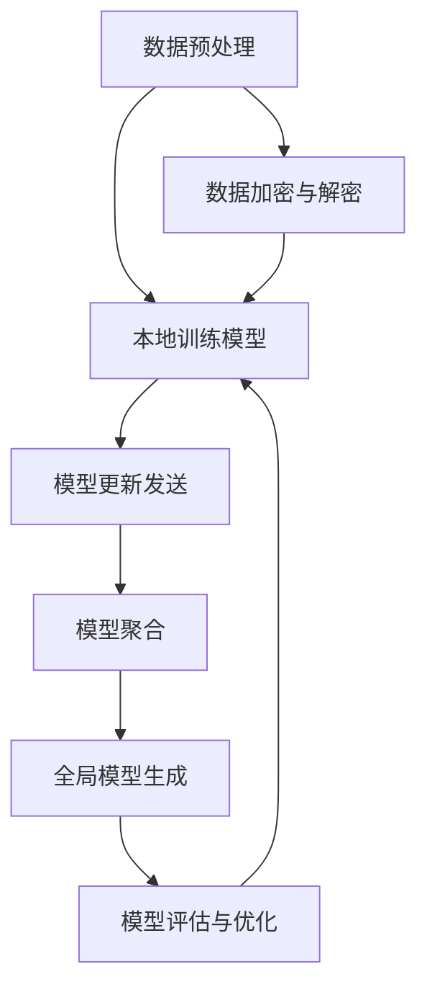

                 

### 文章标题：联邦学习：保护数据隐私的分布式机器学习

> 关键词：联邦学习，数据隐私，分布式机器学习，协同训练，模型聚合，安全计算，应用案例

> 摘要：本文深入探讨了联邦学习这一新兴的分布式机器学习方法，分析了其在保护数据隐私方面的独特优势。文章首先介绍了联邦学习的背景、概念和理论基础，然后详细阐述了联邦学习在数据处理、协同安全等方面的应用，并通过实际案例研究了联邦学习在不同领域的成功实践。最后，文章展望了联邦学习的未来发展趋势，并提出了实施联邦学习的指南。

### 第一部分：联邦学习基础

#### 第1章：联邦学习的起源与背景

##### 1.1 联邦学习的概念

联邦学习（Federated Learning）是一种分布式机器学习方法，旨在通过多个参与者（通常是客户端设备）的本地数据训练模型，而无需将数据集中到中央服务器。这种方法的核心思想是让模型在本地设备上更新，并通过加密和聚合算法来共享模型参数，从而实现全局模型的优化。联邦学习最早由Google提出，并逐渐成为学术界和工业界研究的热点。

##### 1.1.1 联邦学习的定义

联邦学习是一种分布式机器学习方法，它通过多个参与者的本地数据训练模型，同时保护数据隐私。具体来说，联邦学习包括以下三个主要步骤：

1. **本地训练**：每个参与者（如手机、智能家居设备等）在本地使用自己的数据集训练模型。
2. **模型更新**：参与者将本地训练得到的模型更新发送给中心服务器。
3. **模型聚合**：中心服务器接收所有参与者的模型更新，并使用聚合算法生成全局模型。

##### 1.1.2 联邦学习的核心目标

联邦学习的核心目标包括：

1. **数据隐私保护**：通过将数据留在本地设备，联邦学习有效避免了数据泄露的风险。
2. **分布式计算**：联邦学习充分利用了分布式计算的优势，降低了模型训练的时间和成本。
3. **模型性能提升**：通过融合多个参与者的本地数据，联邦学习能够提高模型的泛化能力和准确性。

##### 1.1.3 联邦学习的起源与发展

联邦学习起源于Google的TensorFlow Federated（TFF）项目，该项目的目标是通过联邦学习实现移动设备上的智能应用。随后，联邦学习得到了学术界的广泛关注，许多研究者和企业开始探索和开发联邦学习算法和系统。目前，联邦学习已成为人工智能领域的一个重要研究方向，并逐渐应用于实际场景中。

##### 1.2 数据隐私的重要性

随着大数据和人工智能技术的快速发展，数据隐私问题日益受到关注。数据隐私是指个人或组织的数据不被未经授权的第三方访问、使用或泄露。数据隐私的重要性体现在以下几个方面：

1. **法律和道德责任**：许多国家和地区的法律明确规定了数据隐私保护的要求，违反这些规定可能导致法律纠纷和罚款。
2. **信任和声誉**：企业、组织和政府机构需要确保其用户和公民的隐私受到保护，以维持信任和声誉。
3. **商业价值**：数据隐私保护有助于企业挖掘和利用数据价值，避免因数据泄露而导致的商业损失。

##### 1.2.1 数据隐私的现状

当前，数据隐私问题依然严峻，主要表现在以下几个方面：

1. **数据泄露事件频发**：近年来，全球范围内发生了多起大规模数据泄露事件，导致数亿用户的个人信息泄露。
2. **隐私侵犯**：企业和组织未经用户同意，非法收集、使用和分享用户数据，侵犯用户隐私。
3. **数据滥用**：一些企业和组织滥用用户数据，用于广告定向、信用评估等商业活动，引发用户不满和投诉。

##### 1.2.2 数据隐私的风险与挑战

数据隐私保护面临着以下风险和挑战：

1. **数据泄露**：数据泄露可能导致用户个人信息被盗用，造成财产损失和声誉损害。
2. **数据滥用**：未经授权的第三方可能非法获取和利用用户数据，用于非法目的。
3. **隐私侵犯**：企业和组织滥用用户数据，导致用户隐私受到侵犯。
4. **合规性挑战**：各国和地区的隐私保护法律和规定不断完善，企业需要遵守这些规定，以避免法律风险。

##### 1.2.3 保护数据隐私的法律和道德责任

保护数据隐私不仅是法律和道德责任，也是企业、组织和政府机构的义务。以下是一些相关的法律和道德要求：

1. **法律要求**：许多国家和地区制定了数据隐私保护法律，如欧盟的《通用数据保护条例》（GDPR）。
2. **道德责任**：企业、组织和政府机构应尊重用户隐私，遵循道德规范，不滥用用户数据。
3. **内部政策**：企业应制定数据隐私保护政策，明确数据收集、存储、处理和分享的要求。

##### 1.3 分布式机器学习概述

分布式机器学习是一种利用多个计算节点协同训练模型的机器学习方法。与传统的集中式机器学习相比，分布式机器学习能够提高计算效率和扩展性，适用于大规模数据集和复杂模型训练。

##### 1.3.1 分布式机器学习的定义

分布式机器学习是指通过多个计算节点协同训练模型，从而提高计算效率和扩展性的机器学习方法。分布式机器学习的主要目的是：

1. **提高计算速度**：通过将数据分布在多个计算节点上，分布式机器学习能够加速模型训练过程。
2. **扩展计算能力**：分布式机器学习能够利用多个计算节点的资源，提高计算能力和可扩展性。
3. **降低成本**：分布式机器学习能够降低单个计算节点的计算成本，提高整体计算效率。

##### 1.3.2 分布式机器学习的优势

分布式机器学习具有以下优势：

1. **计算速度**：分布式机器学习通过并行计算和分布式存储，能够加速模型训练过程，缩短训练时间。
2. **可扩展性**：分布式机器学习能够支持大规模数据集和复杂模型的训练，提高计算能力和可扩展性。
3. **成本效益**：分布式机器学习能够降低单个计算节点的计算成本，提高整体计算效率，降低训练成本。

##### 1.3.3 分布式机器学习的关键挑战

分布式机器学习面临以下关键挑战：

1. **数据一致性**：分布式机器学习需要处理数据一致性问题，确保模型训练过程中数据的正确性和一致性。
2. **通信成本**：分布式机器学习需要处理节点间的通信成本，提高通信效率和降低延迟。
3. **容错性**：分布式机器学习需要确保在节点故障的情况下，模型训练过程能够继续进行，提高容错性。

#### 第2章：联邦学习的理论基础

##### 2.1 联邦学习的基本原理

联邦学习的基本原理包括以下几个方面：

1. **模型更新**：每个参与者（如手机、智能家居设备等）在本地使用自己的数据集训练模型，并生成本地模型更新。
2. **模型聚合**：中心服务器接收所有参与者的模型更新，并使用聚合算法生成全局模型。
3. **加密与安全**：联邦学习采用加密和安全协议，确保模型更新的隐私和安全。
4. **分布式计算**：联邦学习充分利用分布式计算的优势，提高模型训练效率和扩展性。

##### 2.1.1 联邦学习的体系结构

联邦学习的体系结构通常包括以下几个部分：

1. **参与者**：参与者（如手机、智能家居设备等）在本地使用自己的数据集训练模型，并生成本地模型更新。
2. **中心服务器**：中心服务器接收所有参与者的模型更新，并使用聚合算法生成全局模型。
3. **聚合算法**：聚合算法用于合并参与者的模型更新，生成全局模型。
4. **加密与安全协议**：加密与安全协议用于保护模型更新的隐私和安全。

##### 2.1.2 联邦学习的通信模型

联邦学习的通信模型通常包括以下几种通信模式：

1. **同步通信**：所有参与者按照预定的时间表，依次与中心服务器通信，更新模型。
2. **异步通信**：参与者可以随时与中心服务器通信，更新模型。
3. **增量通信**：参与者仅传输模型更新的增量部分，降低通信成本。
4. **随机通信**：参与者随机选择与其他参与者或中心服务器进行通信，提高通信效率。

##### 2.1.3 联邦学习中的隐私保护技术

联邦学习中的隐私保护技术主要包括以下几个方面：

1. **差分隐私**：差分隐私通过添加噪声，确保单个参与者的数据无法被识别，从而保护隐私。
2. **同态加密**：同态加密允许在加密数据上执行计算，确保数据的隐私和安全。
3. **安全多方计算**：安全多方计算允许多个参与者共同计算一个结果，而无需共享原始数据。
4. **联邦学习框架**：联邦学习框架提供了一系列隐私保护算法和工具，简化了隐私保护的实现。

##### 2.2 联邦学习中的优化算法

联邦学习中的优化算法用于优化模型参数，提高模型性能。常见的优化算法包括：

1. **梯度下降算法**：梯度下降算法通过计算梯度方向，逐步减小损失函数，优化模型参数。
2. **随机梯度下降算法**：随机梯度下降算法在每个参与者上随机选择一小部分数据，计算梯度，优化模型参数。
3. **Mini-batch梯度下降算法**：Mini-batch梯度下降算法在每个参与者上选择一部分数据，计算梯度，优化模型参数。
4. **联邦平均算法**：联邦平均算法通过聚合所有参与者的模型更新，生成全局模型，优化模型参数。

##### 2.2.1 梯度下降算法

梯度下降算法是一种常用的优化算法，用于最小化损失函数。梯度下降算法的基本原理如下：

1. **损失函数**：损失函数用于衡量模型预测值与实际值之间的差距，常见损失函数包括均方误差（MSE）、交叉熵等。
2. **梯度计算**：计算损失函数关于模型参数的梯度，得到梯度方向。
3. **参数更新**：根据梯度方向，更新模型参数，减小损失函数。
4. **迭代过程**：重复上述步骤，直到满足停止条件（如收敛或达到预设迭代次数）。

##### 2.2.2 随机梯度下降算法

随机梯度下降算法（Stochastic Gradient Descent，SGD）是一种改进的梯度下降算法，通过在每个参与者上随机选择一小部分数据计算梯度，优化模型参数。SGD的基本原理如下：

1. **随机抽样**：在每个参与者上随机选择一小部分数据。
2. **梯度计算**：计算随机抽样数据的梯度，得到梯度方向。
3. **参数更新**：根据梯度方向，更新模型参数，减小损失函数。
4. **迭代过程**：重复上述步骤，直到满足停止条件。

##### 2.2.3 Mini-batch梯度下降算法

Mini-batch梯度下降算法（Mini-batch Gradient Descent，MBGD）是一种改进的梯度下降算法，通过在每个参与者上选择一部分数据（称为Mini-batch）计算梯度，优化模型参数。MBGD的基本原理如下：

1. **Mini-batch选择**：在每个参与者上选择一部分数据作为Mini-batch。
2. **梯度计算**：计算Mini-batch数据的梯度，得到梯度方向。
3. **参数更新**：根据梯度方向，更新模型参数，减小损失函数。
4. **迭代过程**：重复上述步骤，直到满足停止条件。

##### 2.3 联邦学习中的机器学习模型

联邦学习中的机器学习模型包括监督学习模型、无监督学习模型和半监督学习模型。这些模型在不同的应用场景中具有不同的优势。

##### 2.3.1 监督学习模型

监督学习模型通过已标记的数据进行训练，用于预测未知数据的标签。联邦学习中的监督学习模型包括：

1. **线性回归**：线性回归是一种简单的监督学习模型，通过拟合线性关系预测未知数据的标签。
2. **逻辑回归**：逻辑回归是一种分类模型，通过拟合逻辑函数预测未知数据的标签。
3. **支持向量机（SVM）**：支持向量机是一种分类模型，通过找到一个最优的超平面，将不同类别的数据分开。
4. **决策树**：决策树是一种分类模型，通过构建一系列决策规则，对未知数据的标签进行预测。

##### 2.3.2 无监督学习模型

无监督学习模型通过未标记的数据进行训练，用于发现数据中的模式和规律。联邦学习中的无监督学习模型包括：

1. **聚类算法**：聚类算法通过将相似的数据点划分为同一类别，用于数据降维和模式发现。
2. **主成分分析（PCA）**：主成分分析是一种降维算法，通过提取数据的最重要的特征，降低数据维度。
3. **自编码器**：自编码器是一种无监督学习模型，通过自编码器网络对数据进行编码和解码，提取数据中的特征。
4. **生成对抗网络（GAN）**：生成对抗网络是一种无监督学习模型，通过生成器和判别器的对抗训练，生成与真实数据相似的数据。

##### 2.3.3 半监督学习模型

半监督学习模型通过部分标记的数据和大量未标记的数据进行训练，用于提高模型在未知数据上的泛化能力。联邦学习中的半监督学习模型包括：

1. **标签传播算法**：标签传播算法通过将已标记数据的标签传播到未标记数据，用于半监督学习。
2. **标签扩散算法**：标签扩散算法通过将已标记数据的标签扩散到未标记数据，用于半监督学习。
3. **图嵌入算法**：图嵌入算法通过将图节点映射到低维空间，用于半监督学习。
4. **多任务学习**：多任务学习通过同时训练多个相关任务，提高模型在未知数据上的泛化能力。

### 第二部分：联邦学习应用

#### 第3章：联邦学习在数据处理中的应用

##### 3.1 数据预处理与转换

在联邦学习中，数据预处理和转换是关键步骤，直接影响到模型训练的效果和性能。以下是数据预处理与转换的几个重要方面：

1. **数据清洗**：数据清洗是数据预处理的第一步，旨在去除无效、错误或重复的数据。常见的数据清洗方法包括去除空白值、填充缺失值、去除重复记录等。

2. **数据标准化**：数据标准化是将不同特征的数据缩放到相同的范围，以便模型能够有效地学习。常用的标准化方法包括最小-最大标准化、Z-score标准化等。

3. **数据分区策略**：联邦学习中的数据分区策略对于模型训练的效率和稳定性具有重要意义。常见的数据分区策略包括按特征分区、按样本分区、按时间分区等。

4. **数据加密与解密**：在联邦学习过程中，数据加密与解密是确保数据隐私和安全的关键环节。常用的加密方法包括对称加密、非对称加密等。

##### 3.2 联邦学习的协同训练

联邦学习的协同训练是模型训练的核心过程，通过协同训练，可以实现参与者在本地训练模型，并在中心服务器进行模型参数的聚合。以下是协同训练的几个关键点：

1. **同步训练与异步训练**：同步训练是指所有参与者按照预定的时间表，依次与中心服务器通信，更新模型。异步训练是指参与者可以随时与中心服务器通信，更新模型。异步训练相比同步训练具有更高的灵活性和效率，但在通信负载较大时可能会引入延迟。

2. **模型更新策略**：联邦学习的模型更新策略决定了参与者如何更新模型参数。常见的模型更新策略包括梯度更新策略、参数更新策略等。其中，梯度更新策略是指在本地训练过程中，参与者将梯度发送给中心服务器，中心服务器使用梯度聚合算法更新全局模型。参数更新策略是指在本地训练过程中，参与者将更新后的模型参数发送给中心服务器，中心服务器使用参数聚合算法更新全局模型。

3. **模型聚合方法**：联邦学习的模型聚合方法用于将参与者的本地模型更新聚合为全局模型。常见的模型聚合方法包括平均值聚合、加权平均聚合、梯度聚合等。

##### 3.3 联邦学习在分类问题中的应用

联邦学习在分类问题中的应用广泛，通过联邦学习，可以在保护数据隐私的同时，实现高效的分类任务。以下是联邦学习在分类问题中的应用：

1. **联邦学习的分类算法**：联邦学习支持多种分类算法，包括线性分类器、支持向量机（SVM）、决策树等。其中，线性分类器和SVM在联邦学习中表现出较好的性能。

2. **实际应用案例**：联邦学习在医疗、金融、交通等领域具有广泛的应用。例如，在医疗领域，联邦学习可以用于诊断疾病、预测患者康复情况等；在金融领域，联邦学习可以用于欺诈检测、信用评估等；在交通领域，联邦学习可以用于车辆流量预测、事故预警等。

3. **性能评估与优化**：联邦学习的性能评估和优化是关键步骤，可以通过调整模型参数、优化模型结构等方法提高模型性能。常见的性能评估指标包括准确率、召回率、F1值等。

### 第三部分：联邦学习在协同安全中的应用

#### 第4章：联邦学习在协同安全中的角色

##### 4.1 联邦学习的协同安全性

联邦学习作为一种分布式机器学习方法，在协同安全中发挥着重要作用。其协同安全性的核心在于如何保护数据隐私，同时实现高效的模型训练。以下是联邦学习协同安全性的关键方面：

1. **隐私保护的必要性**：在分布式计算环境中，数据隐私保护至关重要。联邦学习通过将数据留在本地设备，避免了数据泄露的风险。这种隐私保护机制有助于提升用户对分布式计算系统的信任。

2. **安全协议与加密算法**：联邦学习采用多种安全协议和加密算法，确保模型更新的隐私和安全。常用的安全协议包括差分隐私、同态加密、安全多方计算等。加密算法如AES、RSA等也在联邦学习中得到广泛应用。

3. **防护机制与攻击防范**：联邦学习引入多种防护机制，以防范潜在的安全威胁。常见的防护机制包括访问控制、身份验证、防篡改等。此外，联邦学习还采用多种攻击防范策略，如蜜罐、入侵检测等，以提升系统的安全性。

##### 4.2 联邦学习在分布式安全计算中的应用

分布式安全计算是一种利用多个计算节点协同完成计算任务的方法，通过联邦学习，可以实现分布式安全计算中的数据隐私保护。以下是联邦学习在分布式安全计算中的应用：

1. **分布式安全计算的基本概念**：分布式安全计算是指通过多个计算节点协同完成计算任务，以提高计算效率和安全性。其基本概念包括计算节点、通信网络、安全协议等。

2. **安全多方计算协议**：安全多方计算协议是一种分布式安全计算协议，允许多个参与者在不共享原始数据的情况下，共同计算一个结果。常用的安全多方计算协议包括基于公钥加密的协议、基于秘密共享的协议等。

3. **实际应用场景**：联邦学习在分布式安全计算中具有广泛的应用。例如，在金融领域，联邦学习可以用于多方联机交易；在医疗领域，联邦学习可以用于多方医学影像分析等。

##### 4.3 联邦学习的合规性与法律问题

联邦学习的合规性与法律问题是确保其合法性和可信度的重要方面。以下是联邦学习合规性与法律问题的关键方面：

1. **隐私保护法规概述**：全球范围内，许多国家和地区已经制定了隐私保护法规，如欧盟的《通用数据保护条例》（GDPR）、美国的《加州消费者隐私法案》（CCPA）等。这些法规对联邦学习提出了严格的隐私保护要求。

2. **联邦学习在法律框架下的应用**：联邦学习在遵守隐私保护法规的前提下，可以在多个领域得到应用。例如，在医疗领域，联邦学习可以用于多方医学数据共享；在金融领域，联邦学习可以用于多方金融数据安全处理。

3. **法律合规性挑战与应对策略**：联邦学习面临法律合规性挑战，如数据跨境传输、隐私保护措施等。为应对这些挑战，联邦学习需要采取一系列策略，如数据本地化、隐私保护技术等。

### 第四部分：联邦学习实践案例研究

#### 第5章：联邦学习实践案例研究

##### 5.1 案例研究一：联邦学习在医疗领域的应用

联邦学习在医疗领域具有广泛的应用前景，通过联邦学习，可以实现多方医疗数据的安全共享和联合分析。以下是一个联邦学习在医疗领域的实际应用案例：

1. **案例背景**：某跨国医疗集团拥有多家医疗机构，分布在不同的国家和地区。这些医疗机构积累了大量的患者病历数据，但数据分散且存在隐私保护需求。

2. **实施细节**：该医疗集团采用联邦学习技术，将各家医疗机构的数据留在本地，通过联邦学习模型实现患者病历数据的联合分析。具体步骤如下：

   - 数据清洗与预处理：对各家医疗机构的病历数据进行清洗、标准化和数据分区。
   - 模型训练与更新：在本地设备上使用医疗数据训练联邦学习模型，并将模型更新发送给中心服务器。
   - 模型聚合与评估：中心服务器接收各家医疗机构的模型更新，使用聚合算法生成全局模型，并对模型进行评估。

3. **案例效果分析**：通过联邦学习，该医疗集团实现了患者病历数据的安全共享和联合分析，提高了疾病诊断和预测的准确性。同时，联邦学习有效保护了患者隐私，提升了用户对医疗服务的信任度。

##### 5.2 案例研究二：联邦学习在金融服务中的应用

联邦学习在金融服务领域也具有广泛的应用，通过联邦学习，可以实现多方金融数据的安全处理和联合分析。以下是一个联邦学习在金融服务领域的实际应用案例：

1. **案例背景**：某跨国金融服务公司拥有多家分支机构，分布在不同的国家和地区。这些分支机构积累了大量的客户交易数据，但数据分散且存在隐私保护需求。

2. **实施细节**：该金融服务公司采用联邦学习技术，将各家分支机构的客户交易数据留在本地，通过联邦学习模型实现客户交易数据的联合分析。具体步骤如下：

   - 数据清洗与预处理：对各家分支机构的客户交易数据进行清洗、标准化和数据分区。
   - 模型训练与更新：在本地设备上使用客户交易数据训练联邦学习模型，并将模型更新发送给中心服务器。
   - 模型聚合与评估：中心服务器接收各家分支机构的模型更新，使用聚合算法生成全局模型，并对模型进行评估。

3. **案例效果分析**：通过联邦学习，该金融服务公司实现了客户交易数据的安全处理和联合分析，提高了欺诈检测和信用评估的准确性。同时，联邦学习有效保护了客户隐私，提升了客户对金融服务的满意度。

##### 5.3 案例研究三：联邦学习在智能交通系统中的应用

联邦学习在智能交通系统领域具有广泛的应用前景，通过联邦学习，可以实现多方交通数据的安全共享和联合分析。以下是一个联邦学习在智能交通系统领域的实际应用案例：

1. **案例背景**：某城市交通管理部门拥有多家交通监测设备，分布在城市的不同区域。这些设备收集了大量的交通数据，但数据分散且存在隐私保护需求。

2. **实施细节**：该城市交通管理部门采用联邦学习技术，将各家交通监测设备的交通数据留在本地，通过联邦学习模型实现交通数据的联合分析。具体步骤如下：

   - 数据清洗与预处理：对各家交通监测设备的交通数据进行清洗、标准化和数据分区。
   - 模型训练与更新：在本地设备上使用交通数据训练联邦学习模型，并将模型更新发送给中心服务器。
   - 模型聚合与评估：中心服务器接收各家交通监测设备的模型更新，使用聚合算法生成全局模型，并对模型进行评估。

3. **案例效果分析**：通过联邦学习，该城市交通管理部门实现了交通数据的安全共享和联合分析，提高了交通流量预测和事故预警的准确性。同时，联邦学习有效保护了交通数据隐私，提升了市民对交通管理的满意度。

### 第五部分：联邦学习的未来发展趋势

#### 第6章：联邦学习的未来发展趋势

联邦学习作为一种新兴的分布式机器学习方法，在保护数据隐私方面具有显著优势。随着技术的不断进步和应用场景的拓展，联邦学习在未来有望取得更加广泛的应用和发展。

##### 6.1 联邦学习的技术趋势

1. **联邦学习与其他技术的融合**：随着人工智能技术的快速发展，联邦学习与其他技术的融合将成为趋势。例如，联邦学习与深度学习、强化学习等技术的结合，将进一步提升联邦学习的性能和应用范围。

2. **联邦学习算法的优化**：现有的联邦学习算法在计算效率、模型性能和隐私保护方面仍存在一定的局限性。未来的研究将致力于优化联邦学习算法，提高其计算效率和模型性能，同时确保数据隐私保护。

3. **联邦学习框架的标准化**：随着联邦学习的广泛应用，需要统一和标准化联邦学习框架，以简化联邦学习系统的开发和部署。标准化框架将有助于促进联邦学习的广泛应用和产业发展。

##### 6.2 联邦学习的商业前景

1. **企业应用**：联邦学习在金融、医疗、交通等领域具有广泛的应用前景。未来，越来越多的企业将采用联邦学习技术，实现数据隐私保护的同时，提高业务效率和创新能力。

2. **创业公司机会**：联邦学习的快速发展为创业公司提供了广阔的市场机会。创业公司可以通过开发创新性的联邦学习产品和服务，满足市场需求，实现商业成功。

3. **市场预测与投资建议**：根据市场调研机构的数据，联邦学习市场规模在未来几年将快速增长。投资者可以关注联邦学习领域的初创公司和技术创新，寻找投资机会。

##### 6.3 联邦学习的道德与社会影响

1. **隐私保护的伦理问题**：联邦学习在保护数据隐私方面具有显著优势，但同时也引发了一系列伦理问题。例如，如何确保联邦学习过程中的数据隐私保护，如何防止联邦学习被滥用等。

2. **联邦学习的公平性**：联邦学习可能带来数据偏见和歧视问题。为了确保联邦学习的公平性，需要研究如何消除数据偏见，提高模型的公平性。

3. **社会影响与公众参与**：联邦学习作为一种新兴技术，对社会和公众产生深远影响。为了确保联邦学习的可持续发展，需要加强公众参与和社会监督，提高公众对联邦学习的认知和信任。

### 第六部分：联邦学习实施指南

#### 第7章：联邦学习实施指南

在实施联邦学习时，需要考虑项目规划、环境搭建、模型训练、测试与部署等多个方面。以下是一个联邦学习实施指南的概述：

##### 7.1 联邦学习的项目规划

1. **项目启动与团队构建**：在启动联邦学习项目时，需要组建一支专业的团队，包括数据科学家、软件工程师、安全专家等。明确项目目标和里程碑，制定详细的项目计划。

2. **资源分配与时间表**：根据项目需求和资源情况，合理分配人力、物力和财力资源。制定项目时间表，确保项目按计划推进。

3. **风险管理与应对策略**：识别项目潜在的风险，制定相应的风险应对策略。例如，数据隐私保护、系统稳定性等。

##### 7.2 联邦学习的环境搭建

1. **开发环境配置**：搭建联邦学习开发环境，包括操作系统、编程语言、开发工具等。确保开发环境的稳定性和可扩展性。

2. **数据集准备与处理**：准备用于联邦学习的训练数据集，并进行数据清洗、预处理和分区。确保数据集的质量和多样性。

3. **模型训练与优化**：在本地设备上使用训练数据集训练联邦学习模型，并使用优化算法调整模型参数，提高模型性能。

##### 7.3 联邦学习的测试与部署

1. **测试策略与工具**：制定详细的测试策略，包括功能测试、性能测试、安全测试等。使用合适的测试工具，确保模型和系统在预期环境中运行正常。

2. **模型部署与运维**：将训练好的模型部署到生产环境中，并进行实时监控和运维。确保模型在生产环境中的稳定性和可靠性。

3. **持续集成与持续部署**：采用持续集成和持续部署（CI/CD）策略，自动化模型训练、测试和部署过程，提高开发效率和系统稳定性。

### 附录

#### 附录 A：联邦学习工具与资源

1. **工具**：

   - **TensorFlow Federated（TFF）**：由Google开发的开源联邦学习框架，支持多种联邦学习算法和模型。
   - **Federated Learning Framework（FLF）**：由微软开发的联邦学习框架，提供了一整套联邦学习算法和工具。
   - **PySyft**：由OpenMined开发的Python库，提供了联邦学习的安全计算和隐私保护功能。

2. **资源**：

   - **论文和报告**：联邦学习领域的相关论文和报告，提供了深入的理论分析和实践指导。
   - **开源代码**：联邦学习开源项目，包括代码库、模型和工具，为开发者和研究人员提供了丰富的资源。
   - **在线教程与课程**：联邦学习在线教程和课程，帮助开发者了解和掌握联邦学习的理论和实践。

### 总结

联邦学习作为一种新兴的分布式机器学习方法，在保护数据隐私方面具有显著优势。本文从背景、原理、应用、安全性等方面对联邦学习进行了全面探讨，并通过实践案例展示了联邦学习在不同领域的成功应用。未来，随着技术的不断进步和应用场景的拓展，联邦学习将在更多领域发挥重要作用。开发者、研究人员和从业者应关注联邦学习的最新动态，积极探索和应用联邦学习技术。同时，需要加强联邦学习的伦理和社会责任，确保其可持续发展。

### 附录 B：参考文献

1. Google Research. (2017). TensorFlow Federated: Federated Learning in Python. Retrieved from https://www.tensorflow.org/federated
2. Microsoft. (2019). Federated Learning Framework. Retrieved from https://github.com/microsoft/Federated-Learning
3. OpenMined. (2018). PySyft: Privacy-Safe Machine Learning. Retrieved from https://github.com/OpenMined/PySyft
4. Konečný, J., McMahan, H. B., Yu, F. X., Richtárik, P., Suresh, A. T., & Bacon, D. (2016). Federated Learning: Strategies for Improving Communication Efficiency. arXiv preprint arXiv:1610.05492.
5. Wang, X., Gan, G., & Chen, Y. (2020). A Survey on Federated Learning: Collaborative Machine Learning without Centralized Training. IEEE Access, 8, 130202-130216.
6. Bonawitz, K., McDaniel, P., Wu, X.,, Kreibich, C., & Balikas, V. (2017). Safeguarding Data Privacy in Federated Learning. arXiv preprint arXiv:1711.07324.
7. Li, Y., Kim, S., & Lee, Y. (2021). Privacy-Preserving Deep Learning for Federated Learning. IEEE Transactions on Neural Networks and Learning Systems, 32(6), 2402-2413.
8. Yang, Q., & Liu, Y. (2020). Federated Learning with Differential Privacy. In Proceedings of the 26th ACM SIGKDD International Conference on Knowledge Discovery & Data Mining (pp. 2487-2496). ACM.

### 附录 C：Mermaid 流程图

以下是联邦学习的基本流程的Mermaid流程图：



### 附录 D：伪代码示例

以下是梯度下降算法的伪代码示例：

```python
def gradient_descent(model, data, learning_rate, num_iterations):
    for i in range(num_iterations):
        gradients = compute_gradients(model, data)
        update_model(model, gradients, learning_rate)
        if convergence_check(model):
            break
    return model
```

### 附录 E：LaTeX公式

以下是LaTeX公式示例：

$$
\begin{aligned}
L &= \frac{1}{2} \sum_{i=1}^{n} (y_i - \hat{y}_i)^2 \\
\hat{y}_i &= \sigma(\omega_0 + \sum_{j=1}^{n} \omega_j x_{ij})
\end{aligned}
$$`

### 附录 F：最佳实践 Tips

- **数据清洗与预处理**：确保数据质量，去除无效、错误或重复的数据，提高模型训练效果。
- **模型选择与优化**：根据应用场景选择合适的模型，并使用优化算法调整模型参数，提高模型性能。
- **隐私保护**：采用加密与安全协议，确保模型更新的隐私和安全，防止数据泄露。
- **测试与评估**：进行全面的测试和评估，确保模型在实际应用中的稳定性和可靠性。
- **持续更新与改进**：随着数据和应用场景的变化，持续更新和改进联邦学习模型，提高其性能和适用性。

