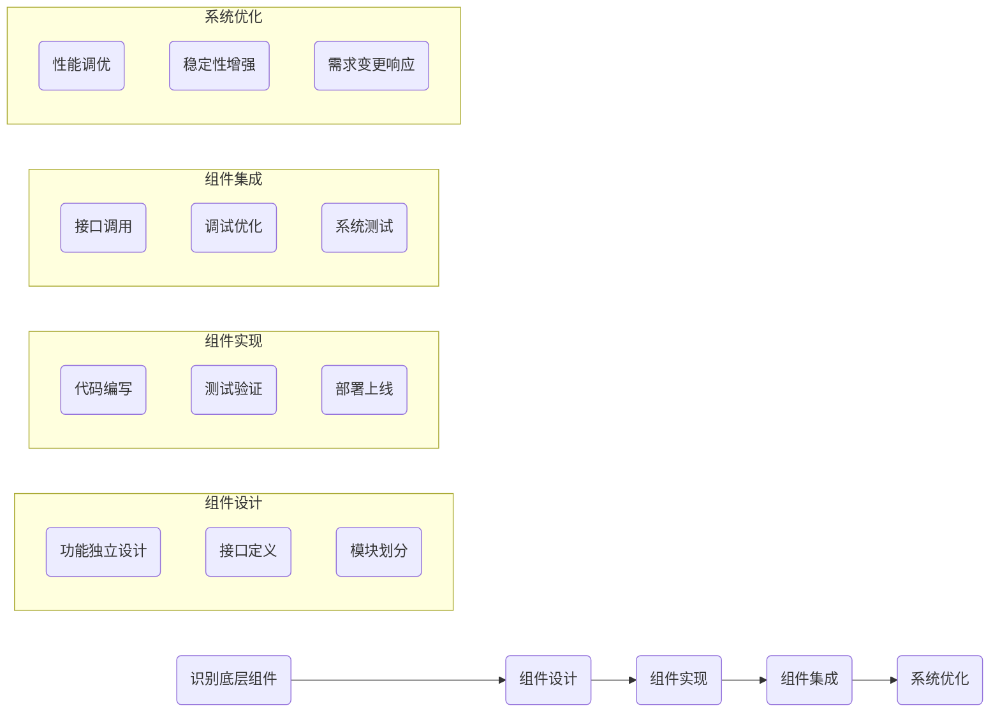
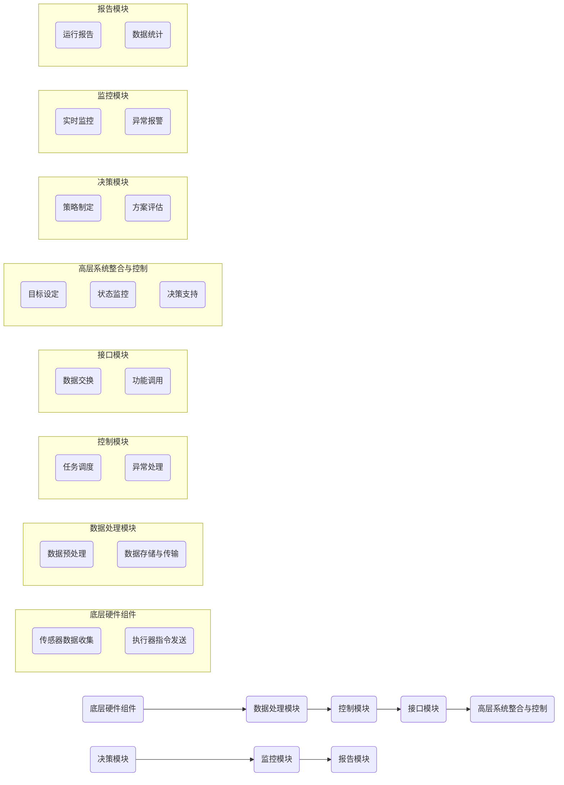

                 

### 第一步：背景介绍

在当今快速发展的信息技术领域，系统构建的方法和技术不断演进，从早期的自顶向下的设计方法，到近年来逐渐兴起的自下而上的构建方法，不同的方法各有优缺点。自下而上的构建方法强调从底层基础组件开始，逐步向上构建，通过各部分的自组织和协同工作，最终形成复杂的系统结构。这种方法在处理复杂系统时，具有较高的灵活性和可扩展性，能够更好地适应多变的需求和环境。

《自下而上，各司其职》这本书旨在探讨自下而上的系统构建方法及其应用，详细讲解如何在各个层次上实现各司其职，确保系统的高效运作。本书适合对系统架构设计、软件开发感兴趣的读者，特别是那些希望掌握复杂系统构建方法的工程师和研究人员。

书中将涵盖以下核心内容：

1. **核心概念与联系**：介绍自下而上构建方法的基础概念，包括自下而上的定义、原理及其优势。
2. **系统构建方法**：详细讲解如何采用自下而上的方法构建系统，包括系统设计的基础知识、构建步骤以及优化策略。
3. **各司其职的实现**：分析系统中各部分的分工与协作，确保系统的高效运行。
4. **项目实战**：通过实际案例展示自下而上构建方法的应用，帮助读者理解和掌握相关技术。
5. **结论与展望**：总结书中的内容，并对未来的发展方向提出展望。

### 第二步：核心概念与联系

自下而上（Bottom-up）构建方法是一种系统设计方法，其基本思想是从底层基础组件开始，逐步向上构建系统。每个底层组件都具有特定的功能，通过组件之间的协作，实现更复杂的系统功能。与自上而下（Top-down）方法相反，自下而上的方法不是从整体目标开始，而是从具体的实现细节入手，逐步向上构建系统。

#### 自下而上的定义与原理

自下而上的构建方法通常包括以下几个步骤：

1. **识别底层组件**：首先识别系统中的基本功能单元，这些单元可以是硬件设备、软件模块或者业务功能。
2. **组件设计**：针对每个底层组件，进行详细设计，确保其功能独立且易于扩展。
3. **组件实现**：将设计好的组件实现为实际的软件或硬件。
4. **组件集成**：将各个底层组件集成起来，形成一个完整的系统。
5. **系统优化**：在系统运行过程中，对组件进行优化，以提高系统性能和稳定性。

自下而上的原理在于其强调组件化和模块化设计，通过底层组件的自组织和协同工作，实现复杂系统的构建。这种方法具有以下优势：

- **灵活性**：自下而上的方法允许在系统的构建过程中根据实际需求进行调整，具有较高的灵活性。
- **可扩展性**：通过增加或替换底层组件，可以方便地扩展系统的功能。
- **可维护性**：组件化设计使得系统的维护和更新变得更加容易。

#### 自下而上与自上而下的比较

自下而上和自上而下是两种截然不同的系统构建方法。自上而下的方法首先定义系统的整体目标，然后逐步拆分为具体的实现细节。这种方法的优势在于其结构化和层次化的设计，易于理解和维护。然而，自上而下的方法也存在一些局限性，例如在处理复杂系统时，往往难以把握整体结构，且修改成本较高。

自下而上的方法在处理复杂系统时，具有更高的灵活性和适应性。通过自下而上的方法，可以更有效地应对系统需求的变化和不确定性。然而，自下而上的方法也具有一定的挑战性，例如在系统构建初期，可能难以确定系统的整体结构。

#### 自下而上方法的Mermaid流程图

为了更好地理解自下而上的构建方法，我们可以使用Mermaid流程图来展示其基本步骤：

通过上述Mermaid流程图，我们可以清晰地看到自下而上构建方法的基本步骤和关键环节。

### 第三步：系统构建方法

在了解了自下而上构建方法的基本原理后，我们将进一步探讨如何具体实施这一方法。系统构建方法包括系统设计、构建步骤和优化策略等多个方面。

#### 系统设计基础

系统设计是系统构建的第一步，它奠定了系统的基础架构和功能模块。在进行系统设计时，需要考虑以下几个关键方面：

1. **需求分析**：明确系统的目标和需求，包括功能需求、性能需求、安全性需求等。
2. **架构设计**：根据需求分析的结果，设计系统的整体架构，包括硬件、软件和网络架构等。
3. **模块划分**：将系统划分为多个功能模块，每个模块具有独立的功能和接口，便于后续开发和维护。
4. **接口定义**：定义模块之间的接口，确保模块之间的高内聚、低耦合。

#### 构建系统的基本原则

在系统构建过程中，需要遵循以下基本原则：

1. **模块化**：将系统划分为多个模块，每个模块具有独立的功能和接口，便于管理和维护。
2. **可扩展性**：设计系统时，要考虑到未来的扩展需求，确保系统能够方便地添加新功能或替换旧模块。
3. **可维护性**：系统设计要易于维护和更新，降低维护成本。
4. **可靠性**：确保系统具有较高的稳定性和可靠性，减少故障率和修复时间。

#### 系统构建步骤

自下而上的系统构建步骤可以分为以下几个阶段：

1. **识别底层组件**：首先识别系统中的基本功能单元，如硬件设备、软件模块或业务功能。
2. **组件设计**：针对每个底层组件，进行详细设计，确保其功能独立且易于扩展。
3. **组件实现**：将设计好的组件实现为实际的软件或硬件，并进行测试验证。
4. **组件集成**：将各个底层组件集成起来，形成一个完整的系统，并进行调试优化。
5. **系统优化**：在系统运行过程中，对组件进行优化，以提高系统性能和稳定性。

#### 系统优化策略

在系统运行过程中，可能需要对系统进行优化，以提高其性能和稳定性。以下是一些常见的系统优化策略：

1. **性能调优**：通过调整系统参数、优化算法和增加硬件资源，提高系统的处理速度和响应时间。
2. **稳定性增强**：通过加强系统监控、故障恢复机制和容错设计，提高系统的稳定性。
3. **需求变更响应**：在系统运行过程中，根据实际需求的变化，及时调整系统设计和配置。

### 第四步：各司其职的实现

在自下而上的系统构建方法中，各部分的分工和协作是实现系统高效运行的关键。以下将详细讨论系统中各部分的分工和协作。

#### 底层组件的角色与职责

底层组件是系统构建的基础，它们负责实现系统中的基本功能。每个底层组件都有特定的职责，包括：

1. **硬件组件**：如传感器、执行器、处理器等，负责硬件层面的数据处理和执行。
2. **软件组件**：如函数库、算法模块、中间件等，负责软件层面的数据处理和功能实现。

#### 中层模块的协同工作

中层模块负责协调底层组件之间的工作，确保系统的高效运行。中层模块通常包括以下几种：

1. **数据处理模块**：负责对底层组件收集的数据进行预处理、存储和传输。
2. **控制模块**：根据系统目标和需求，对底层组件进行控制和调度。
3. **接口模块**：提供与其他系统或模块的接口，实现数据交换和功能调用。

#### 高层系统的整合与控制

高层系统负责整体协调和控制，确保系统按照既定的目标和需求运行。高层系统通常包括以下几种：

1. **决策模块**：根据系统运行状态和需求，做出相应的决策和调整。
2. **监控模块**：实时监控系统运行状态，及时发现和处理异常情况。
3. **报告模块**：生成系统运行报告，为决策提供数据支持。

#### 各部分分工的Mermaid流程图

为了更好地理解各部分的分工和协作，我们可以使用Mermaid流程图来展示：

通过上述Mermaid流程图，我们可以清晰地看到系统中各部分的分工和协作关系，有助于更好地理解自下而上构建方法。

### 第五步：项目实战

为了更好地理解自下而上的系统构建方法，我们将通过一个实际项目来展示其应用。以下是一个简单的智能家居系统项目案例。

#### 项目背景与目标

智能家居系统是一个能够自动监控和控制家庭设备和环境的系统。本项目旨在构建一个简单的智能家居系统，实现以下功能：

- **传感器数据采集**：实时采集家庭环境中的温度、湿度、光线等数据。
- **设备控制**：根据传感器数据自动控制空调、照明等家电设备。
- **远程监控**：通过手机或电脑远程监控家庭环境和设备状态。

#### 项目实施过程

1. **需求分析与规划**：
   - 确定系统功能需求，包括传感器数据采集、设备控制、远程监控等。
   - 设计系统架构，划分功能模块，包括硬件模块、数据处理模块、控制模块和远程监控模块。

2. **底层组件设计**：
   - 选择合适的传感器硬件，如温度传感器、湿度传感器、光线传感器等。
   - 设计传感器数据采集和处理软件模块，确保数据准确性和实时性。

3. **组件实现**：
   - 实现传感器数据采集软件，通过串口或网络接口获取传感器数据。
   - 实现设备控制软件，根据传感器数据自动控制空调、照明等家电设备。

4. **组件集成**：
   - 将传感器数据采集模块和控制模块集成，形成一个完整的智能家居系统。
   - 设计远程监控接口，实现通过手机或电脑远程监控家庭环境和设备状态。

5. **系统优化与测试**：
   - 对系统进行优化，提高数据传输速度和处理效率。
   - 进行系统测试，确保系统稳定可靠。

#### 遇到的挑战与解决方案

在项目实施过程中，我们遇到了以下挑战：

1. **传感器数据准确性**：
   - 挑战：传感器数据容易受到环境干扰，导致数据不准确。
   - 解决方案：采用多个传感器进行数据校验，使用滤波算法处理传感器数据，提高数据准确性。

2. **设备控制响应速度**：
   - 挑战：设备控制响应速度较慢，影响用户体验。
   - 解决方案：优化设备控制算法，提高控制响应速度，同时增加缓冲机制，减少响应时间。

3. **远程监控稳定性**：
   - 挑战：远程监控过程中，容易出现网络连接不稳定的问题。
   - 解决方案：采用断线重连机制，确保远程监控的稳定性，同时优化网络传输协议，提高数据传输效率。

#### 项目成果分析

通过以上实施过程，我们成功构建了一个简单的智能家居系统，实现了实时传感器数据采集、设备自动控制和远程监控等功能。项目成果如下：

- **系统功能完整**：系统实现了预期功能，包括传感器数据采集、设备自动控制和远程监控。
- **系统稳定性高**：通过优化和测试，系统具有较高的稳定性和可靠性。
- **用户体验良好**：系统响应速度快，用户体验良好，满足用户需求。

#### 项目小结

本项目通过实际案例展示了自下而上的系统构建方法的应用，从底层传感器组件到高层远程监控模块，各部分分工明确，协同工作，实现了智能家居系统的构建。项目过程中，我们遇到了一些挑战，但通过合理的解决方案，成功克服了困难，取得了良好的项目成果。

### 第六步：总结与展望

《自下而上，各司其职》这本书详细介绍了自下而上构建方法在系统设计、实现和优化中的应用。通过书中的内容，我们可以总结以下几点：

1. **核心概念**：自下而上构建方法强调从底层组件开始，逐步向上构建系统，具有灵活性、可扩展性和可维护性的优势。
2. **系统构建方法**：系统构建过程包括需求分析、架构设计、模块划分、接口定义、组件实现、组件集成和系统优化等多个环节，每个环节都需要精心设计和实现。
3. **各司其职的实现**：系统中各部分需要明确分工和协作，确保系统的高效运行和稳定性。
4. **项目实战**：通过实际案例，展示了自下而上构建方法在智能家居系统中的应用，为读者提供了实践经验和启示。

展望未来，自下而上的构建方法将在更多领域得到应用，如物联网、人工智能、区块链等。同时，随着技术的不断进步，自下而上的方法也将不断完善和优化，以应对日益复杂的系统需求。

对读者的一些建议和鼓励：

- **持续学习**：自下而上的构建方法涉及多个领域的知识，持续学习是掌握这一方法的关键。
- **实践应用**：通过实际项目，将所学知识应用到实践中，提高解决实际问题的能力。
- **创新思维**：自下而上方法鼓励创新思维，勇于尝试新的设计理念和技术，推动系统构建方法的发展。

总之，通过《自下而上，各司其职》这本书，读者可以深入了解自下而上构建方法，掌握系统设计和实现的核心技巧，为未来在信息技术领域的挑战做好准备。

### 结语

《自下而上，各司其职》这本书为我们揭示了自下而上构建方法的奥秘，从核心概念到具体实现，再到项目实战，为读者呈现了一个全面而深刻的系统构建过程。自下而上的方法不仅具有灵活性和可扩展性，还强调了各部分之间的协同工作，确保了系统的高效运行和稳定性。

在快速发展的信息技术领域，掌握自下而上的构建方法具有重要的现实意义。通过书中的内容，读者不仅能够提升自身的系统设计和实现能力，还能在未来的项目中更好地应对复杂的需求和环境。

在此，我要感谢《自下而上，各司其职》的作者，正是他们的智慧和实践，使得这本书成为了一部具有深远影响力的经典之作。希望每一位读者都能从本书中汲取灵感，不断提升自己，为信息技术的发展贡献自己的力量。

让我们共同努力，探索自下而上的更多可能，共同创造一个更美好的未来！

作者：
AI天才研究院/AI Genius Institute & 禅与计算机程序设计艺术 /Zen And The Art of Computer Programming

