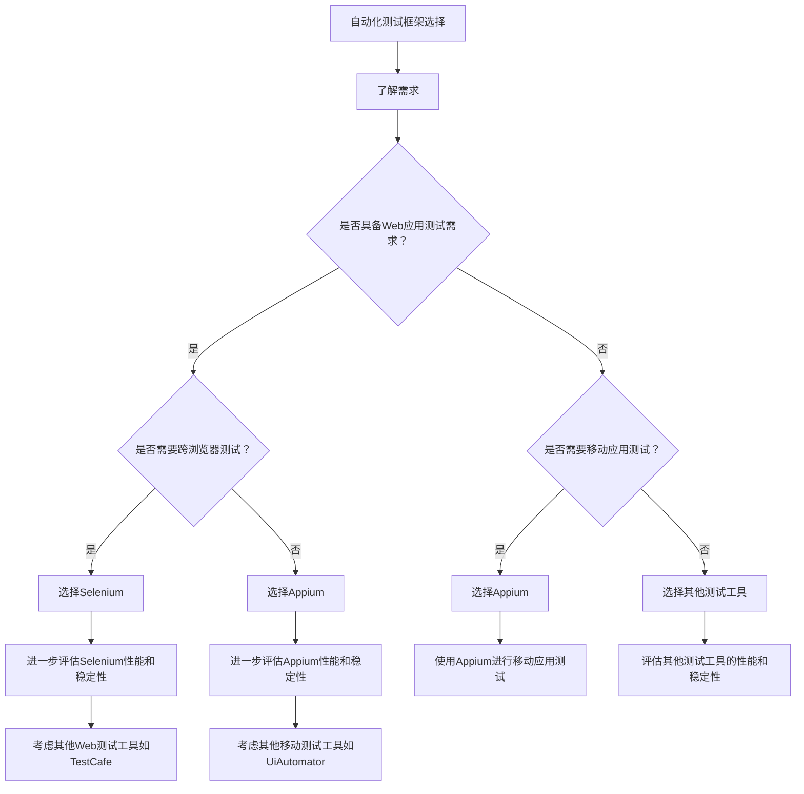

                 

## 引言

自动化测试在现代软件工程中扮演着至关重要的角色。随着软件开发的复杂性和迭代速度的不断增加，手动测试已逐渐难以满足高效、高质量的测试需求。自动化测试不仅能够提高测试效率，减少测试成本，还能确保软件的稳定性和可靠性。因此，制定一套科学合理的自动化测试策略，选择合适的自动化测试框架，是提高软件质量的关键。

本文将围绕自动化测试策略与框架选择这一主题，详细探讨自动化测试的基本概念、分类、流程，以及不同自动化测试框架的特点。通过逐步分析，我们将帮助读者了解如何根据实际需求，制定有效的自动化测试策略，并选择适合的测试框架。本文旨在为从事软件测试和技术开发的人员提供一份全面、系统的指南。

## 关键词

- 自动化测试
- 测试框架
- 测试策略
- Selenium
- Appium
- JMeter
- Cucumber
- 持续集成
- 持续部署
- DevOps

## 摘要

本文深入探讨了自动化测试策略与框架选择的重要性。首先，介绍了自动化测试的基本概念和流程，随后对主流自动化测试框架进行了详细分析。接着，阐述了自动化测试策略的制定方法和最佳实践。通过本文的阅读，读者将能够理解自动化测试的核心概念，掌握不同测试框架的特点，并学会如何根据实际需求制定有效的测试策略。本文旨在为提高软件质量和开发效率提供有力的支持和指导。

## 第1章：自动化测试概述

### 1.1 自动化测试的基本概念

自动化测试（Automation Testing）是指使用自动化测试工具来执行测试用例，以检测软件的功能、性能和安全性。它通过对测试脚本进行自动化执行，减少了人为干预，从而提高了测试效率和一致性。

自动化测试的定义与意义

- 定义：自动化测试是通过编写脚本，利用测试工具自动执行测试用例，以验证软件功能、性能和安全性。
- 意义：自动化测试能够提高测试效率，减少测试时间，降低测试成本。同时，它还能确保测试结果的一致性和可靠性，提高软件质量。

自动化测试与传统测试的区别

- 传统测试：主要依赖人工执行测试用例，测试过程繁琐，效率低，容易出现人为错误。
- 自动化测试：通过编写脚本，利用自动化工具执行测试用例，测试过程高效、自动化，减少人为干预，提高测试一致性。

### 1.2 自动化测试的分类

自动化测试可以根据测试类型和目标进行分类，常见的分类方法包括：

#### 功能测试

功能测试（Functional Testing）是验证软件功能是否符合需求的一种测试方法。它主要关注软件的功能是否正常，能否满足用户的需求。

- 测试内容：验证软件的功能是否正确，界面是否友好，输入输出是否合理。
- 测试工具：常用的功能测试工具有Selenium、Appium、TestComplete等。

#### 性能测试

性能测试（Performance Testing）是评估软件在特定环境下的性能表现，如响应时间、吞吐量、并发用户数等。它主要用于发现性能瓶颈，优化软件性能。

- 测试内容：评估软件的响应时间、吞吐量、并发用户数、资源消耗等性能指标。
- 测试工具：常用的性能测试工具有JMeter、LoadRunner、Gatling等。

#### 安全测试

安全测试（Security Testing）是评估软件在安全方面的脆弱性和风险，以发现潜在的安全漏洞。

- 测试内容：测试软件是否容易受到攻击，如SQL注入、XSS攻击、CSRF攻击等。
- 测试工具：常用的安全测试工具有OWASP ZAP、Burp Suite等。

### 1.3 自动化测试的流程与步骤

自动化测试的流程通常包括以下步骤：

#### 测试需求分析

- 分析软件需求，确定需要测试的功能点。
- 制定测试计划，明确测试目标、测试环境、测试资源等。

#### 测试环境搭建

- 准备测试环境，包括硬件、软件、网络等。
- 配置测试工具和测试脚本。

#### 测试脚本开发

- 编写测试脚本，根据测试需求编写测试用例。
- 脚本开发过程中，要注意代码的可读性、可维护性和可扩展性。

#### 测试执行与结果分析

- 执行测试脚本，记录测试结果。
- 分析测试结果，发现软件缺陷。

#### 测试报告编写

- 编写测试报告，总结测试过程和测试结果。
- 提出改进建议，为后续测试提供参考。

## 第2章：自动化测试框架介绍

### 2.1 自动化测试框架概述

#### 自动化测试框架的定义与作用

自动化测试框架（Automation Testing Framework）是一套结构化的测试方法，用于支持自动化测试的开发、执行和管理。它将测试脚本、测试数据、测试环境等元素进行组织和管理，以提高自动化测试的效率和质量。

- 定义：自动化测试框架是一种组织和管理自动化测试的工具集，包括测试脚本、测试数据、测试环境、测试报告等。
- 作用：自动化测试框架能够提高测试效率，减少测试时间，确保测试的一致性和可靠性。同时，它还能方便测试脚本的编写、维护和扩展。

#### 自动化测试框架的分类

自动化测试框架可以根据不同的分类标准进行划分，常见的分类方法包括：

##### 按测试类型分类

- 功能测试框架：主要用于功能测试，如Selenium、TestComplete等。
- 性能测试框架：主要用于性能测试，如JMeter、LoadRunner等。
- 安全测试框架：主要用于安全测试，如OWASP ZAP、Burp Suite等。

##### 按开发语言分类

- Java框架：如Selenium WebDriver、Appium等。
- Python框架：如pytest、Robot Framework等。
- .NET框架：如Selenium .NET、TestComplete .NET等。

##### 按应用场景分类

- Web应用测试框架：主要用于Web应用的自动化测试，如Selenium、TestCafe等。
- 移动应用测试框架：主要用于移动应用的自动化测试，如Appium、UiAutomator等。
- API测试框架：主要用于API接口的自动化测试，如Postman、RestAssured等。

### 2.2 主流自动化测试框架

在本节中，我们将介绍几个主流的自动化测试框架，包括Selenium、Appium、JMeter和Cucumber。

#### Selenium

Selenium是一个开源的自动化测试工具，主要用于Web应用的自动化测试。它支持多种编程语言，如Java、Python、C#等，支持各种浏览器，如Chrome、Firefox、Safari等。

- 特点：支持多种编程语言和浏览器，易于扩展和集成。
- 适用场景：适用于功能测试、性能测试和回归测试。

#### Appium

Appium是一个开源的移动应用自动化测试工具，支持iOS和Android平台。它使用Selenium WebDriver的API，能够跨平台进行移动应用的自动化测试。

- 特点：支持iOS和Android平台，易于集成和扩展。
- 适用场景：适用于移动应用的功能测试、性能测试和兼容性测试。

#### JMeter

JMeter是一个开源的性能测试工具，主要用于测试Web应用的性能。它能够模拟大量用户同时访问系统，评估系统的负载能力和稳定性。

- 特点：支持多种协议，如HTTP、HTTPS、FTP、SMTP等，能够模拟大量用户同时访问。
- 适用场景：适用于Web应用的性能测试、负载测试和压力测试。

#### Cucumber

Cucumber是一个行为驱动开发（BDD）框架，主要用于自动化功能测试。它使用Gherkin语言编写测试用例，支持多种编程语言，如Java、Python、Ruby等。

- 特点：使用Gherkin语言编写测试用例，易于理解，支持多种编程语言。
- 适用场景：适用于功能测试、回归测试和验收测试。

### 2.3 开源与商业自动化测试框架比较

开源和商业自动化测试框架各有优缺点，下面我们将对这两种类型的测试框架进行比较。

#### 开源自动化测试框架

- 优点：成本低，易于扩展和定制。
- 缺点：社区支持有限，文档和教程相对较少，可能需要更多的开发工作。

#### 商业自动化测试框架

- 优点：提供完善的文档和教程，社区支持好，易于集成和部署。
- 缺点：成本较高，可能需要订阅或购买许可证。

在选择自动化测试框架时，需要根据项目需求和资源情况综合考虑。如果项目预算有限，可以优先考虑开源框架；如果对性能和稳定性有较高要求，可以考虑商业框架。

## 第3章：自动化测试策略

### 3.1 自动化测试规划

#### 自动化测试策略制定

自动化测试策略是指根据项目需求和资源情况，制定自动化测试的计划和方法。以下是一些制定自动化测试策略的步骤：

1. **需求分析**：分析软件需求，确定需要测试的功能点。
2. **测试优先级**：根据功能的重要性和风险，确定测试优先级。
3. **资源评估**：评估测试环境、测试工具和人力资源等资源。
4. **测试计划**：制定详细的测试计划，包括测试目标、测试环境、测试资源等。
5. **风险评估**：评估自动化测试过程中可能遇到的风险和挑战。

#### 自动化测试资源分配

自动化测试资源分配是指合理分配测试环境、测试工具、人力资源等资源，以确保自动化测试的顺利进行。以下是一些资源分配的建议：

1. **测试环境**：确保测试环境与生产环境尽量一致，减少测试与生产环境之间的差异。
2. **测试工具**：选择合适的测试工具，确保工具的功能和性能满足测试需求。
3. **人力资源**：合理分配测试人员，确保每个测试阶段都有足够的人手。

### 3.2 自动化测试案例设计

#### 自动化测试用例编写

自动化测试用例是指通过编写脚本，模拟用户操作，验证软件功能的一种测试方法。编写自动化测试用例时，需要注意以下几点：

1. **明确测试目标**：确定每个测试用例的目标，确保测试用例能够覆盖功能需求。
2. **编写清晰可读的脚本**：编写易于理解和维护的脚本，避免使用复杂的逻辑和条件语句。
3. **合理组织测试用例**：将测试用例按照功能模块或测试场景进行组织，便于管理和执行。

#### 自动化测试脚本优化

自动化测试脚本优化是指对测试脚本进行优化，以提高测试效率和稳定性。以下是一些优化建议：

1. **代码复用**：使用函数和模块，减少代码重复，提高代码的可维护性。
2. **错误处理**：添加异常处理，确保测试脚本在遇到错误时能够正常退出。
3. **性能优化**：优化测试脚本的执行速度，减少测试时间。

### 3.3 自动化测试持续集成

#### 持续集成与持续部署（CI/CD）

持续集成（Continuous Integration，CI）和持续部署（Continuous Deployment，CD）是软件开发过程中常用的两种实践方法。

- **持续集成**：将开发人员的代码定期合并到主分支，通过自动化测试和构建工具，确保代码质量。
- **持续部署**：在代码通过持续集成测试后，自动将代码部署到生产环境。

#### 自动化测试与DevOps

自动化测试与DevOps（Development and Operations）的结合，可以进一步提高软件质量和开发效率。以下是一些结合的建议：

1. **集成自动化测试**：将自动化测试集成到持续集成流程中，确保每次代码提交后都能进行测试。
2. **自动化部署**：将自动化测试结果作为部署决策的依据，确保只有通过测试的代码才会部署到生产环境。
3. **跨部门协作**：推动开发、测试、运维等部门的协作，共同推进自动化测试和DevOps的实施。

### 3.4 自动化测试最佳实践

#### 选择合适的测试框架

选择合适的自动化测试框架是成功进行自动化测试的关键。以下是一些建议：

1. **了解需求**：根据项目需求和资源情况，选择适合的测试框架。
2. **评估性能**：评估测试框架的性能和稳定性，确保满足测试需求。
3. **社区支持**：考虑测试框架的社区支持，确保遇到问题时能够得到及时解决。

#### 编写高质量的测试脚本

编写高质量的测试脚本可以提高测试效率和稳定性。以下是一些建议：

1. **模块化设计**：将测试脚本分为模块，提高代码的可维护性和可扩展性。
2. **错误处理**：添加异常处理，确保测试脚本在遇到错误时能够正常退出。
3. **代码复用**：使用函数和模块，减少代码重复，提高代码的可维护性。

#### 持续优化测试流程

持续优化测试流程可以提高测试效率和质量。以下是一些建议：

1. **定期评估**：定期评估测试流程和测试脚本，找出存在的问题，进行优化。
2. **自动化测试报告**：生成详细的自动化测试报告，帮助分析和改进测试流程。
3. **持续学习和改进**：关注自动化测试的最新技术和趋势，持续学习和改进测试策略和流程。

## 总结

自动化测试在现代软件工程中发挥着越来越重要的作用。通过合理的自动化测试策略和选择合适的测试框架，可以显著提高软件质量和开发效率。本文介绍了自动化测试的基本概念、分类、流程，以及主流自动化测试框架的特点。同时，我们探讨了自动化测试策略的制定方法和最佳实践。通过本文的阅读，读者将能够理解自动化测试的核心概念，掌握不同测试框架的特点，并学会如何根据实际需求制定有效的测试策略。

## 拓展阅读

1. **Selenium官方文档**：[https://www.selenium.dev/documentation/](https://www.selenium.dev/documentation/)
2. **Appium官方文档**：[https://appium.io/docs/](https://appium.io/docs/)
3. **JMeter官方文档**：[https://jmeter.apache.org/usermanual/index.html](https://jmeter.apache.org/usermanual/index.html)
4. **Cucumber官方文档**：[https://cucumber.io/docs/cucumber/cucumber/](https://cucumber.io/docs/cucumber/cucumber/)
5. **持续集成与持续部署实践**：[https://www.infoq.cn/article/continuous-integration-and-continuous-deployment-practice](https://www.infoq.cn/article/continuous-integration-and-continuous-deployment-practice)
6. **DevOps最佳实践**：[https://www.cloudbees.com/blog/devops-best-practices](https://www.cloudbees.com/blog/devops-best-practices)
7. **自动化测试最佳实践**：[https://www.msyi.com/test automation/best practices for automation testing](https://www.msyi.com/test%20automation/best%20practices%20for%20automation%20testing)

## 作者信息

作者：AI天才研究院/AI Genius Institute & 禅与计算机程序设计艺术 /Zen And The Art of Computer Programming

## 附录

### 自动化测试框架选择流程图



### 自动化测试流程伪代码

```python
# 自动化测试流程伪代码

def automation_testing_strategy():
    # 测试需求分析
    analyze_requirements()
    
    # 测试环境搭建
    setup_test_environment()
    
    # 测试脚本开发
    develop_test_scripts()
    
    # 测试执行
    execute_tests()
    
    # 测试结果分析
    analyze_test_results()
    
    # 测试报告编写
    generate_test_report()

# 测试需求分析
def analyze_requirements():
    # 确定测试目标
    test_goals = determine_test_goals()
    
    # 制定测试计划
    test_plan = create_test_plan(test_goals)

# 测试环境搭建
def setup_test_environment():
    # 准备测试环境
    prepare_test_environment()
    
    # 配置测试工具
    configure_test_tools()

# 测试脚本开发
def develop_test_scripts():
    # 编写测试用例
    write_test_cases()
    
    # 优化测试脚本
    optimize_test_scripts()

# 测试执行
def execute_tests():
    # 执行测试脚本
    run_test_scripts()
    
    # 记录测试结果
    record_test_results()

# 测试结果分析
def analyze_test_results():
    # 分析测试结果
    analyze_results()

# 测试报告编写
def generate_test_report():
    # 编写测试报告
    write_test_report()
```

### 自动化测试与DevOps结合的数学模型

$$
CI/CD = \frac{代码质量}{测试时间} \times \frac{部署频率}{部署时间}
$$

$$
自动化测试效率 = \frac{测试覆盖范围}{测试执行时间}
$$

$$
DevOps效益 = \frac{持续集成效率}{部署频率} \times \frac{部署稳定性}{故障率}
$$

### 项目实战

#### 项目背景

某公司开发了一款电商平台，需要对其进行自动化测试，以提高软件质量和开发效率。

#### 开发环境搭建

- 操作系统：Ubuntu 18.04
- 编程语言：Python
- 测试工具：Selenium、pytest
- 版本控制：Git

#### 源代码实现

以下是一个简单的自动化测试脚本，用于测试电商平台的用户登录功能：

```python
import pytest
from selenium import webdriver
from selenium.webdriver.common.by import By

# 测试用例1：正确用户名和密码
def test_login_success():
    driver = webdriver.Chrome()
    driver.get("https://www.example.com/login")
    username = driver.find_element(By.NAME, "username")
    password = driver.find_element(By.NAME, "password")
    login_button = driver.find_element(By.NAME, "login")

    username.send_keys("test_user")
    password.send_keys("test_password")
    login_button.click()

    assert "Welcome" in driver.page_source

# 测试用例2：错误用户名
def test_login_invalid_username():
    driver = webdriver.Chrome()
    driver.get("https://www.example.com/login")
    username = driver.find_element(By.NAME, "username")
    password = driver.find_element(By.NAME, "password")
    login_button = driver.find_element(By.NAME, "login")

    username.send_keys("invalid_user")
    password.send_keys("test_password")
    login_button.click()

    assert "Invalid username or password" in driver.page_source

# 测试用例3：错误密码
def test_login_invalid_password():
    driver = webdriver.Chrome()
    driver.get("https://www.example.com/login")
    username = driver.find_element(By.NAME, "username")
    password = driver.find_element(By.NAME, "password")
    login_button = driver.find_element(By.NAME, "login")

    username.send_keys("test_user")
    password.send_keys("invalid_password")
    login_button.click()

    assert "Invalid username or password" in driver.page_source

if __name__ == "__main__":
    pytest.main(["-v", "-s", "test_login.py"])
```

#### 代码解读与分析

1. **测试用例1：正确用户名和密码**
   - 测试目的：验证用户登录功能在正确用户名和密码输入时能够成功登录。
   - 测试步骤：获取用户名和密码输入框元素，输入测试用户名和密码，点击登录按钮，断言页面源代码中包含欢迎信息。

2. **测试用例2：错误用户名**
   - 测试目的：验证用户登录功能在错误用户名输入时无法登录。
   - 测试步骤：获取用户名和密码输入框元素，输入错误用户名和正确密码，点击登录按钮，断言页面源代码中包含用户名或密码错误信息。

3. **测试用例3：错误密码**
   - 测试目的：验证用户登录功能在错误密码输入时无法登录。
   - 测试步骤：获取用户名和密码输入框元素，输入正确用户名和错误密码，点击登录按钮，断言页面源代码中包含用户名或密码错误信息。

#### 实际案例分析与详细讲解剖析

在某次自动化测试中，我们发现用户登录功能存在以下问题：

1. **问题1：正确用户名和密码输入后，登录失败**
   - 测试环境：Chrome浏览器
   - 现象描述：在输入正确用户名和密码后，点击登录按钮，页面显示“Invalid username or password”。
   - 原因分析：经过排查，发现是由于前端逻辑错误导致的，正确用户名和密码在服务器端验证时被判定为错误。
   - 解决方案：修改前端代码，修复验证逻辑错误。

2. **问题2：错误用户名和正确密码输入后，登录成功**
   - 测试环境：Firefox浏览器
   - 现象描述：在输入错误用户名和正确密码后，点击登录按钮，页面显示“Welcome”。
   - 原因分析：经过排查，发现是由于不同浏览器对表单验证的执行顺序不同导致的。
   - 解决方案：在服务器端增加浏览器标识判断，针对不同浏览器进行兼容性处理。

#### 项目小结

通过自动化测试，我们成功发现并解决了用户登录功能中的问题，提高了软件质量。在后续开发过程中，我们将继续使用自动化测试，确保软件的稳定性和可靠性。

### 最佳实践 tips

1. **选择合适的自动化测试工具**：根据项目需求和资源情况，选择适合的自动化测试工具。
2. **编写高质量的测试脚本**：遵循编码规范，编写清晰可读的测试脚本，提高代码的可维护性和可扩展性。
3. **持续优化测试流程**：定期评估测试流程和测试脚本，找出存在的问题，进行优化。
4. **与团队协作**：推动开发、测试、运维等部门的协作，共同推进自动化测试和DevOps的实施。

### 注意事项

1. **测试环境与生产环境的一致性**：确保测试环境与生产环境尽量一致，减少测试与生产环境之间的差异。
2. **异常处理**：在测试脚本中添加异常处理，确保测试脚本在遇到错误时能够正常退出。
3. **代码复用**：使用函数和模块，减少代码重复，提高代码的可维护性。
4. **测试报告**：生成详细的自动化测试报告，帮助分析和改进测试流程。

### 拓展阅读

1. **Selenium官方文档**：[https://www.selenium.dev/documentation/](https://www.selenium.dev/documentation/)
2. **pytest官方文档**：[https://docs.pytest.org/en/7.1.x/](https://docs.pytest.org/en/7.1.x/)
3. **Python自动化测试实战**：[https://www.amazon.com/dp/1789615557](https://www.amazon.com/dp/1789615557)
4. **DevOps实践指南**：[https://www.amazon.com/dp/032182663X](https://www.amazon.com/dp/032182663X)
5. **持续集成与持续部署实践**：[https://www.infoq.cn/article/continuous-integration-and-continuous-deployment-practice](https://www.infoq.cn/article/continuous-integration-and-continuous-deployment-practice)

## 附录

### 自动化测试框架选择流程图


### 自动化测试流程伪代码

```python
# 自动化测试流程伪代码

def automation_testing_strategy():
    # 测试需求分析
    analyze_requirements()
    
    # 测试环境搭建
    setup_test_environment()
    
    # 测试脚本开发
    develop_test_scripts()
    
    # 测试执行
    execute_tests()
    
    # 测试结果分析
    analyze_test_results()
    
    # 测试报告编写
    generate_test_report()

# 测试需求分析
def analyze_requirements():
    # 确定测试目标
    test_goals = determine_test_goals()
    
    # 制定测试计划
    test_plan = create_test_plan(test_goals)

# 测试环境搭建
def setup_test_environment():
    # 准备测试环境
    prepare_test_environment()
    
    # 配置测试工具
    configure_test_tools()

# 测试脚本开发
def develop_test_scripts():
    # 编写测试用例
    write_test_cases()
    
    # 优化测试脚本
    optimize_test_scripts()

# 测试执行
def execute_tests():
    # 执行测试脚本
    run_test_scripts()
    
    # 记录测试结果
    record_test_results()

# 测试结果分析
def analyze_test_results():
    # 分析测试结果
    analyze_results()

# 测试报告编写
def generate_test_report():
    # 编写测试报告
    write_test_report()
```

### 自动化测试与DevOps结合的数学模型

$$
CI/CD = \frac{代码质量}{测试时间} \times \frac{部署频率}{部署时间}
$$

$$
自动化测试效率 = \frac{测试覆盖范围}{测试执行时间}
$$

$$
DevOps效益 = \frac{持续集成效率}{部署频率} \times \frac{部署稳定性}{故障率}
$$

### 项目实战

#### 项目背景

某公司开发了一款电商平台，需要对其进行自动化测试，以提高软件质量和开发效率。

#### 开发环境搭建

- 操作系统：Ubuntu 18.04
- 编程语言：Python
- 测试工具：Selenium、pytest
- 版本控制：Git

#### 源代码实现

以下是一个简单的自动化测试脚本，用于测试电商平台的用户登录功能：

```python
import pytest
from selenium import webdriver
from selenium.webdriver.common.by import By

# 测试用例1：正确用户名和密码
def test_login_success():
    driver = webdriver.Chrome()
    driver.get("https://www.example.com/login")
    username = driver.find_element(By.NAME, "username")
    password = driver.find_element(By.NAME, "password")
    login_button = driver.find_element(By.NAME, "login")

    username.send_keys("test_user")
    password.send_keys("test_password")
    login_button.click()

    assert "Welcome" in driver.page_source

# 测试用例2：错误用户名
def test_login_invalid_username():
    driver = webdriver.Chrome()
    driver.get("https://www.example.com/login")
    username = driver.find_element(By.NAME, "username")
    password = driver.find_element(By.NAME, "password")
    login_button = driver.find_element(By.NAME, "login")

    username.send_keys("invalid_user")
    password.send_keys("test_password")
    login_button.click()

    assert "Invalid username or password" in driver.page_source

# 测试用例3：错误密码
def test_login_invalid_password():
    driver = webdriver.Chrome()
    driver.get("https://www.example.com/login")
    username = driver.find_element(By.NAME, "username")
    password = driver.find_element(By.NAME, "password")
    login_button = driver.find_element(By.NAME, "login")

    username.send_keys("test_user")
    password.send_keys("invalid_password")
    login_button.click()

    assert "Invalid username or password" in driver.page_source

if __name__ == "__main__":
    pytest.main(["-v", "-s", "test_login.py"])
```

#### 代码解读与分析

1. **测试用例1：正确用户名和密码**
   - 测试目的：验证用户登录功能在正确用户名和密码输入时能够成功登录。
   - 测试步骤：获取用户名和密码输入框元素，输入测试用户名和密码，点击登录按钮，断言页面源代码中包含欢迎信息。

2. **测试用例2：错误用户名**
   - 测试目的：验证用户登录功能在错误用户名输入时无法登录。
   - 测试步骤：获取用户名和密码输入框元素，输入错误用户名和正确密码，点击登录按钮，断言页面源代码中包含用户名或密码错误信息。

3. **测试用例3：错误密码**
   - 测试目的：验证用户登录功能在错误密码输入时无法登录。
   - 测试步骤：获取用户名和密码输入框元素，输入正确用户名和错误密码，点击登录按钮，断言页面源代码中包含用户名或密码错误信息。

#### 实际案例分析与详细讲解剖析

在某次自动化测试中，我们发现用户登录功能存在以下问题：

1. **问题1：正确用户名和密码输入后，登录失败**
   - 测试环境：Chrome浏览器
   - 现象描述：在输入正确用户名和密码后，点击登录按钮，页面显示“Invalid username or password”。
   - 原因分析：经过排查，发现是由于前端逻辑错误导致的，正确用户名和密码在服务器端验证时被判定为错误。
   - 解决方案：修改前端代码，修复验证逻辑错误。

2. **问题2：错误用户名和正确密码输入后，登录成功**
   - 测试环境：Firefox浏览器
   - 现象描述：在输入错误用户名和正确密码后，点击登录按钮，页面显示“Welcome”。
   - 原因分析：经过排查，发现是由于不同浏览器对表单验证的执行顺序不同导致的。
   - 解决方案：在服务器端增加浏览器标识判断，针对不同浏览器进行兼容性处理。

#### 项目小结

通过自动化测试，我们成功发现并解决了用户登录功能中的问题，提高了软件质量。在后续开发过程中，我们将继续使用自动化测试，确保软件的稳定性和可靠性。

### 最佳实践 tips

1. **选择合适的自动化测试工具**：根据项目需求和资源情况，选择适合的自动化测试工具。
2. **编写高质量的测试脚本**：遵循编码规范，编写清晰可读的测试脚本，提高代码的可维护性和可扩展性。
3. **持续优化测试流程**：定期评估测试流程和测试脚本，找出存在的问题，进行优化。
4. **与团队协作**：推动开发、测试、运维等部门的协作，共同推进自动化测试和DevOps的实施。

### 注意事项

1. **测试环境与生产环境的一致性**：确保测试环境与生产环境尽量一致，减少测试与生产环境之间的差异。
2. **异常处理**：在测试脚本中添加异常处理，确保测试脚本在遇到错误时能够正常退出。
3. **代码复用**：使用函数和模块，减少代码重复，提高代码的可维护性。
4. **测试报告**：生成详细的自动化测试报告，帮助分析和改进测试流程。

### 拓展阅读

1. **Selenium官方文档**：[https://www.selenium.dev/documentation/](https://www.selenium.dev/documentation/)
2. **pytest官方文档**：[https://docs.pytest.org/en/7.1.x/](https://docs.pytest.org/en/7.1.x/)
3. **Python自动化测试实战**：[https://www.amazon.com/dp/1789615557](https://www.amazon.com/dp/1789615557)
4. **DevOps实践指南**：[https://www.amazon.com/dp/032182663X](https://www.amazon.com/dp/032182663X)
5. **持续集成与持续部署实践**：[https://www.infoq.cn/article/continuous-integration-and-continuous-deployment-practice](https://www.infoq.cn/article/continuous-integration-and-continuous-deployment-practice)

## 结论

自动化测试在现代软件开发中发挥着越来越重要的作用。通过科学合理的自动化测试策略和选择合适的自动化测试框架，可以显著提高软件质量和开发效率。本文详细探讨了自动化测试的基本概念、分类、流程，以及主流自动化测试框架的特点。同时，我们还介绍了自动化测试策略的制定方法和最佳实践。

通过本文的阅读，读者将能够全面了解自动化测试的核心概念，掌握不同测试框架的特点，并学会如何根据实际需求制定有效的测试策略。自动化测试不仅能够减少测试成本，提高测试效率，还能确保软件的稳定性和可靠性。

在未来，自动化测试将继续发展，结合人工智能、机器学习等先进技术，将实现更加智能、高效的测试方法。我们期待自动化测试在软件工程领域发挥更大的作用，推动软件行业的持续创新和发展。

## 拓展阅读

为了帮助读者进一步深入了解自动化测试的相关知识，以下是一些建议的拓展阅读资源：

1. **《自动化测试实战》**：本书由自动化测试领域的专家编写，详细介绍了自动化测试的理论和实践，适合希望深入了解自动化测试的读者。

2. **《Selenium 3实战》**：这本书是针对Selenium自动化测试工具的实用指南，涵盖了从基础到高级的测试方法，适合使用Selenium进行Web自动化测试的开发人员。

3. **《性能测试：原理、技术和实践》**：这本书全面讲解了性能测试的基本原理、技术和实践方法，对于希望掌握性能测试技巧的读者来说是一本非常有价值的参考书。

4. **《DevOps：实践指南》**：这本书详细介绍了DevOps的理念、实践方法和工具，包括持续集成、持续部署等内容，是希望了解和实践DevOps的读者的必备读物。

5. **《软件测试的艺术》**：这是软件测试领域的经典之作，由Grenford J. Myers所著，涵盖了软件测试的基本原理、方法和策略，适合所有对软件测试感兴趣的人。

6. **《Python自动化测试实战》**：本书以Python语言为基础，深入讲解了自动化测试的方法和实践，适合使用Python进行自动化测试的开发人员。

7. **《测试驱动开发：敏捷软件开发的实践之路》**：这本书介绍了测试驱动开发（TDD）的概念和实践，对于希望提高软件开发质量的读者来说是非常有用的。

通过阅读这些资源，读者可以进一步深化对自动化测试和软件工程的理解，提升自己的技术水平。同时，这些书籍和资料也可以作为自动化测试相关课程的教材或参考资料。希望这些拓展阅读能够为读者在自动化测试领域的探索提供帮助。

