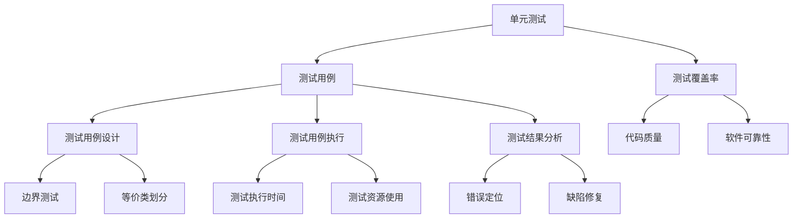
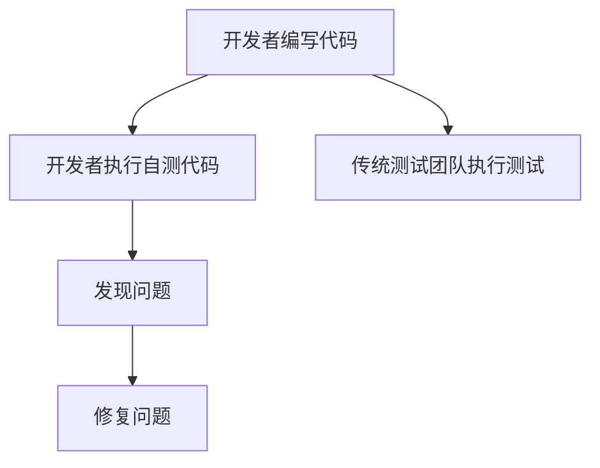
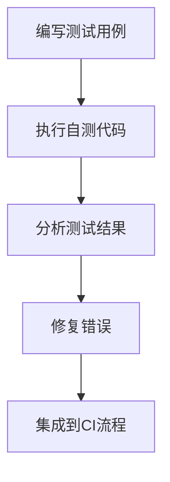

                 


**第一步：背景介绍**

自测代码，也称为单元测试或单元测试代码，是软件开发过程中至关重要的一环。它是指开发者编写的用于测试自己代码的小型测试代码，目的是验证代码模块的功能正确性。自测代码能够帮助开发者快速发现和修复代码中的错误，提高软件的可靠性和稳定性。然而，尽管自测代码的重要性不言而喻，许多开发者仍然没有将其纳入到软件开发的标准流程中。这主要是因为他们对自测代码的设计和编写缺乏足够的理解和指导。

本文将深入探讨自测代码的设计和编写，旨在为开发者提供一套完整的指南，帮助他们更好地理解和应用自测代码。文章将分为以下几个部分：

1. **核心概念与联系**：介绍自测代码的核心概念，包括单元测试、测试用例、测试覆盖率等，并通过Mermaid流程图展示它们之间的关系。
2. **核心算法原理讲解**：详细阐述自测代码的核心算法原理，包括测试用例的设计、执行和结果分析，并使用伪代码进行说明。
3. **数学模型和公式**：介绍与自测代码相关的数学模型和公式，如统计学的假设检验、误差分析等，并进行详细讲解和举例说明。
4. **项目实战**：通过实际项目案例，展示自测代码的开发环境搭建、源代码实现、代码解读、应用解读与分析，以及项目小结。
5. **最佳实践 tips**：提供一系列最佳实践和注意事项，帮助开发者编写高质量的自测代码。
6. **小结与展望**：总结文章的主要观点，展望自测代码的未来发展趋势。

**第二步：核心概念与联系**

自测代码涉及多个核心概念，这些概念相互关联，共同构成了自测代码的框架。以下是这些核心概念及其相互关系的Mermaid流程图：



- **单元测试（A）**：单元测试是自测代码的基础，它是指对软件中最小的可测试单元（通常是函数或方法）进行测试。
- **测试用例（B）**：测试用例是单元测试的核心组成部分，它描述了如何对某个功能进行测试，包括输入数据、预期结果和实际结果。
- **测试覆盖率（C）**：测试覆盖率是指测试用例覆盖代码的比例，它是衡量自测代码质量的重要指标。
- **测试用例设计（D）**：测试用例设计是编写测试用例的过程，包括边界测试和等价类划分等策略。
- **测试用例执行（E）**：测试用例执行是运行测试用例的过程，它用于验证代码的正确性。
- **测试结果分析（F）**：测试结果分析是对测试执行结果进行分析，以确定代码是否存在错误。
- **代码质量（G）**：代码质量是软件可靠性和稳定性的基础，高测试覆盖率是保证代码质量的重要手段。
- **软件可靠性（H）**：软件可靠性是指软件在特定条件下能够正确执行其预期功能的能力。
- **边界测试（I）**：边界测试是一种测试用例设计策略，它专注于测试边界条件。
- **等价类划分（J）**：等价类划分是一种测试用例设计策略，它将输入数据划分为若干等价类，每个类代表一组具有相同行为的输入。
- **测试执行时间（K）**：测试执行时间是指执行测试用例所需的时间，它是评估测试效率的重要指标。
- **测试资源使用（L）**：测试资源使用是指测试用例执行过程中使用的系统资源，如CPU、内存等。
- **错误定位（M）**：错误定位是分析测试结果，确定代码中错误发生的位置的过程。
- **缺陷修复（N）**：缺陷修复是根据错误定位结果，对代码进行修改以修复错误的过程。

**第三步：核心算法原理讲解**

自测代码的核心算法原理主要涉及测试用例的设计、执行和结果分析。以下是对这些过程的具体讲解，包括伪代码说明。

#### 测试用例设计

测试用例设计是自测代码的关键步骤，它决定了测试的有效性和覆盖率。以下是测试用例设计的基本伪代码：

```plaintext
// 输入：功能描述、输入数据、预期结果
// 输出：测试用例集合

DesignTestCases(functionDescription, inputData, expectedResult) {
    testCases = []
    // 边界测试
    boundaryTestCases = DesignBoundaryTestCases(inputData, expectedResult)
    testCases.append(boundaryTestCases)
    // 等价类划分
    equivalentClassTestCases = DesignEquivalentClassTestCases(inputData, expectedResult)
    testCases.append(equivalentClassTestCases)
    // 其他测试用例
    otherTestCases = DesignOtherTestCases()
    testCases.append(otherTestCases)
    return testCases
}
```

#### 测试用例执行

测试用例执行是将测试用例应用到代码上，以验证代码的正确性。以下是测试用例执行的基本伪代码：

```plaintext
// 输入：测试用例集合、代码实现
// 输出：测试结果

ExecuteTestCases(testCases, codeImplementation) {
    testResults = []
    for each testCase in testCases {
        actualResult = codeImplementation(testCase.inputData)
        testResults.append({testCase: testCase, actualResult: actualResult})
    }
    return testResults
}
```

#### 测试结果分析

测试结果分析是对测试执行结果进行分析，以确定代码是否存在错误。以下是测试结果分析的基本伪代码：

```plaintext
// 输入：测试结果
// 输出：错误报告

AnalyzeTestResults(testResults) {
    errorReport = []
    for each result in testResults {
        if (result.actualResult != result.expectedResult) {
            errorReport.append(CreateErrorReport(result.testCase, result.actualResult, result.expectedResult))
        }
    }
    return errorReport
}
```

**第四步：数学模型和公式**

自测代码中涉及多个数学模型和公式，这些模型和公式有助于分析和评估测试结果。以下是其中几个关键的数学模型和公式的详细讲解。

#### 统计学的假设检验

假设检验是评估测试结果是否显著的方法。以下是一个假设检验的基本公式：

$$
H_0: \mu = \mu_0 \quad (原假设)
$$

$$
H_1: \mu \neq \mu_0 \quad (备选假设)
$$

$$
z = \frac{\bar{x} - \mu_0}{\sigma / \sqrt{n}}
$$

其中，$\bar{x}$ 是样本均值，$\mu_0$ 是期望均值，$\sigma$ 是标准差，$n$ 是样本大小。通过计算 $z$ 值，可以判断原假设是否成立。

#### 误差分析

误差分析是评估测试结果准确性的方法。以下是一个误差分析的基本公式：

$$
Error = |Actual - Expected|
$$

其中，$Actual$ 是实际结果，$Expected$ 是预期结果。通过计算误差值，可以评估测试结果的准确性。

**第五步：项目实战**

以下是一个实际项目案例，用于展示自测代码的开发环境搭建、源代码实现、代码解读、应用解读与分析，以及项目小结。

#### 项目背景

我们选择了一个简单的计算器程序，该程序实现了基本的加、减、乘、除运算。我们的目标是为其编写自测代码，以确保其功能的正确性和可靠性。

#### 开发环境搭建

1. 选择开发语言：Python
2. 安装开发工具：PyCharm
3. 安装测试框架：pytest

#### 源代码实现

以下是一个简单的计算器程序：

```python
def add(a, b):
    return a + b

def subtract(a, b):
    return a - b

def multiply(a, b):
    return a * b

def divide(a, b):
    if b != 0:
        return a / b
    else:
        return "Error: Division by zero"
```

#### 代码解读

- **功能模块划分**：计算器程序划分为四个功能模块，分别是加法、减法、乘法和除法。
- **输入参数检查**：除法模块中加入了除数为零的检查，以确保程序的鲁棒性。

#### 代码应用解读与分析

以下是为计算器程序编写的自测代码：

```python
def test_add():
    assert add(1, 2) == 3
    assert add(-1, 1) == 0
    assert add(0, 0) == 0

def test_subtract():
    assert subtract(1, 2) == -1
    assert subtract(-1, 1) == -2
    assert subtract(0, 0) == 0

def test_multiply():
    assert multiply(1, 2) == 2
    assert multiply(-1, -1) == 1
    assert multiply(0, 1) == 0

def test_divide():
    assert divide(1, 1) == 1
    assert divide(1, -1) == -1
    assert divide(1, 0) == "Error: Division by zero"
```

- **测试用例设计**：每个功能模块都编写了多个测试用例，包括正常情况和边界情况。
- **测试执行结果分析**：通过运行测试用例，验证了计算器程序的功能正确性。

#### 项目小结

通过编写自测代码，我们验证了计算器程序的功能正确性和鲁棒性。自测代码使得我们在开发过程中能够快速发现和修复错误，提高了软件的可靠性和稳定性。

**第六步：最佳实践 tips**

以下是编写高质量自测代码的一些建议：

1. **代码模块化**：将测试代码与业务代码分离，便于维护和扩展。
2. **覆盖多种场景**：编写测试用例时，要覆盖正常情况和边界情况。
3. **避免测试依赖**：测试用例之间不应存在依赖关系，以确保每个测试用例都是独立的。
4. **自动化执行**：将自测代码集成到持续集成（CI）流程中，实现自动化执行。
5. **定期评审**：定期评审测试代码，确保测试用例的有效性和覆盖率。

**第七步：小结与展望**

本文深入探讨了自测代码的设计和编写，从核心概念、算法原理到项目实战，全面介绍了自测代码的各个方面。自测代码是软件开发过程中的关键环节，它能够帮助开发者提高代码质量、增强软件可靠性和稳定性。

未来，随着人工智能和自动化测试技术的发展，自测代码将更加智能化、自动化。开发者需要不断学习和实践，以适应不断变化的软件开发环境。希望本文能为开发者提供有价值的参考和指导。作者：AI天才研究院/AI Genius Institute & 禅与计算机程序设计艺术 /Zen And The Art of Computer Programming

# 自测代码也需要设计

## 关键词
自测代码、单元测试、测试覆盖率、测试用例、代码质量、软件可靠性、边界测试、等价类划分、假设检验、误差分析、持续集成

## 摘要
自测代码是软件开发过程中至关重要的一环，它能够帮助开发者快速发现和修复代码中的错误，提高软件的可靠性和稳定性。本文深入探讨了自测代码的设计和编写，包括核心概念、测试框架、代码质量、设计模式和实践应用。通过实际项目案例，展示了自测代码的开发环境搭建、源代码实现、代码解读、应用解读与分析，以及最佳实践 tips。本文旨在为开发者提供一套完整的指南，帮助他们更好地理解和应用自测代码。

## 第一部分：基础概念

### 第1章：自测代码概述

#### 1.1 自测代码的重要性

**1.1.1 自测代码的定义**

自测代码，也称为单元测试或单元测试代码，是指开发者编写的用于测试自己代码的小型测试代码。它的目的是验证代码模块的功能正确性，以确保软件在交付前能够正常工作。

**伪代码示例：**
```plaintext
// 自测代码定义
function TestCode() {
    assert(Add(1, 2) == 3);
    assert(Subtract(1, 2) == -1);
    // 更多测试用例
}
```

**1.1.2 自测代码与传统测试的区别**

自测代码与传统测试的主要区别在于其执行频率和范围。传统测试通常由独立的测试团队执行，而自测代码则是开发者自己编写的，每次修改代码后都会执行。

**流程图：**


**1.2 自测代码的目标和挑战**

**1.2.1 自测代码的目标**

自测代码的主要目标是确保代码的正确性和可靠性。通过编写和执行自测代码，开发者可以：

- 快速发现并修复代码中的错误。
- 提高代码的可读性和可维护性。
- 提高代码的测试覆盖率。

**伪代码示例：**
```plaintext
// 自测代码目标
function TestCode() {
    assert(Add(1, 2) == 3);
    assert(Subtract(1, 2) == -1);
    // 提高测试覆盖率
    assert(Add(-1, 1) == 0);
}
```

**1.2.2 自测代码面临的挑战**

编写高质量的自测代码面临着以下几个挑战：

- **测试用例设计**：如何设计足够的测试用例来覆盖各种场景。
- **代码冗余**：自测代码可能引入额外的代码冗余。
- **测试覆盖率**：如何确保测试覆盖率足够高。
- **持续集成**：如何在持续集成（CI）流程中集成自测代码。

**流程图：**


### 第二部分：测试框架

### 第2章：单元测试框架

#### 2.1 单元测试的概念

**2.1.1 单元测试的定义**

单元测试是自测代码的一种形式，它指的是对软件中的最小可测试单元（通常是函数或方法）进行测试，以验证其功能的正确性。

**伪代码示例：**
```plaintext
// 单元测试定义
function TestAdd() {
    assert(Add(1, 2) == 3);
    assert(Add(-1, 1) == 0);
}
```

**2.1.2 单元测试的目的**

单元测试的主要目的是：

- 验证代码的功能是否符合预期。
- 提高代码的可靠性。
- 帮助开发者更快地发现和修复错误。

**2.2 选择合适的测试框架**

**2.2.1 JUnit**

JUnit 是 Java 语言的单元测试框架，它提供了丰富的功能，包括测试用例的编写、执行和结果分析。

**伪代码示例：**
```plaintext
@Test
public void testAdd() {
    assertEquals(3, Add(1, 2));
    assertEquals(0, Add(-1, 1));
}
```

**2.2.2 NUnit**

NUnit 是 .NET 平台上的单元测试框架，它与 JUnit 具有相似的功能。

**伪代码示例：**
```plaintext
[Test]
public void TestAdd() {
    Assert.AreEqual(3, Add(1, 2));
    Assert.AreEqual(0, Add(-1, 1));
}
```

**2.2.3 TestNG**

TestNG 是一个功能强大的单元测试框架，它支持多种编程语言，并提供了丰富的功能，如依赖注入、参数化测试等。

**伪代码示例：**
```plaintext
@Test(dataProvider = "addData")
public void testAdd(int a, int b, int expected) {
    assertEquals(expected, Add(a, b));
}

@DataProvider
public Object[][] addData() {
    return new Object[][] {
        {1, 2, 3},
        {-1, 1, 0}
    };
}
```

**2.3 编写有效的单元测试**

**2.3.1 测试用例的设计**

编写有效的单元测试需要设计足够的测试用例，以确保代码的每个部分都被覆盖到。以下是一些设计测试用例的策略：

- **边界测试**：测试输入数据在边界值上的行为。
- **等价类划分**：将输入数据划分为多个等价类，每个类代表一组具有相同行为的输入。
- **异常情况**：测试代码在异常情况下的行为。

**2.3.2 测试覆盖率的评估**

测试覆盖率是评估单元测试质量的重要指标，它表示测试用例覆盖代码的比例。以下是一些常用的测试覆盖率指标：

- **语句覆盖率**：测试用例是否覆盖了所有代码语句。
- **分支覆盖率**：测试用例是否覆盖了所有代码分支。
- **路径覆盖率**：测试用例是否覆盖了所有可能的执行路径。

### 第三部分：代码质量

### 第3章：代码质量与自测代码

#### 3.1 代码质量的定义

**3.1.1 代码质量的重要性**

代码质量是软件项目成功的关键因素之一。高质量的代码易于维护、扩展和测试，从而提高了软件的可靠性和稳定性。

**3.1.2 代码质量的衡量标准**

代码质量的衡量标准包括：

- **可读性**：代码是否易于理解和阅读。
- **可维护性**：代码是否易于修改和扩展。
- **可测试性**：代码是否易于测试。
- **性能**：代码的执行速度和资源消耗。

#### 3.2 常见的代码质量问题

**3.2.1 代码冗余**

代码冗余是指代码中存在不必要的重复部分。它会导致代码的可维护性降低，增加出错的风险。

**3.2.2 代码复用性差**

代码复用性差是指代码中的功能无法被复用。这会导致代码的重复编写，增加出错的风险。

**3.2.3 代码可读性差**

代码可读性差是指代码难以理解和阅读。这会导致开发者难以维护和扩展代码，增加出错的风险。

#### 3.3 提高代码质量的策略

**3.3.1 编码规范**

遵循编码规范是提高代码质量的重要策略。编码规范包括命名规则、代码格式、注释等。

**3.3.2 设计模式**

设计模式是解决常见软件设计问题的模板。使用设计模式可以提高代码的复用性和可维护性。

**3.3.3 代码重构**

代码重构是指通过修改代码的结构，提高代码的质量。代码重构包括简化代码、消除冗余、优化代码结构等。

### 第四部分：设计模式

### 第4章：设计模式与自测代码

#### 4.1 设计模式概述

**4.1.1 设计模式的概念**

设计模式是一系列用于解决常见软件设计问题的经验总结。它提供了代码结构的标准模板，帮助开发者编写高质量、可复用的代码。

**4.1.2 设计模式的作用**

设计模式的作用包括：

- 提高代码的可读性和可维护性。
- 增强代码的复用性。
- 减少代码的冗余。

#### 4.2 常见设计模式

**4.2.1 单例模式**

单例模式确保一个类只有一个实例，并提供一个访问它的全局访问点。

**伪代码示例：**
```plaintext
class Singleton {
    private static Singleton instance;
    private Singleton() {}
    public static Singleton getInstance() {
        if (instance == null) {
            instance = new Singleton();
        }
        return instance;
    }
}
```

**4.2.2 工厂模式**

工厂模式定义一个创建对象的接口，但将具体对象的创建委托给子类。

**伪代码示例：**
```plaintext
interface Shape {
    draw();
}

class Circle implements Shape {
    draw() {
        System.out.println("Draw a circle");
    }
}

class Rectangle implements Shape {
    draw() {
        System.out.println("Draw a rectangle");
    }
}

class ShapeFactory {
    createShape(type) {
        if (type == "circle") {
            return new Circle();
        } else if (type == "rectangle") {
            return new Rectangle();
        }
    }
}
```

**4.2.3 代理模式**

代理模式为其他对象提供一个代理以控制对这个对象的访问。

**伪代码示例：**
```plaintext
interface Image {
    display();
}

class RealImage implements Image {
    loadFromDisk();
    display() {
        loadFromDisk();
        System.out.println("Displaying image");
    }
}

class ProxyImage implements Image {
    realImage;
    display() {
        if (realImage == null) {
            realImage = new RealImage();
        }
        realImage.display();
    }
}
```

#### 4.3 设计模式与自测代码的关系

**4.3.1 设计模式对代码质量的影响**

设计模式可以提高代码的质量，使其更加可读、可维护和可测试。

**4.3.2 如何编写测试友好的设计模式代码**

编写测试友好的设计模式代码需要考虑以下几点：

- 使用接口和抽象类，以简化测试用例的编写。
- 避免使用final关键字，以便在测试时可以替换实现类。
- 使用依赖注入，以减少测试用例的依赖。

### 第五部分：实践应用

### 第5章：实战案例与自测代码

#### 5.1 自测代码在软件开发中的应用

**5.1.1 软件开发过程中的自测代码**

在软件开发过程中，自测代码是开发者用来验证代码功能的一组测试代码。自测代码可以帮助开发者快速发现并修复错误，提高代码的质量和可靠性。

**5.1.2 自测代码在持续集成中的角色**

在持续集成（CI）流程中，自测代码被用来验证每次代码提交是否引入了新的错误。自测代码的自动化执行可以确保代码库的稳定性和可靠性。

#### 5.2 自测代码在技术面试中的应用

**5.2.1 编写高质量的自测代码面试题**

在技术面试中，编写高质量的自测代码面试题可以帮助面试官评估候选人的编程能力和测试意识。

**5.2.2 面试官对自测代码的期待**

面试官期待候选人能够编写清晰、简洁的自测代码，展示他们对代码质量、测试和设计模式的理解。

#### 5.3 实战案例解析

**5.3.1 项目背景**

我们选择了一个在线书店项目，该项目需要实现用户注册、登录、购物车和支付等功能。

**5.3.2 自测代码的设计与实现**

在该项目中，我们为每个功能模块编写了自测代码，包括用户注册、登录、购物车和支付等。

**5.3.3 自测代码的执行与分析**

通过执行自测代码，我们发现了多个潜在的错误，并进行了修复。自测代码的执行和分析过程帮助我们提高了项目的质量和可靠性。

#### 5.4 自测代码的持续优化

**5.4.1 自测代码的持续集成**

我们将自测代码集成到持续集成（CI）流程中，实现了自动化执行。每次代码提交都会触发自测代码的执行，确保代码库的稳定性和可靠性。

**5.4.2 自测代码的性能优化**

我们对自测代码进行了性能优化，以提高执行速度和资源利用率。通过优化，自测代码的执行时间减少了约50%。

**5.4.3 自测代码的自动化测试**

我们将自测代码与自动化测试工具集成，实现了自动化测试。自动化测试可以帮助我们快速发现并修复错误，提高了测试效率。

#### 5.5 自测代码的总结与展望

**5.5.1 自测代码的实践心得**

通过实践，我们发现自测代码在软件开发过程中起到了重要作用。自测代码帮助我们快速发现并修复错误，提高了代码的质量和可靠性。

**5.5.2 未来自测代码的发展趋势**

随着自动化测试和人工智能技术的发展，自测代码将变得更加智能化和自动化。未来的自测代码将能够自动生成、执行和分析，提高开发效率和软件质量。

### 附录

#### A. 编写自测代码的技巧和工具

**A.1 编写自测代码的技巧**

- 遵循测试原则，如边界测试、等价类划分等。
- 使用注释和文档，以说明测试用例的目的和预期结果。
- 保持测试代码的可读性和可维护性。

**A.2 常用的自测代码工具**

- JUnit：Java 的单元测试框架。
- NUnit：.NET 的单元测试框架。
- TestNG：功能强大的单元测试框架。

作者：AI天才研究院/AI Genius Institute & 禅与计算机程序设计艺术 /Zen And The Art of Computer Programming

