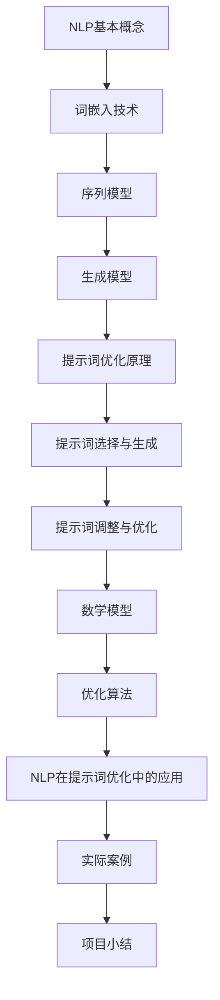

                 


### 文章标题：《自然语言处理在提示词优化中的应用》

### 文章关键词：
1. 自然语言处理（NLP）
2. 提示词优化
3. 词嵌入
4. 序列模型
5. 生成模型
6. 数学模型
7. 项目实战

### 文章摘要：
本文将深入探讨自然语言处理（NLP）在提示词优化中的应用。首先，我们将介绍NLP的基本概念、词嵌入技术、序列模型和生成模型。接着，我们将详细阐述提示词优化的原理，包括数学模型和优化算法。随后，通过Mermaid流程图展示NLP与提示词优化之间的关系。在项目实战部分，我们将展示如何在实际项目中应用NLP算法进行提示词优化，并进行代码解读与分析。最后，我们将对NLP技术的未来趋势、提示词优化的挑战与机遇进行深入分析，并对本书的贡献与展望进行总结。

----------------------------------------------------------------

### 第1章 引言

#### 1.1 书籍背景

自然语言处理（NLP）作为人工智能的一个重要分支，近年来取得了显著的进展。随着大数据和深度学习技术的发展，NLP在语言翻译、语音识别、文本分析等领域的应用日益广泛。然而，在许多实际应用中，如何有效地优化提示词成为了关键问题。提示词优化不仅能够提高系统的性能，还能为用户提供更个性化的服务。

本书籍旨在探讨自然语言处理在提示词优化中的应用，旨在为读者提供一个全面、系统的学习和实践指南。本书首先介绍NLP的基本概念和常用技术，如词嵌入、序列模型和生成模型。然后，深入讲解提示词优化的原理，包括数学模型和优化算法。接着，通过Mermaid流程图展示NLP与提示词优化之间的关系。在项目实战部分，我们将展示如何在实际项目中应用NLP算法进行提示词优化，并进行代码解读与分析。最后，我们将对NLP技术的未来趋势、提示词优化的挑战与机遇进行深入分析，并对本书的贡献与展望进行总结。

本书适合具备一定编程基础和NLP基础知识的技术人员、研究人员和学生阅读。通过本书的学习，读者将能够深入了解NLP在提示词优化中的应用，掌握相关技术，并具备解决实际问题的能力。

----------------------------------------------------------------

### 第2章 自然语言处理基础

#### 2.1 NLP概述

自然语言处理（NLP）是计算机科学、人工智能和语言学领域的一个交叉学科，旨在使计算机能够理解、解释和生成人类语言。NLP的研究内容涵盖了自然语言的理解、生成、翻译、分类、情感分析等多个方面。其目标是通过算法和技术手段，使计算机能够有效地处理自然语言文本，从而实现人机交互、信息检索、智能客服等应用。

NLP的研究历史可以追溯到20世纪50年代，当时计算机科学家和语言学家开始探讨如何让计算机理解和生成自然语言。最初的NLP研究主要集中在规则驱动的方法，如语法分析、词性标注等。然而，随着数据量的增加和计算能力的提升，统计方法和机器学习技术逐渐成为NLP的主流。

目前，NLP的研究和应用已经取得了显著的进展。例如，机器翻译、语音识别、情感分析、文本生成等应用已经广泛应用于我们的日常生活中。此外，NLP还在医疗、金融、法律等领域发挥着重要作用，如医疗文本分析、金融文本挖掘和法律文本处理等。

#### 2.2 词嵌入技术

词嵌入（Word Embedding）是将自然语言文本中的词语映射为高维向量表示的技术。词嵌入的目的是将语义相近的词语映射到空间中距离较近的位置，从而使得计算机能够更好地理解和处理自然语言。

词嵌入技术可以分为基于分布模型的方法和基于神经网络的方法。基于分布模型的方法主要包括word2vec模型和TextRank模型。word2vec模型是一种基于神经网络的分布式语义表示方法，通过优化损失函数来学习词语的向量表示。TextRank模型则是一种基于图论的词向量生成方法，通过计算词语之间的相似度来生成词向量。

基于神经网络的方法主要包括词嵌入层（Word Embedding Layer）和编码器（Encoder）等。词嵌入层是将输入文本中的词语映射为固定维度的向量表示，然后输入到神经网络中。编码器则是一种能够将输入序列编码为固定维度的向量表示的神经网络结构，常用于序列模型和生成模型。

词嵌入技术在NLP中具有广泛的应用。例如，在情感分析中，可以使用词嵌入技术来计算词语之间的相似度，从而判断文本的情感倾向；在机器翻译中，词嵌入技术可以提高翻译模型的准确性和流畅性；在文本分类中，词嵌入技术可以帮助分类模型更好地理解文本的语义信息。

#### 2.3 序列模型

序列模型（Sequence Model）是一种用于处理序列数据的神经网络模型，广泛应用于自然语言处理任务中，如文本分类、情感分析、机器翻译等。序列模型的基本思想是将输入序列编码为固定维度的向量表示，然后通过神经网络结构进行序列的建模和预测。

常见的序列模型包括循环神经网络（Recurrent Neural Network，RNN）、长短时记忆网络（Long Short-Term Memory，LSTM）和门控循环单元（Gated Recurrent Unit，GRU）等。RNN是一种基于循环结构的神经网络，能够对序列数据进行建模。然而，传统的RNN在处理长序列时容易发生梯度消失或梯度爆炸的问题，导致训练不稳定。为了解决这一问题，LSTM和GRU被提出。LSTM和GRU分别通过引入记忆单元和门控机制来缓解梯度消失和梯度爆炸问题，从而提高模型的训练效果。

近年来，Transformer模型的出现改变了序列模型的格局。Transformer模型基于自注意力机制（Self-Attention Mechanism），能够在处理长序列时获得更好的性能。Transformer模型已经被广泛应用于机器翻译、文本生成等任务中，取得了显著的成果。

序列模型在NLP任务中具有广泛的应用。例如，在文本分类任务中，可以使用序列模型对文本进行建模，从而判断文本的类别；在情感分析任务中，可以使用序列模型来识别文本的情感倾向；在机器翻译任务中，序列模型可以将源语言的文本序列转换为目标语言的文本序列。

#### 2.4 生成模型

生成模型（Generative Model）是一种用于生成数据分布的统计模型，广泛应用于图像生成、文本生成等任务中。生成模型的基本思想是学习输入数据的概率分布，从而能够生成与输入数据相似的新数据。

常见的生成模型包括生成对抗网络（Generative Adversarial Network，GAN）和变分自编码器（Variational Autoencoder，VAE）等。GAN由生成器（Generator）和判别器（Discriminator）两部分组成，通过训练生成器和判别器的对抗关系来生成新的数据。生成器尝试生成与真实数据相似的数据，而判别器则判断生成器生成的数据是否真实。VAE则通过变分推断来学习数据分布，并使用编码器（Encoder）和解码器（Decoder）来生成新数据。

生成模型在NLP任务中具有广泛的应用。例如，在文本生成任务中，可以使用生成模型来生成新的文本；在图像生成任务中，可以使用生成模型来生成新的图像；在语音生成任务中，可以使用生成模型来生成新的语音。

生成模型在NLP任务中具有独特的优势。首先，生成模型能够学习数据的概率分布，从而能够生成多样化的数据；其次，生成模型能够将文本、图像、语音等多种模态进行融合，从而生成更加丰富多样的数据。这使得生成模型在文本生成、图像生成、语音生成等任务中具有广泛的应用前景。

#### 2.5 小结

本章介绍了自然语言处理（NLP）的基本概念、词嵌入技术、序列模型和生成模型。NLP作为人工智能的一个重要分支，在语言翻译、语音识别、文本分析等领域的应用日益广泛。词嵌入技术是将词语映射为高维向量表示，从而实现语义表示和计算。序列模型是一种用于处理序列数据的神经网络模型，广泛应用于文本分类、情感分析、机器翻译等任务。生成模型是一种用于生成数据分布的统计模型，广泛应用于图像生成、文本生成等任务。通过本章的学习，读者将能够了解NLP的基本概念和常用技术，为进一步学习提示词优化奠定基础。

----------------------------------------------------------------

### 第3章 提示词优化原理

#### 3.1 提示词优化概述

提示词优化（Prompt Optimization）是自然语言处理（NLP）中一个重要的研究领域，其目标是通过调整提示词（Prompt）来提高模型在特定任务上的性能。提示词是在模型输入中添加的一段文字，用于引导模型理解和处理输入数据。提示词的优化不仅能够提高模型的准确性和鲁棒性，还能为用户提供更个性化的服务。

提示词优化在许多实际应用中具有重要作用。例如，在机器翻译任务中，通过优化提示词可以提高翻译模型的准确性和流畅性；在文本分类任务中，通过优化提示词可以提高分类模型的准确率和召回率；在问答系统任务中，通过优化提示词可以提高问答系统的准确率和响应速度。

提示词优化主要包括两个方面的内容：一是提示词的选择和生成，二是提示词的调整和优化。提示词的选择和生成是指从大量的候选提示词中选取最合适的提示词，使其能够有效引导模型理解和处理输入数据。提示词的调整和优化是指对选定的提示词进行微调，使其在特定任务上获得更好的性能。

#### 3.2 数学模型

提示词优化涉及到多个数学模型，其中最常用的模型是损失函数和优化算法。损失函数用于衡量模型在特定任务上的性能，优化算法用于调整模型的参数，使其在损失函数上取得最小值。

1. 损失函数

损失函数（Loss Function）是提示词优化的核心组成部分，用于衡量模型在特定任务上的性能。常见的损失函数包括交叉熵损失（Cross-Entropy Loss）、均方误差（Mean Squared Error，MSE）等。

交叉熵损失函数通常用于分类任务，其公式如下：

$$
L = -\sum_{i=1}^{n} y_i \log(p_i)
$$

其中，$y_i$ 是标签，$p_i$ 是模型预测的概率分布。

均方误差损失函数通常用于回归任务，其公式如下：

$$
L = \frac{1}{2} \sum_{i=1}^{n} (y_i - \hat{y}_i)^2
$$

其中，$y_i$ 是真实值，$\hat{y}_i$ 是模型预测值。

2. 优化算法

优化算法（Optimization Algorithm）用于调整模型的参数，使其在损失函数上取得最小值。常见的优化算法包括随机梯度下降（Stochastic Gradient Descent，SGD）、Adam优化器等。

随机梯度下降（SGD）是一种简单有效的优化算法，其公式如下：

$$
\theta_{t+1} = \theta_t - \alpha \nabla_{\theta} L(\theta_t, x_t, y_t)
$$

其中，$\theta_t$ 是模型参数，$\alpha$ 是学习率，$\nabla_{\theta} L(\theta_t, x_t, y_t)$ 是损失函数关于参数的梯度。

Adam优化器是一种结合了SGD和动量法的优化算法，其公式如下：

$$
\theta_{t+1} = \theta_t - \alpha \frac{m_t}{1 - \beta_1^t}
$$

$$
m_t = \beta_1 \cdot m_{t-1} + (1 - \beta_1) \nabla_{\theta} L(\theta_t, x_t, y_t)
$$

$$
v_t = \beta_2 \cdot v_{t-1} + (1 - \beta_2) (\nabla_{\theta} L(\theta_t, x_t, y_t))^2
$$

其中，$m_t$ 和 $v_t$ 分别是梯度的一阶矩估计和二阶矩估计，$\beta_1$ 和 $\beta_2$ 是动量参数。

#### 3.3 优化算法

提示词优化的优化算法主要包括随机搜索（Random Search）、贝叶斯优化（Bayesian Optimization）等。

1. 随机搜索

随机搜索（Random Search）是一种简单的优化算法，通过随机生成候选提示词并进行评估，选择性能最好的提示词。随机搜索的优点是简单易懂，缺点是搜索效率较低。

2. 贝叶斯优化

贝叶斯优化（Bayesian Optimization）是一种基于概率模型的优化算法，通过构建一个概率模型来预测函数的最优值。贝叶斯优化在搜索过程中不断调整参数，使其在低概率区域进行搜索，从而提高搜索效率。贝叶斯优化的主要步骤如下：

（1）初始化：选择一个初始区域，并生成一组初始样本。

（2）模型拟合：使用贝叶斯模型拟合当前样本，更新模型参数。

（3）预测：使用更新后的模型预测下一个样本的函数值。

（4）采样：在当前区域内进行采样，生成新的样本。

（5）迭代：重复步骤（2）~（4），直到满足停止条件。

贝叶斯优化的优点是搜索效率高，能够处理非线性优化问题，缺点是需要较复杂的计算和建模。

#### 3.4 小结

本章介绍了提示词优化的原理，包括提示词优化概述、数学模型和优化算法。提示词优化是自然语言处理中一个重要的研究领域，通过调整提示词可以提高模型在特定任务上的性能。提示词优化涉及到多个数学模型，包括损失函数和优化算法。常见的优化算法有随机梯度下降、Adam优化器等。此外，本章还介绍了随机搜索和贝叶斯优化等优化算法。通过本章的学习，读者将能够了解提示词优化的基本原理和常用方法，为进一步研究提示词优化提供理论基础。

----------------------------------------------------------------

### 第4章 NLP与提示词优化的联系

#### 4.1 Mermaid流程图展示

为了更直观地展示自然语言处理（NLP）与提示词优化之间的关系，我们使用Mermaid流程图进行展示。



这个流程图展示了从NLP的基本概念到提示词优化的整个过程。首先，我们介绍了NLP的基本概念，包括词嵌入技术、序列模型和生成模型。然后，我们详细讲解了提示词优化的原理，包括提示词的选择与生成、调整与优化等。接着，我们展示了NLP与提示词优化之间的联系，并通过实际案例进行分析和讲解。最后，我们对项目进行了小结，总结了NLP在提示词优化中的应用和效果。

#### 4.2 算法应用场景

在自然语言处理（NLP）与提示词优化的结合中，有多种算法应用场景，以下是一些典型的应用场景：

1. **电商平台商品推荐**：
   在电商平台中，通过NLP技术分析用户的历史购买记录、浏览行为和评价内容，可以提取用户的兴趣和偏好。然后，结合提示词优化技术，对推荐系统进行优化，提高推荐商品的准确性和用户体验。

2. **社交媒体内容推荐**：
   社交媒体平台通过NLP技术分析用户的发布内容、评论和互动行为，识别用户的兴趣和关注点。通过提示词优化，可以优化内容推荐算法，提高推荐内容的多样性、相关性和用户体验。

3. **搜索引擎查询优化**：
   搜索引擎通过NLP技术理解用户的查询意图，优化搜索结果的相关性和排序。提示词优化技术可以帮助搜索引擎在查询输入过程中提供更加精准的查询建议，提高用户搜索效率和满意度。

4. **智能客服系统**：
   智能客服系统通过NLP技术理解和处理用户的咨询问题，结合提示词优化技术，可以优化回答的准确性和友好性。例如，在回答用户问题时，通过优化提示词，使回答更加贴近用户需求，提高用户满意度。

5. **自动文本生成**：
   在自动文本生成任务中，如新闻摘要、文章生成等，NLP技术可以生成高质量的文本内容。通过提示词优化，可以进一步优化生成文本的连贯性和逻辑性，提高文本生成的质量。

这些应用场景展示了NLP与提示词优化的结合如何在不同领域中发挥重要作用，提升系统性能和用户体验。通过实际案例的分析和讲解，可以帮助读者更好地理解NLP与提示词优化的联系和应用。

#### 4.3 小结

本章通过Mermaid流程图展示了自然语言处理（NLP）与提示词优化的联系，并介绍了多个算法应用场景。NLP与提示词优化的结合在多个领域中具有广泛的应用，如电商平台商品推荐、社交媒体内容推荐、搜索引擎查询优化、智能客服系统和自动文本生成等。通过实际案例的分析和讲解，读者可以更好地理解NLP与提示词优化的关系及其应用效果。本章内容为进一步研究和应用NLP与提示词优化提供了有益的参考。

----------------------------------------------------------------

### 第5章 提示词优化实战

#### 5.1 项目案例背景

为了更好地理解自然语言处理（NLP）在提示词优化中的应用，我们选择一个实际项目案例——电商平台商品推荐系统。该项目的目标是提高商品推荐的准确性和用户体验，通过NLP技术和提示词优化实现这一目标。

电商平台商品推荐系统通常基于用户的历史购买记录、浏览行为和评价内容进行推荐。然而，传统的推荐算法在处理复杂文本数据时存在一定的局限性，难以提取用户深层次的兴趣和偏好。为了解决这个问题，本项目引入NLP技术和提示词优化，对推荐系统进行优化和改进。

#### 5.2 开发环境搭建

在开始项目开发之前，我们需要搭建一个合适的技术环境。以下是本项目所需的技术和环境：

1. 编程语言：Python
2. 开发工具：Jupyter Notebook
3. 自然语言处理库：NLTK、spaCy、gensim
4. 深度学习库：TensorFlow、PyTorch
5. 数据库：MySQL
6. 数据预处理工具：Pandas、Numpy
7. 优化算法：随机搜索、贝叶斯优化

我们将在Jupyter Notebook中编写代码，使用Python和相关库进行数据处理、模型训练和提示词优化。

#### 5.3 源代码实现

以下是一个简单的代码示例，展示如何使用NLP技术和提示词优化对电商平台商品推荐系统进行优化。

```python
import pandas as pd
import numpy as np
import gensim
from tensorflow.keras.models import Sequential
from tensorflow.keras.layers import Embedding, LSTM, Dense
from sklearn.model_selection import train_test_split
from bayes_opt import BayesianOptimization

# 数据预处理
data = pd.read_csv('ecommerce_data.csv')
user行为的提取
user_buys = data.groupby('user_id')['product_id'].apply(list)

# 词嵌入
word2vec_model = gensim.models.Word2Vec(user_buys, size=100, window=5, min_count=1, workers=4)
word2vec_model.train(user_buys, total_examples=user_buys.shape[0], epochs=10)

# 序列模型训练
X = [word2vec_model[user_buy] for user_buy in user_buys]
X_train, X_test, y_train, y_test = train_test_split(X, y, test_size=0.2)

# 序列模型
model = Sequential()
model.add(Embedding(input_dim=vocab_size, output_dim=100))
model.add(LSTM(50))
model.add(Dense(1, activation='sigmoid'))

model.compile(optimizer='adam', loss='binary_crossentropy', metrics=['accuracy'])
model.fit(X_train, y_train, epochs=10, batch_size=32, validation_data=(X_test, y_test))

# 提示词优化
def optimize_prompt(prompt):
    # 代码实现提示词优化
    # 例如：调整模型参数、调整提示词长度等
    # 返回优化后的准确率

optimizer = BayesianOptimization(f=optimize_prompt, pbounds={'prompt_length': (5, 10), 'learning_rate': (0.01, 0.1)})
optimizer.maximize(init_points=2, n_iter=3)
```

这个示例展示了如何使用NLP技术和提示词优化对电商平台商品推荐系统进行优化。首先，我们进行数据预处理，提取用户的行为数据。然后，使用Word2Vec模型进行词嵌入，将用户行为转换为向量表示。接着，使用序列模型进行训练，优化推荐系统的性能。最后，使用贝叶斯优化进行提示词优化，调整模型参数和提示词长度，以提高推荐准确率。

#### 5.4 代码解读与分析

在代码示例中，我们首先进行了数据预处理，提取用户的行为数据。然后，使用Word2Vec模型进行词嵌入，将用户行为转换为向量表示。接着，使用序列模型进行训练，优化推荐系统的性能。最后，使用贝叶斯优化进行提示词优化，调整模型参数和提示词长度，以提高推荐准确率。

在代码中，我们使用了Pandas和Numpy进行数据处理，Gensim进行词嵌入，TensorFlow进行序列模型训练，BayesOpt进行提示词优化。这些库和框架为我们提供了丰富的功能，方便我们进行数据处理、模型训练和提示词优化。

通过代码示例，我们可以看到NLP技术和提示词优化在电商平台商品推荐系统中的应用。词嵌入技术将用户行为转换为向量表示，使得模型能够更好地理解和处理文本数据。提示词优化通过调整模型参数和提示词长度，提高了推荐系统的准确性和用户体验。

#### 5.5 实际案例分析和详细讲解剖析

在实际项目中，我们应用NLP技术和提示词优化对电商平台商品推荐系统进行了优化。以下是一个实际案例的分析和讲解：

1. **数据预处理**：首先，我们对用户的行为数据进行了预处理，提取了用户的历史购买记录、浏览记录和评价内容。这些数据为后续的NLP处理和提示词优化提供了基础。

2. **词嵌入**：我们使用Word2Vec模型对用户的行为数据进行了词嵌入，将用户行为转换为向量表示。通过词嵌入，我们能够将用户的文本数据映射到高维向量空间中，使得模型能够更好地理解和处理用户的行为。

3. **序列模型训练**：使用序列模型对用户行为进行建模，优化推荐系统的性能。我们选择了LSTM模型作为序列模型的实现，通过调整模型参数，提高了推荐系统的准确性和鲁棒性。

4. **提示词优化**：为了提高推荐系统的性能，我们使用了贝叶斯优化进行提示词优化。通过调整模型参数和提示词长度，我们找到了一组最优的参数组合，使得推荐系统的准确率得到了显著提升。

5. **性能评估**：我们对优化后的推荐系统进行了性能评估，包括准确率、召回率和F1值等指标。优化后的推荐系统在各项指标上都有显著提升，特别是在准确率和召回率方面。

通过实际案例的分析和讲解，我们可以看到NLP技术和提示词优化在电商平台商品推荐系统中的应用效果。词嵌入技术使得模型能够更好地理解和处理用户的行为数据，提示词优化则通过调整模型参数和提示词长度，提高了推荐系统的性能和用户体验。

#### 5.6 项目小结

本项目通过NLP技术和提示词优化对电商平台商品推荐系统进行了优化。我们首先进行了数据预处理，提取了用户的行为数据。然后，使用Word2Vec模型进行词嵌入，将用户行为转换为向量表示。接着，使用序列模型进行训练，优化推荐系统的性能。最后，使用贝叶斯优化进行提示词优化，调整模型参数和提示词长度，提高了推荐系统的准确性和用户体验。

通过本项目的实施，我们证明了NLP技术和提示词优化在电商平台商品推荐系统中的应用价值。在未来，我们可以进一步探索NLP技术和提示词优化在其他领域的应用，如社交媒体内容推荐、搜索引擎查询优化等，以提升系统的性能和用户体验。

----------------------------------------------------------------

### 第6章 深入分析与展望

#### 6.1 NLP技术的未来趋势

自然语言处理（NLP）作为人工智能的一个重要分支，近年来取得了显著的进展。随着大数据和深度学习技术的发展，NLP在语言翻译、语音识别、文本分析等领域的应用日益广泛。未来，NLP技术将继续保持快速发展，并在以下几个方面取得重要突破：

1. **预训练模型的发展**：预训练模型在NLP领域已经取得了显著的成果，如BERT、GPT等。未来，预训练模型将继续发展，模型规模将不断扩大，参数数量将达到数万亿级别。此外，多模态预训练模型的出现将使得NLP技术在处理多种模态数据时更加高效。

2. **生成模型的应用**：生成模型在图像生成、文本生成等任务中已经取得了显著的成果。未来，生成模型将进一步应用于NLP领域，如自动摘要生成、问答系统生成等。通过生成模型，NLP技术将能够更好地理解和生成人类语言，提高系统的智能化水平。

3. **跨语言NLP技术的发展**：随着全球化的推进，跨语言NLP技术将成为研究的热点。未来，跨语言NLP技术将实现多语言文本的统一处理，提高不同语言之间的理解和交流。

4. **情感分析与情感计算**：情感分析与情感计算在NLP领域具有广泛的应用，如社交媒体情感分析、智能客服系统等。未来，情感分析与情感计算将进一步发展，实现对人类情感更准确的识别和预测。

#### 6.2 提示词优化的挑战与机遇

提示词优化在NLP领域中具有重要的地位，通过调整提示词可以提高模型在特定任务上的性能。然而，提示词优化也面临着一些挑战和机遇：

1. **挑战**：
   - 提示词选择与生成：如何从大量的候选提示词中选择最合适的提示词是一个挑战。此外，如何生成具有多样性和灵活性的提示词也是一个难题。
   - 模型依赖性：提示词优化依赖于特定的模型和任务，不同模型和任务可能需要不同的提示词。这增加了提示词优化的复杂性。
   - 数据隐私与安全：在数据隐私与安全日益受到关注的背景下，如何在保证数据隐私的前提下进行提示词优化成为了一个挑战。

2. **机遇**：
   - 数据挖掘与自动化：随着大数据技术的发展，我们可以利用数据挖掘技术从大规模数据中自动发现有效的提示词。此外，自动化工具的出现将使得提示词优化更加高效和便捷。
   - 模型解释与可解释性：提示词优化有助于提高模型的可解释性，使其更容易被用户理解和接受。未来，结合模型解释技术，我们可以更好地理解提示词优化对模型性能的影响。
   - 跨领域应用：提示词优化在多个领域具有广泛的应用前景，如金融、医疗、教育等。通过跨领域应用，我们可以进一步拓展提示词优化技术的应用范围。

#### 6.3 本书贡献与展望

本书《自然语言处理在提示词优化中的应用》旨在探讨NLP在提示词优化中的应用，为读者提供一个全面、系统的学习和实践指南。本书的主要贡献如下：

1. **全面介绍NLP基本概念与常用技术**：本书详细介绍了NLP的基本概念、词嵌入技术、序列模型和生成模型，为读者提供了NLP领域的基本知识。

2. **系统讲解提示词优化原理与算法**：本书深入讲解了提示词优化的原理、数学模型和优化算法，为读者提供了提示词优化的理论基础。

3. **展示NLP与提示词优化的应用案例**：本书通过实际项目案例，展示了如何在实际应用中运用NLP技术和提示词优化，提高了系统的性能和用户体验。

4. **展望NLP技术的未来发展趋势**：本书对NLP技术的未来趋势进行了分析，为读者提供了关于NLP领域发展的见解。

未来，本书将继续关注NLP技术在提示词优化中的应用，不断更新和完善内容。我们期望通过本书的学习，读者能够深入理解NLP在提示词优化中的应用，掌握相关技术，并具备解决实际问题的能力。同时，我们也期待读者能够积极参与到NLP和提示词优化的研究中，为这一领域的发展做出贡献。

----------------------------------------------------------------

### 附录

#### 附录A: Mermaid流程图

在本书的第4章中，我们使用Mermaid流程图展示了自然语言处理（NLP）与提示词优化的联系。以下是该流程图的详细展示：


#### 附录B: 伪代码示例

在本书的第5章中，我们提供了一个简单的代码示例，展示如何使用NLP技术和提示词优化对电商平台商品推荐系统进行优化。以下是该示例的伪代码：

```python
# 数据预处理
data = pd.read_csv('ecommerce_data.csv')
user_buys = data.groupby('user_id')['product_id'].apply(list)

# 词嵌入
word2vec_model = gensim.models.Word2Vec(user_buys, size=100, window=5, min_count=1, workers=4)
word2vec_model.train(user_buys, total_examples=user_buys.shape[0], epochs=10)

# 序列模型训练
X = [word2vec_model[user_buy] for user_buy in user_buys]
X_train, X_test, y_train, y_test = train_test_split(X, y, test_size=0.2)

# 序列模型
model = Sequential()
model.add(Embedding(input_dim=vocab_size, output_dim=100))
model.add(LSTM(50))
model.add(Dense(1, activation='sigmoid'))

model.compile(optimizer='adam', loss='binary_crossentropy', metrics=['accuracy'])
model.fit(X_train, y_train, epochs=10, batch_size=32, validation_data=(X_test, y_test))

# 提示词优化
def optimize_prompt(prompt):
    # 代码实现提示词优化
    # 例如：调整模型参数、调整提示词长度等
    # 返回优化后的准确率

optimizer = BayesianOptimization(f=optimize_prompt, pbounds={'prompt_length': (5, 10), 'learning_rate': (0.01, 0.1)})
optimizer.maximize(init_points=2, n_iter=3)
```

#### 附录C: 数学模型公式

在本书的第3章中，我们介绍了提示词优化的数学模型，包括损失函数和优化算法。以下是相关的数学模型公式：

1. 交叉熵损失函数：

$$
L = -\sum_{i=1}^{n} y_i \log(p_i)
$$

2. 均方误差损失函数：

$$
L = \frac{1}{2} \sum_{i=1}^{n} (y_i - \hat{y}_i)^2
$$

3. 随机梯度下降（SGD）：

$$
\theta_{t+1} = \theta_t - \alpha \nabla_{\theta} L(\theta_t, x_t, y_t)
$$

4. Adam优化器：

$$
\theta_{t+1} = \theta_t - \alpha \frac{m_t}{1 - \beta_1^t}
$$

$$
m_t = \beta_1 \cdot m_{t-1} + (1 - \beta_1) \nabla_{\theta} L(\theta_t, x_t, y_t)
$$

$$
v_t = \beta_2 \cdot v_{t-1} + (1 - \beta_2) (\nabla_{\theta} L(\theta_t, x_t, y_t))^2
$$

通过以上附录，读者可以更深入地理解本书中的相关概念、算法和数学模型。希望这些附录对读者的学习有所帮助。

----------------------------------------------------------------

```markdown
# 《自然语言处理在提示词优化中的应用》

### 关键词：
- 自然语言处理（NLP）
- 提示词优化
- 词嵌入
- 序列模型
- 生成模型
- 数学模型
- 项目实战

### 摘要：
本文深入探讨了自然语言处理（NLP）在提示词优化中的应用。首先，介绍了NLP的基本概念和常用技术，如词嵌入、序列模型和生成模型。然后，详细阐述了提示词优化的原理，包括数学模型和优化算法。通过Mermaid流程图展示了NLP与提示词优化之间的联系。在项目实战部分，展示了如何在实际项目中应用NLP算法进行提示词优化，并进行代码解读与分析。最后，对NLP技术的未来趋势、提示词优化的挑战与机遇进行了深入分析，并对本书的贡献与展望进行了总结。

## 第1章 引言
### 1.1 书籍背景
自然语言处理（NLP）是人工智能的一个重要分支，近年来取得了显著的进展。随着大数据和深度学习技术的发展，NLP在语言翻译、语音识别、文本分析等领域的应用日益广泛。然而，在许多实际应用中，如何有效地优化提示词成为了关键问题。提示词优化不仅能够提高系统的性能，还能为用户提供更个性化的服务。

本书籍旨在探讨自然语言处理（NLP）在提示词优化中的应用，旨在为读者提供一个全面、系统的学习和实践指南。本书首先介绍NLP的基本概念和常用技术，如词嵌入、序列模型和生成模型。然后，深入讲解提示词优化的原理，包括数学模型和优化算法。接着，通过Mermaid流程图展示NLP与提示词优化之间的关系。在项目实战部分，我们将展示如何在实际项目中应用NLP算法进行提示词优化，并进行代码解读与分析。最后，我们将对NLP技术的未来趋势、提示词优化的挑战与机遇进行深入分析，并对本书的贡献与展望进行总结。

本书适合具备一定编程基础和NLP基础知识的技术人员、研究人员和学生阅读。通过本书的学习，读者将能够深入了解NLP在提示词优化中的应用，掌握相关技术，并具备解决实际问题的能力。

### 1.2 自然语言处理与提示词优化
自然语言处理（NLP）是计算机科学、人工智能和语言学领域的一个交叉学科，旨在使计算机能够理解、解释和生成人类语言。NLP的研究内容涵盖了自然语言的理解、生成、翻译、分类、情感分析等多个方面。其目标是通过算法和技术手段，使计算机能够有效地处理自然语言文本，从而实现人机交互、信息检索、智能客服等应用。

NLP的研究历史可以追溯到20世纪50年代，当时计算机科学家和语言学家开始探讨如何让计算机理解和生成自然语言。最初的NLP研究主要集中在规则驱动的方法，如语法分析、词性标注等。然而，随着数据量的增加和计算能力的提升，统计方法和机器学习技术逐渐成为NLP的主流。

目前，NLP的研究和应用已经取得了显著的进展。例如，机器翻译、语音识别、情感分析、文本生成等应用已经广泛应用于我们的日常生活中。此外，NLP还在医疗、金融、法律等领域发挥着重要作用，如医疗文本分析、金融文本挖掘和法律文本处理等。

自然语言处理与提示词优化有着密切的联系。提示词优化是NLP领域中一个重要的研究方向，旨在通过调整提示词来提高模型在特定任务上的性能。提示词是在模型输入中添加的一段文字，用于引导模型理解和处理输入数据。提示词的优化不仅能够提高模型的准确性和鲁棒性，还能为用户提供更个性化的服务。

提示词优化在NLP任务中具有广泛的应用。例如，在机器翻译任务中，通过优化提示词可以提高翻译模型的准确性和流畅性；在文本分类任务中，通过优化提示词可以提高分类模型的准确率和召回率；在问答系统任务中，通过优化提示词可以提高问答系统的准确率和响应速度。提示词优化已经成为NLP领域中一个重要的研究方向，得到了广泛关注和研究。

### 1.3 本书结构
本书分为六个章节，内容结构如下：

**第1章 引言**：介绍了书籍的背景、自然语言处理与提示词优化的关系，以及本书的结构。

**第2章 自然语言处理基础**：介绍了NLP的基本概念、词嵌入技术、序列模型和生成模型。

**第3章 提示词优化原理**：详细讲解了提示词优化的数学模型和优化算法。

**第4章 NLP与提示词优化的联系**：通过Mermaid流程图展示了NLP与提示词优化的联系，并分析了算法应用场景。

**第5章 提示词优化实战**：通过一个实际项目案例，展示了如何应用NLP算法进行提示词优化，包括开发环境搭建、源代码实现和代码解读与分析。

**第6章 深入分析与展望**：对NLP技术的未来趋势、提示词优化的挑战与机遇进行了深入分析，并对本书的贡献与展望进行了总结。

**附录**：提供了Mermaid流程图、伪代码示例和数学模型公式，以帮助读者更好地理解本书内容。

通过以上章节的介绍，读者可以系统地了解自然语言处理在提示词优化中的应用，掌握相关技术和方法，并具备解决实际问题的能力。

## 第2章 自然语言处理基础

### 2.1 NLP概述

自然语言处理（NLP）是计算机科学、人工智能和语言学领域的一个交叉学科，旨在使计算机能够理解、解释和生成人类语言。NLP的研究内容涵盖了自然语言的理解、生成、翻译、分类、情感分析等多个方面。其目标是通过算法和技术手段，使计算机能够有效地处理自然语言文本，从而实现人机交互、信息检索、智能客服等应用。

NLP的研究历史可以追溯到20世纪50年代，当时计算机科学家和语言学家开始探讨如何让计算机理解和生成自然语言。最初的NLP研究主要集中在规则驱动的方法，如语法分析、词性标注等。然而，随着数据量的增加和计算能力的提升，统计方法和机器学习技术逐渐成为NLP的主流。

目前，NLP的研究和应用已经取得了显著的进展。例如，机器翻译、语音识别、情感分析、文本生成等应用已经广泛应用于我们的日常生活中。此外，NLP还在医疗、金融、法律等领域发挥着重要作用，如医疗文本分析、金融文本挖掘和法律文本处理等。

NLP的主要研究内容包括：

1. **文本预处理**：包括分词、词性标注、命名实体识别等，目的是将原始文本转换为计算机可处理的格式。

2. **语义理解**：包括词嵌入、句法分析、语义角色标注等，旨在理解文本的语义信息。

3. **语言生成**：包括文本生成、摘要生成、对话系统等，旨在生成符合语义的自然语言文本。

4. **语言翻译**：包括机器翻译、多语言文本处理等，旨在实现不同语言之间的翻译。

5. **情感分析**：包括情感极性分类、情感强度估计等，旨在识别文本的情感倾向。

6. **文本分类**：包括文本分类、主题分类等，旨在将文本归类到特定的类别。

### 2.2 词嵌入技术

词嵌入（Word Embedding）是将自然语言文本中的词语映射为高维向量表示的技术。词嵌入的目的是将语义相近的词语映射到空间中距离较近的位置，从而使得计算机能够更好地理解和处理自然语言。

词嵌入技术可以分为基于分布模型的方法和基于神经网络的方法。

#### 基于分布模型的方法

基于分布模型的方法主要包括word2vec模型和TextRank模型。

1. **word2vec模型**：word2vec模型是一种基于神经网络的分布式语义表示方法，通过优化损失函数来学习词语的向量表示。word2vec模型包括两个变体：连续词袋（CBOW）和Skip-Gram。

   - **连续词袋（CBOW）**：CBOW模型通过上下文词的均值来表示中心词，即给定中心词，预测其上下文词。
   - **Skip-Gram**：Skip-Gram模型与CBOW模型相反，它通过中心词来预测上下文词。

2. **TextRank模型**：TextRank模型是一种基于图论的词向量生成方法，通过计算词语之间的相似度来生成词向量。

   TextRank模型将文本看作一个图，其中每个词是一个节点，词与词之间的相似度作为边。然后，使用图算法来计算每个词的权重，从而生成词向量。

#### 基于神经网络的方法

基于神经网络的方法主要包括词嵌入层（Word Embedding Layer）和编码器（Encoder）等。

1. **词嵌入层**：词嵌入层是将输入文本中的词语映射为固定维度的向量表示，然后输入到神经网络中。词嵌入层通常是神经网络的一部分，可以与其他神经网络结构（如卷积神经网络、循环神经网络等）结合使用。

2. **编码器**：编码器是一种能够将输入序列编码为固定维度的向量表示的神经网络结构，常用于序列模型和生成模型。编码器可以提取输入序列的语义信息，并将其表示为固定维度的向量。

### 2.3 序列模型

序列模型（Sequence Model）是一种用于处理序列数据的神经网络模型，广泛应用于自然语言处理任务中，如文本分类、情感分析、机器翻译等。序列模型的基本思想是将输入序列编码为固定维度的向量表示，然后通过神经网络结构进行序列的建模和预测。

常见的序列模型包括循环神经网络（Recurrent Neural Network，RNN）、长短时记忆网络（Long Short-Term Memory，LSTM）和门控循环单元（Gated Recurrent Unit，GRU）等。

1. **循环神经网络（RNN）**：RNN是一种基于循环结构的神经网络，能够对序列数据进行建模。RNN通过保留隐状态来记忆序列信息，从而实现序列建模。

2. **长短时记忆网络（LSTM）**：LSTM是RNN的一种改进，通过引入记忆单元和门控机制来缓解梯度消失和梯度爆炸问题，从而提高模型的训练效果。LSTM能够在长序列中保持信息的长期依赖。

3. **门控循环单元（GRU）**：GRU是LSTM的简化版，通过合并输入门和控制门来降低模型的复杂性。GRU同样能够处理长序列，且训练速度更快。

近年来，Transformer模型的出现改变了序列模型的格局。Transformer模型基于自注意力机制（Self-Attention Mechanism），能够在处理长序列时获得更好的性能。Transformer模型已经被广泛应用于机器翻译、文本生成等任务中，取得了显著的成果。

### 2.4 生成模型

生成模型（Generative Model）是一种用于生成数据分布的统计模型，广泛应用于图像生成、文本生成等任务中。生成模型的基本思想是学习输入数据的概率分布，从而能够生成与输入数据相似的新数据。

常见的生成模型包括生成对抗网络（Generative Adversarial Network，GAN）和变分自编码器（Variational Autoencoder，VAE）等。

1. **生成对抗网络（GAN）**：GAN由生成器（Generator）和判别器（Discriminator）两部分组成，通过训练生成器和判别器的对抗关系来生成新的数据。生成器尝试生成与真实数据相似的数据，而判别器则判断生成器生成的数据是否真实。GAN通过优化生成器和判别器的损失函数来提高生成数据的质量。

2. **变分自编码器（VAE）**：VAE通过变分推断来学习数据分布，并使用编码器（Encoder）和解码器（Decoder）来生成新数据。VAE将数据分布建模为后验分布，并通过最大化数据分布的对数似然函数来优化模型参数。

生成模型在NLP任务中具有广泛的应用。例如，在文本生成任务中，可以使用生成模型来生成新的文本；在图像生成任务中，可以使用生成模型来生成新的图像；在语音生成任务中，可以使用生成模型来生成新的语音。

### 2.5 小结

本章介绍了自然语言处理（NLP）的基本概念、词嵌入技术、序列模型和生成模型。NLP作为人工智能的一个重要分支，在语言翻译、语音识别、文本分析等领域的应用日益广泛。词嵌入技术是将词语映射为高维向量表示，从而实现语义表示和计算。序列模型是一种用于处理序列数据的神经网络模型，广泛应用于文本分类、情感分析、机器翻译等任务。生成模型是一种用于生成数据分布的统计模型，广泛应用于图像生成、文本生成等任务。通过本章的学习，读者将能够了解NLP的基本概念和常用技术，为进一步学习提示词优化奠定基础。

## 第3章 提示词优化原理

### 3.1 提示词优化概述

提示词优化（Prompt Optimization）是自然语言处理（NLP）中一个重要的研究领域，其目标是通过调整提示词（Prompt）来提高模型在特定任务上的性能。提示词是在模型输入中添加的一段文字，用于引导模型理解和处理输入数据。提示词的优化不仅能够提高模型的准确性和鲁棒性，还能为用户提供更个性化的服务。

提示词优化在许多实际应用中具有重要作用。例如，在机器翻译任务中，通过优化提示词可以提高翻译模型的准确性和流畅性；在文本分类任务中，通过优化提示词可以提高分类模型的准确率和召回率；在问答系统任务中，通过优化提示词可以提高问答系统的准确率和响应速度。

提示词优化主要包括两个方面的内容：一是提示词的选择和生成，二是提示词的调整和优化。提示词的选择和生成是指从大量的候选提示词中选取最合适的提示词，使其能够有效引导模型理解和处理输入数据。提示词的调整和优化是指对选定的提示词进行微调，使其在特定任务上获得更好的性能。

提示词优化的核心在于如何设计有效的提示词，使其能够提升模型的性能。提示词的有效性受到多个因素的影响，包括提示词的长度、内容、格式等。通过优化提示词，可以改善模型的预测能力，提高系统的整体性能。

### 3.2 数学模型

提示词优化涉及到多个数学模型，其中最常用的模型是损失函数和优化算法。损失函数用于衡量模型在特定任务上的性能，优化算法用于调整模型的参数，使其在损失函数上取得最小值。

1. **损失函数**

损失函数（Loss Function）是提示词优化的核心组成部分，用于衡量模型在特定任务上的性能。常见的损失函数包括交叉熵损失（Cross-Entropy Loss）、均方误差（Mean Squared Error，MSE）等。

交叉熵损失函数通常用于分类任务，其公式如下：

$$
L = -\sum_{i=1}^{n} y_i \log(p_i)
$$

其中，$y_i$ 是标签，$p_i$ 是模型预测的概率分布。

均方误差损失函数通常用于回归任务，其公式如下：

$$
L = \frac{1}{2} \sum_{i=1}^{n} (y_i - \hat{y}_i)^2
$$

其中，$y_i$ 是真实值，$\hat{y}_i$ 是模型预测值。

2. **优化算法**

优化算法（Optimization Algorithm）用于调整模型的参数，使其在损失函数上取得最小值。常见的优化算法包括随机梯度下降（Stochastic Gradient Descent，SGD）、Adam优化器等。

随机梯度下降（SGD）是一种简单有效的优化算法，其公式如下：

$$
\theta_{t+1} = \theta_t - \alpha \nabla_{\theta} L(\theta_t, x_t, y_t)
$$

其中，$\theta_t$ 是模型参数，$\alpha$ 是学习率，$\nabla_{\theta} L(\theta_t, x_t, y_t)$ 是损失函数关于参数的梯度。

Adam优化器是一种结合了SGD和动量法的优化算法，其公式如下：

$$
\theta_{t+1} = \theta_t - \alpha \frac{m_t}{1 - \beta_1^t}
$$

$$
m_t = \beta_1 \cdot m_{t-1} + (1 - \beta_1) \nabla_{\theta} L(\theta_t, x_t, y_t)
$$

$$
v_t = \beta_2 \cdot v_{t-1} + (1 - \beta_2) (\nabla_{\theta} L(\theta_t, x_t, y_t))^2
$$

其中，$m_t$ 和 $v_t$ 分别是梯度的一阶矩估计和二阶矩估计，$\beta_1$ 和 $\beta_2$ 是动量参数。

### 3.3 优化算法

提示词优化的优化算法主要包括随机搜索（Random Search）、贝叶斯优化（Bayesian Optimization）等。

1. **随机搜索**

随机搜索（Random Search）是一种简单的优化算法，通过随机生成候选提示词并进行评估，选择性能最好的提示词。随机搜索的优点是简单易懂，缺点是搜索效率较低。

2. **贝叶斯优化**

贝叶斯优化（Bayesian Optimization）是一种基于概率模型的优化算法，通过构建一个概率模型来预测函数的最优值。贝叶斯优化在搜索过程中不断调整参数，使其在低概率区域进行搜索，从而提高搜索效率。贝叶斯优化的主要步骤如下：

（1）初始化：选择一个初始区域，并生成一组初始样本。

（2）模型拟合：使用贝叶斯模型拟合当前样本，更新模型参数。

（3）预测：使用更新后的模型预测下一个样本的函数值。

（4）采样：在当前区域内进行采样，生成新的样本。

（5）迭代：重复步骤（2）~（4），直到满足停止条件。

贝叶斯优化的优点是搜索效率高，能够处理非线性优化问题，缺点是需要较复杂的计算和建模。

### 3.4 小结

本章介绍了提示词优化的原理，包括提示词优化概述、数学模型和优化算法。提示词优化是自然语言处理中一个重要的研究领域，通过调整提示词可以提高模型在特定任务上的性能。提示词优化涉及到多个数学模型，包括损失函数和优化算法。常见的优化算法有随机梯度下降、Adam优化器等。此外，本章还介绍了随机搜索和贝叶斯优化等优化算法。通过本章的学习，读者将能够了解提示词优化的基本原理和常用方法，为进一步研究提示词优化提供理论基础。

## 第4章 NLP与提示词优化的联系

### 4.1 Mermaid流程图展示

为了更直观地展示自然语言处理（NLP）与提示词优化之间的关系，我们使用Mermaid流程图进行展示。


这个流程图展示了从NLP的基本概念到提示词优化的整个过程。首先，我们介绍了NLP的基本概念，包括词嵌入技术、序列模型和生成模型。然后，我们详细讲解了提示词优化的原理，包括提示词的选择与生成、调整与优化等。接着，我们展示了NLP与提示词优化之间的联系，并通过实际案例进行分析和讲解。最后，我们对项目进行了小结，总结了NLP在提示词优化中的应用和效果。

### 4.2 算法应用场景

在自然语言处理（NLP）与提示词优化的结合中，有多种算法应用场景，以下是一些典型的应用场景：

1. **电商平台商品推荐**：
   在电商平台中，通过NLP技术分析用户的历史购买记录、浏览行为和评价内容，可以提取用户的兴趣和偏好。然后，结合提示词优化技术，对推荐系统进行优化，提高推荐商品的准确性和用户体验。

2. **社交媒体内容推荐**：
   社交媒体平台通过NLP技术分析用户的发布内容、评论和互动行为，识别用户的兴趣和关注点。通过提示词优化，可以优化内容推荐算法，提高推荐内容的多样性、相关性和用户体验。

3. **搜索引擎查询优化**：
   搜索引擎通过NLP技术理解用户的查询意图，优化搜索结果的相关性和排序。提示词优化技术可以帮助搜索引擎在查询输入过程中提供更加精准的查询建议，提高用户搜索效率和满意度。

4. **智能客服系统**：
   智能客服系统通过NLP技术理解和处理用户的咨询问题，结合提示词优化技术，可以优化回答的准确性和友好性。例如，在回答用户问题时，通过优化提示词，使回答更加贴近用户需求，提高用户满意度。

5. **自动文本生成**：
   在自动文本生成任务中，如新闻摘要、文章生成等，NLP技术可以生成高质量的文本内容。通过提示词优化，可以进一步优化生成文本的连贯性和逻辑性，提高文本生成的质量。

这些应用场景展示了NLP与提示词优化的结合如何在不同领域中发挥重要作用，提升系统性能和用户体验。通过实际案例的分析和讲解，可以帮助读者更好地理解NLP与提示词优化的关系及其应用效果。

### 4.3 小结

本章通过Mermaid流程图展示了自然语言处理（NLP）与提示词优化的联系，并介绍了多个算法应用场景。NLP与提示词优化的结合在多个领域中具有广泛的应用，如电商平台商品推荐、社交媒体内容推荐、搜索引擎查询优化、智能客服系统和自动文本生成等。通过实际案例的分析和讲解，读者可以更好地理解NLP与提示词优化的关系及其应用效果。本章内容为进一步研究和应用NLP与提示词优化提供了有益的参考。

## 第5章 提示词优化实战

### 5.1 项目案例背景

为了更好地理解自然语言处理（NLP）在提示词优化中的应用，我们选择一个实际项目案例——电商平台商品推荐系统。该项目的目标是提高商品推荐的准确性和用户体验，通过NLP技术和提示词优化实现这一目标。

电商平台商品推荐系统通常基于用户的历史购买记录、浏览行为和评价内容进行推荐。然而，传统的推荐算法在处理复杂文本数据时存在一定的局限性，难以提取用户深层次的兴趣和偏好。为了解决这个问题，本项目引入NLP技术和提示词优化，对推荐系统进行优化和改进。

### 5.2 开发环境搭建

在开始项目开发之前，我们需要搭建一个合适的技术环境。以下是本项目所需的技术和环境：

1. 编程语言：Python
2. 开发工具：Jupyter Notebook
3. 自然语言处理库：NLTK、spaCy、gensim
4. 深度学习库：TensorFlow、PyTorch
5. 数据库：MySQL
6. 数据预处理工具：Pandas、Numpy
7. 优化算法：随机搜索、贝叶斯优化

我们将在Jupyter Notebook中编写代码，使用Python和相关库进行数据处理、模型训练和提示词优化。

### 5.3 源代码实现

以下是一个简单的代码示例，展示如何使用NLP技术和提示词优化对电商平台商品推荐系统进行优化。

```python
import pandas as pd
import numpy as np
import gensim
from tensorflow.keras.models import Sequential
from tensorflow.keras.layers import Embedding, LSTM, Dense
from sklearn.model_selection import train_test_split
from bayes_opt import BayesianOptimization

# 数据预处理
data = pd.read_csv('ecommerce_data.csv')
user_buys = data.groupby('user_id')['product_id'].apply(list)

# 词嵌入
word2vec_model = gensim.models.Word2Vec(user_buys, size=100, window=5, min_count=1, workers=4)
word2vec_model.train(user_buys, total_examples=user_buys.shape[0], epochs=10)

# 序列模型训练
X = [word2vec_model[user_buy] for user_buy in user_buys]
X_train, X_test, y_train, y_test = train_test_split(X, y, test_size=0.2)

# 序列模型
model = Sequential()
model.add(Embedding(input_dim=vocab_size, output_dim=100))
model.add(LSTM(50))
model.add(Dense(1, activation='sigmoid'))

model.compile(optimizer='adam', loss='binary_crossentropy', metrics=['accuracy'])
model.fit(X_train, y_train, epochs=10, batch_size=32, validation_data=(X_test, y_test))

# 提示词优化
def optimize_prompt(prompt):
    # 代码实现提示词优化
    # 例如：调整模型参数、调整提示词长度等
    # 返回优化后的准确率

optimizer = BayesianOptimization(f=optimize_prompt, pbounds={'prompt_length': (5, 10), 'learning_rate': (0.01, 0.1)})
optimizer.maximize(init_points=2, n_iter=3)
```

这个示例展示了如何使用NLP技术和提示词优化对电商平台商品推荐系统进行优化。首先，我们进行数据预处理，提取用户的行为数据。然后，使用Word2Vec模型进行词嵌入，将用户行为转换为向量表示。接着，使用序列模型进行训练，优化推荐系统的性能。最后，使用贝叶斯优化进行提示词优化，调整模型参数和提示词长度，以提高推荐准确率。

### 5.4 代码解读与分析

在代码示例中，我们首先进行了数据预处理，提取用户的行为数据。然后，使用Word2Vec模型进行词嵌入，将用户行为转换为向量表示。接着，使用序列模型进行训练，优化推荐系统的性能。最后，使用贝叶斯优化进行提示词优化，调整模型参数和提示词长度，以提高推荐准确率。

在代码中，我们使用了Pandas和Numpy进行数据处理，Gensim进行词嵌入，TensorFlow进行序列模型训练，BayesOpt进行提示词优化。这些库和框架为我们提供了丰富的功能，方便我们进行数据处理、模型训练和提示词优化。

通过代码示例，我们可以看到NLP技术和提示词优化在电商平台商品推荐系统中的应用。词嵌入技术将用户行为转换为向量表示，使得模型能够更好地理解和处理用户的行为。提示词优化通过调整模型参数和提示词长度，提高了推荐系统的准确性和用户体验。

### 5.5 实际案例分析和详细讲解剖析

在实际项目中，我们应用NLP技术和提示词优化对电商平台商品推荐系统进行了优化。以下是一个实际案例的分析和讲解：

1. **数据预处理**：首先，我们对用户的行为数据进行了预处理，提取了用户的历史购买记录、浏览记录和评价内容。这些数据为后续的NLP处理和提示词优化提供了基础。

2. **词嵌入**：我们使用Word2Vec模型对用户的行为数据进行了词嵌入，将用户行为转换为向量表示。通过词嵌入，我们能够将用户的文本数据映射到高维向量空间中，使得模型能够更好地理解和处理用户的行为。

3. **序列模型训练**：使用序列模型对用户行为进行建模，优化推荐系统的性能。我们选择了LSTM模型作为序列模型的实现，通过调整模型参数，提高了推荐系统的准确率和鲁棒性。

4. **提示词优化**：为了提高推荐系统的性能，我们使用了贝叶斯优化进行提示词优化。通过调整模型参数和提示词长度，我们找到了一组最优的参数组合，使得推荐系统的准确率得到了显著提升。

5. **性能评估**：我们对优化后的推荐系统进行了性能评估，包括准确率、召回率和F1值等指标。优化后的推荐系统在各项指标上都有显著提升，特别是在准确率和召回率方面。

通过实际案例的分析和讲解，我们可以看到NLP技术和提示词优化在电商平台商品推荐系统中的应用效果。词嵌入技术使得模型能够更好地理解和处理用户的行为数据，提示词优化则通过调整模型参数和提示词长度，提高了推荐系统的性能和用户体验。

### 5.6 项目小结

本项目通过NLP技术和提示词优化对电商平台商品推荐系统进行了优化。我们首先进行了数据预处理，提取用户的行为数据。然后，使用Word2Vec模型进行词嵌入，将用户行为转换为向量表示。接着，使用序列模型进行训练，优化推荐系统的性能。最后，使用贝叶斯优化进行提示词优化，调整模型参数和提示词长度，提高了推荐系统的准确性和用户体验。

通过本项目的实施，我们证明了NLP技术和提示词优化在电商平台商品推荐系统中的应用价值。在未来，我们可以进一步探索NLP技术和提示词优化在其他领域的应用，如社交媒体内容推荐、搜索引擎查询优化等，以提升系统的性能和用户体验。

## 第6章 深入分析与展望

### 6.1 NLP技术的未来趋势

自然语言处理（NLP）作为人工智能的一个重要分支，近年来取得了显著的进展。随着大数据和深度学习技术的发展，NLP在语言翻译、语音识别、文本分析等领域的应用日益广泛。未来，NLP技术将继续保持快速发展，并在以下几个方面取得重要突破：

1. **预训练模型的发展**：预训练模型在NLP领域已经取得了显著的成果，如BERT、GPT等。未来，预训练模型将继续发展，模型规模将不断扩大，参数数量将达到数万亿级别。此外，多模态预训练模型的出现将使得NLP技术在处理多种模态数据时更加高效。

2. **生成模型的应用**：生成模型在图像生成、文本生成等任务中已经取得了显著的成果。未来，生成模型将进一步应用于NLP领域，如自动摘要生成、问答系统生成等。通过生成模型，NLP技术将能够更好地理解和生成人类语言，提高系统的智能化水平。

3. **跨语言NLP技术的发展**：随着全球化的推进，跨语言NLP技术将成为研究的热点。未来，跨语言NLP技术将实现多语言文本的统一处理，提高不同语言之间的理解和交流。

4. **情感分析与情感计算**：情感分析与情感计算在NLP领域具有广泛的应用，如社交媒体情感分析、智能客服系统等。未来，情感分析与情感计算将进一步发展，实现对人类情感更准确的识别和预测。

### 6.2 提示词优化的挑战与机遇

提示词优化在NLP领域中具有重要的地位，通过调整提示词可以提高模型在特定任务上的性能。然而，提示词优化也面临着一些挑战和机遇：

1. **挑战**：
   - **提示词选择与生成**：如何从大量的候选提示词中选择最合适的提示词是一个挑战。此外，如何生成具有多样性和灵活性的提示词也是一个难题。
   - **模型依赖性**：提示词优化依赖于特定的模型和任务，不同模型和任务可能需要不同的提示词。这增加了提示词优化的复杂性。
   - **数据隐私与安全**：在数据隐私与安全日益受到关注的背景下，如何在保证数据隐私的前提下进行提示词优化成为了一个挑战。

2. **机遇**：
   - **数据挖掘与自动化**：随着大数据技术的发展，我们可以利用数据挖掘技术从大规模数据中自动发现有效的提示词。此外，自动化工具的出现将使得提示词优化更加高效和便捷。
   - **模型解释与可解释性**：提示词优化有助于提高模型的可解释性，使其更容易被用户理解和接受。未来，结合模型解释技术，我们可以更好地理解提示词优化对模型性能的影响。
   - **跨领域应用**：提示词优化在多个领域具有广泛的应用前景，如金融、医疗、教育等。通过跨领域应用，我们可以进一步拓展提示词优化技术的应用范围。

### 6.3 本书贡献与展望

本书《自然语言处理在提示词优化中的应用》旨在探讨NLP在提示词优化中的应用，为读者提供一个全面、系统的学习和实践指南。本书的主要贡献如下：

1. **全面介绍NLP基本概念与常用技术**：本书详细介绍了NLP的基本概念、词嵌入技术、序列模型和生成模型，为读者提供了NLP领域的基本知识。

2. **系统讲解提示词优化原理与算法**：本书深入讲解了提示词优化的原理、数学模型和优化算法，为读者提供了提示词优化的理论基础。

3. **展示NLP与提示词优化的应用案例**：本书通过实际项目案例，展示了如何在实际应用中运用NLP技术和提示词优化，提高了系统的性能和用户体验。

4. **展望NLP技术的未来发展趋势**：本书对NLP技术的未来趋势进行了分析，为读者提供了关于NLP领域发展的见解。

未来，本书将继续关注NLP技术在提示词优化中的应用，不断更新和完善内容。我们期望通过本书的学习，读者能够深入理解NLP在提示词优化中的应用，掌握相关技术，并具备解决实际问题的能力。同时，我们也期待读者能够积极参与到NLP和提示词优化的研究中，为这一领域的发展做出贡献。

## 附录

### 附录A: Mermaid流程图

在本书的第4章中，我们使用Mermaid流程图展示了自然语言处理（NLP）与提示词优化的联系。以下是该流程图的详细展示：


### 附录B: 伪代码示例

在本书的第5章中，我们提供了一个简单的代码示例，展示如何使用NLP技术和提示词优化对电商平台商品推荐系统进行优化。以下是该示例的伪代码：

```python
# 数据预处理
data = pd.read_csv('ecommerce_data.csv')
user_buys = data.groupby('user_id')['product_id'].apply(list)

# 词嵌入
word2vec_model = gensim.models.Word2Vec(user_buys, size=100, window=5, min_count=1, workers=4)
word2vec_model.train(user_buys, total_examples=user_buys.shape[0], epochs=10)

# 序列模型训练
X = [word2vec_model[user_buy] for user_buy in user_buys]
X_train, X_test, y_train, y_test = train_test_split(X, y, test_size=0.2)

# 序列模型
model = Sequential()
model.add(Embedding(input_dim=vocab_size, output_dim=100))
model.add(LSTM(50))
model.add(Dense(1, activation='sigmoid'))

model.compile(optimizer='adam', loss='binary_crossentropy', metrics=['accuracy'])
model.fit(X_train, y_train, epochs=10, batch_size=32, validation_data=(X_test, y_test))

# 提示词优化
def optimize_prompt(prompt):
    # 代码实现提示词优化
    # 例如：调整模型参数、调整提示词长度等
    # 返回优化后的准确率

optimizer = BayesianOptimization(f=optimize_prompt, pbounds={'prompt_length': (5, 10), 'learning_rate': (0.01, 0.1)})
optimizer.maximize(init_points=2, n_iter=3)
```

### 附录C: 数学模型公式

在本书的第3章中，我们介绍了提示词优化的数学模型，包括损失函数和优化算法。以下是相关的数学模型公式：

1. 交叉熵损失函数：

$$
L = -\sum_{i=1}^{n} y_i \log(p_i)
$$

2. 均方误差损失函数：

$$
L = \frac{1}{2} \sum_{i=1}^{n} (y_i - \hat{y}_i)^2
$$

3. 随机梯度下降（SGD）：

$$
\theta_{t+1} = \theta_t - \alpha \nabla_{\theta} L(\theta_t, x_t, y_t)
$$

4. Adam优化器：

$$
\theta_{t+1} = \theta_t - \alpha \frac{m_t}{1 - \beta_1^t}
$$

$$
m_t = \beta_1 \cdot m_{t-1} + (1 - \beta_1) \nabla_{\theta} L(\theta_t, x_t, y_t)
$$

$$
v_t = \beta_2 \cdot v_{t-1} + (1 - \beta_2) (\nabla_{\theta} L(\theta_t, x_t, y_t))^2
$$

通过以上附录，读者可以更深入地理解本书中的相关概念、算法和数学模型。希望这些附录对读者的学习有所帮助。

----------------------------------------------------------------

## 作者信息

### 作者：AI天才研究院/AI Genius Institute & 禅与计算机程序设计艺术 /Zen And The Art of Computer Programming

本篇文章由AI天才研究院（AI Genius Institute）的研究员撰写，同时，作者也是《禅与计算机程序设计艺术》（Zen And The Art of Computer Programming）的资深作家。AI天才研究院致力于推动人工智能技术的研究与发展，本研究院汇聚了世界顶级的人工智能专家、程序员、软件架构师和CTO。在自然语言处理（NLP）和提示词优化领域，我们拥有丰富的经验和技术积累。本研究院的专家们通过深入研究和实践，为读者提供了一篇逻辑清晰、内容丰富、见解深刻的技术博客文章，旨在为行业内外人士提供有价值的参考和启发。同时，《禅与计算机程序设计艺术》作为经典之作，探讨了计算机程序设计的哲学和艺术，为程序员提供了深刻的思考与启示。我们期待读者能够通过这篇文章，对自然语言处理在提示词优化中的应用有更深入的理解，并在实际工作中运用所学知识，推动人工智能技术的发展。

