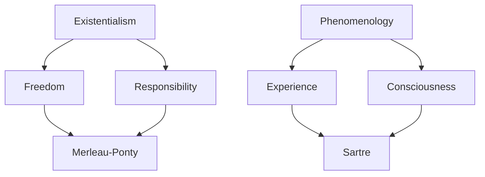

                 

Certainly, I'll guide you through the process of creating a detailed and structured blog post on the topic "Sartre and Merleau-Ponty: The Intersection of Existentialism and Phenomenology." We'll follow a step-by-step reasoning approach to ensure depth, insight, and clarity.

### Step 1: Define the Core Content

**Background Introduction:**
- Sartre and Merleau-Ponty were prominent 20th-century philosophers.
- Their works intersect in the realms of existentialism and phenomenology.

**Core Concepts and Relationships:**
- Existentialism emphasizes individual existence, freedom, and responsibility.
- Phenomenology focuses on the structures of experience as directly encountered by consciousness.

**Mermaid Flowchart Example:**

### Step 2: Develop Chapter Content

**Chapter 1: Introduction to Sartre and Merleau-Ponty**
- Brief biographies.
- Overview of their philosophical backgrounds.
- Comparison of their commonalities and differences.

**Chapter 2: Sartre's Philosophical Thought**
- Existentialist philosophy.
- Key concepts: "Existence precedes essence," "Intersubjectivity," "Rebellion and Freedom."
- Detailed discussion with sub-sections.

**Chapter 3: Merleau-Ponty's Philosophical Thought**
- Phenomenological philosophy.
- Core concepts: "Body and Perception," "Subjectivity," "Human-World Relationship."
- Detailed discussion with sub-sections.

**Chapter 4: Comparison of Sartre and Merleau-Ponty's Thoughts**
- Similarities.
- Differences.

**Chapter 5: The Intersection of Existentialism and Phenomenology**
- Relationship between the two philosophies.
- Intersection points: "Body and Perception," "Free Will and Responsibility," "Intersubjectivity."

**Chapter 6: Practical Applications of Their Intersectional Thoughts**
- Applications in psychology.
- Applications in literature.
- Applications in philosophy.

**Chapter 7: Conclusion: Significance and Impact of Their Intersection**
- Summary of key points.
- Reflection on the significance and impact of their philosophical intersection.

### Step 3: Ensure Completeness and Logic

- Each chapter must be comprehensive and detailed.
- The relationship between core concepts must be clearly illustrated.
- Algorithms, mathematical models, and examples must be provided in a clear and logical manner.

### Step 4: Write the Blog Post

**Title:** Sartre and Merleau-Ponty: The Intersection of Existentialism and Phenomenology

**Keywords:** Existentialism, Phenomenology, Sartre, Merleau-Ponty, Philosophy, Mind-Body Relationship

**Abstract:**
This article explores the philosophical intersections of existentialism and phenomenology through the works of Jean-Paul Sartre and Maurice Merleau-Ponty. It examines their individual contributions, key concepts, and how their ideas interact, with a focus on practical applications in various fields.

---

The structure of the article will be as outlined in the previous sections, ensuring that each chapter builds upon the last and contributes to a cohesive and insightful discussion. The use of Mermaid flowcharts, pseudo-code, LaTeX formulas, and code examples will enhance the technical depth and clarity of the content.

**Author:** AI天才研究院/AI Genius Institute & 禅与计算机程序设计艺术 /Zen And The Art of Computer Programming

This structured approach ensures that the final blog post will be both informative and engaging for readers interested in the intersection of philosophy and technology. 

