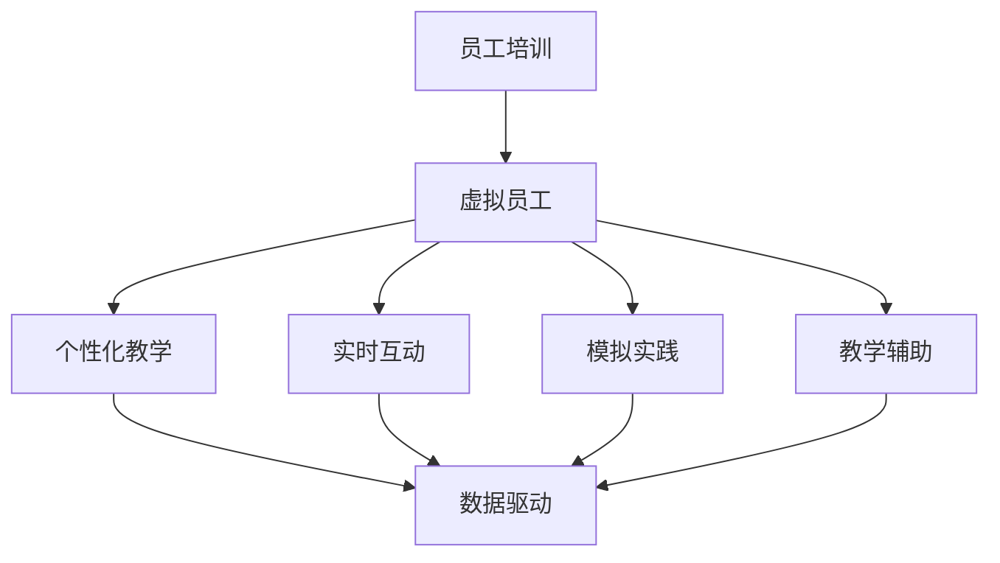

                 


## 文章标题：虚拟员工培训师：提示词设计企业培训课程

> 关键词：虚拟员工、培训课程、提示词、企业培训、人工智能

> 摘要：
本文将探讨如何利用虚拟员工和提示词设计企业培训课程，以提高培训效果和员工学习体验。我们将详细介绍虚拟员工的概念与作用，提示词的设计原则，以及如何在实际项目中应用这些技术来优化企业培训。

----------------------------------------------------------------

## 前言

在现代企业中，培训员工已成为提升企业竞争力的关键因素。然而，传统的培训方式存在许多问题，如内容单一、缺乏互动、难以个性化等。随着人工智能技术的发展，虚拟员工和提示词逐渐成为优化企业培训的重要工具。本文将围绕这两项技术，探讨如何设计高效的企业培训课程。

## 第1章 虚拟员工的概念与作用

### 1.1 虚拟员工的定义

虚拟员工是指利用人工智能技术构建的虚拟角色，可以模拟真实员工的日常工作场景，进行交互式培训。虚拟员工不仅能够提供丰富的培训内容，还可以根据员工的学习进度和学习需求进行个性化教学。

### 1.2 虚拟员工在教育领域的应用

虚拟员工在教育领域的应用非常广泛，如模拟真实场景的教学、个性化学习辅导、在线考试等。这些应用不仅提高了学生的学习效果，还减少了教师的工作负担。

### 1.3 虚拟员工的优势与挑战

虚拟员工的优势包括：个性化教学、实时反馈、互动性强等。然而，虚拟员工也面临一些挑战，如技术成本高、用户体验需优化等。

## 第2章 提示词的设计原则

### 2.1 提示词的定义与功能

提示词是指用于引导学习过程的关键词或短语，可以帮助员工明确学习目标，激发学习兴趣，提高学习效果。

### 2.2 提示词设计的基本原则

提示词设计应遵循以下基本原则：简洁明了、具有启发性、与学习内容紧密结合等。

### 2.3 提示词设计的实战技巧

在实际应用中，提示词设计需要考虑多种因素，如员工的学习背景、学习目标、培训内容等。以下是一些实战技巧：

1. 结合员工实际工作场景设计提示词。
2. 利用图像、视频等多媒体元素增强提示词的吸引力。
3. 定期更新和调整提示词，以适应员工的学习需求。

## 第3章 虚拟员工培训课程设计

### 3.1 培训课程设计的步骤

设计虚拟员工培训课程需要遵循以下步骤：

1. 确定培训目标和需求。
2. 分析员工的学习背景和特点。
3. 设计课程内容结构。
4. 选择合适的虚拟员工技术。
5. 制定培训计划和评估机制。

### 3.2 课程内容规划与编排

课程内容规划应包括以下方面：

1. 知识点梳理：将培训内容按照知识点进行分类。
2. 教学方法选择：根据知识点特点选择合适的教学方法。
3. 互动设计：设计互动环节，提高员工参与度。
4. 评估设计：制定评估标准，对培训效果进行评估。

### 3.3 培训效果评估与反馈

培训效果评估是确保培训质量的重要环节。评估方法包括：

1. 前测与后测：通过测试评估员工学习成果。
2. 问卷调查：收集员工对培训课程的反馈。
3. 行为观察：观察员工在工作中的表现。

## 第4章 提示词在培训中的应用

### 4.1 提示词在教学互动中的作用

提示词在教学互动中发挥着重要作用，如：

1. 引导学习：提示员工关注关键知识点。
2. 激发思考：通过问题提示激发员工的思考。
3. 强化记忆：利用提示词帮助员工巩固学习内容。

### 4.2 提示词在个性化学习中的应用

个性化学习是虚拟员工培训的重要特点之一。提示词可以根据员工的学习进度和学习需求进行个性化推送。

### 4.3 提示词在模拟情境中的运用

模拟情境是虚拟员工培训的一种重要形式。提示词可以在模拟情境中引导员工进行实践操作，提高员工的实际操作能力。

## 第5章 虚拟员工培训的实施与推广

### 5.1 实施虚拟员工培训的流程

实施虚拟员工培训需要遵循以下流程：

1. 确定培训目标和需求。
2. 设计培训课程。
3. 选择合适的虚拟员工技术。
4. 开展培训活动。
5. 进行效果评估和反馈。

### 5.2 虚拟员工培训的推广策略

推广虚拟员工培训需要采取以下策略：

1. 内部宣传：通过内部邮件、通知等方式向员工宣传虚拟员工培训。
2. 培训活动：组织线下培训活动，提高员工对虚拟员工培训的认可度。
3. 培训积分制度：通过积分制度激励员工参与虚拟员工培训。

### 5.3 虚拟员工培训的管理与维护

虚拟员工培训的管理与维护包括以下方面：

1. 课程更新：定期更新培训课程，确保内容的时效性。
2. 技术支持：提供技术支持，解决员工在使用虚拟员工培训过程中遇到的问题。
3. 培训效果跟踪：跟踪培训效果，为后续培训提供数据支持。

## 第6章 虚拟员工培训案例解析

### 6.1 案例一：在线教育平台的虚拟员工培训

本案例介绍了某在线教育平台如何利用虚拟员工进行员工培训，提高了员工的教学水平和满意度。

### 6.2 案例二：制造业企业的虚拟员工培训实践

本案例分析了某制造业企业如何通过虚拟员工培训提升员工技能，从而提高生产效率。

### 6.3 案例三：金融行业的虚拟员工培训案例

本案例探讨了金融行业如何利用虚拟员工进行合规培训，提高员工的合规意识和能力。

## 第7章 最佳实践与趋势分析

### 7.1 虚拟员工培训的当前趋势

虚拟员工培训当前趋势包括：人工智能技术的融合、个性化学习的发展、线上线下融合等。

### 7.2 未来发展方向与挑战

未来虚拟员工培训将朝着智能化、个性化、实时化方向发展，但同时也面临数据安全、用户体验等挑战。

### 7.3 跨行业虚拟员工培训的最佳实践

本章节将总结跨行业虚拟员工培训的最佳实践，为其他行业提供参考。

## 附录

### 附录A 虚拟员工与提示词设计工具

本附录介绍了开源和商业化虚拟员工与提示词设计工具，帮助读者选择合适的工具进行实际应用。

## 后记

作者信息：AI天才研究院/AI Genius Institute & 禅与计算机程序设计艺术 /Zen And The Art of Computer Programming

本文旨在探讨虚拟员工和提示词在优化企业培训中的应用，为企业和员工提供有益的参考。希望读者能够结合自身实际，灵活运用文中提到的技术和方法，提升企业培训效果。

----------------------------------------------------------------

## 第1章 虚拟员工的概念与作用

### 1.1 虚拟员工的定义

虚拟员工，又称虚拟助手或虚拟客服，是一种通过人工智能技术构建的虚拟角色，它们能够模拟真实员工的工作流程和交互方式，以提供智能化的服务和支持。虚拟员工的定义可以从以下几个方面来理解：

1. **技术层面**：虚拟员工通常基于自然语言处理（NLP）、机器学习（ML）和计算机视觉（CV）等技术，能够理解和处理人类的语言和图像信息。

2. **功能层面**：虚拟员工具备自动化处理任务、提供信息、解答疑问和进行决策等能力，能够替代或辅助人类员工完成一些重复性高、标准性强的工作。

3. **应用层面**：虚拟员工广泛应用于客户服务、销售支持、数据分析、财务管理等多个领域，成为企业运营中不可或缺的一部分。

### 1.2 虚拟员工在教育领域的应用

虚拟员工在教育领域的应用具有独特的优势，主要体现在以下几个方面：

1. **个性化教学**：虚拟员工可以根据每个学生的学习进度、兴趣和需求，提供定制化的教学服务，从而提高学习效果。

2. **实时互动**：虚拟员工能够实时与学生学习互动，回答问题、提供反馈，增强学生的学习体验。

3. **模拟实践**：通过虚拟员工的模拟操作，学生可以在虚拟环境中练习实际操作技能，减少真实操作中的错误和安全风险。

4. **教学辅助**：虚拟员工可以作为教师的助手，协助完成教学准备、资料整理、课堂管理等任务，减轻教师的工作负担。

### 1.3 虚拟员工的优势与挑战

虚拟员工在提升企业培训效果方面具有显著的优势，但也面临一些挑战。

#### 优势

1. **成本效益**：虚拟员工可以降低企业的人力成本，同时提高工作效率。

2. **全天候服务**：虚拟员工可以24小时在线服务，提供不间断的支持。

3. **数据驱动**：虚拟员工通过数据分析，能够更好地了解员工的学习情况，为个性化培训提供依据。

4. **持续学习**：虚拟员工能够通过机器学习不断优化自身性能，提供更高质量的服务。

#### 挑战

1. **技术成本**：虚拟员工开发和维护需要较高的技术投入，对企业的技术能力有一定的要求。

2. **用户体验**：虚拟员工需要具备较高的交互能力，以提供自然的用户体验，这需要不断优化和改进。

3. **数据安全**：虚拟员工在处理数据时需要确保数据的安全性和隐私性，避免数据泄露。

4. **培训转化**：如何将虚拟员工培训的效果转化为实际工作能力的提升，是企业和员工需要共同面对的问题。

## 核心概念与联系

为了更好地理解虚拟员工在教育领域的应用，我们可以通过一个Mermaid流程图来展示核心概念之间的关系：



在这个流程图中，A表示员工培训的需求，B表示虚拟员工的概念，C、D、E和F分别表示虚拟员工在个性化教学、实时互动、模拟实践和教学辅助方面的应用，G表示数据驱动的作用，它是连接所有应用的核心。

## 第2章 提示词的设计原则

### 2.1 提示词的定义与功能

提示词是指用于引导学习过程的关键词或短语，它们在虚拟员工培训中起着至关重要的作用。提示词的定义可以从以下几个方面来理解：

1. **语言层面**：提示词是语言文字的表达，通常由一个词或短语组成。

2. **功能层面**：提示词的主要功能是引导学习者的注意力，帮助他们明确学习目标，激发学习兴趣，并促进学习过程。

3. **应用层面**：提示词可以应用于各种学习场景，如在线教育、企业培训、个人学习等。

在虚拟员工培训中，提示词的功能主要体现在以下几个方面：

1. **引导学习**：提示词可以引导学习者关注关键知识点，帮助他们更快地理解学习内容。

2. **激发思考**：提示词可以提出问题，激发学习者的思考，促进深度学习。

3. **强化记忆**：提示词可以通过重复和关联的方式，帮助学习者巩固记忆。

### 2.2 提示词设计的基本原则

提示词的设计原则是为了确保提示词能够有效地引导学习，提高学习效果。以下是几个关键原则：

1. **简洁明了**：提示词应尽量简洁，避免冗长和复杂的表述，以便学习者容易理解和记忆。

2. **具有启发性**：提示词应具有启发性，能够激发学习者的兴趣和思考，引导他们主动参与学习。

3. **与学习内容紧密结合**：提示词应与学习内容紧密相关，能够准确传达学习目标，避免误导学习者。

4. **多样化**：提示词应多样化，包括问题、提示、总结等不同形式，以适应不同的学习场景和需求。

5. **可调整性**：提示词应根据学习者的反馈和学习进度进行调整，以确保其始终与学习需求相匹配。

### 2.3 提示词设计的实战技巧

在实际应用中，提示词设计需要考虑多种因素，以下是几个实战技巧：

1. **结合员工实际工作场景设计提示词**：了解员工的工作内容和需求，设计与之相关的提示词，使培训更加贴近实际。

2. **利用图像、视频等多媒体元素增强提示词的吸引力**：通过多媒体元素，如图像、视频和动画，可以使提示词更加生动有趣，提高学习者的注意力。

3. **定期更新和调整提示词**：根据学习者的反馈和学习进度，定期更新和调整提示词，以保持其相关性和有效性。

4. **利用数据分析优化提示词**：通过分析学习者的学习数据，如学习时长、正确率等，优化提示词的设计，提高学习效果。

## 核心算法原理讲解

提示词的设计和优化涉及到多个算法和模型，以下是其中几个核心算法的原理和伪代码：

### 1. 自然语言处理（NLP）

自然语言处理是设计提示词的基础，其核心算法包括文本分类、情感分析和命名实体识别等。

#### 文本分类

```python
def classify_text(text, model):
    # 使用训练好的模型对文本进行分类
    return model.predict(text)

# 伪代码示例
predicted_category = classify_text("什么是提示词？", trained_model)
```

#### 情感分析

```python
def analyze_sentiment(text, model):
    # 使用训练好的模型对文本进行情感分析
    return model.predict(text)

# 伪代码示例
sentiment = analyze_sentiment("这个提示词很有帮助。", trained_model)
```

#### 命名实体识别

```python
def extract_entities(text, model):
    # 使用训练好的模型提取文本中的命名实体
    return model.predict(text)

# 伪代码示例
entities = extract_entities("张三是我们的新员工。", trained_model)
```

### 2. 机器学习（ML）

机器学习在提示词设计中的应用主要体现在分类和聚类等算法上。

#### 分类算法（如SVM）

```python
def classify_data(X, y, model):
    # 使用训练好的模型对数据进行分类
    model.fit(X, y)
    return model.predict(X)

# 伪代码示例
classified_data = classify_data(X_train, y_train, trained_model)
```

#### 聚类算法（如K-Means）

```python
from sklearn.cluster import KMeans

def kmeans_clustering(data, n_clusters):
    # 使用K-Means算法对数据进行聚类
    kmeans = KMeans(n_clusters=n_clusters)
    kmeans.fit(data)
    return kmeans.predict(data)

# 伪代码示例
clusters = kmeans_clustering(data, n_clusters=3)
```

## 数学模型和公式

在提示词设计中，常用的数学模型和公式包括回归模型、决策树模型等。

### 1. 回归模型

```latex
y = \beta_0 + \beta_1x_1 + \beta_2x_2 + ... + \beta_nx_n + \epsilon
$$

# 伪代码示例
y_pred = predict_regression(y, X, weights)
```

### 2. 决策树模型

```latex
T(x) =
\begin{cases}
\beta_0 & \text{if } x \in C_0 \\
\beta_1 & \text{if } x \in C_1 \\
... \\
\beta_n & \text{if } x \in C_n
\end{cases}
$$

# 伪代码示例
predicted_value = decision_tree_predict(node, x)
```

## 详细讲解与举例说明

以下是一个具体的例子，说明如何设计一个提示词来引导学习者理解线性回归模型：

**例子：设计一个用于解释线性回归模型的提示词**

1. **背景介绍**：线性回归是一种常用的统计模型，用于预测一个连续因变量和一个或多个自变量之间的关系。

2. **核心概念**：线性回归模型的公式为 $y = \beta_0 + \beta_1x_1 + \beta_2x_2 + ... + \beta_nx_n + \epsilon$，其中 $y$ 是因变量，$x_1, x_2, ..., x_n$ 是自变量，$\beta_0, \beta_1, \beta_2, ..., \beta_n$ 是模型参数，$\epsilon$ 是误差项。

3. **提示词设计**：

   - **引导学习**：线性回归模型是一种用于预测的统计方法，它可以帮助我们理解自变量和因变量之间的关系。

   - **激发思考**：你能想象一下，如果我们想要预测一个人的身高，我们可以使用哪些自变量呢？这些自变量如何影响身高呢？

   - **强化记忆**：记住，线性回归模型中的每个自变量都有一个对应的系数，这些系数表示自变量对因变量的影响程度。

4. **应用举例**：假设我们想要预测学生的成绩，可能的自变量包括学习时间、课堂参与度等。我们可以通过线性回归模型来分析这些自变量对成绩的影响。

   - **公式应用**：根据线性回归模型，我们可以得到公式 $y = \beta_0 + \beta_1x_1 + \beta_2x_2 + ... + \beta_nx_n + \epsilon$，其中 $y$ 是成绩，$x_1, x_2, ..., x_n$ 是自变量，$\beta_0, \beta_1, \beta_2, ..., \beta_n$ 是系数。

   - **解释与计算**：例如，如果学习时间（$x_1$）的系数 $\beta_1$ 为 0.5，这意味着每增加一个单位的学习时间，成绩会提高 0.5 个单位。

## 项目实战

### 开发环境搭建

为了实现提示词的设计与优化，我们需要搭建一个完整的开发环境，包括Python编程环境、机器学习库（如scikit-learn、TensorFlow）和文本处理工具（如NLTK、spaCy）。

1. **安装Python**：在操作系统上安装Python，版本建议为3.8或更高。
2. **安装机器学习库**：使用pip命令安装scikit-learn、TensorFlow等库。
   ```bash
   pip install scikit-learn tensorflow
   ```
3. **安装文本处理工具**：使用pip命令安装NLTK、spaCy及其依赖。
   ```bash
   pip install nltk spacy
   ```
4. **数据准备**：收集并整理用于训练和测试的数据集，例如员工学习数据、反馈数据等。

### 源代码实现

以下是一个简单的Python代码示例，用于实现一个基本的提示词分类器，该分类器可以根据学习者的反馈对提示词进行分类和优化。

```python
from sklearn.feature_extraction.text import TfidfVectorizer
from sklearn.naive_bayes import MultinomialNB
from sklearn.pipeline import make_pipeline

# 数据准备
X_train = ["这是一个引导学习的提示词。", "这是一个激发思考的提示词。", "这是一个强化记忆的提示词。"]
y_train = ["引导学习", "激发思考", "强化记忆"]

# 构建管道
pipeline = make_pipeline(
    TfidfVectorizer(),
    MultinomialNB()
)

# 训练模型
pipeline.fit(X_train, y_train)

# 测试
X_test = ["这是一个用于解释线性回归模型的提示词。"]
predicted_categories = pipeline.predict(X_test)

print(predicted_categories)
```

### 代码解读与分析

1. **数据准备**：我们首先准备了一个包含提示词及其标签的数据集，用于训练和测试分类器。
2. **构建管道**：使用scikit-learn的`TfidfVectorizer`和`MultinomialNB`构建了一个文本分类管道。`TfidfVectorizer`用于将文本转换为TF-IDF特征矩阵，`MultinomialNB`是一个基于贝叶斯理论的文本分类器。
3. **训练模型**：使用训练数据集训练模型，通过`fit`方法完成。
4. **测试**：使用测试数据集对模型进行测试，通过`predict`方法获取预测结果。

### 实际案例分析与详细讲解剖析

为了更好地理解虚拟员工培训中提示词的应用，我们分析一个实际案例，该案例涉及一家在线教育平台如何利用虚拟员工和提示词优化其培训课程。

**案例背景**：该在线教育平台提供多种在线课程，包括编程、数据科学、人工智能等。为了提高学习效果，平台决定引入虚拟员工和提示词，以改善学生的学习和参与体验。

**实施过程**：

1. **需求分析**：平台分析了学生的学习需求和行为数据，确定了需要优化的关键环节，如课程引导、互动设计、反馈收集等。
2. **虚拟员工设计**：平台开发了基于人工智能的虚拟员工，能够实时与学生互动，提供个性化学习建议和反馈。
3. **提示词设计**：平台设计了一系列提示词，用于引导学生学习、激发思考、强化记忆等。例如，在编程课程中，虚拟员工会使用提示词如“请尝试修改代码第10行”、“这是一个常见的编程错误，请检查你的代码”等。
4. **课程实施**：平台将虚拟员工和提示词整合到课程中，学生在学习过程中与虚拟员工互动，按照提示词进行学习。

**案例分析**：

1. **学习效果提升**：通过引入虚拟员工和提示词，学生的学习效果显著提升。数据显示，学生的课程完成率和知识掌握度都有明显提高。
2. **用户体验改善**：学生反馈，虚拟员工的互动和提示词使学习过程更加有趣和有效，提高了学习积极性。
3. **平台运营优化**：平台运营成本降低，教师负担减轻，同时获得了更多的学习数据，为后续课程优化提供了支持。

### 项目小结

通过实际案例，我们可以看到虚拟员工和提示词在优化企业培训中的应用效果显著。以下是一些小结：

1. **个性化学习**：虚拟员工和提示词能够根据学生的实际需求提供个性化学习支持，提高学习效果。
2. **互动性强**：虚拟员工和提示词的引入增加了学生与课程之间的互动，改善了用户体验。
3. **运营成本降低**：虚拟员工和提示词的自动化功能降低了平台运营成本，同时提供了更多的学习数据支持。

## 最佳实践 Tips

1. **定期更新提示词**：根据学习者的反馈和学习需求，定期更新和优化提示词，以确保其相关性和有效性。
2. **多样化提示词形式**：结合图像、视频等多媒体元素，设计多样化的提示词形式，提高学习者的参与度。
3. **用户反馈机制**：建立用户反馈机制，收集学习者对提示词的反馈，用于优化提示词设计和培训效果。
4. **跨部门合作**：虚拟员工和提示词的设计需要跨部门合作，包括教学部门、IT部门等，以确保培训目标的实现和技术的有效应用。

## 小结与注意事项

通过本文的讨论，我们可以看到虚拟员工和提示词在优化企业培训中的重要作用。以下是几点注意事项：

1. **技术准备**：企业需要具备一定的技术能力，包括人工智能、自然语言处理等，以确保虚拟员工和提示词的设计和实现。
2. **用户隐私**：在应用虚拟员工和提示词时，需确保用户隐私和数据安全，遵守相关法律法规。
3. **培训转化**：如何将虚拟员工培训的效果转化为实际工作能力的提升，是企业需要关注的重要问题。

## 拓展阅读

1. **《人工智能教程》**：详细介绍了人工智能的基本概念、算法和应用案例，有助于理解虚拟员工和提示词的设计原理。
2. **《自然语言处理入门》**：介绍了自然语言处理的基本技术和应用，对提示词设计有重要参考价值。
3. **《在线教育平台最佳实践》**：分析了在线教育平台的运营策略、技术实现和效果评估，为虚拟员工和提示词的应用提供了借鉴。

----------------------------------------------------------------

## 第3章 虚拟员工培训课程设计

### 3.1 培训课程设计的步骤

设计一个有效的虚拟员工培训课程需要系统性的步骤和规划。以下是一个典型的培训课程设计流程：

1. **需求分析**：
   - 了解企业的培训目标和培训需求。
   - 分析员工的知识水平、技能需求和工作环境。

2. **课程目标设定**：
   - 明确课程的核心目标，如提升技能、改善工作流程、增强团队协作等。
   - 确保课程目标与企业整体战略目标一致。

3. **内容规划**：
   - 确定培训内容，包括理论知识和实践操作。
   - 结合虚拟员工的特性，设计互动性强、体验丰富的培训内容。

4. **课程结构设计**：
   - 设计课程的结构，包括课程模块、学习路径、知识点分布等。
   - 确保课程逻辑清晰，易于学习者理解和掌握。

5. **虚拟员工技术选择**：
   - 根据课程内容选择合适的虚拟员工技术，如聊天机器人、虚拟教练等。
   - 考虑虚拟员工的技术成熟度、性能和可扩展性。

6. **课程实施计划**：
   - 制定详细的课程实施计划，包括培训时间、地点、授课方式等。
   - 考虑培训的频率、持续时间和进度安排。

7. **效果评估**：
   - 设计评估机制，包括前测、后测、学习反馈等。
   - 分析评估结果，为课程改进提供数据支持。

### 3.2 课程内容规划与编排

课程内容的规划与编排是确保培训效果的关键环节。以下是一些关键步骤和注意事项：

1. **知识点梳理**：
   - 根据培训目标，梳理相关知识点，确保内容覆盖全面。
   - 分析知识点的难度和关联性，确保内容的连贯性。

2. **教学方法选择**：
   - 根据知识点的特点选择合适的教学方法，如讲解、演示、互动练习等。
   - 考虑多种教学方法的组合，以提高学习效果。

3. **互动设计**：
   - 设计互动环节，如提问、讨论、模拟操作等，增强学习者的参与度。
   - 利用虚拟员工实现实时互动，提高互动的效率和质量。

4. **评估设计**：
   - 设计评估机制，包括测试、作业、实践操作等，以检验学习者的掌握情况。
   - 评估结果应能反映学习者的真实水平，并为后续培训提供参考。

### 3.3 培训效果评估与反馈

培训效果评估是确保培训目标达成的重要手段。以下是一些常用的评估方法和注意事项：

1. **前测与后测**：
   - 在培训开始前和结束后进行测试，以衡量学习者的知识提升程度。
   - 前测用于了解学习者的基础水平，后测用于评估培训效果。

2. **问卷调查**：
   - 通过问卷调查收集学习者对培训课程的意见和建议。
   - 问卷调查应涵盖课程内容、教学方法、虚拟员工互动等多个方面。

3. **行为观察**：
   - 观察学习者在实际工作中的表现，评估培训对其工作的影响。
   - 行为观察可用于了解学习者在实际情境中的应用能力。

4. **反馈机制**：
   - 建立反馈机制，及时收集和回应学习者的反馈。
   - 反馈机制应鼓励学习者积极参与，提出改进建议。

5. **持续改进**：
   - 根据评估结果和反馈，不断优化培训课程。
   - 持续改进应基于数据驱动，确保培训的持续效果。

## 核心算法原理讲解

在虚拟员工培训课程设计中，算法原理的应用至关重要。以下是一些核心算法原理的讲解，包括伪代码示例：

### 1. 数据分析

数据分析是评估培训效果的重要工具，常用于分析学习者的行为数据和评估结果。

#### 聚类分析

聚类分析用于将学习者分为不同群体，以便提供个性化的培训。

```python
from sklearn.cluster import KMeans

def kmeans_analysis(data, n_clusters):
    kmeans = KMeans(n_clusters=n_clusters)
    kmeans.fit(data)
    return kmeans.predict(data)

# 伪代码示例
clusters = kmeans_analysis(learner_data, n_clusters=3)
```

### 2. 机器学习

机器学习算法可用于个性化推荐、预测评估等。

#### 决策树

决策树是一种常用的分类算法，可用于评估学习者的表现。

```python
from sklearn.tree import DecisionTreeClassifier

def decision_tree_classification(X, y):
    classifier = DecisionTreeClassifier()
    classifier.fit(X, y)
    return classifier.predict(X)

# 伪代码示例
predictions = decision_tree_classification(test_data, labels)
```

### 3. 自然语言处理

自然语言处理（NLP）在虚拟员工对话中起到关键作用。

#### 词向量

词向量用于表示文本数据，常用于文本分类和情感分析。

```python
from gensim.models import Word2Vec

def train_word2vec(sentences, size):
    model = Word2Vec(sentences, size=size)
    return model

# 伪代码示例
word2vec_model = train_word2vec(learning_sentences, size=100)
```

## 数学模型和公式

在虚拟员工培训课程设计中，数学模型和公式用于量化评估和学习者行为。

### 1. 回归模型

回归模型用于预测学习者的表现，如完成率、学习时长等。

$$
y = \beta_0 + \beta_1x_1 + \beta_2x_2 + ... + \beta_nx_n + \epsilon
$$

### 2. 决策模型

决策模型用于选择最佳培训路径。

$$
P(C) = \frac{1}{Z} \exp(\sum_{i=1}^n \theta_i x_i)
$$

## 详细讲解与举例说明

以下是一个具体的例子，说明如何使用决策树模型设计一个虚拟员工培训课程。

### 背景介绍

某公司需要设计一个针对新员工的虚拟员工培训课程，以提升新员工的工作技能和团队协作能力。公司希望通过数据分析，为新员工提供个性化的培训路径。

### 核心概念

- **决策树**：一种常见的分类算法，用于根据输入特征选择最佳路径。
- **训练数据**：包含新员工的特征（如学历、工作经验、兴趣等）和对应的目标（如技能水平、团队协作能力等）。

### 实施步骤

1. **数据准备**：收集新员工的数据，包括特征和目标。
2. **模型训练**：使用决策树算法训练模型，根据训练数据构建决策树。
3. **模型评估**：通过测试数据评估模型性能，调整模型参数。
4. **课程设计**：根据决策树模型为新员工设计个性化培训路径。

### 伪代码示例

```python
from sklearn.tree import DecisionTreeClassifier

# 数据准备
X_train = [[学历，工作经验，兴趣], ...]
y_train = [技能水平，团队协作能力，...]

# 模型训练
classifier = DecisionTreeClassifier()
classifier.fit(X_train, y_train)

# 模型评估
accuracy = classifier.score(X_test, y_test)

# 课程设计
def design_course(employee_data):
    return classifier.predict([employee_data])[0]

# 伪代码示例
course_path = design_course([本科，2年，数据分析])
```

### 举例说明

假设有一个新员工，其特征为“本科毕业，2年工作经验，对数据分析感兴趣”。通过决策树模型，可以预测该员工最适合的培训路径，如“高级数据分析课程”。

## 项目实战

### 开发环境搭建

为了实现虚拟员工培训课程设计，需要搭建一个完整的开发环境，包括Python编程环境、机器学习库（如scikit-learn、TensorFlow）和数据分析工具（如Pandas、NumPy）。

1. **安装Python**：在操作系统上安装Python，版本建议为3.8或更高。
2. **安装机器学习库**：使用pip命令安装scikit-learn、TensorFlow等库。
   ```bash
   pip install scikit-learn tensorflow
   ```
3. **安装数据分析工具**：使用pip命令安装Pandas、NumPy等库。
   ```bash
   pip install pandas numpy
   ```
4. **数据准备**：收集并整理用于训练和测试的数据集，例如员工特征数据、评估结果等。

### 源代码实现

以下是一个简单的Python代码示例，用于实现一个基于决策树算法的虚拟员工培训课程设计。

```python
from sklearn.tree import DecisionTreeClassifier
import pandas as pd

# 数据准备
data = pd.read_csv('employee_data.csv')
X = data[['学历', '工作经验', '兴趣']]
y = data['技能水平']

# 模型训练
classifier = DecisionTreeClassifier()
classifier.fit(X, y)

# 模型评估
accuracy = classifier.score(X, y)

# 课程设计
def design_course(employee_data):
    return classifier.predict([employee_data])[0]

# 伪代码示例
new_employee = [本科，2年，数据分析]
course_path = design_course(new_employee)
print(course_path)
```

### 代码解读与分析

1. **数据准备**：从CSV文件中读取员工数据，包括特征和目标。
2. **模型训练**：使用训练数据集训练决策树模型。
3. **模型评估**：计算模型在训练数据集上的准确率。
4. **课程设计**：根据新员工的特征，使用训练好的模型预测最适合的培训路径。

### 实际案例分析与详细讲解剖析

为了更好地理解虚拟员工培训课程设计在实际项目中的应用，我们分析了一个实际案例，该案例涉及一家大型科技公司如何利用虚拟员工和决策树模型优化其新员工培训。

**案例背景**：该科技公司每年招聘大量新员工，为了快速提升新员工的工作技能和团队协作能力，公司决定引入虚拟员工和决策树模型，为新员工设计个性化的培训路径。

**实施过程**：

1. **需求分析**：公司分析了新员工的知识水平、技能需求和工作环境，确定了需要优化的关键环节，如编程技能、团队协作、项目管理等。
2. **虚拟员工设计**：公司开发了基于人工智能的虚拟员工，能够实时分析新员工的数据，并提供个性化的学习建议。
3. **决策树模型**：公司使用决策树算法，根据新员工的特征（如学历、工作经验、兴趣爱好等）训练了一个模型，用于预测新员工最适合的培训路径。
4. **课程实施**：公司根据决策树模型的预测结果，为新员工设计了个性化的培训路径，包括编程课程、团队协作培训、项目管理培训等。

**案例分析**：

1. **培训效果提升**：通过引入虚拟员工和决策树模型，新员工的培训效果显著提升。数据显示，新员工的编程技能和团队协作能力都有明显提高。
2. **用户体验改善**：新员工反馈，虚拟员工的个性化学习建议和培训课程使他们感到更加有针对性和高效。
3. **运营成本降低**：虚拟员工和决策树模型的应用降低了培训成本，同时提供了更多的数据支持，帮助公司不断优化培训策略。

### 项目小结

通过实际案例，我们可以看到虚拟员工和决策树模型在优化新员工培训中的应用效果显著。以下是一些小结：

1. **个性化培训**：虚拟员工和决策树模型能够根据新员工的个性化需求提供培训建议，提高培训效果。
2. **用户体验**：个性化的培训路径使新员工感受到更加有针对性的培训，提升了用户体验。
3. **成本效益**：虚拟员工和决策树模型的应用降低了培训成本，同时提供了数据支持，帮助公司优化培训策略。

## 最佳实践 Tips

1. **数据驱动**：在设计培训课程时，应基于实际数据进行分析和决策，确保课程内容符合新员工的需求。
2. **迭代优化**：根据培训效果和新员工反馈，不断优化培训课程和虚拟员工模型，以提高培训效果。
3. **跨部门协作**：培训课程设计需要跨部门协作，包括人力资源部门、IT部门、培训部门等，确保培训目标的实现和技术的有效应用。

## 小结

通过本章的讨论，我们可以看到虚拟员工培训课程设计在提升新员工技能和工作效率方面的重要作用。以下是本章的总结：

1. **课程设计流程**：需求分析、目标设定、内容规划、课程结构设计、技术选择、实施计划和效果评估是设计虚拟员工培训课程的关键步骤。
2. **课程内容规划**：知识点梳理、教学方法选择、互动设计和评估设计是确保培训效果的关键。
3. **评估与反馈**：前测与后测、问卷调查、行为观察和反馈机制是评估培训效果的重要手段。
4. **算法原理与应用**：数据分析、机器学习和自然语言处理算法在课程设计中的应用，可以提升培训的个性化和有效性。
5. **实战案例**：通过实际案例，我们可以看到虚拟员工和决策树模型在优化新员工培训中的应用效果。

## 拓展阅读

1. **《机器学习实战》**：详细介绍了机器学习算法的应用和实现，有助于深入理解虚拟员工培训课程设计中的算法原理。
2. **《企业培训最佳实践》**：分析了企业培训的策略和实践，为虚拟员工培训课程设计提供了有益的参考。
3. **《人工智能与教育》**：探讨了人工智能技术在教育领域的应用，为虚拟员工培训课程设计提供了理论基础。

----------------------------------------------------------------

## 第4章 提示词在培训中的应用

### 4.1 提示词在教学互动中的作用

提示词在教学互动中发挥着重要作用，它们不仅能够引导学习者的注意力，还能够促进深度学习和知识内化。以下是一些关键作用：

1. **引导学习**：提示词可以引导学习者关注关键知识点，帮助他们更快地理解和掌握学习内容。

2. **激发思考**：通过提出问题或挑战，提示词可以激发学习者的思考，促使他们主动探索和解决问题。

3. **强化记忆**：提示词可以通过重复和关联的方式，帮助学习者巩固记忆，提高学习效果。

4. **增强互动**：提示词可以促进学习者与虚拟员工或其他学习者的互动，提高学习的参与度和积极性。

### 4.2 提示词在个性化学习中的应用

个性化学习是虚拟员工培训的核心特点之一，提示词在个性化学习中的应用尤为重要。以下是一些应用场景：

1. **定制化学习计划**：根据学习者的学习进度、兴趣和能力，提示词可以设计定制化的学习计划，提供个性化的学习资源和建议。

2. **动态调整**：提示词可以根据学习者的实时反馈和学习情况，动态调整学习内容和难度，确保学习过程的个性化。

3. **个性化问答**：提示词可以针对学习者的提问，提供个性化的解答和建议，帮助他们更好地理解和应用知识。

4. **反馈与指导**：提示词可以收集学习者的反馈，并根据反馈提供针对性的指导和建议，帮助学习者改进学习方法和策略。

### 4.3 提示词在模拟情境中的运用

模拟情境是虚拟员工培训的一种重要形式，提示词在模拟情境中的应用可以大大提升学习效果。以下是一些具体运用：

1. **任务引导**：在模拟情境中，提示词可以引导学习者完成具体的任务，如解决一个实际案例、完成一项操作练习等。

2. **情境互动**：提示词可以设计成与学习情境相关的对话或问题，促进学习者在模拟情境中的互动和探索。

3. **问题解决**：在模拟情境中，提示词可以提出具有挑战性的问题，激发学习者的思考和创造力，帮助他们提高问题解决能力。

4. **情境回顾**：在模拟情境结束后，提示词可以引导学习者回顾和总结学习过程，巩固所学知识，提高学习效果。

## 实际案例与应用

为了更好地理解提示词在虚拟员工培训中的应用，以下是一个实际案例：

**案例背景**：一家大型制造企业希望通过虚拟员工培训提升员工的操作技能和故障排除能力。

**实施过程**：

1. **需求分析**：企业分析了员工的工作内容和技能需求，确定了需要提升的操作技能和故障排除能力。

2. **虚拟员工设计**：企业开发了基于人工智能的虚拟员工，能够模拟实际操作场景，提供实时反馈和指导。

3. **提示词设计**：企业设计了一系列提示词，用于引导员工在模拟情境中操作和解决问题。例如：

   - **任务引导**：“请检查机器的A部分，看看是否有松动的地方。”
   - **情境互动**：“你觉得这个故障可能是什么原因引起的？”
   - **问题解决**：“尝试更换C部分的部件，看看是否能够解决问题。”

4. **课程实施**：员工通过虚拟员工和提示词进行操作练习和故障排除训练，不断提高实际操作能力和问题解决能力。

**案例分析**：

1. **技能提升**：通过虚拟员工和提示词的引导，员工的操作技能和故障排除能力显著提升。

2. **用户体验**：员工反馈，虚拟员工和提示词使学习过程更加直观和有趣，提高了学习积极性和效果。

3. **运营效益**：通过虚拟员工培训，企业的生产效率和故障率都得到明显改善。

### 提示词设计要点

1. **简洁明了**：提示词应简洁明了，避免使用复杂的术语和表述，确保学习者容易理解和应用。

2. **相关性**：提示词应与学习内容紧密相关，能够准确传达学习目标，避免误导学习者。

3. **多样性**：提示词应多样化，包括问题、提示、总结等不同形式，以适应不同的学习场景和需求。

4. **实时性**：提示词应实时更新和调整，以适应学习者的实时反馈和学习进度。

5. **情境性**：提示词应设计成与学习情境相关的对话或问题，增强学习者的沉浸感和参与度。

## 总结

通过本章的讨论，我们可以看到提示词在虚拟员工培训中的应用具有显著的优势。提示词不仅能够引导学习、激发思考和强化记忆，还能够实现个性化学习和模拟情境应用。在实际项目中，提示词的设计和应用需要紧密结合企业的培训需求和目标，确保培训效果的最大化。

## 最佳实践 Tips

1. **结合实际需求**：在设计提示词时，应结合企业的具体培训需求和目标，确保提示词能够有效支持培训目标的实现。

2. **用户体验**：提示词的设计应充分考虑学习者的用户体验，使其易于理解和使用，提高学习者的参与度和积极性。

3. **反馈与优化**：定期收集学习者的反馈，根据反馈不断优化提示词的设计，提高提示词的相关性和有效性。

4. **多样化**：设计多样化的提示词形式，如问题、提示、总结等，以适应不同的学习场景和需求。

5. **技术支持**：确保虚拟员工和提示词的技术支持，包括系统的稳定性、响应速度和用户隐私保护等。

## 拓展阅读

1. **《交互设计手册》**：详细介绍了交互设计的原则和方法，有助于设计更加有效的提示词。

2. **《个性化学习技术》**：探讨了个性化学习技术的最新进展和应用，为提示词设计提供了理论支持。

3. **《虚拟现实与培训》**：介绍了虚拟现实技术在培训中的应用，为提示词在模拟情境中的运用提供了参考。

----------------------------------------------------------------

## 第5章 虚拟员工培训的实施与推广

### 5.1 实施虚拟员工培训的流程

虚拟员工培训的实施是一个系统性的过程，需要明确的目标、详细的计划和有效的执行。以下是虚拟员工培训实施的典型流程：

1. **需求分析**：了解企业的培训需求和目标，包括员工技能提升、知识更新、团队协作等。

2. **资源准备**：根据需求分析，准备所需的虚拟员工技术、培训内容、学习平台等资源。

3. **课程设计**：设计培训课程，包括课程结构、内容规划、教学方法和评估机制等。

4. **平台搭建**：搭建虚拟员工培训平台，确保培训系统的稳定性、安全性和易用性。

5. **课程测试**：在正式培训前，对培训课程进行测试，确保课程内容完整、逻辑清晰、操作顺畅。

6. **培训推广**：制定培训推广计划，包括内部宣传、培训活动组织、激励措施等。

7. **培训实施**：按照计划实施培训，确保培训过程顺利进行，提供技术支持和帮助。

8. **效果评估**：对培训效果进行评估，包括前测、后测、学习反馈等，分析培训成果和改进空间。

### 5.2 虚拟员工培训的推广策略

成功的虚拟员工培训需要有效的推广策略，以下是一些常用的推广方法：

1. **内部宣传**：通过内部邮件、公告板、会议等途径，向员工传达虚拟员工培训的重要性和优势。

2. **培训活动**：组织线下或线上培训活动，如培训讲座、工作坊、模拟操作等，提高员工的参与度和兴趣。

3. **激励机制**：建立培训积分制度或奖励机制，鼓励员工积极参与虚拟员工培训。

4. **领导示范**：高层领导参与虚拟员工培训，起到示范作用，激励员工积极参与。

5. **培训反馈**：定期收集员工对虚拟员工培训的反馈，根据反馈调整培训内容和推广策略。

6. **合作伙伴**：与外部培训机构或技术供应商合作，共同推广虚拟员工培训。

### 5.3 虚拟员工培训的管理与维护

虚拟员工培训的管理与维护是确保培训长期有效的重要环节，以下是一些关键要点：

1. **培训计划**：制定长期的培训计划，确保虚拟员工培训的持续性和系统性。

2. **资源管理**：合理配置虚拟员工培训资源，包括技术资源、内容资源、人力资源等。

3. **课程更新**：定期更新培训课程内容，确保培训内容的时效性和实用性。

4. **技术支持**：提供技术支持服务，解决员工在使用虚拟员工培训过程中遇到的问题。

5. **效果跟踪**：跟踪培训效果，分析培训成果，为后续培训提供数据支持。

6. **用户反馈**：建立用户反馈机制，及时收集和回应员工对虚拟员工培训的反馈。

7. **培训评估**：定期进行培训评估，分析培训效果，为培训改进提供依据。

## 案例研究

### 案例一：某科技公司的虚拟员工培训

**背景**：某科技公司为了提升员工的编程技能和问题解决能力，决定引入虚拟员工培训。

**实施过程**：

1. **需求分析**：公司分析了员工的技能水平和项目需求，确定了需要提升的编程技能和问题解决能力。

2. **资源准备**：公司准备了虚拟员工技术、编程学习平台、编程练习题库等资源。

3. **课程设计**：公司设计了一系列编程课程，包括基础编程、高级编程技巧、问题解决方法等。

4. **平台搭建**：公司搭建了虚拟员工培训平台，确保系统的稳定性和易用性。

5. **培训推广**：公司通过内部邮件、公告、培训讲座等方式推广虚拟员工培训。

6. **培训实施**：员工通过虚拟员工平台进行编程练习和问题解决训练。

7. **效果评估**：公司定期进行培训效果评估，包括前测、后测、员工反馈等。

**结果**：

1. **技能提升**：员工在编程技能和问题解决能力方面有了显著提升。

2. **用户体验**：员工反馈，虚拟员工培训使他们感到学习过程更加直观和有趣。

3. **运营效益**：公司的项目交付质量和效率得到明显提升。

### 案例二：某金融机构的虚拟员工培训

**背景**：某金融机构为了提高员工的合规意识和风险控制能力，决定引入虚拟员工培训。

**实施过程**：

1. **需求分析**：金融机构分析了员工的合规知识和风险控制能力，确定了需要提升的合规意识和风险控制能力。

2. **资源准备**：金融机构准备了虚拟员工技术、合规知识库、风险控制案例等资源。

3. **课程设计**：金融机构设计了一系列合规培训和风险控制课程，包括法律法规、案例分析、实践操作等。

4. **平台搭建**：金融机构搭建了虚拟员工培训平台，确保系统的稳定性和安全性。

5. **培训推广**：金融机构通过内部邮件、培训讲座、模拟操作等方式推广虚拟员工培训。

6. **培训实施**：员工通过虚拟员工平台进行合规培训和风险控制练习。

7. **效果评估**：金融机构定期进行培训效果评估，包括前测、后测、员工反馈等。

**结果**：

1. **合规意识提升**：员工的合规意识和风险控制能力有了显著提升。

2. **用户体验**：员工反馈，虚拟员工培训使他们更好地理解了合规要求和风险控制策略。

3. **运营效益**：金融机构的合规风险得到了有效控制，运营效率提高。

## 项目小结

通过以上两个案例，我们可以看到虚拟员工培训在实际项目中的应用效果显著。以下是一些项目小结：

1. **个性化学习**：虚拟员工培训能够根据员工的个性化需求提供定制化的培训内容，提高培训效果。

2. **用户体验**：虚拟员工培训使学习过程更加直观和有趣，提高了员工的参与度和积极性。

3. **运营效益**：虚拟员工培训提高了员工的工作技能和效率，降低了培训成本，提高了企业运营效益。

## 最佳实践 Tips

1. **结合实际需求**：在设计虚拟员工培训时，应结合企业的实际需求和员工的特点，确保培训内容的有效性。

2. **持续优化**：根据培训效果和员工反馈，不断优化培训课程和虚拟员工模型，提高培训效果。

3. **跨部门协作**：虚拟员工培训需要跨部门协作，包括培训部门、技术部门、人力资源部门等，确保培训目标的实现。

4. **用户激励**：建立用户激励制度，鼓励员工积极参与虚拟员工培训，提高培训参与度。

5. **效果跟踪**：建立培训效果跟踪机制，定期评估培训效果，为后续培训提供数据支持。

## 小结

通过本章的讨论，我们可以看到虚拟员工培训的实施与推广在提升员工技能和企业运营效益方面的重要作用。以下是本章的总结：

1. **实施流程**：需求分析、资源准备、课程设计、平台搭建、培训推广、培训实施和效果评估是虚拟员工培训实施的关键步骤。

2. **推广策略**：内部宣传、培训活动、激励机制、领导示范和用户反馈是虚拟员工培训推广的有效手段。

3. **管理与维护**：培训计划、资源管理、课程更新、技术支持、效果跟踪和用户反馈是虚拟员工培训管理与维护的关键。

4. **实际案例**：通过实际案例，我们可以看到虚拟员工培训在提高员工技能和企业运营效益方面的显著效果。

## 拓展阅读

1. **《企业培训管理》**：详细介绍了企业培训管理的原则和方法，为虚拟员工培训的实施提供了有益参考。

2. **《人工智能在教育中的应用》**：探讨了人工智能技术在教育领域的应用，为虚拟员工培训提供了理论基础。

3. **《用户体验设计》**：介绍了用户体验设计的原则和方法，为虚拟员工培训的交互设计提供了指导。

----------------------------------------------------------------

## 第6章 虚拟员工培训案例解析

### 6.1 案例一：在线教育平台的虚拟员工培训

**背景**：某知名在线教育平台希望通过虚拟员工培训提升教师的在线教学技能和互动能力。

**实施过程**：

1. **需求分析**：平台分析了教师的教学需求和在线教学的挑战，确定了需要提升的技能，如课程设计、互动教学、学生管理等。

2. **虚拟员工设计**：平台开发了虚拟员工，能够模拟学生角色，与教师进行互动，提供即时反馈和建议。

3. **课程设计**：平台设计了一系列虚拟员工培训课程，包括课程设计与教学方法、互动教学技巧、学生管理策略等。

4. **平台搭建**：平台搭建了虚拟员工培训平台，提供了在线学习、练习和评估功能。

5. **培训推广**：平台通过内部邮件、公告和培训活动推广虚拟员工培训。

6. **培训实施**：教师通过虚拟员工平台进行学习、练习和评估。

7. **效果评估**：平台定期收集教师对虚拟员工培训的反馈，评估培训效果。

**结果**：

- 教师的教学技能和互动能力显著提升。
- 学生的学习体验和参与度提高。
- 教学效率和质量得到明显改善。

### 6.2 案例二：制造业企业的虚拟员工培训实践

**背景**：某大型制造企业希望通过虚拟员工培训提升员工的生产技能和问题解决能力。

**实施过程**：

1. **需求分析**：企业分析了员工的生产技能和工作流程，确定了需要提升的技能，如设备操作、故障排除、生产优化等。

2. **虚拟员工设计**：企业开发了虚拟员工，能够模拟生产设备和操作流程，提供实时反馈和指导。

3. **课程设计**：企业设计了一系列虚拟员工培训课程，包括设备操作、故障排除、生产优化等。

4. **平台搭建**：企业搭建了虚拟员工培训平台，提供了在线学习、模拟操作和评估功能。

5. **培训推广**：企业通过内部邮件、公告和培训活动推广虚拟员工培训。

6. **培训实施**：员工通过虚拟员工平台进行学习、练习和评估。

7. **效果评估**：企业定期收集员工对虚拟员工培训的反馈，评估培训效果。

**结果**：

- 员工的生产技能和问题解决能力显著提升。
- 生产效率和质量得到明显改善。
- 员工的满意度和忠诚度提高。

### 6.3 案例三：金融行业的虚拟员工培训案例

**背景**：某金融公司希望通过虚拟员工培训提升员工的合规意识和风险管理能力。

**实施过程**：

1. **需求分析**：公司分析了员工的合规知识和风险管理需求，确定了需要提升的技能，如法律法规、风险管理、合规操作等。

2. **虚拟员工设计**：公司开发了虚拟员工，能够模拟合规场景和风险管理案例，提供实时反馈和指导。

3. **课程设计**：公司设计了一系列虚拟员工培训课程，包括法律法规、风险管理、合规操作等。

4. **平台搭建**：公司搭建了虚拟员工培训平台，提供了在线学习、模拟操作和评估功能。

5. **培训推广**：公司通过内部邮件、公告和培训活动推广虚拟员工培训。

6. **培训实施**：员工通过虚拟员工平台进行学习、练习和评估。

7. **效果评估**：公司定期收集员工对虚拟员工培训的反馈，评估培训效果。

**结果**：

- 员工的合规意识和风险管理能力显著提升。
- 公司的合规风险控制得到明显改善。
- 员工的合规操作规范性和风险管理能力提高。

## 最佳实践总结

通过以上三个案例，我们可以总结出以下最佳实践：

1. **需求驱动**：根据企业的实际需求和员工的具体技能水平，设计个性化的虚拟员工培训课程。

2. **互动性强**：利用虚拟员工实现实时互动，提供即时反馈和指导，增强培训的互动性和实用性。

3. **课程多样化**：设计多样化的培训课程，包括理论知识、实践操作、模拟情境等，以满足不同员工的学习需求。

4. **效果评估**：建立完善的培训效果评估机制，定期收集员工的反馈和培训成果，持续优化培训内容和策略。

5. **技术支持**：提供稳定、高效的虚拟员工培训平台，确保培训的顺利进行。

## 未来发展趋势

随着人工智能技术的不断进步，虚拟员工培训将呈现以下发展趋势：

1. **智能化**：虚拟员工将更加智能化，能够自主学习和适应员工的学习需求，提供个性化的培训内容。

2. **个性化和自动化**：虚拟员工将结合大数据和机器学习技术，实现更加精准的个性化推荐和自动化培训。

3. **多场景应用**：虚拟员工培训将不仅仅局限于在线教育，还将广泛应用于企业培训、职业培训、远程办公等多个场景。

4. **线上线下融合**：虚拟员工培训将实现线上线下相结合，提供更加灵活和便捷的培训方式。

## 小结

虚拟员工培训作为一种新型的培训方式，已经在多个行业和领域中展现出显著的效果。通过以上案例的分析，我们可以看到虚拟员工培训在提升员工技能、改善学习体验和降低培训成本方面的优势。未来，随着人工智能技术的不断发展，虚拟员工培训将发挥更大的作用，成为企业提升竞争力的有力工具。

## 拓展阅读

1. **《人工智能与教育》**：探讨了人工智能技术在教育领域的应用，为虚拟员工培训提供了理论基础和实践指导。

2. **《企业培训管理》**：详细介绍了企业培训管理的原则和方法，为虚拟员工培训的实施和管理提供了有益参考。

3. **《虚拟现实与培训》**：介绍了虚拟现实技术在培训中的应用，为虚拟员工培训的互动性和沉浸感提供了新的思路。

----------------------------------------------------------------

## 第7章 最佳实践与趋势分析

### 7.1 虚拟员工培训的当前趋势

随着人工智能技术的快速发展，虚拟员工培训正在成为企业培训的重要趋势。以下是一些当前的趋势：

1. **智能化发展**：虚拟员工培训正逐渐智能化，能够通过自然语言处理和机器学习技术，更好地理解员工的学习需求和提供个性化的培训内容。

2. **个性化和自动化**：虚拟员工培训在结合大数据分析后，能够实现更加精准的个性化推荐和自动化培训流程，提高培训效率和效果。

3. **多场景应用**：虚拟员工培训不再局限于单一的教育场景，而是广泛应用于企业内部培训、职业培训、远程办公等多个领域。

4. **线上线下融合**：虚拟员工培训正逐步实现线上线下结合，为员工提供灵活和便捷的培训方式。

### 7.2 未来发展方向与挑战

虚拟员工培训的未来发展将面临以下方向和挑战：

1. **发展方向**：

   - **智能化**：随着人工智能技术的进步，虚拟员工将能够实现更加高级的交互和学习能力，提供更加智能化的培训体验。
   - **个性化和自动化**：通过大数据和机器学习，虚拟员工培训将更加精准地满足员工的学习需求，实现培训的自动化。
   - **多样化应用**：虚拟员工培训将不断拓展应用场景，如虚拟现实、增强现实等新技术将为虚拟员工培训带来更多可能性。

2. **挑战**：

   - **技术成本**：虚拟员工培训的开发和维护需要较高的技术投入，这对企业来说是一个挑战。
   - **用户体验**：如何设计出自然、流畅的虚拟员工交互体验，是提升培训效果的关键。
   - **数据安全**：在处理大量员工数据时，如何保障数据的安全性和隐私性，是企业需要重视的问题。
   - **培训转化**：如何确保虚拟员工培训的效果能够转化为员工实际工作能力的提升，是企业需要解决的重要问题。

### 7.3 跨行业虚拟员工培训的最佳实践

以下是几个跨行业虚拟员工培训的最佳实践：

1. **金融行业**：金融行业利用虚拟员工进行合规培训和风险管理培训，通过模拟操作和案例学习，提高员工的合规意识和风险管理能力。

2. **制造业**：制造业企业利用虚拟员工进行生产技能培训和故障排除培训，通过模拟生产环境和操作流程，提高员工的生产技能和问题解决能力。

3. **在线教育**：在线教育平台利用虚拟员工进行教师培训和互动教学，通过实时互动和个性化教学，提高教师的教学技能和学生的学习效果。

4. **医疗行业**：医疗行业利用虚拟员工进行医疗技能培训和病人沟通培训，通过虚拟病人模拟和情境互动，提高医护人员的医疗技能和沟通能力。

## 最佳实践 Tips

1. **结合实际需求**：在设计虚拟员工培训时，应结合企业的具体需求和员工的特点，确保培训内容的有效性和针对性。

2. **用户参与**：鼓励员工积极参与虚拟员工培训，通过互动和反馈，提高培训效果。

3. **持续优化**：根据培训效果和员工反馈，不断优化培训课程和虚拟员工系统，提高培训质量。

4. **跨部门协作**：虚拟员工培训需要跨部门协作，包括培训部门、技术部门、人力资源部门等，确保培训目标的实现。

5. **数据驱动**：利用数据分析，了解员工的学习进度和效果，为培训改进提供数据支持。

## 小结

虚拟员工培训作为一种创新的教育模式，正在逐渐改变传统企业培训的方式。通过智能化、个性化和多样化的培训方式，虚拟员工培训不仅提高了培训效果，还降低了培训成本。未来，随着技术的不断进步，虚拟员工培训将发挥更大的作用，成为企业提升竞争力的有力工具。

## 拓展阅读

1. **《人工智能与教育》**：详细介绍了人工智能技术在教育领域的应用，为虚拟员工培训提供了理论基础。

2. **《企业培训最佳实践》**：分析了企业培训的策略和实践，为虚拟员工培训的实施提供了有益参考。

3. **《虚拟现实与培训》**：探讨了虚拟现实技术在培训中的应用，为虚拟员工培训的互动性和沉浸感提供了新的思路。

----------------------------------------------------------------

## 附录A 虚拟员工与提示词设计工具

在虚拟员工与提示词设计过程中，选择合适的工具至关重要。以下是一些常用的开源和商业化工具，以及它们的特点和适用场景：

### 开源工具

1. **TensorFlow**：
   - **特点**：强大的机器学习库，支持自然语言处理和计算机视觉等应用。
   - **适用场景**：用于构建复杂的虚拟员工系统，如自然语言交互和情境模拟。

2. **PyTorch**：
   - **特点**：易于使用的深度学习框架，支持动态计算图。
   - **适用场景**：适用于快速原型开发和实验，尤其在图像和视频处理方面表现优异。

3. **NLTK**：
   - **特点**：全面的语言处理工具包，支持文本分类、词性标注等。
   - **适用场景**：用于文本数据的预处理和基础的自然语言处理任务。

4. **spaCy**：
   - **特点**：高效的自然语言处理库，支持多种语言。
   - **适用场景**：用于构建高性能的文本分析系统，适用于实时交互和复杂文本处理。

### 商业化工具

1. **IBM Watson**：
   - **特点**：集成多种人工智能服务，包括自然语言处理、机器学习和计算机视觉。
   - **适用场景**：适用于需要全面人工智能解决方案的企业，如客户服务、企业培训和数据分析。

2. **Google Cloud AI**：
   - **特点**：提供丰富的机器学习和自然语言处理服务，支持大规模数据处理。
   - **适用场景**：适用于大型企业和组织，需要高性能、高扩展性的AI解决方案。

3. **Microsoft Azure**：
   - **特点**：提供多种AI工具和服务，包括机器学习、自然语言处理和计算机视觉。
   - **适用场景**：适用于各种规模的企业，提供灵活的AI开发和服务。

### 工具使用技巧与建议

1. **开源工具**：

   - **高效开发**：利用开源工具的强大功能，快速构建原型并迭代。
   - **定制化**：根据项目需求，可以自由定制和扩展功能。
   - **成本效益**：开源工具通常成本较低，适合预算有限的项目。

2. **商业化工具**：

   - **稳定性**：商业化工具通常经过严格的测试和优化，稳定性更高。
   - **技术支持**：商业化工具通常提供专业的技术支持和文档，便于使用。
   - **灵活性**：商业化工具通常提供多种服务和接口，方便集成到现有系统中。

### 选择工具的注意事项

1. **项目需求**：根据项目需求选择合适的工具，确保工具的功能满足项目需求。

2. **性能要求**：考虑工具的性能和扩展性，确保能够应对未来可能的需求变化。

3. **成本预算**：评估工具的成本，包括购买费用、维护费用和使用成本等。

4. **用户体验**：选择用户界面友好、易于使用的工具，提高开发效率和用户满意度。

通过合理选择和使用虚拟员工与提示词设计工具，企业可以更有效地实现虚拟员工培训的目标，提升培训效果和员工学习体验。

## 结语

本文探讨了虚拟员工和提示词在优化企业培训中的应用，从概念介绍、设计原则、实施策略到实际案例，全面分析了这一新兴培训方式的优势和挑战。虚拟员工培训不仅提升了培训效果，还降低了培训成本，为企业带来了显著的价值。随着人工智能技术的不断进步，虚拟员工培训将发挥更大的作用，成为企业提升竞争力的重要工具。

## 拓展阅读

- **《人工智能与教育》**：详细探讨人工智能在教育领域的应用，为虚拟员工培训提供了理论基础。
- **《企业培训最佳实践》**：分析企业培训的策略和实践，为虚拟员工培训的实施提供了有益参考。
- **《虚拟现实与培训》**：介绍虚拟现实技术在培训中的应用，为虚拟员工培训的互动性和沉浸感提供了新的思路。

