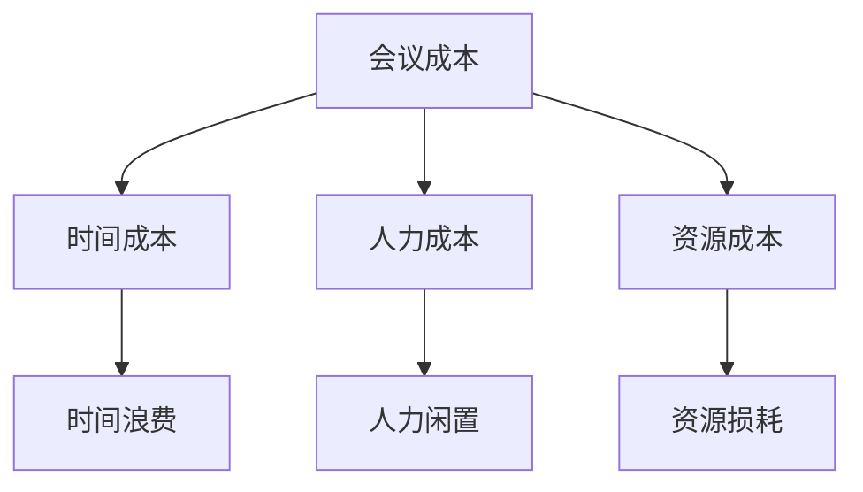

                 

### 文章标题：被你忽视的会议成本

### 关键词：会议成本、时间成本、人力成本、资源成本、优化策略、会议效率

### 摘要：

在现代企业的日常运作中，会议是一种常见的沟通方式。然而，许多企业忽视了会议所带来的潜在成本。本文将深入探讨会议成本的重要性，包括时间成本、人力成本和资源成本，并通过具体案例和分析工具，揭示忽视会议成本可能带来的负面影响。同时，本文还将提供一系列降低会议成本的策略，帮助企业和个人提高会议效率，实现资源的最优配置。

## 第一部分：认识会议成本

### 第1章：会议成本的重要性

会议是企业沟通与合作的重要途径，但同时也是一项需要投入资源的活动。会议成本包括时间成本、人力成本和资源成本三个方面。

### 核心概念与联系

会议成本的组成部分可以通过以下Mermaid流程图来展示：



### 时间成本分析

时间成本是会议成本的核心组成部分之一。通过以下伪代码，我们可以计算会议的时间成本：

```plaintext
function calculate_time_cost(meeting_duration, hourly_rate)
    cost = meeting_duration * hourly_rate
    return cost
end function
```

### 人力成本分析

人力成本是会议成本的另一个重要方面。以下伪代码展示了如何计算人力成本：

```plaintext
function calculate_human_cost(participants, participation_cost)
    cost = participants * participation_cost
    return cost
end function
```

### 资源成本分析

资源成本包括会议室租赁、设备使用、文档打印等。以下伪代码展示了如何计算资源成本：

```plaintext
function calculate_resource_cost(resources, resource_cost)
    cost = resources * resource_cost
    return cost
end function
```

### 忽视会议成本的后果

忽视会议成本可能会导致以下后果：

$$
Consequences = f(CostIgnored, EfficiencyLoss, DecisionQuality)
$$

其中，`CostIgnored`表示忽视的成本，`EfficiencyLoss`表示效率的损失，`DecisionQuality`表示决策质量的下降。

### 第2章：会议成本分析工具与方法

会议成本的分析需要一定的工具和方法。以下部分将介绍几种常用的分析工具和方法。

### 时间成本分析

时间成本分析是会议成本分析的基础。以下LaTeX公式展示了时间成本分析模型：

$$
TC = \sum_{i=1}^{n} (T_i \* P_i)
$$

其中，$T_i$表示第$i$个人的工作时间，$P_i$表示第$i$个人的工作效率。

### 人力成本分析

人力成本分析可以通过以下LaTeX公式来计算：

$$
HC = \sum_{i=1}^{n} (H_i \* C_i)
$$

其中，$H_i$表示第$i$个人的工作效率，$C_i$表示第$i$个人的工作成本。

### 资源成本分析

资源成本分析可以通过以下LaTeX公式来计算：

$$
RC = \sum_{i=1}^{m} (R_i \* R_i)
$$

其中，$R_i$表示第$i$项资源的使用量。

## 第二部分：降低会议成本的策略

### 第4章：优化会议流程

优化会议流程是降低会议成本的重要手段。以下部分将介绍如何通过优化会议流程来降低成本。

### 会议前准备

在会议前，需要进行充分的准备。这包括确定会议目标、邀请相关人员、准备会议资料等。

### 会议中管理

在会议中，需要有效管理会议进程。这包括控制会议时间、确保会议内容紧凑、鼓励参与等。

### 会议后跟进

在会议后，需要进行跟进工作。这包括整理会议记录、分配任务、跟进任务进度等。

### 第5章：提高会议效率

提高会议效率是降低会议成本的关键。以下部分将介绍如何提高会议效率。

### 精简会议内容

通过精简会议内容，可以避免会议的冗长和重复，从而提高效率。

### 避免会议拖延

会议拖延是降低会议效率的常见问题。通过合理安排会议时间和议程，可以避免会议拖延。

### 提升会议参与度

提升会议参与度可以确保会议的顺利进行，提高会议效率。

## 第三部分：实践与总结

### 第8章：会议成本管理实践

通过实践，我们可以更好地理解会议成本管理的方法和策略。以下部分将介绍具体的实践步骤和案例。

### 实践步骤

1. 分析现有会议流程，识别存在的问题。
2. 设定目标，制定优化方案。
3. 实施优化方案，监控效果。
4. 根据反馈进行调整。

### 实践案例

以下是一个实际案例，展示了如何通过优化会议流程来降低成本。

### 实践反思

在实践过程中，我们需要不断反思和调整，以实现更好的效果。

### 第9章：总结与展望

通过总结，我们可以认识到会议成本管理的重要性。在未来，随着技术的发展，会议成本管理将有更多的优化空间。

### 最佳实践 tips

以下是一些最佳实践，可以帮助你更好地管理会议成本。

### 小结

本文通过深入分析会议成本的各个方面，提出了降低会议成本的一系列策略。通过实践这些策略，企业和个人可以更好地管理会议成本，提高工作效率。

### 注意事项

在管理会议成本时，需要注意以下几点。

### 拓展阅读

如果你对会议成本管理感兴趣，以下是一些拓展阅读。

## 作者信息

作者：AI天才研究院/AI Genius Institute & 禅与计算机程序设计艺术 /Zen And The Art of Computer Programming

----------------------------------------------------------------

### 结论

通过本文，我们详细探讨了会议成本的重要性，并介绍了如何通过优化会议流程和提高会议效率来降低成本。我们通过实际案例和实践反思，展示了会议成本管理的方法和策略。希望本文能帮助读者更好地认识到会议成本的重要性，并在实践中运用这些策略，实现资源的最优配置。作者：AI天才研究院/AI Genius Institute & 禅与计算机程序设计艺术 /Zen And The Art of Computer Programming。感谢您的阅读！

