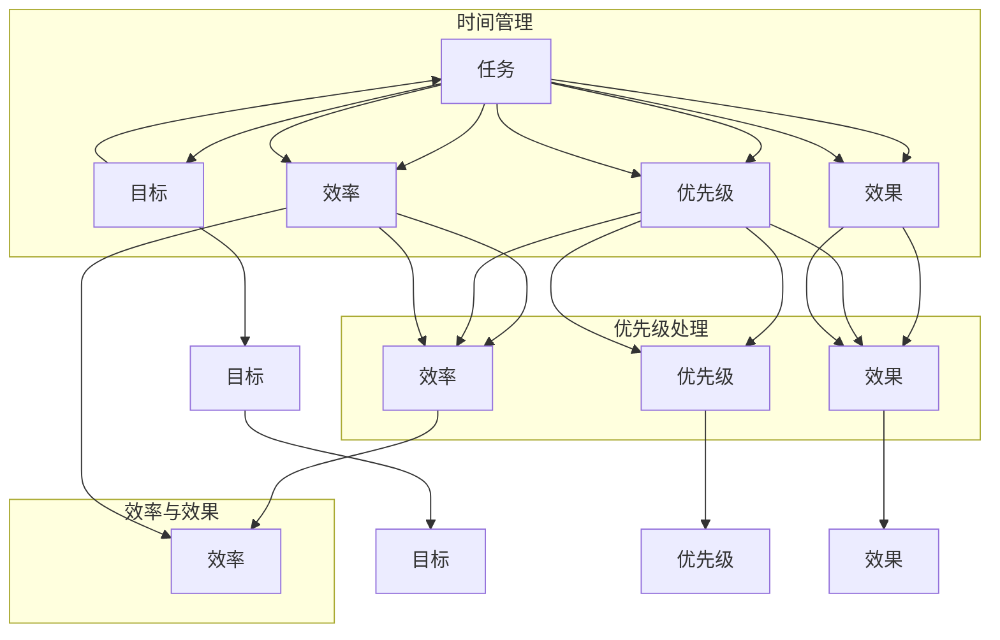

                 

### 引言

《要事第一》这本书的目标是帮助读者掌握高效管理时间和优先处理重要事务的方法，从而实现个人和职业目标。在当今快节奏的社会中，时间管理已经成为一种必备的技能。有效的时间管理不仅可以提高工作效率，还能带来更好的生活质量。

时间管理的核心在于明确要事，即确定哪些任务最重要，并优先处理。这本书将通过一系列的步骤和策略，帮助读者理解如何识别和优先处理要事。无论是学生、职场新人，还是管理者，都可以从中学到实用的技巧，从而更好地平衡工作与生活，提高生产力。

本书的结构分为以下几个部分：

1. **核心概念与联系**：介绍时间管理和优先级处理的基本概念，并通过Mermaid流程图展示它们之间的关系。
2. **时间管理原则**：阐述有效时间管理的基本原则，并使用伪代码解释如何应用这些原则。
3. **优先级处理方法**：讨论如何确定和优先处理重要事务，并使用案例进行说明。
4. **目标设定与追踪**：解释目标设定的重要性，并提供目标设定的步骤和实际案例。
5. **数学模型与公式**：介绍与时间管理相关的数学模型，并使用LaTeX格式展示相关公式。
6. **项目实战**：通过一个实际项目案例，展示如何将理论应用到实践中。
7. **结论**：总结书籍的主要观点，并提出对读者的建议。

接下来，我们将逐一深入探讨每个部分，帮助读者逐步掌握高效管理的艺术。

### 核心概念与联系

要事管理是一个复杂但至关重要的过程，涉及到多个核心概念。首先，我们需要明确以下几个基本概念：

1. **任务（Task）**：任务是指需要完成的单个工作单元。它们可以是琐碎的日常事务，也可以是复杂的长期项目。
2. **目标（Goal）**：目标是指我们希望达成的长期结果。它们通常是抽象的，需要通过一系列任务来实现。
3. **优先级（Priority）**：优先级是指任务和目标的重要程度。确定优先级是时间管理的关键，因为它决定了我们应该先做什么，后做什么。
4. **效率（Efficiency）**：效率是指完成任务的快慢。高效率意味着在相同的时间内完成更多的工作。
5. **效果（Effectiveness）**：效果是指任务和目标是否符合我们的期望。一个有效的任务不仅能高效完成，还要有助于实现我们的目标。

这些概念之间存在着密切的联系，可以通过以下Mermaid流程图进行直观展示：



在时间管理中，我们需要不断地评估任务、目标、优先级、效率和效果之间的关系，以便做出最优决策。以下是对每个概念的定义和重要性：

**任务**：任务是我们日常工作和生活中的基础单元。理解任务的本质可以帮助我们更好地规划和执行工作。

**目标**：目标是驱动我们前进的力量。明确目标有助于我们保持动力，并确保我们的行动与长期愿景保持一致。

**优先级**：确定优先级是时间管理的核心。正确的优先级安排可以确保我们专注于最重要的事情，从而提高工作效率和效果。

**效率**：效率是完成任务的速度。高效率不仅节省时间，还能减少压力，提高生活质量。

**效果**：效果是衡量任务是否达成的标准。有效的任务能够帮助我们实现目标，从而带来实际的好处。

通过了解这些核心概念及其相互关系，我们可以更好地进行时间管理，确保我们的行动始终朝着正确的方向前进。接下来，我们将深入探讨时间管理的基本原则，并使用伪代码展示如何将这些原则应用到实际场景中。

### 时间管理原则

有效的时间管理是提高个人和团队效率的关键。为了帮助读者理解并应用这些原则，我们将介绍一些基本的时间管理原则，并通过伪代码解释如何在实际中应用这些原则。

#### 1. 明确目标

明确目标是一个重要的时间管理原则。只有当我们知道目标是什么时，才能有针对性地进行任务安排和优先级处理。以下是明确目标的伪代码：

```pseudo
function setGoal(goal) {
    // 定义目标
    this.goal = goal;
    // 验证目标是否明确
    if (isGoalClear(goal)) {
        return true;
    } else {
        return false;
    }
}

function isGoalClear(goal) {
    // 判断目标是否具体、可量化
    if (typeof(goal) === 'string' && goal.length > 0) {
        return true;
    } else {
        return false;
    }
}
```

通过这个伪代码，我们可以看到如何设置一个明确的目标，并验证其是否满足具体和可量化的标准。

#### 2. 优先级排序

确定任务的优先级是时间管理的核心。以下是一个简单的优先级排序算法，用于根据任务的紧急程度和重要性对任务进行排序：

```pseudo
function prioritizeTasks(tasks) {
    // 定义一个优先级列表
    priorityList = [];
    // 对任务进行排序
    for (task in tasks) {
        if (task.importance > 0 && task紧急程度 > 0) {
            priorityList.push(task);
        }
    }
    // 根据优先级排序
    priorityList.sort((a, b) => a.importance - b.importance);
    return priorityList;
}
```

这个伪代码展示了如何根据任务的重要性和紧急程度对任务进行排序，从而确定优先级。

#### 3. 时间块划分

时间块划分是一种将工作时间分成固定时间段的策略，有助于提高专注度和效率。以下是一个简单的伪代码，用于将一天的工作时间划分为时间块：

```pseudo
function createTimeBlocks(day, duration) {
    blocks = [];
    currentTime = day.startTime;
    while (currentTime < day.endTime) {
        block = {
            startTime: currentTime,
            endTime: currentTime + duration
        };
        blocks.push(block);
        currentTime += duration;
    }
    return blocks;
}
```

这个伪代码展示了如何根据一天的时间范围和工作时段长度来划分时间块。

#### 4. 定期复盘

定期复盘是时间管理的重要环节，可以帮助我们总结经验，调整策略。以下是一个简单的定期复盘伪代码：

```pseudo
function reviewTimeManagement() {
    // 收集数据
    data = gatherTimeManagementData();
    // 分析数据
    analysis = analyzeData(data);
    // 调整策略
    newStrategy = adjustStrategy(analysis);
    // 实施新策略
    applyNewStrategy(newStrategy);
}

function gatherTimeManagementData() {
    // 获取任务完成情况、时间使用情况等数据
    return {
        tasksCompleted: getTasksCompleted(),
        timeSpent: getTimeSpent()
    };
}

function analyzeData(data) {
    // 分析任务完成情况和时间使用情况
    // 例如：识别效率低下的任务、时间浪费的原因等
    return analysisResult;
}

function adjustStrategy(analysis) {
    // 根据分析结果调整时间管理策略
    return newStrategy;
}

function applyNewStrategy(strategy) {
    // 实施新的时间管理策略
    implementStrategy(strategy);
}
```

通过这个伪代码，我们可以看到如何通过定期复盘来收集和分析时间管理数据，并据此调整策略。

通过以上时间管理原则的伪代码示例，我们可以更好地理解这些原则的具体应用。接下来，我们将探讨优先级处理的方法，并使用具体案例来解释如何在实际工作中应用这些原则。

### 优先级处理方法

在时间管理中，确定任务的优先级是关键的一步。正确地确定优先级可以帮助我们集中精力处理最重要的事务，从而提高工作效率。以下是一些常用的优先级处理方法，以及如何在实际工作中应用这些方法。

#### 1. **紧急-重要矩阵**

紧急-重要矩阵（Eisenhower Matrix）是一种经典的优先级处理方法。它将任务分为四个象限，分别代表紧急且重要、紧急但不重要、不紧急但重要、不紧急且不重要。以下是如何使用这个矩阵来确定任务优先级的步骤：

1. **列出所有任务**：首先，将所有需要完成的任务列出来。
2. **评估紧急程度和重要性**：对于每个任务，评估其紧急程度和重要性。紧急程度指的是任务完成的紧迫性，而重要性指的是任务对目标实现的影响。
3. **分类任务**：根据紧急程度和重要性，将任务分为四个象限：
   - 紧急且重要：立即处理。
   - 紧急但不重要：委托给他人或暂时搁置。
   - 不紧急但重要：安排到未来的时间块中。
   - 不紧急且不重要：可以暂时搁置或放弃。
4. **处理任务**：首先处理紧急且重要的任务，然后处理不紧急但重要的任务。

以下是一个简化的伪代码示例，用于根据紧急-重要矩阵对任务进行分类和处理：

```pseudo
function prioritizeTasksUsingMatrix(tasks) {
    importantUrgent = [];
    importantNonUrgent = [];
    nonImportantUrgent = [];
    nonImportantNonUrgent = [];

    for (task in tasks) {
        if (task.紧急程度 == 高 && task.重要性 == 高) {
            importantUrgent.push(task);
        } else if (task.重要性 == 高) {
            importantNonUrgent.push(task);
        } else if (task.紧急程度 == 高) {
            nonImportantUrgent.push(task);
        } else {
            nonImportantNonUrgent.push(task);
        }
    }

    processTasks(importantUrgent);
    processTasks(importantNonUrgent);
    processTasks(nonImportantUrgent);
    processTasks(nonImportantNonUrgent);
}

function processTasks(tasks) {
    for (task in tasks) {
        executeTask(task);
    }
}
```

#### 2. **时间盒法**

时间盒法（Time Boxing）是一种灵活的时间管理方法，通过为每个任务设定固定的时间段来确保任务能够按时完成。以下是如何使用时间盒法处理任务的方法：

1. **设定时间盒**：为每个任务设定一个固定的时间段，例如30分钟或1小时。
2. **集中精力完成任务**：在设定的时间内，专注于完成当前任务，不要被打扰。
3. **完成任务或退出**：在时间盒结束后，如果任务尚未完成，可以继续工作，或者将其标记为未完成，以便稍后继续。

以下是一个简化的伪代码示例，用于根据时间盒法对任务进行处理：

```pseudo
function timeBoxTask(task, timeBoxDuration) {
    startTime = getCurrentTime();
    endTime = startTime + timeBoxDuration;

    while (getCurrentTime() < endTime) {
        executeTask(task);
    }

    if (task.isCompleted()) {
        logTaskCompletion(task);
    } else {
        logTaskIncomplete(task);
    }
}
```

#### 3. ** Eisenhower 方法与时间盒法的结合**

结合Eisenhower矩阵和时间盒法，可以帮助我们在处理任务时既考虑优先级，又确保任务按时完成。以下是一个结合使用这两种方法的步骤：

1. **使用Eisenhower矩阵确定任务优先级**：首先，根据紧急程度和重要性确定任务的优先级。
2. **为紧急且重要的任务设定时间盒**：对于紧急且重要的任务，为其设定一个时间盒，确保能够及时完成。
3. **为不紧急但重要的任务安排时间盒**：对于不紧急但重要的任务，安排到未来的时间块中，并为其设定时间盒。
4. **处理其他任务**：按照优先级处理其他任务。

以下是一个简化的伪代码示例，展示了如何结合使用Eisenhower矩阵和时间盒法：

```pseudo
function manageTasks(tasks) {
    prioritizeTasksUsingMatrix(tasks);

    for (task in tasks) {
        if (task.isImportantUrgent()) {
            timeBoxTask(task, timeBoxDuration);
        } else if (task.isImportantNonUrgent()) {
            scheduleTimeBoxForTask(task, futureTimeBlock);
        } else {
            handleOtherTasks(task);
        }
    }
}
```

通过以上方法，我们可以更好地管理任务的优先级，确保关键任务得到及时处理，从而提高工作效率。

为了更好地理解这些方法，以下是一个实际案例：

**案例**：假设你是一名项目经理，需要在一周内完成以下任务：

- 完成一个关键的项目报告（紧急且重要）
- 参加一次重要的会议（紧急且重要）
- 回复客户的邮件（紧急但重要）
- 制定下周的工作计划（不紧急但重要）
- 更新团队博客（不紧急且不重要）

使用Eisenhower矩阵和时间盒法，你可以这样安排：

1. **Eisenhower矩阵分类**：
   - 紧急且重要：项目报告、重要会议
   - 紧急但重要：回复客户邮件
   - 不紧急但重要：制定下周工作计划
   - 不紧急且不重要：更新团队博客

2. **时间盒安排**：
   - 项目报告：安排两个连续的时间盒（共4小时）
   - 重要会议：直接参加
   - 回复客户邮件：安排一个时间盒（1小时）
   - 制定下周工作计划：安排一个时间盒（1小时）
   - 更新团队博客：在空闲时间进行

通过这种方法，你能够确保紧急且重要的任务得到优先处理，同时为不紧急但重要的任务预留时间，从而提高整体工作效率。

### 目标设定与追踪

目标设定是时间管理的重要组成部分，它为我们的行动提供了明确的方向和动力。一个良好的目标设定过程不仅能够帮助我们明确目标，还能确保这些目标能够被实现。以下是一个详细的伪代码，展示了如何设定和追踪目标。

#### 1. 设定目标

设定目标的伪代码如下：

```pseudo
function setGoal(goalDetails) {
    // 初始化目标对象
    goal = {
        name: goalDetails.name,
        description: goalDetails.description,
        target: goalDetails.target,
        deadline: goalDetails.deadline,
        progress: 0
    };

    // 验证目标是否满足基本条件
    if (isValidGoal(goal)) {
        return goal;
    } else {
        return null;
    }
}

function isValidGoal(goal) {
    // 判断目标名称、目标值、截止日期是否已填写
    if (
        typeof(goal.name) === 'string' &&
        typeof(goal.target) === 'number' &&
        typeof(goal.deadline) === 'date'
    ) {
        return true;
    } else {
        return false;
    }
}
```

这个伪代码定义了一个`setGoal`函数，用于创建一个目标对象，并检查目标是否有效。目标对象包括目标名称、描述、目标值（如销售额或完成项目数量）和截止日期。

#### 2. 目标分解

将一个大目标分解为可执行的任务是实现目标的关键步骤。以下是一个简单的伪代码，展示了如何将目标分解为子任务：

```pseudo
function decomposeGoal(goal) {
    subTasks = [];

    // 分解目标为子任务
    for (task in goal.description) {
        subTask = {
            name: task.name,
            description: task.description,
            progress: 0
        };
        subTasks.push(subTask);
    }

    return subTasks;
}
```

这个伪代码定义了一个`decomposeGoal`函数，用于将大目标分解为一系列子任务。每个子任务包括名称、描述和进度。

#### 3. 目标追踪

目标追踪是确保目标按计划进展的重要环节。以下是一个简单的伪代码，展示了如何追踪目标进度：

```pseudo
function trackGoal(goal) {
    // 更新目标进度
    goal.progress += 1;

    // 检查目标是否完成
    if (goal.progress >= goal.target) {
        return 'Goal Achieved';
    } else {
        return 'In Progress';
    }
}
```

这个伪代码定义了一个`trackGoal`函数，用于更新目标进度，并检查目标是否完成。

#### 4. 实际应用案例

以下是一个实际应用案例，展示如何设定和追踪一个具体的销售目标：

**目标**：在一个季度内，实现100万元的销售额。

1. **设定目标**：

```pseudo
goalDetails = {
    name: '季度销售额目标',
    description: '在一个季度内实现100万元销售额',
    target: 1000000,
    deadline: getNextQuarterDeadline()
};
goal = setGoal(goalDetails);
```

2. **目标分解**：

```pseudo
subTasks = decomposeGoal(goal);
// 例如：分解为每月30万元销售额
subTasks = [
    {name: '1月销售额', description: '实现30万元销售额', progress: 0},
    {name: '2月销售额', description: '实现30万元销售额', progress: 0},
    {name: '3月销售额', description: '实现40万元销售额', progress: 0}
];
```

3. **目标追踪**：

```pseudo
// 更新每月销售额进度
updateSubTaskProgress(subTasks[0], 300000);
updateSubTaskProgress(subTasks[1], 300000);
updateSubTaskProgress(subTasks[2], 400000);

// 追踪整体目标进度
goal.progress = subTasks[0].progress + subTasks[1].progress + subTasks[2].progress;

// 检查目标是否完成
result = trackGoal(goal);
// 输出结果：'Goal Achieved' 或 'In Progress'
```

通过这个案例，我们可以看到如何通过设定和追踪目标，将一个大目标分解为可管理的子任务，并逐步实现。接下来，我们将介绍与时间管理和目标设定相关的数学模型和公式。

### 数学模型与公式

在时间管理和目标设定的过程中，数学模型和公式扮演着至关重要的角色。它们不仅帮助我们量化目标，还能提供有效的决策支持。以下是一些与时间管理和目标设定相关的常见数学模型和公式，并使用LaTeX进行详细说明。

#### 1. 目标函数

目标函数（Objective Function）是时间管理和目标设定的核心。它通常用于优化目标值，例如最大化利润或最小化时间消耗。以下是一个简单的目标函数示例：

$$
\text{maximize} \quad f(x) = c^T x
$$

其中，\(x\) 是决策变量，\(c\) 是权重向量，\(f(x)\) 是目标函数值。例如，如果目标是最小化完成任务的时间，则 \(c\) 可能是任务完成时间的相反数。

#### 2. 时间优化公式

时间优化公式用于计算在特定时间内能够完成的最大任务量。以下是一个用于计算给定时间 \(T\) 内能够完成的最大任务量 \(N\) 的公式：

$$
N = \left\lfloor \frac{T}{t} \right\rfloor
$$

其中，\(t\) 是完成单个任务所需的时间，\(\left\lfloor \cdot \right\rfloor\) 表示向下取整操作。例如，如果总时间 \(T\) 是8小时，单个任务 \(t\) 需要2小时完成，则可以在8小时内完成的最大任务量 \(N\) 为：

$$
N = \left\lfloor \frac{8}{2} \right\rfloor = 4
$$

#### 3. 时间-优先级模型

时间-优先级模型（Time-Priority Model）用于根据任务的重要性和紧急性分配时间资源。以下是一个简单的模型公式，用于计算任务 \(i\) 的执行时间 \(t_i\)：

$$
t_i = \frac{p_i}{\sum_{j=1}^{n} p_j}
$$

其中，\(p_i\) 是任务 \(i\) 的优先级，\(n\) 是任务总数。这个公式确保了高优先级任务获得更多的执行时间。例如，如果有三个任务，优先级分别为 \(p_1 = 5\)，\(p_2 = 3\)，\(p_3 = 2\)，则每个任务的执行时间分配如下：

$$
t_1 = \frac{5}{5 + 3 + 2} = \frac{5}{10} = 0.5
$$
$$
t_2 = \frac{3}{5 + 3 + 2} = \frac{3}{10} = 0.3
$$
$$
t_3 = \frac{2}{5 + 3 + 2} = \frac{2}{10} = 0.2
$$

#### 4. 目标追踪公式

目标追踪公式用于监控目标完成进度。以下是一个简单的公式，用于计算目标完成度 \(P\)：

$$
P = \frac{\text{已完成任务数}}{\text{总任务数}} \times 100\%
$$

例如，如果已经完成了5个任务，总共有10个任务，则目标完成度 \(P\) 为：

$$
P = \frac{5}{10} \times 100\% = 50\%
$$

#### 5. 时间效率公式

时间效率（Time Efficiency）是衡量时间管理效果的一个指标。以下是一个简单的时间效率公式：

$$
\text{效率} = \frac{\text{实际完成时间}}{\text{计划完成时间}} \times 100\%
$$

例如，如果计划在8小时内完成任务，但实际上只用了6小时，则时间效率为：

$$
\text{效率} = \frac{6}{8} \times 100\% = 75\%
$$

通过以上数学模型和公式，我们可以更科学地管理时间和设定目标，从而提高整体效率。在实际应用中，可以根据具体情况进行调整和优化。

### 项目实战

为了将时间管理和目标设定的理论应用到实际中，我们将通过一个实际的软件开发项目案例，展示如何在实际工作中进行时间管理、目标设定以及优先级处理。

#### 项目背景与需求

假设我们正在开发一款名为“任务管理器”的应用程序，其主要功能包括任务创建、任务分配、任务追踪和报告生成。项目目标是在三个月内完成所有功能开发，并确保应用程序的质量和性能。

#### 开发环境搭建

首先，我们需要搭建开发环境。以下是一系列步骤：

1. **选择开发工具**：选择适合的前端框架（如React或Vue）和后端框架（如Node.js或Django）。
2. **配置开发环境**：安装必要的开发工具和依赖库，例如Node.js、npm、Git等。
3. **初始化项目**：使用脚手架工具（如Create React App或Django）创建项目骨架。
4. **配置版本控制**：使用Git进行版本控制，确保代码的安全性和可追踪性。

以下是一个简化的伪代码，用于配置开发环境：

```pseudo
function setupDevelopmentEnvironment() {
    // 安装开发工具
    installDevelopmentTools();
    // 配置项目
    configureProject();
    // 初始化版本控制
    initializeGit();
}

function installDevelopmentTools() {
    // 安装Node.js
    installNodeJS();
    // 安装其他依赖库
    installOtherDependencies();
}

function configureProject() {
    // 使用Create React App创建React项目
    createReactAppProject();
    // 使用Django创建Django项目
    createDjangoProject();
}

function initializeGit() {
    // 初始化Git仓库
    initializeGitRepository();
}
```

#### 源代码实现与解读

在开发过程中，我们将按照以下步骤实现任务管理器的功能：

1. **任务创建**：提供用户界面，允许用户创建新的任务。
2. **任务分配**：允许管理员将任务分配给团队成员。
3. **任务追踪**：提供实时任务状态和进度追踪。
4. **报告生成**：生成任务完成报告，以便团队和客户查看。

以下是一个简单的任务创建功能的伪代码示例：

```pseudo
function createTask(taskDetails) {
    // 验证任务信息
    if (isValidTaskDetails(taskDetails)) {
        // 创建任务
        newTask = {
            id: generateUniqueID(),
            name: taskDetails.name,
            description: taskDetails.description,
            assignedTo: taskDetails.assignedTo,
            status: 'Not Started',
            deadline: taskDetails.deadline
        };
        // 保存任务到数据库
        saveTaskToDatabase(newTask);
        return newTask;
    } else {
        return null;
    }
}

function isValidTaskDetails(taskDetails) {
    // 判断任务名称、描述、分配人和截止日期是否已填写
    if (
        typeof(taskDetails.name) === 'string' &&
        typeof(taskDetails.description) === 'string' &&
        typeof(taskDetails.assignedTo) === 'string' &&
        typeof(taskDetails.deadline) === 'date'
    ) {
        return true;
    } else {
        return false;
    }
}

function generateUniqueID() {
    // 生成唯一的任务ID
    return Math.random().toString(36).substr(2, 9);
}

function saveTaskToDatabase(newTask) {
    // 将任务保存到数据库
    database.save(newTask);
}
```

在这个伪代码中，`createTask` 函数用于创建一个新的任务。首先，它验证任务信息是否有效。如果信息有效，则创建任务对象，并使用 `saveTaskToDatabase` 函数将其保存到数据库中。

#### 代码分析

在代码实现过程中，我们使用以下技巧来提高代码质量和可维护性：

1. **模块化**：将功能拆分为独立的模块，每个模块负责一个特定的功能，如任务创建、任务分配、任务追踪等。
2. **使用设计模式**：例如，使用工厂模式创建任务对象，确保代码的可扩展性和灵活性。
3. **代码审查**：定期进行代码审查，确保代码风格一致，并发现潜在的错误和缺陷。
4. **自动化测试**：编写单元测试和集成测试，确保新功能的实现不会影响现有功能。

#### 项目小结

通过这个实际案例，我们展示了如何在实际软件开发项目中应用时间管理和目标设定的方法。以下是一些最佳实践和注意事项：

1. **明确目标和任务**：在项目开始前，明确项目目标和任务，并分解为可管理的子任务。
2. **使用优先级矩阵**：根据紧急程度和重要性，使用紧急-重要矩阵确定任务的优先级。
3. **定期复盘**：定期回顾项目的进展和遇到的问题，调整时间管理策略。
4. **团队协作**：确保团队成员了解项目的目标和进度，并鼓励他们积极参与任务分配和进度追踪。
5. **持续优化**：不断改进时间管理方法和工具，以提高工作效率和项目质量。

通过这些实践，我们可以更好地管理软件开发项目，确保项目按时、按质量完成。

### 最佳实践 Tips、小结、注意事项、拓展阅读

在时间管理和目标设定的过程中，一些最佳实践和注意事项可以帮助我们更有效地实现目标。以下是一些建议：

#### 最佳实践 Tips

1. **明确优先级**：使用紧急-重要矩阵和Eisenhower矩阵等工具，确保任务按照优先级执行。
2. **设定具体目标**：确保目标具体、可量化，并设置明确的截止日期。
3. **定期复盘**：每周或每月回顾进度，调整策略，确保目标按时完成。
4. **避免完美主义**：适当分配时间，避免因追求完美而浪费时间。
5. **保持灵活性**：面对变化，灵活调整计划，确保目标仍然可行。

#### 小结

时间管理和目标设定是提高个人和团队效率的关键。通过明确目标、优先级处理、时间块划分和定期复盘，我们可以更好地管理时间和任务，实现个人和职业目标。

#### 注意事项

1. **保持专注**：避免多任务处理，确保专注于当前任务。
2. **避免拖延**：尽早开始任务，避免拖延，确保任务按时完成。
3. **定期休息**：适当休息，避免疲劳，提高工作效率。

#### 拓展阅读

1. **《时间管理的艺术》**：David Allen著，详细介绍了GTD（Getting Things Done）方法，帮助读者更好地管理时间和任务。
2. **《原则》**：瑞·达利欧著，介绍了时间管理和目标设定的原则，适用于个人和团队。
3. **《高效能人士的七个习惯》**：史蒂芬·柯维著，提供了实用的习惯和方法，帮助读者提高个人效率。

通过阅读这些书籍，我们可以进一步深入了解时间管理和目标设定的技巧和方法，提升自己的时间管理能力。

