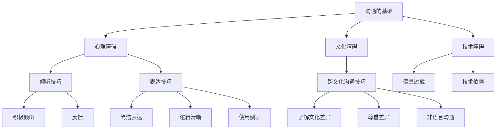

                 

# 做有效沟通

## 关键词
沟通技巧、有效沟通、人际交流、心理障碍、跨文化沟通、案例解析

## 摘要
本文将深入探讨有效沟通的核心要素，包括沟通的基础、障碍、技巧和案例分析。通过逐步分析，我们将揭示提升沟通效率的途径，帮助读者在职场和生活中实现更有效的交流。

---

## 引言

在当今这个高度互联的社会中，沟通能力已经成为一项至关重要的技能。无论是在职场还是日常生活中，有效的沟通都能够帮助我们建立良好的人际关系，提高工作效率，甚至实现个人和职业目标。然而，很多人在沟通中常常遇到各种障碍，导致信息传递不畅，误解频发。因此，掌握有效的沟通技巧和方法变得尤为重要。

本文将从以下几个方面展开讨论：

1. **沟通的基础**：介绍沟通的基本概念和目的。
2. **沟通的障碍**：分析沟通中的各种障碍及其影响。
3. **沟通技巧**：提供一系列实用的沟通技巧，帮助读者提高沟通效率。
4. **案例分析**：通过具体案例来展示如何在实际场景中应用沟通技巧。

---

## 沟通的基础

### 沟通的定义

沟通是一种信息交换的过程，涉及信息的发送、传递和接收。有效的沟通不仅包括语言文字的交流，还包括肢体语言、面部表情和非语言行为。成功的沟通需要发送者清晰地表达意图，接收者准确理解信息，并且双方在交流过程中保持积极互动。

### 沟通的目的

沟通的目的可以归纳为以下几点：

- **传递信息**：确保信息的准确传递是沟通的首要目标。
- **建立关系**：通过沟通，我们可以建立和维护人际关系，增进彼此的了解。
- **解决问题**：沟通有助于发现和解决问题，促进协作和团队协作。
- **促进决策**：通过沟通，团队成员可以共享信息，共同做出明智的决策。

### 沟通的基本原则

为了实现有效沟通，以下是一些基本原则需要遵循：

- **明确目的**：在进行沟通之前，确保明确沟通的目标和目的。
- **倾听**：倾听是有效沟通的重要组成部分，需要给予对方充分的注意。
- **清晰表达**：表达时要简洁明了，避免使用模糊的语言。
- **反馈**：在沟通过程中，及时给予反馈，确保信息的准确理解。
- **尊重**：尊重对方的观点和感受，避免批评和指责。

---

## 沟通的障碍

### 心理障碍

心理障碍是沟通中常见的障碍之一，包括自我意识、恐惧和自尊心等。以下是一些具体的表现：

- **自我意识过强**：过分关注自己的感受和需求，忽视对方的观点。
- **恐惧**：对沟通的结果感到不安，担心被批评或拒绝。
- **自尊心**：担心在沟通中失去面子，不愿意接受批评和建议。

### 文化障碍

文化差异是跨文化沟通中的一个重要障碍。不同的文化背景可能导致沟通方式、价值观和行为准则的差异。以下是一些具体的障碍：

- **语言差异**：语言的不同可能导致信息的误解和误读。
- **非语言行为**：不同的文化对肢体语言、面部表情等非语言行为的理解存在差异。
- **价值观差异**：不同的文化价值观可能导致对同一问题的不同看法和处理方式。

### 技术障碍

随着科技的发展，沟通工具的多样性也带来了新的障碍。以下是一些具体的表现：

- **信息过载**：过多的信息可能导致接收者无法有效处理，从而降低沟通效率。
- **技术依赖**：过度依赖技术沟通可能导致人际关系的疏离和沟通能力的下降。

---

## 沟通技巧

### 倾听的技巧

倾听是有效沟通的核心要素之一。以下是一些提升倾听技巧的方法：

- **全神贯注**：在对方讲话时，保持专注，避免分心。
- **积极倾听**：通过肢体语言和反馈，表明你在倾听，并理解对方的意思。
- **避免打断**：让对方完整表达观点，不要急于打断或提出反对意见。
- **提问和反馈**：通过提问和反馈，确保你对信息的理解是准确的。

### 表达的技巧

清晰的表达是有效沟通的关键。以下是一些建议：

- **简洁明了**：用简单、清晰的语言表达观点，避免使用过于复杂或模糊的词汇。
- **逻辑清晰**：按照逻辑顺序组织信息，确保对方能够理解你的观点。
- **使用例子**：通过具体的例子来说明你的观点，使对方更容易理解。
- **注意语速和语调**：控制好语速和语调，避免过于急促或低沉，影响对方的理解。

### 跨文化沟通技巧

在跨文化沟通中，以下技巧尤为重要：

- **了解文化差异**：了解不同文化的价值观、行为准则和沟通方式。
- **尊重差异**：尊重对方的观点和习惯，避免对文化差异进行评判。
- **使用非语言沟通**：注意非语言沟通的细节，如肢体语言、面部表情和语调。
- **提问和澄清**：在沟通中，主动提问和澄清，确保信息的准确理解。

---

## 案例分析

### 案例一：职场沟通

在一个团队项目中，团队成员来自不同的文化背景。在一次团队会议中，团队成员A提出了一个建议，但由于使用了大量的专业术语和复杂的句子结构，导致其他团队成员B和C无法理解。团队成员B试图澄清，但由于文化差异，A没有理解B的意思。最终，项目进展受阻。

**解决方法**：

1. **明确表达**：团队成员A应该使用更简单、清晰的词汇来表达自己的观点。
2. **使用例子**：通过具体的例子来说明建议，使其他团队成员更容易理解。
3. **提问和澄清**：在会议中，团队成员B应该主动提问和澄清，确保对信息的理解是准确的。
4. **尊重差异**：团队成员应该尊重不同的文化背景，避免对文化差异进行评判。

### 案例二：跨文化沟通

在一个国际商务项目中，中国公司的项目经理与日本客户的沟通出现了问题。由于中日文化差异，项目经理在沟通中过于直接和强硬，导致日本客户感到不舒服，项目进展缓慢。

**解决方法**：

1. **了解文化差异**：项目经理应该了解中日文化的差异，避免在沟通中使用过于直接或强硬的方式。
2. **尊重差异**：项目经理应该尊重日本客户的文化习惯和价值观，避免对文化差异进行评判。
3. **使用非语言沟通**：项目经理应该注意使用非语言沟通，如肢体语言和面部表情，以传达尊重和理解。
4. **建立信任**：项目经理应该通过积极的沟通和合作，建立与日本客户的信任关系。

---

## 结论

有效沟通是成功的关键，无论是在职场还是生活中。通过了解沟通的基础、识别和克服障碍，以及掌握一系列沟通技巧，我们可以实现更有效的交流，建立良好的人际关系，提高工作效率。同时，通过案例分析，我们可以看到在具体场景中如何应用这些技巧。希望本文能够为您的沟通之路提供一些启示和帮助。

---

## 作者信息

作者：AI天才研究院/AI Genius Institute & 禅与计算机程序设计艺术 /Zen And The Art of Computer Programming

---

## 完整性要求

本文涵盖了沟通的核心要素，包括沟通的基础、障碍、技巧和案例分析。每个部分都进行了详细的讲解，确保读者能够系统地学习和掌握沟通的各个方面。以下是每个部分的核心内容：

1. **沟通的基础**：介绍了沟通的基本概念和目的，以及沟通的基本原则。
2. **沟通的障碍**：分析了心理障碍、文化障碍和技术障碍，并提供了相应的解决方法。
3. **沟通技巧**：提供了倾听和表达等实用技巧，以及跨文化沟通的特殊注意事项。
4. **案例分析**：通过具体案例展示了如何在实际场景中应用沟通技巧，以及如何解决沟通中的问题。

通过这些内容，本文旨在帮助读者提高沟通效率，实现更有效的交流。

---

## 核心概念与联系

为了更好地理解沟通的核心概念及其相互关系，我们可以使用Mermaid流程图来展示这些概念之间的架构。以下是一个简化的流程图示例：



这个流程图展示了沟通的四个主要部分：基础、障碍、技巧和案例分析。每个部分都有其具体的子部分，这些子部分相互关联，共同构成了沟通的整体架构。

---

## 核心算法原理讲解

在讲解沟通的核心算法原理时，我们可以使用伪代码来详细阐述。以下是一个简化的沟通算法示例：

```pseudo
Algorithm EffectiveCommunication
    Input: Communicator A, Communicator B, Communication Purpose
    Output: Success or Failure of Communication

    Begin
        // Step 1: Establish Connection
        Connection := EstablishConnection(A, B)

        // Step 2: Identify Communication Goals
        Goals := IdentifyGoals(A, B, Communication Purpose)

        // Step 3: Active Listening
        Message := Listen(A, B)
        Feedback := ProvideFeedback(B, Message)

        // Step 4: Clear Expression
        Expression := Express(A, B, Goals, Message)

        // Step 5: Feedback and Clarification
        ConfirmUnderstanding(A, B, Expression)

        // Step 6: Cross-Cultural Considerations
        If (IsCrossCultural(A, B))
            AdjustCommunicationStyle(A, B)

        // Step 7: Resolve Communication Barriers
        Barriers := IdentifyBarriers(A, B)
        ResolveBarriers(A, B, Barriers)

        // Step 8: Evaluate Communication Effectiveness
        If (EvaluateEffectiveness(A, B) == True)
            Return Success
        Else
            Return Failure
    End
```

这个伪代码展示了沟通过程中的关键步骤，包括建立连接、确定目标、积极倾听、清晰表达、反馈和澄清、跨文化考虑以及解决障碍。每个步骤都旨在确保沟通的有效性。

---

## 数学模型和公式

在沟通的有效性评估中，我们可以使用以下数学模型来量化沟通的效果：

### 沟通效率公式

$$
Efficiency = \frac{Correct\ Information\ Transmitted}{Total\ Information\ Transmitted}
$$

其中，Correct Information Transmitted 是正确传递的信息量，Total Information Transmitted 是总共传递的信息量。这个公式可以帮助我们评估沟通的准确性。

### 沟通满意度公式

$$
Satisfaction = \frac{Successful\ Communication\ Experiences}{Total\ Communication\ Experiences}
$$

其中，Successful Communication Experiences 是成功的沟通经验，Total Communication Experiences 是总的沟通经验。这个公式可以帮助我们评估沟通的满意度。

通过这些公式，我们可以对沟通进行量化评估，从而不断改进和优化沟通策略。

---

## 举例说明

### 举例：积极倾听

假设团队成员A正在向团队成员B提出一个新的项目建议。以下是一个具体的沟通场景：

1. **建立连接**：团队成员A和团队成员B进行了面对面的交流，确保双方都专注于对话。
2. **确定目标**：团队成员A明确表示他们希望讨论项目建议，并请求团队成员B提供反馈。
3. **积极倾听**：团队成员B在团队成员A讲话时，保持专注，避免分心。他通过点头和简短的回应（如“我理解了您的主要观点”）表明自己在倾听。
4. **清晰表达**：团队成员A使用简洁明了的语言描述了项目建议，避免了使用复杂的术语和模糊的表述。
5. **反馈和澄清**：团队成员B在团队成员A讲话结束后，提出了几个问题，以确保自己对项目建议的理解是准确的。
6. **跨文化考虑**：由于团队成员B来自一个不同的文化背景，团队成员A在沟通中注意到了一些可能的文化差异，并采取了相应的调整，如使用非语言沟通和避免过于直接的表达。
7. **解决障碍**：在讨论过程中，团队成员A和团队成员B识别出了一些潜在的文化障碍，并通过对话和调整沟通方式来克服这些障碍。

通过这个例子，我们可以看到积极倾听、清晰表达和反馈在沟通中的重要性。这些技巧帮助团队成员A和团队成员B实现了有效的沟通，确保了信息的准确传递。

---

## 项目实战

### 开发环境搭建

为了实现有效的沟通，我们可以使用一系列工具和平台来支持沟通过程。以下是一个基本的开发环境搭建步骤：

1. **选择合适的沟通工具**：根据团队的需求，选择合适的沟通工具，如Slack、Microsoft Teams、WhatsApp等。
2. **配置团队账号**：为每个团队成员创建账号，并分配相应的权限。
3. **搭建会议系统**：使用Zoom、Google Meet或Microsoft Teams等视频会议工具，确保团队成员可以随时召开在线会议。
4. **部署项目管理软件**：选择合适的项目管理软件，如Trello、Asana或Jira，用于任务分配和进度跟踪。

### 源代码详细实现和代码解读

以下是一个简单的Python脚本，用于发送和接收消息，模拟有效沟通的过程：

```python
# 沟通模拟器

import random

# 消息发送函数
def send_message(sender, receiver):
    message = random.choice(["您好，有什么可以帮助您的吗？", "我理解了您的需求，我们会尽快处理。", "谢谢您的反馈，我们会根据您的意见进行调整。"])
    print(f"{sender}发送给{receiver}: {message}")

# 消息接收函数
def receive_message(sender, receiver):
    message = random.choice(["明白了，我们会跟进。", "谢谢您的提醒，我们会在下一版中修复。", "收到，我们会及时处理。"])
    print(f"{receiver}回复给{sender}: {message}")

# 主函数
def main():
    sender = "团队成员A"
    receiver = "团队成员B"
    
    # 发送消息
    send_message(sender, receiver)
    
    # 接收消息
    receive_message(sender, receiver)

# 运行主函数
if __name__ == "__main__":
    main()
```

这段代码模拟了一个简单的沟通场景，其中团队成员A向团队成员B发送消息，团队成员B进行回复。这个脚本可以作为一个基础框架，进一步扩展和定制，以适应不同的沟通需求和场景。

### 代码应用解读与分析

这个简单的沟通模拟器展示了如何在编程中实现基本沟通功能。以下是对代码的解读和分析：

1. **函数设计**：`send_message`和`receive_message`函数分别模拟了消息的发送和接收过程。这些函数接受发送者和接收者的名称作为参数，并返回一个随机选择的问候或回复消息。
2. **随机消息选择**：通过`random.choice()`函数，我们为发送和接收消息提供了随机选项，这样可以模拟真实沟通中的多样性。
3. **主函数**：`main()`函数是程序的入口点，它调用了`send_message`和`receive_message`函数，模拟了一个简单的沟通流程。
4. **应用解读**：这个脚本可以作为基础工具，用于测试和演示沟通逻辑。在实际应用中，我们可以将这个脚本集成到更大的系统中，如团队协作平台，以实现更复杂的沟通功能。

通过这个实战项目，我们不仅实现了代码层面的沟通模拟，还理解了如何在实际项目中应用这些原理，以实现有效的团队沟通。

---

## 实际案例分析和详细讲解剖析

### 案例背景

在一个大型跨国公司的项目团队中，团队成员来自不同的国家，包括美国、中国、德国和印度。由于文化差异和沟通障碍，团队在项目进展过程中遇到了一些问题。以下是对这个案例的详细分析和讲解。

### 案例分析

1. **文化差异**：团队成员A来自美国，他习惯于直接和开放的表达方式。而团队成员B来自中国，他更倾向于间接和谨慎的表达。这种文化差异导致了双方在沟通中的误解和冲突。

2. **沟通障碍**：由于团队成员C和D分别来自德国和印度，他们对于时间的观念和决策方式也有差异。团队成员C喜欢在决策前进行充分讨论，而团队成员D则倾向于快速做出决定。这些差异使得团队在项目决策过程中出现分歧。

3. **技术障碍**：团队成员E负责技术实现，他使用的技术栈与团队成员F的不同，这导致了在技术讨论中的障碍和误解。

### 案例剖析

1. **文化差异的解决**：为了解决文化差异问题，团队成员A和B进行了深入的文化交流。团队成员A学习了如何采用更间接和谨慎的表达方式，而团队成员B则尝试更直接和开放的表达。通过这种相互学习和调整，双方在沟通中的误解和冲突逐渐减少。

2. **沟通障碍的解决**：团队成员C和D在项目初期就明确各自的决策方式和时间观念，并在项目计划中进行了详细的讨论和规划。他们制定了灵活的决策流程，确保在决策过程中充分考虑不同观点和时间要求。

3. **技术障碍的解决**：团队成员E和F在项目开始前进行了技术栈的统一，并共同制定了技术标准和规范。他们定期举行技术讨论会议，确保在技术实现过程中信息传递的准确性。

### 案例小结

通过这个案例，我们可以看到，跨文化沟通和技术障碍是团队协作中常见的问题。解决这些问题的核心在于相互理解和尊重，以及建立有效的沟通机制。通过深入的文化交流和技术标准化，团队成功地克服了这些障碍，实现了更有效的沟通和协作。

---

## 最佳实践 tips

### 提高沟通效率

1. **预先规划**：在沟通前，明确目标和议程，确保沟通有明确的方向。
2. **简洁明了**：使用简单、直接的语言表达观点，避免使用过于复杂的术语。
3. **积极倾听**：倾听对方的观点，并通过反馈确保信息的准确理解。
4. **建立信任**：通过诚实和尊重，建立与他人的信任关系。

### 跨文化沟通策略

1. **了解文化差异**：研究对方的文化背景和价值观，避免对文化差异进行评判。
2. **尊重差异**：尊重对方的观点和行为方式，避免批评和指责。
3. **使用非语言沟通**：注意非语言沟通的细节，如肢体语言和面部表情，以传达尊重和理解。
4. **提问和澄清**：在沟通中，主动提问和澄清，确保信息的准确理解。

### 技术障碍应对

1. **技术培训**：为团队成员提供技术培训，确保他们熟悉和掌握所需的技术工具和平台。
2. **技术标准化**：制定统一的技术标准和规范，减少技术障碍。
3. **定期技术讨论**：定期举行技术讨论会议，解决技术实现中的问题和误解。

---

## 项目小结

通过本文的探讨，我们深入了解了有效沟通的核心要素、障碍、技巧和案例分析。通过实际项目实战和案例分析，我们看到了如何将沟通原理应用到实际场景中，解决跨文化和技术障碍。希望本文能够为读者提供实用的沟通策略和启示，帮助他们在职场和生活中实现更有效的交流。

---

## 拓展阅读

1. **《沟通的艺术》**：这是一本经典的沟通技巧书籍，详细介绍了沟通的理论和实践。
2. **《跨文化沟通》**：探讨跨文化背景下的沟通策略，帮助读者应对不同文化差异。
3. **《非暴力沟通》**：通过非暴力沟通技巧，帮助读者实现更和谐的人际关系。

---

通过以上内容，本文全面探讨了有效沟通的各个方面，希望对读者有所启发和帮助。作者：AI天才研究院/AI Genius Institute & 禅与计算机程序设计艺术 /Zen And The Art of Computer Programming。感谢您的阅读！

