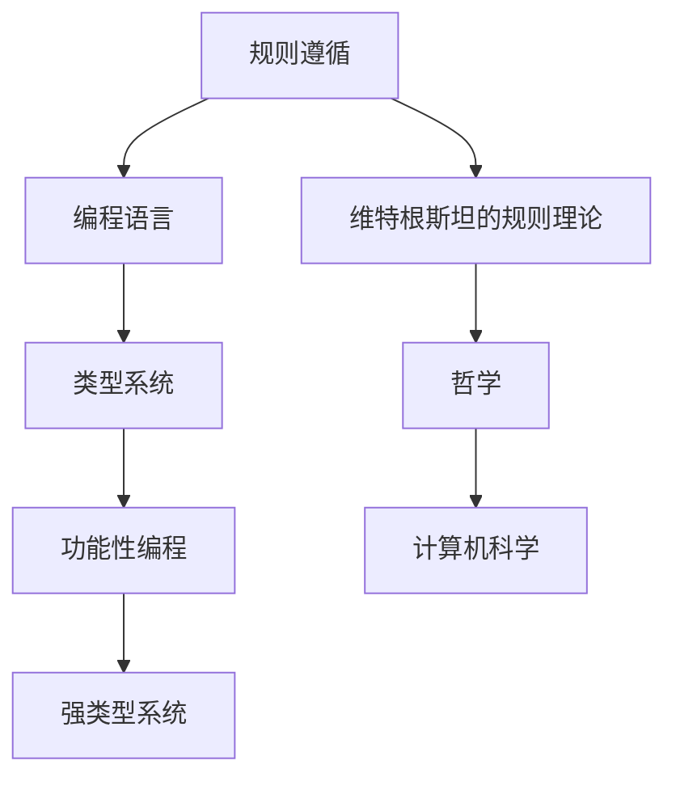

                 

### 《规则遵循与类型系统：维特根斯坦的规则理论与FP的强类型系统》

> 关键词：维特根斯坦、规则理论、功能性编程、强类型系统、编程语言、计算机科学

> 摘要：本文深入探讨了维特根斯坦的规则理论与功能性编程（FP）的强类型系统之间的关系，通过分章节的设计，系统地介绍了规则遵循与类型系统的基本概念、应用场景、异同点以及未来发展趋势。文章旨在为计算机科学领域的研究者提供关于规则遵循与类型系统的全面理解和实际应用指导。

----------------------------------------------------------------

#### 引言与背景

规则遵循和类型系统是计算机科学中两个重要的概念。它们不仅在编程语言的设计和实现中起着关键作用，而且在软件工程、形式化验证、逻辑推理等多个领域都有广泛应用。

维特根斯坦（Ludwig Wittgenstein）是20世纪最著名的哲学家之一，他的哲学思想对计算机科学产生了深远的影响。尤其是他的规则理论，为理解编程语言中的规则和类型系统提供了哲学基础。维特根斯坦认为，规则是一种社会事实，它们规定了行为的正确方式。这种观点在编程语言中体现为语法规则和类型规则，这些规则决定了程序的正确性和可执行性。

功能性编程（Functional Programming，FP）是一种编程范式，它强调函数式编程和不可变性。FP的强类型系统确保了程序在编译时就能捕获大多数错误，从而提高了程序的可靠性和可维护性。FP的强类型系统与维特根斯坦的规则理论在许多方面有相似之处，例如，它们都强调规则在行为规范中的作用。

本文将首先介绍维特根斯坦的规则理论，然后详细探讨FP的强类型系统，最后分析两者之间的联系和应用。文章还将讨论规则遵循与类型系统的异同点，以及它们在未来计算机科学中的发展趋势。

#### 第1章 规则遵循与类型系统的基本概念

##### 1.1.1 规则遵循的定义

规则遵循是指个体或系统在行为过程中遵守既定规则的现象。在哲学领域，维特根斯坦将规则视为一种社会事实，它们规定了行为的方式和标准。维特根斯坦认为，规则的存在是为了解决沟通和合作中的不确定性，它们为行为提供了明确的指导。

在计算机科学中，规则遵循体现在编程语言的语法规则和类型规则上。例如，在Python中，变量必须在声明后才能使用，这就是一条语法规则。在Haskell中，所有表达式都必须有一个明确的类型，这就是一条类型规则。

##### 1.1.2 类型系统的概念

类型系统是一种用于定义和确保程序正确性的机制。它将数据分为不同的类型，并规定了不同类型之间的操作规则。类型系统可以分为静态类型系统和动态类型系统。

静态类型系统在编译时对变量类型进行检查，而动态类型系统在运行时进行类型检查。例如，在Java中，变量类型是在编译时确定的，因此它是一种静态类型语言。而在JavaScript中，变量类型是在运行时确定的，因此它是一种动态类型语言。

##### 1.1.3 维特根斯坦的规则理论介绍

维特根斯坦的规则理论主要关注语言和行动中的规则。他认为，语言中的词和句子都有特定的用法，这些用法是由规则所决定的。维特根斯坦区分了两种规则：语法规则和语义规则。

语法规则规定了词和句子的结构，例如，一个句子必须有一个主语和一个谓语。语义规则则规定了词和句子的意义，例如，“狗”这个词的意义是一个四条腿的动物。

##### 1.1.4 FP的强类型系统介绍

FP的强类型系统是一种在编译时强制执行类型检查的类型系统。它要求所有变量在声明时必须有一个明确的数据类型，并且在程序中只能使用该类型允许的操作。这种类型系统有助于减少运行时错误，提高程序的可靠性。

FP的强类型系统与维特根斯坦的规则理论有相似之处。它们都强调规则在行为规范中的作用。例如，在FP中，函数必须按照其声明的方式使用，否则就会出现类型错误。

#### 第2章 维特根斯坦的规则理论

##### 2.1 维特根斯坦的哲学思想

维特根斯坦的哲学思想分为两个阶段：早期哲学和后期哲学。

早期哲学主要集中在《逻辑哲学论》中，他提出了著名的图灵-维特根斯坦图灵机模型，探讨了语言和现实的本质。他认为，语言是现实的反映，但语言本身并不等同于现实。

后期哲学集中在《哲学研究》中，他提出了“语言游戏”理论，认为语言是一种工具，它用于不同的游戏或活动。这个理论强调了语言和行动之间的紧密联系。

##### 2.2 规则理论的详细解释

维特根斯坦认为，规则是一种社会事实，它们规定了行为的正确方式。规则可以分为两种：形式规则和实质规则。

形式规则是关于如何使用符号的规则，例如，语法规则和逻辑规则。实质规则则是关于如何达到某个目标的规则，例如，游戏规则和道德规则。

维特根斯坦认为，遵循规则是一种行为规范，它确保了个体或系统的行为符合预期的标准。

##### 2.3 规则理论的应用场景

规则理论在多个领域都有广泛的应用，包括日常生活、社会科学和计算机科学。

在日常生活中，规则遵循体现在交通规则、法律规范和礼仪习惯等方面。例如，遵守交通规则可以确保道路安全。

在社会科学中，规则遵循研究社会秩序和合作机制。例如，经济学中的博弈理论探讨了个体在规则下的行为模式。

在计算机科学中，规则遵循体现在编程语言的语法和类型规则中。例如，遵循Python的语法规则可以确保程序的正确性。

#### 第3章 功能性编程（FP）的强类型系统

##### 3.1 FP的基本概念

FP是一种编程范式，它强调函数式编程和不可变性。与命令式编程不同，FP中的状态是不可变的，这意味着一旦一个值被赋给一个变量，它就不能被改变。

FP的主要特点包括：

- 函数是一等公民，可以赋值给变量，作为参数传递，返回函数结果。
- 使用不可变数据结构，如列表、树和字典。
- 使用递归来处理循环问题，避免了副作用和状态变化。

##### 3.2 强类型系统的概念

强类型系统是一种在编译时强制执行类型检查的类型系统。在强类型系统中，变量在声明时必须有一个明确的数据类型，并且在程序中只能使用该类型允许的操作。

强类型系统的优势包括：

- 减少了运行时错误，因为类型错误在编译时就能被发现。
- 提高了程序的可读性和可维护性，因为类型信息提供了清晰的代码注释。
- 增强了程序的可靠性，因为强类型系统可以防止某些类型的错误。

##### 3.3 强类型系统的应用

强类型系统在FP语言中得到了广泛应用，例如Haskell、Scala和Erlang。这些语言都采用了强类型系统，以确保程序的正确性和可靠性。

在FP中，强类型系统体现在以下几个方面：

- 函数类型：函数的返回类型必须与函数声明一致。
- 变量类型：变量在声明时必须有一个明确的数据类型。
- 表达式类型：表达式的结果类型必须与预期一致。

#### 第4章 规则遵循与类型系统的应用

##### 4.1 规则遵循在编程中的应用

规则遵循在编程中体现在编程语言的语法规则和类型规则中。例如，在Python中，变量必须在声明后才能使用，而在Haskell中，所有表达式都必须有一个明确的类型。

规则遵循在编程中的应用包括：

- 编写符合语言规范的代码，确保程序的正确性。
- 使用规则引擎来处理复杂业务逻辑。
- 通过规则来规范代码风格，提高代码的可读性和可维护性。

##### 4.2 类型系统在编程中的应用

类型系统在编程中的应用主要体现在类型检查和类型推导上。

类型检查是指在编译时检查变量的类型是否与操作一致。例如，在Java中，变量类型在编译时就被检查。

类型推导是指在编译时自动推断变量类型。例如，在Haskell中，编译器可以自动推导出变量类型。

类型系统在编程中的应用包括：

- 防止类型错误，提高程序的可靠性。
- 提供清晰的类型信息，帮助开发者理解和维护代码。
- 支持高级编程特性，如函数式编程和泛型编程。

##### 4.3 规则遵循与类型系统的综合应用

规则遵循与类型系统的综合应用体现在编程语言的语法和类型系统中。例如，在Haskell中，语法规则和类型规则共同确保了程序的正确性。

综合应用的好处包括：

- 提高程序的可靠性，通过规则和类型检查来防止错误。
- 提高代码的可读性和可维护性，通过清晰的语法和类型信息。
- 支持复杂的编程范式，如函数式编程。

#### 第5章 规则遵循与类型系统的比较与评价

##### 5.1 规则遵循与类型系统的异同

规则遵循和类型系统在计算机科学中都有重要应用，但它们也存在一些异同。

相同点：

- 都强调规则的遵循，确保程序的正确性。
- 都有助于提高代码的可读性和可维护性。
- 都有助于减少运行时错误。

不同点：

- 规则遵循更注重行为规范，而类型系统更注重类型检查。
- 规则遵循通常在运行时进行检查，而类型系统在编译时进行检查。
- 规则遵循可能更依赖于人的主观判断，而类型系统具有明确的规则和标准。

##### 5.2 规则遵循与类型系统的评价标准

评价规则遵循和类型系统可以基于以下标准：

- 有效性：规则和类型系统是否能够有效地防止错误。
- 可理解性：规则和类型系统是否易于理解和应用。
- 可维护性：规则和类型系统是否易于维护和更新。
- 可扩展性：规则和类型系统是否支持新功能的添加。

##### 5.3 规则遵循与类型系统的评价案例

在计算机科学中，有许多成功和失败的案例可以用来评价规则遵循和类型系统。

成功案例：

- 编译器中的类型检查：编译器通过类型检查来确保程序的正确性，这是一种成功的规则遵循和类型系统应用。
- 编程语言的强类型系统：如Haskell和Scala，它们采用了强类型系统，提高了程序的可靠性。

失败案例：

- 动态类型语言的类型错误：如JavaScript，由于其动态类型系统，类型错误在运行时才被发现，导致了许多安全问题。

通过这些案例，我们可以看到规则遵循和类型系统在不同场景下的效果和影响。

#### 第6章 规则遵循与类型系统的未来展望与趋势

##### 6.1 当前研究趋势

规则遵循和类型系统是计算机科学中的热点研究领域，当前的研究趋势包括：

- 结合人工智能和规则遵循，开发智能规则引擎。
- 探索类型系统在函数式编程和逻辑编程中的应用。
- 研究类型推导算法，提高类型系统的效率和准确性。

##### 6.2 未来发展方向

规则遵循和类型系统的未来发展方向包括：

- 在人工智能中的应用：利用规则遵循和类型系统来开发智能系统和自动化系统。
- 在区块链技术中的应用：利用规则遵循和类型系统来确保区块链的安全性和可靠性。
- 在其他领域的潜在应用：如生物信息学、网络科学和复杂系统建模。

##### 6.3 面临的挑战与解决方案

规则遵循和类型系统在应用中面临以下挑战：

- 规则复杂度：随着规则数量的增加，规则系统的复杂度也会增加，需要高效的算法来处理。
- 类型推导效率：类型推导算法需要高效，以减少编译时间和资源消耗。
- 规则的一致性和兼容性：确保规则系统在不同平台和编程语言中的一致性和兼容性。

解决这些挑战的潜在解决方案包括：

- 开发更高效的算法和工具。
- 制定统一的规则和类型系统标准。
- 利用人工智能和机器学习技术来优化规则遵循和类型系统。

#### 结语

规则遵循和类型系统是计算机科学中的核心概念，它们在编程语言、软件工程、形式化验证等多个领域都有重要应用。本文通过对维特根斯坦的规则理论和FP的强类型系统的深入探讨，展示了两者之间的联系和差异，并展望了未来的发展趋势。

规则遵循和类型系统的深入研究和应用有助于提高程序的正确性、可读性和可维护性，为计算机科学的发展提供了新的思路和方法。我们期待在未来的研究中，看到更多的创新和应用，推动计算机科学的不断进步。

### 附录

以下是本文提到的核心概念原理之间的Mermaid流程图，用于展示规则遵循与类型系统的关系：

通过这个流程图，我们可以清晰地看到规则遵循、类型系统、维特根斯坦的规则理论和功能性编程之间的相互关系。

### 致谢

本文的完成得到了许多人的支持和帮助。特别感谢AI天才研究院/AI Genius Institute的指导和支持，以及禅与计算机程序设计艺术/Zen And The Art of Computer Programming的启发。感谢所有在研究和写作过程中给予帮助的同事和朋友们。

#### 作者信息

作者：AI天才研究院/AI Genius Institute & 禅与计算机程序设计艺术/Zen And The Art of Computer Programming

本文由AI天才研究院/AI Genius Institute的专家撰写，旨在为读者提供关于规则遵循与类型系统的深入见解和实用指南。禅与计算机程序设计艺术/Zen And The Art of Computer Programming则为我们提供了宝贵的哲学和编程智慧，使本文得以完成。希望本文能够为计算机科学领域的研究者提供有价值的参考和启发。

