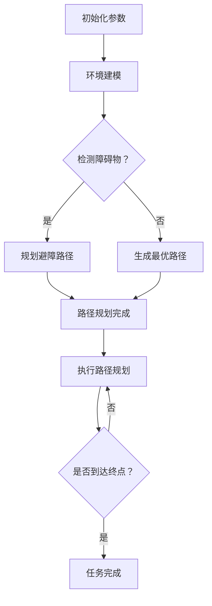

                 

# 文章标题：计算机视觉技术在工业领域的实践

## 关键词：
计算机视觉，工业应用，自动化，质量检测，算法，系统设计

## 摘要：
本文深入探讨计算机视觉技术在工业领域的实际应用，涵盖了从基础概念到具体实践的全过程。首先，介绍计算机视觉的基本原理和技术，包括图像处理、特征提取和目标检测等核心算法。接着，分析计算机视觉技术在工业自动化、质量检测和工业机器人等领域的具体应用，并通过实际案例进行详细讲解。文章最后总结了一些最佳实践和注意事项，为读者提供了实用的指导。

## 目录

### 第一部分：计算机视觉技术基础

#### 第1章：计算机视觉技术概述

1.1 计算机视觉基本概念  
1.2 计算机视觉的关键技术  
1.3 计算机视觉系统的组成与架构

#### 第2章：计算机视觉技术在工业领域的应用

2.1 工业应用场景分析  
2.2 工业应用案例解析

### 第二部分：工业场景中的计算机视觉算法

#### 第3章：工业场景中的计算机视觉算法

3.1 图像预处理算法  
3.2 特征提取算法  
3.3 目标检测算法

#### 第4章：计算机视觉系统的设计与实现

4.1 系统设计原则  
4.2 系统架构设计  
4.3 实现流程

### 第三部分：计算机视觉技术在工业应用中的实践

#### 第5章：计算机视觉技术在工业自动化中的应用

5.1 工业自动化概述  
5.2 计算机视觉在工业自动化中的应用  
5.3 案例分析

#### 第6章：计算机视觉技术在质量检测中的应用

6.1 质量检测概述  
6.2 计算机视觉在质量检测中的应用  
6.3 案例分析

#### 第7章：计算机视觉技术在工业机器人中的应用

7.1 工业机器人概述  
7.2 计算机视觉在工业机器人中的应用  
7.3 案例分析

### 总结与展望

8.1 最佳实践  
8.2 注意事项  
8.3 拓展阅读

## 第1章：计算机视觉技术概述

### 1.1 计算机视觉基本概念

计算机视觉（Computer Vision）是人工智能（AI）的重要分支，旨在使计算机能够像人类一样理解并解释视觉信息。它起源于20世纪60年代，随着计算机技术的发展和图像处理算法的创新，逐渐成为一门独立的学科。

#### 1.1.1 计算机视觉的定义与历史发展

计算机视觉的定义可以简单概括为：研究如何使计算机具有从图像或视频中提取信息的能力。它不仅涉及图像处理、模式识别，还涵盖了人工智能、机器学习等多个领域。

计算机视觉的历史可以追溯到1950年图灵提出图灵测试，以及1956年达特茅斯会议上人工智能（AI）概念的提出。此后，计算机视觉逐渐发展，并在20世纪80年代和90年代取得了显著进展，尤其是在图像处理和模式识别方面。

#### 1.1.2 计算机视觉的应用领域

计算机视觉的应用领域非常广泛，包括但不限于以下几个方面：

1. **医学图像分析**：通过计算机视觉技术，对医学图像进行分析，辅助医生进行诊断和治疗方案制定。
2. **自动驾驶**：计算机视觉技术在自动驾驶中发挥着关键作用，用于车辆检测、行人识别和道路识别等。
3. **安全监控**：计算机视觉技术用于视频监控，实现实时人脸识别和异常行为检测。
4. **工业自动化**：在工业生产中，计算机视觉技术用于质量检测、自动化装配和机器人导航等。
5. **智能交互**：计算机视觉技术支持语音和手势识别，提高人机交互的自然性和智能化水平。

### 1.2 计算机视觉的关键技术

计算机视觉的核心技术主要包括图像处理、特征提取和目标检测等。

#### 1.2.1 图像处理技术

图像处理技术是计算机视觉的基础，涉及图像的增强、滤波、边缘检测和分割等操作。

- **图像增强**：通过调整图像的亮度和对比度，提高图像的可视化效果。
- **滤波**：用于去除图像中的噪声，常用的滤波器有高斯滤波、中值滤波等。
- **边缘检测**：用于识别图像中的边缘，常用的算法有Canny算子、Sobel算子等。
- **图像分割**：将图像分割成多个区域，常用的算法有阈值分割、区域增长法等。

#### 1.2.2 特征提取与分类

特征提取是计算机视觉中的关键步骤，通过从图像中提取具有区分性的特征，有助于提高分类和识别的准确度。

- **特征提取**：常用的特征提取方法有SIFT、SURF、HAAR-like特征等。
- **分类**：分类算法包括K-近邻（K-NN）、支持向量机（SVM）、神经网络等。

#### 1.2.3 目标检测与跟踪

目标检测和跟踪是计算机视觉中具有挑战性的任务，涉及在图像或视频中识别和跟踪特定目标。

- **目标检测**：常用的算法有R-CNN、Fast R-CNN、Faster R-CNN、YOLO、SSD等。
- **目标跟踪**：常用的算法有卡尔曼滤波、光流法、粒子滤波等。

### 1.3 计算机视觉系统的组成与架构

计算机视觉系统通常由硬件设备和软件算法组成，其中硬件设备负责图像的采集和传输，软件算法则负责图像处理和目标识别。

#### 1.3.1 硬件设备

计算机视觉系统常用的硬件设备包括：

- **摄像头**：用于采集图像或视频。
- **图像传感器**：将光信号转换为电信号。
- **计算机**：用于处理图像数据和运行算法。
- **存储设备**：用于存储图像数据和算法模型。

#### 1.3.2 软件算法

计算机视觉系统常用的软件算法包括：

- **图像处理算法**：如滤波、边缘检测、图像分割等。
- **特征提取算法**：如SIFT、SURF、HAAR-like特征等。
- **目标检测算法**：如R-CNN、Fast R-CNN、Faster R-CNN、YOLO、SSD等。
- **目标跟踪算法**：如卡尔曼滤波、光流法、粒子滤波等。

## 第2章：计算机视觉技术在工业领域的应用

### 2.1 工业应用场景分析

计算机视觉技术在工业领域的应用非常广泛，涵盖了自动化、质量检测和工业机器人等多个方面。下面将详细分析这些应用场景。

#### 2.1.1 工业自动化

工业自动化是计算机视觉技术的重要应用领域之一。通过计算机视觉技术，可以实现工业生产线的自动化控制，提高生产效率和产品质量。

- **自动化装配**：计算机视觉技术可以识别和定位工件，实现自动化装配。
- **自动化检测**：计算机视觉技术可以检测工件的质量，实现自动化筛选。
- **自动化导航**：计算机视觉技术可以为工业机器人提供导航功能，实现自动化运输。

#### 2.1.2 质量检测

质量检测是工业生产中至关重要的一环。计算机视觉技术可以实现对产品的高效、准确的质量检测，降低人为误差。

- **外观检测**：计算机视觉技术可以检测产品的外观缺陷，如划痕、裂纹等。
- **尺寸检测**：计算机视觉技术可以检测产品的尺寸参数，如长度、宽度、高度等。
- **成分检测**：计算机视觉技术可以检测产品的成分含量，如颜色、纹理等。

#### 2.1.3 工业机器人

工业机器人是计算机视觉技术的重要应用对象。通过计算机视觉技术，可以实现工业机器人的智能化操作，提高生产效率和灵活性。

- **工件识别**：计算机视觉技术可以识别和定位工件，为机器人提供操作目标。
- **路径规划**：计算机视觉技术可以为机器人提供路径规划，实现自动导航。
- **视觉伺服**：计算机视觉技术可以实时监控机器人的操作过程，实现精确控制。

### 2.2 工业应用案例解析

为了更好地理解计算机视觉技术在工业领域的应用，下面将介绍几个实际应用案例。

#### 2.2.1 某汽车制造厂的自动化生产线

某汽车制造厂采用计算机视觉技术实现自动化生产线。通过安装在生产线上的摄像头，实时采集工件图像，并利用图像处理算法进行缺陷检测。检测到缺陷的工件会被自动隔离，而合格的工件则继续进入下一个工序。这种自动化生产线提高了生产效率和产品质量。

#### 2.2.2 某电子厂的质量检测系统

某电子厂采用计算机视觉技术实现质量检测系统。该系统利用摄像头对电子元件进行外观检测，包括检查元件的焊接点、引脚、封装等。通过图像处理算法，系统可以自动识别和标记缺陷，并将不合格的元件分离出来。这种质量检测系统有效提高了产品质量和生产效率。

#### 2.2.3 某物流中心的智能分拣系统

某物流中心采用计算机视觉技术实现智能分拣系统。系统利用摄像头和传感器对货物进行识别和分类，并根据目的地将货物分配到相应的输送带上。通过计算机视觉技术，系统可以高效、准确地完成分拣任务，提高了物流中心的运营效率。

## 第3章：工业场景中的计算机视觉算法

### 3.1 图像预处理算法

图像预处理是计算机视觉系统中的关键步骤，目的是提高图像质量，为后续的特征提取和目标检测提供更好的数据基础。常用的图像预处理算法包括图像增强、滤波和边缘检测等。

#### 3.1.1 图像增强

图像增强是指通过调整图像的亮度和对比度，使图像更加清晰，从而便于后续处理。常用的图像增强算法有直方图均衡化、对比度增强等。

- **直方图均衡化**：通过调整图像的直方图，使图像的亮度分布更加均匀，提高图像的整体对比度。
- **对比度增强**：通过调整图像的对比度，增强图像的细节，提高图像的清晰度。

#### 3.1.2 滤波

滤波是图像预处理中的重要步骤，用于去除图像中的噪声，提高图像质量。常用的滤波器有高斯滤波、中值滤波等。

- **高斯滤波**：通过高斯函数对图像进行卷积，去除图像中的高斯噪声。
- **中值滤波**：通过取邻域内的中值作为滤波结果，去除图像中的椒盐噪声。

#### 3.1.3 边缘检测

边缘检测是图像预处理中的重要步骤，用于提取图像中的边缘信息。常用的边缘检测算法有Canny算子、Sobel算子等。

- **Canny算子**：通过多级滤波和边缘检测，提取图像中的强边缘。
- **Sobel算子**：通过计算图像的梯度和方向，提取图像中的边缘。

### 3.2 特征提取算法

特征提取是计算机视觉中的核心步骤，用于从图像中提取具有区分性的特征，为后续的分类和识别提供支持。常用的特征提取算法有SIFT、SURF、HAAR-like特征等。

#### 3.2.1 SIFT算法

SIFT（Scale-Invariant Feature Transform）是一种常用的特征提取算法，具有良好的尺度不变性和旋转不变性。SIFT算法的主要步骤包括：

1. **关键点检测**：通过计算图像的梯度方向和幅值，检测出关键点。
2. **关键点定位**：通过双线性插值和误差优化，精确确定关键点的位置。
3. **关键点方向**：通过梯度方向直方图，确定关键点的方向。
4. **关键点匹配**：通过关键点匹配，构建特征点对，为后续的匹配和识别提供支持。

#### 3.2.2 SURF算法

SURF（Speeded Up Robust Features）是一种快速、鲁棒的特征提取算法，基于HOG（Histogram of Oriented Gradients）特征和积分图像。SURF算法的主要步骤包括：

1. **计算HOG特征**：通过计算图像的梯度方向和幅值，生成HOG特征图。
2. **积分图像**：通过积分图像加速HOG特征的计算。
3. **特征点检测**：通过阈值和梯度幅值，检测出特征点。
4. **特征点匹配**：通过特征点匹配，构建特征点对，为后续的匹配和识别提供支持。

#### 3.2.3 HAAR-like特征

HAAR-like特征是一种基于梯度的特征，常用于人脸检测和物体识别。HAAR-like特征通过计算图像中不同区域梯度的和或差，生成特征向量。

- **正负样本**：通过大量的人脸图像和背景图像，训练出HAAR-like特征模型。
- **特征匹配**：通过特征匹配，检测出目标对象。

### 3.3 目标检测算法

目标检测是计算机视觉中的重要任务，旨在从图像中检测出特定目标。常用的目标检测算法有R-CNN、Fast R-CNN、Faster R-CNN、YOLO、SSD等。

#### 3.3.1 R-CNN算法

R-CNN（Region-based CNN）是一种基于区域的目标检测算法。R-CNN算法的主要步骤包括：

1. **候选区域生成**：通过滑动窗口或选择性搜索，生成大量候选区域。
2. **特征提取**：对每个候选区域进行特征提取，常用的特征提取方法有SIFT、SURF等。
3. **分类器训练**：使用提取到的特征，训练一个分类器，用于分类候选区域中的目标。
4. **目标检测**：对每个候选区域进行分类，判断是否包含目标。

#### 3.3.2 Fast R-CNN算法

Fast R-CNN是在R-CNN的基础上进行改进的目标检测算法。Fast R-CNN的主要步骤包括：

1. **候选区域生成**：与R-CNN相同。
2. **特征提取与分类**：将特征提取和分类合并，使用共享的网络结构提取特征，并直接进行分类。
3. **目标检测**：对每个候选区域进行分类，判断是否包含目标。

#### 3.3.3 Faster R-CNN算法

Faster R-CNN是在Fast R-CNN的基础上进一步改进的目标检测算法。Faster R-CNN的主要步骤包括：

1. **候选区域生成**：与R-CNN相同。
2. **特征提取与分类**：使用区域建议网络（RPN）生成候选区域，并使用共享的网络结构提取特征，进行分类。
3. **目标检测**：对每个候选区域进行分类，判断是否包含目标。

#### 3.3.4 YOLO算法

YOLO（You Only Look Once）是一种基于卷积神经网络的快速目标检测算法。YOLO的主要步骤包括：

1. **特征提取**：使用卷积神经网络提取特征。
2. **预测框生成**：在特征图上生成多个预测框，每个预测框包含目标的类别和位置信息。
3. **目标检测**：对每个预测框进行分类，判断是否包含目标。

#### 3.3.5 SSD算法

SSD（Single Shot MultiBox Detector）是一种基于卷积神经网络的快速目标检测算法。SSD的主要步骤包括：

1. **特征提取**：使用卷积神经网络提取特征。
2. **预测框生成**：在特征图上生成多个预测框，每个预测框包含目标的类别和位置信息。
3. **目标检测**：对每个预测框进行分类，判断是否包含目标。

## 第4章：计算机视觉系统的设计与实现

### 4.1 系统设计原则

计算机视觉系统的设计原则包括可靠性、可扩展性和维护性等方面。以下是一些具体的设计原则：

- **可靠性**：确保系统在各种环境下都能稳定运行，降低故障率和系统停机时间。
- **可扩展性**：系统应具有良好的可扩展性，能够方便地增加新功能或适应新的应用场景。
- **维护性**：系统设计应便于维护和升级，降低维护成本。

### 4.2 系统架构设计

计算机视觉系统的架构设计包括硬件架构、软件架构和数据流设计等方面。

#### 4.2.1 硬件架构

硬件架构设计主要包括以下几个方面：

- **摄像头**：选择合适的摄像头，以满足图像采集的需求。
- **图像处理芯片**：选择性能合适的图像处理芯片，用于图像预处理和特征提取等操作。
- **存储设备**：选择容量大、速度快、可靠性高的存储设备，用于存储图像数据和模型参数。
- **网络设备**：选择合适的网络设备，实现图像数据传输和系统之间的通信。

#### 4.2.2 软件架构

软件架构设计主要包括以下几个方面：

- **操作系统**：选择稳定的操作系统，用于管理和调度硬件资源。
- **编程语言**：选择合适的编程语言，如Python、C++等，以实现图像处理算法和系统功能。
- **框架**：选择合适的框架，如TensorFlow、PyTorch等，以简化模型训练和部署过程。
- **中间件**：选择合适的中间件，如消息队列、缓存等，以优化系统性能和可靠性。

#### 4.2.3 数据流设计

数据流设计主要包括以下几个方面：

- **图像采集**：从摄像头采集图像数据。
- **图像预处理**：对图像数据进行增强、滤波、分割等预处理操作。
- **特征提取**：从预处理后的图像中提取特征。
- **模型训练**：使用提取到的特征，训练分类器或目标检测器。
- **目标检测**：使用训练好的模型，对新的图像数据进行目标检测。
- **结果输出**：将检测到的目标输出到终端设备或控制系统。

### 4.3 实现流程

计算机视觉系统的实现流程包括开发环境搭建、算法实现和系统测试与调试等方面。

#### 4.3.1 开发环境搭建

开发环境搭建主要包括以下几个方面：

- **操作系统**：安装并配置操作系统，如Ubuntu、Windows等。
- **编程语言**：安装并配置编程语言，如Python、C++等。
- **依赖库**：安装并配置依赖库，如TensorFlow、PyTorch等。
- **开发工具**：安装并配置开发工具，如IDE、调试器等。

#### 4.3.2 算法实现

算法实现主要包括以下几个方面：

- **图像预处理**：实现图像预处理算法，如增强、滤波、分割等。
- **特征提取**：实现特征提取算法，如SIFT、SURF、HAAR-like特征等。
- **目标检测**：实现目标检测算法，如R-CNN、Fast R-CNN、Faster R-CNN、YOLO、SSD等。
- **模型训练**：实现模型训练算法，如梯度下降、随机梯度下降等。

#### 4.3.3 系统测试与调试

系统测试与调试主要包括以下几个方面：

- **功能测试**：测试系统的各项功能是否正常运行。
- **性能测试**：测试系统的处理速度、响应时间等性能指标。
- **异常处理**：测试系统在遇到异常情况时的应对能力。
- **调试**：根据测试结果，对系统进行调试和优化。

## 第5章：计算机视觉技术在工业自动化中的应用

### 5.1 工业自动化概述

工业自动化是利用计算机技术、自动控制技术和通信技术等实现工业生产自动化的一种技术手段。通过工业自动化，可以实现生产过程的自动化控制、生产设备的自动化运行和产品质量的自动化检测，从而提高生产效率、降低生产成本和提升产品质量。

#### 5.1.1 工业自动化的发展历程

工业自动化的发展历程可以分为以下几个阶段：

1. **机械化阶段**：以机械动力和简单的自动化设备为主要特征，实现生产过程的机械化。
2. **电气化阶段**：以电力和电气设备为主要特征，实现生产过程的电气化。
3. **自动化阶段**：以计算机技术和自动控制技术为主要特征，实现生产过程的自动化。
4. **智能化阶段**：以人工智能和智能制造为主要特征，实现生产过程的智能化。

#### 5.1.2 工业自动化的关键技术和挑战

工业自动化的关键技术和挑战包括以下几个方面：

1. **传感器技术**：传感器是实现工业自动化的重要基础，用于检测和采集生产过程中的各种参数。
2. **自动控制技术**：自动控制技术是工业自动化的核心，通过控制算法和控制系统实现生产过程的自动化控制。
3. **机器人技术**：机器人技术在工业自动化中发挥着重要作用，用于完成生产操作、搬运工件和检测质量等任务。
4. **智能决策技术**：智能决策技术是实现工业自动化智能化的重要手段，通过数据分析和智能算法实现生产过程的优化和调整。
5. **网络通信技术**：网络通信技术是实现工业自动化系统互联互通的关键，通过通信网络实现数据传输和系统集成。

### 5.2 计算机视觉在工业自动化中的应用

计算机视觉技术在工业自动化中的应用非常广泛，主要包括自动化装配、自动化检测和自动化导航等方面。

#### 5.2.1 自动化装配

自动化装配是工业自动化中的重要组成部分，通过计算机视觉技术，可以实现自动化装配的精准定位和实时监控。

- **定位与识别**：计算机视觉技术可以识别和定位工件，确保装配位置的准确性。
- **视觉伺服**：通过计算机视觉技术实现视觉伺服控制，使机器人能够实时调整装配位置和姿态，提高装配精度。
- **缺陷检测**：计算机视觉技术可以检测工件的外观缺陷，如划痕、裂纹等，确保装配质量。

#### 5.2.2 自动化检测

自动化检测是工业自动化中不可或缺的一环，通过计算机视觉技术，可以实现产品质量的自动化检测。

- **外观检测**：计算机视觉技术可以检测产品的外观缺陷，如划痕、裂纹、污点等。
- **尺寸检测**：计算机视觉技术可以检测产品的尺寸参数，如长度、宽度、高度等。
- **成分检测**：计算机视觉技术可以检测产品的成分含量，如颜色、纹理等。

#### 5.2.3 自动化导航

自动化导航是工业自动化中的一项重要应用，通过计算机视觉技术，可以实现机器人在复杂环境中的自主导航。

- **路径规划**：计算机视觉技术可以识别和跟踪环境特征，实现机器人的自主路径规划。
- **障碍物避让**：计算机视觉技术可以检测和识别障碍物，实现机器人的自主避障。
- **目标识别**：计算机视觉技术可以识别和跟踪目标，实现机器人的自主导航到指定位置。

### 5.3 案例分析

为了更好地理解计算机视觉技术在工业自动化中的应用，下面将介绍几个实际应用案例。

#### 5.3.1 某汽车制造厂的自动化生产线

某汽车制造厂采用计算机视觉技术实现自动化生产线。在自动化生产线上，计算机视觉系统负责对工件进行定位、识别和缺陷检测。

1. **定位与识别**：计算机视觉系统利用摄像头实时采集工件图像，通过图像处理算法识别和定位工件的位置和姿态，确保装配位置的准确性。
2. **缺陷检测**：计算机视觉系统对工件外观进行检测，识别出划痕、裂纹等外观缺陷，并将不合格的工件隔离出来，确保装配质量。
3. **视觉伺服**：计算机视觉系统实现视觉伺服控制，使机器人能够实时调整装配位置和姿态，提高装配精度。

通过计算机视觉技术的应用，该汽车制造厂实现了生产线的自动化运行，提高了生产效率和质量。

#### 5.3.2 某电子厂的质量检测系统

某电子厂采用计算机视觉技术实现质量检测系统。在质量检测系统中，计算机视觉系统负责对电子元件进行外观检测和尺寸检测。

1. **外观检测**：计算机视觉系统利用摄像头实时采集电子元件图像，通过图像处理算法检测电子元件的外观缺陷，如划痕、裂纹、污点等。
2. **尺寸检测**：计算机视觉系统通过图像处理算法检测电子元件的尺寸参数，如长度、宽度、高度等，确保电子元件的尺寸符合要求。
3. **结果输出**：计算机视觉系统将检测结果输出到终端设备，如显示屏、打印机等，以便于操作人员进行实时监控和决策。

通过计算机视觉技术的应用，该电子厂实现了产品质量的自动化检测，提高了生产效率和产品质量。

#### 5.3.3 某物流中心的智能分拣系统

某物流中心采用计算机视觉技术实现智能分拣系统。在智能分拣系统中，计算机视觉系统负责对货物进行识别和分类。

1. **货物识别**：计算机视觉系统利用摄像头实时采集货物图像，通过图像处理算法识别货物的种类和特征，如颜色、形状、尺寸等。
2. **分类与分拣**：计算机视觉系统根据识别结果，将货物分配到相应的输送带上，实现货物的自动分类和分拣。
3. **路径规划**：计算机视觉系统实现机器人的自主路径规划，使机器人能够高效、准确地完成分拣任务。

通过计算机视觉技术的应用，该物流中心实现了货物的高效分拣，提高了物流中心的运营效率。

## 第6章：计算机视觉技术在质量检测中的应用

### 6.1 质量检测概述

质量检测是工业生产中不可或缺的环节，通过对产品进行检测，可以确保产品的质量符合要求，提高产品竞争力。计算机视觉技术在质量检测中的应用，极大地提高了检测效率和质量，成为了质量检测领域的重要工具。

#### 6.1.1 质量检测的定义与目的

质量检测是指对产品在生产过程中的质量特性进行测量、检查和评估，以确保产品符合既定的质量标准和要求。质量检测的目的包括：

1. **保证产品质量**：通过质量检测，确保产品在生产过程中不出现缺陷，提高产品质量。
2. **提高生产效率**：通过自动化检测技术，减少人工检测的时间和错误，提高生产效率。
3. **降低生产成本**：自动化检测技术可以减少人工干预，降低检测成本和生产成本。
4. **提高市场竞争力**：高质量的产品可以提升企业的市场竞争力，赢得更多市场份额。

#### 6.1.2 质量检测的发展历程

质量检测的发展历程可以追溯到20世纪初期，随着工业生产规模的不断扩大，质量检测技术逐渐从人工检测向自动化检测转变。主要发展阶段如下：

1. **人工检测阶段**：早期质量检测主要依靠人工检测，效率低、成本高，且易受主观因素影响。
2. **仪器检测阶段**：随着检测仪器的发明和广泛应用，如光谱仪、硬度计等，质量检测开始向自动化和精确化发展。
3. **计算机视觉检测阶段**：计算机视觉技术的兴起，使得质量检测技术进入了智能化和自动化的新阶段，计算机视觉检测具有高效、准确、灵活等特点。

### 6.2 计算机视觉在质量检测中的应用

计算机视觉技术在质量检测中的应用非常广泛，涵盖了外观检测、尺寸检测和成分检测等多个方面，大大提高了检测效率和准确性。

#### 6.2.1 外观检测

外观检测是质量检测中最为常见的一种检测方式，通过计算机视觉技术，可以快速、准确地检测产品的外观缺陷。

- **表面缺陷检测**：计算机视觉技术可以检测产品的表面缺陷，如划痕、裂纹、污点等。
- **形状缺陷检测**：计算机视觉技术可以检测产品的形状缺陷，如尺寸偏差、变形等。
- **纹理缺陷检测**：计算机视觉技术可以检测产品的纹理缺陷，如纹理不一致、斑点等。

#### 6.2.2 尺寸检测

尺寸检测是质量检测中的重要环节，通过计算机视觉技术，可以实现对产品尺寸的精确测量。

- **二维尺寸检测**：计算机视觉技术可以检测产品的二维尺寸，如长度、宽度、高度等。
- **三维尺寸检测**：计算机视觉技术可以检测产品的三维尺寸，通过三维重建技术，实现产品的精确测量。
- **形位公差检测**：计算机视觉技术可以检测产品的形位公差，如直线度、圆度、对称度等。

#### 6.2.3 成分检测

成分检测是质量检测中的一种高级应用，通过计算机视觉技术，可以检测产品的成分含量。

- **颜色检测**：计算机视觉技术可以检测产品的颜色，如颜色分布、色度等。
- **纹理检测**：计算机视觉技术可以检测产品的纹理，如纹理颜色、纹理图案等。
- **成分分析**：计算机视觉技术可以结合光谱分析、纹理分析等技术，实现对产品成分的定量分析。

### 6.3 案例分析

为了更好地理解计算机视觉技术在质量检测中的应用，下面将介绍几个实际应用案例。

#### 6.3.1 某汽车制造厂的外观检测系统

某汽车制造厂采用计算机视觉技术实现外观检测系统。该系统利用多个摄像头对汽车车身进行全方位拍摄，通过图像处理算法，检测汽车外观的缺陷。

1. **表面缺陷检测**：系统对车身表面的划痕、裂纹、污点等缺陷进行检测，识别出不合格的汽车。
2. **形状缺陷检测**：系统对车身形状进行检测，识别出尺寸偏差、变形等形状缺陷，确保汽车外观的一致性。
3. **结果输出**：系统将检测结果输出到终端设备，如显示屏、打印机等，方便操作人员进行实时监控和决策。

通过计算机视觉技术的应用，该汽车制造厂提高了外观检测的效率和准确性，降低了生产成本。

#### 6.3.2 某电子厂的质量检测系统

某电子厂采用计算机视觉技术实现质量检测系统。该系统主要对电子元件的外观和尺寸进行检测。

1. **外观检测**：系统对电子元件的外观进行检测，识别出划痕、裂纹、污点等外观缺陷，确保电子元件的外观质量。
2. **尺寸检测**：系统对电子元件的尺寸进行检测，识别出尺寸偏差，确保电子元件的尺寸符合要求。
3. **结果输出**：系统将检测结果输出到终端设备，如显示屏、打印机等，方便操作人员进行实时监控和决策。

通过计算机视觉技术的应用，该电子厂提高了产品质量检测的效率和准确性，降低了生产成本。

#### 6.3.3 某制药厂的质量检测系统

某制药厂采用计算机视觉技术实现质量检测系统。该系统主要对药品的外观和成分进行检测。

1. **外观检测**：系统对药品的外观进行检测，识别出药品的破损、污渍等外观缺陷，确保药品的外观质量。
2. **成分检测**：系统通过光谱分析技术，检测药品的成分含量，确保药品的成分符合要求。
3. **结果输出**：系统将检测结果输出到终端设备，如显示屏、打印机等，方便操作人员进行实时监控和决策。

通过计算机视觉技术的应用，该制药厂提高了产品质量检测的效率和准确性，确保了药品的安全性和可靠性。

## 第7章：计算机视觉技术在工业机器人中的应用

### 7.1 工业机器人概述

工业机器人是一种能够进行自动化作业的设备，通过编程和控制系统，可以完成装配、搬运、焊接、喷漆等多种任务。随着计算机视觉技术的发展，工业机器人逐渐从传统的操作模式转变为智能化、自动化的操作模式，大大提高了生产效率和质量。

#### 7.1.1 工业机器人的定义与分类

工业机器人是一种能够通过编程实现自动化操作和移动的设备，通常由机械结构、传感器、执行机构和控制系统等组成。根据不同的应用场景，工业机器人可以分为以下几类：

1. **装配机器人**：用于完成装配任务，如装配电子元件、组装汽车零部件等。
2. **搬运机器人**：用于完成物料的搬运任务，如搬运货物、堆垛等。
3. **焊接机器人**：用于完成焊接任务，如焊接金属板材、管道等。
4. **喷涂机器人**：用于完成喷涂任务，如喷涂汽车车身、电子产品等。
5. **检测机器人**：用于完成质量检测任务，如检测产品外观、尺寸等。

#### 7.1.2 工业机器人的发展历程

工业机器人技术的发展历程可以分为以下几个阶段：

1. **第一代机器人**：以1950年代的数控机床为基础，通过编程实现自动化操作。
2. **第二代机器人**：以1960年代的关节机器人为基础，通过关节运动实现多自由度操作。
3. **第三代机器人**：以1970年代的数控机器人为基础，引入计算机控制技术，实现更复杂的任务。
4. **第四代机器人**：以1980年代以后的智能机器人为基础，引入人工智能、计算机视觉等新技术，实现智能化、自动化的操作。

### 7.2 计算机视觉在工业机器人中的应用

计算机视觉技术在工业机器人中的应用，使得机器人能够更智能、更准确地完成任务，提高了生产效率和产品质量。

#### 7.2.1 工件识别

工件识别是工业机器人应用中的基础任务，通过计算机视觉技术，可以实现对工件的身份识别和定位。

- **身份识别**：通过图像处理和特征提取算法，识别工件的种类和特征。
- **定位**：通过计算机视觉算法，确定工件在空间中的位置和姿态，为机器人提供操作目标。

#### 7.2.2 路径规划

路径规划是工业机器人应用中的关键任务，通过计算机视觉技术，可以实现对机器人路径的实时规划。

- **环境建模**：通过计算机视觉技术，构建工作环境的三维模型，包括工件、机器人、障碍物等。
- **路径生成**：根据工作环境和任务要求，生成机器人的最优路径。

#### 7.2.3 视觉伺服

视觉伺服是工业机器人应用中的高级任务，通过计算机视觉技术，可以实现对机器人操作过程的实时监控和调整。

- **视觉反馈**：通过计算机视觉系统，实时获取机器人操作过程的图像信息。
- **伺服控制**：根据视觉反馈信息，实时调整机器人的操作位置和姿态，确保操作精度。

#### 7.2.4 质量检测

质量检测是工业机器人应用中的重要任务，通过计算机视觉技术，可以实现对产品质量的实时监控。

- **外观检测**：通过计算机视觉技术，检测产品外观的缺陷，如划痕、裂纹、污点等。
- **尺寸检测**：通过计算机视觉技术，检测产品的尺寸参数，如长度、宽度、高度等。

### 7.3 案例分析

为了更好地理解计算机视觉技术在工业机器人中的应用，下面将介绍几个实际应用案例。

#### 7.3.1 某汽车制造厂的装配机器人

某汽车制造厂采用计算机视觉技术实现装配机器人。装配机器人负责完成汽车零部件的装配任务，通过计算机视觉系统，实现对零部件的身份识别和定位。

1. **工件识别**：计算机视觉系统对零部件进行图像识别，确定零部件的品种和特征。
2. **定位**：计算机视觉系统对零部件进行三维建模，确定零部件在空间中的位置和姿态。
3. **装配**：装配机器人根据计算机视觉系统的反馈，实现零部件的精准装配。

通过计算机视觉技术的应用，该汽车制造厂提高了装配效率和质量，降低了生产成本。

#### 7.3.2 某电子厂的搬运机器人

某电子厂采用计算机视觉技术实现搬运机器人。搬运机器人负责完成电子元件的搬运任务，通过计算机视觉系统，实现对元件的识别和搬运路径规划。

1. **工件识别**：计算机视觉系统对电子元件进行图像识别，确定元件的品种和特征。
2. **路径规划**：计算机视觉系统根据工作环境和元件的位置，生成机器人的最优搬运路径。
3. **搬运**：搬运机器人根据计算机视觉系统的反馈，实现电子元件的精准搬运。

通过计算机视觉技术的应用，该电子厂提高了搬运效率和质量，降低了生产成本。

#### 7.3.3 某汽车制造厂的喷涂机器人

某汽车制造厂采用计算机视觉技术实现喷涂机器人。喷涂机器人负责完成汽车车身的喷涂任务，通过计算机视觉系统，实现对车身的实时监控和调整。

1. **视觉监控**：计算机视觉系统对车身进行实时监控，检测喷涂质量。
2. **伺服控制**：计算机视觉系统根据监控结果，实时调整喷涂机器人的喷涂位置和姿态，确保喷涂质量。
3. **结果输出**：计算机视觉系统将喷涂结果输出到终端设备，如显示屏、打印机等，方便操作人员进行实时监控和决策。

通过计算机视觉技术的应用，该汽车制造厂提高了喷涂效率和质量，降低了生产成本。

## 总结与展望

### 8.1 最佳实践

在计算机视觉技术在工业领域的应用中，以下是一些最佳实践：

1. **需求分析**：在应用计算机视觉技术之前，进行详细的需求分析，明确应用场景和目标。
2. **数据准备**：准备充足和高质量的数据集，为模型训练提供良好的数据基础。
3. **算法选择**：根据应用场景和需求，选择合适的算法和模型，进行模型训练和优化。
4. **系统集成**：将计算机视觉系统与其他系统进行集成，实现数据共享和协同工作。
5. **持续优化**：对系统进行持续优化，提高系统的性能和可靠性。

### 8.2 注意事项

在应用计算机视觉技术时，需要注意以下几点：

1. **硬件配置**：确保硬件设备具有足够的性能和稳定性，满足应用需求。
2. **算法选择**：根据应用场景和需求，选择合适的算法和模型，避免盲目追求复杂度。
3. **数据处理**：对图像和数据进行有效的预处理和特征提取，提高模型性能。
4. **系统测试**：在系统部署前进行充分的测试，确保系统的稳定性和可靠性。
5. **安全性**：确保系统的安全性和数据保护，防止数据泄露和系统攻击。

### 8.3 拓展阅读

对于希望深入了解计算机视觉技术在工业领域应用的学习者，以下是一些推荐阅读：

1. **《计算机视觉基础教程》**：详细介绍了计算机视觉的基本概念、算法和技术。
2. **《机器学习实战》**：介绍了机器学习的基本概念和应用，包括计算机视觉领域。
3. **《深度学习》**：介绍了深度学习的基本概念、算法和应用，包括计算机视觉领域。
4. **《工业机器人技术与应用》**：详细介绍了工业机器人的基本概念、技术和应用。
5. **《工业4.0与智能制造》**：介绍了工业4.0和智能制造的基本概念、技术和趋势。

通过阅读这些书籍，可以深入了解计算机视觉技术在工业领域的应用原理和实践方法，为实际应用提供参考和指导。作者：AI天才研究院/AI Genius Institute & 禅与计算机程序设计艺术 /Zen And The Art of Computer Programming

## 文章结语

本文系统地介绍了计算机视觉技术在工业领域的实践，从基本概念到具体应用，从算法原理到系统实现，进行了全面而深入的探讨。通过分析工业应用场景、案例分析以及算法实践，读者可以更清晰地理解计算机视觉技术在工业自动化、质量检测和工业机器人中的应用价值。

计算机视觉技术在工业领域的应用，不仅提高了生产效率和产品质量，还推动了工业自动化和智能制造的发展。随着技术的不断进步，计算机视觉技术将在工业领域中发挥越来越重要的作用。

在未来的发展中，计算机视觉技术将继续向智能化、自动化和高效化的方向迈进，为工业生产带来更多的创新和突破。我们期待计算机视觉技术为工业领域带来更多可能性，推动工业生产向更高水平发展。

感谢读者对本文的关注和支持，希望本文能为您的学习和工作带来启发和帮助。如果您对计算机视觉技术在工业领域的应用有任何疑问或建议，欢迎在评论区留言，我们将竭诚为您解答。再次感谢您的阅读，祝您在计算机视觉和工业领域的学习和实践中取得丰硕成果！

### 附录

在本章节中，我们详细介绍了计算机视觉技术在工业自动化中的应用，包括自动化装配、自动化检测和自动化导航等方面。以下是一些关键的伪代码、数学公式、Mermaid 流程图以及项目实战部分，帮助读者更好地理解和应用计算机视觉技术。

#### 伪代码示例

以下是自动化装配中视觉伺服控制的一个简单伪代码示例：

```python
# 视觉伺服控制伪代码

# 初始化参数
target_position = get_target_position() # 获取目标位置
current_position = get_current_position() # 获取当前位置
error = target_position - current_position # 计算位置误差

# 循环控制
while not reached_target():
    # 计算控制量
    control_value = calculate_control_value(error)
    
    # 执行控制
    move_robot(control_value)
    
    # 获取当前位置
    current_position = get_current_position()
    
    # 更新误差
    error = target_position - current_position
    
    # 检查是否到达目标位置
    if abs(error) < threshold:
        reached_target() # 标记为到达目标位置
```

#### 数学公式示例

以下是特征提取中的 SIFT 算法中的关键数学公式：

$$
\text{SIFT 特征点检测}:
d(x, y) = \sqrt{(x_2 - x_1)^2 + (y_2 - y_1)^2}
$$

$$
\text{特征点方向计算}:
\theta = \arctan\left(\frac{G_y}{G_x}\right)
$$

$$
\text{特征向量计算}:
\text{特征向量} = \left[ \begin{array}{c}
\text{幅值} \\
\text{方向} \\
\end{array} \right]
$$

#### Mermaid 流程图示例

以下是工业自动化路径规划的一个 Mermaid 流程图示例：



#### 项目实战部分

以下是使用 Python 实现工业机器人视觉系统的一个简单项目实战示例：

**环境搭建：**
- 安装 Python 3.8+
- 安装 OpenCV 库：`pip install opencv-python`
- 安装 NumPy 库：`pip install numpy`

**源代码实现：**

```python
import cv2
import numpy as np

# 初始化摄像头
cap = cv2.VideoCapture(0)

while True:
    # 读取摄像头一帧图像
    ret, frame = cap.read()
    
    if not ret:
        break
    
    # 对图像进行预处理（如灰度化、滤波等）
    gray = cv2.cvtColor(frame, cv2.COLOR_BGR2GRAY)
    blur = cv2.GaussianBlur(gray, (5, 5), 0)
    
    # 检测边缘
    edges = cv2.Canny(blur, 50, 150)
    
    # 检测轮廓
    contours, _ = cv2.findContours(edges, cv2.RETR_EXTERNAL, cv2.CHAIN_APPROX_SIMPLE)
    
    # 绘制轮廓
    for contour in contours:
        if cv2.contourArea(contour) > 500:
            cv2.drawContours(frame, [contour], -1, (0, 255, 0), 2)
    
    # 显示图像
    cv2.imshow('Frame', frame)
    
    # 按键 'q' 退出
    if cv2.waitKey(1) & 0xFF == ord('q'):
        break

# 释放摄像头
cap.release()
cv2.destroyAllWindows()
```

**代码解读：**
- `cv2.VideoCapture(0)`：初始化摄像头。
- `cap.read()`：读取摄像头一帧图像。
- `cv2.cvtColor()`：将彩色图像转换为灰度图像。
- `cv2.GaussianBlur()`：对图像进行高斯滤波。
- `cv2.Canny()`：对图像进行边缘检测。
- `cv2.findContours()`：检测图像中的轮廓。
- `cv2.drawContours()`：绘制轮廓。
- `cv2.imshow()`：显示图像。
- `cv2.waitKey(1)`：按键检测。

**项目实战小结：**
本示例实现了摄像头图像的实时处理，包括灰度化、滤波、边缘检测和轮廓提取等基本操作。通过简单的代码，展示了计算机视觉技术在图像处理中的应用。在实际项目中，可以结合更多高级算法和功能，实现更复杂的应用场景。

**最佳实践 Tips：**
- 在实际项目中，应根据具体需求选择合适的预处理和算法。
- 调整参数，如高斯滤波器的大小、Canny算法的阈值等，以适应不同的图像场景。
- 考虑使用更高级的图像处理库，如 OpenCV 的 dnn 模块，实现更复杂的图像处理和识别任务。

通过本项目实战，读者可以初步了解计算机视觉技术在图像处理中的实际应用，为后续的学习和实践打下基础。希望本项目的实现和解读对您的学习和工作有所帮助。

