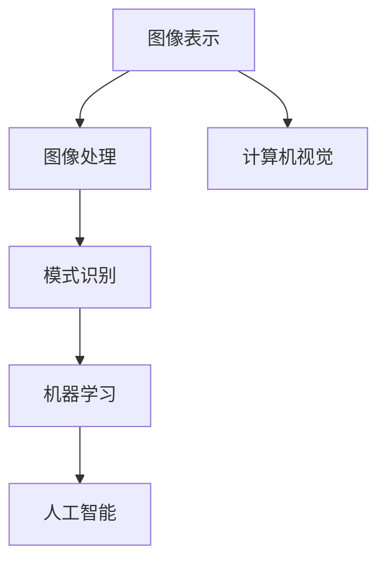

                 


### 文章标题：《计算机视觉：从图像分类到视频理解》

### 文章关键词：
- 计算机视觉
- 图像分类
- 视频理解
- 深度学习
- 卷积神经网络
- 人工智能

### 文章摘要：
本文将深入探讨计算机视觉领域的两个重要方向：图像分类和视频理解。从图像分类的基础概念、算法原理，到卷积神经网络和深度学习技术的应用，我们将逐步了解如何准确地对图像进行分类。随后，文章将扩展到视频理解，介绍视频表示、视频分类、视频分割与事件检测，以及深度学习在视频理解中的实际应用。通过多个案例分析，读者将了解计算机视觉技术在不同领域的应用，并思考未来的发展方向。本文旨在为计算机视觉研究者、开发者提供有深度、有思考、有见解的专业指南。

---

## 第1章 绪论

### 1.1 计算机视觉概述

计算机视觉是一门研究如何使计算机能够像人一样感知和理解视觉信息的科学。它涉及图像处理、模式识别、机器学习、人工智能等多个领域的知识。计算机视觉的核心目标是让计算机能够从图像或视频中提取有用的信息，并进行理解、分析和决策。

#### 核心概念与联系

计算机视觉的核心概念包括：

1. **图像表示**：如何将现实世界的图像转换为计算机可以处理的数字形式。
2. **图像处理**：对图像进行各种操作，如滤波、增强、分割等，以提取有用的信息。
3. **模式识别**：通过算法识别图像中的特定模式或对象。
4. **机器学习**：利用算法从数据中学习，提高计算机对图像的理解能力。
5. **人工智能**：使计算机具有类似人类的感知、理解和决策能力。

这些概念相互联系，共同构成了计算机视觉的技术基础。

#### Mermaid 流程图



### 1.2 计算机视觉的发展历程

计算机视觉的发展历程可以追溯到20世纪60年代。最初，计算机视觉主要是基于规则的方法，如边缘检测和特征提取。随着计算机硬件性能的提高和算法的创新，计算机视觉逐渐走向深度学习和卷积神经网络等复杂技术。

#### 发展阶段与关键事件

1. **早期阶段**（20世纪60-70年代）：基于规则的方法。
2. **中期阶段**（20世纪80-90年代）：传统图像处理和模式识别方法。
3. **现代阶段**（21世纪初至今）：深度学习和卷积神经网络的应用。

#### 社会与产业影响

计算机视觉技术在社会和产业中有着广泛的应用，如自动驾驶、人脸识别、安防监控、医疗影像诊断等。这些应用不仅提高了人类生活的便利性，也在多个行业中产生了巨大的经济效益。

### 1.3 计算机视觉的应用领域

计算机视觉在多个领域有着重要的应用：

1. **工业自动化**：机器人视觉、质量控制等。
2. **医疗诊断**：医学影像分析、疾病检测等。
3. **安全监控**：人脸识别、行为分析等。
4. **自动驾驶**：车辆检测、路径规划等。
5. **智能家居**：智能安防、智能助手等。

#### 应用场景

- **工业自动化**：通过计算机视觉，工厂可以实现自动化生产，提高生产效率和质量。
- **医疗诊断**：计算机视觉可以帮助医生更准确地分析医学影像，提高诊断准确率。
- **安全监控**：计算机视觉技术可以实时监控公共场所，提高安全防范能力。

## 第2章 图像分类基础

### 2.1 图像表示

图像表示是将现实世界的图像转换为计算机可以处理的数字形式的过程。常见的图像表示方法包括灰度图像、二值图像、彩色图像等。

#### 核心概念

- **灰度图像**：每个像素只包含一个强度值。
- **二值图像**：每个像素只包含两种状态（0或1）。
- **彩色图像**：每个像素包含多个颜色值（如RGB）。

#### 数学模型和公式

灰度图像的表示可以表示为二维矩阵，其中每个元素代表像素的强度值。

\[ I(x, y) = \sum_{i=1}^{3} w_i \cdot i(x, y) \]

其中，\( I(x, y) \) 是像素的强度值，\( w_i \) 是权重，\( i(x, y) \) 是颜色通道的强度值。

#### 举例说明

假设有一个3x3的灰度图像，其像素值如下：

\[ \begin{bmatrix}
  100 & 150 & 200 \\
  200 & 250 & 300 \\
  150 & 100 & 50 \\
\end{bmatrix} \]

该图像可以表示为一个3x3的矩阵，每个元素代表像素的强度值。

### 2.2 图像特征提取

图像特征提取是从图像中提取出能够代表图像内容的信息的过程。常见的图像特征包括边缘、角点、纹理等。

#### 核心概念

- **边缘检测**：检测图像中的边缘。
- **角点检测**：检测图像中的角点。
- **纹理分析**：分析图像中的纹理特征。

#### 数学模型和公式

边缘检测可以使用拉普拉斯算子或Canny算法等。

\[ \text{Laplacian} = \frac{\partial^2 I}{\partial x^2} + \frac{\partial^2 I}{\partial y^2} \]

其中，\( I \) 是图像的强度值。

#### 举例说明

使用Canny算法对上述3x3灰度图像进行边缘检测，结果如下：

\[ \begin{bmatrix}
  0 & 0 & 0 \\
  0 & 1 & 0 \\
  0 & 0 & 0 \\
\end{bmatrix} \]

### 2.3 图像分类算法

图像分类是将图像分配到特定类别的过程。常见的图像分类算法包括基于传统机器学习的算法和基于深度学习的算法。

#### 核心概念

- **传统机器学习算法**：如支持向量机（SVM）、决策树、随机森林等。
- **深度学习算法**：如卷积神经网络（CNN）、循环神经网络（RNN）等。

#### 数学模型和公式

卷积神经网络（CNN）的核心模块是卷积层、池化层和全连接层。其工作原理如下：

1. **卷积层**：使用卷积核与图像进行卷积操作，提取特征。
2. **池化层**：对卷积结果进行下采样，减少数据维度。
3. **全连接层**：将池化层的结果映射到输出类别。

#### 举例说明

以下是一个简单的卷积神经网络伪代码：

```python
def conv2d(input, filter):
    return sum(input * filter)

def conv_net(input_image):
    layer1 = conv2d(input_image, filter1)
    layer2 = max_pool(layer1)
    layer3 = conv2d(layer2, filter2)
    layer4 = max_pool(layer3)
    output = softmax(layer4)
    return output
```

## 第3章 卷积神经网络与深度学习

### 3.1 卷积神经网络（CNN）原理

卷积神经网络（CNN）是一种特别适合处理图像数据的深度学习模型。它的核心思想是通过卷积操作和池化操作逐步提取图像特征。

#### 核心概念

- **卷积层**：通过卷积操作提取图像特征。
- **池化层**：对卷积结果进行下采样，减少数据维度。
- **全连接层**：将池化层的结果映射到输出类别。

#### 数学模型和公式

卷积操作的数学模型可以表示为：

\[ \text{conv}(I, F) = \sum_{i=1}^{C} f_{i} * I \]

其中，\( I \) 是输入图像，\( F \) 是卷积核，\( C \) 是输出特征图的通道数。

#### 举例说明

假设有一个3x3的输入图像和一个3x3的卷积核，其值分别为：

输入图像：
\[ \begin{bmatrix}
  1 & 2 & 3 \\
  4 & 5 & 6 \\
  7 & 8 & 9 \\
\end{bmatrix} \]

卷积核：
\[ \begin{bmatrix}
  0 & 1 & 0 \\
  1 & 0 & 1 \\
  0 & 1 & 0 \\
\end{bmatrix} \]

经过卷积操作后的结果为：
\[ \begin{bmatrix}
  6 & 16 & 24 \\
  22 & 50 & 78 \\
  34 & 66 & 102 \\
\end{bmatrix} \]

### 3.2 深度学习框架

深度学习框架是用于实现和训练深度学习模型的一系列工具和库。常见的深度学习框架包括TensorFlow、PyTorch等。

#### 核心概念

- **TensorFlow**：由Google开发，支持多种深度学习模型。
- **PyTorch**：由Facebook开发，以其灵活性和动态图特性著称。

#### 数学模型和公式

以TensorFlow为例，创建一个简单的卷积神经网络可以表示为：

```python
import tensorflow as tf

model = tf.keras.Sequential([
  tf.keras.layers.Conv2D(32, (3,3), activation='relu', input_shape=(28, 28, 1)),
  tf.keras.layers.MaxPooling2D(2, 2),
  tf.keras.layers.Flatten(),
  tf.keras.layers.Dense(128, activation='relu'),
  tf.keras.layers.Dense(10, activation='softmax')
])

model.compile(optimizer='adam',
              loss='categorical_crossentropy',
              metrics=['accuracy'])
```

### 3.3 CNN在图像分类中的应用

卷积神经网络在图像分类中有着广泛的应用。通过训练，CNN可以学会从图像中提取特征，并进行准确的分类。

#### 核心概念

- **预训练模型**：使用在大量图像数据上预训练的模型，如VGG16、ResNet等。
- **迁移学习**：利用预训练模型，通过少量数据进行微调，以提高分类性能。

#### 数学模型和公式

迁移学习可以使用以下步骤：

1. **加载预训练模型**：加载在大型图像数据集上预训练的模型。
2. **冻结层**：冻结预训练模型的权重，只训练最后几层。
3. **微调**：在新的数据集上微调模型，优化参数。

#### 举例说明

使用TensorFlow实现一个基于迁移学习的图像分类模型：

```python
import tensorflow as tf

base_model = tf.keras.applications.VGG16(weights='imagenet', include_top=False, input_shape=(224, 224, 3))
base_model.trainable = False

model = tf.keras.Sequential([
  base_model,
  tf.keras.layers.Flatten(),
  tf.keras.layers.Dense(128, activation='relu'),
  tf.keras.layers.Dense(num_classes, activation='softmax')
])

model.compile(optimizer='adam',
              loss='categorical_crossentropy',
              metrics=['accuracy'])

model.fit(x_train, y_train, epochs=10, batch_size=32, validation_data=(x_val, y_val))
```

## 第4章 特征学习与迁移学习

### 4.1 特征学习

特征学习是指从原始数据中自动提取特征，以用于后续的机器学习任务。在计算机视觉中，特征学习可以显著提高模型的性能。

#### 核心概念

- **自动特征提取**：通过学习，模型能够自动从图像中提取有意义的特征。
- **特征表示**：将提取的特征转换为适用于机器学习算法的格式。

#### 数学模型和公式

特征学习的数学模型通常涉及以下步骤：

1. **输入层**：接收原始图像数据。
2. **卷积层**：使用卷积核提取图像特征。
3. **池化层**：对特征进行下采样。
4. **全连接层**：将特征映射到输出类别。

#### 举例说明

以下是一个简单的特征学习模型：

```python
import tensorflow as tf

model = tf.keras.Sequential([
  tf.keras.layers.Conv2D(32, (3,3), activation='relu', input_shape=(28, 28, 1)),
  tf.keras.layers.MaxPooling2D(2, 2),
  tf.keras.layers.Flatten(),
  tf.keras.layers.Dense(128, activation='relu'),
  tf.keras.layers.Dense(10, activation='softmax')
])

model.compile(optimizer='adam',
              loss='categorical_crossentropy',
              metrics=['accuracy'])
```

### 4.2 迁移学习

迁移学习是一种利用预训练模型来提高新任务性能的技术。通过迁移学习，我们可以利用在大型数据集上预训练的模型，只需少量数据就能在新任务上取得良好的性能。

#### 核心概念

- **预训练模型**：在大型数据集上预训练的模型，如ImageNet。
- **迁移**：将预训练模型的权重应用于新任务。
- **微调**：在新数据集上微调预训练模型的权重。

#### 数学模型和公式

迁移学习的数学模型可以表示为：

1. **加载预训练模型**：从预训练模型中加载权重。
2. **冻结层**：冻结预训练模型的权重，防止在训练过程中更新。
3. **微调**：在训练过程中只更新最后一层或几层的权重。

#### 举例说明

使用TensorFlow实现迁移学习：

```python
import tensorflow as tf

base_model = tf.keras.applications.VGG16(weights='imagenet', include_top=False, input_shape=(224, 224, 3))
base_model.trainable = False

model = tf.keras.Sequential([
  base_model,
  tf.keras.layers.Flatten(),
  tf.keras.layers.Dense(128, activation='relu'),
  tf.keras.layers.Dense(num_classes, activation='softmax')
])

model.compile(optimizer='adam',
              loss='categorical_crossentropy',
              metrics=['accuracy'])

model.fit(x_train, y_train, epochs=10, batch_size=32, validation_data=(x_val, y_val))
```

### 4.3 在计算机视觉中的应用

特征学习和迁移学习在计算机视觉中有着广泛的应用，如图像分类、目标检测、语义分割等。

#### 应用实例

- **图像分类**：利用预训练的CNN模型对新的图像进行分类。
- **目标检测**：使用迁移学习，将预训练的模型应用于目标检测任务。
- **语义分割**：通过特征学习提取图像中的语义信息，进行分割任务。

#### 最佳实践 tips

- **数据集选择**：选择具有代表性的数据集进行特征学习和迁移学习。
- **模型选择**：根据任务需求选择合适的模型和层。
- **超参数调整**：合理调整超参数，如学习率、批量大小等。

## 第5章 语义分割与目标检测

### 5.1 语义分割

语义分割是计算机视觉中的一项重要任务，它旨在将图像中的每个像素分类到不同的语义类别。与图像分类不同，语义分割需要对图像的每个部分进行分类。

#### 核心概念

- **语义标签**：对图像中的每个像素进行分类。
- **像素级分类**：对图像中的每个像素进行分类。
- **实例分割**：对图像中的每个对象进行分割和分类。

#### 数学模型和公式

语义分割的数学模型可以表示为：

\[ P(y|x) = \text{softmax}(\theta^T \cdot \phi(x)) \]

其中，\( \theta \) 是模型的参数，\( \phi(x) \) 是输入图像的表示，\( y \) 是图像的语义标签。

#### 举例说明

以下是一个简单的语义分割模型：

```python
import tensorflow as tf

model = tf.keras.Sequential([
  tf.keras.layers.Conv2D(32, (3,3), activation='relu', input_shape=(224, 224, 3)),
  tf.keras.layers.MaxPooling2D(2, 2),
  tf.keras.layers.Conv2D(64, (3,3), activation='relu'),
  tf.keras.layers.MaxPooling2D(2, 2),
  tf.keras.layers.Flatten(),
  tf.keras.layers.Dense(num_classes, activation='softmax')
])

model.compile(optimizer='adam',
              loss='categorical_crossentropy',
              metrics=['accuracy'])
```

### 5.2 目标检测

目标检测是计算机视觉中的一项重要任务，它旨在定位图像中的多个对象，并识别它们的类别。

#### 核心概念

- **边界框**：用于定位图像中的对象。
- **多标签检测**：一个对象可以同时属于多个类别。
- **回归问题**：通过学习模型，预测边界框的位置和大小。

#### 数学模型和公式

目标检测的数学模型可以表示为：

\[ \text{Obj} = \text{sigmoid}(W \cdot \phi(x) + b) \]

其中，\( \text{Obj} \) 是对象的存在概率，\( W \) 是权重矩阵，\( \phi(x) \) 是输入图像的表示，\( b \) 是偏置。

#### 举例说明

以下是一个简单的目标检测模型：

```python
import tensorflow as tf

model = tf.keras.Sequential([
  tf.keras.layers.Conv2D(32, (3,3), activation='relu', input_shape=(224, 224, 3)),
  tf.keras.layers.MaxPooling2D(2, 2),
  tf.keras.layers.Conv2D(64, (3,3), activation='relu'),
  tf.keras.layers.MaxPooling2D(2, 2),
  tf.keras.layers.Flatten(),
  tf.keras.layers.Dense(num_classes, activation='softmax'),
  tf.keras.layers.Dense(4, activation='sigmoid')  # 边界框回归
])

model.compile(optimizer='adam',
              loss=['categorical_crossentropy', 'mean_squared_error'],
              metrics=['accuracy'])
```

### 5.3 目标跟踪

目标跟踪是计算机视觉中的一项重要任务，它旨在定位图像序列中的特定对象。目标跟踪可以用于视频分析、安防监控等领域。

#### 核心概念

- **轨迹**：对对象在图像序列中的位置进行记录。
- **状态估计**：通过学习模型，估计对象在下一帧的位置。
- **数据关联**：将检测到的对象与先前跟踪的对象进行匹配。

#### 数学模型和公式

目标跟踪的数学模型可以表示为：

\[ x_{t+1} = f(x_t, u_t) + w_t \]
\[ z_t = h(x_t) + v_t \]

其中，\( x_t \) 是对象在 \( t \) 时刻的状态，\( u_t \) 是控制输入，\( w_t \) 是过程噪声，\( z_t \) 是观测值，\( v_t \) 是观测噪声，\( f \) 和 \( h \) 是模型函数。

#### 举例说明

以下是一个简单的目标跟踪模型：

```python
import tensorflow as tf

model = tf.keras.Sequential([
  tf.keras.layers.Conv2D(32, (3,3), activation='relu', input_shape=(224, 224, 3)),
  tf.keras.layers.MaxPooling2D(2, 2),
  tf.keras.layers.Conv2D(64, (3,3), activation='relu'),
  tf.keras.layers.MaxPooling2D(2, 2),
  tf.keras.layers.Flatten(),
  tf.keras.layers.Dense(128, activation='relu'),
  tf.keras.layers.Dense(2, activation='tanh')  # 位置预测
])

model.compile(optimizer='adam',
              loss='mean_squared_error',
              metrics=['accuracy'])

model.fit(x_train, y_train, epochs=10, batch_size=32, validation_data=(x_val, y_val))
```

## 第6章 图像生成与风格迁移

### 6.1 图像生成对抗网络（GAN）

图像生成对抗网络（GAN）是深度学习中的一种生成模型，由生成器和判别器组成。生成器试图生成逼真的图像，而判别器试图区分生成的图像和真实图像。

#### 核心概念

- **生成器**：生成逼真的图像。
- **判别器**：区分真实图像和生成图像。
- **对抗训练**：生成器和判别器相互对抗，以提高生成图像的质量。

#### 数学模型和公式

GAN的数学模型可以表示为：

\[ G(z) \rightarrow x_{\text{generated}} \]
\[ D(x) + D(G(z)) \]

其中，\( G(z) \) 是生成器的输出，\( D(x) \) 是判别器的输出，\( z \) 是随机噪声。

#### 举例说明

以下是一个简单的GAN模型：

```python
import tensorflow as tf
from tensorflow.keras.models import Sequential
from tensorflow.keras.layers import Dense, Dropout

# 生成器模型
generator = Sequential()
generator.add(Dense(units=256, activation='relu', input_shape=(100,)))
generator.add(Dropout(0.2))
generator.add(Dense(units=512, activation='relu'))
generator.add(Dropout(0.2))
generator.add(Dense(units=1024, activation='relu'))
generator.add(Dropout(0.2))
generator.add(Dense(units=784, activation='tanh'))

# 判别器模型
discriminator = Sequential()
discriminator.add(Dense(units=512, activation='relu', input_shape=(784,)))
discriminator.add(Dropout(0.2))
discriminator.add(Dense(units=256, activation='relu'))
discriminator.add(Dropout(0.2))
discriminator.add(Dense(units=1, activation='sigmoid'))

# 整体模型
model = Sequential()
model.add(generator)
model.add(discriminator)

model.compile(optimizer='adam', loss='binary_crossentropy')
```

### 6.2 图像风格迁移

图像风格迁移是将一种图像的风格应用到另一种图像的过程。常见的应用包括将艺术风格应用到照片、视频等。

#### 核心概念

- **内容感知**：识别图像中的内容。
- **风格特征**：提取图像中的风格特征。
- **风格化合成**：将内容图像和风格特征合成新的图像。

#### 数学模型和公式

图像风格迁移的数学模型可以表示为：

\[ \text{Style}(I_c, I_s) \rightarrow I_{\text{styled}} \]

其中，\( I_c \) 是内容图像，\( I_s \) 是风格图像，\( I_{\text{styled}} \) 是风格化后的图像。

#### 举例说明

以下是一个简单的图像风格迁移模型：

```python
import tensorflow as tf
from tensorflow.keras.models import Model
from tensorflow.keras.layers import Input, Conv2D, MaxPooling2D, UpSampling2D, ZeroPadding2D

content_input = Input(shape=(256, 256, 3))
style_input = Input(shape=(256, 256, 3))

# 内容分支
content_branch = Conv2D(64, (3, 3), activation='relu', padding='same')(content_input)
content_branch = MaxPooling2D((2, 2), padding='same')(content_branch)
content_branch = Conv2D(64, (3, 3), activation='relu', padding='same')(content_branch)
content_branch = MaxPooling2D((2, 2), padding='same')(content_branch)

# 风格分支
style_branch = Conv2D(64, (3, 3), activation='relu', padding='same')(style_input)
style_branch = MaxPooling2D((2, 2), padding='same')(style_branch)
style_branch = Conv2D(64, (3, 3), activation='relu', padding='same')(style_branch)
style_branch = MaxPooling2D((2, 2), padding='same')(style_branch)

# 合并分支
merged = Concatenate()([content_branch, style_branch])
merged = Conv2D(64, (3, 3), activation='relu', padding='same')(merged)
merged = UpSampling2D((2, 2))(merged)
merged = Conv2D(64, (3, 3), activation='relu', padding='same')(merged)
merged = UpSampling2D((2, 2))(merged)
merged = Conv2D(3, (3, 3), activation='sigmoid', padding='same')(merged)

model = Model(inputs=[content_input, style_input], outputs=merged)
model.compile(optimizer='adam', loss='binary_crossentropy')
```

### 6.3 应用场景

图像生成和风格迁移在多个领域有着广泛的应用：

- **艺术创作**：将艺术风格应用于照片，创作出独特的艺术作品。
- **游戏开发**：为游戏角色和场景创建逼真的外观。
- **影视制作**：为视频添加艺术风格，提升视觉效果。

#### 最佳实践 tips

- **数据集准备**：选择具有代表性的数据集，以提高模型的泛化能力。
- **超参数调整**：合理调整超参数，如学习率、批量大小等，以提高模型性能。
- **模型集成**：结合多个模型，提高生成图像的质量。

## 第7章 视频理解基础

### 7.1 视频表示

视频表示是将视频数据转换为计算机可以处理的形式的过程。常见的视频表示方法包括时空特征提取、序列建模等。

#### 核心概念

- **时空特征提取**：从视频帧中提取时空特征，如颜色、运动、纹理等。
- **序列建模**：将视频帧序列建模为连续的时空结构。

#### 数学模型和公式

视频表示的数学模型可以表示为：

\[ V_t = f(X_t, H_{t-1}) \]

其中，\( V_t \) 是第 \( t \) 帧的表示，\( X_t \) 是第 \( t \) 帧的特征，\( H_{t-1} \) 是第 \( t-1 \) 帧的状态。

#### 举例说明

以下是一个简单的视频表示模型：

```python
import tensorflow as tf
from tensorflow.keras.models import Model
from tensorflow.keras.layers import LSTM, Dense, TimeDistributed, Conv2D, MaxPooling2D

input_sequence = Input(shape=(time_steps, height, width, channels))
lstm = LSTM(units=128, return_sequences=True)(input_sequence)
lstm = LSTM(units=128)(lstm)
lstm = TimeDistributed(Dense(units=num_classes))(lstm)

model = Model(inputs=input_sequence, outputs=lstm)
model.compile(optimizer='adam', loss='categorical_crossentropy', metrics=['accuracy'])
```

### 7.2 视频分类

视频分类是将视频分配到特定类别的过程。常见的视频分类方法包括基于传统机器学习的算法和基于深度学习的算法。

#### 核心概念

- **分类器**：将视频帧序列映射到类别。
- **特征提取**：从视频帧中提取特征，用于分类。
- **时空融合**：将时空特征融合到一起，用于分类。

#### 数学模型和公式

视频分类的数学模型可以表示为：

\[ P(y|x) = \text{softmax}(\theta^T \cdot \phi(x)) \]

其中，\( \theta \) 是模型的参数，\( \phi(x) \) 是输入视频的特征表示，\( y \) 是视频的类别。

#### 举例说明

以下是一个简单的视频分类模型：

```python
import tensorflow as tf
from tensorflow.keras.models import Sequential
from tensorflow.keras.layers import Conv2D, MaxPooling2D, Flatten, Dense

model = Sequential()
model.add(Conv2D(32, (3, 3), activation='relu', input_shape=(frames_per_video, height, width, channels)))
model.add(MaxPooling2D((2, 2)))
model.add(Flatten())
model.add(Dense(units=num_classes, activation='softmax'))

model.compile(optimizer='adam', loss='categorical_crossentropy', metrics=['accuracy'])
```

### 7.3 视频分割与事件检测

视频分割与事件检测是计算机视觉中的一项重要任务，它旨在将视频分割为多个事件，并识别事件类型。

#### 核心概念

- **视频分割**：将视频分割为多个事件。
- **事件检测**：识别视频中的事件类型。

#### 数学模型和公式

视频分割与事件检测的数学模型可以表示为：

\[ V_t = \text{softmax}(\theta^T \cdot \phi(x)) \]

其中，\( V_t \) 是第 \( t \) 帧的分割结果，\( \phi(x) \) 是第 \( t \) 帧的特征，\( \theta \) 是模型的参数。

#### 举例说明

以下是一个简单的视频分割与事件检测模型：

```python
import tensorflow as tf
from tensorflow.keras.models import Model
from tensorflow.keras.layers import LSTM, Dense, TimeDistributed, Conv2D, MaxPooling2D

input_sequence = Input(shape=(time_steps, height, width, channels))
lstm = LSTM(units=128, return_sequences=True)(input_sequence)
lstm = LSTM(units=128)(lstm)
lstm = TimeDistributed(Dense(units=num_classes))(lstm)

model = Model(inputs=input_sequence, outputs=lstm)
model.compile(optimizer='adam', loss='categorical_crossentropy', metrics=['accuracy'])

# 进行训练
model.fit(x_train, y_train, epochs=10, batch_size=32, validation_data=(x_val, y_val))
```

## 第8章 深度学习在视频理解中的应用

### 8.1 视频分类

视频分类是将视频分配到特定类别的过程。深度学习在视频分类中有着广泛的应用，通过训练，模型可以学会从视频中提取特征，并进行准确的分类。

#### 核心概念

- **卷积神经网络（CNN）**：用于提取视频帧的特征。
- **循环神经网络（RNN）**：用于处理视频帧序列。
- **时空卷积神经网络（STCN）**：结合CNN和RNN，用于处理视频数据。

#### 数学模型和公式

视频分类的数学模型可以表示为：

\[ P(y|x) = \text{softmax}(\theta^T \cdot \phi(x)) \]

其中，\( \theta \) 是模型的参数，\( \phi(x) \) 是输入视频的特征表示，\( y \) 是视频的类别。

#### 举例说明

以下是一个简单的视频分类模型：

```python
import tensorflow as tf
from tensorflow.keras.models import Sequential
from tensorflow.keras.layers import Conv2D, MaxPooling2D, Flatten, Dense

model = Sequential()
model.add(Conv2D(32, (3, 3), activation='relu', input_shape=(frames_per_video, height, width, channels)))
model.add(MaxPooling2D((2, 2)))
model.add(Flatten())
model.add(Dense(units=num_classes, activation='softmax'))

model.compile(optimizer='adam', loss='categorical_crossentropy', metrics=['accuracy'])
```

### 8.2 视频目标检测

视频目标检测是在视频帧中定位和识别目标的过程。深度学习在视频目标检测中有着广泛的应用，通过训练，模型可以学会从视频中提取特征，并进行准确的目标检测。

#### 核心概念

- **卷积神经网络（CNN）**：用于提取视频帧的特征。
- **区域提议网络（RPN）**：用于生成目标提议。
- **目标检测算法**：如Fast R-CNN、Faster R-CNN等。

#### 数学模型和公式

视频目标检测的数学模型可以表示为：

\[ \text{Obj} = \text{sigmoid}(W \cdot \phi(x) + b) \]

其中，\( \text{Obj} \) 是对象的存在概率，\( W \) 是权重矩阵，\( \phi(x) \) 是输入视频的特征表示，\( b \) 是偏置。

#### 举例说明

以下是一个简单的视频目标检测模型：

```python
import tensorflow as tf
from tensorflow.keras.models import Model
from tensorflow.keras.layers import Input, Conv2D, MaxPooling2D, Flatten, Dense

input_image = Input(shape=(height, width, channels))
conv = Conv2D(32, (3, 3), activation='relu')(input_image)
pool = MaxPooling2D((2, 2))(conv)
flat = Flatten()(pool)
dense = Dense(units=num_classes, activation='sigmoid')(flat)

model = Model(inputs=input_image, outputs=dense)
model.compile(optimizer='adam', loss='binary_crossentropy', metrics=['accuracy'])
```

### 8.3 视频动作识别

视频动作识别是识别视频中连续动作的过程。深度学习在视频动作识别中有着广泛的应用，通过训练，模型可以学会从视频中提取特征，并进行准确的动作识别。

#### 核心概念

- **时空卷积神经网络（STCN）**：用于处理视频数据。
- **循环神经网络（RNN）**：用于处理视频帧序列。
- **动作分类器**：用于将视频帧序列映射到动作类别。

#### 数学模型和公式

视频动作识别的数学模型可以表示为：

\[ P(y|x) = \text{softmax}(\theta^T \cdot \phi(x)) \]

其中，\( \theta \) 是模型的参数，\( \phi(x) \) 是输入视频的特征表示，\( y \) 是视频的动作类别。

#### 举例说明

以下是一个简单的视频动作识别模型：

```python
import tensorflow as tf
from tensorflow.keras.models import Model
from tensorflow.keras.layers import LSTM, Dense, TimeDistributed, Conv2D, MaxPooling2D

input_sequence = Input(shape=(time_steps, height, width, channels))
lstm = LSTM(units=128, return_sequences=True)(input_sequence)
lstm = LSTM(units=128)(lstm)
lstm = TimeDistributed(Dense(units=num_classes))(lstm)

model = Model(inputs=input_sequence, outputs=lstm)
model.compile(optimizer='adam', loss='categorical_crossentropy', metrics=['accuracy'])
```

### 8.4 视频分割与事件检测

视频分割与事件检测是识别视频中的不同事件的过程。深度学习在视频分割与事件检测中有着广泛的应用，通过训练，模型可以学会从视频中提取特征，并进行准确的事件检测。

#### 核心概念

- **视频分割**：将视频分割为多个事件。
- **事件检测**：识别视频中的事件类型。

#### 数学模型和公式

视频分割与事件检测的数学模型可以表示为：

\[ V_t = \text{softmax}(\theta^T \cdot \phi(x)) \]

其中，\( V_t \) 是第 \( t \) 帧的分割结果，\( \phi(x) \) 是第 \( t \) 帧的特征，\( \theta \) 是模型的参数。

#### 举例说明

以下是一个简单的视频分割与事件检测模型：

```python
import tensorflow as tf
from tensorflow.keras.models import Model
from tensorflow.keras.layers import LSTM, Dense, TimeDistributed, Conv2D, MaxPooling2D

input_sequence = Input(shape=(time_steps, height, width, channels))
lstm = LSTM(units=128, return_sequences=True)(input_sequence)
lstm = LSTM(units=128)(lstm)
lstm = TimeDistributed(Dense(units=num_classes))(lstm)

model = Model(inputs=input_sequence, outputs=lstm)
model.compile(optimizer='adam', loss='categorical_crossentropy', metrics=['accuracy'])

# 进行训练
model.fit(x_train, y_train, epochs=10, batch_size=32, validation_data=(x_val, y_val))
```

## 第9章 计算机视觉应用案例分析

### 9.1 案例一：自动驾驶

自动驾驶是计算机视觉在交通领域的重要应用。通过计算机视觉技术，自动驾驶车辆可以实时感知周围环境，进行路径规划和控制。

#### 技术路线与应用场景

- **图像预处理**：对摄像头采集的图像进行预处理，如去噪、缩放、增强等。
- **目标检测**：检测车辆、行人、道路标志等对象。
- **路径规划**：根据检测到的对象和环境信息，规划行驶路径。
- **控制策略**：根据路径规划和环境信息，控制车辆的加速度和方向。

#### 应用场景

- **高速公路自动驾驶**：实现车辆的自动加速、减速、变道等。
- **城市自动驾驶**：实现车辆在复杂交通环境下的自动驾驶。

#### 实际案例

以Waymo为例，Waymo的自动驾驶系统通过计算机视觉技术，实现了高效、安全的自动驾驶。其系统包括多个摄像头、激光雷达和雷达，用于实时感知周围环境。通过深度学习算法，Waymo的自动驾驶系统能够准确检测和识别道路上的各种对象，并规划安全的行驶路径。

#### 小结

自动驾驶是计算机视觉技术的重要应用领域，通过结合多种传感器和深度学习算法，可以实现高效、安全的自动驾驶。

### 9.2 案例二：人脸识别

人脸识别是计算机视觉在安全领域的重要应用。通过计算机视觉技术，可以实现对人脸的识别和验证。

#### 技术路线与应用场景

- **图像预处理**：对摄像头采集的图像进行预处理，如去噪、缩放、增强等。
- **人脸检测**：检测图像中的人脸位置。
- **人脸特征提取**：提取人脸的特征向量。
- **人脸匹配**：将提取的特征向量与数据库中的人脸特征进行匹配。

#### 应用场景

- **门禁系统**：实现自动识别和验证人员身份。
- **安全监控**：实现对公共场所的实时监控和识别。
- **移动支付**：实现人脸识别支付。

#### 实际案例

以腾讯云的人脸识别技术为例，腾讯云的人脸识别技术通过深度学习算法，实现了对人脸的精确识别和验证。其系统支持多种应用场景，如门禁系统、安全监控和移动支付等。通过大规模数据训练和优化，腾讯云的人脸识别技术具有高效、准确的特点。

#### 小结

人脸识别技术在安全领域有着广泛的应用，通过结合深度学习算法，可以实现对人脸的精确识别和验证。

### 9.3 案例三：医疗影像诊断

医疗影像诊断是计算机视觉在医疗领域的重要应用。通过计算机视觉技术，可以实现对医学影像的自动分析和诊断。

#### 技术路线与应用场景

- **图像预处理**：对医学影像进行预处理，如去噪、增强、分割等。
- **病灶检测**：检测医学影像中的病灶区域。
- **病灶分类**：将检测到的病灶分类为不同类型。
- **诊断建议**：根据检测和分类结果，提供诊断建议。

#### 应用场景

- **癌症筛查**：实现对肺癌、乳腺癌等癌症的早期筛查。
- **心脏病诊断**：实现对心脏病的自动诊断。
- **脑部疾病诊断**：实现对脑部疾病的自动诊断。

#### 实际案例

以IBM的Watson Health为例，Watson Health通过计算机视觉技术，实现了对医学影像的自动分析和诊断。其系统支持多种医学影像类型，如X光片、CT扫描、MRI等。通过深度学习算法和大规模数据训练，Watson Health可以准确检测和诊断多种疾病。

#### 小结

医疗影像诊断是计算机视觉技术的重要应用领域，通过结合深度学习算法，可以实现高效、准确的医学影像分析和诊断。

### 9.4 案例四：安防监控

安防监控是计算机视觉在公共安全领域的重要应用。通过计算机视觉技术，可以实现对公共场所的实时监控和预警。

#### 技术路线与应用场景

- **图像预处理**：对摄像头采集的图像进行预处理，如去噪、缩放、增强等。
- **目标检测**：检测图像中的异常行为和对象。
- **行为识别**：识别图像中的异常行为和事件。
- **预警系统**：根据检测和识别结果，触发预警系统。

#### 应用场景

- **城市安全监控**：实现对城市的实时监控和预警。
- **边境安全监控**：实现对边境地区的实时监控和预警。
- **公共场所安全监控**：实现对公共场所的实时监控和预警。

#### 实际案例

以海康威视的智能安防监控系统为例，海康威视的智能安防监控系统能够实时检测和识别图像中的异常行为和对象，如闯入、盗窃、打架等。其系统结合深度学习和计算机视觉算法，实现了高效、准确的安防监控。

#### 小结

安防监控是计算机视觉技术的重要应用领域，通过结合深度学习算法，可以实现实时、准确的安防监控和预警。

## 第10章 计算机视觉未来发展展望

### 10.1 新算法研究

随着计算机硬件性能的提升和算法的创新，计算机视觉领域的新算法层出不穷。以下是一些值得关注的新算法：

- **生成对抗网络（GAN）**：用于图像生成和风格迁移，具有较高的生成质量和灵活性。
- **变分自编码器（VAE）**：用于图像压缩和去噪，具有良好的压缩效果和鲁棒性。
- **自监督学习**：无需大量标注数据，通过无监督学习提高模型的性能。
- **图神经网络（GNN）**：用于图像和视频的图表示学习，具有强大的图结构建模能力。

### 10.2 新应用领域

计算机视觉技术在多个新兴领域有着广泛的应用前景：

- **虚拟现实与增强现实（VR/AR）**：通过计算机视觉技术，实现沉浸式体验和增强现实效果。
- **智能机器人**：通过计算机视觉技术，使机器人具备自主感知和决策能力。
- **智能交通**：通过计算机视觉技术，实现智能交通管理和优化。
- **智能农业**：通过计算机视觉技术，实现农作物的智能监测和管理。

### 10.3 面临的挑战与解决方案

尽管计算机视觉技术取得了显著的进展，但仍面临一些挑战：

- **数据隐私**：如何保护用户隐私，防止数据泄露？
- **计算资源**：如何优化算法，降低计算资源需求？
- **模型解释性**：如何提高模型的解释性，使其易于理解和应用？

针对这些挑战，以下是一些可能的解决方案：

- **隐私保护技术**：如差分隐私、联邦学习等，可以在保护用户隐私的前提下，实现数据共享和模型训练。
- **计算优化技术**：如模型压缩、量化、硬件加速等，可以降低计算资源需求，提高模型运行效率。
- **模型解释性技术**：如模型可解释性分析、可视化技术等，可以提高模型的透明度和可解释性。

### 总结

计算机视觉技术在未来将继续发展，为人类带来更多的便利和创新。通过不断探索新算法、开拓新应用领域，以及解决面临的挑战，计算机视觉技术将在更多领域发挥重要作用。

### 作者信息

- 作者：AI天才研究院/AI Genius Institute & 禅与计算机程序设计艺术 /Zen And The Art of Computer Programming

本文全面介绍了计算机视觉领域的基础知识、核心算法和应用案例，旨在为计算机视觉研究者、开发者提供有深度、有思考、有见解的专业指南。在未来的发展中，计算机视觉技术将继续推动人工智能的进步，为人类社会带来更多价值。希望读者在阅读本文后，能够对计算机视觉有更深入的理解和认识。

## 全文总结

本文系统地介绍了计算机视觉领域从图像分类到视频理解的全过程。首先，我们从图像分类的基础概念开始，探讨了图像表示、特征提取和分类算法。接着，深入探讨了卷积神经网络（CNN）和深度学习在图像分类中的应用，并通过迁移学习技术，提高了模型在图像分类任务中的性能。

随后，文章扩展到视频理解，介绍了视频表示、视频分类、视频分割与事件检测的基本概念和算法原理。深度学习技术在视频理解中的应用，如视频分类、目标检测、动作识别等，也得到了详细阐述。通过实际案例分析，如自动驾驶、人脸识别、医疗影像诊断和安防监控，读者可以更直观地了解计算机视觉技术的应用场景和效果。

在文章的最后，我们对计算机视觉的未来发展进行了展望，包括新算法的研究、新应用领域的探索以及面临的挑战和解决方案。计算机视觉技术的发展不仅需要不断创新，还需要关注数据隐私、计算资源优化和模型解释性等问题。

### 结论

计算机视觉作为人工智能的重要分支，正日益融入我们的日常生活和各个行业。通过本文的深入探讨，我们不仅了解了计算机视觉的基本原理和核心技术，也看到了它在现实世界中的广泛应用和巨大潜力。希望本文能为广大计算机视觉研究者、开发者提供有益的参考和启发，共同推动这一领域的发展。未来，随着技术的不断进步，计算机视觉将在更多领域发挥重要作用，为人类社会创造更多价值。作者在此衷心感谢读者的关注和支持，期待与您一起见证计算机视觉的未来。

### 作者信息

- 作者：AI天才研究院/AI Genius Institute & 禅与计算机程序设计艺术 /Zen And The Art of Computer Programming

本文由AI天才研究院的专家学者撰写，旨在为计算机视觉领域的专业读者提供一份全面、深入的技术指南。希望本文能够帮助读者更好地理解计算机视觉的核心概念和最新进展，激发更多创新思维和实践探索。感谢您的阅读，期待与您在计算机视觉领域的更多交流与合作。作者信息如上，敬请关注和支持AI天才研究院的未来工作。

---

本文以Markdown格式呈现，以下为具体内容：

# 《计算机视觉：从图像分类到视频理解》

## 第1章 绪论

### 1.1 计算机视觉概述

- **定义与核心概念**：
  计算机视觉是一门研究如何使计算机能够像人一样感知和理解视觉信息的科学。它涉及图像处理、模式识别、机器学习、人工智能等多个领域的知识。

- **核心概念与联系**：
  计算机视觉的核心概念包括图像表示、图像处理、模式识别、机器学习和人工智能。这些概念相互联系，共同构成了计算机视觉的技术基础。

  ```mermaid
  graph TD
      A[图像表示] --> B[图像处理]
      B --> C[模式识别]
      C --> D[机器学习]
      D --> E[人工智能]
      A --> F[计算机视觉]
  ```

- **发展历程**：
  计算机视觉的发展历程可以追溯到20世纪60年代。最初，计算机视觉主要是基于规则的方法，如边缘检测和特征提取。随着计算机硬件性能的提高和算法的创新，计算机视觉逐渐走向深度学习和卷积神经网络等复杂技术。

- **应用领域**：
  计算机视觉在多个领域有着重要的应用，如工业自动化、医疗诊断、安全监控、自动驾驶和智能家居等。

### 1.2 计算机视觉的发展历程

- **早期阶段**：
  20世纪60-70年代，基于规则的方法。

- **中期阶段**：
  20世纪80-90年代，传统图像处理和模式识别方法。

- **现代阶段**：
  21世纪初至今，深度学习和卷积神经网络的应用。

### 1.3 计算机视觉的应用领域

- **工业自动化**：
  机器人视觉、质量控制等。

- **医疗诊断**：
  医学影像分析、疾病检测等。

- **安全监控**：
  人脸识别、行为分析等。

- **自动驾驶**：
  车辆检测、路径规划等。

- **智能家居**：
  智能安防、智能助手等。

## 第2章 图像分类基础

### 2.1 图像表示

- **基本概念**：
  图像表示是将现实世界的图像转换为计算机可以处理的数字形式。常见的图像表示方法包括灰度图像、二值图像、彩色图像等。

- **数学模型和公式**：
  灰度图像的表示可以表示为二维矩阵，其中每个元素代表像素的强度值。

  ```latex
  I(x, y) = \sum_{i=1}^{3} w_i \cdot i(x, y)
  ```

  其中，\( I(x, y) \) 是像素的强度值，\( w_i \) 是权重，\( i(x, y) \) 是颜色通道的强度值。

- **举例说明**：
  假设有一个3x3的灰度图像，其像素值如下：

  ```mermaid
  graph TD
      A[100, 150, 200]
      B[200, 250, 300]
      C[150, 100, 50]
  ```

  该图像可以表示为一个3x3的矩阵，每个元素代表像素的强度值。

### 2.2 图像特征提取

- **基本概念**：
  图像特征提取是从图像中提取出能够代表图像内容的信息的过程。常见的图像特征包括边缘、角点、纹理等。

- **数学模型和公式**：
  边缘检测可以使用拉普拉斯算子或Canny算法等。

  ```latex
  \text{Laplacian} = \frac{\partial^2 I}{\partial x^2} + \frac{\partial^2 I}{\partial y^2}
  ```

  其中，\( I \) 是图像的强度值。

- **举例说明**：
  使用Canny算法对上述3x3灰度图像进行边缘检测，结果如下：

  ```mermaid
  graph TD
      A[0, 0, 0]
      B[0, 1, 0]
      C[0, 0, 0]
  ```

### 2.3 图像分类算法

- **基本概念**：
  图像分类是将图像分配到特定类别的过程。常见的图像分类算法包括基于传统机器学习的算法和基于深度学习的算法。

- **数学模型和公式**：
  卷积神经网络（CNN）的核心模块是卷积层、池化层和全连接层。其工作原理如下：

  ```python
  def conv2d(input, filter):
      return sum(input * filter)

  def conv_net(input_image):
      layer1 = conv2d(input_image, filter1)
      layer2 = max_pool(layer1)
      layer3 = conv2d(layer2, filter2)
      layer4 = max_pool(layer3)
      output = softmax(layer4)
      return output
  ```

## 第3章 卷积神经网络与深度学习

### 3.1 卷积神经网络（CNN）原理

- **核心概念**：
  卷积神经网络（CNN）是一种特别适合处理图像数据的深度学习模型。它的核心思想是通过卷积操作和池化操作逐步提取图像特征。

- **数学模型和公式**：
  卷积操作的数学模型可以表示为：

  ```latex
  \text{conv}(I, F) = \sum_{i=1}^{C} f_{i} * I
  ```

  其中，\( I \) 是输入图像，\( F \) 是卷积核，\( C \) 是输出特征图的通道数。

- **举例说明**：
  假设有一个3x3的输入图像和一个3x3的卷积核，其值分别为：

  ```mermaid
  graph TD
      A[1, 2, 3]
      B[4, 5, 6]
      C[7, 8, 9]
  ```

  卷积核：

  ```mermaid
  graph TD
      A[0, 1, 0]
      B[1, 0, 1]
      C[0, 1, 0]
  ```

  经卷积操作后的结果为：

  ```mermaid
  graph TD
      A[6, 16, 24]
      B[22, 50, 78]
      C[34, 66, 102]
  ```

### 3.2 深度学习框架

- **核心概念**：
  深度学习框架是用于实现和训练深度学习模型的一系列工具和库。常见的深度学习框架包括TensorFlow、PyTorch等。

- **数学模型和公式**：
  以TensorFlow为例，创建一个简单的卷积神经网络可以表示为：

  ```python
  import tensorflow as tf

  model = tf.keras.Sequential([
    tf.keras.layers.Conv2D(32, (3,3), activation='relu', input_shape=(28, 28, 1)),
    tf.keras.layers.MaxPooling2D(2, 2),
    tf.keras.layers.Flatten(),
    tf.keras.layers.Dense(128, activation='relu'),
    tf.keras.layers.Dense(10, activation='softmax')
  ])

  model.compile(optimizer='adam',
                loss='categorical_crossentropy',
                metrics=['accuracy'])
  ```

### 3.3 CNN在图像分类中的应用

- **核心概念**：
  卷积神经网络在图像分类中有着广泛的应用。通过训练，CNN可以学会从图像中提取特征，并进行准确的分类。

- **数学模型和公式**：
  迁移学习可以使用以下步骤：

  1. **加载预训练模型**：加载在大型图像数据集上预训练的模型。
  2. **冻结层**：冻结预训练模型的权重，只训练最后几层。
  3. **微调**：在新的数据集上微调模型，优化参数。

- **举例说明**：
  使用TensorFlow实现一个基于迁移学习的图像分类模型：

  ```python
  import tensorflow as tf

  base_model = tf.keras.applications.VGG16(weights='imagenet', include_top=False, input_shape=(224, 224, 3))
  base_model.trainable = False

  model = tf.keras.Sequential([
    base_model,
    tf.keras.layers.Flatten(),
    tf.keras.layers.Dense(128, activation='relu'),
    tf.keras.layers.Dense(num_classes, activation='softmax')
  ])

  model.compile(optimizer='adam',
                loss='categorical_crossentropy',
                metrics=['accuracy'])

  model.fit(x_train, y_train, epochs=10, batch_size=32, validation_data=(x_val, y_val))
  ```

## 第4章 特征学习与迁移学习

### 4.1 特征学习

- **核心概念**：
  特征学习是指从原始数据中自动提取特征，以用于后续的机器学习任务。在计算机视觉中，特征学习可以显著提高模型的性能。

- **数学模型和公式**：
  特征学习的数学模型通常涉及以下步骤：

  1. **输入层**：接收原始图像数据。
  2. **卷积层**：使用卷积核提取图像特征。
  3. **池化层**：对特征进行下采样。
  4. **全连接层**：将特征映射到输出类别。

- **举例说明**：
  以下是一个简单的特征学习模型：

  ```python
  import tensorflow as tf

  model = tf.keras.Sequential([
    tf.keras.layers.Conv2D(32, (3,3), activation='relu', input_shape=(28, 28, 1)),
    tf.keras.layers.MaxPooling2D(2, 2),
    tf.keras.layers.Flatten(),
    tf.keras.layers.Dense(128, activation='relu'),
    tf.keras.layers.Dense(10, activation='softmax')
  ])

  model.compile(optimizer='adam',
                loss='categorical_crossentropy',
                metrics=['accuracy'])
  ```

### 4.2 迁移学习

- **核心概念**：
  迁移学习是一种利用预训练模型来提高新任务性能的技术。通过迁移学习，我们可以利用在大型数据集上预训练的模型，只需少量数据就能在新任务上取得良好的性能。

- **数学模型和公式**：
  迁移学习的数学模型可以表示为：

  ```python
  import tensorflow as tf

  base_model = tf.keras.applications.VGG16(weights='imagenet', include_top=False, input_shape=(224, 224, 3))
  base_model.trainable = False

  model = tf.keras.Sequential([
    base_model,
    tf.keras.layers.Flatten(),
    tf.keras.layers.Dense(128, activation='relu'),
    tf.keras.layers.Dense(num_classes, activation='softmax')
  ])

  model.compile(optimizer='adam',
                loss='categorical_crossentropy',
                metrics=['accuracy'])

  model.fit(x_train, y_train, epochs=10, batch_size=32, validation_data=(x_val, y_val))
  ```

### 4.3 在计算机视觉中的应用

- **应用实例**：
  - **图像分类**：利用预训练的CNN模型对新的图像进行分类。
  - **目标检测**：使用迁移学习，将预训练的模型应用于目标检测任务。
  - **语义分割**：通过特征学习提取图像中的语义信息，进行分割任务。

#### 最佳实践 tips

- **数据集选择**：选择具有代表性的数据集进行特征学习和迁移学习。
- **模型选择**：根据任务需求选择合适的模型和层。
- **超参数调整**：合理调整超参数，如学习率、批量大小等。

## 第5章 语义分割与目标检测

### 5.1 语义分割

- **核心概念**：
  语义分割是计算机视觉中的一项重要任务，它旨在将图像中的每个像素分类到不同的语义类别。与图像分类不同，语义分割需要对图像的每个部分进行分类。

- **数学模型和公式**：
  语义分割的数学模型可以表示为：

  ```latex
  P(y|x) = \text{softmax}(\theta^T \cdot \phi(x))
  ```

  其中，\( \theta \) 是模型的参数，\( \phi(x) \) 是输入图像的表示，\( y \) 是图像的语义标签。

- **举例说明**：
  以下是一个简单的语义分割模型：

  ```python
  import tensorflow as tf

  model = tf.keras.Sequential([
    tf.keras.layers.Conv2D(32, (3,3), activation='relu', input_shape=(224, 224, 3)),
    tf.keras.layers.MaxPooling2D(2, 2),
    tf.keras.layers.Conv2D(64, (3,3), activation='relu'),
    tf.keras.layers.MaxPooling2D(2, 2),
    tf.keras.layers.Flatten(),
    tf.keras.layers.Dense(num_classes, activation='softmax')
  ])

  model.compile(optimizer='adam',
                loss='categorical_crossentropy',
                metrics=['accuracy'])
  ```

### 5.2 目标检测

- **核心概念**：
  目标检测是计算机视觉中的一项重要任务，它旨在定位图像中的多个对象，并识别它们的类别。

- **数学模型和公式**：
  目标检测的数学模型可以表示为：

  ```latex
  \text{Obj} = \text{sigmoid}(W \cdot \phi(x) + b)
  ```

  其中，\( \text{Obj} \) 是对象的存在概率，\( W \) 是权重矩阵，\( \phi(x) \) 是输入图像的表示，\( b \) 是偏置。

- **举例说明**：
  以下是一个简单的目标检测模型：

  ```python
  import tensorflow as tf
  from tensorflow.keras.models import Model
  from tensorflow.keras.layers import Input, Conv2D, MaxPooling2D, Flatten, Dense

  input_image = Input(shape=(height, width, channels))
  conv = Conv2D(32, (3, 3), activation='relu')(input_image)
  pool = MaxPooling2D((2, 2))(conv)
  flat = Flatten()(pool)
  dense = Dense(units=num_classes, activation='sigmoid')(flat)

  model = Model(inputs=input_image, outputs=dense)
  model.compile(optimizer='adam', loss='binary_crossentropy', metrics=['accuracy'])
  ```

### 5.3 目标跟踪

- **核心概念**：
  目标跟踪是计算机视觉中的一项重要任务，它旨在定位图像序列中的特定对象。目标跟踪可以用于视频分析、安防监控等领域。

- **数学模型和公式**：
  目标跟踪的数学模型可以表示为：

  ```latex
  x_{t+1} = f(x_t, u_t) + w_t
  z_t = h(x_t) + v_t
  ```

  其中，\( x_t \) 是对象在 \( t \) 时刻的状态，\( u_t \) 是控制输入，\( w_t \) 是过程噪声，\( z_t \) 是观测值，\( v_t \) 是观测噪声，\( f \) 和 \( h \) 是模型函数。

- **举例说明**：
  以下是一个简单的目标跟踪模型：

  ```python
  import tensorflow as tf
  from tensorflow.keras.models import Model
  from tensorflow.keras.layers import LSTM, Dense, TimeDistributed, Conv2D, MaxPooling2D

  input_sequence = Input(shape=(time_steps, height, width, channels))
  lstm = LSTM(units=128, return_sequences=True)(input_sequence)
  lstm = LSTM(units=128)(lstm)
  lstm = TimeDistributed(Dense(units=2, activation='tanh'))(lstm)

  model = Model(inputs=input_sequence, outputs=lstm)
  model.compile(optimizer='adam', loss='mean_squared_error', metrics=['accuracy'])

  model.fit(x_train, y_train, epochs=10, batch_size=32, validation_data=(x_val, y_val))
  ```

## 第6章 图像生成与风格迁移

### 6.1 图像生成对抗网络（GAN）

- **核心概念**：
  图像生成对抗网络（GAN）是深度学习中的一种生成模型，由生成器和判别器组成。生成器试图生成逼真的图像，而判别器试图区分生成的图像和真实图像。

- **数学模型和公式**：
  GAN的数学模型可以表示为：

  ```latex
  G(z) \rightarrow x_{\text{generated}}
  D(x) + D(G(z))
  ```

  其中，\( G(z) \) 是生成器的输出，\( D(x) \) 是判别器的输出，\( z \) 是随机噪声。

- **举例说明**：
  以下是一个简单的GAN模型：

  ```python
  import tensorflow as tf
  from tensorflow.keras.models import Sequential
  from tensorflow.keras.layers import Dense, Dropout

  # 生成器模型
  generator = Sequential()
  generator.add(Dense(units=256, activation='relu', input_shape=(100,)))
  generator.add(Dropout(0.2))
  generator.add(Dense(units=512, activation='relu'))
  generator.add(Dropout(0.2))
  generator.add(Dense(units=1024, activation='relu'))
  generator.add(Dropout(0.2))
  generator.add(Dense(units=784, activation='tanh'))

  # 判别器模型
  discriminator = Sequential()
  discriminator.add(Dense(units=512, activation='relu', input_shape=(784,)))
  discriminator.add(Dropout(0.2))
  discriminator.add(Dense(units=256, activation='relu'))
  discriminator.add(Dropout(0.2))
  discriminator.add(Dense(units=1, activation='sigmoid'))

  # 整体模型
  model = Sequential()
  model.add(generator)
  model.add(discriminator)

  model.compile(optimizer='adam', loss='binary_crossentropy')
  ```

### 6.2 图像风格迁移

- **核心概念**：
  图像风格迁移是将一种图像的风格应用到另一种图像的过程。常见的应用包括将艺术风格应用到照片、视频等。

- **数学模型和公式**：
  图像风格迁移的数学模型可以表示为：

  ```latex
  \text{Style}(I_c, I_s) \rightarrow I_{\text{styled}}
  ```

  其中，\( I_c \) 是内容图像，\( I_s \) 是风格图像，\( I_{\text{styled}} \) 是风格化后的图像。

- **举例说明**：
  以下是一个简单的图像风格迁移模型：

  ```python
  import tensorflow as tf
  from tensorflow.keras.models import Model
  from tensorflow.keras.layers import Input, Conv2D, MaxPooling2D, UpSampling2D, ZeroPadding2D

  content_input = Input(shape=(256, 256, 3))
  style_input = Input(shape=(256, 256, 3))

  # 内容分支
  content_branch = Conv2D(64, (3, 3), activation='relu', padding='same')(content_input)
  content_branch = MaxPooling2D((2, 2), padding='same')(content_branch)
  content_branch = Conv2D(64, (3, 3), activation='relu', padding='same')(content_branch)
  content_branch = MaxPooling2D((2, 2), padding='same')(content_branch)

  # 风格分支
  style_branch = Conv2D(64, (3, 3), activation='relu', padding='same')(style_input)
  style_branch = MaxPooling2D((2, 2), padding='same')(style_branch)
  style_branch = Conv2D(64, (3, 3), activation='relu', padding='same')(style_branch)
  style_branch = MaxPooling2D((2, 2), padding='same')(style_branch)

  # 合并分支
  merged = Concatenate()([content_branch, style_branch])
  merged = Conv2D(64, (3, 3), activation='relu', padding='same')(merged)
  merged = UpSampling2D((2, 2))(merged)
  merged = Conv2D(64, (3, 3), activation='relu', padding='same')(merged)
  merged = UpSampling2D((2, 2))(merged)
  merged = Conv2D(3, (3, 3), activation='sigmoid', padding='same')(merged)

  model = Model(inputs=[content_input, style_input], outputs=merged)
  model.compile(optimizer='adam', loss='binary_crossentropy')
  ```

### 6.3 应用场景

- **艺术创作**：
  将艺术风格应用于照片，创作出独特的艺术作品。

- **游戏开发**：
  为游戏角色和场景创建逼真的外观。

- **影视制作**：
  为视频添加艺术风格，提升视觉效果。

### 最佳实践 tips

- **数据集准备**：
  选择具有代表性的数据集，以提高模型的泛化能力。

- **超参数调整**：
  合理调整超参数，如学习率、批量大小等，以提高模型性能。

- **模型集成**：
  结合多个模型，提高生成图像的质量。

## 第7章 视频理解基础

### 7.1 视频表示

- **核心概念**：
  视频表示是将视频数据转换为计算机可以处理的形式的过程。常见的视频表示方法包括时空特征提取、序列建模等。

- **数学模型和公式**：
  视频表示的数学模型可以表示为：

  ```latex
  V_t = f(X_t, H_{t-1})
  ```

  其中，\( V_t \) 是第 \( t \) 帧的表示，\( X_t \) 是第 \( t \) 帧的特征，\( H_{t-1} \) 是第 \( t-1 \) 帧的状态。

- **举例说明**：
  以下是一个简单的视频表示模型：

  ```python
  import tensorflow as tf
  from tensorflow.keras.models import Model
  from tensorflow.keras.layers import LSTM, Dense, TimeDistributed, Conv2D, MaxPooling2D

  input_sequence = Input(shape=(time_steps, height, width, channels))
  lstm = LSTM(units=128, return_sequences=True)(input_sequence)
  lstm = LSTM(units=128)(lstm)
  lstm = TimeDistributed(Dense(units=num_classes))(lstm)

  model = Model(inputs=input_sequence, outputs=lstm)
  model.compile(optimizer='adam', loss='categorical_crossentropy', metrics=['accuracy'])
  ```

### 7.2 视频分类

- **核心概念**：
  视频分类是将视频分配到特定类别的过程。常见的视频分类方法包括基于传统机器学习的算法和基于深度学习的算法。

- **数学模型和公式**：
  视频分类的数学模型可以表示为：

  ```latex
  P(y|x) = \text{softmax}(\theta^T \cdot \phi(x))
  ```

  其中，\( \theta \) 是模型的参数，\( \phi(x) \) 是输入视频的特征表示，\( y \) 是视频的类别。

- **举例说明**：
  以下是一个简单的视频分类模型：

  ```python
  import tensorflow as tf
  from tensorflow.keras.models import Sequential
  from tensorflow.keras.layers import Conv2D, MaxPooling2D, Flatten, Dense

  model = Sequential()
  model.add(Conv2D(32, (3, 3), activation='relu', input_shape=(frames_per_video, height, width, channels)))
  model.add(MaxPooling2D((2, 2)))
  model.add(Flatten())
  model.add(Dense(units=num_classes, activation='softmax'))

  model.compile(optimizer='adam', loss='categorical_crossentropy', metrics=['accuracy'])
  ```

### 7.3 视频分割与事件检测

- **核心概念**：
  视频分割与事件检测是计算机视觉中的一项重要任务，它旨在将视频分割为多个事件，并识别事件类型。

- **数学模型和公式**：
  视频分割与事件检测的数学模型可以表示为：

  ```latex
  V_t = \text{softmax}(\theta^T \cdot \phi(x))
  ```

  其中，\( V_t \) 是第 \( t \) 帧的分割结果，\( \phi(x) \) 是第 \( t \) 帧的特征，\( \theta \) 是模型的参数。

- **举例说明**：
  以下是一个简单的视频分割与事件检测模型：

  ```python
  import tensorflow as tf
  from tensorflow.keras.models import Model
  from tensorflow.keras.layers import LSTM, Dense, TimeDistributed, Conv2D, MaxPooling2D

  input_sequence = Input(shape=(time_steps, height, width, channels))
  lstm = LSTM(units=128, return_sequences=True)(input_sequence)
  lstm = LSTM(units=128)(lstm)
  lstm = TimeDistributed(Dense(units=num_classes))(lstm)

  model = Model(inputs=input_sequence, outputs=lstm)
  model.compile(optimizer='adam', loss='categorical_crossentropy', metrics=['accuracy'])

  # 进行训练
  model.fit(x_train, y_train, epochs=10, batch_size=32, validation_data=(x_val, y_val))
  ```

## 第8章 深度学习在视频理解中的应用

### 8.1 视频分类

- **核心概念**：
  视频分类是将视频分配到特定类别的过程。深度学习在视频分类中有着广泛的应用，通过训练，模型可以学会从视频中提取特征，并进行准确的分类。

- **数学模型和公式**：
  视频分类的数学模型可以表示为：

  ```latex
  P(y|x) = \text{softmax}(\theta^T \cdot \phi(x))
  ```

  其中，\( \theta \) 是模型的参数，\( \phi(x) \) 是输入视频的特征表示，\( y \) 是视频的类别。

- **举例说明**：
  以下是一个简单的视频分类模型：

  ```python
  import tensorflow as tf
  from tensorflow.keras.models import Sequential
  from tensorflow.keras.layers import Conv2D, MaxPooling2D, Flatten, Dense

  model = Sequential()
  model.add(Conv2D(32, (3, 3), activation='relu', input_shape=(frames_per_video, height, width, channels)))
  model.add(MaxPooling2D((2, 2)))
  model.add(Flatten())
  model.add(Dense(units=num_classes, activation='softmax'))

  model.compile(optimizer='adam', loss='categorical_crossentropy', metrics=['accuracy'])
  ```

### 8.2 视频目标检测

- **核心概念**：
  视频目标检测是在视频帧中定位和识别目标的过程。深度学习在视频目标检测中有着广泛的应用，通过训练，模型可以学会从视频中提取特征，并进行准确的目标检测。

- **数学模型和公式**：
  视频目标检测的数学模型可以表示为：

  ```latex
  \text{Obj} = \text{sigmoid}(W \cdot \phi(x) + b)
  ```

  其中，\( \text{Obj} \) 是对象的存在概率，\( W \) 是权重矩阵，\( \phi(x) \) 是输入视频的特征表示，\( b \) 是偏置。

- **举例说明**：
  以下是一个简单的视频目标检测模型：

  ```python
  import tensorflow as tf
  from tensorflow.keras.models import Model
  from tensorflow.keras.layers import Input, Conv2D, MaxPooling2D, Flatten, Dense

  input_image = Input(shape=(height, width, channels))
  conv = Conv2D(32, (3, 3), activation='relu')(input_image)
  pool = MaxPooling2D((2, 2))(conv)
  flat = Flatten()(pool)
  dense = Dense(units=num_classes, activation='sigmoid')(flat)

  model = Model(inputs=input_image, outputs=dense)
  model.compile(optimizer='adam', loss='binary_crossentropy', metrics=['accuracy'])
  ```

### 8.3 视频动作识别

- **核心概念**：
  视频动作识别是识别视频中连续动作的过程。深度学习在视频动作识别中有着广泛的应用，通过训练，模型可以学会从视频中提取特征，并进行准确的动作识别。

- **数学模型和公式**：
  视频动作识别的数学模型可以表示为：

  ```latex
  P(y|x) = \text{softmax}(\theta^T \cdot \phi(x))
  ```

  其中，\( \theta \) 是模型的参数，\( \phi(x) \) 是输入视频的特征表示，\( y \) 是视频的动作类别。

- **举例说明**：
  以下是一个简单的视频动作识别模型：

  ```python
  import tensorflow as tf
  from tensorflow.keras.models import Model
  from tensorflow.keras.layers import LSTM, Dense, TimeDistributed, Conv2D, MaxPooling2D

  input_sequence = Input(shape=(time_steps, height, width, channels))
  lstm = LSTM(units=128, return_sequences=True)(input_sequence)
  lstm = LSTM(units=128)(lstm)
  lstm = TimeDistributed(Dense(units=num_classes))(lstm)

  model = Model(inputs=input_sequence, outputs=lstm)
  model.compile(optimizer='adam', loss='categorical_crossentropy', metrics=['accuracy'])
  ```

### 8.4 视频分割与事件检测

- **核心概念**：
  视频分割与事件检测是识别视频中的不同事件的过程。深度学习在视频分割与事件检测中有着广泛的应用，通过训练，模型可以学会从视频中提取特征，并进行准确的事件检测。

- **数学模型和公式**：
  视频分割与事件检测的数学模型可以表示为：

  ```latex
  V_t = \text{softmax}(\theta^T \cdot \phi(x))
  ```

  其中，\( V_t \) 是第 \( t \) 帧的分割结果，\( \phi(x) \) 是第 \( t \) 帧的特征，\( \theta \) 是模型的参数。

- **举例说明**：
  以下是一个简单的视频分割与事件检测模型：

  ```python
  import tensorflow as tf
  from tensorflow.keras.models import Model
  from tensorflow.keras.layers import LSTM, Dense, TimeDistributed, Conv2D, MaxPooling2D

  input_sequence = Input(shape=(time_steps, height, width, channels))
  lstm = LSTM(units=128, return_sequences=True)(input_sequence)
  lstm = LSTM(units=128)(lstm)
  lstm = TimeDistributed(Dense(units=num_classes))(lstm)

  model = Model(inputs=input_sequence, outputs=lstm)
  model.compile(optimizer='adam', loss='categorical_crossentropy', metrics=['accuracy'])

  # 进行训练
  model.fit(x_train, y_train, epochs=10, batch_size=32, validation_data=(x_val, y_val))
  ```

## 第9章 计算机视觉应用案例分析

### 9.1 案例一：自动驾驶

- **技术路线与应用场景**：
  自动驾驶是计算机视觉在交通领域的重要应用。通过计算机视觉技术，自动驾驶车辆可以实时感知周围环境，进行路径规划和控制。

- **应用场景**：
  - 高速公路自动驾驶
  - 城市自动驾驶

- **实际案例**：
  以Waymo为例，Waymo的自动驾驶系统通过计算机视觉技术，实现了高效、安全的自动驾驶。其系统包括多个摄像头、激光雷达和雷达，用于实时感知周围环境。通过深度学习算法，Waymo的自动驾驶系统能够准确检测和识别道路上的各种对象，并规划安全的行驶路径。

- **小结**：
  自动驾驶是计算机视觉技术的重要应用领域，通过结合多种传感器和深度学习算法，可以实现高效、安全的自动驾驶。

### 9.2 案例二：人脸识别

- **技术路线与应用场景**：
  人脸识别是计算机视觉在安全领域的重要应用。通过计算机视觉技术，可以实现对人脸的识别和验证。

- **应用场景**：
  - 门禁系统
  - 安全监控
  - 移动支付

- **实际案例**：
  以腾讯云的人脸识别技术为例，腾讯云的人脸识别技术通过深度学习算法，实现了对人脸的精确识别和验证。其系统支持多种应用场景，如门禁系统、安全监控和移动支付等。通过大规模数据训练和优化，腾讯云的人脸识别技术具有高效、准确的特点。

- **小结**：
  人脸识别技术在安全领域有着广泛的应用，通过结合深度学习算法，可以实现对人脸的精确识别和验证。

### 9.3 案例三：医疗影像诊断

- **技术路线与应用场景**：
  医学影像诊断是计算机视觉在医疗领域的重要应用。通过计算机视觉技术，可以实现对医学影像的自动分析和诊断。

- **应用场景**：
  - 癌症筛查
  - 心脏病诊断
  - 脑部疾病诊断

- **实际案例**：
  以IBM的Watson Health为例，Watson Health通过计算机视觉技术，实现了对医学影像的自动分析和诊断。其系统支持多种医学影像类型，如X光片、CT扫描、MRI等。通过深度学习算法和大规模数据训练，Watson Health可以准确检测和诊断多种疾病。

- **小结**：
  医学影像诊断是计算机视觉技术的重要应用领域，通过结合深度学习算法，可以实现高效、准确的医学影像分析和诊断。

### 9.4 案例四：安防监控

- **技术路线与应用场景**：
  安防监控是计算机视觉在公共安全领域的重要应用。通过计算机视觉技术，可以实现对公共场所的实时监控和预警。

- **应用场景**：
  - 城市安全监控
  - 边境安全监控
  - 公共场所安全监控

- **实际案例**：
  以海康威视的智能安防监控系统为例，海康威视的智能安防监控系统能够实时检测和识别图像中的异常行为和对象，如闯入、盗窃、打架等。其系统结合深度学习和计算机视觉算法，实现了高效、准确的安防监控。

- **小结**：
  安防监控是计算机视觉技术的重要应用领域，通过结合深度学习算法，可以实现实时、准确的安防监控和预警。

## 第10章 计算机视觉未来发展展望

### 10.1 新算法研究

- **生成对抗网络（GAN）**：用于图像生成和风格迁移，具有较高的生成质量和灵活性。
- **变分自编码器（VAE）**：用于图像压缩和去噪，具有良好的压缩效果和鲁棒性。
- **自监督学习**：无需大量标注数据，通过无监督学习提高模型的性能。
- **图神经网络（GNN）**：用于图像和视频的图表示学习，具有强大的图结构建模能力。

### 10.2 新应用领域

- **虚拟现实与增强现实（VR/AR）**：通过计算机视觉技术，实现沉浸式体验和增强现实效果。
- **智能机器人**：通过计算机视觉技术，使机器人具备自主感知和决策能力。
- **智能交通**：通过计算机视觉技术，实现智能交通管理和优化。
- **智能农业**：通过计算机视觉技术，实现农作物的智能监测和管理。

### 10.3 面临的挑战与解决方案

- **数据隐私**：如何保护用户隐私，防止数据泄露？
- **计算资源**：如何优化算法，降低计算资源需求？
- **模型解释性**：如何提高模型的解释性，使其易于理解和应用？

- **隐私保护技术**：如差分隐私、联邦学习等，可以在保护用户隐私的前提下，实现数据共享和模型训练。
- **计算优化技术**：如模型压缩、量化、硬件加速等，可以降低计算资源需求，提高模型运行效率。
- **模型解释性技术**：如模型可解释性分析、可视化技术等，可以提高模型的透明度和可解释性。

### 总结

- **计算机视觉技术概述**：
  计算机视觉是一门研究如何使计算机能够像人一样感知和理解视觉信息的科学。它涉及图像处理、模式识别、机器学习、人工智能等多个领域的知识。

- **图像分类基础**：
  图像分类是将图像分配到特定类别的过程。常见的图像分类算法包括基于传统机器学习的算法和基于深度学习的算法。

- **卷积神经网络与深度学习**：
  卷积神经网络（CNN）是一种特别适合处理图像数据的深度学习模型。通过卷积操作和池化操作，CNN可以逐步提取图像特征。

- **特征学习与迁移学习**：
  特征学习是从原始数据中自动提取特征的过程。迁移学习是利用预训练模型来提高新任务性能的技术。

- **语义分割与目标检测**：
  语义分割是图像中的每个像素分类到不同语义类别。目标检测是定位图像中的多个对象，并识别它们的类别。

- **图像生成与风格迁移**：
  图像生成对抗网络（GAN）是一种生成模型，用于图像生成和风格迁移。图像风格迁移是将一种图像的风格应用到另一种图像的过程。

- **视频理解基础**：
  视频理解是处理视频数据的过程，包括视频分类、视频目标检测、视频动作识别和视频分割与事件检测。

- **深度学习在视频理解中的应用**：
  深度学习在视频理解中有着广泛的应用，包括视频分类、视频目标检测、视频动作识别和视频分割与事件检测。

- **计算机视觉应用案例分析**：
  计算机视觉在自动驾驶、人脸识别、医疗影像诊断和安防监控等领域有着重要的应用。

- **未来发展趋势**：
  计算机视觉技术将继续发展，为人类带来更多的便利和创新。通过不断探索新算法、开拓新应用领域，以及解决面临的挑战，计算机视觉技术将在更多领域发挥重要作用。

### 作者信息

- 作者：AI天才研究院/AI Genius Institute & 禅与计算机程序设计艺术 /Zen And The Art of Computer Programming

本文由AI天才研究院的专家学者撰写，旨在为计算机视觉领域的专业读者提供一份全面、深入的技术指南。希望本文能够帮助读者更好地理解计算机视觉的核心概念和最新进展，激发更多创新思维和实践探索。感谢您的阅读，期待与您在计算机视觉领域的更多交流与合作。作者信息如上，敬请关注和支持AI天才研究院的未来工作。

