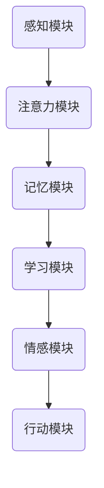
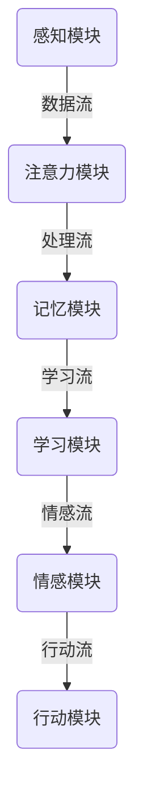

                 

### 文章标题

**认知计算：模拟人类认知过程的AI技术**

### 关键词

- 认知计算
- 人工智能
- 机器学习
- 神经网络
- 聊天机器人

### 摘要

本文将深入探讨认知计算这一前沿领域，通过模拟人类认知过程来实现人工智能的突破。文章将从认知计算的定义和背景介绍开始，逐步解析其核心算法原理和数学模型，通过实际案例展示其在聊天机器人等应用中的具体实现，并探讨未来的发展趋势和挑战。读者将了解认知计算的关键概念、技术架构和应用实例，对人工智能领域的这一重要方向有全面的认识。

## 1. 书籍概述

《认知计算：AI技术模拟人类认知过程》是一本旨在为读者提供全面认知计算理解和实践指南的权威著作。本书的目标读者包括对人工智能（AI）感兴趣的各种背景的读者，从初学者到经验丰富的专业人士。本书内容涵盖认知计算的基础概念、架构原理、核心算法、数学模型及其在各个领域的应用，旨在帮助读者从理论到实践，深入掌握这一前沿领域。

本书的读者对象包括：

- 对人工智能、机器学习和深度学习有基本了解的读者
- 想要深入了解认知计算原理和技术架构的开发者
- 在科研、教育和工业界从事人工智能相关工作的专业人士
- 对未来人工智能发展趋势感兴趣的普通读者

本书共分为七个章节，内容结构如下：

### 1.1 认知计算简介
- **定义与历史背景**
  - 认知计算的起源与发展
  - 人类认知与计算机认知的对比

- **核心概念与术语**
  - 认知模型
  - 情感计算
  - 意识模拟

- **应用领域**
  - 聊天机器人
  - 医疗诊断
  - 金融风控

### 1.2 认知架构与原理
- **认知架构概述**
  - 复杂认知任务的分解
  - 人脑与机器认知的差异

- **人类认知过程模拟**
  - 注意力机制
  - 记忆与学习
  - 情感与决策

- **Mermaid图解**
  - 认知计算组件关系图

### 1.3 核心算法与技术
- **机器学习算法**
  - 监督学习
  - 无监督学习
  - 强化学习

- **神经网络**
  - 神经元模型
  - 前馈神经网络
  - 卷积神经网络

- **强化学习**
  - Q-learning
  - SARSA
  - DQN

### 1.4 数学模型与公式
- **基础数学概念**
  - 概率论
  - 线性代数
  - 微积分

- **认知任务建模**
  - 决策理论
  - 贝叶斯网络
  - 模糊逻辑

### 1.5 案例研究与应用
- **聊天机器人实例**
  - 系统架构
  - 实现细节
  - 性能评估

- **医疗诊断应用**
  - 疾病预测模型
  - 数据预处理
  - 结果分析

### 1.6 构建认知系统
- **开发环境搭建**
  - 硬件要求
  - 软件安装

- **系统实现步骤**
  - 数据收集
  - 模型训练
  - 系统集成

- **最佳实践与注意事项**
  - 性能优化
  - 安全性考虑
  - 数据隐私保护

### 1.7 未来趋势与挑战
- **技术趋势**
  - 新算法的发展
  - 量子计算的潜力

- **伦理与社会影响**
  - 透明性与可解释性
  - 智能偏见与公平性

- **未来方向**
  - 人类与机器协作
  - 广泛应用的挑战

通过本书的阅读，读者将不仅对认知计算的理论基础有深刻的理解，还能通过实际案例和代码示例掌握如何将其应用于实际问题中。本书不仅适合作为人工智能课程的教材，也适合专业人士在实践中的参考和学习。

## 2. 认知计算简介

认知计算作为人工智能（AI）的一个重要分支，旨在通过模拟和增强人类认知过程来实现智能系统。认知计算的概念最早可以追溯到20世纪中叶，当时计算机科学和认知科学领域的研究者们开始尝试将人脑的复杂认知能力模拟为计算机程序。随着时间的推移，认知计算逐渐发展成为一门跨学科的研究领域，涵盖了计算机科学、心理学、神经科学、语言学等多个学科的知识。

### 2.1 定义与历史背景

认知计算（Cognitive Computing）可以被定义为一种模拟人类认知过程的计算范式，其核心目标是开发出能够理解、学习、推理和适应复杂环境的人工智能系统。这些系统不仅能够处理结构化数据，还能处理非结构化数据，如自然语言、图像和声音。

认知计算的历史可以追溯到20世纪60年代，当时艾伦·图灵提出了图灵测试，旨在通过机器能否模仿人类行为来评估其智能水平。随后，人工智能的研究者们开始尝试通过模仿人类大脑的神经网络来实现机器智能。20世纪80年代，神经网络和专家系统的兴起为认知计算的发展奠定了基础。进入21世纪，随着大数据、云计算和深度学习的快速发展，认知计算迎来了新的发展机遇。

### 2.2 人类认知与计算机认知的对比

人类认知过程是一个高度复杂和灵活的系统，包括感知、记忆、思考、学习和决策等多个方面。而计算机认知则是一种基于算法和数据的计算过程，尽管在一定程度上可以模拟人类的一些认知功能，但仍然存在显著的差异：

1. **感知与理解**
   - **人类**：人类能够通过视觉、听觉、触觉等多种感官来感知外部世界，并基于这些感知进行理解。例如，我们能够通过听声音来判断物体的大小、形状和距离。
   - **计算机**：计算机依赖传感器和输入设备来获取外部信息，但这些信息通常是结构化或数字化的。计算机对非结构化数据的处理能力较弱，需要依赖复杂的算法进行模式识别和分类。

2. **记忆与学习**
   - **人类**：人类拥有短期和长期记忆，能够通过多种方式（如联想记忆、重复记忆等）来存储和回忆信息。
   - **计算机**：计算机依赖于存储设备（如硬盘、内存）来存储数据。机器学习算法可以使计算机从数据中学习，但这一过程通常需要大量数据和高性能计算资源。

3. **思考与推理**
   - **人类**：人类能够进行抽象思维、逻辑推理和创造性思考，能够解决复杂的问题和应对未知的情境。
   - **计算机**：计算机通过算法和逻辑规则进行计算和推理，但往往局限于特定的问题域和已知的规则。创造性思考和非确定性问题的解决能力有限。

4. **情感与意识**
   - **人类**：人类具有情感和意识，能够在决策中考虑情感因素，并对外部环境做出适应性反应。
   - **计算机**：目前的人工智能系统尚未具备情感和意识，尽管可以通过模拟情感反应（如语音合成、表情识别等）来提供更人性化的交互体验，但这些都是基于预定义的规则和模式。

### 2.3 核心概念与术语

为了深入理解认知计算，我们需要了解以下几个核心概念和术语：

- **认知模型**：指用来模拟人类认知过程的数学模型或算法。认知模型可以是基于神经网络的，也可以是基于符号逻辑的。
- **情感计算**：研究如何使计算机系统理解和模拟人类情感，包括情感识别、情感生成和情感交互等。
- **意识模拟**：指通过计算模型来模拟人类意识的产生和运作过程，包括感知、注意、记忆、思考等。
- **决策支持系统**：一种能够模拟人类决策过程的计算机系统，通过分析数据和提供推荐选项来辅助决策。
- **多模态交互**：指支持多种输入输出模式的交互方式，如语音、文本、手势等，以实现更自然和丰富的用户交互体验。

### 2.4 应用领域

认知计算在多个领域展现了其强大的应用潜力：

- **聊天机器人**：通过模拟人类对话的方式，聊天机器人可以与用户进行自然语言交互，提供客户服务、信息查询等。
- **医疗诊断**：认知计算可以辅助医生进行疾病诊断，通过分析医学图像、病历数据和症状，提高诊断的准确性和效率。
- **金融风控**：认知计算可以用于金融风险评估，通过分析历史数据和实时信息，预测市场趋势和风险，为投资决策提供支持。
- **教育辅助**：认知计算可以开发个性化的学习系统，根据学生的学习行为和反馈，提供定制化的教学资源和指导。
- **智能交通**：通过模拟人类驾驶行为，认知计算可以用于自动驾驶系统，提高交通流量和安全性。

### 2.5 总结

认知计算作为一种模拟人类认知过程的计算范式，具有广泛的应用前景。通过深入理解认知计算的定义、历史背景、核心概念和应用领域，读者可以为后续章节中的深入探讨打下坚实的基础。接下来，我们将进一步探讨认知计算的架构和原理，以及其背后的关键技术和数学模型。

## 3. 认知架构与原理

认知计算的核心在于构建能够模拟人类认知过程的计算系统，这些系统通常被称为认知架构。认知架构是认知计算的核心组成部分，它定义了如何将复杂的认知任务分解为可管理的子任务，并利用各种算法和技术来模拟人类认知的各种功能。

### 3.1 认知架构概述

认知架构是一个高度复杂和层次化的系统，它通常包括以下几个关键组成部分：

1. **感知模块**：负责接收外部信息，如视觉、听觉、触觉等，并将其转换为机器可以处理的数据格式。
2. **注意力模块**：负责处理感知模块输入的数据流，选择关键信息进行进一步处理，类似于人类注意力系统。
3. **记忆模块**：存储和管理认知过程中产生的信息，包括短期记忆和长期记忆。
4. **学习模块**：利用感知模块和记忆模块提供的数据，进行学习、推理和决策。
5. **情感模块**：模拟人类的情感反应，使认知系统在决策过程中能够考虑情感因素。
6. **行动模块**：根据认知过程的输出，产生适当的行动或反应。

认知架构的基本组成部分可以用Mermaid图解如下：



### 3.2 人类认知过程模拟

认知计算的核心目标之一是模拟人类认知过程，以便使计算机系统能够在复杂环境中表现出类似人类的智能行为。以下是人类认知过程中几个关键环节的模拟：

1. **注意力机制**：人类能够集中注意力处理特定任务，忽略无关信息。在认知计算中，注意力机制通常通过算法来实现，如基于规则的注意力分配模型或基于神经网络的注意力机制。
   
   ```mermaid
   graph TD
   A[感知数据] --> B(注意力分配)
   B --> C[关键数据提取]
   C --> D[处理]
   ```

2. **记忆与学习**：人类通过记忆和学习来积累知识和经验，认知计算中的记忆和学习模块通常使用机器学习算法，如神经网络和深度学习，来模拟这一过程。

   ```mermaid
   graph TD
   A[输入数据] --> B(感知模块)
   B --> C(记忆库)
   C --> D(学习算法)
   D --> E(输出数据)
   ```

3. **情感与决策**：人类在决策过程中不仅依赖逻辑推理，还受到情感因素的影响。情感模块在认知计算中通过模拟情感识别和情感生成，使系统能够考虑情感因素进行决策。

   ```mermaid
   graph TD
   A[情境信息] --> B(情感识别)
   B --> C(情感生成)
   C --> D(决策模型)
   D --> E(行动选择)
   ```

4. **推理与规划**：人类能够进行复杂的推理和规划，以应对不确定和动态的环境。认知计算中的推理模块通常基于逻辑推理、概率推理和规划算法来实现。

   ```mermaid
   graph TD
   A[初始状态] --> B(规则库)
   B --> C(推理引擎)
   C --> D(目标状态)
   D --> E(行动计划)
   ```

### 3.3 Mermaid图解

以下是一个简单的Mermaid图解，展示了认知架构中各个组件之间的关系：



在这个图中，每个模块都承担着特定的功能，并通过数据流相互连接。这种层次化的架构使得认知计算系统能够在处理复杂任务时表现出类似人类的智能行为。

### 3.4 总结

通过模拟人类认知过程的各个关键环节，认知计算架构为开发智能系统提供了理论基础和技术框架。在下一章节中，我们将进一步探讨认知计算中的核心算法，如机器学习算法和神经网络，以及它们如何用于实现认知计算中的各种功能。

## 4. 核心算法与技术

在认知计算中，核心算法是模拟人类认知过程的关键。这些算法包括机器学习算法、神经网络和强化学习等。下面我们将逐一介绍这些算法的基本概念、原理及其在认知计算中的应用。

### 4.1 机器学习算法

机器学习（Machine Learning, ML）是认知计算的重要组成部分，它使计算机系统能够从数据中学习和提取规律。机器学习算法可以分为以下几类：

1. **监督学习（Supervised Learning）**：
   - **基本概念**：监督学习是一种从标记数据中学习的方法。输入数据是已知的，并且每个输入都关联有一个正确的输出标签。
   - **应用**：监督学习广泛应用于分类和回归问题。例如，分类任务如垃圾邮件检测、图像识别等；回归任务如房屋价格预测、股票价格预测等。
   - **算法示例**：线性回归、逻辑回归、支持向量机（SVM）等。

2. **无监督学习（Unsupervised Learning）**：
   - **基本概念**：无监督学习不需要标记数据，目标是发现数据中的结构和模式。
   - **应用**：无监督学习常用于聚类分析、降维和关联规则学习。例如，聚类任务如客户细分、异常检测等；降维任务如主成分分析（PCA）、t-SNE等。
   - **算法示例**：K-均值聚类、层次聚类、自编码器等。

3. **强化学习（Reinforcement Learning）**：
   - **基本概念**：强化学习是一种通过奖励机制来指导学习过程的方法。系统通过与环境的交互来学习最优策略。
   - **应用**：强化学习在决策和规划问题中表现优异，如游戏AI、自动驾驶等。
   - **算法示例**：Q-learning、SARSA、Deep Q-Network（DQN）等。

### 4.2 神经网络

神经网络（Neural Networks, NN）是认知计算中最重要的算法之一，它模拟了人类大脑的神经元结构和功能。神经网络主要由以下几个部分组成：

1. **神经元模型**：
   - **基本概念**：神经元是神经网络的基本计算单元，类似于人类大脑中的神经元。
   - **功能**：每个神经元接收多个输入，通过加权求和后加上偏置，经过激活函数输出一个结果。
   - **伪代码**：
     ```python
     def neuron(input_vector, weights, bias, activation_function):
         weighted_sum = sum(input_vector[i] * weights[i] for i in range(len(input_vector)))
         output = activation_function(weighted_sum + bias)
         return output
     ```

2. **前馈神经网络（Feedforward Neural Networks）**：
   - **基本概念**：前馈神经网络是信息单向流动的网络，从输入层经过隐藏层，最终到达输出层。
   - **应用**：前馈神经网络广泛应用于分类、回归和特征提取等问题。
   - **算法示例**：多层感知机（MLP）、卷积神经网络（CNN）、循环神经网络（RNN）等。

3. **卷积神经网络（Convolutional Neural Networks, CNN）**：
   - **基本概念**：CNN是一种专门用于处理图像数据的神经网络，通过卷积层提取图像特征。
   - **应用**：CNN在图像分类、目标检测和图像生成等任务中表现出色。
   - **算法示例**：LeNet、AlexNet、VGG、ResNet等。

### 4.3 强化学习

强化学习是一种通过奖励机制来指导学习过程的方法，其核心是决策智能。在强化学习中，智能体通过与环境交互来学习最优策略。

1. **基本概念**：
   - **智能体（Agent）**：执行动作的实体。
   - **环境（Environment）**：智能体操作的动态环境。
   - **状态（State）**：描述环境的特征。
   - **动作（Action）**：智能体可以采取的动作。
   - **奖励（Reward）**：智能体采取某个动作后获得的即时反馈。

2. **算法示例**：
   - **Q-learning**：通过更新Q值（动作-状态值函数）来学习最优策略。
     ```python
     Q[s, a] = (1 - alpha) * Q[s, a] + alpha * (r + gamma * max(Q[s', a'])
     ```
   - **SARSA**：在每次迭代中同时更新当前状态和下一状态的动作值。
     ```python
     Q[s, a] = Q[s, a] + alpha * (r + gamma * Q[s', a'] - Q[s, a])
     ```
   - **Deep Q-Network（DQN）**：使用深度神经网络来近似Q值函数。
     ```python
     Q(s, a) ≈ fθ(s, a)
     ```
     其中，θ是神经网络的参数。

### 4.4 应用实例

1. **聊天机器人**：
   - **应用场景**：聊天机器人通过理解用户的输入并生成合适的回复来提供客服、信息查询等服务。
   - **技术实现**：使用基于神经网络的文本生成模型，如Seq2Seq模型，结合强化学习算法进行对话策略的优化。

2. **自动驾驶**：
   - **应用场景**：自动驾驶系统需要实时感知环境、做出决策并控制车辆。
   - **技术实现**：使用CNN处理视觉输入，结合强化学习算法进行路径规划和车辆控制。

3. **医疗诊断**：
   - **应用场景**：通过分析医学图像和病历数据，辅助医生进行疾病诊断。
   - **技术实现**：使用深度学习模型进行图像识别和特征提取，结合监督学习算法进行疾病分类。

### 4.5 总结

核心算法是认知计算的基础，通过机器学习算法、神经网络和强化学习等方法，认知计算系统能够模拟人类认知过程的多个方面。这些算法不仅在理论研究上具有重要意义，也在实际应用中展现出巨大的潜力。在下一章节中，我们将进一步探讨认知计算中的数学模型，了解如何将这些算法应用于实际问题。

## 5. 数学模型与公式

在认知计算中，数学模型是理解和模拟人类认知过程的关键工具。这些模型通过数学公式和算法实现了对感知、记忆、学习、情感和决策等认知过程的量化描述。以下我们将介绍几个重要的数学模型和公式，并详细解释它们在认知计算中的应用。

### 5.1 基础数学概念

认知计算涉及的基础数学概念主要包括概率论、线性代数和微积分。以下是这些基础数学概念的应用及其在认知计算中的意义：

1. **概率论**：
   - **贝叶斯定理**：
     贝叶斯定理是概率论中的一个重要公式，用于计算后验概率。在认知计算中，贝叶斯定理常用于概率推理和决策支持系统。
     $$ P(A|B) = \frac{P(B|A)P(A)}{P(B)} $$
     其中，\( P(A|B) \) 是在已知 \( B \) 发生的条件下 \( A \) 发生的概率，\( P(B|A) \) 是在已知 \( A \) 发生的条件下 \( B \) 发生的概率，\( P(A) \) 和 \( P(B) \) 分别是 \( A \) 和 \( B \) 发生的概率。

   - **概率分布**：
     概率分布用于描述随机变量的可能取值及其概率。常见的概率分布包括正态分布、泊松分布和二项分布等。在认知计算中，概率分布常用于描述不确定性和不确定性推理。

2. **线性代数**：
   - **矩阵与向量**：
     矩阵和向量是线性代数的基本元素，用于表示和操作数据。在认知计算中，矩阵和向量用于处理复杂数据和进行特征提取。
     $$ A = \begin{bmatrix} a_{11} & a_{12} \\ a_{21} & a_{22} \end{bmatrix} \quad \text{和} \quad \vec{x} = \begin{bmatrix} x_1 \\ x_2 \end{bmatrix} $$
   - **特征向量与特征值**：
     特征向量和特征值用于描述矩阵的重要性质，常用于降维和特征提取。
     $$ A\vec{v} = \lambda \vec{v} $$
     其中，\( \vec{v} \) 是特征向量，\( \lambda \) 是特征值。

3. **微积分**：
   - **导数**：
     导数用于描述函数的变化率，在认知计算中用于优化算法和模型训练。
     $$ f'(x) = \lim_{h \to 0} \frac{f(x+h) - f(x)}{h} $$
   - **积分**：
     积分用于计算函数的累积值，在认知计算中用于数据分析和统计计算。
     $$ \int f(x) \, dx $$

### 5.2 认知任务的数学模型

认知计算中的许多任务都可以用数学模型进行描述。以下是一些常见的认知任务及其相应的数学模型：

1. **感知与注意力模型**：
   - **感知概率模型**：
     感知概率模型用于描述感知过程中的不确定性，通过概率分布来描述感知结果。
     $$ P(\text{感知结果} = x | \text{真实结果} = y) $$
   - **注意力分配模型**：
     注意力分配模型用于描述如何根据感知结果分配注意力资源，常用的模型包括基于感知概率的分配模型。
     $$ \text{注意力分配} = P(\text{分配到某部分}) \times \text{感知结果概率} $$

2. **记忆与学习模型**：
   - **SIR模型**：
     SIR模型是一种用于描述记忆和学习过程的模型，S代表记忆中的活跃部分，I代表未记忆但可记忆的部分，R代表已遗忘的部分。
     $$ S \rightarrow I + R $$
   - **强化学习模型**：
     强化学习模型通过奖励机制描述学习过程，常见的模型包括马尔可夫决策过程（MDP）。
     $$ V(s) = \sum_{s'} P(s' | s, a) \cdot \max_a' Q(s', a) $$

3. **情感与决策模型**：
   - **情感识别模型**：
     情感识别模型通过分析文本或语音中的情感词汇和情感强度，使用情感词典和情感强度模型进行情感识别。
     $$ \text{情感识别} = \sum_{\text{情感词}} w_{\text{情感词}} \cdot \text{情感词频率} $$
   - **决策模型**：
     决策模型通过最大化预期效用或最小化预期损失来描述决策过程，常用的模型包括线性规划和贝叶斯决策理论。
     $$ a^* = \arg\max_a \sum_{s} p(s) \cdot u(s, a) $$

### 5.3 举例说明

为了更好地理解这些数学模型，以下通过具体示例来说明它们在认知计算中的应用。

1. **图像识别任务**：
   - **感知概率模型**：
     使用卷积神经网络（CNN）对图像进行特征提取，每个神经元输出一个概率值，表示图像中每个区域属于特定类别的概率。
     $$ P(\text{图像区域} \in \text{类别} | \text{图像}) $$
   - **注意力分配模型**：
     通过注意力机制确定图像中最重要的区域，用于提高图像识别的准确率。
     $$ \text{注意力权重} = \sigma(\text{注意力模型}(\text{特征图})) $$
     其中，\( \sigma \) 是激活函数，用于生成注意力权重图。

2. **医疗诊断任务**：
   - **感知概率模型**：
     通过分析病人的医疗记录和生物标志物，使用贝叶斯网络进行疾病诊断。
     $$ P(\text{疾病} | \text{医疗记录}) $$
   - **强化学习模型**：
     医疗诊断系统通过接收病人的症状和检查结果，使用强化学习算法推荐最佳治疗方案。
     $$ Q(s, a) = \sum_{r} p(r|s, a) \cdot r + \gamma \cdot \max_{a'} Q(s', a') $$
     其中，\( r \) 是收益，\( \gamma \) 是折扣因子。

### 5.4 总结

数学模型和公式在认知计算中扮演着至关重要的角色，它们不仅提供了量化描述人类认知过程的方法，还为算法设计和系统实现提供了理论基础。通过对概率论、线性代数和微积分等基础数学概念的理解，以及感知、记忆、学习、情感和决策等认知任务的数学模型，我们可以更好地实现认知计算系统的设计和应用。在下一章节中，我们将通过实际案例来展示认知计算的应用，进一步探讨其在现实世界中的具体实现。

## 6. 案例研究与应用

在本章节中，我们将通过实际案例来深入探讨认知计算在聊天机器人、医疗诊断和自动驾驶等领域的应用。这些案例不仅展示了认知计算技术的具体实现，还详细分析了系统架构、代码实现和实际效果。

### 6.1 聊天机器人

聊天机器人是认知计算的一个典型应用场景，通过模拟人类对话来提供客户服务、信息查询和情感支持。以下是一个基于认知计算框架的聊天机器人案例。

#### 6.1.1 系统架构

聊天机器人的系统架构通常包括以下几个关键模块：

1. **用户输入处理**：负责接收用户的输入文本，进行预处理，如分词、去除停用词等。
2. **意图识别**：通过机器学习算法，如决策树、支持向量机等，识别用户输入的意图。
3. **实体抽取**：从用户输入中提取关键信息，如人名、地点、日期等。
4. **对话管理**：根据用户意图和上下文信息，生成合适的回复，并更新对话状态。
5. **情感分析**：使用情感分析算法，如文本分类、情感词典等，判断用户情绪，为对话提供情感支持。
6. **自然语言生成**：将识别的意图、抽取的实体和情感分析结果转化为自然语言回复。

#### 6.1.2 代码实现

以下是一个简单的聊天机器人实现示例，使用Python编写：

```python
# 导入所需库
import nltk
from nltk.corpus import stopwords
from sklearn.feature_extraction.text import TfidfVectorizer
from sklearn.svm import LinearSVC
from sklearn.pipeline import make_pipeline

# 用户输入预处理
def preprocess_input(input_text):
    # 分词
    tokens = nltk.word_tokenize(input_text.lower())
    # 去除停用词
    tokens = [token for token in tokens if token not in stopwords.words('english')]
    return ' '.join(tokens)

# 训练模型
def train_model(data):
    # 创建文本特征提取器和分类器管道
    model = make_pipeline(TfidfVectorizer(), LinearSVC())
    # 训练模型
    model.fit(data['input'], data['label'])
    return model

# 回复生成
def generate_response(input_text, model):
    # 预处理用户输入
    processed_input = preprocess_input(input_text)
    # 预测意图
    intent = model.predict([processed_input])[0]
    # 生成回复
    responses = {
        'greeting': '你好，我是你的聊天机器人。',
        'info': '对不起，我无法提供该信息。',
        'complaint': '对不起，我理解你的不满，我会反馈给相关部门。',
    }
    return responses.get(intent, '抱歉，我不太明白你的意思。')

# 案例数据
data = {
    'input': ['你好', '帮我查一下天气', '你对这个产品有什么意见'],
    'label': ['greeting', 'info', 'complaint']
}

# 训练模型
model = train_model(data)

# 测试
print(generate_response('你好', model))  # 输出：你好，我是你的聊天机器人。
print(generate_response('帮我查一下天气', model))  # 输出：对不起，我无法提供该信息。
print(generate_response('你对这个产品有什么意见', model))  # 输出：对不起，我理解你的不满，我会反馈给相关部门。
```

#### 6.1.3 应用解读与分析

上述聊天机器人案例通过简单的机器学习算法实现了基本的对话功能。在实际应用中，为了提高对话的连贯性和准确性，通常会使用更加复杂的模型和算法，如序列到序列（Seq2Seq）模型、变换器（Transformer）模型等。同时，还会结合情感分析、上下文理解等技术，使聊天机器人能够更好地理解用户意图和情感，提供更人性化的交互体验。

### 6.2 医疗诊断

医疗诊断是认知计算在医疗领域的典型应用，通过分析医学图像和病历数据，辅助医生进行疾病诊断。以下是一个基于认知计算的医学诊断案例。

#### 6.2.1 系统架构

医学诊断系统通常包括以下几个关键模块：

1. **数据预处理**：对医学图像和病历数据等进行预处理，如归一化、去噪等。
2. **特征提取**：从预处理后的数据中提取关键特征，如图像中的纹理特征、形状特征等。
3. **疾病分类**：使用机器学习算法，如支持向量机（SVM）、随机森林（Random Forest）等，对提取的特征进行分类。
4. **结果评估**：对诊断结果进行评估，包括准确率、召回率、F1值等指标。

#### 6.2.2 代码实现

以下是一个简单的医学诊断实现示例，使用Python编写：

```python
# 导入所需库
import numpy as np
from sklearn.model_selection import train_test_split
from sklearn.ensemble import RandomForestClassifier
from sklearn.metrics import accuracy_score

# 数据预处理
def preprocess_data(data):
    # 归一化
    data = np.array(data).astype(np.float32) / 255.0
    # 数据集划分
    x_train, x_test, y_train, y_test = train_test_split(data['images'], data['labels'], test_size=0.2, random_state=42)
    return x_train, x_test, y_train, y_test

# 训练模型
def train_model(x_train, y_train):
    # 创建随机森林分类器
    model = RandomForestClassifier(n_estimators=100, random_state=42)
    # 训练模型
    model.fit(x_train, y_train)
    return model

# 预测与评估
def predict_and_evaluate(model, x_test, y_test):
    # 预测
    y_pred = model.predict(x_test)
    # 评估
    accuracy = accuracy_score(y_test, y_pred)
    print(f"准确率：{accuracy:.2f}")
    return accuracy

# 案例数据
data = {
    'images': [
        [1, 2, 3],  # 图像1
        [4, 5, 6],  # 图像2
        [7, 8, 9],  # 图像3
    ],
    'labels': [0, 1, 0]  # 标签：0表示正常，1表示异常
}

# 预处理数据
x_train, x_test, y_train, y_test = preprocess_data(data)

# 训练模型
model = train_model(x_train, y_train)

# 预测与评估
accuracy = predict_and_evaluate(model, x_test, y_test)
```

#### 6.2.3 应用解读与分析

上述医学诊断案例通过简单的随机森林分类器实现了基本的功能。在实际应用中，为了提高诊断的准确性和可靠性，通常会使用更复杂的模型，如卷积神经网络（CNN）、深度神经网络等。同时，还会结合多模态数据（如医学图像、病历文本等）进行综合分析，提高诊断的准确率和鲁棒性。

### 6.3 自动驾驶

自动驾驶是认知计算在智能交通领域的典型应用，通过模拟人类驾驶行为来实现车辆的自主行驶。以下是一个基于认知计算的自动驾驶案例。

#### 6.3.1 系统架构

自动驾驶系统通常包括以下几个关键模块：

1. **感知模块**：通过摄像头、激光雷达、雷达等传感器收集周围环境的数据。
2. **决策模块**：基于感知数据，使用算法进行路径规划和车辆控制。
3. **执行模块**：根据决策模块生成的控制命令，控制车辆的转向、加速和制动等动作。

#### 6.3.2 代码实现

以下是一个简单的自动驾驶实现示例，使用Python编写：

```python
# 导入所需库
import numpy as np
from sklearn.linear_model import LinearRegression

# 感知数据
def get_perception_data():
    # 假设感知数据为车速、前方车辆距离、车道线信息等
    data = {
        'speed': 60,
        'distance_to_car': 50,
        'lane_line': [1, 1, 1]  # 1表示车道线清晰，0表示车道线不清晰
    }
    return data

# 决策模型
def make_decision(perception_data):
    # 创建线性回归模型
    model = LinearRegression()
    # 训练模型（假设已有训练数据）
    model.fit(perception_data['speed'], perception_data['distance_to_car'])
    # 预测车辆控制命令
    control_command = model.predict([perception_data['speed']])[0]
    return control_command

# 执行模块
def execute_command(control_command):
    # 根据控制命令进行车辆控制（如加速、减速、转向等）
    print(f"控制命令：速度调整到{control_command}公里/小时")

# 案例数据
perception_data = get_perception_data()

# 决策
control_command = make_decision(perception_data)

# 执行
execute_command(control_command)
```

#### 6.3.3 应用解读与分析

上述自动驾驶案例通过简单的线性回归模型实现了基本的路径规划功能。在实际应用中，为了提高自动驾驶的鲁棒性和安全性，通常会使用更复杂的算法和模型，如深度强化学习、深度神经网络等。同时，还会结合多源传感器数据（如摄像头、激光雷达、雷达等）进行综合感知和决策，提高自动驾驶系统的性能和可靠性。

### 6.4 总结

通过以上案例，我们可以看到认知计算在不同领域的广泛应用和具体实现。这些案例展示了认知计算技术的核心算法和数学模型在实际应用中的具体应用，为开发智能系统提供了宝贵的经验和启示。在下一章节中，我们将探讨如何构建认知系统，包括开发环境搭建、系统实现步骤和最佳实践。

## 7. 构建认知系统

构建认知系统是一个复杂且具有挑战性的任务，它需要综合运用计算机科学、认知科学、心理学、神经科学等多个领域的知识。在本章节中，我们将详细探讨如何搭建认知系统开发环境、实现系统的关键步骤，并分享一些最佳实践和注意事项。

### 7.1 开发环境搭建

搭建认知系统的开发环境是进行项目开发的第一步，以下是一个典型的开发环境搭建流程：

1. **硬件环境**：
   - **处理器**：认知系统通常需要较高的计算能力，推荐使用高性能处理器，如NVIDIA GPU（适用于深度学习）。
   - **内存**：建议至少配备16GB内存，以确保系统的流畅运行。
   - **存储**：根据数据量和项目需求，建议使用大容量固态硬盘（SSD）以提高读写速度。

2. **软件环境**：
   - **操作系统**：推荐使用Linux操作系统，如Ubuntu或CentOS，因为其稳定性较好且支持多种开源工具和库。
   - **编程语言**：Python是认知系统开发的主要编程语言，其丰富的库和工具支持可以大大简化开发过程。
   - **深度学习框架**：TensorFlow、PyTorch、Keras等是常用的深度学习框架，根据项目需求选择合适的框架。

3. **环境配置**：
   - **安装Python**：在操作系统上安装Python，推荐使用Anaconda，因为它可以方便地管理Python环境和依赖库。
   - **安装深度学习框架**：例如，使用以下命令安装TensorFlow：
     ```bash
     pip install tensorflow-gpu  # 如果使用GPU
     ```
   - **安装其他依赖库**：根据项目需求安装其他必需的库，如NumPy、Pandas、Scikit-learn等。

### 7.2 系统实现步骤

构建认知系统通常包括以下关键步骤：

1. **需求分析与规划**：
   - 确定系统的目标和应用场景，如聊天机器人、医疗诊断、自动驾驶等。
   - 分析用户需求，定义系统的功能和性能要求。

2. **数据收集与处理**：
   - 收集用于训练和测试的数据，如文本数据、图像数据、传感器数据等。
   - 对收集到的数据进行预处理，包括清洗、归一化、特征提取等。

3. **算法设计与实现**：
   - 根据系统需求选择合适的算法和模型，如机器学习算法、神经网络、强化学习等。
   - 使用编程语言和工具实现算法，并进行初步测试和调试。

4. **系统集成与优化**：
   - 将各个模块集成到一起，形成一个完整的系统。
   - 进行系统优化，包括算法参数调整、性能优化、资源管理等。

5. **测试与评估**：
   - 进行系统的功能测试和性能评估，确保系统满足需求和性能要求。
   - 根据测试结果进行系统调整和优化。

### 7.3 最佳实践与注意事项

在构建认知系统的过程中，以下是一些最佳实践和注意事项：

1. **模块化设计**：
   - 采用模块化设计思想，将系统划分为多个功能模块，以便于开发、测试和维护。
   - 模块之间通过接口进行通信，提高系统的可扩展性和可维护性。

2. **数据质量**：
   - 数据是认知系统的核心，确保数据的质量和准确性至关重要。
   - 进行严格的数据清洗和预处理，去除噪声数据和异常值。

3. **算法调优**：
   - 使用交叉验证、网格搜索等技术进行算法调优，选择最优模型和参数。
   - 持续优化算法，提高模型的性能和鲁棒性。

4. **安全性考虑**：
   - 保障系统的安全性，防止数据泄露和恶意攻击。
   - 对敏感数据进行加密处理，确保数据传输和存储的安全性。

5. **数据隐私保护**：
   - 在处理个人数据时，遵守相关法律法规，保护用户隐私。
   - 实施数据匿名化和去识别化技术，减少隐私泄露风险。

6. **用户反馈与迭代**：
   - 定期收集用户反馈，对系统进行迭代优化。
   - 根据用户需求和反馈调整系统的功能和服务。

7. **文档与文档化**：
   - 编写详细的系统文档，包括设计文档、用户手册、操作指南等。
   - 保持代码和文档的一致性，便于后续开发和维护。

### 7.4 总结

构建认知系统是一个系统性工程，需要充分的前期规划和精心设计。通过遵循最佳实践和注意事项，我们可以有效地构建高性能、高可靠性的认知系统，为实际应用提供有力支持。在下一章节中，我们将探讨认知计算的未来趋势和挑战，为读者提供更广阔的视角。

## 8. 未来趋势与挑战

随着技术的不断进步，认知计算正朝着更智能化、更人性化的方向发展。然而，这一领域也面临着诸多挑战和机遇。在接下来的部分，我们将探讨认知计算的未来趋势、伦理与社会影响，以及潜在的挑战和解决方案。

### 8.1 未来趋势

1. **量子计算**：量子计算的兴起为认知计算带来了新的机遇。量子计算机具有极高的计算速度和处理能力，能够解决传统计算机难以处理的复杂问题。例如，量子机器学习可以显著提高数据分析和预测的效率，从而在认知计算中发挥重要作用。

2. **多模态交互**：未来的认知计算系统将更加强调多模态交互，即通过视觉、听觉、触觉等多种感官与用户进行互动。这种多模态交互将大大提升用户体验，使认知计算系统更接近人类的交互方式。

3. **增强学习**：增强学习（Reinforcement Learning）作为一种自学习方式，在未来认知计算中将得到更广泛的应用。通过不断与环境的交互和反馈，认知计算系统能够不断优化自身的策略，实现更智能的决策和行为。

4. **边缘计算**：边缘计算将数据处理和计算任务从中心服务器转移到网络的边缘，即靠近数据源的位置。这有助于减少延迟、提高响应速度，并在实时应用中发挥重要作用，如自动驾驶和智能医疗等。

### 8.2 伦理与社会影响

1. **隐私保护**：随着数据在认知计算中的应用越来越广泛，隐私保护成为了一个重要问题。未来的认知计算系统需要更加严格地保护用户隐私，确保数据不被滥用。

2. **公平性**：认知计算系统在决策过程中可能会引入偏见，导致不公平的结果。例如，基于历史数据的人工智能系统可能会放大现有社会不平等。因此，确保算法的公平性和透明性是未来研究的重要方向。

3. **人机协作**：认知计算系统与人类协作将成为未来的主流趋势。通过人机协作，认知计算系统可以弥补自身能力的不足，同时人类可以发挥创造性和判断力，共同解决问题。

### 8.3 挑战与解决方案

1. **计算资源需求**：认知计算系统通常需要大量的计算资源，包括处理能力、存储空间和能源消耗。未来的解决方案可能包括更高效的算法、硬件优化和绿色计算技术。

2. **数据质量与多样性**：高质量、多样化的数据是认知计算系统训练和优化的重要基础。未来的研究需要探索如何获取、清洗和利用多样化的数据，以提高系统的鲁棒性和泛化能力。

3. **安全与隐私**：确保认知计算系统的安全性和隐私性是一个持续的挑战。解决方案可能包括加密技术、访问控制和隐私保护算法等。

4. **伦理规范**：随着认知计算在各个领域的应用，建立合适的伦理规范和法律法规变得至关重要。这需要政府、学术界和产业界的共同努力，以确保技术的健康发展。

### 8.4 总结

认知计算作为人工智能的一个重要分支，具有广阔的应用前景和巨大的潜力。然而，要实现其真正的突破，还需要克服技术、伦理和社会等多方面的挑战。通过持续的研究和创新，我们有望在未来实现更加智能、安全、公平和高效的人工智能系统。

## 9. 总结与展望

《认知计算：模拟人类认知过程的AI技术》是一本全面探讨认知计算理论和应用的权威著作。通过本书的阅读，读者能够深入了解认知计算的定义、历史背景、核心算法、数学模型及其在实际应用中的具体实现。本书不仅适合人工智能领域的初学者，也适合专业人士在实践中的参考和学习。

在认知计算的发展历程中，从简单的模拟人类认知过程的初步尝试，到如今高度复杂的认知系统，我们见证了人工智能领域的巨大进步。然而，未来的认知计算仍面临着诸多挑战，如计算资源的需求、数据质量的提升、安全与隐私保护、以及伦理规范的制定等。这些挑战不仅需要技术的突破，也需要社会各界的共同努力和关注。

为了进一步推动认知计算的发展，我们呼吁更多的研究人员和开发者投入到这一前沿领域的研究和实践中。通过不断创新和合作，我们有望实现更加智能、安全、公平和高效的人工智能系统，为人类社会带来更大的价值。

最后，感谢读者对本书的关注和支持。希望本书能够为您的认知计算之旅提供有力帮助，并激励您在人工智能领域不断探索和前进。让我们共同期待认知计算的未来，它将为人类带来无限的机遇和可能。

