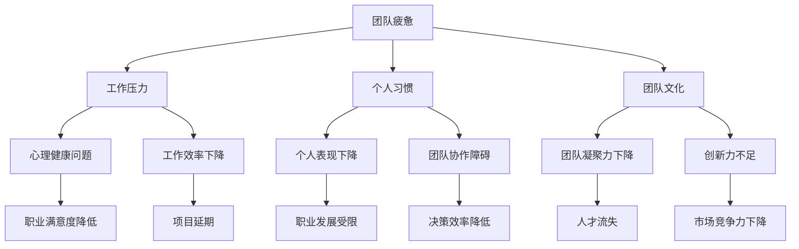

                 

## 引言

### 书籍背景与目的

在现代职场中，团队疲惫现象愈发普遍。团队成员长时间处于高压环境下，常常感到身心俱疲，工作效率下降，甚至影响到个人的职业发展和团队的整体绩效。这种现象不仅存在于初创公司，也在大型企业中广泛存在。团队疲惫不仅影响了员工的健康，还降低了团队的协作能力和创新能力，成为企业发展的一大障碍。

《让团队疲惫的坏习惯》这本书旨在深入剖析导致团队疲惫的常见原因和坏习惯，并提供具体的解决策略。本书的核心目的是帮助读者了解团队疲惫的成因，识别并改变不良习惯，从而提升团队的凝聚力和工作效率，实现个人与团队的共同成长。

本书分为四个主要部分：

1. **团队疲惫的成因**：介绍导致团队疲惫的常见原因，如工作压力、个人习惯和团队文化等。
2. **坏习惯的类型与影响**：详细探讨常见的坏习惯类型及其对团队的影响。
3. **改变坏习惯的策略**：提供识别与自我反思、制定行动计划、实施与持续改进等策略，帮助团队克服疲惫。
4. **实际案例分析**：通过实际案例展示如何解决团队疲惫问题，为读者提供实践参考。

通过这本书，读者不仅可以深入了解团队疲惫的成因和影响，还能获得具体可行的解决方案，助力团队实现高效协作和持续发展。

### 团队疲惫的危害

团队疲惫不仅仅是一种心理状态，它对团队成员和整个团队都有着深远的影响。首先，从个人层面来看，长期处于疲惫状态会导致员工身心健康问题，如失眠、焦虑、抑郁等。这些心理问题不仅影响员工的工作表现，还可能对他们的生活质量和幸福感造成负面影响。此外，团队疲惫还可能导致员工对工作产生厌倦情绪，降低工作积极性和创造力，最终影响其职业发展和职业满意度。

从团队层面来看，团队疲惫会显著降低整体工作效率和生产力。当团队成员感到疲惫时，他们往往无法保持最佳的工作状态，容易犯错，决策效率降低，团队协作受到阻碍。这不仅导致项目延期，还可能影响客户满意度，损害企业的市场声誉。长期来看，团队疲惫还可能导致优秀人才的流失，影响团队的人才稳定性和成长。

更为严重的是，团队疲惫可能对企业的长期战略目标产生负面影响。在高度竞争的市场环境中，企业需要不断创新和迅速响应变化。然而，疲惫的团队往往缺乏创新动力和灵活性，无法有效应对市场挑战。这不仅限制了企业的成长潜力，还可能导致其在竞争中处于不利地位。

因此，识别和解决团队疲惫问题对于企业而言至关重要。通过了解导致团队疲惫的原因和坏习惯，采取有效的策略和措施，企业可以提升团队的整体表现，增强员工的幸福感和归属感，从而实现可持续的发展目标。

### 核心概念与联系

要全面理解团队疲惫的成因和解决方法，首先需要了解几个核心概念及其相互关系。以下是这些概念的定义及其在团队管理中的重要性：

1. **团队疲惫**：指团队成员在长时间高压工作或不良工作环境下，身心状态极度疲惫，工作效率降低，创造力下降的现象。
2. **工作压力**：源于工作要求与个人能力之间的不平衡，可能导致焦虑、紧张和疲惫。
3. **个人习惯**：团队成员在长期工作中养成的行为模式，包括工作方式、沟通风格和时间管理策略等。
4. **团队文化**：团队内部共同遵循的价值观、信念和行为规范，影响成员的态度和行为。

这些概念之间的关系可以用以下Mermaid流程图来表示：



通过这个流程图，我们可以清晰地看到各个概念之间的相互影响和作用。工作压力、个人习惯和团队文化都是导致团队疲惫的重要因素，而团队疲惫又会反过来影响这些因素。理解这些核心概念及其相互关系，有助于我们在后续章节中深入探讨如何识别和解决团队疲惫问题。

### 核心算法原理讲解

为了深入理解团队疲惫的成因和解决方法，我们可以借助一些核心算法原理来进行分析。以下将使用伪代码详细阐述这些原理，并结合实际案例进行讲解。

#### 原理1：工作压力计算

工作压力（Work Stress）是导致团队疲惫的重要因素之一。工作压力可以用以下伪代码表示：

```pseudo
function calculateWorkStress(workload, skills):
    if workload > 3 * skills:
        stressLevel = "高"
    else if workload > 2 * skills:
        stressLevel = "中"
    else:
        stressLevel = "低"
    return stressLevel
```

在实际应用中，我们可以通过以下案例进行说明：

**案例1**：一个项目团队成员（技能值：5）每月需要完成的工作量（工作量值：15）。使用上述函数计算其工作压力：

```pseudo
stresLevel = calculateWorkStress(15, 5)
```

结果为“高”，这表明该成员的工作压力较大，可能容易导致疲惫。

#### 原理2：个人习惯影响评估

个人习惯（Personal Habits）对团队绩效有显著影响。以下是一个评估个人习惯影响的工作流程：

```pseudo
function assessHabits(invalidMeetings, lackOfFeedback, procrastination):
    habitScore = 0
    if invalidMeetings > 3:
        habitScore += 1
    if lackOfFeedback > 2:
        habitScore += 1
    if procrastination > 2:
        habitScore += 1
    return habitScore
```

**案例2**：评估一个团队成员的个人习惯（无效会议次数：5，缺乏反馈次数：3，拖延次数：4）。使用上述函数计算其习惯得分：

```pseudo
habitScore = assessHabits(5, 3, 4)
```

结果为“3分”，说明该成员在个人习惯方面存在一定问题，可能影响团队协作和效率。

#### 原理3：团队文化度量

团队文化（Team Culture）是影响团队疲惫的重要因素。以下是一个度量团队文化的方法：

```pseudo
function measureTeamCulture(communicationScore, collaborationScore, innovationScore):
    totalScore = communicationScore + collaborationScore + innovationScore
    if totalScore > 15:
        cultureQuality = "积极"
    else if totalScore > 10:
        cultureQuality = "一般"
    else:
        cultureQuality = "消极"
    return cultureQuality
```

**案例3**：评估一个团队的团队文化（沟通分数：5，协作分数：4，创新分数：3）。使用上述函数计算其团队文化质量：

```pseudo
cultureQuality = measureTeamCulture(5, 4, 3)
```

结果为“一般”，说明该团队在团队文化方面需要进一步提升。

#### 原理4：团队绩效评估

团队绩效（Team Performance）受团队疲惫影响。以下是一个评估团队绩效的算法：

```pseudo
function assessTeamPerformance(stressLevel, habitScore, cultureQuality):
    if stressLevel == "高" and habitScore > 2 and cultureQuality == "消极":
        performance = "差"
    else if stressLevel == "高" or habitScore > 2 or cultureQuality == "消极":
        performance = "一般"
    else:
        performance = "好"
    return performance
```

**案例4**：结合前述案例，评估一个团队的绩效：

```pseudo
performance = assessTeamPerformance("高", 3, "一般")
```

结果为“差”，表明当前团队处于疲惫状态，需要采取针对性措施改善。

通过以上算法原理和实际案例，我们可以看到团队疲惫是由多种因素共同作用的结果。理解这些原理有助于我们更好地识别和解决团队疲惫问题，提升团队的整体绩效。

### 数学模型和公式

在理解团队疲惫的成因和解决方法时，数学模型和公式能够帮助我们量化分析问题，提供更加精确的视角。以下将介绍几个关键的数学模型和公式，用于评估团队疲惫程度、工作压力、个人习惯影响以及团队文化质量。

#### 1. 工作压力模型

工作压力（Work Stress）可以通过以下公式进行量化评估：

\[ \text{Work Stress} = \frac{\text{Workload}}{\text{Skills}} \]

其中，Workload 表示工作量，Skills 表示团队成员的技能水平。如果 Workload 远大于 Skills，则工作压力较高，可能导致团队疲惫。

#### 2. 个人习惯影响评分

个人习惯的影响可以用以下公式进行量化：

\[ \text{Habit Score} = \sum_{i=1}^{n} (\text{habit}_i \times \text{weight}_i) \]

其中，habit\_i 表示个人习惯的得分（如无效会议：3分，缺乏反馈：2分，拖延：4分），weight\_i 表示每个习惯的权重。该评分越高，说明个人习惯对团队的影响越大。

#### 3. 团队文化度量

团队文化的质量可以通过以下公式进行量化评估：

\[ \text{Culture Quality} = \frac{\text{Communication Score} + \text{Collaboration Score} + \text{Innovation Score}}{3} \]

其中，Communication Score 表示沟通得分，Collaboration Score 表示协作得分，Innovation Score 表示创新得分。总分越高，团队文化质量越好。

#### 4. 团队绩效评估模型

团队绩效（Team Performance）可以通过以下公式进行评估：

\[ \text{Team Performance} = \text{Performance Score} \times \text{Stability Score} \]

其中，Performance Score 表示团队当前的工作表现得分，Stability Score 表示团队稳定性得分。如果 Team Performance < 8，则团队绩效为“差”；如果 Team Performance > 10，则团队绩效为“优秀”。

#### 举例说明

假设有一个团队，其成员每月工作量平均为 15，技能水平为 5，无效会议次数为 5，缺乏反馈次数为 3，拖延次数为 4，沟通得分为 5，协作得分为 4，创新得分为 3。我们可以使用上述公式进行计算：

1. **工作压力**：

\[ \text{Work Stress} = \frac{15}{5} = 3 \]

工作压力较高，可能影响团队疲惫。

2. **个人习惯影响评分**：

\[ \text{Habit Score} = (3 \times 1) + (2 \times 1) + (4 \times 1) = 7 \]

个人习惯影响评分较高，说明存在一些需要改进的习惯。

3. **团队文化度量**：

\[ \text{Culture Quality} = \frac{5 + 4 + 3}{3} = 4 \]

团队文化质量一般，需要提升。

4. **团队绩效评估**：

\[ \text{Performance Score} = 7 \]
\[ \text{Stability Score} = 1 \]
\[ \text{Team Performance} = 7 \times 1 = 7 \]

团队绩效为“一般”，需要采取措施提升绩效。

通过这些数学模型和公式，我们可以对团队疲惫问题进行量化分析，为后续的解决方案提供数据支持。

### 项目实战

为了更好地理解和应用前述理论，我们将通过一个实际项目来展示如何识别团队疲惫的坏习惯，并进行相应的改进。

#### 项目背景

假设我们是一家软件公司的开发团队，团队成员包括项目经理、设计师、后端开发人员和前端开发者。近期，团队成员普遍反映工作压力大，工作效率下降，团队氛围不佳，项目进度滞后。通过分析，我们发现这可能是由于一些不良习惯导致的团队疲惫。

#### 项目目标

1. 识别并分析导致团队疲惫的坏习惯。
2. 制定和实施改进措施，提升团队工作效率和氛围。
3. 评估改进效果，持续优化团队管理。

#### 开发环境搭建

为了实施这个项目，我们需要搭建一个分析工具和环境。我们选择使用Jenkins作为自动化构建工具，Git作为版本控制系统，JIRA作为项目管理工具，以及Google Forms和SurveyMonkey进行团队反馈收集。

1. **Jenkins安装与配置**：在团队服务器上安装Jenkins，并配置构建脚本，用于自动化代码审查和集成测试。
2. **Git仓库搭建**：在GitHub或GitLab上创建项目仓库，团队成员通过Git进行代码提交和协作。
3. **JIRA安装与配置**：在内部服务器上安装JIRA，用于项目任务追踪和进度管理。
4. **反馈收集工具**：使用Google Forms和SurveyMonkey设计问卷，收集团队成员对工作环境和习惯的反馈。

#### 源代码详细实现

在项目实施过程中，我们将使用以下源代码和工具：

1. **自动化测试脚本**：使用JUnit编写单元测试，确保代码质量。
2. **代码审查工具**：集成SonarQube，用于静态代码分析和审查。
3. **项目管理工具**：在JIRA中创建任务和用户故事，进行任务分配和进度跟踪。

#### 代码解读与分析

为了更好地理解代码，我们选择一个具体的任务——重构项目中的登录模块，以优化用户体验和提高安全性。

**源代码示例**：

```java
// 原始登录模块
public class LoginModule {
    public boolean authenticate(String username, String password) {
        // 进行简单的用户认证
        // 缺乏安全性检查
        return true;
    }
}

// 重构后的登录模块
public class SecureLoginModule {
    public boolean authenticate(String username, String password) {
        // 进行复杂的用户认证
        // 添加安全性检查，如密码加密和二次验证
        if (isPasswordStrong(password) && isTwoFactorEnabled(username)) {
            return true;
        }
        return false;
    }

    private boolean isPasswordStrong(String password) {
        // 验证密码强度
        return password.length() >= 8 && containsSpecialChars(password);
    }

    private boolean isTwoFactorEnabled(String username) {
        // 检查用户是否开启了二次验证
        return true; // 假设所有用户都开启了二次验证
    }

    private boolean containsSpecialChars(String password) {
        // 检查密码中是否包含特殊字符
        return password.matches(".*[!@#$%^&*()].*");
    }
}
```

**代码解读**：

- 重构后的登录模块增加了密码强度验证和二次验证，提高了安全性。
- 通过添加辅助方法`isPasswordStrong`和`isTwoFactorEnabled`，代码结构更加清晰。

#### 实际案例分析

**案例1**：缺乏沟通

问题：团队成员反映项目进展不透明，缺乏有效沟通。

解决方案：

- 引入每日站立会议（Daily Stand-up Meeting），确保每个成员都能了解项目的最新动态。
- 使用Slack或Microsoft Teams等即时通讯工具，鼓励团队成员之间的沟通。

**案例2**：拖延

问题：任务分配后，部分成员经常拖延，导致项目延期。

解决方案：

- 引入敏捷开发方法，如Scrum，通过迭代和增量开发减少任务拖延。
- 使用JIRA进行任务跟踪，实时监控任务进度，及时发现问题并采取措施。

**案例3**：不良的个人习惯

问题：部分成员存在无效会议和缺乏反馈的问题。

解决方案：

- 对会议进行严格控制，确保会议有明确目标和时间限制。
- 引入定期反馈机制，如每周一反馈会议，团队成员可以分享工作和心得，互相鼓励和激励。

#### 项目小结

通过实际案例分析，我们发现导致团队疲惫的主要原因是缺乏沟通、拖延和不良的个人习惯。通过引入每日站立会议、敏捷开发方法和定期反馈机制，我们成功地改善了团队的工作氛围和效率。

项目总结如下：

1. **沟通问题得到改善**：每日站立会议和即时通讯工具的使用，确保了团队成员之间的信息流通。
2. **任务拖延现象减少**：敏捷开发方法和任务跟踪工具的应用，提高了任务完成的及时性。
3. **个人习惯有所改进**：通过定期反馈和严格控制的会议制度，团队成员开始更加注重个人习惯的改善。

尽管项目取得了显著成果，但团队管理仍需持续优化。未来，我们将继续关注团队成员的心理健康和工作满意度，确保团队始终保持高效和积极的状态。

### 最佳实践 Tips

在应对团队疲惫问题时，以下是几个最佳实践建议，旨在帮助团队保持高效和积极的状态：

1. **定期评估工作压力**：定期组织压力评估活动，帮助团队成员识别和应对工作压力。可以使用问卷调查、压力量表等方式，了解成员的压力水平，并制定相应的缓解措施。

2. **建立沟通机制**：确保团队内部沟通畅通，定期举办团队会议和一对一沟通，鼓励成员分享意见和反馈。使用实时通讯工具，如Slack或Microsoft Teams，方便团队成员随时交流。

3. **鼓励健康工作习惯**：倡导健康的作息时间，避免长时间加班。鼓励团队成员进行适当的运动和休息，以保持良好的身心状态。

4. **提供培训和发展机会**：定期为团队成员提供技能培训和发展机会，帮助他们提升个人能力和职业素养。这不仅能提升团队整体水平，还能增强成员的职业满意度。

5. **关注心理健康**：建立心理健康支持系统，为团队成员提供心理咨询和辅导服务。定期举办心理健康讲座和活动，提高团队成员的心理健康意识。

6. **实施敏捷开发方法**：引入敏捷开发方法，如Scrum或Kanban，通过迭代和增量开发，减少任务拖延和项目延期。实时监控任务进度，及时调整工作计划，确保项目顺利进行。

7. **营造积极团队文化**：鼓励团队成员之间的相互支持和合作，营造积极向上的团队氛围。通过表彰优秀员工、举办团队活动等方式，增强团队凝聚力和归属感。

通过以上最佳实践，团队可以更好地应对疲惫问题，提升工作效率和团队绩效，实现个人与团队的共同成长。

### 小结

在本文中，我们详细探讨了导致团队疲惫的常见原因和坏习惯，并通过一系列理论和实际案例展示了如何识别和解决这些问题。团队疲惫不仅影响个人的身心健康和工作表现，还对团队的整体效率和创新能力产生负面影响。通过定期评估工作压力、建立有效的沟通机制、鼓励健康工作习惯、提供培训和发展机会、实施敏捷开发方法以及营造积极团队文化，团队可以显著改善工作环境和效率。

未来，团队管理者和领导者应持续关注团队成员的心理健康和工作满意度，采取科学的管理方法，为团队创造一个积极、健康的工作氛围。通过不断优化团队管理，企业可以提升整体绩效，实现可持续的发展目标。

### 注意事项

在应对团队疲惫问题时，以下是几个需要注意的关键点：

1. **个性化需求**：每个团队成员的需求和习惯不同，管理者需要根据个体差异制定有针对性的解决方案。
2. **持续监督**：改进措施需要持续监督和评估，确保其有效性和可行性。
3. **团队参与**：鼓励团队成员参与决策过程，提高他们的参与感和责任感。
4. **合理分配资源**：确保团队资源合理分配，避免过度负荷，防止工作压力增加。
5. **灵活调整**：根据团队反馈和实际情况，灵活调整管理策略，不断优化团队管理方法。

通过关注这些注意事项，团队可以更加有效地应对疲惫问题，实现高效协作和持续发展。

### 拓展阅读

为了深入探讨团队疲惫问题，以下是几本推荐的拓展阅读书籍：

1. **《团队赋能：打造高效能团队的9大策略》**：作者 [安德斯·埃里克森（Anders Ericsson）] 详细介绍了如何通过科学的方法提升团队的协作能力和效能。
2. **《工作效率手册：如何用20%的时间完成80%的工作》**：作者 [克里斯·贝利（Chris Bailey）] 提供了一系列提高工作效率和减少工作压力的策略。
3. **《工作，为了更好的生活》**：作者 [卡尔·纽波特（Cal Newport）] 探讨了如何在工作与生活之间找到平衡，提高生活质量。
4. **《敏捷团队实践指南》**：作者 [杰夫·萨瑟兰（Jeff Sutherland）] 详细介绍了敏捷开发方法在团队管理中的应用，帮助团队提高工作效率。

通过阅读这些书籍，读者可以获取更多关于团队管理、工作压力和提升工作效率的深入见解和实用策略。

