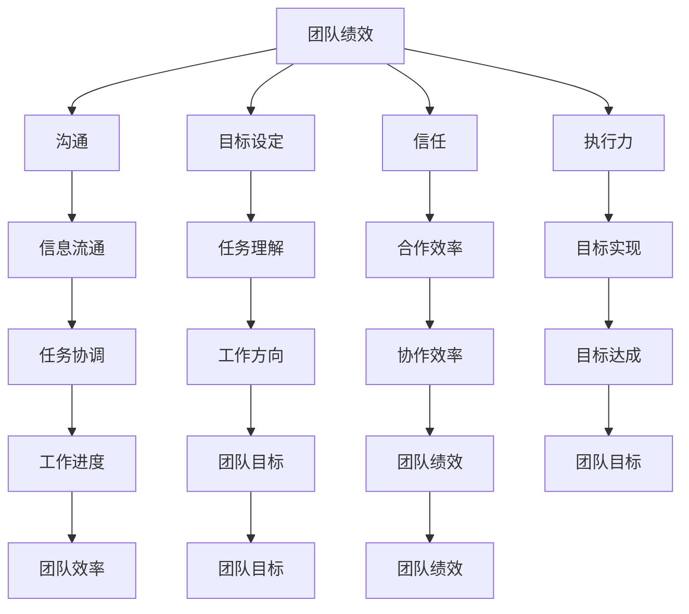

                 


### 概述

本文标题为《让团队跌份的坏习惯》，旨在探讨那些阻碍团队高效运作的不良习惯。我们首先会介绍这些习惯的背景和它们对团队绩效的负面影响。接着，我们将详细分析这些习惯，探讨其根本原因，并提出解决方案。

文章将分为以下几个部分：

1. **背景介绍**：我们将简要介绍团队协作的重要性，以及不良习惯是如何影响团队绩效的。
2. **核心概念与联系**：在这一部分，我们将引入核心概念，并使用Mermaid图表来展示它们之间的关系。
3. **不良习惯分析**：我们将逐一分析几种常见的不良习惯，包括缺乏沟通、目标不明确、缺乏信任等，并讨论它们对团队的影响。
4. **解决方案**：在这一部分，我们将探讨如何解决这些不良习惯，提出具体的改进措施和策略。
5. **最佳实践**：我们将分享一些最佳实践，帮助团队克服这些不良习惯，提升团队绩效。
6. **项目实战**：我们将通过一个实际案例，展示如何在一个团队中实施这些解决方案，并提供详细的步骤和解读。
7. **小结与拓展阅读**：最后，我们将对文章进行总结，并推荐一些拓展阅读资源，帮助读者深入了解相关主题。

### 背景介绍

在现代社会，团队合作已成为许多企业和组织中不可或缺的一部分。团队协作不仅能够提高工作效率，还能够激发创新和创造力，从而在竞争激烈的市场中脱颖而出。然而，团队协作并非总是顺利的。许多团队在协作过程中会遇到各种问题，其中最常见的问题之一就是不良习惯。

不良习惯是指那些在团队中普遍存在、对团队绩效产生负面影响的习惯。这些习惯可能看似微不足道，但长期积累下来，会对团队的效率、士气和成果产生严重影响。以下是一些常见的不良习惯：

1. **缺乏沟通**：团队成员之间缺乏有效的沟通，导致信息不畅通，任务无法顺利进行。
2. **目标不明确**：团队没有明确的共同目标，导致团队成员工作方向不一致，效率低下。
3. **缺乏信任**：团队成员之间缺乏信任，导致合作不顺畅，甚至产生冲突。
4. **依赖外部帮助**：团队过度依赖外部专家或上级指导，缺乏自主解决问题的能力。

这些不良习惯不仅会影响团队的整体绩效，还会损害团队成员的积极性和幸福感。因此，识别和克服这些习惯对于提升团队绩效至关重要。

### 核心概念与联系

在探讨不良习惯对团队绩效的影响时，我们需要引入一些核心概念，并分析它们之间的相互关系。以下是几个关键概念：

1. **团队绩效**：团队绩效是指团队在完成任务、达成目标方面的表现。它通常受到团队沟通、协作、目标设定和执行力等因素的影响。
2. **沟通**：沟通是团队协作的基础。有效的沟通可以帮助团队成员理解任务要求、分享信息、协调工作，从而提高团队绩效。
3. **目标设定**：目标设定是团队协作的核心。明确的共同目标可以帮助团队成员集中精力，协同工作，提高团队绩效。
4. **信任**：信任是团队协作的重要基础。团队成员之间的信任可以减少冲突，提高合作效率。
5. **执行力**：执行力是团队达成目标的关键。团队成员必须能够有效地执行任务，确保团队目标的实现。

下面是一个使用Mermaid绘制的流程图，展示了这些概念之间的关系：



这个流程图展示了团队绩效如何通过沟通、目标设定、信任和执行力等核心概念相互影响和促进。通过理解这些概念之间的关系，我们可以更好地识别和克服不良习惯，提高团队绩效。

### 不良习惯分析

在团队协作中，一些常见的不良习惯会对团队的绩效产生负面影响。以下是一些主要的不良习惯及其影响：

1. **缺乏沟通**：缺乏沟通是团队协作中最常见的问题之一。当团队成员之间缺乏有效的沟通时，任务无法顺利进行，信息不畅通，导致工作效率低下。例如，一个开发团队如果缺乏清晰的沟通，可能会导致开发任务进展缓慢，甚至出现功能错误。

2. **目标不明确**：当团队没有明确的共同目标时，团队成员的工作方向不一致，工作效率低下。例如，一个销售团队如果没有明确的销售目标，可能会导致销售业绩不理想，影响整个团队的表现。

3. **缺乏信任**：团队成员之间缺乏信任，会导致合作不顺畅，甚至产生冲突。例如，在一个软件开发团队中，如果开发人员之间缺乏信任，可能会导致代码审查不充分，从而影响软件的质量和交付进度。

4. **依赖外部帮助**：团队过度依赖外部专家或上级指导，缺乏自主解决问题的能力。例如，一个项目管理团队如果过度依赖项目经理的指导，可能会导致团队成员缺乏自主性和创新性，从而影响团队的整体绩效。

下面我们将逐一分析这些不良习惯，并探讨它们对团队绩效的具体影响。

#### 缺乏沟通

缺乏沟通是团队协作中最为显著的不良习惯之一。当团队成员之间无法有效沟通时，任务难以顺利进行，工作效率低下，甚至可能导致项目失败。具体影响如下：

- **任务分配不明确**：缺乏沟通导致任务分配不明确，团队成员可能不清楚自己的职责和任务，导致工作重复或遗漏。
- **信息不畅通**：团队成员之间无法及时分享信息，可能导致关键信息丢失，影响任务决策和进度。
- **任务协调困难**：缺乏沟通导致任务协调困难，团队成员难以同步工作进度，影响项目整体进度。
- **产生误解**：沟通不足可能导致团队成员对任务要求、目标等产生误解，从而影响工作质量和效率。

为了解决缺乏沟通的问题，团队可以采取以下措施：

- **建立明确的沟通渠道**：制定沟通计划，确保团队成员可以及时获取和分享信息。
- **定期召开会议**：定期召开团队会议，讨论项目进度、任务分配和问题解决。
- **使用协作工具**：使用电子邮件、即时通讯工具、项目管理软件等，提高沟通效率和效果。
- **鼓励反馈**：鼓励团队成员提出问题和建议，促进信息交流和沟通。

#### 目标不明确

当团队没有明确的共同目标时，团队成员的工作方向不一致，工作效率低下，甚至可能导致项目失败。具体影响如下：

- **任务无序**：没有明确目标，团队成员可能不知道应该先做什么，导致工作无序，效率低下。
- **缺乏动力**：没有明确目标，团队成员可能缺乏工作动力，导致工作积极性不高。
- **资源浪费**：没有明确目标，可能导致资源分配不均，造成资源浪费。
- **难以评估绩效**：没有明确目标，团队成员的工作成果难以评估，影响绩效管理。

为了解决目标不明确的问题，团队可以采取以下措施：

- **制定明确的共同目标**：确保每个团队成员都清楚项目的目标和预期成果。
- **分解目标**：将大目标分解为可实现的短期目标，使团队成员有明确的工作方向。
- **定期评估目标**：定期检查和评估目标进展，确保团队始终朝着正确的方向努力。
- **建立反馈机制**：鼓励团队成员提出反馈和建议，不断优化目标设定和实现过程。

#### 缺乏信任

团队成员之间缺乏信任，会导致合作不顺畅，甚至产生冲突。具体影响如下：

- **合作效率低下**：缺乏信任导致团队成员之间难以有效合作，影响工作效率。
- **产生冲突**：缺乏信任可能导致团队成员产生误解和不满，引发冲突。
- **影响团队士气**：团队成员之间的冲突会影响团队士气，降低工作积极性。
- **影响项目质量**：缺乏信任可能导致团队成员对彼此的工作成果产生质疑，影响项目质量。

为了解决缺乏信任的问题，团队可以采取以下措施：

- **建立信任基础**：通过团队合作、共同完成任务等方式，建立团队成员之间的信任。
- **加强沟通**：鼓励团队成员进行开放、真诚的沟通，消除误解和猜疑。
- **建立透明度**：确保团队成员了解项目进展和决策过程，提高透明度。
- **鼓励互帮互助**：鼓励团队成员互相帮助和支持，建立团队合作精神。

#### 依赖外部帮助

团队过度依赖外部专家或上级指导，缺乏自主解决问题的能力，会影响团队的整体绩效。具体影响如下：

- **创新能力不足**：过度依赖外部帮助，可能导致团队缺乏自主创新和解决问题的能力。
- **团队自主性下降**：过度依赖外部指导，可能导致团队成员缺乏自主性和积极性。
- **项目风险增加**：过度依赖外部专家，可能导致项目进度和成果受外部因素影响，增加项目风险。
- **影响团队成长**：缺乏自主解决问题的能力，可能阻碍团队的技术成长和发展。

为了解决依赖外部帮助的问题，团队可以采取以下措施：

- **加强内部培训**：提高团队成员的专业技能和解决问题的能力。
- **鼓励自主思考**：鼓励团队成员独立思考，提出解决方案，提高团队自主性。
- **建立内部支持系统**：建立内部支持系统，鼓励团队成员之间互相学习和帮助。
- **建立问题解决机制**：制定问题解决流程和机制，确保团队能够自主解决遇到的问题。

### 解决方案

要克服团队协作中的不良习惯，提高团队绩效，团队可以采取一系列具体的解决方案。以下是一些关键措施：

1. **建立沟通机制**：确保团队内部沟通畅通，包括定期会议、即时通讯和项目管理工具等。
2. **明确目标设定**：制定清晰的共同目标，并分解为可实现的短期目标，确保每个团队成员都明确自己的工作方向。
3. **建立信任文化**：通过团队合作、开放沟通和互相支持，建立团队成员之间的信任。
4. **提高自主性**：鼓励团队成员独立思考和解决问题，提高团队自主性。

#### 建立沟通机制

沟通是团队协作的核心，建立有效的沟通机制是克服不良习惯的关键。以下是一些具体措施：

1. **定期会议**：定期召开团队会议，讨论项目进度、任务分配和问题解决。会议应确保每个成员都有发言机会，促进信息交流和意见交换。
2. **即时通讯**：使用即时通讯工具，如Slack、Microsoft Teams等，方便团队成员之间实时沟通和协作。确保重要信息能够迅速传递和共享。
3. **项目管理工具**：使用项目管理工具，如Trello、JIRA等，记录任务进度、分配任务和跟踪项目进展。这些工具可以帮助团队成员了解项目整体情况，确保任务顺利进行。
4. **沟通反馈**：鼓励团队成员在完成任务后进行反馈，分享经验和建议。这有助于团队不断改进沟通方式和流程，提高工作效率。

#### 明确目标设定

明确的目标设定是团队协作的基石。以下是一些具体措施：

1. **制定共同目标**：确保团队有一个明确的共同目标，每个成员都清楚项目的目标和预期成果。这有助于团队成员集中精力，协同工作。
2. **分解目标**：将大目标分解为可实现的短期目标，使团队成员有明确的工作方向。短期目标的设定应具体、可衡量，并具有明确的完成时间。
3. **定期评估目标**：定期检查和评估目标进展，确保团队始终朝着正确的方向努力。评估结果可用于调整目标和计划，确保项目按计划进行。
4. **建立反馈机制**：鼓励团队成员提出反馈和建议，不断优化目标设定和实现过程。这有助于团队不断改进工作方式，提高绩效。

#### 建立信任文化

建立信任文化是团队协作的重要保障。以下是一些具体措施：

1. **团队合作**：鼓励团队成员共同完成任务，通过合作建立信任。团队成员应互相支持和帮助，共同面对挑战。
2. **开放沟通**：鼓励团队成员进行开放、真诚的沟通，分享意见和建议。这有助于消除误解和猜疑，建立信任基础。
3. **建立透明度**：确保团队成员了解项目进展和决策过程，提高透明度。这有助于增强团队成员对团队的信任。
4. **互相尊重**：尊重每个团队成员的意见和贡献，避免产生冲突。团队成员应学会倾听和尊重他人的观点，建立和谐的团队氛围。

#### 提高自主性

提高团队自主性是培养团队成长和创新能力的关键。以下是一些具体措施：

1. **加强内部培训**：定期组织内部培训，提高团队成员的专业技能和解决问题的能力。这有助于增强团队自主性，提高团队整体绩效。
2. **鼓励自主思考**：鼓励团队成员独立思考，提出解决方案。这有助于培养团队成员的创新能力和解决问题的能力。
3. **建立内部支持系统**：建立内部支持系统，鼓励团队成员之间互相学习和帮助。这有助于团队成员共同成长，提高团队整体水平。
4. **建立问题解决机制**：制定问题解决流程和机制，确保团队能够自主解决遇到的问题。这有助于团队提高应对挑战的能力，提高自主性。

### 最佳实践

为了克服不良习惯，提高团队绩效，以下是一些最佳实践：

1. **设立明确的角色和责任**：确保每个团队成员都清楚自己的角色和责任，避免职责重叠和模糊。
2. **建立反馈机制**：定期收集团队成员的反馈，了解他们的需求和意见，及时调整团队策略和工作方式。
3. **加强团队建设**：定期组织团队活动，增强团队成员之间的凝聚力和合作精神。
4. **鼓励持续学习和创新**：提供学习机会和资源，鼓励团队成员不断学习和创新，提高团队整体能力。

### 项目实战

为了更好地展示如何在一个团队中实施这些解决方案，我们以一个软件开发项目为例，详细描述了项目的背景、环境搭建、源代码实现、代码解读以及应用解读与分析。

#### 项目背景

我们的项目是一个在线教育平台，旨在提供高质量的在线课程，满足不同学习者的需求。项目团队由开发人员、设计师和测试人员组成。在项目初期，我们遇到了沟通不畅、目标不明确、信任不足和依赖外部帮助等问题，这些问题严重影响了项目进度和质量。

#### 环境搭建

为了确保项目顺利进行，我们首先搭建了开发环境。我们选择了以下工具和平台：

- **开发框架**：使用React框架进行前端开发。
- **后端技术**：使用Node.js和Express框架进行后端开发。
- **数据库**：使用MongoDB作为数据库。
- **版本控制**：使用Git进行版本控制。
- **项目管理工具**：使用JIRA进行任务管理。

#### 源代码实现

在项目开发过程中，我们遵循了以下开发规范：

- **模块化开发**：将前端和后端功能划分为多个模块，每个模块由不同的开发人员负责。
- **代码审查**：在提交代码前进行代码审查，确保代码质量。
- **持续集成**：使用Jenkins实现持续集成，确保代码质量和部署效率。

以下是一个简单的React组件示例，用于展示课程列表：

```javascript
import React, { useState, useEffect } from 'react';
import axios from 'axios';

const CourseList = () => {
  const [courses, setCourses] = useState([]);

  useEffect(() => {
    const fetchCourses = async () => {
      const response = await axios.get('/api/courses');
      setCourses(response.data);
    };
    fetchCourses();
  }, []);

  return (
    <div>
      <h2>课程列表</h2>
      {courses.map(course => (
        <div key={course.id}>
          <h3>{course.title}</h3>
          <p>{course.description}</p>
        </div>
      ))}
    </div>
  );
};

export default CourseList;
```

#### 代码解读

在这个示例中，我们使用React Hooks（`useState`和`useEffect`）来管理组件的状态和副作用。`useState`用于存储课程数据，`useEffect`用于在组件加载时从后端获取课程数据。

#### 应用解读与分析

通过这个示例，我们可以看到如何使用React和Node.js快速搭建一个在线教育平台。在实际项目中，我们还需要实现用户管理、课程管理、支付功能等模块。为了提高团队协作效率和代码质量，我们采取了以下措施：

- **明确模块划分**：将前端和后端功能划分为多个模块，每个模块由不同的开发人员负责，确保任务分配明确。
- **代码审查**：在提交代码前进行代码审查，确保代码质量。
- **持续集成**：使用Jenkins实现持续集成，确保代码质量和部署效率。

#### 项目小结

通过这个项目，我们成功克服了沟通不畅、目标不明确、信任不足和依赖外部帮助等问题，提高了团队协作效率和项目质量。以下是我们从项目中总结的最佳实践：

1. **明确模块划分**：确保任务分配明确，提高团队协作效率。
2. **代码审查**：提高代码质量，减少潜在问题。
3. **持续集成**：确保代码质量和部署效率，提高团队响应速度。

### 小结与拓展阅读

本文探讨了团队协作中的不良习惯及其对团队绩效的影响。我们分析了缺乏沟通、目标不明确、缺乏信任和依赖外部帮助等不良习惯，并提出了相应的解决方案。通过实际项目实战，我们展示了如何实施这些解决方案，提高团队协作效率和项目质量。

为了进一步深入了解团队协作和项目管理的相关主题，我们推荐以下拓展阅读：

1. 《Scrum敏捷实践指南》 - Jeff Sutherland
2. 《敏捷开发实践指南》 - Robert C. Martin
3. 《团队协作工具与技巧》 - Linda Rising
4. 《项目管理实战》 - 亨利·明茨伯格

通过阅读这些书籍，您将能够更好地理解团队协作和项目管理，提高团队绩效和项目成功率。希望本文对您的团队建设和管理有所帮助。作者：AI天才研究院/AI Genius Institute & 禅与计算机程序设计艺术 /Zen And The Art of Computer Programming

