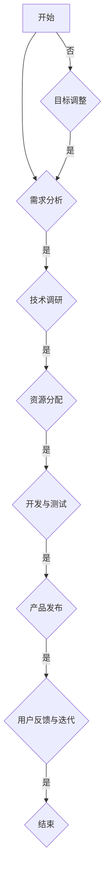

                 

## 引言

### 1.1 书籍的目的与读者对象

在快速发展的计算机技术领域，保持创新和领先地位至关重要。然而，要想在激烈的市场竞争中脱颖而出，设定和实现有激发性的目标成为关键。本书旨在探讨如何通过科学的目标设定方法，激发个人和团队在计算机技术领域的潜能，从而实现持续的创新和突破。

本书适合以下读者群体：
- 计算机科学领域的学者和研究人员
- 软件工程师和程序员
- 技术项目经理和团队领导者
- 对计算机技术有热情的业余爱好者

### 1.2 现实中设定目标的挑战

在计算机技术领域，设定目标并非易事。一方面，技术发展迅速，新概念和新工具层出不穷，目标设定的难易程度受到技术更新速度的影响。另一方面，计算机技术的复杂性使得目标实现过程中面临诸多不确定性，如技术瓶颈、资源限制和时间压力等。此外，个人和组织在目标设定时往往存在以下挑战：

- **目标不明确**：缺乏清晰的目标描述和具体的实施计划，导致项目进展受阻。
- **目标难度过高**：过于雄心勃勃的目标往往难以实现，容易导致挫败感。
- **目标缺乏创新性**：缺乏创新思维和方法，导致目标设定缺乏吸引力。
- **目标设定不科学**：缺乏基于数据和实证分析的目标设定方法，导致目标缺乏可行性和现实性。

### 1.3 为什么设定有激发性的目标很重要

设定有激发性的目标对于计算机技术领域的个人和团队具有重要意义。首先，有激发性的目标能够激发个人的动机和潜能，推动其在技术和职业上的不断进步。其次，有激发性的目标有助于团队形成共同愿景，提高协作效率和创新能力。此外，有激发性的目标还能够吸引外部资源和支持，为项目实施提供保障。

有激发性的目标具有以下特点：
- **挑战性**：目标具有适当的难度，激发个人的挑战精神和探索欲望。
- **明确性**：目标具体、明确，易于理解和执行。
- **创新性**：目标富有创新性，能够推动技术和业务的发展。
- **可行性**：目标在现有技术和资源条件下可行，具备实现的可能性。

通过本书，我们将深入探讨如何设定有激发性的目标，结合理论方法和实际案例，帮助读者在计算机技术领域实现持续的创新和突破。接下来，我们将从目标设定的理论基础、方法论、案例分析、实现策略和未来展望等多个角度，系统性地分析如何有效地设定和实现有激发性的目标。## 第一部分：目标设定的理论基础

### 第2章：目标设定理论基础

目标设定是任何项目成功的关键，尤其在计算机技术领域，科学合理的目标设定更是至关重要。本章将深入探讨目标设定的理论基础，包括心理学与动机理论、项目管理原则等。

#### 2.1 心理学与动机

目标设定与动机理论在心理学中有着广泛的应用。根据著名心理学家亚伯拉罕·马斯洛（Abraham Maslow）的需求层次理论，人类的动机可以分为生理需求、安全需求、社交需求、尊重需求和自我实现需求。在计算机技术领域，理解这些需求有助于设定具有激励作用的目标。

- **生理需求**：基本的生活和工作条件，如食物、水和住房。在目标设定中，这通常体现在提供基本的技术支持和工作环境。
- **安全需求**：稳定的工作环境、薪酬福利和职业发展机会。设定目标时，应确保项目有足够的资源保障，减少风险。
- **社交需求**：与同事和团队建立良好关系，获得认可和支持。团队协作和沟通目标是满足这一需求的体现。
- **尊重需求**：个人成就和社会地位的认可。设定有挑战性和创新性的目标，可以激发员工的成就感和自豪感。
- **自我实现需求**：追求个人潜能的发挥和自我价值的实现。这种需求在技术领域尤为明显，因为技术工作本身就充满了创造性和解决问题的机会。

根据维克托·弗鲁姆（Victor Vroom）的期望理论，动机是期望值、激励值和效价三者之积。在计算机技术领域，这意味着：

- **期望值**：个人对实现目标的可能性估计。这要求项目规划和风险管理要细致，以确保目标的可实现性。
- **激励值**：个人对目标成功实现所给予的奖励的重视程度。激励可以通过薪酬、荣誉和职业发展等途径实现。
- **效价**：个人对目标成功实现所带来的价值评估。这要求目标要具有足够的挑战性和创新性，以激发员工的积极性。

#### 2.2 项目管理原则

项目管理原则是目标设定的基石，确保目标既有挑战性又具有可行性。以下是一些关键的项目管理原则：

- **目标明确性**：目标必须具体、明确，避免模糊不清。SMART（具体、可衡量、可实现、相关、时限）目标是常用的方法。
- **资源规划**：项目成功依赖于合适的资源，包括人力、技术和资金。资源规划要确保资源的合理配置和高效利用。
- **风险管理**：项目过程中可能遇到的风险需要提前识别和评估。制定风险应对策略，以减少风险对项目的影响。
- **时间管理**：项目必须有明确的时间表和进度计划。通过定期回顾和调整，确保项目按时完成。
- **质量保证**：项目目标需要确保质量。制定质量标准和检查机制，确保目标实现的质量。
- **团队协作**：项目目标需要团队协作来实现。建立有效的沟通和协作机制，确保团队成员的协作效率和创新能力。

#### 2.3 目标设定的方法论

目标设定的方法论是将理论与实际操作结合的关键。以下是一些常用的目标设定方法：

- **目标分解法**：将大目标分解为小目标，每个小目标都是实现大目标的一部分。这种方法有助于明确每一步的具体任务和进度。
- **关键绩效指标（KPI）**：设定关键绩效指标，用于衡量目标实现的进展。KPI应该与项目的目标和战略一致。
- **目标树模型**：通过目标树模型，将目标层级化，确保每个子目标都直接服务于总体目标。
- **SWOT分析**：通过SWOT分析（优势、劣势、机会、威胁），确定目标的可行性和优先级。

#### 2.4 实证分析与案例研究

为了更好地理解目标设定的理论基础，我们可以通过一些实际案例来进行分析。

- **案例1：人工智能项目的目标设定**
  - **背景**：一家科技公司计划开发一款智能语音助手。
  - **目标**：在18个月内实现一款具有自然语言处理能力的智能语音助手，并达到市场上同类产品的性能水平。
  - **分析**：这个目标明确了具体的时间框架和性能要求。通过分解，可以将目标进一步细化为技术调研、算法开发、产品测试等子目标。

- **案例2：开源软件项目的目标设定**
  - **背景**：一个开源社区计划开发一款用于大数据处理的分布式计算框架。
  - **目标**：在三年内构建一个功能完善、性能优秀的分布式计算框架，并吸引至少100名活跃贡献者。
  - **分析**：这个目标考虑了技术的复杂性和社区的参与度。通过KPI，可以定期评估项目的进度和质量。

通过以上分析和案例，我们可以看到目标设定在计算机技术领域的应用和实践。接下来，我们将进一步探讨目标设定的具体方法和策略，帮助读者在实际项目中有效地实现有激发性的目标。## 第二部分：目标设定的方法论

### 第3章：有激发性的目标设定方法

为了在计算机技术领域实现持续的创新和突破，设定具有激发性的目标至关重要。本章将介绍几种有激发性的目标设定方法，包括明确性、可行性和创新性，并通过实际案例和Mermaid流程图来详细阐述这些方法的应用。

#### 3.1 明确性

明确性是目标设定的基础，一个清晰、具体的目标能够减少歧义，提高实现的可能性。SMART目标（具体、可衡量、可实现、相关、时限）是常用的方法。

##### 3.1.1 SMART目标

SMART目标是一种结构化的目标设定方法，其核心在于使目标更加具体和可操作。

- **具体（Specific）**：目标要明确具体，避免模糊不清。例如，“开发一个高效的搜索引擎”不如“开发一个能够在5秒内返回搜索结果的搜索引擎”具体。
- **可衡量（Measurable）**：目标要有明确的衡量标准，便于评估进展和结果。例如，“优化代码性能”不如“将搜索时间从10秒缩短到5秒”可衡量。
- **可实现（Achievable）**：目标要在现有资源和能力范围内实现。例如，“在三个月内开发一款自动驾驶汽车”可能过于雄心勃勃，而“在三个月内开发一个能够实现基本自动驾驶功能的原型”更加现实。
- **相关（Relevant）**：目标要与项目的总体目标和战略一致。例如，“开发一款增强现实游戏”如果与公司的业务方向不符，可能不是最佳选择。
- **时限（Time-bound）**：目标要有明确的时间限制，有助于规划和管理进度。例如，“在2023年底完成项目”比“尽快完成项目”更加具体。

##### 3.1.2 明确性示例

假设一家初创公司计划开发一款面向企业市场的数据分析工具，可以使用SMART目标进行设定：

- **具体**：开发一款面向企业市场的数据分析工具，支持多种数据源，如SQL数据库和NoSQL存储。
- **可衡量**：工具能够在1秒内处理100万条数据记录，并生成可视化报表。
- **可实现**：在现有团队和技术基础上，预计6个月内完成开发。
- **相关**：数据分析工具将帮助企业用户从大量数据中提取有价值的信息，提升业务决策效率。
- **时限**：目标设定为2023年6月底完成。

通过SMART目标，公司能够清晰地定义项目的范围、目标和时间表，提高实现的可能性。

#### 3.2 可行性

可行性是目标实现的基础，确保目标在现有技术和资源条件下可行。以下是一些可行性的评估方法：

##### 3.2.1 实现路径分析

实现路径分析是一种系统性的方法，通过分析项目的各个环节，确定实现目标的步骤和资源需求。

**Mermaid流程图示例**：

在这个流程图中，每个节点代表项目的关键步骤，边表示步骤之间的逻辑关系。通过这个流程，团队可以系统地分析项目的实现路径，确保每个步骤都有明确的目标和资源支持。

##### 3.2.2 资源评估与需求

资源评估是确保目标可行性的重要环节。以下是一个简单的资源评估表格：

| 资源类型 | 数量 | 评估 |
| --- | --- | --- |
| 人力资源 | 10人 | 足够 |
| 技术资源 | 1台服务器 | 足够 |
| 财务资源 | 100万元 | 足够 |

通过这个表格，团队可以清晰地看到所需资源的数量和评估结果，从而判断目标是否可行。

#### 3.3 创新性

创新性是目标设定的关键，能够激发团队的创新思维和创造力。以下是一些创新性的目标设定方法：

##### 3.3.1 创新思维方法

- **头脑风暴**：通过集体讨论，生成大量的创意点子。
- **思维导图**：将创意点子可视化，探索不同方向的可能性。
- **反向思维**：从问题的反面思考，寻找创新的解决方案。

##### 3.3.2 目标创新案例

假设一家科技公司计划开发一款智能家居产品，以下是一个创新性的目标设定案例：

- **具体**：开发一款智能家居设备，能够通过语音和手势控制，实现家庭自动化。
- **可衡量**：设备能够在1分钟内响应语音指令，并具备高准确度的手势识别功能。
- **可实现**：在现有技术基础上，预计1年内完成开发。
- **相关**：智能家居产品将满足用户对智能、便捷生活的需求。
- **时限**：目标设定为2024年6月底完成。

通过创新性的目标设定，团队可以探索新的技术方向和市场机会，提高产品的竞争力。

综上所述，明确性、可行性和创新性是设定有激发性目标的重要方法。通过SMART目标、实现路径分析和创新思维方法，团队可以有效地设定和实现具有挑战性、创新性和可行性的目标。接下来，我们将通过实际案例，进一步探讨如何将理论方法应用于实际项目中。## 第三部分：案例分析

### 第4章：成功与失败案例

在本章中，我们将通过分析成功和失败的案例，探讨计算机技术领域中目标设定的实际应用和经验教训。成功案例将展示如何通过科学的目标设定实现创新和突破，而失败案例则将揭示目标设定中的常见问题及其解决方案。

#### 4.1 成功案例

**案例1：谷歌的自动驾驶汽车项目**

**背景**：谷歌在2010年启动了自动驾驶汽车项目，旨在开发一款完全自动化的驾驶车辆。

**目标**：
1. 在5年内实现自动驾驶车辆在公共道路上的测试。
2. 完成至少100万英里的自动驾驶测试。
3. 确保车辆的安全性能和用户体验。

**成功因素**：

- **明确的目标设定**：谷歌制定了具体、明确的目标，确保每个阶段的任务都有清晰的路线图。
- **持续的创新**：通过不断的技术迭代和改进，谷歌在自动驾驶领域取得了显著的进步。
- **资源投入**：谷歌在项目上投入了大量的资源，包括资金、人才和技术支持。
- **风险管理**：谷歌建立了完善的风险管理机制，提前识别和应对潜在问题。

**实现过程**：

- **需求分析**：谷歌对自动驾驶技术进行了深入的需求分析，明确了技术需求和用户需求。
- **技术开发**：通过自主研发和合作伙伴关系，谷歌构建了自动驾驶技术平台。
- **测试与优化**：在多个城市进行了长时间的自动驾驶测试，不断优化系统性能。

**结果**：

- 谷歌的自动驾驶汽车项目取得了巨大成功，已经在多个城市开展了测试，并计划在未来实现商业化。

**经验教训**：

- 明确的目标设定是项目成功的关键。
- 持续的创新和改进是保持竞争优势的重要因素。
- 充足的资源投入和有效的风险管理有助于项目顺利进行。

**案例2：苹果的iPhone项目**

**背景**：苹果公司在2007年推出了第一代iPhone，重新定义了智能手机市场。

**目标**：
1. 开发一款具有革命性用户体验的智能手机。
2. 创造一个全新的移动生态系统。
3. 在市场上迅速占领市场份额。

**成功因素**：

- **创新性目标**：苹果设定了具有高度创新性的目标，打破了传统手机的设计和功能限制。
- **强大的研发团队**：苹果拥有一支技术精湛的团队，能够迅速实现创新目标。
- **用户体验优先**：苹果始终将用户体验放在首位，确保产品设计的每一个细节都达到最高标准。
- **市场营销策略**：苹果通过独特的营销策略，迅速提升了iPhone的品牌知名度和市场份额。

**实现过程**：

- **市场研究**：苹果对市场需求进行了深入的研究，明确了用户对智能手机的期望。
- **技术研发**：苹果自主研发了iOS操作系统和关键硬件，确保产品的技术领先性。
- **产品发布**：苹果在产品发布时进行了大规模的宣传和市场推广。

**结果**：

- iPhone项目取得了巨大成功，苹果成为了智能手机市场的领导者，并推动了整个行业的发展。

**经验教训**：

- 具有创新性的目标能够引领行业趋势，带来巨大的市场机会。
- 技术实力和用户体验是产品成功的关键因素。
- 市场营销策略和品牌建设是提升市场份额的重要手段。

#### 4.2 失败案例

**案例1：索尼的PlayStation Phone**

**背景**：索尼公司在2011年推出了一款名为PlayStation Phone的智能手机。

**目标**：
1. 将PlayStation游戏机的功能集成到手机中。
2. 提供高质量的移动游戏体验。
3. 在智能手机市场中占据一席之地。

**失败原因**：

- **目标设定不当**：索尼的目标过于宏大，没有充分考虑到技术实现的难度和市场需求。
- **用户体验不佳**：PlayStation Phone的游戏体验没有达到预期，用户体验差强人意。
- **缺乏创新性**：与竞争对手相比，PlayStation Phone没有明显的优势，缺乏创新性。
- **市场定位不清**：索尼没有明确PlayStation Phone的市场定位，导致产品定位模糊。

**教训**：

- 目标设定要务实，避免过于雄心勃勃的目标。
- 用户体验是产品成功的关键，必须重视。
- 创新性是产品竞争力的核心，必须不断创新。
- 明确市场定位，确保产品能够满足市场需求。

**案例2：微软的Zune音乐播放器**

**背景**：微软公司在2006年推出了Zune音乐播放器，旨在与苹果的iPod竞争。

**目标**：
1. 提供与iPod相当或更好的音乐播放体验。
2. 建立自己的数字音乐生态系统。
3. 在音乐播放器市场中占据重要地位。

**失败原因**：

- **市场进入时机不当**：微软在iPod市场已经占据主导地位时推出Zune，竞争激烈。
- **用户体验不佳**：Zune的用户体验没有达到预期，与iPod相比缺乏竞争力。
- **缺乏创新性**：Zune没有提供独特的功能或创新，难以吸引消费者。
- **市场营销不足**：微软在市场营销方面投入不足，没有有效提升Zune的品牌知名度。

**教训**：

- 市场进入时机非常重要，必须在市场成熟时推出产品。
- 用户体验是产品成功的关键，必须重视。
- 创新性是产品竞争力的核心，必须不断创新。
- 市场营销策略和品牌建设是提升市场份额的重要手段。

通过以上成功和失败案例的分析，我们可以看到，科学合理的目标设定对于计算机技术项目的成功至关重要。明确的目标、创新的思维、用户体验和市场营销策略都是实现目标的关键因素。在设定目标时，应充分考虑技术可行性、市场需求和竞争环境，以确保目标的可实现性和创新性。## 第四部分：目标实现策略

### 第5章：实现有激发性的目标

实现有激发性的目标不仅需要科学的设定方法，还需要有效的策略和行动。在这一部分，我们将讨论时间管理、团队协作和动力源泉等实现策略，并提供具体的最佳实践和项目实战案例。

#### 5.1 时间管理

时间管理是实现目标的关键，特别是在快速发展的计算机技术领域。以下是一些时间管理的最佳实践：

##### 5.1.1 高效的时间管理技巧

- **任务分解**：将大任务分解为小任务，有助于明确每一步的步骤和时间节点。
- **优先级排序**：根据任务的紧急程度和重要性进行排序，确保重要且紧急的任务优先处理。
- **定期回顾**：定期回顾进度，调整计划，确保项目按计划进行。
- **避免拖延**：设定明确的截止日期，避免拖延，提高工作效率。

**最佳实践**：

- 使用项目管理工具，如Trello、Asana或JIRA，来跟踪任务进度和团队协作。
- 设立每日、每周和每月的目标，确保项目按计划推进。
- 使用番茄工作法，将工作时间分为25分钟的工作周期和5分钟的休息时间，提高专注力。

##### 5.1.2 目标进度跟踪

目标进度跟踪是确保项目按计划进行的重要手段。以下是一些进度跟踪的最佳实践：

- **设立里程碑**：将项目分为若干个里程碑，每个里程碑都有明确的目标和时间节点。
- **定期报告**：定期向团队成员和上级报告进度，确保信息透明和及时沟通。
- **数据驱动**：使用数据来评估项目进度，如代码提交次数、测试覆盖率等。
- **及时调整**：根据进度报告和数据反馈，及时调整计划，确保项目不会偏离轨道。

**项目实战**：

假设一个团队计划在6个月内开发一款基于人工智能的客户服务机器人。他们可以设立以下里程碑：

- 第1个月：完成需求分析和系统设计。
- 第2个月：完成核心算法开发。
- 第3个月：完成初步测试和优化。
- 第4个月：完成用户界面设计和功能测试。
- 第5个月：完成系统集成和性能优化。
- 第6个月：产品发布和市场推广。

通过定期跟踪进度，团队可以确保每个里程碑按时完成，最终实现目标。

#### 5.2 团队协作

团队协作是实现有激发性目标的关键因素。以下是一些团队协作的最佳实践：

##### 5.2.1 建立有效的团队

- **明确角色和职责**：确保每个团队成员都了解自己的角色和职责，避免职责重叠和冲突。
- **建立信任和沟通**：通过开放和诚实的沟通建立信任，确保团队成员之间的协作顺畅。
- **多样性**：团队中应包含不同背景和技能的成员，以促进创新和多元化的思考。
- **共同目标**：确保团队成员都明确共同的目标和愿景，提高团队的凝聚力和动力。

**最佳实践**：

- 使用协作工具，如Slack、Microsoft Teams或Zoom，来提高沟通效率和团队协作。
- 定期举行团队会议，讨论项目进度、问题和解决方案。
- 建立反馈机制，鼓励团队成员提供意见和建议，提高团队的创新能力。

##### 5.2.2 分工与协作

分工与协作是实现目标的关键。以下是一些分工与协作的最佳实践：

- **明确分工**：根据团队成员的技能和兴趣，将任务分配给最合适的成员。
- **相互依赖**：确保任务的相互依赖性，促进团队成员之间的协作。
- **资源共享**：鼓励团队成员分享资源和知识，提高团队的整体效率。
- **互相支持**：在团队成员遇到困难时，提供帮助和支持，确保项目顺利进行。

**项目实战**：

在一个开发项目中，团队可以将任务分为以下几个部分：

- **需求分析**：由项目经理和产品经理共同完成，确保需求明确。
- **系统设计**：由系统架构师负责，确保系统架构合理。
- **核心算法开发**：由人工智能专家负责，确保算法高效准确。
- **用户界面设计**：由UI/UX设计师负责，确保用户体验良好。
- **测试与优化**：由测试工程师和质量保证团队负责，确保产品稳定可靠。

通过分工与协作，团队可以高效地完成项目，实现目标。

#### 5.3 动力源泉

动力源泉是实现有激发性目标的重要因素。以下是一些保持长期动力的策略：

##### 5.3.1 保持长期动力

- **设定短期目标**：将长期目标分解为短期目标，确保团队成员有持续的动力。
- **奖励与认可**：为团队成员设定奖励机制，对实现目标的团队成员给予认可和奖励。
- **职业发展**：提供职业发展机会，激励团队成员不断学习和进步。
- **工作与生活平衡**：确保团队成员有足够的时间休息和家庭生活，避免过度工作。

**最佳实践**：

- 设立定期奖励，如团队聚餐、旅游等，提高团队凝聚力。
- 提供培训和研讨会，帮助团队成员提升技能和知识。
- 建立开放和透明的沟通渠道，让团队成员感受到自己的价值和贡献。

##### 5.3.2 面对挫折的策略

在实现目标的过程中，难免会遇到挫折和困难。以下是一些应对挫折的策略：

- **积极应对**：面对挫折，保持积极的态度，寻找解决问题的方法。
- **调整目标**：根据实际情况，适当调整目标，确保目标的可行性和实现性。
- **团队支持**：寻求团队和上级的支持，共同解决问题。
- **学习和成长**：将挫折视为学习和成长的机会，从中吸取教训，提升自己。

**项目实战**：

在一个开发项目中，如果遇到技术难题，团队可以采取以下策略：

- **集体讨论**：组织团队讨论，共同分析问题，寻找解决方案。
- **外部支持**：寻求外部专家的意见和建议，借鉴成熟的技术方案。
- **持续学习**：鼓励团队成员学习相关技术知识，提高团队的整体技术水平。

通过以上策略，团队可以应对挫折，实现目标。

综上所述，实现有激发性的目标需要科学合理的目标设定、有效的策略和团队协作。通过时间管理、团队协作和动力源泉等策略，团队可以高效地实现目标，推动计算机技术领域的创新和突破。## 第五部分：未来展望与挑战

### 第6章：未来趋势与挑战

随着科技的不断进步，计算机技术领域的目标设定和实现面临着前所未有的机遇和挑战。在这一章中，我们将探讨未来趋势及其对目标设定和实现的影响，以及计算机技术领域面临的主要挑战。

#### 6.1 技术进步的影响

技术进步是推动计算机技术领域创新和发展的关键动力。以下是一些技术进步的影响：

##### 6.1.1 人工智能与目标设定

人工智能（AI）技术的发展为计算机技术领域的目标设定带来了新的可能性。通过AI算法，可以更准确地预测目标实现的可能性，优化目标设定的过程。例如，使用机器学习模型对历史数据进行分析，可以帮助确定项目的时间表和资源需求。此外，AI还可以用于自动化目标监测和调整，确保目标实现过程中的实时反馈和优化。

**案例**：谷歌的深度学习算法用于自动驾驶汽车项目的目标设定，通过模拟和测试，优化了自动驾驶系统的性能和安全性。

##### 6.1.2 自动化与劳动市场

自动化技术的发展正在改变传统的劳动市场，这也对目标设定和实现提出了新的挑战。自动化工具和机器人可以执行许多重复性和危险的任务，从而提高生产效率和安全性。然而，这也可能导致某些工作岗位的减少，对劳动市场的稳定性和就业机会产生负面影响。

**挑战**：如何在自动化进程中确保劳动市场的可持续发展，同时保持目标设定的科学性和合理性。

##### 6.1.3 区块链与目标设定

区块链技术的兴起为数据管理和目标设定提供了新的途径。通过去中心化和不可篡改的特点，区块链可以确保数据的安全性和透明度，从而提高目标设定的可信度和公正性。例如，在供应链管理中，区块链可以用于记录和验证每个环节的数据，确保目标的实现过程公开透明。

**案例**：沃尔玛使用区块链技术追踪食品供应链，确保食品来源和质量的透明度，从而提高目标设定的可信度。

#### 6.2 社会变革的挑战

随着技术进步，计算机技术领域也面临着一系列社会变革的挑战。以下是一些关键挑战：

##### 6.2.1 价值观与目标设定

技术的快速发展引发了对价值观和伦理的深刻反思。在目标设定中，如何平衡技术创新和社会责任成为一个重要议题。例如，在自动驾驶汽车的发展中，如何处理意外事故和道德决策成为一个挑战。

**挑战**：在目标设定过程中，如何确保技术进步符合社会的伦理和价值观。

##### 6.2.2 多样性与包容性

计算机技术领域的多样性和包容性是确保创新和竞争力的重要保障。然而，现实情况是，该领域仍然存在性别、种族和文化背景的差异。在目标设定中，如何促进多样性和包容性，提高团队的创造力和协作效率是一个挑战。

**案例**：谷歌和苹果等科技公司实施多样性和包容性政策，通过招聘和培训，提高员工的多样性和团队的整体绩效。

##### 6.2.3 安全与隐私

随着数据和技术的发展，安全与隐私问题日益突出。在目标设定中，如何确保数据的安全性和用户的隐私权成为一个关键挑战。例如，在云计算和大数据处理中，如何保护用户的数据不被滥用和泄露。

**挑战**：在目标设定和实现过程中，如何确保数据安全和用户隐私的保护。

#### 6.3 未来展望

面对未来，计算机技术领域充满了机遇和挑战。以下是一些未来展望：

##### 6.3.1 技术融合与创新

随着物联网（IoT）、5G通信和云计算等技术的融合，计算机技术领域将迎来更多创新机会。通过跨领域的技术融合，可以创造出全新的应用场景和商业模型。

**展望**：技术融合将推动计算机技术领域的创新，带来新的目标设定和实现方法。

##### 6.3.2 绿色计算与可持续发展

随着全球对环境保护的重视，绿色计算成为未来的重要趋势。在目标设定中，如何实现计算资源的有效利用和能源效率的提高，是实现可持续发展的重要方向。

**展望**：绿色计算将引导计算机技术领域朝着更可持续和环保的方向发展。

##### 6.3.3 人类与机器的协同

随着人工智能和自动化技术的发展，人类与机器的协同工作将成为未来工作模式的主流。在目标设定中，如何确保人类和机器的有效协作，提高生产效率和创新能力，是一个重要议题。

**展望**：人类与机器的协同将推动计算机技术领域实现更高水平的创新和突破。

综上所述，未来趋势和挑战将深刻影响计算机技术领域的目标设定和实现。通过积极应对这些挑战，充分利用技术进步带来的机遇，我们可以推动计算机技术领域的持续创新和发展。## 附录

### 附录A：资源与工具

为了帮助读者更深入地了解和实现本书所介绍的目标设定方法，我们提供以下资源和工具推荐。

#### A.1 相关文献推荐

- **《目标设定：理论与实践》（Goal Setting: Theory and Practice）**：由心理学家艾瑞克·罗宾斯（Eric J. Robinsson）所著，详细介绍了目标设定的理论基础和实践应用。
- **《有效目标设定：如何设定和实现目标》（Effective Goal Setting: How to Set and Accomplish Goals）**：由艾瑞克·罗宾斯（Eric J. Robinsson）所著，提供了实用的目标设定技巧和案例。
- **《项目管理知识体系指南》（Project Management Body of Knowledge, PMBOK Guide）**：由项目管理协会（Project Management Institute, PMI）编写，是项目管理领域的权威指南。

#### A.2 目标设定工具介绍

- **Trello**：一款基于看板的项目管理工具，适合任务分解和进度跟踪。
- **Asana**：一款功能强大的项目管理工具，支持任务分配、进度跟踪和协作。
- **JIRA**：一款由Atlassian开发的敏捷项目管理工具，适用于软件项目的全生命周期管理。

#### A.3 案例资料来源

- **谷歌自动驾驶汽车项目**：资料来源于谷歌官方文档和新闻报道。
- **苹果iPhone项目**：资料来源于苹果公司的官方发布信息和市场研究报告。
- **索尼PlayStation Phone**：资料来源于索尼公司的官方公告和市场分析报告。
- **微软Zune音乐播放器**：资料来源于微软公司的官方发布信息和市场分析报告。

#### A.4 拓展阅读

- **《人工智能：一种现代方法》（Artificial Intelligence: A Modern Approach）**：由斯坦福大学教授彼得·诺维格（Peter Norvig）和斯图尔特·罗素（Stuart Russell）所著，是人工智能领域的经典教材。
- **《区块链技术指南》（Blockchain: A Hands-On Approach）**：由区块链技术专家唐·塔普斯科特（Don Tapscott）和亚历克斯·塔普斯科特（Alex Tapscott）所著，详细介绍了区块链的基础知识和应用。

通过以上资源和工具的推荐，读者可以进一步探索目标设定的理论和实践，提升在计算机技术领域的目标设定和实现能力。## 文章摘要

本文深入探讨了在计算机技术领域中如何设定和实现有激发性的目标。首先，文章介绍了书籍的目的与读者对象，明确了目标设定的现实挑战及其重要性。接着，文章从心理学与动机理论、项目管理原则等角度出发，阐述了目标设定的理论基础，并通过实际案例展示了目标分解法和SWOT分析的应用。随后，文章详细介绍了明确性、可行性和创新性等有激发性的目标设定方法，结合SMART目标和实现路径分析，提供了明确的实施步骤。此外，通过成功与失败案例的分析，文章总结了目标设定的最佳实践和注意事项。最后，文章提出了时间管理、团队协作和动力源泉等目标实现策略，探讨了未来趋势与挑战，并提供了拓展阅读和资源推荐。总体而言，本文为计算机技术领域的个人和团队提供了全面的指南，帮助其科学合理地设定和实现有激发性的目标。## 结语

综上所述，在计算机技术领域，科学合理地设定和实现有激发性的目标至关重要。通过明确性、可行性和创新性的目标设定方法，结合实际案例和最佳实践，我们能够更好地激发个人和团队的潜能，实现持续的创新和突破。本文从理论到实践，详细介绍了目标设定的过程和策略，旨在为读者提供实用的指南。

作者：AI天才研究院/AI Genius Institute & 禅与计算机程序设计艺术 /Zen And The Art of Computer Programming

在这快速发展的时代，不断追求卓越是我们不变的追求。希望本文能够为您的计算机技术之旅带来启示，帮助您在设定和实现目标的过程中取得更大的成就。未来，我们将继续探索更多关于人工智能、区块链和云计算等前沿技术的目标设定和实践，期待与您一同前行。请持续关注我们的研究和成果，让我们共同见证计算机技术领域的辉煌未来。

