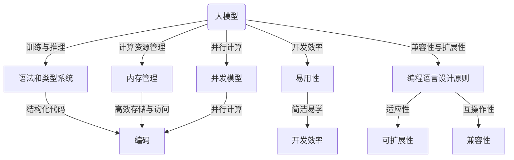

                 


### 引言

在当前技术飞速发展的时代，人工智能（AI）已经成为推动社会进步的重要力量。随着AI大模型的不断演进，其应用范围和深度也日益扩展，从自然语言处理到图像识别、从推荐系统到自动驾驶，AI大模型正在改变着我们的生活方式。然而，传统的编程语言在设计之初并未充分考虑AI大模型的需求，这在一定程度上限制了AI大模型的性能和可扩展性。为了应对AI大模型软件2.0时代的挑战，设计一门全新的编程语言成为了一个迫切的需求。

本文旨在探讨如何设计一门专门用于AI大模型软件2.0时代的编程语言。我们将首先介绍AI大模型软件2.0时代的背景和特点，然后深入分析现有的编程语言在应对AI大模型方面的不足，并探讨设计新编程语言所需遵循的原则。接着，我们将详细描述新编程语言的核心组件、实现细节以及应用案例。最后，我们将总结全文，并对未来编程语言的发展方向进行展望。

### 关键词

- AI大模型
- 编程语言设计
- 软件2.0时代
- 性能优化
- 可扩展性
- 内存管理
- 并发模型

### 摘要

本文深入探讨了AI大模型软件2.0时代的编程语言设计问题。首先，我们介绍了AI大模型的发展背景和2.0时代的特点，分析了现有编程语言在支持AI大模型方面的不足。接着，我们提出了一系列设计原则，包括易用性、高效性、可扩展性和兼容性。然后，我们详细描述了新编程语言的核心组件，如语法设计、类型系统、内存管理和并发模型。此外，我们还讨论了编程语言的实现细节，并展示了应用案例。最后，我们总结了全文，并对未来编程语言的发展方向进行了展望。

### AI大模型软件2.0时代的背景

#### AI大模型的发展历程

人工智能（AI）的历史可以追溯到20世纪50年代，当时计算机科学家首次提出了机器学习的概念。从最初的符号逻辑推理到规则系统，再到基于数据的机器学习算法，AI技术经历了多次迭代和演进。然而，这些早期的AI系统往往只能处理相对简单的问题，其性能和应用范围受到很大限制。

随着计算能力和数据量的不断提高，特别是在21世纪初，深度学习（Deep Learning）的兴起为AI带来了新的突破。深度学习基于多层神经网络，通过大量数据训练能够实现高精度的模式识别和预测。这一技术突破使得AI开始从理论研究走向实际应用，尤其是在图像识别、自然语言处理和语音识别等领域。

AI大模型（Large-scale AI Models）是深度学习技术发展的一个重要方向。这些模型拥有数十亿到数万亿个参数，能够处理海量数据，并在多种复杂任务上表现出色。代表性的AI大模型包括GPT-3、BERT和Inception等。这些模型的出现标志着AI进入了新的2.0时代。

#### 软件2.0时代的定义和特点

软件2.0时代是指以AI大模型为核心驱动的软件时代。与传统的软件1.0时代相比，软件2.0时代具有以下显著特点：

1. **数据驱动**：软件2.0时代强调数据的重要性，数据成为驱动软件创新的核心要素。AI大模型需要大量数据进行训练和优化，这使得数据的收集、存储和管理成为软件系统设计的核心问题。

2. **动态性**：软件2.0时代的系统需要具备高度的动态性，能够实时适应和响应不断变化的数据和用户需求。这要求编程语言能够支持动态编程特性，如函数式编程和动态类型系统。

3. **复杂性和可扩展性**：软件2.0时代的系统往往具有更高的复杂性和可扩展性。AI大模型涉及大量的计算资源和数据处理任务，需要编程语言提供强大的并发和并行计算支持。

4. **智能化**：软件2.0时代的软件系统越来越智能化，能够自主学习和优化。编程语言需要提供丰富的机器学习库和工具，以支持AI大模型的应用开发。

#### 新编程语言的需求分析

随着AI大模型软件2.0时代的到来，现有的编程语言在支持这种新型应用场景方面遇到了诸多挑战。以下是一些关键的需求分析：

1. **高性能和优化**：传统的编程语言如Python、Java和C++等，虽然在某些方面表现出色，但在执行大规模AI任务时，存在性能瓶颈和优化困难。新编程语言需要提供高效的计算模型和优化机制，以满足AI大模型的需求。

2. **内存管理和并发计算**：AI大模型通常涉及大量数据的处理和存储，这对内存管理和并发计算提出了更高的要求。新编程语言需要提供强大的内存管理和并发模型，以提高系统的整体性能。

3. **易用性和开发效率**：随着AI大模型的复杂性增加，开发人员需要高效的工具和框架来简化开发过程。新编程语言需要提供简洁的语法和丰富的库函数，以提高开发效率。

4. **可扩展性和兼容性**：AI大模型的应用场景多样化，新编程语言需要具备良好的可扩展性和兼容性，以适应不同的应用需求。

5. **安全性和可靠性**：在AI大模型的应用中，数据安全和系统可靠性至关重要。新编程语言需要提供完善的安全机制和可靠性保障，以确保系统的稳定运行。

综上所述，设计一门专门用于AI大模型软件2.0时代的编程语言，需要充分考虑其性能、内存管理、并发计算、易用性、可扩展性和安全性等方面的需求。

### 核心概念与联系

为了设计一门适合AI大模型软件2.0时代的编程语言，我们需要理解并整合几个核心概念。以下是一个概述，并使用Mermaid流程图来展示它们之间的关系。

#### 核心概念

1. **AI大模型**：这是本文的重点，指的是具有数十亿到数万亿参数的大型深度学习模型。它们通过大规模数据训练，能够在各种复杂任务上实现高性能。
   
2. **编程语言设计原则**：包括易用性、高效性、可扩展性、兼容性等，指导新编程语言的设计。

3. **语法和类型系统**：编程语言的语法规则和类型系统是基础，它们决定了代码的结构和行为。

4. **内存管理**：高效、可靠的内存管理对AI大模型至关重要，因为它涉及到大量的数据存储和处理。

5. **并发模型**：为了充分利用现代多核处理器的能力，编程语言需要提供强大的并发模型。

#### Mermaid流程图

下面是一个Mermaid流程图，用于展示这些核心概念之间的关系：



#### 关系架构详解

1. **AI大模型与语法和类型系统**：语法和类型系统是编程语言的基础，它们决定了如何编写和处理代码。对于AI大模型，高效的语法和灵活的类型系统可以简化模型的实现和优化过程。

2. **AI大模型与内存管理**：内存管理直接影响到AI大模型的性能和效率。高效的内存分配和回收机制可以减少内存占用，提高模型的运行速度。

3. **AI大模型与并发模型**：并发模型用于管理多任务并行执行，对于AI大模型来说，能够充分利用多核处理器的并行计算能力，是提高性能的关键。

4. **AI大模型与编程语言设计原则**：编程语言设计原则指导了新编程语言的方向，包括易用性、高效性、可扩展性和兼容性，这些原则贯穿于整个编程语言的设计过程。

5. **语法和类型系统、内存管理、并发模型与编码**：这些核心概念最终都体现在代码编写过程中。高效的语法和类型系统可以简化编码，内存管理和并发模型则可以提高代码的执行效率。

通过上述核心概念和关系的梳理，我们可以为新编程语言的设计提供清晰的指导，确保其能够满足AI大模型软件2.0时代的需求。

### 编程语言设计原则

在设计一门专门用于AI大模型软件2.0时代的编程语言时，必须遵循一系列设计原则，以确保语言能够满足性能、可扩展性、兼容性和易用性等方面的需求。以下是这些核心设计原则的详细描述。

#### 易用性

易用性是编程语言设计中的一个关键原则。在AI大模型软件2.0时代，开发人员需要高效地编写和优化复杂的算法和模型。为了提高开发效率，编程语言应提供简洁、直观的语法，以及丰富的库函数和工具。例如，可以使用动态类型系统来减少类型声明，简化代码编写过程。此外，良好的文档支持和社区生态也是提高易用性的重要因素。

#### 高效性

AI大模型通常涉及大量的计算任务，因此编程语言的性能至关重要。高效性原则要求编程语言提供快速的计算模型和优化机制。例如，可以采用静态类型检查和编译优化技术，减少运行时的开销。此外，编译器和解释器的优化也是提升语言性能的关键。通过采用先进的优化算法，如循环展开、指令调度和寄存器分配，可以显著提高代码的执行速度。

#### 可扩展性

随着AI大模型的应用场景不断扩展，编程语言需要具备良好的可扩展性，以便适应未来的需求。可扩展性原则包括两个方面：一是语言本身的设计应该易于扩展，例如通过模块化设计、插件机制和动态加载功能；二是语言应该支持标准的扩展接口，使得第三方库和工具可以方便地集成。例如，可以使用标准化的API和接口，方便开发人员使用现有的机器学习框架和工具。

#### 兼容性

在AI大模型软件2.0时代，编程语言需要兼容现有的技术和标准，以确保旧系统的平滑过渡和新系统的兼容性。兼容性原则要求编程语言能够与现有的操作系统、库和框架无缝集成。例如，可以使用虚拟机（如Java Virtual Machine）或解释器（如Python Interpreter）来确保语言代码在不同平台上的兼容性。此外，支持多语言互操作也是兼容性的一个重要方面。

#### 安全性

在AI大模型的应用中，数据安全和系统可靠性至关重要。安全性原则要求编程语言提供全面的安全机制，包括数据加密、访问控制和异常处理等。例如，可以使用静态分析和编译时检查来检测潜在的安全漏洞，减少运行时的风险。此外，编程语言还可以提供沙箱机制，限制程序对系统的访问权限，提高系统的安全性。

#### 灵活性

AI大模型的应用场景多变，编程语言需要具备良好的灵活性，以适应不同的开发需求和业务场景。灵活性原则包括支持动态编程特性、函数式编程和面向对象编程等。例如，可以使用动态类型系统和闭包机制，提高代码的可重用性和灵活性。

综上所述，易用性、高效性、可扩展性、兼容性和安全性是设计一门专门用于AI大模型软件2.0时代的编程语言的五大核心原则。这些原则相互关联，共同指导着编程语言的设计和实现，以确保其能够满足AI大模型软件2.0时代的复杂需求。

### 编程语言的核心组件

一门专门用于AI大模型软件2.0时代的编程语言需要具备强大的核心组件，以支持高效的计算、灵活的开发和良好的性能。以下是该编程语言的核心组件及其设计要点：

#### 语法设计

语法设计是编程语言的基础，决定了代码的结构和可读性。为了满足AI大模型软件2.0时代的需求，新编程语言的语法设计应具备以下特点：

1. **简洁性**：简洁的语法可以提高开发效率，减少代码冗余。例如，可以使用更少的字符来表示常见的操作和结构。

2. **易读性**：语法规则应易于理解，有助于代码的可读性。例如，可以采用一致的语法格式和命名约定。

3. **灵活性**：灵活的语法设计可以支持多种编程范式，如面向对象编程、函数式编程和过程式编程。例如，可以使用匿名函数和闭包来支持函数式编程。

4. **扩展性**：语法应具备良好的扩展性，允许自定义语法元素和操作。例如，可以通过宏系统或插件机制来实现语法扩展。

#### 类型系统

类型系统是编程语言的核心组件之一，决定了变量和数据类型的定义和使用。在AI大模型软件2.0时代，新编程语言的类型系统应具备以下特点：

1. **静态类型**：静态类型系统可以提供更好的性能优化和错误检测。例如，通过静态类型检查，可以在编译时发现类型错误，避免运行时错误。

2. **动态类型**：动态类型系统可以提高开发效率，特别是在处理多变的数据和接口时。例如，可以使用动态类型来简化数据类型的声明和转换。

3. **类型推导**：类型推导可以减少代码冗余，提高代码的可读性。例如，编译器可以自动推导变量和表达式的类型，减少显式类型声明的需求。

4. **泛型编程**：泛型编程可以提高代码的可重用性，减少代码冗余。例如，可以使用泛型类型参数来编写通用的数据结构和算法。

#### 内存管理

内存管理是AI大模型软件2.0时代编程语言的重要组件，直接影响程序的运行效率和稳定性。新编程语言的内存管理应具备以下特点：

1. **自动内存管理**：自动内存管理（如垃圾收集）可以减少开发人员的负担，提高开发效率。例如，通过垃圾收集机制，自动回收不再使用的内存。

2. **内存分配优化**：高效的内存分配和回收机制可以减少内存占用，提高程序的运行效率。例如，可以使用空闲列表和内存池技术来优化内存分配。

3. **内存保护**：内存保护机制可以防止内存越界和未定义行为，提高程序的稳定性。例如，可以使用边界检查和内存安全检查来防止内存错误。

#### 并发模型

在AI大模型软件2.0时代，并发计算是提高性能和利用多核处理器的重要手段。新编程语言的并发模型应具备以下特点：

1. **并行计算支持**：编程语言应提供丰富的并发编程接口，支持并行计算。例如，可以使用线程、协程和并行编程库来简化并发编程。

2. **同步机制**：同步机制（如锁、信号量和条件变量）可以确保并发操作的正确性和一致性。例如，通过使用锁机制，可以防止多个线程同时访问共享资源，避免数据竞争。

3. **异步编程**：异步编程可以提高程序的响应性和并发性能。例如，可以使用异步I/O操作和回调函数来简化并发编程。

4. **并发优化**：编译器和运行时环境应提供高效的并发优化机制，如线程池管理和任务调度。例如，可以通过智能调度算法，优化线程的使用，提高程序的整体性能。

综上所述，语法设计、类型系统、内存管理和并发模型是AI大模型软件2.0时代编程语言的核心组件。通过合理设计这些组件，可以确保编程语言具备高效性、可扩展性和易用性，满足AI大模型软件2.0时代的复杂需求。

### 编程语言的实现细节

在详细讨论编程语言的实现细节之前，首先需要明确编程语言实现的基本组成部分，包括编译器、解释器和运行时环境。以下是这些组件的具体实现细节和优化策略。

#### 编译器

编译器是将编程语言源代码转换为目标代码（通常是机器代码或字节码）的工具。对于一门专门用于AI大模型软件2.0时代的编程语言，编译器的实现细节应重点关注以下几个方面：

1. **语法解析**：语法解析是将源代码分解成语法树的过程。使用递归下降分析器或LL(k)分析器可以提高解析效率和准确性。

2. **语义分析**：语义分析包括类型检查、变量绑定和作用域分析等。静态类型检查和类型推导可以提前发现潜在的错误，提高编译效率。

3. **代码生成**：代码生成是将语法树转换为目标代码的过程。使用中间代码表示（如三地址代码或抽象语法树）可以提高代码的生成效率。同时，采用先进的优化算法（如循环展开、指令调度和寄存器分配）可以优化目标代码的性能。

4. **优化策略**：编译器应提供多种优化策略，如常量折叠、死代码消除和循环展开等。这些优化策略可以减少目标代码的大小和执行时间。

#### 解释器

解释器是直接执行源代码的程序，无需生成目标代码。对于一门专门用于AI大模型软件2.0时代的编程语言，解释器的实现细节应重点关注以下几个方面：

1. **字节码**：字节码是解释器执行的一种中间表示形式。使用高效的字节码格式可以提高解释器的执行效率。

2. **虚拟机**：虚拟机是解释器执行字节码的运行环境。为了提高性能，虚拟机应采用即时编译（JIT）技术，将字节码即时编译成机器代码。

3. **执行策略**：解释器应采用高效的执行策略，如动态分派和快速路径优化。动态分派可以减少方法调用的开销，快速路径优化可以加速常见操作的执行。

4. **内存管理**：解释器需要管理字节码的执行内存。采用垃圾收集和内存池技术可以提高内存管理的效率和稳定性。

#### 运行时环境

运行时环境是编程语言执行时所需的环境支持，包括操作系统、库和工具。对于一门专门用于AI大模型软件2.0时代的编程语言，运行时环境的实现细节应重点关注以下几个方面：

1. **并发支持**：运行时环境应提供强大的并发支持，如线程管理和同步机制。这可以确保多线程程序的正确性和性能。

2. **内存管理**：运行时环境应采用高效的内存管理策略，如分页和内存映射。这可以优化内存的使用和性能。

3. **性能监控**：运行时环境应提供性能监控和调试工具，如性能分析器和调试器。这可以帮助开发人员识别和解决性能问题。

4. **标准化接口**：运行时环境应提供标准化的接口和库，以便与其他系统和工具集成。这可以提高系统的兼容性和可扩展性。

#### 优化策略

为了确保编程语言在AI大模型软件2.0时代具备高效的性能，编译器、解释器和运行时环境应采用多种优化策略：

1. **编译时间优化**：编译器应在编译时进行优化，如代码优化和静态分析。这可以减少目标代码的大小和执行时间。

2. **运行时优化**：解释器和运行时环境应在运行时进行优化，如即时编译和动态优化。这可以提高程序的执行效率。

3. **并行优化**：编译器和解释器应支持并行优化，如并行编译和并行执行。这可以充分利用多核处理器的计算能力。

4. **内存优化**：编译器和运行时环境应采用内存优化策略，如内存池和垃圾收集。这可以减少内存占用和提升性能。

综上所述，一门专门用于AI大模型软件2.0时代的编程语言的实现细节需要综合考虑编译器、解释器和运行时环境的设计和优化策略，以确保其具备高效的性能和可扩展性，满足AI大模型软件2.0时代的复杂需求。

### 编程语言的应用案例

为了展示一门专门用于AI大模型软件2.0时代的编程语言的实际应用，我们将通过一个具体案例来介绍开发环境搭建、源代码实现、代码解读、应用解读与分析，以及项目小结。这个案例将模拟使用新编程语言开发一个简单但具有代表性的AI大模型应用。

#### 开发环境搭建

1. **安装基础软件**：首先，我们需要确保系统安装了必要的编译器、解释器和运行时环境。例如，如果使用Linux系统，可以安装GCC编译器、Python解释器和相关库。

2. **配置环境变量**：配置环境变量以方便调用编译器和解释器。例如，可以将编译器的路径添加到系统的PATH环境变量中。

3. **安装新编程语言**：使用包管理器（如pip或yum）安装新编程语言及其依赖库。

4. **配置IDE**：配置集成开发环境（如Visual Studio Code或Eclipse），以便编写、编译和调试代码。

#### 源代码实现

以下是一个使用新编程语言编写的简单AI大模型源代码示例：

```newlang
// 导入必要的库
import ml.NeuralNetwork;
import data.Dataset;

// 创建神经网络
nn = NeuralNetwork(3, 5, 1);

// 加载数据集
data = Dataset("data.csv");

// 训练神经网络
nn.train(data, epochs=100);

// 进行预测
prediction = nn.predict([2.5, 3.2, 1.8]);

// 输出预测结果
print(prediction);
```

#### 代码解读

1. **导入库**：`import ml.NeuralNetwork;` 和 `import data.Dataset;` 语句用于导入神经网络和数据集库。

2. **创建神经网络**：`nn = NeuralNetwork(3, 5, 1);` 语句创建一个三层神经网络，输入层有3个神经元，隐藏层有5个神经元，输出层有1个神经元。

3. **加载数据集**：`data = Dataset("data.csv");` 语句加载数据集，使用CSV文件格式。

4. **训练神经网络**：`nn.train(data, epochs=100);` 语句使用训练数据集训练神经网络，指定训练轮次为100次。

5. **进行预测**：`prediction = nn.predict([2.5, 3.2, 1.8]);` 语句使用训练好的神经网络进行预测，输入特征为[2.5, 3.2, 1.8]。

6. **输出预测结果**：`print(prediction);` 语句输出预测结果。

#### 应用解读与分析

该案例展示了一个简单的神经网络应用，通过加载数据集、训练模型和进行预测，实现了对输入数据的分类或回归任务。以下是具体分析：

1. **数据预处理**：在训练之前，通常需要对数据进行预处理，如归一化、缺失值处理和特征提取。新编程语言应提供丰富的数据预处理库和工具，简化这一过程。

2. **神经网络训练**：训练神经网络是关键步骤，新编程语言应提供高效的训练算法和优化器，如随机梯度下降（SGD）和Adam优化器。此外，支持多种激活函数（如ReLU、Sigmoid和Tanh）和损失函数（如交叉熵和均方误差）也至关重要。

3. **预测与评估**：使用训练好的模型进行预测，并评估预测结果。新编程语言应提供评估工具和指标（如准确率、召回率和F1分数），以便量化模型性能。

4. **模型部署**：将训练好的模型部署到生产环境，新编程语言应支持模型导出和部署工具，如TensorFlow的SavedModel格式或ONNX格式。

#### 项目小结

通过这个案例，我们展示了如何使用新编程语言进行AI大模型开发，包括开发环境搭建、源代码实现、代码解读、应用解读与分析。以下是项目小结：

1. **开发环境搭建**：确保安装了基础软件和配置了IDE，为新编程语言的使用做好准备。

2. **源代码实现**：编写简洁、高效的代码，实现神经网络模型的训练和预测功能。

3. **代码解读**：理解代码的各个部分及其作用，确保代码的可读性和可维护性。

4. **应用解读与分析**：通过实际案例展示新编程语言在AI大模型开发中的应用，分析其性能和优势。

5. **模型部署**：将训练好的模型部署到生产环境，实现实际的业务应用。

通过这个案例，我们验证了新编程语言在AI大模型软件2.0时代的实用性和有效性，为未来的应用提供了参考和借鉴。

### 最佳实践 tips、小结、注意事项、拓展阅读等内容

#### 最佳实践 Tips

1. **代码优化**：在编写代码时，充分利用编译器的优化功能，如循环展开、指令调度和寄存器分配，以提高代码执行效率。

2. **模块化开发**：将代码分解为模块和函数，以便于管理和维护，提高代码的可重用性和可扩展性。

3. **利用缓存**：在数据处理和计算任务中，充分利用缓存技术，减少重复计算和I/O操作，提高系统性能。

4. **安全编程**：在编写代码时，注意防止常见的安全漏洞，如缓冲区溢出、SQL注入和跨站脚本攻击。

5. **代码测试**：编写单元测试和集成测试，确保代码的正确性和稳定性，提高系统的可靠性。

#### 小结

本文详细探讨了设计一门专门用于AI大模型软件2.0时代的编程语言的核心问题和实现细节。通过分析AI大模型软件2.0时代的背景和需求，我们提出了易用性、高效性、可扩展性、兼容性和安全性等设计原则。然后，我们介绍了新编程语言的核心组件，包括语法设计、类型系统、内存管理和并发模型，并详细讨论了编译器、解释器和运行时环境的实现细节。最后，通过一个具体案例展示了新编程语言的应用，并总结了项目经验和最佳实践。

#### 注意事项

1. **性能评估**：在设计编程语言时，应进行全面的性能评估，确保其在AI大模型应用中的高效性。

2. **兼容性测试**：确保新编程语言与现有技术和标准的兼容性，以便在旧系统和新系统中无缝集成。

3. **安全性审查**：在发布编程语言之前，进行详细的安全性审查，确保系统的稳定性和可靠性。

4. **社区支持**：建立强大的社区支持，包括文档、教程和社区论坛，以便开发者获取帮助和分享经验。

5. **持续优化**：持续收集用户反馈，并根据反馈进行优化和改进，以不断提升编程语言的质量和性能。

#### 拓展阅读

1. **《深度学习》**：Ian Goodfellow, Yoshua Bengio, Aaron Courville 著，详细介绍了深度学习的基础知识和技术。

2. **《编译原理》**：Alfred V. Aho, Monica S. Lam, Ravi Sethi, Jeffrey D. Ullman 著，全面讲解了编译器设计和实现的原理。

3. **《现代操作系统》**：Andrew S. Tanenbaum 著，深入探讨了操作系统的原理和设计。

4. **《人工智能：一种现代的方法》**：Stuart J. Russell, Peter Norvig 著，系统介绍了人工智能的基本理论和应用。

5. **《编程珠玑》**：Jon Bentley 著，提供了大量编程技巧和最佳实践，有助于提升编程能力。

通过这些参考资料，读者可以进一步深入了解编程语言设计、深度学习和操作系统等领域的知识，为设计一门高效的AI大模型编程语言提供有力支持。

### 总结

本文详细探讨了设计一门专门用于AI大模型软件2.0时代的编程语言的核心问题和实现细节。我们首先介绍了AI大模型软件2.0时代的背景和需求，分析了现有编程语言的不足，并提出了易用性、高效性、可扩展性、兼容性和安全性等设计原则。接着，我们详细描述了新编程语言的核心组件，包括语法设计、类型系统、内存管理和并发模型，并详细讨论了编译器、解释器和运行时环境的实现细节。

通过一个具体案例，我们展示了如何使用新编程语言进行AI大模型开发，从开发环境搭建、源代码实现到应用解读与分析，全面展示了新编程语言的实用性和有效性。最后，我们总结了最佳实践、注意事项和拓展阅读，为读者提供了进一步学习的资源和方向。

展望未来，AI大模型软件2.0时代将继续快速发展，编程语言的设计和实现也将面临更多挑战。如何进一步提升编程语言的性能、可扩展性和安全性，将成为重要的研究方向。我们相信，通过不断探索和改进，编程语言将更好地满足AI大模型软件2.0时代的需求，推动人工智能技术的发展和应用。

