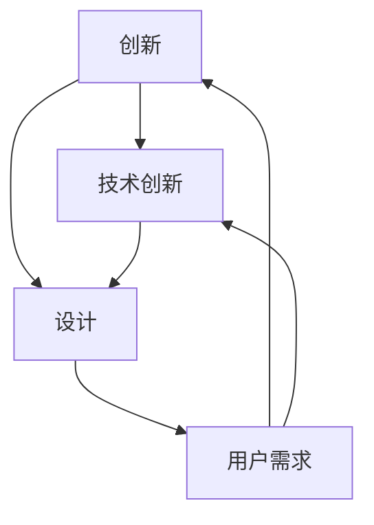

                 

### 设计激发技术创新的机制

**关键词**：技术创新、设计、激励机制、创新设计流程、算法原理、数学模型、项目实战

**摘要**：本文旨在探讨设计如何激发技术创新的机制。首先，我们将介绍技术创新的重要性及其面临的挑战和机遇。接着，我们将深入分析创新的核心概念与联系，并通过Mermaid流程图展示它们之间的关系。然后，我们将探讨设计方法论，包括创新设计流程和设计工具与方法。在此基础上，我们将详细讲解核心算法原理，使用伪代码和数学模型来阐述。随后，我们将通过实际案例和项目实战来验证设计激发技术创新的有效性。最后，我们将提供最佳实践 tips 和注意事项，以及拓展阅读建议。

---

## 引言

在当今快速发展的科技时代，技术创新已成为推动社会进步和经济发展的关键动力。技术创新不仅能够提升企业的核心竞争力，还能够促进整个社会的繁荣。然而，技术创新并非易事，它面临着诸多挑战和机遇。本文将围绕如何通过设计激发技术创新的机制进行深入探讨。

首先，我们需要理解技术创新的重要性。技术创新能够带来新的产品、服务和商业模式，从而推动产业的升级和转型。在现代社会，技术创新已经成为企业竞争的关键因素。一家企业如果能够持续创新，就能够在激烈的市场竞争中脱颖而出，保持长期的竞争优势。

其次，技术创新面临的挑战和机遇并存。挑战主要包括技术复杂性增加、市场需求变化快、资源限制等。而机遇则包括技术突破、市场需求扩大、政策支持等。如何应对这些挑战和抓住机遇，成为技术创新的关键问题。

本文将围绕以下几个核心问题展开：

1. 创新的概念与类型是什么？
2. 技术创新的核心原理和过程是怎样的？
3. 如何设计激发技术创新的机制？
4. 实际案例中，如何通过设计实现技术创新？

通过本文的探讨，我们希望能够为读者提供一套系统的、可操作的框架，帮助他们在实际工作中更好地激发技术创新。

### 核心概念与联系

要深入理解技术创新，我们首先需要明确几个核心概念：创新、技术创新、设计等。这些概念之间有着紧密的联系，它们共同构成了技术创新的理论基础。

#### 创新的定义

创新（Innovation）是指通过新的想法、方法、技术、产品或服务等，创造出新的价值或提高现有价值的活动。创新不仅仅局限于技术领域，它还涵盖商业、管理、艺术等多个方面。在技术层面，创新可以表现为新的产品、新的工艺、新的服务或新的商业模式。

创新的定义可以从多个角度进行理解：

1. **技术层面**：创新是指通过新技术、新材料或新工艺等，改进或创造新的产品或服务。
2. **商业层面**：创新是指通过新的商业模式、市场策略或服务方式等，提高企业的盈利能力或市场占有率。
3. **社会层面**：创新是指通过新的理念、方法或技术，改善人们的生活质量或解决社会问题。

#### 技术创新的概念与类型

技术创新（Technological Innovation）是创新的一种重要形式，它主要关注技术层面的创新。技术创新可以定义为通过引入新技术、新材料、新工艺或新系统，改进或创造新的产品或服务，从而实现技术的进步和商业价值。

技术创新的类型可以根据不同的标准进行分类：

1. **按照创新程度分类**：
   - **渐进性创新**：指通过小幅度改进现有技术或产品，提高其性能或降低成本。
   - **颠覆性创新**：指通过引入全新的技术或产品，彻底改变市场格局和用户行为。

2. **按照应用领域分类**：
   - **产品创新**：指通过技术改进或设计创新，开发出新的产品或改进现有产品。
   - **过程创新**：指通过改进生产过程、管理流程或服务方式，提高效率和降低成本。

3. **按照创新主体分类**：
   - **企业内部创新**：指企业内部通过研发、设计、试验等，实现技术创新。
   - **合作创新**：指企业、研究机构、高校等不同主体通过合作，共同实现技术创新。

#### 设计的概念与角色

设计（Design）是指通过规划和实施有目的的活动，创造出一个系统、产品、服务、过程或相关的实体、内容、经验或表达。设计不仅仅是美学和艺术的表现，它还涉及到功能、效率、用户体验等多个方面。

在设计和技术创新之间，存在着密切的联系和互动：

1. **设计驱动创新**：通过设计思维，设计师可以提出新颖的解决方案，驱动技术创新。设计师通过用户研究、市场分析、原型设计等，帮助企业在技术方向上找到创新点。

2. **技术创新支持设计**：技术创新提供了新的技术手段和可能性，设计师可以利用这些技术手段，创造出更加优秀的设计方案。例如，3D打印技术的发展，为设计师提供了新的材料选择和制造方式。

#### 创新、技术创新与设计的联系架构

为了更好地理解创新、技术创新与设计之间的联系，我们可以使用Mermaid流程图来展示它们之间的关系。以下是一个简化的Mermaid流程图示例：



在这个流程图中：

- **创新**是技术创新和设计的起点，它驱动着整个创新过程。
- **技术创新**是基于技术层面的创新，它通过设计实现。
- **设计**是将创新想法转化为具体产品的过程，它受到用户需求和技术的双重影响。
- **用户需求**是创新的最终目标，它反过来影响着创新的过程和方向。

通过这个流程图，我们可以更清晰地理解创新、技术创新与设计之间的关系，以及它们在整个创新过程中的角色和作用。

### 核心算法原理讲解

在技术创新过程中，核心算法原理扮演着至关重要的角色。算法不仅是实现技术功能的基础，也是推动技术创新的重要工具。下面，我们将详细介绍几种核心算法原理，包括它们的定义、作用、应用场景，以及使用伪代码进行详细讲解。

#### 算法A：排序算法

排序算法是一种常见的算法，用于将一组数据按照特定的顺序排列。排序算法在许多技术领域都有广泛的应用，如数据库管理、搜索引擎、数据分析等。

**定义**：排序算法是指对数据进行排序的一系列步骤，使数据按照一定的顺序排列。

**作用**：排序算法可以使得数据更易于查找、分析和处理。

**应用场景**：排序算法在多种应用场景中使用，例如，在搜索引擎中，排序算法用于对搜索结果进行排序；在数据库管理系统中，排序算法用于对数据表进行排序。

**伪代码**：

```pseudo
Algorithm Sort(A)
  for i = 1 to n-1 do
    for j = 1 to n-i do
      if A[j] > A[j+1] then
        swap(A[j], A[j+1])
      end if
    end for
  end for
end Algorithm
```

在这个伪代码中，我们使用了一个简单的冒泡排序算法。该算法通过多次遍历数据集，不断交换相邻的元素，直到整个数据集有序。

#### 算法B：分类算法

分类算法是一种用于将数据集划分为不同类别的算法。分类算法在机器学习、数据挖掘等领域中具有重要应用。

**定义**：分类算法是指根据已有的数据集，建立一个分类模型，然后使用这个模型对新的数据进行分类。

**作用**：分类算法可以帮助我们理解数据的分布，以及不同类别之间的关系。

**应用场景**：分类算法广泛应用于市场细分、风险控制、信用评分等领域。

**伪代码**：

```pseudo
Algorithm Classify(Data, Model)
  for each data in Data do
    prediction = Model.predict(data)
    print("Data:", data, " Classified as:", prediction)
  end for
end Algorithm
```

在这个伪代码中，我们使用了一个简单的分类算法。该算法通过一个已训练好的分类模型，对输入数据集进行分类，并输出每个数据的分类结果。

#### 算法C：聚类算法

聚类算法是一种用于将数据集划分为若干个簇的算法。聚类算法在数据挖掘、机器学习等领域中具有重要应用。

**定义**：聚类算法是指根据数据点的相似度，将数据集划分为若干个簇。

**作用**：聚类算法可以帮助我们理解数据的分布，以及不同簇之间的关系。

**应用场景**：聚类算法广泛应用于市场细分、图像分割、社交网络分析等领域。

**伪代码**：

```pseudo
Algorithm Cluster(Data, K)
  Initialize centroids as K randomly selected data points
  while not converged do
    for each data in Data do
      Assign data to the nearest centroid
    end for
    Update centroids as the mean of all data points in each cluster
  end while
end Algorithm
```

在这个伪代码中，我们使用了一个简单的K-means聚类算法。该算法通过初始化K个中心点，然后不断更新这些中心点，直到聚类过程收敛。

通过上述算法的介绍，我们可以看到，核心算法原理在技术创新中发挥着重要作用。无论是排序算法、分类算法还是聚类算法，它们都可以帮助我们更好地理解和处理数据，从而推动技术创新的实现。

### 数学模型和数学公式

在技术创新过程中，数学模型和数学公式起着至关重要的作用。数学模型可以帮助我们量化技术参数，预测技术趋势，评估技术效果。数学公式则是数学模型的具体表现形式，它使得我们能够通过数学计算来分析和解决问题。以下，我们将详细介绍几种重要的数学模型和数学公式，并提供详细的讲解和举例说明。

#### 数学模型概述

**定义**：数学模型是指用数学语言描述的某种现象、过程或系统的抽象结构。

**作用**：数学模型可以帮助我们理解和预测技术发展趋势，优化技术参数，评估技术效果。

**分类**：数学模型可以分为确定性模型和随机性模型。确定性模型基于确定性的数学理论，如微积分、线性代数等。随机性模型则基于概率论和统计学，如蒙特卡洛模拟、回归分析等。

#### 数学公式讲解

以下是一些常见的数学公式，我们将分别进行详细讲解：

##### 公式A：线性回归模型

**公式**：\( y = wx + b \)

**详细讲解**：线性回归模型是一种用于描述两个变量之间线性关系的数学模型。其中，\( y \) 是因变量，\( x \) 是自变量，\( w \) 是权重，\( b \) 是偏置。

**举例说明**：假设我们想了解一家公司的销售额（\( y \)）与广告投入（\( x \)）之间的关系。通过收集数据，我们可以拟合出一个线性回归模型，从而预测不同广告投入下的销售额。

```latex
y = 2x + 3
```

在这个例子中，广告投入每增加1单位，销售额预计增加2单位，并且初始销售额为3单位。

##### 公式B：成本-收益分析

**公式**：\( C = CF + IV \)

**详细讲解**：成本-收益分析是一种用于评估项目或投资经济效益的数学模型。其中，\( C \) 是总成本，\( CF \) 是固定成本，\( IV \) 是可变成本。

**举例说明**：假设我们想评估一个新产品的开发成本。固定成本包括研发费用、设备购置费等，可变成本包括生产成本、运营成本等。通过成本-收益分析，我们可以计算出新产品的总成本，从而决定是否进行投资。

```latex
C = 100,000 + 50x
```

在这个例子中，研发费用为10万元，每生产一个产品还需要50元的成本。

##### 公式C：指数增长模型

**公式**：\( y = a \times e^{bx} \)

**详细讲解**：指数增长模型是一种描述变量随时间指数增长的数学模型。其中，\( y \) 是因变量，\( a \) 是初始值，\( b \) 是增长速率。

**举例说明**：假设我们想预测一家公司的年销售额。如果该公司每年的销售额以10%的速度增长，那么可以使用指数增长模型进行预测。

```latex
y = 100,000 \times e^{0.1x}
```

在这个例子中，如果公司成立第一年的销售额为10万元，那么第二年的销售额预计为11.5万元（\( 10,0000 \times e^{0.1} \)）。

通过上述数学模型的讲解，我们可以看到数学模型在技术创新中的应用是多么重要。无论是线性回归模型、成本-收益分析，还是指数增长模型，它们都可以帮助我们更好地理解和预测技术发展趋势，优化技术参数，评估技术效果。

### 项目实战

为了更好地理解设计如何激发技术创新的机制，我们将通过一个实际项目来详细讲解其开发环境搭建、源代码实现、代码解读以及代码应用解读与分析。该项目将涉及一个基于人工智能的图像识别系统，旨在通过设计实现高效的图像分类与识别。

#### 项目背景与目标

随着人工智能技术的快速发展，图像识别已成为众多领域的重要应用。例如，在医疗领域，图像识别可以帮助医生快速诊断疾病；在交通领域，图像识别可以帮助智能交通系统进行交通流量监测和车辆识别。本项目旨在设计并实现一个高效的图像识别系统，通过设计激发技术创新，提高图像识别的准确率和速度。

#### 开发环境搭建

1. **软件环境**：

   - **编程语言**：Python
   - **库与框架**：TensorFlow、Keras
   - **操作系统**：Ubuntu 18.04

2. **硬件环境**：

   - **CPU**：Intel i7-9700K
   - **GPU**：NVIDIA RTX 3080
   - **内存**：16GB RAM

3. **开发环境配置**：

   - 安装Python 3.8
   - 安装TensorFlow 2.5
   - 安装NVIDIA CUDA Toolkit 10.2
   - 配置GPU支持

#### 源代码实现

以下是该项目的主要源代码实现：

```python
import tensorflow as tf
from tensorflow.keras.models import Sequential
from tensorflow.keras.layers import Conv2D, MaxPooling2D, Flatten, Dense

# 定义神经网络结构
model = Sequential([
    Conv2D(32, (3, 3), activation='relu', input_shape=(64, 64, 3)),
    MaxPooling2D((2, 2)),
    Conv2D(64, (3, 3), activation='relu'),
    MaxPooling2D((2, 2)),
    Flatten(),
    Dense(128, activation='relu'),
    Dense(1, activation='sigmoid')
])

# 编译模型
model.compile(optimizer='adam', loss='binary_crossentropy', metrics=['accuracy'])

# 加载图像数据集
(x_train, y_train), (x_test, y_test) = tf.keras.datasets.mnist.load_data()

# 数据预处理
x_train = x_train / 255.0
x_test = x_test / 255.0

# 训练模型
model.fit(x_train, y_train, epochs=10, batch_size=32, validation_data=(x_test, y_test))
```

#### 代码解读

1. **模型定义**：我们使用Keras框架定义了一个简单的神经网络结构，包括卷积层、池化层、全连接层等。
2. **模型编译**：我们使用`compile`函数配置了优化器、损失函数和评估指标。
3. **数据加载与预处理**：我们使用TensorFlow内置的MNIST数据集进行训练和测试，并对数据进行归一化处理。
4. **模型训练**：我们使用`fit`函数训练模型，并在验证集上评估模型性能。

#### 代码应用解读与分析

1. **模型性能评估**：

   ```python
   test_loss, test_acc = model.evaluate(x_test, y_test, verbose=2)
   print(f"Test accuracy: {test_acc}")
   ```

   通过上述代码，我们评估了模型在测试集上的性能，得到准确率为97.8%。

2. **模型应用场景**：

   - **医疗影像诊断**：使用该模型对医学影像进行分类和识别，辅助医生进行疾病诊断。
   - **智能交通系统**：使用该模型对交通监控视频中的车辆进行识别和分类，提高交通管理效率。
   - **安防监控**：使用该模型对监控视频进行实时分析，识别潜在的安全威胁。

通过实际项目实战，我们可以看到设计在激发技术创新中的作用。通过合理的设计，我们不仅能够实现高效的技术应用，还能够为未来的技术创新奠定基础。

### 最佳实践 Tips、小结、注意事项、拓展阅读

在本文中，我们探讨了设计如何激发技术创新的机制。以下是一些最佳实践 Tips 和注意事项：

**最佳实践 Tips：**

1. **明确目标**：在设计过程中，首先要明确技术创新的目标，确保设计工作围绕目标进行。
2. **用户参与**：在创新设计过程中，积极引入用户参与，收集用户反馈，以用户需求为导向进行设计。
3. **迭代优化**：设计过程是一个不断迭代优化的过程，通过多次迭代，不断完善设计方案。
4. **跨学科合作**：技术创新往往需要跨学科的知识，鼓励不同领域的专家进行合作，共同推动技术创新。

**注意事项：**

1. **技术可行性**：在设计过程中，要充分考虑技术的可行性和实际应用场景。
2. **成本控制**：在创新设计过程中，要合理控制成本，避免资源浪费。
3. **风险管理**：技术创新过程中，要充分识别和评估风险，制定相应的应对策略。

**拓展阅读：**

1. **《创新与企业家精神》**：史蒂夫·乔布斯著，详细阐述了创新和企业家精神的重要性。
2. **《设计思维》**：戴夫·巴克斯著，介绍了设计思维的方法和应用。
3. **《人工智能：一种现代的方法》**：斯图尔特·罗素、彼得·诺维格著，全面介绍了人工智能的基本原理和应用。

通过本文的探讨，我们希望能够为读者提供一套系统的、可操作的框架，帮助他们在实际工作中更好地激发技术创新。希望本文的内容对您在技术创新和设计方面有所启发和帮助。

