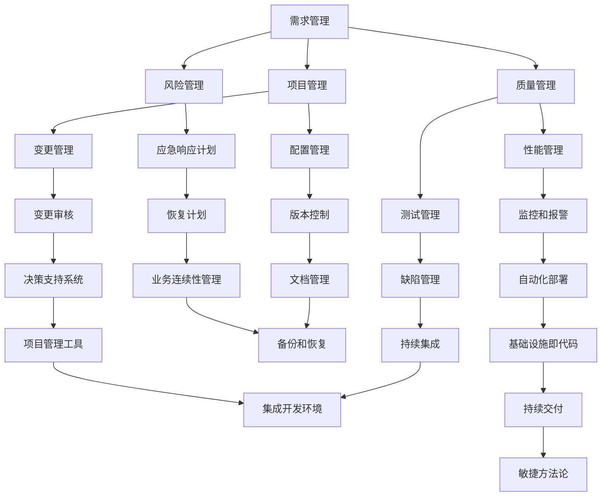

                 

### 1.4 技术管理体系的基本架构

**核心概念与联系**

首先，理解技术管理体系的基本架构是至关重要的。这一架构通常由多个关键组件组成，每个组件在技术管理中扮演着特定的角色。为了更好地展示这些组件之间的关系，我们可以使用Mermaid流程图来描绘它们。



在上面的Mermaid流程图中，我们显示了技术管理体系中的关键组件，如需求管理、项目管理、质量管理、风险管理等。每个组件不仅有其自身的职能，还与其他组件紧密相连，共同构成了一个协调运作的整体。

**核心算法原理讲解**

为了理解技术管理体系如何运作，我们需要深入探讨其核心算法原理。以下是一个简单的伪代码示例，用于描述技术管理体系的基本流程：

```python
def technical_management_system():
    # 需求管理
    demand_management()

    # 项目管理
    project_management()

    # 质量管理
    quality_management()

    # 风险管理
    risk_management()

    # 配置管理
    config_management()

    # 变更管理
    change_management()

    # 测试管理
    test_management()

    # 性能管理
    performance_management()

    # 应急响应计划
    emergency_response_plan()

    # 持续集成和持续交付
    continuous_integration()
    continuous_delivery()

    # 知识管理和文档管理
    knowledge_management()
    document_management()

    # 决策支持系统
    decision_support_system()

    # 最终报告
    final_report()
```

在这个伪代码中，我们定义了一个技术管理体系函数，该函数调用了多个子函数来执行各项管理任务。每个子函数负责管理特定领域的工作，并与其他子函数协同工作，以确保整个技术管理体系的顺畅运作。

**数学模型和数学公式**

为了量化技术管理体系的效果，我们可以使用数学模型来描述关键指标。以下是一个简单的latex格式数学公式示例，用于描述技术管理体系中的项目进度：

```latex
$$
\text{Project Progress} = \frac{\text{Completed Tasks}}{\text{Total Tasks}} \times 100\%
$$`

这个公式显示了项目进度是由已完成任务数与总任务数的比例决定的。类似的数学模型可以用于描述质量、性能、风险管理等指标。

**项目实战**

在实际项目中，技术管理体系的应用至关重要。以下是一个开发环境搭建的案例，用于说明如何实施技术管理体系：

1. **环境搭建**

   - 安装必要的软件和工具，如Git、Jenkins、Docker等。
   - 配置版本控制系统，如GitLab或GitHub。
   - 设置持续集成服务器，如Jenkins。
   - 创建基础设施即代码脚本，以自动化部署和管理环境。

2. **源代码实现**

   ```bash
   #!/bin/bash
   # Dockerfile
   FROM ubuntu:latest
   RUN apt-get update && apt-get install -y python3-pip
   RUN pip3 install flask
   COPY app.py /app/app.py
   EXPOSE 5000
   CMD ["python3", "/app/app.py"]
   ```

3. **代码解读与分析**

   - Dockerfile用于创建应用程序的容器镜像。
   - 镜像中安装了Python和Flask，确保应用程序运行所需的环境。
   - 应用程序代码（app.py）被复制到镜像中，并设置为启动命令。

4. **实际案例分析和详细讲解剖析**

   - 案例分析：使用Docker和Jenkins自动化部署应用程序。
   - 详细讲解：如何配置Jenkins管道以执行自动化构建、测试和部署。

5. **项目小结**

   - 项目成功实现了自动化部署和管理。
   - 使用Docker确保了环境的一致性。
   - Jenkins提供了持续集成的功能，提高了开发效率。

**最佳实践 tips**

- **需求管理**：确保需求清晰、明确，并定期更新。
- **项目管理**：使用敏捷方法论，如Scrum，以快速响应变化。
- **质量管理**：实施严格的代码审查和测试流程，确保高质量代码。
- **风险管理**：识别潜在风险，并制定应对策略。
- **配置管理**：使用版本控制系统，确保代码的版本控制。
- **变更管理**：对变更进行评估和审批，以减少潜在风险。
- **测试管理**：定期执行自动化测试，确保代码的稳定性。
- **性能管理**：监控系统性能，优化资源使用。
- **应急响应计划**：确保在紧急情况下能够快速响应。

**小结**

技术管理体系是确保软件开发项目成功的关键。通过明确的核心概念、详细的算法原理讲解、数学模型和实际项目案例，我们可以更好地理解和应用技术管理体系。最佳实践和注意事项可以帮助我们在实际操作中避免常见问题，提高项目效率。

**拓展阅读**

- 《敏捷软件开发：原则、实践与模式》
- 《DevOps：实现持续交付的实用方法》
- 《软件架构：实践者的研究方法》
- 《持续集成：从理论到实践》

**注意事项**

- 确保技术管理体系与组织的业务目标保持一致。
- 定期评估和改进技术管理体系，以适应不断变化的环境。
- 培训团队成员，确保他们了解并遵循技术管理体系。

作者：AI天才研究院/AI Genius Institute & 禅与计算机程序设计艺术 /Zen And The Art of Computer Programming

