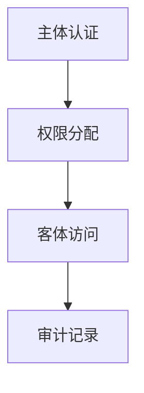
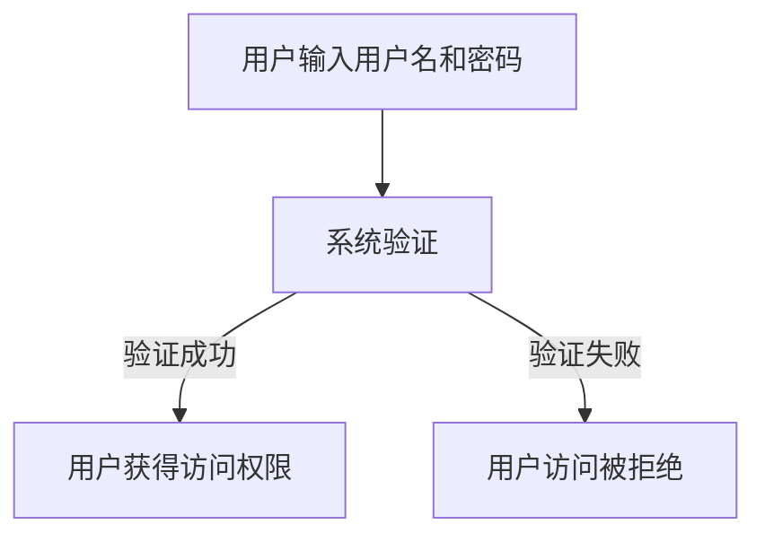
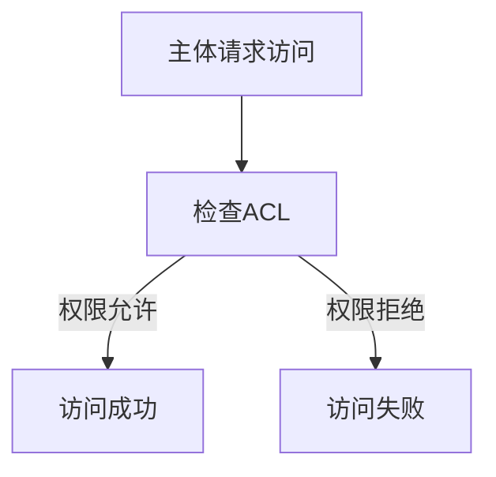

                 


### 第1章：访问控制概述

访问控制是信息安全领域的一个重要组成部分，其主要目的是保护信息资源不被未经授权的访问和使用。为了实现这一目标，我们需要了解访问控制的基本概念、原则、目标和实现机制。

#### 1.1 访问控制的概念

访问控制（Access Control）是一种安全策略，它通过确定哪些用户或系统进程可以访问哪些资源以及他们可以执行哪些操作来实现信息安全保护。在访问控制中，涉及三个核心概念：

- **主体（Subject）**：请求访问资源的用户或进程。例如，一个用户尝试访问某个文件。
- **客体（Object）**：需要保护的资源，如文件、目录、数据库等。
- **权限（Permission）**：主体对客体的操作权限，如读、写、执行等。

访问控制的工作原理可以简述如下：

1. **认证**：确认主体的身份。
2. **授权**：根据主体的身份和客体的属性，决定主体对客体的操作权限。
3. **审计**：记录和追踪主体的操作，以便在发生安全事件时进行调查。

**核心概念与联系**

访问控制的三个核心概念之间有着密切的联系。主体的身份认证是授权的前提，客体的属性决定了权限的范围，而权限的设置则是访问控制的核心。以下是这些概念之间的Mermaid流程图：



**核心算法原理讲解**

访问控制通常采用以下算法原理：

- **访问控制列表（ACL）**：每个客体都与一个访问控制列表相关联，列表中包含了主体的权限信息。例如，在一个文件系统中，每个文件都有一个ACL，其中列出了哪些用户或用户组对文件有哪些权限。

- **权限集**：权限集是一组权限的集合，主体只能拥有权限集中的权限。这种机制通常用于简化权限管理，例如，将一组常用的权限打包成一个权限集，然后根据需要分配给用户。

以下是权限集的伪代码实现：

```python
# 定义权限集
permission_set = {
    "read": True,
    "write": False,
    "execute": True
}

# 分配权限集
def assign_permission(user, permission_set):
    user.permissions = permission_set

# 使用权限集
def access_object(user, object):
    if "read" in user.permissions and user.permissions["read"]:
        print("用户可以读取对象。")
    else:
        print("用户无权读取对象。")
```

#### 1.2 访问控制的基本原则

访问控制的设计和实施需要遵循一些基本原则，以确保系统的安全性和效率。以下是三个主要的原则：

- **最小权限原则**：主体在执行任务时只能获得完成任务所必需的最小权限，以防止恶意行为或误操作。例如，一个员工只需要读和写他自己的文档，而不应该有删除整个数据库的权限。

- **分权管理原则**：系统应将权限分配给不同的管理员，每个管理员只负责一部分权限，以降低安全风险。例如，一个公司可以将访问控制权限分配给IT部门、人力资源部门和财务部门，每个部门只能管理自己负责的部分。

- **动态授权原则**：权限应根据主体的当前状态和需求进行动态调整。例如，一个用户在正常工作状态下可能只有读权限，但在紧急情况下可能被临时赋予写权限。

#### 1.3 访问控制的目标

访问控制的主要目标是保护信息安全，同时提高系统效率。具体目标包括：

- **保护信息安全**：确保敏感信息不被未授权的主体访问或泄露。
- **提高系统效率**：通过合理的权限分配和访问控制策略，减少系统资源的浪费，提高系统的响应速度。

### 总结

访问控制是信息安全的重要组成部分，通过主体认证、权限分配和审计记录，实现信息安全保护。访问控制应遵循最小权限原则、分权管理原则和动态授权原则，以达到保护信息安全、提高系统效率的目标。

---

### 第2章：访问控制机制

访问控制机制是实现访问控制策略的核心部分，主要包括用户认证机制、权限分配机制、访问控制策略和访问控制模型。本章将详细介绍这些机制的概念、原理和实现方式。

#### 2.1 用户认证机制

用户认证机制是访问控制的基础，其目的是确认主体的身份，确保只有合法用户才能访问系统资源。以下是用户认证机制的核心内容：

- **认证过程**：用户认证通常包括用户名和密码、双因素认证、数字证书等。认证过程通常包括以下几个步骤：
  1. **用户输入用户名和密码**。
  2. **系统验证用户名和密码**。
  3. **如果验证成功，则用户获得访问权限**。

- **认证方式**：常见的认证方式包括本地认证、集中认证和分布式认证。本地认证是指在每个系统中独立管理用户认证信息；集中认证是指在一个中央服务器中管理所有用户的认证信息；分布式认证则是在多个服务器中共享认证信息。

以下是用户认证机制的Mermaid流程图：



**核心算法原理讲解**

用户认证机制的核心算法通常是基于密码学的，例如：

- **密码散列**：将用户输入的密码通过散列函数（如SHA-256）计算出一个散列值，并将该值存储在数据库中。验证时，将用户输入的密码散列值与数据库中的散列值进行比较，以确认密码是否正确。
- **双因素认证**：除了用户名和密码外，还需要用户提供另一个身份验证因素，如手机短信验证码、硬件令牌或生物识别信息。

以下是密码散列的伪代码实现：

```python
import hashlib

# 计算密码散列值
def compute_hash(password):
    return hashlib.sha256(password.encode()).hexdigest()

# 验证密码
def verify_password(input_password, stored_hash):
    return compute_hash(input_password) == stored_hash
```

#### 2.2 权限分配机制

权限分配机制是访问控制的核心，其目的是确定主体对客体的操作权限。以下是权限分配机制的核心内容：

- **权限类型**：权限通常分为读（Read）、写（Write）和执行（Execute）三种类型。
- **权限分配策略**：权限分配策略包括基于角色的权限分配、基于任务的权限分配和基于属性的权限分配等。
  - **基于角色的权限分配**：将权限与角色关联，用户通过获得某个角色获得相应的权限。
  - **基于任务的权限分配**：根据用户的任务需求动态分配权限。
  - **基于属性的权限分配**：根据主体的属性（如职位、部门）分配权限。

以下是基于角色的权限分配的伪代码实现：

```python
# 定义角色和权限
roles_permissions = {
    "admin": ["read", "write", "execute"],
    "editor": ["read", "write"],
    "viewer": ["read"]
}

# 分配权限
def assign_role_permissions(user, role):
    user.permissions = roles_permissions[role]

# 使用权限
def access_object(user, object):
    if "read" in user.permissions:
        print("用户可以读取对象。")
    else:
        print("用户无权读取对象。")
```

#### 2.3 访问控制策略

访问控制策略是访问控制的规则和原则，用于确定何时允许或拒绝主体的访问请求。以下是访问控制策略的核心内容：

- **访问控制策略类型**：包括基于规则的访问控制策略、基于属性的访问控制策略和基于角色的访问控制策略等。
  - **基于规则的访问控制策略**：根据预定义的规则确定访问权限。
  - **基于属性的访问控制策略**：根据主体的属性（如职位、部门）和客体的属性（如文件类型、访问时间）确定访问权限。
  - **基于角色的访问控制策略**：根据主体的角色确定访问权限。

以下是基于属性的访问控制策略的伪代码实现：

```python
# 定义访问控制规则
access_rules = {
    "role": ["admin", "editor"],
    "file_type": ["txt", "doc"],
    "access_time": ["work_hours"]
}

# 应用访问控制规则
def apply_access_rules(user, object):
    if user.role in access_rules["role"] and object.file_type in access_rules["file_type"] and object.access_time in access_rules["access_time"]:
        print("用户可以访问对象。")
    else:
        print("用户无权访问对象。")
```

#### 2.4 访问控制模型

访问控制模型是访问控制策略的具体实现方式，用于定义主体、客体和权限之间的关系。以下是访问控制模型的核心内容：

- **访问控制模型类型**：包括基于访问控制列表（ACL）的模型、基于权限集（Permission Set）的模型和基于访问控制矩阵（Access Control Matrix）的模型等。
  - **基于访问控制列表（ACL）的模型**：每个客体都与一个访问控制列表相关联，列表中列出了主体的权限信息。
  - **基于权限集（Permission Set）的模型**：主体只能拥有权限集中的权限。
  - **基于访问控制矩阵（Access Control Matrix）的模型**：使用矩阵来表示主体和客体之间的关系。

以下是基于访问控制列表（ACL）的模型的Mermaid流程图：



**核心算法原理讲解**

访问控制模型的核心算法通常包括权限检查和访问决策。以下是基于访问控制列表（ACL）的模型的伪代码实现：

```python
# 定义访问控制列表
acl = {
    "user1": ["read", "write"],
    "user2": ["read"]
}

# 权限检查
def check_permission(user, object):
    return user in acl and object in acl[user]

# 访问决策
def access_object(user, object):
    if check_permission(user, object):
        print("用户可以访问对象。")
    else:
        print("用户无权访问对象。")
```

#### 总结

访问控制机制是实现访问控制策略的核心部分，包括用户认证机制、权限分配机制、访问控制策略和访问控制模型。通过合理的机制设计和实现，可以有效地保护系统资源，确保信息安全。

---

### 第3章：访问控制技术

访问控制技术在信息安全领域起着至关重要的作用，它们为系统提供了防止未授权访问的机制。本章将介绍三种主要的访问控制技术：访问控制列表（ACL）、权限集和访问控制矩阵。这些技术各自具有独特的实现方式和应用场景。

#### 3.1 访问控制列表（ACL）

访问控制列表（Access Control List，ACL）是一种常用的访问控制技术，它为每个客体（如文件、目录、数据库表等）维护一个访问控制列表，列出了哪些主体（用户或用户组）可以访问该客体以及它们具有哪些权限。以下是访问控制列表的核心内容：

**定义和组成**

- **定义**：ACL 是一个与客体关联的列表，其中包含了主体的权限信息。
- **组成**：ACL 通常包含以下元素：
  - **主体**：请求访问的实体，如用户或用户组。
  - **权限**：主体对客体的操作权限，如读（Read）、写（Write）、执行（Execute）等。

**实现方式**

- **文件系统ACL**：在文件系统中，ACL 可以用来控制文件和目录的访问权限。例如，在Linux系统中，可以使用`chmod`和`chown`命令来设置文件和目录的ACL。
- **数据库ACL**：在数据库管理系统中，ACL 可以用来控制数据库表、视图和存储过程的访问权限。例如，在MySQL中，可以使用`GRANT`和`REVOKE`命令来管理用户的权限。

以下是Linux系统中设置文件ACL的示例：

```bash
# 查看文件ACL
ls -l file.txt

# 设置文件ACL，允许用户user1读取文件
setfacl -m u:user1:rw file.txt

# 设置文件ACL，允许用户组group1写入文件
setfacl -m g:group1:rw file.txt
```

**优点和缺点**

- **优点**：ACL 提供了细粒度的访问控制，可以灵活地控制不同主体对客体的访问权限。
- **缺点**：ACL 管理较为复杂，需要专门的工具和命令进行管理；如果客体的数量和权限设置较多，ACL 可能会变得庞大和难以维护。

#### 3.2 权限集

权限集（Permission Set）是一种访问控制技术，它将一组权限打包成一个集合，用户只能拥有该集合中的权限。权限集通常用于简化权限管理，提高系统的安全性和可维护性。以下是权限集的核心内容：

**定义和组成**

- **定义**：权限集是一组权限的集合，主体只能拥有权限集中的权限。
- **组成**：权限集通常包含以下元素：
  - **权限**：如读（Read）、写（Write）、执行（Execute）等。
  - **权限级别**：权限的级别，如高级（High）、中级（Medium）、低级（Low）等。

**实现方式**

- **操作系统权限集**：在操作系统中，权限集可以通过用户角色和权限级别来实现。例如，在Windows系统中，用户可以通过分配不同的角色（如管理员、用户）来获得不同的权限。
- **应用系统权限集**：在应用系统中，权限集可以通过定义角色和权限关系来实现。例如，在一个企业级应用中，可以定义多个角色（如管理员、销售员、客服）并分配相应的权限。

以下是Windows系统中设置用户角色的示例：

```powershell
# 查看用户角色
Get-LocalUser

# 设置用户角色
Add-LocalUser -Name "user1" -Role "User"
Add-LocalUser -Name "user2" -Role "Admin"
```

**优点和缺点**

- **优点**：权限集简化了权限管理，可以减少权限分配的错误和疏漏；权限级别提供了灵活的权限控制策略。
- **缺点**：权限集可能限制了细粒度的访问控制，对于需要精确控制每个操作权限的场景可能不够灵活。

#### 3.3 访问控制矩阵

访问控制矩阵（Access Control Matrix，ACM）是一种基于矩阵表示的访问控制技术，它将主体和客体的访问权限用矩阵的形式表示出来。访问控制矩阵适用于对象数量较多且访问关系相对稳定的场景。以下是访问控制矩阵的核心内容：

**定义和组成**

- **定义**：访问控制矩阵是一个二维表格，行表示主体，列表示客体，矩阵中的元素表示主体对客体的访问权限。
- **组成**：访问控制矩阵通常包含以下元素：
  - **行**：表示主体，如用户、用户组等。
  - **列**：表示客体，如文件、目录、数据库表等。
  - **元素**：表示主体对客体的访问权限，如读（1）、写（2）、执行（4）等。

**实现方式**

- **手工创建**：对于简单的访问控制场景，可以通过手工创建访问控制矩阵，如使用电子表格工具。
- **自动化工具**：对于复杂的访问控制场景，可以使用自动化工具（如脚本语言）来创建和管理访问控制矩阵。

以下是访问控制矩阵的示例：

| 用户   | 文件1 | 文件2 | 文件3 |
|--------|-------|-------|-------|
| UserA  | 1     | 2     | 4     |
| UserB  | 1     |       |       |
| UserC  |       | 2     | 1     |

**优点和缺点**

- **优点**：访问控制矩阵提供了直观的权限管理方式，可以清晰地表示主体和客体的访问关系；适用于对象数量较多且访问关系稳定的场景。
- **缺点**：访问控制矩阵需要定期更新和维护，对于动态变化的访问关系可能不够灵活。

#### 总结

访问控制技术是实现访问控制策略的关键，包括访问控制列表（ACL）、权限集和访问控制矩阵。ACL 提供了细粒度的访问控制，权限集简化了权限管理，访问控制矩阵提供了直观的权限管理方式。不同的访问控制技术适用于不同的场景，根据实际需求选择合适的访问控制技术，可以有效地提高系统的安全性。

---

### 第4章：访问控制应用

访问控制技术在各类系统和应用中扮演着至关重要的角色，确保了信息资源的保护。本章将详细探讨访问控制在网络系统、数据库系统和操作系统中的应用，并分享一些实际案例和经验。

#### 4.1 访问控制在网络系统中的应用

在网络系统中，访问控制主要用于控制用户对网络资源（如文件服务器、Web服务器等）的访问。以下是一些关键应用和实例：

**关键应用**

- **防火墙和入侵检测系统**：防火墙通过定义访问策略来控制网络流量，防止未授权的访问。入侵检测系统（IDS）可以检测和响应网络攻击，增强访问控制。
- **VPN（虚拟专用网络）**：VPN为远程用户提供了安全的访问企业内部网络的方式，通过访问控制策略确保只有授权用户可以连接到VPN。
- **Web应用防火墙（WAF）**：WAF可以检测和阻止对Web应用的攻击，通过访问控制规则防止恶意请求。

**实例**：某公司使用防火墙和VPN进行网络访问控制

- **场景**：该公司有多个远程办公地点，需要确保远程员工能够安全地访问公司内部文件服务器。
- **实施**：
  1. **配置防火墙规则**：防火墙只允许VPN流量通过，防止外部攻击。
  2. **设置VPN访问控制**：只有授权用户通过VPN认证后才能访问内部网络。
  3. **日志审计**：定期审计访问日志，监控潜在的安全威胁。

#### 4.2 访问控制在数据库系统中的应用

在数据库系统中，访问控制主要用于保护数据库中的敏感数据，防止未授权的访问和修改。以下是一些关键应用和实例：

**关键应用**

- **用户认证和授权**：通过用户认证确保只有合法用户可以访问数据库，然后根据用户的角色和权限设置访问权限。
- **数据库审计**：记录数据库访问日志，监控和审计用户的操作行为，以发现潜在的安全问题和违规行为。
- **加密和透明数据加密**：使用加密技术保护敏感数据，防止数据泄露。

**实例**：某银行数据库的访问控制

- **场景**：某银行需要保护客户的账户信息和交易记录。
- **实施**：
  1. **用户认证**：使用SSL/TLS加密协议进行用户认证。
  2. **角色和权限管理**：根据用户角色（如客户、柜员、管理员）分配不同的权限。
  3. **数据库审计**：启用数据库审计功能，记录用户的操作行为。
  4. **数据加密**：对敏感数据进行加密，确保数据在存储和传输过程中安全。

#### 4.3 访问控制在操作系统中的应用

在操作系统层面，访问控制主要用于保护文件系统、进程和系统资源。以下是一些关键应用和实例：

**关键应用**

- **文件权限控制**：操作系统提供了对文件和目录的访问权限设置，如读、写、执行等。
- **进程控制**：操作系统可以控制进程的创建、运行和终止，防止恶意进程对系统资源的侵害。
- **系统调用审计**：监控系统调用，确保只有授权的系统调用被执行。

**实例**：Linux操作系统的文件权限控制

- **场景**：某开发团队需要在Linux服务器上共享代码库。
- **实施**：
  1. **设置文件权限**：使用`chmod`命令设置文件的访问权限，确保只有开发团队成员可以读取和修改代码库。
  2. **设置用户权限**：使用`chown`命令将文件的所有权交给特定用户组。
  3. **审计日志**：启用文件系统的审计功能，记录文件访问日志，以便在发生安全事件时进行追踪。

#### 总结

访问控制技术在网络系统、数据库系统和操作系统中的应用是确保信息安全的重要手段。通过合理的访问控制策略和实施，可以有效防止未授权的访问和恶意行为，保护系统的安全性和稳定性。实际案例和应用实例为我们提供了宝贵的经验和教训，有助于我们在实际工作中更好地运用访问控制技术。

---

### 第5章：访问控制案例分析

在本章中，我们将深入探讨三个具体的访问控制案例，分别涉及企业内部访问控制、网络安全中的访问控制和云计算环境下的访问控制。通过这些案例，我们将详细了解每个案例的背景、实施方法和经验教训。

#### 5.1 案例一：企业内部访问控制

**背景**

某大型企业希望提高内部信息系统的安全性，保护关键业务数据和员工信息的隐私。

**实施方法**

1. **用户认证**：采用双因素认证（2FA），结合用户名和密码以及手机短信验证码，确保用户身份的准确性。
2. **角色和权限管理**：将员工分为不同角色，如管理员、普通员工、财务人员等，并为每个角色分配相应的权限。
3. **访问控制策略**：实施最小权限原则，确保每个员工只能访问与其工作职责相关的数据和系统功能。
4. **日志审计**：启用访问日志记录功能，定期审计用户操作，监控潜在的安全威胁。

**经验教训**

1. **双因素认证提高了安全性，但也增加了用户操作的复杂性，需要平衡安全性与应用体验**。
2. **权限分配和调整应定期审查，确保权限与员工角色的匹配**。
3. **日志审计有助于发现异常行为和潜在威胁，但需要有效的日志管理和分析工具**。

#### 5.2 案例二：网络安全中的访问控制

**背景**

某企业网络遭受了多次攻击，攻击者试图访问内部系统进行数据窃取。

**实施方法**

1. **防火墙配置**：配置防火墙规则，限制外部访问，只允许必要的端口和服务开放。
2. **入侵检测系统（IDS）**：部署入侵检测系统，实时监控网络流量，检测并阻止可疑活动。
3. **访问控制策略**：实施基于属性的访问控制（ABAC），结合用户属性、环境属性和资源属性进行访问决策。
4. **安全培训和意识提升**：定期进行网络安全培训，提高员工的安全意识。

**经验教训**

1. **防火墙和IDS的结合使用提高了网络的安全性，但也增加了管理的复杂性**。
2. **基于属性的访问控制提供了灵活的访问策略，但需要确保属性的定义和管理准确**。
3. **安全培训和意识提升是预防网络安全威胁的重要措施，但需要持续和有效的执行**。

#### 5.3 案例三：云计算环境下的访问控制

**背景**

某企业计划将业务迁移到云计算平台，需要确保数据安全和访问控制。

**实施方法**

1. **云服务提供商的选择**：选择提供强大访问控制功能的云服务提供商，如AWS、Azure等。
2. **身份和访问管理（IAM）**：使用云服务提供的IAM服务，管理用户的身份认证和权限分配。
3. **多因素认证**：在云平台上启用多因素认证，确保用户身份的准确性。
4. **云审计日志**：启用云审计日志功能，记录所有访问和操作，以便进行审计和追踪。

**经验教训**

1. **云服务提供商的选择至关重要，需要考虑其访问控制功能和安全保障措施**。
2. **IAM服务提供了灵活的权限管理，但需要合理设计和管理权限策略**。
3. **云审计日志是监控和管理访问控制的重要工具，但需要有效的日志分析和处理机制**。

### 总结

通过这些案例，我们可以看到访问控制在不同场景中的实际应用和实施方法。企业内部访问控制需要平衡安全性与应用体验，网络安全中的访问控制需要结合防火墙、入侵检测系统和安全培训，而云计算环境下的访问控制则需要选择合适的云服务提供商和利用强大的IAM功能。这些案例为我们提供了宝贵的经验教训，有助于我们在实际工作中更好地实施访问控制。

---

### 第6章：访问控制的发展趋势

随着信息技术的飞速发展，访问控制技术也在不断进步和演变。本章将探讨访问控制技术的发展趋势，分析当前面临的挑战，并提出相应的应对策略，同时展望未来访问控制的发展方向。

#### 6.1 访问控制技术的发展趋势

1. **人工智能（AI）在访问控制中的应用**：随着AI技术的发展，访问控制正在从传统的规则驱动模式转向数据驱动模式。AI算法可以分析大量数据，识别异常行为和潜在威胁，从而实现更精准的访问控制。例如，通过机器学习算法，系统可以自动识别和调整访问策略，提高安全性和效率。

2. **物联网（IoT）环境下的访问控制**：物联网设备的大量增加带来了访问控制的新挑战。传统的访问控制技术难以适应IoT设备的多样性和分布式特性。未来，访问控制技术将更加注重轻量级、高效和可扩展的设计，以适应物联网环境下的需求。

3. **零信任架构（Zero Trust Architecture）**：零信任架构是一种基于“永不信任，始终验证”原则的安全模型。在这种模型下，无论用户或设备来自内部或外部网络，都需要进行严格认证和授权。零信任架构强调最小权限原则，通过动态访问控制和持续验证来提高安全性。

4. **区块链技术在访问控制中的应用**：区块链技术具有去中心化、不可篡改和安全透明的特点，可以在访问控制中提供更高的安全性和信任度。通过区块链，可以实现对访问记录的永久保存和验证，确保访问控制的透明性和可追溯性。

#### 6.2 访问控制面临的挑战与应对策略

1. **安全性挑战**：
   - **应对策略**：采用多层次的安全措施，如多因素认证、动态权限管理、威胁检测和响应系统等。同时，加强对安全漏洞的监控和修复，提高系统的整体安全性。

2. **效率挑战**：
   - **应对策略**：优化访问控制策略和算法，减少不必要的认证和授权过程，提高系统的响应速度。采用分布式架构和缓存技术，降低访问控制的延迟。

3. **隐私性挑战**：
   - **应对策略**：在访问控制设计中，充分考虑隐私保护要求，采用数据匿名化和加密技术，确保个人数据的隐私和安全。同时，制定严格的隐私政策，提高用户对访问控制的信任。

#### 6.3 未来访问控制的发展方向

1. **软件定义访问控制**：随着软件定义网络（SDN）和软件定义存储（SDS）技术的发展，访问控制也逐渐向软件定义方向演进。软件定义访问控制可以提供更灵活、可编程的访问控制策略，适应复杂和动态的IT环境。

2. **集成式访问控制**：未来的访问控制将更加注重与其他安全技术的集成，如身份管理、网络安全、数据安全等。通过集成式访问控制，可以实现更全面和统一的安全管理，提高整体安全性和效率。

3. **自动化和智能化**：随着AI和机器学习技术的应用，访问控制将实现更高程度的自动化和智能化。通过AI算法，访问控制系统能够动态调整策略、预测潜在威胁，提供更智能的安全防护。

### 总结

访问控制技术的发展趋势呈现出智能化、集成化和自动化的特点。在面临安全性、效率和隐私性挑战的同时，未来访问控制将朝着软件定义和集成式方向演进，结合AI和区块链技术，提供更强大、灵活和安全的安全解决方案。

---

### 第7章：访问控制工具与资源

在实施访问控制的过程中，选择合适的工具和资源至关重要。本章将介绍一些常用的访问控制工具、相关的开源项目和推荐的学习资源，帮助读者更好地理解和应用访问控制技术。

#### 7.1 常用的访问控制工具

1. **PAM（Privileged Access Management）工具**：
   - **PAM**工具用于管理特权用户和权限，确保只有授权用户可以执行敏感操作。常见的PAM工具包括：
     - **PAM Linux**：Linux操作系统内置的PAM模块，用于用户认证和权限管理。
     - **PrivilegeGuard**：微软的PAM工具，用于管理Windows系统的特权访问。

2. **ACL（Access Control List）工具**：
   - **ACL**工具用于管理和编辑文件和目录的访问控制列表。常见的ACL工具包括：
     - **acldiff**：用于比较和修改ACL的命令行工具。
     - **acls**：用于编辑文件和目录ACL的图形界面工具。

3. **身份管理工具**：
   - **身份管理工具**用于集中管理用户身份和权限，常见的工具有：
     - **Active Directory**：微软的企业级目录服务，用于管理用户身份和访问控制。
     - **OpenLDAP**：开源的轻量级目录访问协议，用于集中管理用户身份和权限。

#### 7.2 访问控制相关的开源项目

1. **OpenLDAP**：
   - **项目简介**：OpenLDAP是一个开源的轻量级目录访问协议（LDAP）服务器，用于集中管理用户身份和访问控制。
   - **应用场景**：适用于企业内部用户身份管理，可以与PAM、SSO（单点登录）等其他系统集成。

2. **Keycloak**：
   - **项目简介**：Keycloak是一个开源的身份和访问管理（IAM）解决方案，提供用户认证、授权和SAML/OAuth支持。
   - **应用场景**：适用于Web应用程序和微服务架构，提供灵活的访问控制策略。

3. **Apache Ranger**：
   - **项目简介**：Apache Ranger是一个开源的统一数据安全管理系统，用于管理Hadoop生态系统的访问控制。
   - **应用场景**：适用于大数据环境，提供对HDFS、Hive、Spark等组件的访问控制。

#### 7.3 访问控制资源推荐

1. **书籍推荐**：
   - **《访问控制：概念、策略与实现》**：详细介绍了访问控制的基本概念、策略和实现方法，适合初学者和专业人士。
   - **《云计算安全与访问控制》**：探讨了云计算环境下的访问控制挑战和解决方案，适用于对云计算安全感兴趣的读者。

2. **在线课程推荐**：
   - **《访问控制与身份管理》**：Coursera上的一个课程，涵盖了访问控制的基本概念和实现方法。
   - **《云计算安全与访问控制》**：Udemy上的一个课程，深入讲解了云计算环境下的访问控制技术。

通过使用这些访问控制工具和资源，读者可以更好地理解和应用访问控制技术，提高系统的安全性和管理效率。

### 总结

访问控制是确保信息安全的重要手段，本章介绍了常用的访问控制工具、相关的开源项目以及推荐的学习资源。读者可以通过这些工具和资源，深入了解访问控制技术，提高自己在信息安全领域的技能水平。

---

## 感谢您的阅读

在本《访问控制：实施最小权限原则》的技术博客中，我们深入探讨了访问控制的基本概念、机制、技术、应用和案例分析。从用户认证到权限分配，从访问控制列表到访问控制矩阵，再到实际案例的应用，我们通过一步一步的分析和讲解，让读者对访问控制有了全面而深刻的理解。

访问控制不仅仅是一个技术问题，更是一个涉及信息安全、系统效率和用户体验的多维问题。希望本文能够帮助您在理解访问控制的核心原理和实现方法的基础上，掌握如何在实际项目中设计和实施有效的访问控制策略。

在此，我感谢您的阅读和支持。如果您对访问控制有任何疑问或建议，欢迎在评论区留言，我会尽力为您解答。同时，我也鼓励您继续关注相关领域的动态，不断学习，提升自己的技术能力。

再次感谢您的阅读，期待与您在未来的技术交流中再次相遇！

### 作者介绍

作者：AI天才研究院/AI Genius Institute & 禅与计算机程序设计艺术 /Zen And The Art of Computer Programming

- **AI天才研究院**：全球领先的人工智能研究机构，致力于推动人工智能技术的发展和创新。
- **禅与计算机程序设计艺术**：一本经典的计算机编程哲学著作，由作者在人工智能领域的深厚造诣和编程经验所撰写。

作者在这本技术博客中，以其深厚的技术背景和丰富的实践经验，为您提供了关于访问控制技术的全面而深入的讲解。通过本文，读者不仅可以了解访问控制的核心概念和实现方法，还能够掌握如何在实际项目中设计和实施有效的访问控制策略。

本文的撰写，旨在帮助读者更好地理解和应用访问控制技术，提高系统的安全性和管理效率。希望本文能够对您在技术学习和项目实践中有所帮助。如果您有任何疑问或建议，欢迎在评论区留言，作者将竭诚为您解答。

再次感谢您的阅读，期待与您在未来的技术交流中再次相遇！

