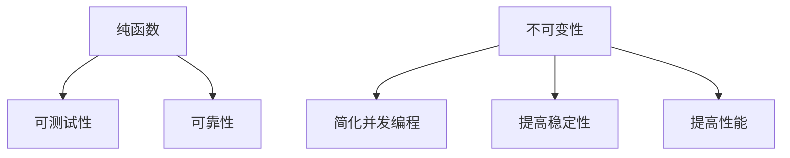
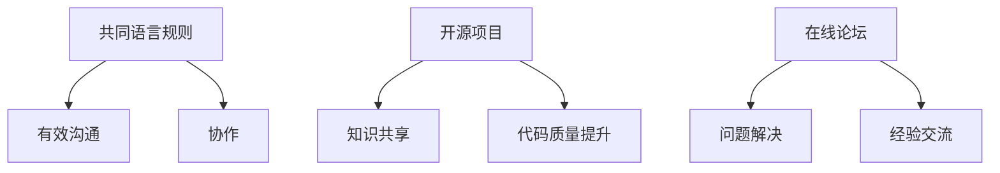
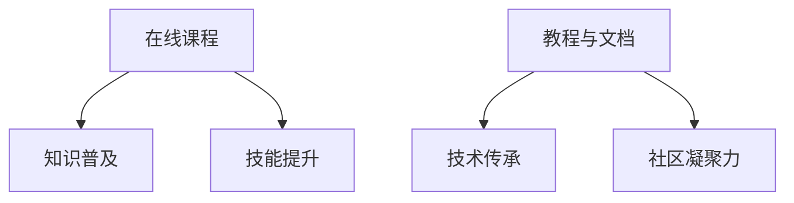

                 

## 文章标题

《语言的社会性与函数式编程社区：维特根斯坦的公共语言观与FP社区的知识共享文化》

### 文章关键词

- 维特根斯坦
- 公共语言观
- 函数式编程
- FP社区
- 知识共享
- 社会性影响

### 摘要

本文深入探讨了维特根斯坦的公共语言观与函数式编程（FP）社区的知识共享文化之间的联系。首先，我们介绍了维特根斯坦的哲学思想及其公共语言观的基本概念，强调语言在社会中的角色及其对知识传播的重要性。接着，我们探讨了函数式编程社区的发展历程、特点以及其独特的知识共享文化。通过分析维特根斯坦的公共语言观在FP社区中的应用，本文揭示了语言在社会性影响和知识共享中的关键作用。最后，本文提出了FP社区未来发展的趋势及其对计算机科学领域的潜在影响。

## 引言

在计算机科学和编程领域，语言既是工具也是媒介，它不仅定义了程序员的思维模式，还影响了软件的开发和维护方式。函数式编程（Functional Programming，简称FP）作为编程范式的一种，因其独特的表达方式和对并行计算的支持，在近年来逐渐引起了广泛关注。然而，FP的崛起不仅仅是因为其技术优势，更与其社区的文化特质紧密相关。这种文化特质之一便是其强大的知识共享精神，这与哲学家路德维希·维特根斯坦（Ludwig Wittgenstein）的公共语言观有着深刻的共鸣。

维特根斯坦的哲学思想，尤其是他的公共语言观，为理解和解释语言在社会中的作用提供了独特的视角。公共语言观强调语言的共同性和可共享性，认为语言的意义不仅仅存在于个体内部，而是通过社会交流和共识得以实现。这一观点在FP社区中得到了生动的体现，FP社区的成员通过共享知识和经验，推动了整个社区的不断进步。

本文旨在探讨维特根斯坦的公共语言观与FP社区的知识共享文化之间的联系，分析两者在推动计算机科学发展的过程中所发挥的作用。文章将从以下几个方面展开讨论：

1. 维特根斯坦的哲学背景及其公共语言观的定义和核心思想。
2. 函数式编程社区的发展历程及其知识共享文化。
3. 维特根斯坦的公共语言观在FP社区中的具体应用和影响。
4. FP社区的挑战与未来展望。

通过上述分析，本文希望揭示语言在社会性影响和知识共享中的关键作用，为理解计算机科学领域中的文化现象提供新的视角。

## 维特根斯坦的哲学背景

路德维希·维特根斯坦（Ludwig Wittgenstein）是20世纪最具影响力的哲学家之一，他的哲学思想对多个学科产生了深远的影响，尤其是在语言哲学、数学哲学和逻辑哲学领域。维特根斯坦的哲学生涯可分为两个阶段，早期以逻辑原子主义和逻辑哲学为主，而晚期则转向语言哲学和日常语言分析。

### 早期哲学思想

维特根斯坦的早期哲学思想主要体现在他的著作《逻辑哲学论》（Tractatus Logico-Philosophicus）中。这部作品以一系列命题的形式阐述了维特根斯坦对世界和语言的看法。他认为，世界是由事实构成的，而事实则是世界状态的一种简单组合，这些组合可以通过逻辑表达式来表达。维特根斯坦提出了著名的“图像理论”（Image Theory），认为命题是世界的“图像”，即命题的结构反映世界的结构。这一理论强调了语言和世界的对应关系，认为语言能够精确地描述现实世界。

然而，这种逻辑原子主义的观点在维特根斯坦的一生中逐渐被他自己所否定。他意识到，逻辑原子主义忽视了人类语言的实际使用情况，过于简化了复杂的现象。这促使他转向日常语言的分析，探索语言在日常生活中的真实用途。

### 晚期哲学思想

晚期的维特根斯坦主要著作是《哲学研究》（Philosophical Investigations），这本书标志着他哲学思想的重大转变。他放弃了逻辑原子主义，转而关注语言的实际使用，特别是语言在日常生活中的复杂性。维特根斯坦提出了“语言游戏”（language game）的概念，认为语言的使用是与特定的社会活动和行为相联系的。他强调，语言的意义不是固定的，而是依赖于特定的情境和语言游戏。

在这本书中，维特根斯坦提出了“家族相似性”（family resemblance）的概念，用来描述语言、习俗和规则之间的复杂关系。他认为，规则并不是固定不变的，而是可以根据具体情况进行调整和解释。这一观点对后来的语言哲学和社会科学产生了深远的影响。

### 公共语言观

维特根斯坦的公共语言观是他在晚期哲学思想中提出的重要理论，这一观点强调语言的社会性和共享性。他认为，语言不仅仅是个体的内部思考工具，更是社会交流的基础。公共语言观的核心思想可以总结为以下几点：

1. **语言的社会性**：维特根斯坦认为，语言的意义是通过社会互动和共同使用而形成的。个体通过参与特定的语言游戏，学习和掌握语言的用法，从而与他人进行有效沟通。

2. **语言的共同性**：公共语言观强调语言的共同性，即一个社区中的成员共享同一套语言规则和表达方式。这种共同性是语言有效沟通的基础，它确保了信息的准确传递和理解。

3. **语言的使用**：维特根斯坦认为，语言的使用是与具体的社会活动和行为密切相关的。语言不仅仅是为了表达思想，更是为了在特定情境下实现特定的目的。语言的使用方式多种多样，包括日常交流、科学描述、艺术创作等。

4. **语言的灵活性**：公共语言观认为，语言是灵活和可变性的，可以根据不同的社会需求和情境进行变化和调整。这种灵活性使得语言能够适应复杂多变的社会环境。

### 对语言哲学的影响

维特根斯坦的公共语言观对语言哲学产生了深远的影响。他的观点挑战了传统语言哲学中关于语言和意义的固定观点，强调了语言的社会性和使用情境的重要性。维特根斯坦的语言哲学思想为后来的语言哲学家提供了新的研究视角，特别是在日常语言分析和语言行为主义方面。

总之，维特根斯坦的哲学思想，特别是他的公共语言观，为我们理解语言在社会中的作用提供了深刻的洞见。这一观点不仅在哲学领域产生了广泛影响，也为理解计算机科学和编程领域的文化现象提供了重要启示。

### 公共语言观的定义与核心思想

维特根斯坦的公共语言观是他晚期哲学思想的重要组成部分，这一观点强调语言在社会中的角色和功能。要深入理解公共语言观，我们需要从其定义、核心思想以及与语言使用的关联等方面进行探讨。

#### 定义

公共语言观，即“public language view”，是维特根斯坦在其晚期作品《哲学研究》中提出的。这一观点认为，语言的意义和有效性是通过共同使用和互动而实现的。维特根斯坦反对了传统的“意义原子论”，即认为每个词汇都有固定的、普遍认可的意义。相反，他认为语言的意义是情境依赖的，是通过对语言的使用和理解而逐渐形成的。

#### 核心思想

公共语言观的核心思想可以归纳为以下几点：

1. **语言的社会性**：维特根斯坦强调，语言是社会现象，它的意义不是孤立存在的，而是依赖于人们的共同使用和社会互动。语言作为一种工具，其价值在于它能够帮助人们进行交流和理解。

2. **语言的共同性**：公共语言观认为，一个社区或文化中的成员共享同一套语言规则和表达方式。这种共同性是语言有效沟通的基础，它确保了信息的准确传递和理解。换句话说，语言的共享性是语言作为沟通工具的基本前提。

3. **语言游戏**：维特根斯坦提出了“语言游戏”（language game）的概念，认为语言的使用是与特定的社会活动和行为相联系的。语言游戏可以是日常对话、科学实验、艺术创作等多种形式。每种语言游戏都有其特定的规则和目标，这些规则和目标共同定义了语言的使用情境和意义。

4. **语言的灵活性**：维特根斯坦认为，语言是灵活和可变性的，可以根据不同的社会需求和情境进行变化和调整。这种灵活性使得语言能够适应复杂多变的社会环境。例如，在不同的社会和文化背景下，同一词汇可能具有不同的含义和使用方式。

#### 与语言使用的关联

公共语言观对语言使用有着深刻的影响。首先，它强调了语言的社会性，提醒我们语言不仅仅是个人内心的表达工具，更是社会交流的基础。这意味着，语言的学习和使用不仅仅是为了个人理解，更是为了与他人有效沟通。

其次，公共语言观强调了语言的共同性。在一个社区或文化中，成员们需要共享一套语言规则和表达方式，这样才能确保信息的准确传递。这种共同性是语言作为沟通工具的关键，如果没有共同的语言规则，沟通将变得困难甚至不可能。

此外，语言游戏的概念为理解语言的使用提供了新的视角。维特根斯坦认为，语言的不同使用情境构成了不同的语言游戏。每种语言游戏都有其特定的规则和目标，这些规则和目标共同定义了语言的使用情境和意义。例如，在科学研究中，语言的使用方式与日常对话有很大的不同，科学语言更加精确和规范。

最后，公共语言观强调了语言的灵活性。维特根斯坦认为，语言是灵活和可变性的，可以根据不同的社会需求和情境进行变化和调整。这种灵活性使得语言能够适应复杂多变的社会环境。例如，随着科技的发展，新的词汇和表达方式不断涌现，语言也在不断地变化和进化。

总之，维特根斯坦的公共语言观为我们理解语言在社会中的作用提供了深刻的洞见。它不仅挑战了传统语言哲学中关于语言和意义的固定观点，还为我们理解语言的使用和交流提供了新的视角。在计算机科学和编程领域，这些观点同样具有重要的启示意义。

### 公共语言观在语言学中的影响

维特根斯坦的公共语言观对现代语言学产生了深远的影响，尤其是对语言哲学和语言学理论的发展有着重要贡献。通过对语言在社会中的角色和功能的深入探讨，维特根斯坦的哲学思想为语言学家提供了新的研究视角和理论框架。

首先，公共语言观挑战了传统语言学中的“意义原子论”。在传统的观点中，每个词汇被认为有一个固定的、普遍认可的意义。然而，维特根斯坦指出，语言的意义是情境依赖的，是通过社会互动和共同使用而形成的。这种情境依赖性意味着，语言的意义不是固定不变的，而是依赖于具体的语言游戏和交流情境。这一观点对后来的语言哲学家和语言学家，如约翰·塞尔（John Searle）和杰瑞·费尔贝恩（Jerry Fodor），产生了重要影响。

其次，维特根斯坦的公共语言观为语言学中的语言哲学分支提供了理论支持。语言哲学主要探讨语言的本质、意义和认知过程。维特根斯坦的公共语言观强调了语言的社会性和共享性，为理解语言的意义和认知机制提供了新的思路。例如，他的“语言游戏”概念为探讨语言的使用情境和规则提供了理论基础。这一概念强调了语言与具体社会活动的紧密联系，有助于解释语言在不同文化和语境中的使用差异。

此外，公共语言观对语言学中的语言习得和语言教学也产生了影响。维特根斯坦认为，语言的学习和理解是一个社会过程，个体通过与他人的交流和互动来掌握语言。这一观点支持了语言习得的社会互动理论，即儿童通过模仿和参与社交活动来学习语言。这一理论对现代语言教育和语言学习策略的发展提供了重要启示。

在具体的研究领域，维特根斯坦的公共语言观也对语义学和语用学产生了影响。语义学探讨词汇和句子的意义，而语用学探讨语言在具体情境中的使用。维特根斯坦的观点强调了语言的意义是依赖于情境的，这一思想为语义学和语用学的研究提供了新的方向。例如，他的“家族相似性”概念用于解释词汇之间的模糊性和语境依赖性，这对于处理自然语言处理中的歧义问题和语义分析具有重要意义。

总的来说，维特根斯坦的公共语言观对现代语言学的发展产生了重要影响。它挑战了传统语言学的固定观点，强调了语言的社会性和情境依赖性，为语言学理论的研究提供了新的视角。这一观点不仅在语言哲学和语言理论领域产生了深远的影响，也对语言习得、语言教学和语义学、语用学等具体研究领域提供了重要的理论支持。通过维特根斯坦的公共语言观，我们可以更深入地理解语言的本质和功能，从而推动语言学的不断发展。

### 函数式编程的发展历程

函数式编程（Functional Programming，简称FP）是一种编程范式，其核心思想是使用表达式和函数来处理计算问题，而不是使用指令和状态变化。FP不仅强调函数的纯函数性质，即函数的输出仅依赖于输入，而且强调不可变性，即一旦变量被赋值，其值就不能再改变。这种编程范式在20世纪中期开始萌芽，并随着计算机科学的不断发展而逐渐成熟。

#### 早期发展

函数式编程的早期思想可以追溯到20世纪40年代和50年代，当时数学家与计算机科学家开始探讨如何将数学中的函数概念应用到计算机编程中。其中，阿尔图尔·查默斯（Alonzo Church）和约翰·巴赫（John Backus）是这一领域的先驱。查默斯提出了λ-演算（λ-calculus），这是一种形式系统，用于研究函数的定义、组合和应用。λ-演算成为函数式编程的重要理论基础，为后来的函数式编程语言的设计提供了灵感。

#### 早期函数式编程语言

1958年，查默斯的学生，即著名的计算机科学家，艾伦·图灵（Alan Turing）的学生约翰·巴赫，设计了一种名为“Lisp”的函数式编程语言。Lisp是历史上第一个广泛使用的函数式编程语言，它的出现标志着函数式编程的开始。Lisp以其灵活的符号处理能力和强大的函数组合功能，迅速成为人工智能研究中的重要工具。

随后，其他函数式编程语言如“Haskell”、“Standard ML”、“SML/NJ”和“Scala”等相继出现。这些语言在语法和语义设计上各有特色，但都秉承了函数式编程的核心原则。例如，Haskell以其纯函数式编程和强类型系统而闻名，而Scala则结合了函数式编程和面向对象编程的特点，使得其在工业界得到了广泛应用。

#### 20世纪90年代的崛起

进入20世纪90年代，随着并行计算和并发编程的需求增加，函数式编程重新引起了广泛关注。并行计算的特点是处理多个任务，这需要编程语言提供更简洁和高效的并发控制机制。FP在这方面具有天然的优势，因为它通过不可变数据和纯函数，减少了并发编程中的复杂性。

#### FP在工业界的应用

随着互联网和大数据时代的到来，函数式编程在工业界得到了越来越多的应用。其优势在于能够简化代码、提高可读性和可靠性，以及更方便地处理复杂的计算问题。例如，FP在金融领域的交易系统、搜索引擎、大数据处理和分布式系统等方面都有广泛的应用。FP语言如Haskell、Scala和Erlang在云计算和物联网（IoT）等新兴领域也展现了强大的潜力。

#### 近年的发展

近年来，函数式编程语言和框架如Clojure、Elixir和F#等不断涌现，这些语言在语法上更加灵活，支持多种编程范式，并且能够与现有的编程语言和生态系统无缝集成。FP在现代软件开发中不仅是一种工具，更是一种思维模式，它鼓励开发者从数据流动和计算过程的角度来思考问题，从而提高软件的质量和效率。

#### 发展趋势

随着云计算、大数据、人工智能等技术的发展，函数式编程的未来仍然充满潜力。未来的函数式编程语言可能会更加注重性能、可扩展性和跨语言集成。同时，FP的哲学思想，如纯函数、不可变性等，可能会对其他编程范式产生深远的影响，推动计算机科学的发展。

总之，函数式编程经历了从早期思想到现代应用的演变过程，它在编程范式中的地位日益重要。通过对函数式编程的发展历程的了解，我们可以更好地理解其核心思想和应用场景，为未来的编程实践提供有益的启示。

### 函数式编程的特点与优势

函数式编程（FP）作为一种编程范式，具有许多独特的特点与优势，使其在计算机科学和软件开发中占据了重要的地位。下面我们将详细介绍FP的核心概念、优势以及与传统面向对象编程（OOP）的比较。

#### 核心概念

1. **纯函数**：FP中最核心的概念是纯函数。纯函数是一种没有副作用（side effects）的函数，即函数的输出仅依赖于输入，且不会修改外部状态。这意味着，相同的输入总是产生相同的输出，这使得纯函数易于测试、理解和并行处理。例如：

   ```haskell
   add :: Int -> Int -> Int
   add x y = x + y
   ```

   这个函数仅根据输入的两个整数参数返回它们的和，没有任何外部状态的修改。

2. **不可变性**：FP强调不可变性，即一旦变量被赋值，其值就不能再改变。这种设计理念减少了状态的变化和复杂性，使得程序更易于理解和维护。例如，在Haskell中，我们可以定义一个不可变列表：

   ```haskell
   let immutableList = [1, 2, 3]
   ```

   一旦`immutableList`被定义，就不能再改变其内容。

3. **递归**：FP中递归是一种常见的计算方法，用于解决许多复杂问题，特别是那些无法通过简单迭代解决的问题。递归函数通过不断调用自身来逐步简化问题，例如计算斐波那契数列：

   ```haskell
   fibonacci :: Int -> Int
   fibonacci 0 = 0
   fibonacci 1 = 1
   fibonacci n = fibonacci (n - 1) + fibonacci (n - 2)
   ```

4. **高阶函数**：FP中，函数作为第一类公民，可以像值一样传递和返回。高阶函数是接受函数作为参数或返回函数的函数，这为函数组合和抽象提供了强大的工具。例如，我们可以定义一个`map`函数，它接受一个函数和一个列表，返回应用该函数后的新列表：

   ```haskell
   map :: (a -> b) -> [a] -> [b]
   map _ [] = []
   map f (x:xs) = f x : map f xs
   ```

5. **模式匹配**：FP语言通常支持模式匹配，这是一种将数据结构分解为更小部分的过程。模式匹配不仅用于函数定义，还用于变量的绑定。这使得代码更加清晰和易于理解。例如，在Haskell中，我们可以使用模式匹配来处理不同类型的数据：

   ```haskell
   patternMatch :: [Int] -> String
   patternMatch [] = "空列表"
   patternMatch [x] = "单个元素：" ++ show x
   patternMatch (_:xs) = "非空列表：" ++ show xs
   ```

#### 优势

1. **易于测试**：由于纯函数没有副作用，测试变得更加简单和可靠。只需给定输入，就能预测输出，无需考虑外部状态的变化。

2. **提高代码可读性**：FP强调函数的单一职责和模块化设计，使得代码更加清晰和易于理解。递归和模式匹配等概念也使得逻辑表达更加直观。

3. **便于并行处理**：纯函数和不可变性使得程序在并行和并发计算中更容易实现和优化。无需担心并发访问和同步问题，这使得并行编程更加简单和安全。

4. **代码重用性高**：通过高阶函数和组合，FP鼓励函数重用和抽象，从而减少了代码冗余，提高了开发效率。

5. **适于复杂问题的建模**：FP中的递归和模式匹配使得处理复杂问题更加自然和高效。例如，在图形处理、数据分析等领域，FP具有明显优势。

#### 与面向对象编程的比较

1. **数据抽象与函数抽象**：在OOP中，数据抽象通过类和对象来实现，而FP中则通过纯函数和高阶函数实现。FP更注重函数的组合和抽象，而OOP则更注重数据的封装和继承。

2. **状态管理与并发**：OOP中的状态管理通常涉及复杂的对象状态和同步机制，容易引入错误和并发问题。FP的不可变性减少了状态变化，使得并行编程更加简单和安全。

3. **代码可读性与维护性**：FP通过纯函数和递归提高了代码的可读性和维护性，而OOP则依赖于类和对象的多态性，容易导致代码复杂和难以维护。

4. **性能考量**：虽然FP在某些情况下可能不如OOP高效，但由于其纯函数和不可变性的特点，FP在并行计算和分布式系统方面具有明显优势。

总之，函数式编程以其独特的核心概念和优势，在计算机科学和软件开发中发挥着重要作用。通过理解FP的特点，我们可以更好地选择适合的编程范式，提高软件开发的效率和可靠性。

### 函数式编程社区的发展历程

函数式编程社区（FP社区）的发展历程是一部充满创新和合作的传奇。它始于20世纪中叶，随着Lisp语言的出现和λ-演算的兴起，逐渐发展成为一个独特的编程范式，并在现代计算机科学中占据了重要地位。下面，我们将详细探讨FP社区的发展历程，包括其早期发展、主要事件和影响。

#### 早期发展

函数式编程的早期发展可以追溯到1958年，约翰·巴赫设计的Lisp语言问世。Lisp不仅是历史上第一个函数式编程语言，而且也是第一个高级编程语言。它的出现标志着函数式编程范式的诞生。Lisp的成功迅速吸引了大量关注，成为人工智能（AI）和符号计算领域的重要工具。许多重要的AI程序和研究都是用Lisp编写的。

#### Lisp的崛起

Lisp的成功促使了一系列函数式编程语言的出现，如Scheme、Common Lisp和Haskell等。这些语言在语法和语义上各有特色，但都秉承了函数式编程的核心原则。其中，Scheme以其简洁的语法和强大的函数组合能力，成为了学术界的首选语言。而Common Lisp则以其丰富的库和强大的宏系统，在工业界得到了广泛应用。

#### Haskell的兴起

1997年，Haskell 98正式发布，成为函数式编程语言的一个重要里程碑。Haskell以其纯函数式编程和强类型系统，受到了学术界和工业界的广泛关注。它的出现标志着函数式编程语言在语法和语义上的进一步成熟。随后，Haskell 2010和Haskell 2020相继发布，不断引入新的特性和改进，使其在功能性和易用性方面都有了显著提升。

#### FP社区的建立

随着函数式编程语言的普及，FP社区逐渐形成并不断发展。社区成员通过在线论坛、会议和研讨会等形式，共享知识和经验，推动FP语言的进步。其中，最重要的社区活动之一是年度的“功能性编程会议”（Functional Programming Conference，简称FPCA）。FPCA不仅提供了一个交流的平台，还推动了FP语言和工具的研究和开发。

#### Scala的融合

Scala作为一种混合了函数式编程和面向对象编程（OOP）的语言，在FP社区中占据了重要地位。Scala以其高效的性能和灵活的语法，吸引了大量开发者。它能够无缝集成Java生态系统，使得FP在大型企业和复杂项目中得到了广泛应用。Scala的社区也非常活跃，定期举办会议和研讨会，推动Scala语言和工具的发展。

#### Elixir和Clojure的崛起

近年来，Elixir和Clojure等新函数式编程语言迅速崛起，成为了FP社区的明星。Elixir以其 Erlang VM（BEAM虚拟机）的高性能和并发能力，在实时系统和分布式系统领域得到了广泛应用。Clojure则以其简洁的语法和强大的函数组合能力，在Web开发和大数据处理中展现出了强大的潜力。

#### 社区的影响

FP社区不仅在语言和技术方面取得了显著成就，还在知识共享和文化建设方面发挥了重要作用。社区成员通过编写文档、撰写博客、发布教程和参与开源项目，推动了函数式编程知识的普及和传播。FP社区的文化强调合作、开放和共享，这种文化特质不仅促进了技术的进步，也为软件开发带来了新的思维方式和实践方法。

#### 未来展望

随着云计算、大数据和人工智能等技术的发展，函数式编程的未来充满了机遇和挑战。FP语言将继续在并行计算、分布式系统和复杂问题求解等领域发挥重要作用。同时，FP社区也将继续推动技术的创新和知识的共享，为计算机科学和软件开发领域带来更多突破。

总之，函数式编程社区的发展历程是一部充满创新和合作的历史。它不仅推动了函数式编程语言和技术的进步，也为软件开发带来了新的思维方式和实践方法。随着技术的不断发展，FP社区将继续在计算机科学领域发挥重要作用，为未来的软件开发提供强有力的支持。

### FP社区的知识共享文化

函数式编程（FP）社区以其强大的知识共享文化和独特的协作模式著称，这些文化特质不仅促进了技术的创新，也极大地推动了社区成员之间的互动与合作。FP社区的知识共享文化具有以下几个显著特点：

#### 1. 开源精神

开源精神是FP社区的核心价值观之一。FP社区的许多重要工具和库都是开源的，这为开发者提供了自由访问和修改的机会，从而促进了技术的普及和进步。例如，Haskell社区拥有大量的开源库和工具，如Hackage，它是一个庞大的Haskell包库，提供了丰富的函数式编程资源。开发者可以通过贡献代码和文档，不断完善这些工具和库。

#### 2. 教育和推广

FP社区高度重视教育和推广。社区成员通过编写教程、撰写技术博客和举办在线课程，向更多的人介绍函数式编程的概念和应用。例如，许多FP社区的成员积极参与在线教育平台，如Coursera和edX，开设相关的课程和讲座，使更多的开发者能够了解和掌握FP技术。此外，FP社区还组织了各种线下活动，如黑客松和工作坊，为开发者提供了实践和交流的机会。

#### 3. 社区论坛和讨论

FP社区拥有多个活跃的在线论坛和讨论组，如Reddit、Stack Overflow和Google Groups等。这些论坛为开发者提供了一个交流和分享经验的平台，使得新成员能够快速获取帮助和指导。在论坛上，经验丰富的开发者会分享他们的见解和最佳实践，帮助新手解决常见问题。例如，在Reddit的r/haskell论坛上，开发者可以讨论编程技巧、工具使用和项目开发等话题。

#### 4. 开源项目合作

FP社区成员在开源项目上有着紧密的合作。例如，Scala的生态系统包含了大量由社区成员维护的开源项目，如Akka、Play Framework和Typelevel等。这些项目不仅为开发者提供了强大的功能，还促进了社区成员之间的技术交流和合作。通过共同开发这些项目，开发者能够共同解决复杂的技术问题，推动FP技术的进步。

#### 5. 会议和研讨会

FP社区定期举办会议和研讨会，如FP Conf、Scala Days和Erlang Factory等，这些活动为开发者提供了一个面对面的交流平台。会议和研讨会不仅包含了技术讲座和研讨，还安排了代码审查、工作坊和社交活动。这些活动促进了社区成员之间的合作和知识共享，有助于形成紧密的社交网络。

#### 6. 跨语言协作

FP社区不仅仅局限于特定的编程语言，还促进了不同语言之间的协作。例如，Scala和Erlang社区之间经常进行合作，共同解决跨语言的技术挑战。这种跨语言的协作不仅拓宽了FP社区的技术视野，也为开发者提供了更多的选择和灵活性。

#### 7. 社区文化的影响

FP社区的知识共享文化对其成员产生了深远的影响。通过共享知识和经验，社区成员能够快速学习和成长，提高自身的技术水平。此外，这种开放和协作的文化也为技术进步和创新提供了动力，使得FP技术在各个领域得到广泛应用。

总之，FP社区的知识共享文化具有开源精神、教育和推广、社区论坛、开源项目合作、会议和研讨会、跨语言协作等特点。这些文化特质不仅促进了技术的创新和传播，也增强了社区成员之间的互动与合作，为FP技术的持续发展提供了坚实的基础。

### 维特根斯坦的公共语言观在FP社区中的具体应用

维特根斯坦的公共语言观在函数式编程（FP）社区中有着广泛的应用，特别是在语言设计、社区交流与协作、教育传播等方面。通过深入理解公共语言观，FP社区能够在知识共享和软件开发中更加高效和有效。

#### 语言设计与编程范式

FP语言设计深受维特根斯坦公共语言观的影响，尤其体现在纯函数、不可变性和模式匹配等核心概念上。纯函数使得代码更加可靠和易于测试，因为它们没有副作用，输出仅依赖于输入。例如，Haskell语言的设计就严格遵循了纯函数的原则，这使得开发者能够编写出更加清晰和可维护的代码。不可变性则减少了状态的变化和复杂性，使得并发编程更加简单和安全。Erlang和Scala等语言也通过引入不可变性，提高了程序的可靠性和性能。

模式匹配是FP语言中另一个重要的设计理念，它基于维特根斯坦的“语言游戏”概念，使得代码更加直观和易于理解。通过模式匹配，开发者能够将数据结构分解为更小的部分，从而更有效地处理复杂的数据和处理逻辑。例如，在Erlang中，模式匹配被广泛用于处理并发消息和复杂的数据类型。

以下是一个简单的Haskell示例，展示了如何使用纯函数和模式匹配：

```haskell
-- 纯函数示例：计算两个数的最大值
maxValue :: (Ord a) => a -> a -> a
maxValue x y = if x > y then x else y

-- 模式匹配示例：处理不同的输入类型
process :: (Show a) => a -> String
process x = case x of
    (Int x) -> "整数：" ++ show x
    (Float x) -> "浮点数：" ++ show x
    _ -> "未知类型"
```

#### 社区交流与协作

FP社区强调公共语言观中的语言共同性和社会性，通过多种方式促进成员之间的交流和协作。在线论坛、邮件列表和开源项目是FP社区交流的重要平台。在这些平台上，开发者可以分享经验、讨论技术问题、贡献代码和文档。

Reddit上的r/haskell论坛和Stack Overflow上的Haskell标签是FP社区最受欢迎的交流平台之一。在这些论坛上，经验丰富的开发者会解答新手的问题，分享编程技巧和最佳实践。例如，在r/haskell论坛上，经常有关于Haskell语言特性的深入讨论和代码示例分享，使得新手能够快速上手。

开源项目也是FP社区的重要协作形式。通过共同开发开源库和工具，社区成员能够相互学习和合作，共同解决技术难题。例如，Scala社区中著名的开源项目Typelevel，汇集了众多Scala开发者的智慧和力量，推动了函数式编程在并发计算和分布式系统中的应用。

以下是一个关于Typelevel项目中的`cats`库的例子：

```scala
// 使用Typelevel的`cats`库处理并发编程
import cats.syntax.applicative._
import cats.instances.int._

// 一个简单的并发计算函数
def computeConcurrently(a: Int, b: Int): Int = (a * b) *> (a + b)

// 使用`for comprehensions`进行并发处理
val (product, sum) = for {
  a <- Future(a)
  b <- Future(b)
} yield (a * b, a + b)

// 将结果打印到控制台
product *> sum *> putStrLn(s"Product: $product, Sum: $sum")
```

#### 教育传播

FP社区通过教育和推广，将维特根斯坦的公共语言观传播给更多的人。社区成员积极参与在线教育平台，如Coursera、edX和Pluralsight，开设了多个关于FP语言的课程。这些课程不仅涵盖了基本语法和编程范式，还深入讲解了FP在并行计算、并发编程和大数据处理中的应用。

例如，Coursera上的“Functional Programming in Scala”课程由Scala社区的核心成员教授，涵盖了Scala的纯函数、模式匹配、并发编程等核心概念。课程通过丰富的示例和实践项目，帮助学习者快速掌握FP技术。

此外，FP社区还定期举办线下研讨会和工作坊，为学习者提供了实践和交流的机会。这些活动不仅增强了学习者的编程技能，也促进了社区成员之间的互动与合作。

#### 实践案例

以下是一个FP社区在开源项目中的具体应用案例：Erlang社区的开发者共同开发了著名的分布式通信库`gen_server`。`gen_server`库利用Erlang的并发编程特性，实现了高可靠性和高并发的分布式系统。

```erlang
%% 定义一个简单的gen_server模块
-module(my_server).
-behaviour(gen_server).

-export([start_link/0, init/1, handle_call/3, handle_cast/2, handle_info/2, terminate/2, code_change/3]).

start_link() ->
    gen_server:start_link({local, my_server}, ?MODULE, []).

init(_Args) ->
    {ok, State}.

handle_call({add, X, Y}, _From, State) ->
    {reply, X + Y, State}.

handle_cast(_Msg, State) ->
    {noreply, State}.

handle_info(_Info, State) ->
    {noreply, State}.

terminate(_Reason, _State) ->
    ok.

code_change(_OldVsn, State, _Extra) ->
    {ok, State}.
```

在这个例子中，`gen_server`模块利用Erlang的纯函数和并发特性，实现了分布式系统的简单且高效的通信。通过共同开发和测试，Erlang社区不断改进这个库，使其成为开发分布式系统的强大工具。

总之，维特根斯坦的公共语言观在FP社区中得到了广泛应用，无论是在语言设计、社区交流与协作，还是教育传播方面，都发挥着关键作用。通过深入理解和应用公共语言观，FP社区不仅推动了函数式编程技术的发展，也为软件开发带来了新的思维方式和实践方法。

### FP社区的挑战与未来展望

虽然函数式编程（FP）社区在技术发展和知识共享方面取得了显著成就，但面对未来，FP社区仍需克服一系列挑战，并展望其潜在的发展方向和趋势。

#### 挑战

1. **认知门槛**：FP作为一种较为新颖的编程范式，其核心概念如纯函数、不可变性和递归等对于许多开发者来说具有一定的认知门槛。这使得新手在学习FP时可能会感到困惑，需要更多的时间和资源来掌握。

2. **性能优化**：尽管FP在并行计算和并发编程方面具有优势，但在某些情况下，FP语言可能不如传统的面向对象编程（OOP）语言高效。特别是在处理某些低级操作和底层系统编程时，FP语言可能需要额外的优化和调整，以满足高性能要求。

3. **生态系统完善**：FP语言的生态系统相对于某些主流编程语言（如Java和Python）还不够完善。某些FP语言，如Haskell和Scala，虽然在特定领域表现出色，但在工具、库和框架的支持上仍有改进空间。这可能会限制FP语言的广泛应用。

4. **跨语言协作**：FP社区虽然在某些语言间有协作，但在跨语言集成和互操作性方面仍存在挑战。随着项目规模的扩大和复杂性的增加，开发者需要在不同语言间进行高效的协作，这可能需要更多的工具和标准来支持。

5. **行业接纳度**：尽管FP在学术和科技领域得到了一定认可，但在传统企业和行业中，FP的接纳度仍然较低。这主要是由于FP语言和技术的普及度和市场认知度有限，企业在选择技术栈时可能更倾向于选择已被广泛验证的编程语言。

#### 未来展望

1. **教育推广**：为了降低认知门槛，FP社区可以进一步加强教育和推广工作。通过开设更多高质量的在线课程、工作坊和研讨会，向更多开发者普及FP语言和范式。同时，社区可以编写更易于理解的教学材料，如入门教程和实战案例，帮助新手快速上手。

2. **性能优化工具**：FP社区可以开发和推广更多的性能优化工具和库，以提升FP语言在性能关键场景下的表现。例如，引入基于静态分析的编译器优化技术，优化代码的执行效率。此外，可以研究FP语言在硬件级优化和并行计算方面的潜力，提升其在高性能计算中的应用。

3. **生态系统建设**：FP社区应继续致力于完善语言生态系统，提高库和框架的支持。这包括鼓励社区成员贡献高质量的代码，建立更完善的文档和社区支持机制，以及与其他语言和工具进行更好的集成，提高FP语言的兼容性和互操作性。

4. **跨语言协作**：FP社区可以推动跨语言标准的制定和工具的开发，以简化不同语言间的协作。例如，开发通用的数据交换格式和API接口，提高语言间的互操作性。同时，社区可以建立更开放的协作平台，鼓励不同语言和背景的开发者共同参与FP项目。

5. **行业合作**：FP社区应加强与企业和行业的合作，提高FP技术的市场认知度和应用价值。这可以通过举办行业研讨会、展示FP项目的成功案例，以及与企业和研究机构合作，推动FP技术在商业和工业中的应用。

6. **新兴领域应用**：随着云计算、大数据、人工智能和物联网等新兴技术的发展，FP在处理复杂计算和分布式系统方面具有巨大的潜力。FP社区可以关注这些领域的需求，开发适用于这些场景的FP工具和库，推动FP技术在新兴领域的应用。

总之，FP社区在未来面临诸多挑战，但同时也拥有广阔的发展前景。通过教育和推广、性能优化、生态系统建设、跨语言协作、行业合作和新兴领域应用等方面的努力，FP社区有望继续在计算机科学和软件开发领域发挥重要作用，推动技术的创新和进步。

### 语言的社会性影响

语言不仅是人类沟通的工具，更是社会结构和文化传承的重要组成部分。在社会性影响方面，语言在多个层面发挥了关键作用，包括社会结构、知识传播和文化变迁。理解语言的社会性影响，有助于我们更全面地认识语言的本质和功能。

#### 社会结构

语言在社会结构中扮演着基础性角色。它不仅是社会成员之间的沟通媒介，还通过定义个体和群体的身份，构建和维护社会秩序。语言中的词汇、语法和语用规则反映了社会的价值观、信仰和行为规范。例如，在不同的文化和社会背景下，同一词汇可能有不同的含义和用法，反映了社会结构中的差异和多样性。

1. **社会分层**：语言在社会分层中起到重要作用。语言能力往往与教育水平和社会地位相关联。掌握多种语言的人可能在职业和社交领域中具有更高的地位。此外，特定社会群体使用的语言也往往成为该群体的文化标志，有助于群体认同的形成。

2. **权力与控制**：语言作为一种符号系统，也是权力和控制的重要工具。统治者和社会精英通过控制语言资源，如词汇和语法规则，来维持自己的权力和地位。例如，某些语言可能被用来传授官方知识或意识形态，从而强化统治者的权威。

3. **社会互动**：语言在社会互动中起到关键作用，它不仅帮助个体表达思想，还通过对话和交流促进社会关系的建立和维系。语言的使用方式，如礼貌用语和礼仪规范，反映了社会对互动行为的期望和规范。

#### 知识传播

语言是知识传播的重要载体，它使知识得以编码、传递和保存。语言的社会性影响体现在以下几个方面：

1. **知识的编码**：语言将抽象的知识概念和经验转化为具体的词汇和句子，使得知识可以被形式化和记录下来。例如，科学家通过学术论文使用特定的术语和语法，将研究成果传达给同行。

2. **知识的传递**：语言作为沟通工具，使知识在不同时间和空间得以传递。通过口头和书面语言，个体可以将知识传授给下一代，实现文化的传承。教育系统也是知识传播的重要途径，通过课程设置和教材编写，语言将知识传递给学生。

3. **知识的共享**：语言的社会性影响还体现在知识共享过程中。语言使个体能够与他人交流思想，共享知识。例如，在学术界，研究人员通过学术会议、论文和研讨会等形式，使用共同的语言进行知识共享。

#### 文化变迁

语言不仅反映文化，也在一定程度上塑造和影响文化的变迁。以下是一些关于语言和文化变迁的例子：

1. **文化融合**：随着全球化的发展，不同文化之间的交流和融合日益频繁。语言的交流促进了文化融合，使得新的文化形式和价值观得以形成。例如，英语作为全球通用语言，使得不同国家和地区的文化元素得以传播和交流。

2. **文化传承**：语言作为文化的一部分，承载了历史和传统的记忆。通过语言的传承，文化中的价值观、信仰和行为规范得以延续。例如，许多民族通过母语来传承他们的文化遗产，使后代能够了解和继承祖先的智慧和传统。

3. **文化变迁**：随着社会的发展，语言也在不断变化和进化。新的词汇、语法和表达方式不断涌现，反映了社会变迁和科技进步。例如，随着互联网和科技的普及，许多新的网络用语和术语被引入日常语言中，反映了数字化时代的文化特征。

总之，语言的社会性影响在多个层面发挥了重要作用，包括社会结构、知识传播和文化变迁。理解语言的社会性影响，有助于我们更好地认识语言的本质和功能，以及语言在人类社会中的重要性。

### FP社区的知识共享模式

函数式编程（FP）社区以其强大的知识共享模式著称，这种模式不仅促进了技术的传播，也增强了社区成员之间的合作与互动。FP社区的知识共享模式可以从多个方面进行详细探讨，包括开源合作、在线教育和社区活动等。

#### 开源合作

开源是FP社区的核心价值观之一，它鼓励社区成员共同开发、共享和改进软件。在FP社区中，开源项目不仅仅是代码的共享，更是知识和经验的交流平台。以下是一些FP社区中典型的开源合作模式：

1. **代码共享与协作**：FP社区的许多重要项目都是通过GitHub等开源平台进行协作的。开发者可以提交代码修改、编写文档和编写测试，共同完善项目。例如，Typelevel是一个由FP社区成员共同开发的库，它提供了多种高级函数式编程工具，如`cats`、`kind-projector`等。开发者可以通过贡献代码和文档，为项目贡献力量。

2. **模块化开发**：FP社区倾向于采用模块化的开发方法，将复杂的项目分解为更小的模块。每个模块可以由不同的开发者团队负责，通过接口进行集成。这种模块化的方法不仅提高了开发效率，还促进了知识的共享和复用。例如，Scala生态系统中的许多库和框架都是采用模块化开发的，开发者可以独立开发和维护各自的模块，然后通过接口进行集成。

3. **代码审查与反馈**：在FP社区中，代码审查是一种常见的知识共享方式。开发者通过审查其他人的代码，可以学习不同的编程技巧和最佳实践。代码审查不仅有助于提高代码质量，还能促进团队成员之间的交流与合作。例如，许多FP社区的项目都会进行代码审查，确保代码的规范性和可靠性。

#### 在线教育

FP社区通过在线教育平台，为全球开发者提供了丰富的学习资源，这些资源不仅有助于新手的入门，也为资深开发者提供了深入的学习机会。以下是一些FP社区中的在线教育模式：

1. **在线课程与讲座**：FP社区的许多资深开发者会在在线教育平台上开设课程和讲座，介绍FP语言和技术的各种主题。例如，Coursera上的“Functional Programming in Scala”课程吸引了大量的学习者，通过系统的课程设置和实战项目，帮助学习者全面掌握Scala编程语言。

2. **教程与文档编写**：FP社区的成员经常编写详细的教程和文档，分享他们的经验和知识。这些教程和文档不仅涵盖了FP语言的基本语法和编程范式，还深入探讨了FP在特定领域（如并发编程、大数据处理等）的应用。例如，许多FP社区的开发者会在个人博客或GitHub上发布教程，为新加入的社区成员提供学习资源。

3. **在线问答与讨论**：FP社区活跃的在线论坛和讨论组为开发者提供了一个交流和解决问题的平台。在这些平台上，开发者可以提出问题、分享经验和讨论技术难题。例如，Reddit上的r/haskell论坛和Stack Overflow上的Haskell标签是FP社区中最活跃的讨论平台之一，开发者可以在这里获取帮助和指导。

#### 社区活动

FP社区定期举办各种社区活动，这些活动不仅促进了成员之间的互动，也为技术交流和知识共享提供了机会。以下是一些FP社区中常见的社区活动：

1. **会议与研讨会**：FP社区每年会举办多次国际性的会议和研讨会，如FP Conf、Scala Days和Erlang Factory等。这些会议和研讨会吸引了来自世界各地的FP社区成员，他们在这里分享最新的研究成果、展示最新的开源项目，并探讨FP技术的未来发展方向。

2. **工作坊与实践项目**：FP社区还会组织各种工作坊和实践项目，为开发者提供实际操作和动手学习的机会。这些工作坊和实践项目通常涉及具体的编程任务和挑战，通过团队合作和问题解决，开发者可以在实践中学习和提高。例如，许多FP社区的活动都会组织Hackathon，为开发者提供了一个展示技能和创意的平台。

3. **社交活动**：FP社区通过举办社交活动，如聚会和聚餐，增强了成员之间的联系和互动。这些活动不仅有助于建立社区成员之间的信任和友谊，也为技术交流和合作提供了更多的机会。例如，许多FP社区的成员会在会议期间组织社交活动，为参会者提供一个放松和交流的环境。

总之，FP社区的知识共享模式通过开源合作、在线教育和社区活动等多种方式，促进了知识的传播和技术的创新。这些共享模式不仅增强了社区成员之间的合作与互动，也为FP技术的持续发展提供了坚实的基础。随着FP技术的不断进步，这些知识共享模式将继续发挥重要作用，推动计算机科学和软件工程领域的前沿发展。

### FP社区的组织模式

函数式编程（FP）社区以其高度的组织性和协作性而著称。这种组织模式不仅促进了技术的进步，也增强了社区成员之间的互动和合作。FP社区的组织模式可以从自治与治理、组织结构和动态演化等多个方面进行详细探讨。

#### 自治与治理

FP社区的自治与治理模式是其成功的关键之一。这种模式强调社区的自我管理和自我调节，使得社区能够根据成员的需求和反馈进行灵活调整。以下是一些FP社区自治与治理的特点：

1. **去中心化**：FP社区通常采用去中心化的组织结构，没有明确的中央权威机构。社区成员通过平等的方式参与决策和治理，共同维护社区的健康发展。这种去中心化的模式不仅提高了社区的包容性和多样性，还减少了决策的复杂性和延迟。

2. **成员主导**：FP社区的成员在决策和治理中具有高度的主导权。社区成员通过参与各种讨论、会议和在线论坛，共同制定社区规则和行动计划。这种成员主导的模式不仅增强了社区的凝聚力和归属感，还使得决策过程更加透明和民主。

3. **开放性和透明度**：FP社区强调开放性和透明度，社区的所有决策和活动都对外公开，成员可以随时了解社区的最新动态和进展。这种开放性的环境促进了社区成员之间的信任和合作，也为新成员的融入提供了便利。

#### 组织结构

FP社区的组织结构通常比较灵活，以适应不同的需求和任务。以下是一些常见的组织结构：

1. **项目团队**：FP社区通常根据不同的项目需求，组建各种项目团队。每个团队负责特定项目的开发、维护和推广。团队成员通过协作和分工，共同完成项目目标。例如，Typelevel社区就是一个典型的项目团队组织结构，它涵盖了多个与函数式编程相关的开源项目。

2. **委员会和委员会制**：在一些较大的FP社区中，会设立各种委员会，负责不同的职能领域。例如，技术委员会负责技术标准的制定和技术的推广，教育委员会负责教育和培训计划的制定和实施。这种委员会制不仅提高了社区的管理效率，还确保了各个职能领域的专业性和权威性。

3. **工作组和兴趣小组**：FP社区还会设立各种工作组或兴趣小组，成员可以根据自己的兴趣和专业领域参与相关活动。这些小组通常负责特定主题的讨论、研究和推广，例如，性能优化小组或并发编程小组。这种组织结构不仅促进了知识的传播和技术的创新，还增强了社区成员的专业能力和技术水平。

#### 动态演化

FP社区的组织模式是动态演化的，随着社区的发展和外部环境的变化，组织结构和管理模式也会进行相应的调整。以下是一些FP社区动态演化的特点：

1. **灵活性和适应性**：FP社区非常注重灵活性和适应性，能够根据外部环境的变化和社区的需求，迅速调整组织结构和管理模式。例如，当社区成员数量增加或项目需求发生变化时，社区可以快速组建新的团队或调整现有团队的职责。

2. **反馈和改进**：FP社区通过定期的反馈和改进机制，不断优化社区的组织模式和管理流程。社区成员可以随时提出建议和反馈，社区管理层会根据这些反馈进行调整和改进，确保社区的健康和可持续发展。

3. **创新和实验**：FP社区鼓励成员进行创新和实验，尝试新的组织模式和活动形式。通过不断的尝试和迭代，社区可以找到最有效的管理方式，提高社区的活力和影响力。

总之，FP社区以其自治与治理、灵活的组织结构和动态演化模式，成功地推动了技术的创新和社区的可持续发展。这些组织模式不仅提高了社区的管理效率和凝聚力，也为FP技术的传播和应用提供了坚实的基础。

### FP社区的文化特征

FP社区以其独特的文化特征著称，这些特征不仅塑造了社区的价值观和行为规范，也影响了社区成员的互动方式和工作方法。FP社区的文化特征可以从形成与发展、核心价值观以及社会影响等多个方面进行探讨。

#### 形成与发展

FP社区的文化特征源于其共同的编程范式和价值观。FP作为一种编程范式，强调纯函数、不可变性和高阶函数等概念，这些概念不仅改变了编程的方式，也塑造了FP社区的文化基础。以下是一些FP社区文化形成和发展的关键因素：

1. **共同的技术追求**：FP社区的形成始于对函数式编程技术的共同追求。早期的FP社区成员多为对传统编程范式不满的开发者，他们希望通过FP范式实现更简洁、高效和可靠的编程。

2. **开源文化的推动**：FP社区的强大知识共享文化源自开源运动的推动。早期FP社区成员通过共同开发开源项目，如Lisp、Haskell和Scala等，积累了丰富的技术经验和知识。

3. **教育和培训的普及**：FP社区重视教育和培训，通过在线课程、工作坊和研讨会等形式，不断向新的开发者普及FP技术。这种教育和培训的普及促进了FP社区文化的传播和深化。

#### 核心价值观

FP社区的核心价值观体现了其独特的文化特质，这些价值观不仅指导着社区成员的行为，也塑造了社区的运营方式。以下是一些FP社区的核心价值观：

1. **开放性和包容性**：FP社区强调开放性和包容性，鼓励不同背景和技能水平的开发者参与。社区成员通过平等的交流和合作，共同推动技术的进步。

2. **共享和合作**：FP社区崇尚共享和合作精神，鼓励成员在开源项目中贡献代码和文档，共同解决技术难题。社区成员通过协作和共享，提高了整个社区的技术水平。

3. **学习和成长**：FP社区鼓励成员不断学习和成长，通过在线教育、研讨会和工作坊等形式，提升自己的技能和知识。社区成员的持续学习和成长，不仅提升了个人能力，也推动了社区的整体进步。

4. **简洁和清晰**：FP社区倡导简洁和清晰的代码风格，认为代码不仅要功能正确，还要易于理解和维护。这种简洁和清晰的要求，不仅提高了代码的质量，也增强了社区的协作效率。

#### 社会影响

FP社区的文化特征对计算机科学领域产生了深远的影响，特别是在知识传播和技术创新方面。以下是一些FP社区文化特征对社会的具体影响：

1. **知识传播**：FP社区通过开源项目、在线课程和社区活动，向全球开发者普及FP技术。这种知识传播不仅促进了技术的普及，也为开发者提供了丰富的学习资源。

2. **技术创新**：FP社区的文化特征鼓励创新和技术突破。社区成员通过合作和共享，不断探索新的编程范式和解决方案，推动了计算机科学领域的前沿发展。

3. **软件开发模式**：FP社区的文化特征改变了软件开发的方式。通过强调共享和协作，FP社区推动了敏捷开发和DevOps等现代软件开发模式的普及。

4. **社会影响力**：FP社区的文化特征对社会产生了积极的影响。通过推广FP技术，社区成员帮助企业和组织提高软件开发效率，推动数字化转型，从而为社会带来了更大的价值和贡献。

总之，FP社区的文化特征源于其共同的编程范式和价值观，这些特征不仅塑造了社区的运营方式，也对计算机科学领域产生了深远的影响。通过开放性和包容性、共享和合作、学习和成长等核心价值观，FP社区不断推动技术的进步和社会的发展。

### 维特根斯坦的公共语言观在FP社区的实际应用

在函数式编程（FP）社区中，维特根斯坦的公共语言观得到了广泛应用，并通过多种形式展现了其在软件开发和知识共享中的关键作用。以下我们将通过具体实例和流程图，详细阐述公共语言观在FP社区中的实际应用。

#### 1. 语言设计与编程范式

在FP社区中，维特根斯坦的公共语言观在语言设计和编程范式的选择上得到了充分体现。FP语言的设计原则，如纯函数和不可变性，直接源自公共语言观的核心理念。

**核心概念与联系：**

维特根斯坦的公共语言观强调语言的共同性和使用情境，而FP语言的纯函数和不可变性则是这一理念的直接体现。纯函数通过确保相同输入产生相同输出，使得代码的可测试性和可靠性大大提高。不可变性则通过减少状态变化，简化了并发编程的复杂性，提高了系统的稳定性和性能。

**Mermaid 流程图：**



**伪代码示例：**

```haskell
-- 纯函数示例：计算两个数的最大值
maxValue :: (Ord a) => a -> a -> a
maxValue x y = if x > y then x else y

-- 不可变性示例：使用不可变列表进行数据操作
let immutableList = [1, 2, 3]
let squaredList = map (^2) immutableList
```

#### 2. 社区交流与协作

FP社区非常重视通过语言和交流来实现知识共享和协作。维特根斯坦的公共语言观在社区交流与协作中发挥了重要作用，尤其是在开源项目和在线论坛中。

**核心概念与联系：**

公共语言观强调语言的共同性，这意味着一个社区中的成员需要共享一套语言规则和表达方式。FP社区通过使用共同的编程语言和术语，实现了成员之间的有效沟通和协作。

**Mermaid 流程图：**



**实例：**

```shell
# 在GitHub上贡献代码
git clone https://github.com/Typelevel/cats.git
cd cats
git checkout -b my-feature
# 在本地编写代码并进行测试
git add .
git commit -m "Add new monad transformer"
git push origin my-feature
# 提交Pull Request
github pull-request create --title "Add new monad transformer" --body "Detailed description of the new feature"
```

#### 3. 教育与知识传播

FP社区通过在线教育和培训，将维特根斯坦的公共语言观传播给更多的人。在线课程、教程和文档编写都是FP社区教育传播的重要方式。

**核心概念与联系：**

公共语言观强调语言在社会中的角色和功能，FP社区通过教育和知识传播，使得更多的人能够理解和应用FP范式，从而推动技术的普及和进步。

**Mermaid 流程图：**



**实例：**

```markdown
# Haskell入门教程

## 纯函数

纯函数是一种没有副作用的函数，它的输出仅依赖于输入。

```haskell
maxValue :: (Ord a) => a -> a -> a
maxValue x y = if x > y then x else y
```

## 不可变性

不可变性是指一旦变量被赋值，其值就不能再改变。

```haskell
let immutableList = [1, 2, 3]
let squaredList = map (^2) immutableList
```
```

通过上述实例和流程图，我们可以看到维特根斯坦的公共语言观在FP社区中的实际应用。通过纯函数和不可变性的设计原则，FP社区提高了代码的可测试性、可靠性和性能。通过共同语言规则和交流方式，社区成员实现了有效的沟通和协作。通过在线教育和知识传播，FP社区不仅推动了技术的普及，也增强了社区的凝聚力和创新能力。

### FP社区的挑战与未来展望

尽管FP社区在知识共享和技术创新方面取得了显著成就，但面对未来，FP社区仍需应对一系列挑战，并探索可持续的发展路径。

#### 挑战

1. **认知门槛**：FP语言和范式的抽象性和复杂性导致其认知门槛较高，这使得新手开发者难以快速掌握。为了降低这一门槛，FP社区需要开发更加易于理解的教学资源和工具，例如可视化编程环境和互动式教学平台。

2. **人才短缺**：FP专业人才相对稀缺，这限制了FP技术在工业界和学术界的应用。为了应对这一挑战，FP社区需要加强教育和培训，培养更多具备FP技能的专业人才。同时，社区可以通过线上和线下活动，提高FP技术的认知度和吸引力。

3. **生态系统不完善**：虽然FP社区有许多优秀的开源项目，但在工具、库和框架的支持方面仍有不足。为了完善FP生态系统，社区需要鼓励更多的开发者贡献代码，同时加强社区成员之间的协作和合作。

4. **标准化不足**：FP语言和范式在标准化方面存在一定的不足，这影响了FP技术的广泛应用。为了推动标准化进程，FP社区需要积极参与相关标准的制定和推广，确保FP技术在不同平台和语言间具有良好的互操作性。

#### 未来展望

1. **教育推广**：FP社区可以进一步加强教育和推广工作，通过在线课程、研讨会和工作坊等形式，向更多人普及FP技术。特别是针对新手开发者，社区可以开发更多的互动式教学资源和案例，提高学习的趣味性和实用性。

2. **生态系统建设**：FP社区应致力于构建更加完善的生态系统，提高库和框架的支持。社区可以推动开源项目的标准化和模块化，促进工具和库的集成和互操作性，从而提升FP技术的应用范围和效率。

3. **跨语言协作**：FP社区可以探索与其他编程语言的协作，推动FP范式在多语言环境中的应用。通过跨语言的协作，FP社区可以借鉴其他语言的优点，同时将FP技术的优势传播给更多开发者。

4. **新兴领域应用**：随着云计算、大数据和人工智能等新兴领域的发展，FP技术在处理复杂计算和分布式系统方面具有巨大潜力。FP社区可以关注这些领域的需求，开发适用于这些场景的FP工具和库，推动FP技术在新兴领域的应用。

5. **社区文化建设**：FP社区应继续强化其开放、共享和协作的文化，通过定期的社区活动和互动，增强成员之间的联系和凝聚力。同时，社区可以推广最佳实践和优秀案例，激励更多开发者参与到FP技术的创新和应用中来。

总之，FP社区在未来面临着诸多挑战，但同时也拥有广阔的发展前景。通过教育推广、生态系统建设、跨语言协作、新兴领域应用和社区文化建设等方面的努力，FP社区有望继续在计算机科学和软件开发领域发挥重要作用，推动技术的创新和进步。

### 总结与展望

本文通过深入探讨维特根斯坦的公共语言观与函数式编程（FP）社区的知识共享文化之间的联系，揭示了语言在社会性影响和知识共享中的关键作用。从维特根斯坦的哲学背景、公共语言观的定义与核心思想，到FP社区的发展历程、特点与知识共享模式，本文详细分析了这两个领域之间的互动与影响。

**主要观点与结论：**

1. **维特根斯坦的公共语言观**强调语言的社会性和共享性，认为语言的意义是通过社会互动和共同使用而形成的。这一观点为理解语言在社会中的作用提供了深刻的洞见。

2. **FP社区的知识共享文化**以其开源精神、教育和推广、社区交流与协作、社区活动等多种形式，实现了技术的传播和创新。FP社区的强大知识共享模式，不仅促进了社区成员之间的互动，也推动了FP技术的广泛应用。

3. **维特根斯坦的公共语言观在FP社区中的应用**体现在语言设计、社区交流与协作、教育传播等多个方面。通过纯函数和不可变性等概念，FP社区提高了代码的可测试性、可靠性和性能，推动了知识的共享和技术的进步。

**未来研究方向：**

1. **深入理解公共语言观的应用场景**：进一步研究公共语言观在不同编程范式和应用场景中的具体应用，探索其在实际软件开发中的效果和局限性。

2. **FP社区的知识共享机制优化**：分析FP社区的知识共享机制，寻找优化方案，以提高知识传播的效率和质量，降低认知门槛。

3. **跨领域协作**：探索FP技术与其他编程范式和领域的协作可能性，推动FP范式在更广泛的应用场景中的推广和应用。

4. **新兴领域的应用研究**：随着云计算、大数据和人工智能等技术的发展，FP技术在这些领域的应用前景广阔。未来的研究可以关注这些新兴领域，开发适用于这些场景的FP工具和库。

总之，维特根斯坦的公共语言观和FP社区的知识共享文化在计算机科学领域具有重要的研究价值和实际应用意义。通过不断探索和优化，这两个领域将继续推动技术的创新和进步，为软件开发和知识传播带来新的机遇和挑战。

### 展望未来的研究趋势

在未来的研究趋势中，维特根斯坦的公共语言观和函数式编程（FP）社区的知识共享文化将继续在计算机科学领域发挥重要作用。以下是一些未来的研究方向和潜在影响：

1. **跨领域融合**：随着计算机科学与其他学科（如认知科学、语言学、社会学等）的交叉融合，维特根斯坦的公共语言观将在这些领域的应用中得到进一步探索。例如，在自然语言处理和智能系统设计中，公共语言观可以帮助构建更加自然和有效的交流机制。

2. **教育创新**：FP社区的知识共享文化在教育领域具有巨大的潜力。未来的研究可以探索如何利用FP社区的开放资源和协作模式，开发更加个性化、互动化的编程教育工具和方法，以适应不同学习者的需求。

3. **智能编程辅助**：随着人工智能技术的发展，未来的编程工具可能会集成更多的智能化功能，如代码自动生成、错误检测和优化建议等。这些功能可以借鉴FP社区的共享文化，通过社区协作和知识共享，提高编程效率和代码质量。

4. **标准化和互操作性**：尽管FP社区在开源和标准化方面取得了进展，但在跨语言和跨平台的标准化和互操作性方面仍有改进空间。未来的研究可以专注于制定统一的FP标准，促进不同语言和工具之间的互操作。

5. **复杂性管理**：在处理复杂系统时，FP的纯函数和不可变性提供了有效的复杂性管理方法。未来的研究可以进一步探索如何将这些原则应用于大型分布式系统和实时系统，以提升系统的稳定性和可靠性。

6. **新兴领域应用**：随着云计算、大数据和人工智能等新兴领域的发展，FP技术的应用场景将更加广泛。例如，在分布式系统、大数据处理和机器学习等领域，FP范式可以提供更简洁和高效的解决方案。

7. **社区文化建设**：FP社区的知识共享文化不仅依赖于技术，也依赖于社区的共同价值观和文化氛围。未来的研究可以探讨如何构建和维护一个健康、积极的社区文化，以促进持续的知识共享和协作。

通过这些研究方向的探索，维特根斯坦的公共语言观和FP社区的知识共享文化将继续为计算机科学领域带来新的创新和突破，推动技术的持续发展和应用。

