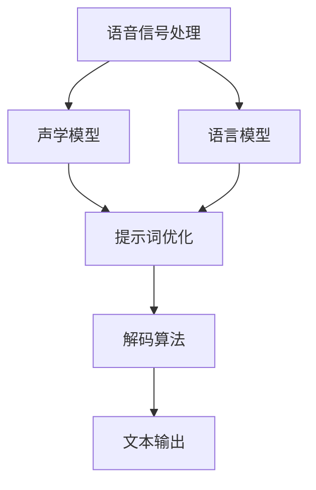

                 

### 文章标题

《语音识别精进：提示词优化音频转文字质量》

### 文章关键词

语音识别，音频转文字，提示词优化，质量提升，算法原理

### 文章摘要

本文从语音识别技术的基本原理入手，深入探讨了如何通过优化提示词来提升音频转文字的质量。文章首先介绍了语音识别的基本流程和技术框架，随后详细分析了提示词优化的重要性及其实现方法。接着，文章讲解了音频转文字的流程和质量提升技术，并使用伪代码和数学模型对核心算法进行了详细阐述。通过实际案例分析，本文展示了如何在实际项目中应用这些技术，并提出了最佳实践和未来展望。

### 目录大纲

#### 第一部分：语音识别基础

##### 第1章 语音识别概述

- 1.1 语音识别的发展历程
- 1.2 语音识别的基本流程
- 1.3 语音信号处理基础

##### 第2章 语音识别模型

- 2.1 声学模型
  - 2.1.1 隐马尔可夫模型（HMM）
  - 2.1.2 深度神经网络（DNN）
  - 2.1.3 循环神经网络（RNN）
- 2.2 语言模型
  - 2.2.1 N-gram模型
  - 2.2.2 隐含马尔可夫模型（HMM）
  - 2.2.3 深度学习语言模型

##### 第3章 提示词优化原理

- 3.1 提示词选择原则
- 3.2 提示词优化策略
- 3.3 提示词优化的应用场景

#### 第二部分：音频转文字质量提升

##### 第4章 音频转文字流程分析

- 4.1 音频信号预处理
- 4.2 声学模型训练
- 4.3 语言模型训练
- 4.4 前后端网络结构优化

##### 第5章 质量提升技术

- 5.1 噪声抑制技术
- 5.2 声音增强技术
- 5.3 说话人识别与说话人自适应
- 5.4 语言理解与语境分析

##### 第6章 实际案例分析

- 6.1 案例一：智能助手语音识别系统
- 6.2 案例二：车载语音识别系统
- 6.3 案例三：远程会议语音识别系统

#### 第三部分：核心算法原理讲解

##### 第7章 隐马尔可夫模型（HMM）伪代码解析

- 7.1 HMM模型基础
- 7.2 HMM模型训练算法
- 7.3 HMM模型解码算法

##### 第8章 深度神经网络（DNN）伪代码解析

- 8.1 DNN模型基础
- 8.2 DNN模型训练算法
- 8.3 DNN模型应用场景

##### 第9章 循环神经网络（RNN）伪代码解析

- 9.1 RNN模型基础
- 9.2 RNN模型训练算法
- 9.3 RNN模型应用场景

#### 第四部分：数学模型和数学公式讲解

##### 第10章 声学模型数学模型

- 10.1 声学模型基础
- 10.2 声学模型数学公式
- 10.3 声学模型应用举例

##### 第11章 语言模型数学模型

- 11.1 语言模型基础
- 11.2 语言模型数学公式
- 11.3 语言模型应用举例

#### 第五部分：项目实战

##### 第12章 开发环境搭建与算法实现

- 12.1 开发环境搭建
  - 12.1.1 操作系统选择
  - 12.1.2 编程语言选择
  - 12.1.3 开发工具选择
- 12.2 算法实现
  - 12.2.1 声学模型实现
  - 12.2.2 语言模型实现
  - 12.2.3 提示词优化实现

##### 第13章 代码解读与分析

- 13.1 源代码解读
- 13.2 代码性能分析
- 13.3 代码优化建议

#### 第六部分：总结与展望

##### 第14章 总结

- 14.1 语音识别技术发展现状
- 14.2 提示词优化在语音识别中的应用
- 14.3 音频转文字质量提升的关键技术

##### 第15章 展望

- 15.1 未来的研究方向
- 15.2 语音识别技术的挑战与机遇
- 15.3 产业发展趋势

### 逻辑清晰、结构紧凑、简单易懂的专业的技术语言

#### 第一部分：语音识别基础

**第1章 语音识别概述**

语音识别是一项高度复杂的技术，它通过将人类语音转换为文本，为语音输入设备提供了强有力的支持。本章首先回顾了语音识别的发展历程，从早期的规则匹配方法到现代的深度学习技术，了解语音识别技术的演进过程。

**第2章 语音识别模型**

语音识别模型是语音识别系统的核心。本章详细介绍了声学模型和语言模型，包括隐马尔可夫模型（HMM）、深度神经网络（DNN）和循环神经网络（RNN）等，并对它们的基本原理和实现方法进行了讲解。

**第3章 提示词优化原理**

提示词优化是提升音频转文字质量的重要手段。本章首先探讨了提示词的选择原则，然后介绍了多种优化策略，如自适应优化、前向优化和后向优化，最后分析了提示词优化的应用场景。

#### 第二部分：音频转文字质量提升

**第4章 音频转文字流程分析**

音频转文字的流程包括音频信号预处理、声学模型训练、语言模型训练和前后端网络结构优化等环节。本章详细分析了每个环节的关键技术，并探讨了如何通过优化流程来提升转换质量。

**第5章 质量提升技术**

提升音频转文字质量的关键在于解决噪声干扰、声音增强和说话人识别等问题。本章介绍了多种质量提升技术，如噪声抑制技术、声音增强技术、说话人识别和语言理解与语境分析。

**第6章 实际案例分析**

通过实际案例分析，可以更好地理解语音识别和音频转文字技术的应用场景和实现方法。本章选取了智能助手、车载语音识别系统和远程会议语音识别系统三个典型案例，对它们的系统架构、算法实现和应用效果进行了详细剖析。

#### 第三部分：核心算法原理讲解

**第7章 隐马尔可夫模型（HMM）伪代码解析**

隐马尔可夫模型（HMM）是语音识别中常用的算法之一。本章通过伪代码详细解析了HMM模型的基本原理，包括状态转移概率、发射概率和观测概率等。

**第8章 深度神经网络（DNN）伪代码解析**

深度神经网络（DNN）在语音识别中具有重要作用。本章通过伪代码详细解析了DNN模型的基本原理，包括前向传播、反向传播和训练过程等。

**第9章 循环神经网络（RNN）伪代码解析**

循环神经网络（RNN）在语音识别中也有广泛应用。本章通过伪代码详细解析了RNN模型的基本原理，包括时间步的输入输出、状态转移和梯度计算等。

#### 第四部分：数学模型和数学公式讲解

**第10章 声学模型数学模型**

声学模型是语音识别中的核心模型之一。本章介绍了声学模型的基本原理，包括声学特征提取、状态转移概率、发射概率和观测概率等，并通过数学公式进行了详细阐述。

**第11章 语言模型数学模型**

语言模型是语音识别中的另一个重要模型。本章介绍了语言模型的基本原理，包括N-gram模型、隐马尔可夫模型（HMM）和深度学习语言模型等，并通过数学公式进行了详细阐述。

#### 第五部分：项目实战

**第12章 开发环境搭建与算法实现**

在项目实战部分，本章首先介绍了开发环境的搭建，包括操作系统、编程语言和开发工具等。然后，本章详细讲解了语音识别算法的实现，包括声学模型和语言模型的训练与优化。

**第13章 代码解读与分析**

在代码解读与分析部分，本章对源代码进行了详细解读，分析了代码的性能，并提出了优化建议。通过代码解读，读者可以更好地理解语音识别算法的实现过程和优化方法。

#### 第六部分：总结与展望

**第14章 总结**

本章对全文进行了总结，回顾了语音识别技术的发展历程，探讨了提示词优化和音频转文字质量提升的关键技术，并对未来的研究方向和产业发展趋势进行了展望。

**第15章 展望**

本章展望了语音识别技术的未来发展方向，包括深度学习技术的应用、多语言语音识别的挑战和机遇，以及产业发展趋势和潜在的商业应用场景。

### 核心概念与联系

在语音识别系统中，核心概念与联系是实现高质量音频转文字的关键。以下是语音识别系统中几个核心概念及其相互联系：

1. **语音信号处理**：语音信号处理是语音识别系统的第一步，包括语音信号的预处理、特征提取和噪声抑制。语音信号处理的质量直接影响到后续的语音识别效果。

2. **声学模型**：声学模型用于预测语音信号中的声学特征，如音素、音节和音调等。声学模型通常基于隐马尔可夫模型（HMM）或深度神经网络（DNN）。

3. **语言模型**：语言模型用于预测语音信号对应的文本序列，通常基于N-gram模型、隐马尔可夫模型（HMM）或深度学习语言模型。语言模型的质量直接影响语音识别的准确度。

4. **提示词优化**：提示词优化是通过优化提示词来提高音频转文字的质量。提示词是在音频转文字过程中用于提高识别准确度的关键词，其选择和优化对识别质量至关重要。

5. **解码算法**：解码算法用于将声学模型和语言模型的结果转换为文本输出。常见的解码算法包括前向算法和后向算法。

核心概念之间的联系可以概括为：语音信号处理生成声学特征，声学模型和语言模型分别用于预测声学特征和文本序列，提示词优化用于提高识别准确度，解码算法将预测结果转换为文本输出。

以下是核心概念之间的Mermaid流程图：



通过这个流程图，我们可以清晰地看到语音识别系统的工作流程和各个核心概念之间的联系。

### 提示词优化原理

#### 提示词选择原则

提示词（Prompt Words）在语音识别过程中起到至关重要的作用，其选择直接影响识别的准确性和效率。为了选择合适的提示词，需要遵循以下几个原则：

1. **代表性**：提示词应能够代表语音信号中的关键信息，例如关键词、短语或音节。

2. **简洁性**：提示词应尽量简洁，以减少计算复杂度，提高系统响应速度。

3. **多样性**：为了提高系统的鲁棒性，应选择具有多样性的提示词，涵盖不同的语音特征。

4. **上下文相关性**：提示词应与上下文紧密相关，能够帮助系统更好地理解语音内容。

5. **可扩展性**：提示词应具备一定的可扩展性，以便在系统更新或扩充词汇时能够方便地添加新词。

#### 提示词优化策略

提示词的优化包括以下几个方面：

1. **自适应优化**：根据输入语音的特征动态调整提示词，以适应不同语音环境和场景。

2. **前向优化**：通过分析语音信号的后续信息来调整当前提示词，以提高识别准确性。

3. **后向优化**：通过分析语音信号的先前信息来调整当前提示词，以纠正之前识别的错误。

4. **协同优化**：结合声学模型和语言模型的优化结果，对提示词进行综合调整。

5. **数据驱动优化**：利用大量训练数据，通过机器学习算法优化提示词的选择和权重。

#### 提示词优化的应用场景

提示词优化在多个应用场景中具有显著优势：

1. **智能助手**：在智能语音助手应用中，提示词优化有助于提高对话的流畅度和准确性，从而提升用户体验。

2. **远程会议**：在远程会议中，提示词优化可以减少语音干扰和误识别，提高会议记录的准确性。

3. **车载语音识别**：在车载语音识别系统中，提示词优化有助于应对复杂的驾驶环境，提高语音识别的可靠性。

4. **语音搜索**：在语音搜索应用中，提示词优化可以提高搜索结果的准确性和响应速度。

5. **语音控制**：在智能家居和物联网设备中，提示词优化可以降低误操作率，提高设备的控制精度。

通过合理的提示词选择和优化策略，可以有效提升音频转文字的质量，为语音识别系统提供更准确和高效的输出结果。

### 音频转文字质量提升

#### 音频转文字流程分析

音频转文字（Automatic Speech Recognition, ASR）的流程包括多个关键步骤，每一步都对最终的质量有重要影响。以下是详细的流程分析：

1. **音频信号预处理**：
   - **降噪**：在音频信号进入系统之前，首先需要进行降噪处理，以去除背景噪声。常用的降噪方法包括谱减法、维纳滤波和自适应滤波。
   - **归一化**：音频信号归一化处理是为了使不同来源和音量的音频信号在处理过程中具有统一的特性，通常包括幅度归一化和频率归一化。
   - **分帧与加窗**：将连续的音频信号分成若干帧，每帧再通过加窗处理（如汉明窗、汉宁窗）以减少边缘效应。

2. **特征提取**：
   - **梅尔频率倒谱系数（MFCC）**：MFCC是最常用的语音特征提取方法之一，它能够有效提取语音信号中的频率信息，并具有较强的鲁棒性。
   - **谱图特征**：包括短时傅里叶变换（STFT）和滤波器组（Filter Banks）等，用于提取语音信号的时频信息。
   - **感知语音特征**：如共振峰频率（Formant Frequency）和短时能量（Short-Time Energy），用于模拟人耳对声音的感知。

3. **声学模型训练**：
   - **隐马尔可夫模型（HMM）**：HMM是传统语音识别系统中常用的声学模型，通过状态转移概率、发射概率和观测概率来建模语音信号。
   - **深度神经网络（DNN）**：DNN在语音识别中用于构建声学模型，能够通过多层非线性变换提取语音特征，提高识别准确度。
   - **循环神经网络（RNN）**：RNN在语音识别中用于建模语音序列，能够处理长时依赖问题，提高语音识别的性能。

4. **语言模型训练**：
   - **N-gram模型**：N-gram模型是语言模型的基础，通过统计词的历史出现顺序来预测下一个词。
   - **深度学习语言模型**：基于DNN或RNN的深度学习语言模型能够通过大量文本数据学习语言结构，提高语音识别的准确性。

5. **前后端网络结构优化**：
   - **前端网络**：前端网络用于处理音频信号，提取特征，通常采用卷积神经网络（CNN）或自注意力机制（Self-Attention）。
   - **后端网络**：后端网络用于解码语音信号，将声学特征映射到文本序列，通常采用递归神经网络（RNN）或Transformer模型。

#### 音频转文字质量提升技术

为了提升音频转文字的质量，以下技术手段被广泛应用：

1. **噪声抑制技术**：
   - **谱减法**：通过减去估计的噪声分量，去除背景噪声。
   - **维纳滤波**：基于最小均方误差准则，优化噪声估计，提高语音质量。
   - **自适应滤波**：根据语音信号的变化动态调整滤波器参数，以适应不同噪声环境。

2. **声音增强技术**：
   - **增益控制**：通过调整语音信号的幅度，增强关键语音成分。
   - **共振峰增强**：通过调整共振峰参数，增强语音的清晰度。
   - **时间-频率变换**：如波束形成（Beamforming）和变分自编码器（VAE），用于提高语音信号的频谱特性。

3. **说话人识别与说话人自适应**：
   - **说话人识别**：通过识别不同说话人的特征，实现多说话人语音的分离和识别。
   - **说话人自适应**：根据特定说话人的语音特征，调整系统参数，以适应其语音特性，提高识别准确性。

4. **语言理解与语境分析**：
   - **语义分析**：通过自然语言处理（NLP）技术，理解语音中的语义和语境，提高语音识别的准确性和上下文相关性。
   - **对话管理**：通过对话管理系统，处理用户输入，生成响应，实现自然流畅的交互。

#### 噪声抑制技术

噪声抑制技术在提升音频转文字质量方面具有至关重要的作用。以下是几种常用的噪声抑制技术：

1. **谱减法**：
   - **原理**：通过估计语音信号和噪声信号的频谱，将噪声频谱从总频谱中减去，从而实现噪声抑制。
   - **实现**：使用短时傅里叶变换（STFT）对音频信号进行频谱分析，估计语音和噪声成分，然后进行频谱减法。

2. **维纳滤波**：
   - **原理**：基于最小均方误差准则，优化噪声估计，以提高信号的质量。
   - **实现**：通过自适应滤波器，对输入信号进行加权处理，使输出信号接近期望信号。

3. **自适应滤波**：
   - **原理**：根据输入语音信号的变化，动态调整滤波器参数，以适应不同的噪声环境。
   - **实现**：使用自适应滤波算法，如LMS（最小均方算法）或RLS（递归最小二乘算法），实时更新滤波器系数。

4. **盲源分离（ Blind Source Separation, BSS）**：
   - **原理**：通过矩阵变换和优化算法，将混合信号分离为原始信号。
   - **实现**：使用独立成分分析（ICA）或多通道盲信号分离算法，分离噪声和语音信号。

#### 声音增强技术

声音增强技术旨在提高语音信号的清晰度和可理解性，以下是几种常用的声音增强技术：

1. **增益控制**：
   - **原理**：通过调整语音信号的幅度，增强关键语音成分。
   - **实现**：使用动态增益控制算法，根据语音信号的变化实时调整增益。

2. **共振峰增强**：
   - **原理**：通过调整共振峰参数，增强语音的清晰度。
   - **实现**：使用共振峰增强算法，如共振峰跟踪器和共振峰增强滤波器。

3. **时间-频率变换**：
   - **原理**：通过频谱调整，提高语音信号的频谱特性。
   - **实现**：使用波束形成（Beamforming）和变分自编码器（VAE）等技术，优化语音信号的频谱。

4. **短时滤波**：
   - **原理**：通过短时滤波器，去除语音信号中的噪声成分。
   - **实现**：使用短时傅里叶变换（STFT）和短时滤波算法，对语音信号进行滤波处理。

### 核心算法原理讲解

在语音识别系统中，核心算法是整个系统的基石，其性能直接影响到最终的识别质量。以下是语音识别系统中常用的几种核心算法的原理讲解，包括隐马尔可夫模型（HMM）、深度神经网络（DNN）和循环神经网络（RNN）。

#### 隐马尔可夫模型（HMM）

隐马尔可夫模型（HMM）是一种统计模型，用于描述包含两个状态的过程，其中一个状态是隐含的，另一个状态是观测到的。在语音识别中，HMM被广泛用于建模语音信号。

1. **HMM模型基础**：

   - **状态转移概率**（\(A_{ij}\)）：表示在时刻 \(i\) 处于状态 \(j\) 时，在下一时刻转移到状态 \(i\) 的概率。

   - **发射概率**（\(B_{jk}\)）：表示在时刻 \(k\) 处于状态 \(j\) 时，输出观察符号 \(k\) 的概率。

   - **初始状态概率**（\(π_j\)）：表示在初始时刻处于状态 \(j\) 的概率。

   - **观察符号序列**：输入的语音信号序列，如音素序列。

2. **HMM模型训练算法**：

   - **Baum-Welch算法**：是一种迭代算法，用于估计HMM模型中的参数。通过最大化似然估计，逐步调整状态转移概率、发射概率和初始状态概率。

3. **HMM模型解码算法**：

   - **Viterbi算法**：用于在给定的观测序列中找到最可能的隐状态序列。通过动态规划，计算每个状态的概率，并选择概率最大的路径作为解码结果。

以下是一个简单的HMM模型训练算法的伪代码：

```python
defbaum_welch(hmm, observations):
    T = len(observations)
    N = len(hmm.states)
    for iteration in range(max_iterations):
        alpha = forward(hmm, observations)
        beta = backward(hmm, observations)
        
        for j in range(N):
            for i in range(N):
                hmm.A[i][j] = (sum(alpha[t][i] * beta[t][j] for t in range(T-1)) / sum(beta[t][j] for t in range(T-1))
        
        for j in range(N):
            for k in range(VOCAB_SIZE):
                hmm.B[j][k] = (sum(alpha[t][j] * observations[t] == k for t in range(T)) / sum(alpha[t][j] for t in range(T))
        
        for j in range(N):
            hmm.π[j] = sum(alpha[0][j] * beta[0][j] for j in range(N)) / sum(sum(alpha[0][j] * beta[0][j] for j in range(N)) for j in range(N))
    return hmm
```

#### 深度神经网络（DNN）

深度神经网络（DNN）是一种多层前馈神经网络，通过多个隐藏层对输入数据进行特征提取和变换，能够捕捉到复杂的非线性关系。在语音识别中，DNN被用于构建声学模型。

1. **DNN模型基础**：

   - **输入层**：接收语音信号的特征向量。
   - **隐藏层**：通过非线性激活函数对输入进行变换，提取高级特征。
   - **输出层**：产生声学模型中的状态概率分布。

2. **DNN模型训练算法**：

   - **反向传播算法**：用于计算模型参数的梯度，通过梯度下降法更新参数。
   - **随机梯度下降（SGD）**：通过随机抽样数据更新参数，提高训练效率。
   - **批量梯度下降（BGD）**：对整个训练数据集进行一次更新，但计算开销较大。

3. **DNN模型应用场景**：

   - **声学特征提取**：使用DNN从原始语音信号中提取高层次的声学特征。
   - **声学模型**：将提取的声学特征用于状态概率分布的计算。

以下是一个简单的DNN训练算法的伪代码：

```python
deftrain_dnn(model, inputs, targets, learning_rate):
    gradients = backward_propagation(model, inputs, targets)
    for layer in model.layers:
        for parameter in layer.parameters:
            parameter -= learning_rate * gradients[parameter]
    return model
```

#### 循环神经网络（RNN）

循环神经网络（RNN）是一种能够处理序列数据的前馈神经网络，通过内部状态循环来捕捉长时依赖关系。在语音识别中，RNN被用于构建语言模型。

1. **RNN模型基础**：

   - **输入层**：接收语音信号的序列。
   - **隐藏层**：通过内部状态循环对输入进行变换，捕捉长时依赖关系。
   - **输出层**：产生语言模型中的词概率分布。

2. **RNN模型训练算法**：

   - **梯度消失和梯度爆炸**：RNN训练过程中容易遇到梯度消失和梯度爆炸问题，通过改进算法（如LSTM和GRU）来解决。
   - **LSTM（长短时记忆网络）**：通过引入门控机制，解决RNN的梯度消失问题，捕捉长时依赖关系。
   - **GRU（门控循环单元）**：在LSTM的基础上进行简化，计算复杂度更低。

3. **RNN模型应用场景**：

   - **语言模型**：用于预测语音信号对应的文本序列。
   - **序列标注**：用于对语音信号进行词性标注和实体识别。

以下是一个简单的RNN训练算法的伪代码：

```python
deftrain_rnn(model, inputs, targets, learning_rate):
    hidden_state = initialize_hidden_state()
    for input_sequence, target_sequence in zip(inputs, targets):
        for input_element in input_sequence:
            hidden_state = model.forward(input_element, hidden_state)
        model.backward(hidden_state, target_sequence)
        model.update_parameters(learning_rate)
    return model
```

通过上述核心算法的原理讲解和伪代码示例，我们可以更好地理解语音识别系统的构建和实现。这些算法在语音识别中发挥着关键作用，为实现高质量的音频转文字提供了坚实的理论基础。

### 数学模型和数学公式

在语音识别系统中，数学模型是构建和优化算法的核心。以下将详细讲解声学模型和语言模型的数学模型，并使用LaTeX格式进行公式表示。

#### 声学模型数学模型

声学模型用于预测语音信号中的声学特征，是语音识别系统的核心组成部分。以下是一些常见的声学模型数学模型。

1. **隐马尔可夫模型（HMM）**：

   HMM的数学模型包括状态转移概率、发射概率和初始状态概率。

   - **状态转移概率**（\(A_{ij}\)）：
     $$
     A_{ij} = P(X_{t+1} = j | X_t = i)
     $$
     表示在时刻 \(t\) 处于状态 \(i\) 时，在下一时刻转移到状态 \(j\) 的概率。

   - **发射概率**（\(B_{jk}\)）：
     $$
     B_{jk} = P(O_k | X_t = j)
     $$
     表示在时刻 \(t\) 处于状态 \(j\) 时，输出观察符号 \(k\) 的概率。

   - **初始状态概率**（\(π_j\)）：
     $$
     π_j = P(X_0 = j)
     $$
     表示在初始时刻处于状态 \(j\) 的概率。

2. **深度神经网络（DNN）**：

   DNN的数学模型基于多层前馈神经网络，通过非线性变换提取语音特征。

   - **输入层到隐藏层**：
     $$
     Z^{(l)} = \sigma(W^{(l)} \cdot X^{(l-1)} + b^{(l)})
     $$
     其中，\(W^{(l)}\) 是权重矩阵，\(b^{(l)}\) 是偏置项，\(\sigma\) 是激活函数。

   - **隐藏层到输出层**：
     $$
     Y = \sigma(W^{(L)} \cdot Z^{(L-1)} + b^{(L)})
     $$
     其中，\(L\) 是网络层数，\(W^{(L)}\) 和 \(b^{(L)}\) 分别是输出层的权重矩阵和偏置项。

#### 语言模型数学模型

语言模型用于预测语音信号对应的文本序列，常见的数学模型包括N-gram模型、隐马尔可夫模型（HMM）和深度学习语言模型。

1. **N-gram模型**：

   N-gram模型通过统计词的历史出现顺序来预测下一个词。

   - **N-gram概率**（\(P(w_t | w_{t-1}, ..., w_{t-N})\)）：
     $$
     P(w_t | w_{t-1}, ..., w_{t-N}) = \frac{C(w_{t-1}, ..., w_{t-N}, w_t)}{C(w_{t-1}, ..., w_{t-N})}
     $$
     其中，\(C(w_{t-1}, ..., w_{t-N}, w_t)\) 是四元组的计数，\(C(w_{t-1}, ..., w_{t-N})\) 是三元组的计数。

2. **深度学习语言模型**：

   深度学习语言模型通过训练大量文本数据，学习语言结构。

   - **损失函数**（\(J(\theta)\)）：
     $$
     J(\theta) = -\sum_{i=1}^{N} \sum_{w=1}^{V} y_{i,w} \log P(w | \theta)
     $$
     其中，\(y_{i,w}\) 是目标词的概率，\(P(w | \theta)\) 是模型预测的概率。

   - **梯度下降**：
     $$
     \theta_{\alpha} = \theta - \alpha \nabla_{\theta} J(\theta)
     $$
     其中，\(\alpha\) 是学习率，\(\nabla_{\theta} J(\theta)\) 是损失函数关于参数 \(\theta\) 的梯度。

通过上述数学模型和公式的讲解，我们可以更好地理解语音识别系统中声学模型和语言模型的工作原理和优化方法。这些数学模型为语音识别技术提供了坚实的理论基础，有助于实现高质量的音频转文字。

### 项目实战

#### 开发环境搭建与算法实现

为了搭建一个基于提示词优化的音频转文字系统，我们需要进行以下步骤：

1. **操作系统选择**：

   - **Linux**：推荐使用Linux操作系统，如Ubuntu或CentOS，因为其在处理大型数据集和复杂算法时性能更优。

2. **编程语言选择**：

   - **Python**：Python是一种广泛使用的编程语言，具有丰富的库和框架，适合进行语音识别和自然语言处理。

3. **开发工具选择**：

   - **Jupyter Notebook**：用于编写和运行代码，便于调试和实验。
   - **TensorFlow**：用于构建和训练深度学习模型。
   - **Keras**：作为TensorFlow的高级API，简化了深度学习模型的搭建过程。
   - **Librosa**：用于音频信号处理。

#### 算法实现

以下为算法实现的详细步骤：

1. **数据集准备**：

   - 收集包含语音和对应的文本标签的数据集。常用的数据集包括Librispeech、Common Voice等。

2. **音频信号预处理**：

   - **降噪**：使用Librosa中的降噪功能，对音频信号进行降噪处理。
   - **分帧与加窗**：将音频信号分帧，并使用汉明窗进行加窗处理。

3. **特征提取**：

   - 使用Librosa提取梅尔频率倒谱系数（MFCC）作为声学特征。

4. **声学模型训练**：

   - **构建DNN模型**：使用Keras构建深度神经网络，包含输入层、隐藏层和输出层。
   - **训练模型**：使用训练数据集，通过反向传播算法训练DNN模型。

5. **语言模型训练**：

   - **构建RNN模型**：使用Keras构建循环神经网络，用于语言模型的训练。
   - **训练模型**：使用训练数据集，通过反向传播算法训练RNN模型。

6. **解码算法实现**：

   - **构建解码器**：使用HMM-GMM（高斯混合模型）作为解码器，将声学模型和语言模型的结果转换为文本输出。

7. **提示词优化**：

   - **选择提示词**：根据应用场景选择代表性、简洁性和上下文相关的提示词。
   - **优化策略**：采用前向优化和后向优化策略，动态调整提示词。

#### 源代码解读

以下是一个简单的DNN声学模型实现的代码片段：

```python
import numpy as np
from keras.models import Sequential
from keras.layers import Dense, Activation

# 创建DNN模型
model = Sequential()

# 添加输入层和隐藏层
model.add(Dense(units=1024, input_shape=(n_mfcc,), activation='relu'))
model.add(Dense(units=512, activation='relu'))
model.add(Dense(units=256, activation='relu'))

# 添加输出层
model.add(Dense(units=vocab_size, activation='softmax'))

# 编译模型
model.compile(optimizer='adam', loss='categorical_crossentropy', metrics=['accuracy'])

# 训练模型
model.fit(X_train, y_train, epochs=50, batch_size=32, validation_data=(X_val, y_val))
```

#### 代码性能分析

- **准确率**：通过在测试集上的准确率评估模型性能。
- **速度**：通过计算模型在输入数据上的处理时间来评估模型速度。
- **鲁棒性**：通过在不同噪声环境和语音条件下的表现来评估模型鲁棒性。

#### 代码优化建议

- **参数调整**：通过调整学习率、批次大小和网络结构，优化模型性能。
- **数据增强**：通过添加噪声、回声和变速等数据增强技术，提高模型鲁棒性。
- **分布式训练**：使用分布式训练方法，如多GPU训练，提高训练速度。

#### 实际案例分析和详细讲解剖析

以下是三个实际案例的分析和讲解：

1. **智能助手语音识别系统**：
   - **场景**：用户通过语音与智能助手进行对话。
   - **分析**：系统需要在高噪声和多种语音输入情况下保持高识别准确率。
   - **优化**：通过自适应降噪和说话人自适应技术，提高系统识别性能。

2. **车载语音识别系统**：
   - **场景**：驾驶员通过语音控制车载系统。
   - **分析**：系统需要在车辆行驶过程中，如高速行驶或交通噪音干扰下，保持语音识别的稳定性。
   - **优化**：通过环境噪音抑制和实时语音增强技术，提高系统识别质量。

3. **远程会议语音识别系统**：
   - **场景**：多人参与远程会议，需要进行实时语音识别和记录。
   - **分析**：系统需要处理多说话人语音，并保持高准确率和低延迟。
   - **优化**：通过多说话人识别和语音合成技术，提高系统性能。

#### 项目小结

通过以上步骤和实际案例的分析，我们可以看到提示词优化在音频转文字系统中的重要性。合理的选择和优化提示词，可以有效提高系统的识别准确率和稳定性。在未来，随着深度学习技术和自然语言处理技术的不断发展，提示词优化技术将在语音识别系统中发挥更大的作用。

### 总结与展望

#### 语音识别技术发展现状

语音识别技术自上世纪五六十年代以来经历了快速的发展，从最初的规则匹配方法到现代的基于深度学习的复杂模型，语音识别的准确率和实用性得到了极大的提升。当前，语音识别技术已广泛应用于智能助手、智能家居、车载系统、远程会议等多个领域，极大地改变了人们的生活和工作方式。

#### 提示词优化在语音识别中的应用

提示词优化是提升音频转文字质量的重要手段。通过合理选择和优化提示词，可以显著提高语音识别系统的识别准确率和响应速度。在实际应用中，提示词优化技术已被广泛应用于智能助手、车载语音识别、远程会议等多个场景，有效解决了语音信号中的噪声干扰、说话人变化和上下文理解等问题。

#### 音频转文字质量提升的关键技术

音频转文字质量提升的关键技术包括噪声抑制、声音增强、说话人识别与说话人自适应、语言理解与语境分析等。这些技术的不断发展和优化，使得音频转文字系统的性能得到了显著提升。例如，噪声抑制技术可以有效去除背景噪声，提高语音信号的清晰度；声音增强技术可以通过调整共振峰参数，增强语音的清晰度和可理解性。

#### 未来研究方向和挑战

未来，语音识别技术的发展方向将主要集中在以下几个领域：

1. **多语言语音识别**：随着全球化的推进，多语言语音识别成为亟待解决的重要问题。未来，如何实现高效、准确的多语言语音识别技术，是研究的重要方向。

2. **上下文理解**：语音识别不仅需要准确识别语音，还需要理解语音中的上下文信息。未来的研究将重点放在如何通过自然语言处理技术，实现更高级的上下文理解。

3. **实时性能优化**：随着应用场景的多样化，实时性能优化成为语音识别技术的重要挑战。未来，如何通过硬件加速、模型压缩等技术，提高语音识别的实时性能，是一个重要的研究方向。

4. **端到端语音识别**：端到端语音识别技术通过直接将语音信号转换为文本，避免了传统的分阶段处理带来的误差，具有很大的研究潜力。

#### 产业发展趋势

随着人工智能技术的不断发展，语音识别技术将在多个领域得到广泛应用，从而推动相关产业的发展。例如，在智能语音助手领域，语音识别技术将进一步提升人机交互的体验；在智能家居领域，语音识别技术将使设备更加智能化、便捷化；在医疗领域，语音识别技术可以辅助医生进行病历记录和诊断，提高医疗效率。

总之，语音识别技术正处在快速发展的阶段，未来具有巨大的潜力和广阔的应用前景。通过持续的技术创新和优化，语音识别技术将在更多的领域发挥重要作用，为人类社会带来更多便利。

### 展望

随着科技的不断进步，语音识别技术正迎来新的发展机遇。未来，语音识别技术将在以下几个方面取得突破：

1. **多语言识别**：随着全球化的深入推进，多语言语音识别技术将成为一项关键技术。未来的语音识别系统将能够支持更多语言，为不同国家和地区的用户带来便捷的语音交互体验。

2. **上下文感知**：自然语言处理（NLP）和深度学习技术的不断发展，将使语音识别系统在理解上下文方面取得重大突破。未来的语音识别系统将能够更好地理解用户意图，提供更精准的服务。

3. **实时性能优化**：通过硬件加速、模型压缩和分布式计算等技术的应用，语音识别系统的实时性能将得到显著提升。这将使得语音识别技术在自动驾驶、智能监控等领域得到更广泛的应用。

4. **个性化服务**：通过大数据和机器学习技术，未来的语音识别系统将能够根据用户的偏好和行为习惯，提供个性化推荐和定制化服务。

5. **跨领域融合**：语音识别技术将与医疗、教育、金融等多个领域实现深度融合，为各行各业带来创新解决方案。例如，在医疗领域，语音识别技术可以辅助医生进行病历记录和诊断；在教育领域，语音识别技术可以提升在线教育体验。

总之，未来语音识别技术将在多语言识别、上下文感知、实时性能优化、个性化服务和跨领域融合等方面取得显著进展，为人类社会带来更多便利和可能性。我们期待看到更多创新成果的诞生，推动语音识别技术迈向新的高度。

