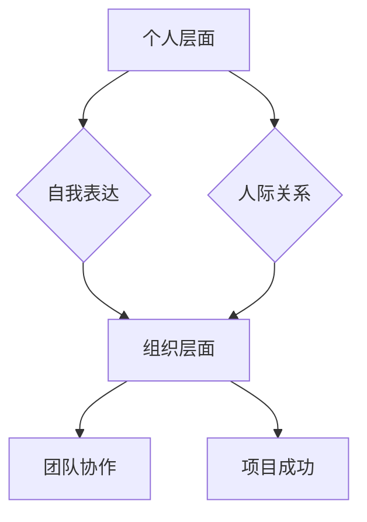
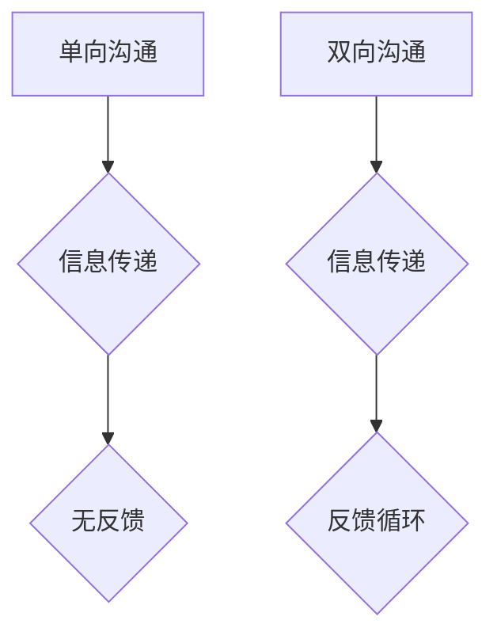
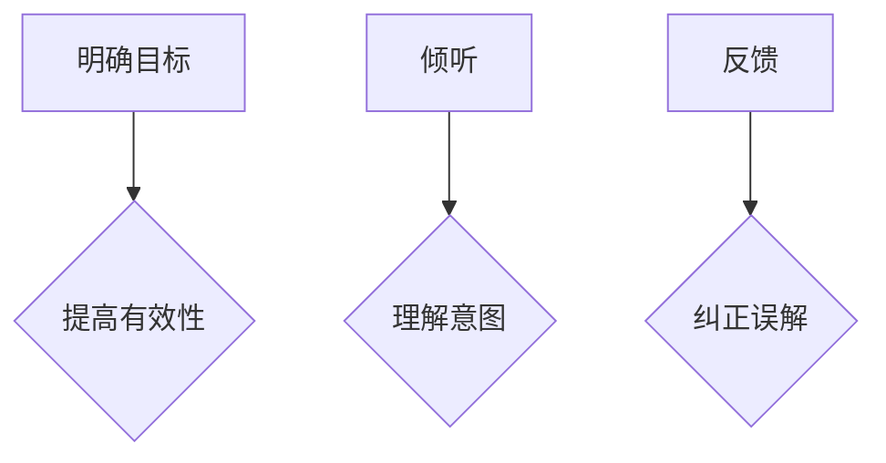
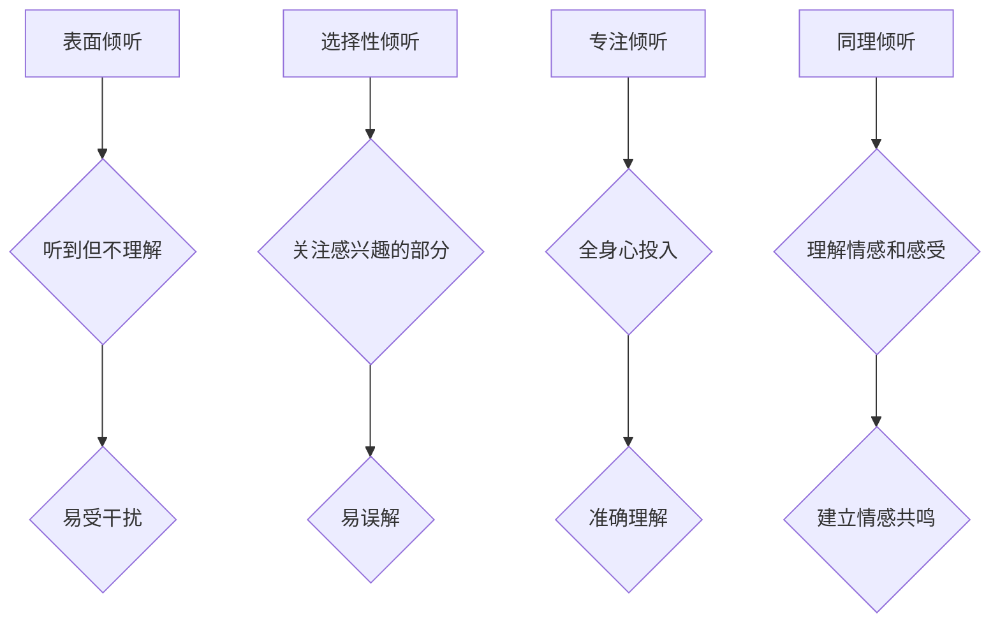

                 

### 沟通技巧基础

> "沟通是人与人之间、人与群体之间思想与感情的传递和反馈的过程，以求思想达成一致和感情的通畅。" —— 鲍茂良

沟通不仅是一门艺术，更是一门技术。在IT领域，沟通的重要性不言而喻。它不仅影响到项目的进度和质量，还直接关系到团队的协作和个人的职业发展。本章将围绕沟通的基本要素展开，深入探讨沟通的定义、目标、类型、障碍及解决策略。

#### 1.1 沟通的定义与重要性

沟通是一个复杂的过程，涉及信息的传递、接收、理解与反馈。以下是沟通的基本定义及其重要性：

**沟通的定义：**
沟通是人与人之间、人与群体之间思想与感情的传递和反馈的过程，以求思想达成一致和感情的通畅。

**沟通的重要性：**

1. **个人层面：**
   - **自我表达**：沟通可以帮助个人更好地表达自己的想法和需求。
   - **人际关系**：有效沟通能提高人际关系质量，减少误解和冲突。

2. **组织层面：**
   - **团队协作**：沟通是团队协作的基础，有助于提高工作效率。
   - **项目成功**：良好的沟通能确保项目目标的明确和任务的顺利完成。

**Mermaid 流程图：**



#### 1.2 沟通的目标与类型

沟通的目标和类型决定了沟通的有效性。以下是沟通的主要目标和类型：

**沟通的目标：**

1. **传达信息**：确保信息准确无误地传递。
2. **形成共识**：通过沟通达成共同的理解和目标。
3. **达成目标**：利用沟通推动任务的完成和项目的成功。

**沟通的类型：**

1. **单向沟通**：信息从发送者到接收者，没有反馈。
   - **特点**：速度快，但信息准确性难以保证。
   - **应用场景**：新闻发布会、演讲等。

2. **双向沟通**：信息在发送者和接收者之间来回流动。
   - **特点**：信息准确性高，但速度较慢。
   - **应用场景**：团队会议、项目讨论等。

**Mermaid 流程图：**



#### 1.3 有效沟通的障碍与解决策略

尽管沟通对于个人和组织都是至关重要的，但在实际操作中常常会遇到各种障碍。以下是常见的沟通障碍及其解决策略：

**常见障碍：**

1. **语言障碍**：词汇差异、语法错误。
2. **文化障碍**：语言习惯、价值观差异。
3. **心理障碍**：情绪影响、自信心不足。

**解决策略：**

1. **明确目标**：确保沟通目标清晰，有助于提高沟通的有效性。
2. **倾听**：倾听对方观点，避免打断，有助于理解对方的真实意图。
3. **反馈**：及时给予反馈，确保理解正确，有助于纠正误解和错误。

**Mermaid 流程图：**



**训练方法：**

1. **角色扮演**：模拟真实场景，提高实际操作能力。
2. **录音分析**：回顾沟通录音，自我评估和改进。

**工具推荐：**

1. **沟通训练软件**：例如Language Lab。
2. **沟通技巧书籍**：例如《有效沟通的艺术》。

### 1.4 沟通技巧的提升

提升沟通技巧不仅需要理论知识的积累，更需要实践中的不断锻炼。以下是几种提升沟通技巧的方法：

**方法一：角色扮演**
- **步骤**：选择一个沟通场景，由参与者分别扮演发送者和接收者，进行模拟练习。
- **效果**：有助于提高沟通的实战能力，增强自信心。

**方法二：录音分析**
- **步骤**：将沟通过程录音，然后回顾和分析录音，找出不足之处。
- **效果**：有助于自我反思和改进，提高沟通技巧。

**工具推荐：**
- **沟通训练软件**：例如Language Lab。
- **沟通技巧书籍**：例如《有效沟通的艺术》。

通过以上对沟通的基本要素的深入探讨，我们可以看出，沟通不仅是信息的传递，更是一种技术的体现。在IT领域，掌握有效的沟通技巧，不仅有助于个人的职业发展，更能推动团队和组织的发展。接下来，我们将进一步探讨语言艺术在技术交流中的应用。

#### 2.1 语言的选择与应用

在技术交流中，语言的选择和应用至关重要。选择合适的语言不仅可以提高沟通的效率，还能确保信息的准确传达。以下是关于语言选择和应用的一些关键原则和技巧。

**2.1.1 语言选择原则**

1. **根据听众选择合适的语言风格**：
   - **专业术语**：在与同行或专业人士交流时，可以适当使用专业术语，以显示专业性。
   - **通俗易懂**：在与非专业人士或新手交流时，应尽量使用简单易懂的语言，避免使用过于复杂的术语。

2. **考虑语言的专业性和易懂性**：
   - **专业性**：确保所使用的语言具有专业性，能够准确传达技术概念。
   - **易懂性**：同时，也要考虑听众的背景和知识水平，确保语言易于理解。

**2.1.2 语言应用技巧**

1. **使用生动形象的词汇**：
   - 生动形象的词汇可以增强表达的力度，使听众更容易理解和记住信息。
   - 例如，在描述算法运行过程时，可以使用“快如闪电”、“流畅如丝”等词汇。

2. **避免使用复杂难懂的术语**：
   - 复杂难懂的术语容易导致听众产生困惑，影响沟通效果。
   - 如果必须使用术语，应确保先给出清晰的定义或解释。

**案例**：

假设我们正在向一个由程序员和项目经理组成的团队介绍一个新算法。

- **向程序员介绍：**
  - "这个算法的核心思想是通过动态规划来优化问题求解，具体实现中使用了贪心策略来确保每一步都是最优的。"

- **向项目经理介绍：**
  - "这个算法是一种高效的优化方法，它可以在短时间内找到问题的最优解，对于项目来说，这意味着更快的迭代和更低的开发成本。"

通过以上两个案例，我们可以看到，根据听众的不同，我们在语言选择和应用上做出了相应的调整，以适应不同的沟通需求。

#### 2.2 非语言沟通的作用

在技术交流中，非语言沟通同样扮演着重要的角色。非语言沟通包括身体语言、视觉辅助等，它们能够增强信息的传达效果，弥补语言沟通的不足。以下是关于非语言沟通的作用和要素的探讨。

**2.2.1 非语言沟通的重要性**

1. **增强信息传达效果**：
   - 非语言沟通能够通过肢体动作、面部表情等方式，传达出语言无法完全表达的细微情感和信息。
   - 例如，一个坚定的眼神可以表达出自信和决心，而一个微笑可以传递出友好和信任。

2. **弥补语言沟通的不足**：
   - 在复杂的技术交流中，语言有时可能显得冗长和复杂，非语言沟通可以简化信息，使听众更容易理解和接受。
   - 例如，通过图示和图表，可以直观地展示技术细节和过程，使听众更容易理解。

**2.2.2 非语言沟通的要素**

1. **身体语言**：
   - **姿态**：站立姿态、坐姿等可以传递出自信、轻松或紧张等不同的情感。
   - **手势**：恰当的手势可以增强语言表达的力度和效果。
   - **面部表情**：微笑、皱眉等面部表情可以传达出积极的或消极的情感。

2. **视觉辅助**：
   - **图表**：图表可以直观地展示数据和技术细节。
   - **图片**：适当的图片可以增强演示的吸引力和易懂性。
   - **幻灯片**：幻灯片可以用来组织和展示复杂的信息，使听众更容易跟随。

**案例**：

假设我们在进行一个关于大数据处理的演讲。

- **身体语言**：
  - 站立时保持直立的姿态，展示自信和专业的形象。
  - 使用手势来强调关键点，如用手指指向图表，强调数据的趋势。

- **视觉辅助**：
  - 使用图表来展示数据处理流程，使听众更容易理解。
  - 使用图片来展示实际应用场景，如数据中心的工作场景。
  - 使用幻灯片来组织信息，确保演讲内容的逻辑性和连贯性。

通过以上案例，我们可以看到，非语言沟通在技术交流中发挥着不可或缺的作用。它们不仅能够增强信息的传达效果，还能使演讲或演示更具吸引力。在下一节中，我们将进一步探讨语言节奏与语调的运用。

#### 2.3 语言节奏与语调的运用

在技术交流中，语言节奏与语调的运用同样至关重要。正确的语言节奏和语调可以增强信息的传达效果，使听众更容易理解和接受。以下是关于语言节奏与语调的运用技巧和注意事项。

**2.3.1 语言节奏的调节**

1. **重要信息重读**：
   - 在传达关键信息时，可以通过重读来强调其重要性，使听众更加关注。
   - 例如，在介绍一个算法的核心思想时，可以适当地提高语调，以突出其关键性。

2. **适中的语速**：
   - 过快的语速容易导致听众跟不上，过慢的语速则可能让人感到无聊。
   - 一般来说，保持适中的语速，大约每分钟120-150个字，是比较合适的。

**2.3.2 语调的变化**

1. **抑扬顿挫**：
   - 通过语调的起伏，可以增强语言的韵律感，使演讲更具吸引力。
   - 例如，在描述一个复杂的技术问题时，可以通过降低语调和增加停顿，使听众有更多的时间消化和理解。

2. **情感表达**：
   - 语调可以传达出情感和态度，有助于建立与听众的情感联系。
   - 例如，在介绍一个成功的项目时，可以适当提高语调，表达出兴奋和自豪的情感。

**2.3.3 注意事项**

1. **避免口头禅**：
   - 过多的口头禅（如“嗯”、“啊”等）会影响演讲的流畅性和专业性。
   - 可以通过练习和录音来减少口头禅的使用。

2. **控制音量**：
   - 在不同的场合，需要根据环境的大小和听众的数量来调整音量。
   - 通常，保持声音清晰且不被背景噪音干扰是重要的。

**案例**：

假设我们在进行一个关于云计算的演讲。

- **重要信息重读**：
  - 在介绍云计算的核心技术时，可以通过重读“云计算”、“弹性计算”等关键词，强调其重要性。

- **适中的语速**：
  - 保持每分钟120-150个字的语速，确保听众能够跟上演讲的节奏。

- **语调的变化**：
  - 在描述云计算的优势时，可以通过提高语调，表达出兴奋和期待的情感。

- **避免口头禅**：
  - 在演讲前通过练习减少口头禅的使用，确保演讲的流畅性和专业性。

- **控制音量**：
  - 根据演讲厅的大小和听众的数量，调整音量，确保每个人都能听到。

通过以上案例，我们可以看到，正确的语言节奏和语调的运用对于技术交流的重要性。在下一节中，我们将探讨倾听技巧，这是有效沟通不可或缺的一部分。

### 3.1 倾听的层次

倾听不仅是接收信息的过程，更是一种沟通技巧，它决定了信息传递的准确性和效率。有效的倾听可以帮助我们更好地理解对方的意图，减少误解和冲突。以下是关于倾听的层次及其重要性的探讨。

**3.1.1 倾听的层次**

1. **表面倾听**：
   - 这种层次的倾听仅仅是听到对方说的话，但没有真正理解其含义。
   - **特点**：容易被外部干扰所影响，容易分心。
   - **应用场景**：日常闲聊、无需深入理解的信息交流。

2. **选择性倾听**：
   - 选择性倾听意味着我们只关注自己感兴趣的部分，对其他内容不感兴趣或忽视。
   - **特点**：虽然能够理解部分信息，但容易产生误解。
   - **应用场景**：在工作讨论中，针对特定问题进行的信息交流。

3. **专注倾听**：
   - 专注倾听要求我们全身心地投入到对话中，关注每一个细节。
   - **特点**：能够准确理解对方的意思，并记住关键信息。
   - **应用场景**：在重要会议、项目讨论或涉及敏感信息的沟通中。

4. **同理倾听**：
   - 同理倾听不仅理解对方所说的内容，还试图理解对方的情感和感受。
   - **特点**：能够建立情感共鸣，增强人际关系的质量。
   - **应用场景**：解决冲突、开展深度对话或进行心理咨询。

**Mermaid 流程图：**



**3.1.2 倾听的重要性**

1. **理解对方意图**：
   - 通过专注倾听，我们可以更好地理解对方的意图和需求，避免误解和误判。

2. **提高沟通效率**：
   - 减少不必要的重复和解释，提高沟通的速度和效率。

3. **增强人际关系**：
   - 同理倾听能够建立情感共鸣，增强人际关系的质量，有助于形成良好的团队氛围。

4. **解决问题**：
   - 在解决冲突或处理复杂问题时，倾听是关键，它可以帮助我们找到问题的核心和解决方案。

**案例**：

假设我们正在与团队成员讨论一个项目的进度。

- **表面倾听**：仅仅是听到对方说的话，但没有真正理解其具体内容和意义。
- **选择性倾听**：只关注与项目进度相关的信息，忽视了其他细节。
- **专注倾听**：全身心地投入到对话中，关注每一个细节，确保准确理解对方的意思。
- **同理倾听**：试图理解对方的情感和感受，比如对方是否因为进度问题感到焦虑或担忧。

通过以上案例，我们可以看到，倾听的层次决定了我们理解信息的深度和广度。有效的倾听不仅能够提高沟通效率，还能增强人际关系，有助于解决各种问题。在下一节中，我们将探讨提问的艺术，这是倾听过程中不可或缺的一环。

### 3.2 提问的艺术

提问是沟通中的一种重要技巧，它不仅能够帮助我们获取更多信息，还能够引导对话的方向，促进理解和共识的形成。有效的提问可以揭示关键信息，解决问题，推动项目进展。以下是关于提问的艺术及其技巧的探讨。

**3.2.1 提问的类型**

1. **开放性提问**：
   - 开放性提问鼓励对方提供详细的信息和观点，通常以“怎样”、“为什么”等疑问词开头。
   - **示例**：你为什么认为这个算法的效率比其他方法更高？

2. **封闭性提问**：
   - 封闭性提问通常用于获取简短、明确的回答，通常以“是否”、“多少”等疑问词开头。
   - **示例**：这个算法的运行时间是否超过了五分钟？

3. **确认性提问**：
   - 确认性提问用于确认或澄清之前的信息，以确保理解正确。
   - **示例**：你是说我们将在下周一完成这个项目吗？

**3.2.2 提问的技巧**

1. **清晰明确**：
   - 提问时应确保问题清晰明确，避免模糊不清的问题导致误解。
   - **示例**：将“你能否解释一下这个算法的运行原理？”改为“你能详细解释这个算法是如何工作的吗？”

2. **适时提问**：
   - 在对方说话的过程中适时提问，可以打断他们的思路，引导对话的方向。
   - **示例**：在对方描述完一个概念后，及时提问“这个概念在我们项目中如何应用？”

3. **开放式提问**：
   - 尽量使用开放性提问，以鼓励对方提供更多的信息。
   - **示例**：用“你能详细说明一下你的解决方案吗？”代替“你的解决方案是什么？”

4. **避免暗示性提问**：
   - 暗示性提问可能引导对方给出错误的答案，或产生误解。
   - **示例**：将“你不认为这个方法有风险吗？”改为“这种方法可能有哪些潜在的风险？”

**3.2.3 提问的情境应用**

1. **项目讨论**：
   - 在项目讨论中，通过提问可以深入了解团队成员的理解和想法，确保项目的顺利进行。
   - **示例**：在讨论项目进度时，可以提问“我们是否已经解决了所有关键的技术挑战？”

2. **技术交流**：
   - 在技术交流中，通过提问可以获取关键的技术细节和最佳实践。
   - **示例**：在介绍新技术时，可以提问“这种技术在我们的开发过程中有哪些实际应用案例？”

3. **问题解决**：
   - 在问题解决过程中，通过提问可以帮助定位问题的根源，找到解决方案。
   - **示例**：在解决系统性能问题时，可以提问“系统在高负载下有哪些表现异常？”

**案例**：

假设我们正在与同事讨论一个新项目的开发计划。

- **开放性提问**：
  - “你对这个项目的开发流程有什么建议吗？”
  - “你认为我们需要在哪些方面进行额外的准备工作？”

- **封闭性提问**：
  - “我们是否已经确定了项目的时间表？”
  - “这个项目的预算是否已经分配完毕？”

- **确认性提问**：
  - “你确定我们的设计满足所有的业务需求吗？”
  - “你理解了关于这个项目的最新进度报告吗？”

通过以上案例，我们可以看到，提问的艺术在于清晰明确、适时提问和开放式提问的使用。有效的提问不仅能够帮助我们获取关键信息，还能引导对话的方向，促进理解和共识的形成。在下一节中，我们将探讨反馈的技巧，这是沟通中的另一个重要环节。

### 3.3 反馈的技巧

反馈是沟通过程中不可或缺的一部分，它不仅可以帮助我们确认信息的准确性，还能促进双方的共同理解和改进。有效的反馈能够建立信任，提高沟通的质量，有助于问题的解决和项目的顺利进行。以下是关于反馈的技巧及其在技术交流中的应用。

**3.3.1 反馈的类型**

1. **积极反馈**：
   - 积极反馈是对对方做得好的方面的肯定，能够激励对方继续努力。
   - **示例**：我非常喜欢你的设计方案，特别是你对用户体验的考虑。

2. **消极反馈**：
   - 消极反馈是指出对方存在的问题或不足，但应避免过于直接或攻击性。
   - **示例**：这个算法在某些情况下可能存在性能问题，我们需要进一步优化。

3. **建设性反馈**：
   - 建设性反馈不仅指出问题，还提供具体的改进建议，有助于问题的解决。
   - **示例**：关于你的代码，我注意到有一个潜在的错误，建议你检查下第23行。

**3.3.2 反馈的技巧**

1. **及时反馈**：
   - 及时反馈能够确保问题或误解在最初阶段就得到解决，避免延误和误解的积累。
   - **示例**：当发现代码中的错误时，应立即告知开发团队并讨论解决方案。

2. **具体明确**：
   - 反馈应具体明确，避免模糊不清或抽象的描述，使对方能够清楚地理解问题。
   - **示例**：不要说“这个算法不好”，而应说“这个算法在处理大数据集时运行时间过长”。

3. **客观公正**：
   - 反馈时应保持客观公正，避免带有个人情感或偏见，以确保反馈的客观性和有效性。
   - **示例**：指出代码中的错误时，应基于事实和数据，而不是主观判断。

4. **鼓励反馈**：
   - 鼓励对方提供反馈，形成双向沟通，有助于提高沟通的透明度和效率。
   - **示例**：可以说“你的意见对我们非常重要，我很期待听到你的反馈”。

**3.3.3 反馈在技术交流中的应用**

1. **技术评审**：
   - 在技术评审过程中，反馈是确保代码、设计方案或文档质量的重要环节。
   - **示例**：在评审代码时，可以指出代码中的潜在问题和优化建议。

2. **项目讨论**：
   - 在项目讨论中，通过反馈可以评估项目的进度和问题，制定改进计划。
   - **示例**：在项目里程碑会议中，可以提供对项目进展的反馈，并提出改进措施。

3. **问题解决**：
   - 在问题解决过程中，反馈可以帮助确定问题的根本原因，并找到有效的解决方案。
   - **示例**：在解决系统性能问题时，可以提供对性能瓶颈的分析和优化建议。

**案例**：

假设我们正在与团队成员讨论一个项目的进度。

- **积极反馈**：
  - “你的设计方案非常创新，特别是在用户体验方面做出了很好的改进。”

- **消极反馈**：
  - “我发现这个算法在某些情况下运行时间较长，我们需要考虑优化。”

- **建设性反馈**：
  - “关于这个代码模块，我注意到内存使用较高，建议你检查一下是否有不必要的内存分配。”

通过以上案例，我们可以看到，有效的反馈不仅能够提高沟通的质量，还能促进项目的顺利进行。在下一节中，我们将探讨技术术语的翻译与解释，这是技术交流中经常遇到的一个挑战。

### 4.1 技术术语的翻译原则

在技术交流中，技术术语的翻译至关重要。正确的翻译不仅能够确保信息的准确传达，还能避免误解和混淆。以下是关于技术术语翻译的原则和方法。

**4.1.1 技术术语的翻译原则**

1. **准确性**：
   - 翻译应保持术语的原始含义，避免误解或误译。
   - **示例**：将“Algorithm”（算法）正确翻译为“算法”，而不是“程序”或其他相似的词汇。

2. **专业性**：
   - 翻译应体现术语的专业性和技术背景，确保译文的准确性和专业性。
   - **示例**：在翻译“Data Structure”（数据结构）时，应使用专业术语，如“链表”、“树”等。

3. **一致性**：
   - 在整个文档或项目中，应保持术语的一致性，避免使用不同的翻译造成混淆。
   - **示例**：如果在一个文档中已经将“Database”（数据库）翻译为“数据库”，则不应在其他地方使用不同的翻译，如“数据仓库”。

4. **本土化**：
   - 在某些情况下，应根据目标读者的文化和语言习惯，进行适当的本土化翻译，使其更易于理解。
   - **示例**：在中文环境中，可以将“Machine Learning”（机器学习）翻译为“机器学习”，而在英文环境中，保持原样。

**4.1.2 技术术语的翻译方法**

1. **直译**：
   - 直接翻译术语，保持其原词原意。
   - **示例**：将“Data Mining”（数据挖掘）直译为“数据挖掘”。

2. **意译**：
   - 根据术语的含义进行意译，使其更符合目标语言的表达习惯。
   - **示例**：将“Bug”（漏洞）意译为“缺陷”。

3. **创译**：
   - 在没有直接对应术语的情况下，创造新的术语，使其既符合原意，又易于理解。
   - **示例**：将“Blockchain”（区块链）创译为“区块链”，以传达其分布式账本的概念。

**4.1.3 翻译中的常见问题**

1. **术语选择不当**：
   - 选择不适合的术语，导致信息传递不准确。
   - **示例**：将“Database”（数据库）误译为“档案库”，使读者难以理解。

2. **文化差异**：
   - 忽略目标语言的文化背景，导致术语翻译不恰当。
   - **示例**：将“Software”（软件）翻译为“软件产品”，在英文环境中不常见。

3. **一致性缺失**：
   - 在不同文档或项目中使用不同的术语翻译，导致混淆。
   - **示例**：在一个文档中翻译为“数据库”，在另一个文档中翻译为“数据管理系统”。

**4.1.4 翻译实例分析**

1. **直译实例**：
   - **原术语**：“Artificial Intelligence”（人工智能）
   - **翻译**：“人工智能”
   - **分析**：直接传达了原术语的含义，保持了术语的专业性。

2. **意译实例**：
   - **原术语**：“Bug Tracking System”（缺陷追踪系统）
   - **翻译**：“缺陷追踪系统”
   - **分析**：意译使得术语更符合中文表达习惯，同时保持了术语的专业性。

3. **创译实例**：
   - **原术语**：“Blockchain”（区块链）
   - **翻译**：“区块链”
   - **分析**：创译结合了原术语的概念，同时易于理解和记忆。

通过以上分析，我们可以看到，技术术语的翻译需要遵循准确性、专业性、一致性和本土化的原则。正确的翻译方法不仅能确保信息的准确传达，还能提高技术文档的可读性和专业性。在下一节中，我们将探讨技术术语的本土化及其影响。

### 4.2 技术术语的本土化

技术术语的本土化是将外来术语转化为适应目标语言和文化背景的过程。在全球化背景下，技术术语的本土化不仅有助于提高文档的可读性，还能促进不同文化背景的技术人员之间的有效沟通。以下是关于技术术语本土化的方法及其影响的探讨。

**4.2.1 技术术语本土化的方法**

1. **直译**：
   - 直译是指将外来术语直接翻译成目标语言的对应词汇，这种方法适用于术语在目标语言中已有固定翻译的情况。
   - **示例**：“Database”（数据库）在中文中已有明确的翻译，因此直接使用“数据库”。

2. **意译**：
   - 意译是根据术语的含义，采用目标语言的词汇进行解释性翻译，这种方法适用于术语在目标语言中没有固定翻译，但需要传达原意的情况。
   - **示例**：“Machine Learning”（机器学习）在中文中无直接对应词汇，因此意译为“机器学习”，以传达其通过计算机模拟人类学习过程的概念。

3. **音译**：
   - 音译是指使用目标语言的发音来对应外来术语，这种方法适用于术语不易直译或意译，但需要保持其独特性的情况。
   - **示例**：“JavaScript”（JavaScript）直接音译为“JavaScript”，保留了原术语的发音。

4. **混译**：
   - 混译是将直译、意译和音译结合起来，以最佳地传达原术语的含义。
   - **示例**：“Bitcoin”（比特币）采用音译“比特币”，但结合了“Bit”（比特）的含义，以传达其基于区块链技术的数字货币特性。

**4.2.2 技术术语本土化的影响**

1. **提高可读性**：
   - 本土化的术语更符合目标语言的表达习惯，使文档更易于理解和阅读。
   - **示例**：将“Database”（数据库）翻译为“数据库”，比直译为“数据基础”更易于中文读者理解。

2. **促进国际交流**：
   - 本土化的术语有助于不同文化背景的技术人员之间进行有效的沟通，减少语言障碍。
   - **示例**：在中文环境中，使用“区块链”比使用“分布式账本”更易被理解，有助于国内开发者和国际合作伙伴之间的交流。

3. **保持专业性**：
   - 通过本土化，技术术语能够保持其专业性和准确性，确保文档的技术内容不被误解。
   - **示例**：将“Artificial Intelligence”（人工智能）翻译为“人工智能”，保留了术语的专业性和原意。

**4.2.3 本土化过程中的注意事项**

1. **文化适应性**：
   - 本土化术语时应考虑目标语言和文化的差异，确保术语在目标环境中适用。
   - **示例**：在中文环境中，一些技术术语（如“云计算”）已经形成独特的文化含义，需确保本土化后的术语同样适用。

2. **一致性**：
   - 在整个文档或项目中，应保持术语的一致性，避免使用不同的本土化翻译造成混淆。
   - **示例**：在技术文档中，如果已经将“Blockchain”（区块链）翻译为“区块链”，则不应在其他地方使用不同的翻译，如“分布式账本”。

3. **专业审核**：
   - 在完成术语本土化后，应进行专业审核，确保术语的准确性、专业性和文化适应性。
   - **示例**：可以邀请技术专家或母语为目标语言的人员进行审阅，确保术语的本土化符合专业标准。

通过以上分析，我们可以看到，技术术语的本土化是一个复杂但必要的过程。它不仅提高了文档的可读性和专业性，还促进了不同文化背景技术人员之间的交流。在下一节中，我们将探讨技术术语的解释方法，以确保所有读者都能准确理解复杂的技术概念。

### 4.3 技术术语的解释方法

技术术语在技术文档中广泛使用，但如果不加以恰当的解释，这些术语可能会让读者感到困惑。有效的解释方法可以帮助读者快速理解术语的含义，从而提高文档的可读性和理解度。以下是关于技术术语解释方法的探讨。

**4.3.1 技术术语解释的基本原则**

1. **清晰明了**：
   - 解释应简洁明了，避免使用复杂难懂的句子或术语。
   - **示例**：将“分布式计算”解释为“在多台计算机上同时处理任务，以实现高效计算”。

2. **具体形象**：
   - 使用具体的例子或类比，帮助读者形象地理解术语。
   - **示例**：将“负载均衡”解释为“像交通警察在十字路口指挥交通，确保车辆有序通过”。

3. **逐步深入**：
   - 从基本概念开始，逐步引入更复杂的概念，使读者能够逐步理解和消化。
   - **示例**：先解释“算法”，再解释“排序算法”，最后解释“快速排序算法”。

**4.3.2 技术术语解释的方法**

1. **定义法**：
   - 直接给出术语的定义，使读者能够快速了解术语的基本含义。
   - **示例**：“区块链”是一种分布式数据库，用于存储数据并在网络中安全地传输。

2. **示例法**：
   - 通过具体示例来说明术语的应用和作用。
   - **示例**：假设我们有一个“分布式缓存”的术语，可以解释为：“在一个大型电商网站中，分布式缓存可以存储热门商品的图片和描述，提高页面加载速度”。

3. **类比法**：
   - 使用类比来帮助读者理解复杂术语。
   - **示例**：将“深度学习”解释为“就像训练一名运动员，通过反复练习和调整策略，使其在比赛中取得好成绩”。

4. **分解法**：
   - 将复杂术语分解为几个部分，逐一解释每个部分，使读者能够理解整个术语。
   - **示例**：将“机器学习模型”分解为“模型”（即算法）和“训练数据”，逐一解释。

**4.3.3 技术术语解释的技巧**

1. **结合图表**：
   - 使用图表、流程图或框图来直观地展示术语的应用和作用。
   - **示例**：在解释“微服务架构”时，可以使用框图来展示各个服务的交互关系。

2. **多角度解释**：
   - 从不同的角度（如技术、应用、历史等）来解释术语，使读者能够从多个维度理解。
   - **示例**：在解释“大数据技术”时，可以分别从数据处理、存储和分析等角度进行说明。

3. **引用权威来源**：
   - 引用权威的书籍、论文或网站，增加解释的可靠性和专业性。
   - **示例**：在解释“云计算”时，可以引用《云计算：概念、技术和应用》一书的相关章节。

**4.3.4 技术术语解释的应用**

1. **文档编写**：
   - 在编写技术文档时，对每个重要术语进行详细解释，确保读者能够理解文档内容。
   - **示例**：在一个关于“容器技术”的文档中，详细解释“容器”、“Docker”等术语。

2. **演讲演示**：
   - 在演讲和演示中，针对复杂的术语，使用适当的解释方法，使听众更容易理解。
   - **示例**：在介绍“人工智能”时，通过示例和类比来解释其应用和作用。

3. **教学培训**：
   - 在教学和培训中，使用多种解释方法，帮助学生或学员更好地理解技术概念。
   - **示例**：在计算机编程课程中，使用示例法和分解法解释各种编程术语。

通过以上分析，我们可以看到，有效的技术术语解释方法不仅能够帮助读者理解复杂的技术概念，还能提高文档和沟通的质量。在下一节中，我们将探讨技术文档的结构，这是确保文档条理清晰和读者易于理解的基础。

### 5.1 技术文档的结构

技术文档的结构对于文档的条理清晰和读者的理解至关重要。一个良好的文档结构可以帮助读者快速找到所需信息，提高文档的可读性和专业性。以下是关于技术文档结构的探讨，包括文档的不同部分及其作用。

**5.1.1 技术文档的主要部分**

1. **封面**：
   - 封面通常包含文档的标题、版本号、作者、日期等信息。
   - **作用**：提供文档的基本信息和出处，便于读者了解文档的基本背景。

2. **目录**：
   - 目录列出文档的各个章节和子章节，方便读者快速定位。
   - **作用**：帮助读者快速浏览文档结构，了解文档内容概要。

3. **摘要**：
   - 摘要简要概括文档的核心内容，包括文档的目的、主要内容和结论。
   - **作用**：帮助读者快速了解文档的重点，决定是否需要详细阅读。

4. **引言**：
   - 引言介绍文档的主题和背景，为读者提供必要的信息背景。
   - **作用**：引导读者进入文档主题，建立对文档内容的预期。

5. **正文**：
   - 正文是文档的主体部分，详细阐述技术概念、原理、实现方法等。
   - **作用**：提供详细的技术信息，使读者能够深入理解文档内容。

6. **参考文献**：
   - 文档中引用的书籍、论文、网站等资源。
   - **作用**：提供文档来源和参考，增强文档的可信度和专业性。

7. **附录**：
   - 附录包含与文档相关但不适合放在正文中的信息，如代码示例、配置文件等。
   - **作用**：提供额外的资料，便于读者进一步学习和实践。

**5.1.2 各部分的内容和结构**

1. **封面**：
   - **内容**：文档标题、版本号、作者、日期、文档编号等。
   - **结构**：简洁明了，避免冗余信息。

2. **目录**：
   - **内容**：章节标题及其对应的页码。
   - **结构**：层次分明，便于快速定位。

3. **摘要**：
   - **内容**：文档的核心内容、目的、主要结论和贡献。
   - **结构**：简明扼要，突出重点。

4. **引言**：
   - **内容**：文档的主题背景、研究目的、现状和意义。
   - **结构**：逻辑清晰，引导读者进入主题。

5. **正文**：
   - **内容**：详细的技术概念、原理、方法、实现过程等。
   - **结构**：章节分段，每个部分各有重点，逻辑连贯。

6. **参考文献**：
   - **内容**：引用的书籍、论文、网站等资源。
   - **结构**：按照引用格式排列，确保准确性。

7. **附录**：
   - **内容**：与文档相关的代码、配置文件、数据等。
   - **结构**：按类别或功能组织，便于查阅。

**5.1.3 技术文档的编写技巧**

1. **一致性**：
   - 确保术语、符号、格式等在文档中的一致性，避免混淆。
   - **示例**：在文档中统一使用“数据库”作为“Database”的翻译。

2. **清晰性**：
   - 使用简单明了的语言，避免使用过于复杂的术语和句子。
   - **示例**：避免使用过于学术化的语言，使文档易于理解。

3. **逻辑性**：
   - 结构合理，逻辑清晰，确保文档的连贯性和可读性。
   - **示例**：按照逻辑顺序组织内容，使读者容易跟随。

4. **准确性**：
   - 确保文档内容的准确性和专业性，避免错误和不准确的信息。
   - **示例**：对术语和概念进行准确解释，避免误导读者。

5. **可操作性**：
   - 提供详细的步骤和示例，确保读者能够实际操作和应用。
   - **示例**：提供代码示例和配置文件，帮助读者实践文档内容。

通过以上分析，我们可以看到，技术文档的结构对于文档的质量和可读性至关重要。一个良好的文档结构不仅有助于读者快速找到所需信息，还能提高文档的专业性和可靠性。在下一节中，我们将探讨技术文档的写作技巧，以确保文档的高质量和高效率。

### 5.2 技术文档的写作技巧

技术文档的质量直接影响到读者对技术概念的理解和接受程度。为了确保技术文档的高质量和高效率，我们需要掌握一系列写作技巧。以下是关于技术文档写作技巧的详细探讨。

**5.2.1 使用简单明了的语言**

1. **避免使用过于复杂的术语**：
   - 技术文档的目的是传达技术信息，因此应尽量避免使用过于复杂的术语。如果必须使用，应在第一次出现时给出清晰的解释。
   - **示例**：如果文档中出现了“归一化”这一术语，应首先解释其含义，如“归一化是将数据转换到同一尺度，以便进行比较和分析”。

2. **使用简洁的句子**：
   - 使用简单、简洁的句子可以使文档更容易阅读和理解。避免使用冗长、复杂的句子，使信息传递更直接。
   - **示例**：将“这个算法在处理大数据集时能够显著提高运行效率”简化为“这个算法显著提高了大数据集的处理效率”。

**5.2.2 使用图表和代码示例**

1. **图表的作用**：
   - 图表可以直观地展示复杂的技术概念和数据，使读者更容易理解。
   - **示例**：在解释数据结构时，可以使用图示来展示链表、树等数据结构的结构和操作。

2. **代码示例的作用**：
   - 代码示例可以直观地展示算法或技术的实现过程，帮助读者理解和实践。
   - **示例**：在介绍一种排序算法时，可以提供具体的代码实现，使读者能够更好地理解算法的原理和步骤。

**5.2.3 保持逻辑性和连贯性**

1. **逻辑清晰**：
   - 技术文档的每个部分都应该有一个清晰的逻辑顺序，使读者能够轻松跟随。
   - **示例**：在介绍一个技术概念时，应按照“定义”、“原理”、“实现”和“应用”的顺序进行阐述。

2. **连贯性**：
   - 确保文档中的内容连贯一致，避免跳跃或重复，使读者在阅读过程中不感到困惑。
   - **示例**：在解释多个相关技术概念时，应在每个概念之间建立清晰的联系，避免出现断裂。

**5.2.4 遵循格式和风格指南**

1. **格式指南**：
   - 遵循统一的格式指南，包括字体、间距、标题层级等，使文档看起来整洁、专业。
   - **示例**：在编写技术文档时，可以使用Markdown或LaTeX等工具，确保文档格式的一致性。

2. **风格指南**：
   - 遵循统一的风格指南，包括术语使用、缩写规则、引用格式等，提高文档的专业性。
   - **示例**：在编写技术文档时，应统一使用特定的术语，避免混淆。

**5.2.5 修订和审阅**

1. **修订**：
   - 在编写完初稿后，进行多轮修订，确保文档内容准确、逻辑清晰、语言通顺。
   - **示例**：可以请同事或专家对文档进行审阅，提出修改建议。

2. **审阅**：
   - 审阅是确保文档质量和准确性的关键步骤。审阅人员应仔细检查文档的每个部分，确保无遗漏和错误。
   - **示例**：在审阅过程中，可以重点检查术语使用、图表准确性和代码示例的正确性。

**5.2.6 使用实践案例**

1. **案例的作用**：
   - 实践案例可以帮助读者更好地理解技术概念和实现过程。
   - **示例**：在一个关于云计算的文档中，可以提供实际项目的案例，展示云计算技术的应用场景和效果。

2. **案例的选择**：
   - 选择具有代表性的案例，确保案例能够全面展示技术特点和应用场景。
   - **示例**：在选择案例时，应考虑案例的复杂度、规模和实际效果，确保案例能够真实反映技术的价值。

通过以上分析，我们可以看到，技术文档的写作技巧包括使用简单明了的语言、使用图表和代码示例、保持逻辑性和连贯性、遵循格式和风格指南以及修订和审阅。这些技巧不仅能够提高文档的质量，还能增强读者的理解和接受度。在下一节中，我们将探讨技术文档的审查与修订，这是确保文档准确性和专业性的重要步骤。

### 5.3 技术文档的审查与修订

技术文档的审查与修订是确保文档质量的重要步骤。通过审查，我们可以发现文档中的错误和不足，并通过修订进行改进。以下是关于技术文档审查与修订的详细探讨。

**5.3.1 审查的目的**

1. **确保准确性**：
   - 审查的目的是确保文档中的信息准确无误，避免错误和不准确的信息误导读者。
   - **示例**：在审查过程中，应仔细检查术语的使用、代码示例的准确性以及引用资源的正确性。

2. **提高专业性**：
   - 审查有助于提高文档的专业性，确保文档的结构清晰、逻辑严密、表达准确。
   - **示例**：通过审查，可以确保文档中的技术概念和原理阐述清晰，避免模糊或误导性的描述。

3. **优化用户体验**：
   - 审查是确保文档用户体验的关键步骤，通过审查可以识别文档中的不友好的部分，如复杂的术语、冗长的句子等，并进行优化。
   - **示例**：在审查过程中，可以删除不必要的复杂术语，使用更通俗易懂的语言，提高文档的可读性。

**5.3.2 审查的方法**

1. **同行审查**：
   - 同行审查是指由其他具有专业知识的人员对文档进行审阅。这种方法可以提供外部视角，帮助发现文档中的问题。
   - **示例**：可以邀请同事或专家对文档进行审阅，并提供修改建议。

2. **自我审查**：
   - 自我审查是作者对文档进行自我检查，确保文档的准确性和完整性。
   - **示例**：在编写完文档后，作者应多次阅读文档，检查术语使用、逻辑连贯性以及语法错误等。

3. **多轮审查**：
   - 多轮审查是指对文档进行多次审查，每次审查都可以发现和纠正不同的问题。
   - **示例**：在编写过程中，可以安排多个审查阶段，每个阶段都进行详细的审查和修订。

**5.3.3 修订的内容**

1. **术语一致性**：
   - 确保文档中术语的一致性，避免不同部分使用不同的术语造成混淆。
   - **示例**：在修订过程中，应统一术语使用，确保术语在文档中的含义一致。

2. **逻辑连贯性**：
   - 确保文档的逻辑顺序清晰，避免跳跃或重复，使读者能够顺畅地阅读和理解。
   - **示例**：在修订过程中，可以重新组织内容，确保每个部分之间的逻辑关系明确。

3. **语法和拼写**：
   - 检查文档中的语法和拼写错误，确保文档的语言表达准确无误。
   - **示例**：可以使用拼写检查工具和语法检查工具，如Grammarly或语言检测工具，提高文档的语言质量。

4. **图表和代码**：
   - 检查文档中的图表和代码示例，确保其准确性和可读性。
   - **示例**：在修订过程中，应确保图表清晰、代码示例完整且易于理解。

**5.3.4 修订的步骤**

1. **初稿审查**：
   - 在编写完初稿后，立即进行初步审查，发现和纠正明显的问题。
   - **示例**：在初稿审查阶段，可以重点检查术语使用、逻辑连贯性和语法错误等。

2. **详细修订**：
   - 在初稿审查后，进行详细修订，对文档的每个部分进行仔细检查和修改。
   - **示例**：在详细修订阶段，可以逐段逐句地检查，确保每个部分都表达清晰、准确。

3. **多轮修订**：
   - 进行多轮修订，每次修订都可以发现和解决不同的问题，确保文档的不断完善。
   - **示例**：在修订过程中，可以邀请同事或专家进行多次审阅，提供反馈和修改建议。

4. **最终审查**：
   - 在完成所有修订后，进行最终审查，确保文档的准确性和专业性。
   - **示例**：在最终审查阶段，应重点检查术语、逻辑、语法以及图表和代码等，确保无遗漏和错误。

通过以上分析，我们可以看到，技术文档的审查与修订是确保文档质量和准确性的重要步骤。通过同行审查、自我审查和多轮修订，我们可以发现和纠正文档中的问题，提高文档的专业性和用户体验。在下一节中，我们将探讨演讲技巧，这是技术交流中不可或缺的一环。

### 6.1 演讲准备

成功的演讲不仅需要内容丰富、逻辑清晰，还需要充分的准备。以下是关于演讲准备的详细步骤和注意事项。

**6.1.1 内容准备**

1. **明确演讲目标**：
   - 在准备演讲之前，首先要明确演讲的目标。确定演讲的目的、受众和核心信息。
   - **示例**：如果演讲的目标是向技术人员介绍一种新的编程语言，那么核心信息应包括语言的特点、优势和应用场景。

2. **构建演讲结构**：
   - 设计演讲的结构，包括引言、主体和结论三个部分。确保每个部分都清晰明了，逻辑连贯。
   - **示例**：引言部分可以用来吸引听众的注意，主体部分详细讲解编程语言的特点，结论部分总结演讲内容并给出建议。

3. **撰写演讲稿**：
   - 根据演讲结构撰写演讲稿，确保每个部分都有详细的论述和实例支持。
   - **示例**：在主体部分，可以分段介绍编程语言的语法、特性、优势和应用案例，每个部分都附有具体的代码示例。

**6.1.2 逻辑准备**

1. **确定主要观点**：
   - 确定演讲的主要观点，确保每个观点都有足够的证据支持。
   - **示例**：如果演讲的主要观点是编程语言X的优势，那么需要列举多个实际案例和数据来证明这一点。

2. **构建逻辑框架**：
   - 构建逻辑框架，确保演讲内容有条理，每个观点之间有清晰的联系。
   - **示例**：可以使用Mermaid流程图来构建逻辑框架，例如：
     ```mermaid
     graph TD
         A[引言]
         B[编程语言X的特点]
         C[编程语言X的优势]
         D[应用案例]
         E[结论]
         A-->B
         B-->C
         C-->D
         D-->E
     ```

3. **练习演讲稿**：
   - 多次练习演讲稿，确保内容熟悉、表达流畅。注意节奏、语调和肢体语言的运用。
   - **示例**：在练习过程中，可以录音或录像，以便发现和改进不足之处。

**6.1.3 物料准备**

1. **选择合适的工具**：
   - 根据演讲内容选择合适的工具，如幻灯片、图表、视频等，增强演讲的直观性和吸引力。
   - **示例**：在介绍编程语言X时，可以使用图表展示其语法结构，使用视频演示实际编程过程。

2. **制作演示材料**：
   - 确保演示材料清晰、简洁、易于理解。避免过多的文字和复杂的图表。
   - **示例**：使用幻灯片工具如PowerPoint或Google Slides，设计简洁明了的幻灯片，突出重点内容。

3. **测试演示设备**：
   - 在演讲前，提前测试演示设备，确保幻灯片、视频和其他演示工具能够正常工作。
   - **示例**：检查投影仪、音响设备是否正常，确保网络连接稳定。

**6.1.4 时间控制**

1. **估算演讲时长**：
   - 根据演讲内容估算演讲的总时长，确保演讲在规定时间内完成。
   - **示例**：如果演讲时间限制为30分钟，应确保内容紧凑，避免冗余。

2. **控制演讲节奏**：
   - 在演讲过程中，注意控制节奏，避免过快或过慢。根据听众的反应适时调整。
   - **示例**：在介绍复杂的技术概念时，可以适当放慢语速，给予听众消化和理解的时间。

3. **预留问答环节**：
   - 在演讲结束时，预留时间进行问答环节，与听众互动，解答疑问。
   - **示例**：可以提前准备一些常见问题，确保在问答环节能够迅速回应。

通过以上分析，我们可以看到，演讲准备是一个全面的过程，包括内容准备、逻辑准备、物料准备和时间控制等多个方面。充分的准备不仅能够提高演讲的质量，还能增强听众的参与感和满意度。在下一节中，我们将探讨演讲的表达技巧，确保演讲内容的传达效果。

### 6.2 演讲的表达技巧

演讲的成功不仅取决于内容的准备和逻辑的清晰，更取决于演讲者的表达技巧。以下是关于演讲表达技巧的详细探讨。

**6.2.1 声音的控制**

1. **音量的调节**：
   - 演讲时，应根据场地的大小和听众的数量调整音量，确保每个人都能听到。
   - **示例**：在大型会议室中，应提高音量，而在小型会议室内，音量可以适当降低。

2. **语调的起伏**：
   - 通过语调的起伏，可以增强演讲的吸引力和表现力。在讲述重要信息时，可以适当提高语调。
   - **示例**：在介绍一个重要技术概念时，可以增加语调的强度，以吸引听众的注意力。

3. **节奏的控制**：
   - 控制演讲的节奏，避免过快或过慢。适当的停顿和速度变化可以使演讲更加生动。
   - **示例**：在讲述复杂的技术细节时，可以适当放慢语速，给予听众消化和理解的时间。

**6.2.2 身体语言的运用**

1. **姿态和动作**：
   - 正确的姿势和动作可以增强演讲的吸引力。保持站立姿态，避免长时间低头看稿。
   - **示例**：在演讲过程中，可以适当使用手势来强调关键点，如用手指指向幻灯片上的重要内容。

2. **眼神交流**：
   - 与听众进行眼神交流，可以建立情感联系，增强演讲的影响力。
   - **示例**：在演讲过程中，可以定期环顾整个听众席，与不同位置的听众进行短暂的眼神交流。

3. **肢体语言**：
   - 使用肢体语言来传达情感和态度。例如，微笑可以传递出友好和自信，而手势可以强调演讲的内容。
   - **示例**：在介绍一个成功的项目时，可以适当提高手势的频率，表达出兴奋和自豪的情感。

**6.2.3 语速的调整**

1. **适当的语速**：
   - 保持适中的语速，确保听众能够跟上演讲的节奏。过快的语速可能导致听众跟不上，而过慢的语速则可能让人感到无聊。
   - **示例**：通常，每分钟120-150个字的语速是比较合适的。

2. **重点信息重读**：
   - 在传达关键信息时，可以通过重读来强调其重要性，使听众更加关注。
   - **示例**：在介绍一个重要的技术术语时，可以适当提高语速，并重读这个词，以增强其印象。

3. **自然的停顿**：
   - 在讲述复杂的技术细节时，适当的停顿可以帮助听众消化和理解信息。
   - **示例**：在介绍一个算法的复杂步骤时，可以在每一步之后适当停顿，给予听众思考的时间。

**6.2.4 情感的传递**

1. **情感的表达**：
   - 演讲不仅是信息的传递，更是情感的交流。通过情感的表达，可以增强演讲的感染力。
   - **示例**：在介绍一个成功案例时，可以适当表达自豪和兴奋的情感，以吸引听众的共鸣。

2. **故事讲述**：
   - 故事讲述是一种有效的情感传递方式。通过故事，可以生动地传达技术概念和应用场景。
   - **示例**：在讲述一个技术创新时，可以借用一个实际案例，讲述其背后的故事，使听众更容易理解和接受。

3. **互动与参与**：
   - 与听众进行互动，可以增强演讲的参与感和互动性。通过提问、讨论和互动环节，可以拉近与听众的距离。
   - **示例**：在演讲过程中，可以适时提问听众，了解他们的理解和反馈，并根据反馈调整演讲内容。

通过以上分析，我们可以看到，演讲的表达技巧包括声音的控制、身体语言的运用、语速的调整和情感的传递。这些技巧不仅能够提高演讲的效果，还能增强听众的参与感和记忆。在下一节中，我们将探讨演讲中的互动与控制，确保演讲的顺利进行。

### 6.3 演讲中的互动与控制

在演讲过程中，与听众的互动和控制是确保演讲顺利进行和有效传达信息的关键。以下是关于演讲中的互动与控制的详细探讨。

**6.3.1 互动的重要性**

1. **增强听众参与感**：
   - 通过与听众的互动，可以增强听众的参与感，使其更加投入和关注演讲。
   - **示例**：在演讲过程中，可以适时提问听众，了解他们的理解和看法，并根据反馈调整演讲内容。

2. **提高演讲效果**：
   - 互动可以及时发现听众的疑惑和问题，帮助演讲者更好地传达信息，提高演讲效果。
   - **示例**：通过提问和讨论，可以澄清听众的疑问，加深对技术概念的理解。

3. **建立信任关系**：
   - 互动有助于建立演讲者与听众之间的信任关系，增强演讲的影响力。
   - **示例**：通过互动，演讲者可以展示专业知识和沟通能力，赢得听众的信任。

**6.3.2 互动的方法**

1. **提问**：
   - 提问是一种常见的互动方法，可以激发听众的思考，了解他们的理解和看法。
   - **示例**：在演讲过程中，可以提出开放式问题，如“你们对这个问题有什么看法？”或“这个技术在实际应用中有哪些挑战？”

2. **讨论**：
   - 讨论可以深入探讨技术话题，使听众更深入地理解和掌握演讲内容。
   - **示例**：在演讲结束后，可以组织讨论环节，鼓励听众分享他们的观点和经验。

3. **演示**：
   - 演示是一种直观的互动方法，可以展示技术原理和应用场景，增强听众的理解。
   - **示例**：在演讲过程中，可以使用演示工具，如幻灯片、视频或实际操作，使听众更直观地了解技术。

**6.3.3 控制技巧**

1. **时间控制**：
   - 演讲时，要确保在规定的时间内完成，避免时间过长或过短。
   - **示例**：在演讲前，可以估算每个部分所需的时间，并在演讲过程中适当调整。

2. **节奏控制**：
   - 控制演讲的节奏，避免过快或过慢，使听众能够跟上演讲的步伐。
   - **示例**：在讲述复杂的技术细节时，可以适当放慢语速，给予听众消化和理解的时间。

3. **情绪控制**：
   - 演讲时，要控制自己的情绪，保持自信和冷静，避免因紧张或激动而影响演讲效果。
   - **示例**：在演讲前可以进行心理准备和深呼吸，以帮助自己保持冷静。

4. **互动节奏**：
   - 互动时，要掌握好节奏，避免频繁打断演讲或过于冗长的互动。
   - **示例**：在提问和讨论环节，可以适时引导话题，确保互动与演讲内容紧密结合。

**6.3.4 互动与控制的平衡**

1. **适度互动**：
   - 适度互动可以提高演讲的吸引力和参与度，但过度互动可能导致演讲内容不连贯。
   - **示例**：在演讲过程中，可以适时进行互动，但要注意控制时间，确保演讲的流畅性。

2. **有效控制**：
   - 控制演讲的节奏和互动，确保演讲内容有条理、逻辑清晰，使听众能够理解和掌握。
   - **示例**：在演讲过程中，可以适时引导话题，确保演讲内容围绕主题展开。

通过以上分析，我们可以看到，演讲中的互动与控制是确保演讲顺利进行和有效传达信息的关键。适度的互动可以增强听众的参与感和理解，有效的控制可以确保演讲的连贯性和逻辑性。在下一节中，我们将探讨跨文化沟通的重要性，为全球化背景下的技术交流提供指导。

### 7.1 跨文化沟通的重要性

在全球化背景下，跨文化沟通已成为技术交流和合作中不可或缺的一部分。不同文化背景的技术人员之间的有效沟通，不仅能够促进技术创新和项目成功，还能提高团队协作效率。以下是关于跨文化沟通的重要性的详细探讨。

**7.1.1 文化差异对沟通的影响**

1. **语言障碍**：
   - 不同文化背景的语言差异可能导致误解和沟通障碍。例如，同一词汇在不同文化中可能有不同的含义。
   - **示例**：在英语环境中，“schedule”一词可能指时间表，而在某些亚洲文化中可能指计划或日程。

2. **非语言沟通**：
   - 非语言沟通在不同文化中的表达方式可能存在差异，如手势、面部表情和姿态等。这些差异可能导致误解。
   - **示例**：在西方文化中，握手是一种常见的问候方式，而在某些亚洲文化中，点头或合十可能更为常见。

3. **价值观差异**：
   - 不同的文化背景可能拥有不同的价值观和信仰体系，这会影响沟通风格和决策过程。
   - **示例**：在集体主义文化中，团队协作和集体荣誉可能被视为更重要的价值观，而在个人主义文化中，个人成就和自主性可能更受重视。

**7.1.2 跨文化沟通的优势**

1. **多样化的视角**：
   - 跨文化沟通可以带来多样化的视角，有助于创新和问题的多角度解决。
   - **示例**：在多文化团队中，不同文化背景的成员可以提供不同的解决方案和观点，从而提高项目的成功率。

2. **全球协作**：
   - 跨文化沟通促进了全球范围内的技术协作和合作，使项目能够更好地适应不同市场和需求。
   - **示例**：在跨国项目中，团队成员可以相互学习不同的技术和管理方法，提高项目的执行效率。

3. **文化理解与尊重**：
   - 通过跨文化沟通，可以增进对不同文化的理解和尊重，减少误解和冲突。
   - **示例**：了解和尊重不同文化背景的价值观和沟通习惯，可以促进团队成员之间的和谐与合作。

**7.1.3 跨文化沟通的策略**

1. **文化敏感性培训**：
   - 为团队成员提供文化敏感性培训，帮助其了解和适应不同文化背景的沟通习惯和价值观。
   - **示例**：可以通过在线课程、研讨会和工作坊等形式，提高团队成员的文化素养。

2. **明确沟通目标**：
   - 在跨文化沟通中，明确沟通目标是确保信息准确传达的关键。确保所有参与者都清楚沟通的目标和期望结果。
   - **示例**：在项目启动会议中，可以明确项目的目标、预期成果和沟通方式，确保所有团队成员都了解。

3. **多样化的沟通方式**：
   - 使用多样化的沟通方式，如书面、口头和视觉沟通，以适应不同文化背景的需求。
   - **示例**：在书面沟通中，可以使用图表和表格来传达信息，而在口头沟通中，可以使用简明扼要的语言。

4. **定期交流与反馈**：
   - 定期进行跨文化交流与反馈，帮助团队成员了解彼此的文化差异和沟通习惯，及时调整沟通策略。
   - **示例**：可以通过定期团队会议、邮件更新和一对一沟通，确保团队成员之间的信息畅通。

通过以上分析，我们可以看到，跨文化沟通在全球化背景下具有重要意义。通过了解文化差异、提供文化敏感性培训、明确沟通目标和采用多样化的沟通方式，我们可以有效地促进跨文化沟通，提高技术交流和团队协作的效率。

### 7.2 跨文化沟通的差异

在跨文化沟通中，不同文化背景的价值观、沟通习惯和表达方式可能导致显著的差异。了解这些差异并相应调整沟通策略，是确保跨文化沟通顺利进行的关键。以下是关于跨文化沟通差异的详细探讨。

**7.2.1 语言表达差异**

1. **词汇使用**：
   - 不同文化背景下，同一词汇可能有不同的含义。例如，英语中的“privilege”在北美文化中可能指特权，而在某些亚洲文化中可能指优惠。
   - **示例**：在讨论项目管理时，北美团队成员可能使用“privilege”来描述项目优先级，而亚洲团队成员可能使用“priority”。

2. **语法结构**：
   - 不同文化背景的语言语法结构可能存在差异，影响信息传达的清晰度。例如，英语中常常使用被动语态，而某些亚洲语言则更倾向于使用主动语态。
   - **示例**：在报告中，英语描述可能为“The project has been completed”，而中文描述则可能为“项目已经完成”。

3. **语言风格**：
   - 不同文化背景的书面和口头语言风格也可能不同。例如，在正式场合，某些文化背景的成员可能使用更正式的语言，而其他文化背景的成员可能更倾向于使用非正式的语言。
   - **示例**：在商业会议中，日本团队成员可能使用正式的书面报告，而美国团队成员可能使用非正式的电子邮件。

**7.2.2 沟通习惯差异**

1. **直接与间接沟通**：
   - 不同文化背景的沟通方式可能存在直接与间接的差异。例如，在北美文化中，直接沟通更为常见，而在某些亚洲文化中，间接沟通可能更为普遍。
   - **示例**：在解决项目问题时，北美团队成员可能直接提出问题并寻求解决方案，而亚洲团队成员可能通过提出问题背后的意图来间接解决问题。

2. **空间使用**：
   - 不同文化背景的空间使用习惯也可能不同。例如，在亚洲文化中，成员之间可能保持较小的空间距离，而在北美文化中，可能保持较大的空间距离。
   - **示例**：在团队会议中，亚洲团队成员可能倾向于紧密坐在一起，而北美团队成员可能选择较大的座位间隔。

3. **沟通频率**：
   - 不同文化背景的沟通频率也可能存在差异。例如，在北美文化中，成员可能更频繁地进行口头沟通，而在某些亚洲文化中，书面沟通可能更为常见。
   - **示例**：在项目进展报告中，北美团队成员可能每周召开电话会议，而亚洲团队成员可能每月发送一次书面报告。

**7.2.3 价值观差异**

1. **个人主义与集体主义**：
   - 个人主义和集体主义的价值观差异可能影响沟通方式。在个人主义文化中，成员可能更注重个人成就和自主性，而在集体主义文化中，成员可能更注重团队协作和集体荣誉。
   - **示例**：在项目评估中，北美团队成员可能更关注个人贡献，而亚洲团队成员可能更关注团队整体的表现。

2. **权力距离**：
   - 权力距离的差异可能影响沟通方式。在权力距离较大的文化中，成员可能更倾向于遵循等级制度，而在权力距离较小的文化中，成员可能更平等地进行沟通。
   - **示例**：在决策过程中，日本团队成员可能更尊重上级的意见，而美国团队成员可能更倾向于平等讨论。

3. **时间观念**：
   - 时间观念的差异可能影响沟通方式。在一些文化中，时间可能被视为一种宝贵的资源，而在其他文化中，可能更注重灵活性和适应性。
   - **示例**：在项目计划中，德国团队成员可能严格遵循时间表，而印度团队成员可能更注重项目目标的适应性。

通过以上分析，我们可以看到，跨文化沟通存在多种差异，包括语言表达、沟通习惯和价值观。了解并适应这些差异，是确保跨文化沟通顺利进行的关键。在下一节中，我们将探讨跨文化沟通的策略，帮助技术人员在全球化的环境中有效沟通。

### 7.3 跨文化沟通的策略

在全球化背景下，跨文化沟通的有效性对于项目的成功和技术创新至关重要。为了克服文化差异带来的沟通障碍，我们需要采取一系列策略，以确保信息的准确传达和团队的协作效率。以下是关于跨文化沟通策略的详细探讨。

**7.3.1 提高文化敏感性**

1. **文化知识培训**：
   - 为团队成员提供文化知识培训，帮助他们了解不同文化的价值观、沟通习惯和表达方式。
   - **示例**：可以组织文化敏感性培训课程，介绍不同文化的基本特征和沟通策略。

2. **了解文化差异**：
   - 鼓励团队成员主动了解不同文化的差异，通过阅读相关书籍、参加文化交流活动等方式，增强跨文化沟通能力。
   - **示例**：可以通过团队讨论会或文化分享会，让团队成员分享各自的文化背景和沟通经验。

3. **避免文化偏见**：
   - 提高团队成员的文化敏感性，避免在沟通中产生文化偏见和刻板印象。
   - **示例**：在沟通中，应避免使用可能引起误解的词语和表达方式，确保公正和中立。

**7.3.2 适应不同沟通风格**

1. **灵活调整沟通方式**：
   - 根据不同文化背景的沟通风格，灵活调整沟通方式，确保信息准确传达。
   - **示例**：在与日本团队成员沟通时，可以适当使用礼貌和谦虚的表达方式，而在与北美团队成员沟通时，可以更加直接和明确。

2. **使用共同语言**：
   - 在跨文化团队中，尽量使用团队成员共同的语言进行沟通，减少语言障碍。
   - **示例**：如果团队成员中有人会英语，可以鼓励使用英语作为工作语言，提高沟通效率。

3. **书面沟通**：
   - 在某些文化中，书面沟通可能更为正式和可靠。通过书面形式，可以确保信息准确无误地传达。
   - **示例**：在项目报告中，可以使用电子邮件或内部文档系统，确保每个团队成员都能收到并理解关键信息。

**7.3.3 明确沟通目标**

1. **设定明确的目标**：
   - 在跨文化沟通中，设定明确的目标是确保沟通顺利进行的关键。
   - **示例**：在项目会议中，可以明确讨论的主题、期望的结果和沟通的目标，确保所有团队成员都清楚了解。

2. **定期回顾目标**：
   - 定期回顾和确认沟通目标，确保团队在正确的方向上前进。
   - **示例**：在项目进展过程中，可以定期召开会议，回顾项目目标，确保团队成员对项目方向保持一致。

3. **建立共同理解**：
   - 通过讨论和反馈，建立团队成员之间的共同理解，减少误解和冲突。
   - **示例**：在会议中，可以鼓励团队成员提出问题和反馈，确保信息被准确理解和传达。

**7.3.4 采用多样化的沟通工具**

1. **多媒体沟通**：
   - 使用多种沟通工具，如电子邮件、电话会议、视频会议和即时通讯工具，以满足不同团队成员的沟通需求。
   - **示例**：在项目讨论中，可以结合使用电子邮件和视频会议，确保每个团队成员都能参与到讨论中。

2. **使用图表和可视化工具**：
   - 在技术文档和演示中，使用图表、流程图和可视化工具，使信息更加直观和易于理解。
   - **示例**：在解释复杂的技术概念时，可以使用图表和图示，帮助团队成员更好地理解。

3. **技术支持**：
   - 提供适当的技术支持，确保跨文化沟通工具的稳定性和可用性。
   - **示例**：确保团队成员能够访问必要的沟通工具和资源，如视频会议软件和在线文档系统。

通过以上策略，我们可以有效地克服跨文化沟通中的障碍，提高沟通的质量和效率。在全球化背景下，这些策略不仅有助于团队协作，还能促进技术创新和项目成功。在下一节中，我们将通过案例分析，探讨跨文化沟通在实际项目中的应用和挑战。

### 7.4 案例分析

为了更好地理解跨文化沟通的策略在实践中的应用，我们可以通过一个实际案例来详细分析。这个案例是一个跨国软件开发项目，涉及来自不同国家和文化背景的团队成员。以下是该项目的背景、分析及启示。

**案例背景：**

一个国际软件公司计划开发一款面向全球市场的新产品，团队成员分别来自美国、中国、印度和德国。由于团队成员来自不同的文化背景，他们在沟通和协作过程中遇到了一些挑战。

**案例分析：**

1. **语言障碍**：
   - 在项目初期，由于团队成员的语言不同，沟通效率较低。美国团队成员主要使用英语，而中国和印度团队成员则使用母语。德国团队成员虽然英语水平较高，但在某些专业术语上仍存在理解困难。
   - **解决策略**：为了提高沟通效率，项目团队决定采用英语作为主要工作语言，并使用翻译工具和人工翻译来帮助非英语母语的成员理解复杂的专业术语。

2. **沟通风格差异**：
   - 在项目讨论中，美国团队成员倾向于直接表达观点和提出问题，而中国和印度团队成员则更倾向于间接表达，避免冲突。
   - **解决策略**：为了促进有效沟通，团队组织了文化敏感性培训，帮助成员了解和尊重不同的沟通风格。同时，鼓励团队成员在讨论中直接表达观点，确保信息准确传达。

3. **时间管理差异**：
   - 由于各国的时间管理观念不同，项目进度安排出现了冲突。例如，印度和中国的团队成员倾向于加班工作，而美国和德国的团队成员更注重工作与生活的平衡。
   - **解决策略**：团队制定了灵活的时间管理计划，允许团队成员根据自身情况安排工作时间。同时，项目管理者定期与团队成员沟通，确保项目进度不受影响。

4. **文化价值观差异**：
   - 在项目评估中，团队成员对绩效评估的标准和方式存在分歧。美国和德国团队成员更注重个人成就和竞争，而中国和印度团队成员更关注团队整体的表现和合作精神。
   - **解决策略**：团队在绩效评估中采用了多维度的评估标准，既考虑个人贡献，也关注团队协作和整体表现。通过这种方式，团队成员能够更好地理解和接受评估结果。

**案例启示：**

通过这个案例，我们可以得出以下启示：

1. **文化敏感性培训**：文化敏感性培训有助于团队成员了解和尊重不同文化的沟通习惯和价值观，提高团队协作效率。

2. **灵活的时间管理**：灵活的时间管理计划可以适应不同文化背景的团队成员的需求，确保项目进度不受影响。

3. **多维度绩效评估**：多维度绩效评估能够平衡个人和团队之间的利益，提高团队成员的满意度和项目成功率。

4. **持续沟通与反馈**：持续沟通与反馈是跨文化团队成功的关键。通过定期会议、邮件更新和一对一沟通，团队成员能够保持信息畅通，及时解决问题。

通过以上案例分析，我们可以看到，跨文化沟通在实际项目中的应用不仅需要了解和尊重文化差异，还需要采取灵活的沟通策略和有效的管理方法。这些策略和方法不仅有助于提高项目成功率，还能促进团队成员之间的相互理解和信任。

### 7.5 实践指南

在跨文化沟通的实际应用中，以下是一些具体的实践指南，旨在帮助团队成员在不同文化背景下有效沟通和协作。

**7.5.1 实践步骤**

1. **明确沟通目标**：
   - 在项目开始时，明确沟通的目标和期望结果，确保所有团队成员对沟通的内容和目的有清晰的认识。

2. **了解文化差异**：
   - 通过培训和交流，了解不同文化的价值观、沟通习惯和表达方式，提高文化敏感性。

3. **使用共同语言**：
   - 在跨文化团队中，尽量使用共同的语言进行沟通，减少语言障碍。如果团队成员的语言不同，可以使用翻译工具或人工翻译。

4. **制定沟通计划**：
   - 制定详细的沟通计划，包括沟通频率、方式和内容，确保团队成员之间的信息畅通。

5. **定期反馈和评估**：
   - 定期收集团队成员的反馈，评估沟通效果，及时调整沟通策略，确保沟通目标得到实现。

**7.5.2 实践中的常见问题**

1. **语言障碍**：
   - 在跨文化团队中，语言差异可能导致沟通效率低下和误解。解决方法包括使用共同语言、翻译工具和定期培训。

2. **沟通风格差异**：
   - 不同文化背景的团队成员可能有不同的沟通风格，可能导致沟通不畅和冲突。解决方法包括文化敏感性培训、明确沟通目标和采用多样化的沟通方式。

3. **时间管理差异**：
   - 不同文化背景的团队成员可能有不同的时间管理观念，可能导致项目进度安排冲突。解决方法包括制定灵活的时间管理计划、明确工作时间和工作目标。

4. **文化价值观差异**：
   - 不同文化背景的团队成员可能有不同的价值观和期望，可能导致绩效评估和团队合作的挑战。解决方法包括采用多维度绩效评估标准、建立共同价值观和鼓励团队协作。

**7.5.3 实践成果评估**

1. **沟通效率**：
   - 评估沟通效率是否提高，包括信息传递的准确性、沟通的及时性和团队成员之间的协作情况。

2. **项目进度**：
   - 评估项目进度是否按计划进行，包括任务的完成情况和项目目标的实现程度。

3. **团队成员满意度**：
   - 通过问卷调查或访谈，了解团队成员对跨文化沟通和协作的满意度，评估团队氛围和工作环境的改善情况。

4. **绩效评估**：
   - 评估绩效评估结果的公平性和准确性，确保团队成员的付出得到合理的认可和奖励。

通过以上实践指南，我们可以有效地应对跨文化沟通中的挑战，提高团队协作效率和项目成功率。在全球化背景下，这些实践指南对于跨国团队的成功至关重要。

### 7.6 最佳实践 Tips

在跨文化沟通中，以下是一些最佳实践Tips，有助于提升沟通效率和团队协作效果：

1. **定期组织文化交流活动**：
   - 通过组织团队聚会、文化讲座和节日庆祝活动，增进团队成员之间的了解和友谊，营造和谐的工作氛围。

2. **使用可视化工具**：
   - 在沟通中充分利用图表、流程图和视觉辅助工具，使复杂信息更加直观易懂，提高沟通效果。

3. **建立明确的沟通渠道**：
   - 确保团队成员之间有明确的沟通渠道，如项目管理系统、邮件列表和即时通讯工具，方便信息传递和问题解决。

4. **鼓励开放沟通**：
   - 鼓励团队成员在沟通中提出问题和建议，营造开放和包容的沟通环境，提高团队的创新能力和问题解决能力。

5. **定期回顾和调整沟通策略**：
   - 定期回顾沟通效果，根据反馈调整沟通策略，确保沟通目标得到实现。

通过以上最佳实践Tips，我们可以更有效地克服跨文化沟通中的障碍，提高团队协作效率和项目成功率。

### 8.1 案例背景介绍

为了更好地理解和应用跨文化沟通的策略，我们选择了一个跨国软件公司的实际案例进行详细分析。这个案例涉及来自美国、中国、印度和德国的团队成员，共同开发一款面向全球市场的新产品。

**案例背景：**

一家国际知名的软件公司正在开发一款先进的数据分析工具，旨在帮助企业客户从大量数据中提取有价值的信息。项目团队由不同国家的成员组成，包括美国的技术总监、中国的高级开发工程师、印度的软件测试工程师和德国的产品经理。

**团队成员介绍：**

- **美国技术总监（John）**：负责整体技术规划和团队协调，具有丰富的项目管理经验。
- **中国高级开发工程师（李明）**：负责核心算法的开发，精通多种编程语言和框架。
- **印度软件测试工程师（拉胡尔）**：负责测试和验证软件的稳定性和性能，拥有丰富的自动化测试经验。
- **德国产品经理（安娜）**：负责产品规划和市场推广，具有国际市场销售经验。

**项目目标：**

- 开发一款功能强大、性能卓越的数据分析工具。
- 确保软件在不同操作系统和硬件平台上都能正常运行。
- 在全球市场上迅速推广并赢得客户认可。

**沟通挑战：**

1. **语言障碍**：团队成员的语言背景不同，英语、中文、印地语和德语之间的差异可能导致误解和沟通不畅。
2. **沟通风格差异**：美国团队成员倾向于直接表达，而中国和印度团队成员更倾向于间接表达，可能导致沟通效率低下。
3. **时间管理差异**：不同文化背景的团队成员在时间管理上存在差异，可能影响项目进度和协作。
4. **文化价值观差异**：团队成员在价值观和优先级上存在差异，可能影响项目目标的实现。

**解决方案：**

1. **使用共同语言**：项目团队决定采用英语作为主要工作语言，以减少语言障碍。对于关键术语和复杂概念，使用翻译工具进行解释。
2. **文化敏感性培训**：组织文化敏感性培训，帮助团队成员了解和尊重不同文化的沟通习惯和价值观，提高团队协作效率。
3. **灵活的时间管理**：制定灵活的时间管理计划，允许团队成员根据自身情况安排工作时间，确保项目进度不受影响。
4. **多维度绩效评估**：采用多维度绩效评估标准，既考虑个人贡献，也关注团队协作和整体表现，平衡团队成员之间的利益。

通过以上背景介绍，我们可以看到该项目面临多种跨文化沟通挑战。接下来的分析将深入探讨这些挑战以及解决方案的具体应用和效果。

### 8.2 案例分析

在上述案例中，跨国软件公司开发一款数据分析工具的过程中，团队成员来自不同的文化背景，面临多种沟通挑战。以下是具体的分析，包括问题识别、解决方案制定和实施效果。

**问题识别：**

1. **语言障碍**：
   - 问题：由于团队成员的语言背景不同，英语、中文、印地语和德语之间的差异导致沟通不畅，特别是在技术讨论和代码审查过程中。
   - 影响：沟通不畅可能导致误解和错误，影响项目进度和代码质量。

2. **沟通风格差异**：
   - 问题：美国团队成员倾向于直接表达，而中国和印度团队成员更倾向于间接表达。这种差异可能导致沟通效率低下和误解。
   - 影响：沟通效率低下可能导致项目延误，误解可能引发不必要的冲突。

3. **时间管理差异**：
   - 问题：不同文化背景的团队成员在时间管理上存在差异。美国和德国团队成员更注重工作时间安排，而中国和印度团队成员可能更倾向于加班工作。
   - 影响：时间管理差异可能影响项目进度和团队协作，导致任务无法按时完成。

4. **文化价值观差异**：
   - 问题：团队成员在价值观和优先级上存在差异，导致对项目目标的实现存在不同看法。
   - 影响：价值观差异可能影响团队凝聚力和项目成功率。

**解决方案制定：**

1. **使用共同语言**：
   - 解决方案：决定采用英语作为主要工作语言，并使用翻译工具帮助非英语母语的成员理解复杂的技术概念。
   - 实施：在项目启动会议上明确采用英语作为工作语言，并为非英语母语的成员提供翻译工具培训。

2. **文化敏感性培训**：
   - 解决方案：组织文化敏感性培训，帮助团队成员了解和尊重不同文化的沟通习惯和价值观。
   - 实施：通过在线课程和工作坊，培训团队成员关于不同文化背景的沟通习惯和价值观。

3. **灵活的时间管理**：
   - 解决方案：制定灵活的时间管理计划，允许团队成员根据自身情况安排工作时间。
   - 实施：与团队成员讨论并确定每周的工作时间表，确保项目进度不受影响。

4. **多维度绩效评估**：
   - 解决方案：采用多维度绩效评估标准，平衡团队成员之间的利益。
   - 实施：制定包括个人贡献、团队协作和整体表现的绩效评估体系，确保公平和透明。

**解决方案实施效果：**

1. **语言障碍**：
   - 实施：采用英语作为工作语言和翻译工具，显著提高了沟通效率和准确性。
   - 效果：团队成员之间的误解和错误减少，项目进度和质量得到提升。

2. **沟通风格差异**：
   - 实施：通过文化敏感性培训，团队成员了解和尊重不同沟通风格，沟通效率提高。
   - 效果：沟通不畅的情况减少，团队协作更加顺畅，冲突减少。

3. **时间管理差异**：
   - 实施：灵活的时间管理计划使团队成员能够根据自身情况安排工作时间，项目进度保持稳定。
   - 效果：项目按时完成，团队协作效率提高，团队成员工作满意度增加。

4. **文化价值观差异**：
   - 实施：多维度绩效评估体系平衡了团队成员之间的利益，提高了团队凝聚力和项目成功率。
   - 效果：团队成员对绩效评估结果满意，项目成功完成，团队氛围更加和谐。

通过以上分析，我们可以看到，通过采用跨文化沟通策略，该跨国软件公司成功应对了沟通挑战，提高了项目成功率。在下一节中，我们将探讨案例启示，总结跨文化沟通中的关键经验和教训。

### 8.3 案例启示

通过上述案例分析，我们可以得出以下关键经验和教训，这些对于跨国团队在跨文化沟通中取得成功具有重要意义。

**1. 文化敏感性培训至关重要**

文化敏感性培训有助于团队成员了解和尊重不同文化的沟通习惯和价值观。这不仅提高了沟通效率，还减少了误解和冲突。未来，跨国团队应定期组织文化敏感性培训，确保团队成员持续更新和提升跨文化沟通能力。

**2. 使用共同语言是基础**

在跨文化团队中，选择一个共同的语言作为工作语言，可以显著减少语言障碍，提高沟通效率和准确性。使用翻译工具进一步帮助非母语成员理解复杂术语和概念。这为团队协作提供了坚实的基础。

**3. 灵活的时间管理计划**

跨国团队应制定灵活的时间管理计划，以适应不同文化背景的团队成员的时间观念和工作习惯。这有助于确保项目进度不受影响，提高团队协作效率。

**4. 多维度绩效评估促进团队凝聚力**

采用多维度绩效评估标准，平衡个人贡献、团队协作和整体表现，有助于提高团队成员的满意度和工作动力。这种方法有助于建立积极的团队氛围，提高项目的成功率。

**5. 定期沟通与反馈**

定期进行团队沟通与反馈，有助于保持信息畅通，及时解决问题。通过定期的团队会议、邮件更新和一对一沟通，团队成员可以持续了解项目进展和彼此的工作情况，确保团队目标一致。

**6. 充分利用可视化工具**

在跨文化沟通中，充分利用图表、流程图和可视化工具，可以更直观地传达复杂信息，减少误解。这有助于团队成员更好地理解和掌握项目内容和目标。

通过以上经验和教训，我们可以看到，有效的跨文化沟通策略对于跨国团队的成功至关重要。在未来，跨国团队应持续关注和改进跨文化沟通方法，以应对日益复杂的项目挑战。

### 8.4 实践指南

在跨文化沟通的实际应用中，以下是一些具体的实践指南，旨在帮助团队成员在不同文化背景下有效沟通和协作：

**1. 确立共同语言**

- **步骤**：明确项目中的主要沟通语言，并提供必要的语言培训，确保所有团队成员能够熟练使用。
- **示例**：如果项目团队主要使用英语，可以为非英语母语的成员提供英语口语和书面语的培训。

**2. 文化敏感性培训**

- **步骤**：定期组织文化敏感性培训，帮助团队成员了解不同文化背景的沟通习惯、价值观和行为规范。
- **示例**：可以邀请外部专家进行培训，或使用在线课程和研讨会等形式。

**3. 制定沟通计划**

- **步骤**：制定详细的沟通计划，包括沟通频率、方式和内容，确保团队成员之间的信息畅通。
- **示例**：制定每周一次的团队会议，讨论项目进展和解决问题。

**4. 灵活的时间管理**

- **步骤**：制定灵活的时间管理计划，允许团队成员根据自身情况安排工作时间。
- **示例**：在项目计划中设置缓冲时间，以应对时间差异和突发情况。

**5. 定期反馈与评估**

- **步骤**：定期收集团队成员的反馈，评估沟通效果，及时调整沟通策略。
- **示例**：通过定期问卷或团队讨论会，了解团队成员的沟通需求和意见。

通过以上实践指南，团队成员可以更好地应对跨文化沟通中的挑战，提高团队协作效率和项目成功率。

### 8.5 实践中的常见问题

在跨文化沟通的实践中，可能会遇到以下常见问题：

**1. 语言障碍**

- **原因**：团队成员的语言背景不同，导致沟通不畅。
- **解决方法**：采用共同语言，使用翻译工具，进行语言培训。

**2. 沟通风格差异**

- **原因**：不同文化背景的团队成员有各自的沟通习惯，可能导致误解。
- **解决方法**：进行文化敏感性培训，鼓励团队成员理解并尊重不同的沟通风格。

**3. 时间管理差异**

- **原因**：不同文化背景的团队成员对时间的重视程度不同，可能导致项目进度冲突。
- **解决方法**：制定灵活的时间管理计划，允许团队成员根据自身情况安排工作时间。

**4. 文化价值观差异**

- **原因**：不同文化背景的团队成员在价值观和优先级上存在差异，可能导致团队合作问题。
- **解决方法**：采用多维度绩效评估标准，建立共同价值观和目标，促进团队协作。

通过识别并解决这些问题，可以有效地提高跨文化沟通的效果和团队协作效率。

### 8.6 实践成果评估

在跨文化沟通的实践中，对成果的评估是确保沟通策略有效性的关键。以下是关于评估实践成果的具体步骤、方法和注意事项。

**8.6.1 评估步骤**

1. **确定评估目标**：
   - 明确评估的目的，如提高沟通效率、减少误解和冲突、增强团队协作等。

2. **收集数据**：
   - 通过问卷调查、访谈、观察和数据分析等方法，收集团队成员对沟通效果的反馈和评价。

3. **分析数据**：
   - 对收集到的数据进行整理和分析，识别沟通实践中的优点和不足。

4. **制定改进计划**：
   - 根据分析结果，制定具体的改进措施和计划，以优化跨文化沟通实践。

5. **实施改进措施**：
   - 将改进计划付诸实施，并持续监控其效果。

**8.6.2 评估方法**

1. **问卷调查**：
   - 设计问卷，包括团队成员对沟通效率、文化适应性、团队协作等方面的评价。

2. **访谈**：
   - 与团队成员进行一对一或小组访谈，了解他们的实际经验和感受。

3. **观察**：
   - 观察团队成员在会议、讨论和工作中的沟通行为，评估其沟通效果。

4. **数据分析**：
   - 利用数据分析工具，如图表和统计报告，分析团队成员的沟通频率、内容和效果。

**8.6.3 评估注意事项**

1. **客观性**：
   - 评估过程应保持客观，避免主观偏见，确保评估结果的真实性。

2. **全面性**：
   - 评估应涵盖沟通的各个方面，如语言、风格、价值观等，确保全面性。

3. **持续改进**：
   - 评估不仅是总结成果，更是为未来的改进提供依据。应定期进行评估，持续优化沟通实践。

通过以上评估步骤和方法，我们可以有效地评估跨文化沟通的实践成果，识别问题，并制定改进措施，以提高沟通效果和团队协作效率。

### 9.1 实践步骤

在跨文化沟通的实际操作中，以下是一些具体的实践步骤，旨在帮助团队成员在不同文化背景下有效沟通和协作：

**9.1.1 文化敏感性培训**

- **步骤**：
  1. 确定培训需求，如了解不同文化的沟通习惯、价值观和行为规范。
  2. 选择合适的培训方式，如在线课程、研讨会、工作坊等。
  3. 设计培训内容和流程，确保培训具有针对性和实用性。
  4. 邀请专业讲师或文化专家进行培训，并提供培训材料和资源。
  5. 对培训效果进行评估，根据反馈进行调整和改进。

- **示例**：组织一次关于“跨文化沟通技巧”的研讨会，邀请文化学者分享不同文化的沟通特点和技巧，并提供互动环节，使团队成员能够实际应用所学知识。

**9.1.2 使用共同语言**

- **步骤**：
  1. 明确项目中的主要沟通语言，如英语、法语等。
  2. 提供语言培训，确保所有团队成员能够熟练使用主要沟通语言。
  3. 在项目中使用统一的沟通语言，减少语言障碍。
  4. 使用翻译工具，帮助非母语成员理解复杂术语和概念。

- **示例**：在项目启动会议上，明确使用英语作为主要沟通语言，并提供英语口语和书面语的培训，同时使用翻译软件帮助非英语母语的成员。

**9.1.3 制定沟通计划**

- **步骤**：
  1. 确定沟通目标和需求，如项目进展报告、团队会议、技术讨论等。
  2. 设计沟通频率和方式，如每周一次的团队会议、邮件更新、即时通讯等。
  3. 明确沟通内容和责任人，确保每个部分都有人负责。
  4. 制定沟通流程和标准，确保信息准确传达。

- **示例**：制定一个详细的沟通计划，包括每周的团队会议时间、邮件更新的频率和内容，以及即时通讯工具的使用指南。

**9.1.4 灵活的时间管理**

- **步骤**：
  1. 确定项目时间表，包括关键里程碑和截止日期。
  2. 允许团队成员根据自身情况灵活安排工作时间。
  3. 制定缓冲时间，以应对时间差异和突发情况。
  4. 通过在线工具和平台，确保团队成员可以随时访问项目文档和资源。

- **示例**：在项目计划中设置每周的灵活工作时间，允许团队成员根据自身需求调整工作时间，并通过云协作工具确保项目文档的可访问性。

**9.1.5 定期反馈和评估**

- **步骤**：
  1. 设计反馈和评估机制，如定期问卷调查、访谈和会议。
  2. 收集团队成员的反馈，了解沟通中的优点和不足。
  3. 分析反馈数据，识别问题和改进点。
  4. 制定改进措施，并在后续实践中进行实施和评估。

- **示例**：每月进行一次团队反馈会议，收集团队成员的反馈，并分析沟通效果，制定改进计划，确保沟通实践的持续优化。

通过以上实践步骤，团队成员可以有效地应对跨文化沟通中的挑战，提高团队协作效率和项目成功率。

### 9.2 实践中的常见问题

在跨文化沟通的实践中，可能会遇到以下常见问题，这些问题的存在可能会影响沟通的效果和团队协作的效率：

**1. 语言障碍**：团队成员的语言背景不同，可能导致沟通不畅和信息误解。尤其是在技术讨论和细节沟通中，语言差异可能成为障碍。

**解决方法**：采用共同语言作为工作语言，并提供语言培训，帮助团队成员提高语言水平。同时，使用翻译工具或专业翻译人员，确保关键信息准确传达。

**2. 沟通风格差异**：不同文化背景的团队成员可能有不同的沟通习惯，如直接表达与间接表达、开放沟通与保守沟通等。

**解决方法**：进行文化敏感性培训，帮助团队成员了解和尊重不同文化的沟通习惯。鼓励团队成员在沟通中采取灵活的方式，结合不同文化的优点，提高沟通效率。

**3. 时间管理差异**：团队成员在不同文化背景下的时间观念和作息习惯可能存在差异，可能导致项目进度安排上的冲突。

**解决方法**：制定灵活的时间管理计划，允许团队成员根据自身情况调整工作时间。同时，确保项目计划中包含足够的缓冲时间，以应对时间差异和突发情况。

**4. 文化价值观差异**：团队成员在价值观和优先级上可能存在差异，导致对项目目标的理解和执行存在分歧。

**解决方法**：建立共同的价值观和目标，通过多维度绩效评估，平衡个人和团队的利益。定期进行团队讨论，确保团队成员对项目目标有共同的理解和认同。

通过识别和解决这些问题，可以有效地提高跨文化沟通的效果和团队协作的效率。

### 9.3 实践成果评估

在跨文化沟通的实践中，对成果的评估是确保沟通策略有效性和持续改进的关键。以下是关于评估实践成果的具体方法和注意事项。

**9.3.1 评估方法**

1. **问卷调查**：
   - 设计问卷，涵盖团队成员对沟通效率、团队合作、文化适应性等方面的评价。
   - 分析问卷结果，识别沟通实践中的优点和不足。

2. **访谈**：
   - 与团队成员进行一对一或小组访谈，了解他们的实际经验和感受。
   - 通过访谈，深入了解团队成员对沟通实践的看法和建议。

3. **观察**：
   - 观察团队成员在会议、讨论和工作中的沟通行为，评估其沟通效果。
   - 通过观察，发现沟通实践中的问题和改进点。

4. **数据分析**：
   - 利用数据分析工具，如图表和统计报告，分析团队成员的沟通频率、内容和效果。
   - 通过数据分析，量化评估沟通实践的成果。

**9.3.2 评估注意事项**

1. **客观性**：
   - 评估过程应保持客观，避免主观偏见，确保评估结果的真实性。

2. **全面性**：
   - 评估应涵盖沟通的各个方面，如语言、风格、价值观等，确保全面性。

3. **持续性**：
   - 评估不仅是总结成果，更是为未来的改进提供依据。应定期进行评估，持续优化沟通实践。

4. **反馈与改进**：
   - 将评估结果及时反馈给团队成员，并根据反馈制定改进措施。
   - 对改进措施的实施效果进行持续监控和评估，确保沟通实践的持续优化。

通过以上方法和注意事项，可以有效地评估跨文化沟通的实践成果，识别问题，并制定改进措施，以提高沟通效果和团队协作效率。

### 附录A：相关工具与资源

在跨文化沟通和技术文档编写中，有许多有用的工具和资源可以帮助我们提高效率和效果。以下是几个推荐的工具和资源，包括沟通技巧培训资源、技术文档模板和演讲技巧指导。

**A.1 沟通技巧培训资源**

1. **在线课程平台**：
   - **Coursera**：提供了多种关于沟通技巧的在线课程，包括跨文化沟通、有效沟通等。
   - **Udemy**：提供了丰富的沟通技巧培训课程，涵盖面对面沟通、书面沟通等多种形式。

2. **书籍推荐**：
   - 《有效沟通的艺术》（"The Art of Communication"）：作者：迈克·乔登（Michael Jordan），详细介绍沟通技巧和策略。
   - 《非暴力沟通》（"Nonviolent Communication"）：作者：马歇尔·卢森堡（Marshall B. Rosenberg），介绍一种基于同理心的沟通方法。

3. **研讨会和工作坊**：
   - **专业培训机构**：如Toastmasters International，提供公共演讲和沟通技巧的培训。

**A.2 技术文档模板**

1. **Markdown模板**：
   - **GitHub**：提供了多种Markdown模板，适用于不同类型的技术文档，如README文件、博客文章等。

2. **LaTeX模板**：
   - **CTAN**：提供了大量LaTeX模板，适用于学术文章、报告和书籍的排版。

3. **在线文档编辑器**：
   - **Google Docs**：提供了直观的文档编辑功能，支持多人协作编辑。
   - **Notion**：提供了一个灵活的笔记和文档管理平台，支持Markdown语法。

**A.3 演讲技巧指导**

1. **演讲技巧书籍**：
   - 《演讲的力量》（"Talk Like TED"）：作者：凯文·达顿（Kevin D. Patton），介绍了TED演讲的成功技巧。
   - 《如何讲好一个故事》（"How to Win an Argument"）：作者：克里斯·沃斯（Chris Voss），介绍了有效的演讲和沟通技巧。

2. **在线资源和教程**：
   - **TED Talks**：通过观看TED演讲，学习世界级演讲者的技巧和风格。
   - **Public Speaking Guide**：提供了详细的演讲准备和执行的指导，包括如何构建演讲结构、如何使用视觉辅助等。

通过使用这些工具和资源，我们可以提高跨文化沟通和技术文档编写的效率和质量，更好地实现沟通目标。

### 附录B：最佳实践 Tips、小结、注意事项、拓展阅读

**最佳实践 Tips：**

1. **文化敏感性培训**：定期组织文化敏感性培训，帮助团队成员了解和适应不同文化背景的沟通习惯和价值观。
2. **共同语言**：选择一个共同的语言作为工作语言，减少语言障碍，提高沟通效率。
3. **灵活的时间管理**：制定灵活的时间管理计划，允许团队成员根据自身情况安排工作时间，确保项目进度不受影响。
4. **多维度绩效评估**：采用多维度绩效评估标准，平衡个人和团队之间的利益。

**小结：**

本文详细探讨了“说”也是一门技术的核心概念，包括沟通技巧基础、技术交流、跨文化沟通等多个方面。通过理解沟通的基本要素、掌握语言艺术和倾听技巧、了解技术术语的翻译与解释方法，我们可以提高技术文档的编写质量和演讲效果。在跨文化沟通中，通过提升文化敏感性、适应不同沟通风格和时间管理，我们可以实现更高效的团队协作。

**注意事项：**

1. 在编写技术文档时，确保语言简洁明了，避免使用过于复杂的术语。
2. 演讲时，注意声音、身体语言和节奏的控制，以增强演讲效果。
3. 定期进行跨文化沟通的反馈和评估，确保沟通策略的有效性。

**拓展阅读：**

1. 《有效沟通的艺术》作者：迈克·乔登
2. 《非暴力沟通》作者：马歇尔·卢森堡
3. 《演讲的力量》作者：凯文·达顿
4. 《如何讲好一个故事》作者：克里斯·沃斯

通过拓展阅读，我们可以进一步深化对沟通技巧和技术文档编写的理解，提高实践能力。

