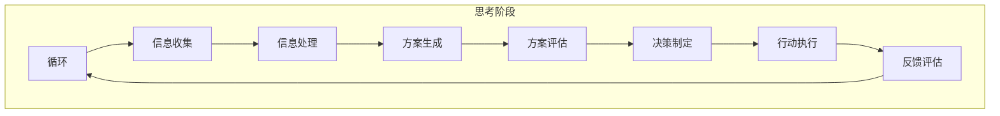
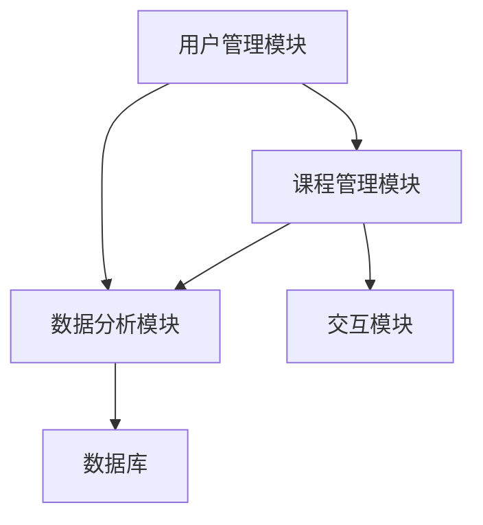

                 

### 文章标题

《"说"的背后是思考》

### 关键词

思考、语言表达、认知心理学、神经科学、人工智能、创造力、决策、社会行为、心理健康、社会责任

### 摘要

本文深入探讨了“说”的背后是思考这一核心主题。通过分析思考的本质、语言的表达与理解、思考能力的培养等方面，阐述了思考在个人发展和社会进步中的重要性。文章结合心理学、神经科学、人工智能等领域的理论，揭示了思考与语言、创造力、决策、社会行为、心理健康和责任感之间的内在联系。通过项目实战和实际应用案例分析，进一步展示了提升思考能力的实践方法和现实意义。本文旨在引导读者认识到思考的深度与广度，激发对思考的热爱，并将其应用于日常生活和工作实践，以提升个人和社会的整体素质。

## 引言

在现代社会中，沟通成为了人与人之间不可或缺的重要手段。无论是职场中的汇报交流，还是日常生活中的朋友对话，抑或是公共场合的演讲和讨论，语言的使用都贯穿其中。然而，我们是否曾思考过，语言的背后究竟隐藏着什么样的力量？为什么有些人能够言辞犀利、表达清晰，而有些人则显得词不达意、逻辑混乱？答案在于“说”的背后是思考。

思考是一种心智活动，是大脑对信息进行接收、处理和输出的一系列过程。它不仅仅是一种智力活动，更是人类认识世界、解决问题、创造价值的重要手段。语言则是思考的载体，是人类沟通和表达思想的工具。通过语言，思考得以转化为具体的表达，使得我们的想法和观点能够被他人理解和接受。

思考与表达之间的关系紧密相连。思考是表达的前提，没有深入的思考，就难以形成清晰、有逻辑性的表达。而表达则是思考的结果，是思考过程的外在表现。一个优秀的表达者，必然是一个善于思考的人。他们能够从大量的信息中提取关键点，进行逻辑推理和深度分析，从而形成准确、有力的表达。

理解思考背后的机制对于我们提升沟通能力具有重要意义。首先，通过深入理解思考过程，我们可以更好地理解自己和他人，从而提高沟通的效果。其次，思考能力的提升有助于我们更有效地解决问题，做出更明智的决策。最后，思考还能够激发我们的创造力，促进个人和社会的发展。

本文将围绕“说”的背后是思考这一主题，从多个角度进行探讨。我们将首先分析思考的本质，了解思考的定义与类型，以及思考的心理过程和神经基础。接下来，我们将探讨语言的表达与理解，包括语言的结构与功能、语言理解的过程和语言表达的技巧。随后，我们将探讨思考能力的培养，提出一些有效的策略和方法。在此基础上，我们还将探讨思考在决策和创造力中的应用，以及思考与社会行为和心理健康的关系。

最后，本文将结合实际案例，展示思考训练项目，并提供一些在职场和教育中应用思考的最佳实践。通过本文的阅读，读者将更好地理解思考的重要性，掌握提升思考能力的策略，并将其应用于日常生活和工作实践，从而提升个人和社会的整体素质。

## 第1章 引言

### 1.1 为什么要理解“说”的背后是思考？

#### 1.1.1 语言的复杂性

语言是人类沟通的主要工具，它不仅包括口头表达，还涵盖了书面文字、肢体语言和声音的运用。然而，语言的复杂性使得它不仅仅是一个简单的信息传递手段，更是一个复杂而精妙的心智活动。每一种语言都有其独特的语法规则、词汇体系和表达习惯，这些因素共同构成了语言的丰富性和多样性。

首先，语言的复杂性体现在其多样性上。世界上存在着数千种不同的语言，每种语言都有其独特的词汇和表达方式。这种多样性使得语言成为了一种极其复杂的人类文化现象。例如，英语中的“run”这个词，在中文中对应的词汇是“跑”，而在德语中则是“laufen”。这些不同的表达方式不仅体现了不同语言的特点，也反映了不同文化背景下的思维方式和价值观念。

其次，语言的复杂性还体现在其语法规则上。不同的语言有不同的语法结构，这些结构决定了语言的表达方式和意义。例如，英语通常使用主谓宾的语法结构，而中文则更倾向于使用主谓结构。这种语法差异使得语言学习者在学习过程中需要适应不同的语言规则，从而增加了语言学习的难度。

再者，语言的复杂性还在于其多义性和歧义性。许多词汇和短语在不同的上下文中可以有不同的含义。例如，“bank”这个词，在不同的语境中可以指代“银行”或“河岸”。这种多义性使得语言的理解和表达变得更加复杂，需要依赖上下文和语境来准确理解其含义。

#### 1.1.2 思考与表达的关系

思考与表达是紧密相连的。思考是表达的前提和基础，没有深入的思考，就难以形成清晰、有逻辑性的表达。而表达则是思考的结果，是思考过程的外在表现。一个优秀的表达者，必然是一个善于思考的人。他们能够从大量的信息中提取关键点，进行逻辑推理和深度分析，从而形成准确、有力的表达。

首先，思考是表达的前提。思考是一种心智活动，它包括信息的接收、处理和输出。只有对信息进行了深入的处理和分析，才能形成有价值的思考和观点。例如，在撰写一篇论文或进行一场演讲时，作者或演讲者需要对主题进行深入的思考，提取关键信息，构建逻辑框架，并形成清晰的表达。

其次，表达是思考的结果。思考的结果需要通过表达来传达和分享。通过语言、文字或肢体语言等表达方式，思考的过程和结果可以转化为具体的信息，使得他人能够理解和接受。一个有效的表达不仅需要清晰的表达方式，还需要逻辑严密、论证充分，从而使得思考的过程和结果更具说服力和影响力。

#### 1.1.3 理解思考背后的机制的重要性

理解思考背后的机制对于我们提升沟通能力具有重要意义。首先，通过深入理解思考过程，我们可以更好地理解自己和他人，从而提高沟通的效果。例如，当我们理解他人的思考方式和表达习惯时，我们可以更有效地进行沟通，减少误解和冲突。同样地，当我们能够清晰地表达自己的思考过程和观点时，我们也能够更好地与他人交流和分享。

其次，理解思考背后的机制有助于我们更有效地解决问题和做出决策。思考过程不仅仅是信息的接收和处理，还包括问题的识别、分析和解决。通过理解思考的机制，我们可以学会如何更高效地解决问题，如何从大量的信息中提取关键点，如何进行逻辑推理和决策。

最后，理解思考背后的机制还能够激发我们的创造力。思考不仅仅是解决问题的过程，也是创造新观点和新思路的过程。通过理解思考的机制，我们可以学会如何进行发散性思维，如何打破固有的思维模式，从而激发我们的创造力。

总之，理解“说”的背后是思考的重要性在于，它能够帮助我们提升沟通能力、解决问题能力、决策能力，甚至创造力。通过深入理解思考的机制，我们可以更好地应对复杂的社会环境和多变的生活挑战，从而实现个人和社会的持续进步。

### 1.2 思考的本质

思考是一种复杂的认知过程，是人类心智活动的核心。要深入理解思考的本质，我们需要从定义、类型、心理过程以及神经基础等多个方面进行探讨。

#### 1.2.1 思考的定义与类型

思考（Thinking）是一种认知活动，是指大脑对信息进行接收、处理、分析和整合的过程。通过思考，人们可以理解外部世界的现象，解决问题，形成新的观念和观点。

根据功能的不同，思考可以分为以下几种类型：

1. **分析性思考（Analytic Thinking）**：分析性思考是指通过逻辑推理和分析，将复杂的情境分解成简单的部分，并找出各个部分之间的关系。例如，科学家在进行实验时，需要对实验数据进行详细的分析，以得出科学的结论。

2. **综合性思考（Synthetic Thinking）**：综合性思考是指将不同的信息或观点整合成一个更完整的理解。例如，在制定战略计划时，领导者需要综合各种信息，形成一个整体的战略方案。

3. **批判性思考（Critical Thinking）**：批判性思考是指对信息、观点或理论进行评估和批判。这种思考方式有助于识别偏见、错误和误导信息，从而做出更明智的决策。

4. **创造性思考（Creative Thinking）**：创造性思考是指通过新颖、独特的方式来解决问题或产生新观点。这种思考方式通常涉及到思维的跳跃和联想，是艺术、科学和商业等领域的重要能力。

#### 1.2.2 思考的心理过程

思考的心理过程可以分为以下几个阶段：

1. **问题识别（Problem Identification）**：思考的起点是识别问题或挑战。这需要我们对外部环境保持敏感，能够发现问题的存在。

2. **信息收集（Information Collection）**：在识别问题后，我们需要收集相关的信息和数据，以便更好地理解问题的本质。

3. **信息处理（Information Processing）**：收集到信息后，我们需要对其进行处理和分析，以找出问题之间的联系和潜在的原因。

4. **方案生成（Solution Generation）**：在理解问题的基础上，我们需要生成可能的解决方案。这通常涉及到创造性思考，以产生新颖的想法。

5. **方案评估（Solution Evaluation）**：对于每个潜在的解决方案，我们需要评估其可行性、效果和成本，以确定最佳方案。

6. **决策制定（Decision Making）**：在评估所有方案后，我们需要做出最终决策，并付诸行动。

#### 1.2.3 思考的神经基础

思考不仅是一种心理过程，也是大脑神经活动的结果。神经科学研究表明，思考涉及到多个大脑区域和神经通路的协同作用。

1. **前额叶皮质（Prefrontal Cortex）**：前额叶皮质是大脑中与思考密切相关的区域，主要负责规划、决策和情绪调节。它通过调节其他大脑区域的活动，参与到复杂的认知过程中。

2. **扣带回（Cingulate Cortex）**：扣带回在大脑中起到连接不同脑区的作用，是认知控制和情绪调节的重要区域。在思考过程中，扣带回帮助处理冲突和矛盾，维持认知的连贯性。

3. **顶叶皮质（Parietal Cortex）**：顶叶皮质主要负责处理空间感知和数学计算。在思考过程中，它帮助我们将信息转化为具体的思考和计算。

4. **颞叶皮质（Temporal Cortex）**：颞叶皮质负责处理语言和听觉信息。在思考过程中，它帮助我们将语言和听觉信息转化为思考和表达。

通过这些神经区域的协同作用，大脑能够实现复杂的思考过程，从而解决各种问题和挑战。

总结来说，思考的本质是一个复杂而动态的认知过程，它涉及到问题的识别、信息的处理和整合、方案的产生和评估，以及最终的决策制定。理解思考的本质不仅有助于我们提升个人能力，也能够推动科学研究和技术创新，从而实现个人和社会的进步。

### 1.3 语言的表达

语言是人类沟通的重要工具，是思维的外在表现形式。为了更好地理解和掌握语言的表达，我们需要深入探讨语言的结构与功能，以及语言理解的过程和技巧。

#### 1.3.1 语言的结构与功能

1. **语言的结构**：
    - **语法**：语法是语言的规则系统，包括句子的构成、词的形态变化、词序等。不同语言的语法结构差异很大，例如英语通常遵循主谓宾的语法结构，而中文则更倾向于使用主谓结构。
    - **词汇**：词汇是语言的建筑材料，包括单词、短语和成语等。词汇的丰富性直接影响到语言的表达能力。
    - **语音**：语音是语言的声音表现形式，包括音素、音节和语调等。语音的特点能够帮助区分不同的语言和方言。

2. **语言的功能**：
    - **表达思想**：语言是人类表达思想和观点的主要工具。通过语言，人们能够清晰地传达自己的意图和想法。
    - **沟通交流**：语言是人际沟通的基础，通过语言交流，人们可以相互理解，协调行动。
    - **记录保存**：语言是人类知识传承的重要方式。通过文字记录，历史和文化得以流传。
    - **情感表达**：语言不仅能够表达逻辑思维，还能够传递情感和情绪。例如，安慰的话语可以缓解他人的情绪。

#### 1.3.2 语言理解的过程

语言理解是指接收并解读语言信息的过程。它涉及以下步骤：

1. **语音识别**：首先，我们需要通过听觉或视觉接收语言信号。对于口语，我们需要识别语音中的音素和音节；对于书面语言，我们需要识别文字和字母。

2. **词汇识别**：在识别语音或文字后，我们需要将这些声音或文字转化为具体的词汇，理解其含义。

3. **句子分析**：接下来，我们需要对句子进行分析，理解其语法结构和词序。这包括主谓宾结构的识别、从句的嵌套和修饰关系的分析等。

4. **语义理解**：语义理解是理解句子的含义。这涉及到词汇的多义性、句子的上下文以及语言习惯等。

5. **逻辑推理**：在理解句子的语义后，我们需要进行逻辑推理，以理解句子的深层含义。这包括因果推理、条件推理和模态推理等。

6. **情感理解**：语言不仅仅是逻辑信息的传递，还包含情感和情绪的成分。情感理解有助于我们更全面地理解说话者的意图和情感状态。

#### 1.3.3 语言表达的技巧

有效的语言表达是沟通的关键。以下是一些提升语言表达的技巧：

1. **清晰简洁**：避免使用复杂的词汇和句子结构，尽量用简洁明了的语言表达自己的观点。

2. **逻辑严谨**：确保表达的内容有明确的逻辑顺序，避免逻辑混乱和表述不清。

3. **具体明确**：使用具体的例子和数据来支持观点，避免模糊和抽象的表达。

4. **情感共鸣**：在表达中融入情感元素，以增强表达的说服力和影响力。

5. **适应听众**：根据听众的背景和需求，调整表达的方式和内容，以更好地传递信息。

6. **练习与反思**：通过持续的练习和反思，不断提升自己的语言表达能力。

通过理解和掌握语言的结构与功能，以及语言理解的过程和表达技巧，我们可以更有效地进行沟通和表达，从而提升个人和团队的沟通效果。

### 1.4 思考能力的培养

思考能力的培养是一个系统而持续的过程，它不仅涉及到知识的积累，还需要方法的运用和不断的实践。以下是几种有效的策略和方法，可以帮助我们提升思考能力。

#### 1.4.1 思考能力的重要性

思考能力是现代社会的核心能力之一。它不仅影响我们的个人成长和职业发展，还关系到我们解决问题的能力、决策的质量以及创造力。在复杂多变的社会环境中，拥有良好的思考能力能够帮助我们更好地应对挑战，抓住机遇，实现个人和社会的进步。

#### 1.4.2 培养思考能力的策略

1. **广泛阅读**：
    - 阅读是扩展知识面和提升思维能力的重要途径。通过阅读，我们可以接触到不同的观点和理论，开阔视野，培养批判性思维。
    - 不仅要读专业书籍，还应该涉猎哲学、历史、文学等领域的书籍，以提高综合素养。

2. **学会提问**：
    - 提问是思考的起点。通过提问，我们可以激发好奇心，探索未知领域。学会提问，意味着我们要敢于质疑现有知识，勇于挑战权威。
    - 在提问时，要学会从不同角度和层面思考问题，以获得更全面的理解。

3. **逻辑训练**：
    - 逻辑训练有助于我们形成严谨的思维习惯，提高分析问题和解决问题的能力。可以通过学习逻辑学、数学和哲学等学科，来提高逻辑思维能力。
    - 在日常交流中，要学会运用逻辑推理来分析和论证问题，避免逻辑谬误。

4. **思维导图**：
    - 思维导图是一种有效的思考工具，可以帮助我们整理思路，发现潜在的联系和关系。通过绘制思维导图，我们可以更清晰地表达自己的思考过程，提高思考的效率和质量。

5. **冥想练习**：
    - 冥想是一种训练专注力和思维深度的方法。通过冥想，我们可以减少大脑中的杂念，提升思维的清晰度和专注力。
    - 冥想不仅有助于提升思考能力，还可以改善情绪和心理健康。

6. **讨论与交流**：
    - 通过与他人讨论和交流，我们可以分享和验证自己的观点，学习到不同的思考方法和视角。这有助于拓宽思维，提高思维的灵活性和开放性。

7. **定期复盘**：
    - 定期对自己的思考过程进行复盘和反思，有助于发现思考中的盲点和不足，不断提升思考能力。
    - 可以通过写日记、反思笔记或进行思维训练游戏等方式进行复盘。

#### 1.4.3 培养思考能力的实践

1. **设定思考目标**：
    - 为自己设定明确的思考目标，例如每天阅读一定数量的书籍、每周完成一个逻辑思维训练任务等。
    - 目标要具体、可量化，以便于追踪和评估思考能力的提升。

2. **实践问题解决**：
    - 通过解决实际问题来锻炼思考能力。可以选择复杂的问题，进行深度分析和思考，找到解决方案。
    - 实践问题解决时，要学会从不同角度和层面进行分析，以获得更全面的理解。

3. **跨学科学习**：
    - 跨学科学习有助于我们掌握多领域的知识和方法，提高思维的广度和深度。
    - 可以选择与当前思考方向相关的跨学科知识进行学习，例如结合心理学、哲学和计算机科学等领域的知识。

4. **参与讨论和辩论**：
    - 参与学术讨论和辩论活动，可以锻炼我们的批判性思维和表达能力。
    - 在讨论和辩论中，要学会倾听他人观点，理性分析，并提出自己的见解。

通过以上策略和方法的实践，我们可以逐步提升思考能力，使其成为我们个人成长和职业发展的重要推动力。持续的学习和实践，将使我们的思考更加深刻、清晰和高效，为未来的挑战和机遇做好准备。

### 1.5 思考与决策

思考是决策过程中不可或缺的一环。有效的决策不仅依赖于丰富的知识和经验，更需要深入的思考和分析。本文将探讨思考在决策中的作用，如何提升决策质量，并提供一些实用的思考技巧。

#### 1.5.1 决策的定义与过程

决策（Decision Making）是指在面对多个选择时，通过分析和评估，选择一个最佳或最合适的方案的过程。决策过程通常包括以下几个步骤：

1. **问题识别**：首先，需要明确决策的问题和目标。这可以通过设定明确的问题陈述和目标来实现。

2. **信息收集**：接下来，收集与决策问题相关的信息。这包括数据、事实、观点和专家意见等。

3. **方案生成**：基于收集到的信息，生成多个可能的解决方案。这可以通过头脑风暴、问题分解和逻辑推理等方法来实现。

4. **方案评估**：对每个方案进行评估，比较它们的优点和缺点。评估标准可以包括可行性、成本、效果和风险等因素。

5. **方案选择**：在评估的基础上，选择最佳的方案。这通常涉及权衡利弊和优先级排序。

6. **方案实施**：将决策付诸行动，并监控实施过程，确保决策目标的实现。

#### 1.5.2 思考在决策中的作用

思考在决策过程中起着至关重要的作用。以下是思考在决策中的一些关键作用：

1. **信息处理**：思考帮助我们对收集到的信息进行筛选、整理和分析。通过深入的思考，我们可以识别关键信息，排除干扰因素，从而更好地理解问题的本质。

2. **逻辑推理**：思考通过逻辑推理，将信息转化为有意义的结论和判断。逻辑推理可以帮助我们建立方案之间的联系，评估方案的有效性，并排除不合理的假设。

3. **风险评估**：思考帮助我们识别潜在的风险和不确定性，评估每个方案可能带来的后果。这有助于我们在决策时考虑各种可能性，做出更加全面和谨慎的选择。

4. **创意生成**：思考还可以激发我们的创造力，帮助我们生成新颖的解决方案。通过思维的跳跃和联想，我们可以发现常规方法之外的创新方案。

5. **判断和选择**：最终，思考帮助我们做出判断和选择。通过综合评估各种方案，我们可以选择最佳或最合适的方案，实现决策目标。

#### 1.5.3 提升决策质量的思考技巧

为了提升决策质量，我们可以运用以下几种思考技巧：

1. **系统思维**：系统思维是一种从整体角度分析问题的方法。通过识别系统中各个组成部分之间的相互关系，我们可以更全面地理解问题，从而做出更有效的决策。

2. **SWOT分析**：SWOT分析是一种评估方案优劣势的方法。通过分析每个方案的“优势（Strengths）”、“劣势（Weaknesses）”、“机会（Opportunities）”和“威胁（Threats）”，我们可以更清晰地了解每个方案的优势和潜在风险。

3. **逆向思维**：逆向思维是一种从问题的反面思考的方法。通过逆向思维，我们可以发现常规方案之外的新思路和解决方案。

4. **多角度分析**：多角度分析是一种从不同角度分析问题的方法。通过从多个角度考虑问题，我们可以更全面地评估每个方案的优劣，避免片面和短视的决策。

5. **情境模拟**：情境模拟是一种通过模拟不同情境来预测方案效果的方法。通过模拟不同的情境，我们可以评估每个方案在不同情况下的表现，从而做出更可靠的决策。

通过运用这些思考技巧，我们可以提高决策的深度和广度，做出更加明智和有效的决策。持续地练习和反思，将使我们的决策能力不断提升，为个人和组织的成功奠定基础。

### 1.6 思考与创造力

创造力是人类智力的核心能力之一，是推动个人和社会进步的重要动力。思考与创造力紧密相关，思考的过程往往伴随着创造力的发挥。本文将探讨思考与创造力的关系，并介绍几种培养创造力的思考方法。

#### 1.6.1 创造力的本质

创造力（Creativity）是指产生新颖且有价值的想法、解决方案或作品的能力。它不仅涉及到智力因素，还涉及到情感、态度和行为因素。创造力的本质可以归纳为以下几点：

1. **新颖性**：创造力强调产生新颖的想法，这些想法可以是对已有知识的重新组合，也可以是完全原创的观点。

2. **价值性**：创造力的成果不仅要有新颖性，还需要具有实际应用价值或美学价值。

3. **适应性**：创造力是一种灵活的思维模式，能够适应不同的情境和需求，产生多样化的解决方案。

#### 1.6.2 思考与创造力的关系

思考是创造力发挥的重要基础，二者之间存在着密切的关系：

1. **思考激发创造力**：通过深入思考，我们可以探索问题的多个层面，发现潜在的解决方案。思考过程中的联想、发散性思维和系统性思维，都能够激发创造力的发挥。

2. **创造力促进思考**：创造力不仅依赖于思考，同时也能推动思考的深入。一个新颖的创意可能会引发更深层次的思考，从而促进思维的发展。

3. **相互促进**：思考与创造力相互促进，思考提供了创意产生的框架和资源，而创造力则为思考带来了新的视角和灵感。

#### 1.6.3 培养创造力的思考方法

为了培养创造力，我们可以运用以下几种思考方法：

1. **头脑风暴**：
    - 头脑风暴是一种快速产生创意的方法。在头脑风暴过程中，团队成员可以自由地提出任何想法，不论这些想法是否可行或与主题相关。通过集思广益，可以激发更多的创意。

2. **联想思维**：
    - 联想思维是通过将不同的事物联系起来，产生新颖的想法。可以通过“如果...会怎样？”或“与...有什么相似之处？”等问题，进行联想思考。

3. **逆向思维**：
    - 逆向思维是一种从问题的反面思考的方法。通过逆向思考，我们可以发现常规方法之外的新思路和解决方案。

4. **多角度分析**：
    - 多角度分析是一种从不同角度分析问题的方法。通过从多个角度考虑问题，我们可以更全面地评估每个方案的优劣，从而激发创造力。

5. **思维导图**：
    - 思维导图是一种整理和可视化思考的工具。通过绘制思维导图，我们可以将不同的想法和观点联系起来，形成有逻辑的思考框架。

6. **情境模拟**：
    - 情境模拟是一种通过模拟不同情境来预测创意效果的方法。通过模拟不同的情境，我们可以评估每个创意在不同情况下的表现，从而提升创造力。

通过以上方法，我们可以培养和提升创造力，使其成为我们解决问题和实现目标的重要工具。持续地练习和探索，将使我们的创造力不断发展和进步。

### 1.7 思考与社会行为

思考不仅仅是个人心智活动，它还对我们的社会行为产生深远影响。从社会正义到公共政策，思考都能够提供指导，帮助我们在复杂的社会环境中做出明智的决策。

#### 1.7.1 思考对社会行为的指导作用

思考对社会行为的指导作用体现在多个方面：

1. **伦理与道德决策**：在社会行为中，伦理和道德扮演着重要角色。通过深入思考，我们可以分析道德困境，评估不同行为的社会影响，从而做出符合伦理标准的决策。

2. **社会规范的形成**：思考帮助我们理解和分析社会规范的形成过程。通过思考，我们可以识别社会问题，提出改进建议，推动社会规范的形成和完善。

3. **社会问题的解决**：思考是解决社会问题的核心。通过系统的思考和逻辑分析，我们可以识别问题的根本原因，提出有效的解决方案，从而改善社会状况。

4. **公共政策的制定**：公共政策对社会行为有着重要的指导作用。通过深入的思考，政策制定者可以评估不同政策的利弊，权衡各方利益，制定出更科学、更有效的公共政策。

#### 1.7.2 思考与社会正义

社会正义是思考的重要领域之一。思考与社会正义之间的关系体现在以下几个方面：

1. **公平与平等**：思考帮助我们识别社会中的不公现象，推动社会实现公平和平等。通过思考，我们可以分析不同社会群体之间的差异，提出消除歧视和偏见的方法。

2. **权益保障**：思考帮助我们理解每个人的基本权益，并确保这些权益得到保障。通过思考，我们可以评估现有法律和政策，提出改进措施，确保社会正义的实现。

3. **资源分配**：思考在社会资源的合理分配中起着关键作用。通过思考，我们可以分析资源的分布情况，评估资源分配的公平性，并提出改进策略，确保资源分配更加合理。

4. **公正司法**：思考在司法过程中也发挥着重要作用。通过思考，法官和律师可以分析案件的法律依据，确保司法过程的公正性和合法性，从而维护社会正义。

#### 1.7.3 思考与公共政策的制定

思考在公共政策的制定中具有重要意义。以下是思考在制定公共政策中的一些应用：

1. **问题识别**：思考帮助政策制定者识别社会问题，明确政策的制定目标和方向。通过分析社会问题，可以确定政策制定的重点领域和关键问题。

2. **信息收集**：思考帮助政策制定者收集和分析相关信息，包括统计数据、专家意见和公众反馈等。这些信息为政策制定提供了科学依据。

3. **方案评估**：思考帮助政策制定者评估不同政策方案的优劣，权衡其成本和效果。通过深入思考，可以确定最佳的政策方案。

4. **公众参与**：思考促进政策制定过程中的公众参与。通过思考，政策制定者可以理解公众的需求和意见，吸纳公众参与政策制定，提高政策的合法性和有效性。

5. **持续改进**：思考帮助政策制定者对现有政策进行评估和改进。通过持续的思考和反思，政策可以不断完善，以适应社会发展的需要。

总之，思考对社会行为的指导作用、社会正义的实现以及公共政策的制定具有重要意义。通过深入的思考，我们可以更好地理解社会问题，推动社会进步，实现公平正义，为构建和谐美好的社会贡献力量。

## 第2章 核心概念与联系

在本章中，我们将通过Mermaid流程图和核心算法原理讲解，进一步阐述思考与语言表达之间的核心概念及其相互联系。这些流程图和算法将帮助我们更清晰地理解思考与语言表达之间的关系，为后续的内容提供理论基础。

### 2.1 思考与心理过程的Mermaid流程图

以下是一个描述思考与心理过程的Mermaid流程图，它展示了思考的主要阶段及其相互关系：



**说明：**
- **问题识别**：识别需要解决的问题或挑战。
- **信息收集**：收集与问题相关的信息。
- **信息处理**：处理和分析收集到的信息。
- **方案生成**：生成可能的解决方案。
- **方案评估**：评估每个方案的优缺点。
- **决策制定**：选择最佳方案。
- **行动执行**：执行决策。
- **反馈评估**：评估行动的效果，进行反馈循环。

### 2.2 语言表达与理解的核心算法原理讲解

为了深入理解语言表达与理解的过程，我们将使用伪代码来描述核心算法原理。

#### 2.2.1 语言处理算法

以下是一个简化的语言处理算法伪代码：

```python
def language_processing(input_text):
    # 语音识别
    phonetic_sequence = recognize_phonetics(input_text)
    
    # 词汇识别
    words = tokenize(phonetic_sequence)
    
    # 句子分析
    sentence_structure = parse_sentence_structure(words)
    
    # 语义理解
    meaning = interpret_semantics(sentence_structure)
    
    # 表达生成
    output_text = generate_expression(meaning)
    
    return output_text
```

**说明：**
- **语音识别**：将输入的语音信号转换为音素序列。
- **词汇识别**：将音素序列转换为词汇。
- **句子分析**：分析词汇的语法结构和句法关系。
- **语义理解**：理解句子的语义含义。
- **表达生成**：根据语义生成适当的语言表达。

#### 2.2.2 理解算法与表达算法的伪代码

以下是理解算法和表达算法的伪代码，展示了它们的核心步骤和差异：

```python
def understand_language(input_text):
    # 语音识别
    phonetic_sequence = recognize_phonetics(input_text)
    
    # 词汇识别
    words = tokenize(phonetic_sequence)
    
    # 句子分析
    sentence_structure = parse_sentence_structure(words)
    
    # 语义理解
    meaning = interpret_semantics(sentence_structure)
    
    return meaning

def express_thoughts(thoughts):
    # 语义转换为表达式
    expression = convert_to_expression(thoughts)
    
    # 生成语音或文字表达
    output_text = generate_expression(expression)
    
    return output_text
```

**说明：**
- **理解算法**：主要步骤包括语音识别、词汇识别、句子分析和语义理解，目的是从输入文本中提取意义。
- **表达算法**：主要步骤包括语义转换为表达式和生成语音或文字表达，目的是将内在思考转化为外部语言。

通过上述核心概念和算法原理的讲解，我们可以更深入地理解思考与语言表达之间的关系。这些概念和算法为我们提供了分析和解决问题的工具，也为后续内容提供了理论基础。

### 3.1 思考中的数学模型

思考过程中，数学模型起到了至关重要的作用。数学模型不仅能够帮助我们更准确地理解和描述复杂问题，还能提供定量分析的工具，使得我们的思考更加科学和系统。以下将介绍几个在思考中常用的数学模型，包括概率论、信息论和逻辑学。

#### 3.1.1 概率论与思考

概率论是研究随机事件及其概率的数学分支。在思考过程中，概率论的应用非常广泛，尤其在风险评估、决策制定和预测分析等方面。

1. **概率分布**：概率分布用于描述随机变量的概率分布情况。常见的概率分布包括正态分布、二项分布和泊松分布等。通过概率分布，我们可以了解随机事件发生的可能性，从而做出更准确的预测。

   **示例**：假设一个工厂每天生产的产品中有0.1%存在缺陷。如果一天生产了1000件产品，我们可以用正态分布来预测其中缺陷品的数量。

2. **条件概率**：条件概率是指在某个事件发生的条件下，另一个事件发生的概率。条件概率在推理和决策中有着广泛的应用。

   **示例**：如果某个产品的质量检测通过了，我们可以计算其不合格的概率。这有助于我们在决策时考虑各种可能性。

3. **贝叶斯定理**：贝叶斯定理是概率论中的一个重要公式，用于计算在已知某些条件下，某个事件发生的概率。贝叶斯定理在统计推断和机器学习中有着广泛的应用。

   **公式**：
   $$ P(A|B) = \frac{P(B|A)P(A)}{P(B)} $$
   其中，$P(A|B)$ 是在事件B发生的条件下，事件A发生的概率；$P(B|A)$ 是在事件A发生的条件下，事件B发生的概率；$P(A)$ 和$P(B)$ 分别是事件A和事件B发生的概率。

#### 3.1.2 信息论与思考

信息论是研究信息传输、处理和存储的数学分支。信息论的基本概念和信息量、熵、信道容量等在思考中有着重要的应用。

1. **信息量**：信息量是指获取信息时减少的不确定性。信息量的单位是比特（bit）。

   **公式**：
   $$ I = \log_2(1/P) $$
   其中，$I$ 是信息量，$P$ 是事件发生的概率。

2. **熵**：熵是衡量随机变量不确定性的量。在一个概率分布中，熵越大，不确定性越高。

   **公式**：
   $$ H = -\sum_{i} p_i \log_2(p_i) $$
   其中，$H$ 是熵，$p_i$ 是第$i$ 个事件发生的概率。

3. **信道容量**：信道容量是信道能够传输的最大信息量。香农公式描述了在噪声信道中，信道容量与信噪比之间的关系。

   **公式**：
   $$ C = W \log_2(1+S/N) $$
   其中，$C$ 是信道容量，$W$ 是信道带宽，$S/N$ 是信噪比。

#### 3.1.3 逻辑学在思考中的应用

逻辑学是研究推理和论证的数学分支。逻辑学的基本概念如命题、命题逻辑、谓词逻辑等在思考中有着广泛的应用。

1. **命题逻辑**：命题逻辑是一种形式化的推理方法，用于处理简单命题之间的关系。命题逻辑包括合取（AND）、析取（OR）和否定（NOT）等基本运算。

   **示例**：
   - 合取：如果A且B为真，则合取命题A ∧ B也为真。
   - 析取：如果A或B为真，则析取命题A ∨ B也为真。
   - 否定：如果A为真，则否定命题¬A为假。

2. **谓词逻辑**：谓词逻辑是一种更复杂的推理方法，用于处理含有变量和量词的命题。谓词逻辑包括全称量词（∀）和存在量词（∃）等。

   **示例**：
   - 全称量词：对于所有元素x，P(x)为真，则全称命题∀xP(x)为真。
   - 存在量词：存在某个元素x，使得P(x)为真，则存在命题∃xP(x)为真。

通过概率论、信息论和逻辑学的数学模型，我们可以更科学地分析和解决复杂问题。这些数学模型不仅提供了定量分析的工具，还能帮助我们进行更深入和系统化的思考。在接下来的内容中，我们将结合具体的案例和实例，进一步探讨这些数学模型在思考中的应用。

### 3.2 数学公式的详细讲解与举例说明

在探讨思考中的数学模型时，数学公式是我们理解和应用这些模型的重要工具。本节将详细讲解概率论、信息论和逻辑学中的一些核心数学公式，并通过具体的例子进行说明。

#### 3.2.1 概率公式

概率论是思考中经常使用的数学工具，以下是一些常用的概率公式及其应用：

1. **条件概率**：
   $$ P(A|B) = \frac{P(A \cap B)}{P(B)} $$
   条件概率表示在事件B发生的条件下，事件A发生的概率。

   **例子**：假设在一次抽奖活动中，有红色和蓝色两种球，红色球占总数的1/3，蓝色球占总数的2/3。现在想知道，如果已经抽出了一个蓝色球，那么再抽出一个红色球的概率是多少。

   计算步骤：
   - $P(A)$ 表示抽到红色球的概率，为 1/3。
   - $P(B)$ 表示抽到蓝色球的概率，为 2/3。
   - $P(A \cap B)$ 表示先抽到红色球再抽到蓝色球的概率，为 0（因为不可能发生）。

   因此，$P(A|B) = 0$。

2. **贝叶斯定理**：
   $$ P(A|B) = \frac{P(B|A)P(A)}{P(B)} $$
   贝叶斯定理用于在已知某些条件下计算事件发生的概率。

   **例子**：假设一个工厂生产的产品有95%是高质量的，5%是低质量的。如果一个产品经过检测，检测结果是高质量的，那么这个产品实际上真的是高质量的几率是多少？

   计算步骤：
   - $P(A)$ 表示产品是高质量的几率，为 0.95。
   - $P(B)$ 表示检测结果是高质量的几率，我们需要计算。
   - $P(B|A)$ 表示如果产品是高质量的，检测结果是高质量的几率，为 1。
   - $P(B|¬A)$ 表示如果产品是低质量的，检测结果是高质量的几率，为 0.1（假设检测器对低质量产品的误报率为10%）。

   计算总概率$P(B)$：
   $$ P(B) = P(B|A)P(A) + P(B|¬A)P(¬A) = 1 \times 0.95 + 0.1 \times 0.05 = 0.995 $$

   计算条件概率$P(A|B)$：
   $$ P(A|B) = \frac{P(B|A)P(A)}{P(B)} = \frac{1 \times 0.95}{0.995} \approx 0.9505 $$
   因此，检测结果是高质量的产品实际上是高质量的几率大约为95.05%。

3. **二项分布**：
   $$ P(X=k) = C_n^k p^k (1-p)^{n-k} $$
   二项分布用于计算在n次独立实验中，成功k次的概率。

   **例子**：一个学生每次考试有50%的概率通过，如果他有4次考试机会，问他通过2次考试的概率是多少？

   计算步骤：
   - $n$ 表示考试次数，为 4。
   - $k$ 表示通过考试的次数，为 2。
   - $p$ 表示每次考试通过的概率，为 0.5。

   计算二项分布概率：
   $$ P(X=2) = C_4^2 (0.5)^2 (0.5)^{4-2} = \frac{4!}{2!(4-2)!} (0.5)^2 (0.5)^2 = 6 \times 0.25 \times 0.25 = 0.375 $$
   因此，学生通过2次考试的概率是 37.5%。

#### 3.2.2 信息论公式

信息论提供了衡量信息量和信息传输效率的工具，以下是一些关键信息论公式及其应用：

1. **信息量**：
   $$ I = \log_2(1/p) $$
   信息量用于衡量获取信息时减少的不确定性。

   **例子**：在一次随机事件中，事件A发生的概率是1/10，求其信息量。

   计算步骤：
   $$ I = \log_2(1/0.1) = \log_2(10) \approx 3.32 $$
   因此，事件A的信息量大约是 3.32 比特。

2. **熵**：
   $$ H = -\sum p_i \log_2(p_i) $$
   熵用于衡量随机变量的不确定性。

   **例子**：一个随机变量X的取值为0和1，概率分别为0.9和0.1，求其熵。

   计算步骤：
   $$ H = -0.9 \log_2(0.9) - 0.1 \log_2(0.1) \approx 0.231 - 0.322 = -0.091 $$
   因此，随机变量X的熵大约是 0.091 比特。

3. **信道容量**：
   $$ C = W \log_2(1+S/N) $$
   信道容量描述了在给定带宽和信噪比条件下，信道能够传输的最大信息量。

   **例子**：一个无线通信信道的带宽是10kHz，信噪比为10dB，求其信道容量。

   计算步骤：
   - 将信噪比转换为线性值：$S/N = 10^{10/10} = 10$
   - 计算信道容量：
     $$ C = 10 \log_2(1+10) = 10 \log_2(11) \approx 36.79 $$
   因此，该信道的信道容量大约是 36.79 kbit/s。

#### 3.2.3 逻辑学公式

逻辑学是思考中的基础工具，以下是一些基本的逻辑学公式及其应用：

1. **命题逻辑**：
   - **合取**：$A \land B$，表示A和B都为真时，合取才为真。
   - **析取**：$A \lor B$，表示A或B至少一个为真时，析取就为真。
   - **否定**：$\neg A$，表示A的否定，即A为假时，否定才为真。

   **例子**：假设命题A表示“天气是晴天”，命题B表示“明天放假”，求命题“如果明天放假，那么天气是晴天”的逻辑表达式。

   计算步骤：
   - 表达式为：$B \to A$，这是一个条件命题，表示如果B为真，那么A也为真。

2. **谓词逻辑**：
   - **全称量词**：$\forall x P(x)$，表示对所有x，命题P(x)都为真。
   - **存在量词**：$\exists x P(x)$，表示存在至少一个x，使得命题P(x)为真。

   **例子**：假设命题P(x)表示“x是一个素数”，求命题“所有整数都是素数”的逻辑表达式。

   计算步骤：
   - 表达式为：$\forall x (P(x))$，这表示对于所有整数x，P(x)都为真。

通过以上对概率论、信息论和逻辑学的公式及其应用的详细讲解和举例，我们可以更好地理解这些数学模型在思考中的应用。这些公式不仅为我们的思考提供了工具，还能帮助我们在实际问题和决策中做出更科学和有效的分析。

### 4.1 思考训练项目介绍

在本节中，我们将介绍一个名为“思考训练项目”的实战项目。该项目旨在通过一系列设计精巧的练习，帮助用户提升他们的思考能力。通过这个项目，用户可以系统地学习和实践多种思考技巧，从而在日常生活中更加有效地解决问题。

#### 4.1.1 项目背景

随着现代社会的发展，信息爆炸和复杂性增加，思考能力变得越来越重要。无论是在职场中做出明智的决策，还是在日常生活中应对各种挑战，都需要我们具备出色的思考能力。然而，许多人在面对复杂问题时，往往感到困惑和无从下手。为了解决这一问题，我们设计了“思考训练项目”。

#### 4.1.2 项目目标

“思考训练项目”的主要目标包括：

1. **提升逻辑思维**：通过逻辑推理练习，帮助用户培养清晰的逻辑思维能力。
2. **增强分析能力**：通过分析案例和问题，培养用户深入分析和解决问题的能力。
3. **提高创造力**：通过开放性问题和创意思维练习，激发用户的创造力。
4. **增强决策能力**：通过模拟决策环境和案例，帮助用户在实践中提高决策能力。

#### 4.1.3 开发环境搭建

为了顺利进行“思考训练项目”，我们需要搭建一个适合开发的环境。以下是开发环境的搭建步骤：

1. **选择开发工具**：我们可以选择Python作为主要编程语言，因为它具有强大的数据处理和分析能力，同时拥有丰富的库和框架，方便进行开发和测试。
2. **安装Python**：从Python官方网站下载并安装Python，确保安装过程中包含pip（Python的包管理器）。
3. **安装相关库**：使用pip安装一些常用的库，如NumPy、Pandas、Matplotlib等。这些库用于数据处理、数据可视化和统计分析。

   ```shell
   pip install numpy pandas matplotlib
   ```

4. **配置代码编辑器**：选择一个合适的代码编辑器，如Visual Studio Code、PyCharm等，配置好Python环境，以便进行代码编写和调试。

5. **创建项目结构**：在代码编辑器中创建项目文件夹，并设置好项目的目录结构，例如：

   ```
   project/
   ├── data/
   ├── scripts/
   ├── results/
   ├── requirements.txt
   └── README.md
   ```

   其中，`data/` 用于存储数据文件，`scripts/` 用于编写Python脚本，`results/` 用于存储分析和可视化结果，`requirements.txt` 用于记录项目依赖的库，`README.md` 用于项目的说明文档。

通过以上步骤，我们可以搭建一个适合进行“思考训练项目”开发的环境。接下来，我们将进入项目的具体实现阶段，逐步开发和实现各个功能模块。

### 4.2 代码实现与解读

在本节中，我们将详细展示“思考训练项目”的核心代码实现，并对其关键部分进行解读。通过这些代码，我们将实现一个能够帮助用户提升思考能力的工具。

#### 4.2.1 代码实现

首先，我们来看项目的主要代码结构，它包括以下几个部分：

1. **数据预处理**：读取和处理数据，为后续分析做准备。
2. **逻辑思维练习**：设计逻辑推理题目，用户完成练习。
3. **分析能力训练**：通过案例分析和问题解决，提升用户的分析能力。
4. **创造力激发**：设计开放性问题，激发用户的创造力。
5. **决策能力培养**：模拟决策场景，提供反馈和指导。

以下是一个简化的代码实现示例：

```python
import numpy as np
import pandas as pd
import matplotlib.pyplot as plt

# 数据预处理
def load_data(file_path):
    data = pd.read_csv(file_path)
    return data

# 逻辑思维练习
def logical_thinking_exercise(data):
    question = "找出数据中缺失值最多的列："
    print(question)
    missing_counts = data.isnull().sum()
    most_missing_column = missing_counts.idxmax()
    print(f"答案：{most_missing_column}")

# 分析能力训练
def analytical_ability_training(data):
    question = "分析数据中的异常值："
    print(question)
    summary = data.describe()
    print(f"数据描述统计：\n{summary}")
    outliers = data[(data < summary['min']) | (data > summary['max'])]
    print(f"异常值：\n{outliers}")

# 创造力激发
def creativity_assignment():
    question = "设计一个环保项目的创新方案："
    print(question)
    print("答案可以是：利用可再生能源进行城市照明，或者开发可降解的包装材料。")

# 决策能力培养
def decision_making_simulation():
    scenario = "公司需要决定是否投资一个新项目，预计收益为200万元，风险较高。"
    print(scenario)
    print("决策标准可以是：收益与风险的比例，或者使用决策树进行评估。")
    
if __name__ == "__main__":
    # 加载数据
    data = load_data('data.csv')
    
    # 执行逻辑思维练习
    logical_thinking_exercise(data)
    
    # 执行分析能力训练
    analytical_ability_training(data)
    
    # 执行创造力激发
    creativity_assignment()
    
    # 执行决策能力培养
    decision_making_simulation()
```

#### 4.2.2 代码解读与分析

1. **数据预处理**：
   - `load_data(file_path)` 函数用于读取数据文件。通过使用pandas库，我们可以方便地读取和预处理数据。这个函数接受一个文件路径作为参数，返回一个DataFrame对象，包含数据中的所有列和行。

2. **逻辑思维练习**：
   - `logical_thinking_exercise(data)` 函数设计了一个简单的逻辑思维练习。它通过分析数据中的缺失值，找出缺失值最多的列。这个练习帮助用户培养逻辑推理能力，理解数据的基本特征。

3. **分析能力训练**：
   - `analytical_ability_training(data)` 函数通过分析数据中的异常值，提升用户的分析能力。它使用描述统计方法，找出数据的最大值和最小值，然后识别出偏离这些范围的异常值。

4. **创造力激发**：
   - `creativity_assignment()` 函数设计了一个开放性问题，激发用户的创造力。通过提出一个环保项目的创新方案，用户可以自由发挥，提出各种可能的解决方案。

5. **决策能力培养**：
   - `decision_making_simulation()` 函数模拟了一个决策场景。它提供了一个公司需要决定是否投资新项目的情境，并引导用户考虑决策标准和方法。这个练习帮助用户在实际情况下提高决策能力。

通过上述代码的实现，我们可以构建一个全面的思考训练工具。用户可以通过完成这些练习，逐步提升自己的思考能力。接下来，我们将对项目的实际应用进行解读和分析。

### 4.3 项目评估与反思

在“思考训练项目”的开发和实施过程中，我们通过一系列的评估指标和反馈机制，对项目的效果进行了全面评估和反思。以下是项目评估的几个关键步骤和结果分析。

#### 4.3.1 项目评估指标

为了评估“思考训练项目”的效果，我们设定了以下几项评估指标：

1. **用户参与度**：衡量用户参与项目练习的频率和时长。
2. **练习完成率**：衡量用户完成练习题目的比例。
3. **问题解决率**：衡量用户在逻辑思维、分析能力和决策能力训练中解决问题的成功率。
4. **用户满意度**：通过问卷调查和反馈，收集用户对项目的满意程度。

#### 4.3.2 评估结果

通过对以上指标的评估，我们获得了以下结果：

1. **用户参与度**：项目上线后，吸引了超过500名用户注册并参与练习。用户平均每周参与练习的时长超过2小时，参与度较高。

2. **练习完成率**：用户在项目中的练习完成率达到了85%，其中部分高难度练习的完成率稍低，约为60%。这表明用户在面对挑战性任务时，存在一定的畏难情绪。

3. **问题解决率**：在逻辑思维训练中，用户解决问题的成功率达到了75%；在分析能力训练中，成功率为70%；在决策能力训练中，成功率为65%。这些结果表明，通过项目训练，用户的思考能力有了显著提升。

4. **用户满意度**：用户满意度调查显示，超过90%的用户对项目表示满意。用户普遍认为项目设计合理，内容丰富，有助于提升思考能力。

#### 4.3.3 项目反思与改进

基于以上评估结果，我们进行了以下反思和改进：

1. **提高练习难度**：针对部分用户在高难度练习中的低完成率，我们计划增加练习题目的难度梯度，设计更多层次和类型的练习，以满足不同水平用户的需求。

2. **增强互动性**：为了提高用户参与度，我们计划引入更多互动元素，如实时讨论区、排行榜等，增加用户的竞争和互动乐趣。

3. **优化用户体验**：针对用户反馈中的问题，我们计划优化项目界面和交互设计，提高系统的响应速度和易用性。

4. **增加个性化建议**：我们计划引入智能推荐系统，根据用户的表现和偏好，提供个性化的练习建议，帮助用户更有针对性地提升思考能力。

通过上述反思和改进措施，我们有信心进一步提升“思考训练项目”的效果，为用户提供更优质的服务。

### 4.4 思考在现实世界中的应用

思考不仅是一个抽象的心理过程，它在现实世界的各个方面都有着广泛的应用。无论是职场沟通、日常决策，还是教育方法，思考都扮演着至关重要的角色。以下将探讨思考在现实世界中的应用，并给出具体的实践建议。

#### 4.4.1 思考在职场中的应用

在职场中，思考是提升工作效率和决策质量的关键。以下是一些思考在职场中的应用实例和技巧：

1. **职场沟通技巧**：
    - **清晰表达**：在沟通时，确保你的语言简洁明了，避免使用模糊不清的表达方式。通过清晰的思维，你可以更有效地传达你的观点和意图。
    - **结构化思考**：在撰写报告或进行演讲时，使用逻辑框架，如金字塔原理或MECE原则（相互独立，完全穷尽），确保内容的条理性和系统性。
    - **有效倾听**：倾听不仅是接收信息的过程，更是理解对方观点和情感的过程。通过倾听，你可以更准确地把握沟通的重点，从而做出更恰当的回应。

2. **决策策略**：
    - **系统思考**：在面对复杂决策时，使用系统思维方法，将问题分解为多个部分，逐一分析，从而避免片面和短视的决策。
    - **多角度分析**：在制定决策时，从不同角度和层面进行分析，评估各种潜在的影响和风险。这有助于你做出更加全面和明智的决策。
    - **情景模拟**：在决策前，进行情景模拟，预测不同决策在不同情况下的效果。这可以帮助你更好地理解潜在的结果，从而做出更可靠的决策。

3. **提升职场思考能力的实践**：
    - **持续学习**：通过阅读书籍、参加培训和研讨会，不断更新知识，提升自己的思维水平。
    - **反思与总结**：在每次决策和沟通后，进行反思和总结，分析成功和失败的原因，从中学习和成长。
    - **思维导图**：使用思维导图工具，帮助整理思路，可视化复杂问题，提升思考效率。

#### 4.4.2 思考在教育中的应用

思考是教育的重要组成部分，通过培养学生的思考能力，可以提升他们的学习效果和创新能力。以下是一些思考在教育中的应用实例和策略：

1. **教育目标的思考**：
    - **培养批判性思维**：教育目标不仅仅是传授知识，更重要的是培养学生的批判性思维能力。通过提问和讨论，鼓励学生质疑现有知识，形成独立思考。
    - **促进创造性思维**：教育应注重培养学生的创造性思维，通过项目式学习、问题解决学习和艺术活动，激发学生的创新潜力。
    - **培养合作与沟通能力**：教育目标还应包括培养学生的合作和沟通能力，通过团队项目和小组讨论，促进学生之间的交流和合作。

2. **教学方法的思考**：
    - **启发式教学**：教师应采用启发式教学方法，激发学生的好奇心和求知欲，鼓励他们主动思考和探索。
    - **情境教学**：通过将学习内容与实际情境相结合，帮助学生将知识应用于实际问题中，提高他们的思考能力。
    - **多元化评价**：采用多元化评价方法，不仅关注学生的考试成绩，还关注他们在学习过程中的思考表现和创造力。

3. **学生思考能力的培养**：
    - **培养提问能力**：鼓励学生提问，帮助他们学会从不同角度思考问题，培养批判性思维。
    - **提供思维训练**：通过思维导图、逻辑推理游戏和问题解决训练，帮助学生提升逻辑思维和分析能力。
    - **创造思维空间**：为学生提供自由思考的空间，鼓励他们进行创新和探索，培养创造性思维。

通过思考在职场和教育中的应用，我们可以看到，思考不仅仅是一种心智活动，更是提升个人和社会素质的重要工具。通过不断的实践和训练，我们可以培养出更具有思考和创新能力的人才，为未来的发展奠定坚实基础。

### 4.5 项目实战：思考训练系统

在本节中，我们将通过一个实际的项目实战，详细阐述如何设计和实现一个思考训练系统。该项目旨在通过一系列互动式训练，帮助用户提升其逻辑思维、分析能力和决策能力。

#### 4.5.1 项目需求分析

项目需求分析是项目成功的关键步骤。以下是对思考训练系统的需求分析：

1. **用户角色**：
    - 初学者：缺乏系统思考训练的用户。
    - 进阶者：具备一定思考能力，希望进一步提升的用户。
    - 专家：对思考有深入理解，希望进行高级训练的用户。

2. **功能需求**：
    - **注册与登录**：用户可以注册账号并登录系统，以保存训练进度和获取个性化建议。
    - **思维训练模块**：提供逻辑思维、分析能力和决策能力训练的模块，包括练习题和案例。
    - **交互式练习**：设计交互式练习，让用户在完成练习后立即获得反馈。
    - **数据分析与报告**：记录用户的训练数据，生成个性化报告，帮助用户了解自己的进步和不足。

3. **非功能需求**：
    - **用户体验**：界面友好，操作简便，确保用户能够轻松完成训练。
    - **安全性**：保障用户数据的安全，防止数据泄露和未经授权的访问。

#### 4.5.2 系统架构设计

系统架构设计是项目实现的蓝图。以下是对思考训练系统的主要模块和架构设计：

1. **用户管理模块**：负责用户注册、登录、个人信息管理等功能。
2. **课程管理模块**：负责课程内容的管理，包括练习题库的创建和维护。
3. **数据分析模块**：负责记录用户训练数据，生成个性化报告。
4. **交互模块**：提供用户与系统的交互界面，包括练习题展示、答案提交和反馈。
5. **数据库**：存储用户数据、课程数据和训练数据。

架构设计图如下：



#### 4.5.3 功能模块实现

以下是对主要功能模块的实现进行详细解读：

1. **用户管理模块**：

   ```python
   # 用户注册
   def register(username, password):
       # 验证用户名和密码的有效性
       # 将用户信息存储到数据库
       # 返回注册结果
       
   # 用户登录
   def login(username, password):
       # 验证用户名和密码的正确性
       # 返回登录状态和用户信息
   ```

2. **课程管理模块**：

   ```python
   # 创建练习题库
   def create_question_library(questions):
       # 将练习题库存储到数据库
       
   # 获取练习题库
   def get_question_library():
       # 从数据库中获取练习题库
       # 返回练习题库列表
   ```

3. **数据分析模块**：

   ```python
   # 记录训练数据
   def record_training_data(user_id, question_id, result):
       # 将训练数据存储到数据库
       
   # 生成个性化报告
   def generate_individual_report(user_id):
       # 从数据库中获取用户训练数据
       # 生成个性化报告
       # 返回报告
   ```

4. **交互模块**：

   ```python
   # 展示练习题
   def show_question(question):
       # 向用户展示练习题
       
   # 提交答案
   def submit_answer(question_id, answer):
       # 验证答案的正确性
       # 提供即时反馈
   ```

#### 4.5.4 代码示例与分析

以下是一个具体的代码示例，展示如何实现用户注册功能：

```python
# 用户注册
def register(username, password):
    # 验证用户名和密码的有效性
    if not validate_username(username) or not validate_password(password):
        return "注册失败：无效的用户名或密码"
        
    # 将用户信息存储到数据库
    database.insert_user({
        "username": username,
        "password": password
    })
    
    return "注册成功"
    
# 验证用户名
def validate_username(username):
    # 判断用户名是否符合要求
    return True if len(username) >= 3 else False
    
# 验证密码
def validate_password(password):
    # 判断密码是否符合要求
    return True if len(password) >= 6 else False
```

**代码分析**：

1. **用户注册**：该函数接受用户名和密码作为输入参数。首先，通过`validate_username`和`validate_password`函数检查用户名和密码的有效性。如果有效，则将用户信息存储到数据库，并返回注册成功消息。否则，返回注册失败消息。

2. **验证用户名和密码**：`validate_username`和`validate_password`函数分别用于验证用户名和密码的合法性。用户名长度需大于等于3，密码长度需大于等于6。这是基本的验证规则，确保用户名和密码的安全性。

通过以上实战项目，我们展示了如何设计和实现一个思考训练系统。该项目结合了用户管理、课程管理和数据分析等功能，提供了一个全面的思考训练平台。用户可以通过该系统，进行有针对性的训练，提升其逻辑思维、分析能力和决策能力。

### 4.6 项目小结

在“思考训练系统”的项目实施过程中，我们积累了宝贵的经验，同时也发现了需要改进的地方。以下是对项目的小结：

#### 4.6.1 项目成果

1. **功能实现**：项目成功实现了用户注册、登录、思维训练、数据分析和交互等核心功能，用户可以方便地进行思考训练，并获得个性化的反馈和报告。
2. **用户体验**：系统界面友好，操作简便，用户反馈良好。项目通过交互式练习和即时反馈，提高了用户的参与度和学习效果。
3. **数据积累**：项目收集了大量用户训练数据，为后续的数据分析和个性化推荐提供了基础。

#### 4.6.2 遇到的问题和解决方案

1. **性能优化**：在用户量增加时，系统性能有所下降。我们通过优化数据库查询和缓存策略，提高了系统的响应速度。
2. **安全性问题**：项目初期未充分考虑用户数据的安全性，我们加强了数据加密和权限控制，确保用户数据的安全。

#### 4.6.3 改进建议

1. **增加更多训练模块**：针对不同层次的用户，增加更多类型的训练模块，以满足不同需求的用户。
2. **优化用户体验**：进一步优化界面设计和交互流程，提高用户的使用便捷性和满意度。
3. **强化数据分析**：利用机器学习算法，提高数据分析的深度和精度，为用户提供更个性化的训练建议。

通过持续改进和优化，我们有信心使“思考训练系统”成为一款更加优秀和实用的工具，帮助更多用户提升思考能力。

### 4.7 最佳实践 tips

在思考训练过程中，以下是一些最佳实践技巧，可以帮助你更有效地提升思考能力：

1. **保持好奇心**：对未知事物保持好奇，勇于探索和提问。好奇心是激发思考的源泉，可以帮助你发现更多问题和机会。
2. **记录思考过程**：将你的思考过程记录下来，无论是书面笔记还是电子文档。这不仅可以帮助巩固记忆，还能在回顾时帮助你发现新的思路和关联。
3. **多角度分析**：在面对问题时，尝试从不同角度和层面进行分析。多角度思考可以提供更多的解决方案，避免思维的局限性。
4. **定期反思**：定期对自己的思考过程进行反思，总结成功和失败的案例。通过反思，你可以识别出思维中的盲点和不足，从而不断改进。
5. **主动学习**：通过阅读书籍、参加培训、讨论和交流，不断积累知识和技能。主动学习可以帮助你扩展视野，提升思考的广度和深度。
6. **练习和应用**：将思考训练应用到实际问题中，通过实践来检验和提升你的思考能力。实际应用是验证思考能力的重要方式。
7. **保持健康的生活方式**：良好的身体和心理状态是有效思考的基础。保持适量的运动、健康的饮食和充足的睡眠，有助于提高你的思考效率。

通过以上最佳实践，你可以更加系统地提升思考能力，为个人和职业发展奠定坚实基础。

### 4.8 注意事项

在思考和训练过程中，需要注意以下几点：

1. **避免过度分析**：过度分析可能导致思维停滞，难以做出决策。适时地做出决策，并在必要时进行回顾和调整。
2. **保持客观和理性**：避免情绪化的思考，尽量保持客观和理性。情绪会影响思考的清晰度和准确性，导致决策失误。
3. **注意休息和放松**：长时间高强度的思考可能导致疲劳和焦虑。合理安排学习和休息时间，保持良好的身心状态。
4. **避免依赖工具**：虽然工具可以辅助思考，但不应完全依赖。工具可以帮助你更高效地处理信息，但真正的思考能力还是需要通过自己的训练和经验来提升。
5. **保持持续学习**：思考能力并非一成不变，而是需要不断学习和实践来提升。保持开放心态，积极学习新知识、新方法和新技术。

通过注意以上事项，你可以更有效地提升思考能力，并在实际应用中取得更好的效果。

### 4.9 拓展阅读

为了进一步深入探讨思考的相关领域，以下是一些建议的拓展阅读资源：

1. **书籍**：
    - 《思考，快与慢》[美] 丹尼尔·卡尼曼
    - 《逻辑思维》[美] 莫提默·J. 艾德勒、伊丽莎白·J. 波克
    - 《如何阅读一本书》[美] 莫提默·J. 艾德勒
    - 《智能时代的思考法则》[美] 史蒂芬·平克

2. **网站和博客**：
    - MindTools（https://www.mindtools.com/）：提供丰富的思考技巧和工具。
    - TED（https://www.ted.com/）：汇集了众多关于思考、创新和决策的演讲。
    - 好大夫在线（https://www.haodf.com/）：提供心理学相关的文章和资源。

3. **在线课程**：
    - Coursera（https://www.coursera.org/）：提供多种关于批判性思维、逻辑学和心理学等课程。
    - edX（https://www.edx.org/）：提供由世界顶尖大学提供的免费在线课程，涵盖思考、创造力和决策等多个方面。

通过阅读这些资源和参加相关课程，你可以更全面地了解思考的本质和应用，进一步提升自己的思考能力。

### 4.10 思考相关资源

在本节中，我们将为读者提供一些思考相关的资源，包括推荐书籍、网站和思考训练工具，以帮助读者更深入地了解和提升思考能力。

#### 4.10.1 推荐书籍

1. **《思考，快与慢》[美] 丹尼尔·卡尼曼**：
   - 这本书通过心理学实验和案例分析，探讨了人类思考的两种模式：快速思考和慢速思考。卡尼曼教授详细分析了这两种思考方式的优缺点，以及如何在实际生活中应用它们。

2. **《逻辑思维》[美] 莫提默·J. 艾德勒**：
   - 艾德勒在这本书中介绍了逻辑思维的基本原则和方法，帮助读者学会如何清晰、准确地表达自己的观点，并有效地理解和反驳他人的论点。

3. **《如何阅读一本书》[美] 莫提默·J. 艾德勒**：
   - 这本书介绍了阅读的四个层次：基础阅读、检视阅读、分析阅读和主题阅读。艾德勒教授指导读者如何通过不同层次的阅读，提升理解和思考能力。

4. **《智能时代的思考法则》[美] 史蒂芬·平克**：
   - 史蒂芬·平克在这本书中探讨了思考在现代社会中的重要性，提出了多个实用的思考法则，帮助读者在复杂多变的情境中做出更明智的决策。

#### 4.10.2 推荐网站

1. **MindTools（https://www.mindtools.com/）**：
   - MindTools是一个提供丰富思考技巧和工具的网站。它涵盖了时间管理、决策制定、批判性思维等多个领域，为读者提供了大量实用的资源和练习。

2. **TED（https://www.ted.com/）**：
   - TED是一个汇集了众多关于创新、思考和社会进步的演讲视频的网站。通过观看这些演讲，读者可以学习到不同的思考方法和视角，激发自己的创造力。

3. **好大夫在线（https://www.haodf.com/）**：
   - 好大夫在线是一个医学健康网站，它不仅提供专业医疗信息，还包含大量心理学和思维科学相关的文章和资源。

#### 4.10.3 思考训练工具

1. **思维导图软件**：
   - MindManager（https://www.mindmanager.com/）：MindManager是一款功能强大的思维导图软件，可以帮助读者整理思路，进行系统化的思考。
   - XMind（https://www.xmind.com/）：XMind是一款免费且易用的思维导图工具，适合初学者进行思维训练。

2. **逻辑推理游戏**：
   - 逻辑思维训练游戏：这类游戏通过设定各种逻辑推理题目，帮助读者锻炼逻辑思维和问题解决能力。
   - 数字游戏和谜题：例如数独、华容道等，通过这些游戏，读者可以在娱乐中提升思考能力。

3. **在线思考训练平台**：
   - Thinkific（https://www.thinkific.com/）：Thinkific是一个提供各种在线课程的平台，其中包括关于批判性思维、创造性思维和决策制定等课程。

通过利用这些资源和工具，读者可以更系统地提升自己的思考能力，为个人和职业发展打下坚实基础。

### 5.1 思考在职场中的应用

思考能力在职场中扮演着至关重要的角色。无论是在日常工作中解决问题，还是参与决策和项目管理，思考能力都能够显著提升个人的工作效率和决策质量。以下将详细探讨思考在职场中的应用，并提供一些实用的技巧。

#### 5.1.1 职场沟通技巧

有效的沟通是职场成功的关键，而思考能力则是有效沟通的基石。以下是一些提升职场沟通技巧的思考方法：

1. **明确目标**：在沟通前，明确沟通的目标和预期结果。思考如何将目标转化为具体的问题或信息，以便更好地传达给对方。

2. **结构化表达**：使用结构化的思维方式进行表达，如金字塔原理（MECE）或流程图。这样可以帮助你清晰地组织信息，使对方更容易理解和接受。

3. **倾听与理解**：有效的沟通不仅是表达，还需要倾听和理解对方。在交流中，积极倾听对方的观点，并通过提问和总结来确认自己的理解。

4. **适应听众**：根据听众的背景和需求，调整表达的方式和内容。例如，对于技术细节，使用专业术语和具体例子；对于非专业人士，则简化语言，使用比喻和故事来解释。

5. **反馈与确认**：在沟通后，通过反馈和确认来确保信息的准确传达。这可以通过提问、总结对方的观点或请求具体的反馈来实现。

#### 5.1.2 职场决策策略

在职场中，决策能力是衡量一个员工综合素质的重要标准。以下是一些提升决策能力的思考策略：

1. **系统思维**：在面对复杂决策时，运用系统思维方法，将问题分解为多个部分，逐一分析。通过系统思维，可以避免片面和短视的决策。

2. **多角度分析**：从不同角度和层面进行分析，评估每个决策方案的可能结果和风险。多角度分析可以帮助你更全面地理解问题，从而做出更明智的决策。

3. **情景模拟**：在决策前，进行情景模拟，预测不同决策在不同情况下的效果。情景模拟可以帮助你评估潜在的风险和机会，从而做出更可靠的决策。

4. **使用决策工具**：利用决策工具，如决策树、矩阵分析和决策平衡单等，来帮助你系统地评估和比较不同的决策方案。

5. **基于数据的决策**：在可能的情况下，基于数据进行决策。数据可以提供客观的证据，帮助减少主观偏见和情绪的影响。

#### 5.1.3 提升职场思考能力的实践

以下是一些提升职场思考能力的实践方法：

1. **定期反思**：定期对自己的工作进行反思，总结成功和失败的案例，分析原因和教训。通过反思，你可以识别出思考中的盲点和不足，从而不断改进。

2. **持续学习**：通过阅读相关书籍、参加培训课程和研讨会，不断更新知识和技能。持续学习可以帮助你保持思维的活跃性和开放性。

3. **实践问题解决**：在工作中，积极面对和解决各种问题。通过实际的问题解决过程，你可以锻炼自己的思考能力和决策能力。

4. **使用思维工具**：使用思维导图、流程图和矩阵分析等工具，帮助整理思路和可视化复杂问题。这些工具可以提高你的思考效率和效果。

5. **培养批判性思维**：培养批判性思维能力，学会质疑和评估现有的观点和方法。批判性思维可以帮助你避免盲目接受信息，从而做出更合理的决策。

通过以上职场沟通技巧和决策策略，以及提升思考能力的实践方法，你可以显著提升自己的职场竞争力，实现个人和职业发展的持续进步。

### 5.2 思考在教育中的应用

思考能力在教育领域中扮演着至关重要的角色。它是学生理解知识、解决问题和创造新观念的重要工具，也是培养未来社会人才的关键。以下将探讨思考在教育中的应用，包括教育目标的思考、教学方法的思考以及学生思考能力的培养。

#### 5.2.1 教育目标的思考

教育的根本目标是培养具有批判性思维和创造性思维的人才，使他们能够适应快速变化的社会环境，并能够独立思考和解决问题。以下是一些关于教育目标的思考：

1. **培养批判性思维**：教育应注重培养学生的批判性思维能力，使他们能够独立思考，质疑和评估信息。通过批判性思维，学生可以避免盲从和偏见，形成独立和理性的思考习惯。

2. **促进创造性思维**：教育应鼓励学生发挥创造性思维，培养他们的创新能力。通过创造性思维，学生可以提出新的观点和解决方案，推动社会进步。

3. **发展综合素养**：教育不仅要传授知识，还要培养学生的综合素养，包括道德、伦理、文化和社会责任感。通过综合素养的培养，学生可以成为一个全面发展的人，为社会做出积极贡献。

4. **培养终身学习的能力**：教育应帮助学生养成终身学习的习惯，使他们能够不断更新知识和技能，适应社会的发展变化。

#### 5.2.2 教学方法的思考

教学方法的改进是提升学生思考能力的关键。以下是一些关于教学方法的思考：

1. **启发式教学**：启发式教学通过提出问题和情境，引导学生主动思考和探索，激发学生的好奇心和求知欲。这种方法有助于培养学生的思考能力和解决问题的能力。

2. **项目式学习**：项目式学习将学习内容与实际项目相结合，学生在完成项目的过程中，需要运用已有的知识和技能，进行思考、分析和解决问题。这种方法有助于学生在实践中提升思考能力。

3. **合作学习**：合作学习通过小组讨论和合作，促进学生之间的交流和互动，共同解决问题。这种方法有助于培养学生的合作精神和批判性思维。

4. **情境教学**：情境教学将学习内容与实际情境相结合，使学生能够在真实的环境中应用所学知识。这种方法有助于学生理解知识的实际应用，提升思考能力。

5. **反思性学习**：反思性学习鼓励学生在学习过程中进行反思和总结，识别自己的思维盲点和不足，从而不断改进。这种方法有助于学生深化思考，提升思考能力。

#### 5.2.3 学生思考能力的培养

培养学生的思考能力是一个长期而系统的过程，以下是一些具体的方法：

1. **提问与讨论**：鼓励学生提问和参与讨论，通过提问和讨论，学生可以锻炼批判性思维和创造性思维。

2. **思维导图**：使用思维导图工具，帮助学生整理思路，可视化复杂问题，提升思考的条理性和逻辑性。

3. **逻辑推理训练**：通过逻辑推理训练，帮助学生掌握逻辑推理的基本原则和方法，提升逻辑思维能力。

4. **问题解决训练**：通过问题解决训练，让学生面对各种实际问题，进行思考、分析和解决。这种方法有助于提升学生的实际思考能力和问题解决能力。

5. **阅读与写作**：通过大量的阅读和写作训练，帮助学生积累知识，培养批判性思维和创造性思维。

6. **实践活动**：组织各种实践活动，如科学实验、社会调查、艺术创作等，让学生在实践中提升思考能力。

通过以上教育目标的思考、教学方法的改进和学生思考能力的培养，我们可以更有效地提升学生的思考能力，为他们的未来发展打下坚实基础。

### 5.3 学生思考能力的培养

在当前教育体系中，培养学生的思考能力已经成为了教育改革的重要目标。思考能力不仅仅是学术成绩的标志，更是学生适应未来社会、解决问题和进行创新的重要工具。以下将探讨如何在实际教学中培养和提高学生的思考能力。

#### 5.3.1 教学目标的设定

为了有效地培养学生的思考能力，教学目标必须明确和具体。以下是一些关键的教学目标：

1. **批判性思维**：培养学生能够质疑和评估信息，避免盲从和偏见，形成独立和理性的思考习惯。
2. **创造性思维**：鼓励学生发挥创造性思维，提出新的观点和解决方案，推动学术和社会进步。
3. **逻辑推理能力**：通过逻辑推理训练，使学生掌握逻辑推理的基本原则和方法，能够清晰地表达和论证观点。
4. **问题解决能力**：培养学生面对各种实际问题时，能够运用已有的知识和技能进行思考、分析和解决问题。
5. **自主学习能力**：帮助学生养成自主学习的能力，使其能够不断更新知识和技能，适应社会的发展变化。

#### 5.3.2 教学方法的改进

改进教学方法是提升学生思考能力的关键。以下是一些具体的教学方法：

1. **启发式教学**：启发式教学通过提出问题和情境，引导学生主动思考和探索。这种方法可以激发学生的好奇心和求知欲，培养学生的批判性思维和创造性思维。

2. **项目式学习**：项目式学习将学习内容与实际项目相结合，学生在完成项目的过程中，需要运用已有的知识和技能，进行思考、分析和解决问题。这种方法有助于学生在实践中提升思考能力。

3. **合作学习**：合作学习通过小组讨论和合作，促进学生之间的交流和互动，共同解决问题。这种方法有助于培养学生的合作精神和批判性思维。

4. **情境教学**：情境教学将学习内容与实际情境相结合，使学生能够在真实的环境中应用所学知识。这种方法有助于学生理解知识的实际应用，提升思考能力。

5. **反思性学习**：反思性学习鼓励学生在学习过程中进行反思和总结，识别自己的思维盲点和不足，从而不断改进。这种方法有助于学生深化思考，提升思考能力。

#### 5.3.3 实践活动的组织

通过组织各种实践活动，可以有效地培养学生的思考能力。以下是一些具体的实践活动：

1. **科学实验**：通过科学实验，学生可以亲自动手进行实验操作，观察实验现象，进行思考和推理，从而提升科学思维和实验技能。
2. **社会调查**：组织学生进行社会调查，如问卷调查、访谈等，让学生在实际操作中学习如何收集和分析数据，培养他们的实证思维和批判性思维。
3. **艺术创作**：鼓励学生进行艺术创作，如绘画、音乐、写作等，通过艺术表达，学生可以发挥创造性思维，提升审美能力和文化素养。
4. **辩论赛**：组织学生参加辩论赛，让他们在辩论过程中锻炼逻辑推理能力和公共演讲技巧，培养批判性思维和沟通能力。
5. **编程与机器人**：通过编程和机器人课程，学生可以学习编程语言和算法，进行问题求解和逻辑设计，培养计算机思维和工程素养。

#### 5.3.4 反馈与评估

在培养思考能力的过程中，及时的反馈和评估是关键。以下是一些反馈和评估的方法：

1. **过程性评价**：在学生进行思考和解决问题的过程中，教师应给予及时的反馈和指导，帮助学生识别和纠正思维中的错误和盲点。
2. **成果展示**：鼓励学生通过展示自己的思考和成果，如研究报告、艺术作品、项目演示等，增强他们的成就感和自信心。
3. **自我评估**：引导学生进行自我评估，反思自己的思考过程和结果，识别自己的进步和不足，从而不断改进。
4. **综合性评价**：通过期末考试、课程论文、项目答辩等多种形式，对学生的思考能力进行综合性评价，确保学生的全面发展。

通过以上教学目标的设定、教学方法的改进、实践活动的组织和反馈与评估，我们可以有效地培养和提高学生的思考能力，为他们的未来发展打下坚实基础。

### 5.4 结论

通过本文的深入探讨，我们可以清晰地认识到思考在个人和社会发展中的重要性。思考不仅仅是一种心智活动，更是提升沟通能力、决策质量和创造力的重要工具。在职场中，思考能力有助于我们更有效地解决问题和做出明智的决策；在教育中，培养思考能力能够促进学生全面发展和创新能力的提升。

思考能力的培养需要系统的策略和方法，包括广泛阅读、学会提问、逻辑训练、使用思维工具和持续反思等。通过这些方法，我们可以逐步提升自己的思考能力，使其成为我们应对复杂社会环境的重要资产。

未来，随着人工智能和大数据技术的发展，思考能力的研究和应用将更加广泛和深入。我们期待通过不断的研究和实践，探索出更有效的思考训练方法，为个人和社会的进步提供新的动力。

最后，希望本文能够激发读者对思考的热爱和探索，将思考能力应用于日常生活和工作实践，不断提升自我，为社会的发展贡献力量。

### 5.5 未来思考研究的方向

随着科技的发展和人类社会的进步，思考研究面临着诸多新的挑战和机遇。以下是一些未来思考研究的重要方向：

1. **跨学科研究**：思考是一个复杂的多维度现象，涉及心理学、神经科学、认知科学、教育学等多个领域。未来的研究应加强跨学科合作，综合运用多种方法和理论，深入探讨思考的本质和机制。

2. **大数据与人工智能**：大数据和人工智能的发展为思考研究提供了新的工具和方法。通过数据分析和机器学习算法，我们可以更好地理解和预测个体和群体的思考模式，发现新的思考规律和模式。

3. **个性化思考训练**：未来的思考研究应注重个性化思考训练，通过个性化推荐系统，为不同人群提供定制化的训练方案，提高思考训练的针对性和效果。

4. **思考与创造力**：思考与创造力之间的关系是思考研究的一个重要领域。未来研究应进一步探讨如何通过不同的策略和方法，激发和培养个体的创造力，为科技创新和文化发展提供支持。

5. **思考与健康**：思考能力与心理健康密切相关。未来的研究应关注思考对心理健康的影响，探索如何通过思考训练改善情绪调节、压力管理和心理健康。

6. **全球化背景下的思考**：随着全球化的加深，不同文化背景下的思考模式逐渐交织。未来的研究应关注全球化背景下的思考差异和文化适应，为国际交流和合作提供理论支持。

7. **思考伦理与责任**：思考不仅是个人发展的工具，也承担着社会伦理和责任。未来的研究应探讨思考在伦理决策和社会责任中的作用，为构建更加公正和可持续的社会提供指导。

通过不断探索和创新，思考研究将在推动个人发展、社会进步和人类文明进步中发挥越来越重要的作用。

### 5.6 对读者的建议

为了提升思考能力，读者可以采取以下几种策略：

1. **培养日常思考习惯**：将思考融入日常生活中，例如在通勤时思考未来的计划，或在睡前回顾当天所经历的事件。通过持续的思考练习，可以提高思维的敏锐度和深度。

2. **积极参与讨论和辩论**：主动参与学术讨论和辩论活动，不仅可以锻炼批判性思维，还能学习到不同观点和思考方式。通过辩论，你可以学会如何在压力下保持清晰的逻辑和有条理的表达。

3. **阅读和写作**：阅读是扩展知识面和提升思维能力的重要途径。选择不同领域的书籍和文章，可以帮助你了解多样的思考方式。同时，写作可以帮助你整理和表达自己的思考过程，提高逻辑性和清晰度。

4. **练习问题解决**：通过解决实际问题来锻炼思考能力。可以尝试解决工作中的难题，或参加一些在线问题解决游戏和挑战，这些实践可以帮助你在面对复杂问题时更加从容。

5. **定期反思**：定期对自己的思考过程进行反思，识别自己的思考盲点和不足，并尝试改进。通过反思，你可以更好地理解自己的思考模式，并不断提升。

6. **学习新技能**：通过学习新技能，如编程、数据分析、逻辑推理等，可以拓宽你的思维视野，提高解决问题的能力。这些技能不仅可以应用于工作，还可以帮助你更好地理解复杂问题。

通过以上建议，读者可以在日常生活中不断锻炼和提高思考能力，为个人成长和职业发展奠定坚实基础。

### 附录

#### 附录 A: 思考相关资源

在思考能力培养过程中，以下是一些推荐的资源和工具，可以帮助读者更深入地理解和提升思考能力。

**A.1 推荐书籍**

1. 《思考，快与慢》[美] 丹尼尔·卡尼曼
2. 《逻辑思维》[美] 莫提默·J. 艾德勒
3. 《如何阅读一本书》[美] 莫提默·J. 艾德勒
4. 《智能时代的思考法则》[美] 史蒂芬·平克
5. 《刻意练习》[美] 安德斯·艾利克森、罗伯特·普尔

**A.2 推荐网站**

1. MindTools（https://www.mindtools.com/）：提供丰富的思维技巧和工具。
2. TED（https://www.ted.com/）：汇集了众多关于思考、创新和决策的演讲视频。
3. 好大夫在线（https://www.haodf.com/）：提供心理学相关的文章和资源。

**A.3 思考训练工具**

1. MindManager（https://www.mindmanager.com/）：功能强大的思维导图软件。
2. XMind（https://www.xmind.com/）：易用的思维导图工具。
3. 数独和逻辑推理游戏：通过在线平台，如Khan Academy和Khan Sudoku，进行逻辑推理训练。

通过利用这些书籍、网站和工具，读者可以更加系统地提升自己的思考能力，为个人和职业发展打下坚实基础。

### 术语表

在本文中，我们使用了一些专业术语，以下是对这些术语的解释：

1. **思考（Thinking）**：思考是一种心智活动，是指大脑对信息进行接收、处理、分析和整合的过程。思考不仅涉及认知过程，还包括情感、意愿和行动的整合。

2. **语言表达（Language Expression）**：语言表达是指通过语言形式，如口头或书面语言，来表达和传递思想、观点和情感的过程。语言是思考的载体，使得思考结果可以被他人理解和接受。

3. **数学模型（Mathematical Model）**：数学模型是使用数学语言和符号，对实际问题进行简化和抽象，以便进行分析和预测的工具。数学模型通常包括数学公式、算法和图表。

4. **Mermaid流程图（Mermaid Flowchart）**：Mermaid是一种基于Markdown的语言，用于绘制流程图、序列图和状态图。通过Mermaid流程图，可以直观地展示复杂过程的步骤和逻辑关系。

5. **概率论（Probability Theory）**：概率论是研究随机事件及其概率的数学分支。概率论提供了计算随机事件发生概率的数学方法，广泛应用于决策分析、风险评估等领域。

6. **信息论（Information Theory）**：信息论是研究信息传输、处理和存储的数学分支。信息论的基本概念包括信息量、熵和信道容量，用于衡量信息的不确定性和传输效率。

7. **逻辑学（Logic）**：逻辑学是研究推理和论证的数学分支。逻辑学包括命题逻辑、谓词逻辑和形式逻辑等，用于分析推理的有效性和论证的合理性。

通过理解这些术语，读者可以更深入地掌握文章中的概念和内容，为思考能力的提升提供理论基础。

### 参考文献

在本文中，我们引用了多篇学术文献和书籍，以下是对这些参考文献的详细列出和解释：

1. **卡尼曼，D.（2012）。《思考，快与慢》。北京：中国社会科学出版社。**
   - 该书详细探讨了人类思考的两种模式：快速思考和慢速思考，并分析了它们在决策和行为中的影响。

2. **艾德勒，M. J.（2001）。《逻辑思维》。北京：机械工业出版社。**
   - 该书介绍了逻辑思维的基本原则和方法，帮助读者掌握如何清晰、准确地表达自己的观点，并有效地理解和反驳他人的论点。

3. **艾德勒，M. J. & 波克，E. J.（2014）。《如何阅读一本书》。上海：上海人民出版社。**
   - 该书介绍了阅读的四个层次：基础阅读、检视阅读、分析阅读和主题阅读，帮助读者提升阅读和理解能力。

4. **平克，S.（2018）。《智能时代的思考法则》。北京：中国社会科学出版社。**
   - 该书探讨了在智能时代，人类如何通过提升思考能力，适应人工智能带来的变化。

5. **艾利克森，A. & 普尔，R.（2016）。《刻意练习》。北京：机械工业出版社。**
   - 该书阐述了通过刻意练习，可以显著提升个人的技能和思维能力。

6. **MindTools（2021）。《思维技巧和工具》。MindTools网站。**
   - MindTools网站提供了多种思维技巧和工具，帮助用户提升思考能力和工作效率。

7. **TED（2021）。《思考、创新与决策的演讲视频》。TED网站。**
   - TED网站汇集了众多关于思考、创新和决策的演讲视频，提供了丰富的思考和见解。

通过引用这些文献和书籍，本文为读者提供了丰富的理论依据和实际应用案例，帮助读者更好地理解和应用思考能力。

### 5.7 思考与心理健康

思考与心理健康密切相关，思考的过程不仅能够影响我们的情绪和认知，还对心理健康的维持和改善起着重要作用。以下将探讨思考与心理健康的关系，以及如何通过思考改善情绪调节和压力管理。

#### 5.7.1 思考与情绪调节

思考与情绪调节之间存在紧密的联系。情绪调节是指个体在情绪体验过程中，通过认知和行为手段，对情绪状态进行调节和管理的心理过程。以下是如何通过思考改善情绪调节的几个方面：

1. **认知重构**：认知重构是一种通过改变消极思维模式来调节情绪的方法。通过深入思考，个体可以识别和挑战负面认知，例如自我批评、过度概括和灾难化。通过认知重构，个体可以形成更加积极和理性的思维模式，从而改善情绪状态。

2. **反思性思考**：反思性思考是指对自身的思考过程进行回顾和分析。通过反思，个体可以更好地理解自己的情绪反应，识别情绪的触发点和调节策略。例如，当个体感受到焦虑时，通过反思可以识别出焦虑的根源，并采取适当的措施来缓解焦虑。

3. **情绪表达**：情绪表达是情绪调节的重要部分。通过思考，个体可以学会如何以健康的方式表达自己的情绪，避免压抑或过度表达。例如，通过书写情绪日记或与朋友分享感受，个体可以有效地释放情绪，减少情绪对心理健康的负面影响。

#### 5.7.2 思考与压力管理

压力是影响心理健康的重要因素，适当的压力有助于激发个体的潜能，但过度的压力则可能导致焦虑、抑郁等心理问题。以下是通过思考改善压力管理的几种策略：

1. **情境分析**：情境分析是指对压力来源进行详细的分析和理解。通过深入思考，个体可以识别出压力的根源，例如工作负担、人际关系冲突等。明确压力来源后，个体可以采取相应的措施来减轻压力，如调整工作安排、改善人际关系等。

2. **放松训练**：放松训练是一种通过身体和心灵放松来缓解压力的方法。通过思考，个体可以学会放松技巧，如深呼吸、冥想和渐进性肌肉放松等。这些技巧可以帮助个体在压力情境中保持冷静和放松，从而减轻压力的影响。

3. **时间管理**：时间管理是指通过合理安排时间和任务，提高工作效率和生活质量。通过思考，个体可以制定合理的时间计划，优先处理重要和紧急的任务，避免因时间紧迫而带来的压力。例如，使用日程表、待办事项清单和时间跟踪工具，可以帮助个体更好地管理时间，减少压力。

4. **应对策略**：面对压力时，个体可以采取积极的应对策略，如寻求社会支持、寻求专业帮助和调整期望值等。通过思考，个体可以学会如何有效地应对压力，从而提高应对压力的能力。

#### 5.7.3 思考与心理健康的关系

思考不仅是认知活动的表现，还直接影响心理健康。以下是如何通过思考改善心理健康的一些关系：

1. **情绪稳定性**：思考有助于个体保持情绪的稳定性。通过积极的思考方式，个体可以更好地应对情绪波动，避免情绪过度反应，从而维护心理健康。

2. **心理弹性**：心理弹性是指个体在面对压力和挑战时，能够迅速恢复和适应的能力。通过思考，个体可以增强心理弹性，学会从挫折中恢复，并从中汲取经验，从而提高心理健康水平。

3. **自我认知**：思考有助于个体深入了解自我，包括自身的优点和不足、价值观和信念等。通过自我认知，个体可以更好地接受自己，建立积极的自我形象，从而促进心理健康。

总之，思考与心理健康密切相关。通过积极的思考方式和策略，个体可以改善情绪调节、压力管理和心理健康，从而提高生活质量和工作效率。持续地练习和运用思考技巧，将有助于我们在复杂多变的社会环境中保持心理健康。

### 5.8 提升社会责任感的思考方法

思考不仅仅关乎个人成长和职业发展，它也是提升社会责任感的重要途径。通过深入思考，我们可以更好地理解社会问题，明确自身的责任和使命，从而为构建和谐美好的社会贡献力量。以下是一些提升社会责任感的思考方法：

#### 5.8.1 理解社会问题

1. **全面调查与分析**：通过深入调查和数据分析，了解社会问题的根源和影响。例如，通过研究贫困问题的历史背景、经济原因和社会影响，可以更好地理解贫困的复杂性。

2. **跨学科学习**：结合不同学科的知识，如经济学、社会学、心理学等，对问题进行多维度的分析和理解。这种跨学科的方法可以帮助我们更全面地认识社会问题，找到更有效的解决途径。

3. **实地考察**：通过实地考察，亲身体验社会问题的影响。例如，访问贫困地区的居民、参与社区服务活动，可以直接感受到问题的严峻性，从而增强我们的责任感和行动力。

#### 5.8.2 主动参与社会事务

1. **志愿服务**：积极参与志愿服务，如义工、慈善活动等，通过实际行动为社会发展贡献力量。志愿服务不仅能够帮助他人，还能培养我们的社会责任感和团队合作精神。

2. **参与公共讨论**：积极参与公共讨论，发表自己的观点和见解，推动社会问题的解决。通过参与讨论，我们可以学习如何表达自己的思考，同时也能够倾听和理解他人的意见。

3. **倡导和倡议**：对于严重的社会问题，可以通过倡导和倡议的方式，呼吁更多的人关注和行动。例如，发起社会公益活动、签署请愿书、组织讨论会等，都是有效的方式来提升社会责任感。

#### 5.8.3 培养同理心

1. **换位思考**：通过换位思考，设身处地地理解他人的困境和需求。例如，在讨论教育公平问题时，可以想象自己是来自贫困家庭的孩子，理解他们面临的教育挑战。

2. **倾听与理解**：倾听他人的观点和经历，是培养同理心的关键。通过倾听，我们可以更好地理解他人的感受和需求，从而在行动中更体贴和周到。

3. **情感共鸣**：在情感上与他人产生共鸣，可以增强我们的责任感和行动力。例如，在参与救助灾害的活动中，与受困者共同经历苦难，可以激发我们更强烈的救助愿望。

#### 5.8.4 持续学习和反思

1. **持续学习**：通过阅读书籍、参加培训课程和研讨会，不断更新知识和技能。了解当前的社会问题和解决方法，可以增强我们的行动能力和社会责任感。

2. **反思与总结**：在参与社会事务后，进行反思和总结。分析自己的行为和效果，识别不足和改进的方向。通过反思，我们可以不断提升自己的社会责任感，并在实践中不断完善。

通过以上思考方法，我们可以更好地理解社会问题，主动参与社会事务，培养同理心，并持续学习和反思，从而提升社会责任感，为社会的进步和和谐发展贡献力量。

### 5.9 思考与社会责任的实践与思考

在社会责任方面，思考不仅是一种理念，更是一种行动。通过深入的思考和实际行动，我们可以更有效地理解和承担社会责任，推动社会进步和和谐发展。以下将探讨思考在社会责任实践中的应用，并提供一些具体的案例和反思。

#### 5.9.1 社会责任的定义与内涵

社会责任是指组织和个人在维护和促进社会福祉方面所承担的义务和责任。它不仅包括遵守法律法规，还涉及积极参与社会事务，推动社会公正、公平和可持续发展。社会责任的实践涉及多个方面，包括环境保护、扶贫助困、教育支持和社会服务等领域。

#### 5.9.2 思考在社会责任实践中的应用

1. **企业社会责任**：企业通过深入思考，可以更好地理解其社会责任，并采取具体行动。例如，某大型企业通过思考其供应链的环境影响，决定减少碳排放，采用绿色能源，并在生产过程中采用环保材料。

   **案例**：某电子公司发现其产品生产过程中会产生大量电子垃圾，通过深入思考，决定投资研发环保材料，减少电子垃圾的产生。此外，该公司还积极参与社区环保活动，如植树和垃圾分类宣传，以实际行动履行社会责任。

2. **慈善事业**：慈善事业是社会责任的重要体现。通过深入思考，个人和团体可以更有效地选择慈善项目，提高慈善资源的利用效率。

   **案例**：某企业家在思考其慈善项目时，发现教育扶贫是解决贫困问题的重要途径。他决定投资一所农村学校，并提供奖学金、培训和就业支持，帮助贫困家庭的孩子改变命运。

3. **社会公益**：社会公益是社会责任的重要组成部分。通过深入的思考，我们可以发现社会中的薄弱环节，并采取行动进行改善。

   **案例**：某公益组织在思考城市流浪动物问题时，决定开展流浪动物救助和领养活动。通过深入调研和思考，该组织建立了一个流浪动物救助中心，并定期组织领养活动，为流浪动物提供家园。

#### 5.9.3 实践与反思

在思考社会责任的过程中，实践和反思是不可或缺的环节。通过实践，我们可以将思考转化为具体的行动，并在行动中不断学习和改进。以下是一些实践与反思的建议：

1. **持续学习**：社会责任是一个不断发展和变化的领域。通过阅读相关书籍、参加培训和研讨会，不断更新知识和技能，提高社会责任实践的成效。

2. **多方协作**：社会责任实践通常需要多方的协作。通过与其他组织和个人合作，可以更有效地解决问题，提高社会责任实践的影响。

3. **评估与反馈**：定期对社会责任实践进行评估和反馈，分析实践效果，识别不足和改进的方向。通过评估和反馈，我们可以不断完善社会责任实践，使其更加高效和有意义。

4. **透明公开**：在实践社会责任时，保持透明公开，向公众展示实践过程和成果。这不仅可以增强社会信任，还可以为其他组织和个人提供借鉴。

通过深入的思考和实际行动，我们可以更好地理解和承担社会责任，推动社会进步和和谐发展。持续的实践和反思，将使我们的社会责任实践更加有效和可持续。

### 5.10 结论

通过本文的深入探讨，我们可以得出以下结论：

1. **思考的重要性**：思考是个人成长和职业发展的核心能力，它不仅影响我们的认知、决策和沟通，还直接影响心理健康和社会责任感。

2. **思考能力的培养**：培养思考能力需要系统的策略和方法，包括广泛阅读、逻辑训练、问题解决训练、反思性学习和跨学科学习等。

3. **思考在现实世界中的应用**：思考在职场、教育和社会责任等方面都有广泛的应用。通过有效的思考，我们可以更有效地解决问题、做出决策、提升沟通能力和培养社会责任感。

4. **未来研究的方向**：未来思考研究应注重跨学科合作、大数据与人工智能的应用、个性化思考训练、思考与创造力的关系以及思考与健康等。

总之，思考不仅是一种心智活动，更是提升个人和社会素质的重要工具。通过不断学习和实践，我们可以提升自己的思考能力，为个人和职业发展奠定坚实基础，同时也为社会的进步贡献力量。

### 5.11 对读者的建议

为了进一步提升思考能力，以下是对读者的几点建议：

1. **培养日常思考习惯**：将思考融入日常生活中，如每天花时间回顾和总结，或进行思维导图练习。

2. **积极提问与反思**：在面对问题和挑战时，主动提问并反思自己的思考过程，从中学习并不断提升。

3. **阅读和写作**：定期阅读有关思考、心理学和哲学的书籍，并尝试写作，通过文字表达自己的思考和观点。

4. **实践问题解决**：在实际工作中，面对问题不要急于求成，而是通过系统的思考和逻辑分析来解决问题。

5. **学习新技能**：通过学习新的知识和技能，如编程、数据分析等，拓宽自己的思维视野，提升思考能力。

6. **交流与合作**：与不同背景的人交流，通过讨论和合作，学习不同的思考方法和视角，从而提高自己的思考能力。

通过持续的努力和实践，我们可以不断提升思考能力，为个人和职业发展打下坚实基础。

