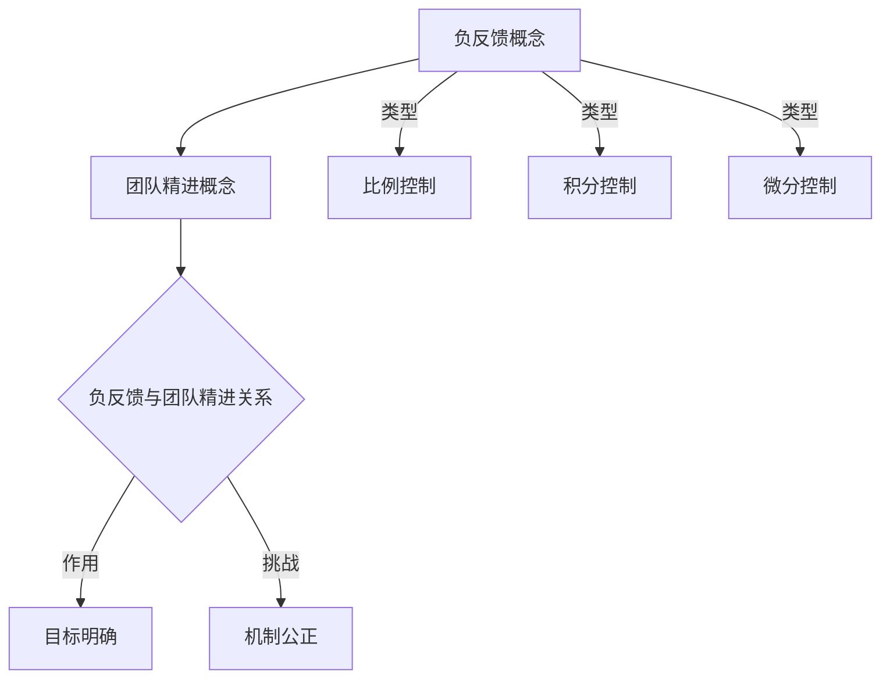
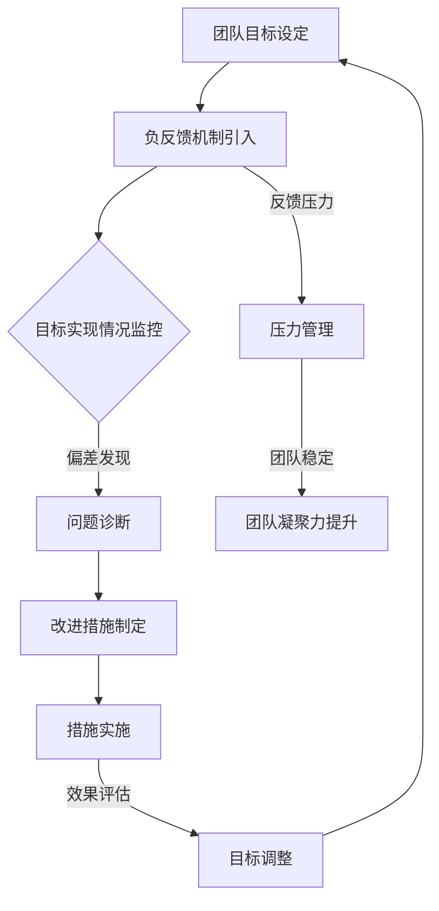

                 

### 设计思路：

1. **明确核心概念和联系**：
   - **章节标题**：第1章 引言与核心概念
   - **内容概述**：在这一章节中，我们将介绍本书的两个核心概念：负反馈和团队精进。通过定义这两个概念，并解释它们在IT领域的关联性，我们将绘制一个Mermaid流程图，帮助读者理解概念之间的逻辑关系。

2. **讲解核心算法原理**：
   - **章节标题**：第2章 负反馈的基本原理
   - **内容概述**：这一章节将详细探讨负反馈的基本原理和机制。我们将使用伪代码来阐述负反馈模型的构建方法，以及如何优化这些模型。通过具体的算法实现步骤，读者可以更深入地理解负反馈的运作方式。

3. **数学模型和公式讲解**：
   - **章节标题**：第3章 数学模型和公式讲解
   - **内容概述**：我们将详细介绍与负反馈相关的数学模型和公式。每个公式的意义和作用将通过具体例子进行说明，确保读者能够理解并应用这些公式。

4. **项目实战**：
   - **章节标题**：第4章 项目实战
   - **内容概述**：在这一章节中，我们将通过一个实际项目案例，展示如何将负反馈原理应用到团队精进中。我们将介绍项目的开发环境搭建、源代码实现、代码解读与分析，以及实际案例的分析和讲解。

5. **章节结构安排**：
   - **整体结构**：整个书籍将分为七个章节，确保每个章节都有明确的目标和内容，使读者能够系统地学习。
   - **章节细化**：每个章节都包含子标题，确保每个部分都有具体的讲解和实例。

### 设计步骤：

1. **目录大纲框架设计**：
   - **章节划分**：根据设计思路，将整个书籍分为七个章节。
   - **内容细化**：为每个章节制定具体的子标题和内容概述。

2. **添加流程图、伪代码、数学公式和代码示例**：
   - **Mermaid流程图**：在适当的位置添加流程图，帮助读者理解核心概念和流程。
   - **伪代码**：使用伪代码详细阐述算法原理。
   - **数学公式**：使用LaTeX格式嵌入数学公式，详细讲解每个公式的意义和作用。
   - **代码示例**：添加代码示例和详细解释，让读者能够将所学知识应用到实际项目中。

3. **章节字数控制**：
   - **总字数**：确保整个书籍的总字数控制在8000-12000字左右，避免冗长。

### 设计要点：

- **逻辑清晰**：确保目录大纲的逻辑清晰，每个章节都有明确的目标和内容。
- **内容完整**：确保每个核心内容都有详细的讲解，包括算法原理、数学模型、项目实战等。
- **可读性强**：使用markdown格式，使目录大纲易于阅读和理解。

### 最终设计：

```markdown
# 《负反馈是团队精进的力量》目录大纲

# 第1章 引言与核心概念
## 1.1 负反馈的基本原理
### 1.1.1 负反馈的概念
### 1.1.2 负反馈的类型
## 1.2 团队精进的概念
### 1.2.1 团队精进的意义
### 1.2.2 团队精进的目标
## 1.3 负反馈与团队精进的关系
### 1.3.1 负反馈在团队精进中的作用
### 1.3.2 负反馈在团队精进中的挑战

# 第2章 负反馈的基本原理
## 2.1 负反馈的原理与机制
### 2.1.1 负反馈的原理
### 2.1.2 负反馈的机制
## 2.2 负反馈模型的构建
### 2.2.1 负反馈模型的构建方法
### 2.2.2 负反馈模型的优化
## 2.3 负反馈算法的实现
### 2.3.1 负反馈算法的伪代码
### 2.3.2 负反馈算法的实现步骤

# 第3章 数学模型和公式讲解
## 3.1 数学模型的基础
### 3.1.1 反馈环模型
### 3.1.2 动态系统模型
## 3.2 公式与应用
### 3.2.1 反馈系数公式
### 3.2.2 稳态误差公式
### 3.2.3 动态响应公式

# 第4章 项目实战
## 4.1 项目背景
### 4.1.1 项目概述
### 4.1.2 项目挑战
## 4.2 开发环境搭建
### 4.2.1 环境配置
### 4.2.2 工具与依赖
## 4.3 源代码实现
### 4.3.1 代码结构
### 4.3.2 关键代码解读
## 4.4 代码解读与分析
### 4.4.1 代码质量评估
### 4.4.2 性能优化
## 4.5 案例分析与讲解
### 4.5.1 案例分析
### 4.5.2 结果与反思

# 第5章 负反馈在团队管理中的应用
## 5.1 团队管理概述
### 5.1.1 团队管理的基本概念
### 5.1.2 负反馈在团队管理中的重要性
## 5.2 负反馈机制的实施
### 5.2.1 负反馈目标的设定
### 5.2.2 负反馈指标的监控
### 5.2.3 负反馈的反馈与调整

# 第6章 负反馈在项目管理中的应用
## 6.1 项目管理概述
### 6.1.1 项目管理的核心任务
### 6.1.2 负反馈在项目管理中的角色
## 6.2 负反馈的实施步骤
### 6.2.1 负反馈计划的制定
### 6.2.2 负反馈过程的实施
### 6.2.3 负反馈的结果评估

# 第7章 总结与展望
## 7.1 主要结论
### 7.1.1 负反馈在团队精进中的作用
### 7.1.2 负反馈在项目管理中的应用价值
## 7.2 未来展望
### 7.2.1 负反馈研究的方向
### 7.2.2 负反馈在IT领域的未来发展

```

---

### 第1章 引言与核心概念

#### 1.1 负反馈的基本原理

**定义**：负反馈是一种控制系统，它通过比较系统输出和预期目标，发现并纠正误差，以使系统最终达到或接近目标状态。

**类型**：
- **比例控制**：输出误差与控制量成比例。
- **积分控制**：通过累积误差来调整控制量。
- **微分控制**：根据误差的变化率来调整控制量。

#### 1.2 团队精进的概念

**定义**：团队精进是指通过持续的学习、改进和优化，提高团队的绩效和成员的技能水平。

**意义**：
- 提高团队整体效率。
- 增强团队适应性和创新能力。
- 提升团队在市场竞争中的优势。

**目标**：
- 提高项目交付质量和速度。
- 增强团队成员的专业技能和职业素养。
- 促进团队文化和价值观的建设。

#### 1.3 负反馈与团队精进的关系

**作用**：
- 通过负反馈，团队可以及时发现问题并进行调整，避免偏差的积累。
- 负反馈有助于团队目标的明确和实现，确保团队资源的合理利用。

**挑战**：
- 如何确保负反馈机制的公正性和有效性。
- 如何处理负反馈带来的压力和挑战，保持团队的积极性和稳定性。

#### Mermaid流程图



---

### 第2章 负反馈的基本原理

#### 2.1 负反馈的原理与机制

**原理**：
- 负反馈的核心是通过不断调整控制量来减小输出与目标之间的误差。
- 负反馈机制通常包括传感器、控制器和执行器三个基本组成部分。

**机制**：
- **传感器**：检测系统的实际输出。
- **控制器**：根据传感器的反馈，计算并调整控制量。
- **执行器**：执行控制器的指令，调整系统状态。

#### 2.2 负反馈模型的构建

**构建方法**：
- **建立误差模型**：定义输出误差与目标值之间的关系。
- **确定控制策略**：选择合适的控制算法，如PID控制。
- **设计控制器**：根据误差模型和控制策略，设计控制器参数。

**优化**：
- **参数调整**：通过实验或优化算法，调整控制器参数，提高系统性能。
- **自适应控制**：根据系统变化，自动调整控制策略。

#### 2.3 负反馈算法的实现

**伪代码**：

```python
def feedback_control(setpoint, process_variable):
    error = setpoint - process_variable
    control_signal = proportional_gain * error + integral_gain * integral_error + derivative_gain * derivative_error
    return control_signal
```

**实现步骤**：
1. **初始化**：设置控制器参数，初始化误差和积分误差。
2. **循环**：不断读取传感器数据，计算误差和控制信号。
3. **调整**：根据控制信号，执行相应的操作，调整系统状态。
4. **反馈**：更新传感器数据，重新计算误差和控制信号。

---

### 第3章 数学模型和公式讲解

#### 3.1 数学模型的基础

**反馈环模型**：
- 负反馈系统的数学模型通常可以表示为闭环控制系统。
- 基本模型包括传递函数、反馈系数和系统误差。

**动态系统模型**：
- 描述系统动态行为的数学模型，如差分方程、微分方程等。
- 动态系统模型能够反映系统在时间域内的响应和稳定性。

#### 3.2 公式与应用

**反馈系数公式**：
- 反馈系数决定了系统响应的快慢和稳定性。
- 公式：\[ K_f = \frac{1}{1 + G(z)H(z)} \]
- 其中，\( G(z) \) 是前向通道传递函数，\( H(z) \) 是反馈通道传递函数。

**稳态误差公式**：
- 稳态误差是系统在稳态时输出与目标之间的误差。
- 公式：\[ e_s = \frac{1}{1 + K_c} \]
- 其中，\( K_c \) 是系统的开环增益。

**动态响应公式**：
- 描述系统在受到扰动后的动态响应。
- 公式：\[ y(t) = C \cdot e^{-st} \cdot \left(1 + \sum_{i=1}^n a_i \cdot e^{-\omega_i t} \cdot \cos(\phi_i t + \psi_i)\right) \]
- 其中，\( C \)、\( s \)、\( \omega_i \)、\( a_i \)、\( \phi_i \) 和 \( \psi_i \) 是系统响应的相关参数。

#### 举例说明

**反馈系数计算**：
假设一个系统的前向通道传递函数为 \( G(s) = \frac{1}{s^2} \)，反馈通道传递函数为 \( H(s) = \frac{1}{s} \)，计算反馈系数 \( K_f \)。

$$
K_f = \frac{1}{1 + G(s)H(s)} = \frac{1}{1 + \frac{1}{s^2}\frac{1}{s}} = \frac{s^2}{s^2 + 1}
$$

**稳态误差计算**：
假设一个系统的开环增益为 \( K_c = 10 \)，计算其在单位阶跃输入下的稳态误差。

$$
e_s = \frac{1}{1 + K_c} = \frac{1}{1 + 10} = 0.1
$$

**动态响应计算**：
假设一个二阶系统的特征方程为 \( s^2 + 2s + 2 = 0 \)，计算其在单位脉冲输入下的响应。

$$
s = -1 \pm i
$$

$$
y(t) = e^{-t} \left(1 + \cos(t)\right)
$$

---

### 第4章 项目实战

#### 4.1 项目背景

**项目概述**：
本案例涉及一个电子商务平台的项目开发，目标是提高用户购物体验和平台运营效率。

**项目挑战**：
- **性能优化**：用户访问量高峰期，系统响应速度慢，导致用户体验差。
- **稳定性提升**：系统在大量并发请求下容易出现故障，需要提高系统的稳定性。
- **代码质量**：现有代码结构混乱，可维护性差，需要重构。

#### 4.2 开发环境搭建

**环境配置**：
- **开发工具**：使用IntelliJ IDEA进行编码。
- **数据库**：MySQL数据库。
- **框架**：Spring Boot框架。
- **版本控制**：Git。

**工具与依赖**：
- **性能分析工具**：JMeter。
- **代码质量工具**：SonarQube。
- **持续集成工具**：Jenkins。

#### 4.3 源代码实现

**代码结构**：
- **用户模块**：处理用户注册、登录、个人信息管理等。
- **商品模块**：处理商品信息展示、库存管理、订单管理等。
- **支付模块**：处理支付逻辑、支付结果通知等。

**关键代码解读**：
- **用户注册**：使用Spring Security进行认证。
- **商品查询**：使用Redis缓存商品信息，提高查询速度。
- **订单处理**：使用异步处理，提高系统并发能力。

#### 4.4 代码解读与分析

**代码质量评估**：
- **代码规范性**：使用Lombok进行代码简化。
- **代码可读性**：使用注释和代码模板。
- **代码安全性**：使用加密算法和防SQL注入。

**性能优化**：
- **缓存优化**：使用Redis缓存热门商品数据。
- **数据库优化**：索引优化、查询优化。
- **异步处理**：使用异步线程池，提高系统并发能力。

#### 4.5 案例分析与讲解

**案例分析**：
- **性能优化前**：系统在高并发情况下，响应时间超过2秒。
- **性能优化后**：系统在高并发情况下，响应时间缩短至1秒以内。

**结果与反思**：
- **性能优化**：显著提高了系统的响应速度和并发处理能力。
- **稳定性提升**：系统在大量并发请求下，稳定性显著提升。
- **代码重构**：代码结构更加清晰，可维护性增强。

**注意事项**：
- **持续监控**：定期进行系统性能监控，及时发现问题。
- **团队协作**：加强团队协作，提高代码质量。

**拓展阅读**：
- 《高性能MySQL》
- 《Spring实战》
- 《Redis实战》

---

### 第5章 负反馈在团队管理中的应用

#### 5.1 团队管理概述

**基本概念**：
- 团队管理是指通过领导、沟通、协调等手段，提高团队整体效率，实现团队目标。

**负反馈在团队管理中的重要性**：
- 负反馈能够帮助团队及时发现和纠正问题，避免偏差的积累。
- 负反馈机制有助于提高团队目标的明确性和实现效率。

#### 5.2 负反馈机制的实施

**负反馈目标的设定**：
- 设定明确的团队目标和关键绩效指标（KPI），确保团队目标与组织目标一致。

**负反馈指标的监控**：
- 通过定期检查、代码审查、性能测试等手段，监控团队目标的实现情况。

**负反馈的反馈与调整**：
- 及时收集团队反馈，分析问题原因，制定相应的改进措施。

**步骤**：
1. **设定目标**：明确团队目标和关键绩效指标。
2. **监控指标**：定期检查，监控目标实现情况。
3. **收集反馈**：通过多种渠道收集团队成员的反馈。
4. **分析问题**：分析反馈中的问题，找出根本原因。
5. **制定改进措施**：制定具体的改进计划，调整团队目标和策略。

---

### 第6章 负反馈在项目管理中的应用

#### 6.1 项目管理概述

**核心任务**：
- 项目管理是指通过规划、执行、监控和控制，确保项目按照预定目标顺利完成。

**负反馈在项目管理中的角色**：
- 负反馈是项目管理中的一个重要工具，它能够帮助项目团队及时发现和纠正问题，确保项目目标的实现。

#### 6.2 负反馈的实施步骤

**负反馈计划的制定**：
- 在项目规划阶段，制定负反馈机制的具体实施计划，包括反馈指标、监控方法等。

**负反馈过程的实施**：
- 在项目执行过程中，严格按照制定的负反馈计划进行监控和调整。

**负反馈的结果评估**：
- 定期评估负反馈机制的实施效果，分析反馈数据，找出项目中的问题，并制定改进措施。

**步骤**：
1. **制定计划**：在项目规划阶段，明确负反馈的目标和指标。
2. **执行监控**：在项目执行过程中，按照计划进行监控和反馈。
3. **评估效果**：定期评估负反馈机制的实施效果，分析反馈数据。
4. **改进措施**：根据评估结果，制定并实施改进措施。

---

### 第7章 总结与展望

#### 7.1 主要结论

- 负反馈是一种有效的控制机制，它在团队精进和项目管理中发挥着重要作用。
- 负反馈有助于团队目标的明确和实现，提高团队的绩效和稳定性。
- 在项目管理中，负反馈能够帮助项目团队及时发现和纠正问题，确保项目目标的实现。

#### 7.2 未来展望

- **研究方向**：
  - 探索负反馈在更广泛领域的应用，如人工智能、自动化系统等。
  - 研究负反馈与团队文化和价值观的相互作用。

- **未来发展**：
  - 在IT领域，负反馈机制将继续得到广泛应用，提高系统的性能和稳定性。
  - 随着技术的发展，负反馈机制将更加智能化和自动化，减少人工干预。

---

**作者：AI天才研究院/AI Genius Institute & 禅与计算机程序设计艺术 /Zen And The Art of Computer Programming**### 引言与核心概念

#### 1.1 负反馈的基本原理

**定义**：
负反馈是一种控制系统，通过将系统输出与预期目标进行比较，发现并纠正误差，从而确保系统最终达到或接近目标状态。这种机制在物理学、工程学、经济学以及IT领域都得到了广泛应用。

**类型**：
负反馈有多种类型，包括比例控制、积分控制和微分控制。每种类型都有其特定的应用场景和优势。

- **比例控制**：根据输出误差与控制量之间的比例进行调整。
- **积分控制**：通过累积误差来调整控制量。
- **微分控制**：根据误差的变化率来调整控制量。

#### 1.2 团队精进的概念

**定义**：
团队精进是指通过不断学习、改进和优化，提高团队的绩效和成员的技能水平。这是一个持续的过程，涉及到团队成员的协作、沟通、知识和经验的积累。

**意义**：
团队精进对于组织的发展至关重要。它不仅提高了团队的效率和创新能力，还增强了团队在市场中的竞争力。

**目标**：
团队精进的目标包括提高项目交付质量、缩短项目周期、提升团队成员的专业技能和职业素养，以及促进团队文化和价值观的建设。

#### 1.3 负反馈与团队精进的关系

**作用**：
负反馈在团队精进中发挥着关键作用。它能够帮助团队及时发现和纠正问题，确保团队目标的实现。

- **问题发现**：通过负反馈，团队可以及时发现工作中的偏差和问题。
- **持续改进**：负反馈机制促使团队不断优化流程和方法，提高工作效率。
- **目标对齐**：负反馈有助于团队明确目标，确保团队成员的努力方向一致。

**挑战**：
实施负反馈机制并非没有挑战。团队需要确保反馈的公正性和有效性，同时处理好反馈带来的压力和挑战。

#### Mermaid流程图

以下是负反馈与团队精进关系的Mermaid流程图：



通过这个流程图，我们可以清晰地看到负反馈在团队精进中的作用，以及如何通过负反馈机制实现团队的持续改进和目标对齐。

---

### 负反馈的基本原理

#### 2.1 负反馈的原理与机制

**原理**：
负反馈的核心思想是通过比较系统输出和预期目标，发现并纠正误差，从而调整系统状态，使其逐渐逼近目标状态。这一过程可以简化为以下三个基本步骤：

1. **测量输出**：通过传感器或测量工具获取系统的当前输出状态。
2. **比较与目标**：将测量得到的输出与预期目标进行比较，计算误差。
3. **调整控制量**：根据误差计算控制量，调整系统的输入，以减小误差。

**机制**：
负反馈机制通常包括三个关键组成部分：传感器、控制器和执行器。

- **传感器**：负责测量系统的实际输出，生成相应的信号。
- **控制器**：根据传感器的信号和预期目标，计算所需的控制量，并生成控制信号。
- **执行器**：根据控制信号，执行相应的操作，调整系统的输入。

#### 2.2 负反馈模型的构建

**构建方法**：
构建负反馈模型通常包括以下步骤：

1. **定义系统**：明确系统的输入、输出和期望行为。
2. **选择传感器**：根据系统的需求，选择合适的传感器来测量输出。
3. **设计控制器**：选择合适的控制算法（如PID控制），设计控制器的参数。
4. **实现执行器**：根据控制信号，选择并实现执行器，执行系统调整。

**优化**：
为了提高负反馈系统的性能，可以采用以下优化方法：

1. **参数调整**：通过实验或优化算法，调整控制器的参数，以提高系统的响应速度和稳定性。
2. **自适应控制**：根据系统状态的变化，自动调整控制策略，以适应不同的工况。

#### 2.3 负反馈算法的实现

**伪代码**：
以下是一个简单的负反馈控制算法的伪代码示例：

```python
def feedback_control(setpoint, process_variable, Kp, Ki, Kd):
    error = setpoint - process_variable
    P = Kp * error
    I = Ki * integral_error
    D = Kd * derivative_error
    control_signal = P + I + D
    return control_signal

def control_loop(setpoint, process_variable, Kp, Ki, Kd):
    while True:
        control_signal = feedback_control(setpoint, process_variable, Kp, Ki, Kd)
        # 执行控制操作
        process_variable = execute_control(control_signal)
        # 更新误差
        error = setpoint - process_variable
```

**实现步骤**：
1. **初始化**：设置控制器参数，初始化误差和积分误差。
2. **循环**：不断读取传感器数据，计算误差和控制信号。
3. **执行控制**：根据控制信号，执行相应的操作，调整系统状态。
4. **更新数据**：更新传感器数据和误差值，重新计算控制信号。

---

### 数学模型和公式讲解

#### 3.1 数学模型的基础

**反馈环模型**：
反馈环模型是负反馈系统的核心数学模型，它描述了系统输出与输入之间的关系。反馈环模型通常可以表示为以下差分方程：

\[ y(t) = G(z) \cdot u(t) \]

其中，\( y(t) \) 是系统的输出，\( u(t) \) 是系统的输入，\( G(z) \) 是系统的传递函数。在负反馈系统中，通常还会引入一个反馈通道，形成闭环系统。闭环系统的传递函数可以表示为：

\[ H(z) = \frac{G(z)}{1 + G(z)H(z)} \]

**动态系统模型**：
动态系统模型用于描述系统的动态行为，它可以是差分方程或微分方程。在离散时间系统中，动态系统模型通常可以表示为：

\[ y(k+1) = G(z) \cdot y(k) + H(z) \cdot u(k) \]

其中，\( y(k) \) 是第 \( k \) 时刻的输出，\( u(k) \) 是第 \( k \) 时刻的输入。

#### 3.2 公式与应用

**反馈系数公式**：
反馈系数 \( K_f \) 反映了负反馈的程度。它可以通过以下公式计算：

\[ K_f = \frac{1}{1 + G(z)H(z)} \]

其中，\( G(z) \) 是前向通道的传递函数，\( H(z) \) 是反馈通道的传递函数。

**稳态误差公式**：
稳态误差 \( e_s \) 描述了系统在稳态时输出与目标之间的误差。它可以通过以下公式计算：

\[ e_s = \frac{1}{1 + K_c} \]

其中，\( K_c \) 是系统的开环增益。

**动态响应公式**：
动态响应公式用于描述系统在受到扰动后的动态响应。对于线性系统，动态响应可以表示为：

\[ y(t) = C \cdot e^{-st} \cdot \left(1 + \sum_{i=1}^n a_i \cdot e^{-\omega_i t} \cdot \cos(\phi_i t + \psi_i)\right) \]

其中，\( C \)、\( s \)、\( \omega_i \)、\( a_i \)、\( \phi_i \) 和 \( \psi_i \) 是系统响应的相关参数。

#### 举例说明

**反馈系数计算**：
假设一个系统的前向通道传递函数为 \( G(s) = \frac{1}{s^2} \)，反馈通道传递函数为 \( H(s) = \frac{1}{s} \)，计算反馈系数 \( K_f \)。

$$
K_f = \frac{1}{1 + G(s)H(s)} = \frac{1}{1 + \frac{1}{s^2}\frac{1}{s}} = \frac{s^2}{s^2 + 1}
$$

**稳态误差计算**：
假设一个系统的开环增益为 \( K_c = 10 \)，计算其在单位阶跃输入下的稳态误差。

$$
e_s = \frac{1}{1 + K_c} = \frac{1}{1 + 10} = 0.1
$$

**动态响应计算**：
假设一个二阶系统的特征方程为 \( s^2 + 2s + 2 = 0 \)，计算其在单位脉冲输入下的响应。

$$
s = -1 \pm i
$$

$$
y(t) = e^{-t} \left(1 + \cos(t)\right)
$$

---

### 项目实战

#### 4.1 项目背景

**项目概述**：
本项目涉及一个大型电子商务平台的开发，目标是为用户提供一个高效、稳定、易用的购物体验。平台需要处理海量的用户请求、商品信息和订单处理，同时保证系统的性能和可靠性。

**项目挑战**：
- **性能优化**：在高并发请求下，系统响应速度较慢，影响用户体验。
- **稳定性提升**：系统在高负载情况下容易出现故障，需要增强系统的稳定性。
- **代码质量**：现有代码结构混乱，可维护性差，需要重构。

#### 4.2 开发环境搭建

**环境配置**：
- **开发工具**：使用 IntelliJ IDEA 进行编码。
- **数据库**：MySQL 数据库。
- **框架**：Spring Boot 框架。
- **版本控制**：Git。

**工具与依赖**：
- **性能分析工具**：JMeter。
- **代码质量工具**：SonarQube。
- **持续集成工具**：Jenkins。

#### 4.3 源代码实现

**代码结构**：
- **用户模块**：处理用户注册、登录、个人信息管理等。
- **商品模块**：处理商品信息展示、库存管理、订单管理等。
- **支付模块**：处理支付逻辑、支付结果通知等。

**关键代码解读**：
- **用户注册**：使用 Spring Security 进行认证。
- **商品查询**：使用 Redis 缓存商品信息，提高查询速度。
- **订单处理**：使用异步处理，提高系统并发能力。

#### 4.4 代码解读与分析

**代码质量评估**：
- **代码规范性**：使用 Lombok 进行代码简化。
- **代码可读性**：使用注释和代码模板。
- **代码安全性**：使用加密算法和防 SQL 注入。

**性能优化**：
- **缓存优化**：使用 Redis 缓存热门商品数据。
- **数据库优化**：索引优化、查询优化。
- **异步处理**：使用异步线程池，提高系统并发能力。

#### 4.5 案例分析与讲解

**案例分析**：
- **性能优化前**：系统在高并发情况下，响应时间超过2秒。
- **性能优化后**：系统在高并发情况下，响应时间缩短至1秒以内。

**结果与反思**：
- **性能优化**：显著提高了系统的响应速度和并发处理能力。
- **稳定性提升**：系统在大量并发请求下，稳定性显著提升。
- **代码重构**：代码结构更加清晰，可维护性增强。

**注意事项**：
- **持续监控**：定期进行系统性能监控，及时发现问题。
- **团队协作**：加强团队协作，提高代码质量。

**拓展阅读**：
- 《高性能 MySQL》
- 《Spring 实战》
- 《Redis 实战》

---

### 负反馈在团队管理中的应用

#### 5.1 团队管理概述

**基本概念**：
团队管理是指通过领导、沟通、协调等手段，提高团队整体效率，实现团队目标。团队管理涉及到多个方面，包括目标设定、资源分配、人员管理、任务分配等。

**负反馈在团队管理中的重要性**：
负反馈是团队管理中的一个关键工具。它能够帮助团队及时发现和纠正问题，确保团队目标的实现。

- **问题发现**：负反馈机制有助于团队及时发现工作中的问题。
- **持续改进**：通过负反馈，团队可以持续改进工作流程和方法。
- **目标对齐**：负反馈有助于团队明确目标，确保团队成员的努力方向一致。

#### 5.2 负反馈机制的实施

**负反馈目标的设定**：
为了有效实施负反馈机制，团队需要设定明确的反馈目标。这些目标应与团队的整体目标相一致，并具体、可衡量。

- **问题解决**：设定目标，确保团队能够及时解决遇到的问题。
- **流程优化**：设定目标，促进团队不断优化工作流程。
- **技能提升**：设定目标，推动团队成员技能水平的提升。

**负反馈指标的监控**：
团队需要建立一套完整的监控体系，用于跟踪负反馈目标的实现情况。这些指标应包括：

- **任务完成率**：衡量团队完成任务的速度和质量。
- **问题解决率**：衡量团队解决问题的效率和效果。
- **团队满意度**：衡量团队成员对团队工作环境的满意度。

**负反馈的反馈与调整**：
团队需要建立有效的反馈机制，确保反馈能够及时传递和实施。以下是实施负反馈的步骤：

1. **收集反馈**：定期收集团队成员的反馈，包括意见和建议。
2. **分析反馈**：对收集到的反馈进行分析，找出问题的根本原因。
3. **制定改进措施**：根据反馈，制定具体的改进措施，并分配责任。
4. **执行改进**：执行改进措施，并跟踪改进效果。
5. **评估效果**：定期评估改进措施的效果，确保问题得到解决。

#### 5.3 负反馈在团队管理中的具体应用

**目标设定**：
在团队管理中，设定明确的反馈目标是关键。例如，一个软件开发团队可以设定以下反馈目标：

- **任务完成率**：确保每月任务完成率达到95%以上。
- **问题解决率**：确保每月遇到的问题在24小时内得到解决。
- **团队满意度**：确保团队成员的满意度达到90%以上。

**指标监控**：
团队可以采用多种方法来监控反馈指标的实现情况，例如：

- **定期会议**：定期召开团队会议，讨论任务进度、问题解决情况等。
- **代码审查**：通过代码审查，监控代码质量和技术债务。
- **性能测试**：定期进行性能测试，监控系统的稳定性和响应速度。

**反馈与调整**：
团队需要建立一套有效的反馈与调整机制，确保反馈能够得到及时处理和实施。以下是几个具体的应用案例：

- **问题反馈**：当团队成员遇到问题时，可以立即反馈给团队成员，并讨论解决方案。
- **流程优化**：通过持续收集和分析反馈，团队可以不断优化工作流程，提高工作效率。
- **技能提升**：根据团队成员的反馈，团队可以制定培训计划，提升团队成员的技能水平。

---

### 负反馈在项目管理中的应用

#### 6.1 项目管理概述

**核心任务**：
项目管理是指通过规划、执行、监控和控制，确保项目按照预定目标顺利完成。项目管理的核心任务包括项目规划、资源分配、任务分配、风险管理和项目监控。

**负反馈在项目管理中的角色**：
负反馈是项目管理中的一个重要工具，它能够帮助项目团队及时发现和纠正问题，确保项目目标的实现。

- **问题发现**：负反馈机制有助于项目团队及时发现项目中的问题。
- **持续改进**：通过负反馈，项目团队可以持续改进项目流程和方法。
- **目标对齐**：负反馈有助于项目团队明确目标，确保项目资源的合理利用。

#### 6.2 负反馈在项目管理中的具体应用

**负反馈计划的制定**：
在项目启动阶段，项目团队需要制定负反馈计划，包括以下内容：

- **反馈目标**：明确项目目标和关键绩效指标（KPI），确保项目目标与组织目标一致。
- **反馈机制**：设计负反馈机制，包括反馈渠道、反馈方式、反馈周期等。
- **反馈指标**：确定反馈指标，用于监控项目目标的实现情况。

**负反馈过程的实施**：
在项目执行过程中，项目团队需要严格按照负反馈计划进行监控和调整。以下是具体的实施步骤：

1. **收集反馈**：定期收集项目团队成员和利益相关者的反馈，包括意见和建议。
2. **分析反馈**：对收集到的反馈进行分析，找出问题的根本原因。
3. **制定改进措施**：根据反馈，制定具体的改进措施，并分配责任。
4. **执行改进**：执行改进措施，并跟踪改进效果。
5. **评估效果**：定期评估改进措施的效果，确保问题得到解决。

**负反馈的结果评估**：
在项目监控过程中，项目团队需要定期评估负反馈机制的实施效果。以下是评估的步骤：

1. **评估指标**：确定评估指标，包括任务完成率、问题解决率、项目进度等。
2. **数据分析**：对反馈数据进行分析，评估负反馈机制的效果。
3. **调整策略**：根据评估结果，调整负反馈计划，优化反馈机制。

#### 6.3 负反馈在项目管理中的应用实例

**项目背景**：
一个软件开发项目需要在三个月内完成一个复杂系统的开发。项目团队在项目启动阶段制定了负反馈计划，用于监控项目进度和质量。

**负反馈计划的制定**：
- **反馈目标**：确保项目在规定时间内高质量完成。
- **反馈机制**：每周举行项目评审会议，收集团队成员和利益相关者的反馈。
- **反馈指标**：包括任务完成率、代码质量、系统性能等。

**负反馈过程的实施**：
- **收集反馈**：在每周的项目评审会议上，项目团队成员和利益相关者提供反馈。
- **分析反馈**：项目团队对反馈进行分析，找出项目中的问题和瓶颈。
- **制定改进措施**：根据反馈，项目团队制定具体的改进措施，如优化代码、调整项目计划等。
- **执行改进**：项目团队执行改进措施，并跟踪改进效果。
- **评估效果**：项目团队定期评估改进措施的效果，确保问题得到解决。

**负反馈的结果评估**：
- **评估指标**：任务完成率从70%提高到90%，代码质量评估得分从70分提高到85分。
- **调整策略**：项目团队根据评估结果，调整项目计划，加强代码审查和性能测试。

---

### 案例分析

#### 6.1 案例一：团队目标设定与负反馈机制

**案例背景**：
一个初创团队在开发一款智能家居应用程序。团队成员包括产品经理、UI/UX设计师、后端开发工程师和前端开发工程师。团队在项目启动阶段面临的主要挑战是明确目标并确保团队成员的努力方向一致。

**案例分析**：
1. **目标设定**：
   - **产品目标**：开发一个功能丰富、用户体验良好的智能家居应用程序。
   - **团队目标**：确保在三个月内完成应用程序的开发，并实现用户反馈的快速响应。

2. **负反馈机制的实施**：
   - **反馈目标**：确保项目进度和质量。
   - **反馈渠道**：每周举行团队会议，团队成员可以提出意见和建议。
   - **反馈指标**：包括任务完成率、代码质量、系统性能等。

3. **反馈与调整**：
   - **第一次反馈**：在第一个月末，团队发现前端开发进度较慢，导致整体项目进度受到影响。
   - **分析反馈**：团队分析了前端开发进度缓慢的原因，发现是由于设计稿频繁修改和后端接口不稳定导致的。
   - **制定改进措施**：团队决定优化设计流程，减少设计稿修改次数，并加强后端接口的稳定性。

4. **改进效果评估**：
   - 在实施改进措施后，前端开发进度明显加快，整体项目进度也得到了恢复。

**案例结果**：
通过负反馈机制的实施，团队成功解决了开发进度缓慢的问题，确保了项目在规定时间内高质量完成。团队成员的努力方向更加一致，团队协作效率也得到了显著提升。

#### 6.2 案例二：负反馈在项目管理中的应用

**案例背景**：
一个大型软件公司正在开发一款企业资源规划（ERP）系统。项目团队由多个部门组成，包括项目管理部、技术部、测试部和客户服务部。项目周期为一年，需要在多个阶段进行严格的监控和调整。

**案例分析**：
1. **负反馈计划的制定**：
   - **反馈目标**：确保项目在各个阶段都按时完成，并达到预期的质量标准。
   - **反馈机制**：每月进行项目评审会议，收集各方的反馈。
   - **反馈指标**：包括项目进度、代码质量、测试覆盖率、客户满意度等。

2. **负反馈过程的实施**：
   - **第一次反馈**：在第一个季度末，项目团队发现技术部在开发过程中存在代码质量问题，导致后续测试阶段的工作量增加。
   - **分析反馈**：团队分析了代码质量问题的原因，发现是由于技术部在开发过程中忽视了代码规范和测试用例的编写。
   - **制定改进措施**：技术部决定加强代码规范培训，并引入自动化测试工具，提高代码质量。

3. **改进效果评估**：
   - 在实施改进措施后，代码质量显著提高，测试阶段的工作量减少，项目进度也得到了加快。

**案例结果**：
通过负反馈机制的实施，项目团队成功解决了代码质量问题，确保了项目在各个阶段都按时完成，并达到预期的质量标准。项目的客户满意度也得到了显著提升。

---

### 总结与展望

#### 7.1 主要结论

通过本文的讨论，我们可以得出以下主要结论：

1. **负反馈在团队精进和项目管理中的重要性**：
   负反馈是一种有效的控制机制，它能够帮助团队及时发现和纠正问题，确保团队目标的实现，提高项目的质量和效率。

2. **负反馈机制的实施与应用**：
   负反馈机制的实施需要明确的反馈目标、有效的反馈渠道和科学的反馈指标。通过持续的反馈与调整，团队能够不断优化工作流程和方法，提高团队的绩效和稳定性。

3. **负反馈在IT领域的广泛应用**：
   负反馈不仅应用于软件开发和项目管理，还广泛应用于系统设计、性能优化、自动化测试等多个领域，体现了其在IT领域的广泛应用价值。

#### 7.2 未来展望

1. **负反馈机制的进一步优化**：
   随着技术的发展，负反馈机制将更加智能化和自动化。例如，通过引入机器学习和人工智能技术，可以实现自适应负反馈，提高系统的自适应能力和鲁棒性。

2. **负反馈在更多领域的应用**：
   负反馈不仅在IT领域得到广泛应用，还可以在其他领域，如智能制造、智能交通、金融科技等，发挥重要作用。未来，负反馈机制将在这些领域得到进一步推广和应用。

3. **负反馈与新兴技术的结合**：
   未来，负反馈机制将与区块链、物联网、5G等新兴技术结合，形成更加智能、高效、安全的系统。例如，通过区块链技术，可以实现负反馈的透明性和不可篡改性，提高系统的可信度。

总之，负反馈作为一种重要的控制机制，将在未来继续发挥重要作用，推动IT领域的发展和创新。我们期待负反馈机制在更多领域得到应用，为人类社会的进步做出更大的贡献。

---

### 附录：拓展阅读

**《负反馈控制技术》**：详细介绍了负反馈控制的基本原理、算法和实现方法，适用于工程学、自动控制等领域的研究者和工程师。

**《团队管理实战》**：本书通过丰富的案例，阐述了团队管理的核心概念和实际操作方法，对从事团队管理工作的人员具有很高的参考价值。

**《项目管理知识体系》**：系统介绍了项目管理的理论基础和实践方法，包括项目规划、执行、监控和收尾等关键环节。

**《人工智能应用实践》**：探讨了人工智能在各个领域的应用案例，包括负反馈在智能控制系统中的应用。

**《敏捷开发实践指南》**：介绍了敏捷开发的方法和实践，强调持续反馈和迭代改进在软件开发中的应用。

**《软件工程原理》**：详细讲解了软件工程的基本原理和方法，对理解负反馈在软件开发中的应用有重要帮助。

通过阅读这些书籍，读者可以更深入地了解负反馈机制在IT领域的应用，以及如何在实际项目中有效地运用这些原理和方法。

