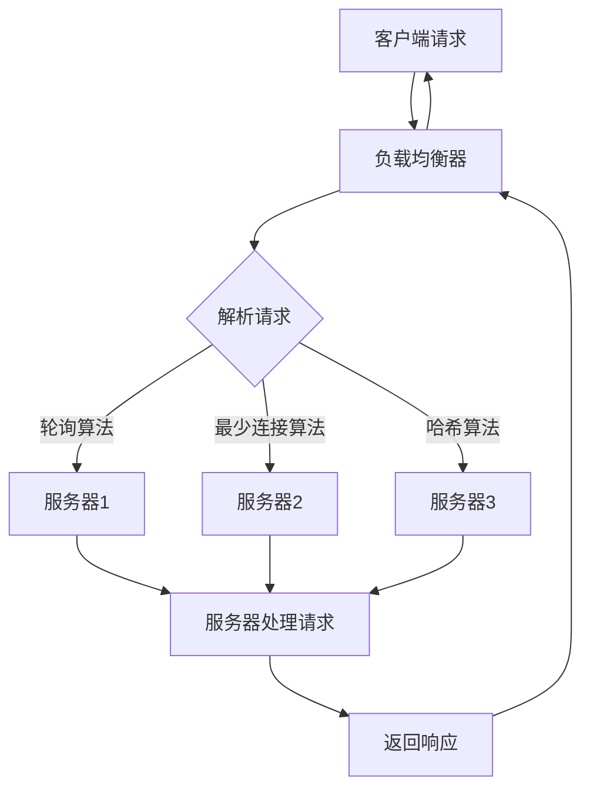

                 

### 文章标题

### 负载均衡算法与实践

#### 关键词：负载均衡，算法，实践，性能优化，分布式系统

#### 摘要：

本文旨在深入探讨负载均衡算法及其在现实项目中的应用。首先，我们将介绍负载均衡的基本概念，并分析其重要性以及面临的常见挑战。随后，通过架构图展示负载均衡器的工作原理。接下来，我们将重点讲解三种核心的负载均衡算法——轮询、最少连接和哈希算法，分别使用伪代码和数学模型进行详细阐述。文章的后半部分将聚焦于负载均衡的性能优化策略，结合实际案例展示如何搭建开发环境、实现源代码以及进行代码解读与分析。最后，我们将探讨负载均衡在分布式系统中的应用，提供最佳实践和总结。

### 第1章：负载均衡简介

#### 1.1 负载均衡的基本概念

负载均衡（Load Balancing）是一种用于分配计算机工作负载的技术，旨在优化资源利用率和提升系统性能。它通过将请求分配到多个服务器或节点上，确保没有任何一个服务器过载，从而达到平衡负载的目的。负载均衡不仅能够提高系统的可靠性，还能够提升整体响应速度。

在分布式系统中，随着服务规模的不断扩大，负载均衡变得尤为重要。它可以防止单点故障，提高系统的扩展性和容错能力。此外，负载均衡还可以通过智能调度，优化网络流量，减少响应时间，提升用户体验。

#### 1.2 负载均衡的重要性

负载均衡在分布式系统中的重要性主要体现在以下几个方面：

1. **提升系统性能**：通过将请求分配到多个服务器上，负载均衡能够降低单个服务器的负载，提高系统的处理能力。
   
2. **提高系统可靠性**：负载均衡可以防止单点故障，确保系统在某一服务器发生故障时仍能正常运行。
   
3. **优化资源利用**：负载均衡能够根据服务器的实时负载情况，动态调整请求分配，使得资源利用率达到最优。
   
4. **提高可用性**：通过在多个服务器间分配负载，负载均衡可以提高系统的可用性，确保服务的持续可用。

#### 1.3 负载均衡的常见挑战

尽管负载均衡具有诸多优点，但在实际应用中仍面临一些挑战：

1. **负载不均**：如果负载均衡算法不够智能，可能会导致部分服务器负载过重，而其他服务器资源闲置。
   
2. **单点故障**：负载均衡器本身可能成为单点故障的源头，如果未能妥善解决，会影响整个系统的可靠性。
   
3. **网络延迟**：负载均衡器的引入可能会增加网络延迟，影响系统的响应速度。
   
4. **安全性**：负载均衡器的存在可能会暴露系统的更多细节，增加安全风险。

下一章，我们将深入探讨负载均衡的架构，并通过Mermaid流程图展示其工作原理。这将帮助我们更好地理解负载均衡的核心概念和实现机制。

### 第2章：负载均衡架构

#### 2.1 负载均衡器的工作原理

负载均衡器是负责将客户端请求分配到多个服务器或节点上的关键组件。它通常位于网络边缘，介于客户端和后端服务器之间。负载均衡器通过一系列策略和算法，如轮询、最少连接、哈希等，动态地将请求分配到不同的服务器上。

工作原理大致可以分为以下几个步骤：

1. **接收请求**：负载均衡器首先接收到客户端的请求，并将其解析为具体的请求信息，如URL、HTTP方法等。

2. **选择服务器**：根据设定的策略和算法，负载均衡器决定将请求分配到哪个服务器上。这个过程可能涉及以下因素：

   - 服务器的当前负载情况
   - 服务器的处理能力
   - 服务器的健康状态
   - 历史请求记录

3. **转发请求**：负载均衡器将请求转发到选定的服务器上，并等待服务器的响应。

4. **返回响应**：服务器处理完请求后，将结果返回给负载均衡器，由负载均衡器再将结果返回给客户端。

5. **持续监控**：负载均衡器会持续监控服务器的状态，并根据监控结果调整策略和算法，以确保负载均衡的持续有效性。

#### 2.2 硬件负载均衡器与软件负载均衡器的比较

负载均衡器可以根据实现方式分为硬件负载均衡器和软件负载均衡器。

**硬件负载均衡器**：

- **特点**：硬件负载均衡器通常采用专用硬件设备，具有高性能和高可靠性。它们通常具备以下特点：

  - **高速处理**：硬件负载均衡器具备快速的数据处理能力，能够高效处理大量请求。
  - **高可靠性**：硬件负载均衡器采用冗余设计，能够在某一部件发生故障时自动切换到备用部件，确保系统的高可用性。
  - **高安全性**：硬件负载均衡器通常具备高级安全功能，如SSL卸载、DOS攻击防护等。

- **适用场景**：硬件负载均衡器适用于需要高性能和高可靠性的大型分布式系统，如电商平台、云服务提供商等。

**软件负载均衡器**：

- **特点**：软件负载均衡器通常以软件形式部署在通用服务器上，具备以下特点：

  - **灵活性强**：软件负载均衡器可以灵活部署在各种操作系统和硬件平台上，方便进行扩展和升级。
  - **成本低**：软件负载均衡器无需额外购买硬件设备，降低系统的整体成本。
  - **易于维护**：软件负载均衡器的维护和管理相对简单，可以通过远程方式进行操作。

- **适用场景**：软件负载均衡器适用于中小型分布式系统，特别是那些预算有限且需求较为简单的系统。

#### 2.3 负载均衡的拓扑结构

负载均衡的拓扑结构决定了负载均衡器的部署方式和工作模式。常见的负载均衡拓扑结构包括以下几种：

1. **线性负载均衡**：线性负载均衡是最简单的负载均衡结构，将请求依次分配到各个服务器上。当服务器数量增加时，线性负载均衡器能够自动扩展处理能力。

2. **环形负载均衡**：环形负载均衡将请求在多个负载均衡器之间循环转发，从而实现负载均衡。这种结构适用于负载均衡器需要高可用性的场景。

3. **网格负载均衡**：网格负载均衡将多个负载均衡器组织成一个分布式网格，每个负载均衡器都负责一部分请求的转发。这种结构能够提高系统的容错能力和扩展性。

4. **集群负载均衡**：集群负载均衡将多个服务器组织成一个集群，每个服务器都负责一部分请求的处理。负载均衡器通过监控集群状态，动态调整请求分配，从而实现负载均衡。

#### 2.4 Mermaid流程图：负载均衡架构

为了更直观地展示负载均衡器的工作原理，我们使用Mermaid流程图来描述其架构。



在这个流程图中，客户端请求首先发送到负载均衡器，负载均衡器根据设定的策略选择服务器进行处理，并将响应返回给客户端。

下一章，我们将详细探讨轮询算法，这是负载均衡中最简单也是最常用的算法之一。

### 第3章：轮询算法

#### 3.1 轮询算法原理

轮询算法（Round-Robin）是最简单、应用最广泛的负载均衡算法之一。它的基本原理是将请求按顺序分配到各个服务器上，就像轮盘上的指针一样，每次旋转指针指向下一个服务器。

**工作流程**：

1. **初始化**：首先，将服务器按照一定的顺序排列。初始化时，指针指向第一个服务器。

2. **接收请求**：当接收到客户端请求时，检查当前指针所指的服务器是否可用。如果服务器可用，则将请求转发给该服务器。

3. **更新指针**：每次转发请求后，将指针向前移动一位，指向下一个服务器。如果指针移动到末尾，则重新指向第一个服务器。

4. **重复步骤2和3**：不断循环执行步骤2和3，将请求分配到各个服务器上。

**伪代码实现**：

```python
# 初始化服务器列表
servers = ["server1", "server2", "server3"]

# 初始化指针位置
pointer = 0

# 轮询算法
while True:
    # 检查当前指针所指的服务器是否可用
    server = servers[pointer]
    if is_server_available(server):
        # 将请求转发给当前服务器
        forward_request_to_server(server)
        # 更新指针位置
        pointer = (pointer + 1) % len(servers)
    else:
        # 如果服务器不可用，跳过当前服务器，继续检查下一个服务器
        pointer = (pointer + 1) % len(servers)
```

**判断服务器是否可用**：

在上述伪代码中，`is_server_available`函数用于判断服务器是否可用。这通常取决于服务器的当前负载、处理能力以及健康状态。如果服务器不可用，轮询算法会跳过当前服务器，继续检查下一个服务器。

#### 3.2 优缺点分析

**优点**：

1. **简单易实现**：轮询算法的实现非常简单，易于理解和部署。

2. **无状态**：轮询算法不需要维护任何状态信息，可以方便地扩展和升级。

3. **公平性**：轮询算法能够公平地将请求分配到各个服务器上，避免某台服务器过载。

**缺点**：

1. **负载不均**：在服务器性能不均匀的情况下，轮询算法可能导致部分服务器负载过重，而其他服务器资源闲置。

2. **单点故障**：如果轮询算法依赖的单个服务器发生故障，整个系统将无法正常工作。

3. **网络延迟**：轮询算法可能会导致请求在服务器之间传递的时间增加，从而增加网络延迟。

#### 3.3 应用场景

轮询算法适用于以下场景：

1. **小型系统**：对于负载较为均匀、服务器性能相对稳定的小型系统，轮询算法是一个简单有效的选择。

2. **临时解决方案**：在系统进行升级或维护时，可以临时使用轮询算法来分配负载。

3. **基础架构测试**：在测试负载均衡器的基础架构和性能时，轮询算法可以作为一个简单的基准算法。

下一章，我们将详细探讨最少连接算法，这是一种根据服务器当前连接数进行负载均衡的算法。

### 第4章：最少连接算法

#### 4.1 最少连接算法原理

最少连接算法（Least Connections）是一种根据服务器当前连接数进行负载均衡的算法。它的基本原理是将新的请求分配给当前连接数最少的服务器，从而避免某台服务器过载。

**工作流程**：

1. **初始化**：首先，将服务器按照当前连接数进行排序。

2. **接收请求**：当接收到客户端请求时，检查当前连接数最少的服务器。

3. **分配请求**：将请求转发给当前连接数最少的服务器。

4. **更新连接数**：服务器处理完请求后，更新当前连接数。

5. **重复步骤2-4**：不断循环执行步骤2-4，将请求分配到各个服务器上。

**伪代码实现**：

```python
# 初始化服务器列表
servers = [{"host": "server1", "connections": 0}, {"host": "server2", "connections": 1}, {"host": "server3", "connections": 2}]

# 排序服务器列表
servers.sort(key=lambda x: x["connections"])

# 最少连接算法
while True:
    # 获取当前连接数最少的服务器
    server = servers[0]
    # 将请求转发给当前服务器
    forward_request_to_server(server["host"])
    # 更新当前服务器的连接数
    server["connections"] += 1
    # 重新排序服务器列表
    servers.sort(key=lambda x: x["connections"])
```

**更新连接数**：

在上述伪代码中，每次转发请求后，都会更新当前服务器的连接数。这可以通过在服务器端维护一个连接计数器来实现。

#### 4.2 优缺点分析

**优点**：

1. **优化资源利用**：最少连接算法能够根据服务器的当前连接数进行负载均衡，避免某台服务器过载，从而优化资源利用。

2. **减少响应时间**：由于连接数较少的服务器通常负载较轻，最少连接算法能够减少请求的响应时间。

**缺点**：

1. **状态依赖**：最少连接算法需要维护服务器的当前连接数，这使得算法较为复杂，且存在状态依赖问题。

2. **高延迟**：在服务器数量较多时，更新连接数和重新排序的时间可能会增加，从而增加系统的延迟。

#### 4.3 应用场景

最少连接算法适用于以下场景：

1. **高并发场景**：在处理高并发请求的场景中，最少连接算法能够有效地优化资源利用，提高系统的稳定性。

2. **性能敏感场景**：对于对响应时间要求较高的场景，如在线交易、实时通信等，最少连接算法可以减少请求的响应时间。

3. **分布式系统**：在分布式系统中，最少连接算法可以有效地分配请求，确保系统的高可用性和高性能。

下一章，我们将探讨哈希算法，这是一种基于哈希函数进行负载均衡的算法。

### 第5章：哈希算法

#### 5.1 哈希算法原理

哈希算法（Hashing）是一种根据请求的特征（如客户端IP地址、URL等）计算出一个哈希值，然后根据哈希值将请求分配到相应服务器的算法。哈希算法的核心思想是通过哈希函数将请求映射到服务器上，从而实现负载均衡。

**哈希算法的基本步骤**：

1. **选择哈希函数**：哈希函数用于将请求特征映射到哈希值。常见的哈希函数有MD5、SHA-1等。

2. **计算哈希值**：对于每个请求，使用哈希函数计算出一个哈希值。

3. **映射到服务器**：将哈希值映射到服务器列表中的某一服务器上。通常使用取模运算（%）来实现映射。

**伪代码实现**：

```python
# 初始化服务器列表
servers = ["server1", "server2", "server3"]

# 哈希函数示例
def hash_function(key):
    return hash(key) % len(servers)

# 哈希算法
while True:
    # 接收请求
    request_key = get_request_key()
    # 计算哈希值
    hash_value = hash_function(request_key)
    # 将请求转发给对应的服务器
    forward_request_to_server(servers[hash_value])
```

**处理哈希冲突**：

哈希冲突是指多个请求映射到同一哈希值的情况。处理哈希冲突的方法包括：

- **线性探测法**：当发生哈希冲突时，依次探测下一个哈希值，直到找到一个空闲的服务器。
- **再哈希法**：为每个请求计算多个哈希值，当发生冲突时，使用下一个预计算的哈希值。
- **链地址法**：将具有相同哈希值的请求映射到同一服务器上的链表中，从而解决冲突。

#### 5.2 哈希策略：一致性哈希

一致性哈希（Consistent Hashing）是一种改进的哈希算法，旨在解决传统哈希算法在服务器数量变化时的不稳定性问题。一致性哈希通过引入虚拟节点，实现服务器的动态扩展和迁移。

**一致性哈希的基本原理**：

1. **虚拟节点**：在每个实际服务器上创建多个虚拟节点。虚拟节点的哈希值均匀分布在哈希环上。

2. **哈希环**：将所有虚拟节点的哈希值按照顺序排列在一个哈希环上。

3. **请求分配**：对于每个请求，使用哈希函数计算哈希值，然后在哈希环上找到对应的服务器。如果请求的哈希值落在多个虚拟节点之间，选择靠近请求哈希值最近的虚拟节点对应的服务器。

**伪代码实现**：

```python
# 初始化服务器列表和虚拟节点列表
servers = ["server1", "server2", "server3"]
virtual_nodes = []

# 计算虚拟节点
def calculate_virtual_nodes(server, num_nodes):
    virtual_nodes.append({"server": server, "hash": hash_function(server)})
    for i in range(1, num_nodes):
        virtual_nodes.append({"server": server, "hash": (hash_function(server) + i) % MAX_HASH})

# 哈希函数示例
def hash_function(key):
    return hash(key) % MAX_HASH

# 一致性哈希算法
while True:
    # 接收请求
    request_key = get_request_key()
    # 计算哈希值
    hash_value = hash_function(request_key)
    # 在哈希环上找到对应的服务器
    virtual_node = find_virtual_node(virtual_nodes, hash_value)
    # 将请求转发给对应的服务器
    forward_request_to_server(virtual_node["server"])
```

**一致性哈希的优势**：

1. **动态扩展**：在添加或删除服务器时，只需调整虚拟节点的位置，而无需重新计算所有请求的哈希值。

2. **负载均衡**：通过虚拟节点和哈希环，一致性哈希能够实现更均匀的负载分配。

3. **容错性**：即使某个服务器或虚拟节点发生故障，也不会影响其他虚拟节点和请求的分配。

#### 5.3 优缺点分析

**优点**：

1. **负载均衡**：哈希算法能够实现更均匀的负载分配，避免某台服务器过载。

2. **动态扩展**：一致性哈希支持服务器的动态扩展和迁移，提高系统的灵活性和可扩展性。

3. **高效性**：哈希算法的计算速度快，能够快速分配请求。

**缺点**：

1. **状态依赖**：哈希算法需要维护哈希环和虚拟节点等信息，存在状态依赖问题。

2. **哈希冲突**：尽管一致性哈希能够减少哈希冲突，但在某些情况下仍然可能发生冲突。

3. **网络延迟**：哈希算法可能在服务器之间传递请求，增加网络延迟。

#### 5.4 应用场景

哈希算法适用于以下场景：

1. **高并发场景**：在处理高并发请求的场景中，哈希算法能够实现更均匀的负载分配，提高系统的稳定性。

2. **分布式系统**：在分布式系统中，哈希算法可以用于路由、缓存、数据库等模块，实现高效的请求分配。

3. **缓存系统**：在缓存系统中，哈希算法可以用于将缓存数据分配到多个缓存节点上，提高缓存系统的性能。

下一章，我们将讨论负载均衡与分布式系统的关系，并探讨在分布式系统中如何应用负载均衡技术。

### 第6章：负载均衡与分布式系统

#### 6.1 分布式系统概述

分布式系统是由多个计算机节点组成的系统，这些节点通过网络进行通信和协作，共同完成一个任务或提供一项服务。分布式系统的关键特点是分散性、容错性和可扩展性。通过将任务分布在多个节点上，分布式系统可以提高计算能力和性能，同时增强系统的可靠性和可用性。

**分布式系统的基本架构**：

1. **节点**：节点是分布式系统中的基本计算单元，可以是物理服务器或虚拟机。每个节点都有自己的处理器、内存和存储资源。

2. **网络**：网络连接各个节点，允许节点之间进行通信和协同工作。网络质量对系统的性能和稳定性有重要影响。

3. **协调器**：协调器（如分布式锁服务、分布式队列等）用于协调节点间的操作，确保分布式系统的一致性和协调性。

**分布式系统的优点**：

1. **可扩展性**：分布式系统可以通过增加节点来扩展计算能力，适应不断增长的服务需求。

2. **容错性**：分布式系统中的节点相互独立，单个节点的故障不会影响整个系统的运行。

3. **高可用性**：通过将任务分布在多个节点上，分布式系统可以提供持续的服务，即使某些节点发生故障。

#### 6.2 负载均衡在分布式系统中的应用

负载均衡在分布式系统中扮演着关键角色，其目标是在多个节点间分配负载，确保每个节点都能高效地处理请求。负载均衡技术可以应用于分布式系统的多个层面，如应用层、网络层和存储层。

**应用层面**：

1. **服务发现**：负载均衡器可以与服务发现机制集成，动态获取服务实例列表，根据负载情况将请求分配到不同的实例上。

2. **动态路由**：通过动态路由算法，负载均衡器可以根据服务实例的负载和健康状态，将请求路由到最适合的实例上。

3. **会话保持**：在需要维持用户会话的场景中，负载均衡器可以使用会话保持策略，如基于源IP地址或会话ID，确保用户请求总是分配到同一个实例上。

**网络层面**：

1. **反向代理**：负载均衡器可以作为反向代理，接收客户端请求，然后将请求转发到后端的服务节点。这种方式可以隐藏后端服务节点的具体位置，提高系统的安全性。

2. **链路负载均衡**：在多个网络链路连接的情况下，负载均衡器可以动态分配网络流量，确保每个链路都能高效利用。

**存储层面**：

1. **分布式缓存**：负载均衡器可以将缓存请求分配到多个缓存节点上，提高缓存系统的性能和响应速度。

2. **分布式数据库**：负载均衡器可以与分布式数据库系统集成，将查询请求分配到不同的数据库节点上，实现数据的水平扩展。

#### 6.3 负载均衡与微服务架构

微服务架构是一种将应用程序分解为多个小型、独立的服务的架构风格。每个微服务都可以独立部署、扩展和升级，从而提高系统的灵活性和可维护性。在微服务架构中，负载均衡技术发挥着至关重要的作用。

**微服务架构的特点**：

1. **独立性**：每个微服务都是独立的，可以独立部署和升级，不会影响到其他微服务的运行。

2. **自治性**：每个微服务拥有自己的数据存储和业务逻辑，可以独立处理请求。

3. **分布式**：微服务通常分布在不同的服务器或容器上，通过网络进行通信。

**负载均衡在微服务架构中的应用**：

1. **服务发现与注册**：负载均衡器与服务注册中心集成，动态获取微服务实例列表，根据负载情况将请求分配到不同的实例上。

2. **动态路由**：负载均衡器根据微服务的健康状态和负载情况，动态调整请求路由策略，确保请求能够高效地分配到各个微服务实例上。

3. **会话保持**：在需要维持用户会话的场景中，负载均衡器可以使用基于会话ID的会话保持策略，确保用户请求总是分配到同一个微服务实例上。

4. **弹性伸缩**：负载均衡器可以根据实际的负载情况，动态调整微服务实例的数量，实现系统的弹性伸缩。

通过负载均衡技术的应用，微服务架构能够实现高效、灵活、可扩展的分布式系统，为业务提供持续稳定的服务。

### 第7章：负载均衡项目实战

#### 7.1 实战项目介绍

在本章中，我们将通过一个具体的负载均衡项目实战，展示如何搭建开发环境、实现源代码以及进行代码解读与分析。该项目将基于Nginx实现负载均衡，包括轮询算法和最少连接算法的应用，同时介绍如何在项目中进行性能测试和调优。

#### 7.2 开发环境搭建

为了实现负载均衡，我们需要搭建一个包含前端服务器和后端服务器的开发环境。以下为搭建步骤：

1. **安装操作系统**：选择一个适用于负载均衡的操作系统，如CentOS 7。

2. **安装Nginx**：Nginx是一个高性能的Web服务器和反向代理服务器，支持负载均衡。通过以下命令安装Nginx：

   ```bash
   sudo yum install epel-release
   sudo yum install nginx
   ```

3. **配置Nginx**：在Nginx的配置文件（通常是`/etc/nginx/nginx.conf`）中，配置负载均衡的规则。以下是一个简单的配置示例：

   ```nginx
   http {
       upstream backend {
           server server1;
           server server2;
           server server3;
           leastconn;
       }

       server {
           listen 80;

           location / {
               proxy_pass http://backend;
           }
       }
   }
   ```

   在这个配置中，我们使用了最少连接算法（`leastconn`）来分配请求。

4. **安装后续依赖**：根据项目的具体需求，安装其他依赖项，如PHP、MySQL等。

#### 7.3 源代码实现

在Nginx配置文件中，我们定义了负载均衡的后端服务器列表和算法。以下是详细的源代码实现步骤：

1. **配置后端服务器**：在`upstream`块中，指定后端服务器的列表。服务器可以是实际的物理服务器或虚拟机，也可以是容器。

2. **选择负载均衡算法**：在`upstream`块中，选择适合业务需求的负载均衡算法。例如，使用轮询算法（`round_robin`）、最少连接算法（`leastconn`）或哈希算法（`hash`）。

3. **配置代理规则**：在`server`块中，定义前端服务器监听的端口和代理规则。例如，将所有请求代理到后端服务器的列表。

以下是一个完整的Nginx配置文件示例，结合了轮询算法和最少连接算法：

```nginx
http {
    upstream backend {
        server server1;
        server server2;
        server server3;
        leastconn;
    }

    upstream frontend {
        server server4;
        server server5;
        round_robin;
    }

    server {
        listen 80;

        location / {
            proxy_pass http://backend;
        }
    }
}
```

#### 7.4 代码解读与分析

在本节中，我们将对Nginx配置文件中的关键部分进行解读和分析：

1. **upstream块**：`upstream`块定义了负载均衡的后端服务器列表。每个服务器可以是一个域名、IP地址或主机名。在示例中，我们使用了最少连接算法（`leastconn`）和轮询算法（`round_robin`）。

2. **server块**：`server`块定义了前端服务器和代理规则。在示例中，前端服务器将请求代理到后端服务器列表。

3. **leastconn算法**：`leastconn`算法根据服务器的当前连接数进行负载均衡，将新的请求分配给当前连接数最少的服务器。这种方式可以优化资源利用，避免某台服务器过载。

4. **round_robin算法**：`round_robin`算法按照顺序将请求分配到每个服务器，实现简单的轮询负载均衡。这种方式适用于负载均匀的场景。

#### 7.5 性能测试与调优

在完成负载均衡配置后，我们需要对系统进行性能测试和调优，以确保其能够满足业务需求。以下为性能测试和调优的步骤：

1. **负载测试**：使用工具（如ApacheBench）模拟大量并发请求，测试系统的性能和响应时间。

2. **监控**：使用监控工具（如Nginx Status）实时监控服务器的负载和健康状态。

3. **调优**：

   - **调整负载均衡算法**：根据性能测试结果，选择合适的负载均衡算法，如将轮询算法改为最少连接算法。

   - **优化服务器配置**：调整服务器的CPU、内存、网络等配置，提高其处理能力。

   - **增加后端服务器**：根据负载情况，增加后端服务器的数量，实现水平扩展。

   - **缓存策略**：在可能的情况下，使用缓存技术（如Redis）减少后端服务器的负载。

通过上述步骤，我们可以确保负载均衡系统的高性能和可靠性，为业务提供稳定的服务。

#### 7.6 项目小结

在本章中，我们通过一个负载均衡项目实战，详细介绍了如何搭建开发环境、实现源代码以及进行性能测试和调优。通过本项目，我们了解到：

1. **负载均衡的重要性**：负载均衡是分布式系统中至关重要的技术，能够优化资源利用、提高系统性能和可靠性。

2. **负载均衡算法的选择**：了解不同的负载均衡算法（如轮询、最少连接、哈希等），并根据业务需求选择合适的算法。

3. **性能优化**：通过性能测试和调优，确保负载均衡系统的高性能和可靠性。

4. **项目实施**：了解负载均衡项目的具体实现过程，包括开发环境搭建、源代码实现和性能测试。

通过本章的实战项目，我们不仅掌握了负载均衡的核心技术和实践方法，还积累了宝贵的项目经验，为今后的分布式系统设计和实施奠定了基础。

### 最佳实践、小结、注意事项、拓展阅读

#### 最佳实践

1. **选择合适的负载均衡算法**：根据业务需求和服务器性能，选择合适的负载均衡算法。例如，在高并发场景下，选择最少连接算法可以更好地优化资源利用。

2. **监控和调优**：定期监控负载均衡系统的性能，并根据监控结果进行调优。例如，调整服务器配置、增加后端服务器或调整负载均衡算法。

3. **高可用性设计**：确保负载均衡器本身的高可用性，例如通过集群部署和冗余设计，防止单点故障。

4. **安全性考虑**：在配置负载均衡器时，注意设置安全策略，如限制访问来源、启用SSL等，以保护系统安全。

#### 小结

负载均衡是分布式系统中的核心技术，通过优化资源利用、提高系统性能和可靠性，为业务提供稳定的服务。本章通过实战项目，详细介绍了负载均衡的原理、算法、性能优化和实践方法。

#### 注意事项

1. **负载均衡算法的选择**：根据业务需求和服务器性能，选择合适的负载均衡算法。

2. **监控和调优**：定期监控负载均衡系统的性能，并根据监控结果进行调优。

3. **高可用性设计**：确保负载均衡器本身的高可用性，防止单点故障。

4. **安全性考虑**：配置负载均衡器时，注意设置安全策略，保护系统安全。

#### 拓展阅读

1. **《大规模分布式存储系统：设计与实现》**：了解分布式存储系统中的负载均衡技术，包括GFS、HDFS等。

2. **《分布式系统原理与范型》**：深入理解分布式系统的原理和设计范型，如CAP定理、BASE理论等。

3. **《Nginx高可用高并发与性能调优》**：学习Nginx的高级配置和性能优化技巧。

4. **《负载均衡算法》**：详细探讨各种负载均衡算法的原理和实现。

通过拓展阅读，您可以进一步深入了解负载均衡技术，提升分布式系统设计和实施的能力。

### 作者信息

**作者：AI天才研究院/AI Genius Institute & 禅与计算机程序设计艺术 /Zen And The Art of Computer Programming**

